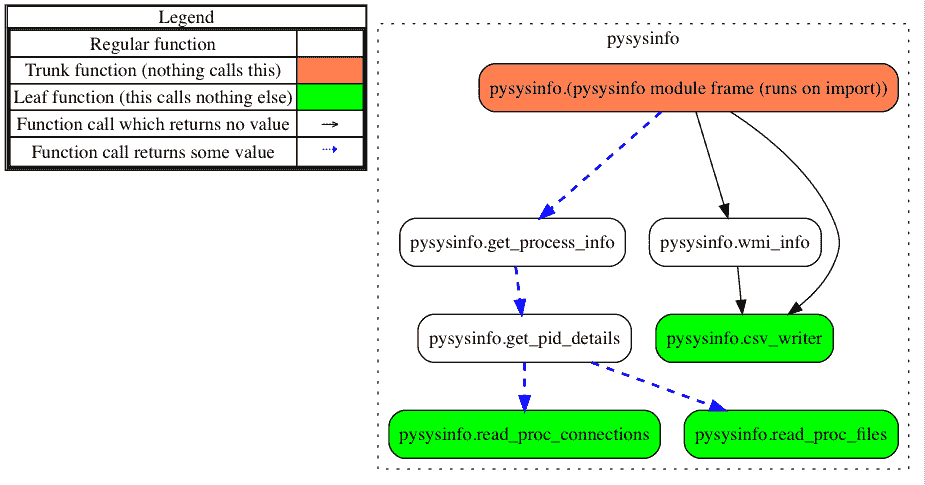
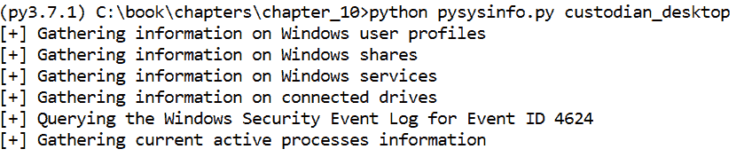

# 第十章：快速筛查系统

在今天这个充满挑战的新时代里，事件往往会在没有快速有效响应的情况下迅速失控，因此，DFIR 专业人士必须能够查询主机的相关信息，如系统上运行的进程和服务，从而做出明智的调查决策，快速遏制事件。虽然我们通常可以在机器的取证镜像上收集这些信息，但其中一些信息是易失性的，或者可能需要快速收集，而不是等待创建取证镜像。

在本章中，我们将开发一个与现代操作系统兼容的单一脚本，并使用各种第一方和第三方库，提取脚本所运行系统的有用信息。通过一些修改，这个脚本可以在一个环境中使用，通过将其部署到多个主机，收集可能对调查有价值的基本系统信息。例如，在涉及恶意软件的事件中，如果恶意软件在成功感染主机时创建了一个新进程，那么可以使用这些信息快速确定被感染的主机范围，并在进一步调查时找出最早被感染的机器。

为了实现一个跨操作系统兼容的脚本，我们将依赖一个名为`psutil`的第三方模块来获取运行中进程的信息，而对于 Windows 操作系统的更多操作系统特定情报，将使用**Windows 管理界面**（**WMI**）进行提取。

在本章中，我们将涵盖以下主题：

+   使用`psutil`提取与操作系统无关的进程信息

+   使用 Python 及`wmi`和`pywin32`模块通过查询 WMI 与 Windows 系统交互

+   创建一个多平台的初步筛查文档收集脚本

本章的代码是使用 Python 2.7.15 和 Python 3.7.1 开发和测试的。

# 理解系统信息的价值

那么，为什么要收集系统信息呢？并非所有的调查都围绕用户及其在系统上采取的行动展开，而是关注系统本身以及它的行为。例如，在上一节中，我们讨论了运行中的进程和创建的服务如何根据特定场景的妥协指示符提供信息。然而，正如 DFIR 专业人士所知，系统信息的来源也可以为用户活动提供洞察，比如当前连接到机器的磁盘或查询事件日志中的用户登录信息。

在本书的第一版中，本章最初展示了一个我们开发的 `keylogger` 脚本，目的主要是演示如何使用操作系统 API。对于第二版，我们决定保持这一重点不变，但以一种更具法医相关性的方式应用它。让我们深入探讨并讨论第三方库。我们将需要从 `psutil` 开始开发这个脚本。

# 使用 psutil 查询操作系统无关的进程信息

`psutil` 模块（版本 5.4.5）是一个跨平台库，能够收集不同操作系统的各种系统信息，适用于 32 位和 64 位架构。虽然我们使用此库从运行脚本的主机系统中提取进程信息，但请注意，这个库能够提取的系统信息远不止运行中的进程。

让我们通过一些示例来了解，虽然其中一些我们在脚本中不会利用，但首先使用 `pip` 安装该库：

```
pip install psutil==5.4.5
```

我们可以使用 `pids()` 函数获取活动进程 ID 的列表，然后使用 PID 收集该进程的更多信息。例如，在以下代码块中，我们选择 PID 列表中的第一个 PID，PID 为 62，创建一个 PID 为 62 的进程对象，并使用各种函数来显示其名称、父 PID 和打开的文件。

请注意，对于某些函数，例如 `open_files()` 方法，您需要在提升权限的命令提示符下运行命令：

```
>>> import psutil
>>> pids = psutil.pids()
>>> pids[0]
62
>>> proc = psutil.Process(pids[0])
>>> proc.is_running()
True
>>> proc.name()
syslogd
>>> proc.ppid()
1
>>> proc.parent().name()
launchd
>>> proc.open_files()[0]
popenfile(path='/private/var/run/utmpx', fd=3)
```

虽然我们使用此库打印进程的详细信息，但我们也可以用它来执行其他任务。

例如，我们可以使用 `disk_partitions()` 函数收集有关连接磁盘的信息：

```
>>> for part in psutil.disk_partitions():
...     print("Device: {}, Filesystem: {}, Mount: {},"
...           " Size: {}, Disk Used: {}%".format(
...                 part[0], part[2], part[1], 
...                 psutil.disk_usage(part[1])[0], 
...                 psutil.disk_usage(part[1])[3]))
...
Device: /dev/disk1s1, Filesystem: apfs, Mount: /, Size: 500068036608, Disk Used: 82.9%
```

此外，我们还可以使用 `users()` 函数识别系统上的用户配置文件以及用户会话的启动时间：

```
>>> psutil.users()[0].name
PyForensics
>>> psutil.users()[0].started
1548086912.0
>>> from datetime import datetime
>>> print(datetime.utcfromtimestamp(psutil.users()[0].started))
2019-01-21 16:08:32
```

您可以通过阅读文档页面了解更多关于此库的信息：[`pypi.org/project/psutil/`](https://pypi.org/project/psutil/)。

# 使用 WMI

`wmi` 库由 Tim Golden 维护，是对下一个部分中将介绍的 `pywin32` 模块的封装，允许程序员与 WMI API 进行交互，并为程序员提供大量与 Windows 系统相关的重要信息。您甚至可以使用此库查询网络上的其他 Windows 系统。

首先，在命令提示符下执行以下命令使用 `pip` 安装 WMI：

```
pip install WMI==1.4.9
```

不言而喻，我们将在这里讨论的示例只适用于 Windows 系统，因此应在 Windows 系统上执行。让我们首先看看如何查询正在运行的服务。

我们需要创建一个 WMI 对象，然后使用 `query()` 方法来识别正在运行的服务：

```
>>> import wmi
>>> conn = wmi.WMI()
>>> for service in conn.query(
...        "SELECT * FROM Win32_Service WHERE State='Running'"):
...    print("Service: {}, Desc: {}, Mode: {}".format(
...         service.Name, service.Description, service.StartMode))
...
Service: PlugPlay, Desc: Enables a computer to recognize and adapt to hardware changes with little or no user input. Stopping or disabling this service will result in system instability., Mode: Manual
```

例如，我们可以使用该模块识别与系统关联的已安装打印机。

以下示例中的部分输出，表示为字符串 `[...]`，已被清除：

```
>>> for printer in conn.Win32_Printer():
...    print(printer.Name)
...
Microsoft XPS Document Writer
Microsoft Print to PDF
HP[...] (HP ENVY Photo 6200 series)
Fax
```

最后，本文中使用的这个库的一个非常有用的功能是，它允许我们查询 Windows 事件日志。

在下面的示例中，我们查询`OAlerts.evtx`文件，这是一个存储 Microsoft Office 警报的事件日志，并打印出每个事件的消息和事件生成的时间。为了简洁起见，这里仅展示一条这样的消息：

```
>>> for event in conn.query(
            "SELECT * FROM Win32_NTLogEvent WHERE Logfile='OAlerts'"):
...     print(event.Message, event.TimeGenerated)
...
Microsoft Excel
Want to save your changes to 'logonevent.csv'?
P1: 153042
P2: 15.0.5101.1000
P3:
P4:
20190121031627.589966-000
```

我们可以讨论这个库的许多其他功能；然而，我们邀请你探索并尝试它的功能。在本章的脚本中，我们将介绍更多这个库的示例。

本模块需要`pywin32`库，它是一个非常强大的库，能够让开发者访问多个不同的 Windows API，相关内容将在下一节简要介绍。需要理解的是，我们只是初步接触这些库的表面，重点是我们的脚本目标。花些时间阅读这些库的文档并尝试它们的功能，因为在任何与 Windows 操作系统交互的脚本中，你可能会发现这些库非常有用。

在文档页面[`pypi.org/project/WMI/`](https://pypi.org/project/WMI/)上了解更多关于`wmi`库及其功能的信息。使用`wmi`库的示例食谱可以在此处找到：[`timgolden.me.uk/python/wmi/cookbook.html`](http://timgolden.me.uk/python/wmi/cookbook.html)。

# `pywin32`模块的功能是什么？

对 Python 来说，最通用的 Windows API 库之一是`pywin32`（版本 224）。该项目由 Mark Hammond 托管在 GitHub（之前托管在 SourceForge）上，是一个开源项目，社区成员共同贡献。通过这个库，Windows 提供了许多不同的 API。这些功能允许开发者为应用程序构建 GUI，利用内置的身份验证方法，并与硬盘和其他外部设备进行交互。

`pywin32`模块可以通过在命令提示符中执行以下命令使用`pip`安装：

```
pip install pywin32==224
```

Windows 定义了一个**组件对象模型**（**COM**），它允许应用程序之间共享信息。COM 可以是**动态链接库**（**DLL**）或其他二进制文件格式。这些模块的设计使得任何编程语言都可以解读这些信息。例如，这一套指令可以让基于 C++的程序和基于 Java 的程序共享同一资源，而无需为每种语言提供一个单独的版本。COM 通常只存在于 Windows 平台上，尽管如果需要，它们也可以移植到 UNIX 平台上。`win32com`库是`pywin32`库的一部分，允许我们在 Windows 中与 COM 交互，并由`wmi`库用于获取我们请求的信息。

`pywin32`库可以在 GitHub 上找到：[`github.com/mhammond/pywin32`](https://github.com/mhammond/pywin32)。

# 快速检查系统状态 – pysysinfo.py

在我们已经介绍了收集易失性信息的重要性以及我们将使用的库之后，现在我们准备深入本章的重点——`pysysinfo.py` 脚本。该脚本由多个函数组成，其中大多数与 `psutil` 库相关，但其核心首先识别它运行的系统类型，如果该系统使用的是 Windows 操作系统，则会运行一个额外的函数，使用之前讨论过的 WMI API。您可以在下图中看到各个函数是如何相互作用并组成本章剩余部分讨论的代码：



该脚本是在 Python 2.7.15 和 3.7.1 上开发和测试的。和我们开发的任何脚本一样，我们必须从导入必要的库开始，才能成功执行我们编写的代码。你会注意到一些常见的导入；然而，有一些特别引人注目——尤其是第 5 行和第 8 行的 `platform` 模块和 `psutil`。你可能还会注意到，这组导入中缺少了 `wmi`。你将在脚本的后面几段理解为什么稍后会导入这个库。该脚本包含七个不同的函数，其中大多数用于处理来自 `psutil` 库的数据。

请注意，`return_none()` 函数将在下一个代码块中介绍，而不是新开一个小节，因为它是一个一行的函数，简单地返回 `None` 给调用代码：

```
002 from __future__ import print_function
003 import argparse
004 import os
005 import platform
006 import sys
007 
008 import psutil
009     if sys.version_info[0] == 2:
010 import unicodecsv as csv
011     elif sys.version_info[0] == 3:
012 import csv
...
050 def return_none():
051    """
052    Returns a None value, but is callable.
053    :return: None.
054    """
055    return None
...
058 def read_proc_connections(proc):
...
081 def read_proc_files(proc):
...
101 def get_pid_details(pid):
...
158 def get_process_info():
...
172 def wmi_info(outdir):
...
279 def csv_writer(data, outdir, name, headers, **kwargs):
```

`platform` 模块是我们之前没有涉及的，它是标准库的一部分，也提供了一些关于运行该脚本的系统的信息。在本例中，我们仅使用此库来确定执行脚本的主机系统的操作系统。

通过阅读文档页面了解更多关于 `platform` 模块的信息：[`docs.python.org/3/library/platform.html`](https://docs.python.org/3/library/platform.html)。

接下来是脚本设置，我们有参数解析器，与其他章节相比，它显得相当简单，仅包含一个位置参数 `OUTPUT_DIR`，用于指定写入处理后数据的输出目录。

如果目标输出目录不存在，我们将在第 323 行使用 `os.makedirs()` 函数创建它：

```
313 if __name__ == '__main__':
314     parser = argparse.ArgumentParser(description=__description__,
315                     epilog='Developed by ' +
316                     __author__ + ' on ' +
317                     __date__)
318     parser.add_argument('OUTPUT_DIR',
319     help="Path to output directory. Will create if not found.")
320     args = parser.parse_args()
321
322     if not os.path.exists(args.OUTPUT_DIR):
323         os.makedirs(args.OUTPUT_DIR)
```

这里的做法与常规稍有不同。在第 325 行，使用 `platform.system()` 函数，我们检查脚本是否在 Windows 系统上执行。如果是，我们尝试导入 `wmi` 模块，如果导入成功，则调用 `wmi_info()` 方法。正如之前提到的，我们在这里导入 `wmi` 库是有原因的。当导入 `wmi` 库时，它还会加载 `pywin32` 模块，特别是 `win32com.client` 模块。在非 Windows 系统上，由于没有安装 `pywin32` 库，这可能会导致 `ImportError` 异常。因此，我们只有在知道脚本在 Windows 机器上执行时才会尝试导入 `wmi`。仅在需要时导入库也是个不错的主意：

```
325     if 'windows' in platform.system().lower():
326         try:
327             import wmi
328         except ImportError:
329             print("Install the wmi and pywin32 modules. "
330             "Exiting...")
331             sys.exit(1)
332         wmi_info(args.OUTPUT_DIR)
```

无论系统是否为 Windows，我们都会运行下一个代码块中的代码。在第 336 行，我们调用 `get_process_info()` 方法，最终以字典的形式返回进程数据。在第 337 行，我们创建了一个列表，包含所需的列名和 `pid_data` 字典的键。最后，在第 341 行，我们调用 `csv_writer()` 方法，传入数据、期望的输出目录、输出名称、`fields` 列表以及一个关键字参数。

稍后我们将看到该关键字参数的作用：

```
334     # Run data gathering function
335     print("[+] Gathering current active processes information")
336     pid_data = get_process_info()
337     fields = ['pid', 'name', 'exe', 'ppid', 'cmdline',
338         'username', 'cwd', 'create_time', '_errors']
339 
340     # Generate reports from gathered details
341     csv_writer(pid_data, args.OUTPUT_DIR, 'pid_summary.csv',
342         fields, type='DictWriter')
```

正如你可能已经注意到的，我们并没有为这个脚本编写 `main()` 函数，而是直接跳入了对 `get_process_info()` 方法的回顾。我们将在本章的最后讨论特定于 Windows 的函数 `wmi_info()`。

# 理解 `get_process_info()` 函数

就功能而言，`get_process_info()` 函数相对简单，主要用于设置其余代码的执行。在第 166 行，我们创建了 `pid_info` 字典，最终将在第 336 行返回给调用函数，并包含提取的进程数据。接下来，我们使用 `psutil.pids()` 方法作为迭代器，正如我们在之前展示该库时所展示的那样，我们将每个进程 ID 传递给 `get_pid_details()` 方法，并将返回的数据存储在 `pid_info` 字典中，PID 作为字典的键。

接下来，让我们看一下 `get_pid_details()` 函数：

```
158 def get_process_info():
159     """
160     Gather details on running processes within the system.
161     :return pid_info: A dictionary containing details of
162     running processes.
163     """
164 
165     # List of PIDs
166     pid_info = {}
167     for pid in psutil.pids():
168         pid_info[pid] = get_pid_details(pid)
169     return pid_info
```

# 了解 `get_pid_details()` 函数

`get_pid_details()` 方法开始收集每个传递给它的 PID 的信息。对于每个 PID，我们创建一个字典 `details`，该字典预先填充了我们可以使用 `psutil` 库提取值的相关键。字典的键被初始化为占位符值，大多数是空字符串和空列表：

```
101 def get_pid_details(pid):
102     """
103     Gather details on a specific pid.
104     :param pid: an integer value of a pid to query for
105     additional details.
106     :return details: a dictionary of gathered information
107     about the pid.
108     """
109     details = {'name': '', 'exe': '', 'cmdline': '', 'pid': pid,
110                'ppid': 0, 'status': '', 'username': '',
111                'terminal': '', 'cwd': '', 'create_time': '',
112                'children': [], # list of pid ints
113                'threads': [], # list of thread ints
114                'files': [], # list of open files
115                'connections': [], # list of network connections
116                '_errors': []
117     }
```

接下来，在第 118 行，我们进入一个`try`和`except`块，尝试为每个提供的 PID 创建一个`Process`对象。在这种情况下，第 120 行和第 124 行有两个不同的异常处理子句，分别处理没有与提供的 PID 匹配的进程（例如，如果进程在脚本执行后立即关闭）或操作系统错误的情况。在发生这种异常时，错误会被附加到`details`字典中，并将该字典返回给调用函数。

与其因某个进程的问题导致脚本崩溃或停止，脚本会继续执行，并将在脚本生成的 CSV 报告中提供这些错误作为一列。

```
118     try:
119         proc = psutil.Process(pid)
120     except psutil.NoSuchProcess:
121         details['_errors'].append(
122             (pid, 'Process no longer found'))
123         return details
124     except OSError:
125         details['_errors'].append((pid, 'OSError'))
126         return details
```

如果为提供的 PID 创建了一个`Process`对象，我们接着会遍历第 128 行中`details`字典中的每个键，如果该键不是`pid`或`_errors`，我们会尝试使用第 144 行的`getattr()`函数获取与该键关联的值。不过，这里有一些例外情况；例如，我们为`children`、`threads`、`connections`或`files`这些键编写了特定的`elif`语句。在处理`children`和`threads`键时，我们在第 134 行和第 138 行使用了列表推导式，分别将子进程的 PID 和线程的 ID 与`children`和`threads`键相关联。

对于`connections`和`files`这两个键，我们开发了单独的函数来提取所需的信息，并将返回的数据存储到`details`字典中的相应键下。最后，在第 145、148 和 151 行，我们创建了可能在条件语句中出现的异常，处理例如缺少足够权限的情况（例如，如果脚本在非提升权限的提示符下运行）、进程不存在或操作系统发生错误的情况：

```
128     for key in details:
129         try:
130             if key in ('pid', '_errors'):
131                 continue
132             elif key == 'children':
133                 children = proc.children()
134                 details[key] = [c.pid for c in children]
135 
136             elif key == 'threads':
137                 threads = proc.threads()
138                 details[key] = [t.id for t in threads]
139             elif key == 'connections':
140                 details[key] = read_proc_connections(proc)
141             elif key == 'files':
142                 details[key] = read_proc_files(proc)
143             else:
144                 details[key] = getattr(proc, key, return_none)()
145         except psutil.AccessDenied:
146             details[key] = []
147             details['_errors'].append((key, 'AccessDenied'))
148         except OSError:
149             details[key] = []
150             details['_errors'].append((key, 'OSError'))
151         except psutil.NoSuchProcess:
152             details['_errors'].append(
153             (pid, 'Process no longer found'))
154             break
```

如前所述，对于`connections`和`files`这两个键，我们调用了单独的函数来处理它们。现在我们来看第一个函数的实现。

# 使用`read_proc_connections()`函数提取进程连接属性

`read_proc_connections()`函数定义在第 58 行，首先创建一个空的列表`conn_details`，该列表将存储每个 PID 连接的详细信息：

```
058 def read_proc_connections(proc):
059     """
060     Read connection properties from a process.
061     :param proc: An object representing a running process.
062     :return conn_details: A list of process connection
063     properties.
064     """
065     conn_details = []
```

对于提供的每个连接，我们会创建一个`conn_items`字典，并在其中存储每个连接的详细信息，包括连接状态、本地和远程的 IP 地址和端口。如前所述，我们使用`getattr()`方法，查询指定对象的命名属性，并将返回的值存储到我们的字典中。如果命名对象不存在，我们使用`None`或空字符串作为默认值，这些默认值被定义为`getattr()`函数的第三个输入。

然后，我们将每个连接的详细信息字典追加到`conn_details`列表中，在此过程完成后，`conn_details`列表本身将被返回给调用函数：

```
066     for conn in proc.connections():
067         conn_items = {}
068         conn_items['fd'] = getattr(conn, 'fd', None)
069         conn_items['status'] = getattr(conn, 'status', None)
070         conn_items['local_addr'] = "{}:{}".format(
071             getattr(conn.laddr, 'ip', ""), getattr(
072                 conn.laddr, 'port', ""))
073         conn_items['remote_addr'] = "{}:{}".format(
074             getattr(conn.raddr, 'ip', ""), getattr(
075                 conn.raddr, 'port', ""))
076 
077         conn_details.append(conn_items)
078     return conn_details
```

# 使用 read_proc_files()函数获取更多的进程信息

在 81 行定义的`read_proc_files()`方法遵循了与前面讨论的类似模式。基本上，在 88 行，我们遍历与进程相关的所有打开的文件，并使用`getattr()`方法尝试提取每个打开文件的信息，如其路径和模式。

我们在提取每个打开文件的所有值并将数据插入到`file_details`列表后返回该列表：

```
081 def read_proc_files(proc):
082     """
083     Read file properties from a process.
084     :param proc: An object representing a running process.
085     :return file_details: a list containing process details.
086     """
087     file_details = []
088     for handle in proc.open_files():
089         handle_items = {}
090         handle_items['fd'] = getattr(handle, 'fd', None)
091         handle_items['path'] = getattr(handle, 'path', None)
092         handle_items['position'] = getattr(
093             handle, 'position', None)
094         handle_items['mode'] = getattr(handle, 'mode', None)
095 
096         file_details.append(handle_items)
097 
098     return file_details
```

# 使用 wmi_info()函数提取 Windows 系统信息

在 172 行定义的`wmi_info()`函数，首先定义了一个字典，用来存储通过 WMI API 查询到的各种信息类型。

类似地，在 185 行，我们创建了 WMI 对象并将其赋值给变量`conn`，这就是我们将要进行查询的对象：

```
172 def wmi_info(outdir):
173     """
174     Gather information available through Windows Management
175     Interface. We recommend extending this script by adding
176     support for other WMI modules -- Win32_PrintJob,
177     Win32_NetworkAdapterConfiguration, Win32_Printer,
178     Win32_PnpEntity (USB).
179     :param outdir: The directory to write CSV reports to.
180     :return: Nothing.
181     """
182 
183     wmi_dict = {"Users": [], "Shares": [], "Services": [],
184         "Disks": [], "Event Log": []}
185     conn = wmi.WMI()
```

在这些代码块中，你会注意到我们调用了`conn`对象的特定方法，但在其他地方，我们使用了`query()`方法。请注意，在某些情况下，两者都是可行的。例如，我们可以调用`conn.Win32_UserAccount()`，也可以使用`conn.query("SELECT * from Win32_UserAccount")`。`query()`方法为我们提供了额外的灵活性，因为我们可以为查询提供更多的逻辑，这将在查询特定事件日志条目时看到。

从 190 行的`print`语句开始，我们开始使用`wmi`库收集信息。在 191 行通过遍历每个用户配置文件时，我们将用户帐户的各种属性追加到`wmi_dict`的`users`列表中：

```
187     # See attributes for a given module like so: for user in
188     # conn.Win32_UserAccount(); user._getAttributeNames()
189 
190     print("[+] Gathering information on Windows user profiles")
191     for user in conn.Win32_UserAccount():
192         wmi_dict["Users"].append({
193             "Name": user.Name, "SID": user.SID,
194             "Description": user.Description,
195             "InstallDate": user.InstallDate,
196             "Domain": user.Domain,
197             "Local Account": user.LocalAccount,
198             "Password Changeable": user.PasswordChangeable,
199             "Password Required": user.PasswordRequired,
200             "Password Expires": user.PasswordExpires,
201             "Lockout": user.Lockout
202         })
```

我们在下面的代码块中开始使用`query()`方法，在 205 行列出所有的（`*`）共享。对于每个共享，我们将其各种详细信息追加到`wmi_dict`字典中的相应列表。在 213 行，我们再次使用`query()`方法，这次是针对服务，但仅捕获当前正在运行的服务。

希望你能理解`query()`方法的价值，因为它为开发者提供了很大的灵活性，可以只返回符合指定标准的数据，从而过滤掉大量无用数据：

```
204     print("[+] Gathering information on Windows shares")
205     for share in conn.query("SELECT * from Win32_Share"):
206         wmi_dict["Shares"].append({
207             "Name": share.Name, "Path": share.Path,
208             "Description": share.Description,
209             "Status": share.Status,
210             "Install Date": share.InstallDate})
211
212     print("[+] Gathering information on Windows services")
213     for service in conn.query(
214             "SELECT * FROM Win32_Service WHERE State='Running'"):
215         wmi_dict["Services"].append({
216             "Name": service.Name,
217             "Description": service.Description,
218             "Start Mode": service.StartMode,
219             "State": service.State,
220             "Path": service.PathName,
221             "System Name": service.SystemName})
```

在 224 行，我们开始通过使用`conn.Win32_DiskDrive()`函数迭代每个驱动器来收集已连接驱动器的详细信息。为了收集我们想提取的所有信息，我们还需要迭代每个磁盘的每个分区和逻辑卷；因此，225 行和 227 行的额外`for`循环。

一旦我们获得了`disk`、`partition`和`logical_disk`对象，我们就使用它们，并将一个字典追加到`wmi_dict`字典中相应的列表中，字典包含每个磁盘、分区和卷的各种属性：

```
223     print("[+] Gathering information on connected drives")
224     for disk in conn.Win32_DiskDrive():
225         for partition in disk.associators(
226                 "Win32_DiskDriveToDiskPartition"):
227             for logical_disk in partition.associators(
228                     "Win32_LogicalDiskToPartition"):
229                 wmi_dict["Disks"].append({
230                     "Physical Disk Name": disk.Name,
231                     "Bytes Per Sector": disk.BytesPerSector,
232                     "Sectors": disk.TotalSectors,
233                     "Physical S/N": disk.SerialNumber,
234                     "Disk Size": disk.Size,
235                     "Model": disk.Model,
236                     "Manufacturer": disk.Manufacturer,
237                     "Media Type": disk.MediaType,
238                     "Partition Name": partition.Name,
239                     "Partition Desc.": partition.Description,
240                     "Primary Partition": partition.PrimaryPartition,
241                     "Bootable": partition.Bootable,
242                     "Partition Size": partition.Size,
243                     "Logical Name": logical_disk.Name,
244                     "Volume Name": logical_disk.VolumeName,
245                     "Volume S/N": logical_disk.VolumeSerialNumber,
246                     "FileSystem": logical_disk.FileSystem,
247                     "Volume Size": logical_disk.Size,
248                     "Volume Free Space": logical_disk.FreeSpace})
```

接下来，在 253 行，我们创建了一个变量`wmi_query`，用来存储我们将用来从`Security`事件日志中提取事件 ID 为 4624 的所有事件的字符串。

请注意，在测试中观察到，脚本需要从提升的命令提示符运行，以便能够从`Security`事件日志中提取信息。

与其他查询类似，我们迭代返回的结果并将各种属性追加到`wmi_dict`字典中的相应列表中：

```
250     # Query for logon events type 4624
251     print("[+] Querying the Windows Security Event Log "
252     "for Event ID 4624")
253     wmi_query = ("SELECT * from Win32_NTLogEvent WHERE Logfile="
254         "'Security' AND EventCode='4624'")
255     for logon in conn.query(wmi_query):
256         wmi_dict["Event Log"].append({
257             "Event Category": logon.CategoryString,
258             "Event ID": logon.EventIdentifier,
259             "Time Generated": logon.TimeGenerated,
260             "Message": logon.Message})
```

最后，在提取所有信息并将其存储在`wmi_dict`字典中后，我们开始调用`csv_writer()`函数，将每种数据类型的电子表格写入输出目录。传递给`csv_writer()`的大部分值不言自明，包括特定工件的数据（即`Users`键下的用户配置文件）、输出目录和输出文件名。最后一个参数是一个按字母顺序排序的工件特定数据的键列表，作为我们 CSV 文件的列标题。

你还会注意到，我们有一个`try`和`except`块来处理写入事件日志数据。这是因为，如前所述，如果脚本没有从提升的命令提示符运行，`Event Log`键可能会包含一个空列表：

```
262     csv_writer(wmi_dict["Users"], outdir, "users.csv",
263         sorted(wmi_dict["Users"][0].keys()))
264     csv_writer(wmi_dict["Shares"], outdir, "shares.csv",
265         sorted(wmi_dict["Shares"][0].keys()))
266     csv_writer(wmi_dict["Services"], outdir, "services.csv",
267         sorted(wmi_dict["Services"][0].keys()))
268     csv_writer(wmi_dict["Disks"], outdir, "disks.csv",
269         sorted(wmi_dict["Disks"][0].keys()))
270     try:
271         csv_writer(wmi_dict["Event Log"],outdir, "logonevent.csv", 
272                    sorted(wmi_dict["Event Log"][0].keys()))
273     except IndexError:
274         print("No Security Event Log Logon events (Event ID "
275             "4624). Make sure to run the script in an escalated "
276             "command prompt")
```

# 使用`csv_writer()`函数写入我们的结果

我们定义的`csv_writer()`，在第 279 行正常开始，通过根据正在执行脚本的 Python 版本创建一个`csvfile`文件对象。不同之处在于，函数定义中列出了`**kwargs`参数。该参数的`**`部分表示这个函数接受关键字参数。在 Python 中，按惯例，关键字参数被称为`kwargs`。

我们在这个函数中使用关键字参数，以区分使用常规的`csv.writer()`方法和`csv.DictWriter()`方法。这是必要的，因为来自`wmi_info()`和`get_process_info()`函数的 CSV 调用分别传递了列表和字典。

在`csv_writer()`方法中使用额外的逻辑解决了我们的问题，我们也可以通过让`wmi_info()`和`get_process_info()`函数返回结构相似的对象来解决这个问题：

```
279 def csv_writer(data, outdir, name, headers, **kwargs):
280     """
281     The csv_writer function writes WMI or process information
282     to a CSV output file.
283     :param data: The dictionary or list containing the data to
284         write to the CSV file.
285     :param outdir: The directory to write the CSV report to.
286     :param name: the name of the output CSV file.
287     :param headers: the CSV column headers.
288     :return: Nothing.
289     """
290     out_file = os.path.join(outdir, name)
291 
292     if sys.version_info[0] == 2:
293         csvfile = open(out_file, "wb")
294     elif sys.version_info[0] == 3:
295         csvfile = open(out_file, "w", newline='',
296             encoding='utf-8')
```

正如你在第 298 行看到的，我们检查是否传入了名为`type`的关键字参数。由于我们只在第 341 行调用此函数时才这样做，因此我们知道这意味着什么。我们应该使用`csv.DictWriter`方法。在第 341 行，你会注意到我们将`type`关键字参数分配给了`DictWriter`字符串。然而，在这种情况下，我们本可以传递任何任意的字符串，因为我们在这里根本没有使用它的值。实际上，我们只需要知道`type`关键字参数已经被赋值即可。

对于`get_process_info()`函数返回的字典，我们可以使用列表推导式来写出字典中每个条目的值。对于`wmi_info()`函数，我们需要首先遍历提供的列表中的每个条目，然后将每个提供的表头相关联的值写入 CSV 文件：

```
298     if 'type' in kwargs:
299         with csvfile:
300             csvwriter = csv.DictWriter(csvfile, fields,
301                 extrasaction='ignore')
302             csvwriter.writeheader()
303             csvwriter.writerows([v for v in data.values()])
304 
305     else:
306         with csvfile:
307             csvwriter = csv.writer(csvfile)
308             csvwriter.writerow(headers)
309             for row in data:
310                 csvwriter.writerow([row[x] for x in headers])
```

# 执行 pysysinfo.py

在下面的截图中，你可以看到在 Windows 系统上运行此脚本时输出的结果：

****

此外，在 Windows 系统上执行脚本后，连接的驱动器、共享、服务、进程、用户和登录事件的 CSV 文件将被创建在指定的输出目录中。以下是其中一个电子表格——用户配置文件电子表格的内容截图：


# 挑战

如*使用 WMI*部分所提到的，考虑通过能够查询远程 Windows 主机来扩展脚本的功能。类似地，`wmi`和`psutil`都提供了可以访问的附加信息，值得收集。尝试这两个库并收集更多信息，尤其是专注于收集非 Windows 系统的系统信息，这在当前版本的脚本中得到了更好的支持，感谢`wmi`库。

最后，对于一个更具挑战性的任务，考虑开发一个更有用的存储库来收集和查询数据。以我们为少数几个系统收集和展示数据的方式来说，效果很好，但当在数百台系统上运行时，这种方式的扩展性如何？想象一下，在一个网络上针对多个主机部署并运行修改版的此脚本，并将处理后的信息存储在一个集中式数据库中进行存储，更重要的是，作为更高效的查询收集数据的手段。

# 总结

在本章中，我们确认了系统信息的价值以及如何在实时系统上提取这些信息。通过使用`psutil`库，我们学习了如何以操作系统无关的方式提取进程信息。我们还简要介绍了如何使用 WMI API 从 Windows 操作系统获取更多信息。本项目的代码可以从 GitHub 或 Packt 下载，具体信息请参考*前言*部分。

在下一章中，我们将学习如何使用 Python 处理 Outlook 归档的`.pst`文件并创建其内容列表。
