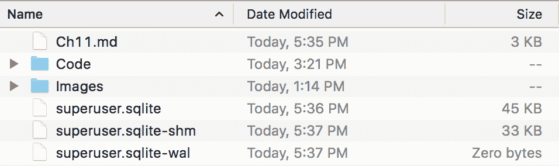
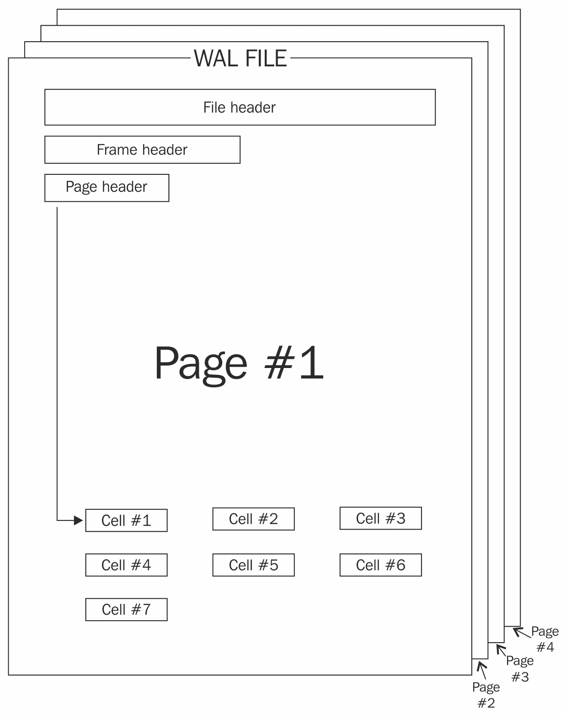
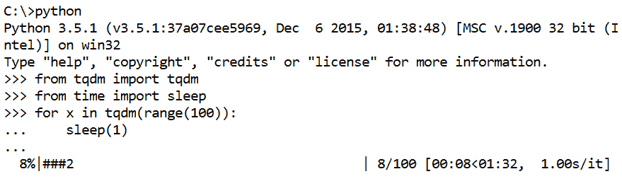
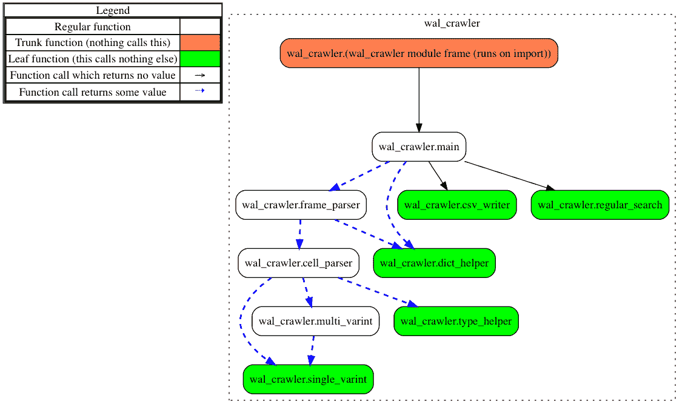
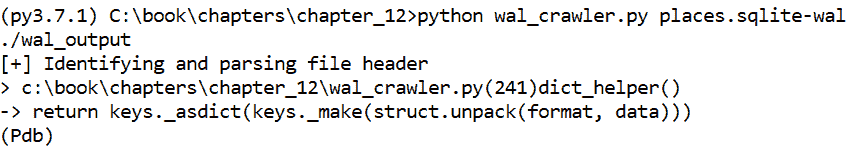
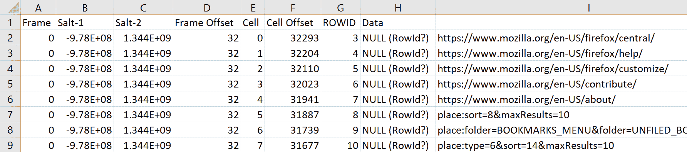
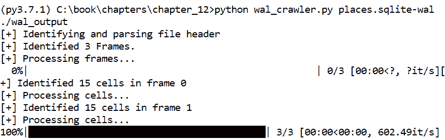
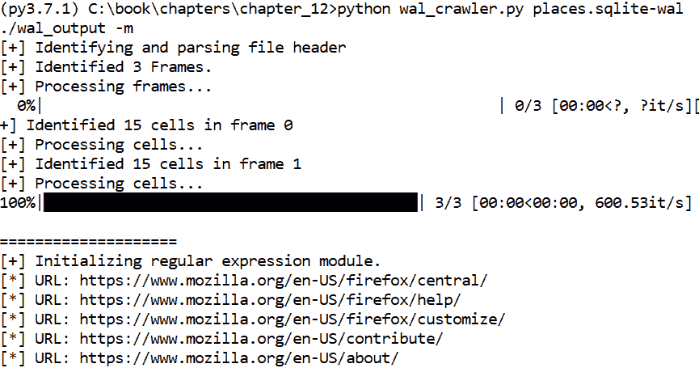

# 第十二章：恢复临时数据库记录

在本章中，我们将重新审视 SQLite 数据库，并检查一种叫做 **预写日志** (**WAL**) 的日志文件类型。由于其底层结构的复杂性，解析 WAL 文件比我们之前处理 SQLite 数据库时的任务要更具挑战性。没有现成的模块可以像我们使用 `sqlite3` 或 `peewee` 与 SQLite 数据库那样直接与 WAL 文件交互。相反，我们将依赖 `struct` 库以及理解二进制文件的能力。

一旦成功解析 WAL 文件，我们将利用 Python 中的正则表达式库 `re` 来识别潜在的相关取证数据。最后，我们将简要介绍使用第三方 `tqdm` 库创建进度条的另一种方法。通过几行代码，我们将实现一个功能齐全的进度条，能够向用户反馈程序执行情况。

WAL 文件可以包含已不再存在或尚未添加到 SQLite 数据库中的数据。它还可能包含修改记录的前一个副本，并为取证调查员提供有关数据库如何随时间变化的线索。

本章我们将探讨以下主题：

+   解析复杂的二进制文件

+   学习并利用正则表达式来定位指定的数据模式

+   通过几行代码创建一个简单的进度条

+   使用内建的 Python 调试器 `pdb` 快速排除代码故障

本章的代码在 Python 2.7.15 和 Python 3.7.1 中开发和测试。

# SQLite WAL 文件

在分析 SQLite 数据库时，检查员可能会遇到额外的临时文件。SQLite 有九种类型的临时文件：

+   回滚日志

+   主日志

+   语句日志

+   WAL

+   共享内存文件

+   TEMP 数据库

+   视图和子查询物化

+   临时索引

+   临时数据库

更多关于这些文件的详细信息，请参考 [`www.sqlite.org/tempfiles.html`](https://www.sqlite.org/tempfiles.html)，该页面对这些文件进行了更详细的描述。WAL 是这些临时文件之一，并且参与原子提交和回滚场景。只有设置了 WAL 日志模式的数据库才会使用预写日志方法。配置数据库使用 WAL 日志模式的 SQLite 命令如下：

```
PRAGMA journal_mode=WAL; 
```

WAL 文件与 SQLite 数据库位于同一目录中，并且文件名会在原始 SQLite 数据库文件名后附加 `-wal`。当连接到 SQLite 数据库时，会临时创建一个 WAL 文件。此 WAL 文件将包含对数据库所做的任何更改，而不会影响原始的 SQLite 数据库。使用 WAL 文件的优点包括并发和更快速的读/写操作。有关 WAL 文件的具体信息，请参见 [`www.sqlite.org/wal.html`](https://www.sqlite.org/wal.html)：



默认情况下，当 WAL 文件达到 1000 个页面或最后一个连接关闭时，WAL 文件中的记录会被提交到原始数据库。

WAL 文件在取证中具有相关性，原因有二：

+   审查数据库活动的时间线

+   恢复删除或更改的记录

Epilog 的创建者们写了一篇详细的文章，讲解了 WAL 文件在取证中的具体意义，文章可以在 [`digitalinvestigation.wordpress.com/2012/05/04/the-forensic-implications-of-sqlites-write-ahead-log/`](https://digitalinvestigation.wordpress.com/2012/05/04/the-forensic-implications-of-sqlites-write-ahead-log/) 阅读。通过了解 WAL 文件的重要性、为什么使用它们以及它们在取证中的相关性，让我们一起来分析其底层结构。

# WAL 格式和技术规格

WAL 文件是由包含嵌入式 B 树页面的帧组成，这些 B 树页面对应于实际数据库中的页面。我们不会深入讨论 B 树的工作原理。相反，我们将关注一些重要字节偏移量，以便更好地理解代码，并进一步展示 WAL 文件的取证相关性。

WAL 文件的主要组件包括以下内容：

+   WAL 头部（32 字节）

+   WAL 帧（页面大小）

+   帧头部（24 字节）

+   页面头部（8 字节）

+   WAL 单元格（可变长度）

请注意，WAL 帧的大小由页面大小决定，该页面大小可以从 WAL 头部提取。

以下图表展示了 WAL 文件的高层次结构：



让我们来看看 WAL 文件的每个高层次类别。一些结构的描述可以参考 [`www.sqlite.org/fileformat2.html`](https://www.sqlite.org/fileformat2.html)。

# WAL 头部

32 字节的 WAL 头部包含诸如页面大小、检查点数量、WAL 文件大小，以及间接地，WAL 文件中帧的数量等属性。以下表格详细列出了头部中存储的 8 个大端 32 位整数的字节偏移量和描述：

| **字节偏移量** | **值** | **描述** |
| --- | --- | --- |
| 0-3 | 文件签名 | 这是 `0x377F0682` 或 `0x377F0683`。 |
| 4-7 | 文件版本 | 这是 WAL 格式的版本，当前版本为 3007000。 |
| 8-11 | 数据库页面大小 | 这是数据库中页面的大小，通常为 1024 或 4096。 |
| 12-15 | 检查点编号 | 这是已发生的提交数量。 |
| 16-19 | 盐值-1 | 这是一个随每次提交递增的随机整数。 |
| 20-23 | 盐值-2 | 这是一个随每次提交而变化的随机整数。 |
| 24-27 | 校验和-1 | 这是头部校验和的第一部分。 |
| 28-31 | 校验和-2 | 这是头部校验和的第二部分。 |

文件签名应该始终是 `0x377F0682` 或 `0x377F0683`。数据库页面大小是一个非常重要的值，因为它允许我们计算 WAL 文件中有多少个帧。例如，在使用 4,096 字节页面的 20,632 字节 WAL 文件中，有 5 个帧。为了正确计算帧的数量，我们需要在以下公式中考虑 32 字节的 WAL 头部和 24 字节的 WAL 帧头部：

```
(WAL File Size - 32) / (WAL Page Size + 24) 
20,600 / 4,120 = 5 frames 
```

检查点编号表示触发了多少次提交，可能是自动触发的，也可能是通过执行 PRAGMA `wal_checkpoint` 手动触发的。现在，让我们关注 Salt-1 值。在创建数据库活动时间线时，这是头部中最重要的值。Salt-1 值会随着每次提交而增加。除此之外，每个帧在提交时会在自己的头部存储当前的盐值。如果记录被修改并重新提交，较新的记录会有比前一个版本更大的 Salt-1 值。因此，我们可能会在 WAL 文件中看到某个记录在不同时间点的多个快照。

假设我们有一个包含一个表的数据库，存储与员工姓名、职位、薪水等相关的数据。早期，我们有一个记录，记载了 23 岁的自由职业摄影师彼得·帕克，薪水为 45,000 美元。几次提交后，帕克的薪水变为 150,000 美元，而且在同一次提交中，帕克的名字更新为蜘蛛侠：

| **帧** | **Salt-1** | **行 ID** | **员工姓名** | **职位** | **薪水** |
| --- | --- | --- | --- | --- | --- |
| 0 | -977652151 | 123 | 蜘蛛侠？ | 自由职业 | 150,000 |
| 1 | -977652151 | 123 | 彼得·帕克 | 自由职业 | 150,000 |
| 2 | -977652150 | 123 | 彼得·帕克 | 自由职业 | 45,000 |

因为这些条目共享相同的**行 ID**，我们知道这是在主表中记录 123 的三个不同版本。为了识别该记录的最新版本，我们需要检查 Salt-1 值。根据之前的讨论和记录的 Salt-1 值，我们知道帧 0 和 1 中的记录是最新的记录，并且自从该记录第一次添加到数据库后，已经进行了两次提交。

我们如何知道帧 0 和帧 1 中哪个记录是最新的？如果我们处理的是同一次提交中有两个记录的情况，较早的帧中的记录被认为是最新的。这是因为 WAL 文件会将新帧添加到文件的开头，而不是结尾。因此，帧 0 中的记录是最新的，而帧 2 中的记录是最旧的。

请注意，每个帧中可以有多个记录。较新的记录位于帧的开头。

在数据库中，我们只会看到该记录的最新版本，但在 WAL 文件中，我们可以看到之前的版本。只要 WAL 文件存在，我们仍然可以看到这些信息，即使带有行 ID 123 的记录已经从主数据库中删除。

# WAL 帧

WAL 帧本质上是一个 B 树结构的页面，包含一个帧头。帧头包含 6 个大端 32 位整数：

| **字节偏移量** | **值** | **描述** |
| --- | --- | --- |
| 0-3 | 页面编号 | 这是 WAL 文件中的帧或页面编号。 |
| 4-7 | 数据库大小 | 这是提交记录中数据库的页面数大小。 |
| 8-11 | Salt-1 | 这是从 WAL 头部在写入帧时复制过来的。 |
| 12-15 | Salt-2 | 这是从 WAL 头部在写入帧时复制过来的。 |
| 16-19 | 校验和-1 | 这是包括此帧在内的累计校验和。 |
| 20-23 | 校验和-2 | 这是校验和的第二部分。 |

Salt-1 值只是创建帧时从 WAL 头部复制的 Salt-1 值。我们使用存储在帧中的这个值来确定前一个示例中的事件时间。页面编号是从零开始的整数，其中零是 WAL 文件中的第一个帧。

在帧头之后是数据库中单个页面的内容，从页面头部开始。页面头部由两个 8 位和三个 16 位的大端整数组成：

| **字节偏移量** | **值** | **描述** |
| --- | --- | --- |
| 0 | B-树标志 | 这是 B 树节点的类型 |
| 1-2 | 自由块 | 这是页面中的自由块数量。 |
| 3-4 | 单元格数量 | 这是页面中的单元格数量。 |
| 5-6 | 单元格偏移量 | 这是相对于该头部开始位置的第一个单元格的字节偏移量。 |
| 7 | 碎片 | 这些是页面中碎片化的自由块数量。 |

有了这些信息，我们现在知道了我们处理的单元格数量和第一个单元格的偏移量。在该头部之后，是*N*个大端 16 位整数，指定每个单元格的偏移量。单元格的偏移量是相对于页面头部的开始位置的。

# WAL 单元格和 varints

每个单元格由以下组件组成：

+   负载长度（varint）

+   行 ID（varint）

+   负载头部：

    +   负载头部长度（varint）

    +   序列类型数组（varints）

+   负载

负载长度描述了单元格的总体长度。行 ID 是实际数据库中对应该记录的唯一键。负载头部中的序列类型数组包含负载中数据的长度和类型。我们可以通过减去负载头部长度来确定单元格中实际记录的数据的字节数。

请注意，这些值大多数是变长整数（varints），即可变长度整数。SQLite 中的变长整数是一种根据每个字节的第一个位大小变化，范围从 1 到 9 字节不等的整数。如果第一个位被设置为 1，则下一个字节是变长整数的一部分。这个过程会持续，直到你得到一个 9 字节的变长整数，或者字节的第一个位没有被设置。对于所有小于 128 的 8 位整数，第一个位没有被设置。这使得在这种文件格式中，较大的数字能够灵活地存储。关于变长整数的更多细节可以参考[`www.sqlite.org/src4/doc/trunk/www/varint.wiki`](https://www.sqlite.org/src4/doc/trunk/www/varint.wiki)。

例如，如果处理的第一个字节是`0x03`或`0b00000011`，我们知道变长整数仅为一个字节，值为 3。如果处理的第一个字节是`0x9A`或`0b10011010`，则第一个位被设置，变长整数至少为两个字节长，具体取决于下一个字节，使用相同的决策过程。对于我们的用途，我们只支持长度为 2 字节的变长整数。关于如何解析 WAL 文件的详细教程可以阅读[`www.forensicsfromthesausagefactory.blogspot.com/2011/05/analysis-of-record-structure-within.html`](http://www.forensicsfromthesausagefactory.blogspot.com/2011/05/analysis-of-record-structure-within.html)。强烈建议在尝试开发代码之前，使用十六进制编辑器手动解析页面。通过在十六进制编辑器中检查变长整数，能更轻松地理解数据库结构，并帮助巩固你的理解。

大多数变长整数（varint）都可以在序列类型数组中找到。该数组紧接在有效负载头长度之后，值为 1。变长整数值的表格决定了单元格的大小和数据类型：

| **变长整数值** | **大小（字节）** | **数据类型** |
| --- | --- | --- |
| 0 | 0 | Null |
| 1 | 1 | 8 位整数 |
| 2 | 2 | 大端 16 位整数 |
| 3 | 3 | 大端 24 位整数 |
| 4 | 4 | 大端 32 位整数 |
| 5 | 6 | 大端 48 位整数 |
| 6 | 8 | 大端 64 位整数 |
| 7 | 8 | 大端 64 位浮点数 |
| 8 | 0 | 整数常量：0 |
| 9 | 0 | 整数常量：1 |
| 10, 11 |  | 未使用 |
| X >= 12 且为偶数 | (X-12)/2 | 长度为(X-12)/2 的 BLOB |
| X >= 13 且为奇数 | (X-13)/2 | 长度为(X-13)/2 的字符串 |

有效负载紧接着最后一个序列类型开始。我们来看一下如何使用变长整数正确地解析有效负载的内容。例如，假设给定以下序列类型：0、2、6、8 和 25，我们期望得到一个 16 字节的有效负载，包含一个`Null`值、一个 2 字节的 16 位整数、一个 8 字节的 64 位整数、一个常量 0 和一个 6 字节的字符串。字符串的大小是通过公式(25-13)/2 计算的。以下伪代码演示了这个过程：

```
Serial Types = 0, 2, 6, 8, and 25 
Payload = 0x166400000009C5BA3649737069646572 
Split_Payload = N/A , 0x1664, 0x00000009C5BA3649, N/A, 0x737069646572 
Converted_Payload = Null, 5732, 163953206, 0, "spider" 
```

上述示例说明了如何使用已知的序列类型解码 16 字节的有效载荷。我们将在开发程序时采用相同的方法。注意，序列类型 0、8 和 9 不需要在有效载荷中占用空间，因为它们的值是静态的。

# 在 Python 中操作大型对象

在开发任何脚本之前，尤其是处理大型复杂结构的脚本时，选择合适的数据类型至关重要。对于我们的解决方案，我们将使用字典和有序字典。字典和有序字典的区别在于，有序字典会保留添加项的顺序。这个功能对于我们的脚本并不重要，只是作为一种方便的功能使用。

字典允许我们将 WAL 文件的结构映射为键值对。最终，我们将创建一个大的嵌套字典对象，它可以轻松保存为 JSON 文件，供其他程序使用。这个数据类型的另一个优点是，我们可以通过描述性键来遍历多个字典。这可以用来在 WAL 文件的不同部分之间进行分区，并帮助保持处理过的数据有序。这涵盖了我们编写 WAL 文件解析脚本所需了解的所有高级细节。在此之前，让我们简要介绍正则表达式和`TQDM`进度条模块。

# Python 中的正则表达式

正则表达式允许我们通过使用通用的搜索模式来识别数据模式。例如，查找文档中所有可能的`XXX-XXX-XXXX`类型的电话号码，可以通过一个正则表达式轻松完成。我们将创建一个正则表达式模块，它将对处理过的 WAL 数据运行一组默认的表达式或用户提供的表达式。默认表达式的目的是识别相关的取证信息，如 URL 或**个人身份信息**（**PII**）。

虽然本节并不是正则表达式的入门教程，但我们将简要介绍其基础知识，以便理解其优势和代码中使用的正则表达式。在 Python 中，我们使用`re`模块对字符串进行正则表达式匹配。首先，我们必须编译正则表达式，然后检查字符串中是否有匹配项：

```
>>> import re 
>>> phone = '214-324-5555' 
>>> expression = r'214-324-5555' 
>>> re_expression = re.compile(expression) 
>>> if re_expression.match(phone): print(True)
...  
True
```

使用相同的字符串作为我们的表达式会得到一个正匹配。然而，这样做并不能捕获其他电话号码。正则表达式可以使用各种特殊字符，这些字符要么表示一组字符，要么定义前面的元素如何解释。我们使用这些特殊字符来引用多个字符集，并创建一个通用的搜索模式。

方括号`[]`用于表示字符范围，例如`0`到`9`或`a`到`z`。在正则表达式后使用大括号`{n}`表示必须匹配前面正则表达式的 n 个副本，才能认为是有效的。通过这两个特殊字符，我们可以创建一个更通用的搜索模式：

```
>>> expression = r'[0-9]{3}-[0-9]{3}-[0-9]{4}' 
```

这个正则表达式匹配任何符合`XXX-XXX-XXXX`模式的内容，且仅包含 0 到 9 之间的整数。它不会匹配像`+1 800.234.5555`这样的电话号码。我们可以构建更复杂的表达式来包括这些类型的模式。

另一个我们要看的例子是匹配信用卡号码。幸运的是，已经存在一些主要卡片（如 Visa、万事达卡、美国运通卡等）的标准正则表达式。以下是我们可以用来识别任何 Visa 卡的表达式。变量`expression_1`匹配以四开始，后跟任何 15 个数字（0-9）的数字。第二个表达式`expression_2`匹配以 4 开始，后跟任何 15 个数字（0-9），这些数字可选地由空格或破折号分隔：

```
>>> expression_1 = r'⁴\d{15}$' 
>>> expression_2 = r'⁴\d{3}([\ \  -]?)\d{4}\1\d{4}\1\d{4}$' 
```

对于第一个表达式，我们引入了三个新的特殊字符：`^`、`d`和`$`。插入符号（`^`）表示字符串的起始位置位于开头。同样，`$`要求模式的结束位置位于字符串或行的末尾。结合起来，这个模式只有在我们的信用卡是该行中唯一的元素时才会匹配。`d`字符是[0-9]的别名。这个表达式可以捕获像 4111111111111111 这样的信用卡号码。请注意，在正则表达式中，我们使用`r`前缀来创建一个原始字符串，这样反斜杠就不会被当作 Python 的转义字符来处理。由于正则表达式使用反斜杠作为转义字符，我们必须在每个反斜杠出现的地方使用双反斜杠，以避免 Python 将其解释为自己的转义字符。

在第二个表达式中，我们使用圆括号和方括号来可选地匹配四位数字之间的空格或破折号。注意反斜杠，它作为空格和破折号的转义字符，而空格和破折号本身是正则表达式中的特殊字符。如果我们没有在这里使用反斜杠，解释器将无法理解我们是想使用字面意义上的空格和破折号，而不是它们在正则表达式中的特殊含义。在定义了圆括号中的模式后，我们可以使用 1，而不是每次都重新编写它。同样，由于`^`和`$`，这个模式只有在它是行或整个字符串中唯一的元素时才会匹配。这个表达式将匹配诸如 4111-1111-1111-1111 的 Visa 卡，并捕获`expression_1`会匹配的任何内容。

掌握正则表达式可以让用户创建非常彻底和全面的模式。为了本章的目的，我们将坚持使用相对简单的表达式来完成我们的任务。与任何模式匹配一样，将大量数据集应用于模式可能会生成误报。

# TQDM – 一个更简单的进度条

`tqdm`模块（版本 4.23.2）可以为任何 Python 迭代器创建进度条：



在前面的例子中，我们将由`range(100)`创建的迭代器包装在`tqdm`中。仅此就能创建显示在图片中的进度条。另一种方法是使用`trange()`函数，它使我们的任务更加简单。我们将使用该模块为处理每个 WAL 帧创建进度条。

以下代码创建了与前面截图中相同的进度条。`trange()`是` tqdm(xrange())`的别名，使得创建进度条更加简单：

```
>>> from tqdm import trange 
>>> from time import sleep 
>>> for x in trange(100): 
...     sleep(1) 
```

# 解析 WAL 文件 – wal_crawler.py

现在我们理解了 WAL 文件的结构以及用于存储数据的数据类型，我们可以开始规划脚本。由于我们处理的是一个大型二进制对象，我们将大力使用`struct`库。我们在第六章《从二进制文件提取数据》中首次介绍了`struct`，并且在处理二进制文件时多次使用它。因此，我们不会在本章重复`struct`的基础内容。

我们的`wal_crawler.py`脚本的目标是解析 WAL 文件的内容，提取并将单元格内容写入 CSV 文件，并可选择性地对提取的数据运行正则表达式模块。由于我们正在解析的底层对象的复杂性，这个脚本被认为是更高级的。然而，我们在这里所做的，只是将之前章节中学到的知识应用于更大规模的任务：

```
002 from __future__ import print_function
003 import argparse
004 import binascii
005 import logging
006 import os
007 import re
008 import struct
009 import sys
010 from collections import namedtuple
011 if sys.version_info[0] == 2:
012     import unicodecsv as csv
013 elif sys.version_info[0] == 3:
014     import csv
015 
016 from tqdm import trange
```

与我们开发的任何脚本一样，在第 1-11 行我们导入了脚本中将使用的所有模块。我们在前几章中已经遇到过大部分这些模块，并且在相同的上下文中使用它们。我们将使用以下模块：

+   `binascii`：用于将从 WAL 文件读取的数据转换为十六进制格式

+   `tqdm`：用于创建一个简单的进度条

+   `namedtuple`：这个来自 collections 模块的数据结构，将在使用`struct.unpack()`函数时简化创建多个字典键和值的过程。

`main()`函数将验证 WAL 文件输入，解析 WAL 文件头部，然后遍历每一帧并使用`frame_parser()`函数处理它。所有帧处理完毕后，`main()`函数可选择运行正则表达式`regular_search()`函数，并通过`csv_writer()`函数将处理后的数据写入 CSV 文件：

```
055 def main() 
... 
133 def frame_parser(): 
... 
173 def cell_parser(): 
... 
229 def dict_helper(): 
... 
243 def single_varint(): 
... 
273 def multi_varint(): 
... 
298 def type_helper(): 
... 
371 def csv_writer(): 
... 
428 def regular_search(): 
```

`frame_parser()` 函数解析每个帧，并通过识别 B-tree 类型执行进一步的验证。在数据库中有四种类型的 B-tree：`0x0D`、`0x05`、`0x0A` 和 `0x02`。在这个脚本中，我们只关注 0x0D 类型的帧，其他类型的帧将不进行处理。因为 `0x0D` 类型的 B-tree 同时包含行 ID 和负载，而其他类型的 B-tree 只包含其中之一。验证完帧后，`frame_parser()` 函数会通过 `cell_parser()` 函数处理每个单元格。

`cell_parser()` 函数负责处理每个单元格及其所有组件，包括负载长度、行 ID、负载头和负载。`frame_parser()` 和 `cell_parser()` 函数都依赖于各种辅助函数来完成它们的任务。

`dict_helper()` 辅助函数从元组返回 `OrderedDictionary`。这个函数允许我们在一行中处理和存储结构结果到数据库中。`single_varint()` 和 `multi_varint()` 函数分别用于处理单个和多个 varint。最后，`type_helper()` 函数处理序列类型数组并将原始数据解释为适当的数据类型：

```
481 if __name__ == '__main__':
482 
483     parser = argparse.ArgumentParser(description=__description__,
484                     epilog='Developed by ' +
485                     __author__ + ' on ' +
486                     __date__)
487 
488     parser.add_argument('WAL', help='SQLite WAL file')
489     parser.add_argument('OUTPUT_DIR', help='Output Directory')
490     parser.add_argument('-r', help='Custom regular expression')
491     parser.add_argument('-m', help='Run regular expression module',
492     action='store_true')
493     parser.add_argument('-l', help='File path of log file')
494     args = parser.parse_args()
```

在第 483 行，我们创建了参数解析器，指定了必需的输入值，包括 WAL 文件和输出目录，以及可选的输入值，执行预构建的或自定义的正则表达式和日志输出路径。在第 496 到 508 行，我们执行了与前几章相同的日志设置：

```
496     if args.l:
497         if not os.path.exists(args.l):
498             os.makedirs(args.l)
499         log_path = os.path.join(args.l, 'wal_crawler.log')
500     else:
501         log_path = 'wal_crawler.log'
502     logging.basicConfig(filename=log_path, level=logging.DEBUG,
503                         format=('%(asctime)s | %(levelname)s | '
504                         '%(message)s'), filemode='a')
505 
506     logging.info('Starting Wal_Crawler')
507     logging.debug('System ' + sys.platform)
508     logging.debug('Version ' + sys.version)
```

在执行 `main()` 函数之前，我们进行一些基本检查并验证输入。第 510 行，我们检查并（可选）创建输出目录，如果它不存在的话。在执行 `main()` 函数之前，我们通过使用 `os.path.exists()` 和 `os.path.isfile()` 函数来验证输入文件，检查文件是否存在且是否为文件。否则，我们在退出程序之前，将错误信息写入控制台和日志中。在 `main()` 函数中，我们将进一步验证 WAL 文件：

```
510     if not os.path.exists(args.OUTPUT_DIR):
511         os.makedirs(args.OUTPUT_DIR)
512 
513     if os.path.exists(args.WAL) and os.path.isfile(args.WAL):
514         main(args.WAL, args.OUTPUT_DIR, r=args.r, m=args.m)
515     else:
516         msg = 'Supplied WAL file does not exist or isn't a file'
517         print('[-]', msg)
518         logging.error(msg)
519         sys.exit(1)
```

以下流程图突出显示了不同函数之间的交互，并展示了我们的代码如何处理 WAL 文件：



# 理解 `main()` 函数

这个函数比我们通常的 `main()` 函数复杂，它开始解析 WAL 文件，而不是作为脚本的控制器。在这个函数中，我们将执行文件验证，解析 WAL 文件头，识别文件中的帧数量，并调用函数处理这些帧：

```
055 def main(wal_file, output_dir, **kwargs):
056     """
057     The main function parses the header of the input file and
058     identifies the WAL file. It then splits the file into the
059     appropriate frames and send them for processing. After
060     processing, if applicable, the regular expression modules are
061     ran. Finally the raw data output is written to a CSV file.
062     :param wal_file: The filepath to the WAL file to be processed
063     :param output_dir: The directory to write the CSV report to.
064     :return: Nothing.
065     """
```

在第 70 行，我们创建了`wal_attributes`字典，它是我们在解析 WAL 文件时会扩展的字典。初始时，它存储了文件大小，以及两个空字典分别用于文件头和帧。接下来，我们以`rb`模式（即二进制读取模式）打开输入文件，并读取前 32 个字节作为文件头。在第 79 行，我们尝试解析文件头，并将所有键及其值添加到文件头字典中。此操作执行了另一个有效性检查，因为如果文件小于 32 字节，struct 会抛出错误。我们使用`>4s7i`作为我们的格式字符串，解析出一个 4 字节的字符串和七个 32 位大端整数（`>`在格式字符串中指定了字节序）：

```
066     msg = 'Identifying and parsing file header'
067     print('[+]', msg)
068     logging.info(msg)
069 
070     wal_attributes = {'size': os.path.getsize(wal_file),
071     'header': {}, 'frames': {}}
072     with open(wal_file, 'rb') as wal:
073 
074         # Parse 32-byte WAL header.
075         header = wal.read(32)
076 
077         # If file is less than 32 bytes long: exit wal_crawler.
078         try:
079             wal_attributes['header'] = dict_helper(header,'>4s7i',
080             namedtuple('struct',
081             'magic format pagesize checkpoint '
082             'salt1 salt2 checksum1 checksum2'))
083         except struct.error as e:
084             logging.error('STRUCT ERROR:', e.message)
085             print('[-]', e.message + '. Exiting..')
086             sys.exit(2)
```

请注意`dict_helper()`函数的使用。我们将在后续章节中解释这个函数的具体工作原理，但它允许我们使用 struct 解析从 WAL 文件中读取的数据，并返回包含键值对的`OrderedDict`。这大大减少了必须将返回的 struct 元组中的每个值添加到字典中的代码量。

在解析完 WAL 头后，我们可以将文件魔数或签名与已知值进行比较。我们使用`binascii.hexlify`将原始数据转换为十六进制。在第 92 行，我们使用`if`语句来比较`magic_hex`值。如果它们不匹配，我们停止程序执行。如果匹配，我们会在日志中记录，并继续处理 WAL 文件：

```
088         # Do not proceed in the program if the input file isn't a
089         # WAL file.
090         magic_hex = binascii.hexlify(
091         wal_attributes['header']['magic']).decode('utf-8')
092         if magic_hex != "377f0682" and magic_hex != "377f0683":
093             logging.error(('Magic mismatch, expected 0x377f0682 '
094             'or 0x377f0683 | received {}'.format(magic_hex)))
095             print(('[-] File does not have appropriate signature '
096             'for WAL file. Exiting...'))
097             sys.exit(3)
098 
099         logging.info('File signature matched.')
100         logging.info('Processing WAL file.')
```

使用文件大小，我们可以在第 103 行计算帧的数量。请注意，我们需要考虑 32 字节的 WAL 头和 24 字节的帧头，以及每个帧内的页面大小：

```
102         # Calculate number of frames.
103         frames = int((
104         wal_attributes['size'] - 32) / (
105         wal_attributes['header']['pagesize'] + 24))
106         print('[+] Identified', frames, 'Frames.')
```

在第 111 行，我们使用来自`tqdm`的`trange`创建进度条，并开始处理每一帧。我们首先在第 114 行创建一个索引键，表示为`x`，并为我们的帧创建一个空字典。这个索引最终会指向处理过的帧数据。接下来，我们读取 24 字节的帧头。在第 116 行，我们解析从帧头读取的六个 32 位大端整数，并通过调用我们的`dict_helper()`函数将适当的键值对添加到字典中：

```
108         # Parse frames in WAL file. Create progress bar using
109         # trange(frames) which is an alias for tqdm(xrange(frames)).
110         print('[+] Processing frames...')
111         for x in trange(frames):
112 
113             # Parse 24-byte WAL frame header.
114             wal_attributes['frames'][x] = {}
115             frame_header = wal.read(24)
116             wal_attributes['frames'][x]['header'] = dict_helper(
117             frame_header, '>6i', namedtuple('struct',
118             'pagenumber commit salt1'
119             ' salt2 checksum1'
120             ' checksum2'))
```

在解析完帧头之后，我们在第 122 行读取 WAL 文件中的整个帧。然后，我们将这个帧传递给`frame_parser()`函数，同时传入`wal_attributes`字典和`x`，后者表示当前帧的索引：

```
121             # Parse pagesize WAL frame.
122             frame = wal.read(wal_attributes['header']['pagesize'])
123             frame_parser(wal_attributes, x, frame)
```

`frame_parser()`函数调用内部的其他函数，而不是返回数据并让`main()`调用下一个函数。一旦 WAL 文件的解析完成，主函数会在用户提供`m`或`r`开关的情况下调用`regular_search()`函数，并调用`csv_writer()`函数将解析后的数据写入 CSV 文件以供审查：

```
125         # Run regular expression functions.
126         if kwargs['m'] or kwargs['r']:
127             regular_search(wal_attributes, kwargs)
128 
129         # Write WAL data to CSV file.
130         csv_writer(wal_attributes, output_dir)
```

# 开发`frame_parser()`函数

`frame_parser()`函数是一个中间函数，它继续解析帧，识别帧内的单元格数量，并调用`cell_parser()`函数完成解析工作：

```
133 def frame_parser(wal_dict, x, frame):
134     """
135     The frame_parser function processes WAL frames.
136     :param wal_dict: The dictionary containing parsed WAL objects.
137     :param x: An integer specifying the current frame.
138     :param frame: The content within the frame read from the WAL
139     file.
140     :return: Nothing.
141     """
```

如前所述，WAL 页面头是帧头之后的前 8 个字节。页面头包含两个 8 位和三个 16 位的大端整数。在 struct 字符串中，`>b3hb`，`b`解析 8 位整数，`h`解析 16 位整数。解析了这个头之后，我们现在知道页面内有多少个单元格：

```
143     # Parse 8-byte WAL page header
144     page_header = frame[0:8]
145     wal_dict['frames'][x]['page_header'] = dict_helper(
146     page_header, '>b3hb', namedtuple('struct',
147     'type freeblocks cells offset'
148     ' fragments'))
```

在第 150 行，我们检查帧的类型是否为`0x0D`（该值在解释为 16 位整数时等于 13）。如果帧不是适当类型，我们记录此信息，并在返回函数之前使用`pop()`从字典中移除该帧。我们返回函数，以防止继续处理我们不感兴趣的帧：

```
149     # Only want to parse 0x0D B-Tree Leaf Cells
150     if wal_dict['frames'][x]['page_header']['type'] != 13:
151         logging.info(('Found a non-Leaf Cell in frame {}. Popping '
152         'frame from dictionary').format(x))
153         wal_dict['frames'].pop(x)
154         return
```

无论如何，在第 156 行，我们创建了一个新的嵌套字典，名为 cells，并用它来跟踪单元格，方式与我们跟踪帧的方式完全相同。我们还打印每个帧中识别到的单元格数量，以便向用户提供反馈：

```
155     # Parse offsets for "X" cells
156     cells = wal_dict['frames'][x]['page_header']['cells']
157     wal_dict['frames'][x]['cells'] = {}
158     print('[+] Identified', cells, 'cells in frame', x)
159     print('[+] Processing cells...')
```

最后，在第 161 行，我们遍历每个单元格并解析它们的偏移量，然后将其添加到字典中。我们知道*N* 2 字节单元格偏移量紧跟在 8 字节的页面头之后。我们使用第 162 行计算出的 start 变量来识别每个单元格的偏移量起始位置：

```
161     for y in range(cells):
162         start = 8 + (y * 2)
163         wal_dict['frames'][x]['cells'][y] = {}
164 
165         wal_dict['frames'][x]['cells'][y] = dict_helper(
166         frame[start: start + 2], '>h', namedtuple(
167         'struct', 'offset'))
```

在第 163 行，我们创建一个索引键和一个空字典来存储单元格。然后，我们使用`dict_helper()`函数解析单元格偏移量，并将内容存储到特定的单元格字典中。一旦偏移量被识别，我们调用`cell_parser()`函数来处理单元格及其内容。我们将`wal_attributes`字典、frame 和单元格索引`x`和`y`，以及 frame 数据传递给它：

```
169         # Parse cell content
170         cell_parser(wal_dict, x, y, frame)
```

# 使用`cell_parser()`函数处理单元格

`cell_parser()`函数是我们程序的核心。它负责实际提取存储在单元格中的数据。正如我们将看到的，varints 给代码增加了额外的复杂性；然而，大部分情况下，我们仍然是在使用 struct 解析二进制结构，并根据这些值做出决策：

```
173 def cell_parser(wal_dict, x, y, frame):
174     """
175     The cell_parser function processes WAL cells.
176     :param wal_dict: The dictionary containing parsed WAL objects.
177     :param x: An integer specifying the current frame.
178     :param y: An integer specifying the current cell.
179     :param frame: The content within the frame read from the WAL
180     file.
181     :return: Nothing.
182     """
```

在开始解析单元格之前，我们实例化几个变量。我们在第 183 行创建的 index 变量用于跟踪当前单元格的位置。请记住，我们不再处理整个文件，而是处理表示单元格的文件子集。frame 变量是从数据库中读取的与页面大小相对应的数据量。例如，如果页面大小为 1,024，那么 frame 变量就是 1,024 字节的数据，对应于数据库中的一个页面。struct 模块要求解析的数据长度必须与 struct 字符串中指定的数据类型长度完全一致。基于这两个事实，我们需要使用字符串切片来提供仅我们想要解析的数据：

```
183     index = 0 
```

在第 186 行，我们创建了 `cell_root`，它本质上是指向 `wal_attributes` 字典中嵌套单元字典的快捷方式。这不仅仅是为了懒惰；它有助于提高代码可读性，并通过引用指向嵌套字典的变量，减少每次都要打出完整路径的冗余。出于同样的原因，我们在第 187 行创建了 `cell_offset` 变量：

```
184     # Create alias to cell_root to shorten navigating the WAL
185     # dictionary structure.
186     cell_root = wal_dict['frames'][x]['cells'][y]
187     cell_offset = cell_root['offset']
```

从第 191 行开始，我们遇到了单元有效载荷长度中的第一个 varint。这个 varint 将决定单元的整体大小。为了提取这个 varint，我们调用 `single_varint()` 辅助函数，传入 9 字节的数据切片。这个函数，稍后我们将解释，会检查第一个字节是否大于或等于 128；如果是，它会处理第二个字节。除了 varint 外，`single_varint()` 辅助函数还会返回 varint 占用的字节数。这样，我们就可以跟踪当前在帧数据中的位置。我们使用返回的索引以类似的方式解析行 ID 的 varint：

```
189     # Parse the payload length and rowID Varints.
190     try:
191         payload_len, index_a = single_varint(
192         frame[cell_offset:cell_offset + 9])
193         row_id, index_b = single_varint(
194         frame[cell_offset + index_a: cell_offset + index_a + 9])
195     except ValueError:
196         logging.warn(('Found a potential three-byte or greater '
197         'varint in cell {} from frame {}').format(y, x))
198         return
```

处理完前两个 varint 后，我们将键值对添加到 `wal_attributes` 字典中。在第 204 行，我们更新了索引变量，以保持当前在帧数据中的位置。接下来，我们手动提取 8 位有效载荷头长度值，而不使用 `dict_helper()` 函数。我们这样做有两个原因：

+   我们只处理一个值

+   将 `cell_root` 设置为 `dict_helper()` 输出的结果，发现它会清除 `cell_root` 所描述的单元嵌套字典中的所有其他键，这显然不是理想的做法。

以下代码块展示了此功能：

```
200     # Update the index. Following the payload length and rowID is
201     # the 1-byte header length.
202     cell_root['payloadlength'] = payload_len
203     cell_root['rowid'] = row_id
204     index += index_a + index_b
205     cell_root['headerlength'] = struct.unpack('>b',
206     frame[cell_offset + index: cell_offset + index + 1])[0]
```

解析了有效载荷长度、行 ID 和有效载荷头长度后，我们现在可以解析序列类型数组。提醒一下，序列类型数组包含 *N* 个 varint，长度为 1 字节的 headerlength。在第 210 行，我们通过加 1 更新索引，以考虑在第 205 行解析的 1 字节头。接下来，我们通过调用 `multi_varint()` 函数提取位于适当范围内的所有 varint。该函数返回一个元组，包含序列类型列表和当前索引。在第 218 行和第 219 行，我们分别更新 `wal_attributes` 和 `index` 对象：

```
208     # Update the index with the 1-byte header length. Next process
209     # each Varint in "headerlength" - 1 bytes.
210     index += 1
211     try:
212         types, index_a = multi_varint(
213         frame[cell_offset + index:cell_offset+index+cell_root['headerlength']-1])
214     except ValueError:
215         logging.warn(('Found a potential three-byte or greater '
216             'varint in cell {} from frame {}').format(y, x))
217         return
218     cell_root['types'] = types
219     index += index_a
```

一旦序列类型数组解析完毕，我们就可以开始提取单元中存储的实际数据。回想一下，单元有效载荷是有效载荷长度与有效载荷头长度之间的差值。第 224 行计算出的这个值用于将单元的其余内容传递给 `type_helper()` 辅助函数，后者负责解析数据：

```
221     # Immediately following the end of the Varint headers begins
222     # the actual data described by the headers. Process them using
223     # the typeHelper function.
224     diff = cell_root['payloadlength'] - cell_root['headerlength']
225     cell_root['data'] = type_helper(cell_root['types'],
226     frame[cell_offset + index: cell_offset + index + diff])
```

# 编写 `dict_helper()` 函数

`dict_helper()` 函数是一个单行函数，且文档少于六行。它利用了 `named_tuple` 数据结构，`keys` 变量传入其中，并调用 `_make()` 和 `_asdict()` 函数，在结构体解析值后创建我们的有序字典：

```
229 def dict_helper(data, format, keys):
230     """
231     The dict_helper function creates an OrderedDictionary from
232     a struct tuple.
233     :param data: The data to be processed with struct.
234     :param format: The struct format string.
235     :param keys: A string of the keys for the values in the struct
236     tuple.
237     :return: An OrderedDictionary with descriptive keys of
238     struct-parsed values.
239     """
240     return keys._asdict(keys._make(struct.unpack(format, data)))
```

与大多数紧凑的单行代码一样，当在一行中调用更多函数时，代码的可读性会降低，从而可能使函数的含义变得模糊。我们将在这里引入并使用内置的 Python 调试器，以便查看发生了什么。

# Python 调试器 – pdb

Python 有很多优点，我们现在不需要再赘述其中的细节。其中一个非常优秀的功能是内置的调试模块`pdb`。这个模块虽然简单，但在识别麻烦的 bug 或在执行过程中查看变量时非常有用。如果你使用的是集成开发环境（强烈推荐）来开发脚本，那么很可能已经内置了调试支持。然而，如果你在简单的文本编辑器中编写代码，不用担心；你依然可以使用`pdb`来调试你的代码。

在这个例子中，我们将检查`dict_helper()`的每个组件，以便充分理解这个函数。我们不会覆盖`pdb`的所有用法和命令，而是通过示例进行说明，若需要更多信息，可以参考[`docs.python.org/3/library/pdb.html`](https://docs.python.org/3/library/pdb.html)。

首先，我们需要修改现有代码，并在希望检查的代码处创建一个调试点。在第 240 行，我们导入`pdb`并在同一行调用`pdb.set_trace()`：

```
240     import pdb; pdb.set_trace() 
241     return keys._asdict(keys._make(struct.unpack(format, data))) 
```

使用分号可以让我们在一行中分隔多个语句。通常我们不会这样做，因为这会影响可读性。然而，这只是为了测试，最终代码中会去除这一部分。

现在，当我们执行代码时，会看到`pdb`提示符，下面的截图显示了这一点。`pdb`提示符类似于 Python 解释器。我们可以访问当前作用域中的变量，例如`data`、`format`和`keys`。我们也可以创建自己的变量并执行简单的表达式：



`pdb`提示符的第一行包含文件的位置、当前文件中的行号和正在执行的当前函数。第二行是即将执行的下一行代码。`Pdb`提示符与 Python 解释器中的`>>>`提示符具有相同的意义，是我们可以输入自己命令的地方。

在这个例子中，我们正在解析文件头，因为这是第一次调用`dict_helper()`。回忆一下，我们使用的结构字符串是`>4s7i`。正如我们在下面的示例中看到的，`unpack()`返回的是一个元组结果。然而，我们希望返回一个字典，将所有值与其相关的键匹配，以便不必手动执行此任务：

```
(Pdb) struct.unpack(format, data) 
('7x7fx06x82', 3007000, 32768, 9, -977652151, 1343711549, 670940632, 650030285) 
```

请注意，`keys._make`会创建一个对象，其中为每个值设置了适当的字段名称。它通过将我们在第 41 行创建`keys`变量时提供的字段名称与结构元组中的每个值相关联来实现这一点：

```
(Pdb) keys._make(struct.unpack(format, data)) 
struct(magic='7x7fx06x82', format=3007000, pagesize=32768, checkpoint=9, salt1=-977652151, salt2=1343711549, checksum1=670940632, checksum2=650030285) 
```

最后，我们可以使用`pdb`验证`keys._asdict()`函数是否将我们的`namedtuple`转换为`OrderedDict`，这也是我们返回的内容：

```
(Pdb) keys._asdict(keys._make(struct.unpack(format, data))) 
OrderedDict([('magic', '7x7fx06x82'), ('format', 3007000), ('pagesize', 32768), ('checkpoint', 9), ('salt1', -977652151), ('salt2', 1343711549), ('checksum1', 670940632), ('checksum2', 650030285)]) 
```

以这种方式使用`pdb`可以帮助我们查看当前变量的状态，并逐个执行函数。当程序在某个特定函数中遇到错误时，这非常有用，因为你可以逐行和逐函数地执行，直到找到问题所在。我们建议你熟悉`pdb`，因为它能加速调试过程，并且比使用打印语句进行故障排除更有效。按下 q 和*Enter*退出`pdb`，并确保始终从最终代码中移除调试语句。

# 使用 single_varint()函数处理 varint

`single_varint`函数在提供的数据中找到第一个 varint，并使用索引跟踪其当前位置。当它找到 varint 时，它会返回该值以及索引。这告诉调用函数 varint 的字节数，并用于更新它自己的索引：

```
243 def single_varint(data, index=0):
244     """
245     The single_varint function processes a Varint and returns the
246     length of that Varint.
247     :param data: The data containing the Varint (maximum of 9
248     bytes in length as that is the maximum size of a Varint).
249     :param index: The current index within the data.
250     :return: varint, the processed varint value,
251     and index which is used to identify how long the Varint was.
252     """
```

对于此脚本，我们做了一个简化假设，即 varint 永远不会超过 2 个字节。这个假设是简化的，并不适用于所有情况。这有两个可能的情形：

+   第一个字节的十进制值小于 128

+   第一个字节大于或等于 128

根据结果，将会发生以下两种情况之一。如果字节大于或等于 128，则 varint 长度为 2 字节。否则，长度为 1 字节。在第 256 行，我们使用`ord()`函数将字节的值转换为整数：

```
254     # If the decimal value is => 128 -- then first bit is set and
255     # need to process next byte.
256     if ord(data[index:index+1]) >= 128:
257         # Check if there is a three or more byte varint
258         if ord(data[index + 1: index + 2]) >= 128:
259             raise ValueError
```

如果值大于 128，我们知道第二个字节也是必需的，并且必须应用以下通用公式，其中`x`是第一个字节，`y`是第二个字节：

```
Varint = ((x - 128) * 128) + y
```

我们在将索引加 2 后返回这个值：

```
260         varint = (ord(data[index:index+1]) - 128) * 128 + ord(
261         data[index + 1: index + 2])
262         index += 2
263         return varint, index
```

如果第一个字节小于 128，我们只需返回该字节的整数值并将索引加 1：

```
265     # If the decimal value is < 128 -- then first bit isn't set 
266     # and is the only byte of the Varint.
267     else:
268         varint = ord(data[index:index+1])
269         index += 1
270         return varint, index
```

# 使用 multi_varint()函数处理 varint

`multi_varint()`函数是一个循环函数，它会重复调用`single_varint()`，直到提供的数据中没有更多的 varint。它返回一个 varint 的列表和一个指向父函数的索引。在第 282 和 283 行，我们初始化了 varint 的列表，并将本地索引变量设置为零：

```
273 def multi_varint(data):
274     """
275     The multi_varint function is similar to the single_varint
276     function. The difference is that it takes a range of data
277     and finds all Varints within it.
278     :param data: The data containing the Varints.
279     :return: varints, a list containing the processed varint
280     values, and index which is used to identify how long the
281     Varints were.
282     """
283     varints = []
284     index = 0
```

我们使用`while`循环直到数据的长度为 0。在每次循环中，我们调用`single_varint()`，将得到的 varint 附加到列表中，更新索引，并使用字符串切片缩短数据。通过执行第 293 行，使用`single_varint()`函数返回的 varint 大小，我们可以逐渐缩短数据，直到长度为 0。到达这一点时，我们可以确认已经提取了字符串中的所有 varint：

```
286     # Loop forever until all Varints are found by repeatedly
287     # calling singleVarint.
288     while len(data) != 0:
289         varint, index_a = single_varint(data)
290         varints.append(varint)
291         index += index_a
292         # Shorten data to exclude the most recent Varint.
293         data = data[index_a:]
294 
295     return varints, index
```

# 使用 type_helper()函数转换序列类型

`type_helper()`函数负责根据数据中值的类型提取有效负载。尽管它由许多行代码组成，但实际上不过是一系列条件语句，如果某一条语句为`True`，则决定数据如何处理：

```
298 def type_helper(types, data):
299     """
300     The type_helper function decodes the serial type of the
301     Varints in the WAL file.
302     :param types: The processed values of the Varints.
303     :param data: The raw data in the cell that needs to be
304     properly decoded via its varint values.
305     :return: cell_data, a list of the processed data.
306     """
```

在第 307 行和 308 行，我们创建了一个列表，用来存储提取的有效负载数据和索引。索引用于表示数据中的当前位置。在第 313 行，我们开始遍历每种序列类型，检查每种类型应该如何处理：

```
307     cell_data = []
308     index = 0
```

前十种类型相对简单。我们使用序列类型表来识别数据类型，然后使用`struct`进行解包。某些类型，如 0、8 和 9 是静态的，不需要我们解析数据或更新索引值。类型 3 和 5 是`struct`不支持的数据类型，需要使用其他方法提取。让我们看一下支持和不支持的类型，确保我们理解发生了什么：

```
310     # Value of type dictates how the data should be processed. 
311     # See serial type table in chapter for list of possible
312     # values.
313     for type in types:
314 
315         if type == 0:
316             cell_data.append('NULL (RowId?)')
317         elif type == 1:
318             cell_data.append(struct.unpack('>b',
319                 data[index:index + 1])[0])
320             index += 1
321         elif type == 2:
322             cell_data.append(struct.unpack('>h',
323                 data[index:index + 2])[0])
324             index += 2
325         elif type == 3:
326             # Struct does not support 24-bit integer
327             cell_data.append(int(binascii.hexlify(
328                 data[index:index + 3]).decode('utf-8'), 16))
329             index += 3
330         elif type == 4:
331             cell_data.append(struct.unpack(
332                 '>i', data[index:index + 4])[0])
333             index += 4
334         elif type == 5:
335             # Struct does not support 48-bit integer
336             cell_data.append(int(binascii.hexlify(
337                 data[index:index + 6]).decode('utf-8'), 16))
338             index += 6
```

从序列类型表中我们知道，类型 6（第 339 行）是一个 64 位大端整数。`struct`中的`q`字符用于解析 64 位整数，这使得我们的工作相对简单。我们必须确保只将组成 64 位整数的数据传递给`struct`。我们可以通过使用当前索引的字符串切片，截取前 8 个字节来实现。之后，我们需要将索引递增 8，以便下一个类型能够从正确的位置开始：

如果`struct`不支持某个变量类型，比如类型 3（一个 24 位整数），我们需要以更迂回的方式提取数据。这需要我们使用`binascii.hexlify()`函数将数据字符串转换为十六进制。然后，我们简单地将`int()`对象构造函数包裹在十六进制值上，将其转换为整数值。请注意，我们需要明确告诉`int`函数值转换的进制，在本例中是 16 进制，因为该值是十六进制的。

```
339         elif type == 6:
340             cell_data.append(struct.unpack(
341                 '>q', data[index:index + 8])[0])
342             index += 8
343         elif type == 7:
344             cell_data.append(struct.unpack(
345                 '>d', data[index:index + 8])[0])
346             index += 8
347         # Type 8 == Constant 0 and Type 9 == Constant 1\. Neither of these take up space in the actual data.
348         elif type == 8:
349             cell_data.append(0)
350         elif type == 9:
351             cell_data.append(1)
352         # Types 10 and 11 are reserved and currently not implemented.
```

对于类型 12 和 13，我们必须首先通过应用适当的公式来确定值的实际长度。接下来，我们可以将提取的字符串直接追加到`cell_data`列表中。我们还需要根据计算出的字符串大小递增索引：

```
353         elif type > 12 and type % 2 == 0:
354             b_length = int((type - 12) / 2)
355             cell_data.append(data[index:index + b_length])
356             index += b_length
357         elif type > 13 and type % 2 == 1:
358             s_length = int((type - 13) / 2)
359             cell_data.append(
360                 data[index:index + s_length].decode('utf-8'))
361             index += s_length
```

在第 363 行，我们创建了一个`else`分支来捕获任何意外的序列类型，并打印和记录错误。所有类型处理完毕后，`cell_data`列表会在第 368 行返回：

```
363         else:
364             msg = 'Unexpected serial type: {}'.format(type)
365             print('[-]', msg)
366             logging.error(msg)
367 
368     return cell_data
```

# 使用`csv_writer()`函数写入输出

`csv_writer()`函数与我们之前的许多 CSV 写入器类似。由于写入文件的数据比较复杂，因此需要做一些特殊处理。此外，我们只将部分数据写入文件，其他数据会被丢弃。将数据转储到一个序列化的数据结构（如 JSON）中留给读者作为挑战。像任何`csv_writer`一样，我们首先创建一个包含标题的列表，打开`csvfile`，创建写入对象，然后将标题写入第一行：

```
371 def csv_writer(data, output_dir):
372     """
373     The csv_writer function writes frame, cell, and data to a CSV
374     output file.
375     :param data: The dictionary containing the parsed WAL file.
376     :param output_dir: The directory to write the CSV report to.
377     :return: Nothing.
378     """
379     headers = ['Frame', 'Salt-1', 'Salt-2', 'Frame Offset',
380         'Cell', 'Cell Offset', 'ROWID', 'Data']
381 
382     out_file = os.path.join(output_dir, 'wal_crawler.csv')
383 
384     if sys.version_info[0] == 2:
385         csvfile = open(out_file, "wb")
386     elif sys.version_info[0] == 3:
387         csvfile = open(out_file, "w", newline='',
388             encoding='utf-8')
389 
390     with csvfile:
391         writer = csv.writer(csvfile)
392         writer.writerow(headers)
```

由于我们的结构是嵌套的，我们需要创建两个`for`循环来遍历该结构。在第 399 行，我们检查单元格是否实际包含任何数据。在开发过程中我们注意到，有时会生成空单元格并且它们会被丢弃在输出中。然而，在某些特定的调查中，可能需要包括空单元格，在这种情况下，我们将删除条件语句：

```
394         for frame in data['frames']:
395 
396             for cell in data['frames'][frame]['cells']:
397 
398             # Only write entries for cells that have data.
399             if ('data' in data['frames'][frame]['cells'][cell].keys() and
400             len(data['frames'][frame]['cells'][cell]['data']) > 0):
```

如果有数据，我们计算相对于文件开头的`frame_offset`和`cell_offset`。我们之前解析的偏移量是相对于文件中当前位置的。这种相对值对于需要回溯以查找相对偏移位置的检查人员来说不会很有帮助。

对于我们的帧偏移，我们需要加上文件头大小（32 字节）、总页大小（帧数 * 页大小）和总帧头大小（帧数 * 24 字节）。单元格偏移则稍微简单些，是帧偏移加上帧头大小，再加上从`wal_attributes`字典中解析出的单元格偏移：

```
401                 # Convert relative frame and cell offsets to
402                 # file offsets.
403                 frame_offset = 32 + (
404                     frame * data['header']['pagesize']) + (
405                     frame * 24)
406                     cell_offset = frame_offset + 24 + data['frames'][frame]['cells'][cell]['offset']
```

接下来，我们在第 411 行创建一个列表`cell_identifiers`，用于存储要写入的行数据。该列表包含帧编号、`salt-1`、`salt-2`、`帧偏移`、单元格编号、`单元格偏移`和行 ID：

```
408                 # Cell identifiers include the frame #, 
409                 # salt-1, salt-2, frame offset,
410                 # cell #, cell offset, and cell rowID.
411                 cell_identifiers = [frame, data['frames'][frame]['header']['salt1'],
412                     data['frames'][frame]['header']['salt2'],
413                     frame_offset, cell, cell_offset,
414                     data['frames'][frame]['cells'][cell]['rowid']]
```

最后，在第 418 行，我们将行数据和负载数据一起写入 CSV 文件：

```
416                 # Write the cell_identifiers and actual data
417                 # within the cell
418                 writer.writerow(
419                     cell_identifiers + data['frames'][frame]['cells'][cell]['data'])
```

如果单元格没有负载，则执行继续块并进入下一个单元格。一旦外层的`for`循环执行完成，也就是所有的帧已写入 CSV 文件，我们将刷新所有剩余的缓冲内容到 CSV，并关闭文件句柄：

```
421             else:
422                 continue
423 
424     csvfile.flush()
425     csvfile.close()
```

从 WAL 文件生成的 CSV 输出示例在下图中可以看到：



# 在`regular_search()`函数中使用正则表达式

`regular_search()`函数是一个可选函数。如果用户提供了`-m`或`-r`开关，则会执行该函数。该函数使用正则表达式在 WAL 文件中识别相关信息，并且如果识别到，则将数据打印到终端：

```
428 def regular_search(data, options):
429     """
430     The regular_search function performs either default regular
431     expression searches for personal information or custom
432     searches based on a supplied regular expression string.
433     :param data: The dictionary containing the parsed WAL file.
434     :param options: The options dictionary contains custom or
435     pre-determined regular expression searching
436     :return: Nothing.
437     """
```

我们将使用一个包含正则表达式模式的字典来运行。这将使得识别哪个类别的表达式（例如 URL 或电话号码）与数据匹配并打印出来提供上下文变得更加容易。

首先，我们必须识别用户指定的开关。如果仅指定了`args.r`，那么我们只需要使用提供的自定义正则表达式创建正则字典。因为`args.r`或`args.m`至少有一个是提供的才能进入此函数，所以如果第一个`if`为`False`，那么至少`args.m`必须已被提供：

```
438     msg = 'Initializing regular expression module.'
439     print('\n{}\n[+]'.format('='*20), msg)
440     logging.info(msg)
441     if options['r'] and not options['m']:
442         regexp = {'Custom': options['r']}
443     else:
444         # Default regular expression modules include: Credit card
445         # numbers, SSNs, Phone numbers, URLs, IP Addresses.
446         regexp = {'Visa Credit Card': r'⁴\d{3}([\ \-]?)\d{4}\1\d{4}\1\d{4}$',
447             'SSN': r'^\d{3}-\d{2}-\d{4}$',
448             'Phone Number': r'^\d{3}([\ \. \-]?)\d{3}\1\d{4}$',
449             'URL': r"(http[s]?://)|(www.)(?:[a-zA-Z]|[0-9]|[$-_@.&+]|[!*\(\),]|(?:%[0-9a-fA-F][0-9a-fA-F]))+",
450         'IP Address': r'^\d{1,3}.\d{1,3}.\d{1,3}.\d{1,3}$'}
```

如果是这种情况，我们需要构建包含正则表达式模式的正则表达式字典。默认情况下，我们已经包括了之前的信用卡和电话号码示例，以及 SSN、URL 和 IP 地址的模式。此外，在第 452 行，我们需要检查是否同时传递了`args.r`和`args.m`。如果传递了，我们将自定义表达式添加到我们的字典中，该字典已经包含了`args.m`表达式：

```
452         if options['r']:
453             regexp['Custom'] = options['r']
```

在我们的字典中，对于每个表达式，我们需要在使用匹配函数之前进行编译。当我们编译每个表达式时，我们会使用更多的循环来遍历`wal_attributes`字典，并检查每个单元格是否存在匹配项：

```
455     # Must compile each regular expression before seeing if any
456     # data "matches" it.
457     for exp in regexp.keys():
458         reg_exp = re.compile(regexp[exp])
```

从第 457 行开始，我们创建了一个三重`for`循环来获取每个数据点。在`csv_writer()`中，我们只使用了两个`for`循环，因为我们不需要与每个数据点交互。然而，在这种情况下，我们需要这样做才能成功地使用正则表达式识别匹配项。

请注意，match 函数周围的 try 和 except。match 函数期望一个字符串或缓冲区。如果它尝试将表达式匹配到一个整数时，它会出错。因此，我们决定捕获这个错误，并在遇到错误时跳到下一个数据点。我们也可以通过使用`str()`函数将数据转换为字符串来解决这个问题：

```
460         for frame in data['frames']:
461 
462             for cell in data['frames'][frame]['cells']:
463 
464                 for datum in range(len(
465                 data['frames'][frame]['cells'][cell]['data'])):
466                     # TypeError will occur for non-string objects
467                     # such as integers.
468                     try:
469                         match = reg_exp.match(
470                         data['frames'][frame]['cells'][cell]['data'][datum])
471                     except TypeError:
472                         continue
473                     # Print any successful match to user.
474                     if match:
475                         msg = '{}: {}'.format(exp,
476                         data['frames'][frame]['cells'][cell]['data'][datum])
477                         print('[*]', msg)
478     print('='*20)
```

# 执行 wal_crawler.py

现在我们已经编写了脚本，接下来是实际运行它。最简单的方式是提供输入 WAL 文件和输出目录：



可选地，我们可以使用`-m`或`-r`开关来启用正则表达式模块。以下截图显示了正则表达式输出的示例：



请注意，在通过`-r`开关提供自定义正则表达式时，请用双引号将表达式括起来。如果没有这样做，由于正则表达式中的特殊字符引发的混乱，可能会遇到错误。

# 挑战

这个脚本有几个可能的发展方向。正如我们之前提到的，有大量潜在有用的数据我们并没有写入文件。将整个字典结构存储到一个 JSON 文件中可能会很有用，这样其他人可以轻松导入并操作数据。这将允许我们在一个单独的程序中利用解析后的结构，并从中创建额外的报告。

我们可以开发的另一个有用功能是为用户提供时间线报告或图形。该报告会列出每个记录的当前内容，然后显示从当前记录内容到其旧版本甚至不存在的记录的演变过程。树形图或流程图可能是可视化特定数据库记录变化的一个好方法。

最后，添加一个支持处理大于 2 字节的变长整数（varint）的功能。在我们的脚本中，我们做出了一个简化假设，认为不太可能遇到大于 2 字节的变长整数。然而，遇到更大变长整数并非不可能，因此可能值得添加这个功能。

# 总结

在本章中，我们学习了 WAL 文件的取证意义以及如何解析它。我们还简要介绍了如何在 Python 中使用`re`模块通过正则表达式创建通用的搜索模式。最后，我们利用`tqdm`模块通过一行代码创建了一个进度条。该项目的代码可以从 GitHub 或 Packt 下载，如*前言*所述。

在下一章中，我们将把本书中所学的所有知识结合成一个框架。我们将设计一个框架，用于对我们已经涵盖的常见数据进行基本的预处理。我们将展示框架设计和开发过程，并揭示你在本书中默默构建的框架。
