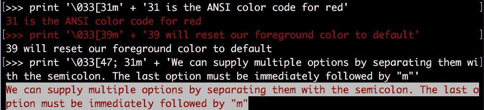
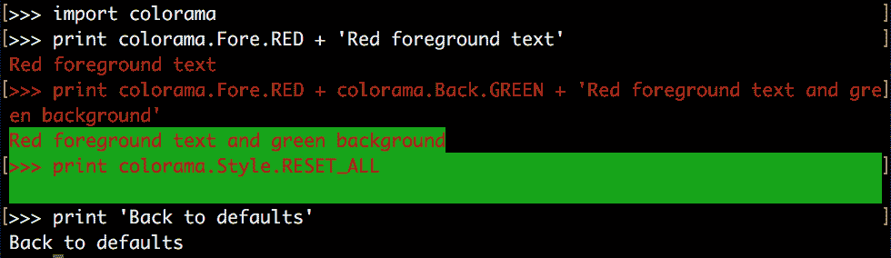
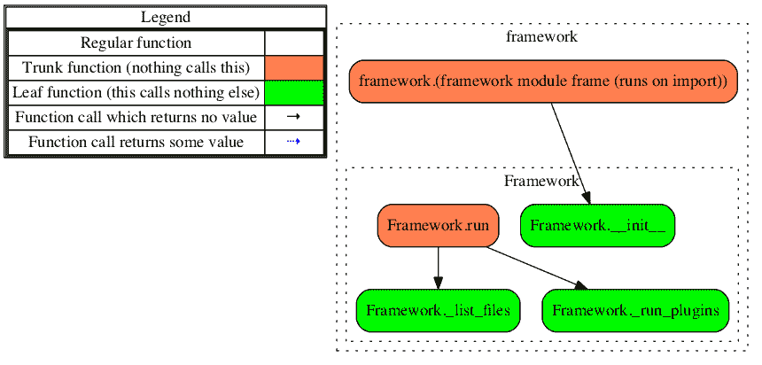
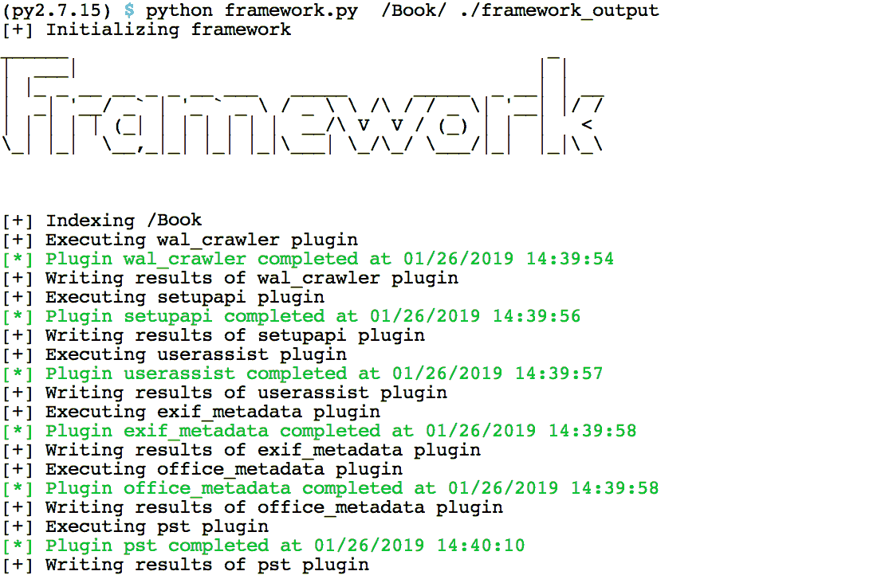
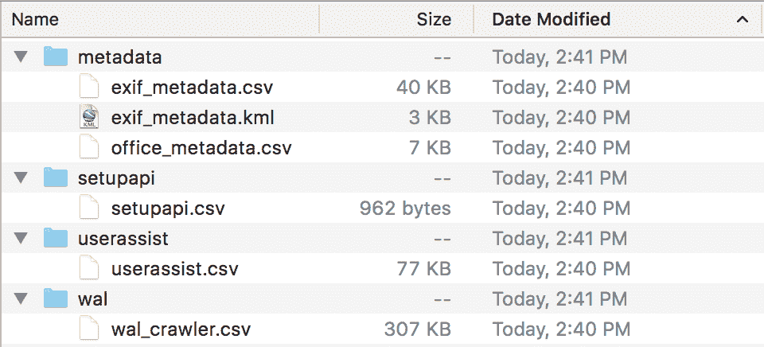

# 第十三章：完整回顾

在本章中，我们将回顾前几章中构建的脚本，以创建一个原型取证框架。该框架将接受一个输入目录，例如已挂载镜像的根文件夹，并针对文件运行我们的插件，以返回每个插件的系列电子表格报告。

到目前为止，我们在每一章中都开发了独立的脚本，从未在前一章的工作基础上进行扩展。通过开发一个框架，我们将演示如何将这些脚本整合在一起，并在一个上下文中执行它们。

在第八章《媒体时代》中，我们创建了一个用于解析各种类型嵌入式元数据的迷你框架。我们将借鉴该设计，并在其基础上加入面向对象编程。使用类简化了我们的框架，通过为插件和编写器创建抽象对象。

此外，在我们的框架中，我们将展示一些外部库的使用，这些库主要服务于美学目的，而非功能性。这些库包括 colorama 和 FIGlet，分别允许我们轻松地将彩色文本打印到标准输出并创建 ASCII 艺术。此外，我们的框架还要求使用我们在前几章中使用的所有第三方模块。

本章将讨论以下主题：

+   框架基础、挑战和结构

+   使用 Colorama 和 FIGlet 为我们的程序增添美学元素

本章的代码在 Python 2.7.15 和 Python 3.7.1 版本中进行开发和测试。

# 框架

为什么要构建框架？这个问题可能是，为什么要开发脚本？通常，我们会对给定的证据执行相同的步骤。例如，我们常常为 LNK、prefetch 和 jumplist 文件准备报告，检查注册表键，并确定外部设备和网络活动以回答取证问题。正如我们所看到的，我们可以开发一个脚本来解析这些工件，并以有助于快速分析的格式显示数据。为什么不编写一系列脚本，每个脚本负责一个工件，然后通过一个脚本来控制它们，一次性执行，从而进一步自动化我们的分析呢？

一个框架可以开发成一次性运行一系列脚本并同时解析多个工件。此类框架的输出可能是一系列分析就绪的电子表格。这样，检查员可以跳过同样繁琐的步骤，直接开始回答有关证据的有意义问题。

框架通常包含三个主要组件：

+   一个主控制器

+   插件

+   编写者

主控制器与我们的`main()`函数并没有太大区别，基本上是对一些输入调用一系列插件，这些插件解析特定的工件，存储返回的结果，然后将结果发送到写入程序进行输出。我们的插件是执行特定任务的脚本，例如一个解析`UserAssist`工件的脚本。与我们的`csv_writer()`函数类似，写入程序接受插件的输出并将其写入磁盘。尽管这个过程看起来相当直接，但开发框架比开发单个脚本要复杂得多。原因在于，我们需要担心构建一个既简洁又高效的结构，同时保持插件之间的数据标准化。

# 构建一个持久的框架

开发框架时的一个挑战是如何在不断增加更多功能的同时，保持代码的简洁和高效。你可能会发现，尽管框架的结构最初看起来合理，但它并不支持你日益复杂的需求，这就要求你重新考虑并重建框架的内部结构。不幸的是，没有任何神奇的方法能够使框架在未来不出问题，通常在开发周期中会进行多次修订。

这与普通脚本开发没有什么不同。在本书的早期章节中，我们迭代了多个版本的脚本。这样做是为了说明你在开发过程中会发现的迭代构建过程。这个相同的迭代过程也可以在框架的开发中大规模应用。虽然我们在这一章中没有强调这个过程，但请记住，如果以后添加更多插件，效率开始下降，你可能需要重写这里开发的框架。通过迭代开发，我们能够不断改进原始设计，打造出一个稳定且高效的程序。

# 数据标准化

开发框架时最大的挑战之一就是数据标准化。意思是要标准化每个插件的输入输出数据，以保持简单性。例如，假设有一个插件返回一个字典列表，而另一个插件仅返回一个列表。为了正确处理这些结果，你需要在写入程序中加入逻辑，以处理这两种情况。通过使每个插件返回相同的数据结构，可以简化代码，减少处理各种特殊情况所需的额外逻辑。

话虽如此，可能会有一些特殊场景需要你为每个插件考虑。在我们的框架中，例如，我们会看到有些插件返回的是字典的列表，而有些插件返回的是单个字典。考虑一下第三章中的`setupapi_parser.py`，*解析文本文件*——它能够识别多个不同的 USB 设备，并为每个设备生成一个字典，而我们的`exif_parser.py`只返回一个字典，其中包含单个文件中的嵌入式元数据。在这种情况下，我们不需要重写插件来遵循我们的规则，而是通过逻辑来处理额外的递归。

# 法医框架

有很多法医框架，其中很多都是开源的，允许任何人参与它们的开发。这些框架非常好，不仅可以贡献代码，还可以学习经验丰富的开发者是如何构建框架的。一些流行的开源法医框架包括以下内容：

+   **Volatility**：一个内存法医框架（[`github.com/volatilityfoundation/volatility`](http://github.com/volatilityfoundation/volatility)）

+   **Plaso**：一个伪造时间轴工具（[`github.com/log2timeline/plaso`](http://github.com/log2timeline/plaso)）

+   **GRR（Google Rapid Response 的简称）**：一种基于代理的远程法医分析和响应框架（[`github.com/google/grr`](http://github.com/google/grr)）

在一个积极开发的项目中贡献代码，无论这个项目是否是框架，都是学习良好的编程技巧和发展未来项目协作关系的好方法。

在为任何项目开发之前，一定要阅读贡献规则。

已经讨论了很多关于框架的内容，现在让我们来讨论一下我们将使用的第三方模块，来增强我们框架的美观性。

# Colorama

`colorama`模块（版本 0.4.1）允许我们轻松创建带颜色的终端文本。我们将使用它来向用户突出显示好坏事件。例如，当一个插件无错误地完成时，我们会用绿色字体显示它。类似地，我们会用红色字体打印遇到的错误。可以使用 pip 安装 colorama 模块：

```
pip install colorama==0.4.1  
```

传统上，在 Linux 或 macOS 系统上，打印彩色文本是通过一系列转义字符实现的。然而，这对于 Windows 操作系统不起作用。以下是在 Linux 或 macOS 终端中使用 ANSI 转义字符来创建彩色文本的示例：



颜色格式是转义字符`\033`，后跟一个左括号，然后是所需的颜色代码。我们不仅可以更改前景色，还可以更改背景色，甚至可以同时更改这两者，通过用分号分隔代码来实现。颜色代码`31m`将前景文本设置为红色。颜色代码`47m`将背景设置为白色。在第二个示例中，在前面的截图中，`m`指定了颜色代码的结束，因此它应该仅跟在最后一个颜色代码后面。

我们可以使用内置变量`colorama`和`call`，它们是所需 ANSI 代码的别名。这使我们的代码更具可读性，而且最重要的是，在调用`colorama.init()`后，它与 Windows 命令提示符兼容：



`colorama`模块有三个主要的格式化选项：`Fore`、`Back`和`Style`。这些选项分别允许我们更改前景或背景文本的颜色及其样式。前景色和背景色的可用颜色包括：黑色、红色、绿色、黄色、蓝色、洋红色、青色和白色。

使用 ANSI 转义字符，我们还可以更改其他文本属性，例如将文本变暗或变亮。关于 ANSI 颜色代码和`colorama`库的更多信息，请访问[`pypi.python.org/pypi/colorama`](https://pypi.python.org/pypi/colorama)。

# FIGlet

FIGlet 及其 Python 扩展`pyfiglet`（版本 0.8.post0）是生成 ASCII 艺术的简单方法。我们只需向 FIGlet 提供一个我们选择的字符串和一个字体样式，后者决定了文本的设计。我们将使用此模块在程序执行开始时打印框架的标题，以赋予其个性。我们可以使用 pip 来安装 pyfiglet：

```
pip install pyfiglet==0.8.post0
```

要使用 FIGlet，我们需要创建一个 FIGlet 对象，并指定我们希望使用的字体类型。然后，我们调用该对象的`renderText`方法，并传入要进行样式化的字符串。字体的完整列表可以在[`www.figlet.org/examples.html`](http://www.figlet.org/examples.html)找到：

```
>>> from pyfiglet import Figlet 
>>> f = Figlet(font='banner') 
>>> print(f.renderText('Forensics')) 
#######                                                     
#        ####  #####  ###### #    #  ####  #  ####   ####   
#       #    # #    # #      ##   # #      # #    # #       
#####   #    # #    # #####  # #  #  ####  # #       ####   
#       #    # #####  #      #  # #      # # #           #  
#       #    # #   #  #      #   ## #    # # #    # #    #  
#        ####  #    # ###### #    #  ####  #  ####   ####  
```

引入所需的第三方模块后，我们开始逐步讲解框架代码本身。

# 探索框架 – framework.py

我们的框架接受一个输入目录，递归索引所有文件，运行一系列插件以识别取证文物，然后将一系列报告写入指定的输出目录。这个理念是，检查人员可以使用 FTK Imager 等工具挂载`.E01`或`.dd`文件，然后将框架应用于挂载的目录。

框架的布局是实现简洁设计的重要第一步。我们建议将写作人员和插件放在框架控制器下适当标记的子目录中。我们的框架布局如下：

```
  |-- framework.py 
  |-- requirements.txt 
  |-- plugins 
      |-- __init__.py 
      |-- exif.py 
      |-- id3.py 
      |-- office.py 
      |-- pst_indexer.py 
      |-- setupapi.py 
      |-- userassist.py 
      |-- wal_crawler.py 
      |-- helper 
          |-- __init__.py 
          |-- utility.py 
          |-- usb_lookup.py 
  |-- writers 
      |-- __init__.py 
      |-- csv_writer.py 
      |-- xlsx_writer.py 
      |-- kml_writer.py 
```

我们的`framework.py`脚本包含了框架的主要逻辑——处理所有插件的输入和输出值。`requirements.txt`文件包含每一行框架使用的第三方模块。采用这种格式，我们可以使用`pip`安装所有列出的模块。`pip`会尝试安装模块的最新版本，除非在模块名称后立即指定了版本，并使用两个等号（例如，`colorama==0.4.1`）。我们可以通过以下代码从`requirements.txt`文件安装第三方模块：  

```
pip install -r requirements.txt 
```

插件和写入器存储在各自的目录中，并有一个`__init__.py`文件，以确保 Python 能够找到该目录。在插件目录中，我们的框架将支持七个初始插件。我们将包括以下插件：  

+   来自第八章的 EXIF、ID3 和 Office 嵌入式元数据解析器，*媒体时代*  

+   来自第十一章的 PST 解析器，*解析 Outlook PST 容器*  

+   来自第三章的 Setupapi 解析器，*解析文本文件*  

+   来自第六章的 UserAssist 解析器，*从二进制文件中提取工件*  

+   来自第十二章的 WAL 文件解析器，*恢复临时数据库记录*  

还有一个`helper`目录，包含一些插件所需的辅助脚本。目前，我们的框架支持三种输出格式：CSV、XLSX 和 KML。只有`exif`插件会使用`kml_writer`来创建带有 EXIF GPS 数据的 Google Earth 地图，正如我们在第八章中看到的，*媒体时代*。  

现在我们了解了框架的工作原理、原因和布局，让我们深入看看一些代码。在第 2 行到第 11 行之间，我们导入了我们计划使用的模块。请注意，这仅是当前脚本所需的模块列表，未包括各种插件所需的依赖项。插件特定的导入将在各自的脚本中完成。  

除了新增的`colorama`和`pyfiglet`之外，之前章节中的大部分导入应该都很熟悉。在第 7 行和第 8 行，我们导入了插件和写入器子目录，这些目录包含了插件和写入器的脚本。第 13 行的`colorama.init()`调用是一个前提，允许我们在 Windows 命令提示符中打印彩色文本：

```
002 from __future__ import print_function
003 import os
004 import sys
005 import logging
006 import argparse
007 import plugins
008 import writers
009 import colorama
010 from datetime import datetime
011 from pyfiglet import Figlet
012 
013 colorama.init()
```

在第 49 行，我们定义了`Framework`类。该类包含多种方法，所有这些方法都处理框架的初始化和执行。`run()`方法充当我们的典型主函数，并调用`_list_files()`和`_run_plugins()`方法。`_list_files()`方法会遍历用户提供目录中的文件，并根据文件名或扩展名，将文件添加到特定插件的处理列表中。然后，`_run_plugins()`方法将这些列表传递给每个插件执行，存储结果，并调用相应的写入器：

```
049 class Framework(object): 
... 
051     def __init__(): 
... 
061     def run(): 
... 
074     def _list_files(): 
... 
115     def _run_plugins(): 
```

在`Framework`类中，有两个子类：`Plugin`和`Writer`。`Plugin`类负责实际运行插件，记录插件完成的日志，并将数据发送以供写入。`run()`方法会对插件处理列表中的每个文件反复执行每个函数。它将返回的数据附加到一个列表中，并将其映射到字典中的键。这个字典还存储着电子表格所需的字段名称。`write()`方法会创建特定插件的输出目录，并根据指定的输出类型，适当地调用`Writer`类：

```
207     class Plugin(object): 
... 
209         def __init__(): 
... 
215         def run(): 
... 
236         def write(): 
```

`Writer`类是三者中最简单的类。它的`run()`方法只是简单地执行所需的写入器并提供正确的输入：

```
258     class Writer(object): 
... 
260         def __init__(): 
... 
271         def run(): 
```

和我们所有的脚本一样，我们使用`argparse`来处理命令行选项。在第 285 和 287 行，我们为输入和输出目录创建了两个位置参数。在第 288 和 290 行的两个可选参数分别指定了 XLSX 输出和所需的日志路径：

```
279 if __name__ == '__main__':
280 
281     parser = argparse.ArgumentParser(description=__description__,
282                                 epilog='Developed by ' +
283                                 __author__ + ' on ' +
284                                 __date__)
285     parser.add_argument('INPUT_DIR',
286         help='Base directory to process.')
287     parser.add_argument('OUTPUT_DIR', help='Output directory.')
288     parser.add_argument('-x', help='Excel output (Default CSV)',
289         action='store_true')
290     parser.add_argument('-l',
291         help='File path and name of log file.')
292     args = parser.parse_args()
```

我们可以在第 297 行看到首次使用`colorama`库。如果提供的输入和输出目录是文件，我们会向控制台打印一条红色的错误信息。对于框架的其余部分，我们使用红色文本显示错误信息，使用绿色文本显示成功信息：

```
294     if(os.path.isfile(args.INPUT_DIR) or
295             os.path.isfile(args.OUTPUT_DIR)):
296         msg = 'Input and Output arguments must be directories.'
297         print(colorama.Fore.RED + '[-]', msg)
298         sys.exit(1)
```

在第 300 行，我们检查是否提供了日志文件的可选目录路径。如果提供了，我们会创建这些目录（如果它们不存在），并将日志文件的文件名存储在`log_path`变量中：

```
300     if args.l:
301         if not os.path.exists(args.l):
302             os.makedirs(args.l) # create log directory path
303         log_path = os.path.join(args.l, 'framework.log')
304     else:
305         log_path = 'framework.log'
```

在第 307 和 309 行，我们创建了`Framework`对象，并调用了它的`run()`方法。我们将以下参数传递给`Framework`构造函数以实例化该对象：`INPUT_DIR`、`OUTPUT_DIR`、`log_path`和`excel`。在下一节中，我们将更详细地检查`Framework`类：

```
307     framework = Framework(args.INPUT_DIR, args.OUTPUT_DIR,
308     log_path, excel=args.x)
309     framework.run()
```

以下流程图突出显示了`framework.py`脚本中不同方法的交互方式。请记住，这个流程图只展示了脚本内部的交互，并没有考虑到各种插件、写入器和工具脚本：



# 探索 Framework 对象

我们设计我们的框架时采用面向对象的编程设计。这使我们能够创建分隔和可重用的对象。在我们的 `Framework` 对象中包含 `Plugin` 和 `Writer` 对象，在接下来的章节中我们将对其进行探讨。`Framework` 类定义在第 49 行，并且扩展了 `object` 类。在 Python 2.X 中，从一个 `object` 继承取代了之前传统上的空继承，这在 Python 3.X 中已成为标准：

```
049 class Framework(object): 
```

# 理解框架的 `__init__()` 构造函数

框架的 `__init__()` 方法在第 51 行定义。在这个构造函数中，我们将传递给构造函数的参数赋值为实例变量。我们还在第 55 行配置了日志模块。让我们看一下 `run()` 方法，在我们看到的情况下，它是在 `Framework` 对象实例化后立即调用的：

```
051     def __init__(self, input_directory, output_directory, log,
052     **kwargs):
053         self.input = input_directory
054         self.output = output_directory
055         logging.basicConfig(filename=log, level=logging.DEBUG,
056                         format=('%(asctime)s | %(levelname)s | '
057                         '%(message)s'), filemode='a')
058         self.log = logging.getLogger(log)
059         self.kwargs = kwargs
```

# 创建框架的 `run()` 方法

`run()` 方法定义在第 61 行，用几行代码执行我们框架的整体逻辑。第 62 到 68 行仅用于打印和记录调试目的的启动信息。请注意，在第 65 和 66 行使用 `Figlet` 打印我们框架的标题到控制台：

```
061     def run(self):
062         msg = 'Initializing framework'
063         print('[+]', msg)
064         self.log.info(msg)
065         f = Figlet(font='doom')
066         print(f.renderText('Framework'))
067         self.log.debug('System ' + sys.platform)
068         self.log.debug('Version ' + sys.version) 
```

在第 69 行，我们检查输出目录是否存在。如果不存在，我们使用 `os.makedirs()` 方法创建它。最后，在第 71 和 72 行，我们调用 `_list_files()` 和 `_run_plugins()` 方法对输入目录文件进行索引，并运行我们的插件：

```
069         if not os.path.exists(self.output):
070             os.makedirs(self.output)
071         self._list_files()
072         self._run_plugins() 
```

# 使用框架的 `_list_files()` 方法迭代文件

`_list_files()` 方法用于递归遍历输入目录中的每个文件。它将文件存储到处理列表中，供基于文件名或扩展名的插件使用。这种方法的一个缺点是，我们依赖于文件扩展名是否正确，而不是使用文件的签名本身。我们可以通过使用 struct 在框架中实现这个功能，就像我们在前几章中所做的那样。

请注意，`_list_files()` 方法前面有一个单个下划线。这是 Python 中声明内部方法的方式。这里的意思是，我们声明 `_list_files()` 方法不应该被导入，一般情况下也不应该由用户直接调用。例如，在第 309 行实例化我们的 `Framework` 对象后，我们不应该调用 `Framework` 的 `_list_files()`。相反，我们可以调用 `run()` 方法，该方法又会调用 `_list_files()` 方法。

`_list_files()` 方法在第 74 行定义，并打印和记录当前的执行状态。在第 79 到 85 行，我们创建了一系列针对每个插件特定的列表。这些列表用于存储任何与插件兼容的文件，以便稍后处理：

```
074     def _list_files(self):
075         msg = 'Indexing {}'.format(self.input)
076         print('[+]', msg)
077         logging.info(msg)
078 
079         self.wal_files = []
080         self.setupapi_files = []
081         self.userassist_files = []
082         self.exif_metadata = []
083         self.office_metadata = []
084         self.id3_metadata = []
085         self.pst_files = []
```

从第 87 行开始，我们使用`os.walk()`方法（我们在前几章中使用过）来遍历输入目录。对于每个文件，我们创建两个变量，一个存储当前文件的名称，另一个存储当前文件的扩展名：

```
087         for root, subdir, files in os.walk(self.input,
088         topdown=True):
089             for file_name in files:
090                 current_file = os.path.join(root, file_name)
091                 if not os.path.isfile(current_file):
092                     logging.warning((u'Could not parse file {}...'
093                     ' Skipping...').format((current_file)))
094                     continue
095                 ext = os.path.splitext(current_file)[1].lower()
```

使用我们的`current_file`和`ext`变量，我们使用一系列条件语句来识别插件需要处理的文件。例如，在第 96 行，我们检查文件名中是否包含`ntuser.dat`，因为这很可能表明它是一个用户的注册表配置单元，并且会被添加到我们的`userassist_files`列表中。

类似地，在第 100 行，任何以`.jpeg`或`.jpg`结尾的文件很可能是带有嵌入式 EXIF 元数据的照片，并且会被添加到我们的`exif_metadata`列表中。如果当前文件不符合任何要求，那么我们无法使用当前的插件解析它，我们将使用`continue`开始下一个循环：

```
096                 if current_file.lower().endswith('ntuser.dat'):
097                     self.userassist_files.append(current_file)
098                 elif 'setupapi.dev.log' in current_file.lower():
099                     self.setupapi_files.append(current_file)
100                 elif ext == '.jpeg' or ext == '.jpg':
101                     self.exif_metadata.append(current_file)
102                 elif(ext == '.docx' or
103                         ext == '.pptx' or
104                         ext == '.xlsx'):
105                     self.office_metadata.append(current_file)
106                 elif ext == '.mp3':
107                     self.id3_metadata.append(current_file)
108                 elif ext == '.pst' or ext == '.ost':
109                     self.pst_files.append(current_file)
110                 elif ext.endswith('-wal'):
111                     self.wal_files.append(current_file)
112                 else:
113                     continue
```

# 开发框架的 _run_plugins()方法

`_run_plugins()`是另一个内部方法，处理调用每个插件的逻辑，然后将返回的结果发送到相应的写入器。处理每个插件时有两个关键的变化。我们在两个插件中强调了这些不同的变化。我们不会涵盖其他五个插件，以减少解释相同代码的重复。

第一个插件示例是`wal_crawler`插件。在第 117 行，我们检查是否需要为`wal_crawler`创建`Plugin`对象，因为如果`wal_files`列表为空，就没有东西可以对插件进行操作。如果不为空，我们将在第 118 行创建一个`Plugin`对象。

接下来，我们创建`wal_output`，它存储我们插件的输出目录。在第 121 行，我们调用`Plugin`类的`run()`方法，然后根据是否指定了`excel`输出选项，使用`write()`方法写入插件结果，并在必要时传递`excel`关键字参数。

回顾一下，`wal_crawler`脚本返回一个包含字典的列表，每个字典包含一行数据。当我们调用插件时，我们将结果放入另一个列表中。默认情况下，写入器只期望一个字典列表来遍历并写入相应的报告。由于我们将字典列表添加到另一个列表中，因此我们需要告诉写入器它需要另一个`for`循环来访问字典列表。我们通过将递归关键字参数传递给插件的`write()`方法来实现这一点。我们将`recursion`值设置为`1`，以标记它已启用：

```
115     def _run_plugins(self):
116         # Run Wal Crawler
117         if len(self.wal_files) > 0:
118             wal_plugin = Framework.Plugin('wal_crawler',
119             self.wal_files, self.log)
120             wal_output = os.path.join(self.output, 'wal')
121             wal_plugin.run(plugins.wal_crawler.main)
122             if self.kwargs['excel'] is True:
123                 wal_plugin.write(wal_output, recursion=1, excel=1)
124             else:
125                 wal_plugin.write(wal_output, recursion=1)
```

与前面的示例不同，我们的 ID3 元数据脚本返回一个单一的字典，该字典会被添加到一个列表中。在这些情况下，我们不需要指定`recursion`关键字参数，如第 190 行和 193 行所示。除了这一点不同，插件的处理方式与前一个插件相同。

记住，我们框架的目标之一是能够以尽可能少的代码行禁用或添加新的插件。

这提高了框架的简洁性，使得它更容易维护。我们通过保持逻辑一致性并使用关键字参数来处理微小的变化，努力保持这一点：

```
182         # Run ID3 metadata parser
183         if len(self.id3_metadata) > 0:
184             id3_metadata_plugin = Framework.Plugin('id3_metadata',
185             self.id3_metadata, self.log)
186             id3_metadata_output = os.path.join(self.output,
187                 'metadata')
188             id3_metadata_plugin.run(plugins.id3.main)
189             if self.kwargs['excel'] is True:
190                 id3_metadata_plugin.write(id3_metadata_output,
191                     excel=1)
192             else:
193                 id3_metadata_plugin.write(id3_metadata_output)
```

# 探索 Plugin 对象

在第 207 行，我们看到了 `Plugin` 子类的开始。这个类包含了 `run()` 和 `write()` 方法，这些方法用于处理每个插件的执行以及对写入器的调用：

```
207     class Plugin(object): 
```

# 理解 Plugin 的 `__init__()` 构造函数

`Plugin` 构造方法非常简单。我们为插件名称、待处理文件、日志以及一个包含插件结果的字典创建实例变量。结果字典包含一个数据列表，该列表存储每次插件调用返回的实际结果。`headers` 键最终将包含一个列表，存储在写入器中使用的字段名：

```
209         def __init__(self, plugin, files, log):
210             self.plugin = plugin
211             self.files = files
212             self.log = log
213             self.results = {'data': [], 'headers': None} 
```

# 使用 Plugin 的 `run()` 方法

在第 215 行定义的 `run()` 方法负责在插件列表中的每个文件上执行插件。此外，该方法会打印出与插件执行相关的各种状态消息。

传递给 `run()` 方法的函数参数是插件中的入口方法名称。我们为插件文件列表中的每个文件调用这个入口方法。例如，`wal_crawler` 插件的入口方法是 `plugins.wal_crawler.main`：

```
215         def run(self, function):
216             msg = 'Executing {} plugin'.format(self.plugin)
217             print(colorama.Fore.RESET + '[+]', msg)
218             self.log.info(msg)
```

在第 220 行，我们开始遍历插件文件列表中的每个文件。在第 222 行，我们调用函数变量，并将文件作为参数传递给它进行处理。这将所有插件限制为单一文件输入。我们对现有插件所做的一些修改，涉及到调整它们的必需参数，使其能够在框架的限制范围内工作。例如，在前面的章节中，我们可能会将输出文件或目录作为脚本的参数之一传递。然而现在，写入器作为框架的一个独立部分处理输出，因此插件只需要专注于处理数据并将其返回给框架。

请注意，函数调用被包裹在 `try` 和 `except` 中。在插件本身中，我们可以看到当插件出现错误时会抛出 `TypeError`；在发生错误时，插件会记录实际错误，同时框架会继续处理下一个文件。

在第 223 和 224 行，我们将插件返回的结果附加到数据列表中，并为插件设置 `headers`。返回的 `headers` 列表是一个常量字段名列表，每当插件成功返回时都会设置：

```
220             for f in self.files:
221                 try:
222                     data, headers = function(f)
223                     self.results['data'].append(data)
224                     self.results['headers'] = headers
225 
226                 except TypeError:
227                     self.log.error(('Issue processing {}. '
228                         'Skipping...').format(f))
229                     continue
```

最后，在第 231 到 234 行，我们打印并记录插件的成功完成，包括当前时间：

```
231             msg = 'Plugin {} completed at {}'.format(self.plugin,
232             datetime.now().strftime('%m/%d/%Y %H:%M:%S'))
233             print(colorama.Fore.GREEN + '[*]', msg)
234             self.log.info(msg)
```

# 使用 Plugin 的 `write()` 方法处理输出

`write()`方法首先在第 236 行定义。此方法创建插件特定的输出目录，并调用适当的写入器来生成插件报告。在第 241 和 242 行，在向用户打印状态消息后，如果插件输出目录尚不存在，则创建该目录：

```
236         def write(self, output, **kwargs):
237             msg = 'Writing results of {} plugin'.format(
238             self.plugin)
239             print(colorama.Fore.RESET + '[+]', msg)
240             self.log.info(msg)
241             if not os.path.exists(output):
242                 os.makedirs(output)
```

在第 243 行，我们检查`excel`关键字参数是否在函数调用中指定。如果指定了，我们调用`xlsx_writer`并传递输出目录、所需的文件名、字段名和要写入的数据。

如果没有提供`excel`关键字参数，则调用默认的`csv_writer`。此函数与`xlsx_writer`具有相同的参数。在第 253 行，我们检查插件名称是否为`exif_metadata`。如果是，我们调用`kml_writer`来绘制 Google Earth 的 GPS 数据：

```
243             if 'excel' in kwargs.keys():
244                 Framework.Writer(writers.xlsx_writer.writer,
245                     output, self.plugin + '.xlsx',
246                     self.results['headers'],
247                     self.results['data'], **kwargs)
248             else:
249                 Framework.Writer(writers.csv_writer.writer,
250                     output, self.plugin + '.csv',
251                     self.results['headers'],
252                     self.results['data'], **kwargs)
253             if self.plugin == 'exif_metadata':
254                 Framework.Writer(writers.kml_writer.writer,
255                     output, '', self.plugin + '.kml',
256                     self.results['data'])
```

# 探索 Writer 对象

`Writer`对象在第 258 行定义。此类负责为每个插件创建报告。该类有一个主要方法`run()`，它简单地调用在`plugin.write`方法中描述的写入器：

```
258     class Writer(object): 
```

# 理解 Writer 的 __init__()构造函数

构造方法实例化会话变量，包括报告的输出文件名、表头和要写入的数据。如果存在`recursion`关键字参数，我们在调用`run()`方法之前设置会话变量：

```
260         def __init__(self, writer, output, name, header, data,
261         **kwargs):
262             self.writer = writer
263             self.output = os.path.join(output, name)
264             self.header = header
265             self.data = data
266             self.recursion = None
267             if 'recursion' in kwargs.keys():
268                 self.recursion = kwargs['recursion']
269             self.run()
```

# 理解 Writer 的 run()方法

`run()`方法非常直接。根据是否指定了递归，我们调用指定的写入器，并传递`recursion`关键字参数：

```
271         def run(self):
272             if self.recursion:
273                 self.writer(self.output, self.header, self.data,
274                     recursion=self.recursion)
275             else:
276                 self.writer(self.output, self.header, self.data)
```

# 我们的最终 CSV 写入器 – csv_writer.py

每个写入器的工作方式基本相同。在讨论更复杂的`xlsx_writer`脚本之前，让我们简要讨论一下`csv_writer`方法。根据框架是使用 Python 2.X 还是 3.X 运行，我们导入原生的`csv`或`unicodecsv`模块来处理 Unicode 字符串。`unicodecsv`模块首次出现在第五章，*Python 中的数据库*中：

```
001 from __future__ import print_function
002 import sys
003 import os
004 if sys.version_info[0] == 2:
005     import unicodecsv as csv
006 elif sys.version_info[0] == 3:
007     import csv 
```

我们的写入器非常简单。在第 61 行，我们创建一个`csv.DictWriter`对象，并传入输出文件名和表头列表。像往常一样，我们指示写入器忽略那些在提供的表头中没有指定的键：

```
038 def writer(output, headers, output_data, **kwargs):
039     """
040     The writer function uses the csv.DictWriter module to write
041     list(s) of dictionaries. The DictWriter can take a fieldnames
042     argument, as a list, which represents the desired order of
043     columns.
044     :param output: The name of the output CSV.
045     :param headers: A list of keys in the dictionary that
046     represent the desired order of columns in the output.
047     :param output_data: The list of dictionaries containing
048     embedded metadata.
049     :return: None
050     """
051 
052     if sys.version_info[0] == 2:
053         csvfile = open(output, "wb")
054     elif sys.version_info[0] == 3:
055         csvfile = open(output, "w", newline='',
056             encoding='utf-8')
057 
058     with csvfile:
059         # We use DictWriter instead of writer to write
060         # dictionaries to CSV.
061         w = csv.DictWriter(csvfile, fieldnames=headers,
062             extrasaction='ignore')
```

创建`DictWriter`对象后，我们可以使用内置的`writerheader()`方法将字段名作为电子表格的第一行写入。请注意，我们将其包装在 try 和 except 中，这是我们以前没有做过的。假设有一个插件需要处理的文件，并且在处理中遇到错误并提前返回。在这种情况下，表头列表将为 None，这会导致错误。这个最后的检查可以让我们避免在这种情况下写入无效的输出文件：

```
064         # Writerheader writes the header based on the supplied
065         # headers object
066         try:
067             w.writeheader()
068         except TypeError:
069             print(('[-] Received empty headers...\n'
070                 '[-] Skipping writing output.'))
071             return
```

接下来，在第 73 行，如果提供了`recursion`关键字参数，我们在调用字典的`writerow`方法之前使用两个`for`循环。否则，在第 79 行，我们只需使用一个`for`循环来访问数据并进行写入：

```
073         if 'recursion' in kwargs.keys():
074             for l in output_data:
075                 for data in l:
076                     if data:
077                         w.writerow(data)
078         else:
079             for data in output_data:
080                 if data:
081                     w.writerow(data)
```

# 写入器 – xlsx_writer.py

`xlsx_writer`函数是`xlsx_writer`的略微修改版本，我们在第六章，*从二进制文件中提取文档*中创建了它。我们使用相同的`xlsxwriter`第三方模块来处理 Excel 输出。在第 32 行，我们使用列表推导式创建一个包含从`A`到`Z`的大写字母的列表。我们将使用此列表根据提供的字段头长度指定列字母。此方法在字段名称少于 26 个时有效，对于当前插件集是成立的：

```
001 from __future__ import print_function
002 import xlsxwriter
...
032 ALPHABET = [chr(i) for i in range(ord('A'), ord('Z') + 1)]
```

在第 44 行，我们创建`xlsxwriter`工作簿并提供输出文件名以保存。在继续之前，我们检查提供的头部是否为空。这个检查是必要的，正如在`csv_writer`中一样，避免因为错误的写入器调用而写入无效数据。在第 52 行，我们将`title_length`设置为最右侧列的字母，以防有超过 26 列的情况。目前，我们将最右侧的值设置为`Z`：

```
035 def writer(output, headers, output_data, **kwargs):
036     """
037     The writer function writes excel output for the framework
038     :param output: the output filename for the excel spreadsheet
039     :param headers: the name of the spreadsheet columns
040     :param output_data: the data to be written to the excel
041     spreadsheet
042     :return: Nothing
043     """
044     wb = xlsxwriter.Workbook(output)
045 
046     if headers is None:
047         print('[-] Received empty headers... \n'
048             '[-] Skipping writing output.')
049         return
050 
051     if len(headers) <= 26:
052         title_length = ALPHABET[len(headers) - 1]
053     else:
054         title_length = 'Z'
```

接下来，在第 56 行，我们创建工作表。与`csv_writer`函数类似，如果指定了递归，我们将遍历列表，为每个额外的列表添加一个工作表，以防止它们相互覆盖。然后，我们使用列表推导式根据字段名称的顺序快速排序字典值。在`csv_writer`中，`DictWriter`对象的`writerow`方法会自动对数据进行排序。对于`xlsx_writer`，我们需要使用列表推导式来重新创建相同的效果：

```
056     ws = add_worksheet(wb, title_length)
057 
058     if 'recursion' in kwargs.keys():
059         for i, data in enumerate(output_data):
060             if i > 0:
061                 ws = add_worksheet(wb, title_length)
062             cell_length = len(data)
063             tmp = []
064             for dictionary in data:
065                 tmp.append(
066                 [str(dictionary[x]) if x in dictionary.keys() else '' for x in headers]
067                 )
```

在第 69 行，我们创建一个从`A3`到`XY`的表格，其中`X`是表示字段名称列表长度的字母字符，`Y`是`output_data`列表的长度。例如，如果我们有一个数据集，包含六个字段名称和 10 个条目，我们希望表格从`A3`到`F13`。此外，我们将排序后的数据传递给表格，并再次使用列表推导式指定每一列，确保每个标题对应一个键值对的字典：

```
069             ws.add_table(
070                 'A3:' + title_length + str(3 + cell_length),
071                 {'data': tmp,
072                 'columns': [{'header': x} for x in headers]})
```

在第 74 行，我们处理没有提供`recursion`关键字参数的情况。在这种情况下，我们处理相同的执行流程，只是没有额外的`for`循环。最后，在第 84 行，我们关闭工作簿：

```
074     else:
075         cell_length = len(output_data)
076         tmp = []
077         for data in output_data:
078             tmp.append([str(data[x]) if x in data.keys() else '' for x in headers])
079         ws.add_table(
080             'A3:' + title_length + str(3 + cell_length),
081             {'data': tmp,
082             'columns': [{'header': x} for x in headers]})
083 
084     wb.close()
```

`add_worksheet()`方法在第 56 行和第 61 行被调用。这个函数用于创建工作表并写入电子表格的前两行。在第 96 行，我们创建了`title_format`样式，其中包含我们想要的两个标题行的文本属性。在第 101 行和第 103 行，我们创建了这两行标题。目前，这些标题行的值是硬编码的，但可以通过将它们作为可选开关添加到`argparse`中，编程到框架中：

```
087 def add_worksheet(wb, length, name=None):
088     """
089     The add_worksheet function creates a new formatted worksheet
090     in the workbook
091     :param wb: The workbook object
092     :param length: The range of rows to merge
093     :param name: The name of the worksheet
094     :return: ws, the worksheet
095     """
096     title_format = wb.add_format({'bold': True,
097     'font_color': 'black', 'bg_color': 'white', 'font_size': 30,
098     'font_name': 'Arial', 'align': 'center'})
099     ws = wb.add_worksheet(name)
100 
101     ws.merge_range('A1:' + length + '1', 'XYZ Corp',
102         title_format)
103     ws.merge_range('A2:' + length + '2', 'Case ####',
104         title_format)
105     return ws 
```

# 对插件所做的更改

我们已经讨论了框架、它的子类和两个主要的写入脚本。那么我们在前几章中对插件脚本所做的修改呢？大部分情况下，它们的核心功能没有变化。我们所做的修改包括删除打印和日志语句，删除`argparse`和日志设置部分，以及删除一些不必要的函数，例如脚本的输出写入器（因为框架已经处理了这个问题）。

我们不逐一讲解每个插件，而是邀请你自己查看源文件并进行对比。你会发现这些文件与前面的脚本大致相同。请记住，当我们最初编写这些脚本时，我们心里已经预想到它们最终会被添加到框架中。虽然框架版本和非框架版本的脚本之间的相似性是故意为之，但仍然需要进行修改才能使一切正常工作。

# 执行框架

要运行框架，最少需要提供输入和输出目录。可选地，我们还可以提供日志输出路径参数，并启用 XLSX 输出，而不是默认的 CSV 输出。第一个示例和随后的截图突出显示了运行框架所需的最小参数。第二个示例展示了我们可以在框架中调用的额外开关：

```
python framework.py /mnt/evidence ~/Desktop/framework_output 
python framework.py /mnt/evidence ~/Desktop/framework_output -l ~/Desktop/logs -x 
```

在运行框架后，用户将看到各种输出文本，详细说明框架的执行状态：



每当一个插件成功处理时，都会在该插件的输出文件夹中生成报告。我们决定通过将每个插件报告存储在单独的文件夹中来组织输出，以便检查人员可以轻松地查看自己感兴趣的插件：



# 附加挑战

我们的框架有很多潜在的改进机会。显然，我们可以继续为框架添加更多插件和写入器。例如，虽然我们通过`Setupapi`插件已经实现了 USB 设备的基本证据，但可以通过使用第六章中的`Registry`模块解析各种与 USB 相关的注册表项来扩展它，*从二进制文件中提取证据*。或者，可以考虑添加我们已经创建的其他脚本。例如，使用第五章中的脚本生成活动文件列表可能会很有用，*Python 中的数据库*。这将使我们能够监控框架已处理的文件。

此外，添加新的用户活动证据源，例如预取解析器，将增强框架的内在价值。预取文件的文件格式可以在[`forensicswiki.org/wiki/Windows_Prefetch_File_Format`](http://forensicswiki.org/wiki/Windows_Prefetch_File_Format)中找到。与任何二进制文件一样，我们建议使用`struct`模块来解析该文件。

最后，对于那些寻求挑战的人，可以考虑通过使用`libewf` ([`github.com/libyal/libewf`](https://github.com/libyal/libewf)) 或 `libtsk` ([`github.com/py4n6/pytsk`](https://github.com/py4n6/pytsk))来添加对`E01`和`dd`的支持。这将无需在运行框架之前挂载镜像文件。这将是一个较为艰巨的任务，可能需要重写框架。然而，挑战越大，完成后你得到的收获也会越多。

该实现的示例可在 Packt 出版的《Python 数字取证手册》中找到，链接为[`www.packtpub.com/networking-and-servers/python-digital-forensics-cookbook`](https://www.packtpub.com/networking-and-servers/python-digital-forensics-cookbook)。

# 总结

这是最后一章，我们在这里学习了如何利用之前编写的脚本开发自己的取证框架。这是建立你自己的自动化取证解决方案的第一步，大大提升你的午休时间，或者对于更为严谨的用户，提升效率。我们学会了如何平衡代码复杂性和效率，开发一个可持续的框架来帮助我们回答调查性问题。该项目的代码可以从 GitHub 或 Packt 下载，具体内容见*前言*。

本书开头时，我们希望通过展示越来越复杂的脚本来教会调查员 Python 的优势。在这个过程中，我们介绍了常见的技术、最佳实践以及大量的第一方和第三方模块。我们希望，在这个阶段，你已经能够开发自己的脚本，理解 Python 的基本知识，并且已经在成为一名取证开发者的道路上迈出了坚实的步伐。

当我们结束这本书时，我们想列出一些建议。如果您还没有这样做，请尝试解决各种挑战。有些问题很简单，而其他一些则更具挑战性，但无论如何，它们都将帮助您进一步发展技能。此外，不要仅仅是跟随本书提供的代码。找到一个经常遇到的问题或任务，并从头开始编写脚本。还有，像往常一样，请朋友帮忙，使用互联网，阅读更多书籍，并与他人合作继续学习。我们学习的能力只会因我们追求学习的努力不足而受到阻碍。
