# 一、社会工程导论

在任何战斗中，没有比了解敌人的战术更好的知识了。这一章将向你介绍社会工程的世界，看看社会工程是怎么回事。社会工程是一套广泛用于网络攻击的技术，用来策划一些最成功的攻击。社会工程专门针对网络安全链中的一个薄弱环节——用户。与系统和网络不同，用户无法通过昂贵的工具(如防火墙和防病毒程序)免受社会工程的影响。他们总是在公开的地方，他们总是提供信息，攻击者可以利用这些信息在最意想不到的时候攻击他们。与系统相比，人也有更高的投资回报。在一个小时内，一个社会工程专家可以获得他或她花 100 个小时收集的信息，试图直接攻击一个受保护的系统。攻击者知道当前保护系统的安全元素的复杂性。大多数组织使用多层安全性。即使其中一个受到威胁，黑客也不能轻易通过其他的。因此，试图攻击系统本身变得更加困难。与此同时，黑客们发现攻击当今的用户很容易，越来越多的社会工程攻击证实了这一点。本章将概述社会工程。它将涵盖以下主题:

*   诱导
*   抗议
*   思维技巧
*   说服
*   社会工程中使用的工具

# 社会工程概述

本世纪最大的网络攻击之一发生在雅虎！据信，攻击者能够在 2014 年侵入其系统，窃取超过 5 亿用户的账户信息。美国联邦调查局(FBI)证实，攻击中使用了社会工程，让攻击者通过了用于保护此类数据的安全工具和系统的层层审查。对雅虎的攻击。因此，科技巨头谷歌证实，社会工程比人们想象的更加危险。如果一家在网络安全工具上投入巨资的历史最悠久的电子邮件服务提供商可以使用这种技术如此轻松地被攻破，那么没有人是安全的。

*Tech: FBI: Russian hackers likely used a simple phishing email on a Yahoo employee to hack 500 million user accounts (YHOO, VZ)*, by *Steve Kovach* at Pulselive.co.ke, 2017 available at [http://www.pulselive.co.ke/bi/tech/tech-fbi-russian-hackers-likely-used-a-simple-phishing-email-on-a-yahoo-employee-to-hack-500-million-user-accounts-yhoo-vz-id6380434.html](http://www.pulselive.co.ke/bi/tech/tech-fbi-russian-hackers-likely-used-a-simple-phishing-email-on-a-yahoo-employee-to-hack-500-million-user-accounts-yhoo-vz-id6380434.html). [Accessed on November 8, 2017].

社会工程师也能够利用简单的社会工程攻击获得巨额资金。2015 年，一家名为 Ubiquiti Networks 的网络设备制造商遭到了一项社会工程技术的攻击。攻击者能够收集有关首席执行官的信息，并有效地冒充他的人格。他们利用这种冒充来指示财务部向某个海外公司输送巨额资金，该公司已经通知他他们的支付偏好发生了变化。毫无疑问，一名财务部门的工作人员转移了这笔钱，但后来却发现这些命令并非来自真正的首席执行官，攻击者已经卷走了该组织数百万的血汗钱。进一步的调查显示，安全系统仍然存在，没有受到损害，盗窃只是通过一个社会工程骗局完成的。

*Fraudsters duped this company into handing over $40 million* by *Robert Hackett*, *Fortune, 2017* available at [http://fortune.com/2015/08/10/ubiquiti-networks-email-scam-40-million/](http://fortune.com/2015/08/10/ubiquiti-networks-email-scam-40-million/). [Accessed on November 8, 2017].

这两起事件都强调了一个事实，即人类的弱点在网络安全链中不容忽视。它正迅速成为攻击组织的广泛使用的方法:

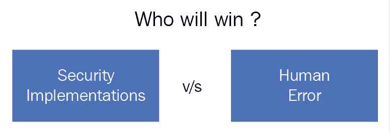Who will win? All your security implementations or a simple human mistake?

今天的网络罪犯是幸运的，因为用户将自己暴露在社会工程攻击之下。社交媒体平台使用的增加是社交工程攻击数量增加的一个关键因素。这是因为今天的用户在社交媒体上生活，并提供关于他们日常生活、家庭、工作场所、个人偏好等的细节，这些都可以用于社交工程攻击。攻击者只需要浏览用户的社交媒体账户，就可以获得足够的信息来发动一次成功的社交工程攻击。脸书、Twitter、Instagram 和 Snapchat 上有足够多的信息，足以让一名社会工程师假设大多数用户的个性。创建一个虚假的高管社交媒体账户也非常容易。这个帐户要求立即尊重和遵守向目标发出的任何命令，因此可以用来从一个组织的初级雇员那里捞钱。

社交媒体上使用的另一种方法是创建不存在的人的**蜜罐账户**，用于攻击真实的人。2017 年 7 月，**一家中东电信公司** ( **【美科】** ) 的一名高级 IT 运营员工在批准蜜罐账户的好友请求后不久侥幸逃脱。这次袭击似乎是高度针对一名男性业余摄影师。这是因为攻击者创建了一个名叫 Mia 的年轻女孩的吸引人的个人资料，称她是伦敦即将到来的摄影师，她与目标有很多共同的爱好。目标显然很快就接受了好友请求，认为他们之间有很强的联系。经过几周的聊天，米娅给这个男人发了一份摄影调查。IT 人员不知道，该调查是一个文件，其中包含一个名为 **Pupy RAT，**的恶意软件，当它被打开时，用于窃取登录凭据。幸运的是，该公司的计算机安装了有效的终端主机防病毒程序，可以在造成任何损害之前快速检测并清除恶意软件。进一步的调查能够揭示企图社会工程攻击背后的黑客组织。据证实，该集团此前曾试图利用网络钓鱼电子邮件攻击该公司，但均未成功。这些员工接受了关于虚假邮件、点击可疑链接或打开电子邮件附件的教育。似乎黑客组织能够想出社会工程攻击，并通过脸书锁定一名员工。

*Iranian hackers used female 'honey pot' to lure targets: researchers* by *Dustin Volz*, *US*, 2017 available at [https://www.reuters.com/article/us-cyber-conference-iran/iranian-hackers-used-female-honey-pot-to-lure-targets-researchers-idUSKBN1AC28L](https://www.reuters.com/article/us-cyber-conference-iran/iranian-hackers-used-female-honey-pot-to-lure-targets-researchers-idUSKBN1AC28L). [](https://www.reuters.com/article/us-cyber-conference-iran/iranian-hackers-used-female-honey-pot-to-lure-targets-researchers-idUSKBN1AC28L) [Accessed on November 8, 2017[].](https://www.reuters.com/article/us-cyber-conference-iran/iranian-hackers-used-female-honey-pot-to-lure-targets-researchers-idUSKBN1AC28L)

这一事件证实，无论用户在哪个部门工作，都容易受到社会工程攻击。这里的目标是它-知识渊博，但伪装成一个年轻，有吸引力的女士分享他的兴趣，能够让他放松警惕。他打开了组织网络中的一个文件，该文件可能窃取了登录凭证，甚至通过网络传播并感染了其他计算机。如果使用了更强的恶意软件，攻击可能已经完成。当涉及到社会工程时，用户都面临着同样的弱点。攻击者只需要找到一个人的弱点。这可能是对任何权威、孤独、财务需求或投资需求等的盲目服从。

奥肯伊和托马斯进行了一项关于人体黑客行为的解剖学研究，这项研究可以转化为社会工程。

*On the Anatomy of Human Hacking*, by *P. Okenyi* and *T. Owens* at *Taylor & Francis Online* available at [http://www.tandfonline.com/doi/abs/10.1080/10658980701747237](http://www.tandfonline.com/doi/abs/10.1080/10658980701747237). [Accessed on November 8, 2017].

他们说人类总是对被社会工程师操纵持开放态度；只需要转动正确的旋钮。他们发现，人类服从高于他们的权威，因此愿意执行上级传下来的命令。这是社会工程师经常使用的一个弱点，他们试图使用组织中高级管理人员的虚假档案来传递恶意命令。两位作者还意识到，人类同情并信任陌生人。人类是有爱心的，愿意帮助陌生人，这使他们处于被普通骗子操纵的不幸境地。礼貌、信任和同情被用来让人们向黑客提供他们个人设备上包含非常敏感数据的详细信息。然后，这些黑客能够在目标意识到这一点之前安装恶意软件或复制敏感数据。女性，尤其是怀孕或残疾女性，已经被用来让目标给出她们设备的详细信息，只是为了植入恶意软件或复制或删除数据。作者发现，人类总是对某些奖励感兴趣，并愿意采取据称会为他们赢得奖励的行动。

一种常用的网络钓鱼策略是告诉用户，如果他们点击某些链接，就有机会赢得巨额奖金。许多人想要奖品，因此会点击链接，这些链接可能会引导他们进入赠品页面，但却发现这些链接指向恶意网站。人类也有负罪感、取悦他人的欲望和道德责任感。这些都是将在接下来的章节中讨论的心理学问题。

*Why We're Vulnerable to Social Engineering Attacks* by  *Becky Metivier*, at *Sage Data Security a*vailable at [https://www.sagedatasecurity.com/blog/why-we-are-vulnerable-to-social-engineering-attacks](https://www.sagedatasecurity.com/blog/why-we-are-vulnerable-to-social-engineering-attacks). [Accessed on November 8, 2017].

理解社会工程通常不是一个坏的实践是很好的；它有好的和恶意的应用程序。这两种方式都是有效的，因为目标具有前面详述的相同特征，因此总是容易受到攻击。社会工程在社会中起着关键作用；它能让人得到恩惠。不管它们是好是坏，它让人们做出有利于请求他们的人的决定。只是社会工程现在被坏人用来犯下巨大的罪行。在犯罪行为中用于操纵他人的策略框架与用于积极结果的策略框架相同。被利用的弱点是相对相同的，所有人类都有。

最古老的社会工程骗局之一是尼日利亚骗局。这可能是第一次由电子邮件技术介导的广泛成功的社会工程攻击。自从它出现在电子邮件的早期，许多人就上当了。攻击者假装是一个富裕的尼日利亚王子，他有一笔利润丰厚的交易，只需要一个目标提供一些帮助，就可以得到一大笔钱。当目标被要求通过支付一些现金来解决某些问题以获得一大笔支付时，这个骗局就被执行了。问题不断出现，直到目标最终意识到没有钱可以释放。这次攻击利用了一些人类特征，讨论如下:

*   第一个是贪婪，让目标相信他们确实会从巨额财富中获得一大笔。每个人都想要钱，如果钱来得这么容易，那么很多人会愿意按照要求去做。这不是一个奇怪的特征，只存在于受害者身上；这是每个人都有的特征。
*   被利用的另一个特征是承诺。人类天生就想把事情看到底。这就是为什么攻击者发现他们可以通过向人们保证他们越早付款，付款就会越早发放来骗取钱财。同样，这是每个人都有的特征。

*   最后一个特征是信任，这是攻击的核心部分。陌生人被操纵去相信另一个大陆上的另一个陌生人，并且相信他们被告知的一切都是真实的。信任是强大的，当支付过程中出现错误时，陌生人很快就给了所谓的尼日利亚王子好处。同时利用人类的三个弱点，攻击非常强大，一些人最终损失高达 5 万美元。

以下是垃圾邮件的一个示例:

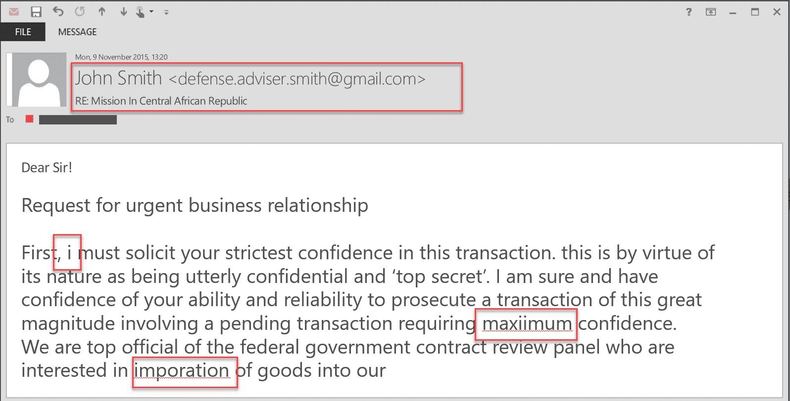An example of a spam email with obvious indications

前面的例子描述了一种结构良好的社会工程攻击，这种攻击出于恶意目的利用人类特征。值得注意的是，同样的特征也用于积极的结果。信任每天都在协议或交易中被使用，只有在不幸的情况下才会被恶意使用。承诺几乎用于所有的事业，以确保成功完成。人类因为完成任务而获得某种内在奖励，因此致力于看透他们开始的一切。

贪婪也不一定是一种不好的品质。微妙的贪婪是人之常情。人们追求金钱，正是微妙的贪婪让人们以各种可能的方式去追求金钱。因此，只有在不幸的情况下，这些特征才会被恶意利用。

根据 2015 年威瑞森数据泄露报告，考虑下图:

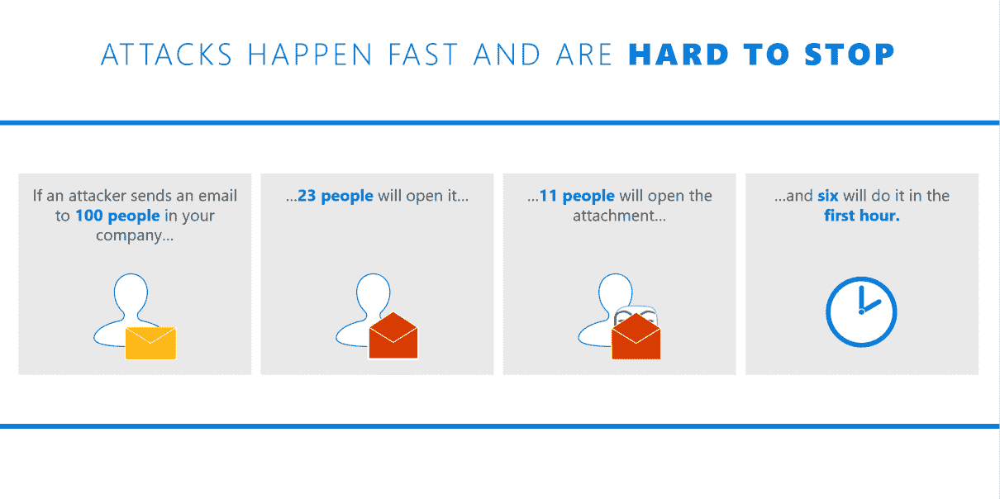Social engineering/phishing attacks happen fast and they are hard to stop (based on Verizon's Data Breach report, 2015)# 社会工程的应用

社会工程实际上被人们和机构用在许多机构和职业中，讨论如下:

*   律师和心理学家:这些人必须让人们进入某种精神状态来操纵他们的思想。他们使用和其他社会工程师一样的策略。只是他们使用它们没有恶意。通过这些策略，他们能够成功地进行审讯和采访，并让人们透露他们本来会隐瞒的信息。

*   政府:政府必须使用社会工程来控制他们所统治的人民。社会工程人的一个关键方法是使用权威。政府控制着国家的大部分权力，人类的大脑习惯于服从权力。另一种方法是利用稀缺性。如果不存在，政府就会制造稀缺，这样他们就可以在人们的头脑中保留他们(政府)仍然掌权的印象。稀缺可以是很多东西，比如信息、金钱，甚至是食物。在朝鲜等国家，食品和信息匮乏被当权政权滥用，以迫使民众顺从。
*   销售人员:他们已经掌握了说服人们购买东西的艺术，包括那些他们并不需要的东西。销售人员是优秀的社会工程师，因为他们善于利用多种人际交往技能来激发潜在客户对其产品的需求。今天，销售人员正在利用技术来帮助他们收集信息，并影响人们购买某些产品。社会工程在这一切中扮演着关键角色。
*   **招聘人员**:大部分机构的**人力资源** ( **HR** )部门都被专业的社会工程师占据。招聘人员已经掌握了读心术，可以发现他们真正的驱动力以及他们是否适合广告中的职位。社会工程被用来让申请人敞开心扉，透露信息，帮助人力资源部门决定是否雇佣他们。
*   间谍:间谍们被广泛教授特殊的社会工程技术，他们利用这些技术来欺骗人们，让他们相信他们就是被宣传的那个人。他们还学习如何使用社会工程策略从不知情的人那里收集情报。由于社会工程，间谍可以很容易地从铁杆罪犯那里获得供词。即使遭到破坏，他们也可以使用社会工程恢复他们的秘密身份。社会工程对他们来说意味着生存，因此他们非常擅长。
*   **骗子**:诈骗大多是通过社会工程实现的。一个骗子必须知道如何吸引人们毫无疑问地购买一个骗局。骗子从远处识别他们的标记，并随着时间的推移研究它们。他们收集关于他们分数的关键线索，直到他们有足够的信息去击中它们。骗子们已经完善了创造某些对他们的目标来说不可抗拒的场景的艺术。正是通过社会工程，这一切才成为可能。

*   **身份窃贼**:身份盗窃不仅仅是窃取他人的姓名、银行账户、地址和财务信息，而是一种更严重的犯罪。身份窃贼有时不得不成为他或她窃取身份的人，以便犯下更大的罪行，获得更高的回报。这就是社会工程发挥作用的地方。一个身份窃贼会用不同的策略与受害者生活中的人相处。身份窃贼会利用受害者个人资料的状态来为他谋取利益。如果被盗的身份是某个组织的高级职员，身份窃贼可能会利用职权强迫财务员工进行一些未经验证的支付。社会工程高度支持身份盗窃。

所有这些人都以积极和消极的方式使用社会工程。然而，这本书的重点是恶意目的的社会工程。这是许多人、组织和政府关心的主要问题。这让许多人对保护他们的系统失去了信心。

# 社会工程框架

The social engineering cycle is shown in the following figure: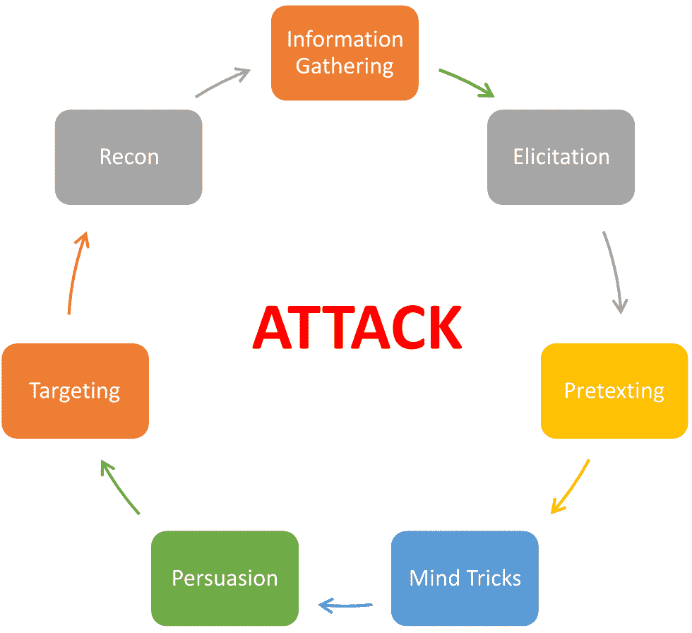The social engineering cycle

在任何成功的社会工程攻击中，都遵循一定的框架。该框架有七个独立的步骤，指导社会工程师更多地了解目标，选择攻击策略，然后小心翼翼地执行它。框架如下:

# 情报收集

这被认为是整个社会工程实践中最曲折的一步，可能会持续几个小时到几年。它不仅很长，而且要求攻击者始终敏锐地观察目标。今天的社会工程师需要充分了解要寻找的数据和可以帮助他们的软件工具。很大一部分人快速采用社交媒体平台，使得这一过程变得更加简单。然而，这些数据有时是不充分的，或者是捏造得太多而没有帮助，因此，可能需要更多的数据来源。因此，攻击者可能会被迫使用专门的软件工具或软技能来收集数据，以便在不引起警报的情况下直接从目标获得这些数据。

信息很少是一次性收集的。这样做很难，因此社会工程师收集小块数据并组合它们来完成关于目标的谜题是很常见的。例如，如果收集关于首席执行官的信息，攻击者可能会从采访首席执行官遇到或交谈过的人开始。看门人、秘书、下属，甚至来访者都可能被采访，以找出一些小信息，这些小信息单独来看可能不那么有用，但放在一起就非常有用。即使是与目标互动的最不重要的人也可能有解开一个大得多的谜题的钥匙。因此，任何信息来源都是有价值的。

攻击者可以采用两种主要的数据收集方法— **非技术性**和**技术性**方法。

# 非技术性的

这些方法不考虑使用任何技术手段来收集数据。他们可能更令人厌倦，但他们最有可能找到关于目标的更准确的数据。非技术方法讨论如下:

*   翻垃圾箱:这包括翻遍目标的废纸，找出可能已经被处理掉的有价值的信息。即使有了碎纸机，人类仍然会懒到不小心扔掉一些攻击者可能通过翻垃圾箱找到的有价值的数据。
*   从身体上跟踪一个目标:这给了攻击者关于目标的日常活动、时间表、喜好、厌恶等等的信息。游戏的最后一步是向目标提出一些问题，然后给出他们无法拒绝的提议。有了这个，一个社会工程师可以潜在地获得大量的信息和访问受限的地方。目标的合理化，一旦被发现，就可能被滥用来得到更多。然而，非技术方法正在被淘汰，如今大多数信息收集都是通过技术方法完成的:

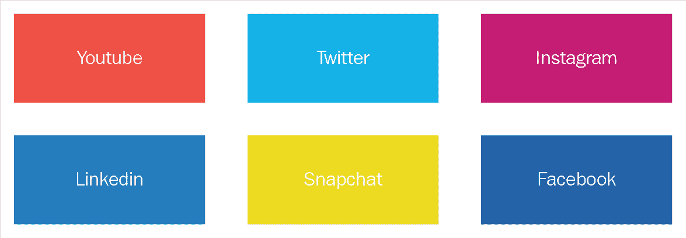Social media websites are gold mines for many social engineers# 技术的

这些方法包括使用技术产品获取客户信息。其中一种方法是在目标的社交媒体账户上跟踪他们。大多数目标在 LinkedIn、脸书、Twitter、Instagram 或 Snapchat 上都有活跃的个人资料。这些平台上的用户对他们的数据如此粗心，以至于社会工程师在许多情况下不需要寻找太多。即使在反复警告人们改变他们的隐私设置后，目标的账户很可能会被公众看到，因此任何人都可以看到。用户向陌生人展示了他们的整个生活，任何能得到赞的东西都有可能被发布。曾经是私人的信息现在被不加区别地放到公共领域。这使得社会工程师更容易收集关于目标的可用数据。然而，在某些情况下，攻击者可能没有那么幸运，因为给出的数据太少或者帐户被设置为私有。因此，这需要社会工程师创建一个与目标的偏好和喜欢相匹配的假账户。这样，客户可以请求目标成为朋友或追随他们。另一种常见的方法是使用一个以目标认识的人的名字创建的假账户。亲密的朋友、亲戚和工作中的老板被用于许多成功率很高的社会工程攻击。

第二种常用的技术性社会工程方法是在搜索引擎上进行搜索。搜索引擎索引许多网站，其中一些网站存储从许多来源收集的用户信息，并集中在一个中心位置。有一些特殊的谷歌查询可以用来挖掘网站上的人的信息。这些将在下一章数据收集中详细讨论。下面的查询就是一个例子:

```
"David Wilson" intitle:"curriculum vitae" "phone" "address" "email""
```

这是一个非常强大的查询，可以用来挖掘关于一个叫做`David Wilson`的人的任何信息。该查询将使谷歌查找任何包含名称为`David Wilson`的条目以及标题为`curriculum vitae`、`phone`和`address`的网站:

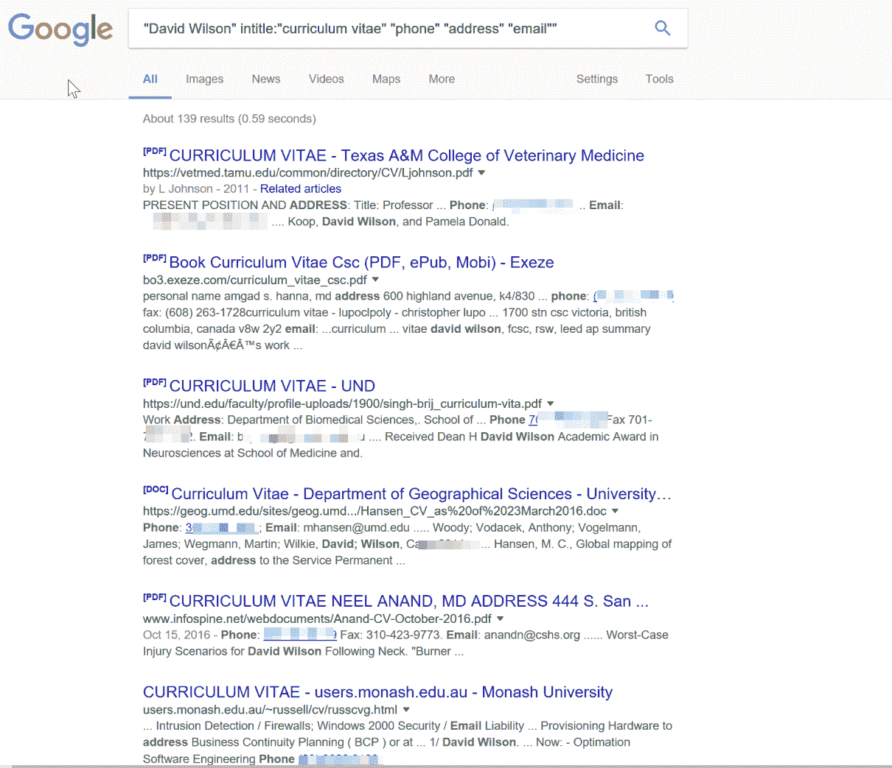Search result through Google

许多保存求职者数据的求职板将求职者信息保存在公共域中。因此，很容易找到一个名为`David Wilson`的人，从那里可以检索到他的个人信息。如果有一个网站保存了关于`David Wilson`的信息，这个查询甚至可以显示出它的简历:

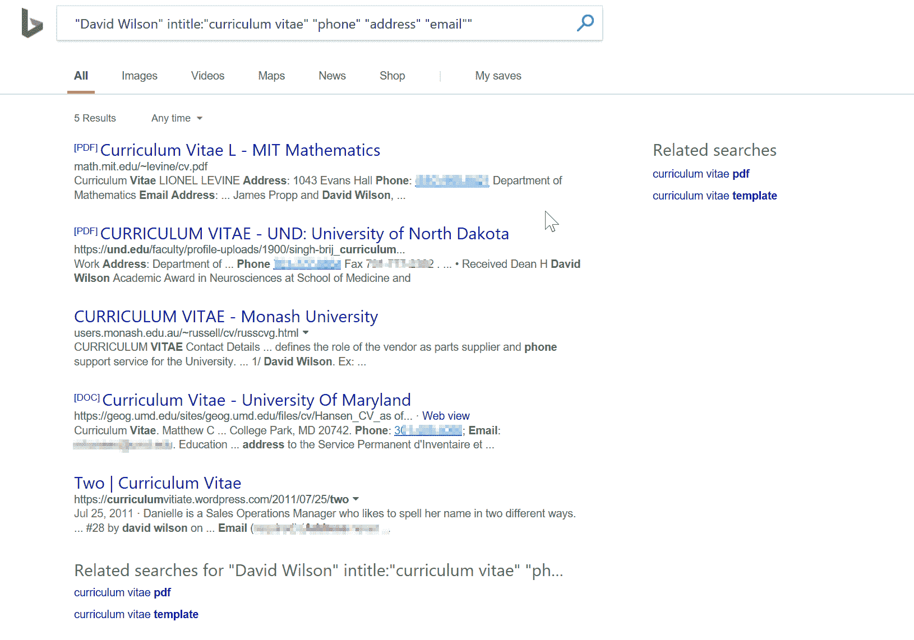Search results from Bing

一个名为**Pipl**([https://pipl.com](https://pipl.com))的网站是关于大量人的信息的最大档案库之一。对于其数据库中的每个人，该网站都保留了该人的电子邮件地址、社交媒体账户、电话号码和实际地址。该网站声称拥有超过 30 亿人的详细信息:

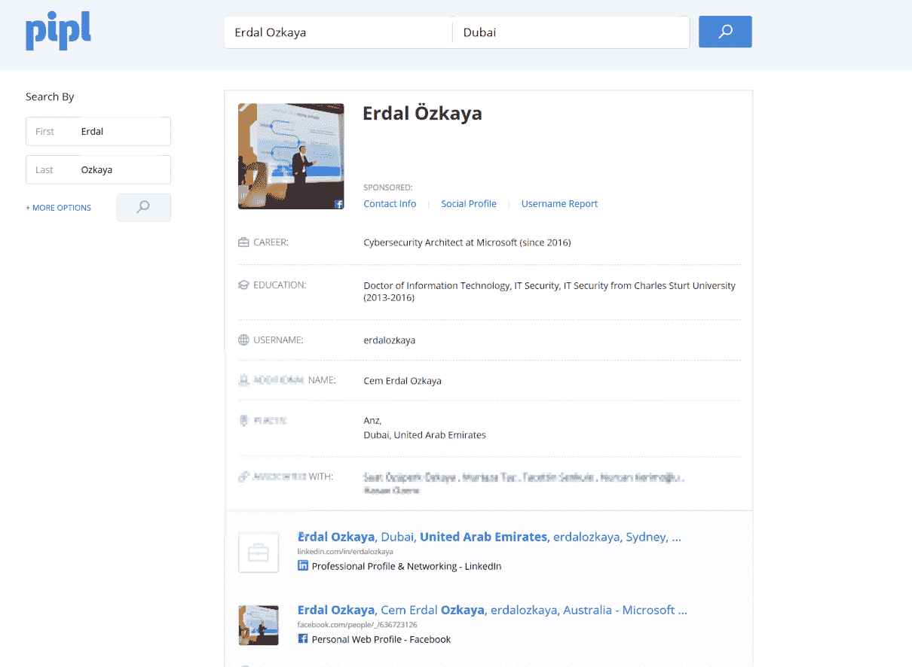A screenshot from pipl.com

它正迅速接近地球人口的一半。这个网站是社会工程师的金矿，因为他们可以毫不费力地找到关于他们目标的个人信息。还有许多像它这样的网站向任何需要这些信息的人发布私人信息。这些网站的这些记录来源广泛，包括社交平台、第三方出售的数据、黑客发布的数据、从其他网站窃取的数据以及政府机构网站中的数据。他们尽可能频繁地更新他们的数据。不幸的是，这些网站并不违法，因此任何人都很难强迫这些网站删除他们的数据。

社会工程师仍在使用的另一个技术信息来源是电话的使用。这通常是针对老年人，因为他们很容易被愚弄。打电话的人总是声称来自信誉良好的公司或政府机构。他们用诱人的提议或严重的威胁让目标给他们送些现金。有报道称，一些打电话的人自称是警察，并威胁说，如果他们在一定时间内不汇款，就逮捕目标。其他人也是目标，社会工程师拥有的最大资产是关于目标的一些信息。仅仅知道目标的银行账户就足以让客户相信这是银行打来的电话。他们可以利用银行账号让目标透露更多数据，包括社会安全号码。当目标公司意识到可能不是银行打来的电话时，通常为时已晚。社会工程师将有足够的信息来策划攻击。

数据收集确实是乏味、冗长和任务繁重的。然而，这是值得的。从目标收集的大量信息对于攻击计划至关重要。最好的数据收集方法是不先发制人的动机的社会工程师。因此，数据收集是谨慎进行的。一小块一小块的信息被一点一点地提取出来，汇集在一起。随着时间的推移，社会工程师将有足够的信息来描述一个目标。社会工程师会比目标的家庭或配偶更了解目标的生活。这是决定攻击成功与否的信息。在这一过程中还使用了许多其他的数据收集方法和工具。已经讨论过的也没有深入讨论过。但是，这些将在下面关于数据收集的主题中讨论。本章将确定所有的方法和工具，对它们进行描述，并举例说明每种方法和工具的用法。在本章的结尾，你将会像一个社会工程师一样熟练地收集关于目标的数据。

# 诱导

尽管人类有弱点，但他们通常会在第一时间退缩，不愿向任何人倾诉。把人们从他们的安全舒适区带出来是需要技巧的，这样他们就可以开始泄露私人信息。诱导不仅仅是与陌生人建立融洽的关系；这是一种在审讯室使用的技术，被治疗师和医生用来从人们那里获取信息，否则他们会隐瞒这些信息。因此，诱导是社会工程攻击中社会工程框架的第二步。攻击者在收集了足够的目标信息后使用诱导技术来启动对话。

启发可以被定义为使用逻辑诱导一些东西的行为。它是通过刺激让一个人在某一类行为中行动。因此，这个定义意味着诱导是通过刺激人们以某种方式行动，把他们从安全舒适区诱导来的能力。一个社会工程师已经掌握了启发的艺术，以至于他们可以让一个目标对提出的任何问题做出真实的反应。间谍和审讯者被训练如何使用这种技能在正常对话中获取信息。这说明已经是各国政府重视的技能了。目标很难察觉引诱的企图。它看起来很无辜，发生在正常环境中。以下是使启发如此有效的一些因素:

*   大多数人在与陌生人交谈时会尽量礼貌
*   专业人士在被询问时，会希望显得知识渊博
*   大多数人不会对真正关心的人撒谎
*   一个人很有可能会回答关于自己的恰当的问题

在启发中，社会工程师会将目标与某条路径联系起来，这样他们就可以毫不犹豫地公开分享敏感信息。它表现为简单的问答互动，而在真正的意义上，目标是欺骗泄露秘密信息。社会工程师会试图让目标顺从地回答一些一开始可能会不舒服的问题。只要社会工程师正确出牌，目标就会继续回答他们。当谈到正确出牌时，社会工程师对很多事情都很严格。这些措施如下:

*   保持自然:让谈话进行下去而不引人侧目的最好方法之一就是让对方听起来真实自然，让对方感到舒服。如果谈话显得不自然或照本宣科，很容易打草惊蛇。因此，社会工程师将在他/她(社会工程师)熟悉的对话中与目标进行交流。社会工程师也将致力于他或她的姿势，肢体语言和知识的主张。一切都必须看起来非常正常，这样社会工程师才会显得自信和自然。社会工程师通常会和他们的朋友进行角色扮演，以便在进行实际的启发尝试之前让他们的行为一致起来。

*   知识渊博:知识是社会工程师与目标互动的完美盾牌。因此，无论你对目标有什么问题，他或她都必须了解他们的预期反应。这将允许社会工程师使用一些知识来承认或不同意目标，这将使对话继续下去。当然，不期望社会工程师对要给出的回答非常了解；这可能会引起警觉。所需要的只是能够给出后续问题并对目标给出的答案做出反应的基本知识。
*   避免贪婪:社会工程师需要确保他们不会对目标表现出贪婪。如果对目标来说，社会工程师显然是在寻找特定的信息，目标很可能会关闭社会工程师。因此，一个常见的做法是让社会工程师练习给予和接受。社会工程师想出假的信息并提供给目标。在看到这种开放性时，目标通过给出一些信息来回应，但是，在这种情况下，它恰好是事实信息。

这三张卡片是任何社会工程师在与目标互动时都需要准备好的。除此之外，对于社会工程师来说，在正确的时间使用正确的面部表情是非常重要的。有些表达很难伪造，因此需要社会工程师做大量的试验来纠正它们。面部表情影响人们回答问题的方式。因此，如果必要的话，社会工程师需要使用表现出兴趣和提升目标情绪的表情。面部表情说明了很多问题，并可能影响启发尝试的结果。在任何情况下，社会工程师都需要能够出现在对话中。

启发是社会工程的核心步骤。有几个已被证实的启发技巧。这些和已经强调的将在本书第六章、、启发、中进一步讨论。这一章将训练一个新手如何掌握启发的艺术到一个专业的程度。获得的知识将适用于社会工程内外。

# 抗议

这通常是社会工程攻击的第三步。在这种情况下，攻击者成为能够影响目标做出某些决定的任何人。攻击者选择某种人格，这种人格适合他或她在社会工程尝试中选择成为的角色。随着互联网的出现，成为任何人都很容易。

社会工程师可以利用如此多的信息资源来调整任何人的性格。为了完成一次攻击，伪装是任何社会工程师都需要的必备技能。伪装不仅仅是扮演一个人的角色；它可以被认为是成为人。社会工程师不是他或她所声称的那个人，这一点不应该有丝毫的怀疑。社会工程师的性格，他们的说话方式，肢体语言，以及任何其他明显的特征必须符合他或她所扮演的角色。这是一项至关重要的技能，可以让社会工程师在不被怀疑的情况下实现攻击。

当谈到借口时，涉及到很多动态。它们确保社会工程师能够发明一个场景，并让目标采取一些行动或发布一些敏感信息。在最近的大多数攻击中，人们注意到社会工程师越来越多地使用某些备受尊重的工作人员或一些组织中高级员工的个人资料。社会工程师愿意投入足够的时间来研究他们在新的人格中所扮演的角色。他们接受训练，直到他们成为他们想要模仿的人的完美克隆。然后他们可以使用这些模仿来说服他们的目标去做他们想让他们做的事情。

借口是非常有效的，它通常用于其他领域。医生、律师、甚至治疗师在职业生活中与人交往时，都有某种伪装技巧。他们能够让人们进入一个舒适区，在那里他们释放他们一直隐瞒的信息。社会工程师努力在他们的伪装尝试中获得同样多的说服和信任。

在之前关于信息收集的讨论中，人们注意到信息收集是整个社会工程攻击成功的关键决定因素。这是收集的信息很重要的阶段之一。社会工程师必须小心使用他们绝对确信目标会上当的借口。如果在一个不幸的事件中，一个社会工程师使用了一个与目标无关的借口，整个攻击就被破坏了。例如，如果一个目标使用 B 银行，一个社会工程师打电话说他是 A 银行的官员，这个目标就会知道这是一个圈套，攻击就会失败。此外，目标会非常害怕，即使再有一次尝试也不会让他或她上当。一旦目标意识到自己被攻击者盯上，社会工程师就无能为力了。唯一明智的做法是退出并放弃整个攻击。

因此，托辞企图的成功是极其重要的。有一些在伪装中遵循的一般原则，包括如下:

*   做更多的研究:如果社会工程师做了足够的研究，就有更好的机会进行伪装。目标可能会开始问一些问题，对于社会工程师来说，根据他或她所扮演的角色的知识，拥有一些可以用来回答这些问题的信息是极其重要的。
*   利用个人兴趣:伪装将一个人置于另一个人的皮囊中，这是一项非常具有挑战性的任务。有些东西是无法轻易伪装的。这就是为什么社会工程师可能会稍微偏离他们假装的人的个性，而利用他们的实际兴趣。没有什么比发现一个社会工程师对他或她传达给目标的任何利益一无所知更糟糕的了。通过某些个人利益的目标来纠正一个假设，要比仅仅为了达到目标开始产生怀疑的程度而进行合作要好。当社会工程师与目标建立融洽关系时，使用他或她熟悉的兴趣爱好有利于自信和信任的建立。
*   **练习表达或方言**:对于目标来说，仅仅通过敏锐地聆听方言或表达，就很容易知道一个人并不是他或她所声称的那个人。在一些专业领域中存在一些术语，这些术语有助于帮助目标人物假设社会工程师确实是他或她所声称的那个人。对于社会工程师所采取的个性，坦率的谈话可能无法让目标确信。例如，如果社会工程师承担了律师的角色，就应该有某种程度的法律术语，比如提及某些法律、法案或对某些犯罪的处罚。这将很快让客户相信这位社会工程师是一位真正的律师。因此，方言在伪装中非常重要，社会工程师通常会非常重视它们。
*   使用更简单的借口:借口越复杂，成功的机会就越小。这是因为维护它需要更多的研究和努力，而且可能会失败。另一方面，一个简单的借口会更快更容易完善，这意味着目标更有可能上当。因此，只有传奇的社会工程师有选择复杂借口的选择，因为他们在处理这种借口方面有更多的知识和经验。这也意味着有许多低级别的社会工程攻击可以很容易地上演。从受害者的角度来看，更有可能是以老朋友、亲戚或老同学为借口。它们很容易伪造。

*   **逻辑结论**:社会工程攻击配合良好。从诱导到托辞阶段，应该有一个大致的模式。这些步骤必须符合逻辑。在借口阶段，开始时提供的信息必须与社会工程师想要的相匹配。例如，律师的借口不能用来让目标泄露工作登录凭证。借口应该合乎逻辑地把目标引向某个结论。IT 支持人员的借口很容易被用来诱使目标提供登录凭据。目标可以被告知，有一些系统遇到了一些问题，公司正在切换到备份系统，因此需要旧凭证来促进迁移。这个场景有一个合乎逻辑的结论。这比用律师的借口来获取同样的信息更有可能奏效。没有联系，目标很难将这些点联系起来并给出所需的信息。

社会工程师使用许多其他原则。这些将在第七章中深入讨论。总之，伪装是非常具有挑战性的，许多社会工程的尝试可能会在这个阶段失败。从防御的角度来看，应该教会用户如何质疑可疑的社会工程师，以便在这一点上挫败攻击。伪装不仅仅是假设一个伪造的身份；更多的是活出那个身份。这很困难，但如果成功了，社会工程攻击将会在正确的路线上进行。在这一步中使用了几个工具，它们将在本章中讨论。

# 思维技巧

整个社会工程攻击是基于心理诡计，所以这是社会工程攻击框架的许多其他部分使用的一个步骤。社会工程攻击的这一部分包括使用特制的技巧来改变受害者的思维模式。在生活中的许多其他领域，心理技巧在某种程度上也被使用，例如在销售中使产品价格看起来更便宜，在审讯室中让嫌疑人认罪。心理诡计更多的是一种心理事件，它们被用来打开目标的思想，使他们暴露在社会工程师的控制之下。一个优秀的社会工程师是一个很好的读心术者，这是通过掌握一些思维技巧来实现的。

心理技巧始于融洽的关系。这是用来获得目标的信任和信心的主要努力。从那里，社会工程师使用几个旨在改变目标大脑正常思维的技巧。只能比喻成一种叫做**缓冲区溢出**的黑客技术。这是一个程序被提供了比它的缓冲区所能容纳的更多的数据的地方。因此，由于信息溢出，程序开始表现不稳定。人类大脑的推理能力也同样不堪重负，这使得它容易受到社会工程师的操纵。人类有三种可以利用的思维模式，这将在[第二章](02.html)、*社会工程心理学——使用的思维技巧*中看到。这些措施如下:

*   视觉思维:视觉思考者是视觉处理信息的人。他们擅长描绘事物，他们的决策通常基于他们在大脑中创造的整体形象。因此，视觉思考者的目标是视觉上吸引人的东西，而不是对他们有益的东西。男性倾向于视觉思考，这就是为什么他们的产品在广告中具有视觉吸引力。为了进入视觉思考者的头脑，社会工程师也专注于给他们视觉输入。
*   **听觉思维**:听觉思维者非常擅长根据事物的声音进行推理。他们很容易被声音说服，因为他们对如何处理来自不同声音的信息有偏见。他们很容易被声音触动，也很容易用声音创造记忆。值得注意的是，他们不一定要通过身体交流。他们可以进入一种思考状态，在这种状态下，当他们阅读任何文本时，他们可以假设某种声音。他们更关心谨慎的选词，很少注意低努力的选词。
*   动觉思考:动觉思考者是情感思考者，他们与交谈中产生的情感联系在一起。如果谈话是热情的，他们会变得热情；如果谈话是关于悲伤的折磨，以及许多其他情感，他们会变得有同情心。每当他们参与谈话的时候，他们的情绪都很容易被抓住，这使他们处于一个主要的劣势，因为情绪往往是非常强大的。情绪可以用来让他们毫无疑问地突然改变决定。女性大多属于这一类，她们的情绪很容易被左右。

这是人类存在的三种基本思维模式。应该注意的是，人类通常不局限于特定的思维模式。他们可能拥有所有三种思维模式，但其中一种会比另一种更占优势。这是一个社会工程师将寻找的思维模式。一旦发现了它，剩下的就是小菜一碟了。想出让目标丧失正常推理能力并按照社会工程师的意愿行事的场景是非常容易的。

最大的障碍总是辨别主导的思维方法。这需要一个对话，社会工程师可以从这个对话中尝试不同的故事背景，看看它们是否唤起了目标的主导意识。

视觉思考者可以通过使用视觉问题和评论来确定。如果目标似乎以同样的方式回应，引用更多的视觉方面，可以断定他或她是一个视觉思考者。另一方面，动觉思考者可以通过使用感人的故事来确定。他或她也可以由触摸和感受事物的意愿来决定。因此，如果一个目标渴望触摸一块布或一块手表，很可能他或她是一个动觉思考者。同样，如果充满情感的小故事看起来能打动目标，也可以说目标是动觉型思考者。通过观察他或她在听或读某些东西时的反应，可以确定一个听觉主导型思考者。那些几乎不退缩的是非听觉思考者。另一方面，那些似乎与所说或所写的文字有联系的人是听觉思考者。

心理诡计的主题很长，将在第二章 、*社会工程心理学-使用的心理诡计*中更深入地探讨。然而，需要注意的是，智力游戏不是一门科学。他们依赖于社会工程师的主动调整。例如，所讨论的思维模式就不容易确定。社会工程师唯一能做的就是尽可能多地观察。使用问题来发现一个人的思维模式可能会令人恼火和不快。所以，最好的武器就是观察。还有很多其他与思考相关的事情将在本章中讨论。如前所述，思维技巧往往贯穿社会工程框架中的所有步骤。它们不是为某一事件而保留的；当社会工程攻击开始时，他们就被带进来玩。信息收集、启发和伪装被用来建立一个更开放的舞台，供他们使用。他们在社会工程攻击中至关重要，因为他们可以使攻击更短，更成功。征服了目标的心智之后，攻击就大功告成了。这个有趣的话题将在以后的章节中讨论。

# 说服

就像心理技巧一样，说服是整个社会工程过程中的一个交叉主题，因此不能局限于某一个步骤。为了说服目标，社会工程师需要首先吸引目标的兴趣。说服让目标按照社会工程师的要求做出反应、思考和行动。

说服会在目标的头脑中产生不容置疑的影响。为了攻击成功，社会工程师完善了他们的说服技巧。他们确保他们对目标的影响是无法察觉的，但却是深远的。通过社会工程师首先用来灌输给目标头脑的五个基本要素，可以最好地理解说服。它们包括:

*   **明确的目标**:这被定义为一个目标可能无助地落入社会工程师的控制之下；他或她在参与过程中必须表现出有明确的目标。归根结底，如果你专注于某件事，你就有可能成为它。一个社会工程师将会有已经建立的清晰的目标，并且他们都将会有逻辑的结构。这些目标应该有助于实现随后的目标。因此，在社会工程师与目标的任何接触中，比如说在咖啡店偶遇他们，已经有了一个预先定义的目标，这个目标的实现将促进另一个目标的实现。没有目标是孤独的；如果是，可以忽略它，因为它不会影响攻击的成功。
*   融洽关系:融洽关系的建立是为了确保目标信任社会工程师。为了建立融洽的关系，使社会工程师能够说服目标，社会工程师必须了解目标的想法。上一节已经讨论了不同的思维模式。这些对于建立这种融洽关系非常重要。关于了解目标大脑的额外信息将在[第二章](02.html)、*社会工程心理学-使用的思维技巧*中讨论。
*   协调一致:社会工程师总是意识到他们自己和他们周围的环境。这使得社会工程师能够有一个外部的视角，并注意到攻击何时按预期进行或不进行。对于任何想要变得非常有说服力的社会工程师来说，成为一个既善于观察又善于倾听的大师是至关重要的。社会工程师也是人，自然会向目标发出一些交流或信号。然而，一个社会工程师应该能够根据攻击的进展，掩盖真实的面部表情，手势，微表情，甚至他们的呼吸频率，并用伪造的来代替。因此，社会工程师应该学会如何作为一个外部实体来观察这些信号，并判断他或她对目标的吸引力。他或她应该意识到身体给出的非语言暗示，并调整它们以适应攻击环境。这种意识将使他或她能够不断地吸引目标人物。

*   灵活性:说服并不是达成目标的可靠方法。它不是某种反应物会导致某种结果或解决方案的化学反应。有时，即使有最好的技巧，目标也可能看起来没有被说服或被说服。这可能会让社会工程师放弃照本宣科的攻击，并想出其他可能最终赢得目标的技巧。因此，提前计划并不总是攻击成功的保证，在许多情况下，社会工程师需要调整他或她的方法。
*   **往复**:这是常用的说服目标的战术之一。在这种情况下，回报是指目标想要*回报*社会工程师所做的帮助。人类对此已经习以为常，以至于互惠几乎是无意识的。这是一个用来无意识地控制人们的思想去做对某人有利的事情的诡计。例如，一家制药公司向医院员工赠送衣服、钢笔、书籍和帽子等免费物品，但这并不是徒劳的。它知道，当涉及到为病人选择药物时，员工会想要回报，最终选择该公司的药物而不是其他药物。互惠的工作方式与社会工程相同。它遵循一个四步循环，讨论如下:
    *   首先，社会工程师会送出一些有价值的东西
    *   收到它的目标会有一种感激的感觉
    *   一段时间后，社会工程师会提出一个简单的请求
    *   目标将会非常乐意答应这个请求

这样，社会工程师就能控制目标的大脑。

劝说将在以后的章节中详细讨论。对于任何社会工程师来说，这都是一个非常有价值的策略。它使攻击持续进行，并确保目标处于只能支持攻击进程的位置。如上所述，它可能不总是如预期的那样成功，因此在所有的说服尝试中都应该有后备计划。社会工程路线图如下图所示:

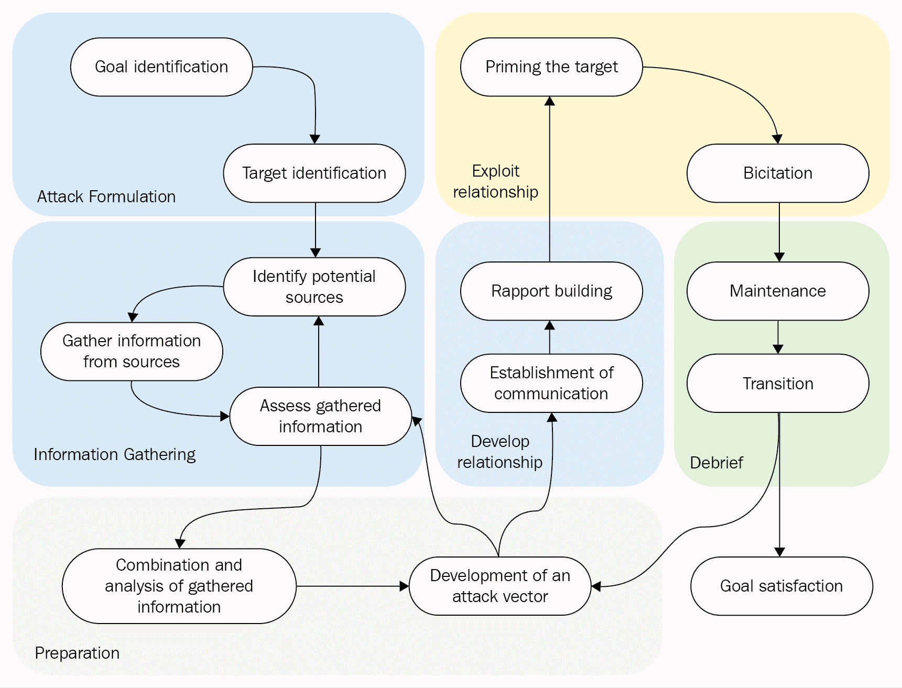Social engineering roadmap# 社会工程中使用的工具

社会工程最好在工具的帮助下完成，以便使社会工程师更接近成功。需要注意的是，仅仅拥有或使用这些工具是不够的；人们需要了解如何有效使用它们的内在细节。这种知识是成功和失败的区别。社会工程中使用的工具主要有两类——**物理**和**基于软件的**。对于社会工程框架，工具通常是一个受欢迎的补充，因为它们补充了社会工程师的手工工作。

# 物理工具

物理工具指的是用于促进不涉及计算机使用的社会工程攻击的所有工具。组织和个人投资于物理安全措施，以确保他们将物理访问限制在少数授权人员。这就是为什么家庭有门，或者更好的是，被栅栏和大门包围的原因。如果需要的话，社会工程师将不得不突破他们的目标设置的所有物理安全系统。使用的物理工具有以下几种:

*   **开锁工具** : 用于进入被锁封锁的地方。撬锁对很多锁都有效，这也是为什么它现在仍然是一个很大的威胁。组织正通过使用更多计算机化的物理访问控制(如磁卡)来应对开锁行为。令人惊讶的是，组织将如何使用 30 美元的锁来保护上千美元的硬件。
*   **推刀**:该工具用于接近带旋钮锁的门。许多家庭和服务器机房都有这种类型的门，一把推刀是破门而入的最佳工具。它滑动到位并释放闩锁。这样做不会损坏门。
*   **撞击钥匙** : 一个密切相关的工具是撞击钥匙，这是一种特殊的钥匙，它有齿，设计成撞击锁的销，使它们移动到正确的对齐位置，并允许锁芯转动。同样，它也不会损坏锁。

所有用于获得物理访问的工具通常被用来允许社会工程师访问一些项目或信息，这些项目或信息要么最终确定攻击，要么帮助攻击的进展。例如，一个社会工程师将一个目标带到了一个房间，房间里有一个装满宝石的箱子，他将使用这些工具来完成攻击并偷走宝石。

# 基于软件的工具

基于软件的社会工程工具是那些涉及计算机使用的工具。值得注意的是，这些工具可以用于许多其他目的，而不仅仅是社会工程。事实上，社会工程师从像间谍这样的人那里借用了一些工具，讨论如下:

*   **GPS 追踪器** : 其中一个是 GPS 追踪器。*除了跟踪目标的所有活动并准确知道在哪里可以找到他们，还有什么更好的方法可以意外撞上他们吗？*一个很好的例子是一辆价值 200 美元的 SpyHawk，它被磁性吸附在目标的汽车上，并使用 GPS 发回车辆的准确坐标。今天，大多数基于软件的社会工程工具都是在线的。他们可以从网上收集目标的信息。
*   这是一个在线网站，对域名、IP 地址、组织和人员等信息进行分类。这是每个社会工程师的梦想成真。

*Using penetration testing feedback to cultivate an atmosphere of proactive security amongst end-users*, by *M. Styles and T. Tryfonas,* *Information Management & Computer Security,* Volume 17, Issue *1,* pp. 44-52, 2009 available at [http://dx.doi.org/10.1108/09685220910944759](http://dx.doi.org/10.1108/09685220910944759).

Maltego 能够将关于一个人的最微小的信息捆绑在一起，包括在不太知名的电子商务商店上写的评论。它可以找出一个人的信息，家庭成员，亲戚，亲密朋友，以及许多其他细节，这将很容易找到一个弱点来击中目标。从社会工程师的角度来看，主要目标是给目标一个他或她无法拒绝的提议。天生的贪婪会解决剩下的问题，很快目标就会乞求出价:

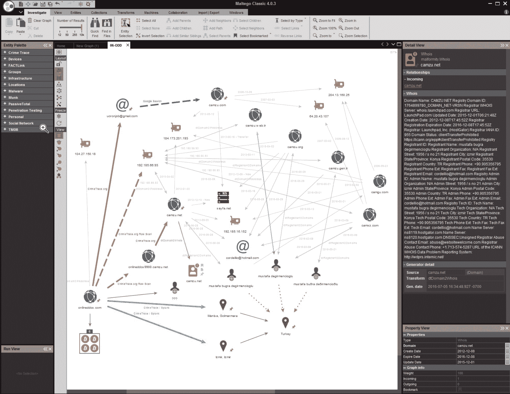Maltego screenshot

*   **社会工程师工具包**(**SET**):顾名思义，SET 包含了一组社会工程师可以在很多攻击中使用的工具。该工具包主要用于创建可以通过电子邮件发送给目标的恶意文件。主要目的是用恶意软件感染目标的设备，恶意软件可用于收集更多信息或对设备进行恶意破坏。这是鱼叉攻击的主要工具。一旦知道了目标的电子邮件，剩下的就是施展咒语了:一个下载并打开后会攻击目标的文件。该套件还用于克隆网站和托管网站。它可以克隆脸书，并向目标发送链接以允许脸书身份验证，当目标输入凭据时，会返回一个错误。这种技术用于收集大量信息，尤其是电子邮件和网上银行系统中使用的凭证。

其他基于软件的工具包括**欺骗器**和**密码剖析器**等等。

*Thoughts on techno-social engineering of humans and the freedom to be off (or free from such engineering)*, by *Brett Frischmann* at *Theoretical Inquiries in Law,* *Volume 17*, *Issue 2,* pp. 535-561, 2016 available at : [http://dx.doi.org/10.1515/til-2016-0020](http://dx.doi.org/10.1515/til-2016-0020).

来自 Kali Linux 的 SET 截图如下:

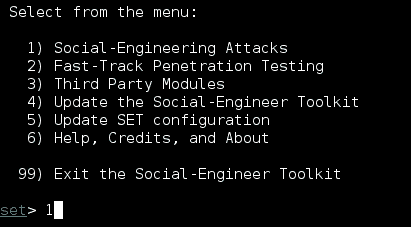SET screenshot from Kali Linux# 好莱坞的社会工程例子

真的很难不被一个社会工程师的诡计所迷惑；只要发生在别人身上，就会很尴尬。电影是帮助你更好地理解社会工程的重要资源。以下是我最喜欢的三部好莱坞电影，可以帮助你描绘和了解社会工程是如何工作的:

# 火柴人(2003)

Conmen Roy 和 Frank 通过给受害者打电话并试图以数百美元的价格向他们的客户出售水过滤系统开始了他们的骗局，而在实际商店中仅售 50 美元。这两个骗子使用了许多经典的社会工程手段，例如将电话从弗兰克传给冒充弗兰克老板的罗伊，赋予行动更多的可信度，并玩弄受害者的思想，使一切更加现实，并获得受害者的信任。故事中使用了更多的社会工程技术。这是将你将在本书中读到的一些技巧形象化的好方法。

You can refer to the movie at [www.imdb.com/title/tt0325805/.](http://www.imdb.com/title/tt0325805/)# 如果你能抓住我(2002)

这是基于弗兰克·阿巴内尔的生活故事，他是最臭名昭著的社会工程师之一。他十几岁时就开始了他的旅程。阿巴戈内尔离家出走，并设法冒充泛美飞行员，在世界各地骗取数千英里的免费航班，让人相信他是一名真正的飞行员。

这还不是全部。阿巴内尔在被联邦调查局抓住之前(多年后)也曾假扮成医生和教师。这部电影是一个很好的例子，说明了社会工程是人类黑客的艺术，以及我们人类是多么的脆弱。

You can refer to the movie at [http://www.imdb.com/title/tt0264464/?ref_=nv_sr_2](http://www.imdb.com/title/tt0264464/?ref_=nv_sr_2).# 十一罗汉(2001)

丹尼·奥逊(乔治·克鲁尼饰)和他的 11 名同伙计划同时抢劫拉斯维加斯的三家赌场。Ocean 先生和他的同谋利用社会工程、技术智慧和策略上安插的内部人员，渗透到 Bellagio 全面的、最先进的安全系统中，带着 1.6 亿美元潜逃。

在这种情况下，即使最好的防御措施也不能使组织免于被一致的对手渗透。

You can refer to the movie at [www.imdb.com/title/tt0240772/?ref_=nv_sr_2.](http://www.imdb.com/title/tt0240772/?ref_=nv_sr_2)# 技巧

考虑以下提示:

*   人类的愚蠢是无药可救的，或者换句话说，总有一种方法可以操纵人类(正如你将在本书中读到的)。因此，你或你的员工是最困难的，也是你必须保护的最大资源。
*   经常召开用户认知会议。任何社会工程培训总有改进的空间。
*   不要与任何人分享任何敏感的东西。记住，一旦秘密被两个人知道，它就不再是秘密了。
*   如果你对任何事情都不确定，小心行事。
*   确保物理安全。
*   对信息进行分类，防止垃圾搜索攻击。即使是大公司过去也使用过这种攻击。
*   请记住，根据 2016 年的 ISACA，社会工程是组织面临的最大网络威胁，比例为 52%。无论您何时阅读本节，社会工程仍将是最危险的攻击类型之一

Refer to [www.isaca.org/cyber/Publishingimg/ISACA_CSX_Facts_2016-2-L.jpg](http://www.isaca.org/cyber/Publishingimg/ISACA_CSX_Facts_2016-2-L.jpg) for the top three cyber threats facing organizations in 2016.# 摘要

本章对社会工程的概述表明，这种类型的攻击有很多方面。这些工具从思维技巧和说服策略到在线的、基于软件的社会工程工具。这一概述带来了一个重要的认识，即人类的弱点是可以被利用的。人脑可以像电脑一样被黑客攻击。这使得社会工程师有可能操纵人们采取他们通常不会采取的行动。这种介绍让人们对社会工程师的能力有了一定程度的认识，从读心术到使用 GPS 定位器跟踪运动。未来的章节将进一步详细讨论所有这些。在最后一章的结尾，一个热心的读者将获得社会工程技能，这些技能很可能被用来教你社会工程师如何思考，这样你就可以防范他们。

下一章将从社会工程心理学开始。它将讨论所使用的思维技巧和社会工程师用来说服目标的技术。它也将更深入地研究人类的思维模式以及每种模式是如何被利用的。读者还将学会如何与目标互动，获取信息，赢得好感，而不引起警觉。

