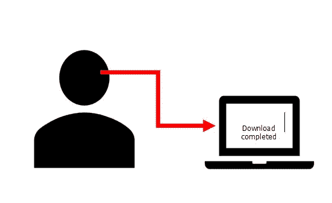
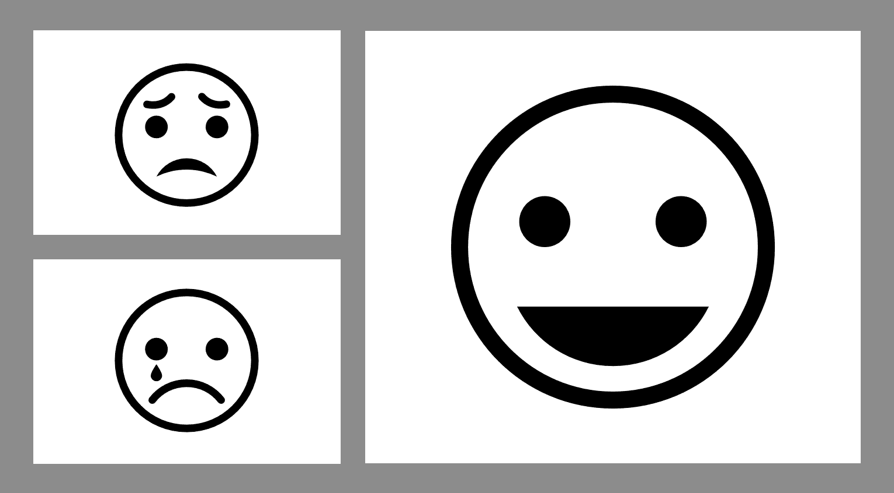
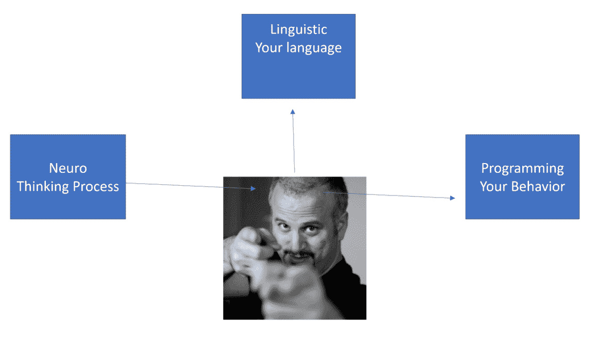
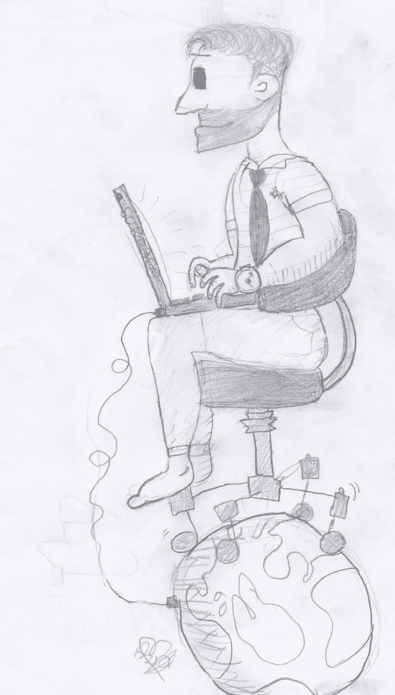
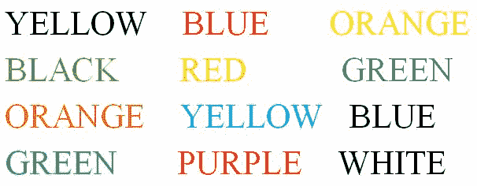

# 二、社会工程心理学——使用的心理技巧

整个社会工程攻击都是心理上的，之所以有效，是因为攻击者在目标身上玩了心理把戏。这些心理技巧旨在改变受害者的思维模式，使他们更符合社会工程师的要求，无论他们看起来多么不寻常。看看娱乐产业，尤其是电视节目和电影，头脑戏法被描绘成神秘的力量。那些拥有它们的人被证明可以毫不费力地锁定目标，让他们交出他们的财产和金钱以及其他东西。2016 年的一部名为 *The Catch* 的系列电影就是其中之一。它向观众介绍了一个以克里斯托弗·霍尔闻名的罪犯的生活。他被认为是社会工程学的专家。在系列中，他能够在重新考虑和翻开新的一页之前，骗走他的未婚妻一生的积蓄和一位阿拉伯公主 1500 万美元。这位演员表演骗局时的轻松自如最能吸引人们的注意力。他能够扮演多重人格，对目标人物玩心理战，从而让他们不问问题就给他钱或财物。

*The Catch*, at *TV Guide 2016* available at [http://www.tvguide.com/tvshows/the-catch/episodes-season-1/799838/](http://www.tvguide.com/tvshows/the-catch/episodes-season-1/799838/). [Accessed on November 20, 2017].

问题是，一个人在现实生活中有可能获得这样的能力吗？本章深入探讨了这一点，并在结束时；你会和好莱坞角色一样是个好骗子。当然，这里的主要意图是让您深入了解社会工程师的想法，以便帮助您抵御社会工程师的攻击。本章介绍了以下主题:

*   思维方式
*   微表情
*   神经语言程序设计
*   审问
*   建立融洽关系
*   人类缓冲区溢出

# 介绍

在执法部门，有专门的审讯人员，他们经过特殊训练，学习如何从嫌疑人那里套出真相。他们学习人类大脑的心理学，以及如何打开嫌疑人的大脑，找出真相。心灵诡计因此不是只能在电影中实现的幻想；他们是真实的。正是人们给出的暗示，如果研究得好，可以让人读心。在本章中，您将学习攻击者如何观察这些线索，以及他们如何根据目标的行为提出问题以让他们开口。除此之外，你还将了解他们如何与目标建立融洽关系，如何获得信任，以及如何与目标建立信心。这些伎俩甚至被销售人员用来说服人们购买他们本来不会购买的东西。最后，这一章探讨了终极思维技巧:人类大脑的黑客攻击。根据上一章的介绍，概述解释了人脑可以像电脑一样被黑客攻击。所有需要做的就是创建一个缓冲区溢出，人类大脑会毫无防备地给出你所寻找的任何信息。您将了解攻击者如何导致缓冲区溢出。值得注意的是，像任何技能一样，这些技巧需要数年时间来完善，并且需要大量的练习才能熟练掌握。因此，作为一名学习者，就注意力和练习而言，这可能是对你要求最高的章节之一。在深入研究思维技巧的核心内容之前，最好先了解一下关于大脑的基础知识。正如概述一章所介绍的，有三种不同的思维模式。这些可以被不同地利用，社会工程师在攻击前花时间找出目标的原始思维模式。

# 思维方式

为了进入目标的大脑，攻击者需要完全理解目标的思维方式。这是最合乎逻辑的做法，以避免浪费精力和时间试图猜测周围的思维技巧，这可能会失败，并挫败整个攻击。一个人不需要成为心理学家来理解人们是如何思考的；要知道这一点，所需要的只是一些专注的倾听和小心的提问。联邦调查局明白这一点，并在一份公告中解释说，如果一个人能以客户喜欢的方式向客户确认非语言行为，并与客户的音量和语气相匹配，客户就会敞开心扉。公告所说的是，如果一个人理解了客户的思维模式，然后在语言和非语言上与之匹配，客户就不会不愿意透露隐私细节。因此，挑战在于识别目标的主要思维模式。这是一项艰巨的任务，因为连目标都不知道这一点。因此，社会工程师必须使用一些技术来识别模式。

决定一个人思维模式的唯一途径是通过感官。大脑只不过是一个神经元网络，从身体的其他部分接收和发送感觉脉冲。因此，思维方式与一个人的主要感官密切相关。人们会很自然地偏爱某种特定类型的感官输入。因此，它将成为储存事物、人物、事件等记忆的主要方式。有些人有很好的嗅觉，有些人有声音，有些人有触觉，有些人有味觉。正是这些感官可以清楚地表明一个人的主要思维方法。

*Thinking styles and modes of thinking: Implications for education and research*, by *Z. Li-Fang*, *J. Psychol,* Volume 136, Issue *3,* pp. 245-61, 2002 available at [https://search.proquest.com/docview/213835818?accountid=45049](https://search.proquest.com/docview/213835818?accountid=45049).

人类表现出五种感官和三种思维模式。根据人们表现出来的思维方式，他们可以被分为三种类型。这些是:

*   视觉思考者
*   听觉思想家
*   动觉思想家

# 视觉思考者

大多数人，尤其是男人，倾向于视觉思考者，因为他们能最好地记住视觉上的人、事和事件。他们可以轻松地记住场景、颜色、纹理和一般外观。他们能够清晰地描绘过去和未来的事件。他们的决策也是基于他们得到的视觉输入，他们更喜欢决定他们能看到的东西。他们做出的决定更倾向于视觉上更吸引他们的东西。尽管许多人都属于这一类，但并不是所有人都这样，因此社会工程师不会做出这种盲目的假设。有可能找到在决策中最少考虑视觉输入的人。试图说服视觉思考者在没有视觉输入的情况下做出某个决定是相当困难的，甚至是不可能的。

# 听觉思想家

另一方面，听觉思考者依赖音频输入。他们也通过声音最好地记住事情。他们可以很容易地回忆起声音、声调、音量、音高和许多其他声音特征。听觉思考者也往往会不自觉地对与声音相关的词汇产生偏好。他们可能会说，*直觉告诉我，*或者*这个想法听起来很棒*还有很多其他事情。在与这类人打交道时，社会工程师往往会谨慎选词。大量的精力都花在了选择对这类思考者来说听起来特别的词语上。如果他们听到某件事以他们喜欢的方式表达出来，他们会很容易做出有利的决定。试图说服听觉思考者而不使用听起来很棒的词语和想法是很困难的，甚至是不可能的。

# 动觉思想家

这些思想家具有高度的感情。他们有基于他们得到的感觉的记忆，无论是身体上的还是情感上的。从生理上来说，他们的决策受到物理环境条件、质地、强度、重量以及任何能够唤起感觉的东西的影响。他们不仅想听到或看到柔软的东西，更想触摸它，直接感受它的柔软。他们也倾向于记住人或事物给他们的内心感受。羞辱、愤怒、喜悦和困惑是他们会记住的感觉。他们的词汇中也可能包含暗示情感的词汇，例如，*那感觉如何？*、*我们会联系*、*让我掌握整体思路*。动觉型思考者的目标是使用那些容易激发情绪和感觉的东西。

因此，当他们成为目标时，攻击者希望他们感受到一些东西，并让他们相信这是一种直接来自内心的强烈信念。攻击者必须在这类思考者身上植入感情。不唤起他们的感觉和情感，很难成功地向动觉型思考者推销想法。

# 决定一个人的主导意识和思维方式

这三种讨论过的思维模式很难辨别，因为人们倾向于同时拥有两种或全部，但其中一种通常会胜过其他的。使用的主要技巧是专注和敏锐的倾听。因此，攻击者发起对话，并注意目标的用词和非语言肢体语言的使用。例如，如果一个人向目标打招呼，而目标没有抬头，这可能会被解释为粗鲁或暗示目标不是视觉思考者。然而，提出有洞察力的问题必须以正确的方式进行。这些问题必须包含某一类思考者偏好的主导词，以唤起所需的思考模式。在询问和倾听回答时也必须小心谨慎。例如，*我会联系你，*这样的回答不应该被自动理解为这个人是一个动觉思考者。这个短语很常用，不同思维模式的人可能会用到它。它应该被看作仅仅是一个提示，帮助攻击者继续提问，以巩固一个人是动觉思考者的假设。还应该谨慎，因为太多的问题可能会激怒被调查者，从而让他们感到不快。

# 理解目标思维模式的重要性

理解目标的思维模式的重要性在于让目标进入舒适区。当目标处于舒适区时，他们很容易就打开了。人类通常倾向于被那些让他们感到舒适的人所吸引。以下面的场景为例，一个社会工程师在餐馆里发现了一个目标。这位社会工程师坐在一张客户能直接看到的桌子旁，在某个地方，他肯定能抓住目标的注意力。为了辨别目标的思维模式，社会工程师使用一支金笔。为了判断目标是否是一个视觉思考者，社会工程师在向服务员示意的同时，将它挥舞或在空中轻弹。

在这一点上，如果目标是一个视觉思考者，当金笔被轻弹或挥动时，他或她会看到金笔，社会工程师会观察这一切。如果这不起作用，社会工程师在打开和关闭金笔时点击它。如果目标是一个听觉思考者，他或她的注意力可能会转向笔的声音，并且可能会抬头看看这是否确实是一支笔。如果所有这些都没有结果，社会工程师可以走向客户的桌子，轻轻地将笔放在目标的肩膀或手臂上，然后说:*对不起，你知道现在几点了吗？我觉得我迟到了。*

下图显示了目标的思维模式:

如果最后一种方法有效，并且目标突然对笔产生了兴趣，社会工程师可以继续确定目标是否是一个动觉思考者。这可以通过这样的陈述来实现，比如，*你明白我的意思，*或者，*我觉得你正在迎头赶上。显然，根据目标的环境和类型，会有更好的词汇选择。但是在互动结束时，社会工程师将会确认目标是否是一个动觉思考者。如果没有，社会工程师将跟踪其他线索，以确定目标的思维模式，并纠正所使用的方法。结果将是通过与客户最匹配的表达和单词选择，让目标在社会工程师周围感到舒适。这就是辨别思维方式的重要性。*

值得注意的是，决定一个人的思维模式不是一门科学，也没有确定性。它只不过是社会工程师工具箱中的工具之一。在社会工程攻击中，还有其他更可靠的方面。这些方面中的一些是如此强大，以至于它们被成功的心理学家和审讯者广泛应用。其中之一就是**微表情**。

# 微表情

随着人类的发展，他们开始熟悉阅读面部表情。只要看他们的脸，他们就能知道对方是高兴、悲伤、厌恶等等。然而，这些表情也可能是伪造的，人类也在成长过程中知道如何巧妙地伪造它们。这些长时间戴在人脸上的表情叫做宏观表情。既然他们不是那么非自愿的，他们可以伪造，因此不能完全依赖。但是，有一种表情叫做微表情。这些都是不由自主的，无法伪造或控制。它们是由内心深处的情绪引起的，当它们触发并引起面部意外的肌肉抽搐时。这些表情很短，甚至不会持续一秒钟，而且几乎无法控制。它们体现在一个人可以长期佩戴以愚弄他人的宏观表情上:

很长一段时间以来，医生、研究人员和人类行为专家一直在研究微表情，最终目标是知道他们何时被欺骗。社会工程师擅长理解他们目标的微表情，并能发现欺骗的迹象。微表情研究的权威之一是保罗·艾克曼博士，他写了许多关于这个主题的书，包括*情感流露*和*揭开面孔*。

*Evidence for training the ability to read microexpressions of emotion*, by *D. Matsumoto and H. S. Hwang*, *Motivation and Emotion*, Volume 35, Issue 2, pp 181-191, 2011 available at [http://dx.doi.org/10.1007/s11031-011-9212-2](http://dx.doi.org/10.1007/s11031-011-9212-2).

埃克曼博士在他的书中指出了七种主要的微表情，我们将逐一介绍。

# 愤怒

根据埃克曼博士的说法，愤怒是人类最容易发现的微表情。有几块肌肉可以清楚地显示一个人是否生气。一个愤怒的人主要会有狭窄紧绷的嘴唇和向下倾斜的眉毛，比平时画得更近。愤怒是一种非常强烈的情绪，但人类仍然可以用他们伪造的宏观表情来隐藏这种表情。然而，如果仔细观察，在几分之一秒内，这种表情会在被隐藏之前在一个人的脸上显现出来。由于识别愤怒的机会窗口可能很小，社会工程师将加强他们识别愤怒的能力。他们通过教会自己如何再现愤怒表情来做到这一点，这样他们就可以很容易地察觉到它们，也能够熟练地抑制它们。如何再现愤怒表情的训练很简单，可以通过以下四种方式完成:

*   你必须迫使眉毛向下朝向鼻子，并靠得更近
*   眉毛向下，应该尽量把眼睛睁大，但不要影响眉毛的位置
*   一个人的嘴唇应该绷紧，紧紧地压在一起，但不要皱起来
*   一个人只要一动不动就可以盯着任何东西或任何人

仅仅是练习这个就会引起一些轻微的愤怒。最终目标是，人们将能够在这个表情出现的几分之一秒内自动检测到它。

# 厌恶

它和愤怒一样强烈，用于对完全不喜欢的事情做出反应。某个人非常讨厌的某种食物，只要一想到它就能引起厌恶，更不用说它的气味或视觉了。厌恶的主要特征是上唇抬高露出牙齿，鼻子有皱纹。有时，当鼻子皱起时，脸颊会抬高，好像在防止吸入难闻的气味。厌恶通常是对嗅觉、视觉或思想的一种反应，因此很容易隐藏。当向社会工程师表达时，这是一个好迹象，表明目标对他说的话一无所知，这是一个很好的红旗，表明他放弃了整个任务，或者在社会工程攻击中采取了另一种方法。这是因为，当一个社会工程师到了让目标厌恶的地步，就意味着几乎失去了一切。厌恶是强烈的，社会工程师的任何想法、气味、视觉或个性都会引发这种表达。厌恶与负面情绪密切相关，当它被唤起时，所有这些情绪都会爆发。因此，当它出现时，社会工程师通常会后退一步，以另一个借口开始工作，或者放弃整个攻击。

# 轻蔑

蔑视与愤怒密切相关，两者很容易混淆。在他的第一个表情列表中，埃克曼博士只有六种表情，因为他把蔑视排除在外，认为它和厌恶是一样的。在研究发现这两种表达方式完全不同后，他后来重新审视了这个列表，并添加了轻蔑一词。蔑视是不同的，因为它只表达对人和他们的行为。从生理上来说，轻蔑的特征是鼻子起皱和单侧唇裂。这和厌恶的区别在于，一个被厌恶的人会扬起整个嘴唇。一般来说，仅仅通过观察一个人是用整张脸还是用半边脸来表达，就可以把轻蔑和厌恶区分开来。一侧肌肉的额外紧张表明它甚至比厌恶更强烈。一个表现出轻蔑的人会造成伤害。这就是为什么它可以在法庭上被起诉。这是一个社会工程师必须不惜一切代价避免的表达。一旦被触发，不仅攻击会失败，而且社会工程师可能会被目标伤害。

# 害怕

恐惧是一种零星的表达，在某些情况下会自动表达出来。恐惧是生物控制的，因为它涉及肾上腺素的产生，以促进逃跑或战斗反应。恐惧的特征是扬起的眉毛，张大的嘴巴，和合在一起的眉毛。一个感到威胁或危险的人会很快表现出恐惧。威胁可以是身体上的，情感上的，或口头上的，但它会引发同样类型的反应。它不容易隐藏，因为它与许多生物过程有关。然而，人们可以抑制它，使它的物理表现最小化。

在社会工程中，恐惧通常被社会工程师用来使目标以某种方式行动或做出某种决定。它通常用于让目标透露非常敏感的信息或在几乎没有抵抗的情况下提供有价值的资源。有人打电话给人们，特别是老年人，假装是执法人员，要求他们支付一定数额的罚款，否则他们会把他们送进监狱。一直有骗子联系冒充 FBI 的人，对使用 torrents 的人进行跟踪。同样，他们一直要求人们支付一定的金额，否则将被关进监狱。这两种类型的威胁有相似之处。他们都利用了恐惧。一个人最终会进监狱的威胁足以让他或她放弃一定数量的钱。在社会工程中，许多东西可以用来给目标灌输恐惧。因为这是精心做的，社会工程师们会事先确切地知道一个人害怕什么，并利用它来推进他们的攻击。社会工程师也可以利用恐惧进入敏感的办公室和建筑。他们不仅对他们的目标使用它，他们对任何人都使用它，这就是为什么他们花很多时间练习如何使用它。如果一个秘书拒绝他们进入一个高级官员的办公室，这个社会工程师会立刻威胁到秘书的工作。这位社会工程师可能会声称是被个人要求来修理一个计算机问题，如果他没有这样做就离开了，老板可能会生气并解雇秘书。这是一种易于使用的情绪，很容易被观察到，因此社会工程师会知道它什么时候起作用，什么时候不起作用。

# 惊喜

惊讶与恐惧紧密相连，就像厌恶与轻蔑相连一样。惊讶表现在身体上，眼睛睁得大大的，下颚也不听使唤。与前面提到的表达方式不同，惊喜既可以是好的，也可以是坏的。人们会对不同的事情感到惊讶，比如意想不到的问题和意想不到的结果。好的惊喜会带来积极愉快的回应。另一方面，坏的惊喜会导致消极的反应。社会工程师倾向于带着好的惊喜工作，因为这些能很快让目标放松，也能增加社会工程师所说的话的可接受性。因此，他们总是有东西来触发好的惊喜，比如礼物或笑话。

# 悲哀

悲伤是一种强烈且无法抗拒的情绪。它具有高度的传染性，因为人类只要看到表达过这种情绪的人，就会感受到这种情绪。它的特征是嘴巴微张，嘴唇拉向嘴角，脸颊翘起呈斜视状，目光低垂。悲伤不能被希望赶走，因此它需要时间才能消失。悲伤也有不同的层次，从微妙的悲伤到压倒性的悲伤。它也可以很容易地从假笑中被挑选出来，因为它是如此强烈。如果有人讲一个悲伤的故事，悲伤常常会充满整个房间。

在社会工程的世界里，每一种强烈的情感都是一种工具，悲伤不会被遗忘。它被用来引发即时的同情，让人们不可抗拒地付出金钱和信息。更不用说社会工程了，悲伤被用于慈善基金会，从人们的口袋里挤出钱来。有些基金会在广告中使用饥饿、瘦弱、肮脏、哭泣和体弱多病的儿童形象，并告诉观众，只需少量，他们就可以给这些儿童的脸上带来快乐。这是一个专家使用悲伤作为引发人们某种反应的触发器，这些广告商对此再清楚不过了。社会工程师把这个提升了一个档次，他们用这种情绪开玩笑，让人们不假思索地给出更有价值的东西。一名社会工程师将*撞向一个目标，并解释一个非常悲伤的折磨。悲伤的折磨围绕着近亲、怀孕的妻子和孩子的死亡。为了增加趣味，社会工程师加入了宗教因素来软化目标的心。一个人可以轻易地从一群毫无戒心的人身上骗取钱财，用作回家看望生病的孩子或分娩中的妻子的油钱。不知情的目标一旦听到这样的折磨，就会掏空他们的口袋。悲伤让人做出意想不到的事情，社会工程师反复滥用它。*

# 快乐

这是最假的表情之一。看到互相厌恶的人见面握手时面带微笑是很平常的事。在这些微笑的背后是死亡的呻吟和结束对方的疯狂想法。幸福是假的，因为它被认为意味着在许多其他事物中有和谐、理解、快乐和合作。对于一个社会工程师来说，区分真实微笑和假笑是非常重要的。长久以来，假笑一直是人们好奇的对象，杜兴·德·布洛涅在 19 世纪对假笑做过一项研究。

他在一名男子的脸上使用电极，触发了负责微笑的肌肉，并能够确定真实微笑与诱导微笑或假笑之间的差异。他想出了今天使用的以下认识。真正的微笑，有两块不由自主触发的肌肉是无法主动触发的。这些是颧大肌和眼轮匝肌。可观察到的肌肉是眼睛周围的眼轮匝肌，它们是假笑和真笑的真正决定因素。

所以，真笑和假笑的区别在于，真笑的特点是脸颊凸起，眼睛宽阔但很窄，下眼睑有向上拉的趋势。总之涉及到整张脸。另一方面，假笑只以嘴唇和脸颊为特征，因为它们有可控制的肌肉。因此，假笑只会出现在脸的下半部分，下眼睑，眼睛会保持不动。社会工程师在开始与目标进行面对面的互动之前学会如何观察这一点。这样做的目的通常是为了能够发现一个真实的微笑，因为有很多假笑。真正的微笑在攻击中非常重要。从目标出来，说明他(她)自在。这表明社会工程师对目标产生了积极的影响。

# 训练看微表情

在介绍了所有这些微表情之后，看看社会工程师如何训练使用它们是很重要的。如前所述，它们被用作触发器和指针。有些会触发目标以某种方式行动或做出某种决定。其他的将被用作指针，当一个交互按计划进行或者要失败的时候。据说，微表达式在被虚假的宏表达式替换之前，甚至会在几分之一秒内显示出来。本节将介绍如何识别微表情的培训过程，并使用这些信息来推进社会工程攻击。

学习如何读懂一个微表情的最好方法是通过练习，这样你就可以知道涉及到的确切肌肉。社会工程师在镜子后接受训练，学习如何识别哪怕是最轻微的肌肉抽搐。这是一个真正的微笑，一个目标将显示几分之一秒，这将意味着攻击正朝着正确的方向发展。同样，第二长的厌恶表情会告诉社会工程师，攻击走了一条错误的道路。学习如何再现这些表情还有另一个好处。他们是攻击的一部分。一个社会工程师需要摆出一副真正惊讶的表情，即使他预期目标会有某种结果。

训练如何看到微表情是读心术的第一步。从七种主要表现形式的讨论中，讨论了附属的情绪。表情与表情紧密相连，如果一个人能读懂表情，他或她就能说出目标的真实情感。然而，阅读表达不足以进行社会工程攻击。知道目标对某事的真实感受并不能解释为什么他们会有这样的感觉。为了把所有的碎片组合在一起，一个社会工程师需要擅长于询问，阅读身体语言和启发，以便小心翼翼地把目标导向某个方向。尽管如此，微表情阅读技巧本身对于社会工程师来说仍然非常有用。下一节将讨论为什么会这样。

# 如何在社会工程攻击中使用微扩展？

到目前为止，这一章已经让你更深入地了解了一个人的思想和心理。从读懂微表情的能力开始，你就变成了读心术。现在是时候深入了解社会工程师如何恶意使用微表情来进一步攻击了。

攻击时微表情的使用主要有两种方法，如下:

*   第一个是唤起某些情绪
*   第二个是确定目标何时具有欺骗性

第一种表达情感的方法，在某种程度上，在对七种表达的讨论中已经涉及到了。没有深入探讨的是，操纵一个人的情绪是可能的。研究由李、津巴、博姆和帕勒进行，志愿者观看一部电影，每 1/25 秒记录一次他们的面部表情。在研究结束时，发现几乎所有的志愿者都表达了与电影中相似的情感。这是人类大脑黑客的一种形式，因为社会工程师可以通过展示一些情绪来巧妙地在受害者的大脑中植入一些情绪。这最好被称为**神经语言编程** ( **NLP** )，这将在下面的一节中介绍。

唤起某些情绪对于社会工程攻击是有用的，因为它克服了人类被教导的某些挑战。在一家公司中，一名社会工程师可能带着一个装有某些恶意软件的 u 盘走进来，唯一的目的就是让该恶意软件进入公司的网络。社会工程师可能带着悲伤的表情接近接待员，声称要来参加面试，但他的简历丢失了，因此请求接待员好心地为他打印另一份简历。他选择穿的情感很重要。悲伤是很容易转移的，它会唤起同理心。由于这一点，接待员会不情愿地拿走闪存盘，将其插入公司的电脑并打印简历，希望以此减轻潜在员工的痛苦。最终目标将会实现；u 盘里的恶意软件会进入组织网络。对于每一个不同的场景，社会工程师会选择最合适的表达方式来影响目标，以实现他或她的目标。这和之前讨论的为受难儿童捐款的广告是一样的。广告商确保人们能够看到贫穷、绝望和营养不良的儿童的形象。这些东西展示出来后，大脑变得情绪化，并准备遵从帮助这些孩子的请求。即使不是每个人都会捐款，这个广告也会影响大多数人的情绪状态。这就是微表情的强大性质，它们可以很容易地被用来让社会工程师执行广泛的恶意行为。

由于在社会工程中使用微表情作为武器的严重性，如果你在这一点上了解一些缓解措施是最好的。必须让员工意识到这种狡猾的诡计，就像刚才讨论的那样。必须教会他们如何在任何时候都尊重组织的安全政策。即使在被感动的时候，他们也应该优先考虑整个组织，而不是单个人的意愿。在接待员的理论示例中，很可能是拇指驱动器中的恶意软件感染了组织中的所有计算机，删除了一些数据，损坏了一些文件，导致数百万美元的损失，并导致许多工作的终止。因此，员工必须时刻牢记这一点。必须教会他们如何怀疑自己的情绪，因为它们会被恶意的人所操纵。这样的回答，*虽然我很想帮助你，但是安全政策禁止你的请求，但是你可以花一点时间去附近的网吧打印你的简历。我应该通知人力资源部你会晚到几分钟吗？*这就是拯救整个组织免于因网络攻击而衰落的全部代价。这是挫败社交工程攻击的完美回复，同时也消除了前台的指责。澄清了这一点，我们就可以轻松地转向使用微表情的第二种方法了。

第二种方法是微表情可以用来检测欺骗。对于一个社会工程师来说，辨别目标的回答是否真实是非常重要的。微表情只是社会工程师用来检测欺骗性反应的技术的一部分。通常还会辅以其他技术来确认目标是否在撒谎。谎言还会带来其他的东西；矛盾，犹豫，行为变化，姿态。我们将逐一查看。

# 矛盾

当把矛盾作为欺骗的指针时，建议谨慎。这是因为人们确实忘记了一个故事的事实，因此最终自相矛盾。有时，人们记得他们自己版本的故事，可能与其他版本不同。这很常见，在法庭上见证人对所发生的事情给出不同的描述时，我们已经见过很多次了。因此，有矛盾的回答者并不总是在说弥天大谎。所以要用后续问题。

假设一名社会工程师正在使用拇指驱动器瞄准公司中的某个特定人员，例如采购经理。社会工程师必须确保将 u 盘插入采购经理的计算机，以便他可以安装恶意软件来执行一些恶意操作，如复制数据。他会想出一个合适的借口去见采购经理，然后去碰碰运气。确认采购经理在后，他可能会去接待处，却被告知目标不在。然而，社会工程师已经做了尽职调查，并确保目标是在和这是一个矛盾。他可能会接着说，会议是前一天预先计划好的，但他记性不好，因此也可能在错误的日期来了。可以用两种方式对这一后续行动作出回应；接待员可能会强调目标不在，或者说她会去看看他是否在。第二个回答与前一个回答相比发现了更多的矛盾。为了挽回接待员的面子，社会工程师可能会感谢她的意愿，并说他也可能把日期搞混了。这样，接待员会觉得和社会工程师在一起很自在，这有利于攻击。如果回答是经理不在，这种缺乏矛盾可能意味着目标可能不在或者那天可能没有访客。处理这件事的最好方法是要求接待员确认经理将在的日期。这在两种情况下都是双赢的局面。

# 犹豫

犹豫是某人不诚实的一个重要标志。如果问了一个问题，应该很快给出预期的答案，但如果有不适当的延迟，这可能意味着回答者正在花时间编造答案。很容易挑出这一条，因为人们习惯于问答式的对话。犹豫的一个特殊技巧是在回答之前重复问题。背诵答案所花的时间表明，回答者正在编造答案。然而，对语速慢的人要小心，因为他们在回答之前可能真的会犹豫。

# 行为变化

当提出某个问题时，通过观察回答者前所未有的行为变化可以发现谎言。这是审讯室常用的技术，因为它有助于审讯者发现微妙的谎言。如果回答者突然改变他或她的坐姿、姿势或说话方式，很可能给出的回答是欺骗性的。然而，这些行为变化不一定总是表明谎言，因为它们可能是真实的变化。也许一个人长时间被限制在一个特定的坐姿，或者也许最初采取的姿势很累。因此，这些行为不是准确的指针，但它们是引起对给定响应的兴趣的原因。行为变化表明欺骗的原因是，它们被视为延迟，以允许回答者编造答案，或给他或她充足的时间来决定是否透露某些信息。

# 手势

手势通常在演讲中用来绘画。人们认为说谎的人经常触摸或摩擦他或她的脸。其他要检查的指标是手势频率、速度和持续时间的变化。同样，这些都是拖延战术，让一个人编造一个答案。就像前面提到的警告一样，这并不是欺骗的明显标志。

微表情部分到此结束。要强调的最重要的一点是，微表情不是一门科学，并不总是准确的。他们只能提供一些线索，以便进一步询问和观察。微表情可以帮助你在早期减轻社会工程攻击。这一节谈到了自然语言处理。这将是下一节的重点。

# 自然语言处理

NLP 研究人类思考和体验周围环境的方式。它导致一些原理如何工作的模型的形成。然而，这是有争议的，因为它是公认的不精确。自然语言处理的历史可以追溯到 20 世纪 70 年代。它是由 Bandler 和 Grinder 开发的。他们是第一批想出 NLP 代码的研究人员。他们还开发了一种被称为**元模型**的治疗模型，他们多年来一直在为 NLP 改进这个模型。

*Neurolinguistic programming*, by *E. H. Marcus*, Personnel Journal (Pre-1986), Volume 62, (000012), pp. 972, 1983 available at [https://search.proquest.com/docview/203642455?accountid=45049](https://search.proquest.com/docview/203642455?accountid=45049).# 自然语言处理代码

当 Bandler 和 Grinder 提出 NLP 时，它并不像现在这样定义。随着时间的推移，它收到了许多旨在帮助人们理解人类思维模式的贡献。这些被编成了代码。随着时间的推移，Grinder 发现了最初代码的缺点，并决定制定一个新的代码，该代码更加关注人们的信仰以及如何改变这些信仰。新的守则侧重于感知，克服思维模式的技术，以及如何改变旧习惯。新法典还包括一个人的精神状态和对这些状态的感知。目前制定的新代码专注于通过针对无意识大脑来改变一个人的思维模式，而不是直接试图改变一个人的行为。销售人员是如何做到这一点的例子。为了增加他们的销售，他们可以首先让潜在的买家谈论他们的生活梦想和目标。有了这些，销售人员可以把他们的产品作为实现这些目标的手段。

This is all focused on the unconscious brain and one will gravitate towards things that will get one closer to one's goals.

让我们了解一下社会工程师如何使用 NLP:

# 声音

声音可以嵌入用于让目标进入某种思路的命令。语气可以用来强调，这种强调会被无意识的大脑所接受。

# 句子结构

英语使用句末的声音来帮助听众了解这个句子是疑问句还是陈述句。声音向上摆动表示疑问，相同的语调表示陈述，而向下摆动表示命令。在 NLP 中，鼓励在句子中引入命令。这迫使一个特定的信息进入无意识的大脑，即使这个句子是一个问题或者仅仅是一个陈述。诀窍是在说出包含命令的单词时降低声调

# 词汇选择

意思相同的不同单词可能会产生不同的影响。社会工程师练习他们的叙述，用那些对目标产生最大影响的词来改变弱词。同样，话语的积极和消极也会影响目标的想法。因此，根据不同的场景，社会工程师会使用肯定或否定的词语来传递想法。

NLP 是强大的，它与潜意识相一致。所做的决定受到潜意识的影响，因此它是社会工程师的理想目标。潜意识可以让一个人反对某个想法，或者可以说服他们的受害者。一旦潜意识被触及，就没有什么能阻止一个社会工程师实现他的愿望。

# 采访和审讯

这两种是从目标获取信息的不同方法。在面试中，目标做了大部分的谈话，引导了整个谈话，而社会工程师收集了重要的信息，并要求澄清。在审讯中，社会工程师与目标谈论他或她的陈述；社会工程师引导对话。目标更有可能变得紧张，当社会工程师已经有了一些信息时，就使用这种方法。访谈很容易进行，因为受试者自始至终都很放松。它不需要像审问一样多的技巧。社会工程师到了这样一个地步，审问是绝对必须的，这是一个关键点，因为让目标感到不适可能会导致整个攻击失败。因此，已经熟练地开发了一些审讯技术。

# 专家审讯技术

如前所述，当社会工程师有一些关于目标的信息时，就进行询问。因此，在开始整个询问过程之前，必须进行尽职调查，以确保社会工程师手边有这些信息。在审讯开始时，社会工程师注意目标的姿势、头部位置、眼睛的张开度、四肢的位置、嘴唇的位置、声音和言语是很重要的。这些构成了确定变化的基础。如果问了一个问题，目标的姿势从倒下变成直立，这是一个指标，目标已经被警告，应该跟进给出的答案。

其他变化可以被解释为目标的真实性或欺骗性的指针。如果目标回答问题的时间比平时长，并且语调突然改变，那么目标可能在撒谎，应该使用后续问题。专业人员使用一组问题，导致目标在特定问题上的对抗。引导性问题也限制了受试者撒谎。审讯者会对说谎的部分特别感兴趣，这就是为什么受试者的基线行为值得注意的原因。审问有不同的目的。其中包括:

*   **对抗目标**:对抗在社会工程中以非威胁的方式使用。它用于将目标限定在某个响应中。例如，*我来见 X 先生，他今天这个时间安排了一个会议，他在吗？*社会工程师不太可能被拒绝。
*   开发一个主题:社会工程师通常会使用一个借口，让自己看起来是另外一个人。为了合群，他们可以对怀疑他们的人使用审讯手段。当呼叫目标时，社会工程师以 IT 支持人员为借口可以询问目标是否符合组织的安全策略。它为 It 支持人员提供了借口。
*   克服否认:社会工程师总是准备好面对来自目标的阻力。这就是为什么他们设计了一系列问题来分散目标客户对其最初异议想法的注意力。一个很好的例子是告诉一个目标，*你可能通常会说不，但是，我想告诉你的事值 X 的钱？*这减少了否认的想法，给了社会工程师一个倾听的耳朵。
*   保持目标的注意力:目标会继续担心如果他或她拒绝社会工程师的请求会发生什么。正是这种担心，社会工程师通过利用这种担心来保持目标的注意力。例如，如果接待员说社会工程师不能见采购经理，社会工程师可以说，*我确信他听到我大老远跑来却不能见他会非常失望。他什么时候有空，这样我可以打电话给他，安排一个更有把握的约会。*
*   **给出替代方案**:当攻击看起来已经走进死胡同时，可以使用审问给出替代路径。例如，如果接待员说你不能见采购经理，你可以继续说，*我非常感谢你对工作的投入，但是，由于我可能不能亲自送这个 u 盘，我能把它留给你，然后通过电话跟他联系吗？*

*   审讯可以根据情况采取不同的方式。一个社会工程师可以选择同情，侵略，直接(发布命令)，漠不关心，爱面子，或在许多其他方法中自我中心。任何能让目标倾听的方法都是好方法。

# 手势

手势是他们自己的一种语言，他们往往因地而异。微表情在世界各地都是一样的，因为它们是由情绪形成的，但手势是由人类发展出来的，因此会有所不同。在社会工程中，手势被用来在互动中减轻目标的阻力。以下是实际应用:

*   **锚定**:手势可以链接到某些语句。在使用特定手势的同时重复某些积极的陈述可以在显示这种手势时锚定目标说积极的事情。
*   镜像:手势应该反映目标的个性。胆怯的目标不喜欢响亮而夸张的手势。然而，他们在使用微妙手势的人周围感觉更舒服，这些手势足够柔和，能与他们自己的个性联系起来。

手势是一种交流方式；它们可以等同于自己的语言。不同的手势被认为意味着不同的事情。人们会记住手势所传达的信息。人们会对过度使用相同的手势感到厌倦。人们会担心那些表现出不安全感的手势，比如击鼓、抖腿、肘部靠近胸腔或随意触摸脸部。社会工程师训练如何在他们可能遇到的每种情况下使用完美的手势。

# 专心倾听

听起来很明显，对于每个社会工程师来说，倾听是一项关键技能。普通人只会在短时间内记住所说内容的 50%,然后几乎全部忘记。这是因为人类不善于倾听，尤其是当他们对谈论的话题不感兴趣时。

有一些技巧可以让你成为一个好的倾听者。这些是:

*   注意:专心倾听意味着所有的注意力都有目的地转移到说话者身上。重要的是不要被电话、背景噪音、说话人的长相等等分散注意力。社会工程师甚至会避免被其他想法分散注意力，以确保他们掌握目标所说的一切。
*   **给予反馈**:对于目标来说，这是一个很好的信号，表明他或她正在被倾听。社会工程师会用点头和面部表情来表明他们在和说话者交流。
*   不要打断:打断会干扰说话者的思路，因此应该避免。只有在必要的时候才应该使用中断。
*   回应:对说话者提出的问题给予回应是件好事。这向说话者确认有人在听:

# 建立融洽关系

融洽可以被比作与正在交谈的人同步。融洽是建立牢固关系的关键。在社会工程中，融洽关系非常重要，因为它在目标和社会工程师之间建立了急需的联系。这是整个进攻的一个主要优势，让一切都变得容易多了。社交工程师用几样东西来建立融洽关系:

*   真诚地了解他人:社会工程师强迫自己喜欢他人，让他们看起来非常重要。他们强迫自己喜欢和享受与目标的互动。他们强迫人们对目标产生真正的兴趣。
*   **照顾外表**:有句话说，三秒钟就能看出你喜不喜欢一个人。这三秒钟用来评估这个人的外貌。社会工程师意识到了这一点，他们将在外表上投入大量资金，以确保他们打扮得体，或者穿着适合不同场景的衣服。
*   **倾听**:如前所述，倾听在社会工程中很重要。人们会喜欢那些他们认为是好听众的人。
*   意识到他们如何影响他人:社会工程师知道如何控制他们对他人的影响。即使在互动过程中，有些事情他们会避免说或做，这可能会损害他们与目标的融洽关系。
*   不与人交谈:人类的自私让他们觉得有必要与他人谈论自己。社会工程师避免这一点，因为它可能是融洽杀手。当人们谈论他们自己时，他们倾听，这继续建立融洽的关系，因为人们通常喜欢谈论他们自己，他们的经历和成就。
*   运用同理心:社会工程师将自己定位为能够感受并提出解决问题的方法的人。从真正的意义上来说，他们所做的只是倾听，从他们的目标中理解潜在的问题，并以某种方式做出回应，以显示他们与正在发生的一切保持一致。当他们的目标难过时，他们会承认并给予安慰。这有助于让目标更加信任社会工程师。但是，他们用的是表面的同理心。一个社会工程师的真实情感通常被安全地锁定，那些表现出来的只是社会工程师的借口。

*   **知识渊博**:令人惊讶的是，仅仅是对某些话题有一个想法就能帮助建立融洽的关系。不同事物的知识更好，因为它将社会工程师呈现为一个有趣的人。社会工程师会花时间让自己熟悉目标的职业或爱好，这样他们就有了可以在互动中使用的一般知识。
*   培养好奇心:好奇心对于一名社会工程师来说非常有用。这让他们避免在对目标了解不多的情况下做出错误的决定。如果一个目标避免以正常方式做事，这是一个很好的好奇心来源，应该进行调查。
*   **满足目标的需求**:人有以下心理需求——爱、权力、自由和学习。社会工程师将自己定位为能够满足这些需求的人。一些成功的社会工程攻击之所以发生，是因为社会工程师将自己定位为目标的情人。对目标的兴趣和爱好了如指掌，就完成了剩下的工作，并为攻击搭建了完美的平台。社会工程师选择的借口总是能够满足目标的至少一个需求。如果完美地做到了这一点，目标在社会工程师周围会感觉更有联系和舒适。
*   基于自然语言处理的其他技术:还有一些基于自然语言处理的技术，目标是人的潜意识。其中之一是匹配呼吸频率。一个人的呼吸频率遵循一种模式，并取决于所做的活动。通过匹配呼吸频率，一种潜意识的联系就形成了。另一种 NLP 技术是匹配声调、说话的速度和风格。如果一个社会工程师能够匹配这些东西，他或她会与目标有更多的联系。匹配肢体语言也是另一种 NLP 技术。手势、面部表情、坐姿、站姿和其他类型的肢体语言都可以被潜意识大脑接收到。如果这些与目标匹配，就形成了一个连接。融洽有助于建立关系，这有助于攻击。这将在下一节讨论。

# 人类缓冲区溢出

在概述中，有人说人脑可以像电脑一样被黑客攻击。前面几节已经说明了情绪可以在目标中被侵入。本节讨论了一种更强大的人脑黑客方法。计算机程序已经被黑客利用这种技术入侵，在这种技术中，它们被给予比通常情况下更大尺寸的输入以保存在它们的缓冲区中。缓冲区是用来保存特定数据的内存存储区域。当提供的数据超出限制时，会导致溢出。这使程序不堪重负，导致错误和不良行为。这也方便了黑客在计算机程序无法控制自己的执行时发出一些恶意命令。

*Study on estimating probabilities of buffer overflow in high-speed communication networks* by *Izabella Lokshin*, *Telecommunication Systems,* Volume 62, Isssue *2,* pp. 289-302, 2016 available at [http://dx.doi.org/10.1007/s11235-015-0055-0](http://dx.doi.org/10.1007/s11235-015-0055-0).

人脑就像一个计算机程序。它是用多年的指令、存储器和硬编码的缓冲区建成的。人类大脑有一些空间分配给临时保存数据。当呈现的数据超过可以容纳的数量时，就会出现一个记忆缺口，允许社会工程师将某些命令注入大脑。例如，人类的大脑知道颜色，可以轻松识别单个色块。然而，如果颜色块与单词交换，比如说像*红色*这样的单词以黄色字体显示，就会发生缓冲区溢出。有两种颜色回到大脑，而不是一种。书写中的红色和着色中的黄色相互竞争处理。

人们相信，即使人类平均每分钟说 150 个单词，他们也能在同一分钟内思考 600 个单词。因此，人类不可能因为和他们快速交谈而被黑掉，因为他们处理的东西比一个人能说的还要多。然而，有些东西是可以被破解的。一个人日常生活中的大多数决定都是基于大脑自动驾驶的潜意识决定。开车、喝咖啡、刷牙和选择服装就是其中的一些决定。专业人士认为，在有意识的大脑干预改变或维持决定之前，潜意识大脑已经做出了决定。因此，如果潜意识大脑可以被黑掉，那么让人们以某种方式做出决定可能会很容易。入侵潜意识已经在 *NLP* 部分讨论过了。一个人所需要做的就是将某个决定与目标想要的积极的事情联系起来，几乎总是，目标会做出那些决定。

两件事也助长了缓冲区溢出——模糊大脑和在语句中嵌入命令。这些将在下面讨论。

这是一个缓冲流攻击的例子，非常简单。试着去读单词的颜色，而不是拼写。一个例子如下:

*字体的颜色是什么？*黑色；不管怎么拼，你都会说，*黑*。考虑下一个例子:

现在，*字体的颜色是什么？*绿色，但拼写是，*红色*，尽量读颜色而不是字体:

这很容易还是很难？ *为什么一开始听起来那么难？*正如我之前提到的，这是我们大脑的思维方式。我们的大脑首先看到颜色，但它对拼写做出反应，这就是我们如何缓冲人类大脑的溢出。

# 模糊的大脑

这是一种黑客试图攻击一个计算机程序的方法，通过给它不同长度的输入，以查看超过该长度该程序将崩溃。目前的程序可能已经解决了这个问题，但是人脑还没有这个优势。在大脑中有一个被称为期望法则的印记法则，人类会遵从他人的期望。这是通过回报来实现的。因此，一个社会工程师会准备给目标一些有价值的信息或资源，当工程师要求一些东西时，目标会毫不犹豫地答应。

# 嵌入式命令

人类的大脑可以被命令去做一些事情，而他们并没有意识到他们是被迫这样做的。营销人员以使用像*立即购买这样的短语而闻名。引导潜在买家购买产品。在社会工程中，因为使用这样的短语会很尴尬，所以使用填充。填充是在不影响命令效果的情况下使用一些短语来软化命令。一个社会工程师可以说，*当你这样做的时候....或者，*大多数人选择....*这些语句允许将命令注入潜意识大脑。为了嵌入更多的命令，社会工程师使用故事和引用，否定，并告诉人们想象一些事情。最终结果是，信息将到达潜意识，正如我们所讨论的，潜意识在决策中起着关键作用。**

# 技巧

头脑黑客的技巧如下:

*   学习如何问正确的问题
*   确保你的肢体语言和你的话语同步
*   建立融洽的关系不是你所说的那样；这是*怎么*你说呢
*   和谐是通过匹配和镜像建立的
*   人类是任何组织的最弱点；你对人类、他们的行为和历史了解得越多，你就能更好地破解他们

# 摘要

心理诡计是社会工程攻击的核心。他们允许社会工程师进入目标的大脑，改变他们的决策，以遵循特定的路线。本章讲述了社会工程师进入目标大脑的许多方式。重点是潜意识大脑，它在决策中起着非常重要的作用，因为它先于意识大脑做出决策。一旦给大脑的这个部分一些信息，它就会做出有利于它的决定。然而，潜意识大脑容易受到攻击。情绪可以通过微表情植入其中，思想可以潜入其中，它可以遭受缓冲区溢出。正是这些漏洞让社会工程师能够黑掉人类，让他们做出某些决定。已经讨论过所有这些东西如何需要时间去练习和完善。社会工程师将投入金钱和时间来学习如何完善这些心理技巧。同样的，一个学习者应该练习这些，并且在结束时，他将能够读心、改变想法和改变决定。

下一章通过研究影响和说服来进一步攻击。它将讨论社会工程师如何能够说服目标去做一些起初看似无动于衷的事情。

