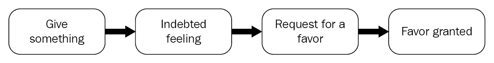

# 三、影响力和说服力

没有比迎合别人的兴趣更容易说服别人的方法了。说服是社会工程师游戏中很重要的一部分，这就是为什么它不能和智力游戏放在一起讨论。影响和说服是让人们按照你希望的方式去做或思考的方法。劝说在日常生活中很常见，你很可能没有受到它的影响。它被政治家、领导人和各种产品的广告商用来让人们认同他们的想法，做他们想做的事情。如果有效地运用说服，人们可以被说服放弃他们先前的想法，而接受卖给他们的想法。本章将探讨说服的所有要素。它将涵盖以下主题:

*   说服的基础
*   影响策略
*   现实改变(框架)
*   操纵

# 介绍

在执法部门，有专门的审讯人员，他们经过特殊训练，学习如何从嫌疑人那里套出真相。社会工程师的成功取决于最终说服目标做某事的能力。最成功的社会工程攻击是由于目标被说服去做绝对荒谬的事情，并令人惊讶地遵从这些事情。一名会计最近被说服将数百万美元转移到一个他毫不知情的海外账户，毫无疑问，他确实这么做了。在许多其他攻击中，社会工程师提出的荒谬要求从未停止令人惊讶，受害者的顺从几乎是可笑的。但是社会工程师如何说服人们去做这些事情呢？以下章节将深入探讨这一问题。

# 说服的五个基本方面

说服是一个精心设计的过程，目的是让目标陷入陷阱，他或她的决定直接受到攻击者的影响。社会工程师坚持以下五个方面的说服:

*   **有一个明确的目标** : 说服来自内心深处，社会工程师必须在与目标互动的开始就知道最终目标是什么。在前一章中，我们讨论了 NLP，并研究了潜意识在决策中的影响。如果社会工程师决心要实现某件事，潜意识也会有这样的期望，并会帮助实现那个目标。有了清晰的目标轮廓，就更容易提前计划如何控制与目标的互动。同样重要的是，社会工程师要有一个标准来衡量进展或目标的实现。一旦最终目标和成功的标准确定下来，说服策略就会更加成功。
*   **融洽** : 这个话题在[第二章](02.html)，*社会工程心理学——使用的心理技巧*中被广泛讨论。与目标建立融洽关系的方法已经详细解释过了，应该回头参考。融洽意味着一个人能够主要通过目标的潜意识大脑获得目标的关注和信任。正常人，更不用说社会工程师，掌握了建立融洽关系的技巧，最终会在生活中更好地与人相处。对于一个人来说，这是一项强大的技能。在建立融洽关系时，应确定目标的精神状态。悲伤、担忧、怀疑和其他许多状态都应该被识别出来。在互动中，应该表现出对对方的关心。社会工程师把自己放在目标的位置上来帮助理解目标的想法和状态。攻击永远不会从社会工程师的精神状态开始；它启动了目标的大脑。说服一个人做某事需要情感和逻辑的结合。谦逊起着关键作用；一个社会工程师永远不会准备把互动变成负面的。消极的对话会破坏和谐。因此，通过从目标的角度提出想法，社会工程师能够与目标联系起来，使社会工程师几乎不可能退缩。

*   **与周围环境合拍** : 一个社会工程师总是意识到他或她周围是什么。这有助于判断社会工程攻击的方向是否正确。在[第二章](https://cdp.packtpub.com/learning_social_engineering/wp-admin/post.php?post=71&action=edit#post_68) 、 *中讨论了很多关于这一点的社会工程心理学——心理技巧*。总的来说，据说肢体语言是目标是否接受骗局的一个很好的决定因素。肢体语言和面部表情将告诉社会工程师他或她的说服策略是否对目标有效。神经学家说，大脑每秒进行数十亿次计算，这些计算通过非语言交流来表达，如面部表情和手势。仅仅通过观察这些非语言表达，社会工程师就能更好地隐藏他或她的非语言表达以及观察他人的微妙之处。社会工程专家在攻击过程中尽量减少内部对话的使用。这是因为当考虑接下来要说什么时，很难观察到目标的非语言交流。
*   **灵活** : 疯狂通常被定义为重复同样的事情，却期待不同的结果。在一次劝说尝试中，一条曾经使用过但失败了的路径不会再被使用。不灵活不起作用，如果预先选择的策略不能说服目标，社会工程师将很容易转向另一种策略。目标也会随着说服工作的进展而改变。如果目标是不可妥协的，社会工程师可以改变目标或者瞄准一个更简单的目标。
*   **与自己取得联系** : 情绪可以影响一个人做的每一件事。即使是社会工程师也不能避免强烈的情绪。这就是为什么一个社会工程师需要通过了解他或她的情绪来与他/她联系的原因。对某种行为根深蒂固的仇恨等情绪可能会妨碍说服。这就是为什么社会工程师总是意识到某些事情会引起他们的情绪。通过这样做，他们可以发展出回避这种情绪的策略，或者学会如何处理这种情绪。

# 设置环境

为了让目标到达一个容易被说服的脆弱点，有必要创造一个合适的环境。合适的环境是目标觉得有义务为社会工程师做些事情的环境。有四种策略用于创造这种环境。

# 影响策略

社会工程师花时间练习他们的说服技巧，直到对他们来说几乎是自然的。他们甚至试图说服几乎所有人去做任何事情，只是为了证明他们的技能。这是因为说服在社会工程攻击中扮演着终极角色。有八种方法可以用来影响人。政府、骗子、政客和媒体人员利用这些策略让人们购买他们的想法，而不是依赖他们自己的知识。

# 互换

当被善待时，人类大多会以同样的方式回应，这是社会工程师可以利用的反应。当冲向即将关闭的电梯时，如果有人在里面扶着门让你可以进去，你几乎会无意识地至少说一声*谢谢*。表示感谢是互惠的一个简单例子。还有很多其他制造商、政治家、甚至员工使用互惠的例子。制药公司花费大量金钱购买免费的物品作为礼物送给医院员工，作为回报，医院会倾向于向患者推荐或赠送礼品公司的药品。政治家们决定在竞选期间更加仁慈。员工可能会为同事的餐费买单，然后请求帮助，而这种帮助几乎总是会得到尊重。互惠基于两条规则，一个人会帮助曾经帮助过他或她的人，其次，一个人会避免伤害曾经帮助过他或她的人。如果互惠得到有效利用，请求几乎不可能被拒绝。为了避免社会工程攻击，注意这一点是很重要的。

下图显示了互惠过程:

当送出某些东西时，重要的是它应该对目标有价值。它可能是一个物理项目，秘密信息，或一些对目标有价值的服务。在目标消费了免费物品或服务后，他或她会产生一种亏欠感。社会工程师根本不是指免费的项目或服务；它应该是完全免费的。

有时候，信息对目标来说非常有价值。例如，如果目标是股票交易，分享给客户的一些见解可能会被认为是非常有价值的，并且客户会立即有负债的感觉。在这之后，社会工程师请求帮助。感激的感觉会让目标回报以给予他所要求的帮助。社会工程师总是在寻找他们可以利用互惠的机会。它可以是帮人开门，礼貌待人，或者帮点小忙。互惠是一种非常有效的说服策略，成功率最高。

# 义务

这和互惠有点关系。目标觉得有必要出于道德、法律、契约、责任或宗教要求采取一些行动。它通常被用来对付那些有义务帮助客户，同时忍受侮辱并意识到他们在某些事情上缺乏知识的客户服务人员。除此之外，一个社会工程师甚至可以在一个从未存在的目标上创造一种义务。令人惊讶的是，像赞美这样的小事也能产生责任感。美国伤残退伍军人组织能够通过向收件人发送定制的地址标签获得 35%的献血成功率。没有地址标签，他们只有 18%的成功率。要用恶意软件攻击接待员，社会工程师需要做的就是送一个包含产品目录的 u 盘小礼物。说明应该简单明了，*接受这份礼物，我们只要求您浏览目录并打电话订购任何您感兴趣的东西*。由于拇指驱动器是一个礼物，收件人会觉得有义务把它插上，并通过所说的附加目录。

# 特许权

让步就是承认或接受。它的使用方式与往复运动相同；只是目标提出第一个请求。社会工程师接受为另一个人做一些事情，但从长远来看，社会工程师知道他或她最适合向目标请求帮助。人类天生就希望当别人帮了忙时，他们最终需要回报。因此，社会工程师不会拒绝那些他们最终可能需要帮助的人向他们提出的请求。然而，正如互惠一样，社会工程师永远不会同意对他们没有任何价值的事情。不对某些人让步可能会导致在攻击中失去融洽关系或地位。就像回报一样，让步在社会工程攻击中有很大的潜力。

# 稀缺

人们发现，如果很难得到的东西和机会更有吸引力。稀缺是一种常用的营销工具，广告从未停止使用诸如*限量供应*、*一日销售*或*清仓出售*等短语。使用这些词的本质是创造一种稀缺感，让买家相信他们可能不会很快得到类似的报价。这类广告可能比那些强调某些产品优质的广告吸引更多的注意力，因为购买者在那个时候没有受到刺激而采取行动。稀缺性似乎给产品增加了一些特殊的价值，让购买者想在最方便的时候购买。这是因为人类具有经济配置资源的自然本能。当试图获取稀缺物品时，此规则不适用。在社会工程学中，稀缺是通过引入紧迫感而产生的。当人们相信他们有时间做某事时，他们不会优先考虑它。然而，如果让他们相信他们没有时间，他们会专注于在最短的时间内完成要求他们做的事情。紧迫性是一种常见的操纵技术，用于扰乱目标的决策过程。稀缺性补充了这一点，让目标很难拒绝做某事。

例如，*我被你们的沟通主管 Doe 先生从 Fixit 电脑维修公司紧急叫去，在他去度一个月的假*之前修理他电脑的云同步问题。这一请求包含了紧迫性和稀缺性，使其非常有效。如果秘书或接待员听到这个组合，她肯定不愿意拒绝社会工程师。一个首席财务官在离开办公室之前希望同步问题得到解决是有道理的；紧急提出这一要求也是有道理的。拒绝*修理工*将是一个令人遗憾的决定。从社会工程师的角度来看，如果他们能让一个机会看起来如此稀缺，目标就会乞求他们给他们这个机会。因此，攻击集中在被视为罕见或受限的事物上，因此社会工程师看起来是在帮助目标。如果攻击涉及到一些信息的泄露，用一个像*这样的条款，我确信我不应该告诉你这些，但是...*，最终结果是，无论分享什么信息，目标都会赋予比正确说出的信息更多的价值。

# 权威

在任何人类文明中，都有一种权威感。即使在动物世界，也有一个精心设计的权威结构。一般来说，人们会听从那些他们认为对他们有权威的人的指示。有不同的设置，其中权力要么是明确的，要么是隐含的。在家里，孩子们服从他们的父母，因为他们对他们有权威。在学校，学生服从老师。

在法庭上，律师尊重法官和陪审团。在组织中，员工听从上级的指示。在街上，平民尊重警察。在政治上，人们尊重并遵从他们的领导者的指示。整个世界是一个权威的体系。如下所述，有不同类型的权威。

# 法定权威

这是政府或法律赋予执法人员的权力。社会工程师常用的借口之一是执法人员、政府官员或律师寻求某些信息。

# 组织权威

这是来自组织中管理阶层的权威。等级较高的人比等级较低的人获得更多的信息和权力。社会工程师通过使用比他们在组织中的目标更有权威的人的借口来承担这种权威。一名社会工程师可能会给一名假装是首席信息安全官(**)的员工发电子邮件，要求提供某些证书。毫无疑问，由于对权威的认知，员工会提供这些信息。人们对任何权威的主张都非常敏感，因为他们长大后习惯了这些权威的结构。这就是为什么即使社会工程师可能在另一个国家或洲，电子邮件也能工作。仅仅通过声称自己是组织中的权威人物，社会工程师很难遇到初级雇员对他或她选择的借口的抵制。1993 年，Caildini 做了一个实验，在这个实验中，一个假想的医生会给不同医院的护士打电话，告诉他们给病人服用超过安全剂量的一定剂量的药物。令人惊讶的是，这些护士中有 95%的人愿意遵照指示，给病人服用致命剂量的上述药物。凯迪尼在一本名为《T4 的影响》的书中记录了这一点，该书展示了医务人员容易受到上级错误指示的影响。**

***Influence scie**nce and practice* by *Robert B. Cialdini, 2009*. Pymble, NSW: HarperCollins ebooks available at [https://www.overdrive.com/search?q=385528A3-A0F6-4B42-A8E5-4D60D5C21901](https://www.overdrive.com/search?q=385528A3-A0F6-4B42-A8E5-4D60D5C21901).

如今，组织权威被高度利用，因为社会工程师可以很容易地收集关于组织中高级雇员的数据，并同样冒充他们。他们能够给出荒谬的指示，但员工却盲目地执行。** **# 社会权威

社会权威来自于非正式的群体设定，比如一群朋友，某个大学的校友，甚至是同事。在群体中，人们很容易被群体中其他成员的行为所影响。这被最好地描述为暴民心理，人们想要做大多数人正在做的事情。群体会有某个权威人物，其中某个特定的人由于其他因素，如体格、财富或口才，对群体有更多的控制权。还有许多其他的事情可以让一个团队成员脱颖而出，并对这个团队有一些隐含的控制，其他成员会跟随他或她说的一切。社会工程师能够通过在群体中更加突出来获得这种隐含的权威。通过这样做，他们获得了社会权威，可以指挥群体或要求群体成员做某些事情。遵从组长的指示被认为是有益的，因此小组成员会准备好按照组长告诉他们的去做。他们会自动驾驶，不加思索地服从领导的命令。即使他们被要求提供某些敏感信息，他们也会泄露。社会工程师会与群体中的人相处，目的是控制他们。他们用来获得隐含权威的一些东西是衣服、职称和汽车。仅仅通过穿着合适的衣服，使用正确的手势，发放假名片，社会工程师就能在他们选择加入的群体中迅速获得权威。有许多组织雇员加入的非正式团体，这是社会工程师最意想不到的罢工的地方。

# 承诺和一致性

一致性是一种非常有价值的人类特征，在相同的情况下，人们会以相同的方式行动。人类的大脑倾向于一致性，因为它在做某项任务时不需要重新处理信息。直觉是当某人基于过去一贯的经验感觉到某事不太对劲时产生的感觉。当一个人对自己不确定的新事物做出承诺时，也会有直觉。有承诺和一致性的真实例子。

在市场营销中，一个组织会努力通过广告来保持其市场份额，即使没有实现真正的回报。巨额资金最终被用于广告，仅仅是因为一个组织承诺保留它认为有利可图的市场份额，并担心如果它停止广告，竞争对手可能会夺走该份额。即使广告可能不会直接影响已经建立的客户群的品味和偏好，这种情况也会继续下去。拍卖是另一个例子，人们承诺购买一个产品，将继续出价高于对方，直到最后的出价太高，一个人无法被超越。赌博游戏也是另一个例子，在那里，人们在脑海中承诺他们必须赢得一些东西后，会花费大量的金钱。他们可能会玩很多回合，并在追求实现承诺的过程中失去更多。

一致性是基于以往经验的期望的产物。这种期望是采取行动的一种动力，这种行动会在早期结果的基础上带来某种有利的最终结果。一致性也会影响对某些请求的响应。守卫服务器机房的保安知道，当 IT 人员经过时，他或她会进入服务器机房。因此，如果有任何物理控制，保安知道他们必须允许 IT 人员进入，因为每隔一段时间就会发生这种情况。这是一致的，如果安全警卫阻止 It 人员访问服务器机房，那将是荒谬的，因为这通常不会发生。

一致性和承诺是社会工程师使用的非常强大的工具。他们试图让目标承诺去做某些事情，然后提升这种承诺。关键是让目标做出一个小小的初步承诺。一旦目标承诺了某事，他或她将愿意同意那些看起来与最初承诺一致的请求。然而，一个社会工程师总是与请求保持一致，这样他们就不会不一致。社会工程师采取了一条缓慢前进的道路，每个请求都是前一个请求的升级。请求的自然进程不会让目标感到他或她被利用了。小承诺往往会导致目标被利用。例如，一个律师可能会打电话给一个目标，说:*你好吗？*如果回答者说他或她很棒，律师可以继续说*很高兴听到这个消息，因为有人没有做同样的事情，肯定会需要你的帮助*。在这次谈话中，回答者已经确认自己做得很好，并对该州做出了承诺，他们不能放弃与之相关的请求。这与社会工程师让其他人承诺某事，然后强迫拒绝一些要求，同时首先让它看起来像是目标的想法是一样的。

因为这是一个容易被想利用他人的人利用的途径，所以知道如何反应是很好的。避免因为一个小小的承诺而被利用的唯一方法是在最方便的时候说不。不同意做一些看起来不像先前承诺的事情，升级就到此为止。灾难性的道路被切断了，试图占便宜的人肯定会离开。

在社会工程中，目标是让人们致力于看似微小的任务。承诺和一致性将把他们束缚在灾难性的道路上，他们将无助地同意做更大的任务。当使用承诺时，只有请求的适度才能区分成功的攻击和不成功的攻击。

# 爱好

大多数人喜欢被喜欢，他们通过喜欢喜欢他们的人来回报别人的喜欢。销售人员知道，买家可能更愿意从他们喜欢的卖家那里购买。这并不意味着不好看的销售人员没有销售。他们知道，如果他们表现出喜欢买家的迹象，买家也会喜欢他们，这就为成功销售创造了一个环境。然而，喜欢一个人并不是一件容易的事情，尤其是当你内心深处知道你不喜欢他们的时候。前一章讨论了微表情，并解释了如何区分假笑和真笑。真正的微笑展现在整个脸上，最重要的是导致一些眼部肌肉收缩，使下眼睑稍微抬起。因此，社会工程师必须知道如何避免在表达中表现出虚假，以显示对一个人的喜欢。一个社会工程师以一种讨人喜欢的方式展示自己，并试图去喜欢目标，以赢得他们的信任。这又回到了讨论借口的那一章。借口是社会工程师在他们的骗局中使用的个人资料。他们不只是假装，他们过着肤浅的生活，作为他们在攻击过程中的借口。在使用“喜欢”的攻击中，社会工程师看起来很有帮助，喜欢他们的目标，并且很自信。减少被人喜欢的一个重要因素是让自己看起来有吸引力。人类会喜欢他们觉得有吸引力的人。这是几百万年来人类大脑中根深蒂固的自动反应，帮助他们找到最合适的伴侣。身体上的吸引力总是有用的。多亏了互联网，社会工程师能够创建带有迷人照片的虚假个人资料。在 2015 年对一家网络公司的攻击中，一名社会工程师创建了一个虚假的年轻女士的个人资料，她向该网络公司的一名单身高级员工发送了好友请求，而这名员工恰好是男性。

这位员工看了简介后发现她的爱好和他的相似，最重要的是，她很有魅力。他把她加为好友，和她聊了一会儿，然后发现这个简介是由一名黑客伪造的。外表的吸引力很容易蒙蔽人们的判断力，他们会立刻喜欢上这位社会工程师。从喜欢，他们会更容易受到剥削。美丽与成功的品质联系在一起，这有助于社会工程攻击。美貌会导致光环效应，即一个人的决定与他或她的良好外表联系在一起。这就是为什么广告商在为他们的产品做广告时总是使用漂亮的人。

然而，如前所述，并不是每个人都是完美的，因此有其他方法来对目标产生喜欢的效果。仅仅通过做目标喜欢的事情，社会工程师就能赢得目标的心。通过完成目标，社会工程师得到更多的分数。与客户的良好接触增加了喜欢的篮子。有了这些，外表就不那么重要了。毕竟，最初因美丽而产生的吸引力只能到此为止；还需要做更多的事情。社会工程师知道如何使用积极的强化、非语言交流和目标的背景信息，以利于他们的攻击。他们关注自己的态度，与目标建立融洽的关系，与周围环境保持一致，并拥有与目标思维模式相匹配的惊人的沟通质量。

Boothman 写了一本书，讲的是如何在 90 秒内让人们喜欢上他们。他强调，前 2 秒决定一个人是喜欢还是不喜欢你。但是，第一印象还是可以在互动过程中改变的。他提到态度、有效沟通和非语言沟通是让人更可爱的因素。他提到的其他事情是积极倾听，使用问题，对人们所说的表现出真正的兴趣。

*How To Make People Like You in 90 seconds or Less* by *Nicholas Boothman* 2008, *New York: Workman Publishing*.

互动中的人会比第一印象时更喜欢你。

# 社会证明

社会证明是一种现象，在这种现象中，某人很难确定要描绘的可接受的行为，而只是假设他人描绘的行为。它发生在那些发现自己处于不熟悉的环境中，因此不知道如何行动，除了从其他人身上观察到的行为之外没有其他参考的人身上。这就是为什么在新环境中的人们几乎总是做别人正在做的事情。在某个实验中，一组人被告知在城市中央仰望天空。最终结果是灾难性的成功。其他人开始盲目地盯着太空看，看到底在看什么。观察其他人这样做的人也会这样做，这种连锁反应导致了严重的交通中断，因为人们在马路中间看天空，其他人则从他们的汽车上看。这表明了社会证明是多么强大。停下来长时间凝视天空而不看任何特别的东西的行为是相当陌生的。那些发现自己旁边的人几乎立即开始做同样的事情，观察他们的人也做同样的事情。社交证明在时尚行业中被高度使用，以将新趋势推向市场。当人们观察到一些人和名人穿着一些衣服时，他们也会挑选，而观察到人们采用这些服装品牌的人也会去购买他们的衣服。

社交证明的另一个应用是娱乐。有些节目以录音笑声为特色，播放人们对节目中可能幽默的部分发笑的录音。然而，预录笑声有时被用在不太有趣的部分或糟糕的笑话中，它和用在有好笑话的部分有同样的效果。为什么有人会因为听了一个干巴巴的笑话而发笑？答案是，有一种心理学方法可以通过推断其他人并观察他们做某事的程度来确定正确的行为。同样的，如果其他人觉得好笑，人们也会觉得好笑，即使很明显他们的笑是被控制或人工调整的。

社会证明是一种有效的影响武器，可以让大多数人受益。这是因为人们喜欢遵从他人的行为，以避免与众不同。在小费罐中，调酒师会在罐中放一些货币，这样就意味着很多人给了他们小费，为了避免成为小气的人，其他人比空罐更有可能给他们小费。在一个相当有趣的实验中，参与者被放在一部电梯里，一个毫无戒心的受试者将进入这部电梯。在登上几层楼后，参与者会转身面向某个方向。毫无戒心的受试者几乎总是会转身面对参与者转向的方向。这清楚地表明顺从是可以被激发的，因此，这在社会工程师的手中是一个非常危险的工具。它可以立即带出一个社会工程师在一个主题中期望的行为。

要使社会证明发挥作用，必须具备以下条件:

*   **不确定性**:目标必须事先没有经历过这种情况。它必须是完全新的和模糊的，这样，确定做什么的唯一方法是看别人在做什么。
*   相似性:其他人应该有相似类型的反应。这将向目标表明，他们知道他们在做什么，目标将不得不跟随他们做什么。如果有另一个困惑的人，社会证明的影响可能不会被意识到，因为这两个人可能会决定在群体中保持特殊。

这两个条件很容易被社会工程师创造出来。这是因为一个社会工程师不需要为了利用社会证据而不去创造一个物理环境。口头上，社会工程师可以描述一个场景，使目标看起来是唯一的一个。社会工程师可以说，每个接触的人都采取了某种行动，并导致了某种有利的结果。目标会更愿意走别人走过的路。当进入一个由保安人员守卫的场所时，如果被拦住，社会工程师可以说:*对不起，昨天 Mat 检查了我的证件，让我进去了。我想我仍然是一个受欢迎的访客。Mat 所走的这条路可能会迫使目前的警卫允许这位社会工程师进入，而无需重新检查他或她的证件。*

# 现实改变(框架)

这是一种呈现事实的方法，让事实看起来是好的，而实际上是坏的。假设有人被告知 25%的股票交易者成为了百万富翁。隐藏的事实是，75%的股票交易者失败或没有成功，这是一个巨大的数字。然而，一定比例的交易员成为百万富翁的事实更令人振奋。框架通常用在现实生活中。它的应用领域之一是政治。竞选活动和竞选信息充满了半真半假的内容。通过改变事实陈述，在任领导人的成就很容易被夸大或低估。在最近结束的美国总统选举中，特朗普总统大量使用现实改变来诋毁前总统巴拉克·奥巴马。他没有谈论创造的就业机会，而是把重点放在可能很高的失业人数上，而事实上，这个数字在奥巴马当选前更高。他还通过改变现实来诋毁奥巴马医改。通过这样做，他能够让人们相信变革是必要的，美国需要再次变得伟大。政治是一种心理游戏，事实以对陈述者有利的方式呈现。

框架也用于营销。当一些产品卖不出去时，销售者决定给它们贴高价标签。价格高表示质量高。这意味着产品会得到关注，但没有多少人会买。过一段时间，卖家会注销八折，把产品退回原价。其影响将是，人们现在会看到在过高价格的基础上以降低的价格购买产品的价值。

框架桥接是连接两个相似但不相连的框架。社会工程师可以桥接目标的框架，也就是说，以一种有利于社会工程师的方式与目标的现实建立无形的联系。例如，房屋入口处的警卫知道保护房屋的框架。因此，他或她会对任何试图进入该场所的人进行彻底检查。然而，保安会区别对待其他人，如向他或她提供产品的售货员。警卫还将区别对待在大楼内工作的任何组织人员。因此，可以用连接到受控访问方面的框架来瞄准防护装置。

社会工程师通过调整目标的现实和期望来使用框架桥接。社会工程师只需要适应目标的框架。如果目标是某个场所的警卫，社会工程师可以装扮成租用该场所的组织的新员工。通过将服装和交流与目标的框架相匹配，社会工程师可以很容易地不被注意地通过，或者不敲响他或她是陌生人的警报。

社会工程师使用框架来影响他们的目标。他们有三个选项，创建新的框架，与目标的框架对齐，或者将目标绘制到他们的框架中。要使用框架权，他们要遵守以下四条规则:

*   第一条规则是说一些能唤起框架的事情。当人类思考事物时，大脑通常会描绘出这些事物。伟大的小说作家有一种惊人的能力，能够在读者的脑海中描绘形象。社会工程师也努力拥有这种能力。他们在谈话中倾向于描述性的和强有力的。通过这样做，他们在目标的大脑中描绘了一幅画面，这将他们的注意力从正在绘制的精神画面上转移开。通过这样做，目标被正在绘制的图片占据，而忽略了关于社会工程师的细节。当进入一个场所或避免谈论一个人不熟悉的话题时，这是有效的。

*   第二个规则是使用明确的词语来唤起框架。这是一个社会工程师没有直接提到的事情，但暗示它。目标被赋予了一个额外的任务，去发现社会工程师在谈论什么，同时被更多的信息轰炸。当目标专注于智力拼图时，社会工程师可以在他或她的大脑中植入一些想法。社会工程师也可能利用这个机会在目标没有注意到的情况下做一些事情，因为目标已经全神贯注于试图弄清楚整个心理图景。
*   框架的第三个规则是否定一个框架。这听起来可能会适得其反，但实际上是有效的。通过告诉一个人避免某事，大脑自动想要找到它以便避免它。类似地，框架否定可以被社会工程师用来让人们做他们事先知道不要做的事情。如果一个社会工程师以修理工为借口走进一个组织，把一个装有恶意软件的 u 盘放在那里，如果员工被告知不要把它插入他们的机器，他们将有很小的机会把它插入他们的机器。然而，社会工程师可以否定这个框架，以便让目标做相反的事情。他可能会与几个人交谈，并告诉他们他听到一名高级职员四处打听丢失了一些敏感文件的 u 盘。发现恶意 u 盘的员工会本能地将其插入他或她的计算机，以确定它是否是周围要求的闪存。社会工程师将否定组织安全政策中的框架，即员工不应该随意拿起拇指驱动器并将其插入他们的计算机。
*   关于框架的第四条规则是，一个人应该引导一个目标去思考强化框架的事情。目标对某件事想得越多，这件事在他或她的大脑中就越被强化。新闻媒体是通过诬陷手段来操纵人们的大师。媒体可以省略关于一个故事的一些细节，以使人们形成一个结论，如果所有的细节都给出了，这个结论就会大不相同。俄罗斯被指控通过购买支持特朗普总统并诋毁其对手的脸书广告，干预美国 2016 年总统选举。通过频繁购买这些广告，他们确保选举特朗普的信息在大多数选民的脑海中得到强化。

*Here are some of the Russian Facebook ads meant to divide the US and promote Trump*, by *Tara Francis Chan*, 2017 available at [http://www.pulselive.co.ke/bi/politics/politics-here-are-some-of-the-russian-facebook-ads-meant-to-divide-the-us-and-promote-trump-id7546073.html](http://www.pulselive.co.ke/bi/politics/politics-here-are-some-of-the-russian-facebook-ads-meant-to-divide-the-us-and-promote-trump-id7546073.html). [Accessed on December 3, 2017].

社会工程师使用同样的策略，重复他们希望他们的目标留在大脑中的想法。他们只泄露部分有利于他们攻击的信息。毕竟，说实话的人是主观的。仅仅通过省略一些细节，一个社会工程师就能以半真半假的方式说服目标。

# 操纵

操纵是社会工程的标志之一。社会工程师能够将目标置于自己的控制之下。如果我们了解操纵的迹象和方法，我们将能够更有效地保护自己免受攻击。操纵的范围从彻底的洗脑到微妙的暗示，让目标做出某种决定。操控克服目标的批判和自由思考能力。有了这些方法，社会工程师就可以向目标灌输外部想法和推理，让他们觉得这是他们(目标)自己的。操纵有以下六种用途:

*   为了增加目标的可预测性
*   来控制目标的行动和环境
*   用怀疑动摇目标
*   让目标感到无力
*   给目标带来某种情绪
*   恐吓目标

操纵在许多现实生活中被使用。社会工程中有许多操纵策略。

其中之一就是**调节**。它遵循了伊凡·巴甫洛夫的狗的经典例子，当铃声响起时，它会条件反射地分泌唾液。这种条件反射使狗分泌唾液，即使看不到食物，但铃响了。社会工程师通过将某些词语与某些行为或结果联系起来，通过条件反射来操纵人们。因此，当社会工程师说一个特定的词时，目标将被置于对某个结果或行动的期望状态。社会工程师也使用人类大脑已经习惯的东西。例如，看到一个小婴儿或一只可爱的小狗会引起微笑。通过移交包含这些图片的目标材料，客户将处于愉快的状态，并可能做出有利于社会工程师的决定。这种类型的条件作用被用在广告中。米其林轮胎曾经刊登广告，一个可爱的婴儿坐在米其林轮胎旁边。这种广告的影响是，车主会将米其林轮胎与看到婴儿的快乐感觉联系起来。即使可能有更好或更便宜的轮胎，人们也会仅仅为了获得快乐的感觉而购买米其林轮胎。目标不是销售产品，而是销售影响目标采取行动的借口。

另一个操纵战术是**转移注意力**。这就是社会工程师转移注意力的地方，他或她实际上在做什么来掩盖它。通过分散目标注意力，如果在攻击过程中出现问题，社会工程师可以很容易地让社会工程师摆脱困境。例如，如果保安人员因非法进入安全场所而与社会工程师对质，该工程师可以让保安人员注意其他事情，例如组织如何对攻击毫无准备，以及为什么高层管理人员一直雇佣人员来测试组织中的当前安全状态。

使用操纵而不是其他说服策略有几个动机。首先，操纵有很多财务动机。许多快速致富的计划都是基于操纵。彩票和任何种类的赌博游戏都是由经济刺激促成的。优惠券也是一种金融操纵。社会工程在很大程度上是一种金融事件，攻击者想要得到目标的钱。利用操纵的社会工程攻击往往与慈善有关。社会工程中的另一个激励是意识形态激励。很难击退一种意识形态，这就是为什么社会工程师利用操纵在他们的目标中植入一些意识形态。社会工程师将使用对合作目标有某种回报的意识形态。因此，目标将努力获得这一奖励。社会工程师将利用意识形态榨取他或她所能榨取的一切，同时欺骗目标，让他们相信最终会有更大的回报。

社会激励是操纵给出的下一种类型的激励。人类是社会性的，大多希望与认识他们的人在一起，并希望与他们互动。他们通常希望被其他人接受。这就是为什么他们在意自己的外表，试图获得财富，或者任何可能被社会视为令人印象深刻的东西。很明显，同龄人的压力对许多青少年来说是一个巨大的挑战。这是因为他们发现，讨人喜欢会带来某些社会激励。因此，他们会尝试同龄人认为可爱的任何东西。社交媒体是人们寻求社会激励的一个很好的例子。在 Instagram 等网站上，许多用户努力向他人展示他们过着白金生活，在那里他们得到了最好的一切。他们准备尝试或购买任何能引起他们注意的东西。他们的主要回报是受到许多人的喜爱。这就是为什么平台很大程度上是建立在喜欢和关注人们的前提下。社会工程师也追求同样的途径。他们利用社会激励让目标服从他们的命令。他们向人们兜售可爱，无论是告诉他们向慈善机构捐款，还是向社会工程师提供一些资源，让他或她快乐。

操纵是一种强有力的说服策略。它使社会工程师能够让人们毫无疑问地做社会工程师想要的事情。心理力量被用来带来顺从。然而，操纵是微妙的，以便不引起目标的任何怀疑。但是，有些操纵方法是黑暗的。这些方法会对目标造成焦虑、压力和胁迫，从而迫使做出某些决定。社会工程师对他们的目标没有任何真实的感情，会毫不犹豫地把他们推向这条路。毕竟，目的证明手段是正当的。

# 消极操纵策略

前面，列出了在目标上使用操纵的六种方式。在深入理解了操纵的概念之后，现在有必要看一下其中的一些。

# 提高可预测性

列出的第一种方法是增加目标的可预测性。这是通过观察线索和其他 NLP 指针来完成的。一个社会工程师利用操纵把一个目标带到一个他或她极易受思想影响的点上。感情被操纵以使目标对社会工程师的想法开放。当目标敞开心扉时，他或她更容易被预测，也可以向他或她提出建议。操纵如何打开目标的一个很好的例子是通过使用彩票或赌博。人们期望当一个人获胜时，他或她会很兴奋，并在那时敞开心扉接受一些想法。例如，如果一个社会工程师设计了一个彩票游戏并操纵它，使得目标将赢得大奖，那么目标将容易受到诸如提供银行信息、社会安全号码和在线支付细节等建议的影响。如果在没有赢得彩票的兴奋感的情况下接近目标，这是不可能的。

# 控制目标的环境

操纵的第二个用途是控制目标的环境。为了控制目标的环境，社会工程师首先需要置身其中。因此，如果攻击是在线的，社交工程师需要进入目标的社交媒体平台，与他们交朋友，并与他们进行某种交流。一个社会工程师是会花时间的，绝对不会在目标接近他(她)后，才贸然实现最后一击。首先会建立一种虚假的关系，但对目标来说会感觉真实。如果目标喜欢艺术，社会工程师可以伪装成某个国家的知名艺术家，并利用这一点来接近目标。这将持续到目标放心地与社会工程师分享一些细节。一旦他们接近，社会工程师可以在目标的环境中创造许多其他的感觉。如果一个社会工程师说他失去了亲近的人，环境会变得悲伤。悲伤是会传染的。悲伤的人也很容易被操纵，特别是，如果他们能感觉到他们处于结束悲伤原因的位置。社会工程师可以要求金钱来支付医院账单或支付一些费用，目标会顺从来结束这种悲伤的感觉。许多其他的情绪和感觉可以被用来改变目标的环境，以获得某种感觉，从而使他们暴露在攻击之下。

# 产生怀疑

社会工程的另一个用途是让目标重新评估他或她的信仰、情感和意识。是邪教常用的操纵手法。他们中的一些人得到了国际认可，并在他们传播到的任何地方使用同样的操纵策略。邪教针对一个人的信仰，彻底让他(她)相信之前被告知的不是真的；他们的信仰是错误的，但邪教知道正确的道路。他们动摇目标已经建立的信念，当目标重新评估时，他们植入他们的信念。社会工程师也借用这种策略。例如，许多组织现在正在教育他们的用户了解在线威胁，并给出严格的指示，不要点击发送给他们的 URL。一个社会工程师可以在目标的头脑中绕过这条规则。通过给销售团队打电话，说他想要某个项目网站上的大量项目，目标可以很容易地让收件人点击发送的 URL，尽管有严格的指示不要这样做。

# 使目标失去力量

操纵的另一个用途是使目标失去力量。这是操纵的一个有用但黑暗的应用。要做到这一点，社会工程师必须采取一个比目标更有权威的立场。愤怒也是另一种让目标感到无力的策略。通过威胁和对目标产生怀疑，目标可能会感到无能为力。这位社会工程师摆出一副压倒性的姿态，让目标退缩并感到无力。一群社会工程师利用海地事件从人们那里榨取敏感的细节。该组织推出了一个网站，声称拥有遇难者的信息。这是很难得到的信息。社会工程师明确表示，为了让人们访问这些信息，他们必须提供一些细节。因为没有家人消息的人是无助的，他们不会质疑他们被告知的信息的敏感性。他们后来才意识到他们把私人信息给了不可信的第三方。

# 惩罚目标

另一种使用操控的黑暗方式是非肉体的惩罚人们。这是通过让目标感到内疚、羞辱或焦虑来实现的。最终结果是目标愿意遵从任何能让他或她脱离那个位置的要求。同样，目标也会感谢帮助他或她摆脱困境的人。一个社会工程师可能会创造一个他或她向目标呼救的场景。如果目标拒绝给予帮助，社会工程攻击中的一个伙伴可能会出来帮助，并因目标不够人性而使其尴尬。第三个攻击者可能就在附近，并过来安慰目标，通过这样做，攻击者得到了目标的一些好感。这就打开了攻击的目标。

# 恐吓

恐吓是社会工程的最终用途。仅仅通过表现出忙碌和不安，攻击者就已经对目标产生了威胁。此外，通过以权威的语气说话，社会工程师恐吓目标。主要目标通常是让目标感到不安，并以他或她在正常状态下不会采取的方式行动。通过让目标感到不安，目标就可以使用武力从目标那里获取一些敏感信息或者一些资源。这种策略被用在社会工程师无法预见目标的未来用途的场景中，因为它最终会破坏两人之间的任何关系。

# 积极的操作技巧和策略

前面提到的策略是用于消极操纵的。然而，有一些目标，这些战术不能适用，有时社会工程师也可能喜欢一些积极的攻击。以下是一些积极的操纵方法。

*   **:****一个社会工程师不能在攻击中使用他或她的真实情感。这将使攻击者受到目标的操纵，这是整个攻击的逆转。这就是为什么一个社会工程师的行为像他或她的借口。他或她的头脑必须区分真实的人和借口。假装的情绪被使用，但是攻击者从不让情绪泄露到他或她的真实个性。通过从攻击中分离真实的情绪，社会工程师能够保持对攻击的控制，即使目标变得不安、粗鲁或疯狂。**
***   **寻找积极的一面** : 为了点亮某些时刻，社会工程师可以看一些幽默的事情来开玩笑或赞美。只要找到让目标微笑的东西，就能提高操纵攻击的成功率。例如，如果目标是一名接待员，通过称赞接待处桌子的外观，着眼于设计，或者仅仅是通过提及该组织在街上的一些好名声，可能会大大有助于打开该组织的成功机会。*   **做出积极假设** : 社会工程攻击是一项巨大的任务，攻击者需要他或她所能获得的所有动机。为了振奋精神，社会工程师应该假设一切都会按计划进行。如果没有，攻击者应该认为备份计划将会起作用，或者退出过程将会完美地通过。在与目标的互动中，社会工程师应该带着一些假设说话。当与守卫大楼入口的保安打交道时，社会工程师应该说类似*这样的话...在我修好打印机出去的路上，我会告诉你一些我听到的关于这个组织的事情*。这种积极性减轻了守卫的严格性，并使社会工程师更容易进入组织，即使他没有获得所需的邀请。如果社会工程师犯了消极和期待失败的错误，成功的机会将会很渺茫。像*这样的声明，只要你允许我进去和人力资源部谈谈...可能看起来太穷，警卫会自动拒绝进入。对失败的预期也会在微表情和其他非语言暗示中表现出来。一旦被目标选中，这位社会工程师看起来可疑，并受到严格对待。***

 ***   **使用不同的开场白** : 在这一点上，人们可以从交友网站上借用一些信息。**OkCupid**([https://www.okcupid.com/](https://www.okcupid.com/))这是一家领先的在线约会网站，它做了一项关于女孩搭讪回复率的研究。他们发现，大的赞美在使用时是灾难性的，大多数女孩会忽略诸如漂亮、性感或性感之类的信息。对女生效果比较好的话，很酷，很牛逼。同样，女孩们会忽略带有常见问候的信息，如*嗨*或*嘿*。问候，如*你好*或*你好*的回复率更高。有了这些信息，假设目标是约会网站上的女孩，很明显正常的方法是行不通的。这是典型的人类行为；人们会忽略正常的事物，而被不正常的事物吸引。因此，一个社会工程师会使用不同的方法，例如被送去紧急维修，参加紧急会议，或者丢失一个非常重要的拇指驱动器来获得关于一个组织的信息。社会工程师也不会在他或她与目标的互动中使用明显的路径。
*   **使用过去式** : 在社会工程师处理来自目标的负面情绪的例子中，重要的是将负面情绪与当前情况拉开距离。这提供了一个新的机会。例如，如果接待员拒绝让攻击者有机会与可能是某个组织的首席财务官的目标见面，目标就可以重新发起攻击。举一个简单的例子，比如*当你说我不能见首席财务官时，你是否知道我昨天和他在一起，我同意今天见他，因为我可能从明天开始就有事耽搁了？*这位社会工程师已经重新设定了接待员的思维模式，抛弃了过去的否认，增加了见首席财务官的压力。接待员也将被迫从过去进入现在，这可能只是让工程师有机会看到首席财务官。
*   **寻找并摧毁** : 这在我们所说的正面操纵战术部分可能会令人困惑。但是，它的目的不是对目标造成负面影响。社会工程师识别并计划如何处理对他或她的攻击的破坏。他们事先练习如何进行互动，以便发现他们可能会遇到挑战的领域。这给了他们一个早期的机会去寻找和摧毁任何可能挡在他们路上的东西。** **# 摘要

说服是社会工程中至关重要的一步。它允许社会工程师在整个攻击中取得进展。本章讲述了说服的基本原理，强调了说服成功的几个方面。我们也经历了政治家和媒体成功使用的影响策略，让人们购买他们的想法。这些策略包括互惠、义务、让步、稀缺、权威、承诺、一致性，最后是喜欢。然后我们看了社会工程师如何使用框架来改变现实。我们解释了真理可以被歪曲成有利于社会工程师的方式。还讨论了改变现实的规则。最后，本章探讨了操纵，这是最强有力的影响和说服工具之一。它解释了社会工程师如何控制目标的思想。我们已经讨论了操纵在社会工程攻击中的使用方式。积极和消极的操纵策略和技巧已经讨论过了。

已经看了社会工程的一些基本原理，下一章将看社会工程师如何寻找目标。它将讨论用于寻找有价值的目标的技术，以及如何进行背景研究以找到机会接近他们。

****