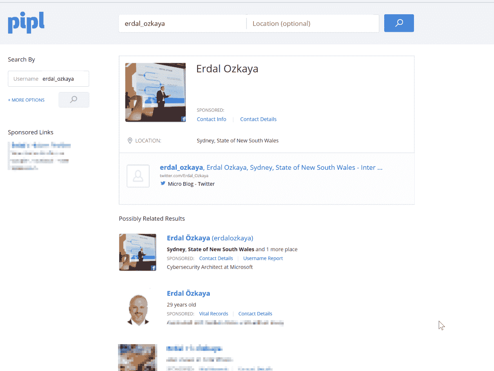
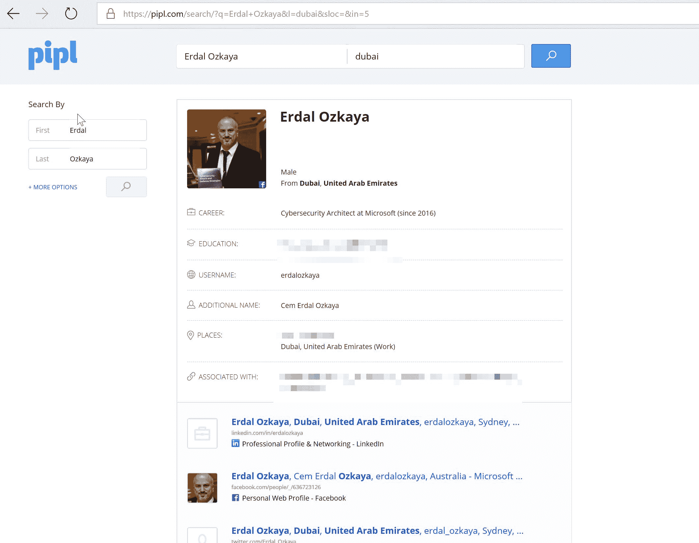
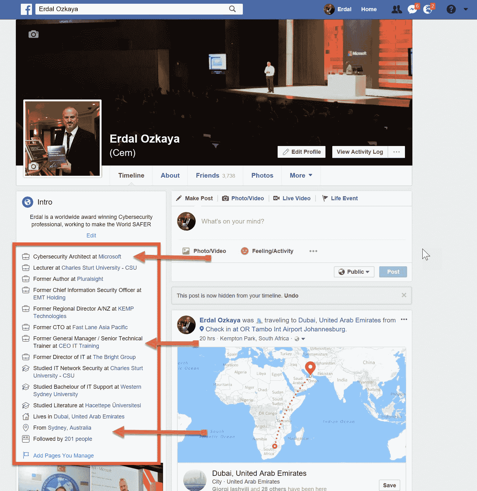
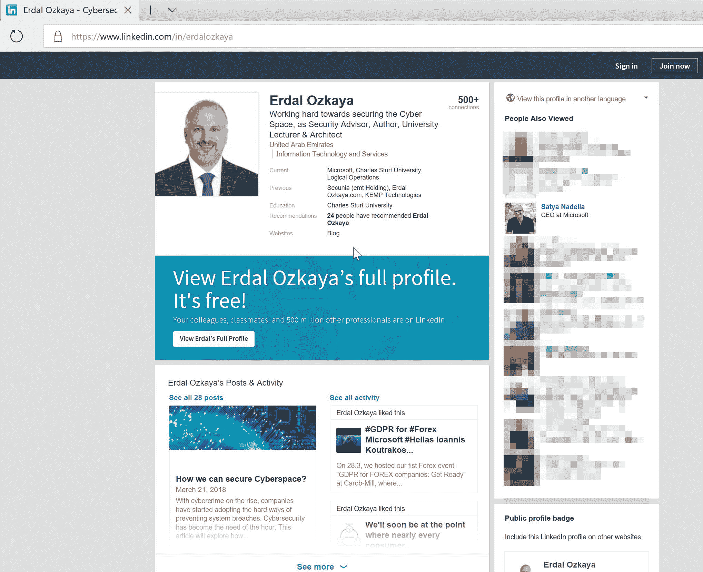
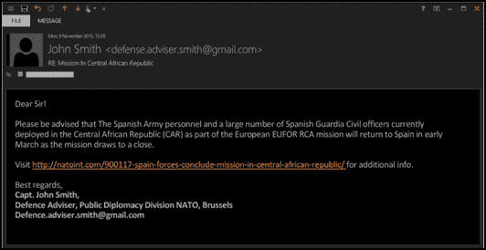
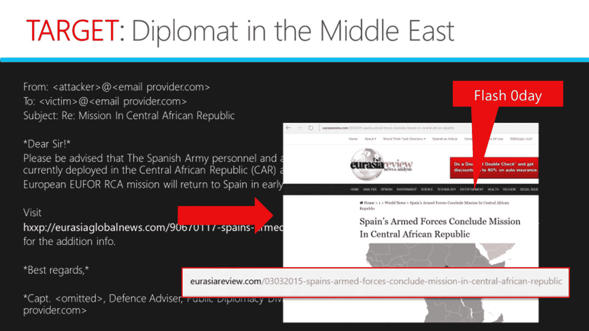
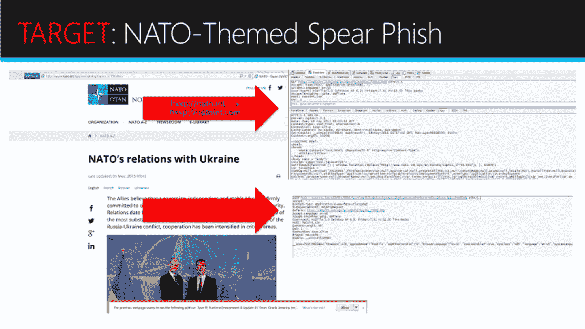
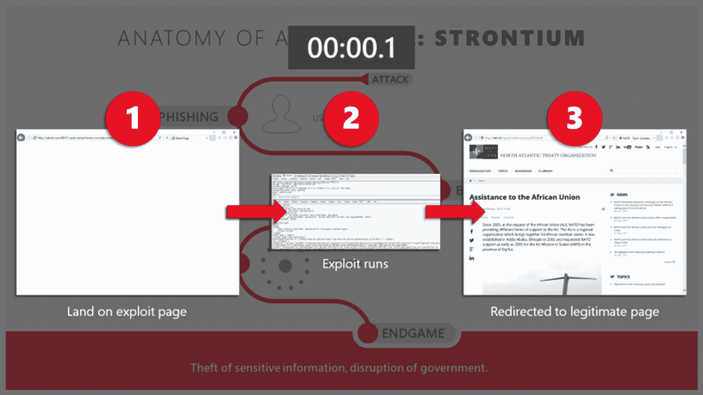
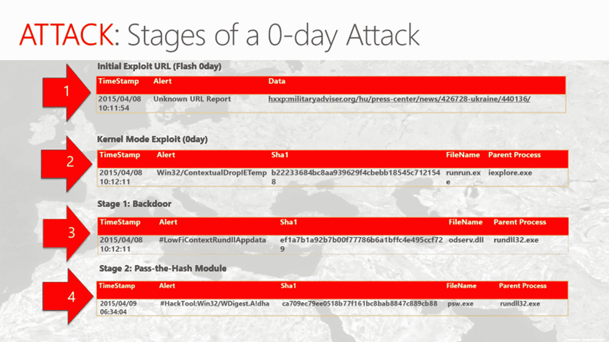

# 四、信息收集

社会工程攻击采用在评估关于目标的已知信息后得出的路径。因此，将根据本章的结果应用前面章节中学习的策略。然而，信息收集不像几年前那样具有挑战性，当时人们只能直接从目标或通过询问获得目标的详细信息。互联网，更具体地说是社交媒体的使用，通过更新更快的数据收集技术简化了这一阶段。在收集数据的过程中，没有一条数据是不相关的。仅仅一点点信息，比如目标最喜欢的关节，可能就足以让社会工程师成功地说服目标以某种方式行动。对于一个社会工程师来说，知道寻找什么类型的信息是很重要的。信息过载，可能会收集到大量不相关的信息。了解这类信息的来源也是很好的。光有信息是不够的，重要的是知道如何使用收集到的信息来描述目标，并使其更可预测。最后，知道如何有序地存储这些信息以便于检索是至关重要的。本章将在以下部分教你如何做到这一点:

*   收集关于目标的信息
*   技术和非技术信息收集方法

# 介绍

今天有太多的可用信息和正在创建的信息。随着互联网的出现和社交媒体平台的兴起，据估计，人类创造了 2.5 万亿字节的数据。这些信息被许多群体所利用，营销人员处于链条的顶端。大数据使组织能够从这些数量惊人的数据中挖掘出有意义的信息，否则这些信息就会被浪费掉。今天的广告商更了解他们的目标，因为他们已经根据互联网上的信息对他们进行了描述。自成立 13 年以来，脸书已经发展到每月活跃用户超过 20 亿人。Instagram 和 Twitter 合计拥有近 10 亿月活跃用户。

LinkedIn 最近被微软收购，拥有大约 1.06 亿月活跃用户。对于一个专门针对员工的社会工程师来说，这是一个有趣的平台，因为它是为专业用户群创建的。Snapchat 是另一个崭露头角的社交媒体平台，每天吸引超过 1.6 亿用户。

这些平台的用户基础可能比这些数字更大，但最重要的是每月或每天活跃用户的实际数量。他们是内容生成者，也就是说，他们发布内容，让其他用户访问这些平台，他们仍然是其他用户的内容消费者。用户对他们放在社交媒体账户上的信息特别粗心。他们的个人主页上充满了关于他们自己和他们家庭的正确信息。他们生活的完整历史，包括出生日期、就读的学校、关系和工作经历都可以在他们的个人资料页面上找到。他们会定期更新自己的账户，加入一些被视为敏感的信息，比如他们工作的地方、他们正在进行的假日旅行、他们工作场所发生的事情、他们的密友和家人。因此，毫不奇怪，社会工程师会潜伏在社交媒体平台上，收集关于他们目标的信息。然而，社会工程师仍然使用旧的可信的方法来获取关于他们的目标的信息。多年来，他们已经改进了他们的策略，使他们能够成功地使用这些旧方法获取信息。尽管这些媒体可能没有社交媒体那么快，但它们有时更个性化，因此可以提供更多信息。

# 收集关于目标的信息

信息收集可以通过两大类方法完成——技术方法和非技术方法。顾名思义，技术方法依赖于收集信息的计算机辅助技术。然而，不能保证特定的工具或电子设备将获得关于目标的足够信息。因此，可以混合使用以下工具和设备来收集有关目标的信息。社会工程师将使用多种信息收集工具/技术，合并他们获得的信息，为他们的目标建立一个档案。

# 技术信息收集方法

如今有许多工具被开发出来，目的是在社会工程攻击期间收集信息。可以说最成功的工具是名为 **Kali** 的 Linux 发行版。它包含一套 300 多种工具，专门用于收集目标信息。从 300 个工具中，让我们将它们缩小到两个最受欢迎的工具，这两个工具从列表中脱颖而出，因为它们不收集数据，但有助于数据的存储和检索。这些措施如下:

下图是来自[www.kali.org](http://www.kali.org)网站的截图，你可以在那里下载 Kali Linux 并使用以下工具:

# 篮子

BasKet 是一个免费的开源 Linux 程序，它更像一个高级数据存储工具，在数据收集过程中帮助社会工程师。它有着我们熟悉的记事本的外观，但是有很多功能。它充当社会工程师收集的关于特定目标的文本和图形信息的存储库。在社会工程攻击中，它可能看起来很简单，甚至是不必要的，但它实际上服务于一个很难在字处理器(如 Microsoft Word)中复制的目的。BasKet 使用类似标签的布局，使社会工程师能够以有序的方式放置关于目标的每种类型的信息，以便于阅读或检索。例如，图片可以在一个选项卡中，联系信息在另一个选项卡中，社交媒体信息在第三个选项卡中，物理位置信息在单独的一个选项卡中。社会工程师会不断更新这些标签，只要他们遇到更多的信息。在流程结束时，BasKet 允许社会工程师将这些信息导出为 HTML 页面，从而将所有信息压缩在一起，使其更易于移植、访问和共享。

# 德拉迪斯

dradis([https://dradisframework.com/ce/](https://dradisframework.com/ce/))是一个免费的开源 Linux、Windows 和 macOS 应用程序，用于存储信息。它有一个更先进的外观，有篮子的记事本一样的外观。Dradis 在功能上也更先进，因为它充当了一个集中的存储库，并使用基于 web 的 UI 使用户能够与它进行交互。Dradis 使用分支代替选项卡(如 BasKet ),允许用户将不同类型的信息添加在一起。Dradis 可以处理大量数据，否则 BasKet 会有问题。因此，当有大量信息需要由目标进行排序时，通常使用这种方法。

完成了两个主要的数据存储工具之后，现在是时候看看社会工程师收集信息的方式了。以下是对这些问题的讨论:

# 网站

包含目标信息的蜂巢之一是公司和个人网站。公司网站可能包含员工和客户的信息。另一方面，个人网站包含纯粹关于个人的信息。有了足够的挖掘，网站可能会透露很多信息。个人网站可以通过工作、实际位置、联系信息和一些可能用于描述密码的特殊词语来说明个人的参与情况。

关于最后一点，众所周知，为了熟悉，人们倾向于包括一些他们熟悉的短语或单词，如出生日期、伴侣的名字、宠物的名字或他们自己的名字。企业网站能够提供员工的传记，尤其是高层员工及其工作联系信息。如果您想用恶意电子邮件附件攻击组织，将它发送到公司网站上提供的电子邮件地址更有可能将有效载荷直接传送到组织内部。

# 搜索引擎

都说互联网过目不忘。如果你想知道什么，知道正确的提问方式可能会让你得到几乎所有你想要的信息。占主导地位的搜索引擎谷歌是社交工程师的一个关键工具，用于挖掘互联网上目标的信息。我们将回顾社会工程师使用谷歌搜索目标信息时使用的一些搜索短语:

1.  要在特定域(如公司站点)中搜索目标的信息，可以使用以下查询:

```
Site: www.websitename.com "John Doe"
```

如果网站中包含任何关于`John Doe`的内容，谷歌将在查询的搜索结果中对其进行索引。

2.  要在 Google 索引的任何网站的标题中搜索目标的信息，使用以下查询:

```
Intitle:John Doe
```

重要的是要明白，两个词之间的间距指示谷歌也搜索有`John`的标题，后面是包含单词`Doe`的文本。这是一个非常有用的查询，因为它将捕获多个网站标题中包含的目标信息。这个查询将产生从企业网站到社交媒体平台的信息，因为它们经常在一些页面中使用一个人的名字作为标题。

3.  要在任何网站的 URL 中搜索目标的信息，可以向 Google 提供以下查询:

```
Inurl:john doe
```

出于 SEO 目的，在 URL 的 web 标题中使用单词是许多组织的常见做法。这个查询从 Google 索引的 URL 中识别一个人的名字。值得注意的是，该查询将在 URL 中搜索`john`,并以类似于前面讨论的方式搜索`doe`。如果社会工程师想要在 URL 中搜索所有目标的名字，而不是在 URL 中搜索一个，在文本中搜索另一个，可以使用下面的查询:

```
Allinurl:John Doe
```

该查询将把结果限制在 URL 中同时包含姓名 John 和 Doe 的结果。

4.  在很多情况下，目标会使用工作公告板申请工作。一些求职网站保留了求职者的简历。此外，一些组织在其网站上保留求职者的简历。简历包含一个人的高度敏感的细节。它包含此人的真实姓名、真实电话号码、真实电子邮件地址、教育背景和工作经历。它有丰富的信息，对社会工程攻击非常有用。为了搜索目标的私人细节，社会工程师可以使用以下查询:

```
"John Doe" intitle:"curriculum vitae" "phone" "address" "email"
```

这是一个非常强大的查询，它将搜索整个互联网，寻找标题中包含诸如`curriculum vitae`、`phone number`、`email`和邮政地址等信息的关于`John Doe`的信息。

5.  以下查询用于收集信息，不是关于某个特定的人，而是关于某个组织。它针对的是组织内部可能发布在网站上的机密信息:

```
intitle:"not for distribution" "confidential" site:websitename.com
```

该查询将搜索在网站中以标题`not for distribution`或`confidential`发布的任何内容。这种搜索可能会挖掘出组织中一些员工可能甚至都不知道的信息。在社会工程攻击中，当一个社会工程师希望向某个目标显示出对组织内部事务的了解时，这是一个非常有用的查询。

6.  进入受保护场所的一个常用借口是公司紧急联系的 IT 或网络维修人员。警卫将准备好让这样的人进来，他们将能够在其他员工中间进行攻击，而不会引起警报。为了能够找到这样的借口，社会工程师需要了解组织的内部网络或基础设施。以下是一组可能向社会工程师提供此信息的搜索查询:

```
Intitle:"Network Vulnerability Assessment Report"
Intitle:"Host Vulnerability summary report"
```

该信息也可用于攻击的某些部分，因为它还揭示了可在目标网络或连接到网络的主机中被利用的弱点。

7.  要搜索用户在组织网络中使用的密码，备份这些密码可能是开始搜索的有用位置。因此，以下查询可能会派上用场:

```
Site:websitename.com filetype:SQL ("password values" || "passwd" || "old passwords" || "passwords" "user password")
```

此查询查找存储在网站域中的名称为密码值、密码、旧密码、密码或用户密码的 SQL 文件。尽管这些文件可能没有用户的当前密码，但它们可能会向攻击者提供足够的信息来分析用户的当前密码。例如，员工的旧电子邮件密码很有可能会更改为新密码。

在谷歌和其他搜索引擎中可以使用许多其他的数据搜索查询。讨论的只是最常用的。需要注意的是，互联网永远不会忘记，甚至当一些信息被删除时，还有其他网站在网站上存储缓存文件。因此，组织最好不要公开发布他们的敏感信息。

# 皮珀

收集目标信息的另一个常用工具是**Pipl**(【https://pipl.com】T2)。Pipl 将人们的信息存档，并免费提供给任何希望访问它的人。它存储了一个人的真实姓名、电子邮件地址、电话号码、物理地址和社交媒体账户等信息。除此之外，它还提供了一个付费选项来收集一个人的亲属信息，从他们的兄弟姐妹和父母开始。对于社会工程师来说，这是一座金矿，因为只需很少的努力，他们就能获得大量关于他们目标的信息。让我们举一个现实生活中的例子，而不是常用的无名氏，这可能会有很多结果。让我们用一个不常见的例子，比如 Erdal Ozkaya:



该网站为我们搜索过的名字索引了许多结果，让我们探索第一个结果。这是一个来自澳大利亚悉尼的 40 岁男性 Erdal Ozkaya。该网站为我们提供了找到重要记录、联系方式和用户名报告的赞助链接。让我们点击名称，看看该网站有哪些关于 Erdal Ozkaya 的免费内容:



该网站能够找出更多关于这个名字的信息。我们现在知道他(在这种情况下是我)是微软的网络安全架构师，他拥有查尔斯·斯特大学的网络安全博士学位和安全硕士学位，并且他与一些人有联系或有关系，出于隐私原因，我模糊了这些人，他们可能是他的父母和兄弟姐妹。从一个完全陌生的人，我们现在知道了很多关于他的信息，我们可以利用这些信息来收集更多关于他的信息。

从这里开始，使用我们前面讨论过的特殊 Google 查询可以很容易地搜索到更多信息。你可以去找他的简历，里面会有更多的联系方式。

从我们的例子中，我们已经探索了 Pipl 在搜索目标信息时的一些能力。任何人都可以访问这样的网站，很明显，隐私只不过是一种幻觉。诸如此类的网站从社交媒体平台、企业网站、第三方出售的数据、黑客发布的数据、从其他网站窃取的数据，甚至是政府机构持有的数据中获取信息。这个特定的网站能够获得目标的犯罪记录，这意味着它可以访问一些重罪记录。令人担忧的是，这些网站并不违法，并将在未来很长一段时间内继续添加关于人们的数据。这对社会工程师来说是好消息，但对其他可能成为目标的人来说却是坏消息。网站所有者不能被强迫删除他们包含的数据，因此一旦你的数据到达他们那里，你就没有办法隐藏。随着信息的增多，这个网站只会越来越强大。

# Whois.net

仍然在信息存档网站上，**Whois.net**是另一个服务于几乎和 Pipl 相同目的的网站。列出搜索信息的目标的电子邮件地址、电话号码和 IP 地址等信息。Whois.net 也可以获得关于域名的信息。如果一个目标有一个个人网站，Whois.net 能够找到关于域名注册人和注册商的详细信息，其注册和到期日期，以及网站所有者的联系信息。就像 Pipl 一样，此处获得的信息可用于获取目标的更多信息，从而能够发起成功的攻击。

# 社会化媒体

迄今为止，数十亿人已经接受了社交媒体。使用这些平台，社会工程师可以找到关于他们大多数目标的大量信息。大多数目标将拥有脸书、推特、Instagram 或 LinkedIn 账户。社交媒体的美妙之处在于它鼓励用户在互联网上分享他们生活中的个人细节。社交媒体用户很容易粗心大意，最终甚至会将敏感信息泄露给整个世界，而不考虑后果。从这些陈述中可以清楚地看出，社交媒体除了让问题变得更复杂之外，什么也没做。它创造了一个丰富的信息库，社会工程师可以从中挖掘出目标的细节，而不会引起怀疑。

以下是来自脸书的截图，公开给出了很多信息:



在多个社交媒体平台上搜索几分钟后，社交工程师就能够收集目标的爱好、工作地点、喜欢和不喜欢、亲戚和更多私人信息。社交媒体用户准备吹嘘他们正在度假，他们在某些地方工作，他们在工作场所、他们的新车和他们带孩子去的学校做某些工作。他们不害怕在这些社交媒体网站上展示他们的工作证，这些工作证可以被社会工程师复制并用于进入组织。社交媒体用户也会和陌生人交朋友或关注陌生人，只要他们符合自己的爱好和兴趣。这是一个让潜在目标处于不利地位的疯狂世界，因为这些网站旨在让人们向互联网上的陌生人敞开心扉。传统上为面对面交谈而存储的信息现在正被公开给全世界看。糟糕的是，动机良好和动机不良的人都在访问它。

这个信息可以被社会工程师用来描绘目标。当说服目标采取一些行动或泄露一些信息时，这些信息可能会派上用场。让我们举一个假设的例子，我们是社会工程师，想从一家美国军事承包商那里获得绝密的设计和规格，以便我们可以学习如何破坏他们的设备。我们可以从进入 LinkedIn 等社交媒体平台开始，搜索该公司的名称。如果公司在 LinkedIn 上，我们将看到公司简介和在 LinkedIn 上列出的他们在那里工作的人的列表。接下来，我们确定一名在研究和设计部门甚至是营销部门工作的员工。然后，我们集中精力获取有关这个目标的信息，这可能有助于我们将他们置于一个可以泄露我们正在寻找的秘密信息的位置。我们首先搜索员工在脸书的个人资料，以找到爱好、兴趣和其他个人信息。我们转到 Instagram，看看员工发布的图片类型。我们开始定位目标，将所有社交媒体账户上的信息与他的名字联系起来。我们找到了他的实际地址和他喜欢呆的地方。我们在这一点上接近他，并使用之前在《心理技巧和说服》章节中学到的策略之一，让他将一个加载了恶意软件的 USB 驱动器插入他的计算机。从那里，恶意软件将开始为我们收集我们想要的信息。就这么简单。

以下是 LinkedIn 上关于我自己的一些公开信息:



组织正以类似的方式成为目标。2017 年初，1 万名美国员工被俄罗斯黑客利用社交媒体进行网络钓鱼，这些黑客在社交媒体帖子和消息中植入恶意软件。2017 年年中，一个名叫 Mia Ash 的女孩的假人物被创建并用于攻击一家网络公司，其目标是一名在该组织中拥有广泛权利的男性员工。攻击被挫败只是因为该组织有强大的控制来保护自己免受恶意软件的攻击。这名男员工已经被这个女孩的假脸书账户骗了。

2016 年 8 月，人们发现，针对在社交媒体上关注了某家银行的客户，存在大规模金融欺诈。据信，攻击者能够控制该银行的社交媒体账户，并向追随者发送欺诈性报价，这些追随者最终只会赔钱。还有许多其他社交媒体介导的社会工程攻击已经发生。这一切都要归咎于社交媒体上私人信息的快速获取。

*The Top 10 Worst Social Media Cyber-Attacks*, by S. Wolfe, *Infosecurity Magazine*, 2017 available at [https://www.infosecurity-magazine.com/blogs/top-10-worst-social-media-cyber/](https://www.infosecurity-magazine.com/blogs/top-10-worst-social-media-cyber/). [Accessed on December 13, 2017].# 网络钓鱼和鱼叉式网络钓鱼

社会工程师仍然使用网络钓鱼技术来收集目标的信息。他们热衷于利用恐惧和兴奋等情绪，再加上一些压力，如紧迫感，以获得最大的依从率。目前，网络钓鱼和鱼叉式网络钓鱼攻击已经变得很先进，因为攻击者能够完美地克隆信誉良好的网站，并使用它们来窃取客户的数据。缩短这些网站 URL 的能力也有助于攻击者避免被发现，因为如果用户注意到合法网站 URL 与攻击者发送的链接之间的一些差异，他们会感到震惊。攻击者正在利用网上银行系统和社交媒体账户等网站的克隆，从毫无防备的目标那里获取大量数据。例如，如果攻击者发来一封电子邮件，称您的 PayPal 账户遭到入侵，需要紧急更改您的密码，并附带一个更改密码的链接，您会很容易地照办。这个链接会把你带到一个类似 PayPal 的地方，在那里你会被告知输入你当前的密码和新密码。提交此信息后，您的当前密码将被发送给攻击者。他们会利用你害怕赔钱的心理，在很短的时间内从你那里获得非常敏感的信息，然后迫使你迅速做出反应。

正如你在截图中看到的，这封邮件是由约翰·史密斯发出的，他显然是北约的国防顾问:



以下是针对外交官的鱼叉式网络钓鱼攻击的截图。与前面的截图不同的是，您可以清楚地看到附加的漏洞:



在下面的截图中，您可以看到一封北约主题的鱼叉式网络钓鱼电子邮件:



为了演示这种攻击，首先是电子邮件，目标点击链接，进入漏洞利用页面，然后漏洞利用运行，受害者被定向到合法页面:



这两个截图都是向目标交付零日攻击的第一步，下面的截图将显示初始利用 URL(Flash 0day) 、文件名以及进程名称，例如:

# 水坑

这种技术是出于收集目标信息的需要而产生的，这些目标对网络威胁相当敏感，不会上当受骗。在这种情况下，社会工程师会破坏目标经常访问的合法网站的 cod 列表，然后在其中嵌入一些恶意软件。好的网站是论坛、股票交易网站、体育网站和生活网站。当目标访问网站时，恶意软件将感染他们的设备，并从那里开始从浏览器或计算机的硬盘上收集数据。水坑是成功的，因为它们是目标认为他们可能会受到攻击的最后一个地方。

但是，有弹性的攻击者会对目标进行足够长时间的研究，从而知道他们访问了该站点，因此为了危害目标而危害该站点。领先的网络安全产品制造商之一赛门铁克(Symantec)在 2017 年初强调，钻水攻击呈爆炸式增长。这种类型的攻击对组织中的 IT 人员和高级管理人员特别有用，他们可能时刻保持警惕，很难受到其他直接攻击形式的攻击。

# 博客

互联网用户总是张贴大量的数据给任何一个有听力的人，以引起他们的注意。有很多博客都是因为这个。心怀不满的员工可能会在博客上发布关于某个组织的令人不安的事实。这样的人对于社会工程师来说是一个很好的信息来源。社会工程师需要做的只是表现出关心，并把前雇员作为公司敏感信息的来源。这样，社会工程师将获得一个有可靠信息来源的新攻击目标，而博客作者将获得有人分享他们的挫折的缓刑。不满的员工在揭露他们合作过的组织时会变得很糟糕。2015 年，爱德华·斯诺登向世界揭露了关于美国国家安全局的深远秘密，以及它如何跟踪每个人，打开电子邮件，强迫运营商与他们分享短信和通话的元数据，并强迫互联网服务提供商向他们提供用户的敏感信息。这些信息非常广泛，对组织造成了损害。对于一个可能想要攻击美国国家安全局的社会工程师来说，斯诺登可能是一个关键的信息来源。所以，竖起耳朵总是好的；一篇有趣的文章可能出现在博客中，它可能是关于一个组织或一个人的信息来源。

Feel free to visit my blog to keep an eye on latest security threats as well as free computer-based videos at [www.erdalozkaya.com](http://www.erdalozkaya.com).# 电话

尽管电话听起来不像是社会工程的高级工具，但今天它仍然被用来实现社会工程攻击。他们让社会工程师直接对目标说话，并使用特定的语气、用词和强调某些要点，让目标透露特定的信息。如今，电话被用来从某些人群那里获取敏感信息。有多起投诉称，攻击者打电话给老年人，威胁他们如果不透露某些信息或汇款，将被起诉或处以高额罚款。也有投诉称，攻击者假装在网上帮助那些打电话给人们并要求他们提供某些信息的人。电话也被用于呼叫组织和确认某些雇员在工作场所的存在或不存在。

电话也被用来直接策划社会工程攻击。恶意的人在发现诸如关于他们的目标的银行或机构信息之类的信息时，可以打电话并假装是这些组织中的权威人物，并请求将一些信息作为更新或维护任务的一部分提供给他们。社会工程师也使用电话从他们的朋友和家人那里收集关于目标的信息，如果他们能得到他们的号码，由于社交媒体，这项任务不再具有挑战性。电话是独一无二的成功，因为他们没有给目标足够的时间去考虑一个否定的回答。使用其他策略，如人脑的缓冲超载，社会工程师可以让目标遵守一些疯狂的请求或给出非常敏感的信息。电话有一种获得回应的即时感，因此对目标非常有效。

# 非技术方法

这些方法往往是物理的，不能远程进行。因此，社会工程师需要亲自到现场去收集他们想要的信息。对于社会工程师来说，了解他们用来获取信息的借口、说服和心理技巧也是必要的。在这种类型的信息收集中，社会工程师需要的最重要的工具是一个活跃的大脑。以下是收集目标信息的一些物理方法示例:

# 翻垃圾箱

目标有时会丢弃敏感信息，如医疗记录、银行对账单、简历和申请信的复印件，有时还会丢弃个人照片。组织也面临着同样的问题，一些信息(如技术支持日志、电子邮件打印件、包含用户名和密码的便笺、机密文档、系统信息文件和旧的漏洞评估报告)最终被扔进了垃圾箱。即使在为员工提供碎纸机的组织中，也经常会发现敏感信息与其他垃圾一起被丢弃。翻垃圾箱是指社会工程师仔细检查个人和组织处理过的物品，目的是找到有用的信息。提到的信息对攻击者都是有用的，因为它们可以用来利用攻击。与其他方法相比，翻垃圾箱需要更少的努力，因为垃圾不太重要。这种类型的数据收集方法在许多国家也不违法，因为任何人带走垃圾都是完全合法的，即使垃圾不属于他们。没有管理垃圾所有权的规则，尽管有一些公司提起的案件，发现侵入者筛选他们的垃圾。垃圾箱搜寻之所以有效，是因为当前的信息过载。人类产生了太多的信息需要存储，同时又不关心如何处理这些信息。即使在拥有文件处置策略的组织中，发现这些策略很难得到遵守也不足为奇。因此，社会工程师很有可能在翻垃圾箱的任务中找到金子，并找到被不当处理的敏感信息。

有一部关于渗透测试人员的电视连续剧叫做*老虎队*，展示了组织是如何被攻击的。有一集，他们被符号汽车公司的首席执行官承包了。他们的侦察任务表明，该组织有许多物理安全控制，使其难以间接突破。然而，在侦察任务中，他们得到了这个组织的垃圾，并从中筛选出任何有价值的东西。他们很幸运地找到了该组织签约维护其系统的 IT 团队的详细信息。然后，老虎小组装扮成他们中的一员，充当签约公司的技术支持。被派来的代理人被带了进来，直接被允许进入公司的服务器机房。如果这是一次真正的攻击，代理可能已经进入并植入了恶意软件，以禁用安全系统或从服务器收集敏感信息，为更大规模的攻击做准备。这证明了翻垃圾箱是非常有效的，而且非常容易做到。

*Tiger Team - The Car Dealer Takedown*, *YouTube*, 2017 available at [https://www.youtube.com/watch?v=MdQas_We_kI&t=432s](https://www.youtube.com/watch?v=MdQas_We_kI&t=432s). [Accessed on 13 December, 2017].# 入侵和假冒

这是一种风险更大的获取信息的方式，在这种方式中，社会工程师进入目标的建筑物，目的是在伪装成其他人的同时收集信息。社会工程师将扮演雇员、外部承包商、送货员或维修人员。使用第三章、、*中讨论的关于陷害的影响和说服*、等策略，他们将能够穿过警卫进入一栋建筑。在建筑内部，社会工程师将融入其中，表现得就像他们所扮演的人通常会做的那样。信息可能通过窃听、与内部人员交谈或者将加载恶意软件的 USB 驱动器放在显眼的地方来收集，这些设备将被捡起并插入计算机。社会工程师甚至可以通过说服秘书或接待员让他们进入来进入高层人士的办公室。冒充是危险的，因为当他们被发现时，可能会使社会工程师毫无防备。

# 1.开车紧跟

这是用于进入具有强大物理安全控制(如智能卡通行证或生物识别)的组织的另一种策略。这些安全控制可有效防止未经授权的人员进入私人场所，而且受保护的场所内通常会有有价值的信息。社会工程师利用有权进入这些建筑的人的礼貌。他们可能看起来很绝望地在一个安全的入口附近寻找通行证，当一个好心的员工到达同一个入口时，他们可能会主动帮助社会工程师通过。通过这种方式，社会工程师不再四处摸索，并非常感谢好心的员工帮助他。使用的另一种策略是，社会工程师在门关闭之前跑过去抓住门，打开门的人会本能地抓住门，从而让社会工程师进入建筑物的敏感部分。

# 肩部冲浪

这种收集信息的方法是所有方法中最简单的，现在仍在使用。在这里，社会工程师越过目标的肩膀，收集他们在计算设备上阅读或输入的任何信息:


通常，社会工程师将能够看到目标将访问的密码、机密数据、纯文本凭证和其他类型的敏感信息。人们在任何使用电脑的地方都会这样做，尤其是在咖啡店、机场、公园，甚至餐馆。

下图显示了肩部冲浪的一个示例:

# 观察

听起来很简单，观察可能是收集目标信息的非常有用的技术。一个社会工程师，在确定了一个目标后，可能会选择观察他们的日常生活，以寻找剥削的机会。例如，攻击者可能能够收集诸如目标入睡时间、醒来时间、他们的早晨习惯、上班路径、目标工作场所入口的验证、目标外出吃午饭的时间、目标回家的时间以及目标最喜欢的场所等信息。通过收集所有这些信息，社会工程师将处于更好的位置来与目标进行对话，并建立融洽的关系，以便将目标置于他们可能被利用的地方。观察只需要耐心和时间，它会揭示关于一个目标的许多信息，可用于攻击。

# 技巧

收集信息的技巧如下:

*   永远记住——业余黑客攻击系统，专业黑客攻击人。
*   当黑客使用操纵、影响或欺骗手段让另一个人发布信息或执行某种对他们有利的行动时，社会工程就发生了。本质上，它只是欺骗人们打破正常的安全程序，如泄露密码。
*   确保粉碎包含有价值信息的纸张。
*   确保在您的网络中使用文件分类。
*   确保你的笔记本电脑屏幕上有一个隐私保护罩。
*   连接到公共 Wi-Fi 时，请始终使用 VPN。

# 摘要

本章介绍了社会工程师收集目标信息的几种方式，无论是个人还是组织。本章将信息收集技术分为两类——技术性和非技术性。

本章深入探讨了社会工程师获取目标信息的方式。一个特别重要的工具是 Pipl 网站，它已经索引了地球上几乎一半的人口，并且为社会工程师提供了丰富的信息来源。我们已经研究了由技术工具调节的其他八种技术信息收集技术，并解释了数据收集是如何发生的。我们还参观了收集目标信息的物理和传统的黄金方法，这些方法今天仍然有用。然后我们讨论了其中的五个，其中一个值得注意的是肩冲浪，这是由于机场、公园和餐馆等地方的公共 Wi-Fi 热点的增加而迅速发生的。

它始于技术信息收集技术，由于技术的进步，这种技术越来越受欢迎。本章首先介绍了两个强大的工具，它们可以用来有序地存储收集到的目标信息。然后，我们讨论了以下收集目标信息的技术方法；公司和个人网站、专注于特殊谷歌查询的搜索引擎、Pipl 网站、whois.net 网站、社交媒体、网络钓鱼和鱼叉式网络钓鱼、水坑、博客，尤其是那些以不满员工为特色的博客，以及最后的电话使用。对这些方法进行了深入的讨论，强调了使它们成功的因素、它们可能带来的危险以及使用它们进行攻击的一些示例。本章还讨论了以下非技术性信息收集技术；翻垃圾箱，闯入和模仿，尾随，肩冲浪，和观察。同样，讨论了使它们有效的因素，并给出了相关的例子。

这一章对两类信息收集都给予了重视。下一章将着眼于目标和侦察。它将讨论社会工程师如何确定他们的目标，以及他们如何接近他们。

