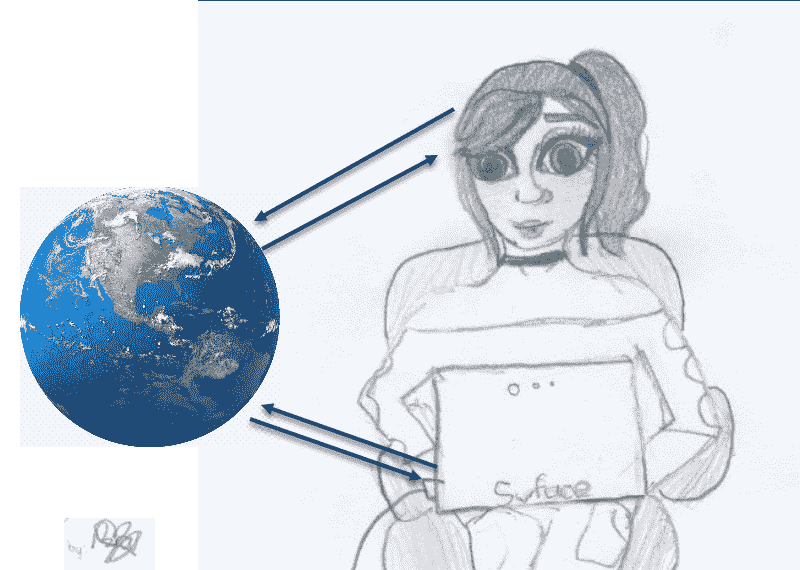

# 五、目标和侦察

与许多攻击人的方法不同，社会工程往往是针对特定目标的。为了创建完美的社会工程攻击，社会工程师明智地选择目标，并在攻击的一些步骤失败时有几个应急措施。选择攻击谁几乎从来都不是一个幸运的猜测；攻击从收集大量信息寻找目标开始。由于这种攻击的性质，攻击者依靠侥幸的猜测是愚蠢的。结果可能是选择的目标没有什么可以提供的，因此在整个攻击中使用的所有努力和资源都白费了。社会工程攻击必须针对特定目标量身定制，否则不会奏效。对某个目标的成功攻击也不一定对另一个目标有效，这是由于必须采用的特异性水平。社会工程师也会根据其他因素选择他们的目标。在大多数情况下，攻击者的目标是金钱，因此，这些攻击主要集中在富人或控制金钱的人身上。因此，即使是一个富裕组织的会计也可能成为首要目标。在其他时候，社会工程师追求的是信息。信息是非常昂贵的，因此商业竞争对手发现雇佣攻击者为他们获取关于他们业务范围内其他组织的秘密信息有时更容易。这一章将集中在社会工程师如何选择他们的目标和计划他们的攻击。通过学习社会工程师如何定位和侦察，我们可以更好地保护自己免受这种攻击。这个列表并不详尽，但它将涵盖社会工程师的主要目标。本章将讨论的目标如下:

*   班克斯
*   旧组织
*   组织员工:
    *   信息技术人员
    *   客户支持代理
    *   高级职员
    *   财务人员
*   老年人
*   祝福者

# 介绍

社会工程攻击从来都不是一个错误。它不能与针对任何人的信用卡欺诈或电子邮件黑客相提并论。这也是为什么社会工程是一种非常成功的攻击方法，而且失败的几率很小的原因之一。它专注于一个目标，攻击者不会失去对目标的关注，直到攻击完成或无法完成。对于攻击者来说，在不幸的情况下，如果攻击者认为目标已经欺骗了他们，或者主要目标已经丢失，例如目标丢失了钱或者他们获得了钱，那么有时必须取消攻击。安全公司已经对受到社会工程师攻击的人和组织的类型进行了分类，并且似乎有一些一致性。基于这种一致性，本章将提供更多关于当今最有可能成为攻击目标的人员和组织类型的信息。这些问题讨论如下:

# 班克斯

信息收集可以通过两大类方法进行——技术方法**和非技术方法**。顾名思义，技术方法依赖于收集信息的计算机辅助技术。然而，不能保证特定的工具或电子设备将获得关于目标的足够信息。因此，可以混合使用下列工具和设备来收集目标信息。社会工程师将使用多种信息收集工具/技术，合并他们获得的信息，为他们的目标建立一个档案。****

 **毫不奇怪，名单上的第一个目标将是存放钱的地方。在大多数情况下，社会工程师追求的是金钱，因此，银行是首要目标。现在已经不是过去的时代了，那时钱只能以现金的形式存在，人们必须亲自抢劫银行才能非法获得。钱是流动的，并且通过互联网转移。因此，银行主要因其网上银行功能而成为攻击目标。此外，银行是敏感机构，保存着客户的敏感信息。这些信息是有价值的，如果一个社会工程师可以访问它，他们可以得到一大笔赎金，或者在黑市上以高价出售。总会有买家愿意得到这类信息。正是出于这个原因，银行采用了一些最严密的安全系统，包括物理和在线系统，以保护他们保存的资金和客户的敏感信息。然而，社会工程是一种不同类型的攻击。它并不试图攻击系统，而是攻击使用或控制系统的人。因此，银行人员都是社会工程攻击的目标。

2011 年，一个网络安全论坛发布了一篇关于一名从事专业银行抢劫的社会工程师的文章。这位名叫吉姆·斯蒂克利的社会工程师据说非常成功，他已经抢劫了一千多家银行，现在还在统计中。他曾被许多银行雇佣来找出银行安全系统的漏洞，他的主要工作是培训和安全政策。他说，即使一家银行有强有力的政策，但却让不知情的人来守卫银行，社会工程师也很容易进入，几乎没有任何障碍来阻止他们。在强化安全设置中的人的因素方面，确实没有什么可做的。关于他成功进入抢劫银行，社会工程师说，他总是使用借口，最常见的是消防检查员。他有正确的制服和徽章，这让他可以快速进入银行，而不会引起任何警报。据他说，拒绝消防检查员进入是非常困难的。斯蒂克利说，一旦进入大楼，他在执行所有任务时总是带着一个空袋子。人们进入银行不是为了偷钱，而是为了窃取信息。在房子里，他会收集拇指驱动器、桌子上的文件和外部硬盘等其他东西。他还会尝试将数据收集设备连接到组织的网络，以便在离开场所后访问网络。他说，他使用无线设备，一旦离开场所，他就可以轻松地控制这些设备，并试图侵入现有的网络安全控制。在某些情况下，Stickley 说他会带着服务器出去。每个人都会认为，一个服务器在没有人认可的情况下被携带是不可想象的。

*Social engineering: My career as a professional bank robber*, by *J. Goodchild, CSO Online*, 2017 available at [https://www.csoonline.com/article/2129956/security-awareness/social-engineering--my-career-as-a-professional-bank-robber.html](https://www.csoonline.com/article/2129956/security-awareness/social-engineering--my-career-as-a-professional-bank-robber.html). [Accessed on December 22, 2017].

前面关于职业银行抢劫犯的例子表明，抢劫银行不仅是可能的，而且有时很容易。目标似乎是敏感数据，一旦社会工程师进入银行，敏感数据似乎永远不会远离。收集的外部存储设备和连接到网络的设备将为社会工程师产生大量信息。这些信息非常敏感，同样也非常昂贵。2015 年，一名黑客获得了属于阿联酋 ( **阿联酋**)一家银行客户的一些客户数据。黑客要求大约 3 美元的赎金，银行拒绝支付。在那次回应之后，黑客继续发布了 500 名客户的银行对账单，并联系客户，威胁说如果他得不到赎金，就发布他们的敏感信息。这损害了银行的声誉，影响是巨大的。因此，如果一名社会工程师走进一家银行，窃取了敏感信息，他们可以要求巨额赎金，就像阿联酋银行的情况一样。因此，从走进银行的简单任务中获取如此巨额资金的能力，使银行成为社会工程师的首要目标。

*Hacker Leaks Customer Data After a United Arab Emirates Bank Fails to Pay Ransom* by *K. Zetter*, *WIRED*, 2017 available at [https://www.wired.com/2015/12/hacker-leaks-customer-data-after-a-united-arab-emirates-bank-fails-to-pay-ransom/](https://www.wired.com/2015/12/hacker-leaks-customer-data-after-a-united-arab-emirates-bank-fails-to-pay-ransom/). [Accessed on December 22, 2017].****# 旧组织

社会工程师随时准备扑向的另一个目标是任何古老的组织。大多数年轻的公司都会有新员工，新员工将确保他们制定一些基本原则，如严格的 IT 政策和先进的安全机制，以防止许多网络威胁的发生。另一方面，老公司之所以成为目标，是因为它们可能是使用易受攻击且不断崩溃的遗留 IT 系统的罪魁祸首。他们至少有机会拥有一台已经使用了几十年的电脑，并且通常会定期进行某种维护。因此，社会工程师很容易以被派去修理几台旧电脑的承包商为借口。而在组织中，社会工程师也将很容易收集更多的信息。更有可能的情况是，组织会放松过时的 It 安全策略，而员工很少遵守这些策略。因此，员工的办公桌上会写有密码，机密文件会被不安全地存储，包含备份的外部存储介质会被公开保存。社会工程师可以对这样的组织造成巨大的破坏。这种类型的攻击通常针对那些由于大量故障而与第三方签订维护 IT 设备合同的组织。较新的组织倾向于使用新设备，员工接受更严格的培训以遵守 IT 安全政策。因此，在社会工程师成功进入组织的情况下，他们会更加小心他们留在户外的东西。

# 组织员工

有时，社会工程攻击不是针对个人的，而是针对一个组织的。随着一些市场的竞争变得激烈，一些组织开始转向恶意的方式来获得竞争优势。其中一种方法是非法获取竞争对手的敏感信息。因此，社会工程师有时会被组织雇佣来从竞争对手那里收集商业秘密、蓝图、机密文件、内部通信甚至消费者数据。正如我们将在下一节中看到的，社会工程已被广泛用于企业间谍活动，社会工程师被雇佣来针对一个特定的组织。因此，在这种情况下，有些员工是首要目标。这些措施如下:

# 信息技术人员

有比负责确保组织数据安全的人更好的目标吗？每年都有许多 IT 员工受到黑客攻击，希望获得他们在网络中的高权限帐户。通过访问这些帐户，组织中的数据很容易被窃取，内部通信也可能泄露到组织之外。大型组织的 IT 员工经常发现自己成为带有恶意链接的网络钓鱼电子邮件的目标，他们知道这些恶意链接并可以轻松避免。然而，他们还没有准备好击退社会工程的攻击。社会工程师有许多锦囊妙计来获取关于 IT 人员的信息，他们可以利用这些信息来进行成功的攻击。在前一章中，我们讨论了一些工具，这些工具使社会工程师能够收集关于目标的信息。这些包括从社交媒体到观察。社会工程师将使用最不明显的方法来获得 IT 人员，因为这些类型的目标往往是可疑的。因此，他们不能被交给一个充满恶意软件的拇指驱动器，并被指示将其插入他们的计算机。他们很难遵守。他们是间接的目标，直到他们足够信任社会工程师而落入他们的陷阱。他们还可能被他们访问的外部网站作为攻击目标。如果攻击者能够攻破一个 IT 论坛网站，如 https://stackoverflow.com/的或 https://stackexchange.com/的从而进行水洞攻击，许多 IT 专业人士可能会受到攻击。

让我们举一个例子，我们可以如何对一家名为 ABC 的假想公司的男性高级 IT 官员进行社会工程设计。第一站是 LinkedIn，我们将在那里收集目标员工的大量信息。但愿目标已经公布了所有关于他的教育和工作经历的信息。有了这些信息，我们就可以去脸书查看这个员工的资料了。我们还可以访问他的 Twitter 和 Instagram 账户(如果他有账户的话),看看他通常发什么微博，发什么类型的照片。在收集了所有这些信息后，我们创建了一个假的脸书和 LinkedIn 帐户，帐户上有一个年轻漂亮的女孩，她与 IT 官员有着相同的爱好，目前在 ABC 公司附近的一家组织中担任初级职位。我们可以向脸书的员工发送好友请求，因为我们已经做了功课，他很可能会接受。然后我们可以在其他社交平台上与他联系。在两个或更多的社交网络中与他建立联系后，我们可以与他更多地谈论兴趣爱好、学习新事物的兴趣以及未来的前景。在与他建立友好关系后，我们可以给他发送一个充满恶意软件的文件，并请他帮助我们解决一些紧急问题。当他下载文件时，我们的恶意软件将简单地攻击他的计算机，并从他的计算机中收集信息。

这个例子看起来很简单，但是它在现实生活中是有效的。2017 年 7 月，一个名为 Mia Ash 的女孩的假个人资料被用于社会工程师男工人。这个假账户的目标是大公司的男性员工，她的目标是商业间谍。对她的个人资料进行了调查，发现该资料被一个名为 **OilRig** 的黑客组织所控制，据信该组织得到了伊朗的支持。这个假的个人资料被用来用一种叫做 **PupyRAT** 的恶意软件感染目标的电脑，这种恶意软件会给黑客提供远程访问的机会。IT 人员会接触到许多其他类型的社会工程攻击。他们拥有企业中几乎所有东西的钥匙，如果受到攻击，攻击者将获得非常敏感的数据和机密信息。

*Cyber spies stole this woman's image to use in a 'honey pot' scam* by *D. McCauley*, *NewsComAu*, 2017 available at [http://www.news.com.au/finance/work/careers/cyber-spies-use-fake-profile-as-a-honey-pot-to-trap-male-workers/news-story/3fed7ec49a4f56ff698b4ca33ca864d6](http://www.news.com.au/finance/work/careers/cyber-spies-use-fake-profile-as-a-honey-pot-to-trap-male-workers/news-story/3fed7ec49a4f56ff698b4ca33ca864d6). [Accessed on December 22, 2017].# 客户支持代理

客户支持代理也发现自己成为怀有恶意的社会工程师的目标。与 IT 员工不同，这些员工在与假定的客户打交道时往往不会有预防性的疑虑。他们希望保持一个组织的良好形象，并愿意不遗余力地满足客户的需求。由于他们主要处理与外界的通信，他们几乎总是打开发送到公司电子邮件地址的所有电子邮件。这是一种社会工程师毫不犹豫地利用恶意软件进入组织的途径。除非经过培训，否则客户服务代理将会遵从客户的要求，以确保客户满意。因此，如果客户说他们将附加一个文件来更好地解释需求，支持代理将继续下载这样的文件。社会工程师也可以利用这些雇员来获得关于组织内其他目标的更多信息。代理将告诉来电者某个员工是否在附近或不在。既然他们想提供帮助，你所需要做的就是给他们一个想要知道这些信息的合理的借口。如果我们要攻击伪装成签约技术人员的组织，最好避开高级 it 人员。因此，罢工的最佳时间是高级 IT 官员不在的时候，这样就创造了一个完美的场景，一个社会工程师可以说他被高级员工紧急派去查看服务器机房的一些东西。

让我们举一个例子，看看我们如何利用代理打开恶意文件。假设我们的目标是一家名为 XYZ 的汽车零部件公司。我们可以打电话给客户服务代理，说我们想要一个我们不熟悉的特定零件，但是一个机械师写了一份描述，并给了我们一些图片。为了防止客户服务代理指示我们使用其他途径来获取此信息，我们必须给他们施加压力，使我们的攻击更容易通过。因此，我们告诉代理，我们正赶着去参加一个会议，但我们将发送一些包含所有信息和图片的电子邮件附件。我们可以通过说急需该零件来增加压力，因为该车有一个现成的买家在等待该零件。话虽如此，我们还是指导他们查看邮件，并尽快回复。请注意，我们已经给代理商施加了压力，减轻这种压力的唯一方法是查看我们正在谈论的描述，检查零件是否可用，然后给我们回复。安全不再是代理人的首要任务；满足我们的迫切需要。除了正版附件，我们还可以附加一个恶意软件文件，等待代理下载并打开它，然后恶意软件就会感染他们的计算机。另一种方法是让代理看我们网站上的描述，给他们施加压力，然后给他们一个恶意网站的链接。无论哪种方式，在代理意识到这是一个骗局之前，恶意软件已经感染了他们的计算机，并开始向我们发送信息。

# 高级工作人员

高管之所以成为社会工程师的普遍目标，主要是因为他们能提供什么。这些高层人士可以接触到非常敏感的公司数据，是机密通信的一方，他们也有自己的个人资产可以成为攻击目标。因此，即使社会工程师无法从他们工作的组织中窃取某些东西，他们的个人资产仍然处于危险之中，可以成为攻击目标。由于他们的资历，高管的安全意识往往较低，因为他们被认为是有权有势的，因此当他们无视组织的安全政策时不会受到惩罚。他们也被认为很忙，因此被免除与其他员工一起参加安全培训。因此，他们最终成为容易攻击的目标，因为他们对网络威胁知之甚少，不知道应该如何应对针对他们的攻击。此外，他们没有受到任何人的压力来遵守组织的安全策略。他们认为安全政策是不方便的，除非无法规避，否则很难遵守。

一个简单的任务，如在 90 天后更改密码，被视为不方便，只有当系统拒绝登录时，密码才会更改。他们不希望自己的 web 活动被记录或监控，因此希望关闭基于主机的防火墙。他们还会绕过几乎所有其他的安全策略，尤其是在他们没有被系统强制执行的情况下，因为他们的级别比 IT 人员高。同时，如果他们被攻击者攻击，他们不会承认错误，相反，他们会责怪 it 部门没有为他们提供保护。因此，他们很容易成为社会工程师的目标，也是任何组织的主要风险。

这些类型的目标落入令人惊讶的常见工程骗局。由于他们是高管，很多关于他们的信息可能会泄露，因此数据收集对社会工程师来说并不具有挑战性。收集到足够多的信息后，他们很容易被诱骗采取危及自身和所在组织安全的行动。他们是一个独特的目标，即使他们不按照组织的安全策略行事，也认为安全是有保证的。因此，即使他们点击通过电子邮件发送给他们的链接，他们也会认为 IT 部门已经采取了足够的保护措施来防止任何恶意行为的发生。当他们将个人设备连接到组织网络时，他们忽略了这样一种风险，即如果他们的个人计算机上有恶意软件，它将会进入组织网络。

由于攻击者通常希望采用最不具挑战性的方式进入组织网络来收集信息，因此高管是最佳的利用途径。试图直接攻击网络很可能会失败，因为有许多安全措施来防止这种类型的尝试。然而，高管的个人电脑总是一个受欢迎的选择。因此，社会工程师将在酒店房间里等待，从连接到酒店 Wi-Fi 的高管那里窃取数据。他们还会以富有的名义潜伏在机场，特别是头等舱和商务舱的休息室，而实际上，他们正在用恶意软件感染连接到 Wi-Fi 的计算机。这就是为什么避免在个人电脑中存储敏感的工作数据是极其重要的。与工作场所的计算机不同，个人计算机不享受来自组织的 IT 团队的同等保护。所以很容易渗透这类机器，安装恶意软件复制敏感数据，泄露机密消息。如前所述，高管员工的个人电脑上存有不安全的敏感数据，一旦他们的电脑上出现恶意软件，一切都将受到攻击者的控制。

让我们假设一个场景，我们想从一家美国军事承包商的首席财务官那里窃取数据。我们必须尽职调查，找出他每天的日程安排。我们可以找出他最喜欢的酒店、旅行计划和周末度假。一旦我们发现他在周末或假期经常去的地方，我们必须收集关于那个地方的情报，因为这是我们打击他的点。无论如何，我们要确保获得 Wi-Fi 密码，对设备进行测试攻击，以确保一切就绪。当首席财务官来的时候，我们可以以普通顾客的身份出现，并有策略地坐在一个我们可以看到首席财务官的地方。当他将个人设备连接到网络时，我们可以在其中安装恶意软件，并开始从中收集数据。唯一的挑战是他的设备是否有一个终端主机安全程序，可以防止恶意软件感染设备。但是我们有可能会安装恶意软件。

# 财务人员

财务部门的员工是社会工程师的目标，他们只对钱感兴趣，而不是数据。这些员工控制着巨额资金，向供应商、承包商、员工支付报酬，还从销售和其他收入来源获得资金。他们倾向于系统化地操作，并且会坚持按照书中的指导方针行事。因此，他们不会轻易被社会工程师用廉价的骗局欺骗，如*尼日利亚王子*钓鱼邮件。*尼日利亚王子*网络钓鱼邮件是一种向目标发送虚假邮件的邮件，向目标解释尼日利亚王子的困境，他想取钱，但需要你的帮助。这是一个老的网络钓鱼企图，它不会在社会工程金融人员中成功。要攻击他们，你需要让他们离开他们熟悉的系统操作环境。你需要让他们在寄钱的时候跳过一些检查。做到这一点的方法之一是选择一个权威人物的借口，可以命令他们放弃正常的程序。

让我们以 2015 年 8 月通过社会工程攻击被欺诈的无处不在的网络的真实场景为例。据透露，一名财务人员收到了一封据称来自其老板的电子邮件，要求他提供一些公司在线账户的登录凭据。这名员工查看了这封邮件，因为它与他的上司使用的邮件相似，所以他照办了，并透露了机密信息。据信，攻击者使用伪造的电子邮件冒充老板。由于初级员工通常不会向权威人士提问，比如为什么会要求提供信息，所以就提供了信息。攻击者能够从该公司账户转移近 5000 万美元到一个海外银行账户。

当员工意识到邮件不是来自他们的老板时，黑客已经带走了这笔钱。然而，该公司追回了近 1000 万美元的被盗资金，但这还不够。

*Hackers siphon $47 million out of tech company's accounts* by *D. Goldman*, *CNNMoney*, 2017 available at [http://money.cnn.com/2015/08/10/technology/ubiquiti-hacked/index.html](http://money.cnn.com/2015/08/10/technology/ubiquiti-hacked/index.html). [Accessed on 22 December, 2017].

在给定的例子中，该组织被以非常简单且不昂贵的方式抢劫。注册一个可以用来创建假冒电子邮件地址的新域名的成本只有 1 美元。唯一使用的技巧是一种权威的语气，这名员工照做了。如今，许多组织都可以成功复制这种攻击。既然成功了一次，社会工程师就会在别的地方再用一次。金融员工距离被攻击只有 1 美元的距离。由于电子邮件和电子邮件模板的欺骗方式如此之多，财务人员在泄露某些信息时应注意检查整个电子邮件地址。

# 老年人

老年人对攻击的了解较少，而且通常很天真。他们可能住得很远，独自生活，并且愿意倾听那些听起来需要帮助的人。他们的同情心每年都被社会工程师无情地利用，导致诈骗者损失数百万美元。老年人被认为在他们的账户中有大量闲置资金，如果被说服，他们会把这些钱给那些看起来需要的人。剥削老年人的方式有很多种，我们来看看最常见的十种方式:

1.  医疗保险:这通常发生在美国，因为超过 65 岁的老年人有资格享受医疗保险。因此，一个社会工程师不需要做任何这方面的研究，如果他们可以告诉目标是超过 65 岁，医疗保险将是一个简单的利用目标的途径。通常，社会工程师打电话假装是医疗保险的代表，他们要求老年人给他们个人资料，甚至有时，他们要求金钱。当他们得到关于老年人的信息时，他们可以开医疗保险账单并从中获得资金。有时，社会工程师也会求助于老年人，向他们要钱来更新诸如不存在的订阅之类的东西。在骗局被发现之前，他们让受害者承诺支付很长一段时间的费用。

2.  假药:互联网上有社会工程师在出售假药给老年人，这些药据说可以治疗许多特殊疾病。社会工程师使用特定的关键字在他们的网站上获得他们的目标。从那里，他们说服他们必须长期使用这些药物，而事实上，这些药物并没有提供任何帮助，有时还会产生负面影响。老年人希望，如果他们服用药物，他们被告知患有的所有疾病都将被治愈。社会工程师通过假药卖给他们这种希望。
3.  当然，老年人比任何人都更接近年龄限制，因此他们有时会想计划死后会发生什么，以便有一个美好的告别。社会工程师从未远离出售给他们这些送别不存在的包装。有时，社会工程师会利用死者从他们的家人那里获得金钱。还有另一个特别令人悲伤的技巧，他们浏览讣告，甚至参加葬礼，只是为了收集悲伤家庭的细节。之后，他们会联系死者家属，向他们勒索钱财，以偿还死者所欠的不存在的债务。
4.  抗衰老产品:这也是销售老年人希望的一部分，他们被告知，如果他们服用某种药物，他们仍然可以保持年轻和美丽。毕竟，保持年轻的需求是相当迫切的，*谁不想在 60 岁时看起来像 40 岁呢？*社会工程师将有一系列的药物，他们将承诺老年人给他们一个年轻的外观。一名成功的社会工程师因经营这种骗局在亚利桑那州被捕并被定罪，但这是在他一年内从老年人身上赚了超过 150 万美元之后。仍然有许多卖家向老年人提供这些抗衰老药物和面霜，由于它们的说服力，他们正在赚一大笔钱。这些药物中的一些不仅无益，而且有毒，因此会导致更多的皮肤皱纹。
5.  电话诈骗:据统计，老年人购买电话的次数是其他群体平均购买次数的两倍。他们通过电话购买许多东西，这是社会工程师用来剥削他们的一种方式。社会工程师将向老年人出售永远不会收到的商品并开出账单。也有其他方法，社会工程师要求紧急电汇钱给他们，因为一个亲戚住院了，需要钱。如果社会工程师能给出一个实际亲属的名字，老人将会非常信服，并会赶紧寄钱。

6.  互联网骗局:互联网上有许多老年人，他们没有意识到潜藏在其中的危险。年轻人往往会识破骗局，但不会上当，但老年人就没那么幸运了。有一种常见的互联网骗局是由广告软件运行的，它在浏览器上显示一个弹出窗口，提示设备已被扫描并发现有一些恶意软件。一个上了年纪的人会非常关心这个发现，并愿意做任何事情来照顾它。因此，对于老年人来说，点击提供的链接，支付一些清洁服务的费用是很常见的，攻击者将从那里继续敲诈他们。还有一种由假装提供免费程序下载的网站运行的骗局。当一个人访问该网站时，有三四个下载按钮，其中大多数是恶意的。当点击时，他们会要求老人输入他们的电话号码，从这个号码下载会产生一些费用。进行收费，发送代码，但是下载从不成功，或者它不导致所请求的文件的下载。
7.  投资计划:老年人会为退休储蓄一些钱，这样当他们退休时，他们就可以有一些钱用于投资。社会工程师总是在附近为他们提供*完美的*投资机会。这些投资计划将会听起来非常好，那里将会有疯狂的回报和最低的管理要求。它们往往是金字塔计划，目标被告知进行可观的初始投资，然后简单地等待资金开始慢慢回流——只是它永远不会。传销是以这样一种方式呈现的，它们看起来很吸引人，而这是人类获取更多的自然贪婪，让老年人陷入了这个陷阱。
8.  抵押贷款诈骗:社会工程师利用了一种最有可能的情况，即超过一定年龄的人将主要住在自己的房子里。老年人很可能已经买了房子，社会工程师会毫不犹豫地利用这一点。他们可以开始发送自称是政府官员的个性化信件，希望重新评估房屋价值及其税收负担。然后，他们会要求一笔费用，之后，当支付后，他们就会消失。

9.  彩票:这是一个精心策划的骗局，通常针对老年人，而且出奇地成功。一个社会工程师会打电话给他们，向他们解释他们中了彩票，他们将收到一张支票，上面有大量的钱，他们可以把钱存入银行。然而，在目标和支票之间设置了一些限制，然后引入了一些费用。社会工程师可以说，政府已经征收了目标必须支付的一定百分比的税，或者可以说，应该支付一些费用，以允许将支票安全地运送到目标。出于赢得巨额奖金的兴奋，目标几乎不会再考虑发送这些费用或收费。社会工程师可能会在很长一段时间内骗取目标的钱财。
10.  祖父母骗局:这是一种新型骗局，目标是富裕的祖父母，他们被认为心地善良。社会工程师会拿起电话，给目标打电话，告诉他们猜是哪个孙子在给他们打电话。经过多次猜测后，社会工程师将假装是上述人员之一，并试图赶上目标。在一个小的讨论后，社会工程师介绍了他或她所处的困境，急需用钱。这可能是一份医疗账单，一次事故，因为付不起房租而被驱逐，或者需要现金来修理一辆搁浅的汽车。为了掩盖他或她的踪迹，社会工程师告诉目标不要告诉他们的父母他们要求这样的钱。老人会寄钱，社会工程师会以孙子为借口一次又一次地打电话回来。

# 祝福者

有人想从灾难中获利是不可想象的，但不幸的是，社会工程师们如此无情。在爆炸和飓风等一些事件中，社会工程师会建立自己的慈善基金会。他们会向人们做广告，鼓励他们捐钱来帮助受害者。这似乎是一个很好的事业，除了钱没有到受害者手中，而是去了一些社会工程师的腰包。

当骗局被发现时，人们被建议不要向它捐款，社会工程师可能已经赚了数百万美元。在海地 7.0 级地震期间，这是一个特别大的挑战。许多假的慈善机构在网上建立，并向人们做广告。很多钱进入了少数人的口袋，而不是预期的受害者:

# 技巧

瞄准和侦察的技巧如下:

*   永远不要在社交媒体上分享关键信息
*   不要重复使用重要的密码
*   不要分享别人不需要知道的东西
*   知道该说什么，什么时候说，怎么说
*   阅读第八章、*社会工程师工具*，搜索你自己，看看你有多公开
*   请记住，我的社交媒体账户是不存在的

# 摘要

社会工程师对他们锁定的受害者有特殊的偏好。目标是在评估了可以从他们那里偷到什么以及偷得有多容易之后选择的。本章讨论了相当多的目标，这些目标通常是社会工程师的首选，因为他们扮演的角色、他们拥有的财富或他们被诈骗的容易程度。这一章首先审视了银行，强调了可以被利用的漏洞。简单回顾一下，我们举了一个职业银行抢劫犯的例子，突出了他们从这些机构内部窃取数据的途径。这一章还研究了旧组织中存在的裂缝，这些裂缝使它们很容易成为社会工程师的目标。特别关注三种类型的组织雇员，他们是社会工程师的主要目标:IT 人员、财务部门人员和管理人员。社会工程师的另一个目标是老年人，因为他们很容易被欺骗。已经讨论了社会工程师利用他们的十种常见方式。最后，以海地地震事件为例，讨论了对好心人的剥削。值得注意的是，社会工程师将瞄准更多的人。所讨论的是社会工程师通常会选择的共同目标。

本章介绍了社会工程师最常见的目标，并解释了他们经常被选中的原因。其中一些人(如 IT 人员)之所以成为攻击目标，是因为他们对敏感的组织数据和内部通信的访问和控制级别。高管一直被当作目标来讨论，因为他们在一个报告中提出了两套目标，他们自己的个人数据和他们所在组织的数据。老年人被当作目标来讨论，因为他们很容易被说服采取一些行动。整章要注意的一点是，还有很多其他目标，包括你。一个社会工程师会毫不犹豫地把目标锁定在一个组织或一个独立于讨论对象的个人身上。因此，每个人都应该极其谨慎，以防止剥削。下一章将讨论启发。人们希望生活在一个安全的区域，因此，社会工程师需要有技巧让他们走上一条危险的道路。下一章将讨论几种技术，这些技术可以用来把人们从他们的安全舒适区吸诱导来，从而攻击他们。

**