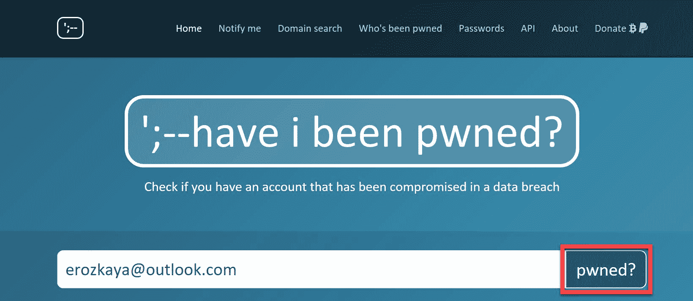
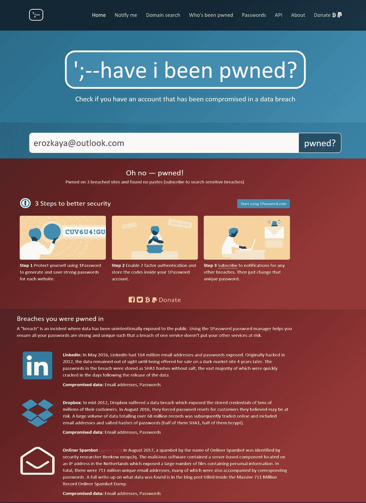
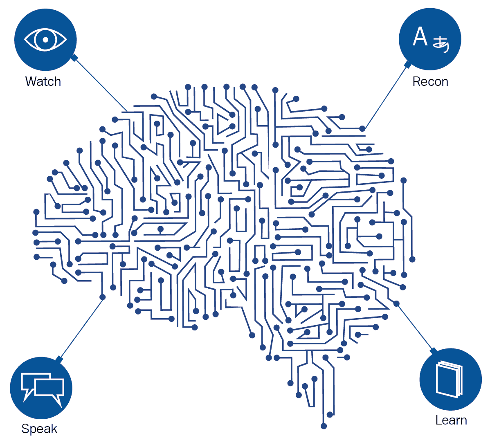

# 六、诱导

也许在整个社会工程攻击中最重要的技能是把目标吸引到一个他们可以利用的点上。**诱导**是一种在社会工程攻击的关键阶段使用的强大技术，用于使目标采取社会工程想要的行为路径。美国**国家安全局** ( **NSA** )对诱导的一个有趣定义是，它是在正常对话中对信息的微妙提取。诱导是广泛教授给间谍的技能之一，以确保他们可以从人们那里大嚼信息，而不会让人觉得他们真的被监视了。交谈可以在任何地方进行，社交工程师喜欢在他们(目标)熟悉的地方接近目标，因此在与陌生人交谈时已经感到舒适。人类会希望留在一个安全舒适的区域，因此一些问题会引起怀疑。然而，当被熟练地创造和询问时，回答者会吐出一些本来会被隐瞒的信息。本章将讨论社会工程师如何诱导他们的目标，并刺激他们以某种方式行动或回应，在这种方式下他们更容易被剥削或顺从不寻常的要求。为了避免成为诱导的受害者，学会如何以安全的方式*交流*是很重要的。本章将讨论以下主题:

*   与陌生人交谈
*   预加载
*   如何成功地进行启发？
*   掌握启发的技巧

# 介绍

启发是一种低风险、隐蔽性好的社会工程技术，效果令人印象深刻。随着时间的推移，有一些因素已经在人类中根深蒂固，这些因素使得诱导特别成功。这些措施如下:

*   许多人希望对陌生人有礼貌
*   专业人士希望在被提问时显得知识渊博
*   大多数人不想对那些看起来真正关心的人撒谎
*   许多人愿意回答关于他们自己的恰当问题

让我们举一个现实生活中的例子，看看这些因素是如何在正常对话中发挥作用的，以及社会工程师如何利用它们。假设有一个企业活动，人们可以与组织中的关键成员进行互动。一名社会工程师可以晋升到首席财务官(T2 首席财务官(T3))，并自称是一家鲜为人知的公司的安全主管。他可以根据首席财务官所在组织的收入和公司的未来前景，引发一场小对话。当然，首席财务官会公开并分享这方面的信息。对于攻击部分，社会工程师可以声称正在寻找一个门的安全系统，并询问首席财务官他是否了解他们公司使用的系统。为了显得消息灵通，首席财务官将继续下去，并通知社会工程师目前正在使用的系统。从那次闲聊中，社会工程师将会学到更多关于该组织所使用的内部安全系统的知识。这并不能保证这种方法总是有效，但所讨论的因素通常存在于大多数人身上，因此是一种获取敏感信息的快速方法。

下图代表了社会工程的两个方面:

Evil will always pretend to be an angel

在所讨论的对话中收集的信息(其特征是诱导关于某个组织所使用的安全系统的信息)可用于随后实现攻击。这位社会工程师可能以被派去修理有缺陷的安全系统的修理工为借口出现在组织中。关于在组织中使用的安全系统的信息将已经被 CFO 披露，因此它将是准确的，并且安全警卫和接待员将让社会工程师进来做他的修理工作。如果社会工程师在会议期间与该组织的其他工作人员进行了互动，并收集了有关该组织的更多信息，他或她就可以进行大规模的攻击。启发不限于信息收集。它也被用来巩固一个借口，并获得更多的信息。让我们来看看启发的一些目标。

# 与陌生人交谈

在任何社会工程攻击中，社会工程师都希望目标采取行动，要么说点什么，要么做点什么。可能小到回答一些问题，也可能大到让一名社会工程师参观一个组织中的禁区。启发发生在与人的简单交谈中。陌生人之间每天都有小对话，因此当陌生人走近他们并与他们闲聊时，人们不会感到惊慌。它可能是在商店的队列中，在餐馆的桌子上，或者在一个事件中。如果事先对目标人物进行了调查，了解了他们经常去的地方和在这些地方喜欢做的事情，那么就很有可能引发与他们的对话。与陌生人开始一次成功的闲聊有三个步骤。这些措施如下:

*   自然:如果试图保持对话的人看起来不舒服、不自然，目标就会终止对话。因此，一个社会工程师必须总是通过姿势和其他非语言的自信和自然的暗示来交流。此外，一个社会工程师应该发起他所了解的对话。没有什么比缺乏对目标说的话更能酝酿缺乏信心了。这就把我们带到了第二步。

*   知识渊博:一个社会工程师必须了解他或她想要与之展开对话的事物。在前面与一家公司的首席财务官交谈的例子中，这位社会工程师首先提到了公司的财务状况。他或她一定有时间仔细阅读这些数字，因此在开始谈话时，他或她一定有一些能引起首席财务官兴趣的东西。有了这些知识，社会工程师就有了可以大胆地与首席财务官谈论的话题。然而，如果没有足够的信息让一个社会工程师与一个首席财务官开始对话，就可以选择一个研究员或记者的借口。
*   慷慨大方:在前面的章节中，我们讨论了回报的问题，当一个人得到一些东西时，总有一种想要回报的冲动。为了开始或维持一场对话，重要的是要有一个互让的环境。正是通过这种方法，社会工程师可以通过假装向目标提供更多关于其假设组织的内在细节来更深入地了解组织。慷慨也可以从谁主导对话的角度来发挥作用。在前一章中，我们注意到最好的健谈者是好的倾听者。因此，社会工程师永远不会主导对话。他或她让目标说得更多，因此透露更多。

讨论的步骤将确保一个人可以开始并保持健康的对话。这些步骤不仅在社会工程攻击中有效，在正常对话中也有效。除了这三个步骤就是能量。这通过一个人的语调、外表和非语言暗示来表达。在狗的训练课上，新主人被告知他们的能量会影响他们的狗的能量。因此，他们必须以正确的精力接近他们的狗，避免紧张和焦虑。在社会工程中也是如此。社会工程师将根据他们选择使用的借口，以正确的能量把自己呈现给他们的目标。

# 预加载

预加载是一种广泛应用于市场营销并取得巨大成功的技术，也适用于社会工程。让我们举一个电影院的例子。当购买电影票或爆米花和饮料时，会有即将上映的电影的海报。当坐在电影大厅里时，会播放一些即将上映的电影的预告片，旁白以诸如【最恐怖的电影】这样的话开始...或*最刺激的电影...*。这是一部即将在电影院上映的电影的广告，广告已经告诉你如何感受和期待什么。

这在你内心深处酝酿了看电影的欲望。在餐馆广告中，大部分都是快乐的人在享受美味的食物，并配有标题，如*美味！*让你在品尝食物之前就能感受到它的味道。这两个例子让我们了解了什么是预加载。这是一种向目标加载一些如何对某些事情或信息做出反应的想法的技术。

在社会工程攻击中，攻击者将首先提出一个与目标进行交互的目标。在启发中，这将收集一些信息。接下来，攻击者会提出一些问题来问目标，然后想办法在他或她回答这些问题之前预先加载目标。

为了更好地了解现实生活中的预加载，让我们来看看 2015 年上映的由威尔·史密斯主演的电影 *Focus，*。这部电影的一个标志性部分是威尔·史密斯和一个叫谢丽媛的赌徒赌上了他(威尔)赚的所有钱。史密斯的一个同伙在他们卷走的钱即将丢失后简直要发疯了。李云·谢被告知在场上挑选任何一名球员，如果史密斯猜不出是谁，他就输了。谢霆锋选择穿 55 号球衣的球员，因为史密斯猜到了那个球员，所以他赢了。当向女同案犯解释他如何确定谢霆锋会选择 55 这个数字时，他向她解释说，他们已经做好了一切准备，这样无论赌徒走到哪里，他都会预装 55 这个数字。背景音乐、赌场灯光和小丑被用来向赌徒预先输入号码。因此，他选择穿 55 号球衣的球员只是一个时间问题，因为这个号码反复植入了他的无意识大脑。

*Focus (2015)*, *IMDb*, 2018 by *G. Ficarra*, *J. Requa*, *W. Smith, M. Robbie* and *R. Santoro*, available at [http://www.imdb.com/title/tt2381941/](http://www.imdb.com/title/tt2381941/). [Accessed on January 11, 2018].

预加载是成功激发尝试的先决条件。这比向目标对象提出好奇的问题的实际诱导过程需要更多的准备。预加载可以变得非常复杂，这取决于社会工程师想要植入目标的想法。在所讨论的威尔·史密斯电影中，可以看出，他花了很大力气让对手输入 55。当李云·谢在球场上挑选球员时，他们甚至改变了背景音乐。背景中的歌曲也是亚洲的，它的合唱也是数字 55 的重复。很明显，这需要时间来计划，仅仅是为了预先加载 55 这个数字。类似地，一个社会工程师会不厌其烦地植入一个输入，使目标的决策更可预测。因此，预加载需要时间，对于社会工程师来说，耐心是很重要的。有时，它甚至可能涉及情绪，而这些需要一些时间来建立。

# 避免启发

当一个社会工程师试图执行启发时，有许多事情会发挥作用。有一些很好的策略可以用来确保启发尝试的成功。他们从给目标买酒到奉承他们的自我。

现在将介绍其中的一些策略:

# 迎合自我

许多人，尤其是那些身居高位的人，喜欢被人抚摸他们的自尊心。这样做是为了吸引目标，但应该小心谨慎，因为如果做得过火，目标也可能会让你止步不前。做到这一点的一个好方法就是承认一些基本的东西，并对此保持微妙的态度。例如，在一次演讲后，你可以走向其中一位演讲者，告诉他，这是一次多么精彩的演讲。我来的时候对此一无所知，现在我觉得自己像个专家。这种简单的奉承在开始与目标对象的对话时非常有效，社会工程师可以从这一点开始启发尝试:

Conferences are great places to launch a social engineering attack# 表现出共同的兴趣

人们会欣赏一段超越初次见面的关系，这就是共同利益的来源。它不仅使当前的对话更有趣，还允许社会工程师将目标放在更容易攻击的点上。例如，**首席安全官** ( **CSO** )可以在年度会议上提到组织正面临越来越多的攻击。会后，一名社会工程师可以接近这位资深员工，中断一段对话，然后中途提出一个引起首席财务官兴趣的话题。他可以提到他是另一个组织的 IT 主管，并且已经部署了一个特定的程序来减少网络安全问题。社会工程师可以提议在 CSO 的组织中安装一个演示，看看它是如何工作的。这将建立两者之间的共同利益，CSO 不仅会同意进一步联系，他还会给社会工程师一个直接访问组织计算机的机会。共同的兴趣是有利的，因为它可以快速地在社会工程师和目标之间建立联系。当目标暴露自己面临特殊挑战时，通常会使用这种方法。

# 伪造陈述

在诱导中，社会工程师的目标是引起目标的兴趣，任何事情都会发生，包括故意的虚假陈述。当一个错误的陈述出现时，一个知情的人会试图联系社会工程师并纠正他或她。知情人会天真地试图纠正社会工程师说错的话。事实上，所有的社会工程师都在等待目标的回应。虚假陈述是一种让人们给出真实陈述的快捷方式。那些渴望改正错误的人通常希望表现得不能容忍错误，并且更加见多识广。当另一个人做出不正确的陈述或评估时，进行纠正也是人类本性的一部分。在目标纠正了错误陈述后，社会工程师就有了与他或她交谈的动机。因此，他可以在以后接近目标，并要求被告知更多的真实情况。表现出消息灵通的愿望会使目标向社会工程师透露一些信息。

让我们举一个社会工程师的例子，他想更多地了解组织中的安全系统。在非正式聊天中，他可以说(当着该组织员工的面)该组织几乎没有任何安全系统，可能会受到恶意人员的攻击。该员工将被迫否认这一说法，并说公司采用了一些最复杂的物理和软件安全控制措施。之后，社会工程师可以去为做了错误的陈述道歉，并要求被告知更多关于这些安全系统的信息。雇员将继续向社会工程师提供细节。

# 谄媚的

这似乎是一个显而易见的技巧，可能很少成功，但实际上，它非常有效。人们自然希望自己的成就得到认可，但他们不想吹嘘自己，因为吹嘘通常会被人瞧不起。当一个目标被奉承时，他或她会收到赞美，但有时会试图淡化它。此时，目标很容易泄露一些关于他或她被称赞的信息。比方说，一名 IT 员工被告知，*你是这家公司真正的英雄，每天保护这样一家公司免受其他人似乎不知道的所有网络威胁*。IT 员工会接受这种赞美，或者试图淡化它，这是社会工程师向他或她询问用于保护公司系统的工具的最佳时机。当提到工具时，社会工程师可以继续对所使用的工具给予更多的赞美。例如，社会工程师可以继续说*哇，你都有了。您是否有内部服务器，因为这一系列工具表明您已经在做一项无懈可击的工作，让那些大型机器到处都是？。*这种称赞将再次让 IT 员工有机会谈论更多关于内部计算基础设施的信息，向他们展示组织内保存的服务器的信息。这个信息非常有用。社会工程师将最终知道用来保护目标的计算基础设施的安全工具。此外，组织中保存的关于服务器的内部知识可能有助于策划另一次攻击。社会工程师可能会派人带着关于组织的内部安全和计算结构的信息出现在组织的场所。派出的代理可能最好在高级 IT 官员外出的一天来，并告诉下级，他们的高级官员派他去修理 XYZ 服务器或检查 ABC 安全工具。有了这些信息，他们将允许他进入服务器机房，在那里他可以执行一些恶意的操作。所有这一切都源于对一名 IT 官员的简单奉承。

# 志愿服务信息

这也类似于前面章节中讨论的互惠。简单回顾一下，据说一旦一个社会工程师给了目标一些有价值的东西，目标很可能会回报一些东西。说到信息，也是如此。一旦提供给目标一些看起来有价值的信息，他们就会愿意将自己有价值的信息反馈给社会工程师。他们几乎总是觉得有义务回报一些东西，只是为了与社会工程师扯平。自愿提供信息是一种常用的策略，目的是诱导那些原本会隐藏一些信息的目标。因此，社会工程师将准备向目标提供一些信息，以便无意识地迫使他们提供一些信息作为回报。有一句流行的话叫同病相怜。为了避免断章取义，我们可以不严格地把这句话理解为人们经常想要分享相似的故事。因此，如果一名社会工程师在组织会议期间遇到一名 IT 官员，他可以以另一名 IT 官员为借口接近他或她，并开始谈论安全弱点。社会工程师甚至可以继续说，他意识到首席执行官使用他的生日作为他的密码。这种思维模式会从合法的 it 官员那里产生类似的故事，并且很快，关于凭证的敏感细节就会被泄露。

# 假设知识

有一种常见的行为，如果某人对某事非常了解，就可以基于这种了解建立对话。因此，如果一个人认为自己对某件事很了解，他或她就会邀请一些好奇的人来了解这方面的知识。本来不会进行的对话将会形成，原本对社会工程师不感兴趣的人现在将有动机这样做。当人们想知道更多的时候，这可能是一个合适的时机，可以尝试邀请他们的组织或他们最喜欢的餐馆进行更多的交谈。当会议安全时，可以很容易地使用其他社会工程技术，因为目标已经被引诱到他或她可以被利用的程度。

查明你的密码是否被盗的一个好方法是通过一个非常知名的网站，*我被 pwn 了吗？大多数时候，猜测或查找电子邮件地址并不困难。*

密码重用是很正常的，尽管作为安全专家我们不建议这么做。密码重用是舒适、容易的，而且人们没有意识到潜在的影响。如果你很好奇自己的密码是否被盗，可以自己去查一下。https://haveibeenpwned.com/Passwords 的网站非常安全:

Have I been pwned by Troy Hunt is a great way to check out if your password has been stolen

执行以下步骤:

1.  正如您在前面的屏幕截图中看到的，您所要做的就是键入您的用户名或电子邮件地址，如下面的屏幕截图所示:

Have I been pwned screen

2.  你一点击 pwned？按钮，你会看到以下结果:

The website lists my pwned accounts

3.  如果你的目标结果如前面的截图所示，你就有了一个开始谈话的好方法。如果您自己的帐户列在那里，请确保更改您的密码，并且永不重复使用。这个练习的最终目标是得到好消息——没有发现任何问题！，如下截图:

Good news from Troy Hunt

4.  如果您愿意，如果您被 pwned，您可以从网站获得通知:

Notify me when I get pwned# 利用无知

大多数人都有向他人传递信息的愿望，尤其是当他们表现出一定的注意力和学习意愿时。社会工程师通过人为假设无知来利用无知，以便从他们的目标那里获得一些信息。仅仅通过表现出对某件事缺乏经验和不了解，他们就鼓动别人去教他们。它可以是一般知识，也可以是特殊技能。让我们以前面章节提到的 2016 年的一部电影为例，名为 *The Catch* 。在其中一集里，一个叫克里斯托弗·霍尔的骗子仅仅通过使用人为的无知就能得到酒店所有保险箱的重置密码。他订了一个酒店房间，把一些东西锁在他的保险箱里，然后打电话给酒店服务员帮他开门，因为他忘记了密码和保险箱的工作原理。服务员最终向霍尔展示了酒店用来重置所有保险箱的主密码。最后，他利用这一知识，在同伙的帮助下，抢劫了酒店房间里的许多其他保险柜。这个例子说明了权力是如何通过装聋作哑和误导有知识的人而产生的。

*The Catch* (TV Series 2016-2017), by *K. Atkinson*, *H. Gregory*, *A. Heinberg*, *M. Enos*, *P. Krause,* and *J. Hayden*, *IMDb* 2018 available at [http://www.imdb.com/title/tt4396862/](http://www.imdb.com/title/tt4396862/). [Accessed on January 11, 2018].

当无知与其他诱导技巧结合起来时，比如奉承，会更加有效。自我的提升还有一个额外的好处，那就是让目标变得开放。这种技巧对健谈的目标非常有效，因为他们可以通过赞美说得更多一点。类似地，这种技巧对于不喜欢吹牛且大多性格内向的目标不会成功。

# 利用酒精饮料赚钱

酒精饮料有迅速放松紧闭双唇的作用。实际上，到目前为止，在所有讨论过的例子中，如果引入酒精，社会工程师会得到更好的结果。酒精让人放松，说一些他们在清醒时不会说的话。一个社会工程师可以花一些时间跟踪他或她的目标最喜欢的酒吧。在研究这些关节一段时间后，社会工程师可以开始在几天内定期撞击每个目标。当确定目标似乎已经注意到他或她几次时，社会工程师可以尝试使用酒精从目标那里获得一些信息。社会工程师可以提议给目标购买一些饮料，并且当目标喝醉时，信息收集可以开始。喝醉的目标将更容易向社会工程师泄露敏感信息。但是，这种技巧只适用于少数首先同意被其他人买啤酒的目标。当目标拒绝出价时，这种技术就会惨败。

# 做一个好的倾听者

对人类来说，向他人，甚至是完全陌生的人透露自己的感受和秘密并不稀奇。当有人分享一些令人不安的信息时，会有一些宽慰。许多人有所保留，他们需要的只是一个倾听的耳朵。这些人经常去酒吧和教堂之类的地方，他们希望在那里暂时缓解他们的忧虑。社会工程师知道这一点，这就是为什么他们会在这样的地方等待。当他们与似乎有抱怨的人互动时，他们倾听，让目标说出他或她的感受，他们只是验证这些感受。验证使目标更接近社会工程师，因为他们认为已经与能够理解他们的人建立了联系。如果社会工程师与目标保持长时间的接触，披露的内容会增加，变得更加敏感。社会工程师也将享有独特的地位，能够要求更多的信息从目标，否则将永远不会泄露。成为一个好听众的技巧在第五章、*瞄准和侦察*中给出。总结一下，强调社会工程师的肢体语言、眼神交流和语调必须对目标所说的内容表现出兴趣。为了获得更多的结果，社会工程师可以添加他个人的但编造的故事来鼓励目标继续前进。

社会工程是人类黑客的艺术，它可以由社会工程师来完成，比许多人想象的更容易。如下图所示，您需要做的只是仔细观察、仔细说话、观察目标，并尽可能多地学习，以让目标提供您需要的任何信息:

Hacking your target is easier than you think# 使用巧妙提出的问题

在启发中，社会工程师不会简单地走到目标面前，要求他或她给出敏感的凭证。虽然这一信息是主要目标，但必须谨慎寻找，以避免引起怀疑。因此，社会工程师必须学会如何以正确的方式提问。大多数情况下，社会工程师会使用在目标看来毫无用处的问题，因此，他们不会不愿意回答这些问题。只有当这些微小的信息结合在一起时，大局才是可见的。

让我们仔细看看社会工程师为了从他们的目标那里收集信息而使用的问题类型:

*   **开放式问题**:这些问题需要的不仅仅是一个是或否的回答。因此，如果对着目标摆姿势，可以收集到更多的信息。开放式问题通常在面试中使用，以诱导受访者不断给出答案。每个问题后面都有一个跟进问题，询问给出的答复的*为什么*和*如何*。因此，目标将不断向先前给出的响应添加更多的细节。由于一些目标在回答问题时可能会表现出一些抵触情绪，因此最好使用金字塔方法，社会工程师将从狭窄的问题开始，并将更广泛的问题留到面试的最后部分。
*   **封闭式问题**:这类问题用于引导受访者走上某条道路。这些问题通常只能用几个选项来回答。目标不是收集信息，而是将回答者引向某个角落，在那里可以使用其他问题来收集所需的信息。当律师和警察试图将他们锁定在特定的路径上时，他们通常会使用这些问题。这些问题可能看起来简短而支离破碎，但它们慢慢地抑制了回答者转向故事的另一个版本。
*   **引导性问题**:这些问题通常借鉴了开放式和封闭式问题的优点。它们是开放式的，但会给回答者一个预期答案的暗示。例如，*我前几天看到打印机公司派了几个技术人员进来；你的公司一定正面临一些打印机的技术问题，不是吗？*。这个问题的答案是“是”或“否”,然后是一个狭义的解释。这也向回答者暗示了你对自己所说的内容很了解。即使受访者只给出是或否的答案，引导性问题也会产生一些其他影响。大量的信息被植入回答者的大脑，更多的事实被建议让他或她同意或不同意。最后，回答者被诱导说得更多。引导性问题也是特别有力的工具，因为它们可以扭曲记忆。他们可以用来操纵目标的记忆。心理学家巴特利特在 1932 年做的一项研究得出结论，人们很难准确完整地回忆起一件事。这是因为人们根据大脑认为重要的东西以不同的方式进行记忆。当回答者提到同样的记忆时，一些记忆会丢失，而被认为重要的记忆会被回忆起来。为了掩盖赤字，做了一些概括来填补空白。

因此，如果一个回答者在提问前被预载了一些信息，那么预载的信息会对记忆产生扭曲作用。因此，引导性问题是非常重要的工具，可以有力地但无意识地引导回答者走上一条特定的道路。

*IB Psychology: Bartlett (1932)*, *Thinkib.net*, 2018 available at [https://www.thinkib.net/psychology/page/8195/bartlett-1932](https://www.thinkib.net/psychology/page/8195/bartlett-1932). [Accessed on January 11, 2018].# 假设的问题

在这种情况下，目标被认为对某些事情很了解，因此问题是在这个前提下提出的。基于给定的响应，社会工程师将能够确定目标是否拥有已经假定的知识。在执法过程中，警察使用这类问题是很常见的。例如，他们可能会问目标，*受害者 X 先生住在哪里？*这个问题的重要部分是，警官假设被告有一些关于受害者的信息。嫌疑人可能不认识他，但也可能认识他。他给出的回答将揭示嫌疑人知道多少。

然而，社会工程师不会用假设性的问题来误导目标。此外，他们避免让受害者了解整个情况。这样做会剥夺假设的力量。假设性问题在社会工程师对某事有一些事实知识时使用。例如，一个社会工程师可能会问*你安装了新的安全系统，对吗？*社会工程师可能看到安全系统公司的货车驶入目标的工作场所。由此，他可以推断他们在那里安装了一些安全系统。这是他用来向目标提出假设性问题的信息。目标会给出这样的回答，*是啊*，*不，他们只是在做一些维修*，或者*他们只是增加了一个生物识别系统，*以及许多其他类型的响应。每个响应告诉社会工程师目标对安全系统了解多少，并且仅仅基于安全系统公司的货车驶入组织的目击。对于目标来说，它还预先加载了一个假设，即社会工程师是相当知情的，因此当给出错误答案时会有所察觉。

# 括号

这也与前面的两个话题有关，假设性和智能性问题。在社会工程师希望从目标中获得精确信息而又不表现为直接请求的情况下，可以使用分类。它主要用于查找数字信息。社会工程师会问一个问题，然后有目的地给出一个近似值，以促使目标在他或她的回答中给出一个准确的数字。例如，一个社会工程师可以问一个雇员，*嘿！根据徽章来看，我想你在 XYZ 公司工作。我听说你们的安全措施比我们的组织更严格，但是我们在进入场所之前有两个守卫检查站和生物识别验证。目标将给出一个响应，其中将给出进入组织内部必须通过的物理安全控制的准确数量。这是社会工程师可以用来计划如何实际进入组织的信息。*

当与组织内的安全警卫进行交互时，包围在社会工程攻击中特别有用。当看似重要的人与他们闲聊时，他们最容易敞开心扉。他们也更熟悉组织内部的物理安全控制。如果问及监控前门和后门入口的摄像头数量，他们最适合给出这些信息。举个例子，假设一个社会工程师计划潜入一个组织，去翻垃圾箱。出于回忆的目的，翻垃圾箱是一种社会工程信息收集技术，涉及到翻垃圾。如果社会工程师注意到垃圾在后门附近，他或她可能想收集一些关于有多少摄像头监视后门的情报。直接去要求警卫给出这些信息显然是有挑战性的。因此，社会工程师可以接近他们，说一些诸如*我必须说，你在这里有最艰难的工作。这是一个非常广阔的领域，你必须保持警惕。我打赌你后面有两个摄像头，前面有五个。我错了吗？*此问题将引发对摄像头数量及其覆盖区域的正确解释。由于这种说法首先会伤害警卫的自尊心，所以他或她会愿意分享更多关于为协助监视而采取的敏感安全控制措施的信息。

# 学习启发的技巧

在前面的章节中，我们已经确定了一些技巧和技术来帮助你掌握所教授的技能，这样你就可以更好地准备好防御某些社会工程技术。因此，我们将讨论一些如何成为启发大师的要点。但是，您应该注意以下几点:

*   一个社会工程师永远不会问目标太多的问题，因为这可能会让他们失去兴趣。没有什么比被一个接一个的问题包围更让人讨厌的了。记住之前给出的关于开始和保持与目标对话的三个技巧。
*   一个社会工程师从来不会问太少的问题，以免引起怀疑和尴尬。他们绝不会让目标感到奇怪，为什么有些问题被提出来，然后又被迅速放弃。他们知道如何友好地结束一系列问题。
*   社会工程师永远不会一次问一个以上的问题。这不仅会引起混乱，还会减少目标愿意给出的信息量。

启发需要微妙的平衡。一个社会工程师绝不能有太少或太多的极端。此外，启发不仅适用于社会工程。与前面章节中教授的其他一些技巧不同，这里教授的技巧适用于正常和非恶意的对话。

诱导应该遵循正常对话的流程；只是社会工程师应该控制对话的路径。把启发想象成一个漏斗，顶部宽，越深越窄。对话一开始，对话是中性的，问的问题是随机的。然而，随着对话的进行，对话变得更加集中在社会工程师希望收集数据的几个主题上。因此，开放式问题可以用来开始对话并使其继续，然后，可以引入一些封闭式问题来引导对话。在漏斗的末端，社会工程师将从客户那里得到一个很好的信息流，过滤后只给出必要的细节。**漏斗**过程必须小心谨慎，以确保社交工程的其他元素，如融洽和信任，在谈话的早期就建立起来，以避免目标拒绝回答一些问题。

# 技巧

避免诱导的提示如下:

*   启发是一种不用提问就能得到答案的艺术。换句话说，启发就是你说什么和怎么说。根据 NSA，诱导是从某事或某人那里提取信息的过程，你说什么和如何说将决定你的成功。
*   信息安全链中最薄弱的环节是人和社会网络。
*   与人类的社会互动比复杂的 IT 系统更容易操作。
*   工具是社会工程的一个重要方面，但它们并不能造就社会工程师。单单一个工具是没有用的；但是如何利用这一工具的知识是非常宝贵的(克里斯托弗·哈德纳吉)。
*   对抗诱导的最佳对策是知道说什么和说多少。这也适用于社交媒体网站；分享是好的，但前提是你知道分享什么，应该分享多少。

# 摘要

这简短的一章已经讨论了一个在社会工程中使用的非常强大的技能，它可以把目标带出来，并把他们放在一个可以被利用的位置上。它研究了如何与一个完全陌生的人搭讪并保持下去。更重要的是，它研究了社会工程师如何给目标预先加载一些信息，从而影响目标的反应。最后，这一章探讨了一些可以用来成功实现诱导的策略。仅举几个例子，本章已经研究了如何使用智能问题、假设性问题和括号诱导目标，从而准确地给出一些信息。抚摸自我和奉承目标也被认为是让目标过度分享一些看似敏感的细节的方法。最后，酒精和专注的耳朵被认为是让人们向他人吐露敏感信息的伟大策略。

诱导将人们从限定的安全区域的限制中带出来，并唆使他们分享一些他们原本会避免与陌生人分享的细节。本章介绍了几种策略，用于确保成功实现诱导，并说服目标与完全陌生的人分享敏感细节。下一章将讨论借口。它将涵盖社会工程师如何能够采取不同的人的脸，以进行攻击。这一章将详细讲述一个借口是如何计划的，一个社会工程师如何转变成一个完全不同的人，以及社会工程师如何在攻击中保持那个借口。

