# 七、伪装

伪装是将自己伪装成他人的行为，目的是操纵他人泄露敏感信息或满足要求。这不仅仅是关于你是谁的谎言，而是成为你声称的那个人。借口给了社会工程师一些激励，而他们在做自己的时候并不享受这些激励。一个社会工程师会愿意改变自己的一切来适应一个借口。他们如何说话，走路，穿着，使用面部表情，使用手势必须完全符合他们的借口。对许多人来说，伪装看起来就像改变一个人的外表一样简单。然而，我知道的远不止这些。借口更多的是一门科学。一个人会呈现出完全不同的个性，这有时会与内心深处的真实的自己相冲突。因此，伪装必须被完美地计划出来，以避免这些人格间的冲突在攻击中占据中心位置，从而破坏成功的机会

*   托辞原则
*   成功的借口
*   借口的法律问题
*   强化借口的工具

# 介绍

伪装是指有目的地创造一个场景，旨在说服或操纵目标获取一些信息或遵从一些其他要求。一个社会工程师会假设一个完全符合所创造的情境的借口，并利用这个借口让目标遵守要求。没有创造的情景或借口的使用，目标就不会遵守。在社会工程中，伪装通常是为了扮演某些角色的人，这些角色赋予他们命令或要求他人做某些事情的特权。例如，组织中的技术支持可以要求用户提供一些与计算机相关的信息。因此，当用户被告知要给出他或她的密码来更改密码时，这并不奇怪。尽管要求输入密码看起来很奇怪，但由技术支持人员输入密码的事实改变了很多事情，让用户更加顺从。

以借口攻击为中介的社会工程师数量激增，尤其是在免费个人电子邮件出现之后。引起该公司注意的一个例子是联邦快递的送货问题邮件。该电子邮件通常通知用户该公司已经无法进行包裹递送，并且用户需要立即联系递送经理。恶意链接有时会联系到假冒的交付经理，他们会要求用户提供敏感信息，勒索钱财，或者用恶意软件感染用户的计算机。为了解释这种攻击的借口，我们将用户置于一个场景中，在这个场景中，他或她会更加顺从地遵循攻击者给出的指令。如果用户希望联系声称来自联邦快递的人，所提供的电子邮件或电话号码将会被攻击者伪装成真正的联邦快递员工。通过这种方式，目标会更乐意说出他或她的敏感信息，比如 SSN，甚至会给攻击者送些钱。这种攻击还有许多其他版本，攻击者只是改变他们声称为之工作的公司的名称。有时，他们是如此之好，以至于他们可以愚弄某人，而不会引起任何怀疑，他们不是他们所声称的人。

由于技术的发展，他们拥有可以复制真实公司的电子邮件和网站的工具，从而使伪装看起来更真实:

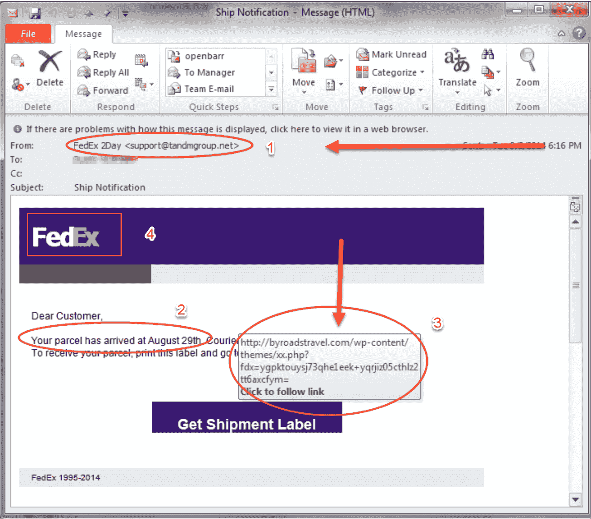Fake FedEx e-mail, where you can clearly see from the email address, the date format, the URL that points to a fake website and the wrong FedEx logo

社会工程师根据手头的目标或任务选择借口。有些任务很简单；所以会选择容易实现的托辞。然而，有些任务是复杂的，为了完成任务，社会工程师不得不接受一个复杂的借口。例如，如果目标是一个组织内部的用户，目的是获取密码，那么借口就很简单。所需要的只是一封伪造的邮件和令人信服的写作技巧。创建的借口必须表明电子邮件来自 IT 部门，并且密码的共享是紧急的。

但是，如果任务是从一个高度安全的组织窃取高度机密的文件，所使用的借口必须是一个复杂的借口，以便能够获得该信息。

*FedEx Fraudulent Email Alert*, by *Fedex.com*, 2018 available at [http://www.fedex.com/us/update2.html](http://www.fedex.com/us/update2.html). [Accessed on January 20, 2018].# 伪装的原则和计划

伪装，就像任何其他技能一样，有一定的原则，如果使用得当，可以取得良好的效果。每当社会工程师不得不求助于借口时，这些原则就派上了用场，而且总是有所收获。让我们来看看其中的一些:

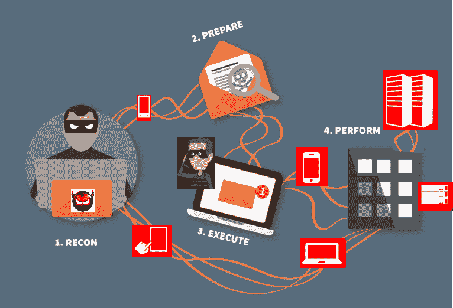The principles of Pretexting summarized# 做研究

一个借口的成功可以直接归因于研究它所花费的时间。社会工程师对借口了解得越多，它成功的可能性就越大。反之亦然，因为社会工程师对借口了解得越少，出错的几率就越高，最终借口会失败。这项研究的很大一部分将是确定目标的兴趣和关系。这将使社会工程师能够为借口塑造完美的场景，并决定假设的人格借口。人类有几个弱点，这些弱点与他们的个性密切相关。正是这些弱点，社会工程师将寻找和利用。

有时，关于一个目标的一小块信息就能造成很大的不同。目标生活中的过往事件、拥有的物品、最喜欢的品牌、购物和运输偏好以及目标的从属关系都可以有效地找到弱点，从而策划借口攻击。例如，向慈善机构捐款的目标可能会受到社会工程师的攻击，他们会以同样的理由制造借口。借口必须是一个拥有网络和社交媒体的大型慈善组织，以帮助目标验证其存在。由此，社会工程师将不得不接触寻求经济援助的目标。通过做 so ，目标将确信慈善基金会的存在，并将进行一笔可观的慈善捐款，只是这笔钱最终将进入私人口袋。

情感在各种借口中被高度利用。如果社会工程师能够玩弄他们的情感，就很容易达到目标。社会工程师利用 2010 年受到全球关注的海地地震，通过一种颇为悲伤的情绪操纵，来自世界各地的艺术家试图传播意识，为受害者筹集资金。还有许多其他慈善机构也在做同样的事情，试图从捐赠者那里获得资金，以便为地震受害者捐款。然而，社会工程师利用这种情况，创造了一个有效的借口。有人创建虚假的慈善网站并做广告。他们最终从这一邪恶行为的收益中变得富有，因为有很多人愿意捐款。然而，另一群社会工程师建立了一个网站，他们声称上面有在这场悲剧中遇难者的名字。然而，他们的网站是恶意的，只收集注册用户的个人信息，还向访问该网站的设备传播一些恶意软件。这些恶意软件后来被用来攻击和窃取访问过这些网站的人的更多信息。如果类似的大规模悲剧降临到人们身上，今天很可能会重复同样类型的借口。关于谷歌网站索引算法的知识越来越多，这使得人们能够优化他们的网站，使其在某些关键词搜索中排名更高。

社会工程师已经掌握了为谷歌等搜索引擎优化网站的技术。因此，他们可以很快找到一个网站，并在与灾难、慈善或捐赠等关键词相关的搜索结果中提升排名。如果发生另一场类似海地的灾难，无辜的人可能很容易向不存在的慈善机构捐款。

从对这个原则的讨论中，你已经注意到了好的研究的力量。有了足够的信息，人们可以很容易地建立一个有效的借口。在海地的例子中，尽管令人悲伤，但可以看出，一个完美的借口总是有用的，特别是当它夹杂着一些情绪的时候。海地慈善网站背后的社会工程师深入到互联网上创建不存在的实体，并建立他们的网络和社会媒体存在，以吸引捐助者。他们知道捐赠者在寻找什么，他们给了他们。有了正确的信息，很容易得到一个成功的借口。

# 谷歌黑客

谷歌黑客是一种技术，它将使用谷歌搜索来帮助你找到你需要的隐藏在互联网中的任何信息。它包括使用特定的文本字符串来查找结果。对于社会工程师来说，这项技术是一座金矿。基于 CSO online，FBI 针对这一众所周知的问题发布了公开警告。FBI 警告告诉各机构，黑客/社会工程师将使用谷歌黑客来定位组织可能无意被公众发现的信息，或找到网站漏洞以用于后续的网络攻击。

*FBI issues warning about creative Google searches* by *Steve Ragan* available at [](https://www.csoonline.com/article/2597556/social-engineering/fbi-issues-warning-about-creative-google-searches.html) [https://www.csoonline.com/article/2597556/social-engineering/fbi-issues-warning-about-creative-google-searches.html](https://www.csoonline.com/article/2597556/social-engineering/fbi-issues-warning-about-creative-google-searches.html).# 谷歌黑客的力量

2013 年，当我在教授一门认证道德黑客课程时，其中一个章节有一个关于谷歌黑客的话题。在课堂上，我们发现一些非常有趣的细节扫描到互联网上，如澳大利亚护照，驾驶执照，出生证明，以及其他许多机密数据。在内容从半政府所有的网站上删除后，我在我的博客上发表了泄漏的内容。当然，为了保护受害者，所有的图片都被我做了模糊处理，这篇文章在一周内被点击了 20，000 次，被转发了很多次，这篇文章被刊登在很多报纸上。

下面的例子很好地证明了为什么我们在分享我们的 ID 时应该非常小心。让我们来看看一些有用的谷歌搜索字符串，它们可以帮助你找到你需要的信息:

Examples from the leaked government-issued highly sensitive ID# 受害者的反馈

Erdal 和他的班级发现了一个特殊的网站，该网站通过谷歌提供大量个人身份文件的副本。我的驾照就是其中之一。他试图通过脸书联系我，并提醒其他人注意身份安全。因此，我意识到了安全漏洞，并能够采取必要的预防措施来保护我的身份。我非常感谢 Erdal 和他的同事所给予的帮助。知道有人在为互联网上的其他人的安全着想是非常令人欣慰的:

*N . C .*

【T0 高防护林，T1】

我希望关于是谁在网上泄露了澳大利亚联邦警察的身份的问题已经有了一些进展。我父亲工作中的朋友和我也在名单上，但没有人对此印象深刻。

非常感谢您为我们快速修改我们的详细信息。

*S.M*

# 谷歌黑客秘密

有很多书都写了如何使用这种强大的技能，正如你可以猜到这是一个非常大的话题，但让我们对谷歌黑客做一个总结，以帮助谷歌找到你到底需要什么。

# 经营者

你们大多数人都知道如何谷歌搜索，我相信你们也知道什么是运营商:

*   这将只显示那些在 HTML 标题中有这个词的页面。`intitle:"login page"`将返回标题文本中包含术语`login page`的搜索查询:

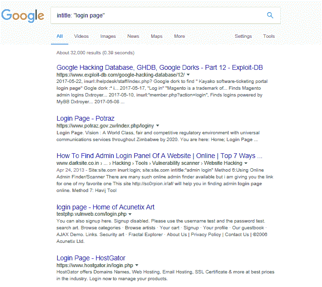

*   `allintitle`:这将查找标题中所有指定的术语。例如，`allintitle index of/admin`:

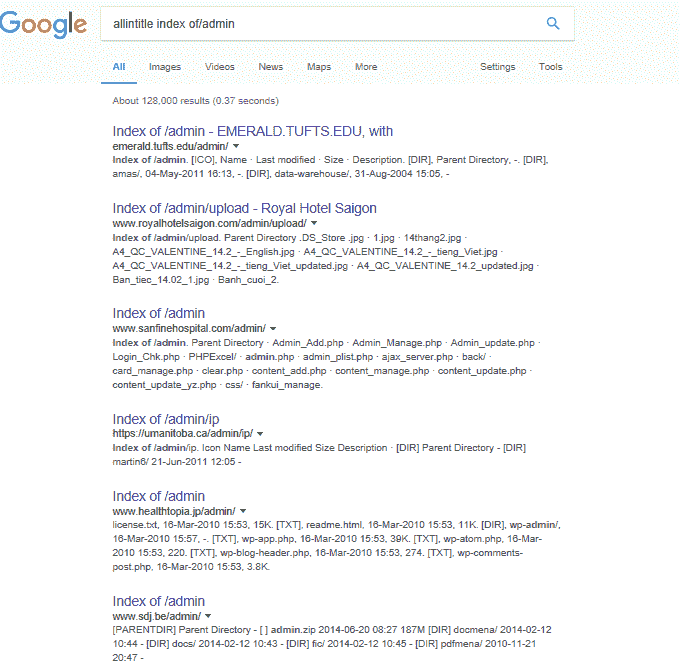

*   `inurl`:这将在 url 中搜索指定的术语。例如，`inurl:"login.php"`:

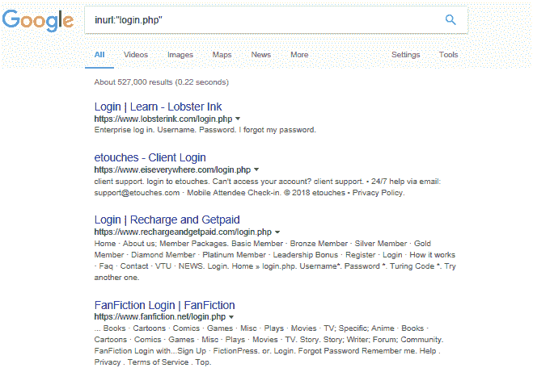

*   `filetype`:这将搜索特定的文件类型。`filetype:pdf`将在网站中查找 PDF 文件。假设你正在专门寻找社会工程文件，然后只需输入这个查询——`filetype:pdf "social engineering"`:

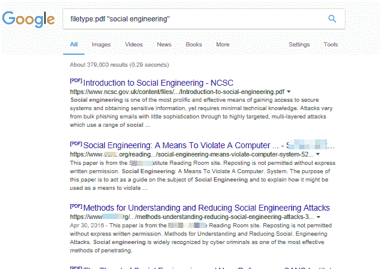

*   `intext`:搜索页面内容。如果你喜欢查找地址索引，只需在末尾加上`address`即可。例如，`intext:"index of /"`:

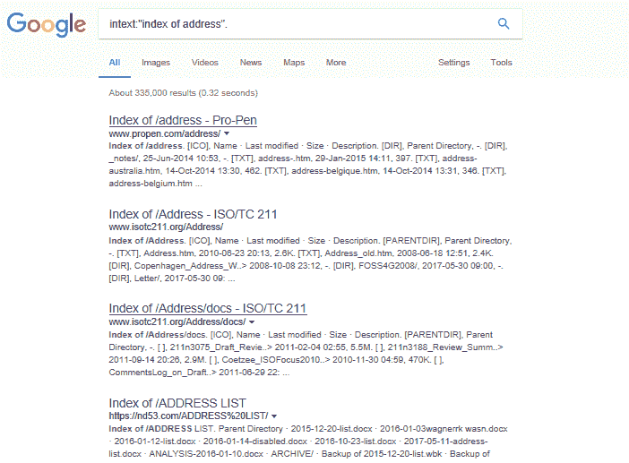

*   这将搜索限制在一个特定的站点。例如，`site:ErdalOzkaya.com`:

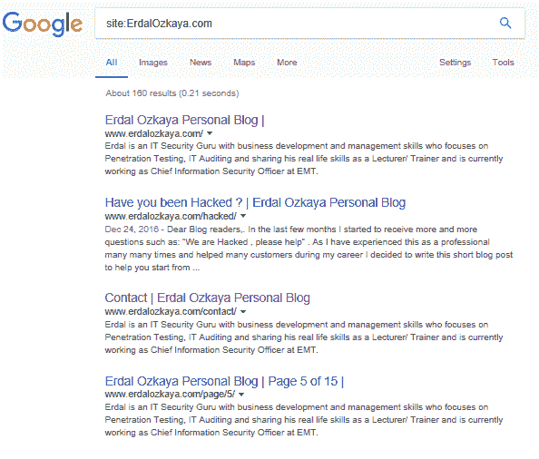

*   在查询中使用它将显示所有链接到该 URL 的结果。`link:www.erdal ozkaya.com`返回所有链接到 www.binarytides.com[的结果](http://www.binarytides.com):

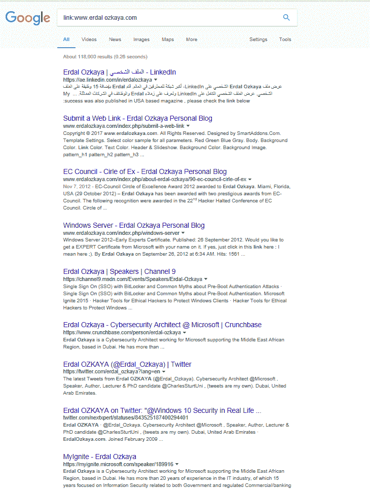

*   `cache`:作为最强大的搜索查询之一，`cache`将返回链接到谷歌存储的页面缓存版本的结果。例如，`cache:erdal ozkaya`:

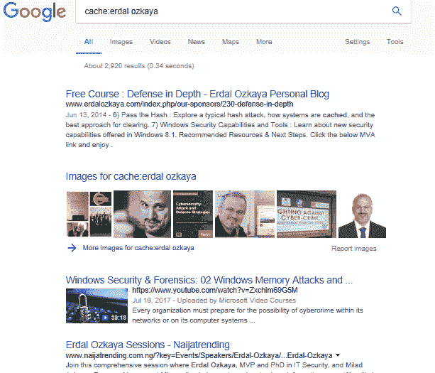

你可以结合你的搜索查询，找到可能隐藏在谷歌中的一切。这里有一个例子:

```
Site:com filetype:xls "membership list"
```

这个查询将在每个有名为`membership list`的 Excel 文件的`.com`网站中查找，并返回结果。作为一名社会工程师，这对于你更多地了解你的目标非常有用:

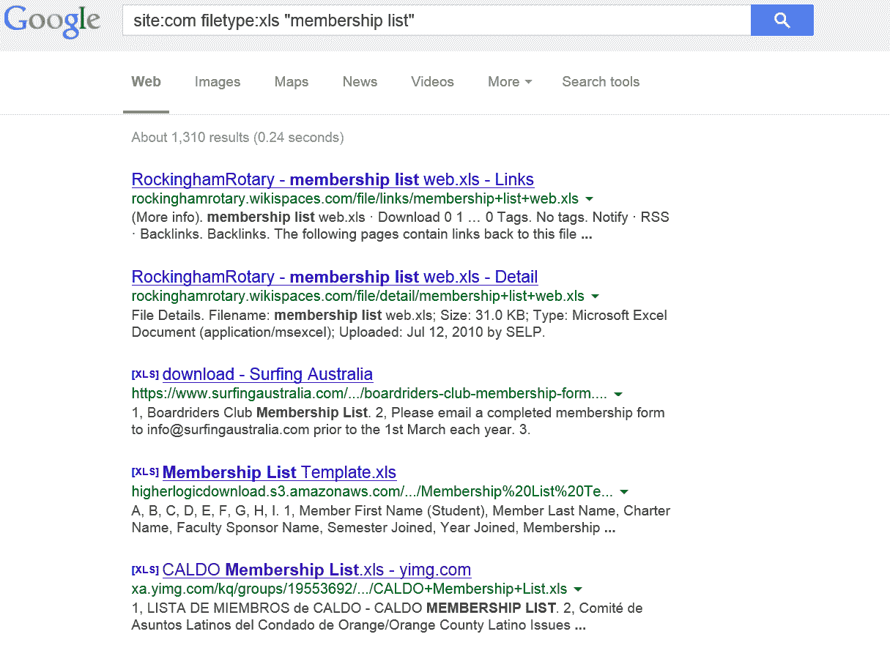

结果如下，请注意，我已经模糊了细节:

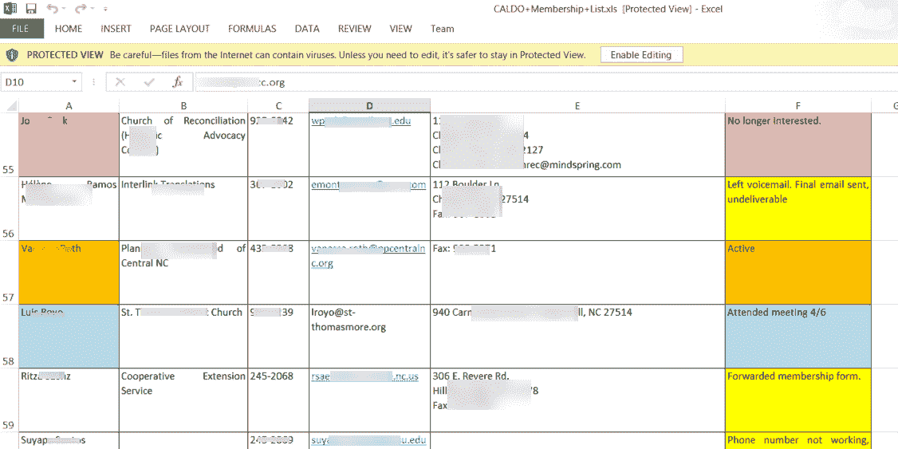

如果你希望自己承担风险，甚至可以搜索军事网页甚至机密文件:

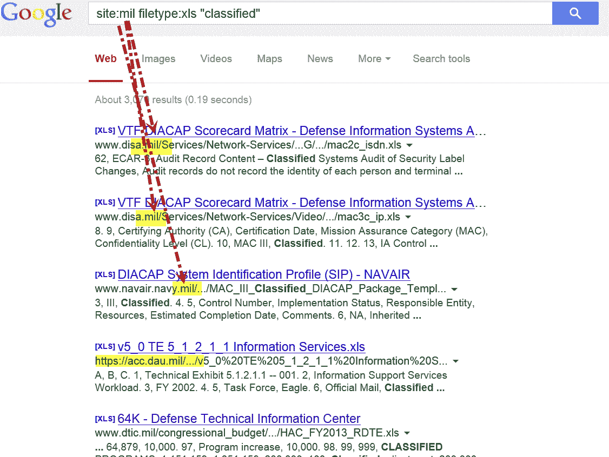# 利用个人兴趣

借口必须在使用它们的人心中根深蒂固，因此它有助于利用这个人已经拥有的一些属性。为了增加借口的可信度，社会工程师经常利用他们的个人利益。个人兴趣很强，即使有借口，也可能让某人看起来更真实、更真诚。例如，一个热衷于技术的社会工程师可以很容易地以 IT 技术人员为借口。对技术相关主题的兴趣和知识，如网络犯罪、恶意软件、攻击媒介和安全政策，都将在说服目标确实正在与 IT 技术人员互动方面发挥作用。如果一个对此几乎一无所知的人以同样的借口，攻击很可能会失败。例如，当提示给出更新密码时，目标可以询问一些后续问题。其中之一可能是为什么 IT 技术人员希望获得旧密码以便更改它，而不是直接从活动域中更改它。对于一个不了解所有这些行话的人来说，攻击可能会在这一点上失败。然而，一个有见识的人可以想出一个借口，也许会说，目标的计算机似乎是从组织的域断开。

个人兴趣给了社会工程师更多的话可说，更好的借口。这反过来在社会工程师和目标之间建立了融洽和信任。然而，不同的借口要求社会工程师拥有不同类型的知识。最好将借口与个人已经感兴趣的事情或社会工程师已经熟悉的事情联系起来。主要目标是确保社会工程师有他或她愿意谈论的与借口直接相关的东西。这有利于社会工程师对目标的信心和总体吸引力。

当一个社会工程师选择一个与他或她的个人利益直接冲突的借口时，会有一些挑战。这是一个心理学问题，可以用利昂·费斯汀格的认知失调理论来解释。该理论声称人类总是在追求他们的信仰、观点和认知的一致性。当他们的态度或行为出现不一致时，必须做出相应的改变来消除这种不一致。费斯汀格观察到，为了消除认知不一致，人们必须减少不一致信念的相关性，增加更多一致的信念，或者改变不一致的信念使它们一致。

为了将这一理论付诸实践，让我们从社会工程攻击的角度来检验它。每当一个社会工程师找了一个违背他的信仰、兴趣和态度的借口，矛盾或不和谐就会出现。这种不一致给社会工程师的大脑带来了问题，可能导致建立融洽关系和获得目标信任的失败。这些问题需要用费斯汀格所说的一些方法来解决。其中之一就是获得更多一致的信念。一个社会工程师可能需要对所选择的借口的信念进行更多的研究，以获得更多与该借口一致的知识，从而使其看起来熟悉而不不不和谐。还有另一种选择，将不一致的信念转变为一致的信念。然而，这很棘手，因为借口不应该吸引社会工程师，而是吸引目标。因此，一个社会工程师不能决定在他或她的借口的指导方针之外行动，这样他就不会感到不舒服。在大多数情况下，选择的借口与目标的信仰、态度、行为和行动非常匹配。因此，社会工程师只能塑造出满足期望的托辞。

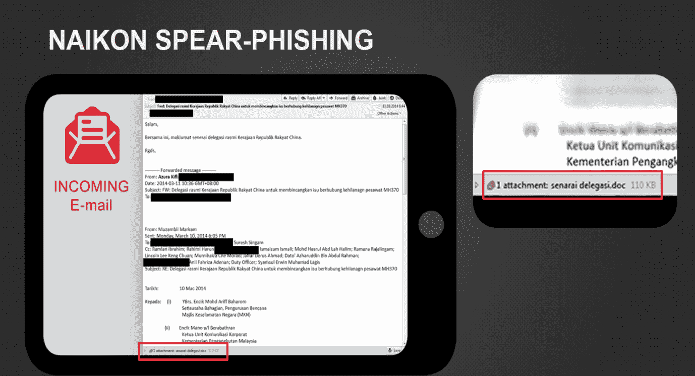A spear-phishing example, where exploits are sent as attachments# 练习方言

出于多种原因，一些借口可能包括使用一些方言。营销行业的一个有趣的统计数据是，几乎 75%的美国人喜欢英国口音。因此，他们会很乐意听有这种口音的人说些什么。一些借口可能需要社会工程师使用这样的口音来吸引目标。问题是，当一个人假装口音时，很容易辨别出来。如果发现了这一点，目标可能会警觉，攻击成功的机会可能会大大下降。让我们举一个例子，一个社会工程师要求某个产品的高价值原型，他打算用于一个总部设在英国的组织。他可能通过一封域名归一家英国公司所有的电子邮件与目标进行交流。当谈到语音通话时，英国口音将有助于增加社会工程师在英国的想法。对于目标来说，如果发现这位社会工程师过于努力地用英国口音说话，那将是令人不安和困惑的。这可能导致目标重新考虑与社会工程师打交道。

然而，对于社会工程师来说，有一种采用口音的方法是足够幸运的。电影业一直在这么做。演员们有方言教练，有人付钱教他们如何用某种口音说话。2012 年，一部名为《独裁者》的电影上映了，由于其中包含的大量创意和幽默，这部电影在当年的电影排行榜上名列榜首。这个话题的主角是海军上将阿拉丁，一个虚构的中东国家瓦迪亚的领导人。这个角色的演员是萨莎·拜伦·科恩。在这部电影中，他有很重的中东口音，一个不知情的观众永远不会猜到巴伦实际上不是来自中东。他是英国人，出生在伦敦，有英国口音。然而，为了这部电影，他必须被训练成用不同的口音说话，而且成功了。这意味着方言是可以学习的，而且一个人不局限于成长过程中习得的方言。

然而，社会工程师并不总是有足够的钱来雇佣一名方言教练。因此，他们不得不依靠其他方式来实现同样的目标，而不需要花费这么多。要学会一种口音，可以采取几个步骤。这些措施如下:

*   向当地人学习:学会口音的最好方法是向说母语的人学习。通过听一个以英语为母语的人说话，并不断尝试匹配他们的发音，就有可能获得说话者的口音。对于一个人来说，没有必要找一个有理想口音的朋友或亲戚，或者去一个有说母语的人的地方旅行。有有声读物可以下载使用。

*   模仿:为了学会一种口音，最好试着和以英语为母语的人一起说话，以练习如何听起来像他或她。这也适用于练习使用音频文件。这慢慢地影响你的发音和发音，最终，你可能听起来和他们一模一样。
*   **记录和纠正**:当你说话时，倾听自己的声音并不容易，因为你听到的声音并不能准确地描述其他人听到的声音。监控你进步的最好方法是录下你自己用想要的口音说话，然后听，以便知道要纠正什么。
*   与另一个人练习:为了防止显得你说话带着口音，最好与另一个人练习如何自然地说话。其他人不需要知道口音，目标只是在现实生活中应用口音。这将允许你纠正试图用口音说话的明显迹象，例如不自然的舌头转动和发音过程中的其他挣扎迹象。
*   在公共场合使用口音:随着实质性的进步和个人对结果的满意，人们可以在公共场合尝试新习得的口音。这将招致公众的批评或对口音的接受。
*   一个社会工程师可以使用这些技巧几个月，并能够获得想要的口音。这种口音可以应用于使用伪装的真实攻击。

# 使用电话

由于互联网的出现，大多数社会工程攻击都是通过电子邮件和网站在线进行的。电话的力量已经被今天的社会工程师打了折扣。然而，尽管许多社会工程师在互联网上充斥着各种各样的社会工程攻击，但电话攻击却是一片空白。对于一个社会工程师来说，使用手机进行攻击的最佳时机就是今天。由于互联网的客观本质，说服目标做某事可能需要更多的努力。然而，一个电话给谈话带来了个人的接触，并使社会工程师能够给目标施加更大的压力，当场透露敏感信息。

社会工程师在打电话时面临的最大问题是几乎没有出错的余地。对于一封电子邮件，如果有必要，社会工程师可以编辑一千次，只为了得到正确的内容。打电话的人只有一次尝试留下第一印象的机会，而且几乎没有空间来不断纠正每一句话。为了解决这个问题，社会工程师们必须在接触真正的目标之前互相练习。

练习课将帮助社会工程师找出在实际通话中可能出现的问题并加以纠正。如果没有人可以打电话，社会工程师可以试着录下他或她自己打电话给一个假想的目标，然后再听一遍，以确定他或她可能在哪里犯了错误:

A computer and a phone is all a social engineer needs

电话可以用来巩固一个借口。互联网上有各种背景声音，可用于向目标保证社会工程师在特定的地方。例如，一个自称在工业场所工作的社会工程师可以在呼叫目标时简单地下载并播放在工业场所录制的背景声音。目标将确信呼叫者确实在工业场所。对于许多其他设置，也可以复制同样的情况。音频丛林等网站有背景音可供下载，可以在通话时使用。通过听到预期的声音，目标很容易落入借口的圈套。这是无法通过电子邮件来帮助摆脱怀疑的阴影，从而破坏社会工程攻击的成功机会。

另一个只有手机才有的优势是能够伪造来电显示信息。有现成的服务，如欺骗卡，可以用来告诉目标，呼叫者来自一个给定的位置。它可能是一家重要公司的总部、警察局、保险公司，或者是银行和许多其他地方。这种欺骗信息会帮助目标很快落入借口的圈套。当一个自称是银行工作人员的人向你询问一些个人信息时，与他争论是没有意义的，对吗？这就是当目标收到验证社会工程师创造的借口的欺骗电话时将经历的情况。

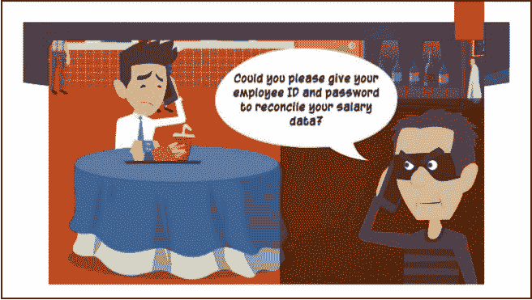A hacker uses phishing to obtain the login credentials of a user

最后，如前所述，电话允许社会工程师向目标施加更多压力，以便立即获得敏感信息。对于电子邮件，用户有时间交叉检查向银行或医疗保险索赔的人提出的请求是否合法。揭露这种攻击很容易。然而，在电话中，目标就没有这种奢侈了。社会工程师会试图利用紧迫性和后果来让目标在足够的压力下给出敏感信息或遵从其他要求。由于没有时间检查请求是否合法，目标通常会屈服于社会工程师。

# 选择简单的借口

借口越简单越好。借口建立在故事情节、虚构的事实和一些内在的细节上。在某种程度上，一个借口可能会有太多的细节需要社会工程师去记忆，以至于这个借口最终失败。社会工程师被抓的原因之一是当他们无法回忆起他们早期提到的事情，或者当他们的话与他们早期说过的话不一致时。正如一位研究人类欺骗的心理学家所捕捉到的，埃克曼博士写了一篇文章，详细描述了谎言在人类欺骗过程中是如何失败的。根据他的观点，当说谎者不能预料到可能被问到的问题时，谎言就失败了。即使说谎者很聪明，也有一些无法预料的环境变化会出卖他或她。埃克曼还说，即使环境没有改变，说谎者也可能难以回忆起他们的谎言，从而导致谎言失败。

从保罗·艾克曼博士的观察中可以看出，最好编造一个更小的谎言或借口，这样就不会有太多让人迷惑的东西。一个很复杂的借口可能会因为一个小小的错误而暴露。因此，不值得花费如此多的时间和资源去制造一眨眼就可能失败的东西。对于社会工程师来说，更简单的借口更合适。不仅容易创作，还容易回忆一切。这使得社会工程师可以自信地实现骗局，并且做的时候看起来很自然。例如，当作为签约公司的网络维修人员出现在首席安全官面前时，一个社会工程师保持其借口范围非常小，比一个有一大堆借口进入服务器室的人有更好的机会进入服务器室。

这个想法是要有并保持真实的事实。当一个借口太大或太复杂时，就会有太多的组成部分，其中一个可能是错误的。在攻击过程中，目标会主动监听，从而更好地捕捉不一致的情况。一个小借口有几个好处。首先，社会工程师可以留出缺口让目标去填补。这样，如果以后发生一些违规行为，目标的想象力就会出问题。一个简单的借口也允许社会工程师在必要时发展它。另一方面，一个更大的借口是很难减少的，因为目标意识到太多的事情，以至于当其他人没有解释就被放弃时，它会变得可疑。一个简单的借口也将社会工程师从阐述的位置上移开。正是在阐述的过程中，我们很容易犯错误，因为一个社会工程师可能会因为无法匹配一个故事的早期版本而自摆乌龙。

让我们举一个现实生活中的例子来解释这一点。假设我们是一名社会工程师，正试图进入一家公司的服务器机房。我们可以利用观察技巧来了解真正从事网络或计算机维修的公司。从那里，我们可以得到他们的标志，并得到印有他们的名字，标志和口号的衬衫。除此之外，我们还可以制作徽章，在袭击当天大胆佩戴。这将会很有帮助，尤其是有警卫把守入口。入口处的大多数物理控制是安全警卫。挥舞着我们的徽章，穿着标有维修公司名称的衬衫，一个简短的说明，我们已经被 IT 部门叫去了，就很容易被购买，我们将免费进入该组织。在招待会上，我们可以坚持同样的借口，即我们被 IT 部门要求紧急检查一台服务器的问题。此时，接待员可以允许我们进入，或者打电话给 IT 部门的一名员工，让我们进入服务器机房。如果有什么事发生，我们可以坚持简单的借口，直到我们进入服务器室:

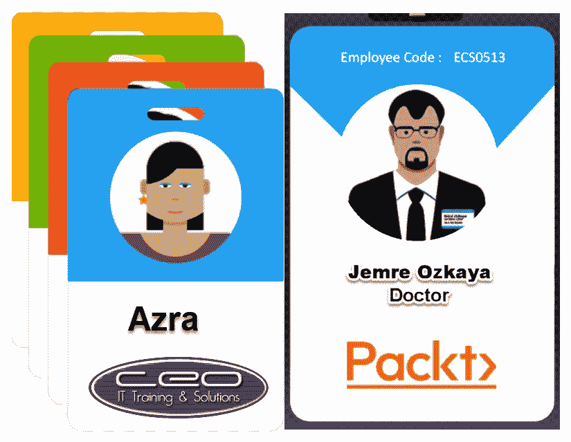Employee badge examples can be found in any search engine# 自发性

社会工程攻击不应该看起来是脚本化的；社会工程师应该有根据环境变化的自由。脚本攻击看起来不自然，失败的几率比成功的几率大。脚本攻击基于理想条件，而攻击发生在不太理想的条件下。一个社会工程师所应该做的就是提出一个大纲或框架，让事情有条不紊地进行，但要有控制。在与目标的任何互动中，有几种方式可以让一个人变得自发。此外，这些方式可以用于正常的生活场景，而不仅仅是攻击。这些措施如下:

*   **不考虑你的感受**:如果一个社交工程师在互动中考虑他或她的感受，可能会使攻击失败。大脑对正在进行的对话失去了注意力，开始把更多的注意力放在恐惧、紧张或焦虑上。这是失败的秘诀。有时，互动可能进行得太顺利，以至于你变得过于兴奋。想着兴奋会让你偏离手头的任务。这个建议可以在面试或第一次与特殊的人互动时使用，尤其是对那些在这些情况下感到紧张的人。忽略在交往的初始阶段发生的情感混合可能会避免尴尬或预期目标的完全失败。一个社会工程师把他的注意力放在互动的目标和目的上。如果目标是让目标说点什么，那就没有时间去关注自己的感受了。所有的努力都应该集中在敏锐地倾听目标对象在说什么，并计划谈话的进程。
*   不要把自己看得太重:当一个社会工程师开始放大他或她正在做的事情的严肃程度时，自发性就丧失了。这种不自然的严肃会滋生紧张，导致巨大的压力。随着这一切的进行，失败的后果也被放大了。这导致一个人开始不自然地试图让一切都完美。在所有的压力下，成功完成任务的可能性很小，因为越来越难冷静思考。当一些小东西不在合适的位置时，也很难恢复。

*   识别相关信息:社会工程师自发使用的最后一个技巧是识别他或她的环境中与他或她正在做的事情相关的东西。在与目标互动的过程中，社会工程师应该关注目标的反应、微表情和肢体语言，以衡量互动进行得如何。一个人应该更多地关注他周围的环境，而不是在互动后试图集中注意力并想出接下来的 10 个步骤。当目标说话时，它帮助我们给出评论和反馈，因此他或她相信社会工程师在同一条船上。人们可以很容易地分辨出和他们谈话的人什么时候没有在听。这让他们觉得自己不重要，很可能会结束谈话。
*   实践:在这些社会工程师的建议中，没有什么比实践更重要了。并不是说简单地阅读这些建议就能让一个人成为开始和保持对话的艺术大师。事情不是这样的。如果所有这些技巧有一天要在真正的攻击中发挥作用，就需要练习。有很多方法可以尝试这些技巧，最好的方法是尝试和完全陌生的人进行小对话。这种类型的对话不需要有一个目标，唯一的目标是在对话中尽量自然，并感到舒服。

前面的提示有助于你在互动中看起来和听起来都很自然。这也使得和另一个人开始对话变得容易。然而，要让对话继续下去，还需要更多。有一个重要的任务就是专心听讲。这在前一章中已经讨论过了。如果你想让谈话持续足够长的时间，与目标建立融洽的关系和信任，专注的倾听是绝对必须的。

# 提供逻辑结论

大多数人成长的社会制度让他们想被告知该做什么。在家里，孩子们由父母指导；在工作中，指挥流程是有层次的；在政治上，政治领袖为大多数人选择道路。在大多数情况下，总会有一个人在指挥，他有特权告诉人们该做什么。这可以为社会工程师所用，因为目标已经被告知要做什么。在与社会工程师的任何互动中，目标必须被告知下一步该做什么。当攻击的目标最终达到时，最好填补任何可能留下的漏洞。一个社会工程师应该给目标一个逻辑结论，告诉他发生了什么，它将会结束。在攻击或互动后让他们悬着会引发问题，这些问题可能会导致他们寻求自己的解释。

有时，社会工程师可能会给目标一些后续行动，而不是给出结论。在我们之前进入服务器机房的攻击中。在我们退出时，我们可以告诉组织定期检查服务器的任何其他问题，并在出现错误时呼叫维修人员。当然，在这一点上，给出实际维修公司的号码是符合逻辑的。关键是目标会得到一些关闭，并给社会工程师足够的时间来消除任何与攻击的联系。对于一个社会工程师来说，借口的好处在于它是不明确的，人们总是可以选择何时放弃它。

我们已经经历了托辞的原则；然而，我们仍然不知道社会工程师如何建立一个借口并实现它。为了成功地找借口，社会工程师需要掌握找借口的许多方面。下一节将讨论它们。

# 成功的借口

因为伪装是关于创造和活在谎言中，所以我们最好举一些伪装成功的真实例子。正如本章前面所述，伪装不仅在社会工程中使用，因此如果一个例子不属于恶意攻击的范围，你也不应该感到惊讶。一些著名的借口案件进一步解释。

Living a lie, pretending to be someone else# 惠普信息泄露

2006 年，惠普公司面临着机密信息泄露的问题。有人怀疑泄密者是该组织出席董事会会议的高级官员。当时的董事长帕特里夏·邓恩女士对此感到困扰，并试图获得董事会成员的电话记录。公司抓住了内奸，结果发现他是一名董事。这个内奸向在线新闻公司 CNET 提供董事会议上讨论的敏感内部信息。

*Hewlett-Packard Spied on Writers in Leaks,* by *D. Darlin*,  *Nytimes.com*, 2018 available at [http://www.nytimes.com/2006/09/08/technology/08hp.html](http://www.nytimes.com/2006/09/08/technology/08hp.html). [Accessed on January 20, 2018].

这个例子中有趣的一点是他们如何捕获鼹鼠的细节。为了获取董事会成员的电话记录，使用了可疑的策略，而且他们不知道自己受到了监视。惠普承认，为了追踪到内奸，它使用了一种名为“伪装”的非书本技术。然而，随着包括董事长在内的几名惠普员工被指控欺诈性获取他人个人信息，这种技术的使用开始困扰他们。这种掩饰的方式有点可疑。我们已经讨论过，借口包括创造一个虚假的场景和/或假设一个不同的身份，以便让他人透露敏感信息或同意做某些事情。

在惠普公司的案例中，成功地实现了几个借口来泄露被怀疑泄露信息的董事会成员和记者的电话记录。被雇佣的安全顾问对内奸进行政治迫害，他们采用了三种策略。他们以移动运营商的工作人员为借口，利用这些人格获取运营商内部的一些电话记录。他们会打电话给运营商的其他员工，要求获得某些号码的电话记录。他们使用的另一个策略是伪造他们正在调查的人的身份，然后要求运营商提供他们的电话记录。最后，他们使用嫌疑人的社会安全号码等信息在运营商注册了在线账户，并使用这些账户访问通话记录和其他信息。所有这三种技术都非常有效。在被告知透露收集的信息后，主席说，伪装练习使他们能够获得通话记录、信用报告、银行信息、客户信息、社会安全号码以及与他们正在调查的号码的所有者相关的电话号码。

当然，这家公司利用借口来得到一颗痣可能有些过火，但它确实奏效了。伦理上的担忧是，对一个鼹鼠的调查会牺牲很多其他人的隐私。以此为借口的签约安全顾问能够不加选择地收集许多无辜者的私人信息。他们还以移动运营商美国电话电报公司和威瑞森为借口，越界搜寻电话记录。然而，这一事件确实给其他公司带来了安全问题，因为外人能够获得私人用户信息。这唯一的攻击证明了借口的力量。它表明，如果有足够的承诺，人们可以使用虚假的场景和虚假的身份获得敏感的信息。这次攻击也显示了借口的法律含义。当然，安全顾问和惠普的主席是在一个合法的过程中，找到一个鼹鼠，但他们部署了一个非常强大的技术，最终侵犯了许多无辜的人的隐私。

# 斯坦利·里夫金

里夫金先生是最著名的网络罪犯之一，因为他参与了 20 世纪 70 年代美国最大的银行抢劫案之一。他曾经是一名计算机顾问，在那个领域有一家自己经营的公司。他与总部设在洛杉矶的太平洋国家银行签订了合同。该银行高度安全，并认真对待其在线安全，因此聘请了斯坦利·里夫金，因为他作为一名计算机极客拥有可靠的技能，可以找到银行可以被利用的地方。不幸的是，对银行来说，里夫金从银行偷了 1000 万美元后，又变成了一个朋友变成敌人的故事。里夫金抢劫银行的简单方式仍然难以想象。那时，银行转账通常使用电汇。为了确保这些转账的安全，该银行使用了一个每天都会更换的数字代码，并且只与少数银行人员共享。该号码将每天张贴在一个安全的房间里，只有少数授权人员可以阅读。进行电汇的人需要这个代码来授权他们。

袭击当天，里夫金像往常一样出现在银行。因为其他员工都知道他是个电脑迷，所以没人会在意他。他看起来是个友好的年轻人，只是在做例行的电脑检查。然而，这一天，里夫金决定乘电梯去那个曾经张贴敏感数字代码的安全房间。即使房间被警卫把守，他也能编造完美的借口作为 IT 人员进入房间。

一进去，里夫金就记住了密码，然后离开了。后来，他以银行国际部的一名员工为借口，打电话给转账室。他指示转账室将 1000 万美元电汇到另一个账户。他被要求提供当天的数字代码，以便授权转账，他毫不犹豫地这样做了。确信这个请求确实是来自国际部，转账室把钱汇到他们被告知的账户上。一切似乎都很顺利，直到发现这个请求不是来自银行的国际部。然而，此时，为时已晚，钱早已转手。

从这次大胆的借口攻击中可以注意到一些事情。首先，里夫金对自己很有信心，因此在那天的互动中也很自然。这就是他没有引起怀疑的原因。如果他第二次怀疑自己，他将无法通过守卫转移室。第二，里夫金做了他的研究，并获得了电汇之前需要的当天的数字代码。没有这个密码，即使是最甜言蜜语，里夫金也无法说服转账室汇钱。他做了尽职调查，获得了宝贵的代码。第三，里夫金在与警卫和转移室工作人员的互动中一定是自发的。他一定对被问到的问题有正确的回答，因为这是他进入的一个相当敏感的房间。最后，里夫金一定很顺利地完成了抢劫，没有匆忙以免引起恐慌。

抢劫结果很好，里夫金以国际部的一名员工为借口转移了这笔钱。不知是幸运还是不幸，他后来被逮捕了，但人们很难相信这个看起来无辜的电脑顾问是个小偷。他的借口计划周密，在整个攻击过程中都站不住脚。他之所以被捕，是因为他的一个朋友把里夫金突然获得的财富和他曾经工作过的一家著名银行的抢劫案联系起来，然后把他供了出来。据说，里夫金试图在另一家银行复制攻击，但被抓获，因为这是一个陷阱。

里夫金的故事强调了我们之前在《借口》中讨论过的一些原则。也许我们可以从他的抢劫案中学到的一个重要的补充是，如果一个社会工程师重复使用一个借口，他可能会被抓住。里夫金在第一次保释外出时被捕，当时他正试图用同样的手段进行另一次抢劫。

*Consultant Arrested in Bank Theft* by *J. Berry*,  *Washington Post*, 2018 available at [https://www.washingtonpost.com/archive/politics/1978/11/07/consultant-arrested-in-bank-theft/8deb849b-df94-445a-92a6-bcff5fe8cae9/?utm_term=.6923978c7a7c](https://www.washingtonpost.com/archive/politics/1978/11/07/consultant-arrested-in-bank-theft/8deb849b-df94-445a-92a6-bcff5fe8cae9/?utm_term=.6923978c7a7c). [Accessed on January 20, 2018].# DHS 黑客

这是发生在 2016 年的一次严重黑客攻击，导致国土安全部 9000 名员工和与联邦调查局合作的 2 万名官员的个人信息被盗。被盗的个人信息包括全名、职位、电子邮件地址和当前的电话号码。更令人震惊的是，社会工程攻击是直接针对 IT 支持人员进行的，该人员的职位是保护其他员工免受此类和类似类型的攻击。为了展示自己的能力，黑客联系了一家名为 Motherboard 的新闻网站，解释他是如何成功入侵司法部的。

*Justice, DHS Probe Hack Allegedly Made Possible By DOJ Help Desk*, by *Nextgov.com*, 2018 available at [http://www.nextgov.com/cybersecurity/2016/02/justice-dhs-probe-hack-allegedly-made-possible-doj-help-desk/125831/](http://www.nextgov.com/cybersecurity/2016/02/justice-dhs-probe-hack-allegedly-made-possible-doj-help-desk/125831/). [Accessed on January 20, 2018].

黑客试图使用其他技术攻击登录表单来突破该部门，但这没有产生任何积极的结果。这是他转向社会工程的地方。他打电话给 IT 支持办公室，说他是新来的，无法进入门户。他们询问他是否有访问令牌，他回答说没有。支持办公室告诉他不要担心，他们会给他一个用于登录。这是攻击的一个决定性时刻，IT 支持人员向黑客提供了一个能够进入门户的访问令牌。该部门的后续报告称，安全政策禁止 IT 人员向未经验证的人分发令牌。验证将通过亲自到 it 办公室或通过回答一些秘密问题在电话上验证自己来完成。当然，这些都被帮助黑客的 IT 人员忽视了。

这个场景中使用的借口给了我们一些关于社会工程的重要见解。IT 支持人员通常有办法绕过为防止未经授权访问系统而实现的严格检查。他们可以更改密码，提供新的访问令牌，创建新的用户帐户，以及提升用户的权限等等。他们也是必须在与计算机相关的问题上尽可能帮助其他员工的员工。他们有时不得不扮演保姆或父母的角色，不知疲倦地指导和纠正那些不懂事的用户。因此，对于需要快速访问安全系统的黑客来说，它们是完美的目标。

黑客需要做的只是让支持人员相信他或她是他们中的一员。在转向社会工程之前，黑客曾试图直接侵入门户网站。这并不成功。大多数系统都可以抵御常见类型的黑客攻击。从这个场景中可以看出，弱点在于用户。

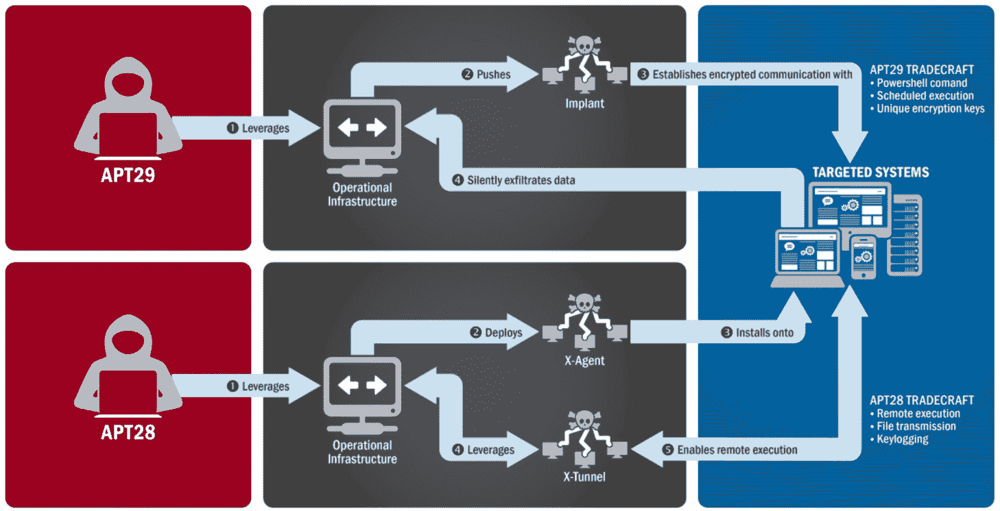The tactics and techniques used by ATP28 and 29 to conduct cyber intrusions against targeted systems; screenshot through FBI/DHS*Here's the evidence U.S. intelligence has on Russia's election hacking* by *Andrew Couts at* [](https://www.dailydot.com/layer8/fbi-dhs-russia-election-hack-full-report/) [https://www.dailydot.com/layer8/fbi-dhs-russia-election-hack-full-report/](https://www.dailydot.com/layer8/fbi-dhs-russia-election-hack-full-report/)[.](https://www.dailydot.com/layer8/fbi-dhs-russia-election-hack-full-report/)

让我们来看看使这个借口成功的原则。首先，黑客选择了一个非常简单的借口。黑客只说他是新来的，他正试图进入司法部的门户网站。这个借口没什么意思。如果他被问到任何问题，黑客可以简单地说他不知道。这可能是人员更愿意帮助黑客的原因。他没有开始验证过程，这也给他带来了好处。这次攻击的借口选择得非常完美。如果黑客声称自己是一名高级职员，事情就会有所不同，因为所有的 IT 人员可能都认识这名高级职员，这可能会带来诸如验证之类的问题。正如《借口的原则》中所讨论的，借口越简单越好。

在这个借口中使用的另一个原则是自发性。如果黑客在给支持办公室打电话时听起来紧张或不自然，那么这次攻击成功的机会就更小了。满怀信心，黑客刚刚打电话解释了他的情况，他是新来的，但也无助地被锁在门户之外。这是一个大胆的举动，但它可能是拯救这次攻击。IT 人员可能认为没有外人有胆量给办公室打电话，并在这个过程中黑掉他们。最后，借口采用了使用电话的有效原则。大多数攻击者会使用电子邮件，因为他们不会直接联系另一端的人，这样更舒服，而且他们有更多的时间编辑他们想说的话。这个黑客用了一个电话，马上就有了结果。电话比电子邮件更有效，因为人们可以利用情感或向目标施加压力。如果电话录音可用，这将表明黑客使用了一些策略来让 it 人员如此迅速地遵守。也许黑客听起来心烦意乱或绝望。可能黑客说他被指示在某个截止日期之前通过门户交付一些东西，由于缺乏访问权限，这已经变得不可能了。很可能，黑客使用了一些类似的东西来让 IT 人员帮忙。因此，尽可能使用电话是有利的。

作为这次袭击的总结，重要的是要注意，在司法部发生的事情可能会发生在任何其他组织。即使有严格的政策，也大多会有一些可利用的漏洞。在这种情况下，松散的结束是一个过度有用的支持办公室。由于其他黑客技术不起作用，黑客没有其他方法访问门户。然而，借口非常管用。这个借口的成功是由于三件事，选择一个简单的借口，自发性，和使用电话。这次攻击表明，许多工作人员，特别是公共部门的工作人员，没有受过防止这类攻击的适当培训。这种攻击表明目标违反了基本的安全措施，而目标应该更清楚，但不幸的是却没有。

# 国税局诈骗

2017 年可能已经被国税局的骗局所定义，因为许多美国公民都被这些精心策划的攻击所欺骗。据 CNN 报道，所有这些国税局骗局背后的主谋是一名 24 岁的印度男子萨加尔·塔卡尔。他建立了呼叫中心，用来从美国人那里诈骗数百万美元。Thakkar 面临的指控包括勒索、欺骗、冒充和共谋。这是美国有史以来最成功的社会工程攻击之一。他利用了美国人共同的恐惧，报税的负担。让我们敏锐地观察一下 Thakkar 和其他攻击者是如何成为社会工程毫无防备的目标的，并看看他们使用的借口原则。

*IRS scam alleged ringleader arrested in India* by *Z. Alkhalisi*,  *CNNMoney*, 2018 available at [http://money.cnn.com/2017/04/09/news/tax-scam-india-arrest-ringleader/index.html](http://money.cnn.com/2017/04/09/news/tax-scam-india-arrest-ringleader/index.html). [Accessed on January 20, 2018].# 电话

在这种类型的攻击中，呼叫者声称来自国税局。他们的信息是，他们给出了一个到期付款的最后通知。他们会发出逮捕的威胁，如果据称接收人所欠的款项没有支付的话。有些打电话的人听起来不是本地人；因此，他们的骗局并不成功，因为它们会引起怀疑。还有其他呼叫者使用录音信息，但这些听起来也没有创意，因此它们并不总是有效。然而，还有其他人，他们武装到了牙齿，掌握了一些关于他们目标的真实信息。据说，这些打电话的人从侵入政府和健康数据库的黑客那里购买了这类信息。受害者肯定是国税局，因为几乎没有其他人会有这种信息。最后，他们会按照社会工程师的指示支付巨额款项。然而，奇怪的是，大多数打电话的人要求付款的方式是通过 iTunes 礼品卡。因此，这些付款是无法追踪的。然而，受害者此时会太害怕而不敢提出任何问题。

仔细看看这个骗局，使用的借口并不简单，但它是国税局的。使用这样的借口有一些优点和缺点。不利的一面是，目标可以通过打电话给真正的国税局来验证这是不是真的。此外，当事情变糟，袭击者被捕时，对他的指控会引来更多的牢狱之灾。在优点上，IRS 通常被许多人害怕，因此这个借口将有更多的成功机会，因为目标可以很容易地被置于压力之下。正是由于这种压力，成千上万的受害者没有质疑为什么他们被指示通过 iTunes 礼品卡而不是借记卡或信用卡存款。一些攻击者使用的原则是对目标进行深入研究。成功的攻击是在攻击者掌握了目标的许多细节后完成的。不过，了解细节并不困难。社交媒体网站是一个可靠的起点，因为人们喜欢把他们的个人信息放在那里。LinkedIn 等网站鼓励用户发布准确的学术和就业信息。因此，获取这些信息并不困难。

# 电子邮件

国税局攻击的另一个版本是使用电子邮件，而不是威胁人们向他们提供一些难以想象的优惠。受害者表示，他们收到了据称来自纳税人倡导服务机构的电子邮件，该机构是国税局的一个部门，负责处理税务纠纷或复杂问题。据称，这些电子邮件声称，目标公司的税收存在问题，他们将获得大笔退款。他们说退款会直接存到目标客户的账户上，所需要的只是一些信息。然而他们要求的信息是有关的。他们要求提供 PIN 码、密码和其他银行账户信息，以便将退款存入银行。据说，受害者急于得到这笔退款，已经泄露了这些敏感信息。接下来发生的事情是，黑客开始清空受害者的银行账户。

仔细观察这次攻击，借口仍然是国税局的，但语气更温和。因此，这些邮件是在吸引目标，而不是威胁他们。同样，攻击者利用一些研究来找出关于目标的一些背景信息，从而使攻击更加可信。目标也使用逻辑结论。他们解释说，他们只是需要目标的个人信息来帮助他们完成退款的发放。这次攻击的成功率仍然很高，因为人们很高兴得到国税局承诺的资金:

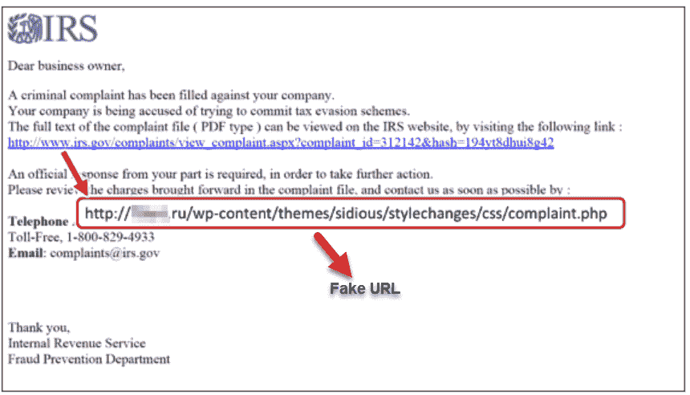Same tactic, different target (The IRS scam mail)# 商务电子邮件妥协

这在 2017 年初很流行，真的很成功。组织中一些重要人物的商业电子邮件地址被盗用，这些人的权限被用来从目标那里获取一些敏感信息。攻击者过去常常查找一些公司的详细信息，并获得在这些公司工作的低层员工的电子邮件地址。重要的是，他们是低级雇员，既是为了攻击，也是为了行使工作权力。攻击者只需伪造人力资源部门人员的电子邮件地址，并使用它们来请求员工发送 W-2 表格的副本。W-2 表格中的信息有些敏感，可以用来报税。攻击者所做的是提交纳税申报表，但以某种方式，他们会吸引退款，他们会只是舀退款。在更恶劣的情况下，攻击者会利用这些信息来申请大学助学金。受害者的信息在这种尝试中终止的人数如此之多，以至于美国教育部关闭了这项服务。它被这些攻击者滥用了很多次。

看一看攻击，可以看出黑客使用了简单性原则。借口只是一个伪造的人力资源电子邮件地址和一个简单的发送 W-2 表格的请求。它也是针对低层员工的，这些人向人力资源人员提出的问题最少。当然，他们大多遵从并寄出了 W-2 表格，这就是为什么这个版本的国税局骗局如此有效。采用的另一个原则是研究原则。这一攻击是有研究支持的。攻击者必须找出某个组织中的低层员工以及人力资源。常见的工作电子邮件格式是由员工的名字和姓氏组成，然后是组织的域。这对于找出目标的工作邮件非常有帮助。欺骗电子邮件地址本身并不难。攻击者通常用数字替换一些单词或添加一些符号来获得几乎与真实地址相匹配的地址。当然，许多人不会检查电子邮件发件人的域等内在细节。一旦他们看到一个熟悉的名字和一个熟悉的电子邮件地址，他们就会相信这就是那个真实的人。这就是攻击如此有效的原因。

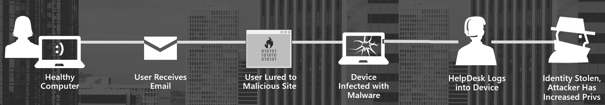How an email can get you hacked# 信

最后，骗子利用实体信件诈骗美国公民。这仍然是 IRS 联系某人希望发起通信的合法方式。这些信件还被用来要求用户提供他们的个人信息，有时是银行信息。然而，关于这类骗局的报道较少，因为它们涉及太多的工作。但是，他们中的一些人仍然是成功的。这是因为美国公民非常重视国税局，通常不会拒绝来自国税局的任何信息。这种借口使用的原则有两个，研究和简单的借口。必须进行研究，以便找出目标的实际邮箱。同样，这些信息很容易在网上找到。有 Pipl 等网站列出了它们。另一个原则是，借口只是地球上四分之一人口的简单邮政地址。他们只涉及信件，没有电话或电子邮件。如前所述，美国人不会解雇国税局，因此他们会按照信中所说的去读和做。

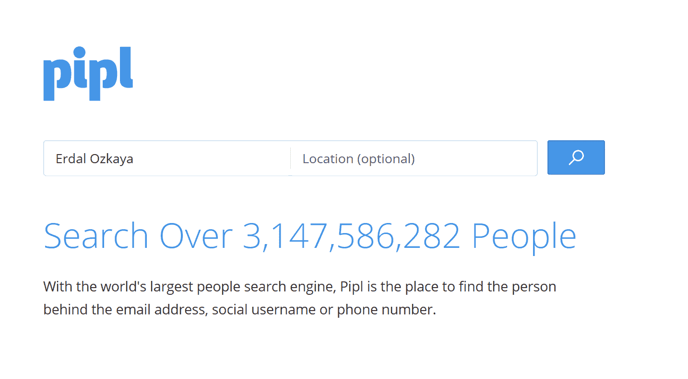The pipl.com website has many real mail addresses; did you check yours? (My one is wrong)*IRS scams 2017: What you need to know now*, by *J. Fruhlinger*, *CSO Online*, 2018 available at [https://www.csoonline.com/article/3234469/phishing/irs-scams-2017-what-you-need-to-know-now.html](https://www.csoonline.com/article/3234469/phishing/irs-scams-2017-what-you-need-to-know-now.html). [Accessed on January 20, 2018].# 泛在网络

这种攻击在本书中是一个常见的参考，因为它今天在许多关于 CEO 骗局的阐述中被使用。2015 年，在意识到自己成为社会工程的受害者并因黑客损失了 3600 万美元后，Ubiquiti networks 发现自己陷入了一个令人不安的境地。这家总部位于加州的网络设备制造公司证实，在其香港子公司在一次攻击中遭到欺诈后，它已成为社交工程的受害者，这一攻击以首席执行官骗局而闻名。这一章对这次攻击的实现方式很感兴趣。该骗局与 IRS 的一个骗局相匹配，该骗局被称为商业电子邮件妥协骗局，组织中的低层员工从假冒的人力资源电子邮件地址收到电子邮件，要求他们发送 W-2 表格。

*Ubiquiti Networks $46.7 computer fraud hack*, *Forbes.com*, 2018 available at [https://www.forbes.com/sites/nathanvardi/2016/02/08/how-a-tech-billionaires-company-misplaced-46-7-million-and-didnt-know-it/#585e134d50b3](https://www.forbes.com/sites/nathanvardi/2016/02/08/how-a-tech-billionaires-company-misplaced-46-7-million-and-didnt-know-it/#585e134d50b3). [Accessed on January 20, 2018].

在 Ubiquiti networks 攻击中，黑客伪造了一名高级职员的电子邮件，并使用它与财务部门的员工进行通信。黑客在电子邮件中解释说，一些供应商已经更改了他们的付款细节，因此将使用海外银行账户付款。美国联邦调查局表示，他们在短短 17 天内追踪到了 14 笔从 Ubiquiti 向东亚某大国和俄罗斯等国的异常汇款。就在此时，调查局向 Ubiquiti 发出警报，称 Ubiquiti 的香港银行账户正在发生可疑交易。这就是母公司介入并阻止财务部进行进一步转账的地方。此时，黑客已经损失了超过 4600 万美元。人们认为，如果联邦调查局没有发出警报，这些交易将继续进行，该公司将遭受更大的损失。该公司跟进此案，只能追回约 800 万美元。该公司创始人兼首席执行官罗伯特·佩拉(Robert Pera)将这一事件归咎于他手下一些会计师的判断力差和无能。

让我们仔细看看这次不幸的袭击，看看使这次袭击成为可能并取得成功的因素。研究是这次攻击的一个重要部分。这是因为攻击者必须知道公司的供应商、高级职员的电子邮件以及财务部门员工的电子邮件。黑客们还需要知道供应商的付款何时支付，以便在合适的时间发动攻击。选择的另一个借口原则是选择一个简单的借口。黑客在这次攻击中只使用了伪造的电子邮件，声称来自一名高级职员，授权会计师将资金转移到海外账户。似乎有一系列的电子邮件，因为转移发生在 17 天的持续时间。

这个借口很容易创建和管理。所需要的只是机智地使用权威的词语。黑客们避免使用电话，因为他们的借口涉及到会计们可能认识的人。黑客们还确保这个借口很容易管理。他们也避免详细解释为什么供应商至少改变了一次付款方式。雇佣原则得到了丰厚的回报，因为该公司尚未收回 3600 万美元。

# 借口的法律问题

有些借口的企图是否合法还存在疑问。2005 年，美国美国联邦贸易委员会对这种做法的非法性给出了一些有意义的见解。在其声明中:

*   伪装涉及使用欺诈和欺骗的方式从客户或机构获取敏感信息，因此是非法的
*   核实从其他机构获得的关于目标的信息仍然被认为是借口，因此是非法的
*   从其他机构获取用户的电话记录也是借口，因此是非法的

在其法律理解中，公平贸易委员会澄清说:

*   直接从客户或从拥有客户信息的机构欺诈性或欺骗性地获取目标信息是错误和非法的
*   使用伪造、被盗或丢失的文件从客户或机构处获取客户信息是非法的
*   一个人通过欺骗和欺诈的方式从另一个人那里获取客户信息是非法的

从这些陈述中可以看出，FTC 更关心顾客。然而，这些陈述适用于几乎所有其他人，不一定是客户。这意味着练习伪装，即使是出于好意，也会给人带来麻烦。在给出的例子中，有一个是关于惠普的。不幸的是，那些参与者被指控犯有一些严重的罪行，导致入狱。因此，当试图以他人为借口进行渗透测试或只是为了好玩时，必须小心谨慎。

# 强化借口的工具

最后，可以使用多种工具让借口变得令人信服。最重要的是名片。人们通常倾向于相信名片，并相信一个人就是名片上所说的一切。因此，如果借口包括自称来自某个电脑维修公司，制作一张名片，在公司名称和标志旁边整齐地写下你的名字，会省去你一些麻烦。名片也可以分发给那些开始怀疑借口、希望有时间做出决定的目标。另一个大大提高伪装攻击成功几率的工具是制服。例如，如果攻击者想要捣毁一个组织，他可以直接去找警卫，解释说他是垃圾收集公司的，他想在垃圾车来之前移走垃圾桶衬垫。穿着合适的制服，警卫会让他进去的。这是取景的一部分，社会工程师将警卫带到他们观察穿着制服的垃圾收集人员的个人经历中。警卫对袭击者毫无疑问:

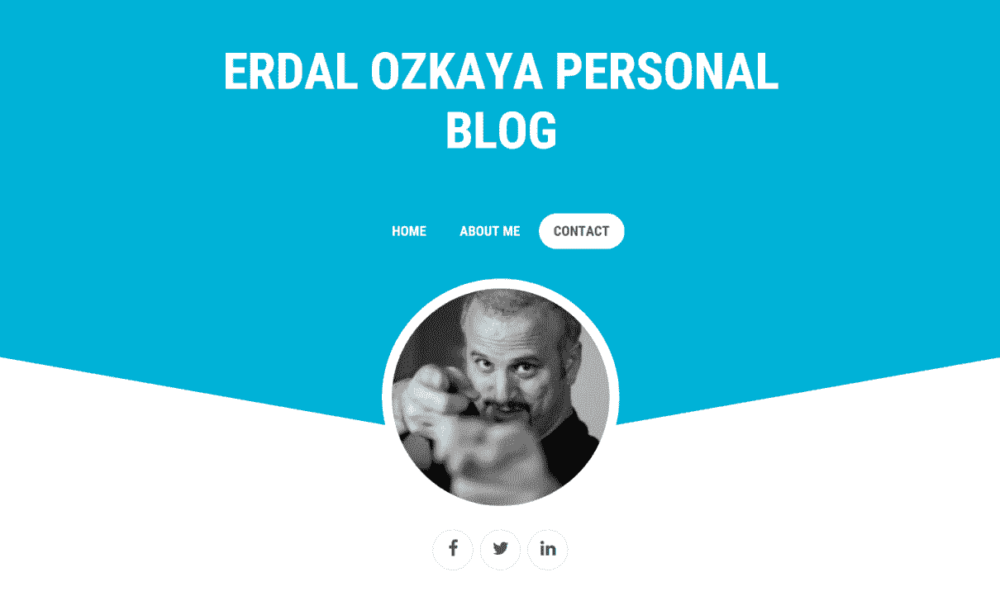A modern business card, personal blog, where social engineers can reach victims very easily (or social media accounts)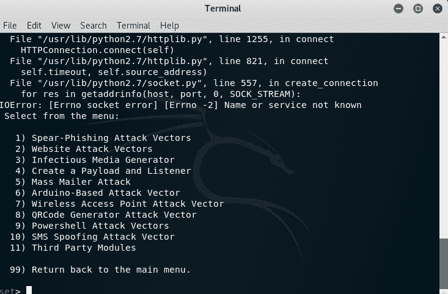

可以使用 Kali Linux 内的**社会工程工具** ( **SET** )。我们已经在[第 8 章](10.html)、*社会工程工具中涵盖了关于 SET 的更多细节。*

# 技巧

应对伪装攻击的技巧如下:

*   保护您的个人信息，不要通过电话、电子邮件或弹出窗口分享，如以下截图或网站所示:

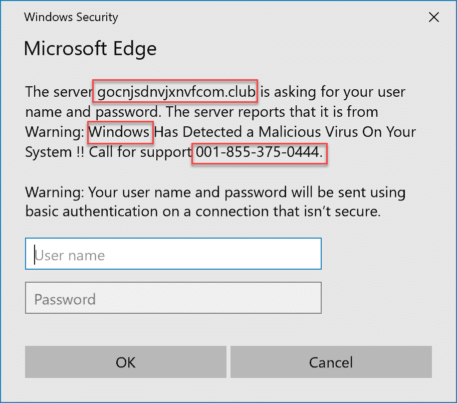

*   时刻关注你的银行对账单；即使是很小的数量也会导致更大的数量
*   为一切可能的事物(网上银行、社交媒体帐户、ISP 帐户等)添加双因素身份认证:

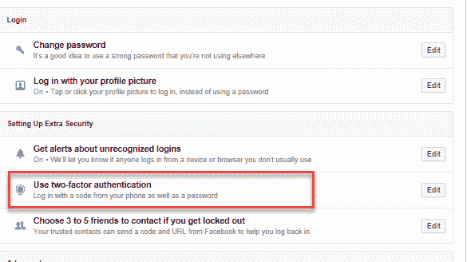

*   创建难以猜测或破解的密码
*   过滤邮件，不要点击任何可疑的链接
*   不要仅仅依赖技术，记住你可以做些什么来让黑客的工作变得更难，他们总是会找到方法(最有可能是通过社会工程)来联系你
*   用碎纸机粉碎垃圾
*   对来自陌生人的 VOIP 电话要格外小心
*   请记住，没有免费的东西

# 摘要

本章探讨了社会工程的一个重要组成部分——伪装。它着眼于帮助伪装成功的七个原则。它着眼于研究原则的重要性，以便获得关于目标的足够信息。它还着眼于识别个人利益，以便迅速让目标遵守。人们一直在研究用重音来使借口更有说服力。已经给出了一些步骤，可以用来帮助一个人为此目的获得一种口音。这一章解释了手机的使用，手机的成功率很高，因为今天大多数黑客依赖电子邮件和互联网。自发性也受到了关注，以及它如何影响攻击成功的机会，尤其是在与目标的口头互动中。最后一个原则是向目标提供逻辑结论。本章决定在讨论什么是成功的借口时采取实际操作的方法；了解伪装是如何进行的将使我们能够更好地处理攻击。它经历了几个借口案件。对于每一种情况，都讨论了用来确保借口有效的原则。讨论的一些攻击，尤其是国税局的诈骗，仍然在发生。该章研究了借口的合法性，发现这是一种非法行为。最后，本章提到了一些可以用来增强社会工程攻击的附加工具。

给出的真实例子旨在让读者了解攻击成功的原因。从这些例子中，人们可以总结出成功攻击的技巧。从法律的角度来看，这一章解释了为什么借口是非法的，并可能陷入困境。解释了一些可以使伪装攻击更加成功的工具。

下一章将讨论社会工程攻击中使用的工具。信息收集一章简要讨论了其中的一些工具。下一章的讨论将更加广泛，它将梳理适用于社会工程的物理和软件工具。

