# 八、社会工程工具

随着时间的推移，社会工程变得越来越容易实现，因此更加成功和难以预防。这是因为攻击者已经获得了更新、更有效的工具来执行他们的攻击。拥有这些工具是不够的；在许多攻击中，如何使用它们的知识至关重要。这些工具被制成各种形式、形状和大小。有些物理工具主要用于获取和收集信息，有些软件工具用途更广。今天的社会工程师带着两者的混合出现，这就是为什么社会工程很快变得令人恐惧的原因。更强大的工具不断被制造出来。本章将讨论社会工程师在攻击中常用的工具。它将在以下主题中讨论这些问题:

*   物理工具
*   软件工具
*   电话工具

# 社会工程的工具

为了增加攻击的成功机会，社会工程师通常会使用许多工具。我们将着眼于社会工程过程中使用的物理工具、基于手机的工具和软件工具。

# 物理工具

这些硬件工具用于帮助收集数据或使社会工程师能够执行一些操作。下面几节将对它们进行解释。

# 开锁工具

在电影中，开锁通常被描述为一项简单的任务，包括将开锁器插入锁中，然后用最少的力气打开门。实际上，事情没那么简单。一个社会工程师可能不得不进入一些用锁保护的地方，开锁器可能会派上用场。由于磁卡、生物认证和 RFID 芯片卡在访问控制中的采用，这种技能似乎没有用。然而，它比以往任何时候都更重要。这些电子访问控制措施被用在明显的入口点，但是锁仍然通常被用来保护被认为不太重要的房间。在某些情况下，您可能会发现装有价值一百万美元设备的服务器机房被锁上了。然而，旧文件、过时的计算机和备份文件的存储室可能只使用锁来保护。这表明开锁技术的知识仍然适用于今天的攻击。

有几种工具可用于开锁，但最好的使用方法是将一套开锁工具放在一个小的外形中。有一些产品把相当多的开锁工具放在一起就像一把小刀。开锁的过程并不简单，需要非常注意。然而，这一过程在几种开锁工具中是相似的。这一过程从给锁增加张力开始。因此，一个社会工程师需要有一个拉力扳手来给一把锁增加拉力。张力扳手直接插入钥匙孔，并按照正常钥匙转动的方向转动。当移动时，张力扳手将产生使锁抓住销轴所需的张力。之后，将锁销插入锁中，锁销一个接一个地向上移动，直到它们就位。当插销锁定到位时，可以听到咔嗒声。当所有的插销就位后，插销将自由移动，锁将被撬开。

既然我们已经看到了可以用来进入安全房间的工具，那么让我们来看看可以用来捕获数据的工具。

# 记录设备

了解录音设备如何可能被用于任何社会工程攻击可能会令人惊讶。这个有两个答案，第一个是证明，第二个是自我评价和发展。根据证据，社会工程攻击不一定是出于恶意目的，有时它是由一个组织支付，以帮助它找到其员工的漏洞。许多组织付钱给渗透测试人员，试图对他们的员工进行社会工程，只是为了看看员工在某些情况下的反应。

员工会否认他们被欺骗了，因此他们对组织构成了威胁。他们不喜欢成为社会工程攻击的受害者可能带来的尴尬和任何潜在后果。因此，大多数人可能会说这从未发生过。然而，使用记录设备，笔测试人员可以证明员工成为攻击的受害者，并屈服于一些恶意请求。

组织的社会工程不是为了让员工尴尬或让他们被解雇，而是为了找到更好地保护组织的方法。记录一个社会工程攻击是如何进行的，其中一名员工是受害者，这对其他人来说是一个很好的学习工具。该证据可用于教育所有其他组织雇员关于进行社会工程攻击的借口和其他技术。它还可用于为员工应对类似的未来攻击做准备，以便他们能够避免或减轻攻击和攻击者。

我们提到记录设备的第二个目的是自我评估和发展。这个福利是通过这个设备赚钱的专业社会工程师享受的。一旦社会工程攻击发生，记录每件事是如何发生的，就记录了做了什么或没做什么。失败或成功的原因可以从录音中提取，并在未来的攻击中使用或避免。有了多个记录，社会工程师能够提高他或她的技能，这样他们就有更大的成功机会。因此，即使攻击不成功，社会工程师也会带来可用于自我训练的材料:

Smiley face spy camera and teddy bear cameras

了解了记录设备的益处之后，让我们来看看一些可能适合在社会工程攻击期间进行记录的设备。间谍相机是社会工程的理想选择，因为它们不会引起目标的怀疑。市场上有许多间谍相机，任何人都可以购买。有些装在钢笔里，手表里，领带上，甚至眼镜上。相机传感器已经变得如此之小，以至于眼镜上的一个不起眼的传感器可以记录高清质量的视频，也可以捕捉高分辨率的图像。此外，由于无线网络，它们可以远程操作，因此社会工程师不必接触实际的摄像机。人们可以简单地从智能手机或笔记本电脑开始视频记录或图像捕捉。录音在存储方面甚至更简单、更高效。声音不像视频和图像占用那么多空间，但它可以存储和视频和图像一样多的攻击信息。现在有许多秘密的录音机可以在给定的距离内捕捉声音。它们也足够小，可以藏在领带、手表和眼镜里。今天，有智能手机的优势。有一些秘密录音应用程序，用户可以在与客户通话时激活，而不会引起任何怀疑。在谈话过程中，有人手里拿着智能手机是完全正常的，因此这不会被视为可疑行为。也有用户可以用来记录与目标通话的应用程序。其中很多都可以在不同的应用商店免费获得。

# gps 跟踪器

对于一个社会工程师来说，获得关于一个目标的大量事实是很重要的。在社会工程攻击的任何阶段，关于一个人生活的微小信息都可能派上用场。当社会工程师想要追踪目标的位置时，GPS 追踪器就派上了用场。知道目标的位置是一个很大的优势，因为它可以用来建立可信的借口。如果一个社会工程师知道目标的位置，他或她也可以用它来*偶然*撞上目标。这可以用来瞄准目标的身体弱点。比方说，我们有一个目标，我们想得到一些关于他工作的公司的敏感信息，我们不能只是给他发电子邮件要求这些信息。我们可能要和目标正面交锋。因此，我们可以尝试找到目标经常光顾的最喜欢的酒吧或餐厅，然后在这个位置尝试与他们交谈。为了确保目标在一个特定的地方，我们可能需要物理地跟踪他们。在这种情况下，GPS 追踪器会派上用场。

有许多可用的 GPS 跟踪设备，其中大部分是用于良好的目的，如跟踪车辆。其中一个 GPS 追踪器是 SpyHawk SuperTrak。据说这是最经济的 GPS 跟踪设备，不会为了价格而牺牲功能。它已被间谍、政府机构、警察单位和情报收集单位使用。追踪器是磁性的，由于它的小形状因素，它可以被种植在各种地方，在那里它将保持隐蔽。它还可以忍受恶劣的天气，因为它配有防水外壳，可以承受极端的阳光。追踪器记录路线、停留时间、前进方向和速度。它使用低功耗 GPS 技术，这种优化可以节省大量电池寿命。理想情况下，它被用来跟踪车辆，使人们能够随时了解其所在车辆的最新情况。这种装置非常精确，甚至可以说出车辆在某一给定点保持静止的时间。该设备仅使用两节 AAA 电池，在需要更换之前可以供电一个月。它可以使用强磁铁或皮带夹安装在车辆上。它也可以放在任何足够大的移动物体上。设备制造商不收取月租费，因此买家只需一次性付款。

使用 **SpyHawk 超级棒**非常简单。该设备必须用开关打开，然后隐藏或安装在目标物体上。大多数情况下，这将是目标的车。安装可以在公共停车场进行。一名社会工程师装扮成一名机械师，就可以简单地走到客户的车前，把它装上。没有人会发出警报，因为他们要么不认识车主，即使他们认识，他们也不能认为机修工不是车主派来检查的。一旦安装完毕，该设备将发回其当前位置的坐标，如果它正在移动，它将显示方向、速度和路线。这是使用设备软件呈现给谷歌地图的数据，这有助于用户理解所有的数字。如果不将这些数字显示在谷歌地图上，那么不停地查找坐标将会非常令人厌烦。

还有许多其他的 GPS 跟踪设备。也有电话应用程序可以用于此目的；唯一的挑战是，首先必须在目标的手机上安装这些应用程序。几乎所有的智能手机都带有 GPS 接收器，因此随时都知道自己在哪里。用于跟踪目的的应用程序只利用内置的 GPS 接收器/传感器。除了 GPS 追踪器，还有其他被称为 GPS 数据记录器的设备。这些人不连接到蜂窝数据服务发送回他们收集的数据。他们只是不停地记录数据，而且只能从设备上进行物理访问。

因此，人们必须将设备藏在目标的汽车上，并在跟踪工作完成后偷偷溜回来移除设备。GPS 数据记录器更加节能，因为它们不会主动发回所收集的数据。GPS 记录器对高调的目标也很有用，这些目标的车辆被扫描，以寻找安装在上面的窃听器。因为它们不发射任何信号，所以它们的探测率很低。然而，GPS 追踪器很容易被发现，因此不适合这样的任务。GPS 数据记录器也是不需要主动监视的任务的理想选择。

# 软件工具

如果一个人知道如何搜索，互联网拥有大量可用于社会工程攻击的信息。此外，从目标的计算设备或网络中提取敏感信息有多种方式。这一部分将讨论一些在社会工程中常用的软件工具。

# 马耳他之鹰

Maltego 是用于数据挖掘的软件，尤其是在寻找不同信息之间关系的过程中。由于其强大的功能，执法机构在进行在线调查时也经常使用它。Maltego 是交互式的，它为不同信息之间的链接绘制图表。它由一个能够存储大量信息的图形数据库驱动，这是关系数据库所不能做到的。这很方便，因为 Maltego 可以收集一个人的大量信息。它可以收集的信息类别包括:

*   **个人信息**:可以确定目标的全名、昵称、年龄、实际地址等信息
*   **社交网络** : Maltego 可以在所有社交媒体网络中识别带有目标名字的社交媒体平台
*   **公司** : Maltego 在公司网站上搜索与给定目标相关的信息，并将其集中到一个中心位置
*   **网站** : Maltego 可以搜索目标用自己的名字或昵称注册的网站，如聊天论坛或支持页面
*   **隶属关系**:目标隶属的任何组织或事件
*   **文件** : Maltego 会在互联网上获取有目标名字的文档和文件

# 软件的功能

根据下载的版本不同，Maltego 有许多特性。有免费版和商业版。让我们来看看商业版中所有可用的功能:

*   Maltego 可以分析互联网上多达 10000 个实体的链接，并将其绘制在基于节点的图表上。
*   Maltego 每次搜索最多返回 12 个与搜索关键字相关的实体。
*   Maltego 可以根据其相似性将找到的实体分组，从而帮助用户轻松找到相关实体并筛选出噪音。
*   Maltego 支持图形共享，这在协同任务中很重要。这是通过以 GraphML 格式或实体列表的形式导出其图形来实现的。

# 技术条件

技术规格如下:

*   作为功能强大的软件，Maltego 相对来说是资源密集型的，这是用户在安装它之前应该考虑的事情。它需要至少 2 GB 的内存，有时这甚至不够。可用内存越多越好。
*   Maltego 在多核处理器上运行得最好，因为这些处理器可以分担运行其进程的负担。
*   该软件要求在安装前有 4 GB 的可用存储空间。该空间用于存储软件文件。
*   对于用户来说，拥有一个便于导航的外部鼠标是理想的。
*   该软件需要有效的互联网连接才能运行。这是可以理解的，因为它是从互联网上获取结果的。
*   该软件还接管端口 80、443、8081 以及 5222，以便进行传出连接。

当涉及到信息收集时，Maltego 是一个有用的工具，社会工程师发现它是攻击中一个无价的工具。它节省时间，使人们能够收集更准确的数据。当搜索特定类型的数据时，Maltego 可以快速浏览大量数据，如整个域名。该软件还能够访问被普通搜索引擎隐藏的信息。以图表的形式显示所有结果也有助于挑选相关的信息并忽略异常值。

*Maltego CE*, by *Paterva.com*, 2018 available at [https://www.paterva.com/web7/buy/maltego-clients/maltego-ce.php](https://www.paterva.com/web7/buy/maltego-clients/maltego-ce.php). [Accessed on January 13, 2018].# 如何使用 Maltego？

Maltego 有各种其他用途，但对于我们的社会工程目标，我们将集中于它的信息收集能力。

Maltego 使用大数据分析，因此我们可以肯定，我们从中找到的结果是我们能够找到的关于目标的最佳结果。马尔特戈对人类和计算机目标都有效。让我们看看 Maltego 如何收集网络数据。

# 用于网络数据收集的 Maltego

在网络中，Maltego 可以收集特定领域的基础设施数据。通过大量搜索，Maltego 将收集诸如 IP 地址范围、网站注册人数据(如 WHOIS 信息)、与该域名相关的电子邮件地址以及该域名与其他域名的关联等信息。让我们看一个关于如何在 Linux 机器上使用 Maltego 收集网络数据的分步教程。

# 步骤 1–打开 Maltego

可以通过 Kali Linux 的应用程序列表访问 Maltego。它预装在十大安全工具中，通常位于第五位。点击打开后，该软件将需要几秒钟启动并加载其组件。它将显示的第一个提示是注册它:

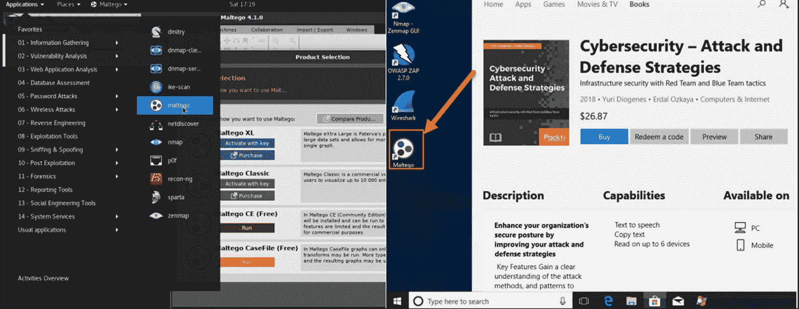Opening Maltego through Kali Linux or through Windows 10

注册是一项简单的任务，只需确保您使用熟悉的密码，因为所有后续登录都需要该密码。

# 步骤 2–选择机器

选择机器的步骤如下:

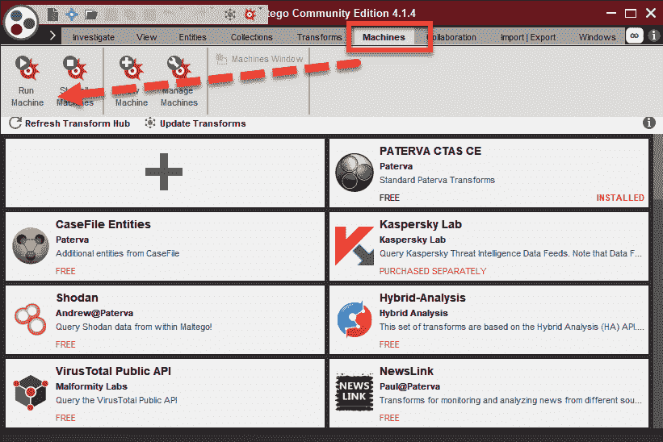

Maltego 是一个可扩展的工具，可以在不同的模式下运行。成功登录后，系统会提示用户选择用于目标的机器。这种机器仅仅是指用户想要在目标上留下的足迹类型。四个重要选项是:

*   公司跟踪者 呃:公司跟踪者对于收集电子邮件信息很重要
*   足迹 L1 : L1 对于快速、简便地收集目标信息非常有用
*   足迹 L2 : L2 在收集适量信息时很有用
*   足迹 L3 : L3 对于目标的详尽数据收集非常有用

对于要激活的机器，必须选择最理想的来达到预期的目的。让我们选择第四个选项，足迹 L3 。请注意，此选项需要更多的时间来加载，并且会占用更多的资源。

# 步骤 3–选择目标

选择机器后，Maltego 会提示用户选择一个目标。这里，为了收集关于一个域的信息，我们需要在输入提示中输入域名。在这个例子中，我们将选择全球知名的社交媒体网络脸书。我们必须输入如下所示的域:

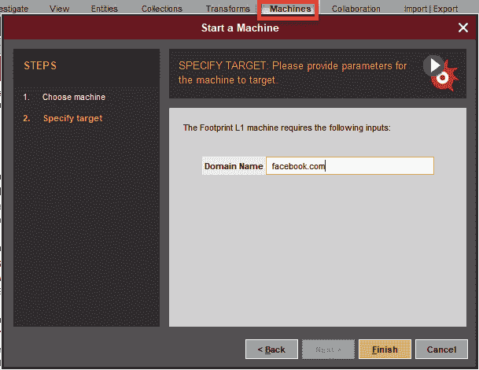# 第 4 步–结果

Maltego 将在互联网上搜索与脸书相关的每一条信息和链接，并以泡泡的形式展示出来。这些泡泡都是互联网上的实体，它们越接近中点，包含的信息就越相关。Maltego 将根据这些泡泡所包含的信息对它们进行颜色编码。人、电子邮件地址、网站等等都有颜色代码。人们可以放大以查看每个气泡的更多细节。当一个人放大时，气泡打开以揭示它们包含的细节。气泡越集中在一起，它们包含的信息就越相关。这些浓度中的异常值将具有较少的与其他泡沫相关的数据。

# 使用 Maltego 收集个人数据

在前面的例子中，我们看到了如何使用 Maltego 来收集整个域的信息。我们现在想把攻击集中在一个特定的人身上，因为通常一个社会工程师会攻击一个人。社会工程以人类为目标，因此大多数攻击都是针对人类的。为了锁定一个人，Maltego 使用的关键信息是一个电子邮件地址。这是因为人们使用他们的电子邮件地址在不同的平台和网络上注册。虽然他们可能使用不同的名字，但在大多数情况下，电子邮件地址是相同的。尽管一个人可能有几个电子邮件地址，但有一个或两个往往会在多个网站上使用。然而，Maltego 并不要求用户提交电子邮件，它会查找某个目标可能拥有的所有电子邮件，并要求用户选择它。以下是涉及的步骤。

# 步骤 1–选择机器

就像前面收集域信息的例子一样，必须选择符合用户需求的机器。很容易改变到不同的机器，菜单栏上有一个设置图标，给出了所有可用的机器可以使用。要锁定某个人，最好使用的机器是该人的电子邮件地址，它通常位于列表的第七位，如下图所示:

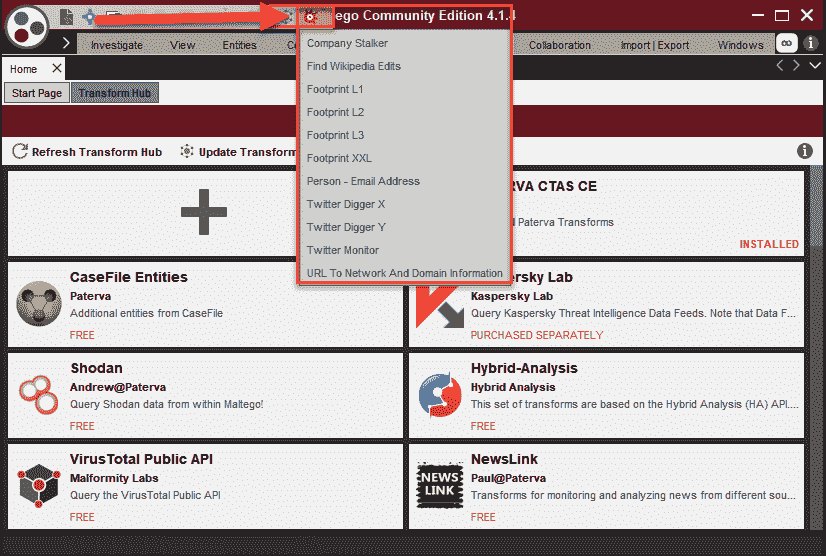# 步骤 2–指定目标

就像在使用足迹 L3 收集关于域名的数据的过程中一样，该机器也提示用户输入关于目标的一些细节。它请求目标的全名。一旦提供了名称并且用户点击了 OK，该软件就进行基本搜索，以找到与给定名称密切相关的所有电子邮件地址。它会返回一些与该名称相关的电子邮件地址，并提示用户选择相关的电子邮件。这是因为一些电子邮件地址不会与目标相关，挖掘它们是浪费资源。您将能够看到提示用户选择与目标更相关的电子邮件地址的界面。

# 第三步–结果

根据所选的电子邮件地址，该软件使用其大数据分析功能在互联网上彻底搜索与该电子邮件地址相关的任何信息。一旦它找到相关的项目，它就提取它们并存储在它的图形数据库中。它会根据在互联网上找到的信息来绘制图表。该软件还将不断更新屏幕左侧的实体调色板。它将添加信息，如别名发现和敏感的细节，如目标的电话号码。在搜索结束时，空白区域将被所选目标的相关数据填充。

Maltego 收集的信息在社会工程攻击中非常有用。该工具查找目标的实际联系信息。这是可以用来直接发起攻击的信息。社会工程师可以打电话给目标，假装来自权威机构，如国税局，并要求一些其他敏感信息或勒索目标的钱。在前一章中，我们看到了 2017 年初美国国税局的骗局有多有效。当你对人们的信息了如指掌时，向他们勒索钱财是非常容易的。电子邮件地址信息可用于向目标发送欺骗性电子邮件。如果马尔泰戈能够找到目标为之工作的组织，那就更好了。正如我们在上一章中看到的，一个社会工程师可以简单地利用人力资源的借口，向目标发送一封伪造的电子邮件，并要求一些敏感信息。简而言之，一旦 Maltego 获得了目标的信息，攻击就成功了一半。剩下的部分是执行阶段，社会工程师将不得不选择一个借口，并使用它来获得一些信息或从目标勒索金钱。

然而，Maltego 在用于社会工程攻击时有许多缺点:

*   第一个是它太耗费资源了。我们将看到其他工具可以完成同样的任务，但使用的计算资源更少。一个轻量级的工具更适合互联网。
*   Maltego 的第二个缺点是它不是完全免费的。免费版本只能提供有限的功能，有时可能需要购买高级版本的软件才能获取更多信息。同样，还有其他在线工具可以完成同样的任务，而且是完全免费的。

然而，这几个缺点并不能抹黑马尔蒂戈的巨大力量。这是渗透测试人员在检查组织面临的漏洞时最常用的工具之一。正如我们前面看到的，Maltego 在收集关于域的信息方面非常有用，这是许多笔测试人员感兴趣的功能。

*Information Gathering: Using Maltego In Kali Linux*, *Sunnyho**i.com*, 2018 available at [https://www.sunnyhoi.com/information-gathering-using-maltego-kali-linux/](https://www.sunnyhoi.com/information-gathering-using-maltego-kali-linux/). [Accessed on January 31, 2018].# 谷歌

正如上一章所讨论的，谷歌也是一个社会工程师手中的好武器。虽然之前已经讨论过，但是很高兴看到谷歌在社会工程方面的实力，尤其是在收集目标数据方面。谷歌是免费开放使用的，而其他提供同样服务的工具可能会收费。在社交工程攻击中，有许多方法可以使用 Google 来收集目标的数据。为了理解 Google 的全部功能，最好了解使这成为可能的高级操作人员。这些用来给世界上最大和最强大的搜索引擎一些特殊的命令来帮助获得想要的数据:

*   **Site** :这是一个特殊的操作符，用于将结果缩小到特定的网站。当想要将搜索结果限制在与目标相关的域中时，这尤其有用。以下面的搜索查询为例:

```
"Adam Schindler site:Facebook.com"
```

这个查询将要求 Google 从站点中拉出亚当·辛德勒的所有结果。脸书是一个社交媒体平台，因此具有此类名称的帐户将显示在搜索结果中。该运算符可以与其他运算符混合使用，以缩小结果范围。

*   **Link** :这是一个操作符，用于包含其他页面链接的页面的结果。这有助于识别重定向到某个页面的来源。然而，由于效果不理想再加上很多人没有使用，谷歌决定在 2017 年将其关闭。
*   **Numrange** :顾名思义，这是一个在一定范围内定位数字的运算符。连字符(`-`)用于设置范围。例如，如果我们要搜索出生于`1998`和`2004`之间的贾斯汀比伯，我们可以搜索:

```
Justin Bieber birthday 1998-2004.
```

*   **Daterange** :这是另一个范围操作符，用于搜索两个特定日期内的结果。它的工作原理与 numrange 运算符相同。
*   ***+*** :告诉 Google 在搜索结果中包含某个关键词。例如，如果我们要查找关于`John Doe`的信息，但也想知道他的净资产，我们会搜索:

```
"John Doe" + "net worth"
```

这种输入迫使结果具有净值。

*   **作者**:这个操作符用于搜索某个作者写的网页。我们可能正在接近一名记者，因此我们可能需要通过他们为不同公司写的文章来了解他们的兴趣。因此，我们可以使用 author 操作符来搜索记者撰写的所有网页。
*   **-** :这是一个强制排除操作符，用于从搜索结果中删除某个术语。例如，我正在四处搜索磁谱仪，当我搜索`magnetic spectrometers`时，谷歌一直用阿尔法磁谱仪淹没我的结果。为了摆脱这一点，我只是搜索:

```
"magnetic spectrometers" -alpha.
```

这导致了更好的结果，因为恼人的`alpha`光谱仪结果全部被清除。

*   **"** :你可能在我们之前枚举的一些例子中看到过这些引用。它们非常重要，因为它们将关键字组合成一个短语。当搜索不带引号的关键词时，Google 只获取与其中一个关键词相关的任何结果。然而，当关键字被引号括起来时，Google 必须搜索包含引号内所有关键字的结果。
*   **。**:这被称为单字符通配符。当用户不认识一个字符时，在搜索关键字时使用它。例如，我们可能在寻找一个叫 Lyn Darwin 的人，但是我们不确定这个名字是 Lyn、Lyna 还是 Lynn。我们可以向 Google 提供这个搜索查询 *Lyn。达尔文*，它会为名字 *Lyn* 寻找所有可能的结局。如果还有更多我们不确定的词，我们可以简单地添加这个操作符，以便在搜索时保留它们的位置。例如，如果我们搜索`Jus..in` *，*，我们将得到从 *Jusaain* 到 *Juszzin 的结果。*
*   ***** :星号用作整个单词的通配符。如果您不确定或不知道某个目标的名称，可以使用星号作为该单词的占位符。例如，如果我们正在搜索`Tim Tucker Parker`，但是我们不确定他的中间名，我们可以只搜索`Tim * Parker` *。*
*   **|** :如果你上过编程课，你大概知道这个标志的用法。它是用于表示或的布尔运算符。在谷歌，它是用来搜索替代品的。例如，我们可以搜索`MasterCard`，但是我们不确定它是写成`Master Card`还是简单地写成`MasterCard`。因此，我们可以只搜索`"master card" | MasterCard`。

如您所见，将搜索查询的第一部分包含在引号中非常重要，即`master card`。正如我们在 quote 操作符中看到的，如果不使用它，Google 将使用其中一个关键字搜索结果。在这种情况下，如果我们省略引号，它会将 master 和 card 作为单独的单词进行搜索，任何包含其中任何一个单词的结果都将被视为有效。

# 窃取个人信息

在信息收集方面，我们研究了许多使用谷歌获取个人信息的方法。我们甚至给出了几个搜索查询如何工作的例子。我们将轻描淡写地谈一谈这一点，因为在这里提一下是很重要的。让我们看看可以向 Google 发出的一些命令，这些命令可以向我们提供有关目标的个人信息:

```
John Doe Intitle:"Resume" "phone" "email *"
```

这个搜索命令会给我们结果，包括 Doe 的简历、电话和电子邮件。搜索结果将从保存这些信息的个人网站、求职公告板或公司那里获得。为了获得完整的简历，我们可以向 Google 发出以下命令:

```
John Doe intitle:"curriculum vitae" filetype:pdf
```

在这里，将呈现给我们的结果将有可下载的 PDF 文件，这将基本上是约翰多伊的简历。这种技术能够找到关于目标的大量信息。一份简历包含了如此多的信息，可以用来制定成功几率很高的不同借口。

我们可以用来收集目标信息的另一种技术是从特定的域中搜索它。企业网站是一个很好的起点。由于我们可能没有足够的时间浏览一个网站的所有页面来找到关于目标的信息，我们可以使用谷歌来帮助我们。以下查询可用于在公司网站上查找有关目标的信息:

```
John Doe site:corporatedomain.com
```

从一家公司，我们可以找到有用的信息，如目标参与的项目，排名，部门，以及对一个组织的显著贡献。这将是可以用来为目标制造完美借口的信息。

如果我们知道目标的电子邮件，我们可以使用另一种谷歌技术来挖掘更多的个人信息。如果我们把目标的电子邮件给谷歌，我们可以得到更多关于目标的相关结果。假设我们想要检查与我们的目标相关的所有结果。如果我们做一个正常的搜索，可能会有几十个或者几百个同名同姓的人。但是，如果我们添加了目标的电子邮件，我们将只能得到关于目标的结果。这可以通过以下方式完成:

```
"John Doe" + johndoe2018@gmail.com
```

该搜索查询将只为我们带来与电子邮件地址`johndoe2018@gmail.com`相关联的关于 John Doe 的结果。我们也可以使用电子邮件来确认我们的目标是成员的网站。这可以通过以下示例来实现:

*   `Johndoe2018@gmail.com site:stackoverflow.com`
*   `Johndoe2018@gmail.com site:linkedin.com`

第一个搜索查询将告诉我们目标是否在流行的计算机讨论平台 Stack Overflow 上注册。如果没有这个人，谷歌不会给我们任何结果。

类似地，在第二个搜索查询中，我们试图知道是否有一个用该 Gmail 帐户注册的帐户。如果没有，谷歌不会给我们任何结果。

如果敏感的个人信息被编入索引，我们也可以使用谷歌搜索。最近发生了许多违规事件，许多黑客在互联网上发布了用户的非常敏感的信息。大多数情况下，这是在提供数据的公司拒绝满足黑客的要求后进行的。因此，您有可能在互联网上找到某个目标的非常敏感的详细信息。假设我们正在寻找`John Doe`的社会安全号码，我们只需键入以下命令:

```
"John Doe" ssn
```

此外，我们可能会尝试，看看是否有任何密码已在互联网上透露属于`John Doe`。众所周知，人们喜欢重复密码，因此如果我们有一个，我们就有所有。我们可以使用以下查询来搜索 John Doe 的密码:

```
"John Doe" password
```

最后，我们可以检查我们的目标是否曾被黑客在任何信息发布中提及。黑客们很友好地向世界宣布他们发布的细节来自他们的黑客。我们可以使用关键字 hack 来找出我们的目标是否在任何 hack 中被命名。下面的查询可以帮助我们做到这一点:

```
Johndoe2018@gmail.com intitle:hack
```

该查询将搜索所有带有单词 hack 的标题，然后检查我们的目标电子邮件是否在任何标题中被提及。

# 入侵服务器

你可以使用谷歌访问互联网上的许多服务器。由于现在有几种类型的服务器在使用，让我们看看如何使用 Google 的高级操作程序来入侵每一种服务器。

# Apache 服务器

要侵入 Apache 服务器，您需要给 Google 以下搜索查询:

```
"Apache/* server at" intitle:index.of
```


从这些结果中你可以看到，谷歌已经给了我们不同网站的 Apache 服务器的链接。为了跟进这些问题，我们先来看第一个环节:

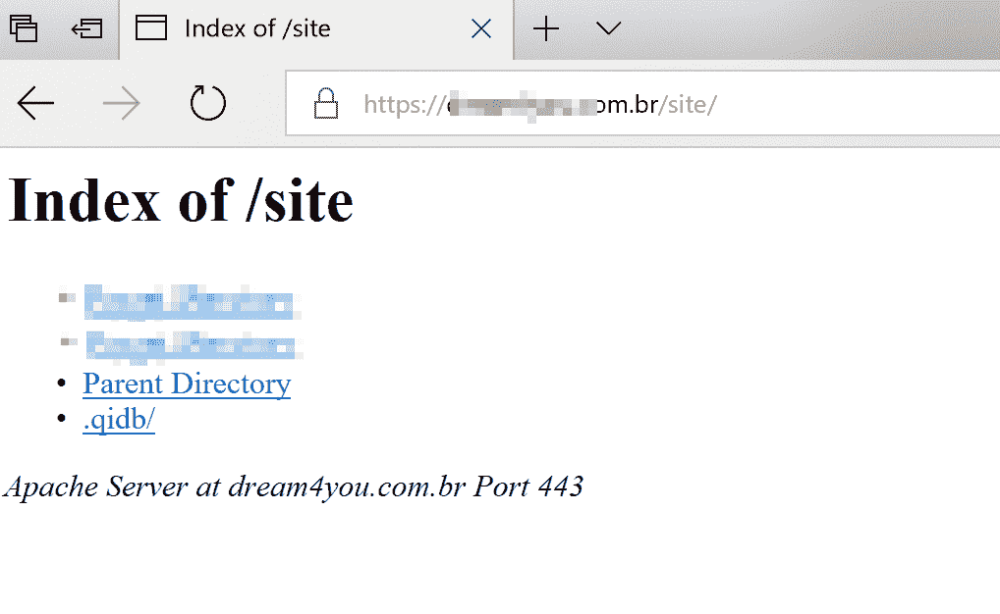# 微软服务器

要侵入微软服务器，我们可以使用以下命令来获取我们可以查看的微软服务器的结果:

```
"Microsoft - IIS/* server at" intitle:index.of
```

# Oracle 服务器

对于 Oracle 服务器，以下查询将列出 Google 在互联网上索引的服务器:

```
"Oracle HTTP Server/* * Server at" intitle:index.of
```

# IBM 服务器

和前面提到的一样，如果你仔细搜索，Google 可以给你一个索引的 IBM 服务器列表。您可以在 Google 中输入以下命令:

```
"IBM_HTTP_Server /* * Server at" intitle:index.of
```

# 网景服务器

互联网上有网景公司的服务器，我们的黑客手段无法保护它们。我们可以通过发出以下命令来获得 Google 索引的内容:

```
"Netscape/* Server at" intitle:index.of
```

# 红帽服务器

我们可以通过发出以下搜索命令来访问 Google 索引的 Red Hat 服务器:

```
"Red Hat Secure/*" intitle:index.of
```

# 系统报告

关于组织服务器的敏感信息的另一个重要来源可以从服务器中系统生成的报告中获得。我们可以使用以下命令来获取报告:

```
"Generated by phpsystem" -logged users, os
```

# 错误消息查询

除了访问服务器，我们还可以访问错误报告，其中有时包含有用的信息，如用户名和密码。要获得被 Google 索引的几个页面的错误报告，我们可以给出以下命令:

```
"A syntax error has occurred" filetype:html intext:login
```

# 社会工程师工具包(套件)

这是一个受人尊敬的社会工程工具，拥有巨大的力量。它补充了社会工程的几乎每一个方面。它由社会工程师在攻击过程中的每一步都可以使用的工具组成。SET 为社会工程攻击带来了各种自动化方式，使人类的一切都变得简单多了。然而，这个工具包在白帽子的渗透测试练习中有更多的用途。然而，这并不意味着该工具是一种威胁。它仍然可以用来对付成功几率很高的组织。这完全取决于谁使用这个工具。

这个工具预装在 Kali 中。然而，它仍然可以安装在其他 Linux 操作系统上，但是也需要安装 Metasploit 和 Python。它与这两者密切合作，没有它们就无法工作。该工具是开源的，互联网上有许多下载资源。您也可以通过 Windows 设备访问该网站，并了解如何使用这些工具:

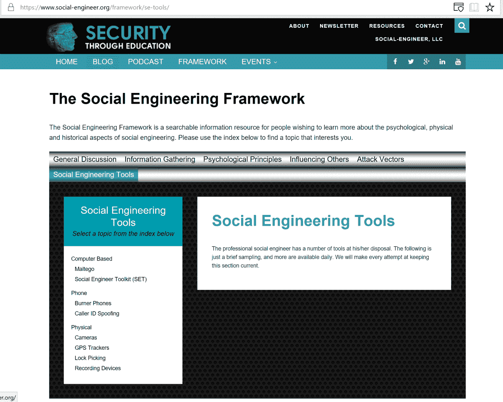

运行该工具并不复杂。它是打开的，就像任何其他 Linux 程序一样。有趣的部分在于工具包所具有的特性。我们打算去参观其中的一些。

# 鱼叉网络钓鱼

我们已经在本书中遇到过几次网络钓鱼。网络钓鱼和鱼叉式网络钓鱼的区别在于，网络钓鱼通常是不加选择的，它会向许多人发送大量的网络钓鱼电子邮件，希望少数人会落入陷阱。例如，尼日利亚王子电子邮件是一种网络钓鱼攻击，但不完全是鱼叉式网络钓鱼。鱼叉式网络钓鱼攻击是指恶意电子邮件专门针对某些人。它类似于普通的长矛，孤立和攻击个人而不是一群人。在 SET 中，鱼叉式网络钓鱼攻击是第一选择，如以下截图所示:

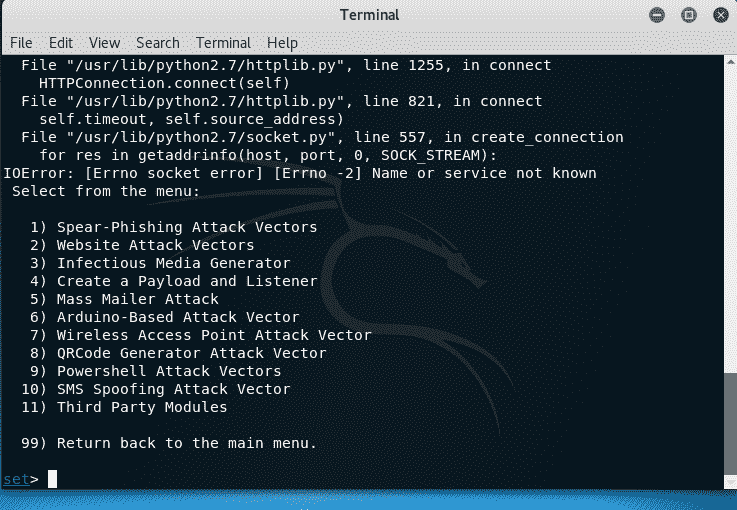SET Terminal

当我们选择鱼叉式网络钓鱼攻击时，我们会进入另一个菜单，在这里我们可以指定我们希望针对我们的目标使用的鱼叉式网络钓鱼攻击的类型。下面的屏幕截图显示了这些选项。在这个例子中，我们选择进行群发邮件攻击。选择之后，我们会得到一些有效载荷，可以帮助我们执行大规模电子邮件攻击:

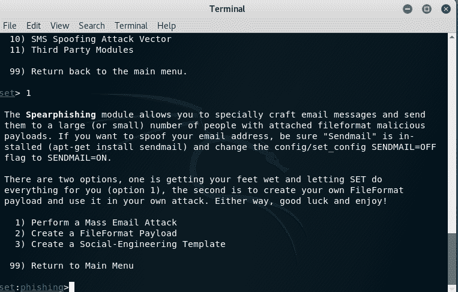Selecting Spear Phishing option

让我们说，我们想要一个自定义的 EXE 文件转换成 VBA，并作为 RAR 文件发送到目标。这是选项 15，如下图所示。在这种情况下，目标会收到一个 RAR 文件，该文件被植入了后门，可以让我们访问他或她的计算机。这意味着我们将能够控制目标的电脑。

*Social Engineer Toolkit (SET) tutorial for penetration testers*, *ComputerWeekly.com*, 2018 available at [http://www.computerweekly.com/tutorial/Social-Engineer-Toolkit-SET-tutorial-for-penetration-testers](http://www.computerweekly.com/tutorial/Social-Engineer-Toolkit-SET-tutorial-for-penetration-testers). [Accessed on January 31, 2018].

一旦我们选择了选项 15，我们就会得到一个可供选择的有效载荷列表。这些显示在下面的截图中:

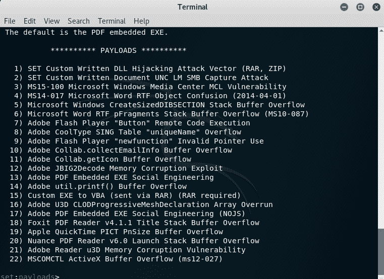

从这里我们可以选择任何有效载荷。这个项目需要我们满足两个要求。首先，我们需要登录一个有效的 Gmail 帐户，该帐户将用于向目标发送有效载荷。该程序不使用系统电子邮件发送有效载荷的原因是因为大多数电子邮件服务能够将一些电子邮件归类为垃圾邮件。如果给定的电子邮件与向用户发送恶意文件相关联，它将被标记为垃圾邮件，并且不再有用。该计划的另一个要求是，我们应该给出目标的电子邮件帐户。这是显而易见的，因为它是我们选择的有效载荷的传递通道。

有了这些，系统就能传递有效载荷，如果目标点击并打开它，我们就能对目标的计算机进行后门访问:

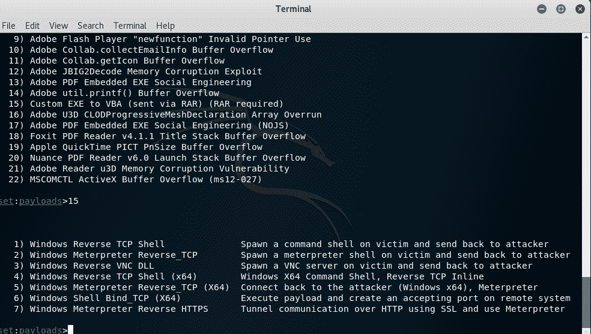

为了增加攻击成功的机会，系统会发送带有一些诱人标题的恶意电子邮件。系统提供了许多模板，其中包含的内容很容易让人点击。其中之一是来自你的电脑的*奇怪的互联网使用*电子邮件，它告诉目标，监管机构已经观察到来自他或她的 IP 地址的一些不寻常的流量。这会激发收件人的兴趣，他们肯定会打开它。还有其他模板，如计算机问题、状态报告、婴儿照片和新闻更新。

# 网络攻击媒介

社会工程师工具包具有克隆整个网站，然后在本地托管它们的强大功能。有一个网站的精确克隆的优势，人们会毫不犹豫地给出他们的细节。假设我们有一个贝宝登录页面的克隆。我们可以使用这个页面让人们输入他们的实际贝宝登录。由于该网站看起来与 PayPal 官方网站相似，很少有人会怀疑该网站是否合法。用户在验证他们访问的网站的 URL 时存在松懈，特别是当这些 URL 是通过缩短的 URL 提供时。

此外，这是非常便宜和容易主办一个假的网站，但类似的网址。也有一些技巧，可以在托管时使用，使域名看起来更合法。例如，我们可以托管域名`com_password.net`。

然后，我们可以用一个像 PayPal 这样的名字子域它，这样我们就可以得到一个看起来像`Paypal.com_password.net`的结束 URL。

对于新手用户来说，这看起来像是 PayPal 的合法网址，因为它有`Paypal.com`部分。我们可以使用这个网址和一个克隆的贝宝登录页面，让用户给我们他或她的登录凭证。

# 传染性介质发生器

social engineer toolkit 可以创建一个恶意文件，该文件可以加载到可移动存储介质上，并在插入目标计算机时用于传递有效载荷。当一个社会工程师想把 u 盘丢在目标的房屋里，希望有人会把它们捡起来并插入他们的电脑时，这是一个特别有用的功能。该工具通常允许用户导入他们自己的恶意可执行文件或使用它附带的文件。该工具将恶意文件作为自动运行文件加载，这意味着它将在插入后立即由计算机运行，无需用户操作。其中一种情况是用户在他们的机器上禁用了自动运行，但幸运的是，大多数用户没有这样做。另一种情况是用户拥有强大的防病毒程序，可以检测并阻止恶意文件运行。唯一的希望是目标要么有过时的反病毒软件，要么根本没有。此外，如果可执行文件被目标防病毒程序恶意接收，还可以选择以其他格式隐藏恶意文件。有一些像`.pdf`这样的文件格式可以被设置为一旦目标试图打开它们就触发溢出。让目标打开这些邮件的方法是用吸引人的标题来吸引他们，比如*机密信息、*或*新的工资调整*。

让我们简单地看看如何使用 SET 来实现这一点。从我们在其中一个屏幕截图 *中看到的主菜单中，选择鱼叉式网络钓鱼选项* ，我们必须选择传染性媒体生成器，这是菜单中的第三个选项。选择这个之后，程序会告诉我们从两个攻击媒介中选择一个。有一个选项用于文件格式漏洞，另一个选项用于标准 Metasploit 可执行文件。让我们来看看文件格式漏洞，因为反病毒程序已经能够识别大多数 Metasploit 可执行文件的签名，并将很快捕获它们。至于文件格式利用，我们可以使用任何其他格式，但默认的是一个嵌入 EXE 的 PDF。

选择文件格式漏洞后，系统会提示我们输入想要反向连接的 IP 地址，默认为`172.16.32.129`。它还会询问要使用的文件格式，并列出 20 个选项，从 Word RTF 到 Foxit Reader PDF 缓冲区溢出。对于我们的例子，让我们选择第一个文件格式有效载荷，这是一个定制的 DDL 劫持攻击向量。选择这个之后，程序会告诉我们选择具体的有效载荷来使用。选项包括:

*   Windows 反向 TCP 外壳
*   Windows meter preter Reverse _ TCP
*   Windows 反向 VNC DLL
*   Windows 反向 TCP Shell (X64)
*   Windows meter preter Reverse _ TCP(X64)
*   Windows Shell Bind _ TCP(X64)
*   Windows Meterpreter 反向 HTTPS

让我们来看看第五个选项的一个 Windows Meterpreter 反向 TCP(X64) 。这是一个有效载荷，它允许我们连接到受害者的计算机，只要他们在 64 位 Windows 操作系统上。在此之后，系统将通过选择一个端口来完成剩下的工作，该端口用于来自目标计算机的反向连接和恶意文件的生成，然后将其设置在自动运行文件中。它可以将内容复制到连接的可移动存储介质设备上。我们刚刚创建的恶意文件将被加载到任何指定的可移动存储介质中。一旦目标将此文件插入计算机并成功运行，它就会造成溢出，并使用 meterpreter 外壳攻击他们的计算机。如果我们选择一个可执行文件而不是不同的文件格式，程序将创建一个可执行的有效负载，它将被自动运行触发。

# 短信欺骗攻击媒介

该模块集允许攻击者创建一个欺骗短信，并将其发送到目标。短信的主要目的是说服目标跟随某个链接，但当他们这样做时，它会将他们带到一个恶意网站，存储在他们浏览器中的凭据被盗。这个模块已经被黑客组织用来获取他们可以在其他攻击中使用的凭证。关于如何在程序上执行欺骗的细节很简单。从欢迎屏幕(通常列为选项 7)中选择该模块后，程序会询问用户是要创建新模板还是直接执行欺骗攻击。既然已经有了好的模板，我们可以选择研究欺骗攻击本身。该计划将询问我们是否希望攻击一个单一的电话号码或使用群发短信攻击。制造攻击很简单。假设我们只想攻击一个电话号码。下一个提示将要求我们提供目标的电话号码。

在此之后，我们将被告知从众多短信模板中选择一个，这些模板包括假冒的警察短信、来自老板的短信以及来自移动运营商的其他短信。在这之后，我们被要求为短信欺骗选择一个服务。有四个服务——**SohoOS**、【Lleida.net】T2、 **SMSGANG** 和 **Android 模拟器**。除了 SohoOS，其他的欺骗者要么付费，要么需要安装模拟器。我们只是继续搜狐。该计划将照顾其余的和发送短信与一个欺骗的号码，要求目标访问某个网站。

# 无线接入点攻击媒介

这是 SET 提供的另一个有效功能，允许攻击者创建无线网络的副本，当目标加入时，它会将他或她的浏览器定向到恶意站点。该功能利用了多种工具的组合，包括 **AirBase-ng** 和 **DNS 欺骗**。关于该功能的工作原理没有太多解释，因为用户所要做的就是告诉 SET 启动无线接入点，并指定攻击中要使用的设备网卡。做起来很简单，但却非常有效。它可以在组织中用于收集登录凭据。由于组织用户严重依赖组织提供的互联网，如果攻击者建立了与组织同名的恶意无线网络，许多用户将连接到该网络，他们的设备将受到威胁:

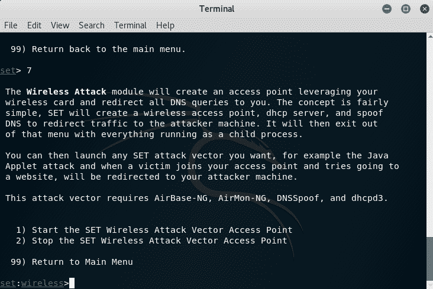# 二维码攻击载体

该攻击模块利用 QR 码而不是恶意链接。因为有时完全屏蔽链接可能很重要，所以寻找可用于将目标转移到恶意站点的替代方法可能是值得的。二维码攻击载体生成一个有效的二维码，将人们重定向到一个攻击载体，在大多数情况下，这是一个恶意网站。二维码攻击模块在社会工程师工具包中被列为选项 8。当打开时，该程序要求用户输入用户扫描二维码后将被定向到的 URL。在设置 QR 码之前建立基于网络的攻击媒介是很有用的。基于 web 的攻击媒介可能是从合法网站克隆而来的恶意网站。QR 码可以通过我们之前访问过的另一个模块(称为鱼叉式网络钓鱼攻击载体)传递给用户。该模块提供向用户发送模板消息或定制要发送给用户的电子邮件消息。该工具非常狡猾，因为它有类似于不同权威机构发送的实际电子邮件和对用户有吸引力的电子邮件的模板:

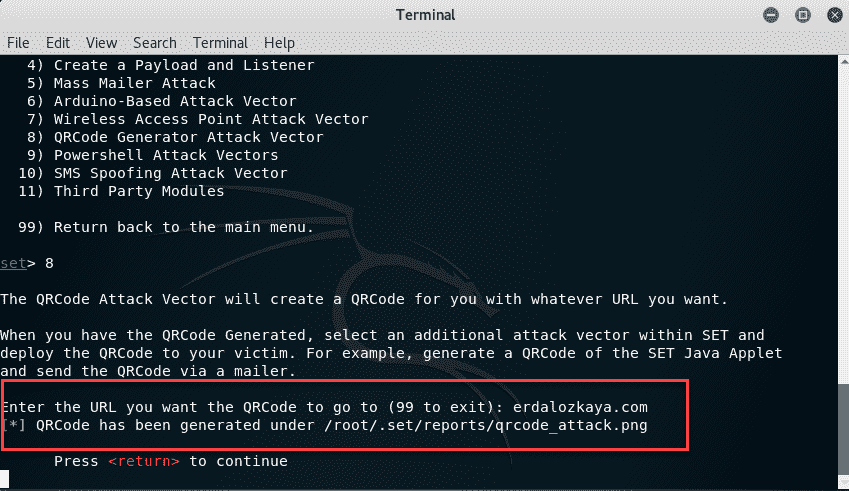

您可以创建如下二维码(将带您进入我的博客):

ErdalOzkaya.com QR Code created with SET in Kali# 第三方模块–快速跟踪开发

这是一个模块，带来了几个额外的利用和攻击媒介设置。原来，它不在 SET 中。这是一个有目的地帮助渗透测试人员进行渗透测试活动的模块。然而，正如我们所说的，仅仅因为一个工具是为渗透测试人员设计的，并不意味着这个工具不能用于执行真正的攻击。快速通道开发模块列在第三方模块下，这是它附带的工具集菜单中的最后一个选项。用户选择打开该模块后，会看到两个选项。第一个是**微软 SQL 生成器**，第二个是**自定义漏洞**。现在，让我们更关注 SQL 暴力攻击，这是第一个选项。在这里，攻击媒介试图识别活动的和在线的 Microsoft SQL 服务器，然后试图用弱登录凭证暴力破解它们。不幸的是，一些管理员让他们的服务器使用默认配置，并且使用弱的和常用的登录凭证。使用单词`admin`作为用户名的管理员数量惊人。这通常与弱密码一起使用。该工具试图找到这些类型的服务器并攻破它们。

我们提到过，快速通道利用的第二个选项是自定义利用。模块中加载了许多自定义漏洞。它们包括 MS08-067、Firefox 3.6.16 漏洞、网络安全管理软件产品 5.1.0 SQL 注入漏洞、RDP DOS 漏洞、MySQL 认证旁路和 F5 root 认证旁路。

# 创建有效负载和侦听器

这是 SET 菜单中的第四个选项。它用于创建一个可执行负载和一个监听器。SET toolkit 将使用 Metasploit 创建一个可执行文件，该文件可以对受害者的计算机执行许多已定义的恶意操作。侦听器用于监视或控制受害者计算机上可执行文件的活动。然而，攻击者必须在受害者的机器上植入并运行这个可执行文件。由于使用这种方法进行攻击的动态性，这是不利的，因为有其他模块可以以更有效的方式将可执行文件交付给用户。获得受害者的计算机并安装和运行可执行程序并不简单。存在太多的风险，反病毒程序可能会阻止在受害者的计算机上安装恶意程序。

# 群发邮件攻击

这可能是常见网络钓鱼攻击的另一个名称。这是一种用来向许多收件人发送大量电子邮件的漏洞，希望有人会点击它们。攻击者可以选择在几个可以发送给用户的模板中定制消息。这样做的问题是，这是一种盲目的攻击，目标并不广为人知。人们还担心，在几个用户将电子邮件标记为垃圾邮件后，电子邮件提供商也会将发送给其他目标的邮件标记为垃圾邮件。在这个时代，进行网络钓鱼攻击是不明智的。因此，这个模块现在不像几年前那样被广泛使用。出于这个原因，我们将不讨论它。

总结一下 SET，它是一个紧凑的工具包，带有过多的攻击模块和有效载荷。随着时间的推移，其中一些已经变得过时和低效。然而，随着工具包的每一次更新，还会添加更多的内容。SET 集合广为人知，它允许组织测试各种漏洞。尽管它包含的工具主要用于渗透测试，但这并不意味着它们不能用于真正的攻击。渗透测试的本质是测试组织是否容易受到某些攻击。因此，在攻击者手中，它们是潜在的有害工具。

# 电话工具

我们在[第七章](07.html)、*托辞*中提到，电话在让目标立即满足要求方面非常有效。我们还说过，大多数社会工程师已经转向基于互联网的攻击技术，因此手机在社会工程中的潜力仍然很大。有一些工具可以用来使基于电话的攻击更加有效。我们将研究其中的一些工具。

# 来电显示欺骗

呼叫者 ID 欺骗包括改变对接收者显示为呼叫者 ID 的细节。因此，使用给定的号码进行呼叫，但是改变了呼叫者 ID，使得接收者看到不同的号码。社会工程师可以假冒不同组织的客户服务代理，从银行到国税局。对于攻击者来说，拥有一些关于目标的背景信息是很重要的，这样才能使呼叫更加合法。最大的问题是欺骗是如何进行的。我们将介绍一些有效的欺骗方法。

第一种是通过使用**欺骗卡**。这是一个网络平台给的卡，可以用来骗整数字。一个人所需要做的就是从 https://www.spoofcard.com/apps[的网站](https://www.spoofcard.com/apps)获得欺骗卡。有了这张卡，人们就可以拨打虚假电话。唯一的要求是，你必须拨打卡上的收费号码，使用 PIN 认证自己，然后给出你希望来电显示的号码。然后，呼叫者将能够在某个合法号码的完全伪装下打电话给接收者，该号码可用于进行威胁或勒索金钱和信息。这种欺骗卡非常先进，可以改变打电话者的声音，例如，让一个男人听起来像一个女人。除了手机之外，它不需要任何额外的硬件就能做到这一切。欺骗卡面临的最大挑战是高昂的价格。

然而，如果攻击解决了账单，社会工程师还是会使用它:

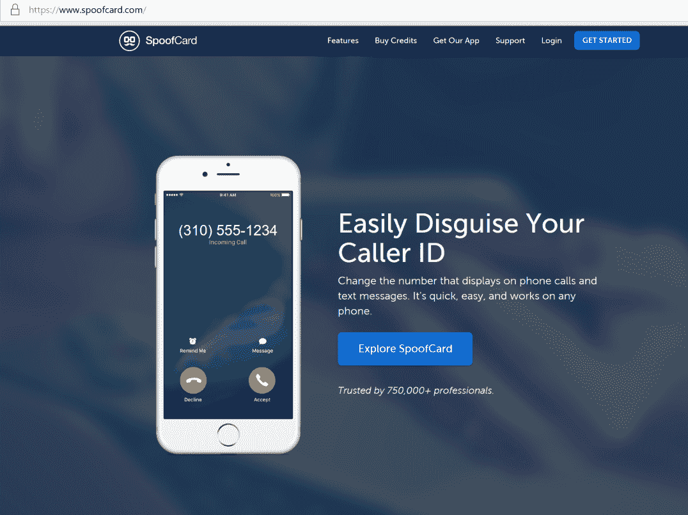

另一种欺骗电话的方式是使用**欺骗应用**。SpoofApp 是一个可下载的应用程序，适用于主要的智能手机操作系统。该应用程序可以用来改变来电显示和语音。它也可以在 SpoofCard 上运行，但将所有东西都集成到一个智能手机应用程序中。它还捆绑了其他功能。使用欺骗应用程序时，用户不必首先拨打收费号码，他或她只需在应用程序中输入要显示给目标的号码，然后拨打电话:

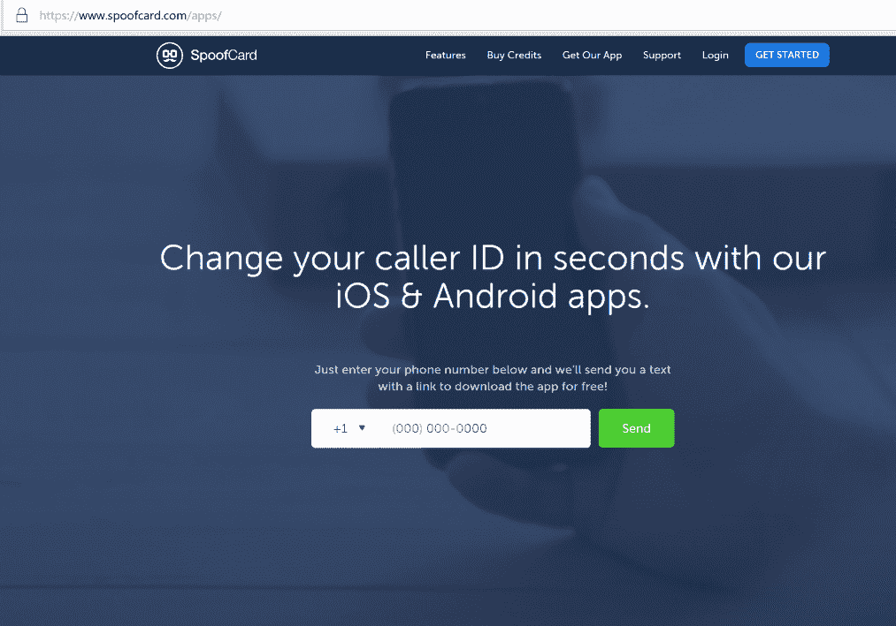

最终结果可能看起来像前面从智能手机上截取的屏幕截图。如果你仔细观察，你会发现打电话的人并没有真正的电话号码。

# 剧本

从技术上来说，这不是一个工具，而是一种让基于手机的社会工程更有效的技术。因为电话给了社会工程师一个说服目标做某事的机会，所以事先准备好你要说的话会有所帮助。这就是脚本派上用场的地方。通过简单地写下要向目标提及的事情，攻击者就有了参考的地方，以确保攻击按计划进行。脚本不应该是固定的，它应该足够灵活，允许社会工程师根据目标给出的响应进行一些小的调整。例如，如果我们是社会工程师，我们打电话给目标，告诉他们我们是国税局，正在追查某笔未申报的收入，我们应该能够在目标承认或否认索赔之间切换。

# 原路返回机

如果你没有时间使用谷歌黑客，你可以尝试使用[www.archive.org](http://www.archive.org)。曾几何时，人们不像今天这样关心他们的隐私和安全设置，他们过去在自己的网站上分享的比他们应该分享的多得多。当我过去做渗透测试时，`Archive.org`是我的第一站，检查我是否能收集到可能更难找到的信息。

举个例子，你可以看到我的博客在 2017 年 4 月 26 日到 9 月之间被保存了 73 次；相信我，即使是我也不再存储所有这些备份:

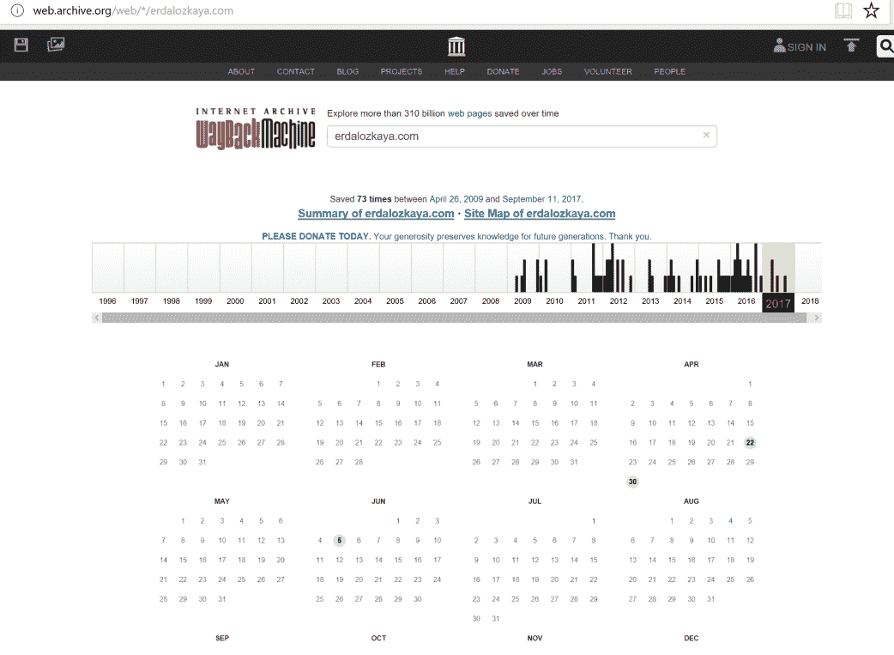

我 2011 年博客的快照:

# 发言人

Spokeo 是一个你可以搜索一个人，电话号码，甚至是地址的网站。Spokeo 从电话簿、社交网络、房地产列表、公开调查和许多其他地方收集个人信息。它在美国效果最好。我记得很多年前，当我在美国的一个一级会议上发表社会工程演讲时，我能够找到志愿者与会者的地址、电话号码，甚至他们买房子的价格。值得一看[www.spokeo.com](http://www.spokeo.com):

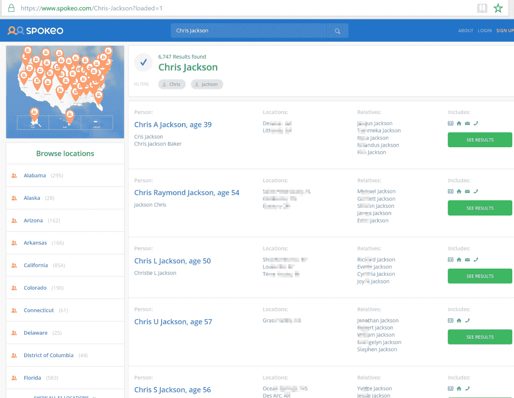# Metagoofil

Edge security 开发的元数据收集器工具。您可以在`.pdf`、`.doc`、`.xls`、`.ppt`中搜索目标域以识别并下载其文件，以此类推:

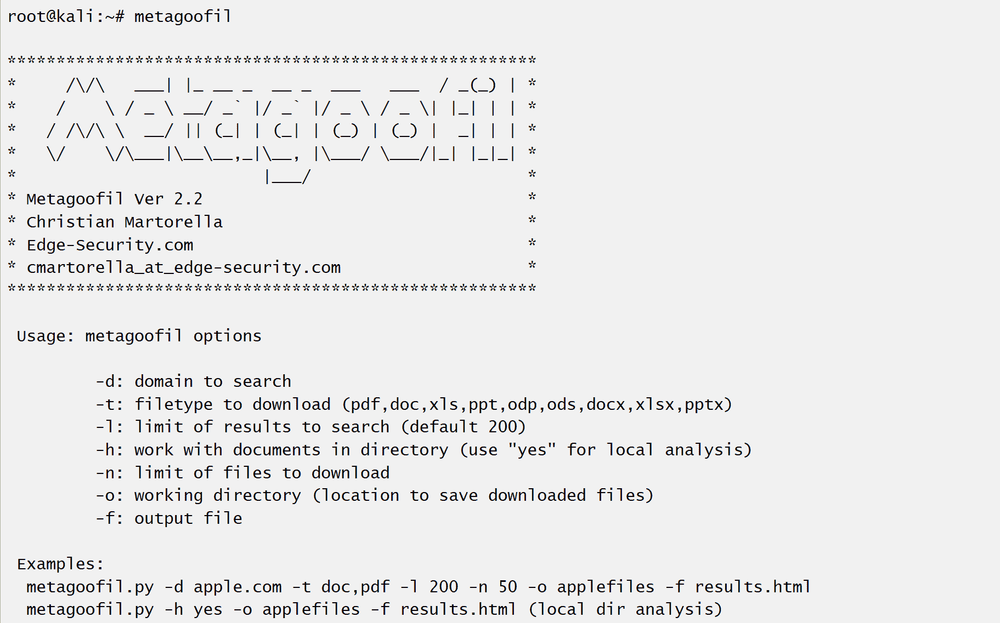# 收集档案的组织的指纹(FOCA)

FOCA 是一种工具，主要用于在其扫描的文档中查找元数据和隐藏信息。这些文件可能在网页上，可以下载和分析 FOCA。与 Metagoofil 一样，它能够分析各种各样的文档:

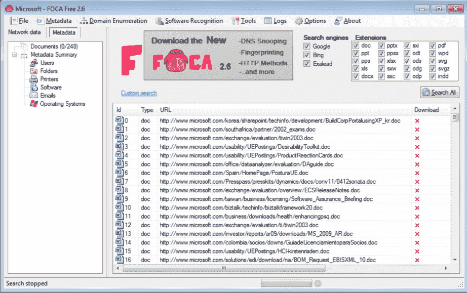# 凭证采集器攻击方法

我们都知道什么是凭证，以及它们如何提供对特定网站、服务或计算机的访问。一旦凭据被盗，就无法检测用户是合法用户还是被黑客攻击的用户。

SET in Kali 拥有帮助你克隆任何网站的工具，还能窃取凭证。在我进行渗透测试的日子里，这是我最喜欢的窃取凭证和访问网络的社会工程攻击。这里的想法当然不是黑客，而是正如你将在第 10 章、*社会工程案例研究*中读到的，帮助公司保护他们的资产以及教育用户。*你能从下面的截图中看出不同吗？*

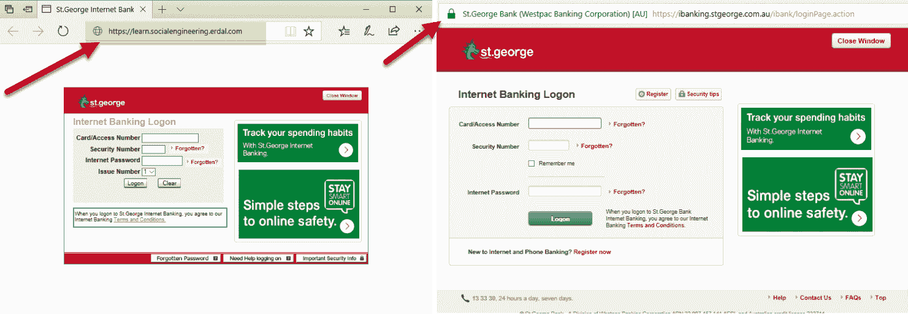

左边的截图是一个克隆的网站，而右边的是真实的网站。在 Kali 中启动 SET 后，您可以从选项 3 中选择凭证采集器攻击方法，如下所示:

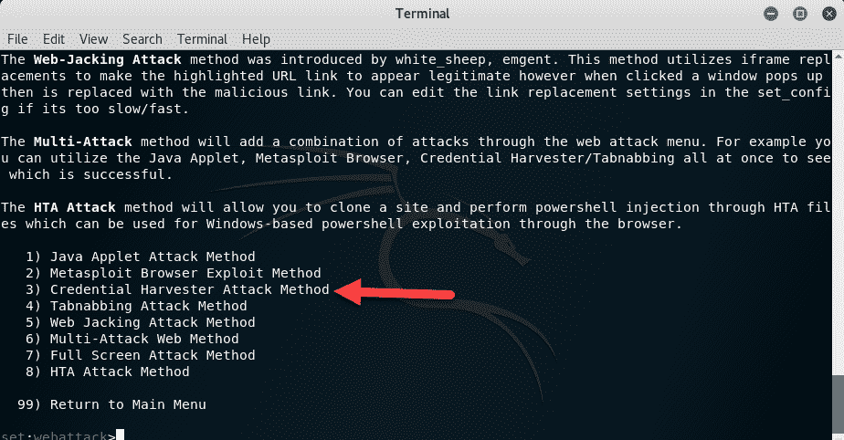

凭据收集攻击方法菜单将为您提供另外三个选项，使用现成的模板、克隆站点或导入您自己的攻击模板:

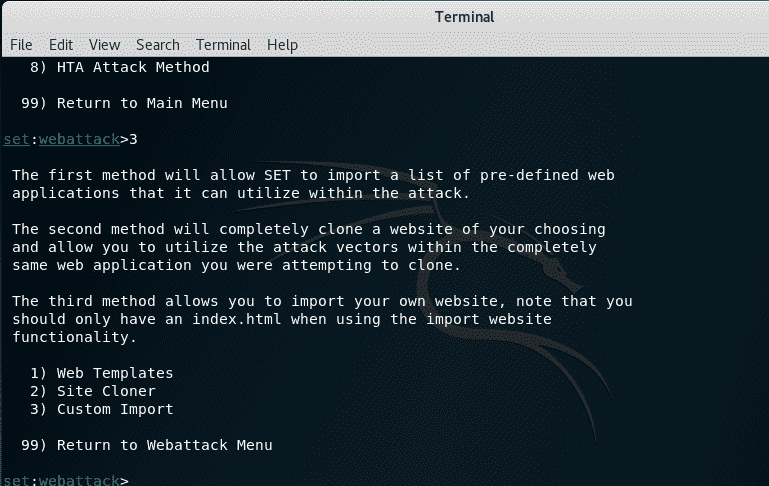

为了能够发起成功的攻击，攻击者的 IP 地址必须被发送到预定的目标，并且目标必须点击该 URL。一旦完成，受害者将被从克隆的网站引导至真实网站的登录页面，给人以凭据输入错误的印象:

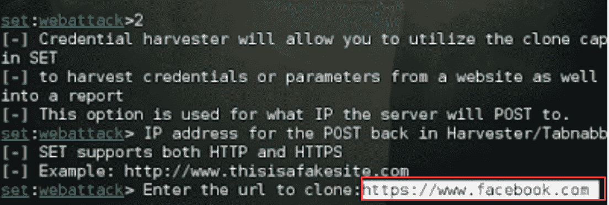

以下是脸书和 Gmail 的例子:

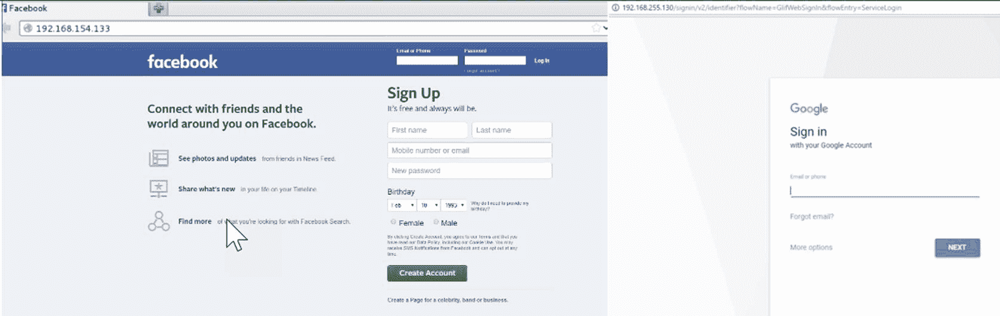

从截图中可以看出，克隆的网站看起来并不像原始网站那样完美，但钓鱼攻击背后的一个好故事总会增加受害者被社会工程(黑客攻击)的机会。当这一切发生在受害者一方时，该工具会将收集到的凭证转发给黑客:

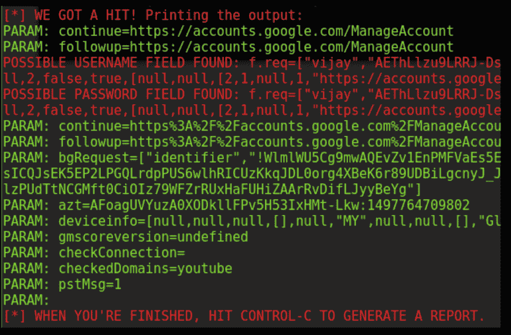

当凭证收集过程结束后，您可以输入 *Ctrl* + *C* ，这将在`/SET/reports`目录下以 XML 和 HTML 格式生成一份报告:

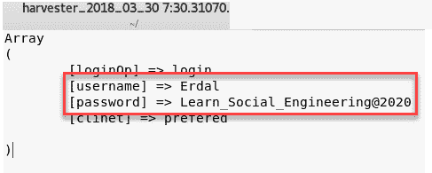

这是最好的免费工具之一，你可以用它来评估你自己或你的客户网络的安全性。请记住，您也可以在 Metasploit 框架中使用 SET，步骤非常相似。

# 社会工程练习

下一个练习从外部开始，换句话说，攻击者来自互联网并获得对系统的访问权以执行攻击。一种方法是将用户的活动导向恶意网站，以获取用户的身份。

另一种常用的方法是发送一封钓鱼邮件，在本地计算机上安装一个恶意软件。因为这是最有效的方法之一，我们将在这个例子中使用这个方法。为了准备这封精心制作的邮件，我们将使用 Kali 附带的 SET。在运行 Kali 的 Linux 电脑上，打开应用 s 菜单，点击开发工具 s ，选择社会工程工具包。

在这个初始屏幕上，您有六个选项可供选择。由于目的是创建一封用于社会工程攻击的精心制作的电子邮件，请选择第一个选项，您将看到以下屏幕:

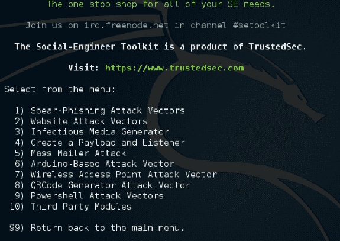

选择此屏幕中的第一个选项，这将允许您开始创建一封精心制作的电子邮件，用于您的鱼叉式网络钓鱼攻击。作为渗透测试团队的一员，您可能不希望使用第一个选项(群发电子邮件攻击)，因为您有一个非常具体的目标，该目标是通过社交媒体在侦察过程中获得的。

因此，此时正确的选择要么是第二个(有效负载)，要么是第三个(模板)。在本例中，您将使用第二个选项:

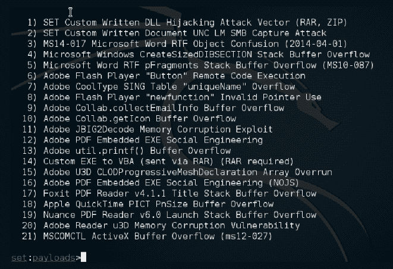

比方说，在您的侦察过程中，您注意到您的目标用户使用大量 PDF 文件，这使得他非常适合打开带有 PDF 附件的电子邮件。在这种情况下，选择选项十六 Adobe PDF Embedded EXE Social Engineering(NOJS)，您将看到以下屏幕:

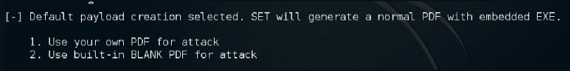

您在此选择的选项取决于您是否有 PDF。如果你是渗透测试团队的一员，有一个精心制作的 PDF，选择选项一。然而，为了这个例子的目的，使用选项二来为这个攻击使用一个内置的空白 PDF。选择此选项后，将出现以下屏幕:

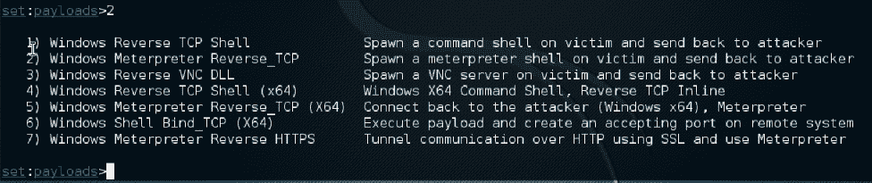

选择第二个选项，并按照出现的交互式提示进行操作，询问您要用作 LHOST 的本地 IP 地址，以及连接回该主机的端口。

现在选择第二个选项来定制文件名。在这种情况下，文件名将是`financialreport.pdf`。键入新名称后，可用选项显示在下面的屏幕截图中。

如果这是特定目标攻击，并且您知道受害者的电子邮件地址，请选择第一个选项:

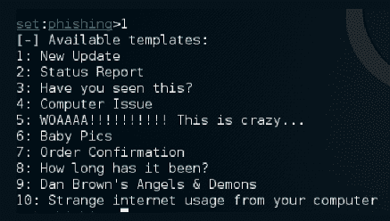

在这种情况下，我们将选择状态报告，选择该选项后，您必须提供目标的电子邮件和发送者的电子邮件。请注意，在本例中，我们使用的是第二个选项，即 Gmail 帐户。

此时，文件`financialreport.pdf`已经保存在本地系统中。您可以使用命令查看该文件的位置，如下所示:

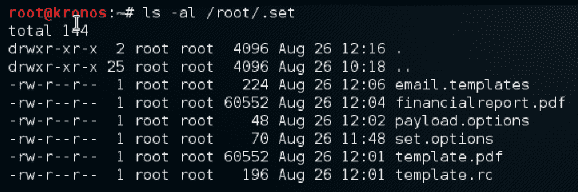

这个 60 KB 的 PDF 文件足以让您访问用户的命令提示符，并从那里使用 **Mimikatz** 来危害用户的凭证。

由于 Mimikatz 超出了本书的范围，并且您可能想要了解更多关于 Mimikatz 以及不同的网络安全攻击和防御策略，您可能想要购买由*尤里·第欧根尼*和*埃尔达尔·奥兹卡亚*撰写的书，可从 *Packt Publishing* 获得:


如果你想评价这个 PDF 的内容，你可以使用 *PDF 考官*从[到 https://www.malwaretracker.com/pdfsearch.php 再到](https://www.malwaretracker.com/pdfsearch.php)。上传 PDF 文件到本网站，点击提交，查看结果。核心报告应该是这样的:

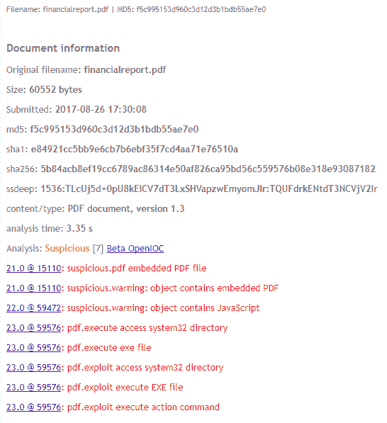

注意，有一个 EXE 文件的执行，如果你点击这一行的超链接，你会看到这个可执行文件是`cmd.exe`。该报告的最后一段解码显示了可执行文件`cmd.exe`的动作启动。

# 牛肉钓鱼

**浏览器利用框架** ( **牛肉**)(【http://beefproject.com/】T4)是另一种工具，通常被归类于利用渗透测试、蜜罐和社会工程。BeEF 也可以用来托管恶意的 web 服务器，但是让我们只关注社会工程。我们可以制作一张假的节日贺卡，贴在网上，或者通过电子邮件发给你的受害者。这个例子不会详细解释 BeEF，但是它的目的是让你知道如何使用这个工具。要了解更多详细信息，您可以遵循工具本身中的详细信息。

要开始 BeEF，只需在您的卡利发行版中选择正确的选项:

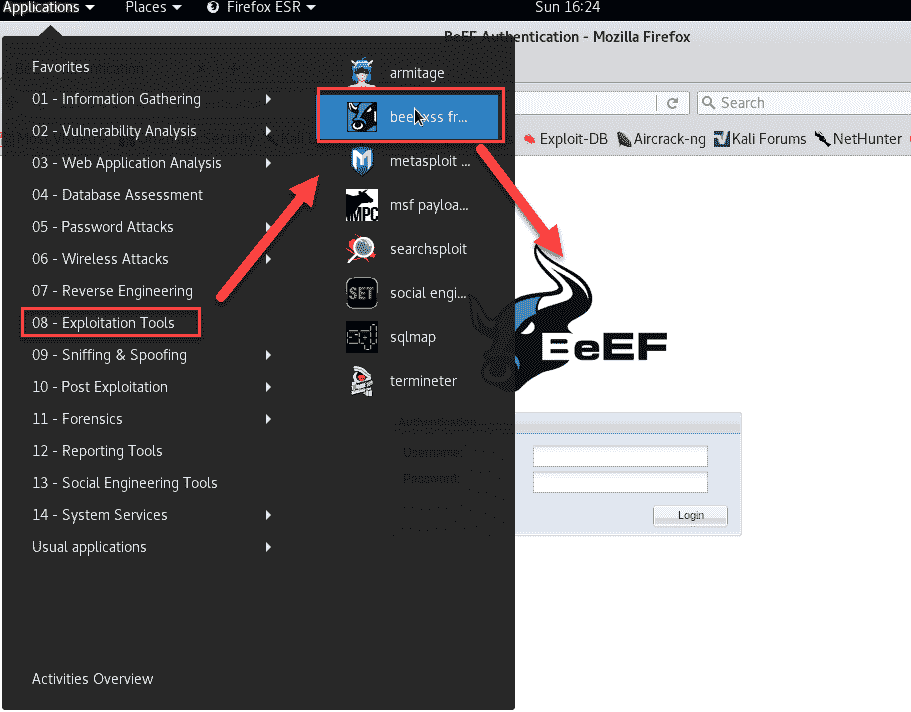

一旦 BeEF 运行，它将自动为您打开 web 浏览器，如图所示。

您可以使用用户名`beef`和密码`beef`登录:


像任何社会工程攻击一样，你必须欺骗你的受害者，让他们相信他们在真实的网站上，而不是你的假网站，所以如果你打算用牛肉，我强烈建议你使用定制的*钩子*。在这个练习中，我们将继续使用基本的挂钩，您可以通过单击**挂钩我来访问主页！**快捷方式:

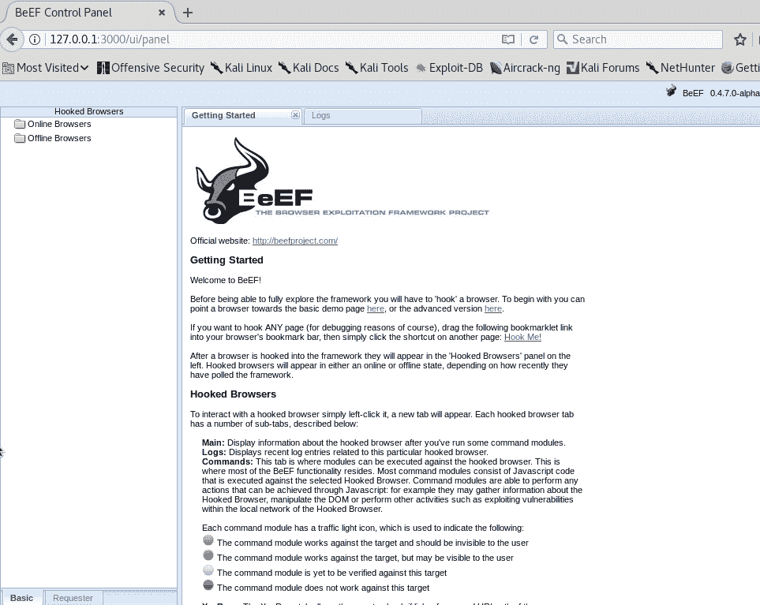

一旦系统被钩住，你就可以通过从你的 BeEF 控制台发送许多预先配置的命令来查看和控制受害者的浏览器。每个浏览器的命令各不相同:

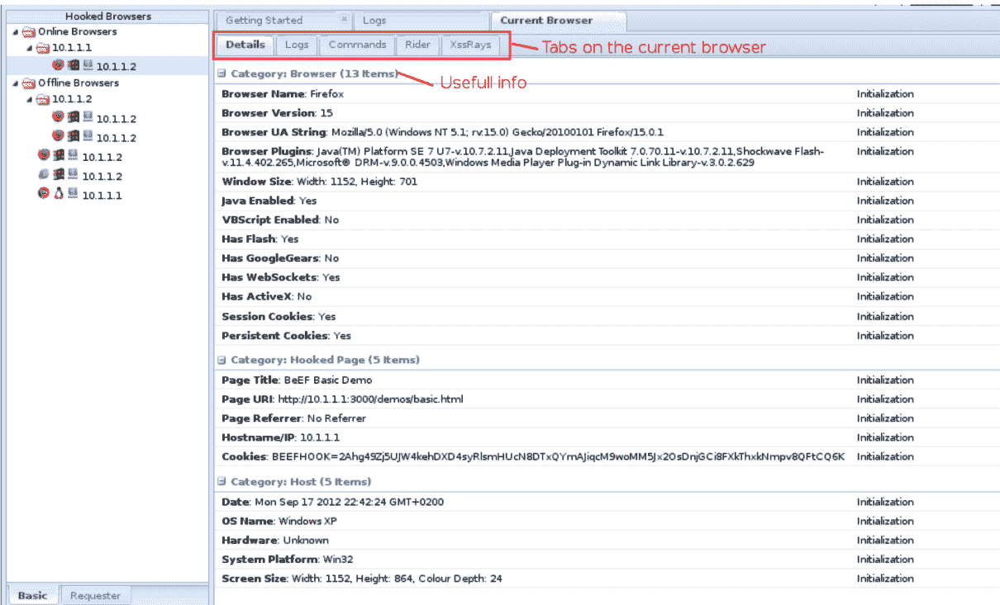

下面是一个在 macOS 上运行的挂钩 Firefox 的例子。如果受害者点击“允许”，我们将通过他们的网络摄像头看到受害者(假设你的受害者在他们的计算机前有一个网络摄像头，并且它没有被安全膜覆盖):

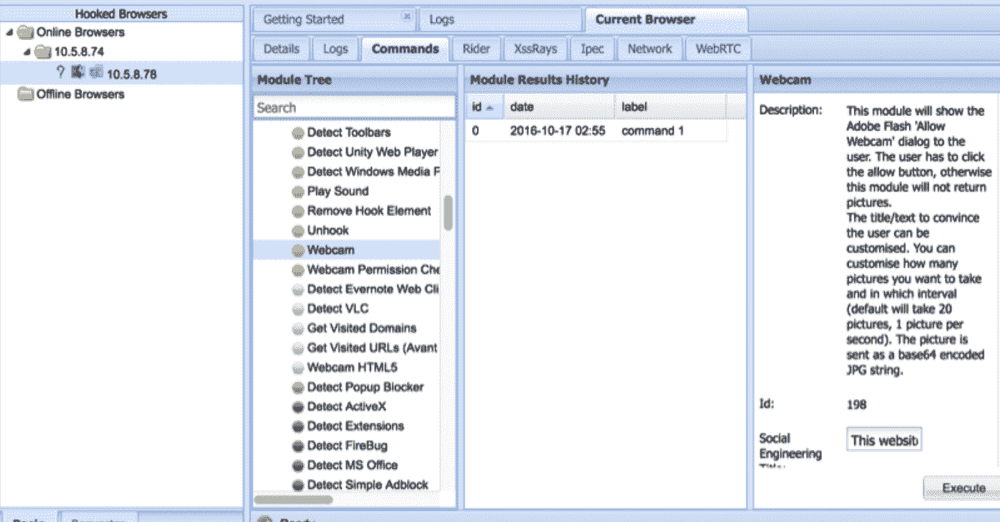

正如你在模块树中看到的，你可以在 BeEF 中使用许多不同的漏洞。为了专注于社交工程，我分享了一个社交工程可用命令的截图:

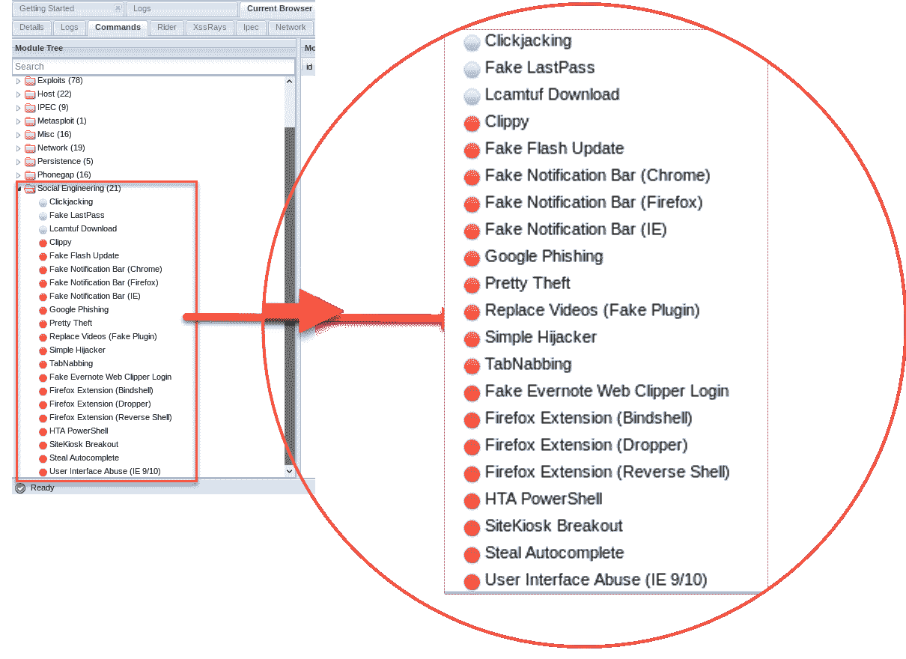# Zabasearch.com

这是另一个搜索引擎，包括人，反向电话号码查找，地址，等等。这是找到你想要的信息的好来源。更多信息请参考 www.zabasearch.com 或 www.intelius.com 的网站。

对于这个例子，我将使用我亲爱的朋友和我们的书《网络安全防御和攻击策略》的合著者作为受害者。你所需要的只是一个名字和一个姓氏，其余的由网站负责:

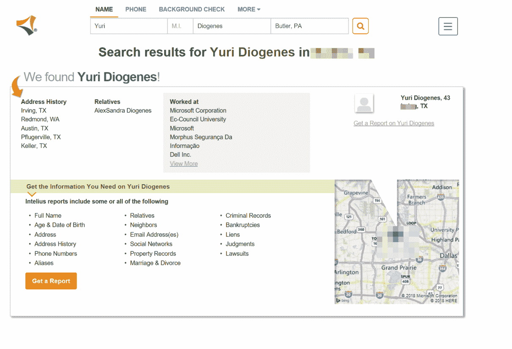# 职位发布

招聘启事会有什么问题？对于大多数公司来说还不为人知，招聘网站可以帮助我们。每个社会工程师都可以检查他们的目标，看看他们正在招聘什么样的 IT 人员。如果 X 公司正在寻找微软和思科认证的工程师，具有 Pala Alto 防火墙知识和卡巴斯基反病毒经验，这将为我们提供足够的信息。

如果你想知道你的目标公司是否在使用 Java，你所要做的就是去[www.monster.com](http://www.monster.com)，输入关键词，然后搜索(如果你需要，这也是一个很好的求职网站。).


你会发现许多公司仍然公开宣传他们在内部使用的产品:

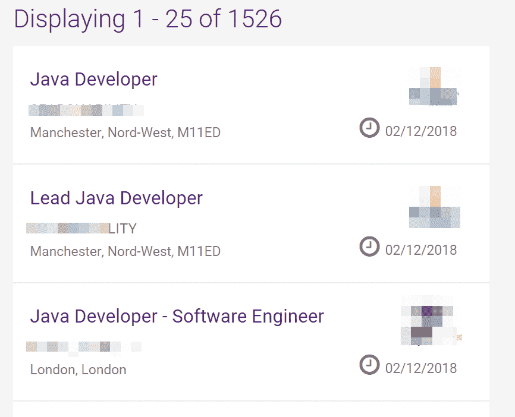

正如前面章节所讨论的，社会工程师一直在使用这些伎俩，有些人甚至被这些公司雇佣，成为内部人员，然后发起攻击。

# Shodan.io

我们已经覆盖了许多覆盖人群的网站，那么一个覆盖互联网连接设备的搜索引擎呢？ *你觉得可能吗？*更多信息请参考 [https://www.shodan.io](https://www.shodan.io) 。

该网站将帮助您发现许多连接到互联网的设备。这将有助于您定位它们的位置，甚至是谁在使用它们。网站背后的理念是帮助你理解数字足迹，看清大局；网站和网络服务只是互联网的一部分。还有发电厂、智能电视、冰箱等等。

当然，还有*暗网*。这在由*帕克特出版社*出版的另一本书中有所涉及。如果你有兴趣搜索:*了解暗网——暗网基础*。

回到 Shodan 网站。你可以通过网站找到这些设备，或者安装谷歌浏览器或火狐插件。对于这个例子，我将使用网站。

我在搜索框里输入了`"Server: SQ-WEBCAM"`。让我们看看结果，如下图所示:

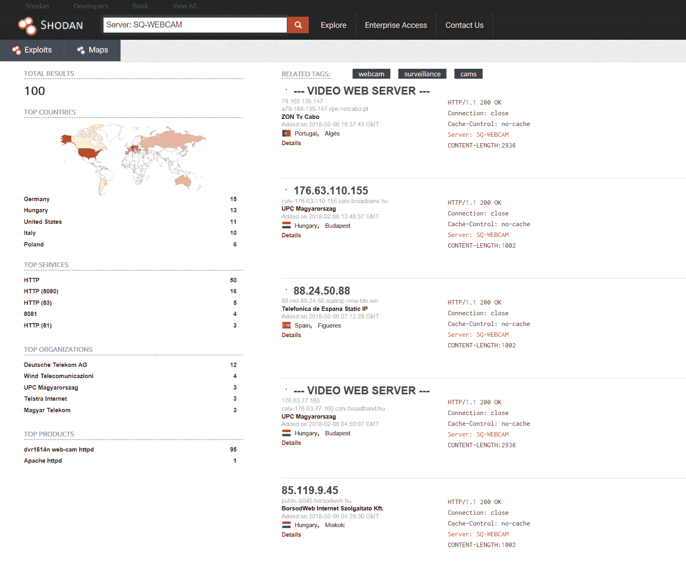

您将看到数百个返回的结果。现在，您只需点击感兴趣的 IP 地址或报头，如下所示:

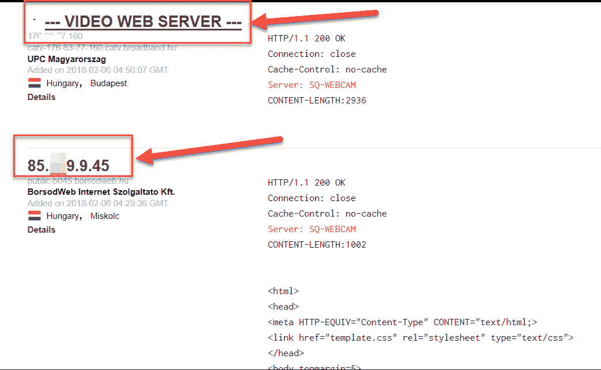

请记住，其中一些是受密码保护的，但有一个技巧可能会帮助你。我们将在下面的章节*默认密码*中介绍这一点:

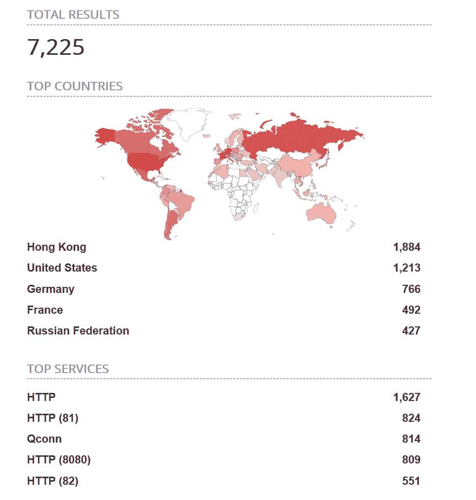

Shodan 网站也允许你在世界地图上进行搜索。只需点击世界地图，你会发现网络摄像头，摄像头，网络摄像头，梦想盒子，以及更多:

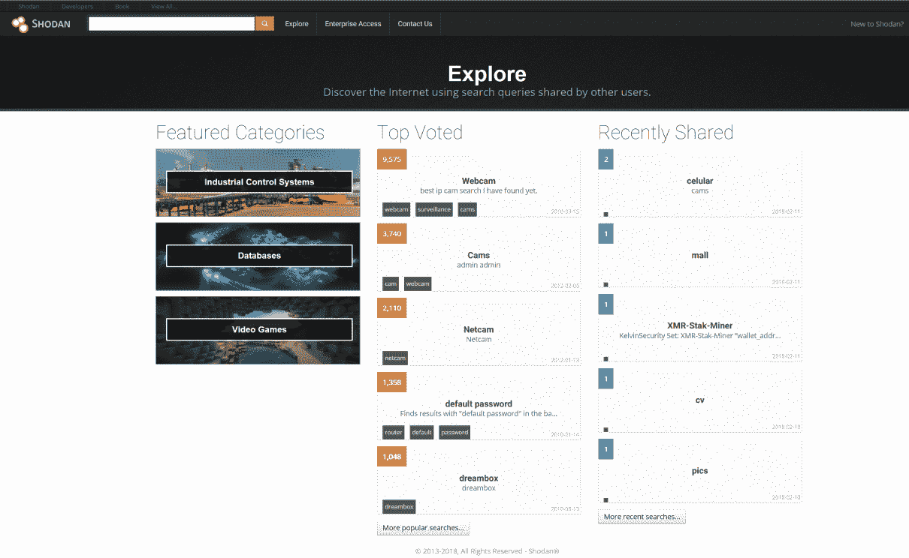

您甚至可以在 Explore 选项卡下浏览有默认密码的摄像头:


然后寻找 Cams admin 部分:

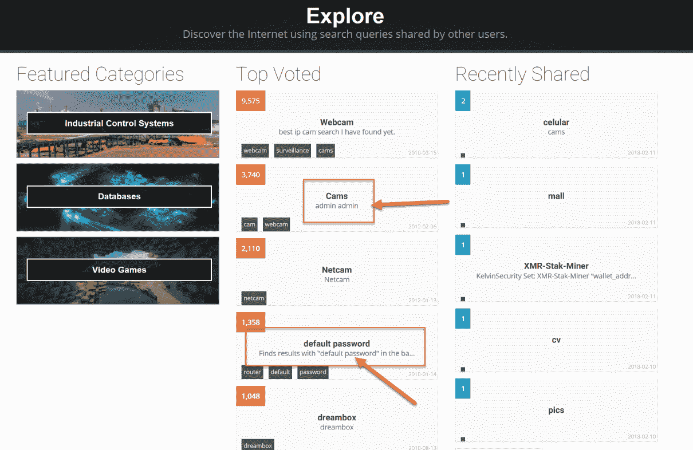

以下是来自其中一个摄像头的图像。出于隐私原因，我不会告诉你是哪一个，但你可以随意找到你自己的。作为一个脚注，一些默认密码不起作用，所以要有耐心:


我确实尽力模糊了图像。

# 默认密码

这是另一个很好的资源。作为一名社会工程师，你对你的目标了解得越多，你成功攻击的机会就越大。这些网站有数以千计的默认用户名和密码，用于许多联网设备、路由器、交换机等。哦，你最后一次更改调制解调器的密码是什么时候？

*   默认密码列表参见[www.defaultpassword.com/](http://www.defaultpassword.com/):

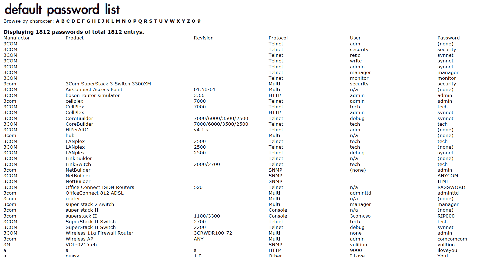

*   参考[https://cirt.net/passwords](https://cirt.net/passwords)了解默认密码:

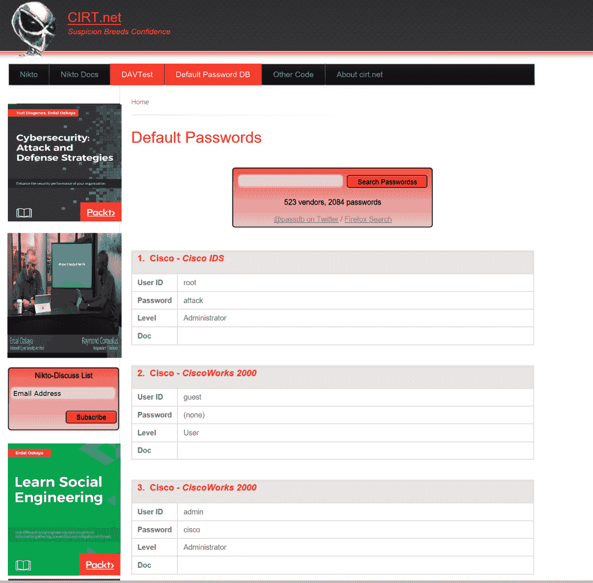

*   参考[http://www.routerpasswords.com/](http://www.routerpasswords.com/)找到密码列表:

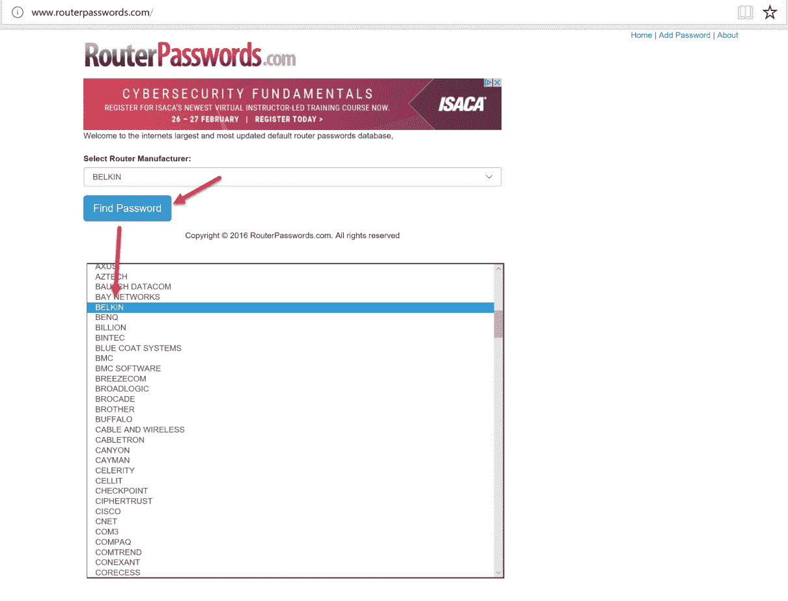If you can't find the exact model of the router you are looking for, try a password from an alternative model from the same manufacturer. Usually, vendors use the same or similar passwords across different models.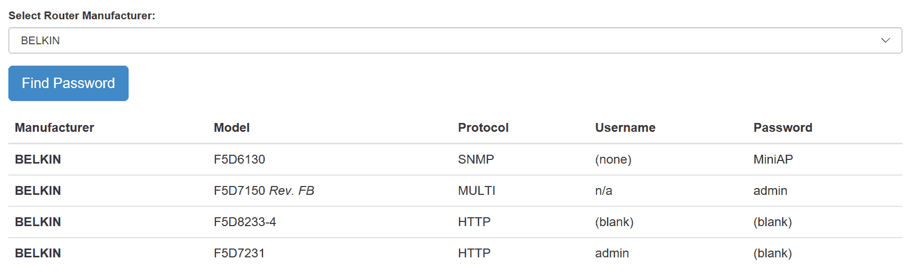# 硬件键盘记录器

硬件键盘记录器是一种能够捕获键盘击键的电子设备。它有不同的格式，可以录制视频，截图，甚至录制语音。

硬件键盘记录器不仅用于社会工程，而且如果攻击者实际接触到您的计算机，如果您不小心周围的环境，这些类型的攻击是最难检测的。由于大多数硬件键盘记录程序不需要系统访问进行安装，与软件键盘记录程序相比，它们是不可检测的。

此外，最近有报道称，一些笔记本电脑制造商安装了内置键盘记录器，一般用户几乎不可能发现。

*Built-in keylogger found in HP laptops...again* at [https://www.techrepublic.com/article/built-in-keylogger-found-in-hp-laptops-again/](https://www.techrepublic.com/article/built-in-keylogger-found-in-hp-laptops-again/).# 免费号码提供商

如前所述，社交工程也可以通过电话完成。这在一些书中被称为语音社会工程。语音社会工程是手动呼叫一个人并试图获得一般信息、财务信息或让他们执行某些操作的过程(请查看*第 11-14 章*、*询问专家(第 1、2、3、4 部分)*部分，在那里您会找到几个语音社会工程及其效果的例子)。

如何在电话中保持匿名？几年前，街上的付费电话亭能帮上忙，*但现在呢？*如果您还记得，我们之前报道过 Google Hacking，在这里您可以使用您的技能找到最好的免费号码提供商。搜索*免费电话*、 *1-800* 即可。

这是你可能会发现有用的许多网站之一。它有许多其他供应商的名单和反馈:[https://www.voip-info.org/wiki/view/Toll+Free](https://www.voip-info.org/wiki/view/Toll+Free):

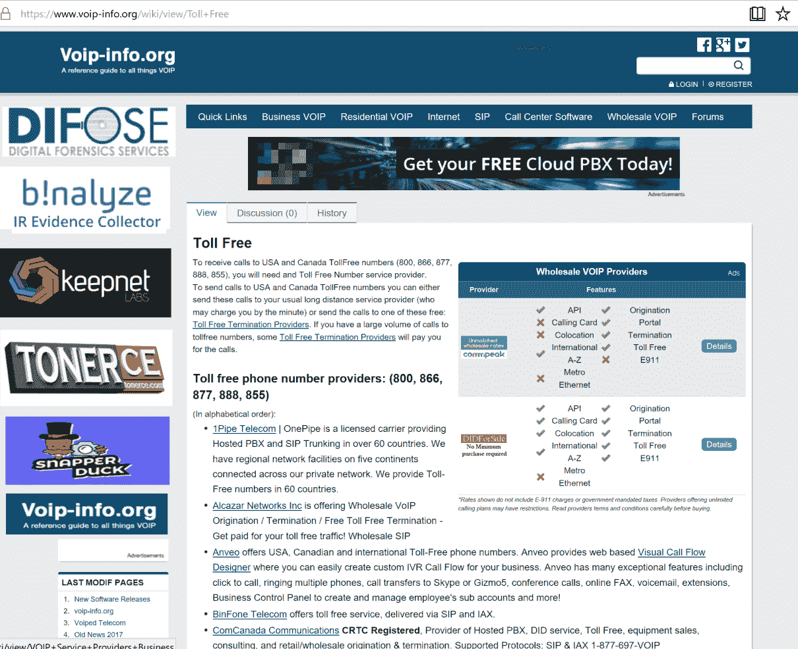# Netcraft 网站

作为社会工程师，你需要尽快找到关于你的目标的信息。Netcraft 网站可以帮助你找到你的目标操作系统是什么。操作系统检测的范围从简单的方法到高度技术性的评估，如抓取横幅或迫使 HTTP 给出错误。

当然，您可以通过发送精心制作的消息来检查 TCP 标志，但是为什么不先尝试更简单的方法呢？更多信息请参考[www.netcraft.com](http://www.netcraft.com):

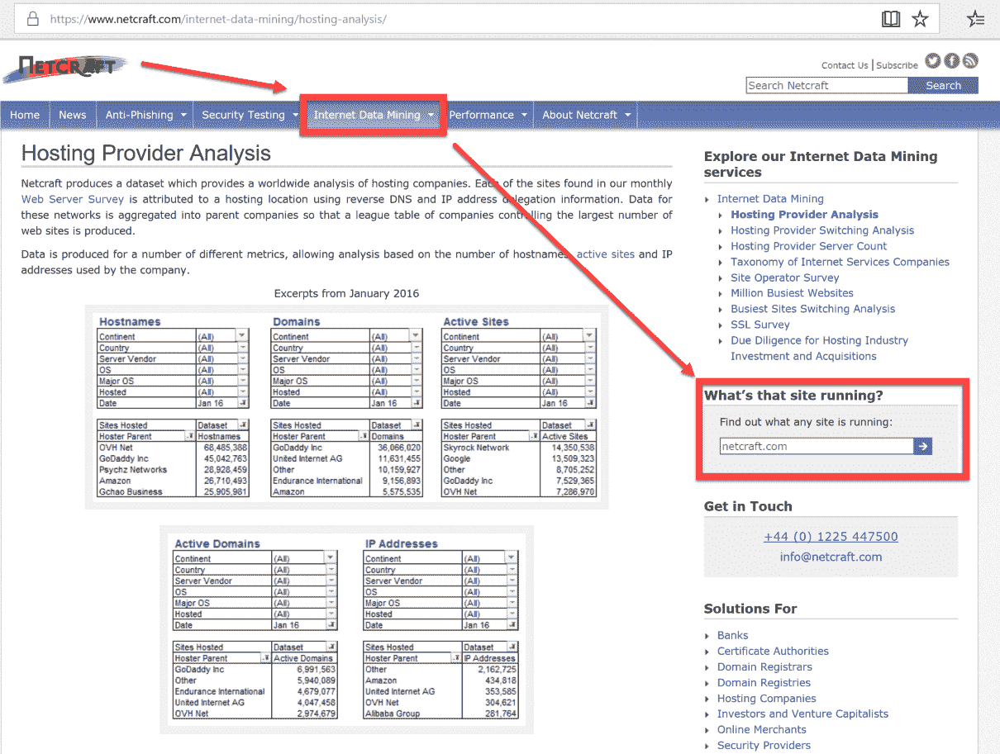

还可以使用 nmap([www.nmap.org](http://www.nmap.org))，这里不详细介绍。但是，以下示例解释了 Nmap 的以下语法:

`Nmap -sS -O -p 80 -v www.example.org`

`-sS`选项将发出 TCP SYN 秘密端口扫描。`-O`选项使用 TCP/IP 指纹来猜测操作系统。`-p 80`选项指定扫描哪个端口(本例中为`(80`)。`-v`代表冗长。然后是目标的 URL(或 IP 地址)。

所以熟悉一下 NetCraft 网站，自己浏览其他选项。

# Netcraft 工具栏

这是我最喜欢和火狐一起使用的工具栏之一。这是一个工具栏，可以保护您免受网络钓鱼攻击，并为您提供网站评级，以了解您正在访问的网站的可信度。除此之外，它将帮助您抵御克隆网站。要下载工具栏，你可以在 Firefox、Google Chrome、Opera 中搜索扩展，或者直接去他们的网站[https://toolbar.netcraft.com](https://toolbar.netcraft.com)/:

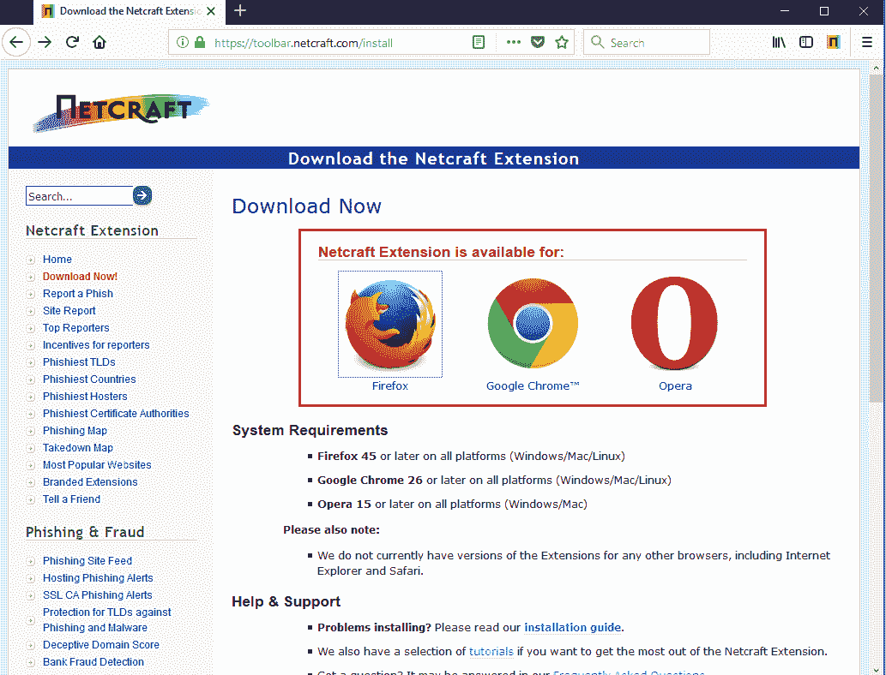

例如，让我们访问我的博客，通过点击右上角的 N 来查看风险评级，如下所示:

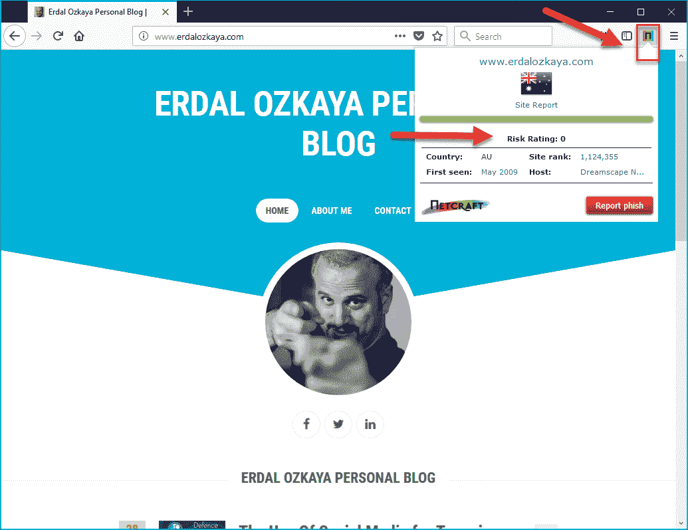

作为优秀的社会工程师，你们也注意到了我的博客从 2009 年开始在澳大利亚托管(从 way back machine 就知道是从 2006 年开始的)。通过点击网站报告，您可以获得您访问的任何网站的完整信息，如下所示。这也是一个收集 WHOIS 信息的伟大的社会工程工具，几乎不费吹灰之力:

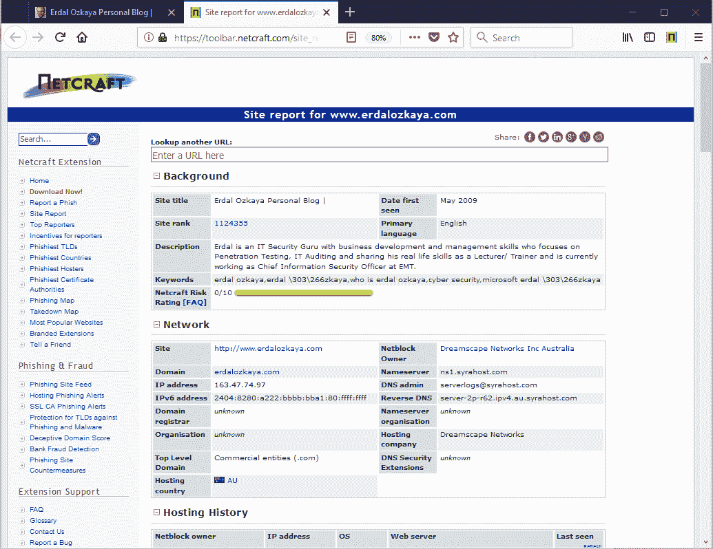

当用户点击托管历史部分时，他们将获得如下截图所示的信息:

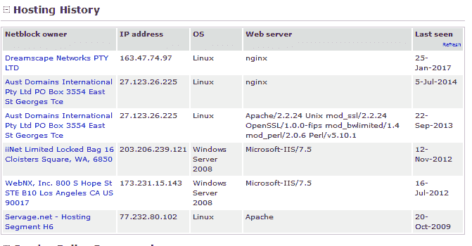# 微软 Edge 智能屏幕

信不信由你，微软 Edge 是市场上最安全的浏览器之一，我真的把它作为我的主要浏览器。话虽如此，我仍然安装了 Firefox/Chrome 的一些插件，让我的生活更轻松，但在安全浏览方面，如网上银行，我坚持使用我的微软 Edge。但是*为什么呢？*

# Windows Defender 应用程序防护

威胁形势瞬息万变，大多数攻击都使用超链接来发起攻击、窃取凭据、安装恶意软件或利用漏洞。如前所述，这些链接大多是通过电子邮件发送的(网络钓鱼攻击)。如下图所示，攻击有不同的变种。黑客通过向一名无辜的员工发送精心制作的电子邮件进入，该员工没有注意到邮件的任何可疑之处，点击链接到一个不受信任的位置，这有助于攻击者通过危及互联网服务建立到网络的连接。

利用这一漏洞，他们窃取密码，然后通过不同的方法在网络中扩张，例如传递哈希:


如果您真的不确定电子邮件的真实性，并且您真的想点击该 URL，或者如果您正在访问一个您不确定是否安全的网站，微软会通过提供诸如 Application Guard 之类的工具，采取系统的方法来阻止这些攻击，以阻止攻击者在本地机器上建立立足点并阻止对公司网络其余部分的访问。

对于我们的上下文，请记住，Application Guard 与 Microsoft Edge 协作，在临时和隔离的 Windows 副本中打开该站点。在这种情况下，即使攻击者的代码成功地利用了浏览器，攻击者也会发现他们的代码在一个干净的环境中运行，没有任何有趣的数据，无法访问任何用户凭据，也无法访问公司网络上的其他端点。攻击完全被打乱了。

一旦用户完成，无论他们是否意识到攻击已经发生，这个临时容器都会被丢弃，所有恶意软件也会随之丢弃。攻击者没有办法在本地机器上继续存在，甚至一个被入侵的浏览器实例也没有立足之地来对公司的网络发动进一步的攻击。删除后，将为将来的浏览会话创建一个全新的容器:


要启用 application guard，您需要一台支持虚拟化的 PC，运行 Windows 10(最低 1607)，然后通过开始 | 控制面板 | 程序 s | 打开或关闭 Windows 功能来启用 Hyper V(如果尚未启用):

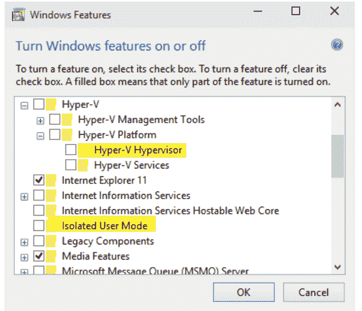

重启到开启或关闭 Windows 功能后，通过勾选复选框启用 Windows Defender 应用防护:

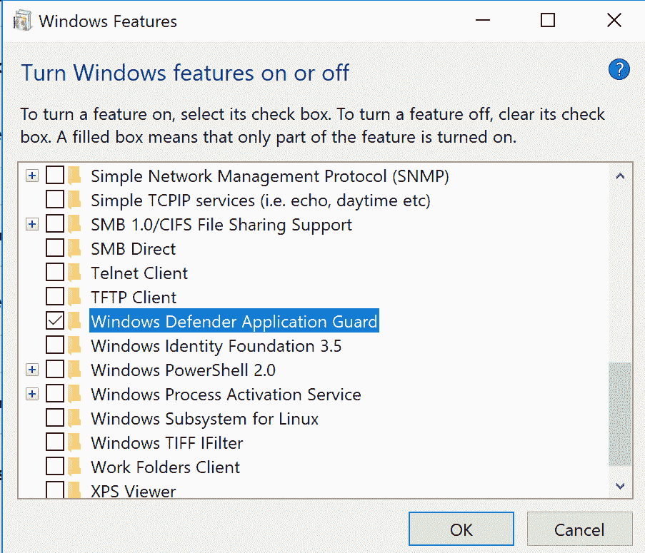

当然，还有其他方法可以做到这一点。您可以在[https://docs . Microsoft . com/en-us/windows/security/threat-protection/device-Guard/deploy-device-Guard-enable-virtual ization-based-security](https://docs.microsoft.com/en-us/windows/security/threat-protection/device-guard/deploy-device-guard-enable-virtualization-based-security)找到有关应用程序防护以及如何启用它的更多信息。

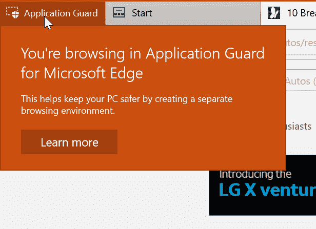# 智能屏幕过滤器

SmartScreen 过滤器是 Microsoft Edge 浏览器中的一项功能，可自动检测网络钓鱼和恶意网站。它还可以防止边缘用户下载甚至安装恶意应用程序:

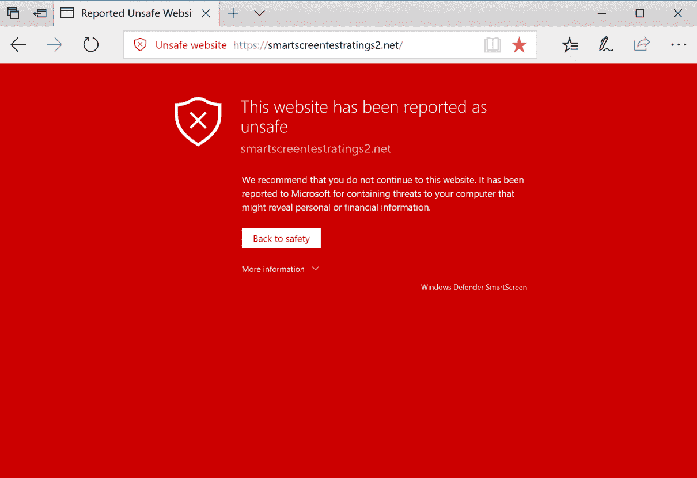

在 Windows 10 中，SmartScreen 已经被集成到操作系统中，所以即使你使用 Mozilla Firefox 或 Google Chrome，你也会受到保护。

# Windows Defender 网络保护

这与 SmartScreen 一样，被集成到操作系统(Windows 10)中，旨在阻止应用程序通过 HTTP 和 HTTPS 访问可疑位置。我强烈建议您启用它。你所要做的就是在管理模式下运行 PowerShell，方法是在搜索框中键入`PowerShell`，右键单击 Windows PowerShell 并选择以管理员身份运行:

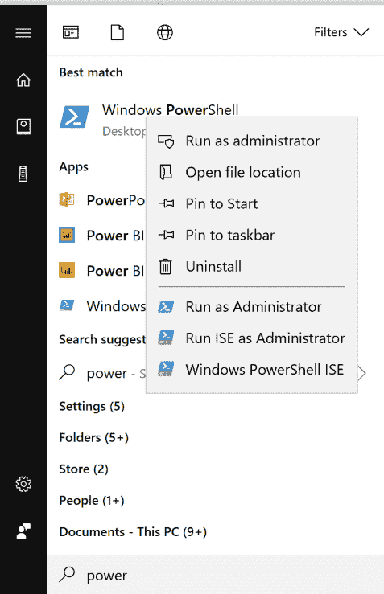

PowerShell 启动后，键入以下命令并按*键进入*:

```
Set-MpPreference -EnableNetworkProtection Enabled
```

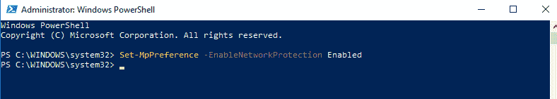

如果没有任何问题，Windows Defender 网络保护就可以运行了，然后您将拥有一个通过*模拟网络钓鱼攻击*的浏览器，如下所示:

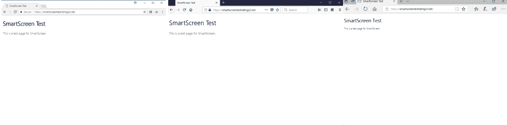# 强烈推荐

我强烈推荐你观看我和我的好朋友雷蒙德·科姆瓦柳斯在一次会议上发表的演讲:

阻止黑客:这些伎俩在 Windows 10 上还管用吗？

在过去几年中，攻击变得更加复杂，曾经是地球上最安全的操作系统现在可以很容易地被黑客攻击。微软 Windows 7 和 8.1 面临的最大威胁是什么，Windows 10 如何解决这些问题？本次会议将展示 Windows 10 将有助于保护哪些开箱即用的产品，以及您可以对其余威胁做些什么。

欲了解更多信息，请访问位于[https://channel9.msdn.com/Events/Ignite](https://channel9.msdn.com/Events/Ignite)的网站。【T2

# 请教专家

请务必阅读*第 11-14 章*，非常仔细地询问专家(第 1、2、3、4 部分)，因为你将从许多专家的角度学习社会工程，并且写一本社会工程书不会阻止我给予活着的社会工程传奇人物*凯文·米特尼克*巨大的荣誉。请务必阅读他的书籍，并访问他在 www.mitnicksecurity.com[的网站](http://www.mitnicksecurity.com):

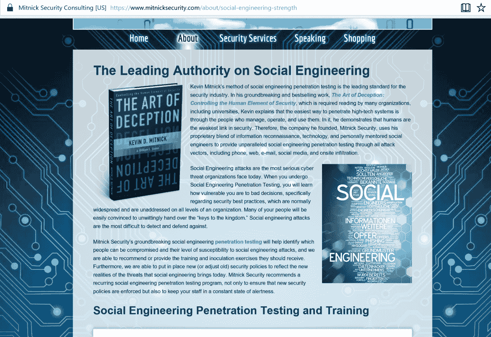# 技巧

*   请务必下载 Kali Linux，并在 https://www.kali.org/尽可能多地学习它
*   在[https://www . Social-engineer . org/Framework/se-tools/computer-based/Social-engineer-toolkit-SET/](https://www.social-engineer.org/framework/se-tools/computer-based/social-engineer-toolkit-set/)掌握社会工程框架(SET)工具
*   正如我们之前所学，社会工程也可以在没有计算机的情况下完成，所以你也必须掌握人类行为
*   切勿在您的任何设备上使用默认的制造商用户名和密码，包括 IOT 设备
*   根据你的技能做对你有用的事情，掌握你的攻击路线，并尽可能使之现实

请记住，社交工程攻击的主要动机是危害特定系统、应用程序或目标用户的工作站。记住建立一个对你的目标用户有意义的故事的重要性，并且有一个符合你目标的逻辑路径。

最后请记住，我们介绍的所有工具都是为了让您了解黑客是如何利用社会工程来危害人类的。你的工作是学习这一切来保护那些无辜的人。

# 摘要

社会工程是艰难的，这就是为什么工具在许多攻击中是重要的。尽管他们没有定义社会工程师，但他们让他或她更接近成功的边缘。拥有先进的工具对社会工程领域的新手来说可能没什么帮助。它有助于一个人掌握我们在前面章节中讨论的所有其他技能和技术，以便用工具来补充它们。这一章广泛讨论了社会工程中一些常用的工具。它经历了攻击中使用的物理工具。它讨论并解释了开锁器、记录设备和 GPS 跟踪器或记录器的使用。对于每一个，它都解释了它们的目的和工作方式。

这一章主要涉及基于软件的工具，因为这是一个信息时代，大多数信息对于那些知道如何寻找的人来说都可以在网上获得。它讨论了一个叫做 Maltego 的工具，可以用来收集关于人和网络的信息。它解释了工具是如何工作的，以及不同的机器可以用于不同的目的。这一章还广泛地研究了一种容易使用的工具，即谷歌。它概述了一些高级操作符，可以用来查找互联网上的敏感信息。已经提供了查找该信息的查询。最后，在软件工具中，本章讨论了社会工程工具包中一些常用的模块。本章最后简要介绍了一些电话工具，这些工具可以用来欺骗信息，并将有价值的信息留在攻击者的指纹上。

这一章深入探讨了几个有价值的工具，可以用来使攻击更加有效和成功。它重点解释了这些工具的用途和工作方式。拥有这些工具却不知道如何使用它们，会使它们变得毫无用处。以谷歌为例，许多人可以访问它，但只有少数人可以使用它进入私人服务器或取出其他人的简历。很多重点都放在了软件工具上，因为这些工具在现代环境中比以往任何时候都更加重要。随着越来越多的信息被个人、黑客、企业和系统合作注入互联网，它们变得越来越有用。下一章将讲述社会工程攻击的真实例子。我们将着眼于不同的案例，并对它们进行剖析，以了解它们失败或成功的方式和原因，以及从每个案例中获得的主要收获。

