# 十一、请教专家——第一部分：特洛伊·亨特

Troy Hunt 是 Microsoft 区域总监和开发人员安全 MVP，ASPInsider 和 Pluralsight 的作者。Troy 从网络的早期就开始为浏览器开发软件，并且拥有将复杂的主题提炼为相关解释的非凡能力。这使 Troy 成为安全行业的思想领袖，并为 Pluralsight 制作了二十多门顶级课程。目前，Troy 大量参与了**我被 pwn 了吗？** ( **HIBP** )，这是一项免费服务，它汇总数据泄露，帮助人们确定恶意网络活动的潜在影响。Troy 定期撰写关于 web 安全的博客，并经常在全球和各种媒体的行业会议上发言，讨论各种技术。Troy 已经出现在许多出版物的文章中，包括*福布斯*、*时代杂志*、 *Mashable* 、 *PCWorld* 、 *ZDNet* 和*雅虎！技术*。除了技术和安全，Troy 还是一个狂热的滑雪板运动员、帆板运动员和网球运动员。

我们生来都是熟练的社会工程师。我不能准确地回忆起我几岁时有多有效，但是我观察过我的孩子们的行动，他们似乎做得相当好。我们从很小的时候就开始学习如何诉诸人类的情感，这样我们就可以使它们屈从于我们的意志；通过按下正确的按钮，我们让人们焦虑、恐惧、同情、贪婪和渴望。最令人惊讶的是，我们从很小的时候就开始这样做，甚至不需要去想它。

但是有些人对它想得很多，事实上，熟练的社会工程师可以把它变成某种艺术形式。我们都可能成为受害者；每次看到广告都会这样。广告行业充满了社会工程:如果你想保持健康/变得富有/和你的伴侣有更好的卧室生活，就买这个产品。信息安全行业是另一个严重依赖于利用促销来操纵那些 it 目标的感受的行业——事实上，那些在昏暗的房间里黑客网站的蒙面强盗往往是在他们卧室里的十几岁的孩子，但现在这并没有产生同样的恐惧感，*不是吗*？

我个人认为加速社会工程发展的驱动因素之一是数据泄露的盛行。在这种情况下，每年都有数十亿条个人数据记录被未经授权的人从系统中窃取。关于我们的姓名、地址、电话号码、出生日期的数据，在某些情况下，甚至包括我们的性取向等个人属性。现在想想这对社会工程意味着什么。

记住我们在这里处理的是什么——社会工程是关于操纵人类，使他们执行一个动作或泄露信息，如果他们没有被欺骗，他们通常不会这样做。考虑一下这些数据泄露，想想对攻击者来说意味着什么，如果他们可以让受害者相信他们确实是那个人的银行，因为他们知道关于他们的某些信息。如果有人打电话说:“嗨，琼斯先生，这是你的银行，你还住在史密斯街 27 号吗？”，这立即给予受害者对社会工程师的真实性更高程度的信心。这种可能性越来越大，因为这些个人信息属性正在到处泄露。

这不仅仅是数据泄露；还有整个**开源情报** ( **OSINT** )空间，它严重依赖于我们自己公开提供的信息。社交媒体就是一个很好的例子；我们故意泄露足够多的信息*,让那些试图冒充我们的人更容易得手，从而对银行、电信公司和其他依赖这些信息进行身份验证的机构进行社会工程改造。我们也做得越来越多——越来越多的人是数字原住民；也就是说，他们从未见过我们不愿意在社交场合分享这类信息的时候。这是新的常态。*

 *最近，我受邀前往 DC 华盛顿州，在美国国会面前就这一问题作证——数据泄露对基于知识的身份认证的影响。在我的证词中，我转述了一个最近的故事，关于我父亲如何试图改变他的宽带计划，包括打电话给电信公司并核实他的身份。他们通过询问他的姓名、电话号码和出生日期做到了这一点。你知道，人们把同样的事情放在他们的社交媒体个人资料上，或者，对于那些不这样做的谨慎的人来说，出于朋友的礼貌，他们分享了他们在生日聚会上所有乐趣的照片。这是一个真正严重的问题，因为它质疑了能够纯粹基于他们知道的事情来证明一个人身份的前提。

问题的一部分在于，我们所打交道的组织并没有让顾客去寻找社会工程的迹象。我最近遇到一件事，我接到一个人打来的电话，他自称来自我有账户的银行。电话铃响了，然后是很长一段时间的沉默，接着是明显的 VOIP 连接和外国口音。打电话的人声称来自我的银行，并说他们只需要先验证我的身份，我可以提供我的出生日期吗:

"当然，但是在我向你提供信息之前，我需要核实你的身份."

“但是，先生，我们是你的银行，你可以信任我们！”

“好吧，你说你是我的银行，但我怎么知道你是？我可以用网站上的电话号码给你打电话吗？”

"不，那不是最好的号码，让我们给你打电话的号码。"

对，真的是这么下去的！我告诉他们我相信这是个骗局，然后挂了电话。我还对接下来几天打电话来的两个人说了同样的话，直到我对此感到非常沮丧，以至于我亲自打电话给银行(通过他们网站上的号码)，报告一起协同的社会工程攻击。我的账户透支了。电话是真的。这次经历让我非常沮丧，于是我向银行投诉，之后他们降低了我的房屋贷款利率，以示善意！真实的故事。

因此，公司本身正在给人们设置行为模式，使他们适应社会工程。请注意，修复也很容易，大约在上述银行情况发生的同时，美国运通公司因我的卡涉嫌欺诈活动给我打了电话。我们和他们跳了同样的舞，要求我验证我自己，我也要求他们这么做，他们的回答是，“当然，把你的卡翻过来，用你看到的号码给我们回电话。”这是一个多么简单的机制啊，不仅他们提前给出了这个想法，而且美国运通的操作员实际上受过处理这种情况的训练。

我曾经跟踪的另一个非常常见的社会工程攻击是 Windows 技术支持骗局。每天，我们都有来自世界各地的人接到来自海外的电话，据称是来自 Windows 支持部门。他们声称受害者的电脑有病毒，但他们不担心，微软在那里帮助他们！然后，骗子会引导受害者完成一系列步骤，通常从打开 Windows 事件查看器开始，并要求受害者查找错误。当然，事件查看器中总会有错误，但这会导致骗子兴奋地大叫，“看——它们是病毒！ *"* 然后，他们让受害者通过免费的远程桌面软件授予他们对机器的远程控制，执行一些修复，然后索要钱财。许多人付了钱。

尽管我讨厌目睹这些骗局，但我总是惊叹于它们展示了如此多的基本社会工程技术:

1.  当受害者被误导相信他们的电脑被感染时，一种紧迫感就产生了
2.  骗子许诺了拯救——他们是来帮忙的！
3.  通过向受害者展示他们自己机器上的错误来建立信任
4.  实现*修复*时，产生了错误的价值感
5.  当微软确认机器已经修好后，受害者感到如释重负

最后，当然，这一切都在货币化达到高潮。想想这一过程中受害者经历的情绪起伏——它真的把人们吓坏了，以至于他们做出了如果没有被操纵的话永远不会做出的行为。而且，事实是，我们都可以很容易地想象我们认识的人被这个骗局所欺骗，因为像*你的电脑有病毒*这样的技术概念超出了他们的理解范围。

这些只是社会工程基本机制的几个例子，随着我们创建更多的数据，向公共领域泄露更多的信息，让更多的人使用更多的连接系统，*攻击人类*变得越来越普遍。最可怕的是任何人都可以做到——毕竟，我们从出生开始就一直在练习！* *# 乔纳森·特鲁尔

作为微软企业网络安全组的高级总监，Jonathan 领导着微软全球首席安全顾问团队，为微软安全产品和服务的开发提供思想领导、策略指导，并与全球客户和合作伙伴深入接触。

在与 Qualys、SANS Institute、网络安全委员会和科罗拉多州的合作中，他率先开发了 Qualys Top 4 控制工具，该工具允许任何人免费评估其 Windows 计算机的安全性。他还与联邦、州和私营部门的合作伙伴合作，组建了科罗拉多州联合网络犯罪特别工作组。这是美国第一个网络犯罪信息共享中心之一，主要关注提高科罗拉多州的网络弹性。

Trull 已经成为一名创新的安全领导者，最近被 SANS Institute 提名为在网络安全领域做出贡献的*人之一*。他担任多家安全初创公司和风险投资公司的顾问，并在 RSA、Black Hat、Gartner、CSO50 和 SANS 等重大安全活动上发表过演讲。特鲁尔是**认证信息系统审计师** ( **CISA** )和**攻击性安全认证专家** ( **OSCP** )。他获得了北德克萨斯大学的硕士学位和丹佛大都会州立大学的学士学位。

在微软，我们已经积累了大量的威胁数据，以帮助我们构建更好的产品，并告知我们的客户最新的威胁。微软每月扫描 4000 亿封电子邮件以查找威胁，分析 4500 亿次身份验证以查找异常，并扫描超过 180 亿个网页以查找恶意软件和其他恶意活动。从这些数据中，我们发现了几个趋势，其中最突出的一个趋势是网络钓鱼和其他社会工程策略仍然是我们的客户面临的头号威胁。随着软件供应商继续在其应用程序中加入更强的保护措施，利用社会工程来访问网络和系统的情况只会越来越多。

不幸的是，与大多数与信息安全相关的事情一样，没有消除这种威胁载体的*灵丹妙药*。然而，公司可以做几件事情来降低他们对这种攻击的易感性。首先也是最重要的是，公司需要培训员工识别社会工程尝试并做出适当的反应。

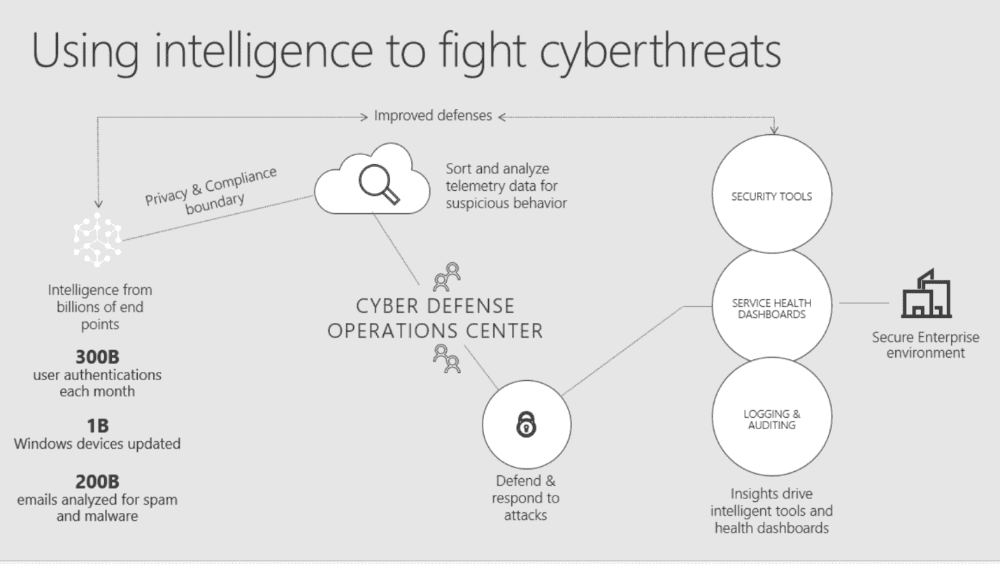# 什么是社会工程？

在微软，我们将社会工程定义为智能操纵人类天生的信任倾向，以获取信息来帮助实现欺诈、网络入侵、工业间谍、身份盗窃或网络/系统破坏。我也喜欢 Bruce Schneider 的定义:*业余黑客系统，专业黑客*。

为了获得人们的信任，社会工程师用不同的策略欺骗受害者，例如:

*   假装自己是重要人物
*   看起来*和你一样*
*   试图说服你分享机密信息

# 远离社会工程攻击

尽管社会工程攻击看起来很可怕，但正如整本书所解释的，如果采取适当的措施，这些攻击的影响可以大大减轻。

以下是可以帮助您减轻社会工程攻击的不同措施。

# 人

*   建立一个有针对性的、有趣的、互动的安全意识计划
*   制作宣传海报，并在公司内部公开，以帮助员工了解公司如何应对社会工程
*   教育员工对常见的网络钓鱼和鱼叉式网络钓鱼方案保持怀疑态度，并了解需要注意什么
*   利用技术的帮助，并使用先进的垃圾邮件过滤，如微软 365 高级威胁防护

*   确保员工做到以下几点:
    *   定期监控他们的在线账户
    *   确保他们只在使用安全协议(如 HTTPS)的网站上进行敏感交易

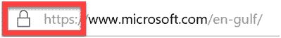

*   确保他们意识到电话钓鱼，并训练他们不要通过电话甚至在公共场所分享个人信息
*   确保他们意识到在社交媒体网站上分享敏感信息的危险

不好的例子:

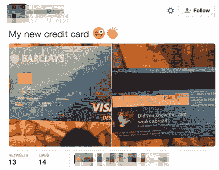

或者通过电子邮件:

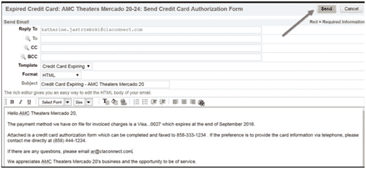

*   小心链接到要求个人信息的 web 表单:

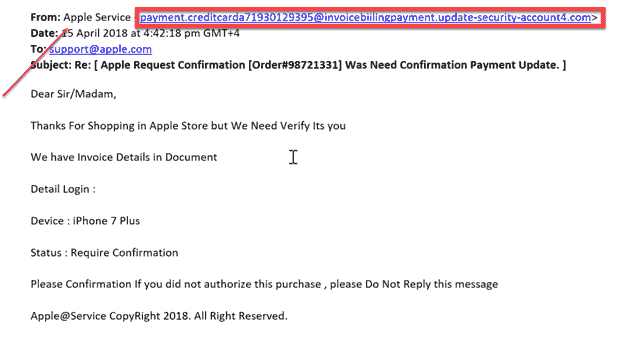

*   确保他们知道浏览器中的弹出式骗局:

*   确保他们限制在社交媒体上分享的信息量。

使用一些模拟，如:[http://pleaserobme.com](http://pleaserobme.com)，用户可以检查他们是否公开分享他们的位置:

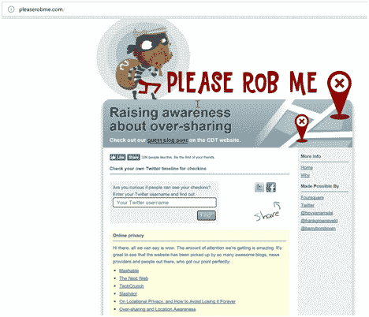

*   确保他们意识到互联网是公开的，并确保他们知道如果有东西在线，即使你删除了它，它也很可能保持在线。请参考以下链接[https://archive.org/](https://archive.org/)

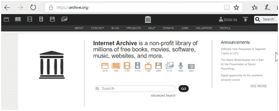

*   就第三方应用程序对他们进行培训，因为他们可以让应用程序连接到他们的社交媒体网站，并且他们可以代表员工发帖
*   教育员工不要:
    *   打开看起来可疑的电子邮件
    *   打开来历不明的电子邮件中的附件
    *   支付赎金

# 过程

*   安排随机渗透测试，其中包括社会工程
*   确定您的关键数据，并确保进行外部评估来验证您的内部测试结果
*   确保管理层了解结果
*   定期进行网络安全评估
*   为高度信任或享有特权的员工建立一个框架和计划。

*   建立最低权限策略，确保员工只能访问他们需要的内容，而不能访问更多内容
*   执行定期备份，并利用微软 Azure 等云技术
*   遵循 ISO 27001 或类似法规来保护您的信息安全管理系统
*   定期进行强化背景筛查

# 技术

*   身份和访问管理，如 Microsoft MIM 或 FIM
*   安全事故和事件管理系统
*   基于非签名的恶意软件技术，如 Windows Defender 高级威胁防护
*   Windows 10 中的应用程序白名单，如应用程序锁或设备防护
*   使用 SIEM 关联您的日志
*   使用信誉良好的防病毒软件
*   使用有效的 IDS/IPS 解决方案，通过特征、行为和社区知识来帮助检测已知的攻击，以及它们设法进入网络的程度
*   让您的软件保持最新
*   使用多因素身份验证

# 制定有效的网络策略

策略这个词起源于罗马帝国，被用来描述军队在战斗中的领导。从军事角度来看，策略是一个顶层计划，旨在实现一个或多个高阶目标。在不确定时期，清晰的策略尤为重要，因为它为那些参与执行策略的人提供了一个框架，以做出成功所需的决策。要建立一个有效的策略，首先必须了解并建议记录以下内容。

# 资源

成功策略最关键的组成部分是合理利用现有资源。你必须清楚自己的年度预算，包括运营和资本支出。您不仅要了解您控制下的供应商和全职员工的数量，还要了解这些资源的能力和弱点。

# 业务驱动因素

最终，您只有有限的资源来实现目标，无法对所有数字资产应用相同级别的保护。为了帮助做出资源分配决策，您必须清楚地了解您负责保护的业务。企业成功的最重要因素是什么？ *哪些业务线产生的收入最多，哪些数字资产与这些业务线相关联？*对于政府而言，哪些服务对居民健康和维持政府运作至关重要，哪些数字资产与这些服务和功能相关联*？*

# 数据

数据是大多数公司的生命线，也经常是网络犯罪分子的目标，无论是为了窃取还是为了赎金而加密。一旦确定了业务驱动因素，您就应该清点对业务线重要的数据。这应该包括记录数据的格式、容量和位置，以及相关的数据管理员。在大型组织中，这可能极具挑战性，但对实体的*皇冠上的宝石*的存储和处理有一个清晰的了解是必不可少的。

# 控制

在制定策略之前，您必须了解环境中已部署的保护措施或对策的状态，以最大限度地降低数字资产面临的安全风险。这将包括最大限度地降低资产的机密性、完整性或可用性风险的控制措施。在确定控制措施的充分性时，评估其设计和操作有效性。控制覆盖所有资产还是子集？控制是否能有效地将风险降低到可接受的水平，或者剩余风险是否仍然很高？例如，在最大限度地降低数据机密性风险方面，一种被认为有效的控制措施是在授权访问敏感记录之前要求第二个身份验证因素。如果实现了这种控制，*有多少比例的用户在访问公司最敏感的数据之前需要第二个身份认证因素？* *作为网络钓鱼测试的结果，用户承认第二个错误因素的可能性有多大？*

# 威胁

确定组织面临的威胁是制定网络策略中较为困难的任务之一，因为网络威胁往往是不对称的，并且不断演变。尽管如此，确定最有可能的威胁参与者，以及实现其目标所使用的动机、策略、技术和程序仍然很重要。

一旦你对前面讨论的项目有了清晰的了解，你就可以开始制定一个适合手头任务的策略。由于每个组织都是独一无二的，因此不存在放之四海而皆准的方法，但是有一些模型和框架随着时间的推移被证明是有用的，包括由国家标准和技术研究所、网络杀伤链、互联网安全中心、SANS 和澳大利亚信号局等开发的模型和框架。有效的策略还必须考虑人和组织的动态。例如，员工通常会围绕控制来*工作，这种控制增加了执行给定任务的实际或感知努力量，尤其是当他们觉得努力与正在解决的威胁不相称时。*

在微软，我们不断评估客户当前面临的威胁，并构建产品和服务来帮助安全管理人员执行他们的策略。我们产品的设计不仅考虑了网络攻击者使用的技术，还融入了解决企业内人员动态的功能，以及安全团队面临的人员和保留挑战。这些设计原则在实践中的一些例子包括在我们的生产力工具中构建安全特性和功能，如 Office 365 高级威胁保护，使用自动分类通过 Azure 信息保护减少最终用户的工作负载，以及通过 Windows Defender 高级威胁保护提高安全团队的效率和效力。

# 马库斯·默里和哈桑·阿尔沙卡蒂

Marcus Murray 是 Truesec 的网络安全经理，也是微软企业安全 MVP。他的团队为各种客户执行安全评估、事件响应和安全实现，包括银行、军事组织、政府机构和其他大公司。

他目前专注于民族国家网络战和网络防御。Murray 经常谈到安全威胁、漏洞、意识以及如何实现现实世界的对策。几年来，他一直是 TechEd North America 和 Teched Europe 的头号演讲者，也是 RSA Europe 和 IT Forum Europe 等活动的顶级演讲者。他是 Truesec 安全团队的成员，该团队是一个独立的精英团队，由在世界各地运营的安全顾问组成。

Hasain Alshakarti 是一位公认的安全专家和计算机行业发言人。他在世界各地的会议上发表过演讲。除了在过去的 23 年里成为一名非常受欢迎的讲师之外，Hasain 还特别关注安全评估、网络安全、PKI，以及帮助客户理解和实现安全措施。Hasain 拥有开发人员的背景，他与开发人员密切合作，帮助他们了解安全需求，并在应用程序和系统中实现这些需求，同时又不损失功能和可用性。他是 TrueSec 安全团队的成员，也是企业安全领域最有价值专业人士 ( **MVP** )奖的获得者 e 微软 **。**

在本节中，我和 Truesec 专家团队的 Hasain Alshakarti、Marcus Murray 将分享我们在红队背景下的社会工程方面 20 + 20 年的经验。

如果您不熟悉 red teaming，请将其视为对组织的全面、有针对性的网络攻击，目的是完全危及 it 环境，包括高价值目标。

在这些项目中，我们通常会衡量一个组织可以承受的攻击类型、破坏这些攻击所需的复杂程度，以及组织检测和响应威胁参与者活动的能力。

在 red teaming 中，社会工程是用来成功危及目标环境的许多关键组件之一。解释社会工程在红队中的应用的最简单的方法是通过下面的例子。

红队将尝试突破下图左侧的每个通道，以访问内部 IT 网络。从该访问开始，将执行各种活动，以便获得对整个基础架构的控制，并最终连接到高价值目标:

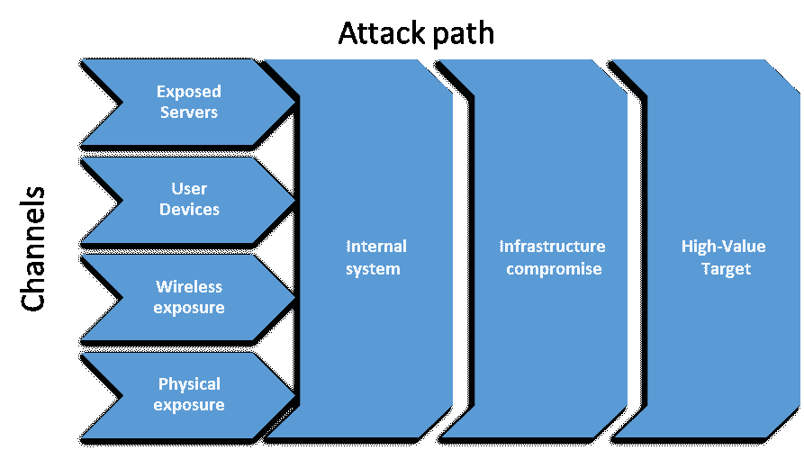

社会工程可以用在过程的各个部分，但是在过程中使用它的最典型的部分是物理暴露和用户设备。在物理暴露场景中，目标通常是通过在目标建筑物的物理边界内植入设备来访问网络。这样，it 可以创建一个到目标环境的空中通道，而无需穿越外围网络中的安全组件(IDS、IPS、防火墙、代理等)。

在用户-设备场景中，攻击者通常试图欺骗用户打开电子邮件或类似内容，让他们以某种方式执行代码，以便攻击者可以远程控制用户的工作站。

在本节中，我们将通过分享一些我们从以前的红队任务中获得的真实经验来关注这一点。作为本次讨论的基础，我们将带您经历一个简单的场景。

# 示例场景–工作站数据收集工作

一年前，我们的团队为一家大型国防承包商管理一个红色团队。经过初步调查，我们了解到他们将工作站支持外包给了外部服务提供商。经过一些初步的头脑风暴后，我们决定发起一次攻击，伪装成服务提供商的技术支持人员，诱骗目标组织的用户下载代码并在他/她自己的工作站上执行。

这种类型的攻击已经存在了 20 多年，我们想知道它是否仍然有可能。

这个想法是向选定的用户发送一封电子邮件，假装是支持组织的服务技术人员。在电子邮件中，我们解释说已经执行了一次重要的工作站清点，但是该特定用户的工作站缺少预期的结果。

这样设置的原因是我们已经有了一些关于用户的基本信息，包括他们相应的工作站名称。我们想利用这些知识来建立信任。

# 步骤 1–准备攻击

在这次攻击中，我们需要以下内容:

*   **发送邮件的一个域**:正常情况下，当我们要发送邮件，冒充一个组织，我们会先调查是否可以使用他们的真实邮箱域。这通常可以通过找到接受中继的错误配置的电子邮件服务器或危及电子邮件登录来完成。在这种情况下，服务提供商被排除在范围之外，因此我们必须注册一个类似于服务提供商的 DNS 域。

*   **一个网站来托管** **中的** **库存** **工具** : 在这种情况下，我们使用一个简单的 web 页面托管在 Azure 中，并在我们注册的域中发布。我们还设计了一个简单的网页来托管*库存工具*。该页面被赋予了与服务提供商相同的图形配置文件和徽标。
*   **发送者身份**:考虑到这个大型目标组织和服务提供商的规模，我们假设用户不知道服务人员的名字。因此，我们创建了一个虚构人物的 LinkedIn 个人资料，我们还购买了一张 sim 卡，并在他的名字和支持组织的名称中注册了电话号码。这有点滑稽，但我们了解到，如果人们想在职业生活中验证某人的身份，他们经常使用 LinkedIn，而不是联系真正的公司。

# 步骤 2–发动攻击

下一步是开始设置真正的攻击工具。我们的第一步是创建要下载的代码，为远程控制定义一个通信通道，并配置一个命令控制服务器。

我们已经知道目标环境在防火墙和 IDS 上投入了大量资金，所以通信必须非常隐蔽。我们还知道他们没有使用 AppLocker 或类似的技术来阻止未知二进制文件的执行，因为他们相信边界可以阻止任何恶意软件，所以我们决定使用一个`.exe`文件作为发布的*库存工具*。

我们编写了一个工具，它看起来实际上是一个工作站清单，包括可视化元素，如服务组织徽标、进度条、成功启动屏幕等等。在该工具中，我们还创建了一个看似上传结果的通信通道，但实际上，它允许对目标工作站进行远程控制。在对他们使用的 IDS 模型以及如何在不触发它的情况下传输数据做了一些研究之后，我们了解到它被配置为出于性能原因而忽略`.jpg`文件。基于这种认识，我们实现了一个定制的远程控制协议，该协议使用`.jpg`图像文件通过 HTTP 协议在目标和命令与控制服务器之间传输数据。我们还使用了一种称为域名转发的技术，使其看起来像是要将通信发送到一个具有良好声誉的已知域名。我们的假设是这将绕过 IDS 的安全性。由于自定义协议，我们还编写了一个自定义 CC 服务器。它具有运行 DOS 和 PowerShell 命令、获取基本系统信息、方便工具和数据过滤的上传和下载的基本功能:

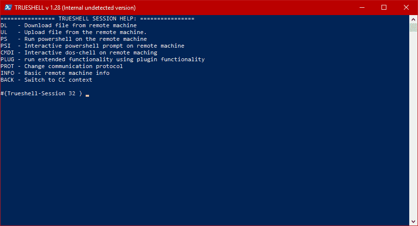# 步骤 3–选择目标

在研究了目标的主要网站 LinkedIn 和其他一些网站后，我们决定锁定四个人。在这一点上，典型的选择过程是寻找我们知道不太懂技术的人。从我们的个人经验来看，我们喜欢选择那些习惯于主动而不询问主管的管理人员。我们也喜欢瞄准创造性的角色，比如营销人员。他们通常很好奇，因此*很快点击*。

# 步骤 4-发起攻击

从技术上讲，发动攻击并不复杂。最重要的部分是创建一个 100%可信和现实的信息，并明确呼吁采取行动。

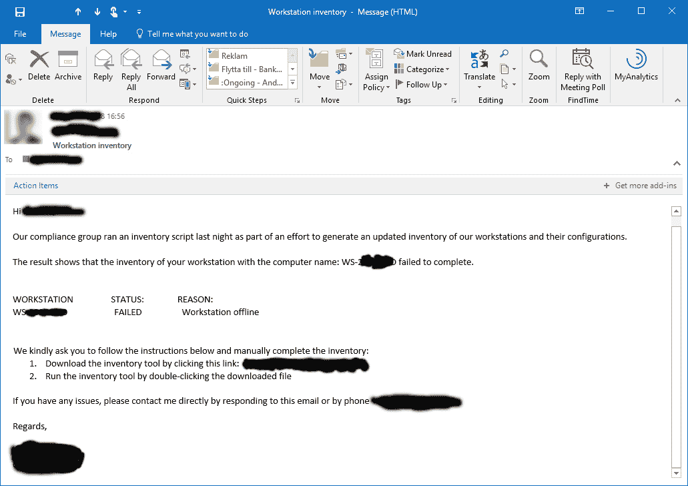

另一个要考虑的是时机。根据我们的经验，当人们在工作周结束时注意力不太集中时，我们发送电子邮件是最成功的。如果成功，我们也有机会在 it 员工人数通常大幅减少的周末开始运营。

在这个特定的场景中，我们在周五午饭后发送了第一封电子邮件。当我们后来意识到收件人没有下载该工具时，我们通过电话联系了他。

通过伪装成发送电子邮件的支持技术人员，我们善意地要求用户按照电子邮件中的说明进行操作。我们告诉他，我们有一个截止日期，真的需要在周末之前完成库存。

# 第 5 步–结果

挂断电话两分钟后，我们注意到该工具已经通过电子邮件中的链接下载了。又过了一分钟，我们收到了一个来自现已受损工作站的连接。

只是为了衡量目标员工的认知度，我们又发动了三次攻击。在总共发出的四封电子邮件中，我们设法攻破了三个工作站。

# 本例的要点

*   很难区分合法和非法的电子邮件。
*   经典攻击在今天仍然有效！在 Truesec，我们用最新的研究做了很多花哨的攻击；然而，大多数组织仍然容易受到简单下载链接和说明的攻击。
*   有时，一个组合可以非常有效；比如邮件和电话。
*   充分的准备增加了成功的机会。例如，如果我们不知道 IDS 配置，我们可能无法建立成功的通信通道。
*   反病毒软件或 IDS 通常检测不到定制的恶意软件。

在更高级的攻击中，我们使用无文件恶意软件、零日漏洞和混淆来源，如域前置、域融合等。

此外，今天，基于宏的攻击是最常用的攻击，但是，它们几乎出现在每篇关于客户端利用和网络钓鱼的文章中。

# 物理暴露

我们在每个红队做的另一件事是评估在目标组织的网络中安装物理设备的可能性。

典型的设备可以是具有移动宽带、无线、以太网端口等功能的 Raspberry Pi:

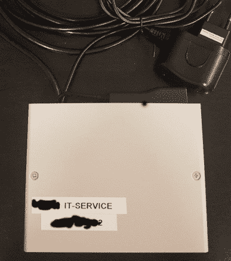The device will be configured to act as a network bridge, and as soon as it is connected we have the possibility to access the internal network.

减少未授权设备连接的常见安全实现是 802.1X。因此，我们总是将设备安装在网络端口和一些已经连接的设备之间。大多数时候，我们更喜欢寻找可能有例外或放宽安全要求的打印机或其他设备。

我们通常做的另一件事是最初在网络上产生最小的足迹。在我们第一次在网络上活跃起来之前，我们可以在被动模式下坐上几天并监听流量。当我们激活时，我们将使用与我们桥接的机器相同的 IP 和 MAC 地址。

我们默认的指挥和控制通信渠道是移动宽带连接，这是为了避免周边检测。

# 物理攻击

多年来，我们已经进行了数百次不同的社会工程攻击，目的是进入物理位置。这个列表可能很长，但是我们会给你一个有趣的例子来说明一个典型的作业。

在这个例子中，我们在一个政府机构的安全亭内安装了一个设备。该设施戒备森严，你需要穿过一个陷阱才能进入真正的建筑。我们已经做了假徽章，我们知道它们看起来和真的一模一样，但是，当然，它们没有有效的芯片和证书让我们通过陷阱。

我们的想法是接近警卫，告诉他我们正在测试设施中的网络插座，我们需要测试展位内地板上的插座。我们中的一个穿着西装摆出经理的样子，另一个穿着古怪的毛衣，看起来更像一个典型的 it 人员。

假扮成这些角色，我们解释了即将到来的活动的目的，警卫毫不犹豫地让我们进入展位。再说一次，我们俩都戴着看起来合法的徽章。那个打扮成 IT 人员的家伙把设备安装在他的脚旁边，我们一做完就感谢保安的帮助，离开了大楼。

该设备用于完成整个红队活动，导致整个基础架构受损，包括域、虚拟化平台、网络管理系统、系统管理平台和存储。最后，它被用来危害大型机和其他高价值的目标。该设备从未被发现，六周后，当项目完成时，我们自己去拿。

我们希望你喜欢这些日常生活中的简单例子。如果您对 Truesec red 团队或我们的专业知识感兴趣，请随时联系我们。

Truesec 的 Marcus Murray 和 Hasain Alshakarti。

# 艾米尔·廷 aztepe

Emre Tinaztepe 是一名网络安全专家，已经在信息安全领域工作了 10 多年。他专门从事逆向工程、恶意软件分析、驱动程序开发和软件工程。Emre 是 Binalyze LLC([www.binalyze.com](https://nam03.safelinks.protection.outlook.com/?url=http%3A%2F%2Fwww.binalyze.com&data=02%7C01%7C%7C1b3c9688e07d42f6328f08d5618f0a6b%7C84df9e7fe9f640afb435aaaaaaaaaaaa%7C1%7C0%7C636522189335092851&sdata=CSKaiFcIzZMLP2p31PL%2BQ5k%2FM9Zu4MDk9vjNjYK2%2FSU%3D&reserved=0))的创始人，该公司开发下一代事故响应解决方案。此前，他在 Zemana Information Technologies 担任开发总监，Zemana Information Technologies 是一家全球安全公司，为全球数百万客户提供服务。他天生是一个敏锐的学习者和团队领导者。

社会工程可以被认为是最先进的攻击的第一步。这是因为大多数组织仍然投资于硬件和软件，而不是投资于人，但事实是，没有受过教育的人员，所有的硬件和软件投资都是无用的。

在我的训练中，当争论这个问题时，我通常会显示以下图像。这是一个自称帕兹的人用来偷帕丽斯·希尔顿价值 3200 美元的生日蛋糕的红色腕带。尽管生日派对在白宫有十几名保安保护，但帕兹还是带着这个腕带、面带微笑地通过了保安:

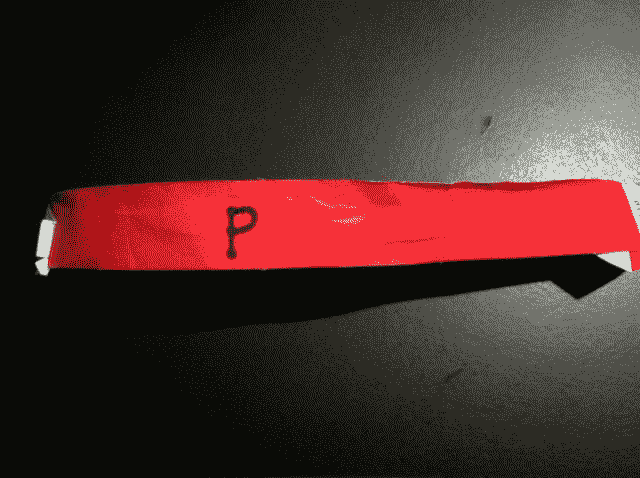Wrist band used for stealing the birthday cake of Paris Hilton

我在我提供建议的几乎每一个事件响应案例中都看到了这种场景，这就是我所说的*利用人类*。一旦你利用了人类，剩下的就容易了。想象一下，有人敲你的门，告诉你他是警察，试图说服你开门。如果你不为窃贼开门，你仍然控制着你的房子，但是，一旦门被打开，接下来会发生什么就由窃贼决定了。

即使在这个类比中，解决方案也很简单——确保你向你信任的人敞开大门。我用了信任这个词，而不是知道，因为即使你认识的人也可能被利用来进入你的房子(你的网络)。

但是你会怎么做呢？这就是我想在“向专家提问”部分详细阐述的内容。

在列出预防和缓解技术之前，我们应该首先了解我们针对的攻击类型。作为一名恶意软件分析师、软件开发人员和事故响应人员，我有机会参与各种网络攻击。如果我要列出这些攻击类型，它们可以分为五个最相关的类别。

# 广告不当

恶意广告是网络犯罪分子用来欺骗无辜用户在他们的桌面或移动设备上安装恶意软件的一种攻击形式。网络和移动广告的数量在短短一年内增长了 200%以上，坏消息是 20%的网络和移动广告将用户引向恶意内容。这是由于*广告网络*数量的增加，这些广告网络为网络罪犯提供了一种赚钱的方式，只需在他们的软件中加入一个简单的软件库。常见的情况是，移动应用程序中嵌入了多个广告网络，同时还有一个后门，便于网络犯罪分子改变未来的盈利方式。

通过诱骗用户安装应用程序，攻击者可以向用户的设备添加他/她想要的任何东西。这种攻击类型在过去几年已经成为一种成熟的业务。

这种活动的一个最好的例子是 TDL4(木马下载器)bootkit。它于 2011 年发布，是 TDL3 的继任者。到 2011 年底，这个 bootkit 已经感染了全球 450 万台机器。恶意广告网络 GangstaBucks 为每安装 1000 个这种恶意软件支付 20 到 200 美元。这个 bootkit 被网络罪犯用来向受害者的电脑推送广告软件，操纵搜索引擎结果，并向他们的付费客户提供匿名互联网访问。关于这种恶意软件的一个有趣的事实是，它甚至有自己的杀毒软件来清除受感染机器上的其他恶意软件家族。这是因为该僵尸网络的所有者试图最大限度地减少网络犯罪竞争，这证明了网络犯罪分子对这一行业的重视:

****An example pay-per-install network

另一个是 GG Tracker 恶意软件家族，针对 Android 用户。和所有的恶意广告活动一样，这个广告通过将用户重定向到一个看起来合法的 Android Market 克隆网站来欺骗用户。只要用户点击安装按钮，它就会下载一个成人应用程序和一个假的电池优化器。一旦用户安装了这些应用程序，他们就订阅了网络罪犯拥有的优质服务。

# 预防

只要注意以下规则，就可以防止广告不当:

*   不要下载来源不明的软件
*   确保你正在从原始的生产者/开发者那里下载应用程序

# 流氓/假冒应用程序

假冒的应用程序可以被认为是合法软件的翻版。网络犯罪分子正在投入大量的时间和资源来复制流行的软件应用程序，并将它们上传到带有免费标签的下载网站或移动市场。

这种攻击的一个例子是所谓的**假 AV** ，它有许多针对 Windows 用户的变种。这种类型的恶意软件与恐吓软件策略相结合，被网络犯罪分子用来劝说用户通过支付金钱来*升级*软件。它们还被用来进一步用其他类型的恶意软件感染机器。正如你在下面的截图中看到的，它看起来像真正的防病毒软件，这就是他们如何说服很多用户付费从他们的 PC 上清除一个不存在的感染。他们中的一些人甚至将勒索软件下载到受感染的机器中，迫使用户支付赎金以恢复加密文件:

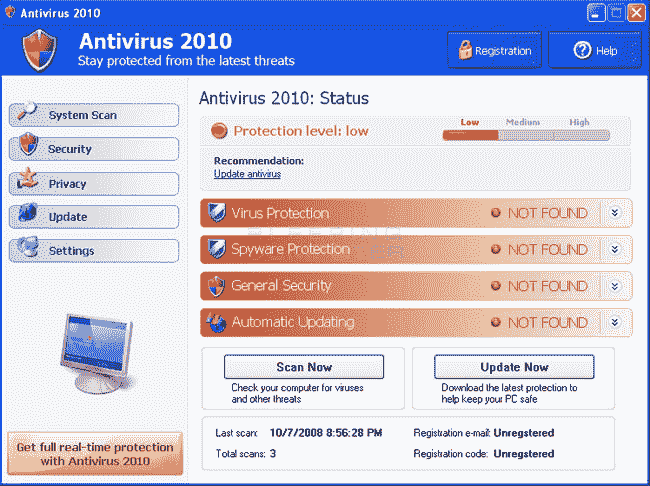An example fake antivirus product

另一个至今仍受欢迎的是**假闪存更新器**，它通过欺骗用户在浏览网页时点击安装按钮来工作。网络罪犯大多使用在线视频网站，在允许用户播放视频内容之前，他们会将用户引导到一个页面，该页面在浏览器中显示一个特制的虚假 Flash 更新弹出窗口。试图播放视频的无辜用户通常点击按钮，然后在他们的 PC 上安装恶意应用程序，这通常是加密文件并索要赎金的 CryptoLocker 变种:

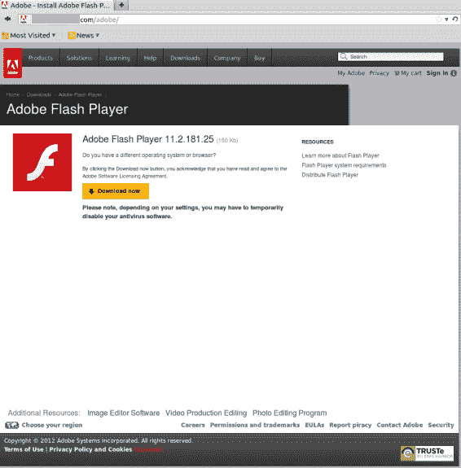An example website with a fake Adobe Flash update warning# 预防

*   就像任何其他攻击类型一样，注意你下载并安装到你的 PC/移动设备上的内容可以拯救你
*   对于启用了用户帐户控制的 Windows 电脑，请始终检查您将要执行的产品的数字证书名称
*   对于移动设备，请确保只允许来自可信来源的安装

# 带有恶意负载的文档

恶意文档是另一种广泛使用的攻击类型，主要由社会工程技术发起。在操作系统和流行的软件解决方案加强了对漏洞的防范后，这种攻击类型在过去几年中变得越来越流行。说实话，在 Office 文档中运行宏，或使用 PDF 的 JavaScript 比试图利用受害者 PC 上的软件更容易。这是因为这种功能被直接嵌入到文档查看套件中，以提高工作效率，例如让用户有机会创建公式或增加文档的交互性。与所有其他攻击类型一样，这种能力被网络犯罪分子滥用，在受害者的系统上运行恶意负载并获取敏感信息。

例如，恶意文档仍然是 CryptoLocker 攻击的头号感染媒介。结合社会工程技巧，这种攻击类型可以成为一个强大的武器，将攻击者想要的任何东西放入受害者的 PC。尽管在最近版本的文档查看器中默认情况下禁用宏执行，但通过使用社会工程，网络犯罪分子仍能成功诱骗用户启用宏执行，如下图所示:

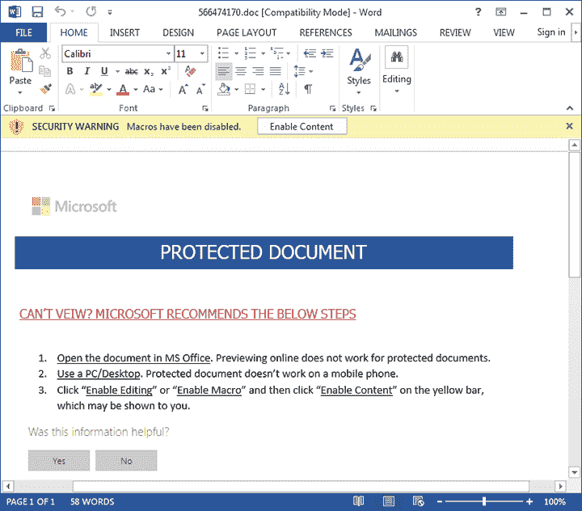An example malicious document tricking the user into enabling macros

除了宏执行，我们最近开始看到一种不同的方法，它允许攻击者在受害者的 PC 上运行恶意代码。这种攻击利用了微软在 Office 套件中的动态数据交换功能。尽管这项技术最早是在 20 世纪 90 年代发现的，但在安全供应商和操作系统开始禁止在用户机器上执行宏之后，这项技术开始流行起来。尽管这种攻击类型需要多个用户交互来执行恶意负载，但大多数用户甚至不会阅读操作系统要求的内容，而只是单击 Yes 按钮，这使得攻击者可以将他想要的任何内容下载到用户的机器上。

# 预防

*   在没有确定来源之前，不要打开未知/令人惊讶的文档
*   即使文档包含启用宏执行的说明，也不要启用宏执行
*   在接受弹出对话框并点击是之前，请仔细阅读弹出对话框

# 公共 Wi-Fi 热点

当我们需要上网时，大多数人甚至会毫不犹豫地连接到免费的 Wi-Fi 热点。在咖啡店、酒店或机场连接到 Wi-Fi 网络就像在公共场所让您的计算机/移动设备处于打开和解锁状态。通过使用类似的 SSID，很容易欺骗 Wi-Fi 用户连接到流氓热点。即使它是您最初请求的合法 Wi-Fi，您也不知道还有谁连接到该网络。我们已经看到了克隆合法热点的 MAC 地址的高级攻击。流氓热点使网络罪犯能够窃听网络流量，其中大多包括敏感信息，如帐户凭据。他们甚至可以将您的网络浏览器重定向到恶意浏览器，将恶意软件下载到您的设备上。

# 预防

为了抵御这些类型的攻击，这里有一些基本的提示:

*   避免连接到公共 Wi-Fi 热点
*   如果你不得不使用一个，总是使用 HTTPS 网站来保护你的私人信息免受网络窃听
*   使用**虚拟专用网** ( **VPN** )来保护你的连接

# 网络钓鱼/鱼叉式网络钓鱼

网络钓鱼是一种企图获取敏感信息(如用户名、密码和信用卡详细信息)的行为，通常是出于恶意目的，通过在电子通信中将自己伪装成值得信任的实体来实现。尽管大多数人都知道这种类型的攻击，并且他们已经知道他们不应该打开来自不可信来源的电子邮件或点击链接，但事实是，在大多数攻击中，网络犯罪分子伪装成你已经认识/信任的人。这是因为，在网络钓鱼攻击之前，他们会收集有关目标的情报，例如他/她喜欢什么，他/她与谁通过电子邮件交流最多，等等。

下面是我的一个测试，我创建了一封钓鱼邮件，看起来好像是我(公司里一个值得信任的人)共享的。我选择了这个标题`Organization Scheme`,因为它会说服公司里的每一个人去读它:

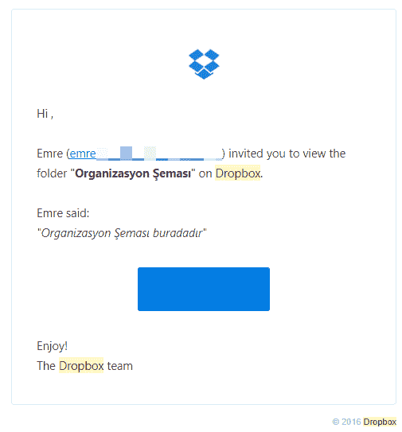An example phishing email for stealing Dropbox user credentials

信不信由你，即使是公司里最有经验的人也点击了链接，提供了他们的 Dropbox 凭据，这些凭据直接通过电子邮件发送给了我(本例中的攻击者)。20 个人中只有一个人联系了我，但不幸的是，他是来问文档有什么问题，因为他无法查看文档！

这正是我意识到网络钓鱼攻击有多么有效的时候。如果我能用 30 分钟内创建的一封有趣的电子邮件欺骗我自己的员工，那么一个老练的攻击者会怎么做呢？

这项测试如此成功的原因不是因为人们点击了我发送的电子邮件中的链接，而是因为他们点击链接后被定向到的网站地址。我使用的地址是`http://www.dropbox.ssl.login.authentication.identify_ctx_recover_lwv110123_securefreemium.ebilgilendirme.net`，这足以让他们相信这是合法的 Dropbox 网站，因为他们只注意了它的第一部分，而不是完整的地址。如果攻击者使用这种地址，下面是您将在地址栏和任务栏中看到的屏幕截图:

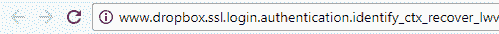Taskbar and address bar examples in a phishing attack

因此，任何人看到地址栏或任务栏都会立即认为这是合法的 Dropbox 网站，但是，对于一个有经验的用户来说，这只是一个随机网站的子域，可以在几分钟内创建。

总而言之，网络安全就是教育用户了解网络罪犯使用的伎俩和攻击类型。教育用户比投资软件或硬件解决方案重要得多。

最后一点，下面是我的保持网络安全的快速列表:

1.  始终使用现代的操作系统和软件。过时的系统容易被利用。
2.  使用最新的安全软件，包括防病毒、防漏洞、防网络钓鱼和内容控制功能，以防止已知的不良内容。这将保护您免受大多数攻击，但不要忘记，安全软件只是一层，而不是解决方案。
3.  不要打开可疑的电子邮件。
4.  始终检查电子邮件中可点击内容的目标地址，并确保目标网站为您所知。
5.  在提供您的个人信息之前，请始终在网站上检查 SSL 指示器。

6.  使用 VPN 来防止网络罪犯窃听您的网络流量。
7.  在您的环境中禁用宏执行，不要单击启用宏按钮，即使您正在查看的文档要求这样做。
8.  接受弹出对话框或警告之前，请仔细阅读。

# 米拉德·阿斯兰

Milad Aslaner 是一名专注于任务的安全专家，在产品工程、产品管理以及网络安全、数据隐私和企业移动性的商业宣传方面拥有超过 11 年的国际经验。他是全球会议的获奖演讲者和技术专家，如 Microsoft Ignite、Microsoft Tech Summit 和 Microsoft Build。凭借他的背景，Milad Aslaner 定期向财富 500 强公司、政府机构、记者和分析师提供最新网络安全趋势的建议，帮助他们为网络犯罪事件和网络恐怖主义做好准备，并让他们为安全的数字化转型做好准备。

作为一名安全专家，我经常在网络攻击之前、期间和之后向客户提供建议。对我来说，首要任务是赢得客户的信任。因此，虽然我将分享网络攻击技术的真实例子，但我将改变所有可以用来识别目标客户的指标。我分享这些真实世界的场景不是为了吓唬人，而是为了通过关注社会工程不断上升的风险来增强网络安全的紧迫感。

社会工程是操纵一个人去做威胁者想要的事情的艺术，而这个人认为他们这样做是为了他们的最大利益。因此，利用社会工程的威胁行动者团体就是现代骗子。美国总审计局的首席技术专家 Keith A. Rhodes 说:“总有技术方法可以侵入网络，但有时通过公司的人更容易。你只是骗他们放弃自己的安全感。最近对优步、雅虎或 Imgur 的网络攻击证明了这类网络攻击已经变得多么复杂。

威瑞森继续在其年度数据泄露报告中提供关于社会工程威胁的有趣见解:

*   在 2015 年，他们发现当威胁参与者向组织内的 100 名员工发送复杂的网络钓鱼电子邮件时，23 人会打开该电子邮件，其中 11 人还会打开电子邮件附件，还有 6 人会在第一个小时内做同样的事情:

Verizon Data Breach Report 2015

*   2016 年，他们发现 30%的钓鱼邮件被打开。收件人平均只需要 40 秒就可以打开电子邮件，另外还需要 45 秒才能打开恶意附件。大约 89%的网络钓鱼电子邮件是由有组织犯罪集团发送的，9%是由国家支持的威胁行为者发送的:

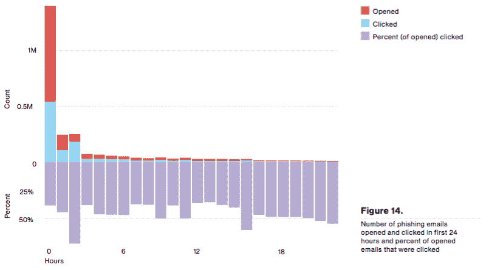Verizon Data Breach Report 2016

*   2017 年，他们发现所有记录在案的网络攻击中有 43%涉及社会工程攻击。

# 信息无处不在

2012 年，在美国消费者新闻与商业频道的一个名为*硅谷脉搏*的节目中，主持人乔·克南问投资人兼 Hummer-Winbad 高级合伙人安·温布莱德，“下一个真正的大事件是什么？”她的回答是，“数据是新的石油”。虽然 Ann Wimbled 的这一说法是因为大数据和人工智能的突破，但在信息安全领域也是如此。数据无处不在，大多数人每天都在发布、评论和分享个人信息，却不知道谁在看。不管是一顿饭的照片、他们最喜欢的足球队的信息、他们的关系状态，还是他们当时的感受。都在社交和专业网络上分享。许多活跃的社交网络用户仍然不知道他们可用于限制谁有权访问他们的个人数据的隐私设置。这是一个有趣的范式，因为回顾历史，在网络空间出现之前的时代，你希望在开始分享我们今天刚刚在社交网络上发布的大部分信息之前，与另一个人建立信任。这些网络中所有这些不同的用户活动都有助于威胁参与者执行深入的侦察。

# 用户活动

*   **档案**:用户尽最大努力拥有尽可能完整的档案。这包括出生日期、电话号码、电子邮件地址、个人资料图片、封面图片、雇主姓名、地址、关系状态等等。
*   根据脸书的数据，平均来说，一个用户每天发 X 条帖子。这些帖子包括他们最喜欢的菜肴的图片，关于即将到来的假期计划的信息，或者庆祝他们最喜欢的足球队的胜利。
*   **评论**:当在社交网络上发帖时，许多用户希望与关注他们的人或他们的朋友展开积极的对话。在这些对话中，通过评论功能，他们分享自己对某些情况的看法。
*   **图片和视频**:除了用户上传到时间线上的美食图片，他们还会创建和维护特殊时刻的图片和视频相册。同样，用户试图输入尽可能多的信息，包括位置数据，照片中还有谁，甚至他们对此的感受。

*   支持:许多公司通过社交网络提供支持。虽然他们中的大多数告知并提醒他们的客户不要公开共享个人数据，包括客户识别号码，但普通用户仍然会无意中这样做。
*   在线游戏:在玩社交网络上的游戏时，用户分享信息。

这不是用户每天在社交和专业网络上进行的所有活动的完整列表，而是旨在提供对数据量的简单了解。随着数字化的突破和社交网络的易用性，我们不太可能找到一个没有员工使用社交网络的组织。事实上，即使一个组织有禁止私人使用社交网络的政策，员工很可能仍然会使用它们，但会用假名创建和维护社交网络档案。

# 了解侦察

在前面的章节中，Erdal Ozkaya 已经描述了**网络杀伤链**；这是洛克希德·马丁公司开发的一个流程图，旨在更好地了解威胁参与者如何准备和执行网络攻击。关键是要理解威胁参与者是如何操作的，以便更好地构建有效的防御策略。许多网络攻击的第一阶段是侦察或短侦察阶段。术语*侦察*最初来自军事，指的是识别关于敌人的位置、意图、作战计划以及任何其他可能与渗透、获得技术优势或准备与他们作战相关的有用情报。

在网络空间，侦察阶段遵循相同的原则，但它专注于识别用户行为模式，以找到正确的漏洞集。在这一阶段，威胁行为者寻求获得对目标的深入了解。这通常不仅包括基本信息，如其总部的位置，还包括更多的个人信息，如层级图、员工徽章的照片、文档模板、建筑蓝图、财务信息以及对单个员工的了解。然后，威胁参与者获取收集到的情报，并构建一个图表视图。这使得威胁参与者能够确定最薄弱的环节，并使他们能够准备复杂和有针对性的网络攻击。

毫无疑问，很多时候第一波目标员工并不是 C 级高管，而更有可能是最近在专业网络上分享他们对新的职业机会持开放态度的员工，或者是分享他们因工作时间长而感到沮丧的培训生。这些员工比新任命的**首席技术官** ( **首席技术官**)更有可能打开有针对性的钓鱼邮件。这就是为什么理解这一点很重要，尽管为高价值资产建立防御措施在某些情况下可能是有意义的，但关键是要有一个网络安全框架，涵盖对网络攻击的保护、检测和反应，不管它是**首席执行官** ( **首席执行官**)还是销售代表的身份、电子邮件或端点。这是真的，因为威胁参与者不是通过层级而是通过图表来查看收集的情报，然后在图表中找出最薄弱的环节:

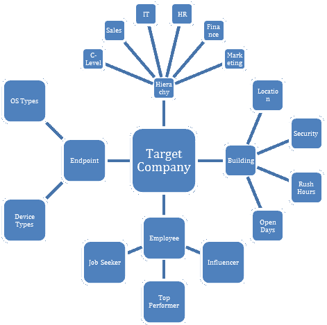Sample graph to visualize how threat actors build a target graph

想象自己是一个威胁演员。一方面，您确定了首席信息安全官(**)的电子邮件地址，另一方面，您确定了新任命的初级销售代表的电子邮件地址。*你更有可能向谁发送有针对性的网络钓鱼电子邮件？*在大多数情况下，会是初级销售代表，这不是因为实际的销售代表，而是因为很多时候，组织会为管理人员提供额外的安全和意识培训，从而降低网络钓鱼电子邮件得逞的可能性。因此，作为一名安全专业人员，重要的是不仅要假设会有违规行为，还要假设组织内部几乎所有员工的个人数据都在互联网上到处流动。**

**# 侦察的实例

威胁参与者知道在网络空间中不安全流动的个人数据的数量，并且通常是在不引起服务提供商或用户怀疑的情况下获取这些数据的专家。他们有许多资源、技术和工具可以用来对他们瞄准的个人或组织进行成功的侦察。在这一阶段，威胁参与者的首要原则是所有信息在某些时候都是有用的。

被动信息收集是威胁参与者用来通过公开来源发现潜在有用信息的技术。这可能是公司域名的 WHOIS 信息、公司网站上的联系信息、盈利报告、高管在会议上发布的产品演示，或者是对 IT 或安全部门使用的技术的见解，这些信息已作为参考案例研究记录在软件供应商的网站上。虽然到目前为止，所有这些都发生在网络空间，但也有翻垃圾箱的方法。即使在网络空间出现之前，翻垃圾箱也是非常常见的，如果个人或组织没有适当的安全措施来保护打印的敏感信息，这是一种获取目标被动信息的简单方法:

*   **WHOIS 查询** : WHOIS 是一种常用的协议，用于查询数据库以识别注册用户的详细信息，如域名所有者的全名、名称服务器或支持电话号码。这通常是威胁参与者被动收集信息的第一步，因为它非常容易执行。可以通过许多在线服务提供商进行 WHOIS 查找。以下是在 www.packtpub.com[发布者的域名](http://www.packtpub.com)上执行的 WHOIS 查找查询的屏幕截图。该信息集提供了主机提供商、公司地址以及电子邮件地址和电话号码的详细信息:

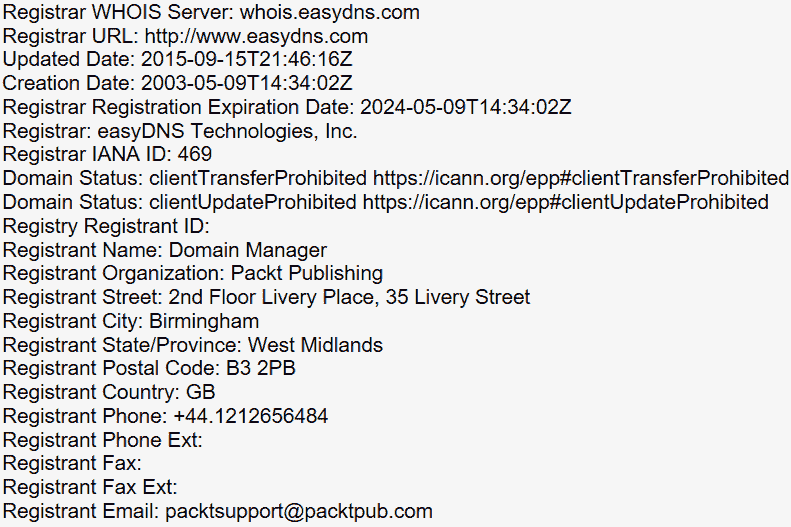

*   **政策查找**:大多数大型公司都有易于访问的数据保护政策。在某些情况下，法律要求他们向客户提供这些信息，这些信息通常包括如何存储和处理个人数据的完全透明性，并概述了当用户想要更改或删除其个人数据时的流程。在某些情况下，该文档包含的内容往往比要求的要多。威胁参与者正在此文档中搜索用于存储个人数据的技术参考以及更改和删除过程中的断点。
*   **案例研究**:根据组织和行业的规模，目标可能是软件供应商的参考客户。传统上，供应商会提供折扣或其他东西，以换取被称为可信提供商。从侦察的角度来看，这可以让威胁者的生活变得更容易。根据这些案例研究中共享的详细程度，威胁参与者可以获得有关 IT 和安全技术及流程的关键信息。例如，这可能包括操作系统版本、防病毒软件、网络拓扑或安全策略。

一旦被动信息收集完成，下一步就是主动信息收集。在侦察阶段的这一部分，威胁参与者准备一个复杂的网络钓鱼攻击来寻找更多信息。通常，威胁者会伪装成接收者信任的其他人，并有借口操纵该人在没有意识到的情况下放弃敏感信息:

*   **网络钓鱼电子邮件**:根据**美国联邦贸易委员会** ( **联邦贸易委员会**)的规定，网络钓鱼一词的定义是，*当骗子使用欺诈性电子邮件或文本，或模仿网站让你分享有价值的个人信息，如账号、社会安全号码或你的登录 id 和密码*。**社会工程工具包** ( **SET** )包括 Metasploit 等工具，威胁参与者使用这些工具来自动化创建和分发钓鱼电子邮件的过程。最初的一组电子邮件通常会要求用户在受损网站上重置密码，或者打开恶意附件，从而允许在用户终端上运行键盘记录器。
*   **聊天**:在某些情况下，威胁者可能会根据从潜在受害者用户的偏好中获得的被动信息创建一个虚假的角色。他们创造一个假的角色，看起来像是受害者的潜在最佳人选，这样他们就可以通过一起聊天在短时间内建立信任。在某个时候，威胁者会开始间接询问敏感信息。

# 真实世界的例子

虽然理解社会工程的概念以及威胁参与者如何执行侦察很重要，但探究威胁参与者如何在现实世界中利用社会工程也很重要:

*   **红色警报行动**:2017 年，一个被怀疑来自俄罗斯的威胁行动者组织与一家巴西电信公司签约，以北京的一家竞争对手公司为目标。竞争对手公司因其在信息安全方面的大力投资而闻名，这使得**安全运营中心** ( **SOC** )能够获得最新的技术、当地最优秀的人才和强大的内部安全流程。在侦察阶段，威胁参与者购买了大量受损社交网络凭据的列表，并发现在公司不同团队工作的五个人都在该列表上，并且这些凭据仍然有效。

一旦他们进入这些社交网络帐户，威胁参与者就会发现这些人之间的几次聊天对话，他们抱怨强大的安全措施会影响他们自己的工作效率。据怀疑，威胁行动者对这些聊天对话进行了五个月的监控。在此期间，他们了解了密码重置政策、几名帮助台员工的姓名、其中两人的公司电子邮件地址，甚至一个人的公司密码。威胁参与者利用所有这些信息为自己谋利，并起草了一封看起来像是来自帮助台员工的有针对性的密码重置请求电子邮件，要求他们访问一个网站以输入用户名和密码。该网站的外观和感觉与企业网站相似，但威胁参与者不仅可以看到用户的每次击键，还可以在终端上复制他们的有效载荷，并开始他们的网络攻击。

*   **黄色警报行动**:2016 年，一个民族国家威胁行动者组织将目标对准了一家受制裁国家的公有石油公司。这次网络攻击的目的是减缓当地的抽油速度，迫使政府继续谈判。受害公司采取了强有力的物理和网络安全措施，使其几乎不可能通过传统攻击媒介(如网络钓鱼电子邮件或电话诈骗)来攻击该公司。在侦察阶段，威胁行动小组发现员工停车的停车场没有安装摄像系统。因此，该组织准备了许多恶意的 USB 拇指驱动器，并付钱给周围地区的孩子，让他们在假装踢足球的时候把它们扔在停车场。虽然不清楚有多少恶意 USB 拇指驱动器被丢弃，但已确定威胁行动者小组能够访问六个用户凭据。这是可能的，因为尽管很难进入大楼，但没有控制措施来防止不受信任的代码运行。一旦该员工连接了 USB 拇指驱动器，它就会在后台执行恶意代码，实现与威胁参与者的**客户对客户**(**【C2C】**)通信。

*   **黑色警报行动**:2016 年，一个威胁行动组织将东欧的一家银行作为目标。目标是危害 web 开发团队的端点，允许他们在在线银行门户网站中植入恶意代码。威胁行动者小组通过专业网络上的条目发现，该银行正在进行一项可访问性测试。作为其中的一部分，IT 部门会将不同型号的键盘发送给最终用户进行评估。威胁参与者行动迅速，将键盘记录器硬连线到新键盘上，准备了一份似乎由 CTO 签署的支持文件，以感谢 web 开发团队对该计划和整体业务的贡献，并将其中七个被操纵的键盘发送到了公司的主地址。仅仅过了两天，该银行内部开发人员的前两个端点就向威胁参与者 C2C 服务器报告了情况。
*   **紫色警报行动**:2015 年，一个被怀疑以朝鲜为基地的威胁行动组织将一家美国科技公司作为目标。那次网络攻击的目标是确定几项关键技术的产品路线图。在侦察阶段，威胁参与者扫描组织结构图、自动电子邮件模板和新闻稿，并了解不同部门的内部缩写。一旦确定了所有这些内容，威胁参与者就会准备一封复杂的网络钓鱼电子邮件，在普通用户看来，这就像是自动计费系统发送的常规费用支付确认。该网络钓鱼电子邮件的附件包含恶意宏，一旦启用，就会将恶意有效负载加载到终端上，从而允许与威胁参与者进行 C2C 通信。

Please refer to the link [https://www.packtpub.com/sites/default/files/downloads/LearnSocialEngineering_ColorImages.pdf](https://www.packtpub.com/sites/default/files/downloads/LearnSocialEngineering_ColorImages.pdf) for the images of this chapter.***