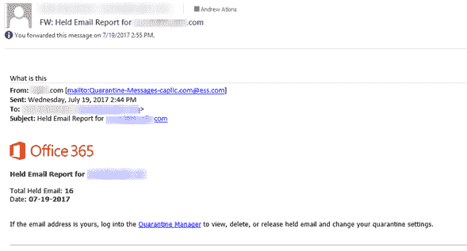

# 十二、请教专家——第二部分：保拉杰诺维奇

Paula Januszkiewicz 是世界知名的 IT 安全顾问、渗透测试员、企业安全 MVP 和培训师(MCT)。Paula Januszkiewicz 是 CQURE 的创始人兼首席执行官。她全心全意为公司工作，坚信高品质和积极的思维是成功的关键。在 CQURE，她致力于自己的爱好，安全咨询。她参与了数百个安全项目，包括一些政府组织的项目。她也是许多知名会议的顶级演讲人，包括微软 Ignite(她在 1100 名其他演讲人中被评为第一名)、RSA、TechDays、cybercrime 等。宝拉热衷于与他人分享她的知识。私下里，她喜欢研究新技术，并将其转化为写作训练。她可以访问 Windows 的源代码，目前正在她的教育项目 CQURE Academy 上进行离线和在线安全研讨会。

# 对黑客和尽职调查的扭曲认知

专有技术是当今组织的生命线。不幸的是，企业网络犯罪威胁的规模和性质在过去几年中以惊人的速度增长，其主要目标是数据盗窃。所谓的国家支持的攻击、黑客行动主义、内容泄露和恶意软件(包括勒索软件)正变得司空见惯。毫无疑问，技术是必要的，在这个时代，可用的解决方案使我们能够充分保护我们的基础设施。然而，我们很少看到完美的安全状态，即所有潜在的进入点都被适当的防御手段所覆盖。这就是为什么保护一家公司免受社会工程攻击已经成为网络安全框架的一部分，而这只是从教育开始。

作为网络安全框架的一部分，社会工程在网络尽职调查过程中值得特别关注。企业必须进行尽职调查，努力领先网络犯罪分子一步。整个流程包括对组织用来保护其数据资产安全的治理、程序和控制措施的全面审核。有效执行网络尽职调查流程应包括以下内容:

*   所有网络防御的渗透测试，包括社会工程测试
*   对公司数据资产的评估
*   对数据保护措施的审计
*   对违规管理和事件响应计划的审核
*   符合行业特定数据法规和标准的审计
*   怀特分析了公司在互联网上的存在

网络尽职调查使我们能够识别技术和组织安全方面的网络安全风险和漏洞。作为整体测试流程的一部分，社会工程测试将查明需要缓解的领域，以降低未来违规的风险，最终实现更准确的评估

在我的社会工程经验中，我从未失败过。曾经只有一个人力资源助理关心我的活动，但这导致了更多的信任，因为我面无表情地解释了我在那里的原因。我最喜欢的一项社会工程测试是在一家欧洲金融机构进行的。典型的社会工程骗局遵循一个 4 阶段的过程— **信息收集**、  **关系发展**、  **利用**，以及  **执行**。我的工作是证明我可以进去窃取一些信息。该公司有三个网关，我可以通过，第一个很容易绕过，因为它们只是一个门，通过卡，PIN 码，或通过使用可用的对讲机直接呼叫公司。早上，这些都是不必要的，因为我只是跟在一个有合法通道的人后面。这让我可以进入电梯区，员工可以在键盘上按下他们想去的楼层号码。我在电梯区等着，直到选好楼层。当电梯门打开时，我跳进电梯后面，和一个非常英俊的男人开始了愉快的交谈。过了一会儿，当我们到达选定的楼层时，他用他的卡打开了门，并说，  *女士优先！*。然后我设法去了交易者的楼层，在那里我可以坐在某人的桌子旁玩一台没有上锁的电脑，所以我就去了。

令人印象深刻的是，为了得到所要求的信息而不被问任何问题，我可以走多远。我设法利用了“熟悉度利用”,这是最好的社会工程技术之一，在这种情况下，一个人必须对其他人表现得绝对正常。电梯里的那个人感觉我们彼此认识，在交易大厅里，我对自己正在做的事情非常有信心。如果有人质疑我的存在，一个技巧是创造一个敌对的环境，在那里攻击者可以假装和他们家里的人打了一架等等。你周围的人会注意到你，但他们也会试图避开你。

在更大规模的攻击中，经常会观察到有人被雇佣，然后这个人看起来是竞争对手的间谍。接下来就是，成为一名成功的社会工程师的关键是信息收集。你对你的目标了解得越多，你就越有可能从他或她那里得到你想要的东西。与普遍看法相反，鱼叉式网络钓鱼攻击是精心制作的，与目标相关。识别欺骗并不像大多数人认为的那样容易，所以员工必须接受培训，通过给发送者打电话来质疑和验证自发链接。

这个问题最好的部分是，所有这些谎言都可以通过员工培训来缓解。在我看来，公司应该将安全活动作为工作描述的一部分，然后负责培训员工进行批判性思考，了解他们的工作场所，并对可疑活动做出反应。重要的是要认识到任何人都可能危及公司，尤其是我们不认识的人，因为他们以前从未在我们的工作场所出现过。

# 感恩不尽，而暴黄

拥有超过 3000 个各级网络犯罪调查案例的经验，**；ükrüdur maz**是全球网络犯罪调查领域的领先专家之一。凭借他的背景，数字取证和网络安全专家 Durmaz 先生是 DIFOSE 有限公司的董事总经理。他是国际刑警组织、欧洲刑警组织、FIEP、北约和 OSCE 组织的全球会议的获奖演讲者和技术专家。他还是一名关于网络犯罪、事件响应和数字取证的国际讲师。Durmaz 先生写了许多关于网络犯罪、网络安全和数字取证的文章。

**Raif sarca**拥有二十年执法经验的各级  **通信与信息系统** ( **CIS** )和情报。他还在 EUFOR 和北约担任独联体安全专家。他拥有宾夕法尼亚州立大学信息系统专业的研究生学位，并撰写了许多关于 IT 安全、风险管理、防御、网络安全和数字取证的文章。目前，他正在撰写一本关于风险管理和安全的新书。

正如《孙子兵法》中所说，  *一切战争都是基于欺骗。因此，当我们能够攻击时，我们必须显得无能为力；在使用我们的力量时，我们必须表现得不活跃；当我们在近处时，我们必须让敌人相信我们在远处；当远的时候，我们必须让他相信我们就在*附近。

正如孙子明确提出的，这完全是欺骗，或者换句话说，控制对敌人/对手/目标/个人的感知。你应该以这样一种方式欺骗你的对手，让他/她相信你想让他们相信的东西，从而按照你想让他们做的那样去做。由于这种普遍的欺骗伎俩与人类的存在一样古老，因为它始于撒旦欺骗/误导亚当和夏娃吃禁树上的果子，所以它远远超出了社会工程学。社会工程只是成千上万个行骗领域中的一个新领域。除了一些技术设备，用于社会工程的技术和用于实现传统欺诈的技术之间并没有太大的区别。

当我们谈到欺骗时，人类的心理学和心理游戏不可避免地会发挥作用。如果我们把社会工程定义为利用人类共同的弱点，使之符合我们的意愿，那也不会错。这正是所有骗子或社会工程师所做的。社会工程师为了他们的利益利用我们的情绪来实现他们的目标或实现他们的攻击。首先，让我们所有人容易受到社会工程攻击的是我们的情绪，如恐惧、愤怒、信任、惊讶、厌恶和贪婪。因为这些情绪是我们存在的核心，所以总是有被欺骗的可能性，只要人类存在，就没有逃避的可能。

情绪是身体对某些刺激的反应，情绪反应被编码到我们的基因中。如同所有生物生命形式一样，它们通过对威胁、回报以及两者之间的一切做出快速反应来帮助我们生存。例如，当我们害怕某事时，我们的呼吸会加快，我们的心跳会加快，我们的嘴巴会变得干燥，我们的肌肉会紧张起来，为任何意想不到的行动做好准备。这种情绪反应是自动和无意识发生的，因为它们是我们生存的本质，就像所有生物生命形式一样。

我们可以把我们的情感想象成另一种感觉，比如视觉、听觉、触觉、味觉和嗅觉。事实上，它们有时甚至比我们的感官更具决定性和重要性。我们每天感受到的情绪迫使我们采取行动，并影响我们每天做出的决定。有些情绪为我们提供信息，有些情绪促使我们采取行动。例如，当我们不喜欢的事情发生时，愤怒可能会产生，我们的愤怒可能会激励我们做一些事情来改变这种不愉快的情况。当我们受到威胁时，恐惧可能会产生，它导致我们为了生存而逃跑、战斗或冻结。从这些例子中可以看出，我们的情感、思想和行为都是相互联系的。

由于逻辑推理和情绪状态之间的联系，情绪对我们思考、决定和解决问题的方式有着重要的影响。随着积极或消极情绪的强度增加，我们的逻辑推理能力下降。推理是一项费时又累人的脑力活动。识别备选方案，想象结果，并确定将提供最佳结果的备选方案可能需要比我们手头更多的时间。在某些情况下，我们可能没有所需的注意力和工作记忆资源。例如，当我们高度兴奋、害怕或惊讶时，我们的推理能力就会下降。那些强烈的情绪从工作记忆中带走了本该用于处理推理任务的资源。同样真实的是，当我们快乐且心情愉悦时，我们会追求更全球化、更理性的策略，而较少关注手头的事情。当我们害怕时，我们会把我们的推理抛在脑后，仅仅基于我们的恐惧而行动。

假设你在街上突然遇到一只大白狗。你的第一反应将主要基于你的情绪，这是我们基因中帮助你生存的编码。你的情绪压倒了你的想法，因此，你失去了情绪和想法之间的平衡。失去平衡的原因是你强烈的情绪(恐惧、焦虑、压力、无助)和你必须在选项中选择的短暂时间(几秒钟，甚至不到几秒钟)。如果你碰巧能找到其他选择。由于高度的恐惧、焦虑和压力，你无法在很短的时间内找到最佳的选择，就像一只被车头灯照着的兔子，你只是呆在那里。当你被社会工程师欺骗时，同样的事情也会发生。他们把你引向一种心态，在这种心态下，你失去了平衡，不能合理地输入或使用你的推理能力。

社会工程师用来欺骗我们的一些策略总结如下，并附有例子:

*   信任:社会工程师用来欺骗我们的第一个策略是信任权威。生活在社会中的结果是，人类在自己之间寻求等级，并遵从基于等级和角色的权威。如果一个处于权威地位的人告诉我们要以某种方式行动，我们就会服从他们。我们接受人们是权威，因为他们有我们认为应该服从的角色，他们穿着反映他们角色的衣服，如制服和西装，或者其他人告诉我们他们是权威。在大多数情况下，我们尊重或服从权威，因为社会训练人们不要质疑权威，我们所有人都很容易受到社会影响。我们信任他们，或者我们被认为信任他们，信任带来服从。假设一名社会工程师在电话中扮演一名执法人员，并描述了您的银行账户的问题情况，一步一步地使用正式的词语和许多政府机构的名称，以及据称使用了您的银行账户的犯罪组织。他声称你的账户向一个恐怖组织进行了电汇。就像警察总部一样，假设你在他讲话时也听到了警察无线电的声音。此外，他知道你的名字和姓氏，你的妻子，你的孩子，你的地址，甚至你存钱的银行的名字。  *感觉如何？* *惊慌、害怕、兴奋、压力大？那个社会工程师有没有可能用他事先详细侦察时收集的所有情报来提高所有那些情绪的水平？* *愿你的推理被这些情绪蒙蔽？社会工程师有没有可能获得你信用卡号码或任何其他货币信息，以便利用他的最终目标？*
*   **从众原则:**第二个战术是  从众原则。人类天生是社会性的，称人类为社会性动物不会错。我们需要其他人来生存，我们随时准备好进行社会互动，因为这种需求是我们原始生存本能的核心。因为我们倾向于生活在一个社会中，它塑造了我们的思想、行为和心理。这就是一般化或羊群行为发挥作用的地方。从众行为来自于从众的社会压力，我们有一个共同的基本原理，即大多数人不会错。即使我们以某种方式确信一个行为是非理性的或错误的，我们仍然会随大流，认为他们知道一些我们不知道的事情。作为人类，当我们相信大多数人的行为或反应是积极的时，我们更有可能作出积极的反应。

因此，为了最小化风险，当我们周围的人似乎都在冒同样的风险时，我们通常会放松警惕。另一个事实是，消费者的购买决定主要受用户对产品和服务的在线评论的影响。想象一下，你即将以低价赢得一台笔记本电脑的在线拍卖。在决定拍卖之前，你会详细查看卖家的个人资料，你会发现他的账户充满了积极的反馈。所以，你不会因为他闪亮的侧面而产生怀疑和信任。他的简介和所有积极的反馈可能是真实的。另一方面，也有可能他已经和他的同伙建立了良好的声誉来吸引顾客。在这一点上，你的信任原来是基于从众原则。

*   **当机立断** : 欲速则不达。第三个策略是迫使我们迅速做出决定。我们大多数人更喜欢有足够的时间来分析一个情况，并考虑替代方案。我们从来不喜欢在很短的时间内做出决定，因为信息匮乏，而且主要是我们面前的不确定性或黑暗。犯错的可能性增加了，因为我们应该对形势做出快速评估，并根据非常少的信息做出结论。在这些时候，恐惧、压力、兴奋和焦虑等情绪会控制我们的大脑，我们大多会把逻辑推理放在一边。我们有时甚至喜欢感受肾上腺素，冒险进行快速评估。我们从来不理解或意识到我们是如何结束的。为了让我们处于这种精神状态，并利用这种弱点为自己谋利，社会工程师引导我们采取一种逻辑推理更少、决策更草率的策略。当我们被迫决定通常需要几天时间来评估的事情时，我们很难停下来正确地评估情况。基于社会工程师的创造力，从电汇骗局、约会骗局、在线拍卖或订阅陷阱开始，有各种各样的选择。
*   贪得无厌的胃口:人类贪得无厌的胃口是第四种策略。贪婪是一种复杂的多方面的情感。一方面，它可以激励我们更加努力地工作，富有创造性。另一方面，极度的贪婪会破坏我们在财富、成功、美丽甚至道德价值方面的所有收获。没有终点，除非我们能设法控制它。问一个千万富翁，他对自己拥有的是否满意。他可能有很多想做的事来得到更多。我们对财富、成功、名誉、美丽等永不满足的渴望永无止境。我们尽最大努力为自己争取尽可能多的东西，直到死亡的那一刻。

西格蒙德·弗洛伊德声称贪婪是自然的，人类生来贪婪，这似乎完全正确。说贪婪甚至可能与生存和进化有关也不会错，因为我们的基本本能是为了我们物种的延续而假设我们的遗传密码是永恒的，而提高的社会地位可能有助于我们为无休止的进化斗争吸引更多更好的配偶。既可笑又荒谬的是，我们从未停止贪婪，即使我们确信我们合理或不合理的需求或欲望会使我们变得脆弱。一旦社会工程师知道你或你贪得无厌的胃口真正想要什么，不管为什么，他们可以很容易地用它来对付你。你可能听说过尼日利亚 419 骗局，如果你帮他们把钱转移到国外，他们会给你一大笔钱。他们通过电子邮件、信件或社交网络信息与你交流，并告诉你一个虚假的故事，关于中央银行的资金或由于政府限制或税收而难以获得的巨额遗产。他们会给你股份，条件是你要帮助他们，给你银行账户的详细信息来转账，或者他们要求你支付费用、收费或税收来转账。你不认为这是什么大不了的事，因为你期望最后能得到一大笔钱。然而，你从来没有收到任何钱，只要你愿意放弃，你就会继续支付越来越多的钱。

*   **肾上腺素**:第五招全是  **肾上腺素**。即使许多人试图建立安全的生活，  *为什么人们仍然冒险？* 有人热爱速度，疯狂驾驶，有人做蹦极、冲浪、滑翔伞、跳伞、下坡山地车等极限运动。冒险绝对违背逻辑，理性无法解释人们为什么会做出不可预测的事情。当然，有很多刺激和兴奋，但是这是在边缘生活的足够理由吗？ 据说与多巴胺有关，多巴胺是一种让我们感觉良好的化学物质。当我们吃甜点时，当我们发现我们丢失的重要东西时，或者当我们能够为我们关心的人做些事情时，多巴胺是让我们快乐的原因。当我们做一些大胆和疯狂的事情时，它也使我们感到兴奋和兴奋。不管是化学物质还是对刺激的疯狂追求，人们在危险和刺激的条件下往往会做出不理智的行为，更容易犯错误和被利用。社会工程师意识到我们对风险、刺激和冒险的渴望，并相应地在他们的骗局中使用它们。

# 真实世界的例子

一些真实世界的例子如下。

# 权力的游戏

我的一个朋友 Adam 给我讲了一个有趣的社会工程故事，他在一家著名的 IT 安全和咨询公司工作。他和他的老板一起拜访了一家大银行的 it 部门，这家银行的首席信息安全官**(**)是他老板的老朋友。****

 ****Adam 为本次会议准备了一份演示文稿，内容涉及最新的已知攻击媒介、威胁参与者如何利用它们来利用漏洞和危害系统，以及他们的公司在漏洞评估、渗透测试等方面提供了什么。在演示过程中，亚当注意到 CISO 有些令人讨厌的地方，他的肢体语言，尤其是他轻蔑的眼神。他看起来有点自大，极度自信。他带着轻蔑的眼神听亚当说话。他没有问任何关于演示的问题，甚至没有感谢他。

他的老板开始谈论他们的系统和服务。有一次，他允许他的朋友对他们的 IT 系统进行漏洞评估和渗透测试。CISO 开始大笑着说:“我们的系统是业内最安全的，我们有最新的软件和硬件，也有最有才华和经验的 IT 人员。不要误会，但我肯定我的 it 人员比你们的好得多。我们有能力做我们的测试或控制。我为什么要花钱买我不需要的东西？最重要的是，我们有很多机密信息，我们应该自己保护客户的隐私，我不能让任何人接触这些信息，即使是你我的朋友”。

亚当对那个自大的 CISO 感到很恼火，但他的老板却很平静，脸上带着勉强的微笑。他对他的朋友说，我给你一个免费的评估。如果我们找不到任何漏洞，如果你的 IT 系统像你说的那样完美无缺，一切都将是免费的”*。*当他们正在讨论时，亚当接到了一个电话，他离开房间去接电话。秘书的电脑屏幕上有个东西引起了他的注意。她试图在一个在线网站上观看电视连续剧  *【权力的游戏】* 中的一集。讲完后，他走近秘书说:  *这是我看过的最好的电视连续剧*。她因被发现在上班时间看电视连续剧而有点尴尬。仿佛上班时间看也没什么不好，亚当诚恳地继续，“*你最喜欢的角色是谁？”* 矿山是丹妮莉丝·坦格利安。她不仅漂亮，而且如此高贵。尴尬过后，她松了口气，友好地笑了笑，害羞地回答道:“我的名字是约翰·斯诺。”。

他们就  *【权力的游戏】* 友好地聊了将近 10 分钟，快结束时亚当说，  *我有所有季节的所有剧集，如果你想要我可以把它们刻录在 DVD 上，然后发给你*。没有意识到经验丰富和专业的亚当的鬼祟想法，她感激地接受了。

亚当转身回到会议上。由于 CISO 的顽固和傲慢，他们停留了半个多小时，在脆弱性评估和渗透测试方面没有取得任何成功就离开了。在将自己的想法告知老板后，亚当为秘书准备了一张 DVD，包括电视连续剧的所有季节、  *【权力的游戏】、* 以及一个小小的无害脚本。他和他们公司的送货员一起把它送给了秘书。他甚至给秘书附上了一张友好的便条，说明他多么喜欢和她聊天，还附上了一份他有的连续剧和电影的清单，以防她想看。

一天后，他的老板接到该银行 CISO 的电话，要求进行漏洞评估、渗透测试和咨询，因为秘书已经开始观看电视连续剧，脚本也已运行，并向 CISO 的 PC 屏幕发送了一条消息，内容为:  *您应该接受 pen 测试，您已被黑客攻击*。**** ****# 乱世佳人行动

亚当是一个 26 岁的单身男人。他没有那么英俊，有点超重，腹部松弛。然而，他有一种他周围的大多数人都不知道的品质。他的父亲非常富有。他在攻读硕士学位时，经历了一生中最令人沮丧的经历之一。

在一个下雨天，他正走在街上，这时一个可爱的金发女郎意外地(！)倒在他面前。作为一个绅士，他帮助她站了起来。脸颊上挂着泪水，她看起来是如此悲伤、害羞和无助。亚当感到可怜，试图和她说话。没有进入细节，他们最终在一个自助餐厅谈论发生了什么。她编造的故事充满了悲伤和无助。她是一名来自不同城市的学生，她离开了她的室友，开始和她刚刚分手的男朋友一起生活，因为他欺骗了她。她现在没有任何地方可去等等。不用说，她真的很可爱，很有魅力。骑士精神和睾丸激素控制了他的大脑，亚当邀请她去他的公寓，至少在她找到住处之前。她在亚当的公寓呆了两天。她真的很热情、友好、开朗，至少亚当是这么认为的。她找到了新的公寓出租，亚当甚至把第一笔租金电汇给了她所谓的房东。

一天，亚当注意到他的手机没有信号。想着可能是服务商有问题，他一开始也没当回事。差不多过了一个小时，他用朋友的电话打了客服。那一刻，他第一次注意到事情不对劲，因为服务台的女士告诉他，他们已经发放了一张新的 SIM 卡，因为他报告说他的手机被盗了。他很震惊，并试图解释说，他没有报告任何类似的事情。经过大量的真实凭证和安全问题后，她相信了亚当，然后停用了新的 SIM 卡，并建议他尽快去最近的授权商店。

损失评估结果完全是一场灾难。从他的银行账户电汇了 23000 美元还有 6000 美元的信用卡消费。他被一个所谓甜美、友好、漂亮的女孩盲目地骗了。当她住在他的公寓时，她窃取了所有需要的信息，如信用卡号、身份证、电话号码、个人识别码，甚至手机银行密码。

那天之后，那位可爱的女士就没有了踪影。她完全迷失了。警方仍在调查此案，但他们没有太多的证据，因为这是一个精心策划的骗局。警方掌握了银行账号、信用卡交易信息、一些地址和安全摄像头记录，但还没有结果。

在不同的文化、种族和宗教中，帮助和分享被认为是令人钦佩和值得称赞的品质，但在亚当的案例中还有一个额外的激励因素，一位需要帮助的美丽女士。正如亚当所说，  *他是骑士精神和他的睾丸激素*的牺牲品。

# 骗局行动骗子

有一些骗子声称他们是专家，他们可以打破咒语或逆转诅咒。也有很多人相信他们被下了咒语或某种黑魔法，并在寻找能解除诅咒的人。这个有趣的现实世界的故事是关于一个神奇的骗子被骗了。

一切都发生在长达几个小时的 WhatsApp 聊天中。亚当和一个所谓的魔术大师在 WhatsApp 上聊天:

**亚当:**“你好，那里。我在网上找到了你的号码。我觉得有人对我施了黑魔法。我一个人住，但我听到人们说话或婴儿哭泣的声音。我要疯了。没人相信我。请帮助我的主人，我不知道我还能去找谁。我很无奈”。

**师傅:**“冷静。我们会查清楚的。”

亚当:我甚至不能说话。每次我回到我的公寓，我开始听到人们的声音。我觉得他们要掐死我了。我打开电视是为了让他们安静下来，但他们似乎就在我的脑海里。”

**主人:**“你身上真的有黑魔法。我能感觉到，但是别担心。我会解决的。我会录下一些咒语，然后发给你。把音量调大，让大家都能听到。在此之前，我相信你也从网上了解到这项服务将收取 200 美元。

**亚当:**:“钱不是问题。如果你能把你的  **国际银行账号**(**【IBAN】**)发给我，我就能把钱寄给你。”

**主人:**“我的伊班是...(他发了所谓的咒语来破除咒语)”

亚当:“钱马上就会到你的账户上”。(30 分钟后)

**师傅:**“我还没收到钱。”

亚当:“我正试着把它寄出去，但每次我都收到银行发来的这条信息。”(亚当发送了一个捏造的截图，注明  *您的账户被暂停，如果您希望恢复您的账户，请存入 300 美元。请注意，在您的付款得到处理之前，它将一直处于暂停状态*

**师傅:**“你是在耍我吗？这是什么意思？”

**亚当:**“我太感激你了，我真的很想还债。你的服务不能用金钱来衡量，相信我，我会尽力的。我是一名警察，我日夜为社区服务。我会让我的一个朋友给我转 300 美元，这样我就可以给你寄钱了。请再给我几分钟。”(一小时后)

**师傅:**“我还没收到钱。”

亚当:“我联系不到我的朋友。我打电话给其他人要钱，但我还是找不到。我欠你的，我感到很难过，我不能支付你的钱。”

**主人:**“所以呢？”

亚当:“别误会，你能给我寄 300 美元，让我恢复账户，然后给你寄 500 美元。”

**大师:**“这太可笑了。我为什么要给你寄钱？”

亚当:“这是我现在唯一能想到的办法。正如我之前写给你的，我是一名警察。我是来维护公共秩序的，你帮我解决了最大的问题。我觉得欠了债。我的伊班是....我保证一恢复账户就给你汇钱。”

**主人:**“我刚汇了 300 美元，请查收并通知我。”(15 分钟后)

**亚当:**“太感谢你了，主人。现在你真的解决了我的问题。我永远不会忘记你，当然，再见。”

# 手机诈骗行动

我们的新例子是一位 70 岁的教授，她因关于健康饮食的书籍而闻名。她无意中把近 3 万美元交给了电话骗子。骗子从她的网站上得到她的电话号码，假装是警察和检察官给她打电话。一周后，当骗子被警察抓住时，她拿回了她的钱。她在证词中对骗局总结如下。

他们打电话给我，告诉我一个恐怖组织占据了我的账户，几千美元从我的银行账户来回电汇。他们说他们已经开始了针对他们的大规模秘密行动，如果有我的帮助，他们会抓住他们的。他们要我不要挂断电话，听从他们的指示，不要把任何事情告诉任何人，甚至不要告诉我的家人，因为手术是保密的。他们甚至说，他们很抱歉把我置于如此危险的境地，但他们没有任何其他选择，我是他们唯一的线索。想到我是在政府和警察部队的秘密行动中，我真的感到很兴奋，也很自豪。  *正常公民一生中能经历多少次这样的事情？* 简直就像电影里一样。如果我说我被催眠了，这不会错。我就像一个五岁的孩子，听从她母亲的命令。他们让我做什么我就做什么。首先，我去银行取了 3 万美元。然后他们告诉我叫一辆出租车，来到市中心的一个公园。他们甚至让我向出租车司机要一张收据，因为他们会支付我在这次手术中的所有费用。我从出租车司机那里拿到了收据。因为我是一个知名人士，一些人想和我合影，或者有人提出带我去我想去的地方。我按照电话里那个所谓警官的指示，全都拒绝了。当我到达集合点时，他们指引我到一个公园，我把钱放在他们在电话里告诉我的车下，最后我离开了那里。

现在，我可以说，当被紧张和兴奋的情况触发时，情绪会模糊我们的判断，影响我们的决定，但在那段时间里，我从未想过我被骗了。当我想到我所做的事情，我在那几个小时里的感觉，我都在嘲笑自己，但是我可以诚实地说，我喜欢那种感觉，那种让我兴奋的感觉。我感觉自己像是秘密行动中的间谍。我很高兴我拿回了我的钱，我真的从经验中吸取了教训。

# 变色龙行动

被称为变色龙的骗子被警察抓住了。据说他在过去两年里诈骗了五名女性。

南希是那些被变色龙诈骗的女人之一，实际上她是他最大的受害者，因为她失去了她的公寓，还剩下 15，000 美元的银行贷款。南希是一名 47 岁的医生，独居，从未结婚。她是脸书和推特的活跃用户，拥有 6000 多名粉丝。南希和变色龙是在推特上认识的。她不知道她遇到了她一生中最大的错误。他们首先通过 Twitter 交流，然后是 Facebook Messenger，最后是 WhatsApp。变色龙扮演了一个 42 岁的刚离婚的电气工程师，他在两个不同的城市有两个办公室。在他们的聊天过程中，变色龙似乎是一个体面而成熟的人，有幽默感和人生阅历。在网上交流了一段时间后，他们决定见面。变色龙真的是个帅哥，185 cm 的身高，运动的身材，健谈，那种走到哪里都能交到朋友的男人。相反，南希是一个简单的女人，你可能每天都会在街上看到，170 厘米高，有一张可爱而纯净的脸，有点超重，健谈，但最重要的是，厌倦了孤独，因此容易受伤，即使她在内心深处不接受这一点。当南希要求变色龙搬进她的公寓时，他们已经约会快一个月了。过了一会儿，他们开始聊天，梦想着未来幸福的日子。南希心里七上八下。一切都很完美。她和一个完美的男人在一起，受过良好教育，善良，有爱心，浪漫。  *她还能要求什么？那些浪漫激情的美酒之夜让南希神魂颠倒。有一次，变色龙告诉南希，一旦他解决了自己的经济问题，他就想娶她。他说，由于他最近的离婚问题，他已经失去了这么多钱，他甚至不能支付他的办公室租金。南希天真地表示愿意帮忙，因为她的梦中情人也想娶她。嫁给一个像变色龙这样体面的男人是她的梦想。一开始他拒绝接受她的钱，他甚至坚持了几天说他不能接受。他的坚持和所谓的诚实和骄傲产生了结果。*

南希卖掉了她的公寓，另外获得了 15，000 美元的银行贷款。她做这一切都是希望尽快嫁给她的梦中情人，因为毕竟，他们是盲目的爱，或者至少这是南希天真纯洁的想法。南希的母亲和姐姐多次警告她，她并不那么了解这个家伙，她不应该付出她所有的一切，但她从来没有听他们的，因为她真的被爱情蒙蔽了双眼。她甚至和姐姐吵了一架，怪姐姐嫉妒她的幸福。

几天后，变色龙告诉南希，他失去了他的姑姑，需要去一个不同的城市参加葬礼。那是南希见到她的梦中情人的最后一天，直到两个月后他被警察抓住。她在经济和心理上都受到了伤害。

这个故事搞笑的地方是变色龙在警察局的一句话，*我其实爱上了她，但是我不得不离开*。

不幸的是，我们有一个假设，我们可以从外表了解一个人的好坏。因此，它引起了一个令人震惊的启示，就像在我们的变色龙例子中一样，当一个人外表看起来仁慈，但实际上却有着恶毒的个性。最后，请永远记住，无论年龄、性别、教育或文化，没有人能免于被这种隐藏的天使面孔和魔鬼头脑的怪物所欺骗，这仅仅是因为人类的愚蠢没有补丁。我们需要时刻保持警惕，不仅是为了我们自己，也是为了我们的朋友和家人。

# 光速行动

一切都发生在两分钟内。南希下班开车回家。这是又累又忙的一天，她正在听古典音乐来缓解疲劳和压力，这时她的电话响了。从来电号码看，她以为不是客服，就是银行的营销，或者是通讯公司。她喃喃地说，“我没有权力听你所有的垃圾”，没有接电话。然而，由于来电者的坚持，她的电话一直在响。她带着心中的愤怒和厌恶接了电话。某知名银行的  **客服代表** ( **CSR** )开始说话了:

CSR: “是南希·史密斯吗？”

南希:“是”

“史密斯女士，我是 XYZ 银行可疑交易部的。为了保证质量，我们所有的电话都被录音了。出于身份验证的目的，我会问您几个您在开户时已经提供给我们银行的安全问题。” *(CSR 问了她的出生年月和她的公民身份号码的最后四位数字，然后继续说。)*

**CSR:** “我们注意到在 ABC 购物中心消费了 3000 美元。根据我们的安全政策，超过 2，000 美元的信用卡交易需要在授权前由我们的客户验证。  *您是否在 ABC 购物中心进行过此类购买？”*

南希:“不”

“史密斯女士，最后一步，我们的安全系统会给您发送一个验证码。我需要输入那个号码来取消你的购买。  *请你读给我听好吗？*

**Nancy:**“OK”(几秒钟后，Nancy 收到一个验证码，读给 CSR。

**CSR:** “谢谢史密斯太太；我取消了那次购买。  *还有什么需要我帮忙的吗？*

南希:不，谢谢。  *现在真的取消了吗？”*

史密斯女士，取消了。祝你愉快"

南希:“谢谢你。”

因为这个电话，南希感到如释重负和幸福。如果她懒得回答，她可能会损失 3000 美元。她告诉自己，  *没有我的同意或者我不知道，怎么会有人使用我的信用卡呢？我应该去银行问问他们怎么保护我的信用卡*。

她没有注意到任何事情，直到她收到了多花了 500 美元的信用卡账单。她马上打电话给客服，然后去了她的银行，但是已经晚了。她明白，她告诉 CSR 的验证码实际上是骗子在所谓的 CSR 与她交谈时用她的信用卡进行购买的验证码。几周后，当警察抓住那些骗子时，事情就明朗了。她只是那些骗子的受害者之一。该诈骗团伙的成员之一是她购买笔记本电脑的电脑商店的 IT 人员。他从商店数据库中窃取了所有的顾客信息，并和他的同伙一起诈骗他们的顾客。

# 双重骗局行动

经过 11 个月的调查，警方抓获了 96 名诈骗团伙成员。他们被指控在两年的电信诈骗中诈骗了 150 万欧元。

一开始，骗子收集在德国特定购物中心购物并申请汽车抽奖的受害者的凭据(姓名、电话号码)。其次，他们在土耳其用一个所谓的  **客服代表** ( **CSR** )虚构了一个呼叫中心。CSR 是在从德国移民到土耳其的土耳其人中精心挑选出来的，他们德语说得很好。

CSR 拨打这些号码，并告诉受害者他们是从购物中心打来的，他们在抽奖中赢得了一辆汽车，但这辆汽车将从土耳其免税运出，获胜者应该支付运费。大多数所谓的赢家相信了 CSR 的故事，并通过西联汇款向土耳其发送了虚构的运费。

当受害者没有得到任何汽车时，骗局的下一步就开始了，他们开始抱怨，并威胁 CSR 在接下来的几天里向警方报案。

其他队员称受害者为来自西联汇款的人。他们声称有许多像他们一样被骗的德国公民，他们正在与德国警察部队一起开展行动，以抓住骗子，他们需要受害者的帮助。最后，他们要求受害人再次向西联汇款，以便在他们取款时抓住他们。受害者再次寄钱，以节省他们的钱，也有助于警察部队抓住他们。

# 安迪·马龙

Andy 在国际上享有盛誉，职业生涯长达 21 年，他不仅是世界级的技术讲师和顾问。而且还是微软  **最有价值专业人士** ( **MVP** )和多次获奖的国际会议演讲人，这些会议包括微软 Ignite、IT Pro/Dev Connections、Spiceworld 和网络犯罪安全论坛。他充满激情的演讲风格，加上一种有趣的感觉，已经成为他的标志，并为他赢得了巨大的赞誉。

虽然 Andy 的主要关注点是网络安全、合规性和保护，但他也喜欢谈论云技术，如 Microsoft Azure 和 Office 365。由于知识可以追溯到 MS-DOS 2 和 Windows 2.0 时代，所以经常会有有趣的故事可以讲述。但是技术永不停息，安迪继续与微软产品团队合作，创造和交付突破性的材料。安迪也是科幻惊悚片《第七日*和  *影随形*的获奖作者。*

*# 社会工程——安迪·马龙

不可否认的事实是，我们都是习惯性动物。从我们出生之前，到我们死去的那一刻，我们的整个生命是一系列永无止境的模式。从学习人类语言的基础，到我们何时吃饭，甚至我们何时以及如何去工作。当然，有些人会提出相反的观点，但是作为一名安全专家，我们的工作就是观察这些模式并分析它们是否存在任何潜在的威胁。航空安全程序可以作为一个完美的例子。作为人类，我们有天生的信任他人的本能。我们的家人和朋友，我们的银行，我们的食品供应商，甚至我们的政府。即使在网上，我们也可以随意地和脸书的朋友聊天，或者用信用卡在网上购物。这很大程度上是基于信任。我们相信，在脸书与我们交谈的人，实际上是我们认为的那个人。或者我刚从银行收到的邮件是真的。但是  *如果不是呢？* *信有恶意怎么办？* *如果我们与之交谈的人，并不是他们自称的那个人呢？* *有哪些可能的后果？*

社会工程当然不是什么新鲜事。事实上，它已经存在了几千年。一个经典的例子是著名的木马的故事。但在现代数字世界中，社会工程不仅成为网络罪犯青睐的武器，也成为职业黑客青睐的武器。在下一节中，我们将只看几个我最喜欢的社会工程技术，我不仅会解释它们是如何工作的，还会解释为什么。我还将讨论一些补救解决方案。

# 网络钓鱼

这种经典的攻击方式，我喜欢称之为“路过式攻击”。尽管这种无所不包的方法没有特别针对某个特定的个人，但它非常擅长于覆盖或抛出一张大网，本质上是等着看会有什么回来。通常，这种类型的攻击可能是技术性的，即以恶意电子邮件、链接甚至网页的形式。它也可以是非技术性的，例如有人假装从您的银行打来电话，询问您有关帐户的问题。

在大多数情况下，这种类型的攻击是成功的，因为攻击者试图通过通知受害者有问题需要某种形式的紧急关注来非法获得受害者的响应。

您的网飞帐户将被锁定，或者您的计算机上有病毒，有人可以帮助您根除。在早期，这种类型的攻击相当普遍，很容易发现。网上有成千上万的例子。但是最近，犯罪分子正在使用越来越复杂的方法，这些方法表面上看起来似乎是良性的，但实际上掩盖了更为邪恶的东西。一个例子是不起眼的  **快速反应** ( **QR** )码。它本质上是下一代条形码，类似于一个矩阵或方块，包含一堆杂乱的字符。这种类型的图像以及其他缩短的 URL(微小的 URL)的问题是，接收者无法验证内容，直到链接或代码被点击。问题是，一旦激活，可能就太晚了。

简而言之，许多此类攻击通常会利用恐惧心理，试图诱使受害者采取某种形式的行动。如果是银行发来的邮件，通知你你的账户将被删除。你必须问自己，首先，  *你的银行会发送这样的电子邮件吗，为什么？* 解决方法当然很简单，用一点常识。如果您担心，请通过官方电话号码致电您的银行来核实信息，而不是通过电子邮件中显示的电话号码。一点点努力就能很快揭示真相。

在技术性网络钓鱼、不请自来的电子邮件、链接、附件等情况下，千万不要点击来自不可信来源的链接或打开来自陌生人的附件。在这种情况下，诈骗信刚刚告诉你，你已经赢得了尼日利亚彩票，帮自己一个忙，并将其归档在垃圾下。记住，如果听起来好得不像真的，那很可能是个骗局。当然，网络钓鱼有各种各样的变种。  **例如，捕鲸**通常以定向攻击的形式针对公司内的高级管理人员、首席执行官、首席信息官和首席技术官，具体目的是进行工业间谍活动并最终获得经济利益。在大多数情况下，公司可以通过采用可靠的公司安全策略和生成反社会工程程序来防止此类攻击。这可以通过内部或外部安全意识培训计划提高员工意识来实现。教育和意识是最好的预防。

# 勒索软件

从历史上看，计算机病毒当然不是什么新鲜事，网络上充斥着关于它们能力的恐怖故事。通常，通过恶意链接、邮件附件和流氓软件传递，这种不起眼的病毒可用于传递恶意负载，旨在窃取机密信息，甚至破坏计算机或其组件。

这可能是在计算的早期作为一个无辜的恶作剧开始的。这种病毒通常会传递一些愚蠢的信息。然而，在某个时间点，犯罪分子突然意识到在街角贩卖毒品或实现复杂的银行抢劫往往是一种冒险的行为。解决方案是创建恶意软件，这些软件本质上可以提供自动攻击，从而有效地允许犯罪分子同时攻击多个目标。最终目标是破坏受害者的机器或窃取个人或有价值的数据。

正如我们所讨论的，自 90 年代初以来，病毒一直在进化，但近年来，我们看到一种新的威胁出现了，勒索软件。

勒索软件代表了一种新型的恶意软件，它结合了传统的交付机制，如恶意链接或有效载荷，以及附加的加密刺。一旦发送出去，恶意软件就会对受害者的数据进行加密，使电脑变得毫无用处。当然，受害者会得到一张出狱卡，这通常包括支付赎金。显然，一旦被支付，受害者只能希望罪犯会解锁他们的数据，但在许多情况下，可悲的是他们没有。这些类型的攻击通常针对较旧的操作系统，如 Windows 7 或未打补丁的机器，令人遗憾的是，这些攻击给全球许多大型组织造成了严重破坏，包括英国的国民医疗服务体系。

# 结论

现在，在这几页的范围内，我可以用无数的章节来提供可能攻击您的组织的物理攻击和自动攻击的示例和详细描述。但是，说实话，互联网上充斥着成千上万的这类信息，所有这些信息都可以通过简单的谷歌或 YouTube 搜索找到。

在这几页的范围内，我试图描述什么是社会工程，以及它的许多方面如何被用来造成恶意破坏。所以，你现在问的问题很可能是，  *我究竟该如何防御这些攻击呢？*

老实说，这里没有金券。现代网络罪犯已经变得很专业，而且利用无数受害者的任务也在不断演变。当然，现在技术在不断变化，新的攻击媒介也在不断出现。  **物联网** ( **IoT** )、机器人、移动应用和区块链都将为犯罪分子提供新的机会，作为安全专业人员，我们必须时刻保持警惕。但如果要我提些建议的话，那就是这个。我们中的许多人从技术的角度来看待网络防御，并且假设在大多数情况下黑客可以相当容易地绕过现代网络。

所以，很有可能，坏人已经在你的网络上了。因此，如果你打算简单地从技术的角度来看待这个问题，开始以不同的方式思考。与其阻止坏人进入，不如开始保护您的数据，使其无法泄露。加密、信息保护、权限管理和文件分类的使用意味着，即使坏人得到了您的数据，对他来说也是无用的，因为这些数据是加密的或者具有某种呼叫总部的功能。

因此，简单地考虑技术解决方案不是答案，您需要像管理层一样思考。如果您的组织没有安全策略，那么应该采用一个。因此，可以就你的企业如何应对社会工程的威胁制定一个策略。通过这样做，员工可以按照统一的程序标准接受培训，从如何接听电话，到如何接待访客并陪同他们参观大楼，甚至是如何处理未经请求的电子邮件。一旦被采用和实现，这些类型的攻击的威胁，虽然从未完全减轻，但有望大大减少。

# 克里斯·杰克逊

Chris 专门研究 Windows 和浏览器内部。他是网络安全和应用程序兼容性领域公认的专家，基于多年与企业客户和独立软件供应商打交道的实际经验，协助设计产品并创建技术文档、培训和服务产品，供微软内部和外部使用。他是许多技术论文和文章的作者或合著者，并且是世界各地主要行业会议的主讲人。

网络安全在电影、书籍和电视中被美化。通常当我和刚开始学习这门学科的人交谈时，他们很难抑制自己开始钻研的渴望。他们的想法转向数字取证和恶意软件逆向工程，他们非常兴奋地开始与一个有价值的人类对手进行这场数字象棋游戏。他们迫不及待地开始安装 mimikatz 或 Metasploit，并开始查看恶意软件。毕竟，  *游戏不就是这么玩的吗，有复杂的恶意软件，有汇编语言和 ADA Pro 的专业知识？* *深科技不就是这么回事吗？*

然而，当我想到网络安全时，我的思绪会转向经济学。  *对对手来说，要达到他们想要的结果，最划算的方法是什么？* 当然，他们可以利用软件中的缺陷，但他们也可以很容易地利用人类行为中的缺陷，而且通常这样做的成本低得多，风险也小得多。社会工程几乎总是攻击者战术的关键部分，因为它具有经济意义！

当我们进入这个经济领域时，事情变得更加清晰和复杂。在一个组织经历了  *非常糟糕的一天*之后，事后分析通常会检查所有可能阻止攻击的事情。当然，后见之明总是 20/20，回想起来，在其他潜在的妥协指标中，显然是妥协指标的东西在当时并不总是显而易见的，结果只是噪音。

真正的问题是，防御所有可能的对手没有经济意义。如果我花了 10 亿美元来防范一个风险，如果这个风险实现了，最终会让我损失 100 万美元，那么我做了一个非常糟糕的投资，往好了说是 9.99 亿美元的损失，往坏了说是 10 亿美元的损失！

我总是建议投资到不再让我赚更多钱的程度，因为每次我选择在网络安全上投资 1 美元，这意味着我有意选择不投资 1 美元到我可以投资的其他东西上，无论是人、新技术，还是未雨绸缪。因此，当我选择投资时，应该是因为这是 1 美元的最佳用途，无论是因为它增强了我的品牌(安全性可以成为一个差异化因素)，保护它免受信任失败的损害，还是直接阻止访问我的宝贵数字资产(例如，直接将钱转出我的账户)。

难的是知道在哪里设定合适的投资水平。因为，当你超过那个投资水平，你就赚不到额外的钱了。你可能真的更安全，但不是以一种真正转化为投资回报的方式。

我喜欢用类比来说明这个概念。

首先，想一个运动队。我选择在我的球员身上投资越多，就我吸引观众、赢得奖杯以及确保球队背后的业务健康发展的能力而言，结果可能就越好。显然，在这种情况下，我可以选择在一个大大提高我的团队获胜(或吸引观众)能力的球员身上投入大量资金，我将获得投资回报。一个超级明星球员可能会让我的收入增加 50 倍，所以我可以证明这个球员相对于普通球员来说更高的薪水是合理的。

或者，想象一个打扫仓库的清洁工。这确实是一项艰苦的工作，在某种程度上，你可以根据他们有效清洁的能力来区分。但是，即使他们是世界上最有效率的看门人，他们的工作效率也可能只有普通看门人的 1.2 倍！这意味着，为了经济上的合理性，我应该给我最有效率的看门人支付比平均水平高 1.2 倍的工资。我当然可以付给他们更多，但这只会让我的利润更少！

让我们将这一类比应用于我们的网络安全投资。假设我有一项高价值的数字资产，我投资的越多，我可以消除的风险就越大。我只需要将实现风险的概率乘以实现风险的成本，这就转化为我的投资回报。投资增加 50 倍可能会带来 50 倍甚至更多的回报。然而，对于低价值的资产，实现这种风险的成本减少了，同时，为避免这种风险而投资的合理金额也减少了，我可能只能证明投资 1.2 倍来保护这种资产是合理的。这是重要的一课，如果什么都重要，那么什么都不重要！

啊，但问题就在这里，我们在评估安全事故的可能性和实现风险的成本方面糟糕得令人吃惊！

*   今年有人会泄露你的社交媒体账户的可能性有多大？
*   某人从您的账户发起电汇的可能性有多大？
*   *利用软件漏洞加密关键文件并向您勒索赎金的概率有多大？*

这些都是很难回答的问题！

同样，我们也很难理清妥协的代价:

*   *如果您的品牌与一起高调的违规事件有关联，总成本是多少？*
*   *如果您所有运行 Windows 7 的计算机在接下来的两个小时内被加密，总成本是多少？*
*   如果你的首席科学家的主计算机被外国的国家控制，总成本是多少？

在没有绝对的情况下(是的，这些数字可能是可计算的，给定无限的时间和预算，但那是时间和预算不是用来辩护的！)，您需要粗略估计在防御方面的投资，这可能会结合一些直觉、一些统计数据和您可以找到的关于当前威胁环境的任何数据，以及您自己对组织弱点的内部了解。

一旦你对投资多少有了概念，你需要开始考虑如何投资这笔钱。我认为组织犯的一个最大的错误是试图建立一个今天市场上可用的所有不同类型的安全软件的分类，作为一个巨大的检查列表，然后经历一个为每个类别确定  *最佳* 的艰苦过程。

这种策略经常出现的结果是次优的:

*   同类最佳产品通常会导致产品不能很好地协同工作，从而导致影响用户工作效率的性能和可靠性问题
*   运营成本飙升，因为团队必须培训和管理多种工具
*   关键的不断发展的攻击媒介没有受到保护，因为它们不符合现有的产品类别

记住，进攻者用图形思考，防守者不应该用线条思考！

幸运的是，我们开始看到这种  *最佳* 思维演变成一种基于完整场景的防御(例如，  *最佳套件*)，并且围绕着防御坚定的人类对手所使用的不断演变的战术。复杂性往往是安全性的大敌，不花时间让产品很好地协同工作反而会花时间保护您的组织免受真正对手的攻击！

因此，当我们开始转向完整的场景防御而不是单独的点防御时，我们需要开始考虑我们对手的目标。

对一些对手来说，目标是渗透和偷窃。有时盗窃正在进行中，他们希望保持植入状态，并在数据生成时继续窃取额外的数据。然而，随着许多以前更有价值的数字资产的价值继续下降(例如，由于如此多的社会安全号码已经被盗，额外被盗号码的增量价值继续下降)，离散盗窃正在转化为赎金。是的，这是一种时间点支付，但其价值通常会高于过滤后数据的预期长期价值。

但我们还应该了解另一个对手，那个只想看着世界燃烧的对手。他们可能想摧毁你，因为你代表着竞争，或者只是为了激发恐惧。有时候，他们只是喜欢产生熵和无政府状态的感觉。

一旦我们开始模拟出对手可能在寻求什么，我们接下来需要开始考虑他们可能如何追求这个目标。但要做到这一点，我们必须记住，我们有人类的敌人。是的，这意味着他们可以惊人的聪明，但这也意味着，像我们一样，我们可以期待他们懒惰！

例如，有报告称，使用复杂的面具和假肢就能击败多因素身份认证。而且，虽然可能，  *这是一个对手会选择的道路吗？* 如果我需要你的精密假肢，我也需要你的设备，我有另一条便宜得多的途径。我没有成为假肢专家，而是拿着锤子走向你，要你的设备，然后要求你看着它。

人们通常渴望取悦他人，渴望得到肯定，并且经常是利他的。这些特征使我们面临社会工程的巨大风险。

当用户名和密码继续存在时，我们将继续面临忘记密码的问题。如今，对手破解密码要比普通用户记住密码容易得多。预计到这种遗忘，我们有密码重置问题，旨在唯一识别你，要求你回忆起诸如你的第一辆车是什么这样的个人琐事问题。但是，对手只需要确定一组密码重置问题，并在脸书上发起一个状态共享，邀请你回答关于你自己的这类问题，据称是为了更好地了解你的朋友，但也是为了披露这些关于你的所谓隐藏的琐事，让对手在未经你同意或不知情的情况下更容易重置你的密码。

转向多因素身份认证是降低这种风险的有效方法，尽管肯定不是唯一的方法(在某些情况下甚至可能不是最重要的方法)。当你努力将稀缺的投资资金用于应对最重要的风险时，一定量的风险分析和优先级排序是至关重要的！

一般来说，最近的趋势是保护用户不同意攻击，这是太常见的情况。我们平衡了这一点和生产率，目标是尽可能容易地做正确的事情，但尽可能难地做错误的事情。

例如，文档加密可以有效地防范信息窃取。一个坚定的对手可能只是试图欺骗你直接提供信息，在他们需要帮助的时候假装是同事或高管。有了数字版权管理，这个文档只不过是一系列加密的比特。(现在他们必须进入有权打开文档的人的设备/帐户！)如果你能简化申请的过程，你就降低了有人无意中诱骗你发送机密文件的风险。在微软，我们现在在所有的 Office 应用程序中都有带快速链接的工具栏来保护我们的数字信息，我们仍在努力保持它们的一致性，用户培训和文档库中的默认设置会有所帮助。(我仍然不得不定期提醒那些发邮件说，  *请不要在公司外分享* 那个  *嘿，有一个 Azure 信息保护模板强制执行那个，为什么不用它呢？*)

仍然有许多卫生方面的事情是所有组织都应该做的(大多数组织还没有全部做到)。请确保您修补了您的软件，保护您的特权凭证免受凭证盗窃，更新您的操作系统、中间件和应用程序(并打开安全功能！)，但是当您继续实现和发展您的策略时，请继续考虑您的组织和对手的经济状况，以便做出最佳的防御决策！思考人类的弱点，无论是在你的组织内部还是与你的对手，并适当地制定你的策略。祝你们好运，网络战士们！*特例*。秘密调查 It 团队的一名成员相当具有挑战性。关于如何完成任务，我们必须跳出固有的思维模式。我们最终想出了一个我们认为可行的计划。这位 CSO 是一位退休的联邦调查局特工，仍然与联邦调查局有联系。我们告诉他，他经常会接到一个电话，警告他他们的网络或管理人员(最近去了海外)的笔记本电脑可能会受到威胁。我们会假装是为某个政府机构工作的私人承包商，调查一个未披露的网络威胁。因为我们应该是谁，他们做了什么，我们会假装我们不能与他分享我们的调查细节。根据计划，我们会在嫌疑人工作的时候出现，并带上他的笔记本电脑。按照这个策略，我们走进首席安全官的办公室，给首席信息官打电话，进行了一场奥斯卡级别的表演，让他相信我们是谁，我们在那里要做什么。CSO 确认了我们的身份，并告诉嫌疑人他已经接到电话，知道我们要来。嫌疑人最初对 CSO 没有在我们到达之前与他分享这些信息感到不安，但我们说服他 CSO 被指示在我们到达之前不要与任何人分享这些信息。我们请求首席信息官和他的工作人员帮忙收集过去三个月内曾出国旅行的高管的所有笔记本电脑，显然知道他是其中之一。作为场景的一部分，我们对总共 12 台笔记本电脑进行了法医成像。雕刻的互联网文物显示，嫌疑人实际上是在使用基于网络的界面登录首席执行官和其他高管的电子邮件，以及他们不知道的许多其他事情。一旦我们从他的笔记本电脑中恢复了证据，我们就回到客户的位置，拿着从他的电脑中恢复的证据与首席信息官对质。当他看到打印输出时，他承认了我们发现的每一个不当行为。

# 丹尼尔·魏斯

Dan 已经在 IT 行业工作了 20 多年(自 1995 年起)，他曾在政府、慈善机构、系统集成商、企业和行业/基础设施等各个领域工作，从事技术和解决方案工作，并提供安全服务和安全咨询。目前，Dan 领导着 Kiandra IT 的安全团队。作为 red 团队的领导者，他在渗透测试和安全服务方面为测试人员提供指导，并在澳大利亚一些最安全的环境中进行测试。

Dan 也是演讲巡回赛的常客，在各种关于网络安全、网络犯罪、黑客和 darknet 的会议和活动上发表演讲，并发表了许多关于安全的文章/媒体。

社会工程被定义为影响一个人采取可能符合或不符合其最佳利益的行动的任何行为，如说服人们透露机密信息或做某事、点击链接、打开附件等。

社会工程可以非常容易，并且经常产生巨大的成果。

史蒂夫·赖利有一个关于防御第 8 层的最古老和最好的演示，我强烈推荐它。Steve 指出了以下类型的漏洞，我可以肯定这些漏洞在我们的项目中一直都很有效，我们已经将他的演示合并到了我们的测试人员培训中。

# 责任的分散

如果可以让目标相信，他们不只是对自己的行为负责，他们更有可能同意社会工程师的要求。社会工程师可能会删除参与决策过程的其他员工的姓名，或者声称另一名地位更高的员工授权了该行为。

那个非常重要的人说你不会承担任何责任。

# 逢迎的机会

如果目标认为遵守要求会增加他们获得回报的机会，那么成功的机会就更大。这包括获得对竞争对手的优势，与管理层搞好关系，或者在电话中为一个不知名但听起来性感的女性(尽管通常是电脑调制的男性声音)提供帮助。

看看你能从中得到什么！

# 信任关系

通常，社会工程师会花时间与目标受害者建立信任关系，然后利用这种信任。在与目标进行了一系列积极的小互动后，社会工程师开始了大罢工。这个请求有可能会被批准。

他是个好人，我想我可以信任他。

# 道德义务

鼓励目标出于道德责任感或道德义愤而行动会增加成功的机会。这种利用需要社会工程师收集关于目标和组织的信息。如果目标相信存在遵从将会减轻的错误，并且可以使其相信检测是不可能的，则成功的机会增加。

你一定要帮我！你对此不生气吗？

# 内疚

如果可能的话，大多数人都试图避免负罪感。社会工程师通常是心理剧大师，他们创造的情境和场景旨在拨动心弦、操纵同理心和制造同情。如果同意请求将导致避免内疚的感觉，或者不同意所请求的信息将导致请求者的重大问题，这些通常足以权衡赞成遵从请求。

什么，你不想帮我？

# 识别

目标越能认同社会工程师，请求就越有可能被批准。社会工程师将基于在接触之前或接触期间收集的情报，尝试与目标建立联系。油嘴滑舌是社交工程师擅长的另一种特质，并被用来提高顺从性。

你和我真的是一类人，嗯？

# 乐于助人

社会工程师依赖于人们乐于助人的愿望。漏洞包括请人帮忙开门，或在帮助下登录帐户。社会工程师也意识到许多人拒绝技巧差，依靠缺乏自信来收集信息。

你能帮我一下吗？

# 合作

与目标的冲突越少越好。社会工程师通常充当理性、逻辑和耐心的代言人。仗势欺人、发号施令、生气和惹人讨厌很少能让你顺从。这并不是说这些策略不会被作为打破顽固抵抗的最后一搏。

让我们一起努力吧。我们能做的就这么多。

# 害怕

这通常是最后的立场。社会工程师会利用恐惧来试图胁迫目标。这可能具有威胁性，通常是由于目标的合作失败或缺乏经验或对目标的失败感到沮丧而发生的。

你不知道我是谁吗？如果你不帮我，我会让你被解雇的！

所有社会工程攻击都会利用这些漏洞，如伪装、网络钓鱼和欺诈。

攻击的成功取决于许多因素，包括:

*   人员类型和职位 : *他们是面向客户的吗，比如服务台人员或接待员？如果是这样，他们更有可能提供帮助。*
*   **他们有多忙**:与上一点类似，*他们的目标是继续下一个电话或下一个任务吗？*
*   **男性或女性**:平均来说，我发现我们利用女性进行社会工程攻击的成功率比男性高 40%。女性自然更值得信赖。
*   **他们的社交程度如何**:我们通常会发现，社交媒体曝光率高且非常公开的人更有可能回复社交媒体的请求和包含图片的电子邮件。很多时候，这些类型的人需要的关注。
*   **教育**:用户对技术的了解程度如何，他们对社交工程攻击的意识如何，以及*他们是否有高度的怀疑？*

和前面所有的要点一样，做好你的功课，知道你的分数。

# 网络钓鱼

网络钓鱼属于社会工程的范畴，并且一直是并将继续是当今大多数组织的最简单的方法。网络钓鱼非常危险，因为它通常会绕过所有现有的防御措施，而且被发现的可能性很低。

大家都知道的常见指标如下:

*   发件人未知，或者您不希望收到来自此人的电子邮件
*   发音相似的域名，`eBay-secure.com`，`paypol.com`等等
*   基于激励的调查、奖励
*   缺少徽标、拼写和/或语法错误
*   普通问候
*   带有备用 URL 的链接，如缩写(`tinyurl`、`bit.ly`等)

他们继续工作的原因有很多:

*   人的因素，有时用户知道它看起来不可靠，但出于好奇或困惑还是会继续。
*   人们有一种乐于助人(和好奇)的自然欲望。

*   用户会分心、疲劳，并且只需稍微集中一下注意力，例如新生儿的疲劳。
*   用户缺乏网络安全意识。
*   用户期待一个包裹或类似的东西，并将网络钓鱼误认为是真正的电子邮件。
*   恐惧。一个经典的社会工程策略是利用恐惧来引发不加思考的即时反应，如超速摄像头罚款通知、首席执行官的电子邮件等等。

每天，网络钓鱼电子邮件都变得越来越复杂，越来越难以识别，这就是为什么您必须了解最新的技术和活动。

最近的营销活动利用了公用事业账单和 Office 365 场景，如下所示:

适合我们的经典场景包括*新系统场景*，如新的电子邮件归档、AV 或云服务。商品推销和免费的东西(人们对免费的 T4 这个词非常着迷)。dropbox、sharepoint 等虚假通知在过去也取得了成功。重要的是，广告的外观和感觉要尽可能真实。在我们的侦察中，如果我们通过元数据或其他公共信息发现某个组织正在使用 ADP 来支付工资，我们将创建一个名为`adpp.com`或类似的新网站和域名，并使用它。

如果我们通过 LinkedIn 找到一个应付账款的人，他们是发送虚假的未付发票的最佳人选。当然应该称呼他们，不要用通用名！

同样，有针对性的电子邮件或全球活动应该是具体的，并似乎合法的目标。

除此之外，我可以告诉你，我和我的团队使用社会工程进入了大量高度安全的环境。这包括网络钓鱼、物理访问、USB 掉线和假冒/恶意 Wi-Fi 接入点。

我们的网络钓鱼评估平均产生 20%的点击率，其中 25%的人乐意向我们提供他们的密码。我们也有 1-2 个惯犯。惯犯是指那些两次或多次回到钓鱼网站，并多次给我们他们的密码的人，以防第一次没有成功。

我们已经突破了物理环境，装扮成空调/服务人员到达现场— *我们收到警报，您的服务器机房的 HVAC 系统有问题，我们在这里调查*，或者，*我们在这里测试火警*，通过模仿合法用户，我们将利用经典策略，例如在模仿合法员工时尾随。

在我最早的一次约会中，我记得为一家大型互联网营销公司进行评估。该公司有两个无线网络，一个是客户网络，另一个是企业网络，就像当今的大多数组织一样。显然我在寻找那些网络的密码。从外面看，它们相当安全，包括防火墙、IPS、MFA 等等。于是，我打电话给前台——嗨，*我是来自 XYZ 的丹，我和比尔一起做销售*(当然我并不认识比尔，我只是从 LinkedIn 上得到他的详细信息)。*比尔告诉我，我应该联系你以获得无线密码，这样我就可以为周五为你们做的演示做准备*。她回答我，*哦，当然，你想要哪个密码？客人还是公司？*我在装傻— *我想比尔告诉我我需要公司的*。然后她回答道，*我告诉你，为什么我不把两个密码都用电子邮件发给你，然后你就可以知道你想用哪一个了？*我就像，*听起来很棒*。所以，她把它们发了过来，我那天很早就完成了。

我们也成功地使用了 USB 插座。在过去，以及 Windows 的早期版本中，我们可以使用自己的代理和自动运行程序，但现在我们利用诸如橡皮鸭这样的工具来生成自己的外壳代码，并绕过 https://hakshop.com/products/usb-rubber-ducky-deluxe 的限制。

Please refer to the link [https://www.packtpub.com/sites/default/files/downloads/LearnSocialEngineering_ColorImages.pdf](https://www.packtpub.com/sites/default/files/downloads/LearnSocialEngineering_ColorImages.pdf) for the images of this chapter.*****