# 十三、请教专家——第三部分：雷蒙·科瓦利厄斯

雷蒙德·科姆瓦柳斯是来自荷兰的独立 IT 架构师和培训师。他在 IT 行业活跃了 30 多年，其中 20 年专注于为政府和金融机构提供微软基础设施产品。Raymond 是多本 Windows 和安全性书籍的作者。作为一名架构师，他为组织的 IT 策略和下一代工作场所基础设施的实现提供支持。Raymond 积极参与国内和国际 IT 社区的活动，并在多个国际微软活动上发表演讲。雷蒙德在 www.nextxpert.com 经营着一个博客。

# 雷蒙德谈伪装的未来

我们已经看到，邮件和电话的伪装变得越来越容易，因为它们传统上具有较低的内置安全性。它允许伪装者使用看起来真实的邮件或熟练的电话来设置场景。作为一个组织，如果不采取对用户非常不友好的措施，很难防止假冒。作为一名顾问，我见过一些公司要求员工在现场重置密码，或者不允许任何形式的远程访问办公室。这些措施是否真的能防止坏事发生，这是有争议的。

由于每个组织都定义了界限，结果会因业务类型、文化以及随之而来的风险偏好而有显著差异。例如，银行处理事情的方式与教育机构完全不同。

虽然这些是非常不同的机构，但当资产受到威胁时，还是会出现同样的问题。这两种类型的组织都需要严格的流程和程序，以防止伪装者成功地创建场景并获得高知名度的资产。尽管如此，实践证明，作为一个组织，当涉及到技术的使用时，你总是落后一步。历史展示了行业对电话和邮件的使用是如何感到惊讶，以及如何进行改进以更好地使我们能够检查它们的真实性。

对于未来，我们将会看到伪装者的选择将转移到新的方法来设置骗局。有一次，我与 MVP 和安全大师安迪·马龙进行了一次非常有趣的对话，当时我们开始头脑风暴，讨论现代技术将为社会工程提供哪些新功能。我们都看到了新的视频修改技术如何为伪装者提供了一条新的途径。例如，【Matthias Niessner 教授的项目在 2016 年用实时视频处理技术震惊了世界，它允许我们使用普通的网络摄像头和我们的主题的一些现有视频片段来用我们自己的脸创建新的图像，让选定的主题在视频中为我们制作那些脸。  如果有人利用被操纵的视频进行伪装怎么办？  如果你曾经认为视频是值得信赖的，那些时代已经过去了:

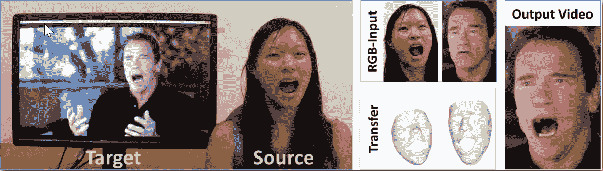

最近，我们在 Reddit 上看到了 Deepfakes 项目，使用 AI 在视频中交换人脸。起初，这项技术经常被用于处理色情视频。这些视频在被操纵的电影中与各种各样的名人制作了大量剪辑后，很快被禁止在互联网上播放。但是应用程序 FakeApp 附带的技术也允许用于其他目的，有好有坏。一个很好的例子是使用视频面试技术来消除招聘时的性别或种族偏见。但是技术发展很快，允许我们以这样一种方式交换面部，我们再也看不到视频中的面部被交换了。现在，我们有了一个绝妙的新方法来设计下一个伪装骗局。

虽然视频操作是 2018 年的尖端技术，但音频和语音操作已经存在了一段时间。Autotune 已经在音乐行业存在了很长时间，以确保歌手等的完美音高。但也有其他的选择，要么处理现有的语音，要么根据文本生成音频，并选择语音和口音。下次你接到一个你非常熟悉的人打来的电话，提出一个非常奇怪的要求时，请记住这一点。

技术上不太复杂的是使用更新的通信方法进行社会工程。每一个流行的社交网络都被用来伪装。例如，WhatsApp 已经成为一种流行的欺骗手段。2017 年，荷兰许多人上当了一个骗局，人们收到一个陌生号码的消息，上面有一个熟悉的头像和一个有人假装是图片背后的人的故事。然后，这个人开始了一段对话，并解释了陌生号码的原因，甚至试图建立语音对话。语音对话失败。但是这种尝试和谈话内容让接收者相信另一边的人是真实的。然后，攻击者向接收方请求帮助，因为支付出错，需要帮助。  *现在可以请你为我买单吗？* *下周我会把钱还给你*。在许多情况下，只有在付款后，受害者才发现攻击者并不是他们看起来的那个人。那时钱早就花光了。

WhatsApp 也经常被用于诈骗，因为它是一个很好的信息快速传播的媒介。这有助于快速传播承诺免费的信息。在荷兰，我们喜欢这样。这就是为什么它是非常容易传播的消息来自一个较大的航空公司承诺有机会赢得一个免费的假期如果你只访问他们的网站通过网址和注册。这就像典型的网络钓鱼攻击。这些攻击的新特点是 WhatsApp 不允许将 URL 隐藏在一些文本后面，比如 HTML。因此，链接必须看起来是来自航空公司的真实网站。有时，骗子会在航空公司的名称中添加域名，如  `airlinenamefreeaction.com`。最近，使用这些域名变得越来越困难，因为企业正在监控域名注册中对其名称的使用。克服这个问题的一个技巧是使用其他字符集中的符号，这些符号看起来像我们的基本拉丁字符集中的符号。例如，字符**【k】**看起来很像  **ᴋ** ，但网址[【http://klm.com](http://klm.com)与  `http://ᴋlm.com` 仍然完全不同，这是一种以假乱真的有效方法。

其他伪装者利用了这样一个事实:许多人仍在习惯银行使用的新安全措施。在荷兰，银行正在引入新的认证方法，包括二维码和一次性密码。银行已经投入巨资，以确保人们永远不会泄露电子银行的用户名和密码。尽管如此，攻击者仍然能够引诱人们进入他们能够说服受害者交出二维码的计划，从而导致不必要的银行交易。银行发起的新运动让人们意识到了这种银行盗窃模式。

由于货币总是攻击者的目标，随着加密货币的兴起，新货币现在已经成为攻击者的兴趣所在。很可能第一批非常愿意接受加密货币支付的群体是那些在勒索软件攻击中成功的群体，在这些攻击中，人们被诱骗使用对最终用户数据进行加密的应用程序，然后要求赎金来释放加密密钥。加密货币被证明是隐藏收到赎金的攻击者身份的完美方式，因为它使用了流行的加密货币，无法跟踪接收方是谁。比特币在开始时很受欢迎，但很快被更便宜、可能更好的替代品取代。

加密货币的普及和价值的快速增长，加密货币本身已经成为新的社会工程计划的目标。真正的大罪犯已经能够从交易所抢劫数以百万计的加密贵重物品，这些交易所被信任为他们的客户保存数字货币，而这些客户往往两手空空。通常，很难攻击那些更大的目标，可以预期的是，坏男孩的重点将转向最终用户或客户，他们目前正在寻找安全的方法，以某种形式的数字储物柜保存加密货币，这比旧袜子的数字等价物更好。开始时，通常的做法是将贵重物品保存在本地或外部硬盘上。我们都知道意外会发生在这些人身上。其中一个最著名的故事是，一名男子扔掉了一个旧硬盘，却没有意识到他仍然有比特币，这些比特币在他储存时价值几百美元，但截至 2017 年底，价值已经增加到一大笔钱。我相信他仍在垃圾场寻找他丢失的磁盘。今天，你可以在市场上找到第一波设备，作为保持加密硬币离线的数字钱包。即使有了这些离线钱包，也不是一切都好。事故会不断发生。安全产品会有漏洞或后门，这已经不是第一次了。

另一个问题可能是丢失访问代码。就像所有其他安全资产一样，钱包将具有某种形式的访问代码，用于访问数字贵重物品。现在你已经安全地储存了一切，  *你把钥匙放在哪里了呢？* 不在书桌上的一张黄色纸条上我猜。但是如果你把钥匙放在另一个柜子里，就会有新的挑战。  *储物柜的钥匙放在哪里？*LastPass、KeyPass、eWallet 等密码锁解决方案可能会提供一个很好的解决方案。直到你开始考虑谁应该被允许使用这些钥匙。当然是主人。但是，  *如果主人因为真的发生了很可怕的事情或者已经不在了而无法再接触到钥匙呢？* 如果你这样想，新的商品伴随着新的挑战而来。幸运的是，一些解决方案提供了克服这种情况的方法。如果你在乎你不在的时候你的东西会发生什么，你最好开始小心了。

# 乔治·多布雷亚

XEDUCO Institute 的创始人兼首席执行官， **George Dobrea** 是一名网络安全专家和著名的技术讲师，为超过 25 个国家的军事、商业和公共组织提供咨询和培训项目。自 2005 年以来，他每年都被微软授予最有价值的云计算和数据中心安全专家**(**MVP**),并被欧盟委员会授予 2016 年和 2017 年的年度讲师，他是包括 Microsoft Ignite、TechED 和 Hacker Halted USA 在内的技术会议上的热门发言人。**

 **我有时被邀请为不同组织的管理团队提供安全意识研讨会。然而，在大多数情况下，这发生在他们成为最近的安全漏洞的受害者之后，这种安全漏洞通常始于社会工程攻击。我通常从观众那里收到的一个常见问题是— *George，请告诉我们，为了在未来 100%防止此类事件，我们需要投资多少？*不用说，他们非常失望地发现，如果不结合持续的努力来建立  *人类防火墙，就没有如此高效的技术投资来为他们提供全面的保护！*

我见过的单个社交工程攻击的最高财务影响是在 2016 年。世界领先的电线电缆制造商之一 Leoni AG 曾是一个名为捕鲸攻击、**(**)****或 CEO 欺诈的骗局的受害者。****

 ****据 Softpedia 报道，一位在罗马尼亚 bis trita Leoni 工厂担任首席财务官的年轻女性成为了骗局的目标，当时她收到了一封伪装成来自该公司一位德国高管的电子邮件。这封邮件是以这样一种方式精心制作的，考虑到了 Leoni 批准和转移资金的内部程序。这一细节表明，攻击者提前侦察了公司，利用内部信息显得更有说服力。这封邮件能够欺骗收件人，让他相信这是一个真实的请求，要求从该公司的银行账户中转出惊人的 4000 万欧元。根据未经证实的消息，Leoni bis trita 分行被盗的钱最终进入了捷克共和国的银行账户。

自从 Leoni 宣布受到攻击以来，它的股票已经下跌了近 7 %,与最初转移到一个欺诈账户的 4000 万英镑相比，这代表了他们业务的更大损失。

这个案例可能为另一个问题提供了答案— *什么时候组织更容易受到社会工程攻击？* 当然，新雇员是攻击者最喜欢的目标。当人们还不熟悉新程序时，如果变更管理流程实现不佳，他们还会利用变更，特别是在具有多个单位和不同程序的复杂组织中。

2014 年，英国广播公司报道了一个有趣而非凡的创造性社会工程案例。据报道，一名被定罪的诈骗犯利用  *错别字蹲*从英国监狱逃脱。

尼尔·摩尔在还押候审时使用走私手机注册了一个域名，这个域名看起来很像英国法院和法庭服务的域名，  `hmcts-gsi-gov.org.uk`，一个真正的  `hmcts.gsi.gov.uk`的错别字。

他在新域名的 WHOIS 记录中填入了案件调查官 Det 的名字。Chris Soole 督察，向皇家法院提供地址和联系方式。然后，他冒充高级法院书记员，通过电子邮件向监狱工作人员发送保释指示，监狱工作人员于 2014 年 3 月 10 日释放了他。

这个骗局被忽视了三天，直到他的律师去采访他！三天后，他向警方自首。摩尔曾因冒充巴克莱银行、劳埃德银行和桑坦德银行的员工，通过社交网络诈骗了 180 多万英镑而入狱。通过使用声音模仿，他设法说服大型组织给他大笔的钱。

在审讯过程中，公诉人对法庭说，**很多犯罪分子的聪明才智都藏在摩尔先生的脑子里。这个案件是一个具有非凡的犯罪创造性、狡猾性和创造性的案件，所有这些显然都是被告发展出来的专长。我可以想象把这样一个人关在监狱里有多难。**

 *顺便说一句，我确实从英国新闻上了解到，一项耗资 120 万英镑、试图阻止囚犯在狱中使用手机的试点项目失败了，因为囚犯们找到了破解系统的方法。IMSI-2016 年，在苏格兰的两所监狱周围部署了捕手，收集手机的详细信息。

通过模仿基站，IMSI 捕捉器或  *捕捉器* (在美国称为黄貂鱼)可以说服附近的每部手机连接到它，然后它可以获得每部手机的详细信息。IMSI 捕手可以被设置为阻止通话，或者它可以记录通话的细节，同时将通话转移到真正的移动电话桅杆上。

我们了解到，囚犯们发明的  *创新对策* 不过是他们在监狱四周发现这个装置后，用来阻挡 IMSI 捕手视线的铝箔纸而已！

一个重要的反映是，社会工程利用了  *人类信任*的自然倾向。据报道，对网络攻击准备最充分的国家是斯堪的纳维亚国家、瑞典、挪威和芬兰。这些国家的计算机恶意软件感染率(包括计算机病毒、间谍软件、勒索软件等)最低，这是一个悖论——因为北欧国家的人们异乎寻常地相互信任，他们对机构高度信任，不幸的是，他们可能很容易成为社会工程骗局的目标！

我们应该将有效的社会工程攻击作为渗透测试的一部分吗？ 大多数渗透测试框架都包含这类测试的明确规范，被认为是任何 PT 项目的强制要求。我看到一些笔式测试团队为了让他们的攻击更成功而试图雇佣真正的演员。然而，我个人支持另一种观点:不要在渗透测试中包含社会工程！这些通常由红队成员执行的活动是有风险的，通常涉及某种形式的争议和明显的不当行为。此外，它们不可能产生有价值的结果。

大多数渗透测试以系统为目标，但是社会工程攻击以人为目标。一些活动，如泄露员工的个人设备或个人电子邮件和社交媒体帐户来执行侦察，可能会被法律认为是不适当的。然而，遭受社会工程攻击的人也会感觉很糟糕。我们已经看到点击鱼叉式网络钓鱼邮件的员工受到正式谴责，甚至被取消特权。还有  *这个测试揭示了什么？* 认为用户可以被有效地戳穿- *这是一个令人惊讶的结果吗？* 我们知道所有组织都容易受到网络钓鱼攻击！

只是  *模拟* 一种社会工程的妥协似乎是为了达到渗透测试的主要目标——为了  *产生补救工作*的一种更有用、痛苦更少的技术。例如，你挑选员工中的某个人作为  *被攻陷的* 人，获得他们的许可并保守这个秘密。进行模拟网络钓鱼测试，并将您的补救工作重点放在防止、检测和响应帐户受损后攻击者的活动上。考虑关于内部业务流程和安全意识的高效培训的建议，更一致的**访问控制列表** ( **ACL** )定义/检查，更改身份验证系统以使其更不易受到网络钓鱼的攻击(例如，**双因素身份验证** ( **2FA** ))，以及整个组织内更好的日志记录/监控/警报。

然而，  *即将到来的社会工程威胁呢？* 肯定的，我们要考虑**人工智能** ( **AI** )对攻击者产生的危险机会。在社会工程攻击中，与人类相比，AI 似乎效率更高，成本更低。Gartner 预测，到 2020 年，我们与聊天机器人的互动将超过我们与自己配偶的互动！

我们已经在大规模地与个人或商业助理进行日常互动——Siri、Cortana、Alexa、Thezboy，仅举几例，许多人甚至没有意识到他们不再与人类交谈。软件工具已经可以用来产生模仿可信声音的复杂的视觉攻击。恶意聊天机器人很容易在网上找到客户投诉，然后冒充客服人员试图补救这种情况。

比在社交网络上使用坏人制造的人工智能聊天机器人更大的风险是——还记得两年前微软的一个研究团队用`Tay.ai`——一个模仿典型少女声音的 Twitter 机器人发起的实验吗，他们必须在仅仅 16 个小时后将其离线。当该机器人开始通过其 Twitter 帐户向超过 20 万名粉丝发布煽动性和攻击性的推文时，它引起了后续的争议！而  `Tay.ai` 的创作并没有任何恶意。******* *****# mitko bogdansoki 博士

# 保护网络安全链中最薄弱的环节免受社会工程攻击

博格丹诺斯基博士。是斯科普里军事学院的副教授和其他几所大学的客座教授，在网络安全、打击网络犯罪、保护机密信息以及 IT 和电信领域拥有超过 16 年的专业经验。

Bogdanoski 博士组织、协调或作为主旨发言人和特邀发言人参加了许多国际会议、高级培训课程和高级研究研讨会，其中大多数是在网络安全和数字取证领域。他作为网络安全和网络犯罪领域的专题专家，积极参与了与土耳其安卡拉北约反恐卓越中心、克罗地亚区域军备控制和核查中心安全合作中心和其他几个机构的合作。此外，他还参与了几个旨在加强打击网络犯罪和提供网络安全最佳做法的区域和国际网络安全项目。

他是 **网络安全、企业安全和危机管理倡议** ( **C3I** )的联合创始人，IEEE 组织的高级成员，通信协会和计算机协会的成员，IEEE 计算机协会安全和隐私技术委员会的成员，IEEE 网络安全协会的成员，eSigurnost 协会的荣誉成员等等。Bogdanoski 博士还是四本书的作者/编辑，由几家国际出版商出版了 10 多本书的章节，并撰写了 70 多篇期刊/会议论文。

# 介绍

伴随着快速技术发展的全球化新时代，使得信息、思想和创新能够在全球范围内快速传递。这个相互联系的世界允许我们更多地参与全球经济，为我们的日常生活带来无数好处，但也使我们越来越容易受到新型网络犯罪的威胁。

在这个新的领域中，每个人都可能成为网络罪犯的受害者，甚至常常没有意识到。网络攻击成功的原因可能是技术性的，也可能是人为的。如果我们严格遵循所有可用于确保网络空间安全的说明，我们可以显著减少我们系统和网络的攻击面。然而，更难管理的是人的行为，这是为什么人类总是被描述为安全链中最薄弱的一环的主要原因。人性很多时候是不遵守规则的，或者在某些场合，由于各种原因，甚至打破规则。

社会工程是一种技术，它实际上依赖于利用人性中的这些弱点，而不是硬件、软件或网络漏洞。

近年来，社会工程作为一种攻击技术被大量利用。2017 年公布的上一份威瑞森**数据泄露调查报告** ( **DBIR** )只是证实这些事实的来源之一。R 参考下图:

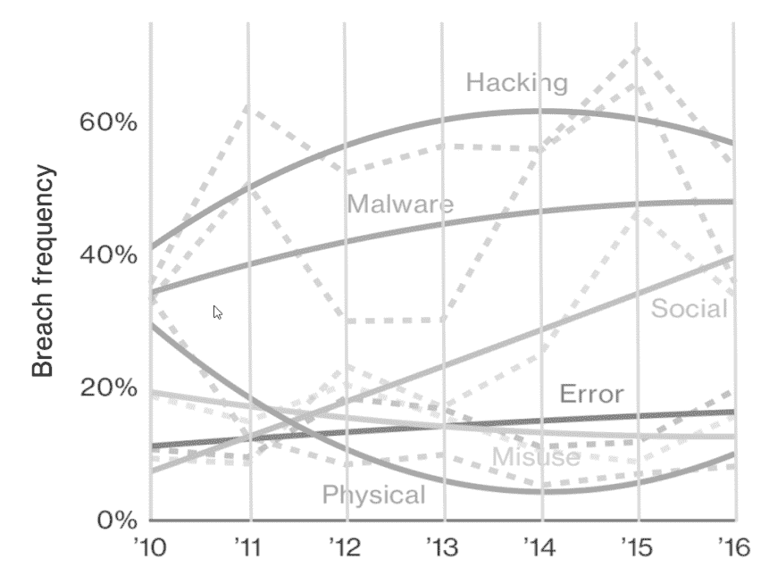Percentage of breaches per threat action category over timeFor more information on some of the facts that show the growing trend of social engineering attacks refer to [https://www.social-engineer.com/2017-verizon-dbir-social-engineering-breakdown/](https://www.social-engineer.com/2017-verizon-dbir-social-engineering-breakdown/)

此外，正如在 Verison DBIR 中可以看到的，社会工程与其他类型的网络攻击相结合的趋势持续存在，并且它正在成为恶意程序传播的攻击载体。

由于这个原因，这本书对于那些想要面对最近几年社会工程技术的使用增加的人来说非常重要。

# 社会工程定义

在网络安全中，社会工程是一个宽泛的术语，用于描述严重依赖于人类互动的信息技术攻击，通常涉及欺骗其他人打破正常的安全程序。

根据卡巴斯基的说法，参考*参考资料*部分的第 2 点，*社交工程是网络犯罪分子采用的一种技术，旨在引诱不知情的用户向他们发送机密数据，用恶意软件感染他们的计算机，或打开受感染网站的链接。*

在欧盟委员会的 CEH 材料中，参考*参考资料*部分下的第 3 点，社会工程被定义为*任何类型的攻击，本质上都是非技术性的，并且涉及某种类型的人类互动，目的是试图欺骗或胁迫受害者透露信息或违反正常的安全惯例*。

参考*参考文献*部分下的第 4 点，该点被定义为*通过与人的互动破坏组织的安全*。另一个人，凯文·米特尼克(一名曾被联邦调查局列为头号通缉犯的黑客)，将其描述为通过影响、说服和操纵利用人们的天真来获取重要信息，参见*参考文献*部分下的第 5 点。它被进一步描述为一种技能组合，未知个人利用该技能组合通过组织中的某个人获得信任和对组织的访问，从而引导他们更改 It 系统权限或最终授予个人访问权限的访问权限，参见*参考*部分下的第 6 点。简而言之，社会工程可以被定义为通过与人们的互动来欺骗他们打破正常的安全程序，从而破坏组织的安全。

社会工程基本上需要利用人们的常识从不知情的员工那里获取重要或关键的公司信息(如用户 id、密码或公司名录)。例如，这可以通过欺骗说服个人交出密码来实现。这种技术通常被黑客用于技术手段无法渗透目标系统的情况。因此，它特别针对人类心理和乐于助人的自然需求。就业务环境而言，大多数公司已经安装了高科技防御系统，如防火墙、互联网服务器加固，甚至使用安全的内部文件传输来保护其系统和网络免受未经授权的入侵，同时忽略了社会方面。组织中信息安全面临的最大风险与技术无关，而是员工和其他组织人员的不作为或行动导致了安全事故。例如，员工可能会泄露有关业务系统的重要信息，例如，组织在社交媒体上的安全平台名称可能会被恶意攻击者用于社交工程攻击。在某些情况下，员工可能会选择忽略和不报告异常活动(与信息泄露相关)，或者他可能会通过不道德的手段获得超出用户角色和凭据的敏感信息。所有这些场景都使组织面临关键和敏感信息处理不当的安全风险。社会工程也被认为是在****高级持续性威胁** ( **APT** )攻击中最常用的技术。**

 **参考*参考文献*部分的第 7 点，社会工程攻击可以分为两类——一种**间接攻击**和一种**直接攻击**:

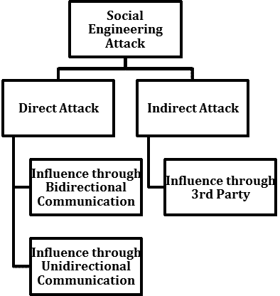Social engineering attack

如上图所示，间接社会工程攻击是指利用第三方介质(物理介质，如闪存驱动器，或其他介质，如网页)作为通信方式的事件。在这种类型的攻击中，受害者和社会工程师之间没有直接的互动。

另一方面，在直接社会工程攻击期间，受害者和社会工程师直接通信，这种通信可以是单向的或双向的，因此这种类型的攻击根据通信的方向进行分类:双向或单向通信。

双向社会工程攻击的一个例子是模仿攻击。在这里，社会工程师试图获得他直接联系的受害者可以获得的东西。

在单向社会工程攻击中，社会工程师正在与受害者建立联系，而受害者没有办法与他交流。这样的例子可以是通过电子邮件(网络钓鱼攻击)或  **短消息服务** ( **SMS** )的通信。** **# 社会工程攻击生命周期

在众多提供的社会工程攻击生命周期中，最具解释性的一个是如下提出的一个，请参考*参考文献*部分下的第 8 点。：

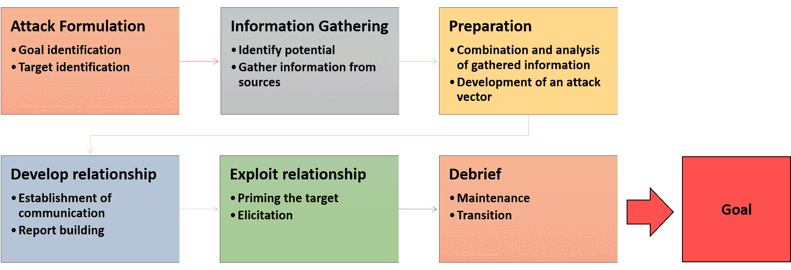Social engineering attack life cycle

本文介绍了新的社会工程攻击生命周期，它包括以下步骤:**攻击制定**、**信息收集**、**准备**、**发展关系**、**利用关系**、**汇报**。有关该型号的更多信息，请参考*参考*部分下的第 8 点。

# 社会工程攻击的分类

为了清楚地描述与社会工程攻击相关的不同术语，下图给出了社会工程攻击的分类。本节的其余部分描述了社交工程攻击的详细分类:

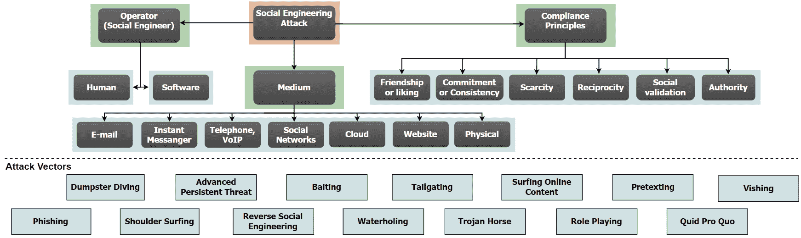Overview of our classification of attack characteristics and attack scenarios

该分类基于三个主要类别——媒体、运营商(社会工程师)和合规原则。

如*社会工程攻击生命周期*部分的*社会工程* *攻击生命周期*图所示，攻击可以通过以下媒介进行，参见*引用*部分下的第 9 点。：

*   电子邮件是网络钓鱼和逆向社会工程攻击最常见的媒介。
*   即时消息应用程序作为网络钓鱼和反向社会工程攻击的工具，在社会工程师中越来越受欢迎。他们也可以很容易地被用于身份盗窃，以利用值得信赖的关系。
*   电话、**v****IP 电话** ( **VoIP** )是社交工程师让受害者传递敏感信息的常用攻击手段。
*   社交网络为社交工程攻击提供了各种机会。鉴于它们有可能制造假身份和复杂的信息共享模式，攻击者很容易隐藏身份并获取敏感信息。

*   云服务可用于获得协作场景的情境感知。攻击者可以将文件或软件放在共享目录中，让受害者交出信息。
*   网站最常被用来执行水洞攻击。此外，它们可以与电子邮件结合使用来执行网络钓鱼攻击(例如，向银行的潜在客户发送一封电子邮件，其中包含一个恶意网站的链接，该网站看起来就像银行的原始网站)。

社会工程攻击可以由两种类型的*操作者*(社会工程师)——人类或软件来进行。尽管人类总是在任何类型的攻击背后，但由于与软件进行的攻击相比，人类进行攻击的能力较低，因此在社会工程中使用了不同的自动化工具。专业社会工程师有许多工具可供他/她使用，参见*参考资料*部分的第 10 点。这些工具的一些例子如下:

*   基于计算机(Maltego， **s** **社会工程师工具包** ( **SET** ))
*   电话(一次性电话、来电显示欺骗)
*   实物(摄像头、GPS 追踪器、开锁、录音)

有关合规原则的示例，请参考:

[https://web cache . Google user content . com/search？q =高速缓存:wx dijuzz9oj:https://pdfs . semantics holar . org/6486/78 f1 edab 0d 21399587744 b 826 D2 b24 c79 e . pdf+&CD = 2&HL = ru&CT = clnk&GL = in](https://webcache.googleusercontent.com/search?q=cache:WXdIjuszF9oJ:https://pdfs.semanticscholar.org/6486/78f1edab0d2139958070744b826d2b24c79e.pdf+&cd=2&hl=ru&ct=clnk&gl=in)

一旦选择了遵从原则、技术和媒介，就可以建立攻击媒介，社会工程师可以继续实际的攻击阶段。

社会工程攻击有许多不同的形式，可以在任何涉及人类互动的地方进行。以下是社会工程攻击技术的最常见形式:

# 网络钓鱼

网络钓鱼是指通过在电子通信介质中伪装成可信任的实体，试图获取敏感信息或使某人以期望的方式行事。这些通常是针对大群体的人。网络钓鱼攻击几乎可以通过任何渠道进行，从攻击者的实际存在到网站、社交网络甚至云服务。针对特定个人或公司的攻击称为  **【鱼叉式网络钓鱼】**。

# 翻垃圾箱

翻垃圾箱是一种从私人或公司的垃圾中筛选出被丢弃的物品的行为，这些物品包含可用于危害系统或特定用户帐户的敏感信息。

# 肩部冲浪

肩窥指的是使用直接观察技术来获取信息，例如越过某人的肩膀看他们的屏幕或键盘。

# 高级持续治疗

APT 是指长期的、主要基于互联网的间谍攻击，由有能力和意图持续危害系统的攻击者实现。现在，头号 APT 攻击媒介不是技术，而是社会工程。

# 逆向社会工程

逆向社会工程是一种攻击，通常在攻击者和受害者之间建立信任。攻击者创造一种情况，让受害者需要帮助，然后将自己装扮成受害者认为可以解决他们的问题并且值得信任的人，以接收特权信息。当然，攻击者试图选择一个他们认为有信息可以帮助他们的人。

逆向社会工程主要包括三个部分。更多信息，请参考[http://offensivecommunity.net/thread-80.html](http://offensivecommunity.net/thread-80.html)

# 下料

诱饵在许多方面都类似于网络钓鱼攻击。

关于诱饵的更多信息，请参考:[https://darkinfosec . blogspot . in/2017/04/common-attack-types-that-social-engineers-use-to-target-they-victims . html](https://darkinfosec.blogspot.in/2017/04/common-attack-types-that-social-engineers-use-to-target-their-victims.html)

# 水线

Waterholing 是一种有针对性的社会工程策略，利用用户对他们经常访问的网站的信任。受害者觉得做他们在不同情况下不会做的事情很安全。例如，一个谨慎的人可能会有目的地避免点击未经请求的电子邮件中的链接，但同一个人会毫不犹豫地点击他或她经常访问的网站上的链接。因此，攻击者在一个有利的饮水处为粗心的猎物准备了一个陷阱。这种策略已经被成功地用于进入一些(据说)非常安全的系统。

# 1.开车紧跟

另一种社会工程攻击类型被称为尾随或捎带。

有关尾随的更多信息，请参考:[https://darkinfosec . blogspot . in/2017/04/common-attack-types-that-social-engineers-use-to-target-they-victims . html](https://darkinfosec.blogspot.in/2017/04/common-attack-types-that-social-engineers-use-to-target-their-victims.html)

# 木马

这是目前黑客使用的最主要的方法之一。

有关更多信息，请参考:[http://offensivecommunity.net/thread-80.html](http://offensivecommunity.net/thread-80.html)

# 浏览在线内容

有关网上冲浪内容的更多信息，请参见:[http://offensivecommunity.net/thread-80.html](http://offensivecommunity.net/thread-80.html)

# 角色扮演

有关角色扮演的更多信息，请参考:[http://offensivecommunity.net/thread-80.html](http://offensivecommunity.net/thread-80.html)

# 抗议

伪装是另一种形式的社会工程，攻击者专注于创建一个好的借口或虚构的场景，他们可以使用它来尝试和窃取受害者的个人信息。

欲了解更多信息，请参考:[https://darkinfosec . blogspot . in/2017/04/common-attack-types-that-social-engineers-use-to-target-their-victims . html](https://darkinfosec.blogspot.in/2017/04/common-attack-types-that-social-engineers-use-to-target-their-victims.html)

# 鱼叉网络钓鱼

鱼叉式网络钓鱼要求攻击者首先收集目标受害者的信息，但成功率高于传统网络钓鱼。如果网络钓鱼攻击的目标是企业中引人注目的目标，则该攻击被称为捕鲸。

# 公平交换

与诱饵相似，交换攻击承诺以信息交换利益。

欲了解更多信息，请参考:[https://darkinfosec . blogspot . in/2017/04/common-attack-types-that-social-engineers-use-to-target-their-victims . html](https://darkinfosec.blogspot.in/2017/04/common-attack-types-that-social-engineers-use-to-target-their-victims.html)

# 视觉

这种技术基于一种老式的方法——打电话。这种类型的社会工程被称为视觉工程。他们再造了一个公司的 **i** **交互语音应答**(**IVR**)系统。他们将它附加到一个免费号码上，诱骗人们拨打该号码并输入他们的详细信息。

# 社会工程攻击的真实例子

所有这些社会工程攻击近年来被广泛使用，有时它们与其他类型的网络攻击相结合，因此它们正在成为恶意程序传播的主要攻击载体之一。

有许多现实生活中的例子显示了这些攻击的有效性。以下是过去几年中最成功的社交工程攻击列表:

*   RSA SecurID 漏洞，2011，攻击技术—鱼叉式网络钓鱼，请参考*参考资料*部分下的第 11 点。
*   美联社推特劫持，2013，攻击手法—鱼叉式钓鱼，账号接管，refer to point11*引用* 章节 。
*   针对(但不限于)金融机构的 Carbanak APT 式活动，2014，攻击技术—骗局、鱼叉式钓鱼、恶意软件、refer to point12 下 *引用* 节 。
*   纽约时报，2013，攻击手法—鱼叉式钓鱼，数据泄露，refer to point13 下 *引用* 节 。
*   2013 年红十月行动，攻击手法—鱼叉式钓鱼，恶意软件，数据泄露，refer to point14 下 *引用* 节 。

*   隐猞猁 on Bit9，2013，攻击手法—水洞，refer to point15*引用* 章节 。
*   目标信用卡泄露，2013 年，攻击手法—网络钓鱼，短信/短信，电话，refer to point15*引用* 节 。
*   Ubiquiti Networks Inc .电子邮件欺骗欺诈，2015，攻击手法—鱼叉式钓鱼，refer to point16 下 *引用* 节 。
*   劳工部网站曾经发动过一次网络攻击，2013 年，攻击手法——水洞攻击，refer to pointT5】17 下 *引用* 节 。
*   雅虎！，超过 30 亿客户账户被攻破，2013 年，攻击手法—网络钓鱼，数据泄露，诈骗，refer to point18*引用* 节 。
*   苹果，脸书，推特和微软，窃取机密信息，2013，攻击手法—水洞，refer to point19 下 *引用* 节 。
*   10000 名美国政府雇员被恶意软件攻击，2017 年，攻击技术-鱼叉式网络钓鱼/恶意软件，欺诈性帐户，请参考*参考资料*部分下的第 20 点。
*   Twitter，第三方 app 导致数百个高调账号妥协，2017，攻击手法—账号接管，refer to point20 下 *引用* 节 。
*   LinkedIn 被黑，曝光 1.17 亿凭据，2012-2016，攻击手法:数据泄露，账号接管，refer to point20 下 *引用* 节 。
*   英格玛的懈怠和网站被黑，五十万以太币被盗，2017，攻击手法——诈骗和骗局，冒名顶替，账户接管，refer to point20 下 *引用* 节 。
*   Vevo 黑客通过定向 LinkedIn 钓鱼攻击，泄密 3.12TB，2017，攻击手法—鱼叉式钓鱼，恶意软件，refer to point20 下 *引用* 节 。

# 远离社会工程攻击

虽然社会工程攻击可能看起来很可怕，但从上述案例中可以看出，如果采取适当的措施，并且组织/机构内的所有人都遵循这些措施，这些攻击的影响可以大大减轻。尽管风险可能一直存在，但不太可能发生。

参考*参考*部分下的第 *21* 点，其中提出了个人和组织/机构需要采取的不同措施。Patricia Titus 认为，为了提高可见性，针对人员、流程和技术的社会工程攻击应该单独处理。这种方法提供了更好的理解，并有助于针对这些攻击定义不同的必要措施。此外，该领域的其他知名专家也作出了贡献，提出了许多有效的对策，可以大大提高保护水平，应对我们在社会工程和总体网络安全领域面临的挑战。将中提出的所有安全措施结合起来，可以基于多层安全方法提供最大程度的保护，与单一安全方法相比，这是一种更有效的防范社会工程攻击的方法。

# 参考

1.  威瑞森 2017 年数据泄露调查报告第 10 期第 第版 2017 年 4 月 27 日检索 05.02.2018，[http://www . verizone enterprise . com/Verizon-insights-lab/dbir/2017/](http://www.verizonenterprise.com/verizon-insights-lab/dbir/2017/)
2.  卡巴斯基，社会工程-定义，2018 年 2 月 10 日检索，[https://USA . Kaspersky . com/resource-center/definitions/Social-Engineering](https://usa.kaspersky.com/resource-center/definitions/social-engineering)
3.  CEH TM
4.  米（meter 的缩写））贝祖伊登胡特、f .木桐和 H. S .文特尔，“社会工程攻击检测模型:Seadm”，载于 2010 年**南非信息安全** ( **伊萨**)。IEEE，2010 年，第 1-8 页。
5.  K.d .米特尼克和 W. L .西蒙,《欺骗的艺术:控制安全中人的因素》。约翰威利父子公司，2011 年。
6.  米（meter 的缩写））入侵人类:社会工程技术和安全对策。高尔出版公司，2012 年。
7.  木桐·f .、利能·l .、马兰·m . m .、文特尔·h . s .(2014)建立一个定义社会工程领域的本体模型。载于:Kimppa K .、Whitehouse D .、Kuusela T .、Phahlamohlaka J .(编辑)《信息和通信技术与社会》。HCC 青奥会。IFIP 信息和通信技术进展，第 431 卷。斯普林格，柏林，海德堡。

8.  弗朗索瓦·木桐，路易斯·李宁，H.S .文特尔，社会工程攻击示例，模板和场景，计算机与安全(2016)，[http://dx.doi.org/doi:10.1016/j.cose.2016.03.004](http://dx.doi.org/doi:10.1016/j.cose.2016.03.004)。
9.  K.Krombholz，H. Hobel，M. Huber，E. Weippl:《高级社会工程攻击》；《信息安全与应用学报》，22(2015)，S. 113 - 122。
10.  社会工程框架，社会工程工具，2018 年 2 月 10 日检索，[https://www.social-engineer.org/framework/se-tools/](https://www.social-engineer.org/framework/se-tools/)。
11.  Lewis Morgan，社会工程的真实实例-第二部分，2016 年 8 月 1 日，2018 年 2 月 10 日检索，[https://www . it governance . co . uk/blog/Real-life-examples-of-social-engineering-part-2/](https://www.itgovernance.co.uk/blog/real-life-examples-of-social-engineering-part-2/)
12.  罗伯特·阿贝尔，卡巴纳克团伙利用社会工程传播宏，SCMagazine，2016 年 11 月，检索到 10.02.2018，[https://www . sc magazine . com/researchers-spot-clever-social-engineering-tactic-used-to-spread-macros/article/573181/](https://www.scmagazine.com/researchers-spot-clever-social-engineering-tactic-used-to-spread-macros/article/573181/)
13.  约翰·赫尔曼(John Herrman)，纽约时报黑客始于一个简单的电子邮件骗局，2013 年 1 月 31 日，检索 2018 年 2 月 10 日，[https://www . BuzzFeed . com/jwherrman/New-York-Times-Hack-start-With-A-Simple-Email？UTM _ term = . xr 07 gwex # . nu 6 ypp2q](https://www.buzzfeed.com/jwherrman/new-york-times-hack-started-with-a-simple-email?utm_term=.xr07gwEX#.nu6YpP2q)
14.  鱼叉式网络钓鱼简史，2015 年 9 月 4 日，2018 年 2 月 10 日检索，[http://resources . infosec institute . com/a-Brief-History-of-Spear-Phishing/# gref](http://resources.infosecinstitute.com/a-brief-history-of-spear-phishing/#gref)
15.  莎拉·彼得斯(Sara Peters)，有史以来最好的 7 次社会工程攻击，DarkReading，2015 年 3 月，2018 年 2 月 10 日检索，[https://www . dark reading . com/The-7-Best-Social-Engineering-Attacks-Ever/d/d-id/1319411？](https://www.darkreading.com/the-7-best-social-engineering-attacks-ever/d/d-id/1319411?)
16.  Brian Honan，Ubiquiti Networks 万美元社会工程攻击的受害者，CSO，2015 年 8 月，检索到 2018 年 2 月 10 日，[https://www . csoonline . com/article/2961066/supply-chain-management/Ubiquiti-Networks-victim-of-3900 万-social-engineering-attack . html](https://www.csoonline.com/article/2961066/supply-chain-management/ubiquiti-networks-victim-of-39-million-social-engineering-attack.html)
17.  有史以来排名前 5 的社交工程攻击，网络安全硕士学位，2018 年 2 月 10 日检索，[https://www . cybersecuritymastersdegree . org/2017/11/top-5-Social-Engineering-Attacks-of-All-Time/](https://www.cybersecuritymastersdegree.org/2017/11/top-5-social-engineering-attacks-of-all-time/)
18.  Jamie Condliffe，麻省理工科技评论，雅虎黑客的历史，2016 年 12 月 15 日，检索 2018 年 2 月 10 日，[https://www . Technology Review . com/s/603157/A-History-of-Yahoo-Hacks/](https://www.technologyreview.com/s/603157/a-history-of-yahoo-hacks/)。
19.  卢西恩·康斯坦丁(Lucian Constantin)，攻击推特、脸书、苹果和微软的黑客组织加强攻击，2015 年 7 月，检索到 10.02.2018，[https://www . PC world . IDG . com . au/article/579233/Hacker-group-hit-Twitter-Facebook-Apple-Microsoft-intensives-attacks/](https://www.pcworld.idg.com.au/article/579233/hacker-group-hit-twitter-facebook-apple-microsoft-intensifies-attacks/)

20.  斯潘塞·沃尔夫，2017 年 10 月十大最糟糕的社交媒体网络攻击，检索 2018 年 2 月 10 日，[https://www . info security-magazine . com/blogs/Top-10-Worst-Social-Media-Cyber](https://www.infosecurity-magazine.com/blogs/top-10-worst-social-media-cyber)
21.  [1] Nate Lord，社会工程攻击:常见技术&如何防止攻击，2015 年 10 月 21 日，2018 年 2 月 10 日检索，[https://digital guardian . com/blog/Social-Engineering-Attacks-Common-Techniques-How-Prevent-Attack](https://digitalguardian.com/blog/social-engineering-attacks-common-techniques-how-prevent-attack)

# 奥赞·乌卡尔和奥尔罕·萨里

自 2006 年以来，奥赞 Ucar 公司一直从事渗透测试、Linux 系统安全和信息安全培训方面的专业服务。自 2010 年至 2017 年，他一直在他的培训和咨询公司提供信息安全培训，他是网络安全服务的联合创始人和领导者。

他是自己公司 Keepnet Labs Ltd .的创始人和董事。

Orhan Sari 研究教育科学已有 13 年，拥有许多与教育科学相关的认证  (远程学习、在线学习、机器学习、面对面  学习 - 培训 演示技能、多语言和多元文化学习等等)。他还在网络安全领域发表了许多文章和出版物。他在 Keepnet 实验室工作了 2 年，担任教育材料、博客文章等的内容开发人员。

# 请教专家——防止社会工程(SE)的建议和 SE 的个人真实经历

我们称之为社会工程，*欺骗艺术*。简单来说，就是通过欺骗/操纵目标人物来获取信息。有几种方法可以做到这一点。例如，你发送给某人以侵入他/她的电子邮件的假消息是一种简单的社会工程方式，或者一封电子邮件或短信说， *Y* *你已经赚了 500 美元* 不断，是为了欺骗你。这是一个非常熟悉的社会工程例子。

例如，关于名人的新闻比其他新闻更能吸引眼球。他们经常吸引更广泛的大众，主要是粉丝和追随者，并吸引媒体。媒体机构不得不依靠耸人听闻和夸张的新闻来吸引公众的注意力。标题越不可思议，越多读者聚集阅读新闻。当有人点击带有有趣标题的新闻链接时，这些链接通常会导致专门设计的恶意网站，这些网站利用名人的假新闻。与许多欺诈号码类似，这些网站包含恶意软件，或者受害者被定向到调查或广告网站。

每天有数百万人在社交网站上冲浪。出于这个原因，社交网络/媒体钓鱼(一种使用某些功能的误导性社交媒体平台的形式)变得普遍也就不足为奇了。这可以通过使用新的社交媒体功能和安装在您系统上的应用程序来实现，这些应用程序通常会接管您的帐户，窃取个人信息，或将您引向恶意页面。在这些情况下，您需要小心那些要求您下载某个功能或应用程序的链接。

信任是动力的巨大源泉。这就是为什么社会工程师有时会使用一种创造信任感的语言来引导你满足他们的要求，比如给出你的个人信息或金钱。您将看不到任何可疑信息，因为消息(通过电子邮件、短信或电话)似乎来自政府官员或合法的业务经理，以紧急警告的形式出现，通常要求立即对系统或财务安全采取措施。这种信息创造了一种信任感，你认为你必须按照官员的要求去做，以摆脱这种危险的局面。然而，我们必须记住，官员或合法人士绝不会通过电话或电子邮件询问个人信息。所以，无论他们的战术多么令人恐惧，在正常情况下都不会导致巨大的伤害，除非你投降。你必须小心可怕的电子邮件主题和要求你做某事的内容，否则会出现可怕的后果。

元旦或其他节日是世界各地许多人庆祝的节日，永远是社会工程师最喜欢的诱饵。你可以看到可疑的垃圾邮件和社交媒体照片，在假期提出令人难以置信的优惠。其中的链接从来不会连接到免费产品或大折扣，而是连接到托管恶意软件的网站。你应该记住，非常好的网上报价十有八九是假的。

社会工程师使用一些程序，可以从任何电话号码打电话。例如，他们可以拨打电话，就好像这是你知道的一家银行的号码，或者他们甚至可以模仿 911 之类的服务。社会工程师利用个人的信任倾向，轻易地欺骗人们捐出他们的钱。要记住的最合理的解决方案是，官方永远不会发表声明要求提供密码或信用卡信息。

正如我们所解释的，社会工程师使用各种工具和技术来操纵目标个体。网络钓鱼、vishing、smishing 和其他类型的攻击工具以各种形式组合在一起，社会工程师每天都在使用不同的场景和新的攻击技术，因为这种方法提供了巨大的经济收益和更高的成功率。

网络钓鱼攻击是个人和公司在信息安全过程中遇到的最常见和最危险的安全问题。

针对不同类型的社会工程攻击，可以根据以下建议采取措施:

*   网络钓鱼攻击不仅仅是通过电子邮件发生的！ 网络罪犯可以通过电话、短信或其他在线应用发起网络钓鱼攻击。如果你不认识发件人或打电话的人，或者如果信息内容好得令人难以置信，这可能是一个社会工程计划。
*   注意这些迹象。 如果你有一封包含拼写或语法错误的电子邮件，如果有一个紧急请求或一个看起来好得令人难以置信的建议，你应该立即删除该邮件。
*   **确认发送者。** 进行必要的检查，确保发件人的电子邮件地址是合法的。如果你接到一个要求提供个人信息的合法企业的电话，你应该关掉电话，自己联系他们的官员，核实他们的电话。
*   不要被看似真实的信息内容所迷惑！ 钓鱼邮件往往有令人信服的标识、真实的链接、合法的电话号码、真实员工的邮件签名。但是，如果邮件敦促您采取行动(尤其是发送敏感信息、点击链接或下载回复等行动)，请小心，并寻找其他网络钓鱼迹象。不要犹豫，直接与发送消息的公司沟通，因为这些公司可以验证消息的真实性，同时他们可能甚至没有意识到他们的公司名称正被用于欺诈。
*   永远不要分享你的密码。 你的密码是你的身份、你的数据，甚至是你的朋友和同事的关键。不要和任何人分享你的密码。你工作的公司和公司 IT 部门从不要求你的密码。
*   **避免打开未知发件人的链接和附件**。避免点击未经认证的电子邮件链接或附件。可疑连接可能携带勒索软件(如 CryptoLocker 或木马)。养成给浏览器写网址的习惯。除非您需要文件，否则不要打开附件。如果收到可疑邮件，打电话给发件人并验证电子邮件。

*   **不要和陌生人说话:**T3】如果接到不认识的人打来的电话，要求你提供信息，关掉手机，通知当局。
*   **小心废弃的闪存**。网络罪犯可以丢弃闪存驱动器来吸引他们的受害者，因此找到它的人可以在不知情的情况下在他们的计算机上安装有害软件。如果你发现一个废弃的闪存盘，不要把它插到电脑上，即使是为了找到闪存盘的真正主人，因为这可能是一个陷阱。
*   **删除可疑邮件。** 来自难以验证的未验证来源的传入消息很可能是恶意的。如果您有疑问，请采取行动，例如通过电话联系声称的消息来源，或者使用已知的通用电子邮件地址进行通信，以验证消息的真实性。
*   尽可能使用电子邮件过滤选项。 电子邮件或垃圾邮件过滤可以阻止恶意邮件到达您的收件箱。
*   **安装并更新杀毒软件**。使用最新的防病毒软件扫描您的操作系统，以对恶意软件采取必要的措施。
*   **定期更新所有设备、软件和附件**。为了降低电脑的风险，请经常检查操作系统、软件和插件更新，或者在可能的情况下设置自动更新。
*   备份你的文件。 经常备份您的计算机、笔记本电脑或移动设备上的文件，以便您可以在文件被恶意软件破坏时轻松恢复文件。这样，你就不必向锁定你的文件并要求打开文件的网络罪犯支付赎金。
*   培训你的员工。 超过 90%的系统漏洞都是由钓鱼攻击造成的。因此，对员工进行网络安全最佳实践培训是防止网络钓鱼攻击的最有效方法。

# Keepnet 钓鱼模拟器是一个对抗钓鱼攻击的优秀工具

Keepnet Phishing Simulator 是安全意识培训计划的一个优秀部分，尤其适用于对抗不同的社会工程攻击。无论您的网络、计算机系统和软件有多安全，安全态势中最薄弱的环节是人的因素。通过网络钓鱼技术(网络攻击中最常见的社会工程技术),很容易冒充他人并获取所需信息。因此，传统的安全解决方案不足以减少这些攻击。模拟钓鱼平台发送虚假电子邮件来测试用户和员工与电子邮件的交互。

伪造的网络钓鱼电子邮件可以有效地发现漏洞和机制，帮助企业抵御攻击媒介，如鱼叉式网络钓鱼攻击。Keepnet 实验室网络钓鱼模拟器有许多令人信服的系统和自定义网络钓鱼模板，由安全专家构建。它提供了各种资源，包括一个网络钓鱼教育页面，公司可以将其与网络钓鱼模拟结合使用。要在 Keepnet Labs 反网络钓鱼和认知平台中创建网络钓鱼活动，只需点击一下即可，查看网络钓鱼场景 | 模板列表页面中的模板。在这里，可以预览预先配置的假页面和假邮件模板:

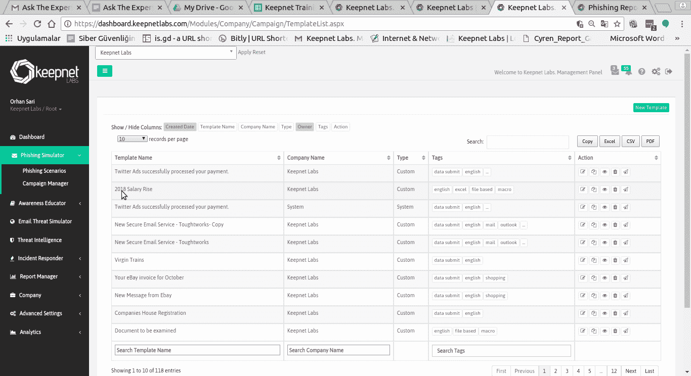Phishing scenarios

如果需要，还可以定制模板内容。设置完成后，可以通过启动按钮启动网络钓鱼活动。向员工发送模拟的网络钓鱼邮件和可定制的网络钓鱼模板很容易。可以管理预先配置或定制的网络钓鱼攻击模板:

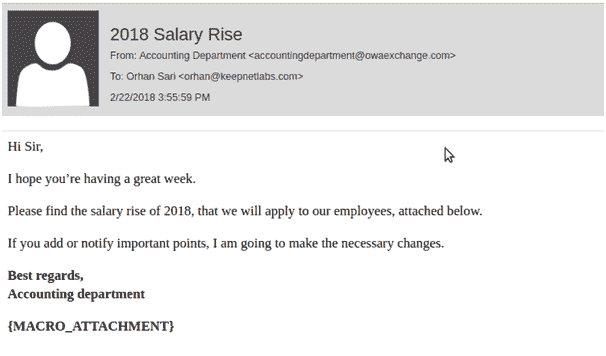Preview of 2018 Salary Rise Phishing Sample

从图 *中可以看到，网络钓鱼场景* ，可以看到预先配置的活动列表。在  操作 列下，可以编辑活动、预览网络钓鱼消息模板或启动现有活动。决定使用哪个模板后，您可以启动网络钓鱼模拟。为了仔细研究，我们决定展示 2018 年的加薪作为一个样本活动:

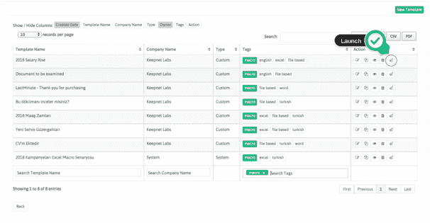Launching a 2018 salary rise template

为了启动网络钓鱼测试，首先您必须创建一个目标组来应用模拟。您需要指定您的目标组名称和组详细信息，如姓名、电子邮件地址，如示例图 *启动 2018 年加薪模板:*

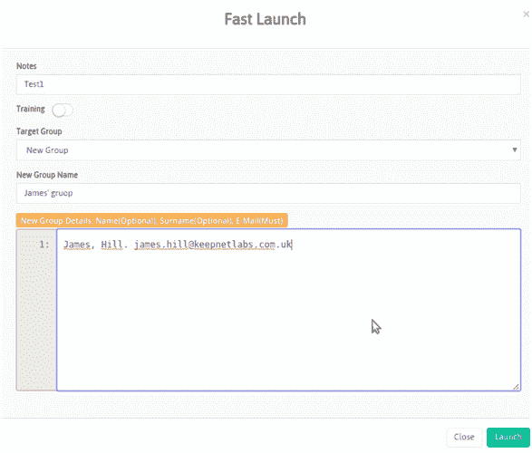Creating a target groupWhen all changes are made, Keepnet Labs will start the phishing campaign with default variables (such as SMTP, dead time, and so on).

在您创建了目标组名称和其他详细信息(如姓名和电子邮件地址)后，您可以启动网络钓鱼模拟。

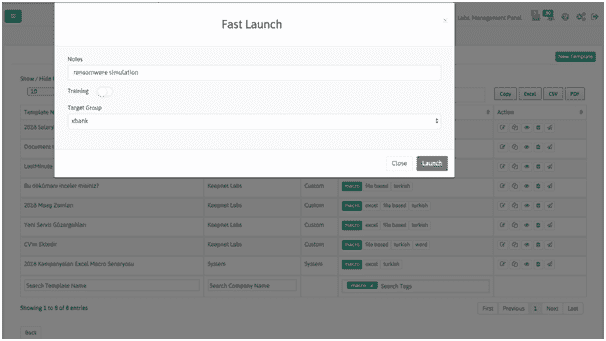Launching Simulation

在此窗口中，您将明确在网络钓鱼模拟中使用哪个目标群体。因此，您将输入已创建的目标组的名称。

因为我们选择启动 2018 加薪模板作为示例，所以目标用户会在收件箱中收到一封电子邮件，如下图所示。如果目标用户意外下载了附件，他/她会在自己的计算机系统上安装恶意应用程序:

2018 Salary Rise Phishing Scam

在网络钓鱼模拟的环境中，上图显示了一个通过活动发起的网络钓鱼电子邮件的示例。可以看出，这封电子邮件是针对那些处于管理职位，并已准备好社会工程技术的个人。这封假邮件冒充会计部门，以收到经理对 2018 年加薪的批准为场景，旨在不引起怀疑，并打开 2018 年加薪文件。不怀疑该电子邮件的经理在下载其电子邮件中的附件时，会在屏幕上看到以下 Excel 文件:

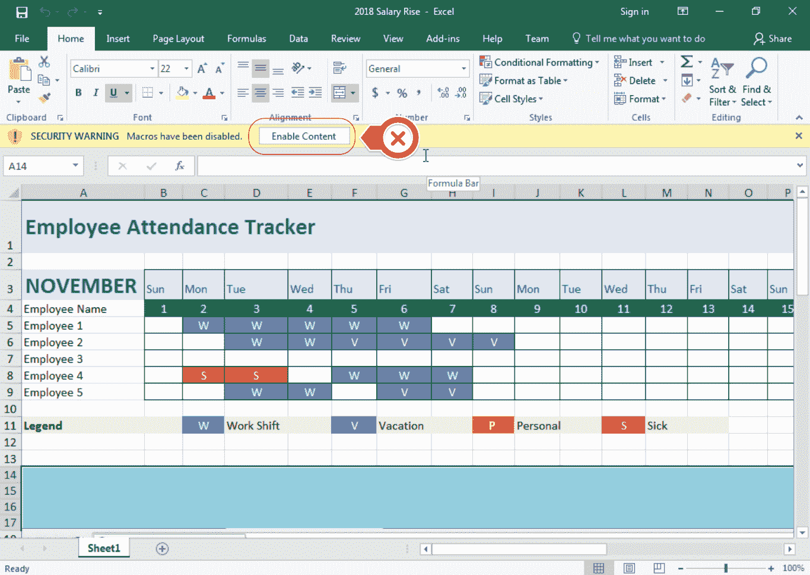2018 Salary rise phishing Scam

当目标用户打开邮件中附带的 Excel 文件时，会显示启用内容选项，以便查看全部内容。如果目标用户不理解此陷阱并单击“启用内容”按钮，恶意软件将安装在计算机系统上。当然，用户不会受到影响，因为我们做的是模拟。然而，在 Keepnet Labs 钓鱼模拟器平台上，在报告部分，人们可以看到发送给目标用户的 2018 年加薪电子邮件的详细信息。例如，如果此邮件中的链接或附件已打开，或者凭据已提交，则可以在报告部分看到。我们自己以此为例进行了测试，我们将 2018 年加薪的假邮件发送到了我们自己的邮箱。在下面的截图中，可以详细看到我们与 2018 年涨薪文件的互动:

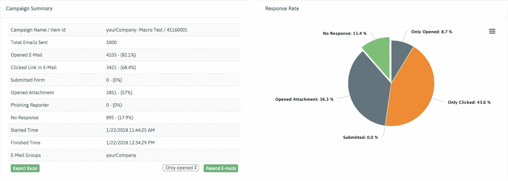Report of 2018 salary rise# 模板管理

可以从  网络钓鱼模拟器 选项卡中选择并准备网络钓鱼攻击中要使用的场景。在  钓鱼场景 页签中可以看到系统中的场景样例。

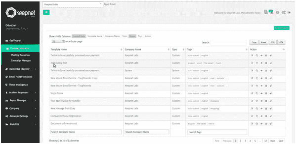Template list

在模板列表中，通过  下的按钮 栏，可以进行与模板相关的各种操作，如编辑和预览邮件等。

# 编辑按钮

可以使用保存按钮编辑并保存现有模板:

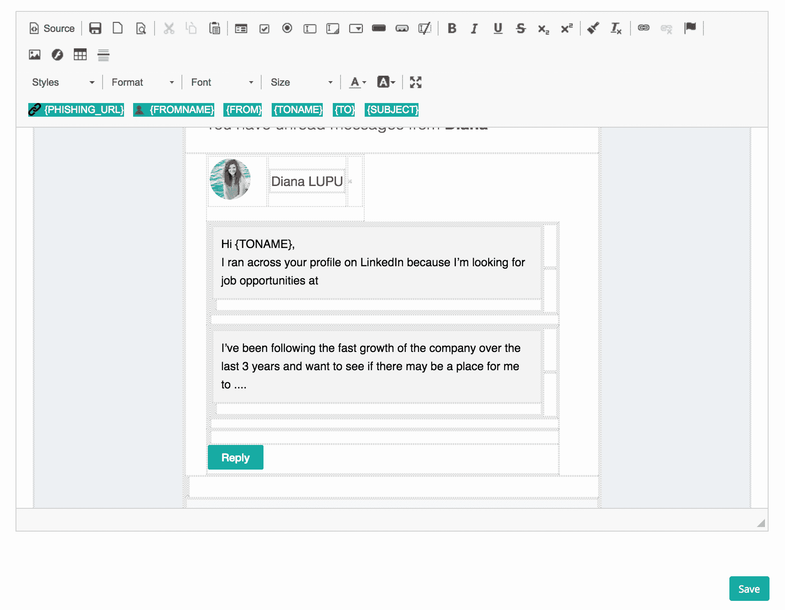Template editing# 添加新模板

模板组件由扩展名为`.eml`的电子邮件样本组成。为了将电子邮件转换成模板，必须将其保存为`.eml`文件格式。

下面演示了一个创建模板的示例。

It will depend on the email client, so you should check the options for email users.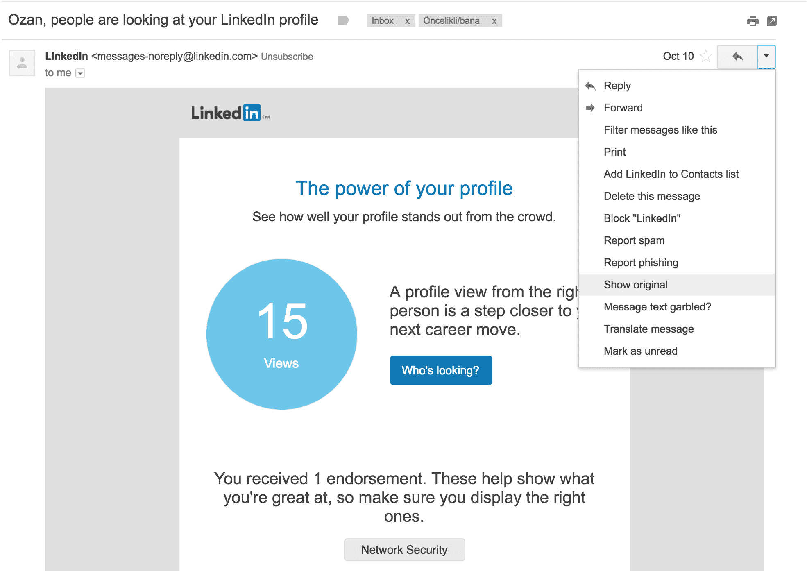Original email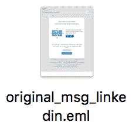File with email .eml file extension content

该电子邮件可以用作虚假网页，或者可以根据请求创建网页。借助互联网浏览器的查看源代码功能，可以访问 HTML 代码并将其保存为`.html`扩展名:

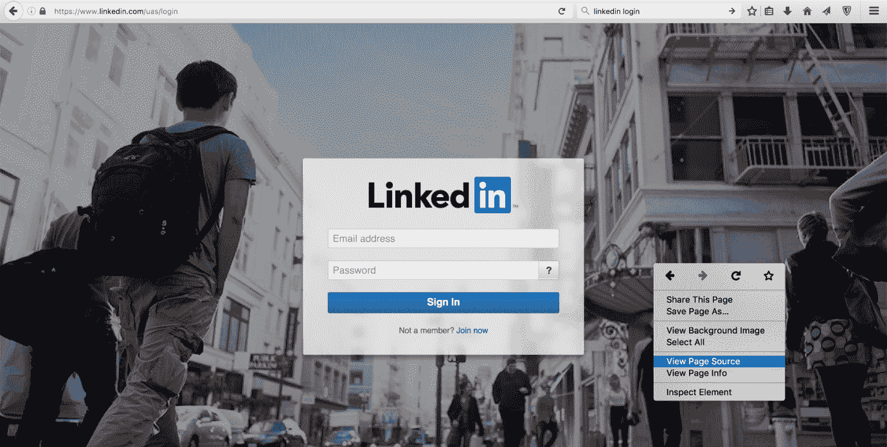Original page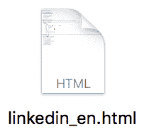Source code of the original file

要从仿冒页面获取信息进行网络钓鱼，您可以通过文本编辑器打开`.html`文件，并通过在输入区域中键入`captured="email", captured = "password"`(内容可以根据模板或所需信息进行排列)，以及通过将捕获的按钮参数写入按钮部件来进行排列:

Edits made in an HTML file

要创建新模板，必须使用创建的`.eml`和`.html`文件访问  钓鱼场景**|**|新模板 选项卡:

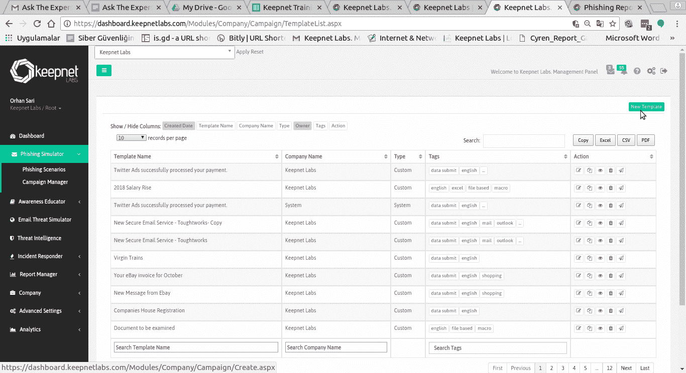Template creation page

要创建的模板的名称在此步骤中指定。在模板文件步骤中，通过点击选择 FilT5【e】T6【按钮，可以查看并保存为`.eml`文件扩展名。在编辑页面中，选择并保存通过模板文件 | 选择文件准备的`.html`文件。需要注意的是，选择的`.html`文件名和默认文件名必须相同。

Template editing page

可以在此页面中编辑电子邮件内容中的链接、名称和电子邮件信息。编辑后，网络钓鱼 URL 在活动管理器中定义，虚假网页将在相同的 URL 打开:

{PHISHING_URL}

通过使用事件响应器模块轻松报告和分析网络钓鱼电子邮件，Keepnet 实验室使您的员工只需点击一下鼠标即可报告可疑的网络钓鱼电子邮件。

# 报告管理器

全面的反网络钓鱼和网络安全意识平台教会员工如何识别和应对网络钓鱼电子邮件。Keepnet 实验室用模拟网络钓鱼攻击测试您的员工。Keepnet Labs 意识教育和网络钓鱼模拟器还展示了您的员工在培训方面的能力和进步。Keepnet 实验室提供了一套完整的解决方案来测试、评估和培训最弱的员工，并应对网络钓鱼攻击。

Keepnet Labs 网络钓鱼报告选项允许您向您的员工发送邮件，查看他们的漏洞以及与电子邮件的交互情况。此外，通过允许用户单击一次即可报告可疑的网络钓鱼电子邮件，将他们转变为识别和避免网络钓鱼电子邮件的主动代理，有可能降低组织风险:

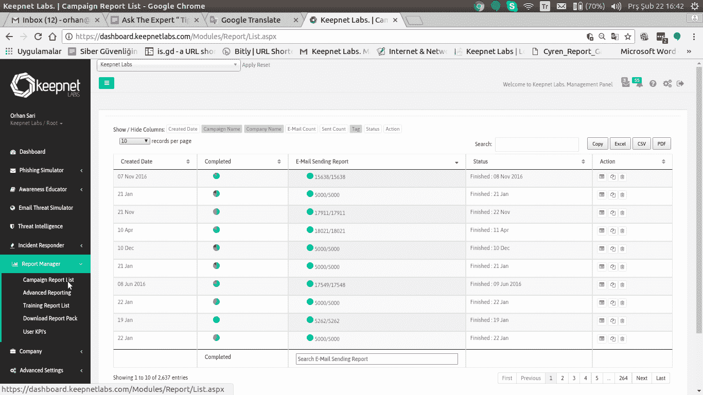Report manager

报表管理器允许用户详细查看活动报表或培训报表等操作。使用活动报告列表 t 、  可以查看活动列表。使用  操作 部分下的选项，可以删除活动或查看活动详情，包括摘要、统计数据、打开的电子邮件详情、点击的链接详情、提交的表格等。

此外，使用  培训报告列表 **，** 可以查看培训列表。使用  操作 部分下的选项，可以删除培训或查看培训详情，如摘要、统计、打开的培训邮件详情、查看持续时间等。

活动报告列表 页签中的概要 部分提供了活动的简要概要:

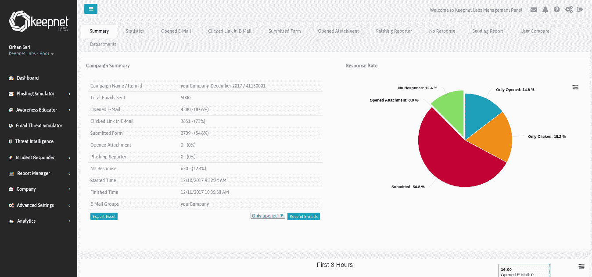Summary

使用  导出 Excel 选项，可以将活动的所有私人和一般细节转移到 Excel 文件中。也可以  重发邮件。

统计数据  以部门和浏览器为基础给出用户信息:

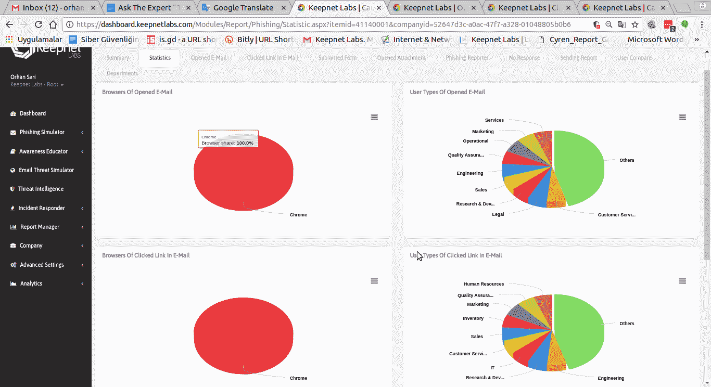Statistics

打开的邮件告诉我们是谁打开了这封邮件。 计数 标签包含大量关于用户阅读电子邮件的时刻、他们的个人信息和其他细节的细节:

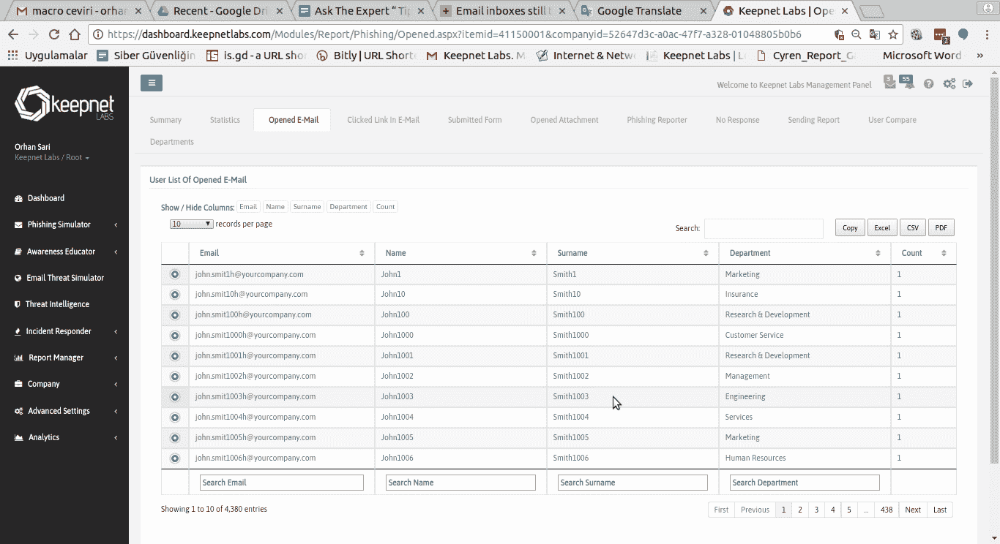Opened E-mail

在网络钓鱼活动中，在用户被重定向到虚假页面后，用户对虚假链接的点击也会被详细报告。日期-时间、部门和点击次数的细节都被报告。同样，为了保密，我们在下面的示例中隐藏了目标用户的姓名和电子邮件详细信息等列:

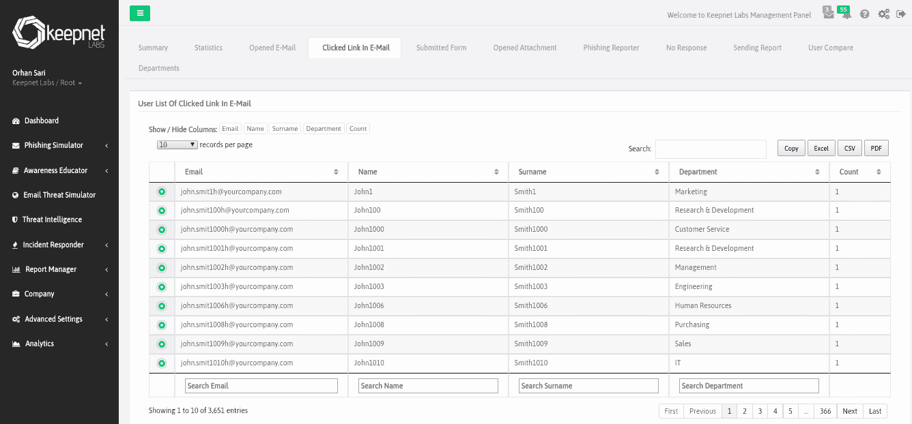Details of users clicked on relevant link

如果信息在网络钓鱼活动中被盗，捕获的信息将在此选项卡上报告:

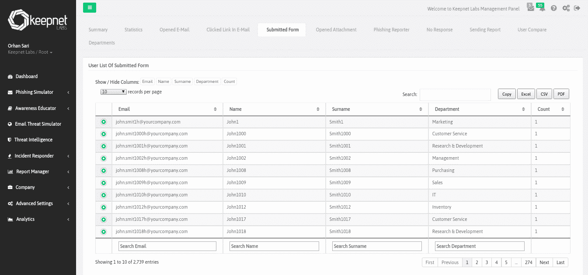Details of users entered their information**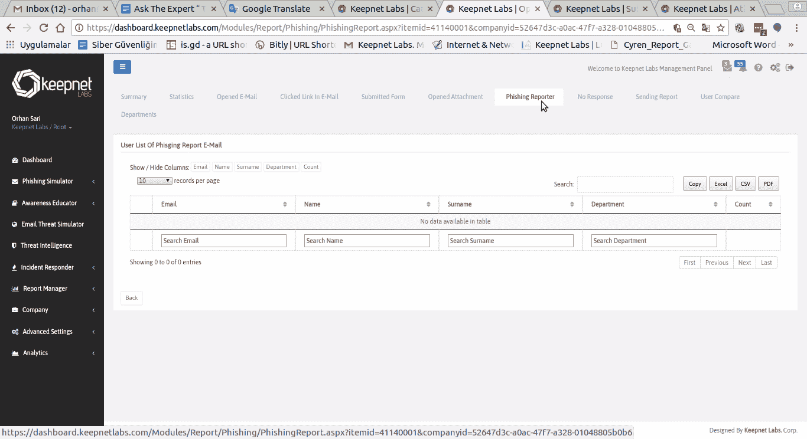** Phishing reporter

还可以查看那些将该活动报告为网络钓鱼诈骗的人的详细信息。当用户怀疑模拟电子邮件时，他们可以使用 Keepnet Labs 提供的 Outlook 插件将此电子邮件报告为网络钓鱼:

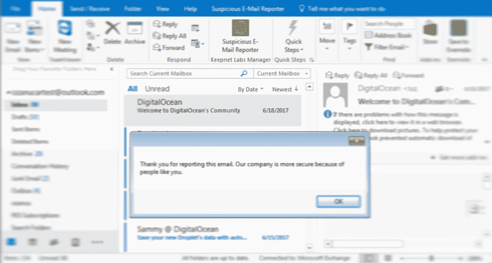Keepnet Labs phishing reporter plugin

未回复邮件的用户显示在  未回复 T5】部分:

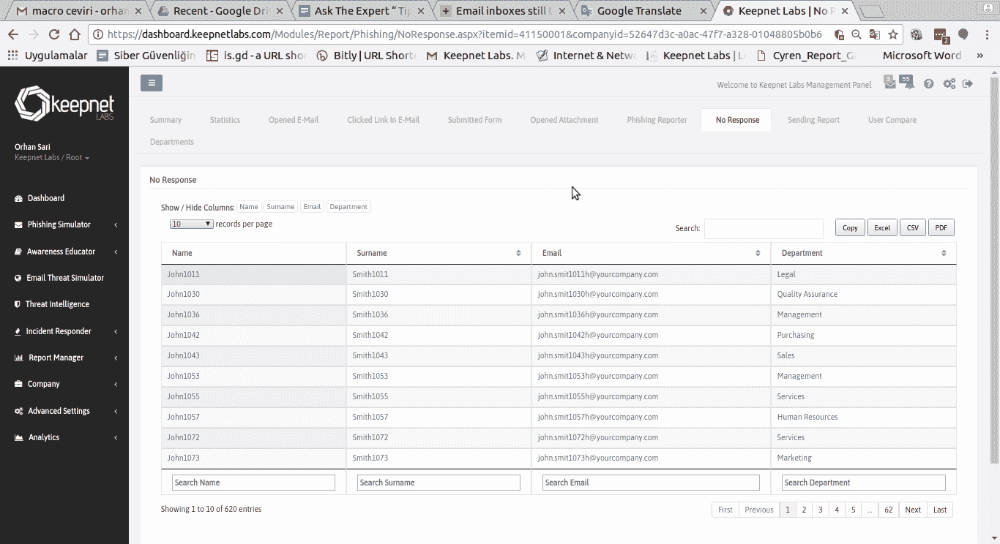No response

电子邮件服务发送的电子邮件的状态可在发送报告部分查看，包括未成功提交:

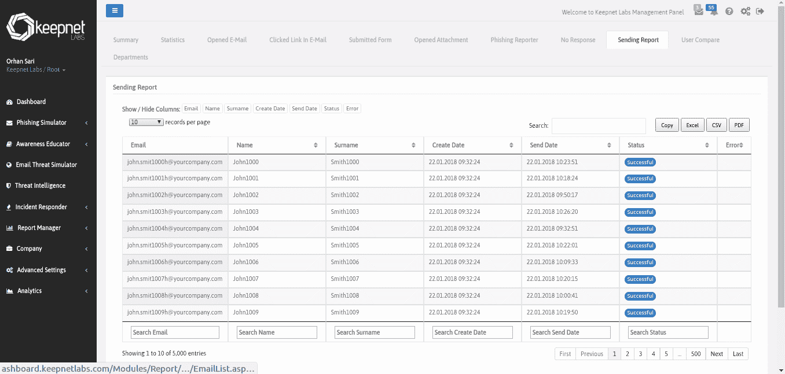Case of send email

基于两个不同用户电子邮件地址的基准测试选项根据当前活动的结果比较两封电子邮件:

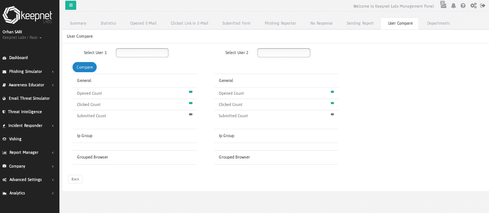User comparison

部门 s 部分给出部门的详细用户信息:

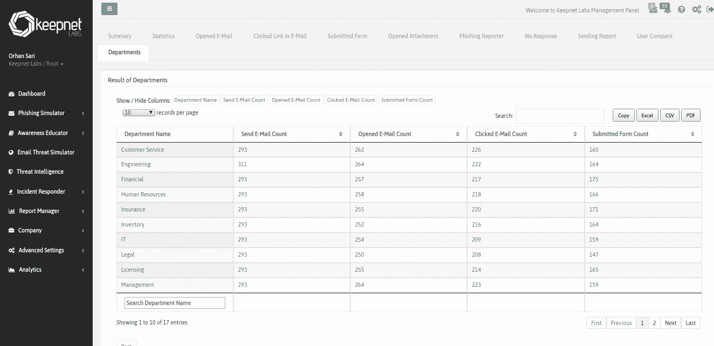Reporting on a department basis

Keepnet Labs 网络钓鱼测试软件，即网络钓鱼模拟器，是执行模拟网络钓鱼测试和虚假攻击的一种经济有效且有影响力的方式。Keepnet Labs Phishing Simulator 可以评估员工与电子邮件的交互，并使能够评估他们的整体安全状况。Keepnet 实验室网络钓鱼模拟器有许多令人信服的系统和自定义网络钓鱼模板，由安全专家构建。它提供了各种资源，包括一个网络钓鱼教育页面，公司可以将其与网络钓鱼模拟结合使用。

# 网络钓鱼事件响应者

如前所述，在 Keepnet Labs 反网络钓鱼和感知平台中，还有一个网络钓鱼事件响应器。这款基于收件箱的全自动反网络钓鱼解决方案利用集成的新一代技术，帮助您在 1 分钟内分析可疑电子邮件。事件响应者帮助查找事件、警告用户或从用户的收件箱中删除电子邮件！

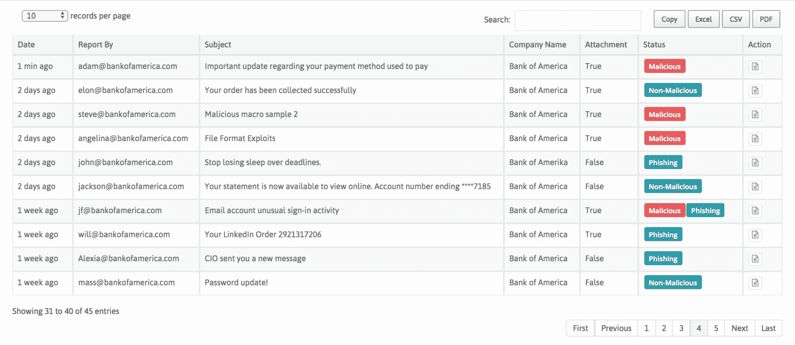Incident Responder detection of malware

事件响应器模块允许用户一键报告可疑电子邮件，将电子邮件内容发送到 Keepnet Labs 进行标题、正文和附件分析。

根据恶意软件结果，事件响应者创建各种攻击签名，用于警报生成或阻止主动安全设备。事件响应者的用户体验非常简单。要通过 Outlook 或浏览器插件报告可疑电子邮件，只需单击一下:

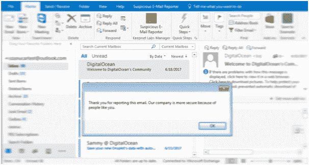Incident Responder Plugin

事件响应模块与 Virustotal、Zemana Anti-Malware、Trapmine 和 Roksit DNS 防火墙集成，这些产品的许可证捆绑在一起，为您节省了数千美元。您可以搜索和检测可疑电子邮件属于哪些用户，并采取预防措施，只需点击一下。发送给事件响应者的电子邮件将被彻底分析。首先，使用集成的反垃圾邮件服务检查邮件头以进行异常检测和垃圾邮件控制。检查邮件正文以进行 URL 信誉控制、恶意内容检测以及使用人工智能检测可疑内容。

此外，使用防病毒服务对照已知恶意软件控制检查附件，使用防恶意软件沙盒技术检测未知恶意软件，使用防漏洞技术检测零日文件格式漏洞。事件响应者还与第三方服务  **合作。** 如果您使用 Fireeye、Bluecoat 或 Palo Alto 等威胁分析服务，我们可以将它们集成起来，以自动执行分析操作，从而节省时间。

# 萨米拉希奥

**Sami Laiho** 是世界领先的 Windows 和安全专家之一。Sami 从事操作系统故障排除、管理和安全方面的工作和教学已经超过 20 年。Sami 的会议被评为 2014 年 TechEd 北美、欧洲和澳大利亚最佳会议，2016 年和 2017 年北欧基础设施会议最佳会议，以及 Ignite 2017 最佳外部演讲人。Sami 也是 PluralSight 的作者和 TechMentor 会议新任命的会议主席。

二十多年来，我一直在教授和实现高度技术化的安全措施，但一次又一次，我看到违规行为的发生主要是因为简单的社会工程行为。

有时候失败的是物理安全和程序，比如几年前我去过的奥斯陆的酒店。我从接待处拿了一张门卡，上了六楼，发现门卡坏了。我下去买了一个新的，再上去，它还是不工作。我去了，酒店接待员告诉我锁可能没电了。他跟我上来，给锁充了电，测试了我的卡——还是不行。他说我可以安顿下来，过一会儿再下来拿另一把钥匙。他用他的万能钥匙让我进去，我注意到他的钥匙更厚，是塑料做的，而我的是木头做的。午夜时分，我下楼注意到一个非常年轻的女人在大厅里工作。她忙于接待许多顾客。我问她是否能做一把新钥匙，她做了。我又上去了，还是不行。我开始有点恼火，但决定用魅力而不是愤怒来表现。我下楼对她说，  *我的钥匙还是没用。你能给我做一把像你同事那样的钥匙吗，这样它就可以是塑料钥匙而不是木制的*。她说她不知道她是否可以，但她会去里屋检查。她回来了，给了我一把塑料钥匙，小声对我说，  *给你，但不要告诉任何人，因为它能打开所有的门*。我用万能钥匙打开了数百个房间。

这个场景很多东西都失败了。她肯定会把钥匙给我，但她的经理也没有在归还后立即销毁万能钥匙，而是把它放在里屋的桌子上。如果人不按程序走，或者没有受过良好的教育，再好的技术方案也无济于事。

如果你问我在工作中最常见的社会工程方法是什么，我会说是网络钓鱼。人们将他们的密码或私人信息插入不应该插入的地方。有几个非常简单的小技巧来对付这种情况:

*   尽可能使用 **m** **多因素认证**(**MFA**)—它可以杀死 99%的基于网络钓鱼的系统攻击。
*   不要在两个不同的网站上使用同一个密码。使用带有强主密码的系统，然后在密码后面加上几个你注册的网站域名的字母。或者让事情变得更简单甚至更安全——投资一个好的密码管理器。现在，如果你掉进了网络钓鱼的陷阱，你只需要改变一个密码，而不是数百个。

当你需要保护电脑免受恶意软件感染之类的时候，我相对确定我可以教你怎么做——归根结底，这只是技术、功能、零和一。保护你不把你的秘密口头告诉别人要困难得多。你可能会被父母用来控制孩子的基本相同的伎俩所玩弄:勒索、威胁和贿赂。

为了防止勒索，最好的规则是永远不要把你不想公开的东西放在互联网上。为了不受到威胁或数据被破坏，最好的建议是做好测试过的备份。

对于贿赂，我真的没有什么好的建议，除了让你记住，如果有人给你很多钱来获取信息，通常是出于非法目的。

Please refer to the link [https://www.packtpub.com/sites/default/files/downloads/LearnSocialEngineering_ColorImages.pdf](https://www.packtpub.com/sites/default/files/downloads/LearnSocialEngineering_ColorImages.pdf) for the images of this chapter.*******