# 十四、请教专家——第四部分：Oguzhan Filizlibay 

# 后果——社会工程攻击之后会发生什么？

Oguzhan Filizlibay 自 1997 年以来一直从事 IT 和系统安全领域的工作，职业生涯中曾在土耳其、英国、阿联酋和大 EMEA 地区的多家公司工作过。自 2004 年加入微软以来，他一直参与 Windows 网络，专攻产品安全性、可靠性、安全事件响应和恶意软件逆向工程。他开发了几个围绕网络安全、恶意软件检测和删除以及事件分析的工具。他经常在安全活动上发言，并就 Windows 系统上的安全事件响应和取证分析举办研讨会。他为欧洲和中东的主要国家和公共安全组织提供培训。Oguzhan 目前是微软 WW 企业网络安全组的中东和非洲企业安全主管。

在对给定网络目标的社会工程攻击做出响应时，您可能会遇到多种类型的端点设置。受害者可能是在浏览器内部进行 pwning 的目标，这是一种纯云攻击；受害者可能是工作站/最终用户家庭系统的目标，也可能是他们的移动设备的目标。在这一节中，我将详细说明在 Windows 机器上使用流行的电子邮件和浏览器客户端在受害者的系统上会发生什么。我们将分析可能留下的文物。

*2016 年第三季度，包含某种勒索软件的网络钓鱼电子邮件的数量增长到 97.25%，高于 2016 年 Q1 会议的 92%*，PhishMe 第三季度恶意软件审查。

*Ransomware Delivered by 97% of Phishing Emails by end of Q3 2016 Supporting Booming Cybercrime Industry*, November 17, 2016 available at [https://phishme.com/ransomware-delivered-97-phishing-emails-end-q3-2016-supporting-booming-cybercrime-industry/](https://phishme.com/ransomware-delivered-97-phishing-emails-end-q3-2016-supporting-booming-cybercrime-industry/).

我们继续看到大量使用电子邮件作为攻击企业网络的载体，正如之前的研究和许多其他研究表明的那样，这一趋势没有任何放缓的迹象。考虑到这一点，许多公司正在使用多种方法的**端点检测和响应** ( **EDR** )解决方案，以及许多不同级别的电子邮件安全解决方案。在防止恶意电子邮件进入给定目标环境时，可以实现多种类型的解决方案，例如:

*   已知由攻击者控制的域和 IP 地址的传统黑名单
*   基于签名的入站/出站电子邮件控制
*   基于软件的沙盒解决方案，可以模拟操作环境和解析器软件
*   爆炸室式解决方案，让电子邮件的内容和附件在多个不同的设置中完全执行，然后分析其效果

尽管采取了所有这些保护措施，但狡猾的攻击者仍有可能通过电子邮件渗透到最终用户的收件箱中。虽然以前的控制措施在减缓和阻止大多数恶意内容方面发挥了很大作用，但天才攻击者仍然有机会绕过这些控制措施，除非您将环境配置为仅接受来自已知发件人的内容，否则当前的电子邮件方法将允许这些情况存在。

受 EDR 解决方案保护的系统将使您能够更轻松地将可能导致整个系统受损的事件(从执行远程代码的电子邮件客户端或解析器软件开始)与可能表明受损的系统变化联系起来。EDR 解决方案结合使用机器学习和威胁英特尔/妥协指标，将系统/软件活动与攻击者行为相匹配。让我们来看一封进入公司环境的示例电子邮件，它将执行远程代码。

假设您收到一封标题为 Invoice 的电子邮件，看起来非常像下面的内容，虽然您不会尝试打开它，但让我们想象一下，攻击者结合各种策略成功地将这封电子邮件发送给您。他们可能在这封邮件之前使用了一个辅助渠道，如 SMS，来创建对这封邮件的预期，从而使您更有可能打开该文档。此电子邮件中发送的 ZIP 文件受密码保护；这有助于:

1.  用户收到一封带有 ZIP 文件的电子邮件，并通过另一个渠道(如 SMS)收到了 ZIP 文件的密码:

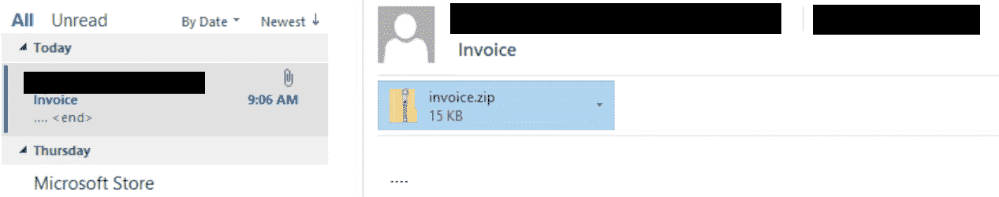

2.  用户被指示将附件保存到他们的桌面(如果他们双击，`Word`将通知他们文件的来源，并要求用户在运行其中包含的宏之前启用该内容):

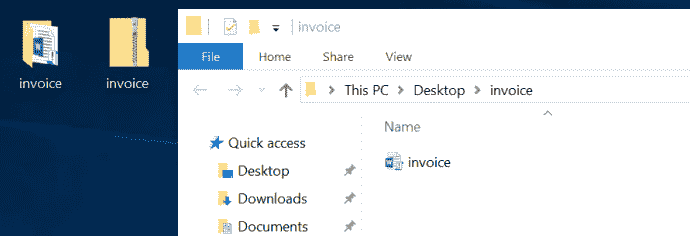

3.  用户将文档保存在桌面上，并在提供密码的同时将其解压缩到一个文件夹中。使用来自`sysinternal`的`Streams.exe`,我们来看看每个文件上的区域标识符 NTFS 流。请注意`invoice.zip`文件中的区域标识符数据，这是一个来自互联网的附件。当您从附件中打开文档时，从 Outlook 中打开并一直打开到 Word，系统会提示您附加的安全警告，说明这不是来自受信任位置的受信任文档:

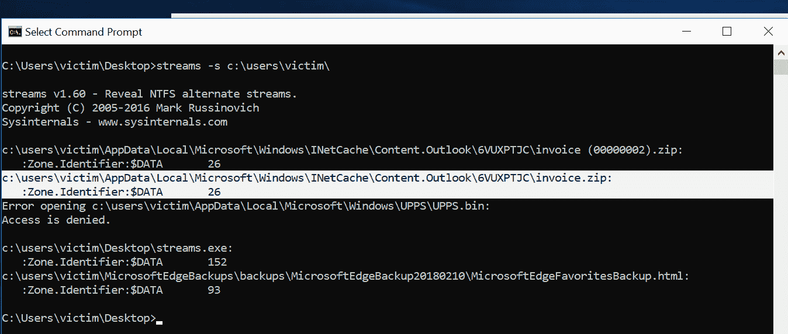

4.  现在，还要注意，如果用户将文档保存在桌面上，然后按照指示将其解压缩到文件夹中，将没有区域标识符:

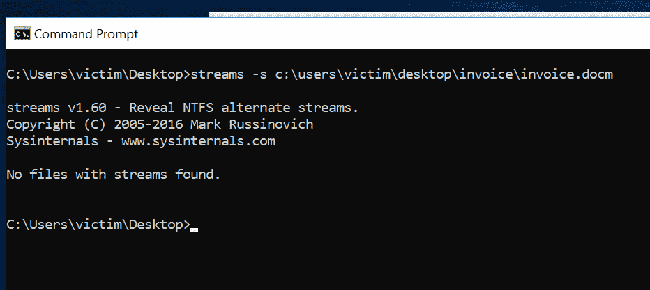

5.  现在，用户开始打开文档:

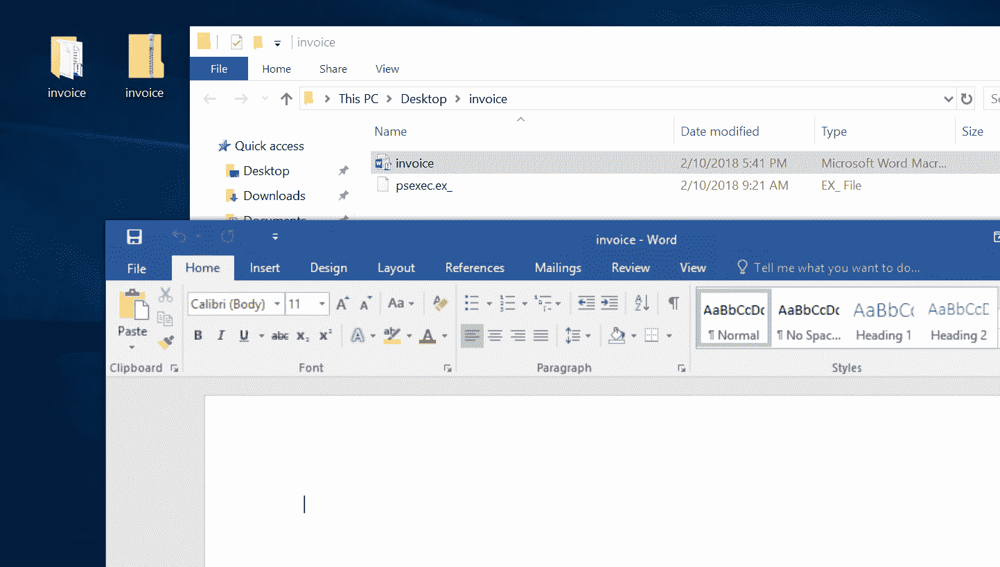

6.  此时，即使文档是启用宏的文档，它也被视为本地文档，因为它没有 Outlook 通常用来标记它的任何来源标识符。文档从网上下载`psexec`并写入与文档相同的位置并启动。此时，可执行文件或其他代码可以下载到端点上，同时确保绕过端点安全措施。

7.  在 VBA，附加到文档的`Open`事件的宏被执行，对于这个特定的例子，我在`Open`函数中有以下内容:

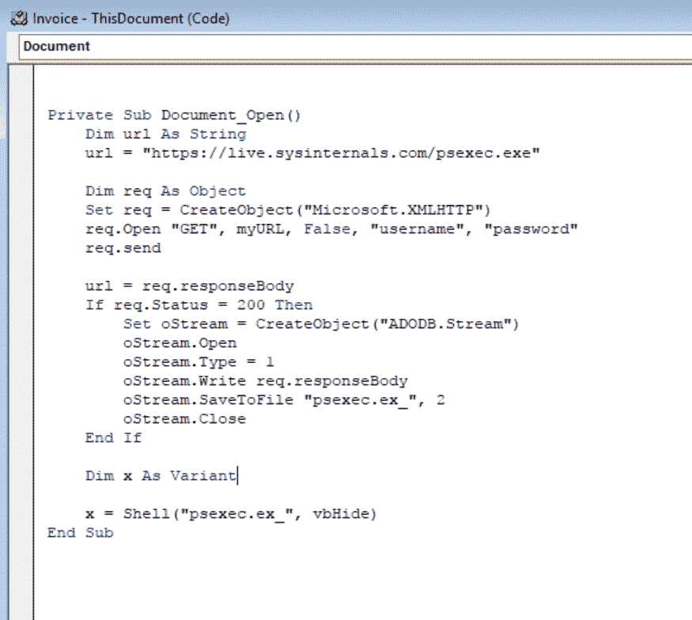

8.  `psexec`现在正在本地上下文中运行:

此时，由于攻击者已经能够在终端上执行远程代码，因此您可以监控一些变化，一旦您检测到来自该终端的恶意活动，您可以将该系统搁置一边以供进一步分析。你要做的第一件事是获得用户本地 OST 文件的副本，并在第一时间获得电子邮件的副本。

恶意软件在本地机器上自我清除，但是它通常无法清除邮箱，因为清除本地机器上的用户邮箱需要花费精力和 MAPI 编程。在任何情况下，即使清理了本地收件箱，Exchange 服务器也会保留已删除邮件的副本，以便根据您的邮件策略进行恢复。

首先要看的是附件中包含的代码。首先要问的几个问题如下:

1.  这是一次只有我们受到的有针对性的攻击，还是一场更大规模的互联网攻击的一部分？

知道这个问题的答案是有用的，因为这有助于确定你必须付出的回应努力的水平。如果您确定攻击不是有针对性的，您还不如让您的安全供应商为它创建签名，然后继续前进。如果是有目标的，你会想知道更多，尤其是他们的目标是什么，以及他们能进入你的网络多深。

2.  *他们使用的入口载体，即电子邮件附件，是否由于零日或未打补丁的软件漏洞或配置缺陷而能够执行远程代码？*

在零日漏洞的情况下，它变得非常有趣，因为您发现了一个软件错误，而其他组织可能还没有被攻击过，或者很少被攻击过，并且很少在攻击中使用。具体来说，在 Office 文档作为附件的情况下，您可能会遇到两种常见的格式:旧的 OLE 格式(二进制格式)和新的 Open XML 文档格式。

对于旧的、2007 年以前的、`.doc`、`.xls`和`.ppt`文件，用于提取节和二进制组件的最佳工具之一是使用 Office Mal 扫描仪或诸如`oledump.py`之类的工具。对于新的 DOCX、DOCM、XLSX 和 XLSM 格式，您可以进行复制，将它们重命名为`.zip`扩展名，然后查看文档文件夹结构的内容。关于文档的大多数元数据将是文本 XML 格式，易于阅读。

For more information refer to links at [http://www.reconstructer.org/code/OfficeMalScanner.zip](http://www.reconstructer.org/code/OfficeMalScanner.zip) and [https://blog.didierstevens.com/programs/oledump-py/](https://blog.didierstevens.com/programs/oledump-py/)[.](http://www.reconstructer.org/code/OfficeMalScanner.zip)

但是，您真正感兴趣的是查看附件是否包含零日漏洞或其他软件漏洞。为此，您可以再次使用 Office Mal Scanner 或 XORSearch:

For more information refer to [https://blog.didierstevens.com/2014/09/29/update-xorsearch-with-shellcode-detector/](https://blog.didierstevens.com/2014/09/29/update-xorsearch-with-shellcode-detector/).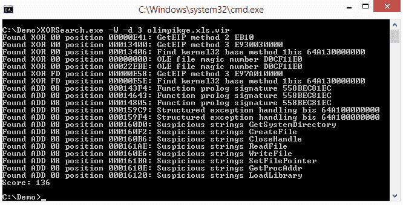

在我们的例子中，我们使用了一个 DOCM 文件，按照惯例，它告诉 Word 它是一个 open XML 规范的 Word 文档，但也包含宏代码。在您的分析师系统上，复制 DOCM 和文件，并执行以下步骤:

1.  复制一份`.docm`文件，并将其重命名为扩展名`.zip`。解压缩这个新文件的内容，以便您现在可以浏览以下文件夹结构:

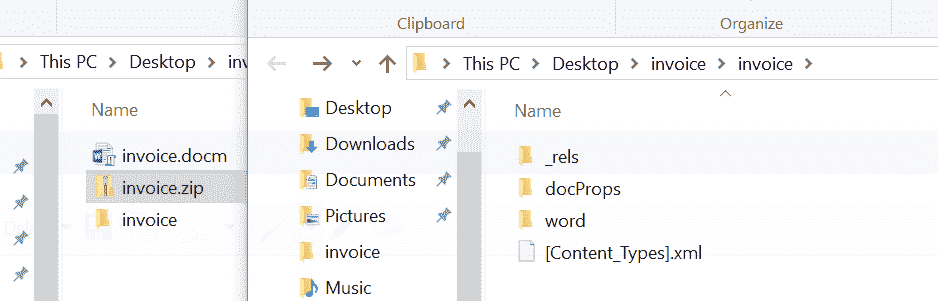

2.  在`word`文件夹下，您将看到文档内的内容和媒体以及其他信息。在我们的例子中，它看起来如下:

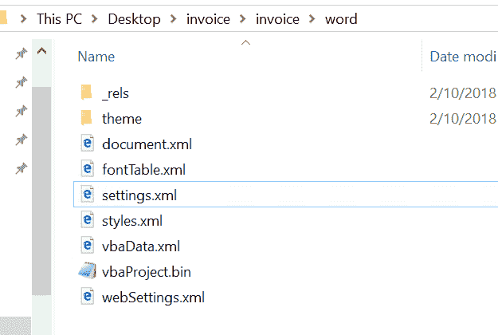

要提取 VBA 宏，您可以使用 Word VBA 环境本身，并制作该文件的副本。

# 去他妈的

Yalkin Demirkaya 先生作为一名侦探调查员和侦探指挥官拥有 20 年的执法经验。除了担任计算机犯罪调查股的指挥官之外，德米尔卡亚先生还担任纽约州警察局内务局的**首席信息安全官** ( **CISO** )。Demirkaya 先生负责创建第一个计算机犯罪调查单位，专门负责政府部门的内部调查。Demirkaya 先生开创并完善了计算机犯罪调查的调查技术。作为一名白帽黑客，他拥有 29 年的计算机经验。他是纽约警察局内务局计算机犯罪调查股的创始人和指挥官。

# 首席信息官未经授权访问电子邮件

# 案例研究 1–事故响应报告样本

# 背景

1.  XYZ 公司聘请 Cyber Diligence，Inc .提供与 XYZ 公司网络上的工作站试图连接到东亚某大国 IP 地址的事件相关的数字取证和网络调查服务。
2.  本报告由 Cyber Diligence 编制，基于 Cyber Diligence 对 John Doe 先生使用的 HP Elitebook(序列号# CCC0000XXX)的取证分析。
3.  法医分析是由 Cyber Diligence 的调查人员在 Yalkin Demirkaya 先生的直接监督下进行的。他的简历见附件 1。

4.  我们的调查方法包括确定是否有任何法医证据表明笔记本电脑:

# 事故响应

5.  数字取证分析是一个非常全面、耗时的过程。调查人员可能要花费数百个小时来深入检查来自单个设备的电子证据，甚至是一天的捕获互联网流量；然而，在大多数情况下，由于现实的成本和时间限制，这是不可行的。Cyber Diligence 根据客户的需求进行了详细的法医调查。如客户要求，可进行额外的法医分析。
6.  作为事故响应的一部分，我们对目标的笔记本电脑进行了非常详细的取证分析。除了传统的分析方法(如检查 Windows 事件日志、Windows 注册表内容、文件夹创建、应用程序执行证据、关键字搜索等)之外，调查人员还执行了其他步骤来确定这台计算机是否受到了威胁。
7.  我们将笔记本电脑的取证映像作为磁盘分区安装到取证工作站，并执行恶意软件扫描，以发现设备上是否存在任何恶意代码。
8.  恶意软件扫描表明存在两个名为`drprov.dll`和`acpage.dll`的潜在恶意 dll。一个名为`ieinstal.exe`的潜在恶意进程被发现；但是，对可疑 dll 和进程的进一步分析显示它们是误报。

9.  为了消除笔记本电脑被高度复杂的*零日*型漏洞(传统分析和扫描方法无法检测到的漏洞)感染的可能性，我们克隆了目标笔记本电脑的原始硬盘，将取证克隆安装到笔记本电脑中，并在沙箱中使用客户端提供的登录凭据启动笔记本电脑，内置网络取证收集器可拦截所有网络流量。从 2017 年 7 月 23 日到 2017 年 8 月 23 日，HP Elitebook 被置于沙盒中，并被允许在受控环境中运行。所有入站和出站互联网连接和内容都被拦截和分析。如果计算机受到任何形式的攻击，使得攻击者能够对其进行访问，连接尝试就会被网络取证设备捕获。对捕获的网络流量的详细分析显示，存在多个可疑连接和连接尝试的实例，如下图所示。更多详情见*附件 2:*

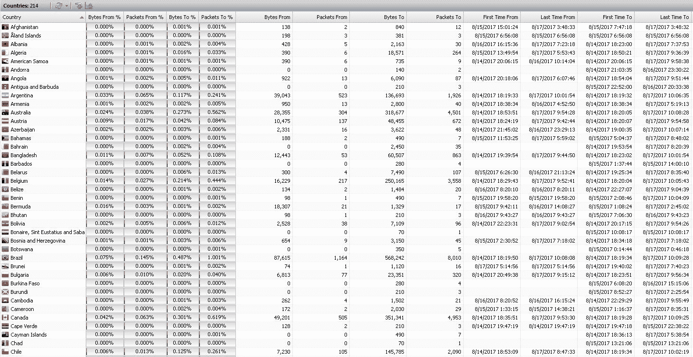

10.  通过使用内存分析工具，从 HP Elitebook 硬盘的 RAM 映像中提取了 5，681 个 DLL 文件和 95 个可执行文件(`.exe`)。这些文件然后在基于云的恶意软件扫描引擎中进行处理。不出所料，只有很少一部分命中来自扫描过程。进一步的调查显示它们是假阳性。分析没有显示任何恶意软件的存在。

11.  我们利用 Windows 系统工具探索配置为在系统启动时自动运行的进程，监控系统中运行的所有进程以检测可疑活动，并监控已建立连接的网络活动。在实时状态分析过程中，我们观察到设备试图与世界各地的服务器建立大量连接，并确定了进行连接尝试的进程。
12.  执行了额外的取证分析，以识别驱动器上存在的潜在恶意文件。这一步表明存在名为`2b2a83.bat`的潜在恶意文件。使用逆向工程工具和技术对可疑文件进行了进一步分析，详见以下*恶意软件分析*部分。

# 恶意软件分析

# 概观

13.  本节包含我们对在受感染系统的硬盘和内存(RAM)中发现的恶意文件的分析。
14.  在我们的初步分析中，我们发现了一种被称为“无文件恶意软件”的攻击类型，在这种攻击中，黑客无需安装额外的软件就可以让受害者的操作系统对自己不利。随着恶意软件家族 WMIGhost 和 Poweliks 的出现，这种类型的攻击在 2014 年末开始流行。这些恶意软件威胁很难检测和清除，因为它们使用非常规的位置来隐藏其有效载荷。这也是为什么这种情况下的恶意软件一年都没有被发现的主要原因之一。
15.  最初的发现(JDSODM23 / EMM 字符串)让我们相信这次攻击在某种程度上与被称为黑暗彗星鼠的恶意软件有关；然而，在对恶意软件进行深入逆向工程后，我们发现恶意二进制文件实际上是 Kovter 恶意软件家族的样本。
16.  Kovter 是一个*无文件木马*,已经存在了 2 年多。它开始流行的样本最初在受感染的机器上执行点击欺诈，直到样本被观察到将比特币矿工和加密锁样本放入受害者的 PC。

# 持久性机制

17.  被感染的系统有多个 LNK 和 BAT 文件，位于 AppData 和 Startup 文件夹中。这些文件夹由合法软件使用，可以用最低系统权限访问，因为它们不需要管理员权限。大多数现代恶意软件将这些位置用于持久化/自动启动目的。见下图:

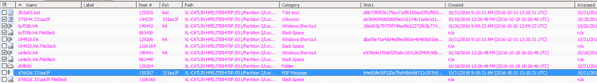

18.  目标系统有这些文件的多个实例，这表明系统不止一次暴露于初始攻击媒介。攻击可能源于虚假的软件更新、包含恶意宏的 Word 文档或破解的软件。
19.  Kovter 使用随机生成的文件扩展名(`331aa3f`)作为其持久化机制，并将该扩展名注册为可执行扩展名，这使得攻击者能够在相关文件被执行时获得控制权。仅仅有一个可执行的扩展对于自动启动是不够的。为此，科夫特在位置`C:UsersA001372AppDataLocald0fb902b2a83.bat`创建一个 BAT 文件，并将一个 LNK 文件放入`%USER%AppDataRoamingMicrosoftWindowsStart MenuProgramsStartup`。见下图:

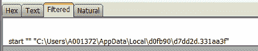

20.  通过检查注册表，我们发现`331aa3f`扩展名仅仅是`33eb18`扩展名的一个转发器，它执行恶意软件，而不管带有`331aa3f`扩展名的文件的内容。这解释了在随机命名的文件中观察到的垃圾数据。见下图:

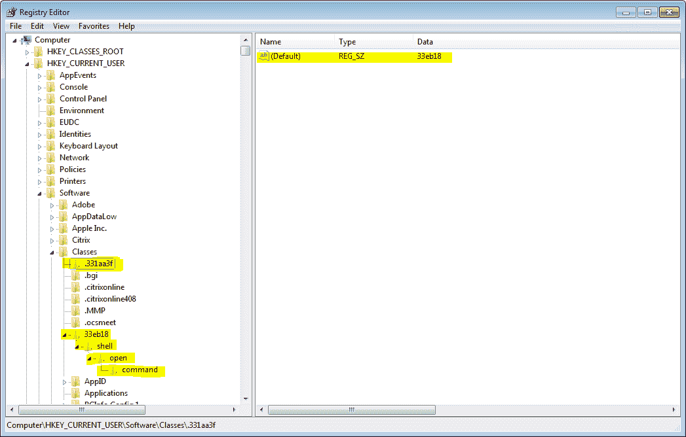# 恶意软件的执行

21.  每当系统重新启动时，都会执行以下操作:
    1.  LNK 文件由操作系统从启动文件夹执行
    2.  LNK 文件执行 BAT 文件
    3.  BAT 文件以扩展名`331aa3f`开始文件
    4.  `331aa3f`扩展注册表值转发到`33eb18`扩展注册表值
    5.  Shell | Open | 命令被执行，第一个恶意脚本运行

这为恶意软件提供了在系统启动时自动启动的机会。

22.  从下面的截图可以看出， **MSHTA** 是一个合法的 Windows 可执行文件，支持运行 JavaScript 文件。该功能经常被恶意软件作者利用，用于运行编码/加密的恶意 JavaScript 文件，作为恶意软件的初始起点。见以下截图:

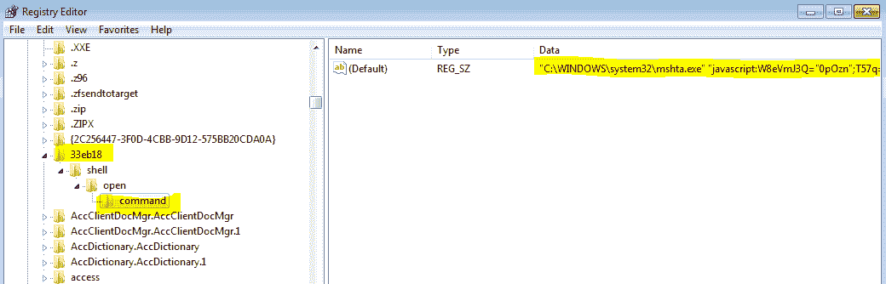

23.  在这个实例中， **MSHTA** 使用 JavaScript 命令行参数运行，并执行下面截图中的脚本:

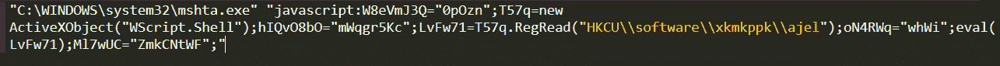

24.  这是一个混淆的 JavaScript 文件，它提供对`WScript.Shell`对象的访问，使恶意软件作者能够读取任何注册表值。Kovter 使用多个编码/加密的注册表值，可以在下面的截图中看到:

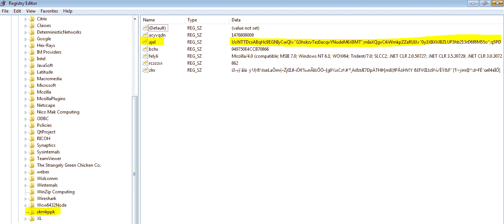

25.  注册表值`ajel`和`zlrx`是这些值中最重要的。`AJEL`值是一个混淆的 JavaScript 文件，由 **MSHTA** 读取，作为攻击的第二阶段。这个阶段也包含 PowerShell 脚本，并读取 **ZLRX** 注册表值，该值包含攻击的最后一个阶段，并将这个二进制文件注入一个合法的进程(`regsvr32.exe`)。这种技术被称为 *Reflective-PE* ，与恶意软件作者以前使用的技术一样，很难检测和阻止。

26.  将恶意二进制代码注入合法进程被称为*进程空洞化/运行*，可以被现代反恶意软件解决方案轻易发现；然而，Kovter 使用了一种更复杂的技术，并没有取消对`regsvr32.exe`主模块的映射——这将允许反恶意软件解决方案将进程标记为可疑。相反，它将恶意模块注入到地址`0x280000`中，而合法的`regsvr32.exe`保存在地址`0xA50000`中，不会被恶意软件作者取消映射。见以下截图:

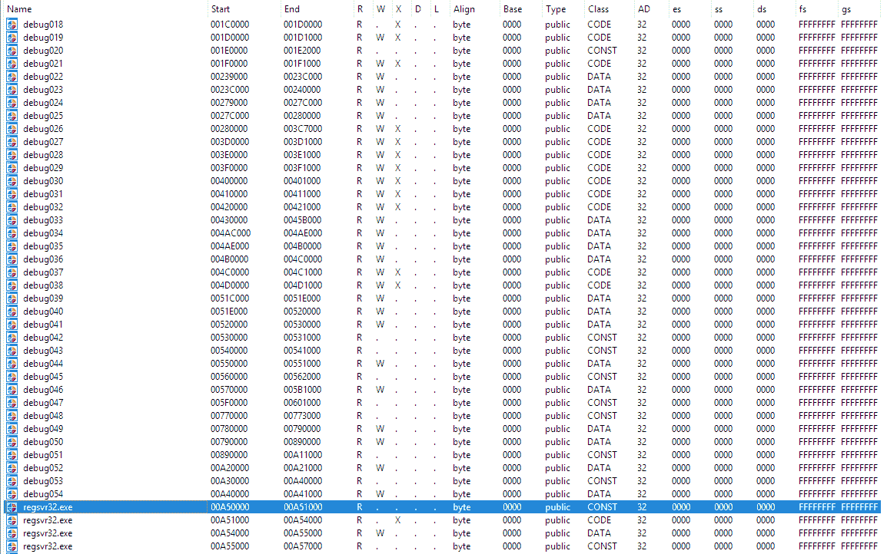

27.  大多数现代恶意软件会破坏 PE 头信息，这些信息是在`0x280000`发现的，但在这次事件中并非如此。在地址`0x28000`的 PE 映像是一个 Delphi 编译的可执行文件(MZ -帕斯卡)；由于其广泛的本地支持和无第三方依赖性，Delphi 是恶意软件作者中流行的编程语言。见以下截图:

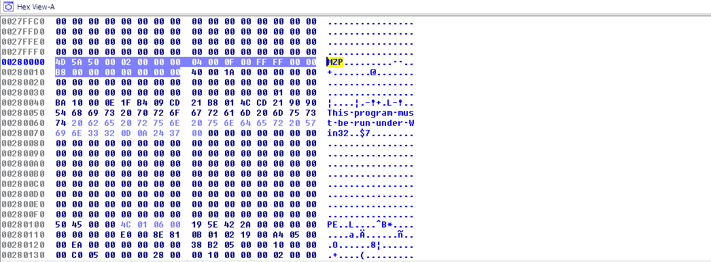

28.  由于可疑的字符串和之前使用暗彗星鼠的科夫特运动，我们最初认为样本可能将暗彗星鼠注入`regsvr32.exe`；然而，进一步的分析为我们指出了正确的方向。见以下截图:

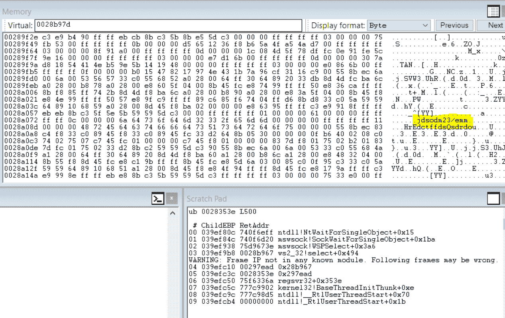

29.  通过从地址`0x02DB25F`处的实际起始点对恶意二进制文件进行反向工程，我们观察到对`LoadResource` Windows API 的引用，在恶意软件被构建并准备好进行恶意软件活动之后，大量恶意软件使用该 API 来嵌入配置信息。见以下截图:

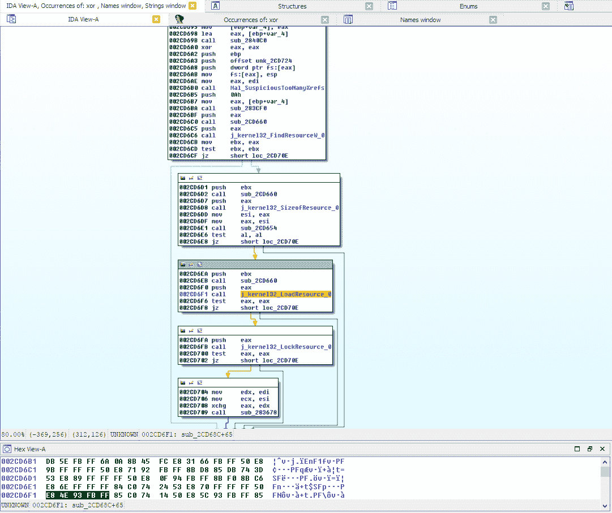

30.  通过从内存中转储恶意二进制文件，我们能够恢复恶意软件的资源部分，这似乎是加密的。参见*图 12* :

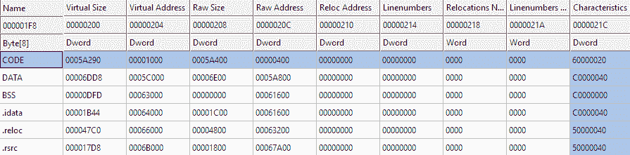

31.  经过进一步检查，我们发现加密资源数据的格式如下:
    1.  偏移量`0x00` : 16 字节长的逆序加密密钥(在下面的截图**中突出显示)**
    2.  偏移`0x10` : RC4 加密/ BASE64 编码配置文件

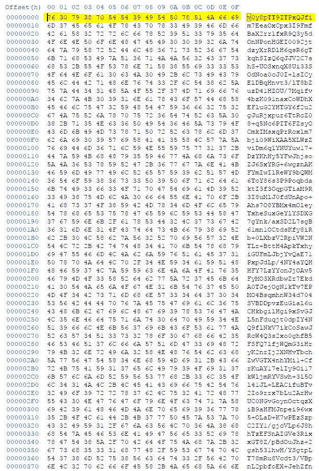# 配置

32.  我们能够从示例中转储并解密这个配置部分。这是分析过程中最重要的部分，可以让我们深入了解恶意软件的配置目的。
33.  通过使用 16 字节的密钥对配置文件进行解密，我们能够看到恶意软件正在使用的**命令和控制** ( **C & C** )服务器的列表。见以下截图:

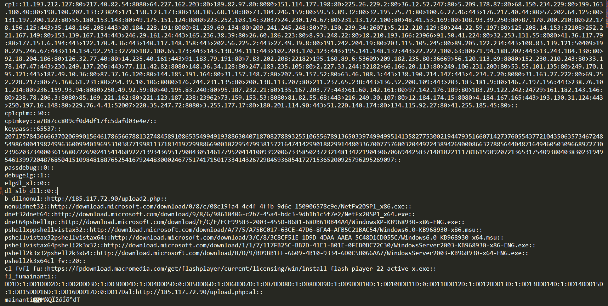

34.  这时，我们意识到我们正在分析一个科夫特样本。
35.  该恶意软件的配置文件总共包含 129 台硬编码的 C&C 服务器，如下图所示:

| `11.193.212.127:80``217.40.82.54:8080``64.227.162.203:80``189.82.97.80:8080``151.114.177.198:80``225.26.229.2:80``36.12.52.247:80``5.209.178.87:80``68.150.234.229:80``199.163.180.40:80``190.100.202.133:23824``171.158.123.173:80``158.185.68.150:80``73.104.246.159:80``59.53.89.32:80``32.195.75.71:80``100.6.27.46:443``176.217.40.44:80``57.202.64.125:80``131.197.200.122:80``55.180.153.143:80``49.175.151.124:8080``223.252.103.14:32037``24.230.174.67:80``231.13.172.100:80``48.41.53.169:80``108.93.39.250:80``87.170.200.210:80``22.178.156.125:443``35.148.166.208:443``20.184.228.191:8080``81.239.69.134:80``209.241.245.248:80``79.150.239.34:26071``5.212.210.129:80``244.22.59.197:80``125.208.14.153:32108``252.221.167.149:80``153.139.167.134:443``246.29.161.24:443``165.236.38.39:80``26.60.186.223:80``8.93.248.22:80``18.210.193.166:23966` | `91.50.41.224:80``32.253.131.55:8080``41.36.117.79:80``177.153.6.194:443``122.170.4.36:443``140.117.148.158:443``202.56.225.2:443``27.49.39.8:80``191.242.204.19:80``203.115.105.245:80``89.205.122.234:443``108.83.139.121:50409``190.225.246.67:443``114.134.92.251:32728``182.180.65.173:443``143.138.94.111:443``102.203.170.123:443``195.141.148.132:443``22.222.100.63:80``71.94.188.202:443``13.243.184.130:80``92.18.204.186:80``126.32.77.40:80``14.235.40.161:443``91.183.79.191:80``7.83.202.208:22182``195.160.89.6:53609``209.182.235.80:36669``56.120.113.69:8080``152.230.210.243:80``33.178.147.47:443``230.249.137.206:443``77.111.42.82:8080``148.36.34.128:80``247.183.235.105:80``2.227.33.244:32182``66.166.20.113:80``249.106.231.200:80``53.55.101.135:80``249.170.195.121:443``187.49.10.36:80``87.37.16.120:80``144.185.191.164:80``31.157.148.7:80` | `207.59.157.52:80``63.46.108.3:443``138.190.214.147:443``4.234.7.20:8080``31.163.27.222:80``69.252.228.217:80``75.168.61.231:80``254.39.10.106:8080``176.244.231.135:80``200.138.113.207:80``211.237.65.238:443``136.52.200.109:443``203.183.181.9:80``146.7.197.156:443``238.76.101.214:80``236.159.93.94:8080``250.49.92.59:80``40.195.83.240:80``95.187.232.21:80``135.167.203.77:443``61.60.142.161:80``97.142.176.189:80``183.29.122.242:24729``161.182.143.146:80``238.78.206.3:8080``85.169.221.162:80``221.123.187.238:23962``73.159.153.53:8080``81.82.55.68:443``216.249.30.107:80``12.184.174.15:8080``4.184.167.165:443``193.130.31.124:443``250.197.16.148:80``229.76.4.41:52007``220.35.247.72:8080``3.255.177.17:80``180.201.114.90:443``51.220.140.174:80``134.115.92.27:80``41.255.185.45:80` |

36.  尽管大部分 C&C 服务器都已瘫痪，但这些服务器仍被恶意软件用于抓取点击欺诈链接、播放提供的广告，以及在后台静默点击提供的链接，如以下截图所示:

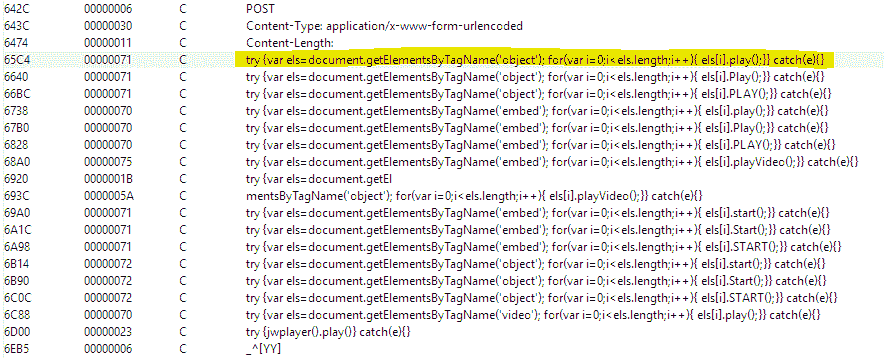

37.  尽管该恶意软件能够从其 C&C 服务器运行其他恶意模块，并充当远程后门，但在我们的沙箱(安全运行恶意软件的虚拟空间)分析期间，我们尚未观察到此类行为。

# 结论

38.  受害机器感染了众所周知的恶意软件样本 Kovter，该样本在野外观察到，主要用于点击欺诈目的。这个恶意软件家族很难检测和清理，因为它使用了无文件恶意软件技术，这解释了该恶意软件如何在 2017 年变得如此广泛。同样值得注意的是恶意软件在作者指示下运行另一个二进制文件的能力，但是我们没有观察到任何这样的行为。

# 数据渗透分析

39.  一旦我们确定设备已经受损，我们就执行取证分析，重点关注数据泄露的证据，以确定攻击者是否提取了任何数据。我们继续监控互联网流量，看是否有人试图从网络上删除数据。
40.  系统活动、用户活动、活动进程和相关数据以及网络连接都使用多种取证工具进行了检查，以寻找数据泄露的证据。分析中使用的每个工具都让我们对系统的安全环境有了独特的了解。
41.  我们对数据泄漏的任何证据进行了全面的取证分析，寻找任何形式的可能表明文件上传到云的证据，例如检查非工作时间的文件和文件夹访问，检查是否安装了有助于文件归档和泄漏的软件实用程序，查找可疑的 HTTP、HTTPS 和 FTP 连接，运行关键字搜索并检查与文件泄漏活动的相关性，以及分析 Windows 事件日志以关注关键时间。

# 总结和调查结果

42.  我们对目标设备的分析得出结论，目标设备上确实存在电子证据，表明存在违规行为。我们追溯到 Kovter 恶意软件家族的恶意代码是由调查人员通过使用逆向工程和取证分析发现和识别的。
43.  对受试者笔记本电脑的详细取证分析，以及对受影响设备在沙盒状态下的行为的检查，没有发现任何证据表明任何数据从 XYZ 公司的网络中泄露。此外，没有发现任何法医证据表明，肇事者已经从受损的笔记本电脑对其他计算机发起了攻击。

# 首席信息官未经授权访问电子邮件

# 案例研究 2–员工不当行为

# 背景

一家国防承包商的首席安全官联系了我们，称该公司的首席信息官可能非法访问和阅读了首席执行官和首席运营官的电子邮件。他还表示，据称他正在阅读的电子邮件极其敏感。此外，这项调查必须以最高的敏感性进行，因为首席信息官是该组织非常有价值的成员，而且与公司创始人和首席执行官也有关系。CSO 从一个匿名线人那里得到了这个消息。

# 挑战

这一案件给该小组带来了各种挑战。首先是公司参与的业务的性质。第二，嫌疑人是首席信息官。第三，他和首席执行官有关系。第四，他有一台带回家的笔记本电脑。第五，在他不知情的情况下访问 exchange 日志(如果有的话)几乎是不可能的。此外，他们希望调查以完全秘密的方式进行，嫌疑人不知情。

# 反应

任何时候我们遇到涉及 IT 人员涉嫌不当行为的案例，我们都称之为*特殊案例*。调查一个 It 团队成员是相当具有挑战性的。关于如何完成任务，我们必须跳出固有的思维模式。我们最终想出了一个我们认为可行的计划。这位 CSO 是一位退休的联邦调查局特工，仍然与联邦调查局有联系。我们告诉他，他经常会接到一个电话，警告他他们的网络或(最近去过海外的)管理人员的笔记本电脑可能受到威胁。我们会假装是为某个政府机构工作的私人承包商，调查一个未披露的网络威胁。因为我们应该是谁，他们做了什么，我们会假装我们不能与他分享我们的调查细节。根据计划，我们会在嫌疑人工作的时候出现，并带上他的笔记本电脑。按照这个策略，我们走进首席安全官的办公室，给首席信息官打电话，进行了一场奥斯卡级别的表演，让他相信我们是谁，我们在那里要做什么。CSO 确认了我们的身份，并告诉嫌疑人他已经接到电话，知道我们要来。嫌疑人最初对 CSO 没有在我们到达之前与他分享这些信息感到不安，但我们说服他 CSO 被指示在我们到达之前不要与任何人分享这些信息。我们请求首席信息官和他的工作人员帮忙收集过去三个月内曾出国旅行的高管的所有笔记本电脑，显然知道他是其中之一。作为场景的一部分，我们对总共 12 台笔记本电脑进行了法医成像。雕刻的互联网文物显示，嫌疑人实际上是在使用基于网络的界面登录首席执行官和其他高管的电子邮件，以及他们不知道的许多其他事情。一旦我们从他的笔记本电脑中恢复了证据，我们就回到客户的位置，拿着从他的电脑中恢复的证据与首席信息官对质。当他看到打印输出时，他承认了我们发现的每一个不当行为。

# 结果

终止。

# 案例研究 3–盗窃知识产权

# 财富 100 强公司洗清了不法行为

# 背景

一个周五的深夜，一家《财富》100 强公司的首席法律顾问联系了我们，该公司新聘用的一名高管被指控盗用了前雇主的知识产权。他的前雇主(恰好是另一家财富 100 强公司)在另一个州提起诉讼，寻求对该公司涉及该高管领导的部门的所有活动发出禁令。该客户表示，法庭文件声称，在他离开之前，该高管将原告的商业秘密复制到一个外部驱动器上，并将近 100 份重要文件通过电子邮件发送到他的个人雅虎！电子邮件帐户。根据我们以前与该客户的经验，我们知道他们不会容忍这种侵权行为，因为他们自己过去也是这种行为的受害者。

我们要求他们向我们提交所有法庭文件，以确定指控的有效性。我们立即审查了这些文件，并很快认定这些指控是有根据的。原告聘请了一名合格的计算机法医检验员，该检验员对雇员的计算机进行了非常彻底的分析，他的法医鉴定结果完全有效。该诉讼将经理和我们的委托人列为被告。

# 挑战

我们有一个客户要为他们刚刚雇佣的一个人的行为负责。他们与他的行为无关，但他们正因他人的不当行为而面临非常严重的经济后果。我们工作到周五的深夜，制定了一个应对计划，以控制事件，并准备在周一早上带着令人满意的证据走进法院，以阻止禁令的批准。

# 反应

我们的建议是，周六早上第一件事就是派遣一组调查人员前往该地点，并查封这位新聘高管的所有家用和商用电脑、电子邮件账户以及外部存储设备。计划是接管所有被盗用的商业秘密，并将它们归还给原告。被告基本上被告知，他要么与我们的团队合作，要么客户不会为他提供任何法律代表，他将立即被解雇。在这种情况下，他别无选择，只能合作。我们的调查小组在中午之前到达该地点，并立即查封了他的个人雅虎电子邮件帐户、他的个人电脑、所有外部存储设备、他的办公室电脑和他的公司电子邮件帐户。到周日，我们控制了从原告那里拿走的所有数据。周一早上，我们委托人的律师向法官简要介绍了我们在周末采取的行动。他们告诉法官，在得知这一情况后，他们立即聘请了专门从事知识产权盗窃调查的 Cyber Diligence，Inc .，并遵循了我们关于应对计划的建议。

# 结果

法官驳回了禁令申请，称由于被告(我们的客户)的快速果断行动，原告没有遭受任何实际损害，并继续指示网络尽职调查将该高管的个人数据与明显属于原告的数据分离开来。我们从所有存储设备和电子邮件账户中提取了他的个人数据，并将其复制到新媒体上。原告的数据同样被检索并返还给他们。所有原始媒体都被我们删除并归还给所有者。在归还雅虎的控制权之前，我们删除了原告个人电子邮件账户中的所有数据。账号还给他。此案在对我们客户的经营影响极小的情况下结案。

# 案例研究 4–诉讼支持

# 破产欺诈

# 背景

一家中西部银行聘请我们检查属于一家破产建筑公司的五台计算机。该银行向一家大型建筑公司提供了 3500 万美元的贷款，该公司随后宣布破产。该银行想设法挽回一些损失。该公司的负责人声称他们只是现已破产的公司的雇员。在破产程序中，他们表现得很不合作。价值超过 3000 万美元[银行对其有第一留置权]的大部分重型建筑设备不翼而飞。

# 挑战

该银行的律师获得了法院命令，检查公司的计算机，以确定设备的位置。在与法院斗争了 3 个月之后，主体公司交出了 5 台电脑以执行该命令。我们很快就确定，目标公司不可能只使用这五台计算机进行运营。很明显，主体公司没有遵守法官的命令。在被移交的五台计算机中，有两台没有数据，似乎至少 3 年没有使用过，而另外两台几乎没有任何价值的数据，显然属于低级职员。然而，最后一台电脑相当有趣，显然属于网络管理员。它有两个相同的驱动器，并且它们看起来是镜像的。法医证据显示，在移交之前，网络管理员运行了一个擦除工具来擦除驱动器上的数据。

# 反应

详细的取证分析显示，擦除软件无法识别 RAID 阵列，因此只擦除了两个硬盘中的一个。因此，第二个驱动器上的数据完全完好无损。我们有故意破坏的证据以及丢失的数据。调查人员将注意力集中在这个驱动器上。一名调查员的任务是检查从这台计算机中检索到的文件，以发现主体公司违反法院命令隐藏证据的证据，而小组的其他成员则集中精力发现丢失设备的下落的证据。在进行调查时，唯一的调查人员发现了一份文字处理文档，其中包含 12 名拥有高速 DSL 线路的公司高管的名单。该文档显示了分配给他们的 IP 地址、账单信息等等。我们现在知道至少还有 12 台电脑没有生产出来。仅这一份文件就证明了主体公司隐藏了额外的计算机并且没有交出它们，这违反了法院的命令。我们立即通知了银行的法律团队，并向他们提供了文件。与此同时，我们实验室的一个法医小组成功地找到了丢失设备的存在和下落的确凿证据。许多加密文件被恢复，提供了一个完整的图片主题公司从会计，到合同，到工资。一份加密文件载有设备及其存放地点的完整清单。有一个文件用非常强的密码保护，证明是很难破解的。法医团队将网络勤奋法医实验室中 12 个联网工作站的全部集体处理能力用于对加密文件的大规模暴力攻击。15 个半小时后找回了密码，并获得了所有设备和建筑材料的完整清单，包括其价值、储存地点、司机姓名等等。该文件的内容被立即转发给银行的法律团队和现场调查人员。几天之内，大部分设备被找回。此外，我们的调查人员对该公司的官员及其直系亲属进行了详细的背景调查。然后，我们对所有人进行了详细的评估，很快发现他们用妻子和孩子的名字将大部分借款用于购买昂贵的房屋和房地产。

# 结果

几天后，一场藐视法庭的听证会举行了，找到文件的调查员在听证会上作证。法官告知该公司的律师，除非他的客户开始说实话，并与法院指定的受托人充分合作，否则诉讼将不再是民事诉讼，而是变成刑事案件。

# 莱拉·阿利耶娃

Leyla Aliyeva 对安全充满热情，拥有广泛的 IT 基础设施、网络安全和公共管理知识。她对工作的奉献精神是众所周知的，她也是阿塞拜疆 IT 女性俱乐部的创始人和主任，是当今阿塞拜疆 IT 领域最受尊敬的女性之一。她的信息安全经验始于阿塞拜疆共和国国家石油公司的信息安全部。现在，她在阿塞拜疆共和国交通、通信和高技术部下属的网络安全服务部门担任首席顾问。她的职责涉及事件处理和事件响应、检查、分析、处理和监控威胁和攻击、公共部门的教育和意识以及网络安全事件的调查。她参与了 500 多起网络犯罪案件的研究，并帮助执法机构发现了所有这些案件的源头。

# 像链条一样的网络犯罪案件

有一天，大部分用户醒来时发现一种病毒通过脸书感染了许多电脑。每个人都认为这是相同的应用程序发送诈骗链接到用户的脸书好友列表，但没有人知道这是别的东西，会造成重大问题。

不久前，有一位女士请求 CERT 恢复她的脸书页面。问题是她可以访问她的脸书账户，但不能访问她管理的页面。令人惊讶的是，有人可以访问该页面的管理部分，并将她从管理员列表中删除，而她自己却没有失去对其帐户的访问权限或更改其密码。

调查人员开始分析脸书的日志，他们意识到有人在没有更改邮箱或密码的情况下进入了她的脸书账户。已向脸书执法小组发出请求，她的脸书页面已被找回，但几个月后，她开始收到来自一个陌生人的威胁。这些威胁包括让她停止分享帖子和一些她在脸书的个人信息截图。这一证据表明，受害者的电脑中有一个木马已经存在了一年，而她对此一无所知。

在接下来的几个月里，类似的案例开始出现。许多用户开始抱怨无法访问他们的脸书页面。最后，一个稍微有点信息安全意识的用户拿出了一个截图，显示一个包含恶意软件的档案文件被发送到了他的脸书信使。

我们开始分析下载的存档文件，发现这种恶意软件将受害者计算机中的所有数据发送给了攻击者，包括截图。多亏了调查人员的分析，他们找到了攻击者的 IP 地址。后来，在接下来的两年里，政府组织收到了 50 多份类似的请求。

如果我们更深入地分析这些案例，我们可以根据分析结果看到以下情形:

*   攻击者创建假帐户来与页面的管理员通信。
*   他们开始通过脸书页面的消息部分与管理员交流，主要是做社会工程。例如，他们根据脸书页面的兴趣打开一个主题，并鼓励管理员进行讨论。
*   攻击者将链接或存档文件发送到只有页面管理员才能访问的脸书页面的消息部分。
*   管理员从链接中下载文件，或者直接从脸书消息中下载，并尝试打开它。通过这种方式，他们通常会在自己的计算机上安装恶意软件，并让攻击者获得他们计算机上的所有数据，如键盘上的文本输入、实时截图和计算机上的其他文件。
*   攻击者已经知道受害者的密码，他们可以非常容易地访问他们的帐户，并将其从管理员列表中删除。

攻击者对这些页面感兴趣的原因以及他们想要访问这些人的帐户的原因是另一个问题，但我们不打算在这里讨论这个问题。

# 针对银行客户的网络钓鱼

一天，一个国家的域名中的大多数电子邮件地址收到了电子邮件消息，内容如下:

*银行标志*

*尊敬的客户，*

我们收到了新的付款。

请输入您的帐户。

即使用户没有该银行的帐户，电子邮件地址也会收到此邮件。想象一下，收到这封邮件的人中有一部分是这家银行的客户。结果，这些客户中的大多数点击了该链接并登录到他们的网上银行账户。我们收到了银行发来的电子邮件，说他们的客户损失了很多钱。

调查结果显示，这封信来自一个电子邮件地址，该地址在国家域名内，并且该域名与银行名称接近。但是，信中的链接将用户重定向到一个不同的域名，这是一个不同国家的电子公司的网站。调查人员联系了该公司的代表，他们回答说，他们没有关于该假冒网上银行页面的任何信息，也无权删除该页面。然后，该国的相关安全组织被要求依法关闭该域名。

问题是，*这些攻击者是如何实现所有这些步骤的？*

1.  他们发现了一个存在漏洞的网站，可以向该网站添加网页进行网络钓鱼
2.  他们创建了一个假的网上银行页面，它与受害者的网上银行网页相同
3.  他们生成了`.xx`域中的所有域名，并从他们的网站上收集了电子邮件地址
4.  他们订购了一个好域名，将他们的假邮件发送到收集到的电子邮件地址
5.  他们将简短且极具吸引力的电子邮件发送到这些电子邮件地址，希望至少有一个收到邮件的人是该银行的客户
6.  结果，许多客户损失了他们的钱，银行在事件发生后遇到了重大问题

# 受害者房间里的犯罪

另一个案例涉及一个面临复杂社会工程问题的用户。用户像往常一样在早上去了她的办公室，打开了她的脸书账户。她是脸书一个教师团体的管理者，这个团体在全国成千上万的教师中非常有名。但不幸的是，当她进入社交网络群时，她不能分享或删除任何帖子，因为她不再是脸书群的管理员了。她试图找到社交网络组的新管理员，意识到这是一个假帐户，并且这个脸书帐户已被她的脸书帐户设为管理员。然而，她从未从管理中删除自己，也从未添加任何其他人。她向事故响应者发出了请求。经过调查，发现了以下情况:

*   攻击者发送了加入该组的请求
*   他/她登录到受害者的脸书帐户，接受邀请，并将自己添加为受害者帐户的管理员
*   然后，他们登录他/她的社交网络账户，并从管理员列表中删除了受害者的脸书账户
*   调查人员分析了受害者账户的脸书安全日志，发现攻击者使用了与受害者相同的网络和 IP 地址

我确信到目前为止一切都很清楚。现在的问题是，攻击者是如何进入受害者的账户的，或者说他/她是如何进入那个账户的？为了回答所有这些问题，调查人员开始分析受害者电脑上的事件日志。他们意识到以下几点:

*   有人重设了受害者的 Windows 操作系统密码
*   有人把 u 盘插到了受害者的电脑里
*   有人安装了恶意软件，然后拔掉了它

多亏了事件日志，调查人员找到了恶意软件并对其进行了分析。他们发现这是一个键盘记录器，从受害者的账户中收集所有从键盘输入的文本。所以这意味着有人去了受害者的办公室。

后来，调查人员问了受害者许多问题，她说那天她接到另一个组织的电话(打电话给她到那个机构的人是事件的一部分，他/她已经知道这件事)，然后离开了她的办公室。她锁上了办公室的门，但是攻击者是内部人员，而且是凭借从保安办公室得到的一把额外的钥匙进入的。

最令人兴奋的部分和细节是，内部人员进入了安全人员的数据库，并删除了关于受害者进入该组织的记录。

事件的动机和目的是其他问题，我们不打算谈论它们。但最关键的部分是社会工程以特定的方式成为事件的一部分。

# 一个电话和几千美元的损失

一名男子打电话给一些公司，通知他们公司的网站域名注册和托管到期，并要求支付更新注册日期的费用。公司老板索要费用，该男子派人到他们的办公室拿钱。他得到报酬，甚至提供现金账单。

一段时间后，主机和域名到期，公司老板开始担心。他们打电话给负责域名注册和托管服务的公司。但是这些公司告诉他们，他们去年没有收到任何付款。最后，双方开始调查这个问题，并发现打电话要求付款的人是一名社会工程师。

结果，这个人从他的受害者那里赚了 20，000 多美元。

# 为什么我们会成为受害者？

我认为，所有这些之前提到的案例表明，这些事件中的主要威胁是社会工程。但是为什么是社会工程呢？ *成为社会工程师牺牲品的原因是什么？* *为什么人们无法防范潜在的攻击？*

在我看来，正如人们经常观察到的那样，主要原因是对网络安全缺乏足够的认识和教育。但是*为什么呢？* *你认为国家组织在网络威胁和预防方法上没有给出足够的信息吗？不会。从我的经验来看，我相信所有的国家组织都会尽最大努力教育人民。但有时问题只是人。他们不想接收信息，或者他们不关心保护他们的数据或了解他们生活的数字世界。最终，当他们成为简单的社会工程攻击的受害者时，他们*醒来*，或者他们后悔没有小心。*

例如，我们在本节中讨论的第一个案例表明，人们打开陌生人发送的任何链接或文件。第二种情况，人们没有关注网银页面的域名，他们没有看到邮件来自域名而不是银行官方域名，或者他们从来没有质疑过为什么银行会发一封关于支付的邮件，这种情况以前从来没有发生过。第三个事件表明，受害者使用她的计算机，即使她注意到她的操作系统密码已被重置，而不是向负责组织提供信息。最后，最后一个案例，这是一个非常简单的社会工程事件，让我们了解到人们仍然相信直来直去的电话，他们损失了很多钱。

最后，在这一节的最后，我想给所有用户一些建议:

*   社会工程攻击(信件、消息、电话等)总是包含听起来很紧急的词语或其他内容，以促使您三思而后行。
*   攻击者通常从您的角度或兴趣来接近您，鼓励您点击、下载某些内容，或提供机密数据，如您的密码、银行帐户信息或仅仅是金钱。
*   域名中的一个不同的字母或符号，你就在一个虚假的网站上，成为网络钓鱼的受害者。始终尝试检查网站名称或从搜索引擎中找到网址，以避免网络钓鱼。
*   在成为受害者并丢失数据或金钱之前，尝试了解更多关于社会工程的知识。
*   将你的个人信息作为公开信息发布在网上，会让其他人有更多机会让你成为受害者。

# 阿里耶·戈雷特斯基

# 社会工程——从打字机到个人电脑

人们普遍认为，只要有这样或那样的东西，各种各样的问题都可以通过技术来解决。不幸的是，无论 T2 是什么，它几乎不可避免地会成为计算机无法解决的问题。社会工程，被定义为对人们的行为产生预期效果的心理操纵，是这些问题中的一个，因为它从根本上说不是一个技术问题，而是一个心理问题。

同样重要的是要记住，使用社会工程的骗子、骗子和其他骗子可以获得与防御他们的人相同的技术，并受到我们在其他网络领域看到的相同类型的进化压力。换句话说，如果防御者在保护方面变得更好，攻击者就会以更好的攻击作为回应。

这并不意味着试图阻止社会工程是毫无意义的，但它将需要更多的技术来抵御它，而且永远不会有 100%的防御。

# 那是当时——邮政邮件的社会工程

1990 年，我在 McAfee Associates 工作，当时我第一次遇到了一个所谓的尼日利亚 419(又名预付款欺诈)骗子。它不是通过电子邮件发送的，而是作为一封手写的信件从尼日利亚邮寄到办公室的。在那些日子里，我们每天都通过邮件或传真收到信件，要求支持，要求报价，以及今天电子邮件使用的所有其他事情。不过，来自非洲的信件很少见，六七名左右的员工聚集在办公室前，怀着极大的兴趣阅读这些信件。

虽然我不记得确切的措辞，但我记得它是在粗糙的薄纸上打出来的，而且都是大写的。丝带一定磨损得太厉害了，字母看起来更像紫色而不是黑色。在这封脆弱的信中，我们被告知写信人是石油部某个人的密友，他希望我们开设银行账户，以便从石油部转移资金，这样我们就可以获得佣金。

当我们把信传来传去，大声朗读其中的一段时，我们似乎都没有听说过这样的事情。当它回到约翰·迈克菲手中时，他宣称他知道这是某种欺诈，但不确定是哪一种。他盯着这封信看了大约 30 秒钟，最后，他宣布他已经发现了这个骗局——一旦我们向骗子提供了我们的银行信息，他们就会伪造一个请求，将钱从这个账户转出，转到另一个账户，然后这笔钱就会从这个账户中取出并消失。简而言之，这可能是一个典型的预付费用骗局，我们会预先提供少量资金，以换取帮助洗钱的费用。

联邦调查局。*预付费用方案*。检索时间 2018 年 2 月 28 日。美国司法部可在[网站 https://www . FBI . gov/scams-and-safety/common-fraud-schemes/advance-fee-schemes/](https://www.fbi.gov/scams-and-safety/common-fraud-schemes/advance-fee-schemes/)查阅。

维基百科。*预付费用骗局*。检索时间 2018 年 2 月 28 日。维基媒体基金会在 https://en.wikipedia.org/wiki/Advance-fee_scam 的[成立。](https://en.wikipedia.org/wiki/Advance-fee_scam)

虽然它可能不完全准确，但这是一个不错的猜测，尤其是考虑到我们都没有听说过这个骗局。我们从未回复。毕竟，我们为什么要这么做？我们是一家计算机安全公司，这次威胁显然不是计算机病毒。最后，这封信被钉在办公室后面咖啡机上方的软木板上。

几个月后，在与联邦调查局的一次例行谈话中，我提到了那封信。代理人对这些骗局非常熟悉。显然，它们比我们 McAfee Associates 的任何人当时所知道的都要常见，许多人因为向尼日利亚汇款而损失了数千美元。由于互联网在未来五年左右不会变得无处不在，人们很少意识到这些类型的社会工程骗局，而在那时，这种骗局已经在尼日利亚发生了 70 年。至于那封信，因为我在那里的时候，我们几乎每 12 个月就要搬一次办公室，所以它很快就在混乱中丢失了。

Ellis, Stephen. *The Origins of Nigeria's Notorious 419 Scams*. Published May 9, 2016\. Newsweek, LLC available at [http://www.newsweek.com/origins-nigerias-notorious-419-scams-456701](http://www.newsweek.com/origins-nigerias-notorious-419-scams-456701).

那么，*这个轶事告诉了我们什么？*首先，它向我们展示了技术变得普遍后意想不到的后果。对于读者来说，除了纯粹的好奇之外，安全软件公司对社会工程骗局没有任何兴趣，更不用说争相提供某种程度的保护了，这似乎是彻头彻尾的怪异；三十年前，这样的社会工程骗局没有通过互联网传播的优势，只是通过邮件和可能的传真。

# 30 年的犯罪进化

仅仅为了说明事情已经发展到什么程度，在电子邮件更便宜、更快捷、更方便的今天，这种社会工程诈骗活动通过邮政邮件进行似乎几乎是不可思议的。由于联网计算机的存在，如今已有一个世纪历史的诈骗技术可能比一个世纪甚至三十年前更有效、更有能力、更有害，我们可以用一种反常的方式将其归因于梅特卡夫定律——互联网发展成为无处不在的通信工具，使联网计算机成为新的平台，取代了打字信件和邮政服务。

*Metcalfe's Law*. Retrieved March 15, 2019\. Wikimedia Foundation available at [https://en.wikipedia.org/wiki/Metcalfe's_law](https://en.wikipedia.org/wiki/Metcalfe's_law).

个人电脑、智能手机、互联网和无线技术的兴起让全球超过 10 亿人几乎瞬间联系在一起，以三十年前听起来像科幻小说的方式实现了通信和商业。然而，任何时候一项技术变得成功并被广泛采用，它都会以其创造者从未预料到的方式和目的被使用。这包括犯罪用途，如用于实现盗窃的社会工程，其规模在以前是不可想象的。

如今，利用计算机进行社会工程诈骗已经司空见惯。人们不需要再看他们电子邮件的垃圾邮件文件夹，就可以找到一条又一条兜售彩票中奖、礼品卡、免费 ATM 卡、高收入商业机会，当然，还有接收放错地方的资金的信息。虽然这些骗局可能有一些后来使用恶意软件(恶意软件)的成分，但所有这些骗局都是从通过向收件人提供金钱或其他形式的支付来对收件人进行社交工程开始的，就像大约 30 年前来自尼日利亚的那封信一样。

这些类型的骗局已经成为社会工程的面包和黄油。它们是在群发电子邮件活动中发送的，很少或根本没有针对收件人的个性化尝试。他们带着来自不同国家、不同语言的提议和警告来到这里。简而言之，这些消息的发送者是社会工程世界的底层食客，他们依靠将垃圾消息的*网*撒向四面八方来捕捉偶尔出现的小鱼，赚几十甚至几百美元，有时甚至更多。鉴于每天有数百万条这样的信息通过电子邮件传播，即使只有百分之一的一小部分人曾经接触过他们，骗子也能赚到一些钱。

# 这是现在–商务电子邮件妥协(BEC)

在光谱的另一端是社会工程世界的顶级掠食者:从事高度有针对性的，往往是高利润的 BEC 运动的罪犯。与前一个示例中垃圾邮件发送者采取的漫无目的的方法不同，BEC 的犯罪分子会仔细锁定他们的受害者，这可能包括寻找定期通过电汇向海外发送大笔资金的企业:

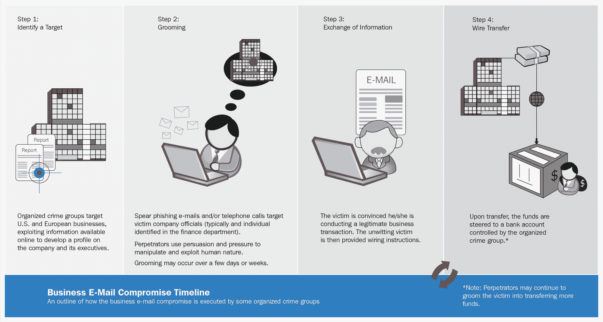Business email compromise timeline

对于公司来说，商务邮件泄露是一个多大的问题？如果联邦调查局的数据准确的话，这是一个相当严重的问题:从 2013 年底到 2016 年，联邦调查局在国际上记录了超过 40，200 份 BEC 报告，其中 55%(近 22，300 名)的受害者在美国。从全球来看，BEC 的美元敞口损失约为 53 亿美元。但是*那是多少钱？*根据世界银行 2016 年的数据，53 亿美元的国内生产总值足以成为世界第 152 大经济体。这略低于马拉维，其 54 亿美元排名第 151 位，但高于毛里塔尼亚，其 46 亿美元排名第 152 位。或者，客观地说，根据世界银行 2016 年的 GDP 衡量，bec 产生的钱比构成底部 22%的四十多个国家还多。

Internet Crime Complaint Center (IC3). *Alert Number I-050417-PSA - Business Email Compromise E-Mail Account Compromise The 5 Billion Dollar Scam*. Published May 4, 2017\. U.S. Federal Bureau of Investigation available at [https://www.ic3.gov/media/2017/170504.aspx](https://www.ic3.gov/media/2017/170504.aspx).
The World Bank. *GDP (Current US$)*. Retrieved March 21, 2018\. The World Bank Group available at [https://data.worldbank.org/indicator/NY.GDP.MKTP.CD?year_high_desc=true](https://data.worldbank.org/indicator/NY.GDP.MKTP.CD?year_high_desc=true).

那么，考虑到所有这些，什么是商务邮件妥协呢？与预付款欺诈骗局一样，它不是以一种特定方式实现的一种特定骗局，而是一系列相互关联的社会工程骗局，其最终目标是通过伪造一条或多条消息，从首席执行官这样的高管向应付账款部门(甚至是首席财务官)的某人转移大笔资金，从而转移大笔资金。在某些情况下，电子邮件可能来自伪造的(或伪造的)地址，但在少数情况下，攻击者可能获得了高管电子邮件帐户的访问权限，以便发送他们的消息。

每个事件的损失是多少？金额相差很大，但数百万美元的诈骗也时有发生:

*   2014 年，一家美国制造公司损失了 48 万美元，此前攻击者伪造了似乎是来自首席执行官的消息，命令会计主管将资金转移到东亚某大国的一家银行。

Krebs, Brian. *Firm Sues Cyber Insurer Over $480K Loss*. Published January 18, 2016\. Krebs on Security available at [https://krebsonsecurity.com/2016/01/firm-sues-cyber-insurer-over-480k-loss/](https://krebsonsecurity.com/2016/01/firm-sues-cyber-insurer-over-480k-loss/).

*   2015 年，一家美国无线网络公司通过其香港子公司损失了 4670 万美元，此前其财务部门收到了显然来自高管的伪造电子邮件。

Krebs, Brian. *Tech Firm Ubiquiti Suffers $46M Cyberheist*. Published August 7, 2015\. Krebs on Security available at [https://krebsonsecurity.com/2015/08/tech-firm-ubiquiti-suffers-46m-cyberheist/](https://krebsonsecurity.com/2015/08/tech-firm-ubiquiti-suffers-46m-cyberheist/).

*   2016 年，一家罗马尼亚布线工厂因财务部门收到一封据称来自德国高管的电子邮件，导致 BEC 损失了 4460 万美元。

克莱利格雷厄姆。*一家公司如何通过电子邮件诈骗损失了 4400 万美元*。2016 年 9 月 1 日发布。Tripwire 可在[https://www . tripwire . com/state-of-security/security-data-protection/4400 万-email-scam/](https://www.tripwire.com/state-of-security/security-data-protection/44-million-email-scam/) 获得。

Cimpanu, Catalin. *One of Europe's Biggest Companies Loses €44 Million in Online Scam*. Published August 31, 2016\. Softpedia News available at [http://news.softpedia.com/news/one-of-europe-s-biggest-companies-loses-40-million-in-online-scam-507818.shtml](http://news.softpedia.com/news/one-of-europe-s-biggest-companies-loses-40-million-in-online-scam-507818.shtml).

*   2017 年，一所美国大学因一封欺诈邮件损失了 190 万美元。然而，与两家美国公司在立陶宛因一个骗子而损失超过 1 亿美元相比，这一数额就相形见绌了。

Cluley, Graham. *How a Single Email Stole $1.0 Million from Southern Oregon University*. Published June 13, 2017\. Tripwire available at [https://www.tripwire.com/state-of-security/security-data-protection/single-email-stole-1-9-million-southern-oregon-university/](https://www.tripwire.com/state-of-security/security-data-protection/single-email-stole-1-9-million-southern-oregon-university/).
United States Attorneys. *Lithuanian Man Arrested For Theft Of Over $100 Million In Fraudulent Email Compromise Scheme Against Multinational Internet Companies.* Published March 21, 2017\. U.S. Department of Justice available at [https://www.justice.gov/usao-sdny/pr/lithuanian-man-arrested-theft-over-100-million-fraudulent-email-compromise-scheme](https://www.justice.gov/usao-sdny/pr/lithuanian-man-arrested-theft-over-100-million-fraudulent-email-compromise-scheme).
Roberts, John Jeff. *Exclusive: Facebook and Google Were Victims of $100M Payment Scam*. Published April 27, 2017\. Fortune available at [http://fortune.com/2017/04/27/facebook-google-rimasauskas/](http://fortune.com/2017/04/27/facebook-google-rimasauskas/).

BEC 并不总是意味着诱骗受害者将资金汇往国外。在美国，另一种常见的伎俩是瞄准人力资源或会计部门的员工，以获取工资单数据。攻击者随后会利用这些信息提交欺诈性的纳税申报单，以获得退款。

Cluley, Graham. *VIDEO: Snapchat data breach shows that sometimes it's good to say no to your CEO*. Published February 29, 2016\. Cluley Associates available at [https://www.grahamcluley.com/video-snapchat-data-breach/](https://www.grahamcluley.com/video-snapchat-data-breach/)
Ibid. *More companies hit by fake CEO attack to steal employees' payroll information*. Published March 11, 2016\. Cluley Associates available at [https://www.grahamcluley.com/companies-hit-fake-ceo-attack-steal-employees-payroll-information/](https://www.grahamcluley.com/companies-hit-fake-ceo-attack-steal-employees-payroll-information/).
Krebs, Brian. *Seagate Phish Exposes All Employee W-2's*. Published March 6, 2016\. Krebs on Security available at [https://krebsonsecurity.com/2016/03/seagate-phish-exposes-all-employee-w-2s/](https://krebsonsecurity.com/2016/03/seagate-phish-exposes-all-employee-w-2s/).# 抵御 BEC

虽然这些攻击通常涉及攻击者方面的一些情报收集，攻击者需要识别诸如企业法定名称和地址、应付账款中公司管理人员和员工的姓名、公司内公司电子邮件地址的结构等信息，但是这些信息通常可以从各种公共来源找到。公司网站和社交媒体页面很容易泄露这类信息，在脸书、Twitter 和 LinkedIn 上搜索员工的社交媒体账户，尤其是高管的账户，可以帮助完善目标定位。

攻击者甚至可以向销售、营销和公共关系部门发送消息，以获得回复，从而复制公司的电子邮件格式。甚至包括在电子邮件中的响应标题也可能告诉攻击者一些关于网络布局的信息，以及所使用的电子邮件客户端和服务器的类型和版本，这些都是在计划伪造电子邮件时有用的数据。根据业务类型，一些公司甚至会提供电汇的银行账户信息或申请成为合作伙伴或供应商的表格，这可能会透露更多的细节。

攻击者甚至会等待合适的时机来实现骗局。例如，等到 CEO 出差参加会议的当天，或者长假开始前的几个小时，才发送消息。这样的选择让攻击者得以加强，*我忘了早些告诉你这一点，但重要的是把它搞定* *现在*消息的性质，并能帮助拖延调查少量的时间。这给了攻击者额外的时间来通过几家银行清洗被盗的钱，以使盗窃更难被追踪。

攻击者可能会收集有关目标企业的各种业务、财务和技术数据，并构建一个复杂的公司运营方式和员工互动方式图。但是，无论使用何种技术，最终目标都是社会工程——说服员工向攻击者发送工资单信息、向银行账户汇款，以及其他可能的行动。无论这种攻击看起来多么技术化，它的成功最终还是基于一个心理学问题——攻击者说服受害者遵从他们的指示了吗？

这就是阻止 BEC 如此困难的原因。因为这些攻击不像恶意软件攻击那样针对员工的电脑，而是针对员工自己。员工被教导要遵从他们的主管、经理等等的指示，而首席执行官代表着公司日常工作的最高权威。因此，当他们从权威人士那里得到听起来可信的指示时，几乎没有什么疑问或怀疑。

那么，*企业可以做些什么来防止商业电子邮件泄露呢？*没有灵丹妙药，但这里有一些建议可以帮助降低成为 BEC 受害者的风险:

*   制定明确的政策，明确规定如何处理电子资金转账的程序，以及在组织内由谁来处理:
    *   考虑要求多方根据金额和/或目的地(例如，新的银行账户)对转移的资金进行签准。
    *   对于超过一定金额的资金转移，要求使用预定方法进行**带外**验证。例如，如果请求是通过电子邮件、短信或传真发出的，则需要电话或视频会议来确认交易。
    *   如果高管将离开办公室或单独联系一段时间，他们应该向 CFO、财务部或其他负责方发送消息，明确表示他们在离开期间不会提出任何资金转账请求。
*   让操作系统和应用程序保持最新版本，以及这些版本的最新补丁。使用知名供应商提供的信誉良好的安全软件，并保持更新，尤其是在行政、财务和人力资源部门的计算机上。虽然 BEC 在很大程度上是社会工程，但也可能存在技术侦察和剥削；让计算机保持最新有助于挫败攻击者的这种能力。
*   最重要的是，对你的员工进行关于社会工程风险的教育和再教育，从普通的诈骗到复杂的商业邮件妥协。有专门从事反网络钓鱼培训的咨询机构，这可能有所帮助，但也可能很昂贵。您现有的安全软件提供商可能也有可用的教育材料。

确保你提供的任何教育也能激励员工举报可疑的骗局和社会工程。如果员工举报或阻止企图，确保他们得到公司的正式认可。一份小小的奖励，如由首席执行官签署的表扬信或证书、额外的 PTO 或礼品卡或优惠券，可以起到很大的作用，不仅可以作为对这些员工出色工作的认可，还可以鼓励其他人寻找和报告此类非法活动。

# 参考资料/进一步阅读

以下是一些网站的精选列表，这些网站提供了有关涉及 BEC 的社会工程诈骗的更多信息，以及如何防范这些诈骗:

*   约翰·克洛南。*不要做一条鲸鱼——如何发现商业电子邮件妥协(BEC)骗局*。可在[网站 https://www . Tripwire . com/state-of-security/featured/how-detect-business-email-compromise-bec-scam/](https://www.tripwire.com/state-of-security/featured/how-detect-business-email-compromise-bec-scam/)找到 tripwire。
*   格雷厄姆。如何扭转假冒 CEO 骗子的局面。https://www.grahamcluley.com/turn-tables-fake-ceo-scammers/的 [的可利用。](https://www.grahamcluley.com/turn-tables-fake-ceo-scammers/)
*   ESET。*免费分科网络安全意识培训* 可用一个*t*[https://www.eset.com/us/cybertraining/](https://www.eset.com/us/cybertraining/)。T15】
*   联邦调查局。商业电子邮件的危害。全球网络金融诈骗呈上升趋势。美国司法部可在 [查阅 https://www . FBI . gov/news/stories/business-e-mail-compromise-on-the-rise](https://www.fbi.gov/news/stories/business-e-mail-compromise-on-the-rise)。
*   互联网犯罪投诉中心(IC3)。*警报编号 I-061416-PSA -商务电子邮件泄露电子邮件帐户泄露:31 亿美元骗局*。美国联邦调查局【https://www.ic3.gov/media/2016/160614.aspx】在 [可用](https://www.ic3.gov/media/2016/160614.aspx) 。
*   布莱恩。 *恶搞老板让小偷大发横财*。安全上的克雷布斯可在[https://krebsonsecurity . com/2015/03/spoofing-the-boss-turns-snows-a-tidy-profit/](https://krebsonsecurity.com/2015/03/spoofing-the-boss-turns-thieves-a-tidy-profit/)获得。T11】
*   马丁内斯克劳迪娅。*防御价值 50 亿美元的网络安全威胁——商业电子邮件妥协*。思科博客可在 [获得 https://Blogs . Cisco . com/security/defining-against-the-5b-cyber security-threat-business-email-compromise](https://blogs.cisco.com/security/defending-against-the-5b-cybersecurity-threat-business-email-compromise)。
*   李曼森。*西班牙囚犯:419 骗局的诞生*。安全-常见问题解答可在 [获得 http://www . security-FAQs . com/the-Spanish-private-birth-of-the-419-scam . html](http://www.security-faqs.com/the-spanish-prisoner-birth-of-the-419-scam.html)scam watch。尼日利亚骗局。澳大利亚竞争&消费者委员会。[https://www . scam watch . gov . au/types-of-scams/unexpected-money/Nigerian-scams](https://www.scamwatch.gov.au/types-of-scams/unexpected-money/nigerian-scams)。
*   图桑，克里斯蒂娜。假邮件会让你损失数千美元。美国美国联邦贸易委员会可在 [获取 https://www . consumer . FTC . gov/blog/2017/05/fake-emails-could-cost-you-千元](https://www.consumer.ftc.gov/blog/2017/05/fake-emails-could-cost-you-thousands) 。
*   美国证书。*安全提示(ST04-014)避免社交工程和网络钓鱼攻击*。美国国土安全部在[https://www.us-cert.gov/ncas/tips/ST04-014](https://www.us-cert.gov/ncas/tips/ST04-014)可用。

# 关于作者

Aryeh Goretsky 于 1989 年作为 McAfee Associates 的第一名员工开始了他的信息安全职业生涯。2004 年，他从微软获得了他的第一个**最有价值专业人士** ( **MVP** )奖，以表彰他帮助教育人们了解和保护微软视窗系统的努力。2005 年，他加入了 NOD32 的开发者，全球安全提供商 ESET，在那里他是一名杰出的研究员。他在[https://www.welivesecurity.com/](https://www.welivesecurity.com/)发表专业博客，在 Twitter 上的名字是`@goretsky`，在 Reddit 上的名字是`/u/goretsky`。

# 伊斯兰博士，医学博士 Rafiqul 和博士 Erdal Ozkaya

# 社交媒体中的隐私问题

Rafiqul Islam 博士在网络安全领域拥有丰富的研究背景，特别关注恶意软件分析和分类、身份认证、云中的安全性、社交媒体中的隐私以及**物联网** ( **物联网**)。他为 HCL 和 CA 实验室开发了自动恶意软件分类算法，并开发了一种工具来收集运行时恶意软件的日志。他还开发了一种用于未来恶意软件预测的 CTA(累积时间线分析)技术。自 2014 年以来，他一直领导网络安全研究团队，并在该领域的领导力、可持续性和合作研究方面积累了丰富的经验。他是 TJCA 的副主编，也是许多著名杂志的客座编辑。他有很强的出版记录，已经发表了 140 多篇同行评审的研究论文。他的贡献得到了国内和国际的认可，获得了各种奖励，如专业优秀奖、研究优秀奖、领导奖。他成功地指导了五位博士在加州大学和迪肯大学完成学业。他还是 CSU 新成立的 1.4 亿美元网络安全 CRC 的首席调查员之一，为与弹性网络、物联网系统的安全性和配置管理、网络安全即服务的平台和架构以及恶意软件检测和删除相关的项目做出了贡献。

# 摘要

该提案的假设是，目前社交媒体平台上存在许多威胁。该研究提案将揭示与社交媒体相关的隐私问题，并概述将进行的相关研究的细节。社交媒体领域有了巨大的增长，这见证了不同平台的用户群的增加以及新的更具竞争力的参与者的进入。这项提案将着眼于社交媒体领域的一些参与者，并找出任何危及其用户隐私的弱点。该提案将讨论进行研究的方法。由于将收集的数据类型，研究将是定性的。预计这项研究将使用两个数据来源；将通过在线调查收集原始数据，然后从知名来源收集二手数据。由于时间有限，主要数据收集旨在获得相当数量的受访者，这将是前 100 或 200 名受访者。同样，数量将取决于时间限制。

二手数据预计将来自调查机构和类似主题的现有研究。调查公司方面最感兴趣的将是皮尤研究中心，它是许多技术问题上收集和分析良好的数据的著名来源。该提案将着眼于分析收集到的数据的方式。由于从主要和次要数据来源获得的响应的性质，预计首选的分析方法将是定性的。该提案将最终着眼于用户、政府和社交媒体平台自身缓解社交媒体隐私问题的一些方式。

# 介绍

# 背景资料

互联网可以说是人类最伟大的成就之一，它促成了一代人的崛起，这一代人相互联系，更加见多识广。社交媒体一直是人们与所爱的人保持联系并获取他们的某些信息的方式之一。社交媒体由几家社交网络公司提供支持，其中一些公司专注于一些利基市场，如分享图片或视频，而其他公司只是提供一个全方位的平台来分享任何东西。目前最古老的平台之一是脸书，它成立于十多年前，今天可以自夸拥有最多的用户，17 亿(Bober & Brasnett，2009)。

社交媒体对朋友和爱人来说非常重要。即使不在一起，他们也可以保持联系，分享生活。社交媒体也被用于商业目的。如今，许多公司都投入巨资在社交媒体平台上为自己的产品做广告。社交媒体公司已经对这些产品的用户进行了描述，因此他们确信他们的广告将到达给定和确定的人群范围(Kaplan & Haenlein，2010)。社交媒体平台的商业化给在线公司带来了巨大的优势，它们现在可以进入全球分散的市场并进行海外销售。

然而，社交媒体平台的优点现在正被它们的缺点所掩盖。一些用户甚至选择退出使用一些平台，因为他们的隐私问题已经被提出。用户在这些平台上失去了他们的隐私，现在他们的数据被收集、存储、出售给投标人，或进行描述，使其成为营销人员使用的理想选择(Andrews，2012)。大多数社交媒体公司的兴趣已经从通过改善平台向用户提供更高质量的服务，转向通过从用户那里收集更多个人数据向营销人员提供更高质量的服务。毫无顾忌地，这些公司对用户采取了另一种姿态，一种间谍姿态。他们的眼睛已经被他们从广告中获得的巨额资金所蒙蔽，今天看来他们所关心的只是获取关于他们用户的一切。他们浏览了自己的个人资料，收集了用户提供的所有信息。他们浏览用户的帖子，收集用户谈论或评论的所有内容。他们甚至进入私人聊天室，查看用户与他人谈论的内容。他们甚至监视用户使用的设备，甚至收集他们平台以外的信息，如用户的联系人列表、短信和彩信(沃拉斯顿，2017 年)。用户感觉被出卖了，因为他们的数据被收集并卖给了第三方。社交媒体平台似乎并不在意。罪魁祸首之一脸书自豪地说，它每季度从每个用户那里获得 4.01 美元(Titcomb，2017)。这个数字乘以 17 亿的用户基数表明，脸书每 3 个月就能从其用户那里赚到大约 70 亿美元(Titcomb，2017)。在这一点上，它没有任何贡献，因为是用户让其他用户加入平台。用户是唯一产生内容的群体；脸书什么也没做。它所做的只是为用户创建一个蓝色的平台来做这件事。在用户让脸书赚了这么多钱之后，脸书认为应该通过监视他们的数据来赚更多的钱来感谢他们。脸书的例子只是几乎所有其他平台一直在做的事情之一。

社交媒体公司并不是用户恐惧的唯一来源。还有其他更邪恶的罪犯也与社交媒体公司联手，追逐宝贵的用户数据。这群罪犯部分由黑客、社会工程专家和垃圾邮件发送者等组成。另一个群体是政府，据透露，他们使用复杂的工具通过社交媒体平台监视用户。这三个团体联合起来，形成了一股强大的力量，对抗强迫用户提交的行为。这三者与社交媒体用户之间一直是一种捕食者-猎物的关系。听到一个人说他/她要关闭或退出所有社交媒体平台，已经不再令人震惊。

隐私已经丧失，用户已经输掉了战斗，他们现在所能做的就是看着他们的数据被所有人分享。黑客变得越来越成功，因此积极地监视发布任何个人信息的用户。社交媒体公司变得更加饥饿和贪婪，因此正在侵入性地监视他们的用户，对他们进行分析，出售更多数据，并让第三方直接获取用户信息(*广告和我们的第三方合作伙伴*，2017)。政府变得越来越不安全，因此他们想知道任何表达自由观点的自由思想公民的个人生活。这太疯狂了。隐私不是一种权利，而是一种特权，一种现在很少有人能享受的特权。

# 研究动机

如前所述，社交媒体用户目前面临着很多隐私问题。非常不幸的是，这发生在加入社交媒体网络的用户数量增加的时候。社交媒体平台也在崛起，其他人正在设计新的方式来吸引更多的用户。一个例子是脸书，其策略目标是通过无人机互联网计划增加用户数量。它专注于互联网覆盖不到的地方，旨在派遣无人机为互联网提供服务，当然，它将从中获得更多用户。世界人口也在增长，所有这些人很可能会加入某种社交媒体网络。在未来，社交媒体将被用来预测许多事情，这是因为将会有来自世界各地的人们的观点的实时表达。它将成为商业组织的情报来源(阿苏尔和胡伯尔曼，2010)。因此，明智的做法是审视所有这些人可能面临的威胁，并想出减轻这些威胁的方法。已经发现了一些威胁。这些威胁让同样的社交媒体公司甚至政府蒙羞。曝光和泄露已经表明，这些社交媒体平台一直在向第三方应用程序提供用户数据(Stutzman，Gross，& Acquisti，2013)。

他们允许第三方应用程序几乎完全访问用户的社交媒体账户，而他们只需要访问一些基本的东西，如名称。社交媒体公司也被发现向其他公司出售用户数据。人们发现他们甚至在未经用户同意的情况下收集一些用户数据。脸书被判有罪，在未经用户同意的情况下，从他们的照片中收集用户的面部照片。目的是创造一个机器人，能够自动标记照片中的人。脸书让它的用户成为任何人都可以买到的商品。其他平台也好不到哪里去，都在往同一个方向走。为了让这些平台在广告收入上大赚一笔，用户隐私被忽视了。还有一些恶意的人潜伏在这些社交媒体平台上，以便利用用户共享的信息。众所周知，用户很粗心，有时他们会透露过多的信息。一些用户在这些社交媒体平台上清空了他们的整个生活，忘记了他们暴露给自己的威胁。社会工程师向许多不知情的用户伪装成朋友。他们利用这些用户的盲目信任，不断挖掘他们在账户上分享的信息(Pentina，Zhang 和 Basmanova，2013)。有时，一旦他们对自己的弱点有了更多的了解，他们会直接向用户索取这些信息。令人惊讶的是，在这些平台上创建无限的假账户非常容易(Yadav，2017)。这无意中助长了身份盗窃，因为恶意人员正在使用他人的姓名、照片和准确的详细信息创建账户。他们的动机是险恶的，他们包括诽谤，侮辱，诋毁，勒索和欺骗其他用户。社交媒体也被用来促进其他形式的欺诈和身份盗窃(Lewis，2017)。社交媒体平台的现状可以说是完全不安全的。这些平台需要接受审查，以便发现它们的缺陷。还需要关注用户的弱点，以便在未来，用户能够意识到他们在社交媒体平台上面临的所有威胁，并且能够对他们分享的内容更加负责。在目前的情况下，用户应该暂停并停止使用社交媒体。他们的隐私被侵犯了，由于害怕政府和社会工程师，他们不能再张贴他们感觉到的、看到的或想表达的东西。这些平台中的大多数已经通过法院，并在被指控严重侵犯隐私和平台不安全的案件中败诉。

# 研究问题

该提案确定了许多将由研究回答的研究问题:

1.  社交媒体的用户面临哪些隐私和安全问题？

这个问题的目的是识别和解释每个社交媒体平台上各种类型的安全和隐私问题。因此，这项研究将回答以下问题:

2.  社交媒体平台对用户安全吗？

这个假设问题将试图找出社交媒体平台的用户在当前状态下使用这些平台时是否安全。为了了解更多并证明这个问题是对还是错，将提出以下问题:

3.  社交媒体平台缺乏隐私和安全会有什么后果？

该问题旨在找出用户如何受到社交媒体平台缺乏隐私和安全的影响。

4.  如何缓解这些隐私和安全问题？

*这个问题的目的是为社交媒体平台缺乏安全性和隐私的现状提供真实的答案。答案将触及三个方面:用户、平台和政府。将使用以下问题:*

# 文献评论

其他研究人员已经就这一主题进行了几项研究。这项研究将考虑它认为准确和具有示范性的三项研究的观点。

# 社交媒体中的隐私问题

克里斯托弗·雷夫勒是研究社交媒体用户面临的隐私问题的研究人员之一。雷夫勒从不同于其他研究者的角度出发。他没有研究社交媒体平台的弱点，而是研究了现有立法的弱点，这些立法使得用户有可能被社交媒体公司利用。他试图找出能够保证用户与这些公司共享的个人信息安全的立法。他审视了政府为保护公民隐私而制定的现有法律和政策。这些是关于隐私和个人数据的法律和政策。通过快速跳转到他的结论和建议，洛夫勒说，首先，政府需要强制性地将隐私纳入这些平台的设计中(雷夫勒，2012)。这是代替它被带到船上以后作为一个附加物。雷夫勒还建议，政府应该推动社交媒体公司纳入允许用户选择将其数据用于广告目的的设置(雷夫勒，2012)。最后，Loffler 建议，社交媒体公司应该被迫对他们收集的用户数据采取透明的态度(雷夫勒，2012)。

在他的研究中，雷夫勒首先审视了大多数社交媒体公司的现状。他说，社交媒体平台的使用一直在增长，今天超过 65%的成年人使用社交媒体。然后，他解释了用户是如何对这些平台上的隐私问题变得越来越担忧和沮丧的。他说，有三组人在提出社交媒体公司侵犯隐私的问题上发挥了积极作用。这些人包括记者、监管者和活动家。雷夫勒着眼于保护公民个人隐私的现有法律。他抱怨说，谈论隐私的法律薄弱、陈旧，没有明确赋予公民隐私权，并且不能有效应用于社交媒体等事物。本文支持雷夫勒的观点，即现有的法律是大多数政府在保护隐私权方面的拙劣表现。在大多数国家，没有具体的隐私权。隐私仅仅是隐含的，但并不仅仅是给予和保证给公民的。因此，雷夫勒批评政府的这一缺陷是正确的。

然而，雷夫勒确实注意到一些有效打击一系列犯罪的法律。他讨论了一些法案，如 FTC 法案 3，该法案规定组织欺骗用户以侵犯他们的隐私并获取他们的个人数据是非法的。一个很好的例子是，谷歌推出了一个名为 Google Buzz 的失败的社交媒体网络，并决定在未经其同意的情况下将谷歌的所有用户添加到该网络中(Edosomwan 等人，2011 年)。它还使其用户的电子邮件对任何人公开可见，进一步使他们面临更多风险。当用户选择离开平台时，谷歌不会删除他或她的账户，他们会让它保持活动状态。不用说，由于这样的行动，谷歌的嗡嗡声不复存在，谷歌仍然为这种欺骗行为付出代价。他还赞赏美国儿童在线隐私保护法案的存在，该法案保护 13 岁以下的儿童，称为 COPPA。他说这是一个定义最明确的法案，并且专门规定了孩子们应该受到什么样的保护。也许政府应该颁布另一个类似的法案来保护所有的公民，但要稍作调整。他承认的另一项法案是《公平和准确信用交易法案》(T1)(**FACTA**)，该法案强制要求所有收集用户数据的企业确保数据不被窃取和泄露。当黑客能够闯入 Twitter 平台并窃取许多用户的账户信息时，FACTA 的一个很好的例子(Zangerle 和 Specht，2014 年)。根据 FACTA，Twitter 不仅被重罚，而且还接受定期检查，以确保该平台在保护用户数据方面符合标准。其他社交媒体平台并不神圣，但已经能够找到规避这一法律的方法，并能够在未经用户同意的情况下泄露用户数据。雷夫勒谈到的另一个法案是**健康保险** **便携性和责任法案** ( **HIPAA** )，该法案在保护与患者健康信息相关的数据隐私方面非常有效。

雷夫勒最后展示了一份由美国联邦贸易委员会准备的隐私报告。报告中有关于消费者隐私的细节，委员会试图向企业和政策制定者提出建议，让用户隐私得到认可。该报告呼吁在网络空间运营的公司遵循一套特定的最佳实践，确保用户数据得到保护。它建议国会就用户隐私问题提出全面的立法措施。它还呼吁国会对不遵守保护用户隐私立法的公司采取更严厉的惩罚措施。此外，该报告呼吁对公司收集的用户数据设置最长保留期限。该报告还建议，公司可以从用户那里收集的数据量应该有一个上限。雷夫勒列出了已经成为现行法律受害者的公司，现行法律结构薄弱，不全面。他自己的建议强调，有必要将隐私纳入平台的设计中。他还敦促社交媒体公司保持透明度，并为用户提供选择不将他们的数据用于营销目的的选项。

# 出于个人和广告目的评估社交媒体隐私设置

另一项关于社交媒体隐私问题的伟大工作是由海曼、沃尔夫和皮尔森进行的研究。三人正在评估社交媒体平台上存在的两种隐私。他们说，第一类隐私是用户之间提供的隐私(Heyman，Wolf 和 Pierson，2014)。三人一致认为，社交媒体平台已经采取了足够有力的措施来确保这种隐私。三人谈到的第二种隐私是社交媒体用户和第三方之间的隐私。在这种情况下，他们看不到任何隐私，用户对此也无能为力。跳到他们的发现，可以看到用户基本上被给予了只能使他们对其他用户隐藏数据的设置。在第三方方面，用户没有得到这种设置，因此他们的数据可以在未经他们同意和没有任何输入的情况下使用。三人认为这是社交媒体公司对用户隐私的一种有问题的看法。他们只希望用户对其他用户可以看到或访问的内容有发言权。然而，他们希望对第三方可以进入他们账户的内容保持保密。

在他们的论点中，三人表示，公司采取的第一种方法是将隐私作为一个主题(Heyman，Wolf 和 Pierson，2014)。作为主体，用户可以使用设置来控制自己的隐私。另一面是当隐私被当作一个对象时(海曼、沃尔夫和皮尔森，2014)。作为一个对象，社交媒体公司认为它是在用户层面上，基本上是不关心个人用户的大数据算法之间的交互。三人声称，社交媒体公司在将隐私视为客体的观点上留下了可利用的空间。这些公司收集了用户的几乎所有信息，这些信息可能被用于其他目的。他们认为大数据算法只会被 profile 用户使用是不够的。恶意用户可以在大量数据中找到一个人，并轻松使用他/她的信息。

信息流也令人担忧，因为它直接从用户流向社交媒体公司大数据。这就是为什么这些社交媒体公司聪明地将用户在这些平台上发布的任何数据都转移了所有权的条款和条件。它归社交媒体公司所有，他们基本上可以用它做任何他们想做的事情。这是一个令人震惊的声明，其中一些平台已经添加到他们的条款和条件中，因此用户在注册时除了勾选接受条款和条件复选框之外没有其他事情可做。

三位研究人员将诺曼的用户界面设计原则与这些社交媒体平台为用户提供的设置进行了比较(Heyman，Wolf 和 Pierson，2014)。他们的评估显示，这些设置的设计低于诺曼的 UI 设计原则的预期。他们说，隐私设置的设计不是用来增强用户的能力，而是用来削弱用户的能力。它们被构造成一方面部分地保护用户的隐私，而另一方面为各种个人信息的窃取敞开大门。三人说，为了让用户实现真正的隐私，他们必须有一个选择，这样他们就可以接受或拒绝他们的信息与第三方共享。隐私设置应该包括第三方，这样，用户只需点击一个按钮，就可以拒绝第三方访问他/她的信息，就像她/他目前可以为其他用户所做的那样。

# 不同社交媒体平台上的隐私问题

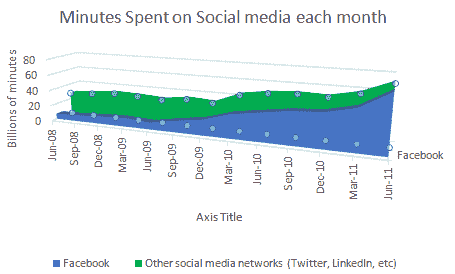Graph shows dominance of Facebook in social mediaSource Data Source: (Keath, 2011)

隐私问题的罪魁祸首是脸书。脸书排名很高，是拥有最多用户群的平台。然而，由于它在处理用户数据时的违规行为，它最近成为了一种趋势。脸书一直是身份盗窃、诈骗、社会工程和恶意人士和政府间谍活动的温床。脸书自己一直在收集用户数据并出售给第三方。最近有消息称，脸书还向第三方提供了不必要的用户信息。脸书的条款和条件中也有令人震惊的条款。它还被发现在没有通知用户的情况下更改这些条款和条件以添加其他条款。它一直在与现有的糟糕的立法安排玩猫捉老鼠的游戏，即使有这些安排，它也各自被拖上法庭并被罚款。这是一个无法无天的平台，已经变得资金饥渴，它所寻求的只是增加其用户群，并因此增加其广告收入。由于这是它的主要关注点，它放弃了提供一个用户可以用来分享的全方位平台的核心功能。脸书曾经是神圣的，只是在它沉迷于营销和金钱腐蚀它之前。

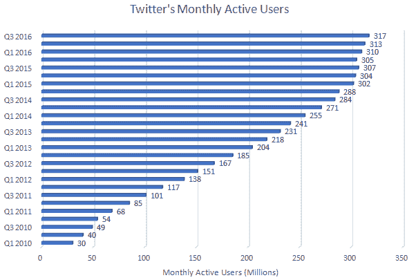Growth of Twitter's MAU since '10Source (Statista, 2017)

Twitter 在隐私方面比脸书好，但它也不完全是神圣的。它被指控跟踪用户的推文和位置，以便以推广推文的形式向他们推送广告(Humphreys，Gill 和 Krishnamurthy，2010)。它仍在从黑客成功侵入并窃取用户数据时对其施加的罚款中恢复。除此之外，由于脸书提供的干扰，它所有其他的肮脏交易可能还没有曝光。

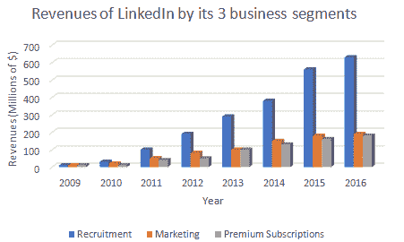LinkedIn revenue growthSource (Armstrong, 2017)

LinkedIn 是一家被微软收购的专业社交网络，现在这家专业社交网络的用户担心脸书侵犯用户数据的方式。LinkedIn 是一个用户更加诚实的地方，脸书似乎对此很感兴趣。社交网络目前被认为是大嘴巴，不断向他人宣传一个人的生活(Boorgard，2017)。它还使用了一些技巧，通过请求用户给予它访问权限来读取用户的联系人列表和电子邮件，以便它可以寻找更多的人来联系。

Google Plus 在社交媒体上并不成功，但它仍拥有大量用户。然而，它的条款和条件中有一些令人震惊的内容。它清楚地告诉用户，它有权读取、复制和共享他们的数据。因此，Google Plus 可以阅读用户电子邮件，而不仅仅是在其消息功能上发送的私人消息(Brown，2017)。无辜的用户对此无能为力，因为他们已经接受了条款和条件(Brown，2017)。当然，谷歌会从 Google Plus 上的用户那里获取数据来描述他们。它将他们的 Plus 数据与他们的搜索和他们访问的网站相结合，以推广他们能够更好联系的广告。

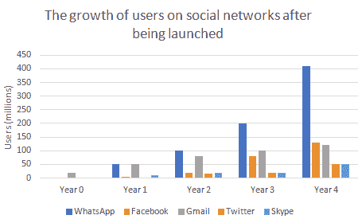Year growth of WhatsApp user baseSource (Kumar, 2017)

WhatsApp 是一个消息平台，最近被脸书以 190 亿美元收购。在被收购后不久，脸书秘密地在 WhatsApp 上添加了一个已经选中的用户数据共享选项(Griffin，2017)。欧盟等地区已经在调查这个问题，称 WhatsApp 只是向其母公司发送数据是非法的(Robinson，2017)。将已经选中的选项推送给用户的方式也是有问题的，因为这是一个强制更新。越来越多的用户越来越担心 WhatsApp 的隐私，因为它与脸书有着密切的父子关系。WhatsApp 向用户保证，他们的数据仍将保持隐私，即使是在脸书的所有权之下(Griffin，2017)。然而，它现在声称数据收集是有益的，因为它被用来使平台变得更好，并确保用户在脸书上获得更好的广告(Griffin，2017)。

# 研究方法

# 研究方法

预计该研究将采用定性分析方法。这是因为在原始数据收集中将会有来自用户的各种不同的和有意见的回答。初步研究的目的是从受访者那里获得详细信息。

# 数据收集

这项研究旨在从两个来源获取丰富的数据。第一个来源将是通过初步研究，向受访者发送调查问卷，根据时间限制，将有一个基于前 100 名受访者的阈值。这样做的好处是，从一个单独的调查中，可以收集到很多关于特定受访者感受的数据。另一方面，有人担心由于调查时间长，许多受访者可能不会真的参加。总而言之，最终结果是，这项调查将从每个受访者那里获得比普通调查更多的数据。这比在一个非常短的调查中得到成千上万的回复要好得多，这个调查给出了关于某个特定主题的肤浅信息。第二个数据来源将来自可靠的二手数据来源。已经确定了一个据说很有声望的研究机构，该机构就同一主题进行了多项研究。皮尤研究中心将成为二手数据的主要来源。其他二级数据来源将是其他研究人员就同一主题先前发表的研究。

# 数据分析

为了节省成本和时间，数据分析将使用 Microsoft Excel 程序进行。Excel 是一个功能强大的程序，适合于分析数据，它与 MS Word 直接连接，因此图形表示的传输将非常简单。Excel 在用颜色自定义图形表示和添加更多标签方面也将更好，以便数据得到很好的呈现。这项研究将使用的 MS Excel 的具体功能是快速分析(Rothschiller 等人，2011 年)。选择数据后，Excel 会提供快速分析选项。正在分析的是许多功能，如格式、Excel 图表建议、用于数据过滤和排序的表格以及用于显示趋势的迷你图。收集的数据不需要高级水平的分析，相信 Ms Excel 可以通过其快速分析功能满足所有分析要求。

# 结论

如今，在线用户面临着许多威胁。然而，隐私是最令人担忧的，尤其是在社交媒体平台上(Barnes，2006)。这些是用户一直信任的关于他们生活信息的平台。这个研究提案已经触及了研究将做什么的冰山一角。预计主要研究将挖掘出许多隐私问题，并直接听取受访者关于他们希望改变什么的意见。这将是一场关于找回隐私之旅的斗争，这是社交媒体用户多年来不知道的事情——如果没有人谈论它，社交媒体用户可能永远不会知道。

线条图

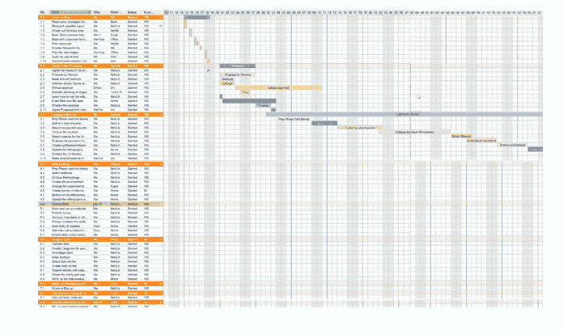# 参考

*   *广告和我们的第三方合作伙伴*。(2017).Web.facebook.com*。检索于 2017 年 2 月 1 日，可在[https://web . Facebook . com/notes/Facebook-and-privacy/advertising-and-our-third-partners/532721576777729/？_rdr](https://web.facebook.com/notes/facebook-and-privacy/advertising-and-our-third-party-partners/532721576777729/?_rdr) 。*
*   安德鲁斯大学(2012 年)。脸书在利用你。检索自[http://www . nytimes . com/2012/02/05/opinion/Sunday/Facebook-is-use-you . html](http://www.nytimes.com/2012/02/05/opinion/sunday/facebook-is-using-you.html)。
*   m .阿姆斯特朗(2017)。*资料图:LinkedIn:脸书威胁的规模* 。检索于 2017 年 1 月 14 日，来自[https://www . statista . com/chart/6658/LinkedIn _-the-size-of-the-Facebook-threat/](https://www.statista.com/chart/6658/linkedin_-the-size-of-the-facebook-threat/)。
*   阿苏尔和胡伯尔曼，文学学士(2010 年)。用社交媒体预测未来。 *Web 智能和智能代理技术(WI-IAT)，2010 年 IEEE/WIC/ACM 国际会议，* 1，492-499。
*   巴恩斯，S. B. (2006 年)。隐私悖论:美国的社交网络。*第一周一* ， *第十一* 。
*   Bober，m .，& Brasnett，P. (2009 年 6 月)。MPEG-7 视觉签名工具。在 2009 年的多媒体和博览会上。ICME 2009。IEEE 关于的国际会议(第 1540-1543 页)。纽约:IEEE。
*   布加尔德，K. (2017)。 *4 个令人讨厌的 LinkedIn 习惯让人们不再关注你* 。【Themuse.com】T4。检索 2017 年 2 月 1 日，来自[https://www . themuse . com/advice/4-烦人-LinkedIn-习惯-正在制造-人-unfollow-you](https://www.themuse.com/advice/4-annoying-linkedin-habits-that-are-making-people-unfollow-you) 。
*   布朗，E. (2017)。据说脸书偷看了你的私人信息。但是谷歌呢？| ZDNet 。 *ZDNet* 。检索于 2017 年 2 月 1 日，来自[http://www . zdnet . com/article/so-Facebook-estimated-reads-your-private-messages-but-what-about-Google/](http://www.zdnet.com/article/so-facebook-allegedly-reads-your-private-messages-but-what-about-google/)。
*   Covert，A. (2014)。脸书以 190 亿美元收购 WhatsApp。检索自[http://money . CNN . com/2014/02/19/technology/social/Facebook-whatsapp/](http://money.cnn.com/2014/02/19/technology/social/facebook-whatsapp/)。
*   Edosomwan、s . k . praka San、d . kou ame、j . Watson 和 t . Seymour(2011 年)。社交媒体的历史及其对商业的影响。**16*79。*
**   Heyman，r .、De Wolf，r .、和 Pierson，J. (2014 年)。出于个人和广告目的评估社交媒体隐私设置。*《电信、信息和媒体政策、法规和策略杂志》，16* (4)，18。从 http://search.proquest.com/docview/1660153046 的 T4 取回。*   Humphreys，l .，Gill，p .，和 Krishnamurthy，B. (2010 年)。多少才算多？推特上的隐私问题。 新加坡:国际传播协会会议。*   卡普兰，硕士，&韩林，硕士(2010 年)。全世界的用户，团结起来！社交媒体的挑战和机遇。*商业视野**53*，59-68。*   j . keath(2017 年)。*脸书使所有其他社会活动总和*T2 相形见绌。 *社会新鲜* 。检索于 2017 年 1 月 14 日，来自[https://www . social fresh . com/face books-小矮人-所有-其他-社交-活动-组合/](https://www.socialfresh.com/facebooks-dwarfs-all-other-social-activity-combined/) 。*   Kumar，A. (2017)。*WhatsApp——驯服精灵——*T2】。*。检索于 2017 年 1 月 14 日，来自[http://creofire.com/whatsapp-taming-the-genie/.](http://creofire.com/whatsapp-taming-the-genie/)***   刘易斯，K. (2017)。*社交媒体网络如何促进身份盗窃和欺诈* 。【Eonetwork.org】T4。检索于 2017 年 2 月 1 日，来自[https://www . eonetwork . org/octane-magazine/special-features/social-media-networks-facility-identity-theft-fraud](https://www.eonetwork.org/octane-magazine/special-features/social-media-networks-facilitate-identity-theft-fraud)。*   哥伦比亚特区雷夫勒(2012 年)。社交媒体中的隐私问题。*知识产权诉讼律师:致力于知识产权诉讼与执行，18* ，12-18。从 http://search.proquest.com/docview/1082016549 的 T4 取回。*   Pentina，I .，Zhang，l .，，Basmanova，O. (2013 年)。社交媒体品牌信任的前因和后果:Twitter 的跨文化研究。*人类行为中的计算机**29*，1546-1555 年。*   罗宾逊博士(2017)。*脸书因 WhatsApp 数据共享面临欧盟罚款* 。【Ft.com】T4。检索于 2017 年 2 月 1 日，来自[https://www . ft . com/content/f 652746 c-c6a 4-11e 6-9043-7 e 34 c 07 b 46 ef](https://www.ft.com/content/f652746c-c6a4-11e6-9043-7e34c07b46ef)。*   Rothschiller，C. B .，Constantine，T. S .，Becker，A. J .，Chen，d .，Berry，g .，Pan，x .，& Peev，I. B. (2011 年)。*美国专利申请号 13/311，541* 。从 https://www.google.ch/patents/US9135233 的 T4 取回。*   斯塔蒂斯塔。(2017).【2010 年第一季度至 2016 年第三季度全球每月活跃 Twitter 用户数量(百万) 。检索于 2017 年 1 月 14 日，来自[https://www . statista . com/statistics/282087/number-of-monthly-active-Twitter-users/](https://www.statista.com/statistics/282087/number-of-monthly-active-twitter-users/)。*   Stutzman、r . Gross 和 a . Acquisti(2013 年)。沉默的听众:facebook 上隐私和披露的演变。**4*2。***   Titcomb，J. (2017 年)。脸书从你身上赚了多少钱？ 。 *电报* 。检索 2017 年 2 月 1 日，来自[http://www . telegraph . co . uk/technology/2016/11/03/how-much-money-does-Facebook-make-from-you/](http://www.telegraph.co.uk/technology/2016/11/03/how-much-money-does-facebook-make-from-you/)。*   弗吉尼亚州沃拉斯顿(2017 年)。脸书在看你的短信吗？应用程序更新可访问消息 。 *邮件在线* 。检索 2017 年 2 月 1 日，来自[http://www . daily mail . co . uk/science tech/article-2547326/Is-脸书-阅读-文本-Android-app-update-lets-app-access-written-picture-messages . html](http://www.dailymail.co.uk/sciencetech/article-2547326/Is-Facebook-reading-TEXTS-Android-app-update-lets-app-access-written-picture-messages.html)。*   Zangerle，e .，& Specht，G. (2014 年 3 月)。不好意思，我被黑了:被攻陷的推特账号分类。第 29 届 ACM 应用计算年会论文集 (第 587-593 页)。纽约:ACM。***

***Please refer to the link [https://www.packtpub.com/sites/default/files/downloads/LearnSocialEngineering_ColorImages.pdf](https://www.packtpub.com/sites/default/files/downloads/LearnSocialEngineering_ColorImages.pdf) for the images of this chapter.***