# 一、安装 Wireshark 2

在本章中，我们将讨论以下主题:

*   安装和设置
    *   在 Windows 上安装 Wireshark
    *   在 macOS 上安装 Wireshark
    *   在 Linux 上安装 Wireshark

# 安装和设置

在本节中，我们将了解在 Windows 上安装 Wireshark 以及在 macOS 和 Linux 上安装 Wireshark。

# 在 Windows 上安装 Wireshark

您需要执行以下步骤:

1.  进入[https://www.wireshark.org/](https://www.wireshark.org/)网页:

2.  当你到达那里，向下滚动主页并点击下载。
3.  将会看到最新版本的 Wireshark。为您当前运行的 Windows 版本选择安装程序。

Most people on a modern computer, on a modern version of Windows, will be running 64-bit.
If you happen to be running an older version of Windows on 32-bit or older hardware, make sure you select the 32-bit version. If you're not sure which one to use, do the following:
Open your Control Panel, go to System and Security, and click on the System link. In the System section, you'll see that it says System type: 64-bit Operating System. If you have a 32-bit, it'll show that here as well.

4.  返回到下载 Wireshark 页面，下载您需要的版本，并运行该文件；现在，单击“下一步”开始设置。

5.  阅读许可协议，单击我同意，然后选择您希望包含的 Wireshark 功能。大多数人包括所有的默认设置。您将在这里看到我们有主要的 Wireshark 应用；我们有 Wireshark 的经典接口版本；我们还有 TShark，它是运行 Wireshark 的命令行版本；以及一些插件、用户指南和一些附加工具:

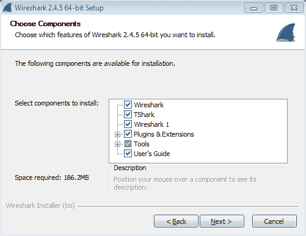

6.  我们将接受默认值，然后单击“Next”。在此窗口中，我们可以自定义显示哪些快捷方式，以及文件扩展名是否与 Wireshark 关联。我们将关闭 Wireshark 传统快速启动图标和 Wireshark 传统开始菜单项:

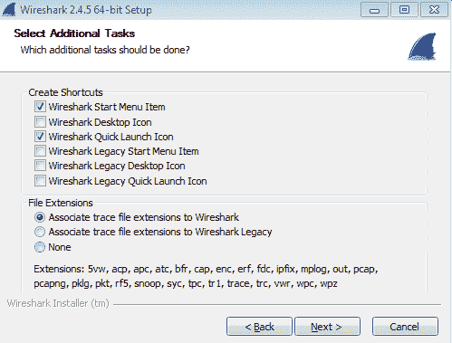

7.  继续操作，单击“下一步”,并选择 Wireshark 的安装位置。我们也将在这里选择默认值。

8.  而在这里的下一页上，写着:安装 WinPcap？如果您没有安装 WinPcap，请保持选中状态，它会在安装过程中安装它:

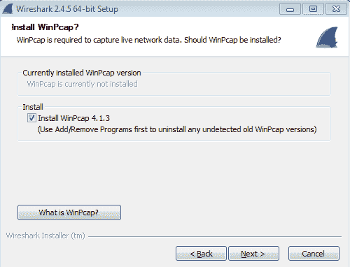

WinPcap 是允许 Wireshark 与您的网卡连接的驱动程序。WinPcap 是查看所有数据包所必需的。

9.  点击下一步。

您也可以安装 USBPcap，它允许您查看 USB 连接上的流量。大多数人不需要这个，所以我们不选中它。

10.  点击“安装”, Wireshark 将开始安装。
11.  安装进行到一半时，WinPcap 安装程序将会运行，我们将继续并单击“Next”。
12.  阅读许可协议，然后单击我同意。然后，您可以决定是否希望 WinPcap 驱动程序在启动时运行。大多数人允许它这样做。我们将保留默认设置，并单击“Install”。
13.  那会很快结束；然后点击完成。
14.  Wireshark 安装将继续。当文本窗口显示已完成时，继续操作并单击 Next 然后您可以选择是否要在此时运行 Wireshark，并单击 Finish。

一旦 Wireshark GUI 加载完毕，您就完成了:

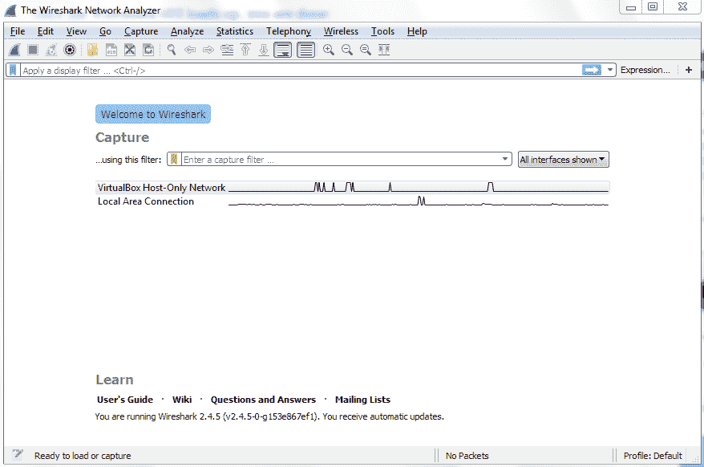

在下一节中，我们将介绍如何在 macOS 和 Linux 上安装 Wireshark。

# 在 macOS 上安装 Wireshark

要在 macOS 上安装 Wireshark，请执行以下步骤:

1.  首先进入 https://www.wireshark.org/的网页。
2.  当你在网页上，向下滚动主页，点击下载。将显示 Wireshark 的最新版本。
3.  下到 macOS 10.6 以及更高的 Intel 64 位。dmg，点击下载:

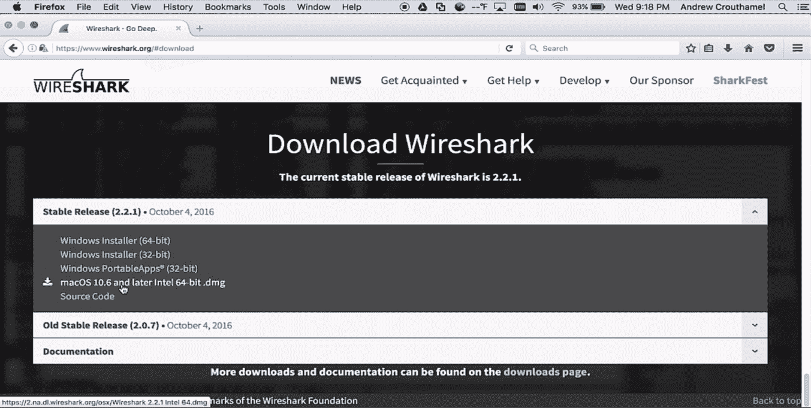

4.  此时，我们可以选择将文件保存到我们的下载文件夹中，然后打开它，或者直接用 DiskImageMounter 打开它(默认)。
5.  继续并点击确定。它下载文件并打开它。

6.  然后我们可以双击`PKG`文件，并点击继续:

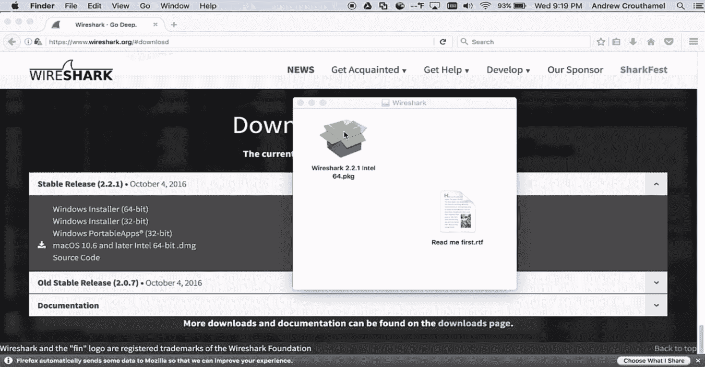

7.  阅读许可协议，再次单击继续，然后单击同意以表明您同意许可协议。

如果您希望更改安装位置，现在就可以这样做。

8.  点击安装。
9.  输入您的管理员凭据，然后单击安装软件。
10.  安装成功后，单击关闭。

11.  如果您转到右下方的应用列表，向下滚动，您应该会在列表底部看到 Wireshark。您可以选择 Wireshark，您可以看到它现在已经加载:

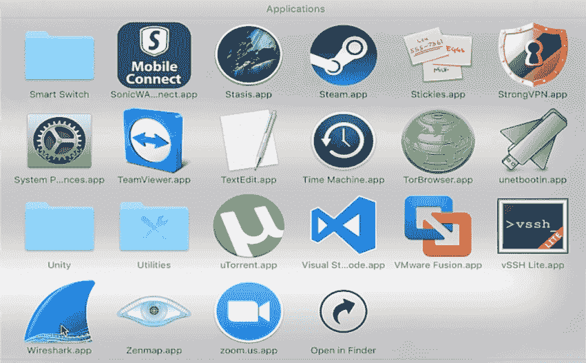

一旦 Wireshark 启动并运行，就大功告成了。

# 在 Linux 上安装 Wireshark

根据您使用的发行版，在 Linux 上安装 Wireshark 会有所不同。在这里，我使用最常见的发行版之一:Ubuntu。要安装 Wireshark，请执行以下步骤:

1.  我们将进入 Ubuntu 软件应用；继续点击，我们将搜索`synaptic`:

新立得是一个类似于 Ubuntu 软件应用的软件包管理器，但是它给了你更多的控制权。

2.  只需点击安装；输入您的管理员密码(您的 root 密码)，软件将被安装:

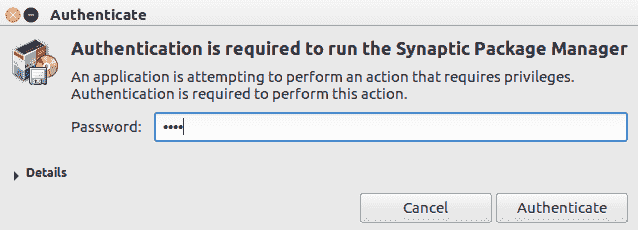

3.  继续点击新立得软件包管理器来打开它。再次输入我们的凭证，现在我们已经加载了 Synaptic 应用:

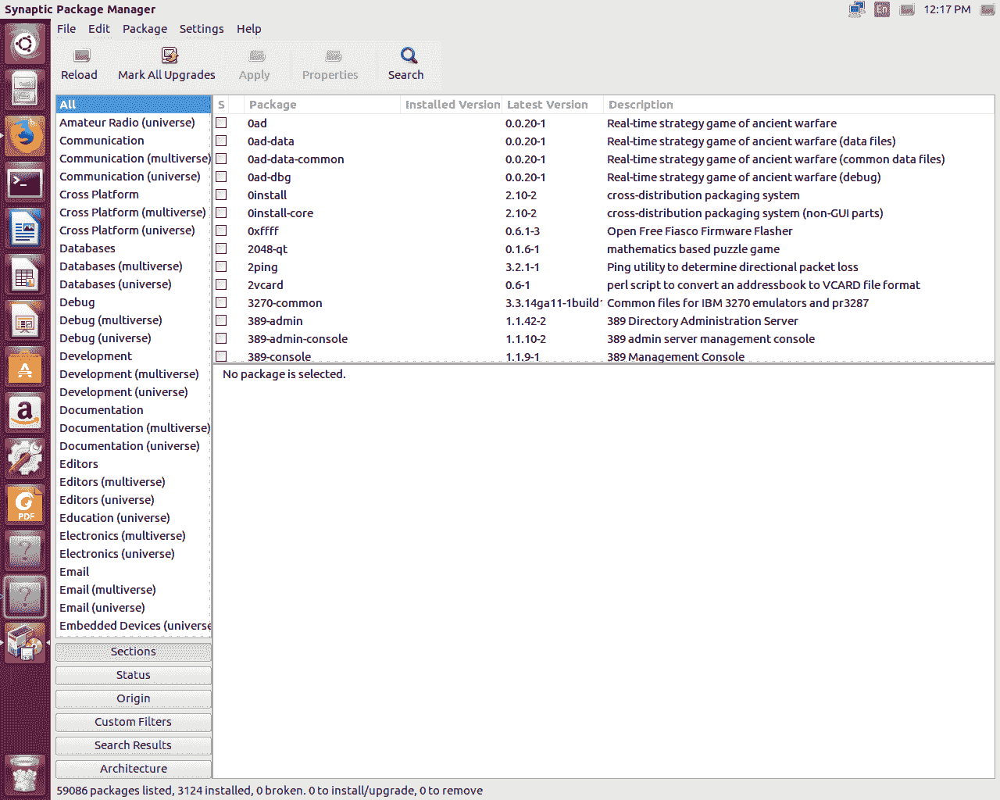

4.  这也非常类似于 Ubuntu 软件应用，但是不那么漂亮。
5.  单击“搜索”按钮，我们将搜索 Wireshark。输入`wireshark`并点击 Search，您将看到名称或描述中包含 Wireshark 的所有内容现在都显示在包列表中:

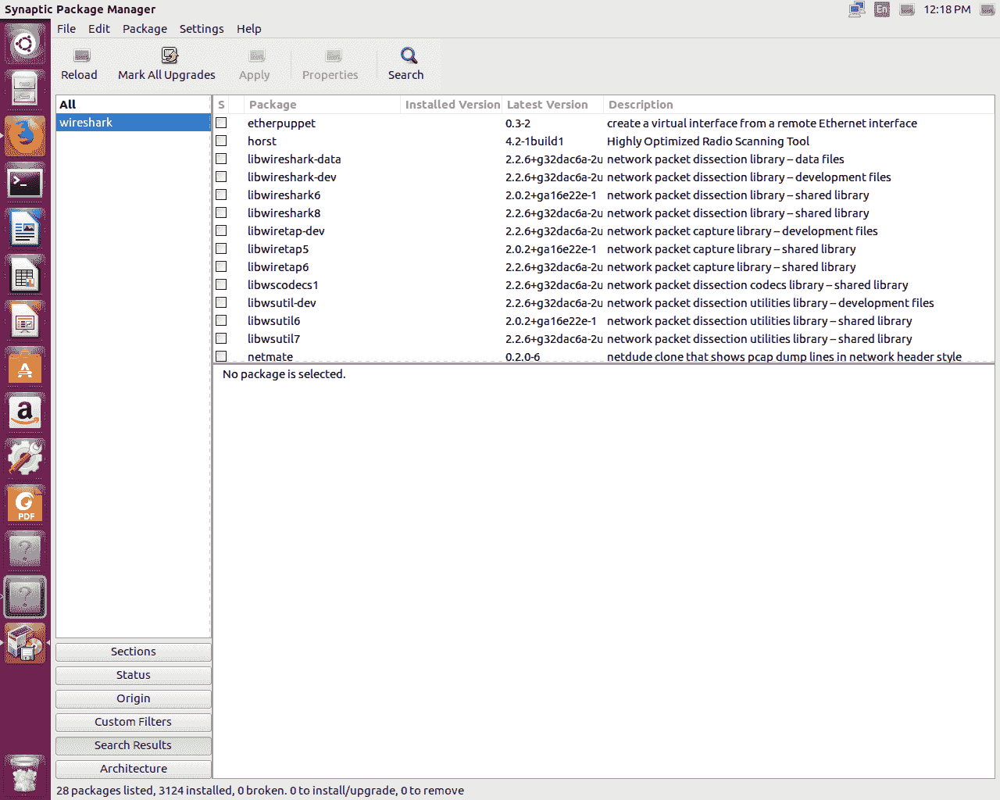

6.  我们将向下滚动并选择主 wireshark 包，只选择标有 Wireshark 的包，如下面的屏幕截图所示:

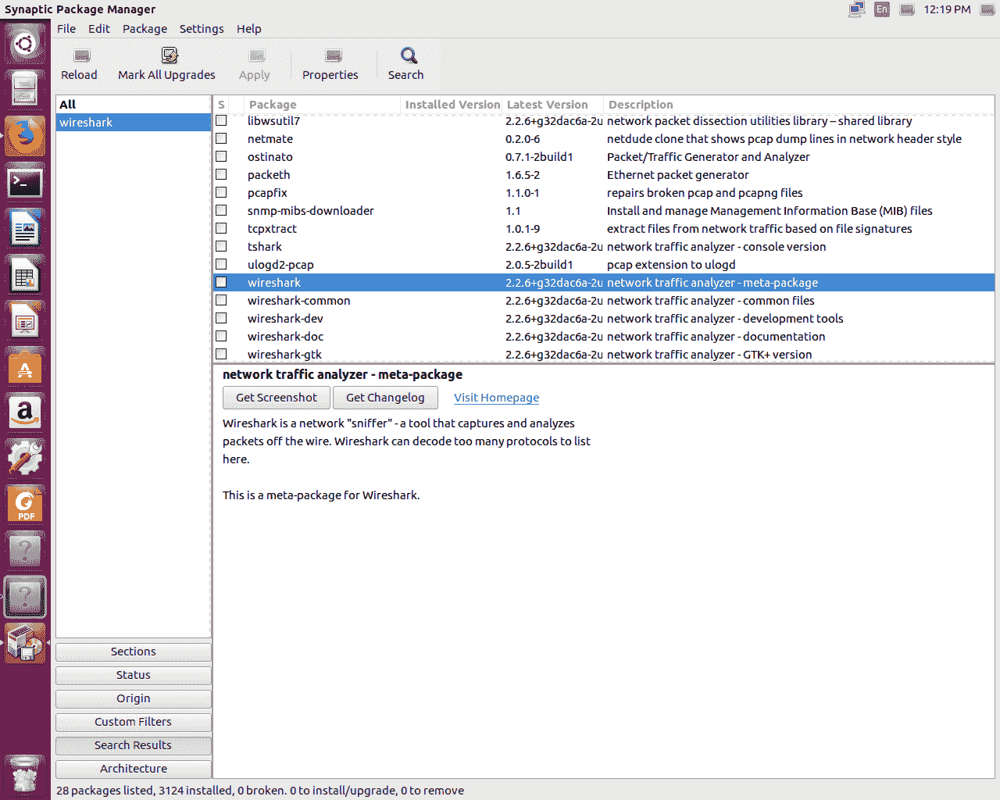

7.  所以我们会选择它。点击它，并选择标记为安装。然后它会问你是否可以安装其他需要的软件包。我们可以说当然，那很好；标记它们以便安装。因此，现在我们所有的依赖项也将被安装:

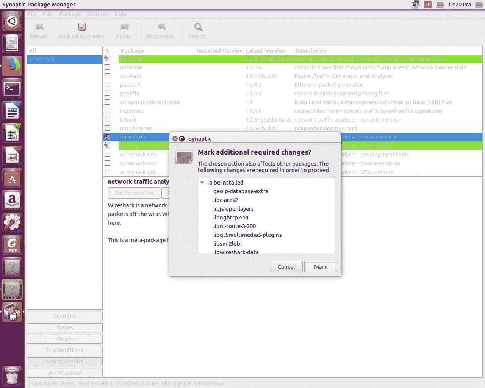

8.  然后，我们可以上去单击“Apply ”,它会告诉我们将安装以下软件包。再次点击应用，新立得将继续下载并安装我们选择的所有程序:

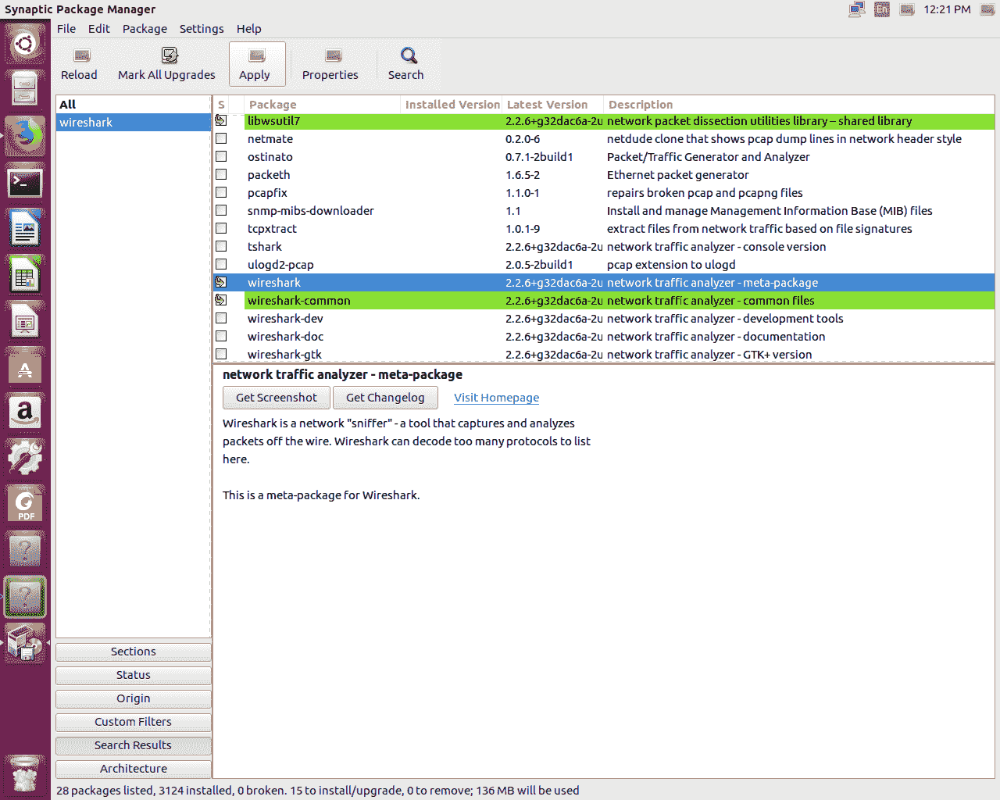

此时，您将收到一个弹出窗口，询问您非超级用户是否应该能够捕获数据包。我建议选择是。这将允许您将根用户与标准用户分开，但仍然允许您作为标准用户捕获数据包。

9.  一旦一切都完成了，你会收到一个应用的变化窗口。它会说:已成功应用所有更改。你现在可以关闭窗口了。
10.  只需单击“Close ”,您就会看到这里用绿色标记的所有东西都已安装完毕，包括 Wireshark:

11.  因此，在这一点上，我们可以关闭这个程序以及 Ubuntu 软件。接下来，点击界面左上角的搜索按钮，我们输入`wireshark`。它自动显示 Wireshark 在这里。我们只需点击它，它就会加载 Wireshark。
12.  此时，一旦 Wireshark 加载完毕，您就大功告成了。

# 摘要

在本章中，您已经学习了如何在 macOS 和 Linux 上安装 Wireshark，特别是 Ubuntu。

在[第 2 章](6d5589f2-aa9f-4a38-bd79-14254d2d33fe.xhtml)、*Wireshark 入门*中，我们将了解 Wireshark 2 的新增功能，包括捕获流量、保存和导出数据包、注释和打印数据包、远程捕获设置和远程捕获使用。