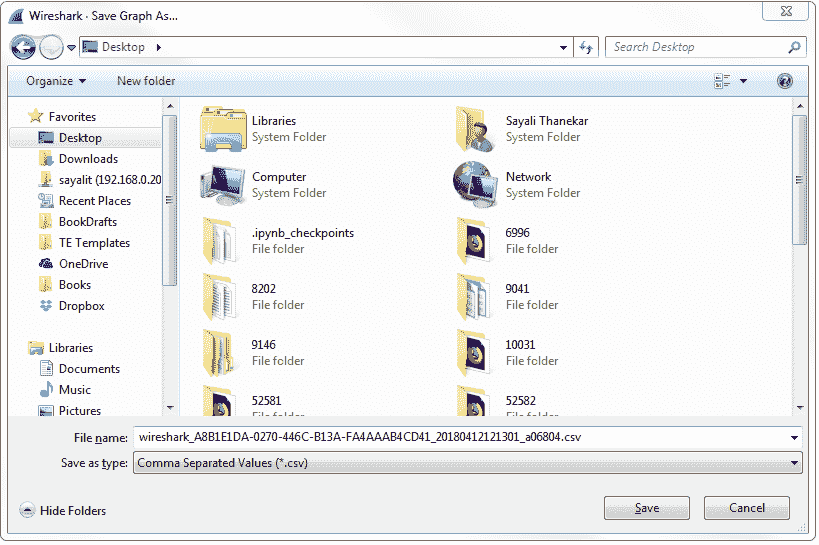
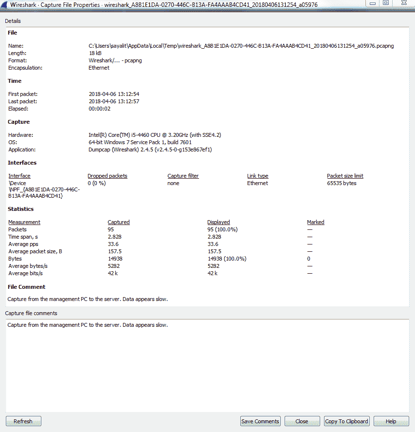
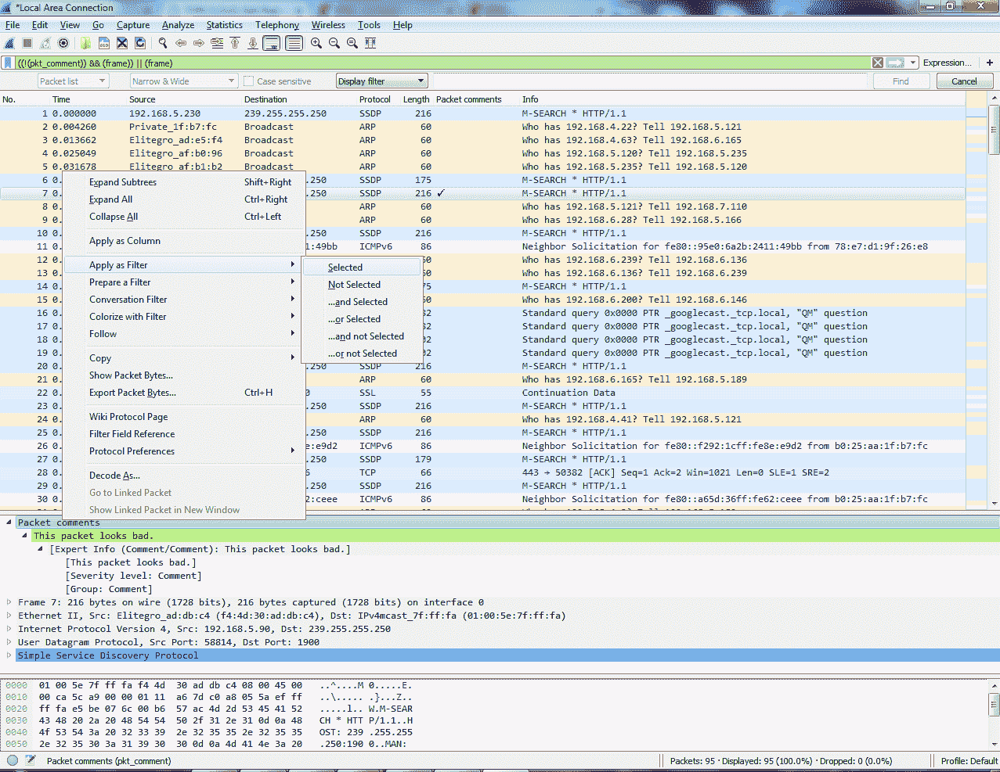
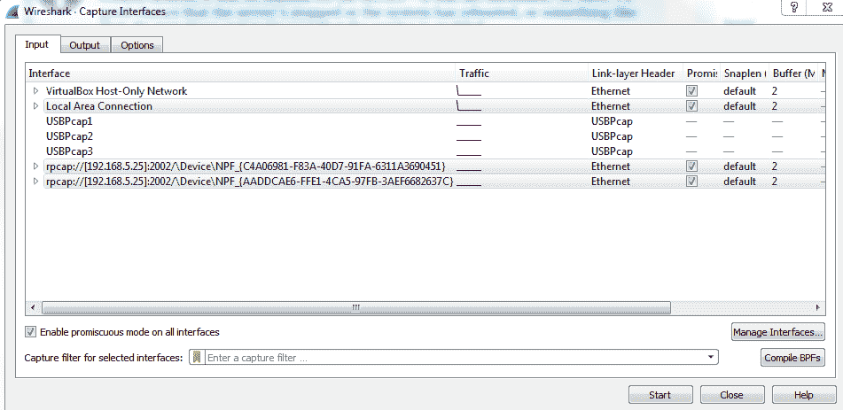

# 二、Wireshark 入门

在本章中，我们将讨论以下主题:

*   Wireshark 2 的新功能
*   捕获流量
*   保存和导出数据包
*   注释和打印数据包
*   远程捕获设置
*   远程捕获使用

# Wireshark 2 有什么新功能？

Wireshark 推出了新版本，这是一个新的主要版本，具有许多有趣的功能。在这里，您可以看到新的 Qt GUI:

它看起来非常类似于传统的 GTK 图形用户界面，只有一些小的改动。这里的主菜单栏已经更改并删除了一些图标；通用界面更简洁一些。不过，所有的通用功能都是一样的。捕获选项位于左上角，由齿轮图标表示。当您单击齿轮图标时，您会看到输入选项、输出选项和常规选项的多个选项卡:

当您点击编辑|首选项时...，您可以看到首选项窗口，如下图所示。“显示至”等选项使导航和查看您需要查看的内容变得更加容易:

如下面的屏幕截图所示，在左侧，您可以看到根据您的选择显示的相关数据包图表。因此，如果你选择不同的包，这将改变大小和形状；你所选择的可能出现在你面前。这使得挑选彼此相关的包变得容易，而不必遵循 TCP 或 UDP 流:

在菜单栏中的 Statistics 菜单下，许多统计选项现在都有一个外观相似的窗口，如下面的屏幕截图所示。如果您看一下按钮、过滤器和通用接口是如何设置的，它们现在都是标准化的，看起来彼此非常非常相似，我相信这使那些从事 Wireshark 代码工作的人更容易编写代码:

点击统计|输入输出图表；现在您可以看到 Wireshark IO 图。在左下方，您可以单击加号图标，向 IO 图中的图表添加多个项目，并且您可以不限次数地执行此操作:

此外，您在此所做的任何更改都会保存到您的个人资料中。在此图表中，您还可以单击另存为...并选择不同的文件格式以供选择:

点击分析|跟随| UDP 流；您可以看到“跟随流”对话框已经更新，现在它允许您选择是整个对话还是一次仅一面。它还允许您在以下范围内搜索文本:

在前面的截图中，您可以看到上下文感知提示在起作用。在这个流中，如果您查看底部，您会看到一些信息，如客户端数据包、服务器数据包等，这些信息会根据您悬停的对象而变化。主捕获窗口将变为实际数据包。

这对于浏览数据和查看与整个捕获相关的数据非常方便。

现在让我们看看如何捕获流量，并在主窗口中获取第一个数据包。

# 捕获流量

我敢肯定，您在 Wireshark 中想做的第一件事就是开始捕获一些流量，这样您就可以习惯该实用工具，并可能诊断您自己网络上的一些问题。在本节中，我们将具体讨论:在哪里捕获流量以及如何捕获流量。

Wireshark 需要以某种方式接收数据包，以便您可以开始分析数据并执行网络诊断。在 Wireshark 中有几种方法可以做到这一点。一种方法是在通过 GUI 安装了 Wireshark 的本地设备上开始捕获。您也可以选择通过命令行这样做。例如，您可以从安装在管理计算机上的 Wireshark 进行远程捕获。它可以使用特殊的驱动程序安装来检索从网络上的其他设备接收和发送的数据包。您还可以在线捕获流量，这意味着您可以在需要诊断的数据路径上放置一个名为**测试操作端口** ( **TAP** )的设备，然后它会将数据发送回您的诊断实用工具，其中一个可能是 Wireshark。最后，我们将了解如何在网络设备(特别是 Cisco 路由器或交换机)上本地存储数据包，以便作为`pcap`文件导出到 Wireshark。

# 如何抓取流量

为了捕获 Wireshark 的内联通信量，您需要在线路上放置某种设备，使其能够看到发送和接收的通信量，然后将该通信量复制到您的诊断机器的其他端口，例如，这些诊断机器可能正在运行 Wireshark。我们可以在运行半双工的旧网络中使用的早期设备之一是集线器。这是交换机的前身，它有一个非常基本的功能，即看到通过线路发送的电信号，并将这些电信号复制到它拥有的所有其他端口，而不关心这些实际端口上有什么。基本上，这只是一个分离器。这对一个较慢、较老的半双工网络来说非常好；但是对于一个现代的、交换式的、全双工的网络，你将需要一些更好的东西。你可以使用的一种设备是水龙头。

有四种不同的抽头可用:

*   非聚集龙头
*   聚合点击
*   再生水龙头
*   链路聚合抽头

每个水龙头都有不同的功能。我提到了**交换端口分析** ( **SPAN** )端口或端口镜像。在现代交换网络中，这是一种非常常见的接收流量的方式。如果您有一个被管理的交换机，如 Cisco 交换机或其他任何交换机，您可以进入交换机，告诉它将它在一个端口上看到的流量复制到另一个端口。然后，此端口可以连接到您的 Wireshark 机器来捕获流量。它对现代网络非常有用，因为不需要其他硬件。您只需进入交换机，告诉它将数据复制到您的监控系统。为了捕获无线通信，您需要知道有多种模式可以使用。我们将讨论两种模式:

*   **监控模式**:该模式接收指定通道上的所有数据包。例如，在美国，我们有 11 个 2.4 GHz 的频道。您可以告诉您的网卡或无线网卡接收 3 号信道上的所有流量，然后它将捕获 3 号信道上任何 SSID 和任何网络的所有流量。
*   **混杂模式**:这种模式在您的无线驱动程序中更常见，它允许您在连接的网络上接收连接的 SSID 上的所有数据包。如果您连接到您的工作网络或家庭网络——无论您试图诊断的是什么——它都会捕获通过该网络名称和 SSID 的任何内容。但是它会忽略同一频道上的任何其他频道，当然也会忽略任何其他频道上的任何其他频道。

在下面的截图中，我们可以看到 Wireshark 正在运行。您可以看到我这里有一个接口列表，包括一个本地连接和一些虚拟适配器。我这台电脑上没有任何无线适配器，否则它们也会出现在这里。以及您可能拥有的任何其他额外的**网络接口控制器** ( **网卡**)卡——有线卡，没关系——它们都会显示在这里的列表中:

您还会看到 Wireshark 继续绘制的图表，它向我们显示了它在每个连接上看到的数据量。这实际上非常有用，尤其是如果您有一台具有许多不同接口的诊断计算机——不同的 SPAN 端口，或者任何可能的接口。也许您打开了接收大量数据的特定端口的 SPAN，但您不知道它连接到监控系统的哪个端口。你可以看看这里。接收最多数据或预期数据量的端口可能是您想要尝试和捕获的端口。所以我发现这在拥挤的系统中很有用。

为了捕获流量，在最新版本的 Wireshark 中，您只需双击它，它就会开始捕获您的流量，您可以看到流量开始滚动。在这台电脑中，我实际上并没有做什么非常有趣的事情，考虑到有多少流量被发送和接收，但有一些服务正在后台运行，可能有最小化的网络浏览器，诸如此类。但是你会看到在一台标准的空闲计算机上有相当多的通信:

要停止此捕获，您只需进入顶部并单击停止图标:

你会注意到数据包在滚动并实时更新。嗯，这在某些情况下是有用的——可能不是对所有人都有用。因此，如果您的系统正在接收大量数据，例如，可能是每秒千兆比特，或者如果您试图在一台非常旧且非常慢的计算机上运行这些数据，这可能不是一个理想的情况，尤其是如果您使用 GUI。

所以你可以把它关掉，这样它就不会使用显卡和处理器来尝试实时更新屏幕。为此，请执行以下步骤:

1.  点击齿轮图标，如以下截图所示:

2.  转到选项，您可以看到这里有一些复选框，我们可以将其关闭。因此，您可以实时看到数据包的更新列表。如果我取消选中该选项，它将阻止列表继续接收数据包，并且我可以在实时捕获期间关闭自动滚动。你会注意到右边的滚动条一直到了最底部。如果我在实时拍摄过程中关闭自动滚动，它会保持在顶部。所以，正如我提到的，如果你在一台旧电脑上运行，禁用这两项非常有用:

3.  您也可以选择多个接口。如果您返回到选项选择并查看输入选项卡，您可以使用 *Shift* 键选择多个接口；或者，使用 *Ctrl* 键，您可以单独选择它们，然后单击开始，它将在您选择的所有接口上进行捕获。根据您的情况，这可能是一个有用的功能。

在本节中，我们讨论了一些不同的捕获数据包的方法；如何让他们进入你的 Wireshark 捕获系统。接下来，我们将保存这些数据包，并以各种方式导出它们。

# 保存和导出数据包

在本节中，我们将了解以下子主题:

*   如何保存数据包捕获
*   如何保存数据包的选定部分、单个数据包和数据包范围
*   如何将数据包导出为其他格式
*   如何从您选择的捕获中导出原始数据包数据

现在我们已经启动并运行了 Wireshark，让我们捕获一些流量。我们将选择本地连接，我们可以双击我提到的连接，也可以从顶部开始捕获。我们会收到一些包裹。现在，如果我想保存这个捕获(整个捕获—我刚刚捕获的所有数据包),我将转到文件|另存为...；从这里，我可以简单地选择一个文件名。所以，我们就叫它`packets`。您会看到在保存类型中，我选择文件为`pcapng`:

所以，`pcapng`是下一代的`pcap`文件扩展名。它是与 Wireshark 1.8 一起发布的，所以它相对较新，并且包括一些额外的特性，我们将在以后的章节中讨论这些特性。但是你应该知道，`.pcapng`文件扩展名是新的标准，所以如果你看到一个结尾没有`ng`的`.pcap`文件，那是一个旧的捕获文件，你当然可以把它保存为`.pcapng`，因为这是现在的默认设置。但是，请注意，如果您将一个`pcapng`文件保存为原始的`pcap`文件，您将会失去`ng`格式的一些功能。所以，我的建议是坚持使用`ng`格式。几乎所有使用`pcap`文件的插件和附加软件现在都支持`ng`格式，所以你可以继续使用它。您还会注意到这里不同的长采集扩展。您已经列出了`.gz`，对于`pcapng`，您还有`.gz`、`ntar.gz`等等。为了达到这个目的，你必须选择用 gzip 压缩选项。所以当你选择用 gzip 压缩时，就像把文件放入一个 zip 文件一样，它会获取你的捕获文件，并试图压缩它使它变得更小。因此，如果是大规模捕获，请记住数据包捕获包括从您正在捕获的网卡穿越网络的所有数据。因此，如果您在执行捕获时传输大量数据，所有这些数据都将保存在您的捕获中。传输的数据将是 1:1 的比例，因此可能非常大。gzip 对你来说可能是有意义的，因为那样的话，你硬盘上的文件会小得多。此外，如果您尝试将文件传输到您的网络，那么这可能会节省传输文件的时间，因为传输的文件会更小。但是，大多数时候它是不被使用的，尤其是如果你过滤掉你只需要在一个捕获中看到的东西，并且你最终只保存了你需要的东西，那么它们通常是非常小的。

现在，我们将保存该捕获。说到过滤掉你想看的东西，缩小捕获范围，我们就这么做吧。

这里有一些 HTTP 流量，我们将右键单击它，然后单击“Follow | TCP Stream”。这样，我们就有了某种流，可以过滤掉数据包捕获中的所有其他数据。所以我们选择了七个包。如果我只想将这些数据包保存到一个新文件中，我将转到文件|导出指定的数据包....我们称之为`packet small`,您会看到这里有一个单选按钮，可以在显示和捕获之间进行选择:

如此捕获的是整个数据包捕获。这几乎增加了`2870`个数据包。Displayed 将只保存当前过滤的内容和我的数据包列表视图中显示的内容。因此，如果我在所有数据包中显示了选中，这将把所有七个数据包导出到一个新文件中。此外，我可以选择选定的数据包。因此，您会看到我当前选择了数据包编号`16`;这里的颜色略有不同。如果我选择选定的数据包，这只会将一个数据包保存到一个新文件中:

我也可以选择一个范围。现在，范围现在不会显示任何内容，因为我们有自己的小过滤器，但我可以做的是清除这个过滤器。我们将返回导出指定的数据包...并保存数据包范围。我们可以说数据包`5`到`200`。所以有`196`包将被保存到`packets range`文件中:

此外，您可以通过转到文件|导出数据包剖析来导出数据包剖析，然后选择您想要的格式:

所以我们选择纯文本...，我们就叫它`packet dissect`。我们将只处理选定的数据包，这里有我们的`packet dissect`文本文件，您可以看到它包含数据包编号、数据包进入的时间、源和目的 IP 地址、协议是什么、有关协议的任何信息，以及您可以在数据包详细信息部分看到的基本信息；这些现在都保存在文本文件中，如下所示:

如果您的数据包捕获碰巧捕获了任何安全流量，如任何 HTTPS、SSL 或 SSH 流量，您可以使用文件|导出 SSL 会话密钥...，然后保存这些 SSL 密钥，以便将来在其他应用中使用。

您可能已经注意到了一个灰色的附加导出:导出包字节...：

为了使其成为可选择的，您需要在您的包中选择应用数据。在这里，我们选择了 HTTP 数据包数据。如果我们回到文件，您会看到导出数据包字节...现在可以选择。如果我选择了这个选项，我现在可以用原始的二进制格式从我的包中导出我的数据。如果你正在用一个十六进制编辑器做一些事情，或者把这些部分结合起来用于一些其他的应用，它可能是有用的。

在本节中，您学习了如何保存和导出数据包:整个数据包捕获、数据包捕获的子集(如过滤视图)、单个数据包，以及将原始数据导出为不同格式(如文本文件)。

# 注释和打印数据包

在本节中，我们将了解以下子主题:

*   如何使用新的注释功能，也称为注释
*   如何找到带有注释的包，有多种方法可以找到
*   如何打印数据包

现在，让我们用一些包来工作。我要开始快速抓拍了。

要为数据包捕获(整个捕获本身)创建注释，您可以在 Wireshark 的左下角完成。您可以看到下面有两个图标:一个是圆形图标，称为专家信息，我们将在以后的部分中介绍；还有一个铅笔图标，带有数据包捕获图标。如果你把鼠标放在铅笔图标上，它会说打开捕获文件属性对话框:

单击它，将会打开一个弹出窗口，为您提供一系列不同的捕获信息。这里有一个底部部分，称为文件注释，您可以在这里为整个数据包捕获输入任何类型的描述。所以也许这就是，`Capture from the management PC to the server. Data appears slow.`。单击“保存评论”按钮，这将为您保存评论:

当我单击 Save Comments 时，您还会看到文件注释出现在顶部窗格的底部。

您还可以为单个数据包创建注释，为此，您可以选择要为其创建注释的数据包，右键单击它，然后转到数据包注释....您会看到有一个小弹出窗口供您输入数据包注释，比如说，`This packet looks bad.`或您可能想输入的任何内容:

点击确定。当您这样做时，您会看到在数据包详细信息区域中，会弹出数据包注释部分，并且是漂亮的亮绿色，因此您可以看到这一点。如果你展开它，它会显示你输入的评论:

现在，如果我选择不同的数据包，它不会显示。因此，如果我返回到我选择的数据包，它会再次显示。现在，您可能想知道:如何在捕获中找到带有注释的数据包？有多种方法可以做到这一点。其中一种方法是右键单击详细信息区域中的数据包注释字段，我们将转到应用为列。当您单击它时，它会创建一个列，显示该数据包是否有注释:

此外，我还可以点击左下角的“专家信息”按钮。当你点击它时，它会给我们一大堆关于我们捕获的信息，我们暂时忽略这些信息。但在最底部，有一个注释部分，它会说，7 号数据包有一个注释，如下面的截图所示:

有趣的是，如果我将它移到一边，选择另一个数据包，我们会一直走到底部，选择数据包 60，然后如果我单击数据包 7 中的注释，您会看到数据包列表会自动跳转到数据包 7，为我选择它，并显示注释。这不是很好吗？

查找数据包注释的第三种方法是右键单击数据包注释，然后转到应用为过滤器|选定:

当你这样做时，它会通过`pkt_comment`过滤你的数据包列表，这是一个字段名称，表示一个数据包中是否有注释。在这里，您会看到数据包编号`7`现在是唯一显示的数据包，因为这是我们唯一添加了注释的数据包:

因此，如果我清除它，我们在另一个数据包`Comment 2`上添加另一个注释，如果我对数据包注释重新应用过滤器，我们可以看到这里有两个数据包。所以，这是另一种能够在其中找到评论的方式:

要打印您的捕获或打印单个数据包，您可以转到文件|打印...您会看到这里有许多选项，看起来类似于保存和导出对话框。我们可以为每个数据包打印一个摘要行，如果您取消选中此选项，您将看到预览会随着您的操作而改变，因此您可以看到文件的外观。有一个总结行，它为我们提供列表中每个数据包的信息，总结行看起来有点像数据包列表视图。因此，将会有一行是数据包`1`及其相关信息，然后是另一行是数据包`2`及其相关信息的摘要，以此类推。所以这实际上是一个很方便的选择。

详细信息:将向您显示有关不同协议的信息的数据包详细信息列表，因此我们可以打开或关闭它。如果我关闭它，基本上只会显示数据包列表视图。我要让它开着。如果需要的话，我还可以包含字节。对于许多数据包，您不会想要这样做。显然，您的打印会非常大，但是您可以看到，如果我打开它，它会显示实际的字节信息，如底部的字节所示。所以我现在先把它放下。您会注意到在底部，就像我们在导出对话框中一样，您可以选择选项“仅选定数据包”或“所有数据包”。您也可以只选择标记的数据包:

How to mark packets
What you can do is right-click on a packet and mark it, or do *Ctrl* + *M*. And you can mark a whole bunch of them, and they can be anywhere in the capture, it doesn't matter where-they don't have to be contiguous; and we'll mark up a bunch.

我们将打印这个，您可以在这里看到我们打印的文件。我把它打印成了 PDF 文件，这样你就可以很容易地看到它。您可以看到这里显示了每个数据包的摘要行。摘要行基本上是数据包列表行，包括数据包到达时的数据包编号、源和目的地、协议等等，以及我们希望它打印的详细信息。这是关于它捕获的数据包中涉及哪些协议的最基本信息:

因此，在本节中，您学习了如何为数据包捕获创建注释和注释，以及为单个数据包创建注释或注释，如何在界面的不同位置查看和查找它们，例如在列或过滤器上，或在数据包详细信息视图中，专家信息，以及如何打印数据包。接下来是远程捕获设置。我们将讨论如何通过 Wireshark GUI 从远程机器上捕获数据，并在远程机器上运行`libpcap`。

# 远程捕获设置

在本节中，我们将了解使用远程捕获的先决条件，特别是 WinPcap，它是`libpcap`库的一个 Windows 端口，以及远程设备上远程数据包捕获的配置。

# 先决条件

第一个先决条件是安装`pcap`库。我在这里使用一台 Windows 计算机作为我们的测试机器，所以我将安装`WinPcap`库，这是最初为 Linux 编写的`libpcap`库的一个 Windows 端口。所以我要做的就是去 https://www.winpcap.org/的[下载`WinPcap`库。一旦它完成下载，我将继续进行，只需点击安装程序的下一步，没有必要定制任何东西。](https://www.winpcap.org/)

当您捆绑下载 Wireshark 时，安装的`WinPcap`库也会随 Wireshark 一起提供。因此，如果您已经在系统上安装了 Wireshark，很可能您也已经安装了`pcap`。

下一步是设置一个本地管理员帐户，该帐户将成为运行在这个远程系统上的远程服务`pcap`的服务帐户。当我们添加远程接口时，它用于运行 Wireshark GUI 的系统的身份验证。为此，我们将执行以下步骤:

1.  按下 Windows 键+*R*；它将调出运行命令。
2.  输入`control userpasswords2`。
3.  继续并点击确定。
4.  我们将转到“高级”,再次单击“高级”。
5.  转到“用户”,我们将创建一个新用户...；我们称之为`pcap`。
6.  我们会说它是一个`Service Account`并给它一个密码:

7.  我将取消选中第一个选项，强制用户创建新密码，因为这是一个服务帐户。我们还将防止它改变其密码，永远不会让它过期。我们当然不希望服务帐户的密码被更改，因为我们正在尝试使用它。

8.  现在我们有了自己的`pcap`服务帐户，我们需要给它管理员权限。因此，我们通过右键单击 pcap 来实现这一点。转到“属性”|“成员”|,我们将单击“添加”....键入`Administrators`，然后点击 Check Names，这将告诉它验证是否正确键入了组 Administrators:

9.  单击“OK ”,我们可以继续并再次单击“OK”。
10.  现在,`pcap`服务帐户拥有管理员权限。设置远程`WinPcap`服务的最后一步是再次按下 Windows 键，然后按下 *R* 。我们将调出我们的运行提示并键入`services.msc`。
11.  继续按*进入*或点击 OK，我们将向下滚动，直到我们看到远程数据包捕获协议 v.0(实验)。虽然它说的是 v.0 和实验性的，但这是一项已经提供了很长时间的服务，我从未遇到过任何问题。
12.  继续并右键单击它。转到属性并单击登录选项卡。

13.  我们将选择此帐户:单选选项并浏览...给`pcap`用户，或者你给你的用户起的名字。输入并点击检查姓名。它会验证拼写是否正确，并找到帐户。
14.  然后我们会输入我们给它的密码。好吧。点击确定:

它会说它被授予了服务权利；那很好。此时，我们可以告诉它启动服务。

你可以通过点击顶部的小播放图标来完成；点击那里的开始快捷方式；或者右键单击该服务，直到它启动。

此时应该显示正在运行。为了以防万一，我喜欢做的是在顶部点击“刷新”——只需刷新几次；确保服务根本没有崩溃。

至此，一切都已准备就绪，可以使用了。最后要检查的是确保 Windows 防火墙关闭，或者启用端口`2002`通过 Windows 防火墙。为了简单起见，我们将关闭它，所以按下 Windows 键，调出 Windows 开始菜单，我们将搜索`firewall`。所以在 Windows 10 中，你只需输入，它就会开始搜索。我将转到 Windows 防火墙中的控制面板，您将在这里看到它当前处于启用状态。我们将单击“打开或关闭 Windows 防火墙”，我将关闭它。单击“OK ”,我们可以关闭:

这就是建立一个远程系统的全部内容。因此，在本节中，我们已经讨论了远程系统的所有配置和安装需求。接下来，我们将了解远程捕获的用法，以及如何在 Wireshark GUI 中设置远程捕获，并开始从远程设备捕获流量。

# 远程捕获使用

在本节中，我们将了解如何在远程系统上使用我们用 WinPcap 设置远程数据包捕获软件。

为了使用在远程系统上运行的远程 WinPcap 服务并从中捕获数据包，我们需要将它添加到我们的本地 Wireshark 接口中，以便我们能够捕获它。为此，我们将执行以下步骤:

1.  我们将继续操作，并单击“Capture options”图标。
2.  点击管理接口...您会看到这里有“远程接口”选项卡；点击那个。
3.  点击左下角的加号图标。
4.  输入该远程系统的主机 IP 地址。
5.  单击 Password authentication 单选按钮，输入我们创建的服务帐户的凭据。我在这里用了`pcap`。然后，您可以输入用户名和密码，并单击确定。此时，它应该向我们显示它在另一台设备上看到的远程接口。你看，这是我的`5.25`设备，这是它检测到的接口:

如果此时您没有看到这一点，或者您得到一个弹出窗口，说您有某种连接错误或者它不能连接到远程主机，或者类似的事情，请确保该服务正在运行。请记住，当我们在远程系统上设置服务时，它是手动的，而不是自动的。所以很有可能服务器停止了或者系统重启了，或者类似的事情。转到那里，确保服务已启用。

6.  因此，我们继续操作，并单击“OK”。您会看到它显示在我们的界面列表中。然后，我们可以点击“开始”:

这就是全部了。

# 摘要

在本章中，您已经学习了 Wireshark 中的许多技能，包括 Wireshark 2 中的新功能，以及我提到的 1.8 中的一些功能，即如何在本地 Wireshark 安装中捕获流量；如何通过不同的方式将数据包发送到 Wireshark 系统，例如 SPAN 端口；以不同的方式保存和导出这些数据包；对数据包捕获和单个数据包进行注释或添加注释，并打印它们或它们的选集；最后，在远程 Windows 系统上使用 WinPcap 设置远程数据包捕获，并在本地 Wireshark 安装中使用远程系统的数据包捕获。

在[第 3 章](2dad7e67-cac3-491f-85ca-cffaf037f679.xhtml)、*过滤流量*中，我们将讨论过滤流量的各种方式，既有捕获过滤器，也有显示过滤器，还会看看其他过滤方式。