# 三、过滤流量

在本章中，我们将讨论以下主题:

*   **柏克莱包过滤** ( **BPF** )语法
*   捕获过滤器
*   显示过滤器
*   跟随溪流
*   高级过滤

# Berkeley 包过滤(BPF)语法

在本节中，我们将了解一下 BPF、它的语法和一些历史。

那么，让我们来谈谈 BPF 的历史。许多年前，每个操作系统都有自己的包过滤 API。这方面的例子很多，如 Sun、DEC、SGI 和 Xerox。他们都有自己的操作系统，每个操作系统都有自己的 API 来捕获和过滤数据包。因此，当您需要进行网络分析时，您必须使用内置于操作系统中的特定软件，以及他们设计的 API 中的特定过滤功能。这使得事情变得非常困难，因为根据您的网络实施情况和所涉及的不同操作系统，您必须了解所有这些不同的 API 和所有这些不同的过滤规则，才能完成任何事情。因此，在 1993 年，Steven McCanne 和 Van Jacobson 发布了一篇名为*BSD 数据包过滤器(BPF)* 的论文，他们概述了 BPF 背后的规则和思想，并解释了它如何成为过滤捕获流量的标准化方法。恰好它流行起来，变得非常受欢迎，特别是当`libpcap`、WinPcap 和其他库开始使用 BPF 作为它的标准化过滤系统，尤其是现在使用 Wireshark 的时候。

为了编写 BPF，您需要创建一个表达式，它包含一个或多个原语，包括一个 ID，如名称或号码、一个 IP 地址或一个以太网地址加上一个限定符。限定符包含以下三个部分:

*   类型
*   方向
*   草案

对于一个类型，它可以是一台单独的主机、一个网络、一个端口或一个端口范围。方向可以是源或目的地，也可以是源和目的地。协议可以是以太网、FDDI、无线局域网、IP、现在的 IPv6、ARP、RARP、DECNET、TCP 或 UDP。您需要定义您想要的这些不同的部分，以及您想要如何限制您的流量和与之相关的值——与这些限定符相关的 ID、名称或编号。所以，我有一些例子给你，这样它可以让你明白如何创建一个 BPF 表达式。第一个是`ip host 192.168.1.1`。IP 是协议，主机是类型，ID 是 IP 地址。这将过滤该 IP 地址的流量，无论它是源还是目的地。这个 host 关键字为我们做了这两项工作。

接下来，我有了`ether src AA:BB:CC:DD:EE:FF`和一个虚构的 MAC 地址。这和 IP 主机的思路是一样的。我们将以太网定义为我们的协议，将源定义为方向，并将 MAC 地址定义为我们正在寻找的地址。

如果您碰巧捕获到具有多个 VLAN 的流量，例如跨越一个作为交换机中继端口的端口，您可以指定 VLAN，例如`vlan 100`。

下一个例子是`ether broadcast`，这个例子有一个特殊的关键字用于广播，告诉 BPF，如果它是某种类型的广播，我们要在第 2 层过滤我们所有的流量。

而我的最后一个例子是`tcp port 80`。因此，我们将过滤该流量，寻找最有可能的 HTTP 流量，仅寻找任何源目的地的端口`80`。

接下来是捕获过滤器，我们将把这种 BPF 语法应用于 Wireshark 中的接口。

# 捕获过滤器

在本节中，我们将了解如何在使用 BPF 语法捕获流量之前对其进行过滤。因此，我们将在捕获接口上过滤流量。

在 Wireshark 中，有两个地方可以输入捕获过滤器。

第一个就在下面的主屏幕上。在正中间，我们有捕获部分，它说，...使用此过滤器:输入捕获过滤器。所以，我们实际上可以在主屏幕上这样做。尝试输入一个捕获过滤器，然后它将开始捕获应用的过滤器。您还会看到有一个绿色的书签图标，如下图所示。如果你将鼠标悬停在图标上，它会显示管理保存的书签。如果我们单击它，Wireshark 中已经内置了许多保存的书签。因此，如果您想要筛选某个常用功能，它可能已经在列表中了:

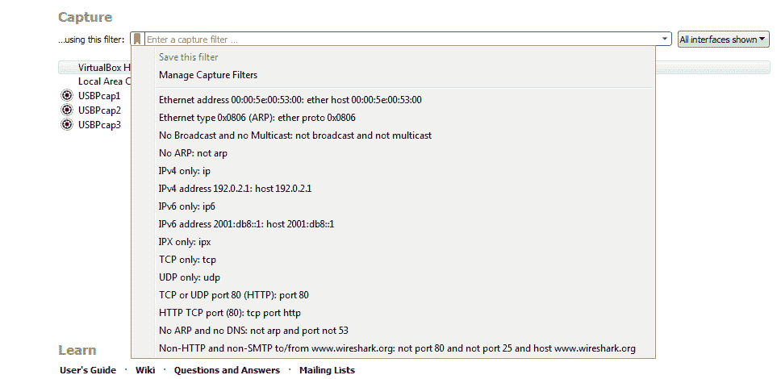

但是您也可以转到顶部，单击“管理捕获过滤器”。这将为您提供所有预定义的捕获过滤器和您自己保存的任何过滤器的列表，因此您不必一次又一次地输入相同的捕获过滤器。您可以创建一个并保存它。所以，你需要做的就是点击那个加号图标，然后你就可以输入你想做的任何事情。所以我们可以做`ip host 192.168.5.25`，我们现在已经创建了一个新的捕获过滤器。然后，我当然可以重新命名。如果我双击它，它将允许我重命名，我可以说`My Host`:

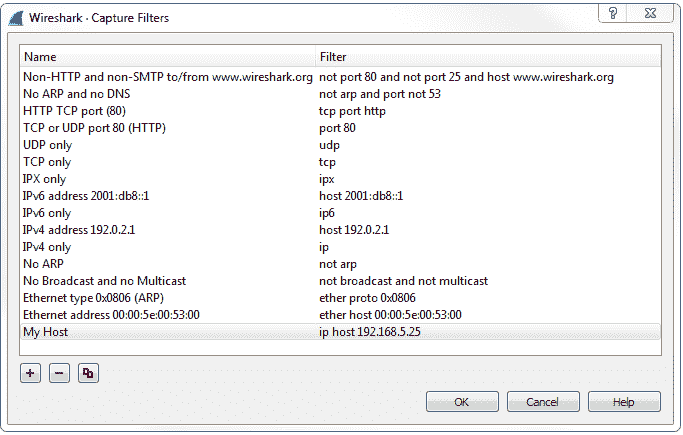

现在，如果我回头看，它现在会是可见的。

您也可以通过先选择一个接口，然后输入您想要的内容来保存捕获过滤器。如果输入有效，你会看到它变成绿色。然后，单击书签图标，然后单击保存该过滤器:

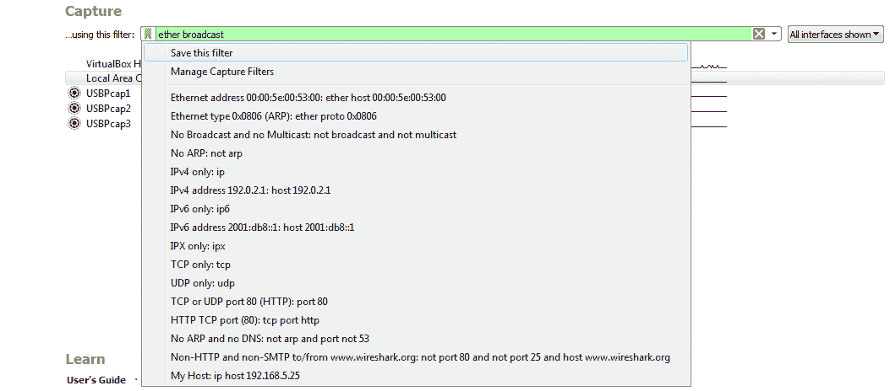

如果您单击它，将会弹出预先填充的“管理捕获过滤器”窗口，这样您就可以随意命名了。然后，使用这个捕获，我只需双击我的界面，开始捕获该流量。您将会看到，我正在过滤以太网广播，因此只显示第 2 层的广播流量:

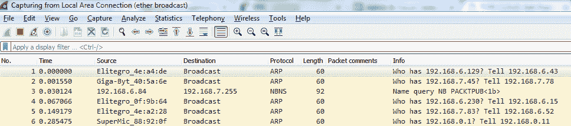

进入捕获过滤器的第二种方式是通过齿轮图标:

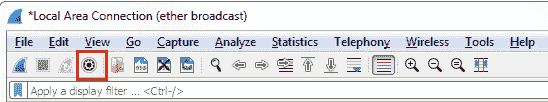

单击“Capture options ”,您会在底部看到“Capture filter for selected interfaces”选项。您可以像在上一个窗口中一样进入捕获过滤器，并管理您的书签。所以，我们可以在`ip host 192.168.5.25`进入。现在，选择接口，它会变成绿色，我可以开始捕获了:

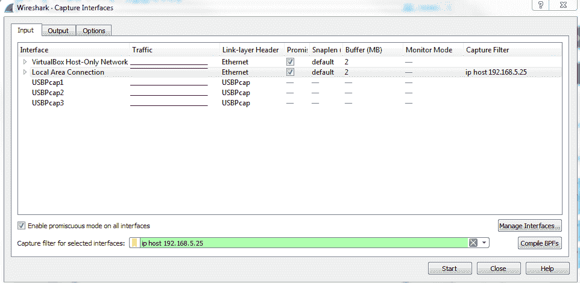

现在，它会显示进出我的网关的所有流量。

我们的下一部分是*显示过滤器*，我们将在捕获已经开始或已经保存之后过滤我们的流量，而不是在捕获本身期间过滤流量。这是一种非常常见的方法，这样您可以捕获网络上的所有流量，然后只查看您需要的部分。

# 显示过滤器

在本节中，我们将讨论显示过滤器。关于显示过滤器，我们将讨论如何筛选大型数据包捕获。因此，捕获流量的常用方法是不使用捕获过滤器，而是捕获接口可以看到的所有内容，然后简单地过滤掉您想要查看的内容，因为其他一些数据包可能有助于诊断某种问题。我们还将讨论快速访问过滤器按钮。因此，如果您的环境中有一个经常需要过滤的东西，您可以创建一个快速访问按钮，只需单击它，而不必每次都键入显示过滤器。您可以使用许多筛选器运算符来组合多个筛选器，以创建一个完整的表达式来表示您希望具体筛选的内容:

*   `eq/==`
*   `le/<=`
*   `or/||`
*   `not/!`
*   `and/&&`
*   `ne/!=`
*   `gt/>`
*   `contains`
*   `It/<`
*   `matches`
*   `ge/>=`
*   `()`

因此，您可以将 IP 地址过滤器与端口号过滤器相结合，或者与 TCP 相关的过滤器，或者与两个 MAC 地址相关的过滤器。您可以使用这些过滤运算符以不同的方式组合或排除它们。您可以使用操作符的 Word 版本，它在`/`之前，或者您可以使用在`/`之后列出的任何东西，它就像 Word option 的数学等价物。还有一个括号，所以你也可以把过滤器和它们的操作符结合在一起，有点像数学方程。所以，你可以有一定的比较，比如两个 OR 语句，先进行比较，然后把它和别的东西作为加法，比如 and 语句。

因此，要使用显示过滤器，让我们先获得一些流量。我将在没有任何捕获过滤器的情况下在我的主界面上开始捕获。因此，我们将有一些数据包传入，这些数据包是我的系统中目前空闲的数据包。

您会在屏幕顶部看到一个应用显示过滤器输入框。它也有书签图标，就像捕获过滤器一样:

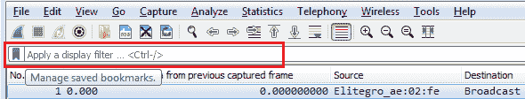

那么，让我们来看一些数据包。我将在我的主界面上开始捕获，不输入任何捕获过滤器。因此，我们将捕获我的系统上发生的一切；目前无论背景是什么？因此，在我们有了大量的流量后，你会注意到在顶部有一个文本框，上面写着应用显示过滤器，它的工作方式就像捕获过滤器文本框一样。我们可以输入我们想要的显示过滤器。左侧还有书签图标，就像捕获过滤器一样。如果我单击它，它会显示我保存的过滤器。我可以列出一大堆，如下面的屏幕截图所示——这些是 Wireshark 预构建的常见工具:

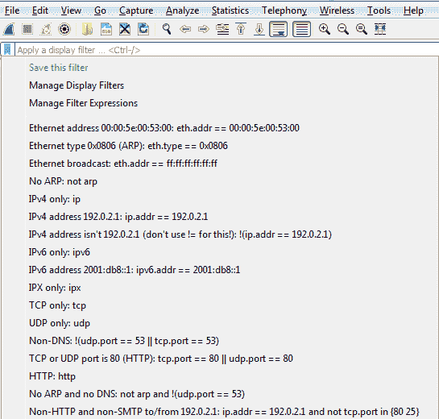

就像捕获过滤器一样，如果我在文本框中输入一个过滤器，我可以保存它。或者，我可以进入并管理我的显示过滤器，也可以手动添加和删除它们，就像使用捕获过滤器一样。

让我们从过滤开始。那么，让我们做`ip.host`，也就是`eq 192.168.5.25`，这就是我的入口:

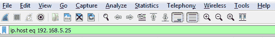

然后，我可以点击右边的箭头来应用它，或者按下*进入*。当我这样做时，所有的流量都进出我的网关`5.25`:

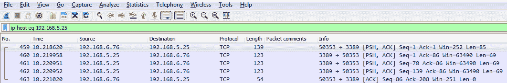

我们还可以根据来源或目的地进行过滤。我们将使用关键字`host`，因此我们将输入`ip.host`。

Host 是一种快捷方式，可以包含在特定 IP 地址的源流量和目的流量中。

我们也可以按来源过滤，即`src`，但是如果我们这样做，我们将只得到来自`5.25`的流量；我们不会有回程流量。如果我们对目的地`dst`做同样的事情，我们将得到返回流量，但不是原始流量。

那么，我们如何获得这种流量呢？我们可以用一个操作符把它连接起来，就像我提到的。因此，我们将告诉 Wireshark 我们希望这两个目的地都包含在源流量中。我们已经在那里了。所以，我们要做的是把它和一个 OR 结合起来。如果你记得的话，你可以输入`or`，或者两个竖线符号。我们将键入`ip.src ==`,并输入我的网关的 IP 地址。

现在它是一个有效的显示过滤器，它变成了绿色。我只需按下*回车*就可以了:

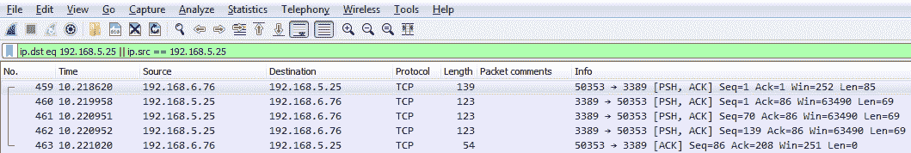

现在我们有两个方向的流量，就像我输入`ip.host`一样。因此，你可以看到如何使用这些快捷方式，你知道在显示过滤器选项可以让事情变得更快。

我们可以做的另一件有趣的事情是，假设我们需要解决 TCP 传输缓慢的问题。所以我们想看看窗口大小，所以我们输入`tcp.window_size_value < 10`。所以，让我按下*键，输入*，我们开始。所以，我们有一包。记住，我们没有定义任何种类的 IP 地址。Wireshark 捕获的窗口大小小于`10 `的任何数据包都会显示给我:

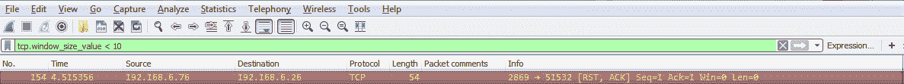

如果我们展开 TCP 细节，您会看到窗口大小；肯定是小于`10`:

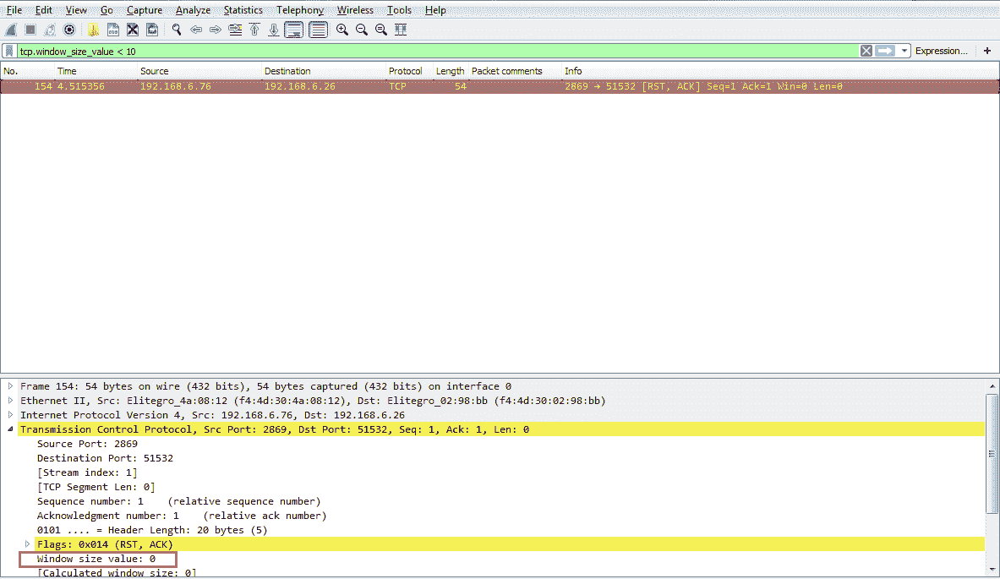

所以，让我们用我提到的括号创建一个例子。因此，我们将再次根据我的网关进行过滤。我要做的是快速访问我最近使用的一个显示过滤器。所以，我就打`ip`。现在，如果你看那里，最近用过的在最上面。所以，我将使用向下箭头，选择我想要使用的那个，然后按*键进入*:

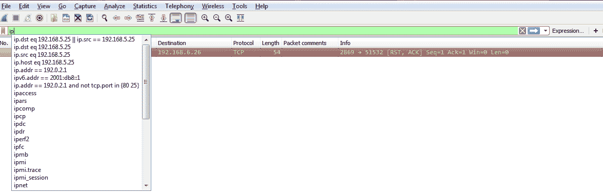

我们会给它加上一些括号。现在，我再加上`dns`。因此，我希望看到进出我的网关的任何流量，这是一个 DNS 条目。所以我将键入`&&(dns)`，这是 DNS 协议的快捷方式，然后我按*键输入*:

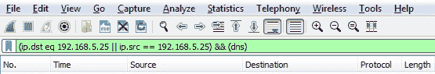

现在，我们可以走得更远。所以我们可以说`&& ip.len <= 72`。现在，我已经将它缩减到所有进出我的网关的长度小于`72`字节的 DNS 数据包:

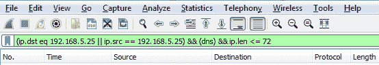

所以，你可以看到这是多么的强大，以及你如何修剪掉你想要看到的东西。这是一个非常强大的功能，里面有很多过滤器。事实上，两千个协议有上万个过滤器。因此，如果你去[https://www.wireshark.org/docs/dfref/](https://www.wireshark.org/docs/dfref/)查询显示过滤参考，它会显示你可以使用的所有不同的字段。我们要做的是，单击 I 并查找 ip。我们走吧。让我单击它，然后它会告诉我们可以筛选的所有子字段。所以，`ip`是协议。现在，我们可能对地址或校验和、目的地、来源、标志类型、GeoIP 信息等感到好奇。因此，这是搜索您想要筛选的内容的一个很好的参考。现在，我们将讨论的最后一个显示功能是创建快速访问按钮。所以，如果你看右边，我们有一个加号图标，它说添加一个显示过滤器按钮:

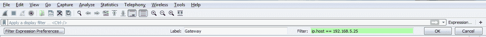

因此，如果我们单击它，我们就可以创建一个标签并输入一个筛选器进行保存。所以，假设我想为我的`Gateway`做一个。我就说`ip.host == my gateway`做个过滤。单击“确定”后，您将看到一个“网关开始”按钮。因此，如果我捕获了成百上千个数据包，我只需点击我的网关按钮，它就会立即应用过滤器:

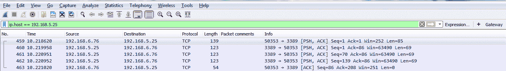

现在，如果您希望删除一些按钮，最简单的方法是再次单击加号图标，然后在左侧有一个按钮，上面写着“过滤表达式首选项”....这将带您直接进入 Wireshark 的首选项部分，然后您可以编辑或删除您需要更改或不想要的任何按钮:

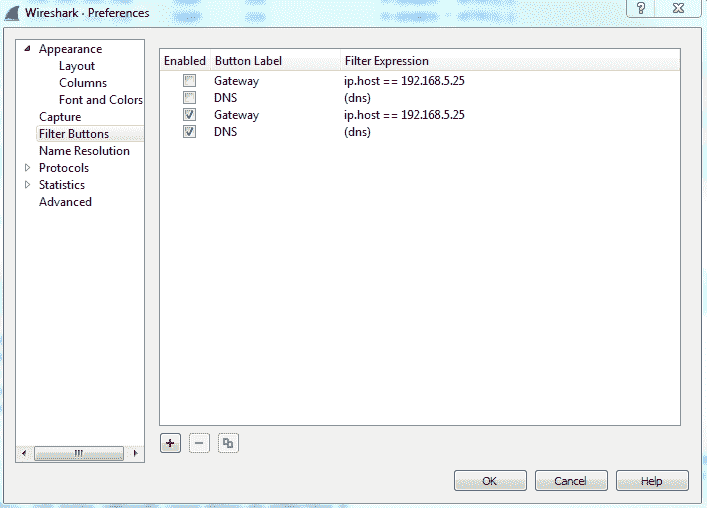

因此，在本节中，我们复习了显示过滤器的基础知识，并创建了快速访问过滤器按钮。接下来，我们将讨论 TCP 和 UDP 流的过滤，并展示数据包捕获中的特定对话。

# 跟随溪流

在上一节中，我们讨论了如何使用显示过滤器来限制您在数据包捕获中看到的内容。在这一节中，我们将在此基础上继续学习。这意味着，在本节中，我们将按照 TCP 和 UDP 流来挑选数据包捕获中的会话，以便我们可以查看每个 TCP 通信或每个 UDP 通信之间的特定通信。因此，我们有一个打开[https://www.cisco.com/](https://www.cisco.com/)主页的数据包捕获。默认情况下，【https://www.cisco.com/】的主页没有使用 SSL 加密，因此我们可以看到其中的所有 HTTP 通信，而不必添加某种 SSL 密钥来解密:

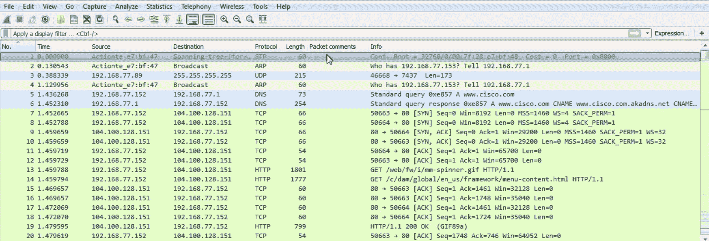

一开始，我们可以看到 DNS 对 Cisco 的查询和响应，然后是 TCP 握手的开始。然后，我们开始检索一些文件和一些用于检索 HTML 的 HTTP 流量。现在，我们当然可以应用我们在上一节中学到的知识，到顶部为作为主机的 web 服务器和 TCP 协议创建一个显示过滤器，并使用一些其他参数来尝试过滤掉我们想要查看的内容，但我们仍然会有大量数据。你可以看到这是一个非常大的捕获，仅仅是为了加载一个网页。

那么，我们如何在这个数据包捕获中挑选出单独的通信呢？因为你要注意的一件事是，在一个网页中，你有多个文件，图形，CSS 文件，JavaScript，或者任何它需要检索的东西。为了建立你所看到的网页，它需要拉取许多不同的文件。其中的每一个都有自己的通信和 TCP 流。因此，我们在跟踪 TCP 或 UDP 流时需要做的是在捕获中选择我们希望查看的流中的数据包。因此，对于这个网页中的每一个文件，每一个都将成为它自己的 TCP 流。因此，我们需要在其中选择一个数据包，然后跟随数据流。

所以，让我们选择一个图形。我们上`spinner.gif`吧。如下面的屏幕截图所示，我们将右键单击 HTTP 数据包，然后转到 Follow | TCP Stream:

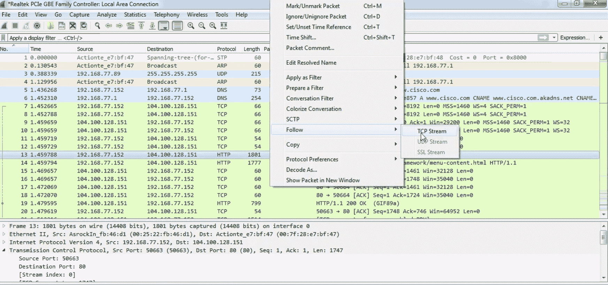

默认情况下，数据以 ASCII 格式显示，这通常对您很有帮助，因为您可能正在查看的许多流量都是基于文本的。但是当你跟随水流时，你可能希望改变这种情况。你可以在底部这样做，它说显示数据为 ASCII。您可以更改下拉框并选择您想要任何数据格式。我们将把它保留为 ASCII，因为我们看到一些 HTTP 流量中传输了 GIF。你可以看到这里有红色和蓝色的线。红色是客户端，蓝色是服务器，您可以在底部看到，这里显示 16 个客户端数据包，228 个服务器数据包:

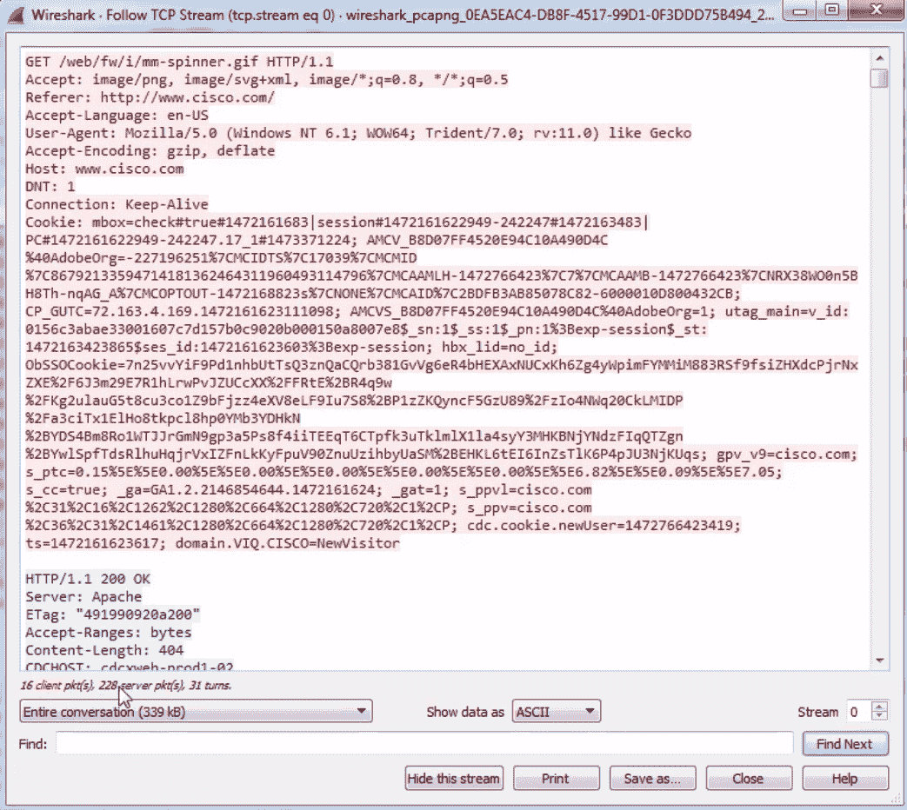

我们还可以更改此下拉框，选择我们希望查看的信息。当我们在此数据视图中向下滚动时，您会看到蓝色和红色的客户端和服务器来回发送数据包。您可能已经在前面的章节中注意到，如果您单击数据，它将跳转到数据包视图中的数据包。遵循 TCP 的一个附加功能是您可以打印或另存为...你的包裹。所以你可以把它们导出，保存成你认为的任何文件格式。

您还可以跟踪 UDP 流。

不过，UDP 流更难跟踪，所以它可能不总是完美地工作，但是 Wireshark 尽了最大努力。TCP 和 UDP 的区别在于 TCP 是可靠的，UDP 是不可靠的通信。

现在，您可以执行与跟踪 TCP 流量相同的操作，即右键单击一个数据包，然后转到 Follow，您可以看到 UDP 流可供我们单击。

选择 UDP 流，它会做完全相同的事情。它将在顶部窗格中显示数据。可能有用也可能没用，就看是什么数据了。它将允许我们执行所有与跟随 TCP 流相同的功能。

在本节中，您学习了如何跟踪 TCP 和 UDP 流，并在数据包捕获和数据流中挑选出特定的会话。接下来，我们有高级过滤，我们将在数据包捕获和数据包中挑选出更细微的部分，以增强您过滤流量的能力。

# 高级过滤

我们将讨论如何过滤数据包中数据字段的流量，如何在数据包中的特定字段上创建列并对其进行排序，以及如何使用这些您可能还没有注意到的隐藏方法进行过滤。

我们将进入我们的数据包捕获，打开[https://www.cisco.com/](https://www.cisco.com/)。我们要做的是展开为我们提供数据包详细信息的部分。我们将向下滚动，找到一个我们希望进一步研究的数据包。

我们所能做的是展开这些部分，这将使我们能够轻松地查看数据包不同层中的不同数据字段。因此，如果你熟悉我们在网络中使用的 OSI 层，你会觉得很熟悉。因此，我们的帧和以太网包含第 2 层信息，IPv4 包含第 3 层信息，TCP 包含第 4 层信息，等等。

因此，让我们单击 TCP 来展开它，我们将深入到窗口大小值。现在，窗口大小是一个重要的字段，我们稍后会更详细地讨论，但我们要做的是将其视为一列。因此，让我们右键单击窗口大小值，然后单击应用为列。

这将在我们的数据包列表中添加一个新列，其中包含每个数据包的窗口大小值。现在，您会看到它是右对齐的，与信息相对，有点难以看清。那么，让我们右键单击上面的标题，然后转到“居中对齐”并单击它:

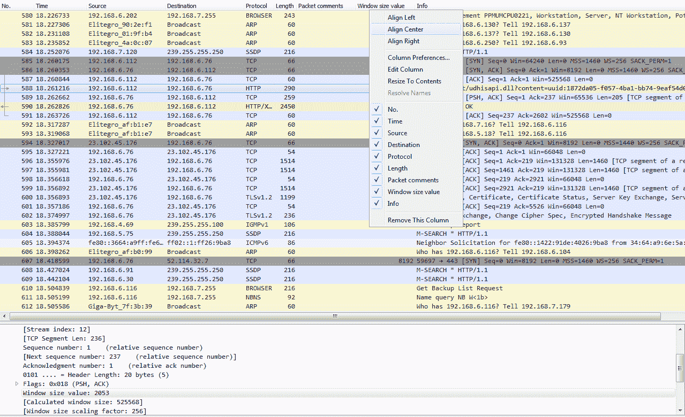

单击该标题，它将对我们的数据包进行排序，从最小到最大或从最大到最小。现在，这是非常有用的，因为很多时候在传输问题上，你会有一个窗口大小的问题。因此，以这种方式进行排序并根据数据包寻找任何非常小的窗口大小可能对您有所帮助。不是每个窗口小的包都是坏事，但是它是有用的，你可以看一看。现在，你几乎可以对任何东西这样做；我们可以做几乎任何东西的柱子。

此外，我们可以删除列。我们将右键单击并转到“Remove”来删除此列。

我们可以进入 TCP(或任何这些领域),并根据我们看到的内容创建过滤器。因此，这比进入显示滤波器领域并试图找到您想要做的事情要容易得多，因为正如我之前向您展示网站时提到的那样，您可以寻找成千上万种不同的东西。因此，您可以用这些数据包的详细信息来直观地选择您想要过滤的内容，而不是那样做。那么，让我们过滤源端口。我们将右键单击源端口，然后转到准备过滤器|选定:

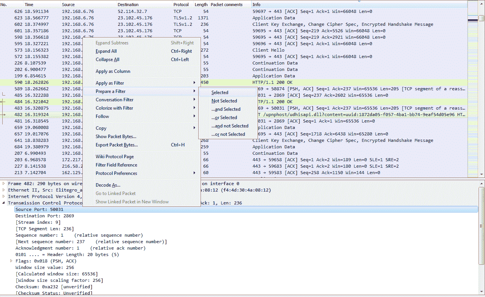

这将在顶部准备一个过滤器，选择源端口信息。所以点击它，它有`tcp.srcport == 50031 `(这是源端口的简写):

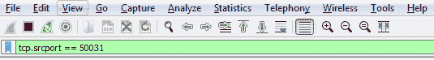

现在，如果我们应用它，它将只显示完全是`50031`的源端口。如果我们想改变这种情况呢？我当然可以返回并更改源端口，就像您之前在操作符中看到的那样。然后，我们可以继续应用它。现在，我列出了源端口小于或等于`50031`的所有数据包。

我们再找一个吧。我们再来看看 TCP。我们将向下滚动，查看标志，并进行校验和检查。因此，让我们右键单击“确认”,我们将转到顶部以应用为过滤器，然后单击“选定的”:

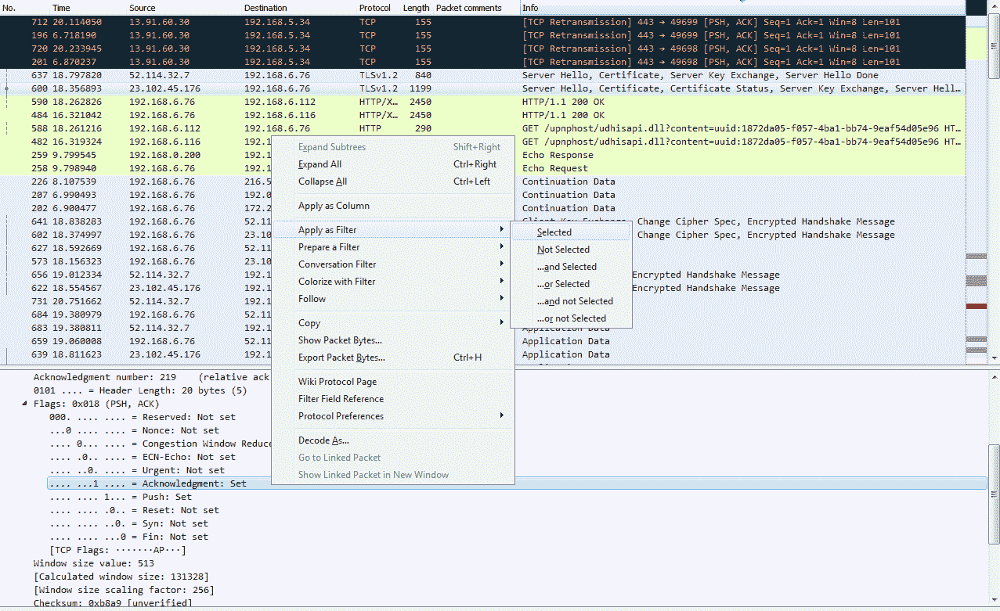

“准备为过滤器”和“应用为过滤器”之间的区别在于，前者将过滤器放入顶部字段(显示过滤器字段)，但不应用它，而后者两者都做。所以，如果你确切地知道你想要什么，你可以直接选择应用为过滤器选项。

现在，我们已经列出了所有的 TCP 确认数据包。现在，我们也可以扩展它，让我们往下找另一面——让我们找另一面旗。因此，有一个确认，我们将添加 Push。因此，我们希望看到所有确认数据包，但同时也是推送数据包。我们将右键单击“推送”,然后转到“应用为过滤器”|...并被选中。您可以看到，它应用了实现这一功能所需的所有语法。因此，创建过滤器需要做大量繁重的工作。现在，我们正在查看所有设置了推送字段的确认数据包。

让我们看看另一个特征。我们要做的是，再次为我的网关创建一个过滤器。所以，有`ip.host == my gateway`，我们应用它；现在，这是进出我的网关的所有流量。

我们按编号排序，这样才有意义。如果我不想看到 DNS 怎么办？我能做的就是去 DNS，右击它，然后去应用为过滤器|...并且没有被选中。

这将会否定选择。所以我选择它，你可以在语法中看到它返回`&& !(dns)`:

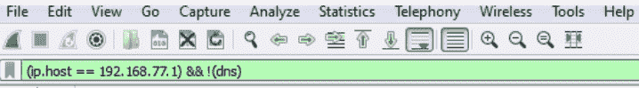

因此，任何时候您在某个内容前面加上感叹号，都会告诉 Wireshark 您不想看到它。

因此，我强烈建议您花时间浏览这些数据包的详细信息，了解它们在哪里，您想要查找什么，习惯使用应用为过滤器和准备过滤器，并了解它们如何协同工作。实际上，您可以捕获包含成百上千个数据包的数据包，并将其精简为您真正关心的几十个。

# 摘要

在这一章中，我们学习了 BPF 语法及其历史，以及如何创建 BPF 语法。我们还了解了如何使用 BPF，然后将其用作捕获过滤器，并减少我们最终在捕获接口上捕获的数据包。然后，我们看到了如何创建和使用显示过滤器，将数据包捕获中的内容精简为我们只需要看到的内容。此外，我们还看到了如何跟踪流，包括 TCP 和 UDP 流，以便我们可以查看数据包捕获中的特定对话，并在需要时导出数据。我们还看到了如何进入不同的数据包字段和长度以及数据包报头中的所有不同数据片段，并能够基于它们创建过滤器。

在[第 4 章](365c3564-b593-4245-9408-ddbc5fd1ca7d.xhtml)、*定制 Wireshark* 中，我们将开始调整 Wireshark，并实际定制它，创建我们自己的首选项和配置文件，以便我们可以制作我们自己的 Wireshark。