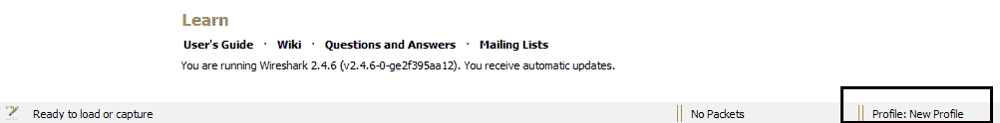
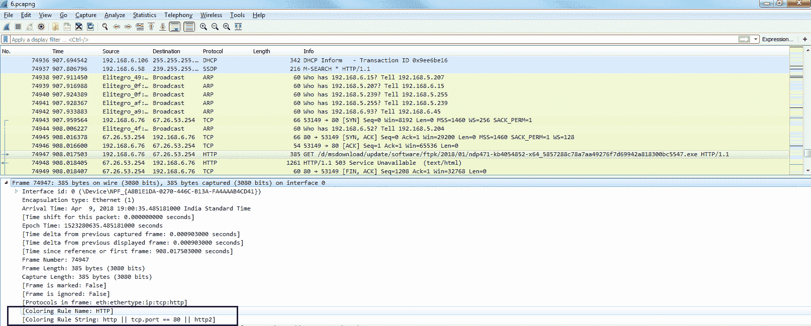
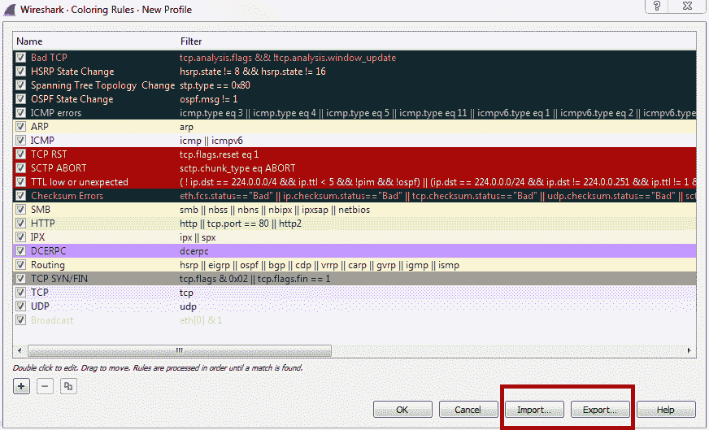

# 四、自定义 Wireshark

在本章中，我们将讨论以下主题:

*   偏好；喜好；优先；参数选择
*   轮廓
*   给流量着色

# 偏好；喜好；优先；参数选择

要访问 Wireshark 的首选项，请转到编辑|首选项...；这将打开首选项窗口。在左侧，您会看到有许多类别可供选择:

# 出现

第一个类别是外观，您可以在其中更改许多设置，包括您最常从中打开文件的默认文件夹以及过滤器条目和最近使用的文件值。过滤器条目更改显示过滤器部分下拉框中显示的过滤器数量。所以，现在有`10`，一旦我们关闭它，你就会看到:

你可以改变它，让它显示更多，这就是偏好设置的作用。此外，我们还有最近的文件，这是基于文件菜单。如果您将该值更改为更高的值，那么您的“打开的最近”将显示额外数量的最近文件。在这一部分的底部附近，你会看到主工具栏样式，它现在只显示图标。如果你是 Wireshark 的新手，你可能会注意到在顶部有一个工具栏，上面有所有的图标；除非你把鼠标移到它们上面，否则它们不会告诉你它们是什么。你可以改变它，使其显示为仅图标、仅文本或图标和文本。

这对刚接触 Wireshark 的人很有帮助。它会告诉你所有这些按钮是干什么的，而不必花时间在每个按钮上移动鼠标。

# 布局

其中一个有用的部分是外观下面的布局部分:

在布局部分，您可以更改 Wireshark 中默认视图的外观。您可能已经注意到，正如我在本书前面所做的捕获一样，布局部分将 Wireshark 中的默认视图分成三个窗格，这三个窗格相互重叠。最上面的是数据包列表，中间的是所选数据包的详细信息，最下面的是字节。如果你不喜欢这样，你想改变它的外观，无论是整个组织或删除这些窗格之一，你可以在这里做；你可以在顶部看到很多选项，来决定你希望事情如何分解。您还可以更改哪些信息放在哪个窗格中，以及是否希望显示任何信息，因为有些人并不真正关心包的字节，而只关心列表和细节。如果你不需要的话，你当然可以关掉包字节。

# 列

现在，在[第 3 章](2dad7e67-cac3-491f-85ca-cffaf037f679.xhtml)、*过滤流量*中，我们介绍了如何在 Wireshark 中创建列，这是另一种创建和编辑这些列的方式:

因此，虽然您可以右键单击数据包详细信息中的某个字段来创建列，但是您也可以在这里创建自己的自定义字段，或者重新排序或删除已经存在的不同字段。

# 字体和颜色

当然，您可以在 Wireshark 中自定义字体和颜色，但这些与我们将在本节稍后讨论的着色规则是分开的:

# 捕获

在捕获类别下，您可以选择默认接口:

现在，正如你之前注意到的，我的系统上有很多接口。你可以选择你最喜欢的界面，或者你最常用的界面，如果你经常使用的话。

您也可以打开和关闭`pcapng`格式，但是我强烈建议您保持启用，因为这是现在新的标准格式；但是，如果出于某种原因，对于一些遗留软件或类似的东西，您需要以旧的`pcap`格式捕获，您当然可以这样做。

要提高 Wireshark 的性能，您可能需要关闭以下两个选项:实时更新数据包列表和实时捕获中的自动滚动。你已经注意到我们到目前为止在捕获中所做的。当你点击 Capture 时，它就开始在数据包列表中滚动，向你显示当时进来的所有东西。现在，这对于小捕获和快速捕获很有用，但是如果您有一个接收大量数据的系统(可能是一个频繁使用的中继上的 SPAN 端口，或者系统很旧，可能会因为没有处理能力而丢弃数据包)，您可能需要关闭它以保持 Wireshark 的性能。

# 过滤器按钮

首选项中的下一部分是过滤器按钮:

这是所有这些表达式按钮将出现的地方。

# 名字解析

我们的下一个类别是名称解析，Wireshark 允许您将我们在 Wireshark 中看到的许多不同的地址解析为不同的名称，使我们人类更容易理解我们正在查看的内容:

因此，默认情况下，它允许将 MAC 地址解析为 MAC 地址的前一半。如果你知道 MAC 地址和它们是如何工作的，MAC 的前半部分是网卡的制造商。因此，Wireshark 内置了这些已知制造商和 oui 的列表，这是 MAC 的前半部分，它会尝试为您解析它们。这就是为什么您可能会看到`Realtek:`，然后是 MAC 地址的另一半或`Cisco:`和 MAC 地址的后一半。那是因为这个复选框。

您还可以解析传输名称，即 TCP 和 UDP 端口以及 IP 地址。现在，如果您选择“解析网络(IP)地址”选项，请注意它不会引用 Wireshark 中的静态文件，如 MAC 地址和传输名称。它会在你采集的时候尝试进行 DNS 解析。对于 Wireshark 来说，这可能是一件非常不利的事情，尤其是当您在进行大量数据捕获时。您可能会有成千上万的 DNS 解析请求从您的捕获系统发出，堵塞了工作。我的建议是，当您有一个捕获时，您可以右键单击一个 IP 地址，并使用该特定 IP 地址进行解析，而不是解析所有内容。现在，下面的部分，它说启用 OID 解析和抑制 SMI 错误，是 SNMP 解析。在 SNMP 中，您有 MIB，它基本上是 OID 位置的单词翻译，您可以在 Wireshark 中解决这些问题。

如果您正在捕获 SNMP 流量，并且启用了 OID 解析，则可以将这些 OID 字符串解析到 MIB 中。

# 协议

我们的下一个类别是协议，当您扩展协议类别时，您会看到 Wireshark 支持的所有协议的庞大列表，以及您可以调整的所有相关配置选项。

现在，大部分这些你可以不去管它们的默认值，一切都会很好。在你职业生涯的某个时刻，你可能会想要调整两个，那就是 IP 和 TCP 如果算上 IPv6 的话，现在是三年。如果要调整的话，IPv4、IPv6 和 TCP 可能是最常见的。我们要做的是，转到 IPv4，您会看到有一个名为“如果可能，验证 IPv4 校验和”的复选框，默认情况下该复选框处于禁用状态:

现在，默认情况下会启用此功能，因此根据您运行的 Wireshark 版本，如果您使用的不是最新版本的 2.0，可能会启用验证 IPv4 校验和功能。当这样做的时候，它有时会出现在你的系统上，带有大量的错误校验和。其原因是，许多较新的系统，尤其是服务器，已经开始执行校验和卸载，即软件不执行校验和创建，而硬件执行，就在校验和被发送到网络之前。但是 Wireshark 看不到这一点，所以它总是认为校验和不匹配，因为它看不到硬件在它被放到网络上时创建校验和。这是需要检查的一件事，因为现在大多数网卡都在进行校验和卸载，所以如果可能的话，你最有可能想要验证 IPv4 校验和。

# 统计数字

我们的下一个类别是统计数据，这里没有太多您想要更改的内容:

我会让大部分保持原样，除非你想改变 RTP 播放器的频道数。

# 先进的

我们的最后一个类别是“高级”,其中列出了 Wireshark 中的所有首选项和设置，为您提供了一个很大的列表:

因此，如果您需要更改某些内容，但无法更改，或者您遇到了问题或类似情况，并且您在网上找到了更改值的答案，但不知道它在界面中的什么位置，您可以通过转到高级类别来进行此类更改。更好的是有一个搜索功能。如果你需要改变一些东西，你可以过滤它，确定某个设置在哪里。

# 轮廓

我们现在来看看如何创建配置文件，将这些首选项打包成可用的配置文件，您可以根据自己所处的情况在这些配置文件之间进行切换。

当您使用 Wireshark 时，您对它所做的任何更改，无论是您可能正在更改的首选项、您可能正在创建的显示过滤器或捕获过滤器，或者任何其他内容，它们都在所谓的**默认配置文件**下。当您创建新的概要文件时，它们将作为**默认概要文件**的副本。因此，建议您对默认配置文件进行最小的更改。你也许可以对你的环境做一些过分的改变，但不要做任何具体的事情，而是为你可能需要的不同具体情况做一个配置文件。您可以在 Wireshark 界面的右下角进行操作。如您所见，这里选择了“Profile: Default ”,如果您单击它，将允许您在系统上的不同配置之间进行选择:

默认情况下，Wireshark 中包含经典和蓝牙配置文件。您可以看到我们目前使用的是默认配置文件。如果您希望管理和创建这些配置文件，您可以右键单击 Profile: Default。现在，您将看到一个弹出的新窗口，允许您管理或创建个人资料:

不过，他们会带你去同一个地方。因此，我们要做的就是进入管理配置文件...，您可以看到我们当前拥有的配置文件列表。要创建个人资料，我们只需点击加号:

或者，如果您在之前的窗口中，您可以简单地单击“新建”...它会把你带到同一个窗口。但是，相反，它自动为你点击了加号。我们可以在这里命名我们的个人资料。我们称之为`New Profile`，你会看到它的右上角写着根据默认设置创建:

我们可以看到它是如何复制默认设置的，无论您已经在系统中配置了什么。现在，它正在为我们创建一个新的配置文件，如果我们单击“确定”，它将创建它；您会看到界面中有所变化，右下角显示“个人资料:新个人资料”,我们现在正在使用它:

你可以做的是右键点击配置文件:新的配置文件，并前往编辑...，您会看到它有配置文件的路径:

Wireshark 将配置文件存储为文件夹，因此单击该链接将打开`New Profile`文件夹。然后，我们将返回到`profiles`文件夹，您会看到在`profiles`文件夹下，您创建的每个新个人资料都会显示为一个新文件夹:

如果您甚至后退一步，即在`Wireshark`文件夹中，您将会看到在 Wireshark 安装中创建的默认文件，并且会有不同的文件，这取决于您可能进行了哪些更改:

例如，这里有`cfilters`，这是您的捕获过滤器，我们可以展示一下。请记住，这些捕获过滤器在您的捕获选项下，如果您点击这个书签，这是一个简单的方法。然后，您可以管理您的捕获过滤器。记住，我以前曾经做过一个定制的。这就是为什么它保存了。此外，我们有`io_graphs`偏好；现在 Wireshark 支持多种语言，我们有了`language`选项；我们有`recent`文件和`preferences`，就像我们在上一节中使用的一样。如果我创建了显示过滤器，另一个就会出现；还有一个`dfilters`文件，它可以定制显示过滤器。现在我们可以做的是编辑这些文件。这些是文本文件。你能做的就是右击任何文件并编辑它。

我建议使用 Notepad++这样可以正确显示回车的工具，因为如果你用 Notepad 打开它，它可能会因为使用的回车类型而不能正确显示。

现在，如果您希望与其他人共享您的个人资料，您可以进入个人资料文件夹，只需为您希望共享的任何个人资料复制新的个人资料文件夹。也许您有一个 802.11 无线网络、一个 TCP 分析网络、一个公司网络或一个重大错误网络，不管您有什么，您的组织中有多个 it 管理员或分析人员。您可以通过在不同的计算机之间简单地复制和粘贴这些文件夹来相互共享这些配置文件，并且您可以将其共享为 ZIP 文件或任何最适合您的文件。

# 给流量着色

在本节中，我们将了解如何创建着色规则，如何删除它们，如何创建自己的着色规则，如何为对话着色，以及如何根据应用的着色规则过滤流量。我们开始吧。

我调出了之前的一个截图——加载一个网页。我们将以此为例讨论着色规则。您可以在这里看到它已经在 Wireshark 中默认着色:

正如我之前在 Preferences 部分的配置文件中提到的，Wireshark 中有默认设置，包括着色规则。Wireshark 试图让您更容易查看您的流量，即使只是标准安装。当然，你也可以自定义它来显示你想看的内容。

除了 Wireshark 会自动为您的流量着色这一事实之外，从基本观点来看，您首先需要知道的是，您可以一键启用和禁用规则。在窗口顶部，您可以单击“使用您的着色规则绘制数据包”按钮，该按钮看起来像彩虹颜色的线条，您可以单击它来批量启用或禁用着色规则:

如果我单击它并禁用，现在一切都变成白色，并且当前没有应用任何颜色规则:

如果您再次点击“使用您的着色规则抽取数据包”按钮，将会重新启用着色规则。

为了了解着色规则，我们将转到视图|着色规则...：

点击着色规则...选项将打开着色规则窗口，您可以看到默认选择的着色规则是由 Wireshark 在安装时创建的:

你可以看到默认规则在最上面有一些真正有活力的颜色规则。这些是一些你需要注意的令人讨厌的东西，这就是为什么它们有黑色的背景。这样，他们在这个默认的彩色系统中突出了其他流量。你可以看到大多数其他正常的东西，如 ARP、ICMP、SMB、HTTP 和 UDP 它们都是很好的柔和型颜色。然后突然之间，你会看到黑色的背景和红色的文字，你知道这显然是不好的事情。你有黄色显示；你有 TCP 重置和中止的亮红色；您会看到带有红色文本的黑色校验和错误。他们应该是故意突出的。关于这一点需要知道的另一件事是，你会看到坏的规则是如何在顶部的:规则是自上而下处理的，所以它是基于一个匹配的系统。如果首先匹配，那么它将被应用。如果你有两个非常相似的规则，也许你有 IC——两个寻找 ICMP 的规则，但由于某种原因有不同的颜色——顶部的一个将首先应用，后面的一个将被跳过，因为它已经被着色。

此外，在所有这些颜色规则的左侧是一组复选框，这些复选框启用和禁用这些单独的颜色规则。这样，您就不必使用我刚才展示的按钮来同时启用或禁用所有这些功能。因此，您可以简单地关闭您想要或不想要的复选框。

例如，我们可以做的是，我们可以关闭 HTTP，这是一种很好的浅绿色，如果你看滚动条，你可以在整个捕获过程中看到。我们所有的包都是绿色的。所以我会关闭 HTTP 然后，我们将单击“OK”。当我这样做的时候，你可以看到它们都变成了紫色:

为什么它们会变成紫色？让我们回到视图|着色规则...看一看。如果我们检查一下，TCP 是浅紫色的。所以在这里，所有的通信，所有的数据包，都是 TCP 数据包。

还记得我说过，在这个列表中，事情是如何首先匹配到顶部的吗？因此，很明显，HTTP 流量更具体，因为这是一个更高级的协议，首先匹配，因此应用为绿色。然后，当它与 TCP 匹配时，它被忽略，因为它已经被着色。您可以看到如何将更具体的内容放在顶部，然后将更通用的内容放在底部，您可以看到这种方式是如何打破的，所有这些非常具体的过滤器都在顶部，然后基本的过滤器在底部，如 TCP 和 UDP。

当然，你也可以自己创造。在左下角，就像我们已经看到的其他窗口一样，您可以单击加号来创建一个新的颜色规则。你可以看到它也把它举向顶端，这很好。在这里，您可以输入任何类型的显示过滤器来创建颜色。我们可以说`ip.host`是我的入口，我们可以选择前景和背景颜色。你可以在底部看到，我们可以选择前景色和背景色:

所以，让我们做一些完全荒谬的事情。前景将是明亮的粉红色，背景将是可怕的黄色。先改名吧。我们会说`Gateway`，然后点击 OK。那肯定很突出，不是吗？请看下面的截图:

现在，您可以看到引用我的网关的所有数据包现在都变成了亮黄色。

到目前为止，我们一直在尝试找出哪个着色规则适用于特定的数据包，我们是通过查看|着色规则来完成的...试着靠我们自己找出答案。现在，你不必那样做；有一种更简单的方法。

如果您单击想要调查的数据包，并找出它为什么是绿色的，我们可以查看数据包的详细信息，在“Frame”部分，我们可以向下查看帧信息的底部，它会向我们显示应用的着色规则。因此，着色规则名称是 HTTP，适用于我们选择的数据包的字符串是 http || tcp.port ==80 || http2:

现在，如果你在你的特定情况下为你的特定公司制定了一整套自定义颜色规则，你完全可以导入和导出这些规则，与同事分享。让我们回到视图|着色规则...，您可以在窗口的右下方看到我们已经导入...和出口...按钮，可将其导出或导入为文本文件:

此外，我们可以为对话着色。我们要做的是，在这个对话中随机选择一个数据包，然后右键单击它，进入彩色对话。然后，我们可以分解我们需要的对话以及 OSI 模型的哪一层:

最后，我想向您展示的一个很酷的功能是，您可以继续实际筛选颜色规则。让我们选择一个数据包，一个 HTTP 数据包，我们将再次进入数据包详细信息中的帧部分。我将右键单击应用于该数据包的着色规则，然后我可以转到应用为筛选器|选定:

现在，我正在根据着色规则进行过滤，因此不仅仅是因为它是 HTTP 流量，还因为它应用了着色规则。

所以我们也可以对另一个这样做。我们将右键单击应用于所选数据包的着色规则，然后选择“Apply as Filter | Selected”。现在我们已经根据着色规则过滤掉了这段对话。

# 着色流量的示例

我们将通过一些例子来说明如何利用着色规则在不同的数据包捕获中挑出不好的东西。

# 示例 1

在这个例子中，我们将需要打开一个网页，该网页指向麻省理工学院网站上一个不存在的位置，所以这里应该有一个来自 HTTP 的响应代码，声明`404`，它找不到那个文件。我们要做的是创建一个着色规则，它将很容易地向我们显示数据包列表中的错误消息:

1.  让我们转到视图|着色规则...我们将通过单击加号图标为 HTTP 响应代码创建一个定制的颜色规则。

2.  在过滤器栏中输入`http.response.code > 399`:

所有高于`400`的 HTTP 响应代码都是服务器和客户端错误，分别在`400`和`500`范围内。

3.  因为我们想用非常鲜明的颜色看到所有的错误，所以我们将背景设为亮粉色，前景设为黑色。你会看到它就在我们列表的最上面，所以它会首先被应用。让我们点击确定:

4.  我们将向下滚动列表，寻找那个亮粉色的包。它很容易出现，对我们来说非常明显。如你所见，它显示 HTTP/1.1 408 请求超时(text/html):

5.  我们可以通过点击底部的超文本传输协议来扩展它的细节。然后我们会看到`408`的状态代码:

# 示例 2

现在，在第二个例子中，我们来看看 NS。比方说，您的网络出现了某种问题，如果某些 DNS 响应在您的 DNS 服务器中找不到某个资源的任何记录，无论是网页还是本地服务器，它们都会返回；不管是什么，它找不到 DNS 条目。我们可以应用一个着色规则，每当有 DNS 响应说找不到记录时，它就会生动地显示出来。

让我们继续创建一个新的捕获，我将查找一些不存在的随机网页，我们将使用 Google 的 DNS。我们将得到一条消息，表明它不存在:

因此，我们将停止捕获，我们将不会看到任何真正弹出的内容。会有一些红色的东西从一些 TCP 重置和一些黑色的，但没有别的。都是 TCP 流量和 DNS。让我们继续创建一个着色规则:

1.  点击查看|着色规则，创建新的着色规则...；我们就叫它`DNS No Records`。

2.  在过滤器信息中，我们将输入`dns.flags.rcode`，这是响应代码。如果响应码等于`3`，则表示没有记录:

3.  我们将选择前景为黑色，背景为黄色。

现在，让我们继续浏览我们的数据包捕获，看看是否能找到这个响应代码错误。我们可以看到我们的`Standard querie response 0×0002 No such name A`记录，然后是我们输入的随机乱码。当然，它也支持 IPv6。quad A 记录`AAAA`也适用于 IPv6:

如果你在底部看一下我们的框架信息，有我们的着色规则:`DNS No Records`。它正在使用一个字符串，如果我们深入研究 DNS 信息，您会看到标志，它会说`Reply code: No such name (3)`。这就是我们刚刚过滤的`3`的值:

您可以看到应用着色规则对进行网络分析和协议分析的人非常有帮助，因为它可以很容易地从大量数据包捕获中找出问题所在。

# 摘要

在本章中，我们学习了如何在 Wireshark 中应用首选项，并根据您的需求进行定制。我们还学习了如何为不同的分析需求创建概要文件，并在它们之间切换。例如，我们刚刚看到的着色规则可以放入专门针对 DNS 或 HTTP 的配置文件中。我们已经学会了如何创建这些着色规则，如何导入和导出它们，以及如何将它们应用到现实世界的例子中。

在[第 5 章](9629be53-89f1-470d-911d-082090ddaba3.xhtml)、*统计*中，我们将深入探讨 Wireshark 中的统计，这是一个似乎很少有人使用的强大功能。