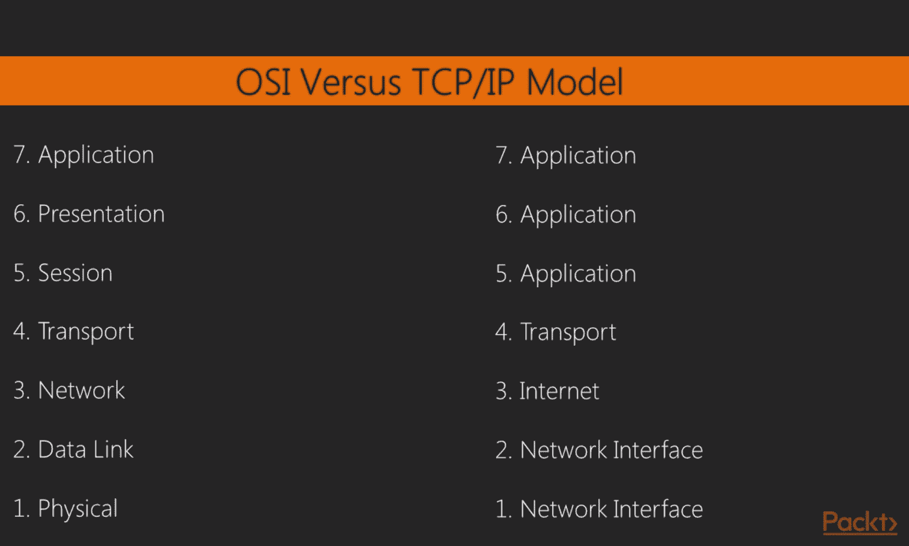
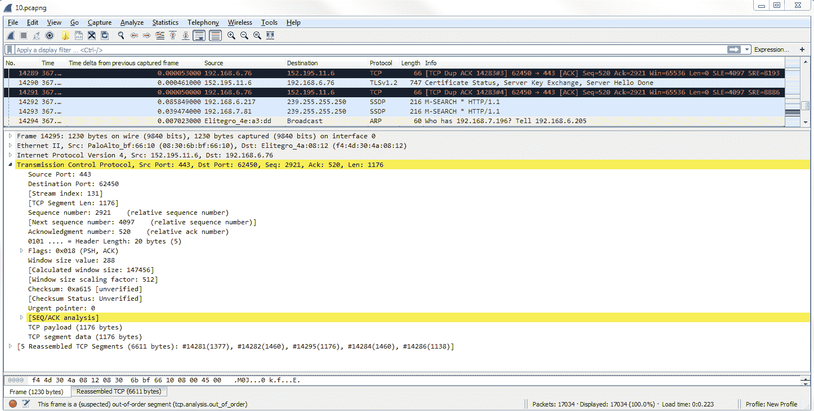

# 五、统计

在本章中，我们将讨论以下主题:

*   TCP/IP 概述
*   时间值和摘要
*   跟踪文件统计
*   专家系统使用

# TCP/IP 概述

在本节中，我们将了解 TCP/IP 的基础知识，如何构建数据包，以及现有的解析过程，如 DNS 和 ARP。

在网络中，我们有两种常用的模型:OSI 和 TCP/IP。如下图所示，左侧是 OSI 模型，右侧是 TCP/IP 模型，我尝试将它们匹配起来，以便您可以看到每个模型的不同层是如何相互匹配的:

当我们使用 Wireshark 时，我们通常关注 OSI 模型的第 2 层到第 7 层。最常见的情况是，当您使用 Wireshark 时，可能是因为正在发生与应用相关的事情，或者系统正在运行某个应用。最常见的是，您会发现自己在使用 Wireshark 来诊断上层的问题，尤其是第 7 层。但是您当然可以使用它来排除第 3 层或第 2 层设备之间的连通性问题。虽然有许多 TCP/IP 服务和协议可以帮助我们通过网络进行通信，但请注意，我们引用的是基于 OSI 模型的协议所在的层，而不是实际的 TCP/IP 模型所在的层。

我想做的是运行一个包的构建，这将让您了解如何将不同字段的值输入到包中。由于我们正在 Wireshark 中查看这些字段，了解这些信息当然是件好事。所以我所做的是，在浏览器中，我打开了一个到[http://www.pbs.org/](http://www.pbs.org/)的连接。我们要做的是跟踪这个连接，展示它如何找到资源，然后向它发送第一个数据包。

您的系统需要解决的第一件事是使用什么端口号。当你打开网页浏览器，进入[http://www.pbs.org/](http://www.pbs.org/)，根据你如何在浏览器地址栏输入地址，浏览器的应用会知道你是否要使用`80`端口；默认情况下，它知道 HTTP，或者 SSL 的端口`443`,或者其他自定义端口。因此，您的计算机马上就知道它需要在哪个端口号上开始通信。因为我去 http://www.pbs.org/[时没有任何 SSL 连接，它默认知道必须使用端口`80`。它要做的下一件事是找出服务在哪里。于是我去了](http://www.pbs.org/)[http://www.pbs.org/](http://www.pbs.org/)，但是我的系统不知道[http://www.pbs.org/](http://www.pbs.org/)驻留在哪里。

DNS 处理域名到地址的解析。因此，我的系统查看了本地系统上的 DNS 缓存，这是一个已经解析的地址滚动缓存，它寻找 http://www.pbs.org/ T2。它发现[http://www.pbs.org/](http://www.pbs.org/)在缓存中不存在，所以它说它需要把它发送到我的 DNS 服务器，希望得到一个关于资源位置的响应。我的 DNS 服务器正好在我的网关上，是`0.6`；这在标准家庭网络中很常见。它可能不在那里；它也可能是一个远程资源，比如 Google DNS 服务器或 open DNS，或者其他。如果这是我尝试连接的远程 DNS 服务器，那么我的系统将查看我的路由表，并确定它需要去哪里才能访问该 DNS 服务器。因此，如果它是远程的，在我的网络之外，它会查看我的路由表，并意识到它必须通过我的网关才能与 DNS 服务器对话。

当它这样做时，它将检查我的 ARP 缓存，看看是否有我的网关的第 2 层地址，以便它可以向网关发送帧。如果我的系统没有我的网关的 ARP 缓存条目，那么我的系统将会发出一个 ARP 数据包，寻找`192.168.0.6`的物理地址。我的系统碰巧在它的 ARP 缓存中有它，因为我经常访问那个 IP 地址，所以我们在这里看不到 ARP 数据包。这里我们可以看到的是，第一个包是一个 DNS 包，所以我的系统看到`0.6`是我的 DNS 服务器，它知道这是一个本地资源。它检查了我的路由表，意识到它在我的物理接口上，我们已经连接到了`0`网络，并且我已经有了一个`0.6`的 ARP 缓存条目。所以它不需要这些信息，它会自动构建 DNS 包。在 IPv4 中，我们可以看到我的目的地是`0.6`:

它构建了所有这些，而无需生成任何其他数据包来查找这些信息。所以我的系统随后发出了它的 DNS 请求，要求得到 http://www.pbs.org/ T2。现在，如果我们往下看 UDP 部分，您可以看到我们正在使用端口`53`，这是用于 DNS 的:

如果我们扩展 DNS，我们可以查看查询，发现我们请求的是[http://www.pbs.org/](http://www.pbs.org/):

然后，我们必须等待 DNS 响应。然后，我们看到 DNS 的下一个数据包。我们收到一个针对 http://www.pbs.org/的[的标准查询响应。如果我们在数据包详细信息窗格中查看 DNS，我们可以看到此数据包中的答案。您会看到](http://www.pbs.org/)[http://www.pbs.org/](http://www.pbs.org/)有一个针对地址`r53-vip.pbs.org`的`CNAME `条目，然后在 IP `54.225.198.196`有一个`A`记录条目:

`A`记录条目是我们所关心的。所以现在我的系统有了一个 http://www.pbs.org/ T2 的 IP 地址，这样我就可以和 http://www.pbs.org/ T4 的网络服务器建立 TCP 握手，这样它就可以开始来回传输 HTTP 数据了。如果我们看看队列中的下一个数据包，我们有我们的 syn:

因此，前面屏幕截图中突出显示的数据包是 TCP 三次握手中的第一个数据包。如果你熟悉 TCP，它会有`SYN`、`SYN, ACK`和`ACK`；这就是你的三次握手来打开一个连接。所以我的第一个包的目的地址是`205.185.216.10`。如果我们查看 DNS 中返回的响应，为`A`记录提供的地址是`205.185.216.10`。所以现在我的系统知道该为哪个 IP 地址制作 TCP 包。我们现在有了我的本地系统的一个源和它接收到的[http://www.pbs.org/](http://www.pbs.org/)的服务器的一个目的地，然后它发出它的握手请求。然后它得到一个`SYN, ACK`响应，说是的，我看到了你的连接请求；让我们建立联系。然后我的系统回应说，是的，听起来很棒；我承认。最后，我们开始我们的第一个 HTTP 数据包。我的系统向同一个服务器发送一个 HTTP 包，并说`GET / HTTP`，所以它说请向我发送你的开始`index.html`和 HTTP 资源的任何其他数据。同样，它知道它需要使用未加密的端口`2869` HTTP，因为当我们将它输入浏览器时，浏览器应用让堆栈知道它正在使用端口`2869`。这是 TCP 包构建的基础，你的系统从某种服务器或其他设备请求资源。

# 时间值和摘要

在本节中，我们将了解如何更改数据包的时间设置，以及如何使用时间列进行故障排除。

我们又有了 PBS 数据包捕获，我打开浏览器，进入[http://www.pbs.org/](http://www.pbs.org/)。如果您注意到数据包捕获，第二列显示时间:

时间列是一个带小数的数字，当您向下滚动数据包捕获时，它会一直向上计数。默认情况下，在 Wireshark 中，这是捕获开始后的时间。拥有自捕获以来的时间可能很有用，这样您就可以知道与您捕获的整个数据流相关的某些数据包何时到达，但对于尝试诊断某个问题(在将您尝试捕获的流量返回到系统的某个服务中可能存在延迟)来说，这并不十分有用。

为了计算出捕获的数据包之间的延迟，您必须查看时间列，并根据毫秒、微秒和纳秒来计算，这对人类来说并不太好，因为我们在数学上并没有那么好。因此，我们可以转到视图|时间显示格式，我们有大量时间显示格式可供选择。我推荐的最有用的方法是使用自上次显示数据包以来的秒数:

这样，如果您对您的流量应用过滤器，例如跟随 TCP 流，它将根据应用的过滤器向您显示每个数据包之间的增量差异。如果您使用自上次捕获数据包以来的秒数，那么如果您有从您正在查看的视图中过滤出来的数据包，它将不会与您正在查看的完全一致；这让我有点难以理解。因此，我建议选择自上次显示数据包以来的秒数。

现在，如果我们看一下，时间列已经改变，每个数据包之间有`0`秒，每个数据包之间有几分之一秒的延迟:

我们要做的是向上滚动到顶部，您可以对时间列进行排序。如果你把它从高到低排序，你可以看到哪些包延迟最长。现在，如果您选择该数据包，然后按编号列重新排序，您将被直接带到该数据包，无论它在您捕获的已编号数据包中的什么位置。您可以查看数据包的任何一面，以了解可能发生的情况。

您还可以添加其他列。因此，我们可以转到数据包详细信息，展开帧信息。你会看到有很多时间域。我们可以做的是为其中一个时间字段添加一列。因此，我们首先要做的是，通过转到视图|时间显示格式格式|自捕获开始以来的秒数，将显示切换回自捕获开始以来，我们将为每个显示帧之间的增量添加一列。我们将通过从帧信息中选择前一个捕获帧的时间增量来实现这一点。我们将右键单击并选择应用为列:

然后，我们将时间增量从先前显示的帧列拖到另一个时间，这样会更容易一些。

因此，从采集开始到每个显示帧之间的时间间隔。您也可以转到查看|时间显示格式，并根据您想要查看的内容更改秒的分数。所以，也许你不需要看到纳秒，你只关心毫秒。您可以通过选择毫秒选项来手动更改:

你现在可以看到它是如何修剪我们的时间栏的。

您也可以通过转到编辑|首选项来添加列...然后到 Appearance | Columns 区域，您可以通过单击加号手动添加您想要的任何列:

最后，如果您转到统计|捕获文件属性，您将看到基于数据包捕获的信息列表。如果向下滚动，您会注意到捕获本身有一大堆统计数据，包括数据包数量、时间跨度、此数据包捕获的秒数、平均每秒数据包数、平均字节大小、已捕获的总字节数、平均每秒字节数和平均每秒位数:

当比较在基准测试期间完成的捕获(当一切正常运行时)和当存在性能问题时执行的数据包捕获时，此摘要会很有用。您可以查看汇总统计数据中是否有这些值发生了剧烈变化。

# 跟踪文件统计

在本节中，我们将了解如何在 Wireshark 中显示有用的统计信息，以及利用这些统计信息可以解决的一些问题。

# 解析的地址

要访问 Wireshark 中的统计数据，请单击统计数据并转到已解析的地址:

“解析的地址”窗口将在您的数据包捕获中解析的所有 IP 地址和 DNS 名称的顶部给您一个列表。这样，您可以了解在数据包捕获中访问的所有不同资源:

# 协议层次结构

接下来，我们将看看协议层次结构。您需要点击统计数据并进入协议层级:

它会根据它看到的最流行的协议的数据包的百分比给你一个细分:

正如你一开始看到的，所有进来的东西都是一个框架。该帧中的所有内容都是以太网帧。在这其中，我们对以太网进行了细分。所以我们有一些互联网协议版本 6；我们有一整套互联网协议版本 4，还有一点地址解析协议:

如果我们展开 Internet 协议版本 4，我们会发现我们收到的最大数量的数据包是 SSDP 数据包:

这很有用，因为您可以看到所有到达的不同类型的数据。例如，如果您不希望看到无连接的轻量级目录访问协议或 NetBIOS UDP 帧，这是很有用的，特别是如果它在数据包数量中的百分比高于它在捕获中看到的百分比。或者让我们说，也许，你不应该看到任何中小企业流量，但你确实看到了很多中小企业流量；这可能是某种突破。

# 会话

你需要点击统计数据并进入对话:

在对话中，我们列出了在此数据包捕获中发生的所有不同的以太网、IPv4、IPv6、TCP 和 UDP 对话:

此外，在所有这些选项卡上，都有一个持续时间列，这非常有助于了解在您的对话中哪些人的发言时间最长、最多。您可以通过单击“持续时间”列按持续时间排序，并查看哪些发送的数据量最大:

# 端点

我们现在将转到端点。单击统计并转到端点:

端点类似于会话，但它只是所有端点的列表；不仅仅是端点之间的连接，例如哪个 IP 与哪个 IP 对话，或者哪个 MAC 与哪个 MAC 对话；它只是每一层上所有设备及其相关信息的列表。我们不关心对话，只关心端点:所有的端点加在一起。

例如，您可以在 TCP 下看到，对于 IPv4，我们有`211`对`449`，这是因为当我打开浏览器并尝试进入 PBS 时，我的主机打开了一大堆端口:

# 数据包长度

接下来，我们将讨论数据包长度。点击统计数据并转到数据包长度:

数据包长度有助于确定您的数据包长度是否很小，尤其是当您遇到窗口大小问题，并且您的许多数据都小于应有的长度时。您想要寻找的是您的大部分数据是否在数据包长度的`1280-2559`范围内，因为最大 MTU 是`1500`:

因此，如果您看到您的大部分数据(我们可以看到我们有`1.60%`)在范围`1280-2559`内，这意味着您的大部分数据正在被正确地发送和接收。如果这里的百分比较小，并且有很大比例的数据包长度较小，那么可能会有问题。

请注意，您将看到非常小的数据包长度中有很大一部分，因为您将有许多 AK 和控制数据包。

# 输入输出图

现在让我们来看看 I/O 图。点击统计数据并转到输入/输出图表:

I/O 图形是从开始到结束流经数据包捕获的数据量的一个很好的图形表示。我点击了抓图上的开始。然后，我去我的浏览器打开它，输入[http://www.pbs.org/](http://www.pbs.org/)，然后按*回车*。然后，我们看到了流量的峰值，并从 PBS 的内容服务器中获得了这些数据。然后交流结束了，我停止了捕获:

例如，如果您正在进行一致的文件传输，并且由于某些问题而处于低 I/O 状态，您可以在 I/O 图中看到这一点，我们将在以后的章节中详细介绍这一点。

# 负载分布

HTTP 的一个有用的统计信息是，如果您通过导航到 Statistics | HTTP | Load Distribution 进入 HTTP 部分:

这将为您提供在数据包捕获中提供 HTTP 流量的所有服务器的视图:

您将能够看到有多少服务器被服务，所以如果您试图诊断内容分发网络的问题，您可以在主题/项目列下看到；或者，如果您试图找出哪个服务器负载最大，因为它有最多的连接，您可以在 Count 列下看到。如果需要，也可以在显示过滤器中添加过滤器。

# DNS 统计

如果您需要对 DNS 流量进行大量分析，您可以转到统计，然后转到 DNS:

它将为您提供一个 DNS 中返回的所有不同代码的列表:

如果您的响应有问题，或者当您不希望收到任何错误时，您会得到很多错误，您可以轻松地查看这些错误，而不是通过 DNS 流量进行过滤并逐个数据包地通过所有这些错误。

# 流向图

最酷的统计数据之一是流量图。

我们要做的是通过这个 TCP 流过滤我们的流量。因此，我们将右键单击一个 TCP 数据包，然后转到跟随| TCP 流:

现在，我们将为此创建一个过滤器。我们只截取了一小部分流量，接下来我们要做的是转到统计数据，然后单击流量图:

默认情况下，它显示我们的数据包捕获中的所有数据包:

当我们滚动时，您会看到所有的流，所有的 TCP 握手——也就是说，`SYN`、`SYN, ACK`和`ACK`——以及所有的请求和响应。一切都在这里，在一个很好的图形格式，你可以用来诊断你的流量。例如，这对于 SIP 流量非常有用。

我们可以做的是更改左下方显示“Show”的位置，并在此处选择显示的数据包:

这一改变将针对屏幕后面的过滤器。当我请求数据时，您可以看到从我的计算机到服务器的通信，比如一个`SYN`:

这是一种非常有用的方式来图形化表示数据包捕获中发生的数据流。

# 专家系统使用

在这一节中，我们将看看 Wireshark 中的专家系统，这是一个很棒的功能，没有多少人知道，它允许您轻松地发现数据包捕获中的问题。

您可以通过从 Wireshark 网站下载相同的内容来了解我将使用的捕获。他们的 wiki 中有一个很棒的部分叫做 SampleCaptures，允许您下载社区提交的捕获:

我们要做的是搜索错误，第一个出现的是`cmp-in-http-with-errors-in-cmp-protocol.pcap.gz`。如果您下载并解压该文件，您可以打开`pcap`文件并按照以下步骤操作:

这里，我们有来自 wiki 的`pcap`文件，有两种方法可以访问专家系统。第一种方法是从分析菜单。我们点击分析，然后转到专家信息:

第二个方法在左下方。正如您在下面的屏幕截图中看到的，它是一个黄色图标:

该图标颜色将根据数据包捕获中的错误而变化。如果是黄色，则此数据包捕获中的最高问题是警告。如果是红色，则此数据包捕获中最大的问题是错误。如果它是蓝色的，它是聊天信息或信息。如果你点击它，它会显示专家信息。如您所见，这里列出了 Wireshark 在数据包捕获中自动发现的所有问题:

聊天记录通常只是你不需要看到的普通信息数据，所以我们可以把它们最小化。在您的数据包捕获中，如果您有警告或错误，这些是您想要处理的事情。错误是最关键的。这些是实际 TCP 通信中的问题，或者数据包中以某种方式存在问题。存在格式错误问题或 CRC 失败。警告通常是应用问题、奇怪的响应以及类似的怪异事情。Wireshark 会注意到这一点，并通过这个专家信息窗口提醒您。它不仅向您显示它发现的错误和警告的类型，还告诉您它适用于哪个包号，您可以点击它。如果我们单击数据包编号`14295`，它将在数据包列表中向下跳转到`14295`，选择它，然后向我们显示它正在谈论的内容。如果我们向下滚动查看，我们可以看到它符合传输控制协议:

再举一个例子，我们可以看看 SampleCaptures，如果你搜索`x400`，我们得到的第一个是这个`x400-ping-refuse.pcap`:

您可以下载前面截图中突出显示的文件，并使用 Wireshark 打开它。如果我们进入专家信息，您可以看到数据包`10`上有一个警告。有一个`Connection reset (RST)`，我们可以点击它。它把我们带到了包`10`，并突出了到底是什么问题:

# 摘要

在这一章中，我们已经复习了 TCP/IP 的基础知识以及数据包是如何构建的。我们已经看到了如何利用数据包捕获中的时间信息，以及如何添加时间列和更改时间设置。此外，我们已经了解了如何在 Wireshark 中查看数据包捕获的不同统计数据，以帮助了解捕获包含的内容以及如何使用专家系统，这是 Wireshark 中一个很好的隐藏功能，可以向我们准确显示 Wireshark 知道的数据包捕获中的问题。

在[第六章](28c23a9f-1268-4bbf-8232-457d2162d3e1.xhtml)、*介绍分析*中，我们将看到对不同协议分析的介绍。