# 六、初步分析

以下是我们将在本章中涉及的主题:

*   DNS 分析
*   ARP 分析
*   IPv4 和 v6 分析
*   ICMP 分析

我们将会看到其中每一个是如何有用的。我们开始吧！！

# DNS 分析

让我们来看看 DNS 在基本层面上是如何工作的，以及如何使用 DNS 执行常见任务，例如查看 Wireshark 捕获。

我们将从刷新计算机上的 DNS 缓存开始，这将清除设备上的任何缓存条目，这样，如果我们试图解析它们，它将必须从互联网上的服务器获得新的解析。为此，我们将输入以下命令:

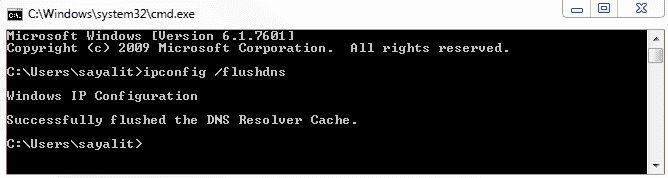

既然我们已经清除了，让我们做一个标准的决议。

在我们做解析之前，DNS 做的就是把域名和这些域名的不同记录解析成 IP 地址。这是它的主要目的。

DNS 用于各种用途，下面列出了其中一些:

*   以任何方式浏览互联网，例如使用 web
*   如果你试图解决 FTP 服务器或游戏服务器
*   如果您试图在本地网络中运行域上的活动目录
*   如果你想运行 VMware

各种不同的服务都使用 DNS 其中有一个常见的口头禅，即使你认为这不是 DNS，但每当出现问题时，通常都是 DNS。让我们来看看正常的 DNS 解析是什么样子的。

为此，我们将在命令提示符下键入以下命令:

```
nslookup wireshark.org 8.8.8.8
```

我们将强制该查询直接发送到 Google。如果我按下*回车*，我们得到如下输出:

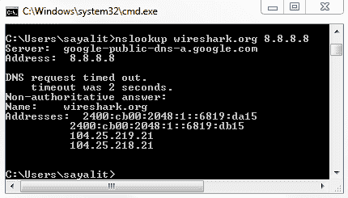

因此，在这个结果中，您可以看到响应我们查询的服务器，`8.8.8.8`，我们还可以看到该服务器地址的 DNS 名称。您还可以看到该服务器上该设备的答案，您可以看到我们有 IPv6 和 IPv4 地址。

如您所见，IPv6 地址的格式与 IPv4 非常不同。

如果您不熟悉 IPv6，可以看看 Packt Publishing 提供的关于 IPv6 的其他书籍。

我们想从数据包的角度来看一下这个问题。为此，我们将再次刷新 DNS 缓存:

```
ipconfig /flushdns
```

接下来，我们将在本地接口上开始捕获，如下面的屏幕截图所示:

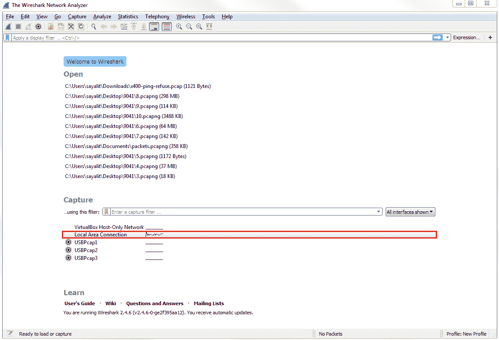

在捕获运行的同时，我们继续输入之前使用的相同命令:

```
nslookup wireshark.org 8.8.8.8
```

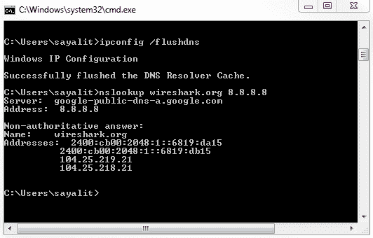

接下来，我们将停止捕获。如果您向下滚动，可以看到有一大堆 DNS 和一些其他协议。所以我们要做的是，我们将使用一个过滤器，只需在显示过滤器中键入`dns`。这将消除我们不想看到的任何其他垃圾:

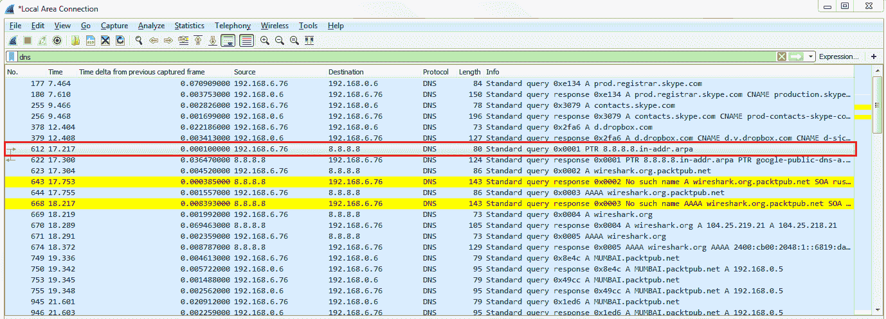

你可以看到第一个请求。因此，我们有一些由系统产生的其他 DNS 请求。我们来看看前面截图中突出显示的第一个查询。

您可以在查询中看到它在请求`8.8.8.8`，因此它实际上是在请求域服务器的域名。你也可以看到它有一个`1`的`Transaction ID`。

如果我们查看发生的下一个查询，`wireshark.org`，您会看到它有一个`2`的`Transaction ID`:

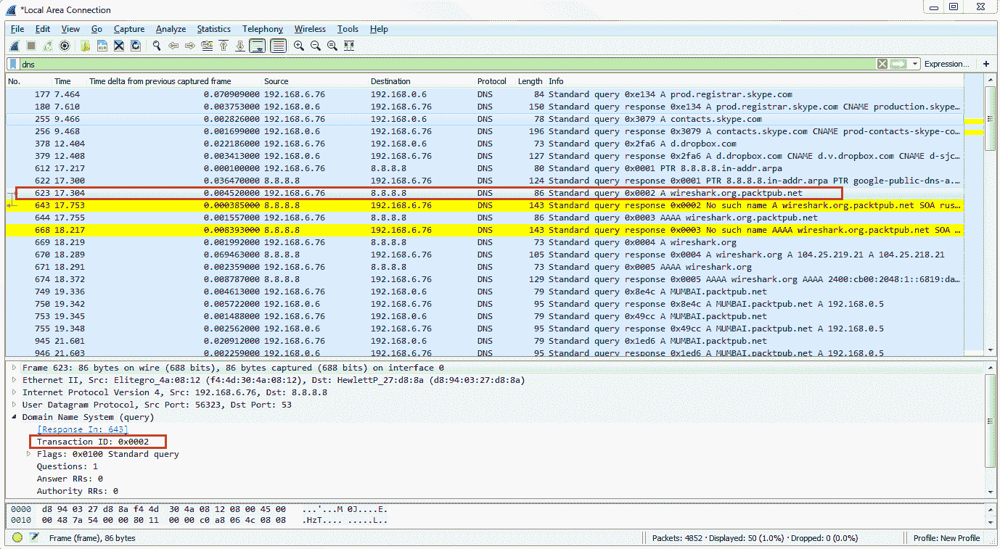

如果我们查看响应查询的数据包，它们将有一个匹配的事务 ID。

一个很好的例子说明了为什么这很有用，如果您看到许多响应，甚至是查询，它们在您的网络中循环，并在您的数据包捕获中一次又一次地显示相同的事务 ID，那么您的网络中可能有一个环路；例如，这可能指出生成树的问题。

对于我们来说，能够确定从查询到响应哪些包是匹配的，这通常也是有用的。正如您所看到的，Wireshark 会自动向我们显示两者之间的相关数据包，这一点我们在前面的章节中已经提到过。

我们在数据包的 DNS 部分还有一行告诉我们这是数据包`622`中的响应:

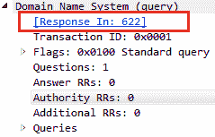

如果我们双击中的 Request，它会将我们带到相应的数据包。然后，当然可以在两者之间来来回回。所以，事务 ID 非常有用。

让我们继续第二次查询实际的`wireshark.org`，打开标志。我们可以看到有一面旗帜打开了:

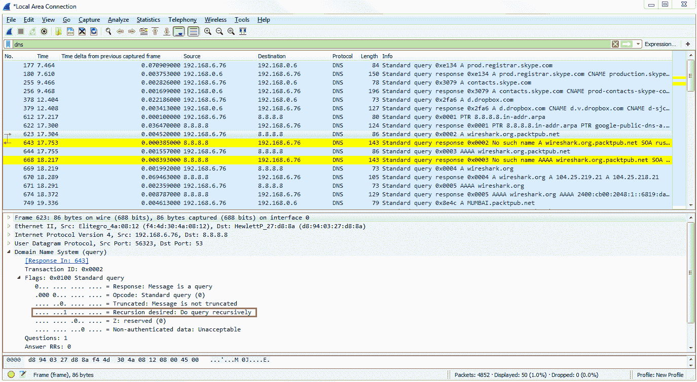

我们启用了一个`1`位，它表示需要递归:递归查询。这意味着查询请求服务器询问其他服务器，以防它没有我们的查询的答案。DNS 服务器可以配置额外的指针，或者设置额外的转发器，以寻找 DNS 查询的答案。因此，这个查询标志表示“是的，继续为我们做吧”。

让我们来看看数据包`669`，系统从 Google 请求`wireshark.org` `A`记录。我们可以看到数据包`670`上的响应。然后，我们深入研究这些标志，在下面的屏幕截图中给出了突出显示的响应:

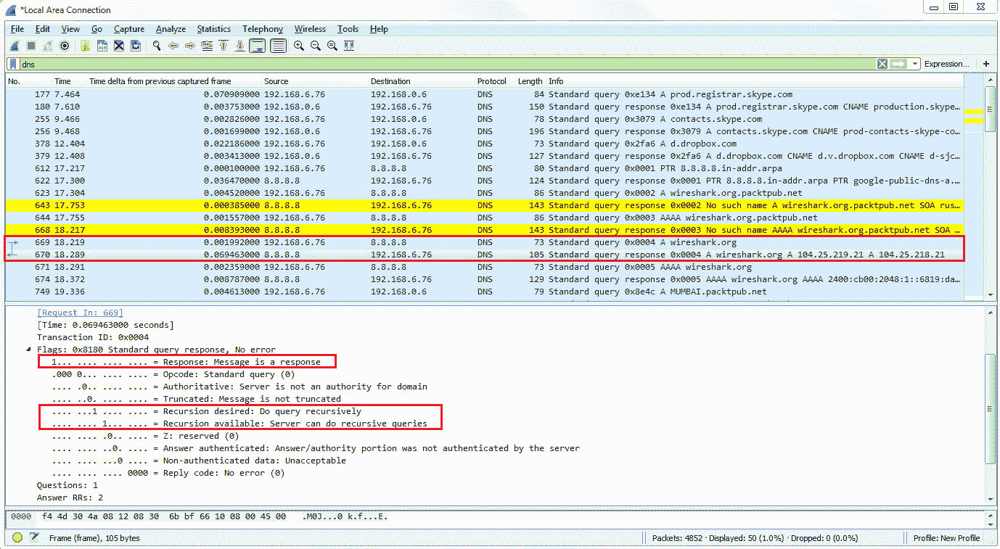

位`1`被使能，所以高亮显示的部分是响应消息。它使`Recursion desired`和`Recursion available`有效。

现在，我们将向下滚动，看到我们有答案 RRs: 2，因此我们对此有两个响应:

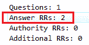

我们将看到查询，当我们转到答案时，我们将看到有两条`wireshark.org`记录:

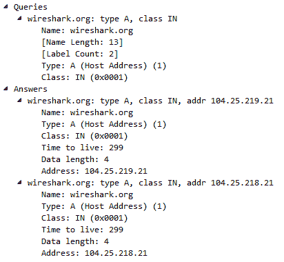

因此，`wireshark.org`似乎正在使用某种负载平衡系统，因为我们有一个`104.25.219.21`和`104.25.218.21`的`A`记录。如果你去[https://www.wireshark.org/](https://www.wireshark.org/)，它会把你带到这两个地址中的任何一个。您还会看到有一个生存时间值，其中您有一个`299`的 TTL，这是该记录在请求新记录之前在我的系统中保留的秒数。这里的 TTL 值非常短，这很可能与他们使用负载平衡器的事实有关。如果地址有任何变化，它希望我们尽快得到更新。它不希望我们将坏 IP 地址的缓存版本保留很长一段时间。比如很多默认是 8 小时或者 24 小时；所以，换算成秒，你可能会看到 86400 秒左右。

# DNS 请求失败的例子

让我们来看看一个会失败的 DNS 请求。

为此，我们将创建某种随机域，并放入胡言乱语，`jhadgug384r8.com`，如下面的截图所示:

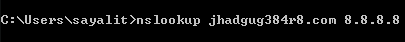

接下来，您需要开始新的捕获。继续按下*进入*:

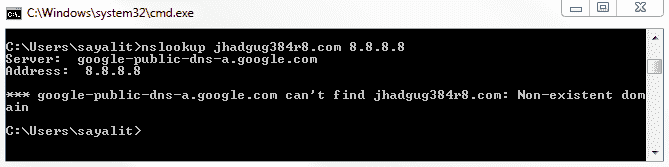

现在，你需要停止抓捕。

我们可以看到我们有请求，像以前一样:

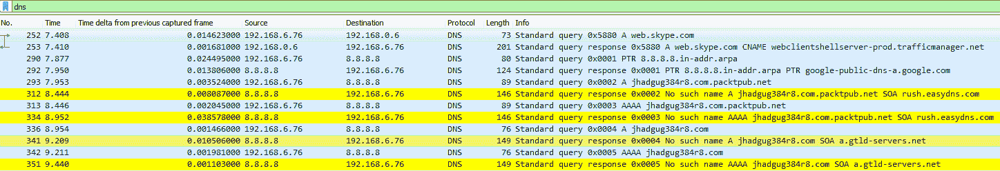

我们有`8.8.8.8`域名，我们有实际的请求。就像使用`wireshark.org`一样，你可以看到我们已经收到了一个`A`记录以及一个 quad `A`记录。这是因为系统同时请求 IPv4 和 IPv6。你可以在我们做`wireshark.org`时的命令行输出中看到这一点。

因此，我们有一个`A`记录，即 IPv4，还有一个四元组`A`记录，即 IPv6。但是你可以看到，我们有一些莫名其妙的域名，它显然在命令行中作出了回应，说它找不到结果。所以我们发出了一个查询，要求`jhadgug384r8.com`，我们收到了来自谷歌 DNS 服务器的回应，说`No such name`。如果我们去看一下旗帜，我们有`Message is a response`、`No such name`、`Reply code: No such name`。

如果您还记得“筛选”部分，我们可以右键单击任何标志，然后根据可用选项选择“应用为筛选器”来应用筛选器，如下面的屏幕截图所示:

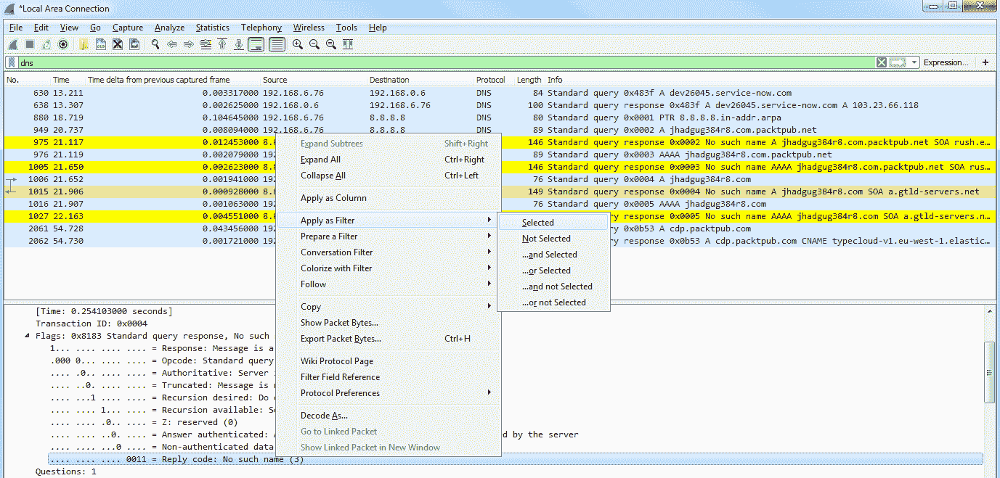

所以我们只是根据 DNS 中的错误代码`No such name`来过滤我们的显示过滤器。这是一个很好的过滤器，如果你在有某种连接问题的地方进行数据包捕获，你可以使用它。您可以查找失败的 DNS 查询。

# ARP 分析

在本节中，我们将了解 ARP 是如何工作的，将地址从 IP 解析到 MAC，并了解 Wireshark 中的 ARP 问题。ARP 所做的是将 IP 地址(第 3 层地址)解析为 MAC 地址(第 2 层地址),这些地址在本地以太网总线上使用。我们需要这些信息来构造封装数据包的帧，这样我们就可以将它发送到网络上。当用户或应用从第 3 层上的特定 IP 地址请求数据时，我们的系统必须计算出该 MAC 地址是什么，如果它的缓存中还没有它的话。我们可以检查我们的系统在其 ARP 缓存中已经知道的 MAC 地址。就像 DNS 缓存本地已知信息一样，ARP 也缓存在本地。

所以我们能做的是在 Windows 机器中键入以下内容:

```
arp -a
```

如果您按下 *Enter* ，您将获得第 3 层中与物理地址匹配的所有已知 IP 地址的列表，物理地址是第 2 层的 MAC 地址:

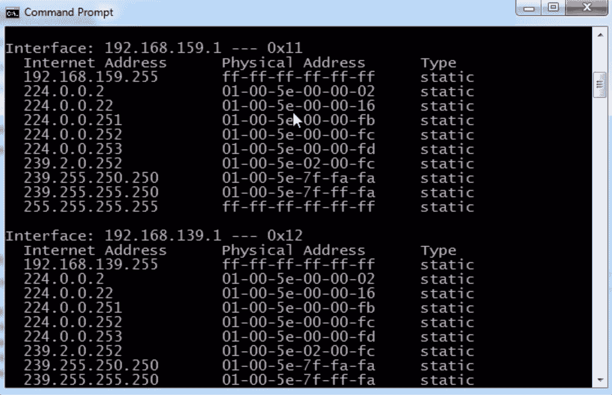

在前面的截图中，您在第三列中看到的是，正如它所说的，`Type static`。

所有这些地址都是我的系统知道的，因为此时它们已被编码到操作系统中。因此，这些地址是系统默认知道的组播地址。它还知道一些 VMware 接口、IP 和 MAC 地址，以及一些已经存在的东西。

如果我们向上滚动，我们可以看到一些动态学习的地址:

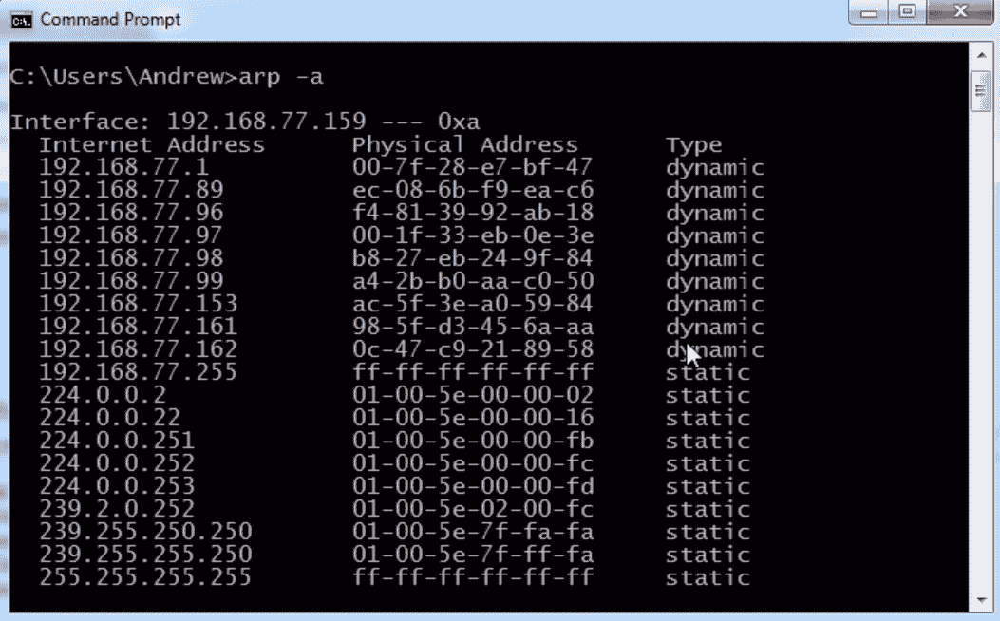

接下来，您可以看到一些静态已知的信息——接口`192.168.77.159`的一些多播。

您可以看到主接口，其中有该接口已知的静态信息，我们还动态学习了地址。`Physical Address`下的地址都是针对特定 IP 发现的 MAC 地址，并且缓存了特定的一段时间。然后，如果我需要在第 2 层再次访问该设备，它将再次发出 ARP 请求。

现在，我们要做的是捕获一个正常的、良好的 ARP 请求的数据包。

我们将开始捕获并 ping IP v4 上的一个已知良好的地址:

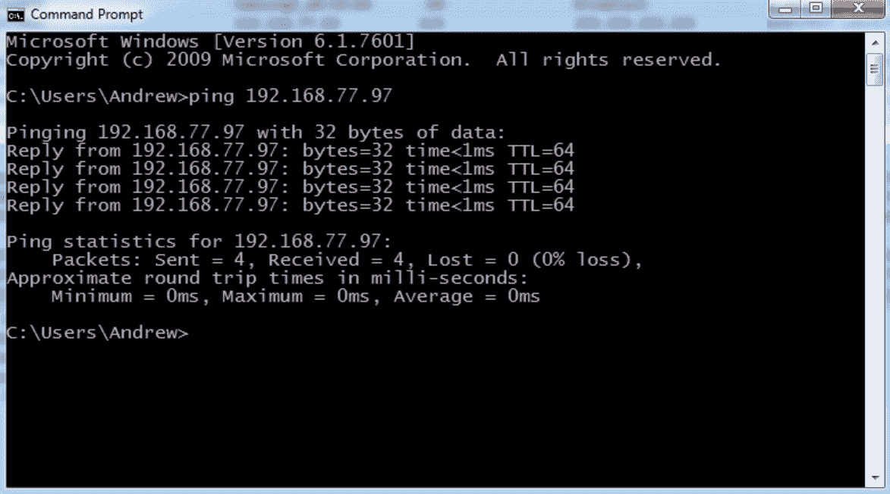

正如我们所看到的，我们收到了许多回复。系统已经使用**互联网控制消息协议** ( **ICMP** )向该设备发送了四次 pingss，并收到了对所有四次 ping 的响应。在能够做到这一点之前，它必须弄清楚该设备的本地物理地址是什么，MAC 地址是什么，然后才能做出第一个响应或第一个请求。

接下来，我们将停止捕获，并对`arp`进行过滤:

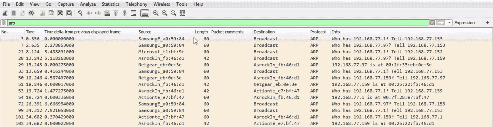

这样，我们只能看到我们的 ARP 流量，我们将跳过一些信息。网络上有一些其他设备也在尝试进行 ARP 请求，但是如果我们检查前面的截图，我们有`AsrockIn`接口，这是我们正在使用的计算机的主板。

在信息栏，你可以看到`Who has 192.168.77.97? Tell 192.168.77.159`。这是我们现在使用的系统的 IP 地址。我们得到一个响应，说，`192.168.77.97 is at 00:1f:33:eb:0e:3e` MAC 地址:


前面的屏幕截图显示了我们网络上的一个 Netgear NAS 设备。

如果我们进入“packet details”窗格中的 ARP 信息，我们可以看到与前面的屏幕截图中显示的信息相同的信息，但都是摘要形式:

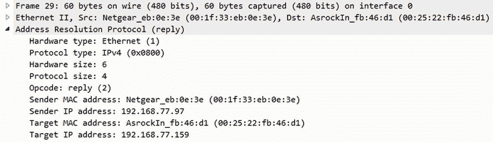

这是一个以太网响应。帧中的发送方 MAC 来自 Netgear。它从 Netgear 的 IPv4 地址发送到最初的请求者，然后通过 IP `192.168.77.159`发送到我们的系统。

但是，有一点要小心。如果我们看一下我们做 ARP 请求的地方，你可以看到它是从我们的系统发出的，带有 MAC 地址`00:25:22:fb:46:d1`和 IP 地址`192.168.77.159`，但是它被发送到`00.00.00_00:00:00`，因为它不知道它要发送给谁，但是它知道 IP 地址。在初始请求(ARP 请求)中，发送方是发出请求的设备。然后，在响应中，发送方就是正在响应的设备。注意这些类型的人字拖。您还会注意到，在 ARP 请求中，它是一个广播，我们可以从它显示 Destination:Broadcast on Ethernet II 的地方看到这一点，如下面的屏幕截图所示:

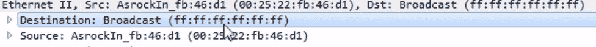

它要去一个广播地址。因此，当我们的系统试图在本地以太网总线上找到具有第 3 层显示的 IP 地址的设备的 MAC 地址时，它不知道该与谁交谈，所以它向每个人发出广播。然后，碰巧知道该信息的设备接收它(因为每个人都有一份拷贝)并作出响应。类似地，对于 DNS，如果您在这里看到一堆重复，特别是响应帧，它们一遍又一遍地循环，它们只是不断地出现在您的捕获中，这可能再次指向您的网络中的环路。你不应该一遍又一遍地看到这些。

# ARP 请求失败的一个例子

让我们看一个 ARP 请求失败的例子。

我们将开始新的捕获，这次我们将 ping 一个不存在于我的网络中的地址:

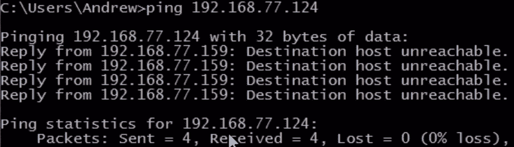

我们会看到`Destination host unreachable`出现。我们会这样做几次。因为我们正在尝试 ping，所以它将在 Windows 系统上执行四次。如果你用的是 Linux 或 macOS，它可能会不停地运行，这取决于你用的是什么。

去吧，停止抓捕；我们这里有大量的信息:

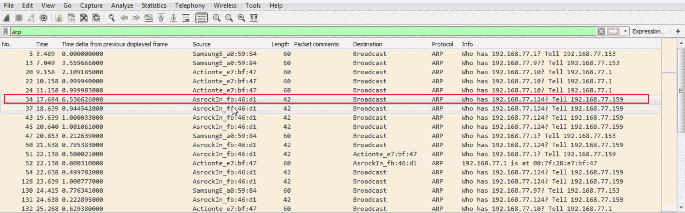

我们可以看到前面截图中突出显示的请求:`Who has 192.168.77.124?`

我们可以在地址解析协议(请求)选项中看到目标。我们只是一遍又一遍地要求它。我们拼命想找到谁有那个 IP `192.168.77.124`的 MAC 地址，但是它不存在。它只是不断尝试，不断尝试，不断超时，不断失败；这将显示在我们的结果中，正如您在命令行中看到的，是不可到达的。

# IPv4 和 IPv6 分析

我们现在来看一下 IPv4 和 IPv6 之间的区别，并了解一些问题和特性，例如这些数据包的碎片、广播风暴以及 IPv4 和 IPv6 报头中的标志。

我们从数据包捕获中获得的一些数据被发送到一个加密的网站，这就是我们在协议信息中看到大量 TLS 的原因:

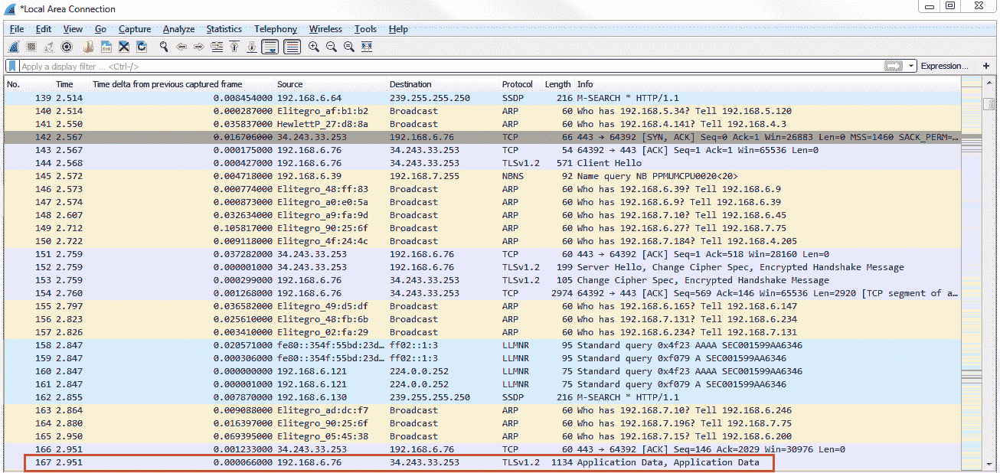

我们看到 Info 列中有`Application Data`，这是所有来回传输到 web 服务器的加密数据。转到数据包详细信息中的 IPv4，展开它，我们可以看看 IPv4 报头中的信息:

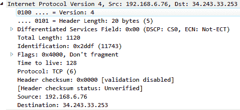

我们可以看到，就在互联网协议版本 4 之后，它在说它是`Version: 4`；否则会显示`Version 6`。它还有`Header Length`，也就是报头中的字节数。有时，`Header Length`会波动，因此它定义了报头有多大，以便应用知道报头和数据包中实际数据之间的区别点在哪里。我们还有一些用于服务质量目的的 DSCP 信息和数据包的总长度。如果你熟悉 MTU，比如设置路由器或计算机接口的 MTU，这就是它发挥作用的地方。`Total Length`是该数据包的总大小。如果数据包的总大小太大，它就会分段。

此外，我们可以看到旗子里面写着`Fragment offset`。如果展开我们的标志，我们可以看到标志中有碎片设置。所以我们有即将到来的`More fragments`，或者说`Don't fragment`。`Fragment offset`告诉 IP 堆栈从哪里获取即将到来的额外数据，以便将其组合成一个大数据包:

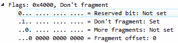

我们还有一个 TTL，它通常是某种默认数字，比如`24`或`60`，或者类似于`128`的东西。当它在整个互联网或您的本地网络中的不同路由器之间跳跃时——无论它的目的地是哪里——当它通过每个设备时，它将减 1。如果它在路由器上收到时达到 1，如果它的 TTL 为 1，那么路由器将丢弃该数据包。如果主机收到一个 TTL 为 1 的数据包，它会处理它，因为它不需要实际将它路由到某个地方。TTL 防止数据包在网络中永远循环。如果它循环通过 60 个设备，那么它将被丢弃；所以，不会永远卡在那里。

我们还有一个协议定义:它是 TCP 数据包、UDP 数据包还是其他类型的协议。我们有一些校验和信息来确保报头没有被以任何方式操纵。请注意，它不是整个数据块的校验和，例如封装该数据块的帧末 FCS，但它是报头校验和，以确保报头本身不被操纵。当然，我们还有分别来自和去往的源地址和目的地址:

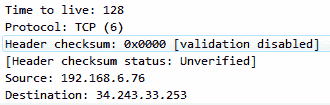

让我们来看看一个被分割的数据包:

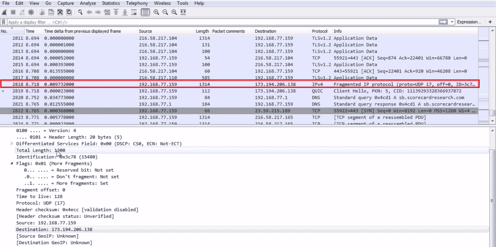

我们实际上可以看到，我们有一个 IPv4 数据包，它在 Wireshark 中显示为`Fragmented IP protocol`；它知道这是一个碎片包。我们在数据包细节中看到，它的长度为`1300`字节，在标志中，它为更多的片段打开了 1 位。它说有一个碎片出现了。还有一个额外的包。下一个数据包是其中的一部分，所以我们可以将它们组合起来。我们可以看到`Protocol`是一个`UDP`数据包，它是用`128`的 TTL 生成的。由于源是我们的本地机器，并且它要发送到互联网，我们知道这是生成的 TTL，因为它在发送它的设备上被记录和捕获。所以，我们的系统实际上默认细节为`128`。

下一个数据包是前一个数据包的延续:

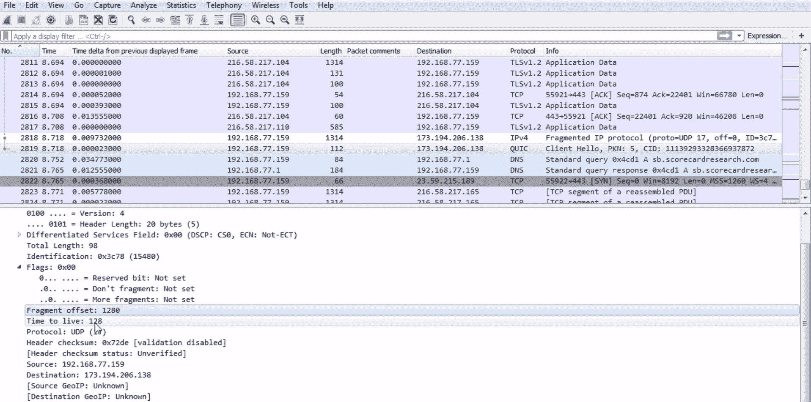

我们可以看到`Fragment offset`是`1280`，所以它知道它需要与之前捕获的数据包组合。您可以看到，如果您深入查看数据包的详细信息，Wireshark 实际上会将它们合并到详细信息的这个小信息部分中。如果我们展开[2 个 IPv4 片段(1358 字节):#2818(1280)，#2819(78)]，它表示涉及两个数据包:

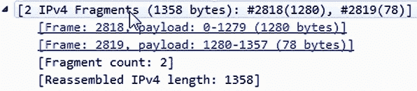

我们可以选择第一个和第二个数据包。点击它们，您可以看到以下信息:

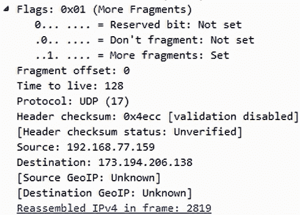

Wireshark 很聪明，知道这一点。它会查看标题信息并为您提供详细信息，如前面的屏幕截图所示，这样您就不必自己计算了。它甚至还能显示一次传输中有多少个分段的数据包，并提供额外的信息，如重组数据的总长度。应用可以定义它是否是碎片化的。因此，当应用想要进行通信时，它会告诉堆栈是否设置`Don't fragment`位。根据应用及其需求，它可能会说不希望其数据被分割。也许这是一个加密的数据包，如果你把它分成碎片，就会破坏加密。因为它不希望信息被分割，所以它将打开表示`Don't fragment`的位，以便两端的 IP 堆栈知道它们不需要分割数据。如果你注意到，最初发送的数据包——将被分段——有一个标识`3c78`。如果我们看这个系列中的第二个数据包，我们会看到它的标识也是`3c78`。

还记得我们讨论 ID 字段的时候吗？它会根据每个会话或发送的每个数据包而变化。如果标识是相同的，这表明数据包是碎片。这就是 Wireshark 如何将它们组合在一起，并意识到它们是一个系列的一部分，因为 ID 是相同的，但其中的数据是不同的。它不是一个副本，而只是一个碎片数据的延续。现在，在 IPv6 数据包中，您会看到报头有点类似于 IPv4:

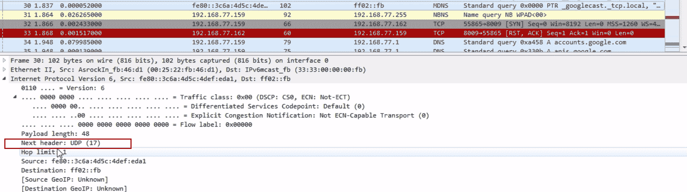

它实际上有点简化了。它有`Payload length`；它告诉你里面是什么样的数据:是 TCP 还是 UDP 它有一个 TTL(他们称之为`Hop limit`)；它也有源地址和目的地址。请记住，IPv6 中的地址看起来不同，因为它使用十六进制。

# ICMP 分析

在本节中，我们将了解 ICMP 如何对网络工程师有用，以及 ICMP 的不同类型及其含义。

我们要做的第一件事是创建一些 ICMP 数据包。为此，我们将创建一个 ping 请求，这是一种 ICMP。

那么，让我们开始捕获，我们将继续再次 ping Google:

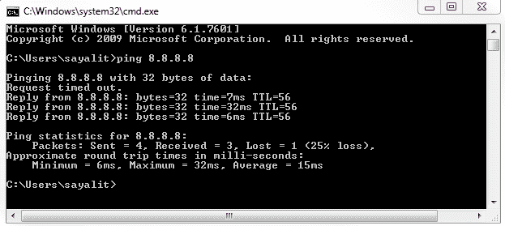

每个回复都是一系列 ICMP 请求和响应。

停止捕获，我们将应用`icmp`显示过滤器:

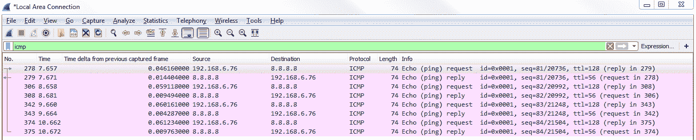

如前面的屏幕截图所示，这些是我发送和接收的所有 ICMP 数据包，我们可以看到我们有多个请求和回复。这与我们在命令行中看到的四个回复相吻合。

如果我们深入头部，深入到数据包细节的最底部，即互联网控制消息协议，我们可以看到有`Type`和`Code`:

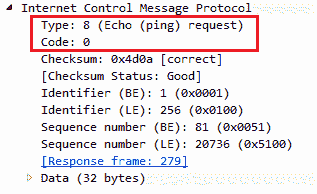

`Type`和`Code`是 ICMP 中的两个重要部分。我们看到我们有`Type 8: (Echo (ping) request)`。然后，在下一个数据包中，我们有`Type: 0 (Echo (ping) reply)`。`Type`和`Code`给了我们网络中正在发生的事情的信息。现在，这是一个非常简单的例子，请求轮询设备并从设备获得响应，以查看它是否处于活动状态。这基本上就像按一个设备的门铃，看看它是否在那里。

ICMP 中还有其他类型和代码，它们对我们网络上的设备很有用，对我们这些工程师也很有用。一个非常简单的例子是一个回应请求，你可以通过回复来查看某个东西是否可访问，以及它是否被设备允许，比如防火墙；他们可能会阻止请求，但这是一件非常有用的事情。我们还可以看看其他类型和代码。

如果你去维基百科上的 ICMP 页面([https://en . Wikipedia . org/wiki/Internet _ Control _ Message _ Protocol](https://en.wikipedia.org/wiki/Internet_Control_Message_Protocol))，我们可以向下滚动，看看所有这些类型和代码。你可以看到有许多不同的类型，每种类型中都有代码。

你可以看到有类型 **8 - Echo 请求**，用于 ping 并键入 **0 - Echo 回复**。但是我们这里也有这些额外的类型，比如类型**3——目的地不可到达**:

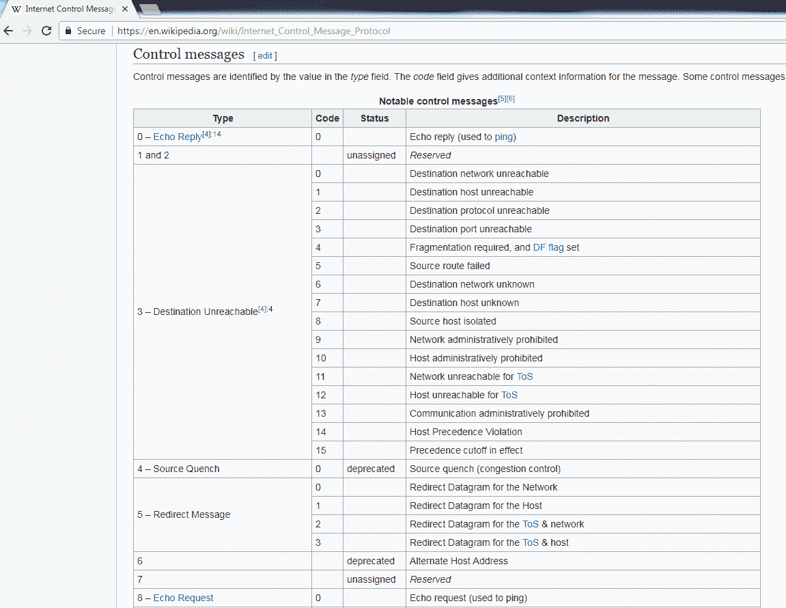

路由器可能会将 ICMP 数据包发送回设备，让设备知道它无法访问特定的网络或主机。您可以看到它必须向请求设备描述的所有不同类型，为什么它不能到达它试图到达的特定资源。

其他常见的类型有路由器广告和路由器请求。这些协议允许主机请求并接收路由器来访问特定网络。此外，我们有类型 **11 次超过**。还记得我们在讨论 TTL 时，它是如何从某个数字开始的，比如`60`或`128`之类的数字，然后随着它通过网络和互联网中的不同路由器而递减吗？当路由器收到 TTL 为`1`的数据包时，它会将其丢弃，同时生成一个 ICMP 数据包并将其发送回原始源设备，让它知道 TTL 已超出，需要将其丢弃。它将通过类型`11`和代码`0`这样做。

我们可以在下面的截图中看到这样的例子:

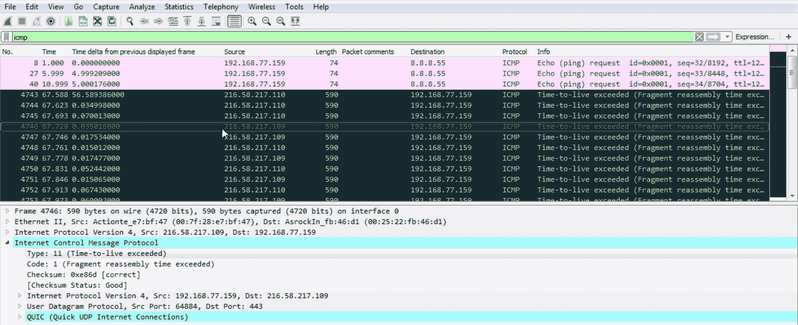

在 Wireshark 中，默认情况下会突出显示黑色数据包。它们都超过了 TTL。所以有 TTL，当他们在互联网上的时候，用完了。它们陷入了循环或类似的情况，丢弃它的路由器向我发回了一条消息，让我知道我的数据包已被丢弃——它们没有到达目的地。

现在，这些数据包有点不同，因为它们是片段。我们看到另一个是代码`0`，前面截图中显示的数据包是代码`1`，但这是相同的概念。它发回一个类型`11`给我们，让我们知道这个包超过了 TTL。这实际上就是 traceroute 的工作原理。它使用具有不同 TTL 的 ICMP 数据包，以确定从源到目的地的路径上有哪些路由器。

# 使用 traceroute

我们将开始新的捕获，然后跟踪路由。在 Windows 中是`tracert`。我们会追踪到互联网上的另一台设备。

我们将跟踪路由到我们信任的谷歌 DNS 服务器；为什么不呢？然后，我们将按下 *Enter* ，我们会看到路径开始显示在这里:

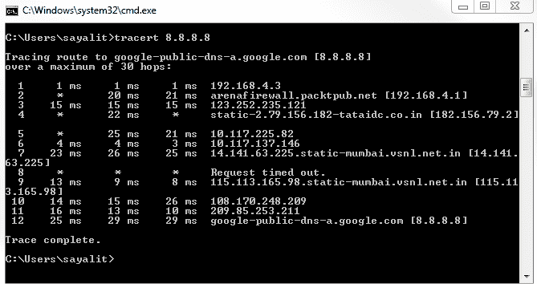

您可以看到，它在通过每台不同的路由器时都收到了大量响应。偶尔你会注意到它得到一些超时的响应。根据它通过的路由器或防火墙，它们可能不会向我们发回信息。这就是为什么有时你会在你的路径上有间隙，但你可以看到，当它找到另一个至少对我们做出响应的路由器时，它会再次恢复。因此，我们仍然通过互联网，通过路由器，最终到达我们的目的地。如果你注意到了，每一跳都要跳三次。因此，它给出了特定路由器平均三次尝试的平均响应时间——从一台路由器到另一台路由器。

如果我们看一下 Wireshark，我们应该看到每个路由器有三个请求。在我的系统中，当它创建跟踪路由时，它首先向我的目的地发送一个 TTL 为`1`的数据包，而不是`128`或`60`或类似的东西:

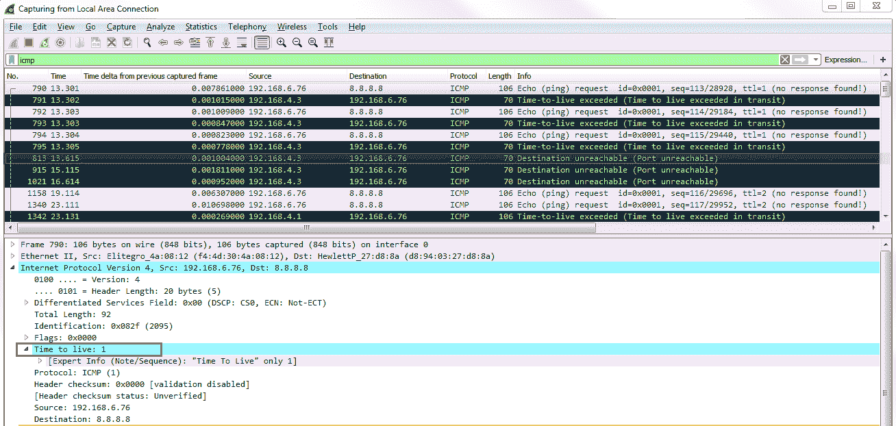

所以它会去我们的路由器，路由器会得到它，并说，“我不能用这个做任何事情；我需要丢弃它"*。*TTLs 将转到`0`。然后我们的路由器会给我发回一个 ICMP，让我们知道我的 TTL 已经超过了。我们可以看到的是，这正是所发生的。我们发出了一个 ping 请求，一个 TTL 为`1`的 echo 请求。我们的路由器回应说“哦，不好意思；我做不到”。然后，我再做第二次尝试。我们得到的回应是“不，我做不到”。这也是第三次。然后，它创建一个 TTL 为`2`的回应请求:

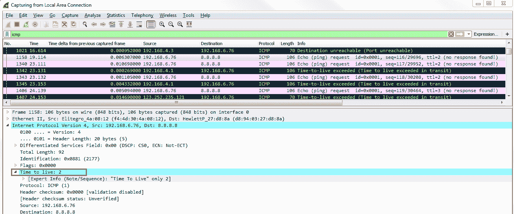

它通过我们的路由器，因为我的路由器看到它是一个`2`；它将其递减到`1`并转发它；这完全成立。然后它会到达链上的下一个路由器，在威瑞森，我们看到了。那个路由器看到它；它看到这是一个`1`的 TTL 它必须丢弃它并发回一个响应说“不，对不起；我做不到；您的 TTL 已超过”。我再做一次，它就有反应了。现在，我们创建一个`3`的 TTL:

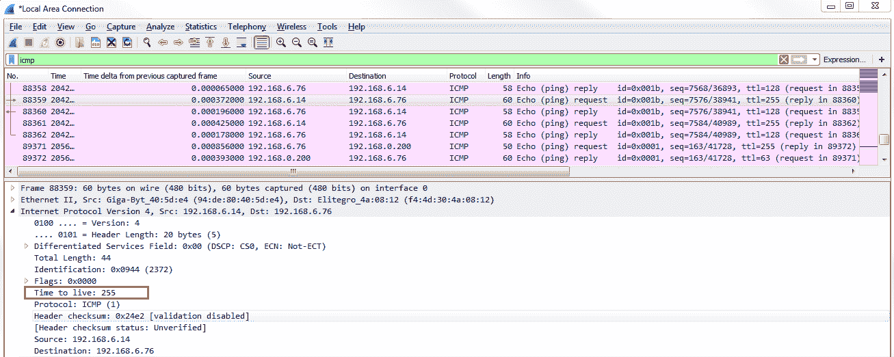

它继续为 TTL `4`这样做，以此类推。这就是 traceroute 能够映射从 A 点到 B 点的路由器的方式，因为它使用 ICMP TTL 超出错误来找出该设备。这是因为它知道 ICMP 数据包是由路由器作为错误代码返回给我们的。幸运的是，我们可以使用该 IP 信息来绘制出为了到达目的地我所经过的跳数。非常聪明。

# 摘要

在本章中，您学习了 DNS 的工作原理，并看到了一些 DNS 分析。我们看到了 ARP 是如何工作的，然后继续解析 MAC 地址。我们讨论了 IPv4 和 IPv6 报头，并了解了如何查看报头中的一些细节，包括 ICMP。我们也看到了为什么 ICMP 对我们这些网络工程师有用。我们介绍了 traceroute 的工作原理，以及其中的报头。

在[第 7 章](e221b68c-2c64-481c-9906-5a91c997af92.xhtml)、*网络协议分析*中，我们将开始更深入的分析，看看一些附加的协议和应用。