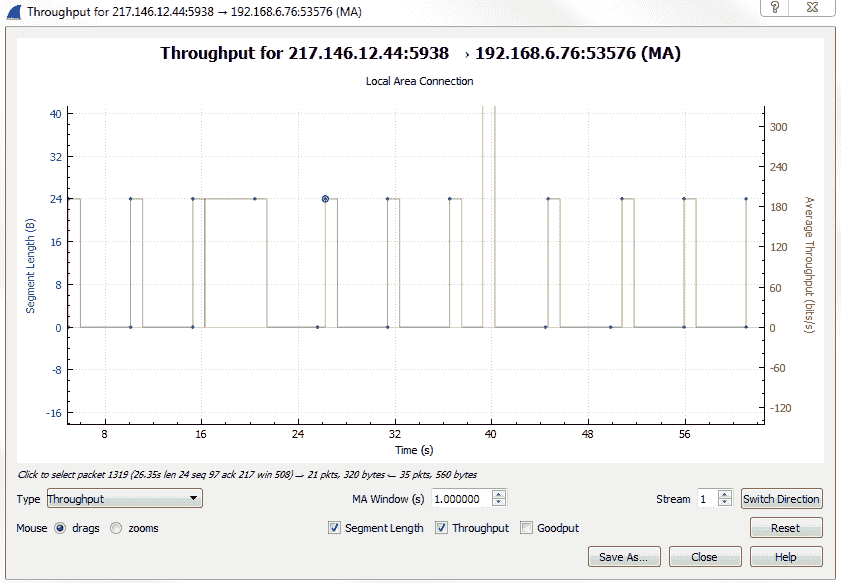
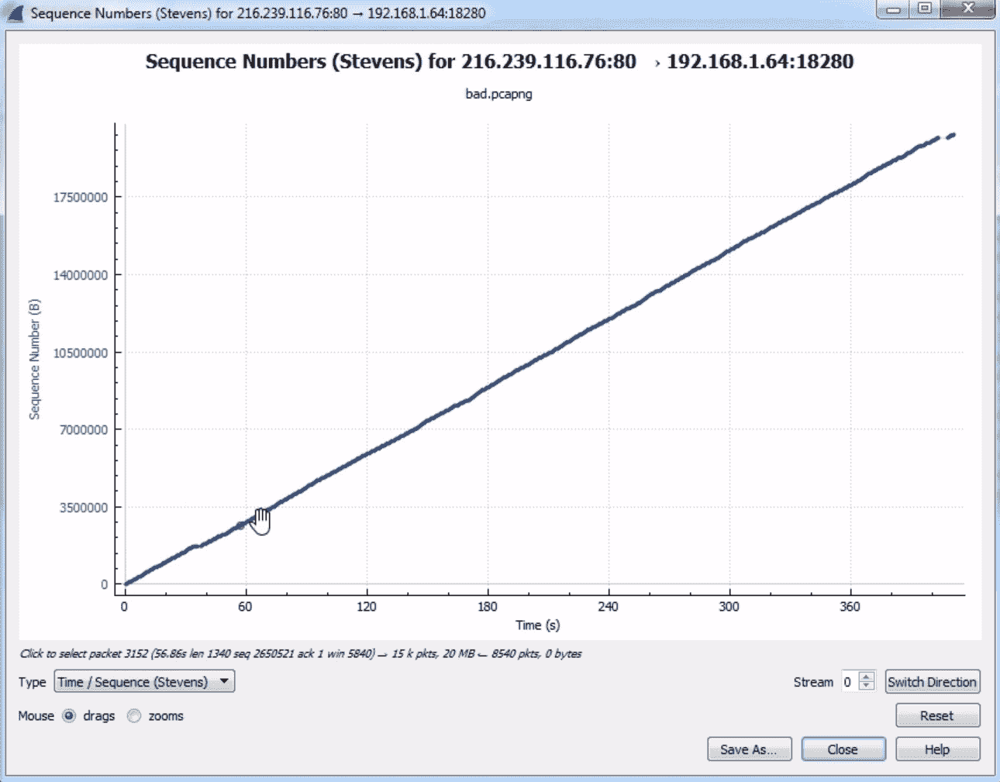

# 七、网络协议分析

在本章中，我们将了解以下主题:

*   UDP 分析
*   TCP 分析
*   绘制 I/O 速率和 TCP 趋势图

# UDP 分析

我们将看看 UDP 是如何工作的，它是什么，以及 UDP 头中有什么。UDP 协议是一种无连接协议，它非常轻量级，只有非常小的报头。

如果你想了解更多关于 UDP 协议的知识，看看[https://www.ietf.org/rfc/rfc768.txt](https://www.ietf.org/rfc/rfc768.txt):

这是原始规格。如果你浏览所有的 RFC，就会发现它从 1980 年 8 月 28 日就开始更新了，但是最初的规范是`768`。如果您想了解 UDP 的所有细节，这些相对来说比较简短，您可以通过前面截图中显示的文件来完成。

让我们来看看 Wireshark 中的 UDP:

我们只捕获了几秒钟的数据，以及应用和协议的完整组合。我们能做的就是简单的根据`udp`进行过滤。如果你按下*键进入*，现在它只显示 UDP 数据包:

您可以看到我们列出了一些附加协议，其中包括使用 UDP 进行传输的应用，例如`SSDP`。我们可以在数据包详细信息中查看 UDP 部分:

在 UDP 报头中，字段很少。UDP 的报头中总是有 8 个字节，只有 4 个字段。我们有一个源端口；目的港；长度，即数据包的总长度，包括报头和数据；和验证报头信息的校验和。但它并不像您所期望的那样包含所有数据，帧中的 FCS 位于帧的末尾。您可以看到我们有一个`unverified`校验和。默认情况下，Wireshark 中不启用此选项。

现在，转到编辑|首选项...|协议| UDP，并打开“如果可能，验证 UDP 校验和”选项:

您可以看到，现在校验和显示为`correct`:

因此，如果标题中有任何问题，并且它在传输中被操纵，我们将能够在这里看到它，并且它将被标记。然后，如果您展开校验和，它会告诉您它正在计算的校验和信息是什么。

UDP 传输通常不会有什么问题。他们要么工作，要么不工作。它们不保证任何连接性，如果需要，应用将执行任何类型的重新传输，内置于应用中。它不像 TCP 那样在堆栈中处理。因为它有一个非常小的标题和非常少的字段，所以可以打开和关闭的选项非常少。这里没什么东西。它的本意是非常简单和轻量级的，这对于 voiceover IP 或流媒体视频来说非常棒；诸如此类的事情，这是非常时间敏感的。它在途中发送数据，并希望数据到达目的地。如果是，那就太好了；如果没有，那么:哦，你错过了一两个包。

如果您在查看数据包列表时不确定数据包是否是 UDP，您可以做的一件事是创建一个基于 UDP 的列。因此，我们右键单击用户数据报协议，Src 端口:40097，Dst 端口:1900，并选择应用为列:

现在，我们有了一个新的列，写着用户数据报协议；这是一个 UDP 数据包。如果我们删除我们的`udp`过滤器，我们可以看到我们现在有一个勾选标记和空白列表贯穿我们的捕获:

这是一种很容易看出什么是 UDP 包，什么不是的好方法，这取决于您是否有不同的着色规则或类似于大型包捕获中的规则。

UDP 可能遇到的少数问题之一是 UDP 连接尝试后的目的地不可达响应(如果您记得的话，这些是 ICMP 数据包)。如果您尝试进行 UDP 连接，并且在下一个数据包以及随后的数据包中持续收到 ICMP 目的地不可达，则表明您可能存在某种连接问题，需要进行调查。因为 UDP 不发送响应，所以这确实是您将得到的唯一一种响应。设备本身可能会发送一个响应，告诉您网络不可用或类似情况，因此目的地不可达。但是，除此之外，UDP 本身不会告诉你任何事情。这就是为什么在数据包捕获中很少会看到 UDP 问题，因为 UDP 中没有内置的东西来告诉您存在问题。

# TCP 分析 I

在这一节中，我们将了解 TCP 如何工作，TCP 报头中有什么，以及一些标志和选项。

如果你想了解更多关于 TCP 的知识，你可以看看 IETF 的 RFC，网址是[https://tools.ietf.org/html/rfc793](https://tools.ietf.org/html/rfc793):

你正在寻找 TCP 的 RFC: 793 ，它是 TCP 的原始规范。

在前面的截图中，您可以看到 IETF 中的不同部分，它们提供了一点点交互性。您可以点击更新了 TCP 规范的不同 RFCs 如果你向下滚动，它还会给你一个漂亮的小目录。RFC 显示了 TCP 报头的一个小图表:

我们有**源端口**；**目的港**；**序号**；**确认号**；**数据偏移**；一些**保留的**位；**窗口**大小；报头**校验和**；一个**紧急指针**；和**选项**，这是一个可扩展部分。我们有一些**填充**，然后是实际**数据**。

进入 Wireshark，我们来看一个 TCP 数据包。我们可以看到，有些 TLS 流量碰巧通过 TCP 运行。我们可以右键单击传输控制协议，然后选择应用为列:

在前面的截图中，你可以看到勾号，这意味着它确实在使用 TCP。如果我们展开传输控制协议，您会看到我们刚才在 RFC 中看到的字段。

我们有源端口和目的端口，您可以看到我的计算机中的系统正在访问端口`443`上的 web 资源，并访问其他字段，您很可能在查看的其他数据包中注意到了这一点。任何带方括号的东西都是 Wireshark 创建的；它们实际上不是标题中的字段，所以我们可以跳过它们。我们有序列号和确认号。如果你注意到的话，这些是相对数字。我们之前提到过，在这个例子中，他们从`1`开始。实际的原始数字不是 1。Wireshark 将它显示为`1`，并且作为一个相对数字，以便于您查看。否则，这是一个非常长的数字，人类更难观察和诊断。

接下来，我们有标题长度。它告诉我们报头有多大，因为报头在 TCP 中可以改变大小，不像 UDP，所以我们必须告诉它它有多长。我们有一些标志，如下图所示:

在前面的截图中，您可以看到我们有一些拥塞信息；紧急的部分；确认和推送；以及 Reset、Syn 和 Fin。许多这类东西看起来都很熟悉，比如 SYN、Acknowledgment 和 FIN 创建连接和完成连接。我们还有窗口大小值，它告诉我们在必须进行确认之前可以传输多大的数据块:

我们有一个校验和，也是`unverified`，和一个紧急指针。

如果需要，我们可以转到编辑|首选项...|协议| TCP 并启用验证 TCP 校验和(如果可能),如果您愿意:

我们可以看到，我们现在有了一个`correct`校验和。

让我们继续创建一个新的捕获，我们将看看一个连接的握手创建和断开。

让我们开始一个新的捕获，我们将产生一些流量。此外，打开一个新的网页，重新下载我在 IETF 网站上展示的 RFC 的所有信息。我们将向下滚动，寻找连接的起点:

看起来像是正在传输的网站。这是在 HTTPS 上空，所以看到 TLS 流量是我们可以期待的。我们将右键单击 TLS 流量，然后转到 Follow | TCP Stream:

接下来，我们将回到主数据包列表:

您可以看到`tcp.stream eq 27`的过滤器列在过滤器选项中。这是我们到 IETF 网站的链接。如前所述，TCP 是面向连接的。它保证数据包的传送。因此，如果您丢失了一个数据包，确认系统会内置并重新传输它。因此，我们从服务器向请求设备发送一段数据。我们发送一个确认收到的信息。我们还发送另一个数据包，随后是一个确认，表明我们已经收到它。

有时，根据驱动程序中网卡中 TCP 堆栈的选项和功能，您可能会允许一些多年来出现的增强功能，如选择性确认和一些增强功能，以使您更有效地使用这种确认系统，从而减少额外开销。我们可以看到 TCP 握手的创建是一个`SYN`，它表示“让我们同步”:

让我们建立联系。我们在标志中有一个`Syn`，即`Set`。这是我的系统请求 IETF 网站创建一个 TCP 连接。他们用一个`Syn`和一个`Acknowledgment`回应；然后，我们反过来也发回一个确认。于是我们有了`SYN`；`SYN, ACK`；以及`ACK`—与 TCP 的三方握手。在这之后，我们开始通信来检索 HTTP 流量，在本例中，它恰好位于 TLS 之下。我们可以看到 TLS 连接的创建和一些数据的传输，如密钥交换等:

然后，在通信结束时，在发送和接收我们想要的任何数据时，例如正在检索的网站，我们的系统将最终确定这一点，并使用隐式方法说:“让我们终止这一点；没有更多的数据要发送或接收”。我们将用一个最终的语句来结束这个 TCP 连接。

所以我们做的是，在标志中，我们有`FIN`和`FIN, ACK`。有时在列表的末尾，你还会看到一个重置。所以使用`FIN`的最后一个方法是隐式的，表示这个连接应该被终止；没别的要传了。但是它没有被明确告知要删除连接，所以两端的系统最终可能会保持这个连接——这取决于它们。

如果您在 FINs 之后的连接结束时看到重置，那么这是一个设备明确表示:“是的，终止此数据包”的方式。这是一种露骨的说法:“扼杀联系；重置它；取消它”。

如果您在 FINs 之前看到重置，则这可能表示连接中存在问题，此时服务器或请求设备解决了问题并重置连接以重试。

我们还有一些选项，它们是报头中的扩展，允许我们扩展 TCP 的功能。我们能做的是过滤`options`，因为如果你注意到通过标题看，我们看不到任何写着`options`的内容。如果我们想找到任何有`options`的东西，我们需要对其进行过滤。

在显示过滤器中，键入`tcp.options`:

现在，我们在报头中显示所有启用了`options`的流量。如果我们向下滚动数据包详细信息区域，我们会看到一些有关选项的信息。我们可以跳过不手术的部分。我们想看看我们更感兴趣的东西，比如 TCP 选项- SACK permitted 和 TCP 选项- Window scale:

例如，下面的屏幕截图显示了具有 TCP SACK 的数据包:

**选择性确认** ( **SACK** )允许您在确认流量的同时仍然请求丢失的流量，而无需向您重新发送整个数据包块。比如说，如果在你发送确认之前，一次有五个数据包发送给你，其中一个丢失了，在没有选择确认的情况下，所有五个数据包都需要重新发送给你。因此，发送给您的数据包数量之间的确认间隔越远，效率就越高，因为您不会将所有带宽浪费在开销确认数据包上。但是，如果你遇到问题，那么更多的数据必须重新传输。选择性确认是一种两全其美的方法，这样你就可以有大量的数据包发送给你，而不必每次都确认它们，但是如果你错过了一个，你可以请求只重新发送给你一个；您仍然可以确认所有其他数据包。如果您看到 TCP 选择性确认，这意味着两台设备都允许选择性确认，并且它们对此达成一致。双方都必须允许启用该功能集，以便利用它。

我们也有窗秤。窗口缩放，如前面的截图所示，允许我们超越初始窗口大小。最初的窗口大小最大为 65535 字节，这已经不是很多了，所以我们想要更多。我们可以使用窗口缩放来实现。窗口缩放允许我们将窗口大小乘以一个因子。例如，无论窗口大小是多少，你都可以说是 65535 倍。然后，你可以得到一个非常非常大的窗口，以便最有效地利用你的带宽。

# TCP 分析 2

在本节中，我们将了解对许多不同 TCP 报头字段的过滤，以及根据我们所查看的一些字段，我们可能会发现什么样的问题。

因此，我们可以在下面的截图中看到的是打开的网站的数据包捕获:

您可以看到，我们仍然启用了 TCP 列，因此我们可以向下找到一个 TCP 数据包，我们将再次看到字段信息:

与我们研究过的许多其他协议一样，我们可以右键单击任何字段，然后将它们用作过滤器。我们可能想要做的是展开标志，并查找设置了紧急位的任何内容:

紧急位不常使用。我们唯一能想到的是使用 Telnet，它基本上是对数据包进行优先级排序。我们可以右键单击紧急位，然后应用过滤器|选定:

我们将看到过滤器已经创建，但它是基于`0`的。所以我们就改成`1`:

现在，我们将查看是否有任何设置了紧急位的数据包。我们看到没有，这很好。我们可以做的另一件事是将过滤器删除回`tcp.flags`，如果我们按下*回车*，它现在会根据启用了标志的每个数据包进行过滤:

如您所见，我们有许多启用了标志的数据包。所以在这个数据包中，捕获可能不是很有用。根据您看到的流量类型，这可能有助于了解哪些有标志，哪些没有。在这里，它有太多的数据包带有标志，使其成为一个有用的过滤器。我们可以做的是定制它，并寻找任何可以重置的东西。通常，复位要么发生在一个良好连接的末端，如前所述，要么表示一个故障。我们要做的是更改我们的显示过滤器，使其成为`tcp.flags.reset == 1`:

您可以看到，我们有相当多的数据包进行了重置。我们可以看看其中的一个，看看复位周围的流量，看看这是否表明有问题。因此，让我们选择一个数据包并右键单击它，然后转到跟随| TCP 流:

关闭这个，我们看到它看起来像某种证书转移:

我们有三次握手；我们有一个客户端和服务器 hello—它看起来像是一个 TLS 协商。然后是一些应用数据包。此外，系统发送了一个`FIN, ACK`，因此我们最终确定了连接。这是一个隐式终止，随后是一个显式终止，即重置。所以这其实很好。系统说:“我完成了这个连接，然后我们将重置并完全终止这个连接”。这实际上很好，但是你可以看到它是多么的有用，能够取出所有重置的东西。

我们还可以做的是查看窗口大小，为此我们将输入`tcp.window_size < 50`并按*键输入*:

我们看到有相当多的数据包的窗口大小小于`50`。通常，小窗口表示有问题。在重置数据包中，这不一定是个问题，因为我们无论如何都要终止连接，但是如果您看到标准数据传输数据包中的窗口大小值很小，那就有问题了。这是网络堆栈中的线性设备的某种缓冲问题。此外，Wireshark 有一些我们可以使用的分析过滤器，我们将展示一个与窗口大小相关的过滤器。为此我们将进入`tcp.analysis.zero_window`。如果我们在那上面按*回车*，你会看到下面的截图:

这实际上是所有窗口大小为`0`的数据包，这是一个问题。所以这些都是潜在的问题。这些是系统对各种不同服务器的确认，系统声明它没有可用的缓冲区空间。它收到缓冲区已满，并向服务器发回零窗口响应，说:“请慢下来”。所以这是系统的一个潜在问题。

我们可以做的另一件有趣的事情是查看报头长度。如您所知，TCP 报头的大小会有所波动，让我们右键单击报头长度，然后转到准备过滤器|选定:

这里我们没有使用 Apply 作为过滤器；这样，它不会马上应用它。

在过滤器选项卡中，我们将输入`tcp.hdr_len > 20`，我们开始:

可以看到弹出的第一个头长有`32 bytes`。这是一个寻找包含选项的数据包的好例子。

如果我们向下滚动，我们可以看到标题长度比标准的`20`要长，因为它在某个地方内置了选项。在这里，您可以看到此数据包具有选择性确认和窗口缩放。您也可以通过对选项进行过滤来做类似的事情，所以右键单击选项并转到准备过滤器|选定:

我们准备一个滤镜，输入`tcp.options`。这是每个数据包中启用的选项:

# 图表 I/O 速率和 TCP 趋势

在本节中，我们将了解如何使用图表来帮助可视化数据包和趋势，尤其是在 TCP 通信中。这里我们有一个文件传输的数据包捕获，它发生了可怕的错误:

如您所见，我们有各种各样的黑条出现，这是 Wireshark 中的一个很大的警示信号，表明有什么地方出错了。你还可以看到一个条纹图案。这是一个很大的迹象，表明有一堆重新传输。所以，我们要做的是用这个作为我们制图的基础，并且能够挑出一些问题。

# 吞吐量

我们要做的第一件事是进入统计| TCP 流图|吞吐量:

当我们单击“Throughput”时，我们会看到一个图表出现:

无论是绘制进入该部分的 I/O 速率图、TCP 流图，还是任何类似的图，所有的图都是单向的。根据我们选择的数据包，它会向我们显示该数据包的吞吐量或 I/O 速率，或者我们正在绘制的任何数据，这是针对单向传输的。如您所见，我们将从`192.168.6.76`转到公共地址，因为我们正在尝试获取 HTTP。如果您在图表中没有看到您要查找的内容，请单击切换方向按钮:

这会给我们提供相反的方向。我们在这里可以看到，我们通过端口`5938`(服务器)从公共地址获得吞吐量，该吞吐量将到达我们的私有地址(web 浏览器)。我们可以看到，我们绘制了吞吐量图。我们有**段长度**，我们有以比特每秒为单位的吞吐量。在最新版本的 Wireshark 中，您可以拖动图表以便更有效地查看，或者使用滚轮放大。或者，您可以使用键盘右侧或小键盘区域的加号或减号。我喜欢使用滚轮，因为它很方便，几乎每个鼠标都有。

还要注意的是，你可以改变你跟随的流。如果我们想要查看多个流，我们可以更改我们所在的流编号。在这里，我们将其保留为`1`:

Wireshark 中图表的另一个很好的功能是，我们可以单击图表中的任何一点，它会将我们带到该数据包。让我们单击吞吐量中的小缺口，我们可以看到 Wireshark 将我们带到了数据包的那个部分。

如果您注意到，当我们转到统计| TCP 流图时，有几个选项可供选择:

您不必关闭此窗口，然后返回统计窗口并再次打开它；您只需选择想要的类型，就可以轻松地在它们之间切换。

我们来看时间/顺序(史蒂文斯):

你可以看到在我们的时间序列中有一条漂亮的对角线。这向我们展示的是序列号在数据包之间不断递增。有时，您可以通过查看序列号的下降或一条平线来查看数据包捕获中的序列号问题，在这条平线上，序列号不会在 y 轴上向上递增，而只是在 x 轴上继续。如果您看到除对角线之外的任何东西，这表明您的数据包捕获中存在问题。所以我们在这里看到的看起来相对较好。我们可以关闭它。

# 输入输出图

现在，让我们转到统计| I/O 图:

I/O 图是 Wireshark 中一个非常强大的功能，它向我们显示了每秒的所有数据包，所有这些都是可定制的。您可以更改间隔，也可以更改它是线性刻度还是对数刻度:

根据您所关注的数据包捕获的需求，您想要绘制的一些不同数据流之间可能存在非常显著的差异，或者我们想要应用的过滤器之间可能存在一些差异，因为您可以在本部分对过滤器进行分层。你可能想用对数来表示。这完全取决于您需要什么样的数据包捕获。默认情况下，当你打开它时，Wireshark 会显示每秒的数据包数量，然后每一次滴答都是一秒。我们有许多可以定制的附加层。您可以看到我们有一个名称列，您可以在其中命名层。我们有一个显示过滤器，其中包括颜色，您可以在其中更改颜色和样式类型，无论是线形图还是条形图。您可以更改 y 轴代表的内容。您可以打开平滑；您可以在这里对您的 I/O 图进行许多不同的调整，使它根据您的需要进行定制。

在您知道有问题的传输的数据包捕获中，一个需要寻找的强大功能是 TCP 分析标志。我们将为第二层这样做。为此，我们将为 TCP 分析标志创建一个显示过滤器，并将其放在 I/O 图中。我们要做的是双击第二个显示过滤器，这样我们就可以输入一个显示过滤器。它的工作方式就像您在主数据包列表区域调整显示过滤器一样。我们将添加`tcp.analysis.flags`:

当我们应用此功能时，它会在图表上创建第二层，用红线图表示任何对标志进行了分析的数据包。Wireshark 查看了这些标志，发现发生了一些事情，并对此提供了一些见解。就像我们在左下方看到的专家信息一样，这个显示过滤器使用与专家信息相同的功能。

但是，我们不想包括窗口更新，因为窗口更新是好的。只要不是窗口大小为`0`并且我们的缓冲区已满的零窗口情况，我们就不想包含所有有窗口更新的数据包。

接下来，我们将从此否定窗口更新。我们会加上`tcp.analysis.flags &&`。如果我们使用感叹号，那将否定我们将要包含的任何内容。会是`tcp.analysis.flags && !tcp.analysis.window_update`。

当你完成后，只需点击离开，它会应用过滤器。

现在，您可以看到左侧有复选标记，用于启用或禁用以下层:

因此，如果我们禁用第一个数据包选项，每秒钟就会有一个数据包被丢弃。如果我们启用第二个，这将显示我们所有的 TCP 分析标记问题。你会发现有许多问题。

我们能做的是，让这更容易查看，并真正让它突出出来，尤其是在有大量数据的情况下。如果我们有很多额外的层，有时你可能想使某些层突出。我们能做的就是把它改成酒吧的风格:

一旦我们把它改成条形，你会发现它更粗一点，更突出。

如果你放大的话，你可以看到粉红色，它非常突出，就像一个疼痛的拇指。然后，我们可以单击这条线上的任何位置，它将带我们找到问题所在:

现在，我们可以看到所有的 TCP 分析问题。我们可以做的是，单击该数据包并验证它。如果我们单击其中一个黑色数据包，展开 TCP，然后查看分析部分，它会告诉我们有一个重复项。这是前一个确认的重复，这显然是一个表明问题的问题:

此外，请注意，这些不同的层是在彼此之上的，所以顶层是最靠近前景的层，然后靠近底部的层是朝向背景的层。如果您在前景图层上有大量数据，它可能会在视觉上重叠和覆盖背景图层上的数据，因此请注意这一点。例如，考虑将此样式更改为条形图:

你会看到它使我们用分析标志创建的第二层变得无用，因为它现在控制了整个视图。所以要小心你改变和使用不同图层的方式。

# 摘要

在本章中，您了解了 UDP 协议及其无连接能力——它的非常小的报头、TCP 报头中的所有不同字段以及其中可用的选项。

我们还研究了面向连接的协议 TCP，以及某些数据的保证传输。我们查看了标题，了解到它有不同的标志和不同的选项来扩展其功能。我们还了解了 Wireshark 中的图形功能，以及您可以添加多个层并更改折线图和条形图的工作方式，以便从中获得最有用的图形。

在[第 8 章](8fc50f8c-46ef-4649-aa60-0d38ba6138b0.xhtml)、*应用协议分析 I* 中，我们将了解 HTTP 和 FTP，以及一些您在日常生活中会遇到的常见应用。