# 八、应用协议分析 1

在本章中，我们将讨论以下主题:

*   DHCP 分析
*   HTTP 分析 I
*   HTTP 分析 II
*   FTP 分析

# DHCP 分析

在本节中，我们将了解 DHCP 的工作原理，DHCP 协议中的一些字段，观察客户端检索 IP 地址的过程，并了解当客户端请求地址并接收响应时，DHCP 会发生什么。

让我们开始数据包捕获。我们现在要做的是释放我电脑上的地址，然后更新它。

在 Windows 电脑上，在命令提示符下输入`ipconfig /release`来释放我们的地址，然后如果我们输入`ipconfig /renew`，它会给我们一个新地址。

现在，如果我们键入`ipconfig /all`，我们应该能够看到我们的地址被分配了。我们现在停止抓捕。我们只想挑选出 DHCP 流量。所以你可以假设你可以去显示过滤器并键入`dhcp`，就像我们对其他协议所做的那样，然后按*进入*，它就工作了。但是我们可以看到上面有一个红色的条，表示`dhcp`无效:

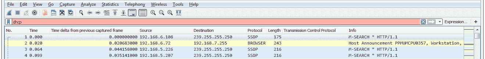

这是因为显示滤镜其实是`bootp`。DHCP 是基于`bootp`的。`bootp`是 DHCP 的前身协议，所以在 Wireshark 中他们使用前身的协议过滤器。因此，您想使用`bootp`。如果我们使用`bootp`，我们将看到我们的 DHCP 版本，并发现:

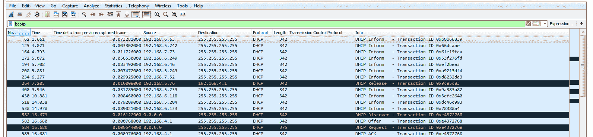

第 264 个包是`Release`。我的系统已经有一个 IP 地址，它想摆脱它。它给 DHCP 服务器发了一个包，是`4.1`，它说:“请去掉我的地址。”如果我们在“packet details”部分查看我们的 DHCP 详细信息，您可以看到它显示引导协议(这就是`bootp`的来源)，我们向下滚动到底部，您会看到选项，如果您查看选项`53`，它显示我们有一个`Release`:

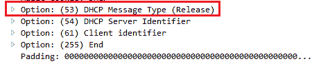

这就是它请求删除地址的地方。此时，系统没有地址，本地客户端从网络接口卡上的信息中删除 IP 地址。

之后，我启动了 DHCP renew 命令，告诉它获取一个地址。现在我这样做是因为我的系统已经启动，并且已经在`bootp`获取了一个 DHCP 地址。通常，系统会在操作系统启动时从 DHCP 服务器检索 IP 信息和其他配置选项。但是由于我的系统已经有了一个地址，我不得不删除它，然后用那个`/renew`命令强制告诉它获得一个新的地址。当一个系统请求一个地址时，它首先发出一个`Discover`请求。您可以看到，discover(在选项`53` `Discover`的数据包详情下方)将其发送到广播`255.255.255.255`。那是因为客户端没有 IP 地址，你可以看到它以`0.0.0.0`为源。

它不知道需要去哪里与 DHCP 服务器对话。因此，它将它发送到一个广播地址，希望有人会响应它对 DHCP 服务器的请求。我们可以看到`Discover`数据包正在请求 DHCP 服务器。它说:“我正在尝试发现一个服务器。”如果您在一个子网上有多台服务器，您可能会不时地获得不同的服务器产品。这有时会导致问题，具体取决于您的网络设计。如果您有一个简单的网络，如家庭网络，并且您有两台 DHCP 服务器，其中一台很可能是偶然的。当人们把无线路由器或类似的东西带到工作场所，而他们没有关闭 DHCP 服务器时，你可能会面临这个问题；会造成这样的问题。

寻找`Offer`包有时在包捕获中是有用的，因为你可能不一定想看到它们；这可能是一件坏事。如果您碰巧从一个根据您的网络设计没有任何意义的服务器地址看到了`Offers`，那么这是一个危险信号。当然，您可以右键单击 DHCP: Offer (2)并转到准备过滤器|所选:

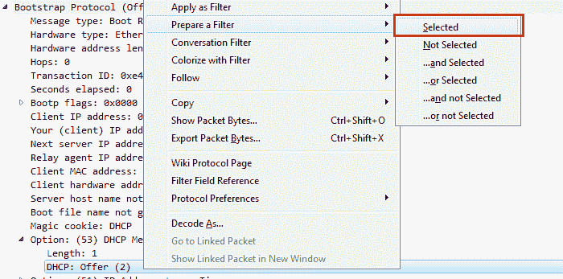

这样，您可以根据`Offer`过滤所有的数据包捕获。如果我们有一大堆来自不同服务器的`Offers`,这可能是个问题。

如果我们回到标准的`bootp`过滤器，你会看到在`Offer`之后，服务器正在响应我们的广播。然后我为我的客户发出一个请求。您可以在选项的数据包详细信息中看到，我实际上是在请求一个特定的地址:

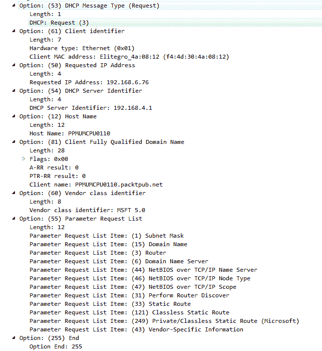

这在刚启动的新系统上通常是看不到的，但是因为我的系统，客户端，已经知道它有一个以前的地址，所以它保存了那个信息，即使它没有在网卡中配置。它请求该特定地址来更新它并将其放回其配置中。您可以看到，现在它也知道了服务器。所以它把它发送到服务器，但它不是来自第 3 层 IPv4 地址，因为它还没有一个；它在请求它。因此，它仍然将它发送到广播。

您可能会在前面的屏幕截图中看到其他选项。这些选项号反映了您可以在 DHCP 中配置的一大堆不同的东西；不仅仅是为了 IP 地址。你会看到这通常与 voiceover IP 电话一起使用，因为你可以传递不同的选项，例如选项`43`，并实际告诉它它需要属于哪个 VLAN，并强制它属于另一个 VLAN。您还可以告诉它 TFTP 服务器在哪里，以检索固件信息和各种不同的东西，您可以发送到设备以自动配置它。这就是为什么他们称之为动态主机配置协议:它不仅仅是为了 IP。如果你想了解更多，你当然可以看看 RFC。

DHCP 的 RFC(记住，这是`bootp`的升级版)是`2131`，你会看到这是一个相当长的文档(【http://ietf.org/rfc/rfc2131.txt】T2):

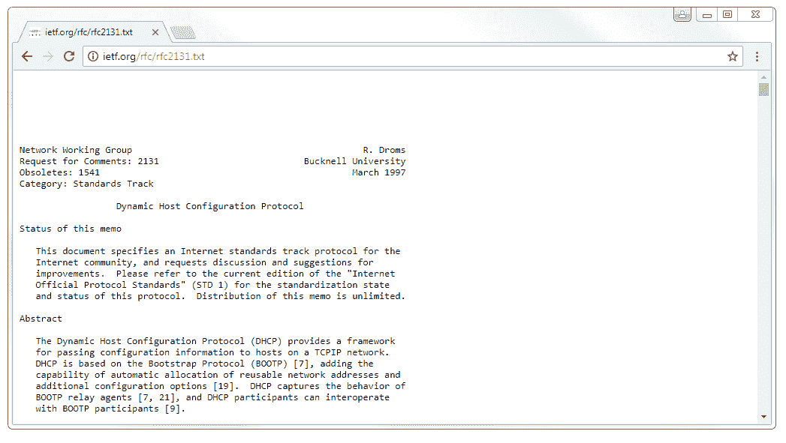

前面的屏幕截图中显示了相当多的信息，它包含了 DHCP 的许多功能。现在，它不会包括每一个选项和您可以配置的每一件事情，因为其中一些是特定于供应商的；当然，自 1997 年以来，DHCP 一直在扩展，增加了附加功能。

我们还看到写有`DHCP Inform`的数据包，这些是我的客户的请求:

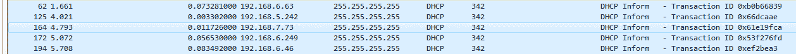

现在它有了第 3 层 IPv4 地址，它正在向服务器请求额外的参数，您可以在数据包的详细信息中看到这些参数。以下屏幕截图显示了附加参数:

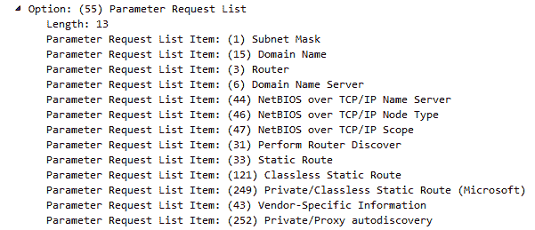

这就是 DHCP 的基本知识。这是一个非常简单的协议。它比 DNS 稍微复杂一点，但是仍然相对简单并且非常有用。有一个 IPv6 版本的 DHCP，以及许多其他寻址 IPv6 主机的方式。接下来，我们将在 *HTTP 分析 I* 中了解 HTTP。

# HTTP 分析 I

在本节中，我们将了解 HTTP 是如何工作的(HTTP 中有哪些代码，数据包中有哪些内容)，源和目的地信息以及其中的一些选项，以及服务器和客户端如何交互并显示服务器和客户端之间的连接。

我们要做的是开始另一个数据包捕获并打开一个网站。在这个例子中，我打开了一个给[https://www.npr.org/](https://www.npr.org/)的网页，这恰好是一个未加密的网站。默认情况下，它使用普通 HTTP，这样，通信就不会隐藏在 TLS 加密之后。这样，我们可以看看 HTTP 头中实际发生了什么。

如果我们向下滚动，可以看到我们有了`www.npr.org` DNS 解析、我们的答案和 TCP 连接的`SYN, ACK`三次握手的开始:

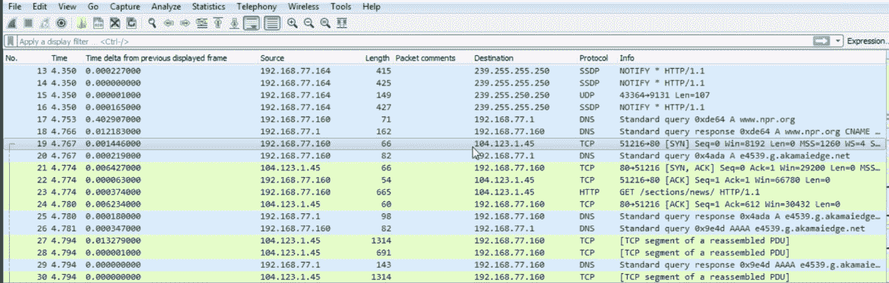

我们还会看到一些`akamai` DNS 解析，这是因为如果我们看一看`www.npr.org`，它实际上是由一些`akamai`服务器托管的，这是一个分布在世界各地的内容分发网络，所以它的响应速度非常快。因此，随着我们的发展，it 必须解决一些额外的服务器。

我们可以看到，我们有一个到实际服务器的初始 TCP 请求，然后我的系统请求`sections /news`，因为我正在打开[https://www.npr.org](https://www.npr.org)/上的新闻部分:

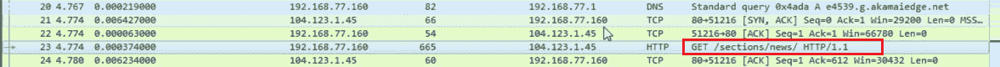

如果我们向下滚动，我们会看到有一个 HTTP 协议和一些 TCP 重组段的东西。这是很多 TCP 和我看不到任何 HTTP。这是为什么呢？这是因为我们在选项中启用了重新组装。如果您正在进行 HTTP 分析，这可能是您想要关闭的。

转到编辑|首选项...|协议| TCP 并关闭允许子分配器重组 TCP 流:

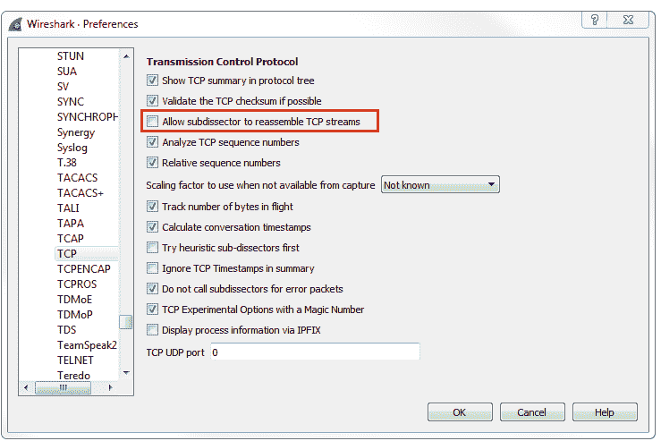

如果您关闭它，您可以看到我们现在对 HTTP 有了一些了解，它实际上显示在 Info 列中，HTTP 流量的来回命令是什么。您可以看到，它们现在会在协议列中正确显示为 HTTP，它会说这是 HTTP 的延续，因为它将所有网站信息从服务器传输到我的客户端。您可以看到，实际上也使用了窗口大小。我们有一个漂亮的大窗口，然后我们有一个数据包列表，然后我们确认:

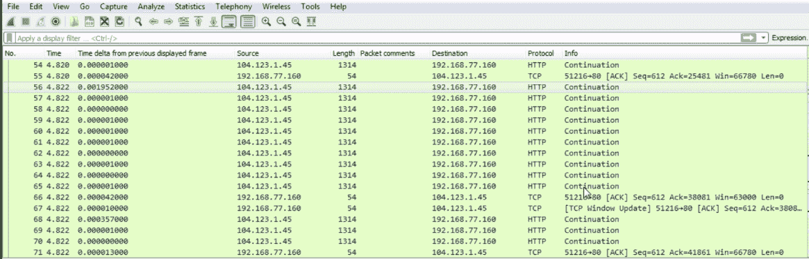

如果我们看一下这里的 HTTP，我的系统`77.160`发出了一个`GET`请求。HTTP 有两个我们使用的主要命令:`GET`和`POST`。一个`GET`请求检索信息，而一个`POST`请求发送信息。因此，你知道如何在某些网站的某些表单中，或者如果你在一个配置文件中对 web 设置进行了更改，你正在向服务器发送数据，告诉它改变服务器上的某些东西:你用`POST`来做。我们正在询问信息。因此，在这个例子中，我正在获取`/sections/news`，并且我正在通过版本`HTTP 1.1`请求它。有一个新版本的 HTTP，最近已经投入使用，它是基于谷歌的 SPDY 协议，这是他们以前创建的。

如果你想了解更多关于 SPDY 协议和它是什么，你可以在维基百科或者 https://www.chromium.org/上看看——他们也有关于这个的页面。它实际上是一个加速流量的实验性协议，后来被弃用，取而代之的是 HTTP 2.0，后者现在已经成为标准。因此，SPDY 中的思想已经被合并到 HTTP 2.0 标准中。

它所做的基本上是优化 HTTP 头信息和通信，以便它可以实现加载网站的速度提高 50%:这非常强大，令人印象深刻。

所以，当你看到这些`GET`请求时，如果你在一个非常旧的系统上使用非常旧的程序，你很可能会看到一些非常旧的客户端的`1.1`，甚至可能会请求`1.0`。但是您现在可能会看到`2.0`请求。现在大概有三分之一的主要网站在使用 HTTP `2.0`，当然，随着时间的推移，这个数字只会增加。所以，我们请求的是`/sections/news`，然后暗示我们请求的是里面的`index.html`页面。因此，我们要求一个文件夹结构。默认情况下，HTTP 会寻找`index.html`或其他几个不同的 HTML 或其他文件格式的文件。服务器有责任提供最先显示的核心页面。

从服务器上，我们可以看到我们有一个对这个`GET`请求的 TCP 确认，然后服务器回应道:“好的，听起来不错。我会把它发给你，因为我已经找到了那一页。”因此，如果你请求一个不正确的页面，你会得到一个错误信息。

在 HTTP 中，我们有不同数量的不同类型的命令。如果您想更深入地了解 HTTP，可以看看 IETF 网站上的 RFC。你在找数字`2616`，那是给`1.1`的。记得我说过有一个新的，`2.0`，出来了，所以当然会有更高的数字。当你浏览标准时，你会看到一堆不同的代码。您将看到一堆可用的代码块，以及其中每个代码的详细信息，但是，如果您看向左侧，您会看到一个状态代码编号。任何是`200`或`300`的东西都是`OK`。所以一个`200 OK`表示“我找到文件了，没问题。”`201`表示“好的，我创建了它。”`202`是一个接受。这些都是好东西。如果你得到一个`300`，这可能是一个重定向或者移动一个文件到其他地方。`400`或`500`是一个错误。因此，`400`是一个服务器错误。所有的 400 号都是服务器错误，说:“我找不到文件。你不允许到达那里”；或者“这是禁止的”；或者“你的方法不被允许”；或者“服务器拒绝你的请求”。一个`500`错误是一个客户端错误，所以你的客户端有问题。当您试图请求一个不存在的网页时，通常会看到一个`404`错误。你会在互联网上看到它，现在每个人都习惯了，但是一个`404`错误是:“我找不到文件。”服务器说:“我不知道你请求的是什么，不是你说的在哪里”，然后它发回一个`404`错误。

如果我们查看数据包的详细信息，进入 HTTP 报头信息，您会看到我们有一个服务器，Apache 这可能还会提到诸如`nginx`或其他正在运行的服务器——Apache 仍然是最常见的服务器。它会告诉你它在运行什么。如果它运行不同版本的 PHP 或 Python 或类似的东西，它会告诉你内容类型是什么。是 HTML 页面吗？是其他类型的内容吗？是 XML 页面吗？有时你也可以进行编码。一些页面和一些服务器允许压缩。因此，他们将使用`gzip`进行压缩，这就像创建一个服务器页面的 ZIP 文件，它将发送回这个文件，这样文件就更小，使用的数据包更少，发送到客户端的速度也更快。这需要服务器或客户端的一点处理能力，但通常是有益的。它还会告诉我们内容长度有多长。

现在我们已经了解了所有这些不同的协议，它们几乎总是会告诉您内容有多长，以便您可以验证是否收到了所有内容。我们也有一个到期和缓存控制。这告诉系统保存一个页面的时间。当您的客户端收到页面时，它将基于此缓存一段时间，以便在再次返回时可以引用其本地缓存。

所以，如果你总是不断地返回到同一个网页，它会从你的本地缓存中加载它，而不是不断地从服务器上获取它，用光服务器上不必要的带宽和资源。如果你不想使用缓存，那就刷新页面。你通常可以按下 *Ctrl* + *F5* ，它会强制浏览器中的缓存删除该页面并请求一个新页面。如果我们展开数据包细节，我们将看到基于行的文本数据；它实际上会向我们显示发送给我们的网页本身:

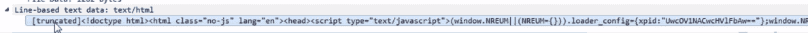

在下一节中，我们将更深入地研究 HTTP，讨论更多的问题，并了解如何解密 TLS 加密的 HTTP 数据 Wireshark 中的 HTTPS。

# HTTP 分析 II

我们将通过再次查看错误消息以及如何解密 HTTPS(现在是 TLS)流量来研究 HTTP 的一些问题。这也适用于 SSL。

我们将从 Wireshark wiki([https://wiki.wireshark.org/SampleCaptures](https://wiki.wireshark.org/SampleCaptures))的 SampleCaptures 部分下载一个示例捕获。转到 SampleCaptures 页面后，转到特定协议和协议系列|超文本传输协议(HTTP):

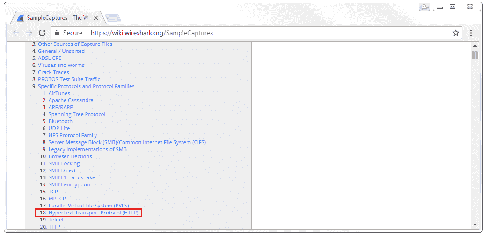

如果您单击它，我们将看到一些基本 HTTP 捕获的列表。底部有一个带解密密钥的 SSL 链接，我们将下载顶部的链接`snake-oil2 070531.tgz`文件。你需要做的就是把它提取出来，这样你就可以得到里面的文件了。

默认情况下，Windows 只能提取`.zip`文件，所以你需要下载类似 7-Zip 或 WinRAR 的文件才能打开它。

当您打开 cap 文件时，您会看到这是一个较旧的文件。这实际上可能是 2007 年左右的某个地方，所以它不是一个`pcapng`文件。但它在 Wireshark 中仍然打开得很好。如果我们看这个，我们看到我们有一个`SYN`；`SYN, ACK`；`ACK`有了 TCP，就有了我们的三次握手；然后我们有一个 SSL `Client Hello`，一个来自服务器的确认，然后是`Server Hello`确认。我们开始交换一些密钥信息来创建 SSL 加密；我们共享密码信息；之后，我们开始对数据进行加密。在这里，我们可以看到我们有一个加密的握手和加密的数据。所以我们有加密的数据，但我们无法得到它。你能看到的我们都有，但对我们来说却是不可读的。如果我们在 SSL 中扩展这些，那只是胡言乱语。那么我们如何看到其中的 HTTP 呢？我们需要解密它，使用 Wireshark，您可以解密 SSL 或 TLS 流量。但是，您将需要来自服务器的私钥，因此如果您没有访问 web 服务器的权限，您就不能这样做。如果你在一个公司网络上，有人正在访问一个加密的公司资源，而你想解密它，这就很好了。那么，您可以访问服务器，这样您就可以检索私钥。如果你想在互联网上做这件事，你必须从托管它的人那里得到私钥。

为了进行设置，我们将转到编辑|首选项...|协议| SSL。您会注意到 TLS 没有列在协议选项中。TLS 属于 SSL，因为 TLS 是在 SSL 之后出现的，并且是建立在 SSL 之上的；这都属于 SSL 协议部分。因此，我们将在 SSL 协议列表中配置我们的 RSA 密钥，即私钥——即使您使用的是 TLS。我们要做的是点击“编辑”...然后用加号来添加新的解密密钥。我们要做的是添加我们服务器的 IP 地址。在这个例子中，它被清理到`127.0.0.1`，这是本地主机；这只是一个环回地址。我们将它定义为端口`443`，因为我们知道这是使用标准端口`443`的 HTTPS 流量，并且我们知道它后面是`http`流量。然后，我们将双击密钥文件部分并选择我们的密钥。你可以看到在提取的文件中我们有`cap`文件，一个`README`和`key`文件。我们将选择`key`文件，然后点击 OK:

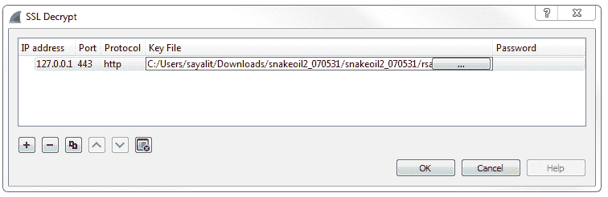

现在，您将看到数据已经自行解密，因此我们不再拥有所有这些 TLS 协议列表。它没有说`Application Data`；它现在实际上向我们显示了 HTTP 流量。我们现在已经解密了。我们仍然有 SSL 协议的东西，因为这实际上是 SSL 流量。它进行握手和交换密码信息，这样它就可以加密；没关系。底部的东西是我们所关心的。因此，现在我们实际上可以为`http`进行显示过滤，我们可以只过滤掉 HTTP 通信。我们可以看到，我们在这个数据包捕获中几乎没有问题。所以，我们有一个`GET`的请求；它收到了来自服务器的响应，说:“我找到了那个文件。”然后他们试图通过 HTTP 获取另外两张图片；他们下载了一些图片:看起来像 Debian 的标志和其他东西。然后，服务器有一个响应，表明没有找到资源。下面是那条`404`消息:

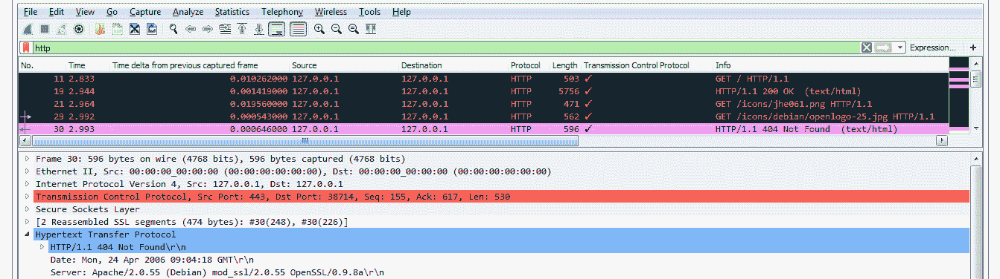

如果我们进入数据包细节，我们可以在 HTTP 选项中看到`404`。你还会看到上面写着“专家信息”。向下到左下方，单击圆圈图标，它将为您提供此数据包捕获中的所有错误:

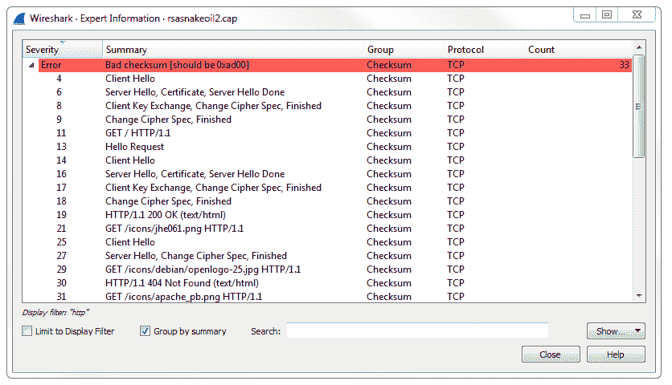

它提取 HTTP 错误以及任何有用的信息。

# FTP 分析

在这一节中，我们将了解 FTP 如何工作，主动模式和被动模式之间的区别，以及如何通过 FPTS 和 SFTP 安全地传输文件。

我们将再次开始捕获，并连接到不使用加密的 FTP 服务器。所以，这个服务器是一个白俄罗斯托管的服务器，上面有一些 Linux ISOs，它允许匿名连接。我将使用`anonymous`登录，我们将使用端口`21`并单击 Quickconnect:

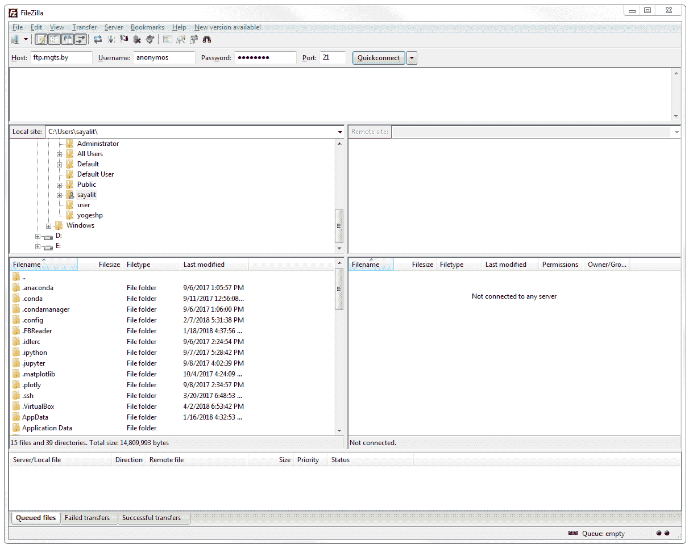

我们可以看到我们已经登录。它声明不使用 TLS，并列出根目录:

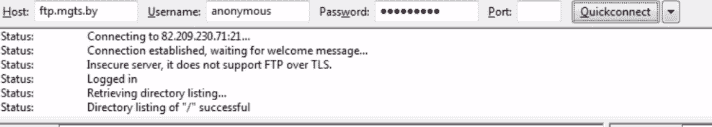

我们要做的是停止捕获，如果我们向下滚动数据包，我们会看到这里有许多其他类型的流量，但我们会看到列出了一些 FTP。我们能做的是创建一个简单的过滤器，里面有`ftp`，它将显示所有的 FTP 流量:

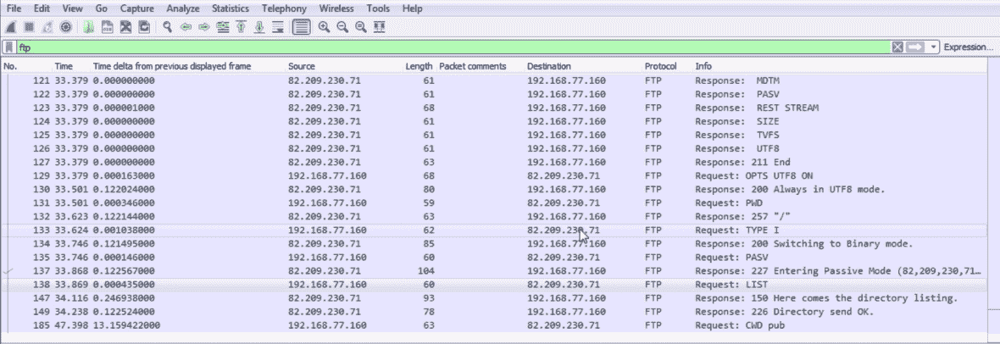

我们可以通过未加密的 FTP 看到连接。您可以看到所有的命令，就像 HTTP 一样。如果我们深入了解数据包详细信息中的 FTP 部分，我们会发现传输的命令非常少:

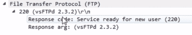

我们在数据包`101`之前的数据包中使用三次握手进行连接。所以数据包`98`、`99`和`100`就是 TCP 握手。然后，它将代码`220`声明为新用户的服务就绪。于是服务器说:“我看到你已经和我建立了联系。给我发一些认证”。我的软件询问它是否能够使用 TLS，这是我们用于 HTTPS 加密的加密方法。服务器回答说:“不，我不能这么做。请用用户名和密码登录。然后我的软件 FileZilla 客户端说:“那么，SSL 呢？”然后服务器回复说:“没有，抱歉。我不这样做”。然后我的客户最终给它发送了一个用户，说:“这是用户命令。我要用匿名登录”。服务器接受了，并说:“请指定密码”。

我用`PASS`命令提供了密码。服务器对此进行了评估，并确定证书是好的，它说:`Login successful`，代码`230`。然后，我的系统询问它是哪种系统类型，服务器运行的是什么，服务器回答说它使用的是 Unix 类型的服务器。然后询问它有什么可用的特性集，服务器回复了一个它能够支持的特性列表。然后它说:“这是我的清单的结尾”。我的客户打开了`UTF8`选项。服务器说:“没问题”。然后我的客户请求**打印工作目录** ( **PWD** )，服务器说:“你在根目录下，`/`目录。这是您所在的第一个目录”。我的客户端改成了二进制模式，也就是 I 型，服务器回应说:“没问题”。然后，我要求被动模式，这是它能够提供的另一个功能。被动模式允许 FTP 通过随机的动态端口进行通信和传输数据。因此，如果您正在查看这里的端口号，我将与服务器和我的客户端进行对话，客户端在本地运行；客户端软件在`52284`运行。它正在与端口`21`上的服务器对话。数据只是命令，必须通过另一个端口。FTP 激活时，数据将通过端口`20`传输，所有命令通过`21`传输。现在这种情况并不常见，因为主动模式很容易被黑客攻击。这不是一个非常安全的方法，因为你确切地知道数据将通过哪个端口传输。因此，如果您在中间，您确切地知道应该查看哪个端口来捕获所有未加密的数据。另一方面，被动模式允许使用动态端口，因此数据本身将通过不同的端口传输。所以，这是对 FTP 协议的增强。现在，最常见的是，您会看到端口`21`用于服务器命令，然后是一个动态端口，实际数据本身的数量在数千个之内。FTP 将命令与不同端口号上的数据分开。并不是每个协议都这样做，例如我们看到的 HTTP，它通常在端口`80`上运行，它在同一个端口上发送命令和数据，不像 FTP。FTP 是一个非常古老的协议。

因此，我们看到服务器的响应，说:“我们正在进入被动模式”。然后，我要求提供我所在目录的列表。记得我问我在什么目录下:打印工作目录。我切换到二进制模式。我说:“还是用被动吧。现在给我一份所有文件的清单”。服务器接着说:“好的，我正在发送目录列表。目录列表已发送，所以这是来自服务器。然后，我要求将目录更改到一个名为`pub`的子文件夹，这时我停止了捕获。然而，我们缺少的是数据。你注意到我没有任何数据。如何使用 FTP 被动模式找到带有动态端口号的数据？您可以通过向显示过滤器添加额外的过滤器来实现这一点。

你可以看到我们有`ftp`，这是命令。如果你也想要数据，你必须输入`ftp || ftp-data`。如果你按下*回车*，现在我们将得到 FTP 流量，以及 FTP 数据流量:

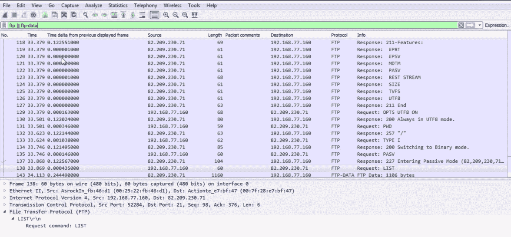

如您所见，我的客户请求列出那个目录，即`root`目录；现在，服务器通过特殊端口发送所有数据。我们可以看到服务器正在端口`54536`上运行，它将转到我在`52285`上运行的客户端。这就是 FTP 主动和 FTP 被动的区别。

现在，还有 FTPS 和 SFTP。如果你注意到，所有的包都是未加密的。我们可以看到所有的命令—登录用户名和密码。这不利于以非匿名模式通过公共互联网。如果您使用用户名和密码，您应该对其进行加密—您应该对您的数据进行加密。您可以使用 SSL 或 TLS 来实现这一点，就像我之前提到的 HTTP，以及许多其他可以使用 TLS 加密的协议。所以，FTPS 是用 TLS 或 SSL 加密的 FTP。这是更标准的方法，使用已经实现的 FTP 协议，然后在其上加密。

还有**安全外壳文件传输协议** ( **SFTP** )。SFTP 运行在一个不同的港口；它通过端口`22`运行。因此，在这种情况下，您实际上想要基于`ssh`进行过滤，因为 FTP 流量是通过 SSH(安全的 shell 端口)传输的；所以，你可以使用`ssh`作为你的过滤器。显然，这张截图中没有，但它可以作为过滤器使用，所有流量都会经过它。但这一切都是加密的——就像加密的 FTPS 一样——你需要服务器私钥来解密它，就像你在上一节看到的 HTTPS 一样。请注意，有两种安全传输文件的协议，它们是不同的。FTPS 使用标准的 FTP，但用 TLS 或 SSL 加密。SFTP 是它自己的动物；它有自己的协议和应用。SFTP 是完全独立的，它通过 SSH 运行文件传输。

在本节中，我们讨论了 DHCP:该协议如何工作，以及如何查看其中的一些选项。

# 摘要

我们研究了 HTTP，包括未加密方式和加密方式，以及如何解密。我们还讨论了各种风格的 FTP:主动模式、被动模式，以及 FTPS 和 SFTP 的加密风格。

在[第 9 章](adcf3f45-7cd9-435e-9f82-8fc29b99ad39.xhtml)、*应用协议分析 II* 中，我们将继续介绍一些您将会遇到的其他应用协议。