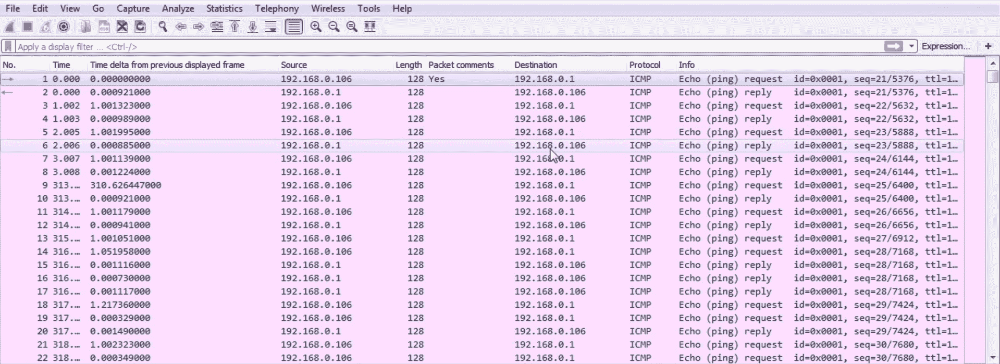

# 九、应用协议分析 2

在本章中，我们将讨论以下主题:

*   电子邮件分析，包括 POP 和 SMTP
*   802.11(或无线和 Wi-Fi)分析
*   IP 电话的 VoIP 分析
*   VoIP 回放捕获的流量，以便能够听到流量中可能出现的问题

# 电子邮件分析

在本节中，我们将了解 POP 和 SMTP 的用途，并研究 POP 和 SMTP 中的通信，了解一些代码是什么；它们是否成功，或者错误代码，或者类似的东西。

现在，我们有三个主要协议用于互联网上的电子邮件:

1.  购买凭证（proof of purchase）
2.  简单邮件传输协议
3.  **互联网消息访问协议** ( **IMAP**

这三者由客户端使用，例如移动设备或运行在计算机上的软件；某种独立的应用，如雷鸟或 Outlook。例如，如果您使用 Outlook for exchange，还有其他协议，但主要是，如果您使用通用应用，并且以通用方式访问您的电子邮件服务器，您将使用这三种协议中的一种。

我们将重点讨论 POP 和 SMTP。

# POP 和 SMTP

POP 用于从邮件服务器检索电子邮件。SMTP 用于向邮件服务器发送电子邮件，以及在邮件服务器之间发送电子邮件。如果您想了解有关 POP 和 SMTP 的更多信息，请查看这些 RFC:

*   RFC `1939` for POP，可以在下面的截图中看到([https://tools.ietf.org/html/rfc1939](https://tools.ietf.org/html/rfc1939)):

*   SMTP 的 RFC `2821`，你可以在下面的截图中看到([https://tools.ietf.org/html/rfc2821](https://tools.ietf.org/html/rfc2821)):

在前面的屏幕截图中，您将看到有许多命令在客户端和服务器之间传输，以传达它们想要在连接中完成的任务。就像我们看到的 HTTP 和 FTP 以及其他一些协议一样，有一种公认的语言用于执行某些事情。我们将在数据包捕获中了解这一点。

现在，在现代使用中加密你的数据是很常见的，尤其是现在的电子邮件，所以 POP 通常用 SSL 或 TLS 加密。你也可以用 SMTP 或 IMAP 做同样的事情:你现在可以用 SSL 或 TLS 加密所有这些协议。这是一个未加密的通信，因此我们可以查看所有来回传递的命令。

我们在数据包捕获中看到的是，我们在开始时为 TCP 进行了三次握手；POP 通过 TCP 传输。然后我们有我们的流行沟通以及一些感谢，然后是`FIN`结束。

有一个针对流行音乐的过滤器。您可以右键单击您的协议并将其作为过滤器应用；或者您可以简单地输入`pop`，这将过滤您的流量:

但是，如果您注意到，我们已经丢失了开始和结束时的握手信息，并且数据之间的一些确认数据包现在已经被删除，因为它们不是 POP 的一部分。它们是 TCP 确认和握手。因此，如果您确定正在使用的地址或正在使用的端口，并最终以此进行过滤，而不是以`pop`作为显示过滤器，可能会更好。所以我们有三次握手。我们有我们的客户端和服务器。客户端正在请求连接。服务器说:好的，没问题。客户接着说:好的，我承认联系；我们有三次握手。之后，服务器会回应说:好的，我们已经连接到 POP3 了。服务器准备好了；你可以在包的细节中看到。

如果我们扩展我们的邮局协议，我们会有更多的信息。它说服务器准备好了:

所以这是一个好消息。然后，客户端传递它的用户，您会看到，因为这是未加密的，所以用户是明文的:

我们将`USER`命令传递给服务器。服务器回应说:好的，用户名好。请给我发一个密码。然后我们发送一个密码。同样，这是未加密的，所以是明文。你可以看到很容易就能确定发生了什么。我们有命令，它们被命名为`USER`、`PASS`和`OK`。服务器回复说:好的，邮箱已经打开了。谢谢你的证书。您有一封未读邮件。然后，客户端向服务器请求一些状态；服务器用状态消息进行响应。然后我们得到一个惟一的 ID 列表，然后客户端要求一个列表。在前面的截图中突出显示的是邮箱中所有内容的列表。邮箱扫描完成，它把数据发给我们，数据是邮件数和字节数。客户接着说:好吧，让我们检索消息号`1`。服务器然后说:好的，这些是你要求的八位字节。

您可以在数据包的详细信息中看到这一点；我们不仅有`octets`的编号，还有实际的电子邮件本身，其中包括邮件头信息；发送和接收的信息；`From`；`To`；`Subject`；`Date`；然后是电子邮件本身的实际数据:

如您所见，数据随后继续，如下面的屏幕截图所示:

因此，第一个数据包基本上是以数据开头的报头信息，然后数据继续。然后，我们确认数据包。我们一直在检索数据，然后客户端说:删除消息。我们已经下载了电子邮件；现在删除消息。这是一个可以改变的选择。

你可以告诉你的客户在服务器上留一条信息，但传统上是这样做的，这样你可以在本地下载，然后从服务器上删除。

如今，通过我们基于网络的电子邮件，或者如果你正在使用 Gmail 或雅虎！或者类似的事情，我们现在通常把所有东西都留在服务器上，并在那里存档。但这是一个非常古老的协议，所以它是基于本地存储的。

服务器回复说它删除了消息，然后我们退出连接并关闭。

它说:好的，再见。最后，我们关闭了与`FIN`和`ACK`系列的 TCP 连接。

现在，让我们来看看 SMTP。SMTP 用于在客户端和服务器之间传输电子邮件，以便将其发送给路由收件人:

我们在这里看到的是用户为 SMTP 创建 TCP 连接的一系列`SYN`和`ACK`，然后我们看到来自服务器的 SMTP 响应。当然，我们有`SMTP`列在协议栏里。我们可以通过简单地输入`smtp`进行过滤:

就像使用`pop`一样，我们会丢失一些来自 TCP 的信息，所以基于`ip`和`port`进行过滤可能会更好。

嗯，我们在前面的截图中看到，在来自服务器的三次握手之后，`128`地址用一个`220`进行响应:

响应代码是服务就绪，这意味着一切都好。这对 POP 和 HTTP 来说很熟悉。

这些协议中的许多协议，尤其是较旧的协议，使用这些不同编号的响应代码。就像 HTTP 一样，`200`系列响应代码是好的。所以我们看到一个`220`，一切都准备好了。我们也看到我们有`ESTMP`。这是针对 SMTP 的增强版本。就像 POP 和 FTP 一样，SMTP 是一个非常古老的协议，多年来一直在扩展和增强。有一个新版本的 SMTP，它使用新的命令传输，在前面有一个`E`:

然后，客户端发送一个`EHLO`，它是传统原始协议的增强版本`HELO`，用于创建连接。服务器响应`HELO`请求并创建一个连接。然后我们确认这一点，然后服务器用它能做什么的列表来响应。它有一些特性，我们看到它有流水线技术:

管道是服务器中的一个选项，它可以接受多个命令，而不必等待每个命令，因此我们的客户端可以一次发送许多东西，而不必等待。我们的客户然后说，它将创建一个电子邮件消息；如果你注意到，它说:

实际上，还记得我们查看 POP 消息时，有一个`From`和一个`To`和一个`Subject`，以及实际的正文字段吗？正如您在 POP 请求中看到的一样，您在 SMTP 中也看到了。因此，我们有前置的命令`MAIL`，但是你看到的是`From`和电子邮件地址，就像你在客户端软件中打开它时看到的一样。我们正在用命令写一封电子邮件。电子邮件本身并不像数据包那样被打包成一个小文件发送到服务器。这已经足够古老了，以至于我们实际上是在 SMTP 中一行一行地制作电子邮件命令。所以我们说:我们正在创建一封电子邮件，它来自下面的人。服务器说:好的，看起来不错。`RCPT To`表示，因此我们将它发送给以下人员。服务器说:好的。然后我们说:这里有一些数据(数据是我们消息的主体):

服务器回答说:好的，当你完成了邮件的时候，在邮件的末尾加上下面的命令让我知道。然后，客户端在这里提供一些它希望包含在正文中的实际电子邮件数据的数据包。看到一些与此相关的附加数据包了吗？我们从服务器得到一些对这些数据包的确认，然后从服务器得到一个响应，说消息被接受，它将把它发送给一个接收者。

我们承认这一点，并告诉它:好了，我完成了；我们退出了 SMTP 连接:

然后我们用一些 fin 和 ack 完成 TCP 连接；我们最后也有一些明确的重置，那就是我们连接的终止。

# 802.11 分析

在本节中，我们将了解无线连接问题以及它们在 Wireshark 中的表现。

标准已经存在很长时间了。你可以在 http://ieee802.org/11/Reports/802.11_Timelines.htm 找到更多信息:

它最初开始于 1997 年。您可以在前面的截图中看到，这是它被批准的年份。它实际上始于 1991 年。从那以后，它发生了很多变化，包括一些人可能还记得的`802.11a`。我们有`802.11b`、`802.11g`等等。随着时间的推移，你可以看到有多少种不同口味的`802.11`。现在，还没有全部用于正常的家庭网络或办公网络；其中一些是 WiMAX 等长距离或低功耗的专用版本。你可以看到我经历过的所有版本都被一个更新的版本取代了，这些更新的版本在最上面:

这些是批准的标准。你可以看到，尽管`802.11a`和`b`以及`g`和`n`仍然受到硬件的支持，仍然受到操作系统的支持，但实际标准是，例如，对于我们正在谈论的这个版本，`802.11ac`。所以`ac`实际上包含了`ac`标准、`n`、`g`、`b`、`a`等等。你可以看到这里还有其他版本的`802.11`，比如将用于所谓的`TV White Space`区域的版本。因此，这些是可供 FCC 潜在使用和重新排序的带宽部分。我们还有一些附加的，是建议标准，比如`ah`和`ai`。此外，还有其他所有这些技术，它们为我们提供了更长距离、更高速率的额外连接方法，诸如此类。所有这些都可以在 IEEE 网站上找到，你可以在 http://ieee802.org/了解更多。

Packt 有许多与无线相关的书籍和视频课程，您可以看看并继续您的无线网络教育。

下面是一个设备捕获数据包的示例，该设备可以捕获`802.11`帧并将其提供给 Wireshark:

这通常是通过无线网卡实现的，无线网卡不仅能够启用混杂模式，还能够启用监控模式，以便查看我们使用的所有不同通道的所有数据。此外，还有频谱分析仪，如 Wi-Spy 和其他可以连接到笔记本电脑或类似设备的加密狗；你可以四处走走，研究一下光谱分析方面的东西。

我们正在研究数据包捕获，但请记住，它不仅仅是数据包捕获。无线带来了一系列额外的问题，如信号强度和与其他设备的干扰。但是看一下实际数据，它实际上显示的是以太网。当我们捕获它时，它看起来像以太网，这是故意的；标准是它应该看起来像以太网，但是通过无线连接而不是有线连接。那是为了让我们的生活更轻松，更交叉兼容。

我们在捕获中看到的是，我们将协议列为`802.11`，因此 Wireshark 知道这是一个`802.11`捕获。这是一个`802.11`框架，它是一个`Beacon frame`:

我们看到有`Beacon frame`和一些旗帜。我们有一个`Frame Control Field`。我们有`Receiver`和`Destination`；它看起来非常类似于您在有线网络的第 2 层所期望的。您有一个 from 和一个 to MAC 地址，还获得了一些附加信息:一些附加标志，等等。现在，当然，这里有一些其他选项让它在无线上工作，例如我们的`BSS Id`:我们连接到什么设备，我们连接到什么接入点；还有这是哪种帧，因为`802.11`里有不同种类的帧:

当然，我们有自己的帧校验序列，就像标准以太网一样。

现在，什么是信标帧？接入点通常每 100 毫秒发送一次信标帧，以便向所有监听设备声明它正在提供以下网络；它是信标；并且它可以支持以下网络名称。您将在无线捕获中看到大量信标帧。它们经常发生。如果你没有经常看到它们，那么这就是一个潜在的问题。现在，如果您想要过滤，或者如果您的数据包捕获中包含其他错误数据包和其他帧，或者如果您只想过滤您的无线流量，您可以使用`wlan`过滤器:

如果您使用`wlan`，这将包括所有的`802.11`协议帧。你可能还想做的其他事情(让`wlan`过滤器开着)是不显示信标帧。让我们说，你知道一个事实后，通过寻找事情，信标帧是一致的，一切都很好；那我们就不用担心他们了。

我们要做的是右键单击数据包详细信息中的信标帧，然后转到应用为过滤器|未选择:

这样，我们就选择了所有的无线局域网帧，而不是任何信标帧。这真的减少了我们的捕获:

现在，我们只看到探测请求、响应和一些数据。

说到信标，这里有一个捕获大量信标的例子。一切都只是不断的信标，信标，和无处不在的信标:

无线网络中可能出现的一个常见问题是由于接入点出现某种问题而导致信标丢失。这可能是信号强度问题，也可能是设备固件、坏天线等问题。什么都有可能。但是信标下降会导致客户端断开与无线网络的连接，因为它们认为无线网络已经消失。因此，前面截图中显示的捕获包括信标问题，但我们并没有真正看到任何明显的弹出内容。没有什么是亮红色的，突然出现在我们面前；真的没有变化；都是一致的。那么我们如何看待这个问题呢？

记得回到统计的部分。现在，转到我们信标上的统计| I/O 图表:

我们可以看到绝对有一个下降，这表明我们的接入点有问题:

在进行无线故障排除时，请务必使用绘图功能，因为由于它通过无线电波传输的特性，有许多变量是我们无法控制的。我们需要做更多的可视化工作，以了解发生了什么，特别是当你有成千上万个这样的帧，并且其中存在问题，但你不知道问题在哪里，以及具体到什么程度。使用绘图对你会有很大的帮助。

此外，我们有一个显示信号问题的捕获:

所以，我们来做一个`ping`。我们有`(ping) request`、`(ping) reply`等等。现在只需向下滚动截图，看看是否发现任何奇怪或明显的问题。

当我们滚动浏览时，我们可以看到所有的`Echo (pings)`:重复请求和回复。你发现什么问题了吗？有一个非常明显的问题。

当我们滚动浏览时，请注意这样一个事实:我们有如此多的请求，却很少有回复。这是一个非常明显的问题。如果我们进入专家信息，我们可以在警告中看到，它说没有看到对 ICMP 请求的响应:

当然，您知道，当我们点击每个请求时，它会向我们显示沿途的每个数据包。我们有所有这些没有收到回复的请求，但是您在捕获中没有看到任何其他问题。

请记住，ICMP 不像 TCP 那样提供任何类型的有状态连接，因此我们不会收到任何表明确实存在任何问题的响应。我们只是尝试，失败了，我们只是一遍又一遍地尝试。因此，能够看一看捕获中有什么，甚至只是滚动它，看一看模式看起来像什么，可能是有用的，因为我们真的没有太多其他的东西可以继续。

当然，您也可以绘制出这两个图，一个是请求图，一个是回复图，您可以看到它们在 I/O 图中可能不匹配。这表明存在信号问题，所以我们在这里看到的是一些数据包成功了，而一些没有。然而，在捕获过程中，它不会告诉我们任何地方的信号强度。我们必须根据我们掌握的信息来确定问题所在，从这个角度来看，这看起来像是一个信号问题，因为我们有数据包丢失。现在，在测试设备上，您很可能会在您的命令窗口中看到，在接下来的 ping 尝试中，有如此多的数据包丢失。在驱动程序中，您可能会看到无线信号很弱。你也可以从其他角度来看这个问题，但是如果你只看 ICMP 的一个纯粹的数据包捕获，这就是问题的一个例子，比如一个低信号问题。

无线是一个非常深入的大话题，如果你最终打算支持它，并且这是你有兴趣做的事情，我强烈建议你花时间通过一个完整的无线课程或一系列的书籍来学习它。

关于如何在 Wireshark 中查看它以及在 Wireshark 捕获中某些东西可能是什么样子的简短视频或书籍是有用的，但无线方面还有更多内容，因为我们使用无线电波和信号强度等。因此，强烈建议走出去，学习更多关于无线的知识，以便了解事情在幕后是如何工作的。

# VoIP 分析

在这一节中，我们将了解在两部电话之间建立连接时 SIP 是如何工作的，以及 RTP 是如何在两部电话之间传输实时数据的。

我们将在本章和下一章使用的示例捕获可以在 Wireshark SampleCaptures 页面([https://wiki.wireshark.org/SampleCaptures](https://wiki.wireshark.org/SampleCaptures))上找到。如果您向下滚动并查找 SIP 和 RTP 部分，我们将使用 MagicJack+简短测试呼叫:

下载 MagicJack+ short test call 并在 Wireshark 中打开它。

一旦你打开了，我们将看看我们的捕获，并注意到我们有各种各样的包；它还没有被清理:

我们可以看到有一些 ARP、一些 UDP 流量、ICMP、一些 SIP 和一些 RTP 我们最后也有一些 SMB。所以有各种各样的东西。这就像一次真实的抓捕。为了挑选出 SIP 流量，这是众多协议之一，但也是 VoIP 最常用的协议，我们只需输入`sip`作为我们的显示过滤器，并应用它:

还有许多其他协议也在使用中，例如 Skinny，这是思科网络非常流行的一种协议，但标准协议是 SIP。SIP 的作用是在两台设备之间建立连接。如果你看下面截图的左手边，可以看到时间栏。我们还有`159`秒。所以，我们这里有一系列的连接尝试。这一切都非常快，非常在同一时间框架内。然后，我们有另一个包:`166`秒，然后我们有另一对 170s。需要注意的是，我们遗漏了一些数据。

如前所述，捕获也包括一些 RTP 流量。实际情况是，SIP 在两台设备之间建立连接。然而，实际数据，即视频流量或语音流量(无论是什么)，是通过实时协议 RTP 在两个设备之间直接传输的。因此，如果我们在 SIP 上过滤，我们将看不到它。我们需要做的是将`rtp`加到这上面，这样就可以冲掉一些我们在这里丢失的时间框架。

为此，我们将键入`sip || rtp`，您可以看到我们现在已经创建了与 SIP 的连接:

如您所见，我们有 RTP，这是语音流量的传输，然后我们在底部有一些 SIP 再见命令。就像我们谈到的其他协议一样，它们在 SIP 中使用状态代码，就像其他许多协议一样。所以，我们有 400 系列，这是一个问题；我们有 100 系列，这是成功的；还有一些其他的命令。

如果你想了解更多关于 SIP 的知识，看看 RFC 3261，它给了你一个关于 SIP 如何工作的详细分析([https://tools.ietf.org/html/rfc3261](https://tools.ietf.org/html/rfc3261))。

我们在前面的捕获中看到的是一些连接，然后是一些实际发送的数据流量。这实际上是一个非常好的捕获，因为它向我们展示了一个问题和一个解决方案。

之前，我们讨论了状态码。在这里，我们有一个`Status: 100 Trying`:

我们有一个本地设备，看起来像某种电话，试图创建一个 SIP 连接到 magicJack。它提供了一个`INVITE`命令，说:请邀请下面的设备加入连接。并且这是被发送到`216.234.64.8`地址的；它正被发送到 magicJack SIP 服务器。SIP 服务器处理一部电话和另一部电话之间的连接，然后一旦连接建立，它就脱离通信。它不充当代理并传递所有数据流量，它只创建连接。所以我们可以看到这里有`216.234.64.8`。我们的设备正在向它发送一个请求，说:邀请以下电话号码。试着称呼它。服务器回复说:好的。我要去试试，但是你没有被授权。

然后我们有第二个请求:

电话再次呼叫服务器并说:请邀请以下号码。试图称之为。服务器回复说:好的。我正在尝试。我要打电话了。然后我们成功了，这给了我们一个`Session Progress`。

如果我们展开 SIP，我们可以看到会话进度:

所以，我们成功了。

然后，我们有关于呼叫来自和去往谁的附加数据，以及正文中的内容:

然后，您可以在正文部分看到:

这里我们有媒体描述，名称和地址(m):音频；哪个端口正在使用 RTP。因此，我们在 SIP 中定义，我们将使用 RTP 在消息头中定义的两个设备之间传输音频流量。

一旦连接建立，我们看到我们的本地电话，这个`192`地址，现在连接到一个不同的公共地址；请看最后一个二进制八位数:

我们还看到我们正在使用`G.711`，这是编码方案。有许多不同的编码方案:其中一些质量更好，但带宽更高；有些带宽较小，质量较低。至于你想用哪一个就看你自己了，不过`G.711`是很常见的一个。

在 RTP 信息中，我们可以看到我们有一个有效载荷类型:ITU-T G.711 PCMU (0):

ITU 是另一个标准组织，就像 IEEE 和 IETF 一样。它们定义了某些协议和编码方案，如`G.711`。然后，我们在两个设备之间直接传输一大堆数据包，全部使用 RTP。然后，在底部我们有一个终止连接的连接请求，所以有一个再见:

然后，我们有一个状态`OK`，说我们终止连接。我们可以做的是在电话统计区域查看这些信息。

您可以在 Wireshark 的这一部分找到任何您想了解的 VoIP 流量信息:

两个最值得一看的地方是 VoIP 呼叫或 SIP 流；这真的取决于你想进入哪一个。但如果我们进入 VoIP 通话，我们会看到这是一个电话:

如果我们在一次数据包捕获中同时发生了一系列电话呼叫，它们会在一个漂亮的图表中显示出来，并且会显示它们开始和停止的时间、谁发起了连接、来自和去往谁、它们使用的是什么协议等等。我们可以做的是选择它，然后转到流程序列，我们可以看到一个很好的图表，其中显示了本地电话上的本地端口、SIP 服务器上的远程端口以及实际设备上使用的端口:

您可以看到有三台设备在使用。所有的 SIP 流量(请看`Comments`的右边:你可以看到使用的是什么协议)都流向了中间人。一旦连接建立，我们就有了 RTP 流量。RTP direct 上这两个设备之间的实时音频流量。然后，当我们想要终止连接时，我们发送一个再见，然后一个 ok 来确认，我们已经终止了 SIP 连接。但是，请记住，它发生在控制服务器，SIP 服务器上。这是一种非常好的方法，能够诊断电话中发生的事情，如果您在 SIP 连接方面遇到问题，通过某种 VoIP 提供商，看看这个并告诉他们发送了哪些命令以及收到了哪些命令，对于故障排除人员诊断发生了什么非常有帮助。他们可以将我们看到的与他们看到的进行比较，这非常有帮助，尤其是命令`100 Trying`；`200 OK`；`ACK`；还有`BYE`。

相比之下，我们可以看一下统计|流程图:

我们之前已经讨论过了:

你可以看到流程图看起来有点复杂。您仍然可以从中获得一些相同的信息，但是由于它是针对每个包的，所以查看起来更加困难。使用另一个流程图总是更好。尽管我们可以通过从 Show 中选择选项 displayed packets 来解决这个问题，但它仍然是针对每个数据包的。所以如果你只是在说基本的连通性或者基本的流程，另一个流程图更好。如果你需要更多的细节，你可以看看这里。

您还可以查看电话| SIP 统计数据:

SIP 统计将为您提供不同请求的不同发生次数的计数:

还记得正在使用的不同代码吗，就像 HTTP 和 FTP，以及我们看到的所有其他代码？同样的事情在这里，它会给我们一个计数，某些事情发生了多少次。这是 SIP 响应，然后我们有 SIP 请求；您会看到有两种确认，一种是再见，另一种是未授权，如果您有一个包含一系列问题的长数据包捕获，您可以看看这个，当然，您可以根据您的计数进行排序，看看哪些是最常见的。如果您看到一堆 400 或 500 个错误，这可能是您需要调查的问题。

就像 SIP 流一样，我们可以看看 RTP，它是音频流量，实际的语音流量，除了 SIP 流之外，我们还可以看看 RTP 流:

还记得我们有一个从手机到 magicJack 手机的连接吗？我们在双向设置中看到了这一点。因此，我们有从电话到 magicJack 的连接，然后从 magicJack 回到电话。而这两个都是 RTP 有效载荷是`G.711`，就像我们之前说过的。它还为我们提供了一些关于抖动的有用信息。抖动是一个非常有用的统计数据。抖动越低，对语音流量越有利。任何类型的数据包丢失(这也是前面显示的一列)；任何一种抖动。或任何延迟:这些都是语音流量的主要问题，无论是任何类型的实时流量:视频流量、语音流量等等。

抖动是不同数据包之间的延迟差异，从一个数据包到另一个数据包有很大的波动。你可能会有很多音频质量问题，因为数据包在不同的时间到达，并在软件中混在一起。在这种情况下，你可能会有一些数据包丢失，所以你会丢失某些单词，这时你就会开始遇到奇怪的噼啪声问题；你丢了话；你可能一边完全不说话，另一边能听见。当你有很多抖动或数据包丢失时，你可能会遇到各种奇怪的问题。在本节中，我们研究了使用 SIP 和 RTP 的一些 VoIP 流量，以及如何过滤这些流量，以及如何查看一些统计数据和流量图。

# VoIP 播放

在这一部分，我们将重建和回放 VoIP 呼叫，并听取质量问题。

我们要做的是使用与上一节中使用的相同的 magicJack 调用。

Wireshark 真正伟大的特性之一，除了它可以创建的众多过滤器、统计数据和图表之外，就是它能够回放语音流量。如果你是一个最终用户，有些人可能会觉得这有点令人毛骨悚然，你可以监听别人的电话，但这是数据。就像我们可以来回读取所有这些命令一样，如果用户名和密码未加密，我们也可以读取它们；如果 SIP 流量也是未加密的，那么我们也可以监听电话，只是因为它是标准数据；只是刚好是语音流量。我们可以在 Wireshark 中轻松做到这一点。

为了做到这一点，我们打开了我们的电话。我们只需进入电话| VoIP 通话，然后选择通话:

选择通话后，点选播放串流。当您点击它时，您会看到一个直方图，准确显示语音通话的内容:

一旦你习惯了某些事物的样子，单凭这一点也许就能告诉你正在发生什么。如果是电话在响，或者是真实的话语和讨论，你可能只需要看前面截图中的柱状图就能分辨出来。然后，当然，你可以选择一边或另一边来引起你的注意，这样你就可以看到这些通道中的一个或另一个可能会发生什么，无论是从一部手机到另一部手机的源到目的地还是目的地到源。我们可以做的是，让一切保持默认状态，然后单击“play”按钮。

你可以听到电话铃响，然后它说`Test, 1, 2, 3`。

你会看到它回放了电话的音频。它回放了电话呼叫的两个方向，所以我们听到了发送方和接收方的声音。所以，我们首先在顶部看到的是对话的一面，下面是对话的另一面。这非常有用，能够同时听到通话双方的声音。这样，如果一个用户在抱怨什么，而另一个没有，你实际上可以听到，就好像你同时把两部电话放在双耳上。

你还可以调整播放器中的抖动，听听它听起来像什么，可能会出现什么样的问题。

现在，你会注意到前面的图是实时的，当音频播放时，你会看到回放线穿过。这是一个相对干净的捕获。如果捕获过程中出现任何问题，它们都会显示在这张图上，当您更改抖动缓冲等内容时，您会看到这些问题开始出现。所以我们要做的是把它降到非常低的水平，比如说`5`:

您已经可以看到，我们创建了一些静默，以及一些额外的错误。如果放大，我们会看到一些抖动下降，实际上我们在连接中制造了一些问题:

如果你缩小得足够远，你会看到最初的铃声出现了，这是以前不在屏幕上的:

既然我们已经在数据包捕获中插入了所有这些问题，让我们继续播放它。

你可以听到电话铃响，它说`Test 1, 2, 3`。

这一次你应该能听出区别。在电话通话的开始，我们听到了一点噼啪声。当电话响的时候，我们也有一些丢弃的数据包；你可以听到它有点劈啪声，听起来不太好。开始时的声音也有一些词被省略了。此外，一方完全沉默。如果你记得看直方图，在测试 1，2，3 中每个单词都有一个副本。一方现在完全沉默了；它放弃了所有这些，现在完全错过了，因为抖动中有太多的问题。所以这是一个很好的工具，可以用来重现不同的问题，听听他们在现实生活中的真实声音。

# 摘要

所以在这一章中，你已经学习了一些使用 POP 和 SMTP 的电子邮件分析。我们还了解了`802.11`，它是无线的，数据包捕获中的某些东西是什么样子，以及为了正确诊断无线，您需要在 Wireshark 中所能做的事情之外做额外的故障诊断。我们还研究了使用 SIP 和 RTP 的 VoIP 分析，创建连接，然后将音频数据直接从一个设备传输到另一个设备。然后，我们还使用 Wireshark 中的内置工具进行了回放，并对其中的一些抖动设置进行了处理，以便重现问题，并能够听出问题的声音。

接下来是第十章、*命令行工具*，我们将使用一些命令行工具来扩展 Wireshark，并讨论一些您可以添加到它的增强功能。