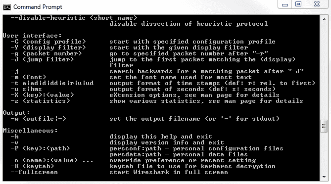

# 十、命令行工具

在本章中，我们将了解以下主题:

*   从命令行运行 Wireshark
*   运行 tshark
*   运行 tcpdump
*   移动瓶盖

# 从命令行运行 Wireshark

在本节中，我们将了解如何从命令行运行 Wireshark，并探究一些命令行选项以及如何使用它们。我想做的第一件事是打开一个命令提示符，然后我们将浏览 Wireshark 的位置。除非您的系统变量中有 Wireshark，否则您无法简单地键入`wireshark`并拥有该功能。

所以我们要做的就是找到它的位置。在我的系统中，它在程序文件和`wireshark`目录中。如果我们键入`dir`，我们将看到`Wireshark.exe`，以及我们稍后将讨论的一些其他工具，例如 tshark:


我们要做的是运行`Wireshark.exe`；然后，如果你按下*回车*，它将打开 Wireshark，就像你点击图标一样。如果您键入`Wireshark.exe -h`，它将提供 Wireshark 可用的所有变量和参数的输出:



如果我们向上滚动，我们将看到我们正在运行的 Wireshark 版本，以及我们可以使用的所有变量和参数的转储:


您会看到它们被分成以下不同的类别:

*   `Capture interface`
*   `Capture stop conditions`
*   `Capture output`
*   `Processing`
*   `User interface`
*   `Output`
*   `Miscellaneous`

您最想做的第一件事就是设置 Wireshark，使用您的默认接口，即您的标准本地连接有线接口来运行捕获。您应该看到您将使用`Wireshark -i`和接口来完成它。上面写着接口名或者`idx`。现在，如何确定接口名称或`idx`是什么——接口的索引是什么？这可以用`-D`来完成，它打印接口和出口的列表。现在，我们将运行`Wireshark.exe -D`。

请注意，大小写很重要。

我们看到在下面的截图中，我们有索引号。那就是 idx: `1`、`2`、`3`、`4`、`5`。在该接口的唯一 ID 之后，我们有名称，例如`Local Area Connection`、`VirtualBox Host-Only Network`，以及我系统上的其他内容:


然后我们可以执行`Wireshark.exe -i`，然后是姓名或 idx 号。我们将使用索引号，因为它又好又短，可以防止任何额外的打字错误。我们就打`Wireshark.exe -i 1`。只需按下*回车*，你会发现它其实没做多少事。这是因为我们已经打开了 Wireshark，默认情况下，Wireshark 会打开主屏幕。主屏幕实际上还不需要做任何事情，所以，它不需要。您没有开始捕获；你什么都没做。你只要打开它。现在，您可以看到它确实选择了第一个接口，但它并不那么有用。让我们关闭它，我们将告诉 Wireshark 使用我们定义的接口，在它打开的一秒钟开始捕获。我们可以用`-k`来做，上面写着`start capturing immediately (def: do nothing)`。它只是打开了 Wireshark 接口。我们将使用`-k`。键入`Wireshark.exe -i 1 -k`，它将立即在该界面开始捕获。

另一个有用的特性是运行 Wireshark，让它在达到某个文件大小或某段时间后，或达到某个字节数后，或诸如此类的情况下，自动创建文件。最常见的情况是，人们在环形缓冲区中运行 Wireshark，在那里创建一个文件，然后它每小时、每 30 分钟或每 10 MB 自动切换到一个新文件；根据您预期的数据量，无论您决定了什么，都是处理这个问题和处理您正在捕获的这个系统的最佳方式。我们能做的是使用标志执行 Wireshark，以允许我们自动创建文件。如果您想让它在夜间运行，而不是在早上用一个 20 GB 的捕获文件使您的系统崩溃，这是非常有用的:这不是很有用，而且很难处理，即使这是可能的，但这取决于您的系统。我们将使用已经选择的主接口`-i 1 -k`运行 Wireshark，因此它会立即启动数据包捕获。然后，我们将定义我们使用环形缓冲区的事实。因此，我们将使用`-b`作为环形缓冲区和我们想要的环形缓冲区类型。我们需要文件大小吗？我们想要持续时间吗？会是什么呢？您将看到环形缓冲区有许多选项，如持续时间、文件大小和您想要替换的文件数量；因此有了术语**环**，在那里他们在圆圈中替换自己。我们要做的是选择`-b`作为环形缓冲区，我们将使用`filesize 10000`。

如果你做了`filesize 10000`，通常文件大小是基于 KB 的。我们说大约 10 MB 创建一个新文件，所以每 10 MB 我们将创建一个新的捕获文件。然后我们必须定义输出文件。所以，我们需要一个环形缓冲区，但是我们需要告诉它把它放在哪里。我们称`-w`为写入(我们将写入一个输出文件)，它将位于`C:\Users\sayalit\capture.pcapng`:

```
Wireshark.exe -i 1 -k -b filesize 10000 -w C:\Users\sayalit\capture.pcapng
```

如果我们运行前面的命令，Wireshark 将运行并开始捕获所有数据包。一旦达到 10 MB，它将刷新屏幕并再次开始捕获，每次达到 10 MB 时，您会看到它会闪烁一次，并在捕获新的 cap 文件时不断出现新的屏幕。如果您进入在`-w`参数中指定的目录，您将看到每次达到 10 MB 时创建的所有文件。这只是从命令行运行 Wireshark 时可以使用的几个参数和标志的示例。如您所见，有许多选项，如果您愿意，您可以创建非常精细的自定义选项。接下来，我们将看看 tshark，这是一个安装 Wireshark 时附带的纯命令行应用。

# 运行 tshark

在本节中，我们将了解如何运行 Wireshark 的终端版本，以便它只有命令行界面，而不是打开 GUI。

为了运行 tshark，您必须打开命令窗口，一旦它打开，我们必须浏览到 Wireshark 的安装位置，因为正如我解释的那样，除非您的系统路径中有它，否则它将不可用。因此，我们将再次浏览 Wireshark 所在的位置，并列出一个目录列表。我们会看到我们有`tshark.exe`。这是默认情况下随 Wireshark 一起安装的。为了运行 tshark，你所要做的就是运行`tshark.exe`。如果您这样做，它会自动在您的默认界面上开始采集:


您会注意到，它直接在命令行界面上向`stdout`显示它正在捕获的数据包。它这样做是因为它没有图形界面；除了它正在使用的屏幕，也就是命令界面之外，没有什么可以显示的。您将看到输出提供了与您在 Wireshark GUI 中看到的类似的显示。我们有数据包编号、数据包捕获开始后的时间、最后两个数据包之间的时间差、源 IP 和源端口、目的 IP、目的端口等等。如果你看一看`tshark.exe -h`，就像`Wireshark.exe`，它看起来会非常相似。如果我们向上滚动，我们可以使用相同的参数:


我们用`-D`再次显示接口列表，用`-i`显示我们想要使用的接口。我们不需要定义`-k`让它自动开始捕获，因为 tshark 没有一个 GUI 让我们做任何事情，所以它无论如何都会自动开始捕获。我们可以像以前一样设置环形缓冲区；我们可以定义输出文件；我们可以做各种各样的事情。

例如，我们可以输入`tshark -D`来再次显示我们所有的界面。为了确认我们想要使用接口号`1`，我们将键入`tshark.exe -i 1`，这确保了第一个接口的使用。然后，我们也可以定义一个输出文件，所以我们将它写到`C:\Users\sayalit\test.pcapng`，现在它开始捕获:


您会看到它向我们展示了它在运行时捕获了多少数据包。要停止捕获，只需按下 *Ctrl* + *C* ，它就会停止正在做的任何事情。就像 Wireshark 的例子一样，我们可以增强我们已经创建的这行代码，我们可以定义一个环形缓冲区，比如说，持续时间是每`100`秒。然后，它就会这样做。每隔`100`秒，它会创建一个新文件:


Tshark 对于您想要编写脚本的东西非常有用。如果您想要编写一个批处理脚本或 bash 脚本来执行捕获，并且您想要确保它使用 Wireshark 能够提供的所有功能，并且它保存为`pcapng`格式，并且您想要确保它像在 Wireshark 中一样执行所有操作，那么使用 tshark 是一个很好的主意，在资源较少的系统上也是如此。如果您在命令提示符下运行此程序，需要在 Windows 2000 系统等旧系统上捕获数据包，或者类似的勉强通过的系统，您可以运行`tshark`，这将消除运行 Wireshark 带来的大量开销，尤其是在界面自动更新和滚动数据包的情况下。这消除了所有这些，它只得到我们需要的数据。在下一节中，我们将看看`tcpdump`，它可以在几乎所有的 Unix 或 Linux 系统上使用。

# 运行 tcpdump

在这一节中，我们将看看如何在 Linux 系统上运行`tcpdump`来捕获流量。

如果您有基于 Linux 或 Unix 的系统(BSD 无论它可能是什么)没有安装 Wireshark，并且您没有安装 Wireshark 的选项，或者如果您有一个系统，您真的不想花时间安装 Wireshark，而只想快速捕获，您可以使用`tcpdump`在几乎所有系统上这样做。这是一个非常常见的实用工具，几乎安装在所有基于网卡的系统上。

我们有的是 Ubuntu 的更新版本，我已经打开了终端窗口，你要做的就是运行`tcpdump`。它在系统变量 path 中，所以您不必像我们在 Windows 上浏览其他文件那样去浏览它，我将使用`--help`运行它。我们可以看到`tcpdump`已经显示了它的帮助内容，它向我们展示了它可以接收哪些参数:


如果你想在终端窗口中了解更多关于`tcpdump`的内容，如果你不熟悉 Linux，你可以做`man tcpdump`，它会给你提供如何使用`tcpdump`的手册。这是一个很好的，很长的文档，描述了所有不同的论点，它们的作用，以及如何使用，还有一些例子。要离开那里，你只需要按下 *Q* 。

现在，您会注意到在`Usage`行中，`tcpdump`的语法和参数以及它可用的标志与 tshark 和 Wireshark 不同，所以我们不能运行完全相同的命令。它们很相似，但又不完全相同。例如，没有`-D`让我们看看我们的界面。如果您想知道您的 Linux 系统上的接口，通常您可以运行类似于`ifconfig`或`iwconfig`的东西，这取决于您在寻找什么，它将输出您可用的接口、与它们相关联的 IP 地址以及一系列其他统计数据:


现在，这是一个正在运行的虚拟机，这就是它显示`ens33`作为接口名称的原因。很多时候，这是`eth0`或类似的东西。`lo`是我们系统上的回环。就像你在 Windows 等系统中看到的其他系统一样，通常会有一个回送。这是这个系统上的一个回环。如果我们回头看看我们的信息，我们可以运行`tcpdump`，我们也可以用`-i`定义一个接口，这样这个接口就派上用场了。我们要做`tcpdump -i ens33`。现在，默认情况下，没有`-i`命令的`tcpdump`将尝试在您拥有的默认接口上运行，在本例中是`ens33`接口，我们可以在下面的屏幕截图中查看一下。当我尝试这样做时，你会看到我有一个错误。它说`You don't have permission to capture on that device`:


根据您的系统，您可能需要运行`sudo`，为了做到这一点，输入您的用户的密码，这将提升您的用户的权限，以便您可以运行这个命令。可以看到上面写着`tcpdump`现在正在运行。它会立即向我们显示进出系统的任何数据包，如果是的话，但因为这是虚拟化系统，`tcpdump`现在无法在其上正常运行:


按 *Ctrl* + *C* 取消，你看到有 0 包。我们要做的是为示例定义环回接口，使用`tcpdump -i lo`进行环回，就像我们在这里看到的`ifconfig`命令下一样。如果我现在这样做，那就是倾听；但是，我们还没有任何流量要发送到环回接口:


现在，我们将开放一个新的终端，我将产生一些流量。我就简单的`ping`我的`localhost`。`localhost`作为`127.0.0.1`的别名，这是我的环回地址。当我 ping 回送时，你会看到在`tcpdump`窗口中弹出:


您可以看到，与 tshark 和 Wireshark 类似，我们有数据包发生的时间、发件人和收件人地址、协议类型、数据包内容以及详细信息。我们将取消那个。 *Ctrl* + *C* 关闭这两个。

现在，如果我要做一个清单，这就像 Windows 中的`dir`:`ls`；除了我之前做的测试文件之外，这里没有任何文件:


通过运行它，它输出到终端的`stdout`,但是它实际上并不保存文件。为此，我们必须定义文件，就像在 tshark 中一样。我们将通过输入命令`rm test.pcap`删除我以前的测试文件；你会发现它现在不见了。我们将再次运行`tcpdump`，这一次，我们将为它定义一个输出文件来保存。与 tshark 一样，幸运是，我们使用`-w`进行写操作。所以，我们正在写一个文件`test.pcap`。在输入命令`sudo tcpdump -i lo -w test.pcap`并开始产生一些流量后，不是输出到`stdout`，而是输出到文件，我可以停止我的流量。我也可以停止我的捕获，它说它保存了`64`包:


如果我看一下我的清单，我确实有`test.pcap`，如果我看一下大小，我会看到它确实有一些字节。还有一个关于`W`的选项，我想指出这一点，因为我已经展示了环形缓冲区的例子。这是一种环形缓冲区的方式，它会自动覆盖这么多的文件。但是，它会保存您定义的许多文件，然后，当您达到最大数量时，它会开始覆盖最后最旧的文件。在下一节中，我们将看看`dumpcap`，它是`tshark`或`tcpdump`的另一个选项。

# 移动瓶盖

在这一节中，我们将看看如何运行`dumpcap`，它是`tshark`和`tcpdump`的另一种选择。

再一次，我们必须去`dumpcap`。在本例中，它与 Wireshark 一起安装在系统上，如果我们列出一个目录，您会看到`dumpcap`确实列出来了。Tshark 实际上是基于`dumpcap`，所以我们可以键入`dumpcap.exe --help`或`-h`。如果我们看一下输出，它看起来与 tshark 和 Wireshark 非常相似:


不过，根据您使用的系统，它可能因为这样或那样的原因只有`dumpcap`可用，或者如果它是一个非常小的嵌入式物联网系统，tshark 可能会使用太多内存，或者类似的情况。你可以潜在地使用`dumpcap`来获得一个更轻量级的应用来捕获流量——或者你只是喜欢更好地使用它。如果我们看看现有的论点，它们就像 tshark 中的一样。我们有`-i`、`-D`、`-w`输出。他们都非常相似。我们可以通过运行`dumpcap`来说明这一点，我们将使用`-D`来再次显示我们的界面。我们可以输入`dumpcap -i 1`，我们将再次输出到一个文件。我们就打`C:\Users\sayalit\dump.pcap`。如果我们开始这样做，它将开始捕获数据包:


我们也可以扩展它，定义一个要使用的缓冲区，就像其他例子一样，我们可以做`-b`并假设持续时间为`60`秒。这样，每一分钟，它都会创建一个新文件。我们也可以通过减少秒数来说明这一点。让我们把它改成`5`。每过`5`秒，它就会为我们创建一个新文件。文件名每隔`5`秒就会改变一次。这是使用缓冲区的一个例子。请注意，在所有这些实用工具中，您可以定义限制捕获的过滤器，因此您可以对这些过滤器应用捕获过滤器。除非万不得已，否则我不建议你这么做。如果可能的话，最好是捕获所有内容，然后使用 Wireshark 中的显示过滤器只过滤您需要的内容。通过应用捕获过滤器，您可能会错过一些可能有用的数据包。也许您只是捕获了 TCP 流量，但随后一大堆 ARP 或 ICMP 流量最终导致了问题。你会错过，因为你没有捕获到流量。如果可能的话，您应该尽可能地使用默认值，只使用一个基本的接口选择和一个环形缓冲区，然后取出文件并解析出来。另外，在 Wireshark 中观察它们。只需应用显示过滤器，并执行必要的行动，如绘图。

# 摘要

在本章中，我们讨论了 Wireshark 的几个命令行选项。我们讨论了从命令行运行 Wireshark 以及一些可用的参数。我们还讨论了如何运行 Wireshark 的命令行版本`tshark`、运行通用转储实用工具`tcpdump`(可在许多 Linux 和 Unix 系统上使用)，以及运行另一种替代 tshark 和 Wireshark 的工具`dumpcap`。

在[第 11 章](e299aa5a-d640-4f2e-b3d9-3833a2539d62.xhtml)、 *A* 、*故障排除场景*中，我们将深入探讨用户试图连接到 FTP 服务器的问题。