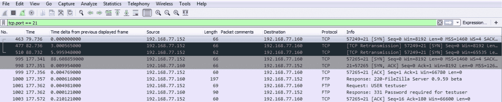

# 十一、故障排除场景

在本章中，我们将了解如何对 Wireshark 中的特定问题进行故障排除。为此，我们将执行以下步骤:

*   用一些额外的插件和解析器扩展 Wireshark
*   确定从哪里开始捕获我们要查看的故障排除问题的数据包
*   捕获实际流量
*   诊断流量

# Wireshark 插件

在本节中，我们将看看可用的 Wireshark 插件，并了解如何开发它们。

现在，Wireshark 中的插件是解剖器，解剖器是 Wireshark 分析和拆开不同协议的不同方式。如果由于某种原因，Wireshark 无法解释您捕获的数据，您可以寻找其他的解析器，或者编写自己的解析器，以完成您希望完成的任务。

Wireshark wiki 有一个关于解剖者的页面([https://wiki.wireshark.org/Lua/Dissectors](https://wiki.wireshark.org/Lua/Dissectors)):


它解释了，从编程的角度来看，你将如何处理设计和创建一个解剖器。您可以在页面上看到，为了做到这一点，它浏览了许多细节。它提供了一些很好的信息，关于你如何处理一个剖析器，它会做什么，以及你如何创建它，但是它并没有告诉你具体的 API 数据。为此，您可以查阅 Wireshark 开发人员指南([https://www.wireshark.org/docs/wsdg_html_chunked/](https://www.wireshark.org/docs/wsdg_html_chunked/)):


在 Wireshark 开发人员指南中，向下滚动到正确的部分。您将看到，在 Wireshark 开发中，我们有数据包解析。让我们点击它，看看我们得到了什么:


您可以看到，它为您提供了一篇完整的文章，介绍了 Wireshark 中的解剖是如何工作的，以及如何使用 Lua 对其进行扩展以创建您自己的解剖器。此外，如果您返回到第 11 节，您可以看到完整的 Wireshark Lua API 参考手册:


如果您碰巧知道 Lua，并且正在编写您的剖析器，那么您知道如何引用适当的 API。

# Lua 编程

Lua 是一种专门为扩展应用而开发的编程语言，用于嵌入式系统。因此，许多应用都支持 Lua 作为他们的插件编程语言。Wireshark 也不例外。

想了解更多关于 Lua 的信息，你可以去[https://www.lua.org/](https://www.lua.org/)。你也可以浏览 Packt 出版的各种关于 Lua 编程的书籍。

你也可以上 Lua 网站，参考他们的文档部分，在那里你会找到一个链接[https://www.lua.org/pil/](https://www.lua.org/pil/)，它涵盖了 Lua 编程:


你可以看到一本免费的学习 Lua 编程的书。此外，你可以在 https://www.lua.org/manual/5.1/[看一下 Lua 参考手册:](https://www.lua.org/manual/5.1/)


如果你需要比标准编程指南手册更多的信息，它会给你更多的细节，比如 Lua 是如何工作的，编程语言是如何创建的，以及它实际上是如何工作的所有细节。

下载 Lua 插件或创建自己的插件后，您可以在 Wireshark 中运行它，如下所示:


然后，您可以从命令行转到 Wireshark 所在的位置，如果我们运行`Wireshark.exe`并查看帮助，您将会看到以下内容:


你会看到有一个`-X <key>:<value>`。这是你的`eXtension option`，也叫解剖器和插件。

现在，让我们通过执行以下操作来运行 Lua 脚本:

```
Wireshark.exe -X lua_script:plugins\script.lua
```

所以我们在这里说:在 Wireshark 中运行一个扩展。这将是一个 Lua 脚本，文件名为`script.lua`。现在，它会查看您运行可执行文件的位置，在本例中是在`Program Files\Wireshark`下，所以您需要将您的脚本放入根目录或插件文件夹中。你可以做`pluginsscript.lua`或者你的解剖者叫什么名字。一旦你这样做，并按下*进入*，它将运行 Wireshark 并试图加载该文件。

我们现在将进入故障排除场景。我们将确定从哪里获取流量，以便最好地分析数据并尽快解决问题。

# 确定捕获位置

在本节中，我们将了解如何确定故障排除场景中开始数据包捕获的最佳位置。现在，在这个故障排除场景中，我们有一个用户报告他们无法访问 FTP 服务器。他们从他们的客户开始，它只是说连接不起作用。

现在，我们需要做的是确定我们需要从哪里开始数据包捕获，以便弄清楚发生了什么:


客户端可能有问题；服务器端可能有问题；或者在互联网上可能存在介于两者之间的问题。可能是路由问题，或者类似的超出我们控制的问题。因此，除了查看客户机或服务器上的日志文件之外，我们还将查看数据包捕获本身。此外，在客户端和互联网之间，或者互联网和服务器之间的某个地方可能存在问题。这些中间设备可能是防火墙或路由器，或者其他可能阻塞连接或导致连接问题的设备。在这个场景中，由于客户端报告了一个问题，但并不具体，我们将从客户端的数据包捕获开始。然后，如果我们确定我们可能需要一些额外的数据包捕获，我们将在服务器端捕获。

通常，当您进行采集时，您会从最容易接近的位置或最接近手头问题的位置开始，然后沿着数据路径进行采集。如果客户端报告了一个问题，那么您很可能会尝试在客户端捕获数据包，然后，如果您看不到任何明显的问题，那么您就可以继续工作。你到下一个中间设备，比如这个图上的数字 1 和 2，然后从那里开始；你可能不得不与网络服务提供商打交道。然后，您继续沿着从源到目的地的数据路径前进，执行数据包捕获以帮助确定问题所在。

# 捕获场景流量

在本节中，我们将了解如何为故障排除场景捕获一些流量，并在更深入地研究数据包捕获之前检查一些明显的问题。

在下面的屏幕截图中，我们捕获了客户端连接到服务器的流量:


我们现在将在这里为端口`21`放置一个过滤器，因为我们知道客户端是通过标准的未加密 FTP 连接的。为此，我们使用`tcp.port == 21`:


所以，我们把其他东西都扔掉了。我们可以看到有三个数据包，看起来我们有一个`SYN`和两次重传。所以客户端`.152`试图连接到运行在`.160`上的服务器，它甚至没有开始 TCP 握手。所以服务器没有做正确的事情来协商端口`21`。这并不是说服务器拒绝用户凭证，或者有某种其他明显的问题。这绝对不是监听`21`或类似的东西。让我们在服务器端开始捕获，当客户端连接时，我们将看到它也做了什么:


我们已经运行了服务器，所以让我们继续尝试登录。您可以看到数据包正在更新，客户端正在尝试连接，您可以看到它已经失败。因此，我们将停止这一操作，也停止我们的捕获，然后我们将像之前那样做。

让我们输入`tcp.port == 21`看看会发生什么:


所以在服务器端，它看起来是一样的。我们看到的是，源作为`152`客户端进入服务器，到达服务器的目标 IP `160`。它至少到达了服务器，所以我们知道 IP 地址工作正常。我们将得到一个`SYN`，然后从客户端重新传输，然后我们将得到另一个重新传输。显然，服务器上的某些东西运行不正常。因为这很明显，所以让我们看看我们的 FTP 服务器是否运行正常。让我们来看看我们的服务:


您可以看到，我们有应该正在运行的 FileZilla FTP 服务器，但它没有启动。让我们开始这项服务:


现在我们的服务器正在运行，我们知道一切看起来都很好；我们将刷新以确保万无一失；然后，让我们继续在服务器上开始另一个捕获。

从客户端，我们将开始一个连接，我们可以看到:


于是我们有了`SYN`，再次重传，又一次重传。服务器正在运行，服务正常。我们还可以使用`netstat -an`检查我们正在服务器上监听的端口:

```
netstat -an
```

现在，让我们来看看端口`21`:


我们在这里可以看到，我们确实有端口`21`在服务器上侦听，所以服务运行正常。看起来我们需要进一步调查服务器，一旦我们最终在下一节解决了这个`SYN`连接性问题，就看一下数据包捕获。

现在我们将实际执行这些数据包捕获。在这里，我们将深入探讨 FTP 连接问题的诊断。

# 诊断场景流量

在本节中，我们将深入了解捕获的数据包，并了解 FTP 服务器如何导致我们的连接出现某种问题。在上一节中，我们看到了一些基本设置，以确保 FTP 服务器的服务正在运行。我们从客户端捕获了一个数据，看到有一个 TCP SYN 进行了一些重新传输，所以端口`21`没有响应。然后，当该服务启动并运行时，我们再次查看服务器端，发现仍然有一个 TCP SYN 进行了一些重新传输。服务器上仍然有一些东西没有正常工作，我们知道它在服务器端(至少看起来是这样)，因为有一个 TCP SYN 正在到达服务器。如果它到达服务器，它将通过连接两端的防火墙；它正在通过互联网上的路由，所以我们知道我们正在进行中，但服务器上有些东西不太对。

让我们从客户端尝试一个连接:确保没有任何变化:


我们看到我们的 TCP SYN 进来，我们有两个来自客户端的重新传输。此时，客户端放弃并声明它无法连接。由于这个服务器是在 Windows 上运行的，我们应该看看 Windows 上有什么可能会阻止端口`21`响应。所以我们知道服务正在运行，我们上次查看了`netstat -an`,我们看到端口`21`正在监听，所以一切正常；但是系统中的其他东西挡住了它。

如果我们看一下 Windows 防火墙设置，我们会看到我们的防火墙处于打开状态:


很可能是防火墙阻止了它，因为 FTP 服务器没有将例外放入防火墙规则。我们可以为端口`21`创建一个入站规则，也可以为了测试而禁用它。

现在，我们就把它关掉:


我们将对所有的配置文件都这样做。

现在，让我们继续进行另一次连接尝试。我们将从客户端启动连接:



现在，我们可以看到我们有一些 FTP 流量。最后，我们的客户能够部分连接。在客户端，它现在告诉我它需要一个密码。我们可以看到，TCP 握手使用了`[SYN, ACK]`和`[ACK]`。然后服务器响应，说它正在运行 FileZilla 服务器。然后我的客户机请求用`testuser`登录，然后服务器响应，说需要密码。然后，我的客户确认了这个请求。

现在，让我们继续尝试使用客户端收到的凭据登录:


你可以在底部看到，我们实际上已经得到了`testuser`和密码。让我们使用为客户端提供的凭证登录。您将得到一个拒绝访问的错误，所以客户端仍然不能正确连接。在修复了两个不同的东西之后，客户端仍然无法连接。让我们继续查看这里的数据包捕获，看看是否能找出原因:


于是我们有了我们的`SYN`；`SYN, ACK`；然后`ACK`——服务器回应了。我们尝试用`testuser`登录。服务器说:用密码登录。我们承认这一点。然后客户端提供了一个密码`test123`。然后服务器声明登录不正确。我们需要做的是重置服务器中的密码:


您可以在运行 FileZilla 的服务器上看到。继续进入用户部分，我们将把这里的密码改为`test123`，这是客户端所期望的。让我们继续并再次尝试连接:


如果我们看一下这里，我们可以看到我们需要`testuser`和密码。发送`test123`密码。服务器声明它现在已经登录—因此这是一次使用正确凭证的成功登录。然后，继续执行我们在前面几节中引用的其他命令。我们接下来要做的是断开连接:


我们可以看到，从客户端我们发起了一个终结，一个`FIN`；`ACK`；`FIN`来自服务器；并承认。我们已经通过四次握手来终止连接。

# 摘要

在本章中，我们成功诊断了该服务器的多个问题。最初，该服务没有运行。然后，该服务被 Windows 防火墙阻止。然后，向客户端提供了不正确的凭据。此外，使用 Wireshark，我们能够诊断并提供一些关于我们需要查看的位置的信息，无论是在客户端还是服务器端，或者在客户端和服务器端之间，这都是一个很大的帮助，使我们能够快速解决这个问题。在本章中，我们讨论了 Wireshark 插件，使用 Lua 和创建解析器。然后，我们评估了一个故障排除场景，确定在何处创建捕获，捕获流量，进行一些基本的诊断，然后再深入研究一下，实际读取 FTP 数据包，一旦它们开始向客户端发送和接收。我们现在已经读到了这本书的结尾。我希望你喜欢读它。