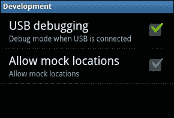

# 第一章：移动安全简介

在本章中，我们将介绍以下内容：

+   安装和配置 Android SDK 和 ADB

+   创建一个简单的 Android 应用并在模拟器中运行

+   使用 ADB 分析 Android 权限模型

+   绕过 Android 锁屏保护

+   设置 iOS 开发环境 - Xcode 和 iOS 模拟器

+   创建一个简单的 iOS 应用并在模拟器中运行

+   设置 Android 渗透测试环境

+   设置 iOS 渗透测试环境

+   根植和越狱简介

# 简介

如今，智能手机的使用是一个广泛讨论的话题。世界正在迅速转向智能手机拥有量，而非传统的功能手机。各种研究和调查预测智能手机和平板电脑的使用量将在未来持续增长。这样做有很多好处；许多事情都可以通过智能手机来完成。

随着移动性增加，风险也在增加。攻击者或网络犯罪分子会寻找各种可能的方式来攻击用户，窃取他们的个人数据、信用卡信息、密码和其他秘密。各种安全厂商的威胁报告显示，随着智能手机使用量的增加，移动攻击也在增加。今天，企业非常关注数据的机密性以及由此带来的财务和声誉损失。

在本书中，我们将向读者介绍一些移动设备漏洞利用的方法，让大家了解可能出现的攻击类型。一旦人们了解这些，他们就会更加意识到这些攻击向量，并能更好地准备应对并保护自己的信息安全。

本章将让读者了解两个最流行的移动设备平台（Android 和 iOS）的基本安全模型。我们将介绍它们的开发环境和基本安全模型。我们将设置一个渗透测试环境，并向你介绍根植和越狱。本章为接下来要介绍的内容打下基础，也是进行漏洞利用的前提。

# 安装和配置 Android SDK 和 ADB

Android 开发和安全测试的第一步是学习如何安装和配置 Android SDK 和 ADB。Android 的 **软件开发工具包** (**SDK**) 有两个可安装版本：Android Studio 和独立的 SDK 工具。本教程主要使用 Android Studio，之后将提供有关独立 SDK 工具的额外信息。

Android 调试桥 (**ADB**) 是一个非常有用的工具，它可以连接到 Android 设备和模拟器，并用于执行移动应用程序的调试和安全测试。

### 注意

本书中提到的“Android 设备”是指 Android 智能手机和平板电脑。

## 做好准备

访问 [`developer.android.com`](https://developer.android.com) 并下载 **Android Studio** 或独立的 SDK 工具。你还需要 JDK v7 或更新版本。

## 如何操作...

我们先使用第一种方法进行设置，即 Android Studio：

1.  访问 [`developer.android.com/sdk/index.html`](http://developer.android.com/sdk/index.html) 下载最新版本的 Android Studio。

1.  下载 Android Studio 安装程序文件后，安装程序会引导你完成接下来的步骤，你只需按照说明操作即可。

### 注意

截至本文写作时，使用的安装程序文件是`android-studio-bundle-135.1740770-windows.exe`。

Android SDK 和 ABD 会作为默认安装的一部分进行安装。除非你取消选择这些选项，否则它们会被安装。

### 注意

**AVD** 代表 Android 虚拟设备，实际上指的就是 Android 模拟器。模拟器提供了一个虚拟化的环境，用于测试、运行和调试 Android 应用程序。在没有硬件设备的情况下，模拟器尤其有用。大多数开发测试都通过模拟器进行。我们将在下一个教程中使用模拟器。

注意 Android Studio 和 SDK 的安装路径。你将在设置过程中多次用到这些路径：


一旦 Android Studio 安装完成，运行它。它会引导你完成接下来的步骤。它会下载 Android SDK 工具，这个过程可能会根据网络速度花费最多 4 小时。

## 如何工作...

开发环境已准备好。花点时间熟悉一下 SDK 安装目录（前面截图中显示的路径）。有一些你必须知道的快速要点：

+   **SDK 管理器**：用于管理 Android 包，并可用于根据需要安装或卸载新版/旧版。

+   **AVD 管理器**：用于管理 AVD。使用它可以创建一些模拟器，稍后在适当的时机使用。如何工作...

    现在运行其中一个模拟器，测试已安装的环境是否正常工作。模拟器启动需要 2-3 分钟，所以请耐心等待。如果安装没有问题，模拟器应该会启动并运行。（如果你现在想查看模拟器的截图，请参考下一个教程。）

+   **platform-tools**：此文件夹包含一些有用的工具，例如 ADB、SQLite3 等。我们将在本书的不同教程中使用这些工具。

+   **tools**：此文件夹包含批处理文件和其他可执行文件。我们主要使用`emulator.exe`，以及此文件夹中的其他`.exe`文件。

## 还有更多内容...

还有一种替代的 Android 开发方式，很多人更喜欢使用其他 IDE。在这种情况下，可以下载独立的 SDK 工具。这些工具提供了应用程序开发所需的 SDK 工具，可以从命令行调用这些工具。

这些独立工具对于渗透测试人员和黑客来说也很有用，可以快速分析底层的应用相关内容。在很多情况下，应用程序开发不是必须的，而是需要调试；在这种情况下，可以使用独立的 SDK 工具。

## 另见

+   *使用 ADB 分析 Android 权限模型*

# 创建一个简单的 Android 应用并在模拟器中运行

现在我们已经准备好了 Android SDK，接下来让我们编写第一个 Android 应用程序。开始时需要一点编程技能。不过，别担心，如果源代码让你感到害怕。互联网上有很多示例代码可以供你使用，帮助你入门。

## 准备工作

为了准备编写 Android 应用程序，你需要确保 SDK 工作正常。如果你已经完成了第一部分并且知道一些 Java 编程，接下来的部分就很容易了，你已准备好编写第一个 Android 应用程序。

## 如何做……

让我们编写一个非常简单的程序来将两个数字相加。我使用了 Eclipse IDE，并创建了一个名为 `Addition` 的 Android 应用程序项目：

1.  创建图形布局。拖放三个文本框（分别用于输入第一个数字和第二个数字，最后一个用来显示前两个数字的和），两个 TextView 框以显示文本，提示用户输入两个数字，最后添加一个按钮用于执行加法操作。

    +   `activity_main.xml` 文件是自动生成的。编辑它，使其看起来像以下代码：

    ```
    <RelativeLayout 

        android:layout_width="match_parent"
        android:layout_height="match_parent"
        android:paddingBottom="@dimen/activity_vertical_margin"
        android:paddingLeft="@dimen/activity_horizontal_margin"
        android:paddingRight="@dimen/activity_horizontal_margin"
        android:paddingTop="@dimen/activity_vertical_margin"
        tools:context=".MainActivity" >

        <TextView>
            android:id="@+id/textView1"
            android:layout_width="wrap_content"
            android:layout_height="match_parent"
            android:text="First Number"
    Text displayed to guide user to input first number
        </TextView>

        <EditText>
            android:layout_width="wrap_content"
            android:layout_height="wrap_content"
            android:text=""
            android:id="@+id/e1"
    Variable e1 is declared to be referenced in java file.
            android:inputType="textPassword"
        </EditText>

        <TextView>
            android:id="@+id/textView2"
            android:layout_width="wrap_content"
            android:layout_height="wrap_content"
            android:text="Second Number"
        </TextView>

        <EditText>
            android:layout_width="wrap_content"
            android:layout_height="wrap_content"
            android:text=""
            android:id="@+id/e2"
            android:inputType="textPassword"
        </EditText>

        <Button>
            android:id="@+id/add"
            android:layout_width="wrap_content"
            android:layout_height="wrap_content"
            android:layout_alignParentBottom="true"
            android:layout_alignParentLeft="true"
            android:layout_marginBottom="122dp"
            android:text="Add"

    ```

    +   添加声明的按钮：

    ```
        </Button>   
        <EditText>
            android:text=""
            android:id="@+id/t3" 

    ```

    +   最后，声明第三个变量，它将包含两个数字的和：

    ```
            android:layout_width="wrap_content"
            android:layout_height="wrap_content"
            android:inputType="textPassword"
        </EditText>
    </RelativeLayout>

    ```

1.  现在我们需要编写 Java 代码来输入和相加数字，并输出和。在这一点上，如果你不懂 Activity、Intent 等也没关系。只需专注于使代码没有错误。Eclipse 会在每一步为你提供指导。我们从 `MainActivity` 开始编写程序，代码如下：

    ```
    package com.android.addition;

    import android.os.Bundle;
    import android.app.Activity;
    import android.widget.EditText;
    import android.widget.TextView;
    import android.widget.Button;
    import android.view.View;

    public class MainActivity extends Activity {
        EditText e1;
        EditText e2;
        TextView t3;
        Button add;
        protected void onCreate(Bundle savedInstanceState) {
            super.onCreate(savedInstanceState);
            setContentView(R.layout.activity_main);
            add=(Button)findViewById(R.id.action_settings);
            add.setOnClickListener(new Button.OnClickListener()
                {
            public void onClick
            (View v){Sum();}});
        }
            private void Sum(){
              int s1=Integer.parseInt(e1.getText().toString());
              int s2=Integer.parseInt(e2.getText().toString());
              int s3=s1+s2;
              t3.setText(Integer.toString(s3));
             }
    }

    ```

    看看这个程序多么简单；它只需接受两个数字，将它们相加，并提供结果。

1.  调试并运行程序。模拟器启动，程序运行。

## 另见

+   *Android In Action*，*Ableson, Sen*，*King*，*Manning Publications Co*。

# 使用 ADB 分析 Android 权限模型

在设置好开发环境并编写完第一个 Android 应用后，现在是时候理解 Android 操作系统底层的权限模型了。底层操作系统是 Linux，Android 操作系统是基于 Linux 构建的。Linux 中的应用程序以特定的用户 ID 和组 ID 运行。Android 使用相同的 Linux 模型为应用程序设置权限，这样可以将 Android 应用程序彼此隔离并进行保护。

## 准备工作

确保你已经安装了 ADB。你还需要一个 Android 模拟器或 Android 设备来连接到 ADB。

经常使用的设备或模拟器最适合此目的（因为新创建的模拟器或设备可能没有很多数据可以通过 ADB 查看）。此外，为了学习目的，推荐使用已 root 的手机。

## 如何做……

按照这里给出的步骤使用 ADB 分析 Android 权限模型：

1.  在你的安卓设备上启用**USB 调试**模式，并通过数据线将其连接到运行 ADB 的计算机。ADB 是一个非常强大的工具，可以用来运行各种有用的命令，帮助我们完成以下任务：

    +   向手机/模拟器中推送数据

    +   从手机/模拟器中提取数据

    +   获取手机/模拟器中的 shell

    +   安装和卸载应用程序

    +   导航文件系统

    +   窃取关键系统文件

    +   窃取与应用程序相关的文件，如偏好设置和 SQLite 文件

    +   查看设备日志

1.  使用 ADB 分析应用程序权限。为此，我们首先需要通过`adb shell`命令获取设备的 shell，然后运行`ps`命令查找正在运行的进程的详细信息。

以下截图展示了这个过程，手机连接到运行 ADB 的 Linux 机器：


## 它是如何工作的…

花点时间分析前面的截图。注意第一列、第二列和最后一列，分别显示了`USER`、`PID`和应用程序`NAME`。请注意，每个应用程序都有一个唯一的`PID`，并且由特定用户运行。只有少数特权进程以 root 用户身份运行。其他应用程序通过特定用户运行。例如，`com.android.datapass`应用程序的`PID 299`以用户`app_47`身份运行。同时，`com.svox.pico`以用户`app_28`身份运行。

Android 中的每个应用程序都运行在自己的**沙箱**中。沙箱是一个虚拟环境，应用程序在其中运行，并且不能访问其他应用程序，或者不允许其他应用程序访问它。Android 中的权限模型（应用程序在特定用户下运行）有助于创建沙箱，从而将应用程序限制在自己的上下文中，并根据应用程序开发者的选择，限制与其他应用程序的互动（无论是完全没有互动还是有限的互动）。这也保护应用程序免受数据盗窃或其他恶意应用程序和恶意软件的攻击。

## 还有更多...

Android 的权限模型和沙箱实现力求通过设计内建安全性。这一目标成为攻击者和宣传者的对象。Android 沙箱绕过攻击和来自不安全代码实现的攻击是针对这一安全特性的几种攻击方式。然而，设计内建的安全性已经在 Android 操作系统中通过权限模型得以实现。

## 另请参见

+   更多信息请参考[`developer.android.com/tools/help/adb.html`](http://developer.android.com/tools/help/adb.html)

# 绕过 Android 锁屏保护

建议 Android 用户通过设置密码、PIN 或锁屏（图形密码）来保护他们的设备。当用户谈论绕过锁屏时，通常指的是他们将手机锁定或忘记了图形密码，而不是如何绕过锁屏进入设备。我们从更具攻击性的角度来探讨这个话题，因为本书涉及的是移动设备的利用。作为攻击者，我们如何绕过受害者的锁屏？现在，这个话题已经被广泛讨论，并且已经有很多方法可以实现；各种漏洞/方法可能适用于特定的 Android 或设备版本，但在其他版本上可能不起作用。

## 准备工作

我们将以通过 ADB 重置手机锁屏图案为例。因此，对于这个操作，你需要准备好 ADB。在前面的教程中我们已经学习了 ADB，现在我们将利用所学的知识来进行黑客攻击。除了 ADB，你还需要一部已启用**USB 调试**并且需要重置密码的 Android 设备。

## 如何操作...

按照以下步骤绕过锁屏保护：

1.  使用 ADB 连接到目标 Android 设备。如果我们获得了一部已启用**USB 调试**并且已 root 的手机，那么操作会更加简单。如果手机未 root，也有方法可以实现。对于这个操作，我们假设使用的是一部已 root 的手机。

1.  现在你已经通过 ADB 连接，输入以下命令：

    ```
    **adb shell**

    ```

1.  这将为你提供一个连接的 Android 设备的 shell。

1.  接下来，将当前工作目录更改为`/data/system`，这是存放密钥的地方。为此，我们需要输入以下命令来更改目录：

    ```
    **cd /data/system**

    ```

1.  然后，最后需要删除相关的密钥。只需运行删除命令即可：

    ```
    **rm *.key**

    ```

1.  也可以如下运行：

    ```
    **rm <correct-filename>.key**

    ```

1.  如果提示你进行超级用户权限操作，可以运行 `su` 命令。前面的命令会删除包含锁屏信息的密钥文件。

1.  接下来，重启设备，锁屏应该已经消失。

## 它是如何工作的…

之所以有效，是因为`/data/system`文件夹中的关键文件包含系统信息，例如锁屏的密码信息。如果这些关键文件被删除，设备在重启时无法找到锁屏设置，因此实际上它允许在没有密码的情况下访问设备。

### 注意

处于 USB 调试模式且已 root 的设备可以很容易地实现此方法。

## 还有更多…

关键提示是：这不是绕过锁屏的唯一方法，也不能保证在所有情况下都有效。黑客已经想出了多种绕过 Android 锁屏的方法。更复杂的是，并非所有方法都适用于所有 Android 版本。所以在某些情况下，你可能需要花费很多精力来弄清楚如何绕过 Android 锁屏。

# 设置 iOS 开发环境 - Xcode 和 iOS 模拟器

到目前为止，你已经掌握了 Android 开发。现在是时候了解 iOS 开发环境了。苹果的 iPhone 和 iPad 运行的是 iOS 操作系统。iOS 应用程序的开发需要使用 Xcode IDE，该 IDE 在 Mac OS X 上运行。Xcode 与 iOS 模拟器一起使用，可以开发和测试 iOS 应用程序。

### 注意

请注意，当我们谈论 Android 时，我们说的是仿真器；而谈论 iOS 时，我们说的是模拟器。这两者相似，但有一个主要区别：仿真器可以利用一些操作系统功能来测试特定的应用程序。

例如，仿真器可以使用笔记本电脑的摄像头来运行需要摄像头的应用程序，而在 iOS 模拟器中，类似的应用程序测试会受到限制。仿真器还可以向其他仿真器发送短信。

有些人说仿真器比模拟器更智能。然而，将其一概而论可能不公平，只要两者都能完成它们设计的工作。

## 准备工作

Xcode 是用于开发 iOS 应用程序的 IDE。Xcode 运行在 Mac OS X 上，因此进行 iOS 应用程序开发需要一台 MacBook。所以，准备一台 MacBook，安装 Xcode，安装 iOS SDK，开始进行 iOS 编程。

### 注意

请注意，在[`developer.apple.com/programs/ios/gettingstarted/`](https://developer.apple.com/programs/ios/gettingstarted/)网站上有一些有用的指南，能帮助你完成此操作。

## 如何操作...

按照以下步骤设置 Xcode 和 iOS 模拟器：

1.  在你的 MacBook 上找到 App Store。现在使用 App Store 下载 Xcode（这与在手机上下载其他应用程序类似）。你需要一个 Apple ID 才能从 App Store 下载。请注意，Xcode 可以免费从 Apple 的 App Store 下载。

1.  一旦 Xcode 安装完成，你可以开始探索 IDE。它可以用来开发 Mac OS X 应用程序。Xcode 是一个通用的 IDE，既可以用于 OS X 应用程序开发，也可以用于 iOS 应用程序开发。为了能够开发 iOS 应用程序，你还需要安装 iOS SDK。最新版本的 Xcode 包括了 OS X 和 iOS SDK。模拟器和工具现在也成为 Xcode 的一部分。

    +   幸运的是，这并不复杂，Xcode 的安装会处理所有相关内容。

    +   一旦你完成了所有的设置，创建一个新项目。请注意，如果一切安装正常，你将看到可以创建 iOS 和 OS X 应用程序的选项，如下所示：

    

## 工作原理...

让我们熟悉一下 Xcode IDE。

从前面的截图开始，我们来创建一个项目。为了简化操作，我们将选择**单视图应用程序**模板。此操作会打开**为新项目选择选项**窗口。为你的项目提供一个名称，系统会自动附加组织标识符，以创建一个捆绑标识符。


请注意，我们选择了**Swift**，它是 iOS 8 中引入的一种新语言。还有一个选项是选择传统的**Objective-C**。

### 注意

Swift 是一种新的 iOS 和 OS X 编程语言。它具有互动性，旨在让编程变得有趣。Swift 使应用开发更加容易，并且可以与传统的 Objective-C 一起使用。

有些人认为模拟器比仿真器更聪明。然而，将这一点概括为普遍的观点可能不公平，只要它们都能完成设计的任务。

最后，选择合适的设备选项也很重要，设备选项包括 **iPhone**、**iPad** 或 **通用**。为了演示，我们选择了 **iPhone**。

一旦你选择 **下一步** 和 **创建**，我们就会看到我们的项目窗口：


左侧窗格是项目导航器。你可以在此区域找到所有的项目文件。工作区的中央部分是编辑区。根据文件的类型，Xcode 会在编辑区显示不同的界面。

右侧窗格是工具区。此区域显示文件的属性，并允许你访问 **快速帮助**。

## 还有更多...

到目前为止，我们还没有写任何代码。不过，我们仍然可以通过内置的模拟器运行我们的应用。在工具栏中，我们可以看到 *运行* 按钮（位于左上角，类似传统的 *播放* 音乐图标）：


当我们点击运行按钮时，Xcode 会自动构建应用程序并在默认的 iPhone 6 模拟器上运行它。当然，由于我们还没有编程让应用执行任何功能，它将仅显示一个空白的白色屏幕：


位于 *运行* 按钮旁边的 *停止* 按钮可以终止应用程序。

## 另见

+   *设置 iOS 渗透测试环境*

# 创建一个简单的 iOS 应用程序并在模拟器中运行

在向你介绍 Xcode 和模拟器之后，接下来我们将创建我们的第一个 iOS 应用程序。

## 准备就绪

在准备编写 iOS 应用程序的代码之前，你需要在 MacBook 中安装并配置好 Xcode 和 iOS 模拟器。如果你已经按照之前的步骤操作，并且稍微了解一点 Objective-C，你就可以开始编写你的第一个 iOS 应用程序了。

## 如何操作...

现在我们对 Xcode 有了基本了解，让我们从构建用户界面开始：

1.  在项目导航器中，选择 `Main.storyboard`。Xcode 会弹出一个用于 storyboard 的可视化编辑器，叫做 **界面构建器**。

    Storyboard 用于布局视图并在不同视图之间进行过渡。由于我们使用的是单视图应用程序，Storyboard 已经包含了一个视图控制器。

1.  接下来，我们将在视图中添加一个按钮。工具区的底部显示了对象库，如下图所示：

1.  从对象库中将 **按钮** 对象拖动到视图中：

1.  停止拖动并将按钮移动到你选择的区域。双击按钮并将其重命名为 `Click Me`。

1.  接下来我们将添加几行代码来显示我们的消息。在项目导航器中，你应该能找到`ViewController.swift`文件。我们将在已经存在的`ViewController`类中添加一个方法。当这个方法被调用时，我们的代码将指示 iOS 显示一条特定的消息。

1.  现在让我们编写我们的方法。这就是我们方法的样子：

    ```
    @IBAction func showMessage(){ 
    let alertController = UIAlertController(title: "My First App", message: "Hello World", preferredStyle: UIAlertControllerStyle.Alert) 
    alertController.addAction(UIAlertAction(title: "OK", style: UIAlertActionStyle.Default, handler:nil)) 
    self.presentViewController(alertController, animated: true, completion: nil) 
    } 

    ```

1.  这是完成后的效果：

1.  现在我们需要将故事板中的**Click Me**按钮与我们的`showMessage`方法连接起来。这部分很简单；我们点击`Main.storyboard`，在那里我们已经展示了我们的屏幕。

1.  按住键盘上的**Ctrl**键，点击**Click Me**按钮，并将其拖到**视图控制器**图标上。

1.  松开两个按钮，我们会看到一个弹出消息，里面有`showMessage`选项。选择它将按钮与我们的函数连接起来：

1.  就是这样！如果一切正常，当我们点击*运行*按钮时，应用应该能完美运行：

## 它是如何工作的...

在 Swift 中引入的`@IBAction`属性，用于将故事板中的动作连接到代码。在这里，我们希望将按钮点击事件与显示消息连接起来。所以，我们将函数`showMessage`定义为`func`。

### 注意

从 iOS 8 开始，`UIActionSheet`和`UIAlertView`被新的`UIAlertController`所取代。

在我们的函数中，我们调用`UIAlertController`并请求它显示一个警报弹窗，标题为`My First App`，消息为`Hello World`。我们还添加了一个动作：

```
alertController.addAction(UIAlertAction(title: "OK", style: UIAlertActionStyle.Default, handler:nil)) 

```

这基本上意味着我们添加了一个选项，当点击**OK**时关闭弹窗。

当我们将按钮拖到`ViewController`并选择`showMessage`函数时，我们实际上是将按钮的点击与我们函数的调用连接了起来。

## 还有更多……

你可以通过尝试不同风格的按钮，或者使用表格视图、链接等来进行实验。增加更多功能以便在学习 iOS 应用开发的过程中进行尝试。

一个好的起点是来自 iOS 创建者的文档：

+   [`developer.apple.com/library/ios/documentation/Swift/Conceptual/BuildingCocoaApps/index.html`](https://developer.apple.com/library/ios/documentation/Swift/Conceptual/BuildingCocoaApps/index.html)

## 另见

+   你可以在[`developer.apple.com/swift/resources/`](https://developer.apple.com/swift/resources/)找到许多关于应用开发入门的资源，包括视频、教程和示例代码。

# 设置 Android 渗透测试环境

到这个时候，你应该已经熟悉了 Android 开发环境、ADB 和模拟器。你也编写了第一个应用程序。现在让我们进入渗透测试的领域。移动应用渗透测试可以大致分为四个类别：

+   与移动应用程序流量相关的攻击

+   与移动设备存储相关的攻击

+   与移动应用程序源代码相关的攻击

+   涉及移动应用程序使用的移动操作系统功能的攻击

这是最复杂的类别。有各种 Android 操作系统功能与应用程序互动，比如蓝牙、NFC、意图、广播接收器等等。这些也需要在渗透测试中进行覆盖。

## 准备工作

我们需要为 Android 渗透测试搭建实验室，实验室应该具备足够的设备来进行测试，涵盖前面提到的四个类别的测试用例。

要开始，我们需要以下工具：

+   Android SDK、模拟器和 ADB

+   配置了不同 Android 版本的模拟器

+   一到两部 Android 手机或平板（已 root）

+   代理工具如 Charles、Burp Suite 和 Fiddler

+   一个 Wi-Fi 网络

+   工具如 SQLite 浏览器、文本编辑器和 XML 查看器

+   一根数据线

+   工具如 DEX 到 JAR 转换器、jdgui 或 Java 反编译器

+   工具如 DroidProxy 或 Autoproxy for Android

## 如何操作...

让我们来看看这些工具：

+   Android SDK、模拟器和 ADB

    我们已经在本章前面的教程中学到过这些。

+   配置了不同 Android 版本的模拟器

    请参考前面教程中展示的 AVD 管理器截图。我们当时使用了 API 级别 21，并创建了一个 Android 5.0.1 版本的模拟器。利用那里的新选项，我们可以为不同的 API 级别和不同的 Android 版本创建更多模拟器。

    这些不同版本的模拟器会在对特定版本的应用程序进行渗透测试时派上用场。当某些特定的移动应用功能仅在特定的 Android 版本中存在时，它们也会非常有用。

+   一到两部 Android 手机或平板（已 root）

    拥有物理设备是可选的，但它们确实很有用。有时我们会发现应用程序崩溃、模拟器运行缓慢，或者代理工具与模拟器结合使用时速度过慢/经常崩溃，这使得用模拟器测试应用程序变得困难。在这种情况下，拥有一部物理移动设备就很有用了。

+   代理工具如 Charles、Burp Suite 和 Fiddler

    各种代理工具可以从它们的网站上下载。这些工具相当直观，而且也有相关的指南和帮助论坛。工具的安装超出了本书的范围，但我们会介绍它们在移动应用程序中的配置方法。

    以下是一些常见代理工具的下载链接：

    +   [`portswigger.net/burp/download.html`](http://portswigger.net/burp/download.html)

    +   [`www.charlesproxy.com/download/`](http://www.charlesproxy.com/download/)

    +   [`www.telerik.com/download/fiddler`](http://www.telerik.com/download/fiddler)

+   一个 Wi-Fi 网络

    我们需要一个 Wi-Fi 网络来拦截 Wi-Fi 流量。稍后我们将为移动设备设置代理，将其与运行代理工具的笔记本连接，并确保它们在同一 Wi-Fi 网络下。

    您可以使用 Wi-Fi 路由器设置个人 Wi-Fi 网络，也可以使用一些免费的工具通过笔记本电脑创建热点。根据我们的经验，有时使用后者会比较困难，因此我们更倾向于使用前者。

+   工具如 SQLite 浏览器、文本编辑器和 XML 查看器

    这些是读取从手机中提取的数据的附加工具。再次强调，这些工具是免费的下载，或者您可能已经拥有它们。

+   一根数据线

    同样，拥有一根数据线也很重要。稍后我们将使用它连接手机，以便读取其数据并执行通过 USB 发起的攻击。

+   工具如 DEX 到 JAR 转换器、jdgui 或 Java 反编译器

    另外，确保这些工具在我们的实验室中准备好也很重要。这些小工具帮助我们进行 Android 应用程序的反编译。

+   工具如 DroidProxy 或 Autoproxy for Android

    由于之前版本的 Android 没有设置代理的功能，我们需要从 Google Play 商店下载这些工具。

## 它是如何工作的……

在我们的渗透测试实验室准备好工具后，让我们看看如何将渗透测试用例与使用这些工具时的不同类别进行关联：

+   **与移动应用程序流量相关的攻击**：这时 Wi-Fi 网络和代理工具将变得非常有用。安装了 Charles 或 Burp 代理的笔记本通过 Wi-Fi 连接。运行应用程序的移动设备通过设备上的代理配置，指向笔记本代理。由于笔记本和移动设备处于同一 Wi-Fi 网络中，应用程序流量将通过 Charles 或 Burp 代理工具进行路由。若需要，可以使用如 DroidProxy 或 Autoproxy 等工具为 Android 设备设置代理。

    实际上，这整个过程使得应用程序流量可以通过代理工具进行读取和编辑，从而进行各种攻击，这将在另一个章节中看到。

    +   **与移动设备存储相关的攻击**：我们有一根数据线可以将手机连接到笔记本电脑。笔记本上有模拟器，二者都能运行移动应用程序。我们还携带了一款非常强大的工具 ADB，它可以连接设备或模拟器，窃取数据，还能执行其他许多可能的攻击。

+   **与移动应用程序源代码相关的攻击**：反编译 Android 应用程序可以分为两个步骤：APK 到 DEX 转换和 DEX 到 JAR 转换。

    APK 是 Android 应用程序包。一旦 Android 应用程序开发完成并打包，生成的文件格式就是 `.apk`。移动应用程序的命名格式为 `<filename>.apk`。

    APK 到 DEX 的转换相当简单；它只涉及重命名和解压归档文件。

    `.dex` 到 `.jar` 的转换是通过工具如 DEX 到 JAR 转换器来实现的。

## 还有更多……

+   *涉及移动操作系统功能的攻击，这些功能被移动应用程序使用*

# 设置 iOS 渗透测试环境

现在你已经熟悉了 iOS 开发环境和模拟器，并且也编写了你的第一个应用程序，是时候学习 iOS 应用程序的渗透测试了。移动应用程序的渗透测试可以大致分为四个类别，就像我们在前面的章节中看到的那样：

+   与移动应用流量相关的攻击

+   与移动设备存储相关的攻击

+   与移动应用源代码相关的攻击

+   涉及移动操作系统功能的攻击，这些功能被移动应用程序使用

## 准备工作

我们需要为 iOS 渗透测试建立一个实验室，该实验室应该装备完善，能够进行前面提到的四个类别的测试案例。

为了开始，我们至少需要以下工具。这个列表与 Android 相差不多，但包含了一些特定的工具：

+   iOS 模拟器

+   Xcode

+   iExplorer

+   一到两个越狱的 iPhone 或 iPad

+   像 Charles、Burp Suite 和 Fiddler 这样的代理工具

+   一条 Wi-Fi 网络

+   像 SQLite 浏览器、文本编辑器、XML 查看器和 plist 编辑器这样的工具

+   一根数据线

+   像 otool 和 **classdump** 这样的工具

## 如何操作...

让我们逐个看看这些工具：

+   iOS 模拟器

    我们将使用 iOS 模拟器来运行那些我们可以访问应用程序代码的 iOS 应用程序。在这种情况下，只需一台安装了所有工具的 MacBook 就可以进行测试（无需 Wi-Fi 或移动设备）。

+   Xcode

    Xcode 是 iOS 应用程序的 IDE，它不仅有助于审查 iOS 应用程序的源代码，还可以方便地查看某些只在 Xcode 中打开的文件。

+   iExplorer

    iExplorer 可以从 MacBook 上的 Apple App Store 下载。在通过数据线将 iPhone 或 iPad 连接到 Windows 计算机时，也可以下载 Windows 版本。

    iExplorer 像 Windows 资源管理器一样，帮助导航文件系统。它可以用来浏览、读取文件并从 iOS 设备中窃取数据。

+   一到两个越狱的 iPhone 或 iPad

    越狱的 iOS 设备非常实用。安装在这些设备上的应用程序可以直接从设备本身进行渗透测试，省去了模拟器的需求。

+   像 Charles、Burp Suite 和 Fiddler 这样的代理工具

    各种代理工具可以从它们的官网上下载。这些工具使用起来相对简单，并且有相关的指南和帮助论坛。虽然本书不涉及这些工具的安装，但我们会讲解如何为移动应用配置这些工具。

    以下是一些常见代理工具的链接：

    +   [`portswigger.net/burp/download.html`](http://portswigger.net/burp/download.html)

    +   [`www.charlesproxy.com/download/`](http://www.charlesproxy.com/download/)

    +   [`www.telerik.com/download/fiddler`](http://www.telerik.com/download/fiddler)

+   一条 Wi-Fi 网络

    我们需要一个 Wi-Fi 网络来拦截 Wi-Fi 流量。稍后我们将为移动设备设置代理，连接到运行代理工具的笔记本电脑，且两者处于同一 Wi-Fi 网络中。

    你可以使用 Wi-Fi 路由器设置个人 Wi-Fi 网络，或者使用一些可用的免费工具从笔记本电脑创建一个热点。根据我们的经验，后者有时难以使用，因此我们更倾向于使用前者。

+   工具如 SQLite 浏览器、文本编辑器、XML 查看器和 plist 编辑器

    这些是用于读取从手机提取的数据的附加工具。这些工具可以免费下载，或者你可能已经拥有它们。

    plist 文件在 iOS 应用程序中用于存储数据，plist 编辑器在读取这些文件时非常有用。

+   一条数据线

    拥有一条数据线也很重要。稍后我们将用它连接到手机，以读取数据并进行通过 USB 发起的攻击。

+   工具如 otool 和 classdump

    这些工具是 iOS 应用程序的反编译工具。

## 它是如何工作的…

准备好渗透测试实验室的工具后，接下来我们来看一下如何将渗透测试用例与不同类别进行关联，同时使用这些工具：

+   **与移动应用程序流量相关的攻击**：在这里，Wi-Fi 网络和代理工具将发挥重要作用。一台安装了 Charles 或 Burp 代理的笔记本电脑连接到 Wi-Fi。运行应用程序的 iOS 设备通过代理配置，连接到笔记本电脑的代理。由于笔记本电脑和移动设备在同一 Wi-Fi 网络上，应用程序流量通过 Charles 或 Burp 代理工具进行路由。这种设置不需要 MacBook（任何其他笔记本电脑都可以），但需要 iOS 设备。

    另一种可能性是我们可以使用 MacBook，但不使用 iOS 设备。在这种情况下，我们将通过 Xcode 和模拟器运行应用程序。代理设置为 MacBook 上的 localhost，那里运行着如 Burp 或 Charles 之类的代理工具。

    实际上，这两种方法都使应用程序流量通过代理工具变得可读和可编辑，我们可以进行各种攻击，这将在另一个章节中讨论。

+   **与移动设备存储相关的攻击**：我们有一条数据线将 iPhone 或 iPad 连接到笔记本电脑。我们可以在笔记本电脑上使用 iExplorer 工具读取和窃取文件及其他数据。

+   **与移动应用程序源代码相关的攻击**：我们讨论了 otool 和 classdump 工具。在 iOS 应用程序的情况下，只能进行有限的反编译，而这些工具只能帮助到一定程度。稍后的某一章节将详细介绍这一点。

## 还有更多…

+   *涉及移动操作系统功能的攻击，这些功能被移动应用程序使用*

这是最复杂的类别，尤其在 iOS 平台上更为复杂。iOS 系统中有多个应用程序交互的功能，比如截屏后台、蓝牙、NFC 等等。这些功能与应用程序的交互，以及这些功能在应用程序中的不安全实现，会导致漏洞。一个常见的例子是 iOS 应用程序中的截屏后台漏洞。

# Rooting 和越狱介绍

从根本上讲，rooting（获取 root 权限）是获取对底层 Linux 系统的 root 访问权限，以便执行诸如挂载/卸载文件系统、运行 SSH、HTTP、DHCP、DNS 或代理守护进程、终止系统进程等操作。

能够以 root 用户身份运行命令，使我们能够在 Linux 上做任何事情，因此，也可以在 Android 系统上执行任何操作。

越狱是特权提升过程，通过这个过程我们可以移除 Apple 在 iOS 设备上施加的硬件级限制。越狱允许访问 iOS 文件系统和管理器，从而可以下载官方 Apple 应用商店无法提供的额外应用、扩展和主题。

## 准备工作

Root 一个 Android 设备所需的只是一个 USB 数据线、一台未 root 的 Android 设备，以及一个可以通过 ADB、一键 root 程序/应用或可以刷入设备的修改版 ROM 运行的漏洞代码。

iOS 越狱所需的设备是 USB 数据线、iOS 设备和越狱程序。

## 如何操作…

在这里我们将介绍两个步骤：rooting 和越狱。

### Rooting

实际的 rooting 过程本身应该只需点击一次。但在此之前，你需要先做一些快速的设置：

1.  在继续操作之前，下载并安装 Java JDK 和 Android SDK。必须先安装 Java，之后才能安装 Android SDK。

1.  在你的 Android 设备上启用**USB 调试**。在设备上，进入**设置**屏幕，点击**应用程序**，点击**开发**，然后勾选**USB 调试**复选框：

    完成这些操作后，rooting 过程本质上是通过在互联网上搜索适合你特定设备的测试过的 root 方法。大多数 Android 设备的 root 过程可以归类为以下几种：

    +   **使用 rooting 应用程序**：在这个过程中，你需要执行以下任务：

        1.  在你的计算机上安装 rooting 应用程序

        1.  将启用了**USB 调试**的 Android 设备连接到电脑

        1.  按照简单的说明操作以 root 你的设备

    +   **使用 rooting 应用程序**：在此过程中，你需要执行以下任务：

        1.  下载 rooting APK 文件

        1.  在 Android 设备的开发设置中启用**USB 调试**模式并允许来自未知来源的安装

        1.  使用 `adb install /path/to/apk` 安装 rooting APK 文件

        1.  按照屏幕上的指示完成 Android 设备的 root 操作

    +   **刷入自定义 ROM**：在此过程中你需要执行以下任务：

        1.  将修改后的 ROM 复制到 Android 设备的 SD 卡中（作为 `.zip` 文件）

        1.  在恢复模式下重启设备

        1.  前往恢复菜单的 **安装** 或 **从 SD 卡安装 zip** 部分

        1.  导航到 `.zip` 文件，并从列表中选择它进行刷机

### 越狱

在进行越狱之前，你应该备份设备。如果因为某种原因越狱失败，你可以恢复备份。

越狱过程包括将程序下载到 Mac/Windows 机器上，通过 USB 数据线将 iOS 设备连接到计算机，然后运行该工具。其中一个工具是 **evasi0n**：


这些说明已与工具一起提供，应该按步骤遵循。

作为越狱过程的一部分，该工具会在目标 iOS 设备上安装 Cydia。

Cydia 是一个替代的 App Store，包含除了 Apple 提供的并通常被 *批准* 的 iOS 应用之外的其他应用。大多数这些应用由越狱社区开发，例如用于使用自定义主题和小部件、改变默认应用等的工具。


## 它是如何工作的……

让我们逐个查看与这些过程相关的详细信息。

### Root 权限

能够以 root 用户身份运行命令使我们能够在 Linux 系统上执行任何操作，因此，也可以扩展到 Android 系统上。

为 Android 设备进行 root 的过程通常包括两个步骤：

1.  找到一个允许作为 `root` 执行任意代码的漏洞。

1.  使用漏洞来安装 `su`。

如果目标设备解锁了 **bootloader**，那么这个过程相当简单。未打包的 bootloader 允许刷入任意的 ROM，因此可以将 `su` 添加到官方 ROM 中，然后将其重新打包为修改版 ROM。用户只需在开机时按下组合键将设备重启到刷机模式，并使用设备的工具将修改版 ROM 刷入设备。

那么，对于那些具有锁定 bootloader 的设备怎么办？你只能与系统中的非特权程序进行交互，它们无法帮助你执行任何特权代码。

许多程序，例如系统服务，都会以 root 身份在 Android 上运行，以便能够访问底层硬件资源。

所有一键 Root 方法都利用了运行在特权模式下的系统进程中的漏洞，执行特定的代码，使系统以读写模式挂载并安装 `su` 二进制文件，从而获得对系统的特权访问。

### 越狱

越狱过程因工具而异，对于不同的 iOS 版本需要遵循不同的步骤。在这里，我们分析一个用于越狱 iPhone 5 的工具的结构。

越狱程序首先通过运行 `libimobiledevice` 利用 iOS 的移动备份系统中的漏洞，获取通常受限的文件（该文件包含时区设置）的访问权限。

### 注意

libimobiledevice 是一个跨平台的软件库，支持与 iOS 设备进行协议通信。它允许其他软件轻松访问设备的文件系统；获取关于设备及其内部信息；备份和恢复设备；管理已安装的应用程序；获取通讯录、日历、笔记和书签；并将音乐和视频同步到设备。

更多信息可以在 [`www.libimobiledevice.org/`](http://www.libimobiledevice.org/) 上找到。

然后，它插入一个“符号链接”指向某个已修改的“套接字”，使得程序能够与 **launchd** 通信，launchd 是一个主进程，每当 iOS 设备启动时会加载它，并且可以启动需要“root”权限的应用程序。

因此，现在，每当 iOS 移动备份运行时，所有程序都会自动获得访问时区文件的权限，从而获得对 launchd 的访问权限。

挺酷的，对吧？

iOS 实现了代码签名作为一种防护措施，防止任何“未受信任”的应用程序获得访问 launchd 的权限。

所以为了破解代码签名，越狱工具启动了一个新的、未签名的、看似无害的应用程序。但当用户被提示点击应用程序图标时，该应用程序使用了一种名为 shebang 的技术，调用了另一个已签名应用程序的代码，在这种情况下是 launchd。

Shebang 是一个字符序列，由井号符号和感叹号符号组成（即 `#!`），位于脚本的开头。

在 Unix 中，当带有 shebang 的脚本作为程序运行时，程序加载器会将脚本的初始行解析为解释器指令；然后指定的解释器程序将被运行，并将原本用于运行脚本的路径作为参数传递给它。

例如，如果代码的路径是 `path/to/code`，并且它以 `#!/bin/sh` 开头，那么程序加载器会指示程序运行 `/bin/sh`，并将 `path/to/code` 作为第一个参数传递给它。

然后，launchd 被用来运行 `remount` 命令，该命令将只读根文件系统的内存设置更改为可写。

为了使越狱“持久化”，调用了 `launchd.conf` 文件来更改 launchd 配置。用户现在不需要在每次重启时重新运行该程序。

越狱工具接着进行最后的突破，去除内核级别的限制。iOS 内核使用 **Apple Mobile File Integrity Daemon**（**AMFID**）来防止未批准的应用程序运行。越狱程序再次利用 launchd，向 AMFID 加载一个功能库，以便始终批准所有应用程序。

内核施加的第二个限制是 **地址空间布局随机化**（**ASLR**），用于通过随机化或“隐藏”设备代码每次启动时的方式，防止内存被篡改。这将防止有人覆盖代码的特定部分。

然后，越狱工具利用一个巧妙的技巧定位内存中的一个特定区域；ARM 异常向量。该部分处理应用崩溃，指示崩溃发生的内存位置。

崩溃是通过越狱工具模拟的，通过检查 ARM 异常向量来查看崩溃发生的位置，并收集最少的信息，足以映射出其余的内核。

该工具的最后一步利用了 iOS USB 接口中的一个漏洞，该漏洞将内核内存中的地址传递给程序，并期望程序返回未被篡改的地址。

这使得该工具能够写入内核中限制代码更改的部分，从而完全控制并成功实现其目的！
