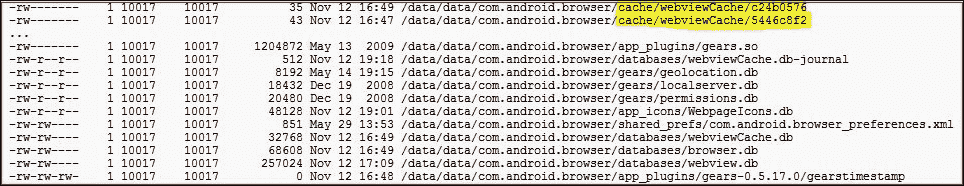

# 第三章：审计移动应用

本章将涵盖以下主题：

+   使用静态分析审计 Android 应用

+   使用动态分析器审计 Android 应用

+   使用 Drozer 在 Android 应用中发现漏洞

+   使用静态分析审计 iOS 应用

+   使用动态分析器审计 iOS 应用

+   检查 iOS 应用数据存储和钥匙串安全漏洞

+   在基于 WAP 的移动应用中发现漏洞

+   发现客户端注入

+   移动应用中的不安全加密

+   发现数据泄露源

+   移动设备中的其他基于应用的攻击

+   在 Android 中发起意图注入

# 介绍

移动应用（如 Web 应用）可能存在漏洞。这些漏洞在大多数情况下是由于糟糕的编程实践或不安全的编码技术引起的，或者可能是由于故意注入的不良代码。对于用户和组织来说，了解他们的应用程序有多脆弱是非常重要的。他们应该修复漏洞，还是继续使用/停止使用这些应用程序？

为了解决这个困境，移动应用需要进行审计，目的是发现漏洞。可以使用静态或动态技术分析移动应用（安卓、iOS 或其他平台）。静态分析是通过对反编译的源代码进行某些基于文本或字符串的搜索来进行的。动态分析则是在运行时进行，漏洞以模拟的方式被发现。与静态分析相比，动态分析更具挑战性。在本章中，我们将结合使用静态和动态分析来审计 Android 和 iOS 应用。我们还将学习审计发现的其他技术，包括 Drozer 框架使用、基于 WAP 的应用审计以及典型的移动特定漏洞发现。

# 使用静态分析审计 Android 应用

静态分析是源代码审计中最常见且最易应用的分析方法。静态分析的定义意味着某物是常量。静态分析是在静态代码上进行的，即原始或反编译的源代码，或在已编译（目标）代码上进行的，但分析是在没有运行时的情况下进行的。在大多数情况下，静态分析通过静态字符串搜索来实现代码分析。一个非常常见的场景是找出脆弱或不安全的代码模式，并在整个应用代码中找到相同的模式。

## 准备工作

要进行 Android 应用的静态分析，我们至少需要一个 Android 应用和一个静态代码扫描器。选择任何你喜欢的 Android 应用，并使用你选择的任何静态分析工具。

在本教程中，我们使用**Insecure Bank**，这是一个面向 Android 安全爱好者的漏洞 Android 应用。我们还将使用**ScriptDroid**，这是一种静态分析脚本。Insecure Bank 和 ScriptDroid 都是由 Android 安全研究员 Dinesh Shetty 编写的。

## 如何操作...

执行以下步骤：

1.  从 GitHub 下载最新版本的 Insecure Bank 应用程序。解压或解压`.apk`文件，并记下解压后的应用程序路径。

1.  使用以下代码创建一个`ScriptDroid.bat`文件：

    ```
      @ECHO OFF 
      SET /P Filelocation=Please Enter Location: 

      mkdir %Filelocation%OUTPUT 

      :: Code to check for presence of Comments 
      grep -H -i -n -e "//" "%Filelocation%*.java" >> "%Filelocation%OUTPUT\Temp_comment.txt" 
      type -H -i  "%Filelocation%*.java" |gawk "/\/\*/,/\*\//" >>
      "%Filelocation%OUTPUT\MultilineComments.txt" 
      grep -H -i -n -v "TODO" "%Filelocation%OUTPUT\Temp_comment.txt" >> 
      "%Filelocation%OUTPUT\SinglelineComments.txt"
      del %Filelocation%OUTPUT\Temp_comment.txt 

      :: Code to check for insecure usage of SharedPreferences 
      grep -H -i -n -C2 -e "putString" "%Filelocation%*.java" >>
      "%Filelocation%OUTPUT\verify_sharedpreferences.txt" 
      grep -H -i -n -C2 -e "MODE_PRIVATE" "%Filelocation%*.java" >> "%Filelocation%OUTPUT\Modeprivate.txt" 
      grep -H -i -n -C2 -e "MODE_WORLD_READABLE" "%Filelocation%*.java" >>
      "%Filelocation%OUTPUT\Worldreadable.txt" 
      grep -H -i -n -C2 -e "MODE_WORLD_WRITEABLE" "%Filelocation%*.java" >>
      "%Filelocation%OUTPUT\Worldwritable.txt" 
      grep -H -i -n -C2 -e "addPreferencesFromResource" "%Filelocation%*.java" >>
      "%Filelocation%OUTPUT\verify_sharedpreferences.txt" 

      :: Code to check for possible TapJacking attack 
      grep -H -i -n -e filterTouchesWhenObscured\="true" "%Filelocation%..\..\..\..\res\layout\*.xml" >>
      "%Filelocation%OUTPUT\Temp_tapjacking.txt" 
      grep -H -i -n -e "<Button" "%Filelocation%..\..\..\..\res\layout\*.xml" >>
      "%Filelocation%OUTPUT\tapjackings.txt"  
      grep -H -i -n -v filterTouchesWhenObscured\="true" "%Filelocation%OUTPUT\tapjackings.txt" >>
      "%Filelocation%OUTPUT\Temp_tapjacking.txt" 
      del %Filelocation%OUTPUT\Temp_tapjacking.txt 

      :: Code to check usage of external storage card for storing information 
      grep -H -i -n  -e "WRITE_EXTERNAL_STORAGE" "%Filelocation%..\..\..\..\AndroidManifest.xml" >>
      "%Filelocation%OUTPUT\SdcardStorage.txt"   
      grep -H -i -n  -e "getExternalStorageDirectory()" "%Filelocation%*.java" >>
      "%Filelocation%OUTPUT\SdcardStorage.txt"
      grep -H -i -n  -e "sdcard" "%Filelocation%*.java" >> "%Filelocation%OUTPUT\SdcardStorage.txt" 

      :: Code to check for possible scripting javscript injection 
      grep -H -i -n  -e "addJavascriptInterface()" "%Filelocation%*.java" >>
      "%Filelocation%OUTPUT\Temp_probableXss.txt" 
      grep -H -i -n  -e "setJavaScriptEnabled(true)" "%Filelocation%*.java" >>
      "%Filelocation%OUTPUT\Temp_probableXss.txt" 
      grep -H -i -n -v "import" "%Filelocation%OUTPUT\Temp_probableXss.txt" >>
      "%Filelocation%OUTPUT\probableXss.txt" 
      del %Filelocation%OUTPUT\Temp_probableXss.txt 

      :: Code to check for presence of possible weak algorithms 
      grep -H -i -n  -e "MD5" "%Filelocation%*.java" >> "%Filelocation%OUTPUT\Temp_weakencryption.txt" 
      grep -H -i -n  -e "base64" "%Filelocation%*.java" >> "%Filelocation%OUTPUT\Temp_weakencryption.txt" 
      grep -H -i -n  -e "des" "%Filelocation%*.java" >> "%Filelocation%OUTPUT\Temp_weakencryption.txt" 
      grep -H -i -n  -v "import" "%Filelocation%OUTPUT\Temp_weakencryption.txt" >>
      "%Filelocation%OUTPUT\Weakencryption.txt" 
      del %Filelocation%OUTPUT\Temp_weakencryption.txt 

      :: Code to check for weak transportation medium 
      grep -H -i -n -C3  "http://" "%Filelocation%*.java" >> "%Filelocation%OUTPUT\Temp_overhttp.txt" 
      grep -H -i -n -C3 -e "HttpURLConnection" "%Filelocation%*.java" >>
      "%Filelocation%OUTPUT\Temp_overhttp.txt" 
      grep -H -i -n -C3 -e "URLConnection" "%Filelocation%*.java" >>
      "%Filelocation%OUTPUT\Temp_OtherUrlConnection.txt" 
      grep -H -i -n -C3 -e "URL" "%Filelocation%*.java" >>
      "%Filelocation%OUTPUT\Temp_OtherUrlConnection.txt" 
      grep -H -i -n  -e "TrustAllSSLSocket-Factory" "%Filelocation%*.java" >>
      "%Filelocation%OUTPUT\BypassSSLvalidations.txt" 
      grep -H -i -n -e "AllTrustSSLSocketFactory" "%Filelocation%*.java" >>
      "%Filelocation%OUTPUT\BypassSSLvalidations.txt" 
      grep -H -i -n -e "NonValidatingSSLSocketFactory" "%Filelocation%*.java" >>
      "%Filelocation%OUTPUT\BypassSSLvalidations.txt"  
      grep -H -i -n  -v "import" "%Filelocation%OUTPUT\Temp_OtherUrlConnection.txt" >>
      "%Filelocation%OUTPUT\OtherUrlConnections.txt" 
      del %Filelocation%OUTPUT\Temp_OtherUrlConnection.txt 
      grep -H -i -n  -v "import" "%Filelocation%OUTPUT\Temp_overhttp.txt" >> 
      "%Filelocation%OUTPUT\UnencryptedTransport.txt" 
      del %Filelocation%OUTPUT\Temp_overhttp.txt 

      :: Code to check for Autocomplete ON 
      grep -H -i -n -e "<Input" "%Filelocation%..\..\..\..\res\layout\*.xml" >>
      "%Filelocation%OUTPUT\Temp_autocomp.txt"  
      grep -H -i -n -v "textNoSuggestions" "%Filelocation%OUTPUT\Temp_autocomp.txt" >>
      "%Filelocation%OUTPUT\AutocompleteOn.txt" 
      del %Filelocation%OUTPUT\Temp_autocomp.txt 

      :: Code to presence of possible SQL Content 
      grep -H -i -n  -e "rawQuery" "%Filelocation%*.java" >> "%Filelocation%OUTPUT\Temp_sqlcontent.txt"  
      grep -H -i -n  -e "compileStatement" "%Filelocation%*.java" >>
      "%Filelocation%OUTPUT\Temp_sqlcontent.txt"  
      grep -H -i -n  -e "db" "%Filelocation%*.java" >> "%Filelocation%OUTPUT\Temp_sqlcontent.txt"  
      grep -H -i -n  -e "sqlite" "%Filelocation%*.java" >> "%Filelocation%OUTPUT\Temp_sqlcontent.txt"  
      grep -H -i -n  -e "database" "%Filelocation%*.java" >> "%Filelocation%OUTPUT\Temp_sqlcontent.txt"  
      grep -H -i -n  -e "insert" "%Filelocation%*.java" >> "%Filelocation%OUTPUT\Temp_sqlcontent.txt"  
      grep -H -i -n -e "delete" "%Filelocation%*.java" >> "%Filelocation%OUTPUT\Temp_sqlcontent.txt"  
      grep -H -i -n  -e "select" "%Filelocation%*.java" >> "%Filelocation%OUTPUT\Temp_sqlcontent.txt"  
      grep -H -i -n  -e "table" "%Filelocation%*.java" >> "%Filelocation%OUTPUT\Temp_sqlcontent.txt"  
      grep -H -i -n -e "cursor" "%Filelocation%*.java" >> "%Filelocation%OUTPUT\Temp_sqlcontent.txt"  
      grep -H -i -n -v "import" "%Filelocation%OUTPUT\Temp_sqlcontent.txt" >>
      "%Filelocation%OUTPUT\Sqlcontents.txt" 
      del %Filelocation%OUTPUT\Temp_sqlcontent.txt 

      :: Code to check for Logging mechanism 
      grep -H -i -n  -F "Log." "%Filelocation%*.java" >> "%Filelocation%OUTPUT\Logging.txt"  

      :: Code to check for Information in Toast messages 
      grep -H -i -n -e "Toast.makeText" "%Filelocation%*.java" >> "%Filelocation%OUTPUT\Temp_Toast.txt"  
      grep -H -i -n -v "//" "%Filelocation%OUTPUT\Temp_Toast.txt" >>
      "%Filelocation%OUTPUT\Toast_content.txt" 
      del %Filelocation%OUTPUT\Temp_Toast.txt 

      :: Code to check for Debugging status 
      grep -H -i -n  -e "android:debuggable" "%Filelocation%*.java" >>
      "%Filelocation%OUTPUT\DebuggingAllowed.txt"  

      :: Code to check for presence of Device Identifiers 
      grep -H -i -n  -e "uid\|user-id\|imei\|deviceId\|deviceSerialNumber\|devicePrint\|X-DSN\|phone
      \|mdn\|did\|IMSI\|uuid" "%Filelocation%*.java" >> "%Filelocation%OUTPUT\Temp_Identifiers.txt"  
      grep -H -i -n -v "//" "%Filelocation%OUTPUT\Temp_Identifiers.txt" >>
      "%Filelocation%OUTPUT\Device_Identifier.txt" 
     del %Filelocation%OUTPUT\Temp_Identifiers.txt 

      :: Code to check for presence of Location Info 
      grep -H -i -n  -e "getLastKnownLocation()\|requestLocationUpdates()\|getLatitude()\|getLongitude()
      \|LOCATION" "%Filelocation%*.java" >> "%Filelocation%OUTPUT\LocationInfo.txt"  

      :: Code to check for possible Intent Injection 
      grep -H -i -n -C3 -e "Action.getIntent(" "%Filelocation%*.java" >>
      "%Filelocation%OUTPUT\IntentValidation.txt" 

    ```

## 工作原理...

打开命令提示符并导航到 ScriptDroid 所在的路径。运行 `.bat` 文件，它会提示你输入要进行静态分析的应用程序路径。在我们的例子中，我们提供了 Insecure Bank 应用的路径，准确地说是 Java 文件存储的路径。如果一切正常，屏幕应该显示如下内容：


脚本会在应用程序的 Java 文件所在的路径生成一个名为`OUTPUT`的文件夹。`OUTPUT`文件夹包含多个文本文件，每个文件对应一个特定的漏洞。这些文本文件标明了与正在讨论的漏洞相关的易受攻击的代码位置。

ScriptDroid 与 Insecure Bank 的结合为我们提供了一个非常好的视角，展示了各种 Android 漏洞；通常，实时应用程序无法做到这一点。

考虑以下几点，例如：

+   `Weakencryption.txt`列出了 Insecure Bank 应用中用于密码的 Base64 编码实例。

+   `Logging.txt`包含应用程序中使用的不安全日志函数列表。

+   `SdcardStorage.txt`包含与 SD 卡中数据存储相关定义的代码片段。

这些来自静态分析的细节让我们了解到应用程序中的漏洞，甚至在未运行应用程序的情况下。

## 还有更多...

当前使用的配方仅限于 ScriptDroid，但还有许多其他选项可供选择。你可以选择编写自己的脚本，或者使用一些免费的或商业的工具。一些商业工具多年来通过专注于静态分析方法，已经在这一领域开创了先河。

## 另请参见

+   [`github.com/dineshshetty/Android-InsecureBankv2`](https://github.com/dineshshetty/Android-InsecureBankv2)

+   *使用静态分析审计 iOS 应用*

# 使用动态分析审计 Android 应用

**动态分析**是另一种用于源代码审计的技术。动态分析是在运行时进行的。应用程序被运行或模拟，并且在应用程序运行时发现缺陷或漏洞。动态分析可能会很棘手，特别是在移动平台上。与静态分析不同，动态分析有一些特定的要求，比如分析环境需要是运行时环境或真实运行时的模拟。

动态分析可以用来发现 Android 应用程序中的漏洞，这些漏洞通过静态分析是难以发现的。静态分析可能让你知道一个密码会被存储，但动态分析则读取内存并揭示运行时存储的密码。动态分析有助于在运行时篡改传输中的数据，例如篡改发送到支付网关的交易请求中的金额。一些 Android 应用程序使用混淆技术来防止攻击者读取代码；在这种情况下，动态分析改变了整个游戏规则，它能够揭示在请求中发送的硬编码数据，而这些数据在静态分析中是无法读取的。

## 准备工作

为了进行 Android 应用程序的动态分析，至少需要一个 Android 应用程序和一个动态代码分析工具。选择任何你喜欢的 Android 应用程序，并使用你喜欢的任何动态分析工具。

动态分析工具可以分为两类：

+   从计算机上运行并连接到 Android 设备或模拟器的工具（用于进行动态分析）

+   可以在 Android 设备本身运行的工具

对于本教程，我们选择了属于后一类的工具。

## 如何操作…

执行以下步骤进行动态分析：

1.  准备一台安装了应用程序（需要进行动态分析的）Android 设备。

1.  前往 Play 商店并下载 **Andrubis**。Andrubis 是 iSecLabs 提供的一款工具，可在 Android 设备上运行，对已安装的应用程序进行静态、动态和 URL 分析。在本教程中，我们仅使用它进行动态分析。

1.  在你的 Android 设备上打开 Andrubis 应用程序。它会显示已安装的应用程序并分析这些应用程序。

## 如何工作...

打开你感兴趣的应用程序的分析。Andrubis 会计算应用程序的总体恶意评分（满分为 10 分），并在主屏幕前显示颜色图标，以反映易受攻击的应用程序。

我们选择了一个橙色的应用程序，以便与本教程更好地契合。下面是 Andrubis 中展示的应用程序摘要和评分：


让我们导航到 **动态分析** 标签并查看结果：


这个应用程序的结果很有意思。注意，在动态分析过程中，应用程序将写入的所有文件都列出。我们在这里找到一个名为 `preferences.xml` 的文件。

### 注意

虽然应用程序将创建一个偏好设置文件这一事实也可以通过静态分析发现，但动态分析进一步确认了确实会创建这样的文件。它还确认了静态分析中发现的有关创建偏好设置文件的代码片段不是一个死代码，而是一个将被创建的文件。接下来，继续读取已创建的文件，查找其中是否存在任何敏感数据。谁知道呢，或许运气会眷顾你，给你一个通向隐藏宝藏的钥匙。

请注意，第一屏幕有一个超链接，**在浏览器中查看完整报告**。点击它并注意，详细的动态分析结果会展示出来，供您进一步分析。这也让您理解工具尝试了什么操作以及获得了什么响应。如下截图所示：


## 还有更多...

当前的方案使用了属于后者类别的动态分析工具。前者类别也有许多其他工具可用。由于这是一个 Android 平台，许多工具都是开源的。

DroidBox 可以尝试进行动态分析。它检查文件操作（读/写）、网络数据流量、短信、权限、广播接收器等。

Hooker 是另一款可以拦截和修改应用程序发起的 API 调用的工具。在动态分析中，这非常有用。尝试钩取和篡改 API 调用中的数据。

## 另见

+   [`play.google.com/store/apps/details?id=org.iseclab.andrubis`](https://play.google.com/store/apps/details?id=org.iseclab.andrubis)

+   [`code.google.com/p/droidbox/`](https://code.google.com/p/droidbox/)

+   [`github.com/AndroidHooker/hooker`](https://github.com/AndroidHooker/hooker)

# 使用 Drozer 查找 Android 应用程序中的漏洞

Drozer 是一个由 MWR InfoSecurity 维护的移动安全审计和攻击框架，是测试人员工具库中必不可少的工具。Drozer（Android 安装应用程序）通过**IPC**（**进程间通信**）与其他 Android 应用程序进行交互。它允许对应用程序包相关信息、攻击面进行指纹识别，并尝试进行利用。Drozer 是一个攻击框架，可以从中执行高级漏洞攻击。我们使用 Drozer 来查找应用程序中的漏洞。

## 正在准备

通过从[`www.mwrinfosecurity.com/products/drozer/`](https://www.mwrinfosecurity.com/products/drozer/)下载 Drozer 并按照用户指南中的安装说明进行安装。

按照用户指南中的说明，安装 Drozer 控制台代理并启动会话。

如果您的安装正确，您应该会看到 Drozer 命令提示符（`dz>`）。

您还应该有一些易受攻击的应用程序供分析。在这里，我们选择了 OWASP GoatDroid 应用程序。

## 如何操作...

每次渗透测试都从指纹识别开始。让我们使用 Drozer 来完成这一任务。Drozer 用户指南在参考命令时非常有帮助。

以下命令可用于获取关于 Android 应用程序包的信息：

```
**run app.package.info -a <package name>**

```

我们使用相同的方法从 GoatDroid 应用中提取信息，并得到了以下结果：


请注意，除了关于应用程序的一般信息，`User Permissions`（用户权限）也会被 Drozer 列出。

进一步分析攻击面。Drozer 的攻击面列出了暴露的活动、广播接收器、内容提供者和服务。那些不应暴露的内容可能是严重的安全风险，并可能让你访问特权内容。

Drozer 具有以下命令来分析攻击面：

```
**run app.package.attacksurface <package name>**

```

我们使用相同的方法获取了 GoatDroid 的 Herd Financial 应用的攻击面，结果可以在以下截图中看到。请注意，一个活动和一个内容提供者被暴露。

我们选择攻击内容提供者以获取本地存储的数据。我们使用以下 Drozer 命令分析相同应用的内容提供者：

```
**run app.provider.info -a <package name>**

```

这让我们获得了暴露的内容提供者的详细信息，我们在另一个 Drozer 命令中使用了这些信息：

```
**run scanner.provider.finduris -a <package name>**

```

我们成功查询了内容提供者。最后，我们有兴趣窃取这个内容提供者存储的数据。这可以通过另一个 Drozer 命令实现：

```
**run app.provider.query content://<content provider details>/**

```

以下截图展示了整个事件的过程：


## 它是如何工作的...

ADB 用于在 Drozer Python 服务器（位于计算机上）和 Drozer 代理（`.apk` 文件安装在模拟器或 Android 设备上）之间建立连接。Drozer 控制台初始化后，可以运行我们看到的各种命令。

Drozer 代理利用 Android 操作系统的 IPC 特性，接管目标应用的角色，并作为原始应用运行各种命令。

## 还有更多...

Drozer 不仅允许用户通过内容提供者获取攻击面并窃取数据，或发起意图注入攻击，它的功能远不止这些。它还可以用于对应用程序进行模糊测试，通过提供注入有效负载的方法来引发本地注入攻击。

Drozer 还可以用来运行各种内置的漏洞攻击，并且可以通过自定义开发的漏洞攻击 Android 应用程序。此外，它还可以在基础设施模式下运行，允许远程连接和远程攻击。

## 另见

+   *在 Android 中发起意图注入*

+   [`www.mwrinfosecurity.com/system/assets/937/original/mwri_drozer-user-guide_2015-03-23.pdf`](https://www.mwrinfosecurity.com/system/assets/937/original/mwri_drozer-user-guide_2015-03-23.pdf)

# 使用静态分析审核 iOS 应用程序

源代码审查中的静态分析是一种更简单的技术，使用静态字符串搜索使其更加方便。静态分析是在原始或反编译的源代码或已编译（目标）代码上进行的，但分析是在运行时之外进行的。通常，静态分析可以识别出易受攻击或不安全的代码模式。

## 准备工作

要进行 iOS 应用程序的静态分析，我们需要至少一个 iOS 应用程序和一个静态代码扫描工具。选择任何你喜欢的 iOS 应用程序，并使用任何你喜欢的静态分析工具。

我们将使用`iOS-ScriptDroid`，这是一种静态分析脚本，由 Android 安全研究员 Dinesh Shetty 开发。

## 如何进行...

1.  保留解压后的 iOS 应用程序文件，并记录包含`.m`文件的文件夹路径。

1.  使用以下代码创建`iOS-ScriptDroid.bat`文件：

    ```
      ECHO Running ScriptDriod ... 
      @ECHO OFF 
      SET /P Filelocation=Please Enter Location: 
      :: SET Filelocation=Location of the folder containing all the .m files eg: C:\sourcecode\project
      \iOS\xyz\ 

      mkdir %Filelocation%OUTPUT 

      :: Code to check for Sensitive Information storage in Phone memory 
      grep -H -i -n -C2 -e "NSFile" "%Filelocation%*.m" >> "%Filelocation%OUTPUT\phonememory.txt" 
      grep -H -i -n -e  "writeToFile " "%Filelocation%*.m" >> "%Filelocation%OUTPUT\phonememory.txt" 

      :: Code to check for possible Buffer overflow 
      grep -H -i -n  -e "strcat(\|strcpy(\|strncat(\|strncpy(\|sprintf(\|vsprintf(\|gets("
      "%Filelocation%*.m" >> "%Filelocation%OUTPUT\BufferOverflow.txt" 

      :: Code to check for usage of URL Schemes 
      grep -H -i -n  -C2 "openUrl\|handleOpenURL" "%Filelocation%*.m" >>
      "%Filelocation%OUTPUT\URLSchemes.txt" 

      :: Code to check for possible scripting javscript injection 
      grep -H -i -n  -e "webview" "%Filelocation%*.m" >> "%Filelocation%OUTPUT\probableXss.txt" 

      :: Code to check for presence of possible weak algorithms 
      grep -H -i -n  -e "MD5" "%Filelocation%*.m" >> "%Filelocation%OUTPUT\tweakencryption.txt" 
      grep -H -i -n  -e "base64" "%Filelocation%*.m" >> "%Filelocation%OUTPUT\tweakencryption.txt" 
      grep -H -i -n  -e "des" "%Filelocation%*.m" >> "%Filelocation%OUTPUT\tweakencryption.txt" 
      grep -H -i -n -v "//" "%Filelocation%OUTPUT\tweakencryption.txt" >>
      "%Filelocation%OUTPUT\weakencryption.txt" 
      del %Filelocation%OUTPUT\tweakencryption.txt 

      :: Code to check for weak transportation medium 
      grep -H -i -n -e  "http://" "%Filelocation%*.m" >> "%Filelocation%OUTPUT\overhttp.txt" 
      grep -H -i -n  -e "NSURL" "%Filelocation%*.m" >> "%Filelocation%OUTPUT\OtherUrlConnection.txt" 
      grep -H -i -n  -e "URL" "%Filelocation%*.m" >> "%Filelocation%OUTPUT\OtherUrlConnection.txt" 
      grep -H -i -n  -e "writeToUrl" "%Filelocation%*.m" >> "%Filelocation%OUTPUT\OtherUrlConnection.txt" 
      grep -H -i -n  -e "NSURLConnection" "%Filelocation%*.m" >>
      "%Filelocation%OUTPUT\OtherUrlConnection.txt" 
      grep -H -i -n -C2 "CFStream" "%Filelocation%*.m" >> "%Filelocation%OUTPUT\OtherUrlConnection.txt" 
      grep -H -i -n  -C2 "NSStreamin" "%Filelocation%*.m" >> "%Filelocation%OUTPUT\OtherUrlConnection.txt" 

      grep -H -i -n -e "setAllowsAnyHTTPSCertificate\|kCFStreamSSLAllowsExpiredRoots
      \|kCFStreamSSLAllowsExpiredCertificates" "%Filelocation%*.m" >>
      "%Filelocation%OUTPUT\BypassSSLvalidations.txt"  
      grep -H -i -n -e "kCFStreamSSLAllowsAnyRoot\|continueWithoutCredentialForAuthenticationChallenge"
      "%Filelocation%*.m" >> "%Filelocation%OUTPUT\BypassSSLvalidations.txt" 
      ::to add check for "didFailWithError" 

      :: Code to presence of possible SQL Content 
      grep -H -i -F  -e "db" "%Filelocation%*.m" >> "%Filelocation%OUTPUT\sqlcontent.txt"  
      grep -H -i -F  -e "sqlite" "%Filelocation%*.m" >> "%Filelocation%OUTPUT\sqlcontent.txt"  
      grep -H -i -F  -e "database" "%Filelocation%*.m" >> "%Filelocation%OUTPUT\sqlcontent.txt"  
      grep -H -i -F  -e "insert" "%Filelocation%*.m" >> "%Filelocation%OUTPUT\sqlcontent.txt"  
      grep -H -i -F -e "delete" "%Filelocation%*.m" >> "%Filelocation%OUTPUT\sqlcontent.txt"  
      grep -H -i -F  -e "select" "%Filelocation%*.m" >> "%Filelocation%OUTPUT\sqlcontent.txt"  
      grep -H -i -F  -e "table" "%Filelocation%*.m" >> "%Filelocation%OUTPUT\sqlcontent.txt"  
      grep -H -i -F -e "cursor" "%Filelocation%*.m" >> "%Filelocation%OUTPUT\sqlcontent.txt"  
      grep -H -i -F -e "sqlite3_prepare" "%Filelocation%OUTPUT\sqlcontent.txt" >>
      "%Filelocation%OUTPUT\sqlcontent.txt"  
      grep -H -i -F -e "sqlite3_compile" "%Filelocation%OUTPUT\sqlcontent.txt" >>
      "%Filelocation%OUTPUT\sqlcontent.txt"  

      :: Code to check for presence of keychain usage source code
      grep -H -i -n  -e "kSecASttr\|SFHFKkey" "%Filelocation%*.m" >>
      "%Filelocation%OUTPUT\LocationInfo.txt"  

      :: Code to check for Logging mechanism 
      grep -H -i -n  -F "NSLog" "%Filelocation%*.m" >> "%Filelocation%OUTPUT\Logging.txt"  
      grep -H -i -n  -F "XLog" "%Filelocation%*.m" >> "%Filelocation%OUTPUT\Logging.txt"  
      grep -H -i -n  -F "ZNLog" "%Filelocation%*.m" >> "%Filelocation%OUTPUT\Logging.txt"  

      :: Code to check for presence of password in source code 
      grep -H -i -n  -e "password\|pwd" "%Filelocation%*.m" >> "%Filelocation%OUTPUT\password.txt"  

      :: Code to check for Debugging status 
      grep -H -i -n  -e "#ifdef DEBUG" "%Filelocation%*.m" >> "%Filelocation%OUTPUT\DebuggingAllowed.txt"  

      :: Code to check for presence of Device Identifiers  ===need to work more on this 
      grep -H -i -n  -e "uid\|user-id\|imei\|deviceId\|deviceSerialNumber\|devicePrint\|X-DSN\|phone
      \|mdn\|did\|IMSI\|uuid" "%Filelocation%*.m" >> "%Filelocation%OUTPUT\Temp_Identifiers.txt"  
      grep -H -i -n -v "//" "%Filelocation%OUTPUT\Temp_Identifiers.txt" >>
       "%Filelocation%OUTPUT\Device_Identifier.txt" 
      del %Filelocation%OUTPUT\Temp_Identifiers.txt 

      :: Code to check for presence of Location Info 
      grep -H -i -n  -e "CLLocationManager\|\startUpdatingLocation\|locationManager\|didUpdateToLocation
      \|CLLocationDegrees\|CLLocation\|CLLocationDistance\|startMonitoringSignificantLocationChanges"
      "%Filelocation%*.m" >> "%Filelocation%OUTPUT\LocationInfo.txt"  

      :: Code to check for presence of Comments 
      grep -H -i -n -e "//" "%Filelocation%*.m" >> "%Filelocation%OUTPUT\Temp_comment.txt" 
      type -H -i  "%Filelocation%*.m" |gawk "/\/\*/,/\*\//" >> "%Filelocation%OUTPUT\MultilineComments.txt" 
      grep -H -i -n -v "TODO" "%Filelocation%OUTPUT\Temp_comment.txt" >>
      "%Filelocation%OUTPUT\SinglelineComments.txt" 
      del %Filelocation%OUTPUT\Temp_comment.txt 

    ```

## 它是如何工作的...

打开命令提示符并导航到放置`iOS-ScriptDroid`的路径。运行批处理文件时，它会提示你输入要进行静态分析的应用程序路径。

在我们的案例中，我们随意选择了一个应用程序，并输入了实现（`.m`）文件的路径。

该脚本会在应用程序的`.m`文件所在的路径下生成一个名为`OUTPUT`的文件夹。`OUTPUT`文件夹包含多个文本文件，每个文件对应一个特定的漏洞。这些单独的文本文件指出了与讨论中的漏洞相关的易受攻击代码的位置。

`iOS-ScriptDroid`提供了当前应用程序中存在的各种 iOS 应用程序漏洞的第一手信息。

例如，以下是一些特定于 iOS 平台的工具。

`BufferOverflow.txt`包含了当应用程序中发现缺失缓冲区限制（如`strcat`、`strcpy`等）时，使用有害函数的情况。

如果 URL Schemes 实现不安全，可能会导致与访问相关的漏洞。URL schemes 的使用列在`URLSchemes.txt`中。

这些是通过静态分析了解 iOS 应用程序漏洞的有用详细信息。

## 还有更多...

当前使用的方案仅使用了`iOS-ScriptDroid`，但还有许多其他选项可供选择。你可以选择编写自己的脚本，也可以使用现有的免费或商业工具。几种商业工具多年来通过专注于静态分析方法而取得了先驱地位。

## 另见

+   *使用静态分析审计 Android 应用程序*

# 使用动态分析器审计 iOS 应用程序

动态分析是应用程序的运行时分析。应用程序在运行或模拟过程中被执行，以发现运行时的缺陷。动态分析可能会很棘手，尤其是在移动平台上。

动态分析对于在运行时篡改传输中的数据非常有用，例如，篡改向支付网关发送的交易请求中的金额。在使用自定义加密以防止攻击者读取数据的应用程序中，动态分析有助于揭示被加密的数据，这些数据可以被逆向工程。

注意，由于 iOS 应用无法完全反编译，因此动态分析在发现可能被硬编码的敏感数据时显得尤为重要。

## 准备就绪

对 iOS 应用进行动态分析时，我们需要至少一个 iOS 应用和一个动态代码分析工具。选择任意 iOS 应用，并使用任何你喜欢的动态分析工具。

在这个操作中，我们将使用开源工具**Snoop-it**。我们将使用一个 iOS 应用，该应用通过 PIN 码、图案和秘密问题与答案来锁定文件，只有解锁后才能查看文件。

让我们看看能否分析这个应用并使用 Snoop-it 找到其中的安全漏洞。请注意，Snoop-it 只适用于越狱设备。

要在你的 iDevice 上安装 Snoop-it，请访问[`code.google.com/p/snoop-it/wiki/GettingStarted?tm=6`](https://code.google.com/p/snoop-it/wiki/GettingStarted?tm=6)。

我们已经从 App Store 下载了**Locker Lite**并安装到我们的设备上进行分析。

## 如何操作...

执行以下步骤来对 iOS 应用进行动态分析：

1.  点击 Snoop-it 应用图标打开它。

1.  导航到**设置**。在这里你将看到可以从你的设备访问界面的 URL：

1.  请注意这个 URL，因为我们稍后会使用它。为了方便，我们已禁用认证。

1.  现在，在 iDevice 上，点击**应用程序** | **选择 App Store 应用**，然后选择**Locker**应用：

1.  按下主屏按钮，打开 Locker 应用。注意，如果输入错误的 PIN 码，我们将无法继续访问：

1.  确保工作站和 iDevice 处于同一网络，打开先前记下的 URL，并在任何浏览器中查看。界面将呈现如下：

1.  点击左侧面板中的**分析**下的**Objective-C 类**链接：

1.  现在，点击`SM_LoginManagerController`。类信息会加载到右侧面板中。

1.  向下导航，直到看到`-(void) unlockWasSuccessful`，然后点击前面的单选按钮：

    该方法现在已被选中。

1.  接下来，点击面板右上角的**设置并调用**按钮。在出现的窗口中，点击底部的**调用方法**按钮：

    当我们点击按钮时，我们注意到认证已经被绕过，且我们成功查看了锁定的文件。

## 工作原理…

Snoop-it 加载应用中的所有类，并用绿色标示当前正在运行的类。由于我们希望绕过当前的登录界面，直接加载主页面，我们需要寻找 `UIViewController`。

在 `UIViewController` 中，我们看到 `SM_LoginManagerController`，它可能包含与身份验证相关的方法。观察该类时，我们看到许多方法，例如 `numberLoginSucceed`、`patternLoginSucceed` 等。

当输入 PIN 码成功时，应用会调用 `unlockWasSuccessful` 方法。

所以，当我们从我们的机器调用此方法并直接调用该功能时，应用成功加载了主页面。

## 还有更多…

当前的教程仅使用了一个动态分析器，但也可以使用其他选项和工具。进行 iOS 应用的动态分析面临许多挑战。你可能希望使用多个工具，而不仅仅依赖于一个工具，以克服这些挑战。

## 另见

+   [`code.google.com/p/snoop-it/`](https://code.google.com/p/snoop-it/)

+   *使用动态分析器审计 Android 应用*

# 检查 iOS 应用数据存储和钥匙串安全漏洞

iOS 中的钥匙串是一个加密的 SQLite 数据库，使用 128 位 AES 算法存储身份信息和密码。

在任何 iOS 设备上，钥匙串 SQLite 数据库用于存储用户凭据，例如用户名、密码、加密密钥、证书等。

开发者使用此服务 API 来指示操作系统安全地存储敏感数据，而不是使用不太安全的存储机制，如属性列表文件或配置文件。

在本教程中，我们将分析钥匙串转储以发现存储的凭据。

## 准备工作

请按照以下步骤准备钥匙串转储分析：

1.  越狱 iPhone 或 iPad。

1.  确保设备上 SSH 服务器正在运行（越狱后默认启用）。

1.  从 [`github.com/ptoomey3/Keychain-Dumper`](https://github.com/ptoomey3/Keychain-Dumper) 下载 `Keychain_dumper` 二进制文件

1.  将 iPhone 和计算机连接到同一 Wi-Fi 网络。

1.  在计算机上，使用 SSH 登录到 iPhone，输入 iPhone 的 IP 地址，用户名为 `root`，密码为 `alpine`。

## 如何实现……

按照这些步骤检查 iOS 的安全漏洞：

1.  通过执行以下命令将 `keychain_dumper` 复制到 iPhone 或 iPad：

    ```
    **scp root@<device ip>:keychain_dumper private/var/tmp**

    ```

1.  另外，可以使用 Windows 的 WinSCP 来实现相同功能：

1.  一旦二进制文件复制完成，确保 `keychain-2.db` 拥有读取权限：

    ```
    **chmod +r /private/var/Keychains/keychain-2.db**

    ```

    如下图所示：

    

1.  给二进制文件赋予可执行权限：

    ```
    **chmod 777 /private/var/tmp/keychain_dumper**

    ```

1.  现在，我们只需运行 `keychain_dumper`：

    ```
    **/private/var/tmp/keychain_dumper**

    ```

    

    此命令将转储所有钥匙串信息，其中包含存储在钥匙串中的所有通用和互联网密码：

    

## 它是如何工作的...

iOS 设备中的钥匙串用于安全存储敏感信息，如用户名、密码、不同应用程序的认证令牌等，以及连接凭证（Wi-Fi/VPN）等。它位于 iOS 设备上，作为一个加密的 SQLite 数据库文件，路径为`/private/var/Keychains/keychain-2.db`。

安全隐患出现在应用开发者使用操作系统的此功能来存储凭证，而不是将凭证存储在`NSUserDefaults`、`.plist` 文件等地方。为了让用户不必每次都登录，从而将凭证保存在设备本身，所有应用的钥匙串信息会存储在其沙箱之外。

## 还有更多...

此分析还可以使用 Snoop-it 等工具动态地针对特定应用进行。按照步骤将 Snoop-it 挂钩到目标应用，点击`Keychain Values`，并分析属性，以查看其值在钥匙串中的显示。

更多内容将在后续的配方中讨论。

# 查找基于 WAP 的移动应用中的漏洞

基于 WAP 的移动应用是运行在移动浏览器上的移动应用或网站。大多数组织会创建其复杂网站的轻量版，以便能够在移动浏览器中轻松且适当运行。例如，一个名为`ABCXYZ`的假想公司可能将其主网站设为`www.abcxyz.com`，而其移动网站则为`m.abcxyz.com`。需要注意的是，移动网站（或 WAP 应用）与可安装的应用程序版本是分开的，例如 Android 上的`.apk`。

由于移动网站运行在浏览器中，因此可以很合理地说，适用于 Web 应用的大多数漏洞同样适用于 WAP 应用。然而，这其中也有一些警告。漏洞的可利用性和风险评级可能不同。此外，并非所有的攻击都可以直接应用或执行。

## 准备工作

对于本配方，请确保准备好以下工具集（以 Android 为例）：

+   ADB

+   WinSCP

+   Putty

+   已 root 的 Android 移动设备

+   在 Android 手机上安装的 SSH 代理应用

让我们来看一下常见的 WAP 应用漏洞。在讨论这些漏洞时，我们将只限于移动浏览器：

+   **浏览器缓存**：Android 浏览器将缓存存储在两个不同的部分——内容缓存和组件缓存。内容缓存可能包含基本的前端组件，如 HTML、CSS 或 JavaScript。组件缓存包含敏感数据，例如在加载内容缓存后将填充的详细信息。你需要找到浏览器缓存文件夹并在其中查找敏感数据。

+   **浏览器内存**：浏览器内存是指浏览器用于存储数据的位置。内存通常是长期存储，而缓存是短期存储。浏览浏览器内存空间，查找各种文件，如 `.db`、`.xml`、`.txt` 等。检查这些文件中是否存在敏感数据。

+   **浏览器历史记录**：浏览器历史记录包含用户浏览过的 URL 列表。这些 URL 以 GET 请求格式包含参数。同样，我们的目标是定位包含敏感数据的 URL，供我们用于 WAP 应用程序。

+   **Cookies**：Cookies 是网站跟踪用户会话的一种机制。Cookies 存储在设备本地。以下是与 Cookie 使用相关的安全问题：

    +   有时，Cookie 会包含敏感信息。

    +   如果 Cookie 属性较弱，可能会使应用程序的安全性变得脆弱。

    +   Cookie 被窃取可能会导致会话劫持。

## 如何操作...

**浏览器缓存**：

让我们来看看浏览器缓存需要遵循的步骤：

1.  安卓浏览器缓存可以在以下位置找到：`/data/data/com.android.browser/cache/webviewcache/`。

1.  你可以使用 ADB 从 `webviewcache` 中提取数据，或者使用 `WinSCP/Putty` 连接到已 root 的安卓手机上的 SSH 应用程序。

1.  无论哪种方式，你最终都会进入 `webviewcache` 文件夹，并找到任意命名的文件。请参见以下截图中的高亮部分：

1.  将任意命名的文件扩展名重命名为 `.jpg`，你将能够以截图格式查看缓存。在所有文件中搜索与 WAP 应用程序相关的敏感数据。

**浏览器内存**：

像 Android 应用程序一样，浏览器也在 `/data/data` 文件夹下有一个名为 `com.android.browser`（默认浏览器）的内存空间。下面是典型浏览器内存空间的样子：


确保遍历所有文件夹，以获取你正在寻找的 WAP 应用程序的有用敏感数据。

**浏览器历史记录**

进入浏览器，定位到选项，导航到 **历史记录**，查找其中的 URL。

**Cookies**

包含 Cookie 值的文件可以在 `/data/data/com.android.browser/databases/webview.db` 路径下找到。

这些数据库文件可以通过 SQLite 浏览器工具打开，并提取出 Cookie。

## 还有更多...

除了这里主要与浏览器使用相关的主要漏洞外，所有其他与浏览器相关或通过浏览器被利用的 web 应用漏洞都适用，并且需要进行测试：

+   跨站脚本攻击是由于浏览器执行未经清理的有害脚本，服务器返回这些脚本的结果，对于 WAP 应用程序来说是非常有效的。

+   如果自动完成功能未关闭，可能导致浏览器为返回用户记住敏感数据。这也是数据泄漏的一个来源。

+   浏览器缩略图和图像缓冲区是查找数据的其他来源。

最重要的是，所有与浏览器使用无关的 Web 应用漏洞都适用。这些包括**OWASP Top 10** 漏洞，如 SQL 注入攻击、身份验证和会话管理漏洞等。业务逻辑验证是另一个需要绕过的重要检查。通过为浏览器设置代理并操作移动流量，这些漏洞都是可能的（我们将在后面的章节中提供一个相关的食谱）。

### 注意

本文讨论的内容主要围绕 Android，但所有讨论完全适用于在测试 WAP 应用时的 iOS 平台。方法、测试步骤和位置会有所不同，但所有漏洞仍然适用。在使用 iPhone 或 iPad 时，你可能需要尝试 iExplorer 和 plist 编辑工具。

## 另见

+   [`resources.infosecinstitute.com/browser-based-vulnerabilities-in-web-applications/`](http://resources.infosecinstitute.com/browser-based-vulnerabilities-in-web-applications/)

# 查找客户端注入

客户端注入是移动威胁领域中的一个新维度。客户端注入（也称为本地注入）是通过将恶意有效载荷注入本地存储，从而揭示不通过移动应用程序的常规工作流程的数据。如果在移动应用的搜索参数中注入 `'or'1'='1`，而该搜索功能是为在本地 SQLite 数据库文件中进行搜索而构建的，这将导致揭示存储在相应 SQLite 数据库表中的所有数据；此时客户端 SQL 注入成功。

注意，恶意有效载荷并未传递到服务器端的数据库（可能是 Oracle 或 MSSQL），而是传递到移动设备的本地数据库（SQLite）。由于注入点和可注入目标是本地的（即移动设备），因此该攻击被称为**客户端注入**。

## 准备工作

为了准备查找客户端注入，准备好一些需要审核的移动应用，并准备好本书中许多其他食谱中使用的工具。

请注意，由于涉及的复杂性，客户端注入并不容易发现；许多时候，你需要根据首次成功的迹象来微调你的方法。

## 如何操作...

移动应用中存在客户端注入漏洞的前提条件是存在本地存储和一个查询本地存储的应用功能。为了方便首次讨论，我们先学习客户端 SQL 注入，这相对容易学习，因为用户对 Web 应用中的 SQL 注入已经非常熟悉。

以一个存储分支详情的本地 SQLite 数据库为例。该应用程序为希望搜索分支的用户提供了一个搜索功能。现在，如果某人将城市名称输入为孟买，`city` 参数将填充为 `Mumbai`，并且该值动态地添加到 SQLite 查询中。查询构建并检索孟买城市的分支列表。（通常，为了更快的用户体验和节省网络带宽，应用会提供纯粹的本地功能。）

如果用户能够将有害有效负载注入到城市参数中，比如通配符字符或 SQLite 有效负载（如 drop table），并且这些有效负载执行后揭示了所有细节（在使用通配符的情况下），或者有效负载使表从数据库中删除（在使用 drop table 有效负载的情况下），那么你就成功利用了客户端 SQL 注入漏洞。

另一种客户端注入类型，在 OWASP Mobile TOP 10 发布中提到的是本地**跨站脚本攻击**（**XSS**）。请参考原始 OWASP PowerPoint 演示文稿的第 22 幻灯片，链接为：[`www.slideshare.net/JackMannino/owasp-top-10-mobile-risks`](http://www.slideshare.net/JackMannino/owasp-top-10-mobile-risks)。他们称之为普通的 XSS，并展示了一个代码片段，其中 SMS 文本在本地被接受并显示在 UI 上。如果在 SMS 文本中输入脚本，便会导致本地 XSS（JavaScript 注入）。

## 还有更多……

类似地，HTML 注入也是可能的。如果应用程序本地存储的 HTML 文件可以被篡改为包含恶意代码，并且该应用程序有加载或执行该 HTML 文件的功能，那么本地就可能发生 HTML 注入。

相同的变体可能会导致**本地文件包含**（**LFI**）攻击。

如果数据以 XML 文件的形式存储在移动设备中，也可以尝试进行本地 XML 注入。

可能还会有更多变体的攻击。发现客户端注入非常困难且耗时，可能需要采用静态和动态分析方法。大多数扫描工具也不支持发现客户端注入。

客户端注入的另一个维度是其影响，通常在大多数情况下被评估为低风险。对此漏洞有一个强烈的反驳观点：如果可以轻松获取整个本地存储中的数据，那为什么还需要进行客户端注入？我在大多数情况下同意这个观点，因为整个 SQLite 或 XML 文件都可以被盗取，那么为什么要花时间搜索一个接受通配符的变量来揭示 SQLite 或 XML 文件中的数据呢？

然而，你仍然需要注意这个漏洞，因为 HTML 注入或 LFI 类型的攻击可能会导致恶意软件感染的文件插入，从而造成更有影响力的攻击。此外，有些平台（如 iOS）中，偷取本地存储非常困难。在这种情况下，客户端注入可能会派上用场。

## 另见

+   [`www.owasp.org/index.php/Mobile_Top_10_2014-M7`](https://www.owasp.org/index.php/Mobile_Top_10_2014-M7)

+   [`www.slideshare.net/JackMannino/owasp-top-10-mobile-risks`](http://www.slideshare.net/JackMannino/owasp-top-10-mobile-risks)

# 移动应用中的不安全加密

加密是信息安全中被误用的术语之一。有些人将其与哈希混淆，而另一些人可能实现了编码并称之为加密。对称密钥和非对称密钥是两种加密方案。

移动应用实现加密以保护存储和传输中的敏感数据。在进行审计时，你的目标应该是揭示弱加密实现或所谓的编码或其他较弱的形式，这些形式出现在应该实施适当加密的地方。尝试绕过移动应用中实施的加密。

## 准备工作

准备好一些移动应用和工具，如 ADB、其他文件和内存读取器、反编译器和解码工具等。

## 如何操作...

移动应用中的加密实现存在多种错误类型。每种类型的错误都有不同的发现方法：

+   编码（而非加密）：很多时候，移动应用开发人员只是简单地在应用中实现 Base64 或 URL 编码（这是一种通过模糊化进行的安全手段）。

    这种编码可以通过简单的静态分析发现。你可以使用本章第一个配方中讨论的脚本来查找这种编码算法。

    动态分析将帮助你获取本地存储的编码格式数据。已知编码算法的解码器可以免费获得。使用其中任何一种，你将能够揭示原始值。因此，这种实现不能替代加密。

+   序列化（而非加密）：另一种错误实现的变体是序列化。序列化是将数据对象转换为字节流的过程。逆过程，反序列化，也非常简单，原始数据可以很容易地恢复。

    静态分析可以帮助揭示使用序列化的实现。

+   混淆（而非加密）：混淆也存在类似问题，混淆的值可以被反混淆。

+   哈希（而非加密）：哈希是一种使用标准复杂算法的单向过程。这些单向哈希面临一个主要问题，即它们可以被重放（而不需要恢复原始数据）。此外，彩虹表可以用于破解哈希值。

和之前描述的其他技术一样，移动应用中的哈希使用也可以通过静态分析发现。动态分析还可以用来揭示本地存储的单向哈希。

## 它是如何工作的...

为了理解移动应用中的不安全加密，我们来看看一个我们观察到的实际案例。

### 弱自定义实现的示例

在测试一个实时移动银行应用时，我和我的同事遇到了一个场景，其中 `userid` 和 `mpin` 的组合是通过自定义编码逻辑发送的。这里的编码逻辑基于预定义的字符逐一替换为另一个字符，按照内置的映射。例如：

+   `2` 被替换为 `4`

+   `0` 被替换为 `3`

+   `3` 被替换为 `2`

+   `7` 被替换为 `=`

+   `a` 被替换为 `R`

+   `A` 被替换为 `N`

正如你所注意到的，替换没有逻辑可言。直到你揭示或破译整个内置映射，你才有可能成功。一个简单的技巧是逐个输入所有可能的字符，并观察响应。我们输入 `userid` 和 `PIN` 为 `222222` 和 `2222`，并注意到转换后的 `userid` 和 `PIN` 分别为 `444444` 和 `4444`，如上面的映射所示。继续改变输入，你将创建一个完整的映射，就像应用程序中使用的那样。

现在，窃取用户的编码数据并应用创建的映射，从而揭示原始数据。整个过程在本文所提到的*另请参见*部分的文章中有很好的描述。

这是一个关于加密故障实现的自定义示例。这类故障通常在静态分析中很难发现，尤其是在那些难以逆向的应用程序中，比如 iOS 应用。自动化动态分析发现这一点的可能性也很低。手动测试和分析，结合动态或自动化分析，更有可能揭示此类自定义实现。

## 还有更多...

最后，我想分享我们遇到的另一个应用程序。这个应用程序使用了正确的加密。加密算法是一个广为人知的安全算法，密钥也很强大。尽管如此，整个加密过程仍然可以被逆向破解。

该应用程序存在两个错误；我们将这两个错误结合起来破解了加密：

+   应用程序代码中包含了标准的加密算法在 APK 包中。甚至没有使用混淆来至少保护名称。我们使用简单的 APK 到 DEX 再到 JAR 的转换过程来揭示算法细节。

+   应用程序将强加密密钥存储在 Android 设备的 `/data/data` 文件夹下的本地 XML 文件中。我们使用 adb 读取该 XML 文件，从而获得了加密密钥。

根据克尔科霍夫原理，加密系统的安全性应仅依赖于密钥和私有随机数生成器的保密性。这是所有加密算法实现的方式。密钥才是秘密，而不是算法。

在我们的场景中，我们能够获得密钥并知道加密算法的名称。这足以破解强加密实现。

## 另请参见

+   [`www.paladion.net/index.php/mobile-phone-data-encryption-why-is-it-necessary/`](http://www.paladion.net/index.php/mobile-phone-data-encryption-why-is-it-necessary/)

# 发现数据泄漏源

数据泄露风险引起了全球各地组织的担忧，人们一直在实施解决方案以防止数据泄露。对于移动应用程序，首先我们需要思考数据泄露可能的来源或渠道。一旦这一点明确，就可以设计或采用一种技术来揭示其中的每一个渠道。

## 准备就绪

和其他方法一样，这里也需要一些应用程序（待分析）、一台 Android 设备或模拟器、ADB、DEX 到 JAR 转换器、Java 反编译器、Winrar 或 Winzip。

## 如何操作...

为了识别数据泄露源，请列出你能想到的所有可能的移动应用数据泄露渠道。通常，所有移动应用都有以下潜在的数据泄露渠道：

+   本地存储的文件

+   客户端源代码

+   移动设备日志

+   网络缓存

+   控制台消息

+   按键记录

+   通过 HTTP 发送的敏感数据

## 它是如何工作的...

下一步是揭示这些潜在渠道中的数据泄露漏洞。我们来看看之前识别的六个常见渠道：

+   **本地存储的文件**：到目前为止，读者应该非常熟悉这一点。数据以本地文件的形式存储，如共享偏好设置、xml 文件、SQLite 数据库及其他文件。

    在 Android 中，这些文件位于应用程序文件夹的`/data/data`目录下，可以使用工具如 ADB 来读取。

    在 iOS 中，工具如 iExplorer 或 SSH 可以用来读取应用程序文件夹。

+   **客户端源代码**：移动应用程序的源代码本地存储在设备本身中。应用程序中的源代码可能硬编码了数据，而一个常见的错误是硬编码敏感数据（无论是故意还是无意）。

    从实践中，我们遇到过一个应用程序，它将连接到 PoS 终端的连接密钥硬编码在代码中。发现了一些应该理想情况下存在于服务器端代码中的硬编码公式，该公式用于计算某个数字。数据库实例名称和凭据也有可能被硬编码，尤其是在移动应用直接连接到服务器数据存储时。

    在 Android 中，通过两步过程—APK 到 DEX，再到 DEX 到 JAR 的转换，源代码比较容易反编译。

    在 iOS 中，使用类 dump-z 或 otool 等工具可以将头文件的源代码反编译到一定程度。

    一旦获取到原始源代码，就可以通过静态字符串搜索来发现代码中的敏感数据。

+   **移动设备日志**：所有设备都会生成本地日志来存储崩溃和其他信息，这些日志可以用来调试或分析安全漏洞。糟糕的编码可能会将敏感数据存储到本地日志中，从而导致数据泄露。

    Android ADB 命令`adb logcat`可以用来读取 Android 设备上的日志。如果你对“易受攻击的银行”应用使用相同的 ADB 命令，你将看到日志中包含用户凭证，如下截图所示：

    

+   **Web 缓存**：Web 缓存也可能包含与移动应用中使用的 Web 组件相关的敏感数据。我们在本章之前讨论了如何在 WAP 配方中发现这一点。

+   **控制台消息**：开发人员在应用开发和调试过程中使用控制台消息来打印信息。如果在应用程序上线时没有关闭控制台消息（GO LIVE），可能会成为数据泄露的另一个源。可以通过在调试模式下运行应用程序来检查控制台消息。

+   **按键记录**：某些移动平台已知会缓存按键操作。恶意软件或按键记录器可能会利用这一点窃取用户的按键，从而成为数据泄露的另一个来源。需要进行恶意软件分析，以发现嵌入或预装的恶意软件或按键记录器。动态分析也有帮助。

+   **通过 HTTP 发送的敏感数据**：应用程序可能会通过 HTTP 发送敏感数据，或使用弱 SSL 实现。在这两种情况下，敏感数据泄露是可能的。

可以通过静态分析查找 HTTP 字符串来发现 HTTP 的使用。动态分析通过捕获运行时的数据包也能揭示流量是通过 HTTP 还是 HTTPS。

存在各种与 SSL 相关的弱实现和降级攻击，这使得数据容易受到嗅探，从而导致数据泄露。

## 还有更多...

数据泄露源可以是广泛的，列出所有的数据泄露源似乎是不可能的。有时会存在应用程序或平台特定的数据泄露源，这可能需要进行不同类型的分析。

意图注入可以用来发送意图以访问特权内容。这些意图可能会窃取保护的数据，如医院中所有患者的个人信息（符合 HIPPA 规定）。

iOS 截图后台问题，当 iOS 应用程序在 iPhone 或 iPad 上进入后台时，会存储包含用户输入数据的截图。想象一下，像包含用户信用卡详细信息、CCV、有效期等的截图，在符合 PCI-DSS 的应用程序中被发现。

恶意软件从完全不同的角度给数据泄露带来了威胁。需要注意的是，数据泄露是组织今天所面临的一个重大风险。这不仅仅是经济损失；损失可能是无形的，比如声誉损害，或是合规性或监管违规。因此，识别应用中可能的最大数据泄露源并修复潜在的泄露非常重要。

## 另见

+   [`www.owasp.org/index.php/Mobile_Top_10_2014-M4`](https://www.owasp.org/index.php/Mobile_Top_10_2014-M4)

+   *在 Android 中启动意图注入*

# 移动设备中的其他基于应用的攻击

当我们谈论基于应用的攻击时，**OWASP TOP 10** 风险是首先引起注意的事项。OWASP（[www.owasp.org](http://www.owasp.org)）有一个专门的项目致力于移动安全，并发布了**Mobile Top 10**。

OWASP 收集来自行业专家的数据，并每三年排名一次前 10 大风险。这是一个非常好的移动应用安全知识库。以下是 2014 年发布的最新移动 Top 10：

+   M1：弱的服务器端控制

+   M2：不安全的数据存储

+   M3：不足的传输层保护

+   M4：意外的数据泄露

+   M5：较差的授权和认证

+   M6：破损的加密技术

+   M7：客户端注入

+   M8：通过不受信任的输入做安全决策

+   M9：不当的会话处理

+   M10：缺乏二进制保护

## 准备工作

准备一些应用程序来进行分析，使用我们目前讨论的同一套工具，并参考第一章中的*设置 Android 渗透测试环境*和*设置 iOS 渗透测试环境*的步骤。

## 如何操作...

在这个步骤中，我们将局限于其他应用攻击。本书中尚未涵盖的攻击有：

+   M1：弱的服务器端控制

+   M5：较差的授权和认证

+   M8：通过不受信任的输入做安全决策

+   M9：不当的会话处理

在第五章，*与其他平台的协作*中，详细讨论了 M1，同时也讨论了大部分为服务器端问题的 M5 和 M9。

## 它是如何工作的...

目前，让我们讨论 M5、M8 和 M9 的客户端或移动端问题。

### M5：较差的授权和认证

一些常见的可以被攻击的场景包括：

+   在设备级别实现的认证（例如，PIN 存储在本地）

+   认证绑定在较差的参数上（如 UDID 或 IMEI 号码）

+   负责访问受保护应用菜单的授权参数存储在本地

这些可以通过读取数据（使用 ADB）、反编译应用程序并进行静态分析，或通过对外出流量进行动态分析来进行攻击。

### M8：通过不受信任的输入做安全决策

这一部分讲的是 IPC。应用程序间通信的 IPC 入口点，如 Android 中的 Intents 或 iOS 中的 URL 方案，是脆弱的。如果源没有经过验证，应用程序就可能受到攻击。

恶意意图可以被触发以绕过授权或窃取数据。让我们在下一个步骤中更详细地讨论这个问题。

URL 方案是应用程序指定启动特定组件的一种方式。例如，iOS 中的 mailto 方案用于创建新的电子邮件。如果应用程序未能指定可接受的来源，任何恶意应用程序都可以发送 mailto 方案到受害应用程序并创建新邮件。

### M9：不当的会话处理

从纯粹的移动设备角度来看，存储在`.db`文件或`oauth`令牌中的会话令牌，或者存储在保护不力的文件中的访问授权字符串，都是脆弱的。通过使用 ADB 读取本地数据文件可以获取这些信息。

## 另见

+   [`www.owasp.org/index.php/P;rojects/OWASP_Mobile_Security_Project_-_Top_Ten_Mobile_Risks`](https://www.owasp.org/index.php/P;rojects/OWASP_Mobile_Security_Project_-_Top_Ten_Mobile_Risks)

# 在 Android 中发起意图注入

Android 使用意图请求来自另一个应用程序组件的操作。一种常见的通信方式是传递 Intent 来启动服务。我们将通过**意图注入攻击**来利用这一点。

意图注入攻击通过将意图注入应用程序组件来执行通常不被应用程序工作流允许的任务。例如，如果 Android 应用程序有一个登录活动，登录成功后允许通过另一个活动访问受保护的数据。如果攻击者能够通过传递 Intent 来调用内部活动以访问受保护的数据，那么这就是一次意图注入攻击。

## 准备就绪

从[`www.mwrinfosecurity.com/products/drozer/`](https://www.mwrinfosecurity.com/products/drozer/)下载 Drozer 并按照用户指南中提到的安装说明进行安装。

安装 Drozer 控制台代理并按照用户指南中提到的步骤启动会话。

如果您的安装正确，您应该会看到 Drozer 命令提示符（`dz>`）。

## 如何执行...

您还应该有一些易受攻击的应用程序进行分析。我们选择了 OWASP GoatDroid 应用程序：

1.  在模拟器中启动 OWASP GoatDroid Fourgoats 应用程序。

1.  浏览应用程序以了解其工作原理。请注意，您需要通过提供用户名和密码进行身份验证，身份验证后可以访问个人资料和其他页面。以下是您获得的登录前界面：

1.  现在让我们使用 Drozer 来分析 Fourgoats 应用程序的活动。以下 Drozer 命令非常有帮助：

    ```
    **run app.activity.info -a <package name>**

    ```

    Drozer 检测到四个具有空权限的活动。其中，`ViewCheckin`和`ViewProfile`是登录后的活动。

1.  使用 Drozer 直接访问这两个活动，命令如下：

    ```
    **run app.activity.start --component <package name> <activity name>**

    ```

1.  我们选择访问`ViewProfile`活动，以下截图展示了整个活动序列：

1.  Drozer 执行了一些操作，受保护的用户个人资料在模拟器中打开，如下所示：

## 它是如何工作的...

Drozer 在后台传递了一个 Intent 来调用登录后的活动`ViewProfile`。这导致`ViewProfile`活动执行某个操作，从而显示了个人资料界面。通过这种方式，可以使用 Drozer 框架执行意图注入攻击。

## 还有更多...

Android 还使用意图（intents）来启动服务或发送广播。服务和广播接收器可以受到意图注入攻击。Drozer 框架也可以用来对应用程序组件进行攻击。攻击者可以编写自己的攻击脚本或使用不同的框架来执行此类攻击。

## 参见

+   *使用 Drozer 查找 Android 应用程序中的漏洞*

+   [`www.mwrinfosecurity.com/system/assets/937/original/mwri_drozer-user-guide_2015-03-23.pdf`](https://www.mwrinfosecurity.com/system/assets/937/original/mwri_drozer-user-guide_2015-03-23.pdf)

+   [`www.eecs.berkeley.edu/~daw/papers/intents-mobisys11.pdf`](https://www.eecs.berkeley.edu/~daw/papers/intents-mobisys11.pdf)
