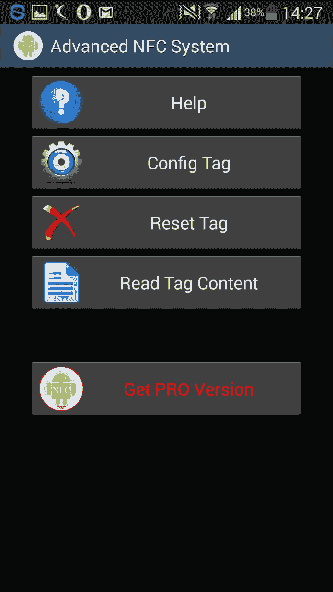

# 第五章。与其他平台合作

在本章中，我们将介绍：

+   设置 Blackberry 开发环境和模拟器

+   设置 Blackberry 渗透测试环境

+   设置 Windows 手机开发环境和模拟器

+   设置 Windows 手机渗透测试环境

+   配置 Blackberry 手机的流量拦截设置

+   从 Windows 手机应用程序中窃取数据

+   从 Blackberry 应用程序中窃取数据

+   在 Windows 手机中读取本地数据

+   基于 NFC 的攻击

# 介绍

在本章中，我们将介绍其他移动平台。到目前为止，我们在本书中重点讨论了 Android 和 iOS 平台。这里，我们利用机会介绍 Blackberry 和 Windows Phone 作为下一个流行的移动平台。

Blackberry 长期以来一直是企业用户的最爱手机。尽管 Blackberry 在智能手机市场的份额有所下降，但它仍然具有足够的用户群体，因此值得在本书中介绍和讨论。QWERTY 键盘曾经是早期 Blackberry 手机的特点。

Windows 手机正受到越来越多用户的青睐。Windows 7 和 8 的成功推动了这一趋势，后续的手机计划带来更多创新。屏幕的垂直滑动动作是 Windows 手机的一个特点。

学习移动平台的最常见方面包括设置开发和渗透测试环境、学习模拟器、配置流量拦截设置，以及读取/窃取这些手机中的数据。因此，让我们在本章中为 Blackberry 和 Windows 平台的学习做好准备。此外，还有一项关于 **近场通信**（**NFC**）攻击的奖励配方。

# 设置 Blackberry 开发环境和模拟器

要开始学习任何新的移动平台，您应该按照以下顺序操作：

+   学习设置 **集成开发环境**（**IDE**）

+   学习编程语言并编写应用程序

+   学习使用模拟器和仿真器调试应用程序

+   设置渗透测试环境

+   学习在（当前）移动平台上的渗透测试方面

下载 **Blackberry**（**BB**）的 Momentics IDE。安装并设置 IDE。它可以连接到 Blackberry 手机和 Blackberry 模拟器。

从这里开始，我们将重点讨论 Blackberry 模拟器。

## 做好准备

下载 **Blackberry Device 10 Simulator**。我们使用了 Windows 操作系统。对应的模拟器可以从以下网址下载：[`developer.blackberry.com/develop/simulator/simulator_installing.html`](http://developer.blackberry.com/develop/simulator/simulator_installing.html)

## 如何操作...

1.  运行安装程序文件，它会指导你完成安装步骤。安装完成后，你将看到如下界面：

1.  接下来，定位并运行 `runBB10Simulator.bat` 文件。运行该 bat 文件后，Blackberry 模拟器的监听组件将启动。

1.  现在找到 VMware 文件 `BlackBerry10Simulator.vmx` 并启动 VMware。VMware 镜像启动后，会为你启动一个模拟器，如下所示：

## 它是如何工作的...

批处理文件是黑莓模拟器的监听组件。必须运行批处理文件，否则黑莓模拟器将无法运行。请注意，批处理文件的 DOS 窗口需要保持打开状态，直到 BB10 模拟器使用完毕。

BB10 模拟器在虚拟机镜像中启动。可以根据我们的需求进行配置。请参考本食谱中*另请参见*部分提到的 BB10 模拟器用户指南。

## 还有更多...

Momentics IDE 可用于连接到 BB 手机或 BB 模拟器。这完成了开发环境及其运行时集成。可以在 IDE 中开发应用程序，并可以在连接的设备或模拟器中进行调试或运行。

## 另请参见

+   [`developer.blackberry.com/devzone/files/develop/simulator/BB10_Device_Simulator_UG.pdf`](https://developer.blackberry.com/devzone/files/develop/simulator/BB10_Device_Simulator_UG.pdf)

# 设置黑莓渗透测试环境

一旦你熟悉了黑莓平台、模拟器和/或手机，便可以进入渗透测试的状态。移动应用程序的渗透测试可以大致分为四个类别：

+   与移动应用流量相关的攻击

+   与移动设备存储相关的攻击

+   与移动应用源代码相关的攻击

+   涉及移动操作系统功能的攻击，这些功能被移动应用程序使用

渗透测试实验室应当配备基本设施，以满足上述四个类别的需求。

## 准备工作

我们需要为黑莓渗透测试搭建一个实验室。为了开始，我们需要以下工具：

+   黑莓 IDE

+   黑莓手机

+   黑莓模拟器

+   代理工具，如 Charles、Burp Suite 和 Fiddler

+   一台 Wi-Fi 网络

+   黑莓备份工具

+   数据线

+   反编译工具

## 如何操作...

让我们看看这些工具如何提供帮助：

+   **黑莓 IDE**：此 IDE 主要用于代码审查任务。可以分析 BB 应用的代码，以发现来自开发常见错误或业务逻辑错误的安全问题。在纯粹的渗透测试任务中，通常不需要此步骤。黑莓 IDE 的安装在前面的食谱中有详细介绍。

+   **黑莓手机**：必须测试运行时应用程序。需要 BB 手机来安装并运行应用程序，以便进行渗透测试。

+   **黑莓模拟器**：模拟器还提供了用于调试和渗透测试的运行时环境。模拟器是救命稻草；当特定版本的手机不可用时，我们可以切换到该版本的模拟器。然而，如果 RAM 或磁盘空间有限，模拟器可能会变得很慢，使用起来也会变得困难。黑莓模拟器作为 IDE 的一部分安装；我们在之前的食谱中已经学过这个。

+   **代理工具，如 Charles、Burp Suite 和 Fiddler**：各种代理工具可以从它们的网站上下载。这些工具非常直接，也有相关的指南和帮助论坛。这些工具容易安装；只需从各自的网站下载安装程序，点击几下就能使工具准备就绪。

+   **Wi-Fi 网络**：我们需要一个 Wi-Fi 网络来拦截 Wi-Fi 流量。稍后我们将为移动设备设置一个代理，使其连接到运行代理工具的笔记本电脑，并且二者都在同一个 Wi-Fi 网络上。

    你可以使用 Wi-Fi 路由器来设置个人 Wi-Fi 网络，或者使用一些免费工具将笔记本电脑设置为热点。根据我们的经验，使用后者有时会遇到困难，因此我们建议使用前者。

+   **Blackberry 备份工具**：用于获取 Blackberry 备份并从备份中提取或挖掘数据的工具。传统上，BB 手机上存储的数据很难被窃取。这可以通过从手机获取备份并从备份中挖掘数据来解决。

    像 Blackberry Extractor 或 BlackBerry Backup Extractor 这样的工具在这方面非常有用。

+   **数据线**：拥有一根数据线也非常重要。稍后我们将使用它连接手机，读取数据并进行通过 USB 发起的攻击。

+   **反编译工具**：这些工具在我们的实验室中也非常重要。这些小工具帮助我们进行应用程序的反编译。在本章中，我们将使用一个名为 Coddec 的工具，并在接下来的步骤中进行演示，涵盖此工具的安装和使用方法。

## 它是如何工作的...

准备好我们的渗透测试实验室工具后，让我们看看如何将渗透测试的使用案例与不同类别的工具进行关联：

+   **移动应用流量相关攻击**：在这一部分，Wi-Fi 网络和代理工具将派上用场。一台安装了 Charles 或 Burp 代理的笔记本电脑连接到 Wi-Fi 网络。一台运行应用程序的移动设备通过设备上的代理配置连接到笔记本代理。由于笔记本电脑和移动设备位于同一 Wi-Fi 网络上，应用程序流量将通过 Charles 或 Burp 代理工具路由。配置模拟器或手机中的适当代理设置，以便将流量路由到 Charles 或 Burp 代理工具。

    实际上，整个过程使得应用程序流量可以通过代理工具进行读取和编辑，我们可以进行各种攻击，如参数篡改以绕过业务逻辑或获取特权访问。

+   **移动设备存储相关攻击**：我们需要一根数据线将手机连接到笔记本电脑。笔记本上安装有模拟器，二者都可以运行移动应用程序。使用 Blackberry 桌面软件将手机连接到笔记本电脑。这个通道可能导致数据窃取攻击，例如直接读取手机数据或为离线数据挖掘而备份手机数据。

+   **与移动应用源代码相关的攻击**：反编译 BB 应用程序会得到原始源代码。可以使用 Coddec 工具来执行此操作。应用程序源代码中硬编码的敏感数据会被揭示出来。

## 还有更多...

涉及移动操作系统特性以及被移动应用程序使用的攻击是最复杂的一类。有各种 BB OS 相关的功能，应用程序与之交互，例如蓝牙、NFC、意图、广播接收器等。这些也需要在渗透测试中涵盖。

## 另见

+   [`us.blackberry.com/software/desktop.html`](http://us.blackberry.com/software/desktop.html)

+   [`www.blackberryextractor.com/`](http://www.blackberryextractor.com/)

# 设置 Windows 手机开发环境和模拟器

正如我们之前所学，为了开始一个新的移动平台开发，我们需要遵循以下顺序：

+   学习如何设置集成开发环境

+   学习编程语言并开发应用程序

+   学习使用模拟器和仿真器调试应用程序

+   设置渗透测试环境

+   学习当前移动平台的渗透测试方面

Visual Studio 一直是 Windows 应用程序的开发框架。

从 Windows 10 开始，**通用 Windows 平台**（**UWP**）被用于应用程序开发。正如其名，UWP 应用可以在任何类型的 Windows 平台（平板电脑、手机和桌面）上运行。

## 准备工作

从[`dev.windows.com/en-us/downloads/sdk-archive`](https://dev.windows.com/en-us/downloads/sdk-archive)下载 Windows Phone SDK。

模拟器也可以从相同的代码库中下载。对于通用 Windows 应用程序，SDK 和模拟器的下载链接位于上述代码库链接的顶部部分。

我们在本教程中使用了 Windows 8.1 SDK 和模拟器。

## 如何操作...

1.  从[`go.microsoft.com/fwlink/p/?LinkId=323507`](http://go.microsoft.com/fwlink/p/?LinkId=323507)下载 Windows 8.1 SDK。

1.  运行安装程序文件，它将引导你完成安装步骤。以下界面允许你选择要安装的功能：

1.  安装完成后，会显示**欢迎使用 Windows 8.1 软件开发工具包**的消息。

1.  现在，请继续从以下地址下载并安装 Windows 8.1 模拟器：

    [`www.microsoft.com/en-us/download/details.aspx?id=43719`](https://www.microsoft.com/en-us/download/details.aspx?id=43719)

1.  可以使用`xde.exe`启动模拟器。一旦选择了初始偏好设置，模拟器窗口就会启动，现在你已经创建了 Windows 应用开发和运行时环境。

## 它是如何工作的...

在 Windows 8.1 上进行开发需要 SDK、模拟器和.Net 框架。应用程序可以在 Windows 8.1 上进行编码，并且可以在模拟器中运行。或者，预编码的应用程序和构建好的应用程序可以独立在模拟器中运行。这是因为模拟器也可以作为 Hyper-V 虚拟机在 SDK 外部启动，并作为 VHD 运行。

随着微软在 Windows 10 上推广**通用 Windows 平台**（**UWP**），开发预计将向 Windows 10 和 UWP 迁移。一次性编写应用并可以在手机、平板和桌面等多个地方使用是有意义的。UWP 有望改变整个 Windows 应用程序开发的格局。

## 还有更多……

一旦你掌握了 SDK 和模拟器，接下来就是编码第一个应用程序了。建议读者尝试在 Windows 8.1 或 Windows 10 UWP 平台上编写基本应用，以便更好地了解平台的特性。微软官网本身就是一个很好的起点，它提供了很多学习用的示例代码。示例应用的链接可在本节的*另见*部分找到。

## 另见

+   [`insidethecloudos.azurewebsites.net/running-windows-8-1-phone-emulator-outside-of-visual-studio-2013-and-2015/`](http://insidethecloudos.azurewebsites.net/running-windows-8-1-phone-emulator-outside-of-visual-studio-2013-and-2015/)

+   [`channel9.msdn.com/Series/Windows-Phone-8-1-Development-for-Absolute-Beginners/Part-11-Working-with-the-Windows-Phone-8-1-Emulator`](https://channel9.msdn.com/Series/Windows-Phone-8-1-Development-for-Absolute-Beginners/Part-11-Working-with-the-Windows-Phone-8-1-Emulator)

+   [`dev.windows.com/en-us/samples`](https://dev.windows.com/en-us/samples)

# 设置 Windows 手机渗透测试环境

一旦你掌握了 Windows 平台 SDK、模拟器和手机的基础，就可以开始准备进行渗透测试了。正如你之前所学，我们将以四大类为框架来分析 Windows 平台的渗透测试：

+   与移动应用流量相关的攻击

+   与移动设备存储相关的攻击

+   与移动应用源代码相关的攻击

+   涉及移动操作系统特性的攻击，通常由移动应用使用

Windows 平台的渗透测试实验室还需要配备基本的必需品，以满足前述四类需求。

## 准备就绪

我们需要为 Windows 手机渗透测试搭建实验室。开始之前，我们需要以下设备：

+   Windows 手机 SDK

+   Windows 手机或平板

+   Windows 手机模拟器

+   代理工具，如 Charles、Burp Suite 和 Fiddler

+   一张 Wi-Fi 网络

+   一根数据线

## 如何操作……

让我们看看这些工具如何帮助：

+   **Windows Phone SDK**：该 SDK 主要用于代码审查任务。Windows 应用的代码可以被分析，以发现开发过程中的任何安全问题——如通用错误或业务逻辑错误。在纯渗透测试任务中，通常不需要这一环节。

    同时，Windows SDK 在读取从打包应用中窃取的代码文件时也会派上用场。我们已经在前面的配方中设置了 Windows 手机 SDK。

+   **Windows 移动设备/平板电脑**：必须测试运行时应用程序。需要 Windows 移动设备和平板电脑来安装和运行应用程序，以便进行渗透测试。

+   **Windows 手机模拟器**：模拟器还为调试和渗透测试提供了运行时环境。模拟器是救命稻草；当无法获取特定版本的手机时，我们可以切换到该特定版本的模拟器。通过从 SDK 安装目录启动 `xde.exe` 可以访问模拟器。

+   **代理工具，如 Charles、Burp Suite 和 Fiddler**：各种代理工具可以从它们的官方网站下载。这些工具非常简单，而且有相关的指南和帮助论坛。这些工具很容易安装；只需从各自的网站下载安装程序，点击几下就能使工具准备就绪。Wi-Fi 网络：我们需要一个 Wi-Fi 网络来截获 Wi-Fi 流量。我们稍后会将移动设备的代理设置为运行代理工具的笔记本电脑，并确保它们在同一个 Wi-Fi 网络上。

    你可以使用 Wi-Fi 路由器设置自己的个人 Wi-Fi 网络，或者使用一些免费的工具从笔记本电脑创建热点。根据我们的经验，后者有时较为困难，因此我们更倾向于使用前者。

+   **数据线**：拥有一根数据线也很重要。稍后我们将使用它连接手机以读取数据并执行通过 USB 发起的攻击。

## 如何操作...

在我们的渗透测试实验室中，工具已准备就绪，接下来让我们看看如何将渗透测试用例与使用这些工具的不同类别关联起来：

+   **与移动应用流量相关的攻击**：Wi-Fi 网络和代理工具用于攻击移动应用流量。安装了 Charles 或 Burp 代理的笔记本电脑连接到 Wi-Fi。运行应用程序的移动设备被指向笔记本电脑代理，并使用设备上的代理配置。由于笔记本电脑和移动设备在同一 Wi-Fi 网络上，应用流量通过 Charles 或 Burp 代理工具进行路由。在模拟器或手机中配置适当的代理设置，以便将流量路由到 Charles 或 Burp 代理工具。现在，流量可以通过代理工具进行篡改，从而进行参数操控、注入等类型的攻击。

+   **与移动设备存储相关的攻击**：我们有数据线将手机连接到笔记本电脑。我们有模拟器可以在笔记本电脑上运行移动应用程序。使用 WP Power 工具将手机连接到笔记本电脑。这个通道可能导致数据窃取攻击，例如直接读取或篡改手机数据。我们将在本章的倒数第二个配方中演示这一点。

+   **移动应用源代码相关攻击**：通过使用 SDK 和其他反编译工具，可以获取 Windows 手机应用的原始源代码。执行此步骤是为了揭示硬编码的敏感数据或在客户端移动应用源代码中编写的敏感业务逻辑。

## 还有更多内容…

涉及移动操作系统特性（由移动应用使用）的攻击是最复杂的一类。这些应用与许多 Windows 操作系统相关特性交互，如蓝牙、NFC、意图、广播接收器等。这些内容也需要在渗透测试中进行覆盖。

## 另见

+   [`pen-testing.sans.org/blog/2011/10/28/mobile-application-assessments-part-2-a-look-at-windows-mobile`](http://pen-testing.sans.org/blog/2011/10/28/mobile-application-assessments-part-2-a-look-at-windows-mobile)

+   [`resources.infosecinstitute.com/windows-phone-digital-forensics-2/`](http://resources.infosecinstitute.com/windows-phone-digital-forensics-2/)

+   [`www.securityninja.co.uk/application-security/windows-phone-app-analyser-v1-0-released-today-2/`](https://www.securityninja.co.uk/application-security/windows-phone-app-analyser-v1-0-released-today-2/)

# 配置 Blackberry 手机的流量拦截设置

传统上，Blackberry 手机并未提供为用户设置代理的选项。没有选项可以指定代理设置（代理 IP 地址和端口号）。因此，我们无法为这些手机设置代理。但是，为了测试目的，我们使用了模拟器，并设置了代理进行测试。现在让我们学习如何为 Blackberry 模拟器设置代理。

## 准备就绪

首先，我们需要准备好环境。此步骤要求在测试机上安装以下任意工具：

+   **MDS 服务器与 Blackberry 模拟器**：使用 MDS 和 Blackberry 模拟器的组合来模拟**Blackberry 企业服务器**（**BES**）的连接服务。

+   **Blackberry 10 模拟器**：将 Blackberry 10 模拟器作为独立设备使用。在本书的前面，我们已经学习了 Blackberry 10 模拟器的相关内容。

+   **Blackberry 手机设备**：也可以在 Blackberry 10 手机上设置代理。

## 如何操作…

安装可以通过以下两种方法之一完成。

### 案例 1 - 使用 MDS 服务器和 Blackberry 模拟器

这种组合在模拟 BES 服务器类型的环境时非常有用。必须通过修改 MDS 服务器的配置文件来设置代理。该配置文件负责网络连接，因此设备的流量将通过指定的代理进行路由。

以下是在 MDS 服务器配置中所需的配置：

1.  在安装目录中找到`rimpublic.property`文件。我们在我们的设备上找到了该路径：`C:\Program Files\Research In Motion\Blackberry JDE 5.0.0\MDS\config`。

1.  在 `rimpublic.property` 文件中，找到 `[HTTP_HANDLER]` 部分，并通过添加以下代理配置规范行来修改此部分：

    ```
    application.handler.http.proxyEnabled= true 
    application.handler.http.proxyHost= localhost 
    application.handler.http.proxyPort= 9999 

    ```

### 案例 2 - 黑莓 10 模拟器

假设您已经按照*设置黑莓开发环境和模拟器*的步骤完成了设置，您现在可以开始当前的操作：

1.  搜索网络连接并在**系统设置**下找到**网络和连接**。您的模拟器屏幕应该类似于以下截图：

1.  现在继续操作**网络和连接**，并将您的设备添加到实验室设置的可用 Wi-Fi 网络中。

1.  在连接的 SSID 设置下，配置代理详细信息，如**代理服务器**、**代理端口**、**用户名**和**密码**（如适用），如以下屏幕所示：

这将通过 Wi-Fi 将模拟器连接到代理工具，您现在可以篡改应用程序流量。

### 案例 3 - 黑莓 10 手机

按照案例 2 中的类似步骤，在黑莓手机上进行设置，而不是模拟器。您的手机应该开始通过 HTTP 代理工具发送应用程序流量。

## 工作原理...

现在让我们看看拦截是如何工作的。首先，我们需要配置 Burp 代理以在 `9999` 端口上运行。以下截图显示了配置为在 `9999` 端口上运行后的界面。点击**编辑**按钮，修改端口号字段为 `9999`，点击**确定**按钮后，**代理监听器**选项卡将如下所示：


现在黑莓模拟器和 Burp Proxy 正在工作，应用程序流量可以被捕获和编辑。通过篡改应用程序流量，可以进行各种与 Web 应用程序相关的攻击。

## 还有更多...

尝试不同的代理工具：

根据我们的经验，我们注意到有时某些代理工具无法处理所有移动应用流量。通常，如果应用捕获无法正常工作，切换代理工具是一个好主意。通常，Burp Suite 和 Charles Proxy 能够处理大多数类型的移动应用流量。

此外，Burp Proxy 默认的 `8080` 端口与 MDS 存在冲突，这就是我们在配置中使用端口 `9999` 的原因。使用 Charles Proxy 时，默认端口为 `8888`，这意味着您默认不会遇到 MDS 冲突。

## 另见

+   [`supportforums.blackberry.com/t5/Testing-and-Deployment/Configure-the-BlackBerry-MDS-Simulator-to-work-behind-a-proxy/ta-p/446115`](http://supportforums.blackberry.com/t5/Testing-and-Deployment/Configure-the-BlackBerry-MDS-Simulator-to-work-behind-a-proxy/ta-p/446115)

+   [`prashantverma21.blogspot.in/2011/12/setting-up-proxy-for-blackberry.html`](http://prashantverma21.blogspot.in/2011/12/setting-up-proxy-for-blackberry.html)

# 从 Windows Phone 应用程序窃取数据

从存储在手机上的应用程序源代码中窃取数据是一个重要的攻击路径。OWASP 移动应用程序十大漏洞将其列为 M10：缺乏二进制保护。逆向工程移动应用程序以获取反编译的源代码，然后挖掘硬编码在应用程序中的数据，可能会导致敏感数据泄露。有时开发者会在应用程序中硬编码连接字符串、密码、密钥或访问令牌。

这个方案执行反编译以窃取 Windows Phone 应用程序中 `.xap` 格式的数据。

## 准备中

将 `.dll` 文件转换为 `.cs` 或 `.vb` 项目文件的工具如下所示：

+   **ILSpy**：ILSpy 是一个非常有用的开源工具，用于反编译和操作 .NET 应用程序。我们将使用它将 DLL 文件转换为原始的 `.cs` 或 `.vb` 文件。

+   **解压工具**：Winrar/WinZip/7zip


Windows 市场应用程序是 **数字版权管理** (**DRM**) 保护的，可能并不容易通过解压文件直接获取 DLL：

1.  学习应用程序包的内容，并注意其中存在的 `.dll` 文件：

1.  现在使用 ILSpy 来反编译 DLL 文件并获取原始源代码。在 ILSpy 控制台中，点击 **文件** 菜单下的 **打开**，并提供要反编译的 DLL 文件路径：

1.  这个过程的结果是整个应用程序的源代码（以下截图显示了其中的一部分）。现在可以在源代码中查找硬编码的机密信息，如密钥、密码、PIN 等：

## 它是如何工作的...

Windows Phone 编译套件将开发者的 .net 文件编译成 DLL 对象代码文件，然后将 `.dll` 文件转换为 `.xap` 文件。XAP 是 Silverlight 或 Windows Phone 兼容的应用程序。

这个方法的主要目标是获取中间的 `.dll` 文件，然后使用 `.net` 反编译器来反编译它并获取项目文件。我们在前面已经讨论了这两步：

+   分析 XAP 文件并获取 DLL。

+   使用 ILSpy 获取 DLL 文件的反编译源代码。

## 还有更多...

反编译后的源代码现在可以使用。接下来做什么？

使用反编译工具的搜索功能，或者将反编译后的代码提取到一个文件夹中，并使用 `grep` 或 `find` 命令。可以使用 `password`、`pwd`、`key`、`connection`、`encryption` 和 `o-auth` 等关键字在静态字符串搜索中查找敏感信息。

手动浏览文件名，这些文件可能实现了关键的业务逻辑、身份验证或加密。

尝试使用从源代码中获得的信息破解应用服务器。

混淆器被智能开发者用来让黑客和破解者的任务变得更加困难。源代码被混淆，使得反编译后的代码难以理解。

## 另见

+   **免费的开源混淆器**：[`yck1509.github.io/ConfuserEx/`](http://yck1509.github.io/ConfuserEx/)

# 从 Blackberry 应用程序中窃取数据

从手机上存储的应用程序源代码中窃取数据，正如 OWASP Mobile Top 10 中识别的 M10：缺乏二进制保护，成为泄露敏感硬编码数据的来源。逆向工程移动应用程序以获取反编译后的源代码，然后挖掘应用程序中硬编码的数据。有时开发者倾向于将连接字符串、密码、密钥或访问令牌硬编码在应用程序中。

本教程将前一个教程的目标扩展到 Blackberry 平台，并尝试反编译`.cod`格式的 Blackberry 应用程序。

## 准备工作

根据当前的操作步骤，需要以下工具进行准备：

+   **Coddec**：需要一个工具将`.cod`文件转换为`.java`文件。我们使用了 Coddec 来完成这个工作。

+   **一些`.cod`文件**：我们需要一些`.cod`文件格式的应用程序文件来尝试反编译。

## 如何操作...

执行以下步骤：

1.  将所有`.cod`文件从设备复制到计算机上（这些`.cod`文件可以在安装应用程序于外部 SD 卡的 Blackberry 手机的外部 SD 卡中找到）。用记事本打开这些文件并检查加密和不可读的形式：

1.  现在，按照以下截图提取`coddec`工具。`doit.bat`文件是执行命令并进行反编译的命令：

1.  将`.cod`文件复制到`coddec`工具文件夹中。

1.  在命令行中运行`doit.bat *.cod`命令。此操作将不可读的`.cod`文件转换为可读的记事本文件，并使源代码更容易解读。

## 它是如何工作的...

Blackberry 编译器套件将开发者的 Java 文件编译成类文件，然后将类文件转换为`.cod`文件。`.cod`文件与 Blackberry 的代码文件有关。这些是 Blackberry 专有的应用程序代码包格式。

为了逆向应用程序源代码，我们使用了一个叫 Coddec 的工具，它帮助我们将加密的`.cod`专有代码转换为可读的代码文件。

## 还有更多...

一旦应用程序代码被反编译，我们就可以定位一些敏感的有用数据。让我们浏览代码内容并搜索诸如`keys`、`algorithm`、`password`、`authentication`、`formula`等关键字。

在我们的案例中，我们获取了 RIM API 或库引用。虽然这可能不会直接导致破解，但它帮助我们理解移动应用程序的设计。

黑莓平台的最新版本配备了更强大的编译过程，使得获取代码引用变得更加困难。

在黑莓平台上也可以使用混淆技术来保护源代码。通过在 Blackberry JDE 中执行特定步骤可以实现此功能。请按照下面的链接进行操作。

## 另见

+   [`supportforums.blackberry.com/t5/Java-Development/Obfuscate-code-in-a-BlackBerry-application/ta-p/444843`](https://supportforums.blackberry.com/t5/Java-Development/Obfuscate-code-in-a-BlackBerry-application/ta-p/444843)

# 在 Windows Phone 中读取本地数据

正如我们在本书中之前学到的，移动应用通常会将数据存储在手机上。存储的数据在不同的移动平台上可能采用不同的格式，如`.plist`、`.sqlite`和`.xml`文件。OWASP 在 M2 中识别了这一点：不安全的数据存储。在应用程序文件夹中（例如 Android 的`/data/data`）进行数据挖掘可能导致敏感数据泄露。本节内容旨在为您提供如何从 Windows Phone 内存中读取本地存储数据的详细信息。

## 准备工作

根据当前食谱，准备工作所需的工具如下：

+   **WP Power Tools**：Windows Phone Power Tools 允许您与应用程序交互并执行存储分析等操作

+   **应用程序的 XAP 文件**：我们需要几个 XAP 文件来分析它们的存储

## 如何操作…

执行以下步骤：

1.  从此链接安装 Windows Phone Power Tools 到 Windows 8 系统上（[`wptools.codeplex.com/releases/view/97029`](http://wptools.codeplex.com/releases/view/97029)）。通过 USB 连接将 Windows Phone 与笔记本电脑连接。

1.  安装完成后，启动 WP Power Tools 并通过**连接到设备**选项卡将其连接到 Windows 设备。如下图所示：

1.  使用**WP Power Tools**，将 XAP 文件安装到 Windows 设备上，如下图所示：

1.  一旦应用程序安装在设备上，浏览并退出应用程序。

1.  打开 WP Power Tools 的**隔离存储**选项卡，右键单击应用程序名称图标。如下图所示（使用测试应用）。点击**刷新**以填充数据：

1.  浏览名为应用程序的文件夹中的文件：

## 它是如何工作的…

Windows Phone Power Tools 通过安装 Windows 应用程序（`.xap`文件）并分析应用程序创建的文件结构来工作。这最终会将我们引导到本地存储的数据。例如，在本食谱中提到的示例中，发现了一个 SQLite 文件，如下图所示：


由于该过程依赖于应用程序的安装，因此从 Windows Store 安装的应用程序无法通过这种方式进行分析。

## 还有更多内容...

作为 Windows Phone 8 SDK 的一部分，有一个名为 Isolated Storage Explorer 的工具。这个命令行工具可以读取和修改手机应用程序本地数据文件夹中的文件（这与 Android 的 ADB 工具类似）。关于 Isolated Storage Explorer 的使用信息可以在这里找到：

[`msdn.microsoft.com/en-in/library/windows/apps/hh286408(v=vs.105).aspx`](https://msdn.microsoft.com/en-in/library/windows/apps/hh286408(v=vs.105).aspx)

## 参见

+   [`wptools.codeplex.com/releases/view/97029`](http://wptools.codeplex.com/releases/view/97029)

+   [`resources.infosecinstitute.com/windows-phone-digital-forensics-2/`](http://resources.infosecinstitute.com/windows-phone-digital-forensics-2/)

# 基于 NFC 的攻击

**近场通信**（**NFC**）是一种为近距离设备设计的通信机制。支持 NFC 的设备可以像蓝牙设备一样互相通信，而无需互联网。支持 NFC 的手机中配备了一种硬件芯片，使得 NFC 能够与其他设备进行通信。

一些组织已经开始使用支持 NFC 的 MiFare 卡和卡片读取器。用户的出勤和访问控制记录通过这种方式进行日志记录。这些卡片还可以用来在食堂等地方进行支付。

Google Wallet 是一个很好的例子，它可以使用 NFC 进行支付。

## 准备工作

要尝试基于 NFC 的黑客攻击，你需要：

+   支持 NFC 的手机

+   NFC 标签或 NFC 信用卡

+   例如 Android 手机上使用的 NFCProxy 应用程序

+   从 Play Store 下载的 NFC 应用程序，如 NFC Reader 或 Advanced NFC System

## 如何操作...

执行以下步骤：

1.  在你的 Android 手机上安装 NFCProxy 工具和其他 NFC 应用程序（如 NFC Reader 和 Advanced NFC System）。

1.  NFCProxy 可以从 [`sourceforge.net/projects/nfcproxy/`](https://sourceforge.net/projects/nfcproxy/) 下载。其他工具也可以在 Play Store 中找到。

1.  用运行 NFC 工具的手机触碰 NFC 标签

1.  注意，在 NFC 通信范围内（不到 4 厘米），这些 NFC 应用程序可以读取存储在 NFC 标签上的数据。

1.  这是使用 **Advanced NFC System** 时你看到的界面：注意，你可以使用它读取、重置或配置 NFC 标签。

1.  你可以使用 NFCProxy 代理 NFC 卡片读取器和支持 NFC 的卡片之间的交易数据。以下是工具显示保存的 NFC 数据的截图（由工具创作者提供）：

## 它是如何工作的...

NFC 可以通过多种方式受到攻击。常见的 NFC 攻击包括：

+   窃听

+   数据篡改

+   数据模糊处理

### 窃听

NFC 的一个常见问题是缺乏加密。NFC 通信可以被恶意的近距离设备嗅探，因为加密缺失或使用了弱编码，因此传输的数据可以被获取。

如果在企业场景中，嗅探到启用 NFC 的 MiFare 卡之间的通信，那么员工 ID 以及与之唯一关联的令牌（用于记录员工考勤）等数据就会被盗取。然后，这些被盗数据可以被克隆，用来创建恶意 NFC 设备，进而绕过整个组织的访问控制。

### 数据篡改

NFC Proxy 是一个安卓应用程序。它可以用来在 RFID 卡和读卡器之间设置代理。通过代理模式捕获的敏感数据可以显示、重放或删除。保存的数据稍后可以用来克隆支付卡，从而创建重复的 NFC 设备。这些伪造的卡片后来将被用于欺诈交易，或者捕获的交易可以被重复多次，从而对受害者造成经济损失。

### 数据模糊处理

一旦我们控制了捕获的数据，它可以被篡改，也可以用长字符串进行模糊处理。这可能导致类似缓冲区溢出的攻击。

## 还有更多……

移动应用程序往往将数据存储在手机上。手机中较弱的 NFC 通信设置可能成为攻击者的助力。NFC 应用可能会利用手机中存储的数据进行通信。像 NFC 设备身份验证要求缺失以及 NFC 中缺少加密这样的弱设置，成了攻击者的利器。

考虑一下支付应用程序，它将信用卡信息存储在手机中，并在进行支付时显示相应的信息。在这里进行有针对性的攻击可以嗅探到在两个 NFC 设备之间交换的信用卡详细信息。

确保手机上安全地配置 NFC 是非常重要的。以下是一些安全措施：

+   在不需要时关闭 NFC

+   保持设备更新，安装最新的 NFC 补丁

+   为其他 NFC 设备配置身份验证密码，如果设备允许的话。

## 另见

+   [`blackwinghq.com/assets/labs/presentations/EddieLeeDefcon20.pdf`](http://blackwinghq.com/assets/labs/presentations/EddieLeeDefcon20.pdf)

+   [`sourceforge.net/projects/nfcproxy/`](http://sourceforge.net/projects/nfcproxy/)
