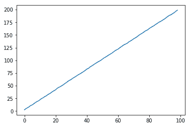

# 第一章：网络安全中的机器学习

在本章中，我们将介绍机器学习的基本技术。我们将在全书中使用这些技术来解决有趣的网络安全问题。我们将涵盖基础算法，如聚类和梯度提升树，并解决常见的数据挑战，如数据不平衡和假阳性约束。在网络安全领域，机器学习实践者处于一个独特且令人兴奋的位置，能够利用大量数据并在不断发展的环境中创造解决方案。

本章涵盖以下内容：

+   训练-测试分割你的数据

+   标准化你的数据

+   使用**主成分分析**（**PCA**）总结大型数据

+   使用马尔可夫链生成文本

+   使用 scikit-learn 进行聚类

+   训练 XGBoost 分类器

+   使用 statsmodels 分析时间序列

+   使用 Isolation Forest 进行异常检测

+   使用哈希向量器和 tf-idf 与 scikit-learn 进行**自然语言处理**（**NLP**）

+   使用 scikit-optimize 进行超参数调整

# 技术要求

在本章中，我们将使用以下内容：

+   scikit-learn

+   Markovify

+   XGBoost

+   statsmodels

安装说明和代码可以在[`github.com/PacktPublishing/Machine-Learning-for-Cybersecurity-Cookbook/tree/master/Chapter01`](https://github.com/PacktPublishing/Machine-Learning-for-Cybersecurity-Cookbook/tree/master/Chapter01)找到。 [](https://github.com/emmanueltsukerman/MLforCSCookbook)

# 训练-测试分割你的数据

在机器学习中，我们的目标是创建一个能够执行从未被明确教过的任务的程序。我们实现这一目标的方法是利用我们收集的数据来*训练*或*拟合*一个数学或统计模型。用于拟合模型的数据称为*训练数据*。训练得到的模型随后用于预测未来的、以前未见过的数据。通过这种方式，程序能够在没有人工干预的情况下处理新情况。

对于机器学习实践者来说，一个主要的挑战是*过拟合*的风险——即创建一个在训练数据上表现良好，但无法对新的、从未见过的数据进行推广的模型。为了应对过拟合问题，机器学习实践者会预留出一部分数据，称为*测试数据*，并仅用于评估训练模型的性能，而不是将其包含在训练数据集中。精心预留测试集是训练网络安全分类器的关键，在这里，过拟合是一个无处不在的危险。一个小小的疏忽，例如仅使用来自某一地区的良性数据，可能导致分类器效果差。

有多种方法可以验证模型性能，比如交叉验证。为了简化，我们将主要关注训练-测试分割。

# 准备工作

本教程的准备工作包括在`pip`中安装 scikit-learn 和`pandas`包。安装命令如下：

```
pip install sklearn pandas
```

此外，我们还提供了`north_korea_missile_test_database.csv`数据集，以供本教程使用。

# 如何操作……

以下步骤演示了如何将一个数据集（包含特征`X`和标签`y`）拆分为训练集和测试集：

1.  首先导入`train_test_split`模块和`pandas`库，并将特征读取到`X`中，将标签读取到`y`中：

```
from sklearn.model_selection import train_test_split
import pandas as pd

df = pd.read_csv("north_korea_missile_test_database.csv")
y = df["Missile Name"]
X = df.drop("Missile Name", axis=1)
```

1.  接下来，随机将数据集及其标签拆分为一个训练集（占原始数据集的 80%）和一个测试集（占原始数据集的 20%）：

```
X_train, X_test, y_train, y_test = train_test_split(
    X, y, test_size=0.2, random_state=31
)
```

1.  我们再次应用`train_test_split`方法，以获得一个验证集，`X_val`和`y_val`：

```
X_train, X_val, y_train, y_val = train_test_split(
    X_train, y_train, test_size=0.25, random_state=31
)
```

1.  我们最终得到了一个训练集，占原始数据的 60%，一个验证集占 20%，一个测试集占 20%。

以下截图显示了输出结果：


# 它是如何工作的……

我们从读取数据集开始，数据集包含朝鲜的历史和持续的导弹实验。我们的目标是根据剩余特征（如设施和发射时间）预测导弹类型。这是步骤 1 的内容。在步骤 2 中，我们应用 scikit-learn 的`train_test_split`方法将`X`和`y`细分为一个训练集`X_train`和`y_train`，以及一个测试集`X_test`和`y_test`。`test_size = 0.2`参数表示测试集占原始数据的 20%，其余部分放入训练集中。`random_state`参数允许我们复现相同的*随机生成*的拆分。接下来，关于步骤 3，需要注意的是，在实际应用中，我们通常希望比较几个不同的模型。使用测试集选择最佳模型的危险在于，我们可能会过度拟合测试集。这类似于数据钓鱼的统计学错误。为了应对这一危险，我们创建了一个额外的数据集，称为验证集。我们在训练集上训练模型，使用验证集进行比较，最后使用测试集来获得我们选择的模型的准确性能指标。因此，在步骤 3 中，我们选择参数，使得从数学角度来看，最终结果包含 60%的训练集，20%的验证集和 20%的测试集。最后，我们通过使用`len`函数来计算数组的长度，来仔细检查我们的假设（步骤 4）。

# 标准化你的数据

对于许多机器学习算法，性能对特征的相对尺度非常敏感。因此，通常需要对特征进行*标准化*。标准化特征意味着将其所有值平移，使其均值为 0，并对其进行缩放，使其方差为 1。

标准化在某些情况下非常有用，特别是在处理文件的 PE 头信息时。PE 头信息包含极大的数值（例如，`SizeOfInitializedData` 字段），也包含非常小的数值（例如，节区的数量）。对于某些机器学习模型，如神经网络，特征间的巨大差异会降低模型的表现。

# 准备工作

本示例的准备工作包括在 `pip` 中安装 `scikit-learn` 和 `pandas` 包。请执行以下步骤：

```
pip install sklearn pandas
```

此外，你将在本仓库中找到一个名为 `file_pe_headers.csv` 的数据集，供本示例使用。

# 如何实现...

在接下来的步骤中，我们使用 scikit-learn 的 `StandardScaler` 方法来标准化数据：

1.  首先，导入所需的库并收集数据集 `X`：

```
import pandas as pd

data = pd.read_csv("file_pe_headers.csv", sep=",")
X = data.drop(["Name", "Malware"], axis=1).to_numpy()
```

数据集 `X` 如下所示：


1.  接下来，使用 `StandardScaler` 实例对 `X` 进行标准化：

```
from sklearn.preprocessing import StandardScaler

X_standardized = StandardScaler().fit_transform(X)
```

标准化后的数据集如下所示：


# 工作原理...

我们从读取数据集开始（步骤 1），该数据集包含一组 PE 文件的 PE 头信息。不同的列差异很大，有些列的数据量达到数十万文件，而有些则只有个位数。因此，某些模型，如神经网络，在处理这些非标准化数据时表现不佳。在步骤 2 中，我们实例化了`StandardScaler()`，然后应用`.fit_transform(X)`对 `X` 进行重新缩放。最终，我们获得了一个重新缩放的数据集，其中的列（对应特征）的均值为 0，方差为 1。

# 使用主成分分析（PCA）对大数据进行总结

假设你想要构建一个预测模型，预测某人在 45 岁时的预期净资产。需要考虑的变量有很多：智商、当前净资产、婚姻状况、身高、地理位置、健康状况、教育背景、职业状态、年龄等等，甚至可能包括 LinkedIn 连接数量或 SAT 分数等变量。

拥有如此多特征的难题是多方面的。首先，数据量庞大，这将导致高存储成本和计算时间。其次，拥有庞大的特征空间时，模型准确性依赖于大量的数据。也就是说，信号与噪声之间的区别变得更加困难。因此，在处理像这样的高维数据时，我们通常会采用降维技术，例如 PCA。关于该主题的更多信息，请参考 [`en.wikipedia.org/wiki/Principal_component_analysis`](https://en.wikipedia.org/wiki/Principal_component_analysis)。

PCA 使我们能够将原始特征转换为较少的新的特征，这些特征是由原始特征组成的，并且具有最大的解释能力。此外，由于新特征是旧特征的线性组合，这使得我们能够对数据进行匿名化处理，这在处理例如金融信息时非常方便。

# 准备工作

这个实例的准备工作包括安装`scikit-learn`和`pandas`包，可以使用`pip`安装。命令如下：

```
pip install sklearn pandas
```

此外，我们将使用与前一个实例相同的数据集，`malware_pe_headers.csv`。

# 如何操作...

在本节中，我们将演示如何在数据上使用 PCA 的一个实例：

1.  首先导入必要的库并读取数据集：

```
from sklearn.decomposition import PCA
import pandas as pd

data = pd.read_csv("file_pe_headers.csv", sep=",")
X = data.drop(["Name", "Malware"], axis=1).to_numpy()
```

1.  在应用 PCA 之前，先标准化数据集：

```
from sklearn.preprocessing import StandardScaler

X_standardized = StandardScaler().fit_transform(X)
```

1.  实例化一个`PCA`实例，并使用它来降低我们数据的维度：

```
pca = PCA()
pca.fit_transform(X_standardized)
```

1.  评估降维的效果：

```
print(pca.explained_variance_ratio_)
```

以下截图显示了输出结果：


# 它是如何工作的...

我们首先读取数据集并进行标准化，方法参照标准化数据的步骤（步骤 1 和 2）。 （在应用 PCA 之前，必须使用标准化数据）。接下来，我们实例化一个新的 PCA 转换器，并使用它来进行转换学习（fit）并将转换应用于数据集，使用`fit_transform`（步骤 3）。在步骤 4 中，我们分析我们的转换。特别需要注意的是，`pca.explained_variance_ratio_`的元素表示在每个方向上所占的方差比例。总和为 1，表示如果我们考虑数据所在的整个空间，所有的方差都已经被解释。然而，通过仅选择前几个方向，我们就能解释大部分的方差，同时减少维度。在我们的例子中，前 40 个方向就解释了 90%的方差：

```
sum(pca.explained_variance_ratio_[0:40])
```

这将产生以下输出：

```
0.9068522354673663
```

这意味着我们可以将特征的数量从 78 减少到 40，同时保留 90%的方差。这意味着 PE 头部的许多特征是高度相关的，这是可以理解的，因为这些特征并非设计为独立的。

# 使用马尔可夫链生成文本

马尔可夫链是简单的随机模型，其中一个系统可以处于多个状态之一。要知道系统下一个状态的概率分布，只需知道系统当前的状态即可。这与一种系统不同，在这种系统中，后续状态的概率分布可能依赖于系统的过去历史。这个简化假设使得马尔可夫链能够轻松应用于许多领域，并且效果出奇的好。

在这个实例中，我们将使用马尔可夫链生成虚假评论，这对渗透测试评论系统的垃圾信息检测器非常有用。在后续的实例中，您将把技术从马尔可夫链升级到 RNN。

# 准备工作

本食谱的准备工作包括在`pip`中安装`markovify`和`pandas`包。命令如下：

```
pip install markovify pandas
```

此外，本章的代码库中包含一个 CSV 数据集，`airport_reviews.csv`，它应与本章的代码放在一起。

# 如何操作…

让我们通过执行以下步骤来看看如何使用马尔可夫链生成文本：

1.  从导入`markovify`库和我们希望模仿风格的文本文件开始：

```
import markovify
import pandas as pd

df = pd.read_csv("airport_reviews.csv")
```

作为示例，我选择了一组机场评论作为我的文本：

```
"The airport is certainly tiny! ..."
```

1.  接下来，将单独的评论合并成一个大的文本字符串，并使用机场评论文本构建一个马尔可夫链模型：

```
from itertools import chain

N = 100
review_subset = df["content"][0:N]
text = "".join(chain.from_iterable(review_subset))
markov_chain_model = markovify.Text(text)
```

在幕后，库会根据文本计算过渡词的概率。

1.  使用马尔可夫链模型生成五个句子：

```
for i in range(5):
    print(markov_chain_model.make_sentence())
```

1.  由于我们使用的是机场评论，执行前面的代码后，我们将得到以下输出：

```
On the positive side it's a clean airport transfer from A to C gates and outgoing gates is truly enormous - but why when we arrived at about 7.30 am for our connecting flight to Venice on TAROM.
The only really bother: you may have to wait in a polite manner.
Why not have bus after a short wait to check-in there were a lots of shops and less seating.
Very inefficient and hostile airport. This is one of the time easy to access at low price from city center by train.
The distance between the incoming gates and ending with dirty and always blocked by never ending roadworks.
```

令人惊讶的逼真！尽管这些评论需要筛选出最好的。

1.  生成`3`个句子，每个句子的长度不超过`140`个字符：

```
for i in range(3):
    print(markov_chain_model.make_short_sentence(140))
```

使用我们的示例，我们将看到以下输出：

```
However airport staff member told us that we were put on a connecting code share flight.
Confusing in the check-in agent was friendly.
I am definitely not keen on coming to the lack of staff . Lack of staff . Lack of staff at boarding pass at check-in.
```

# 它是如何工作的…

我们从导入 Markovify 库开始，这个库用于马尔可夫链计算，并读取文本，这将为我们的马尔可夫模型提供信息（步骤 1）。在步骤 2 中，我们使用文本创建马尔可夫链模型。以下是文本对象初始化代码中的相关片段：

```
class Text(object):

    reject_pat = re.compile(r"(^')|('$)|\s'|'\s|[\"(\(\)\[\])]")

    def __init__(self, input_text, state_size=2, chain=None, parsed_sentences=None, retain_original=True, well_formed=True, reject_reg=''):
        """
        input_text: A string.
        state_size: An integer, indicating the number of words in the model's state.
        chain: A trained markovify.Chain instance for this text, if pre-processed.
        parsed_sentences: A list of lists, where each outer list is a "run"
              of the process (e.g. a single sentence), and each inner list
              contains the steps (e.g. words) in the run. If you want to simulate
              an infinite process, you can come very close by passing just one, very
              long run.
        retain_original: Indicates whether to keep the original corpus.
        well_formed: Indicates whether sentences should be well-formed, preventing
              unmatched quotes, parenthesis by default, or a custom regular expression
              can be provided.
        reject_reg: If well_formed is True, this can be provided to override the
              standard rejection pattern.
        """
```

最重要的参数是`state_size = 2`，这意味着马尔可夫链将计算连续单词对之间的转换。为了生成更逼真的句子，可以增加该参数，但代价是句子看起来不那么原始。接下来，我们应用训练好的马尔可夫链生成一些示例句子（步骤 3 和 4）。我们可以清楚地看到，马尔可夫链捕捉到了文本的语气和风格。最后，在步骤 5 中，我们使用我们的马尔可夫链生成一些模仿机场评论风格的`推文`。

# 使用 scikit-learn 进行聚类

**聚类**是一类无监督机器学习算法，其中数据的部分被基于相似性进行分组。例如，聚类可能由在 n 维欧几里得空间中紧密相邻的数据组成。聚类在网络安全中很有用，可以用来区分正常和异常的网络活动，并帮助将恶意软件分类为不同的家族。

# 准备工作

本食谱的准备工作包括在`pip`中安装`scikit-learn`、`pandas`和`plotly`包。命令如下：

```
pip install sklearn plotly pandas
```

此外，仓库中为本食谱提供了一个名为`file_pe_header.csv`的数据集。

# 如何操作…

在接下来的步骤中，我们将看到 scikit-learn 的 K-means 聚类算法在玩具 PE 恶意软件分类上的演示：

1.  首先导入并绘制数据集：

```
import pandas as pd
import plotly.express as px

df = pd.read_csv("file_pe_headers.csv", sep=",")
fig = px.scatter_3d(
    df,
    x="SuspiciousImportFunctions",
    y="SectionsLength",
    z="SuspiciousNameSection",
    color="Malware",
)
fig.show()
```

以下截图显示了输出：


1.  提取特征和目标标签：

```
y = df["Malware"]
X = df.drop(["Name", "Malware"], axis=1).to_numpy()
```

1.  接下来，导入 scikit-learn 的聚类模块，并将 K-means 模型（包含两个聚类）拟合到数据：

```
from sklearn.cluster import KMeans

estimator = KMeans(n_clusters=len(set(y)))
estimator.fit(X)
```

1.  使用我们训练好的算法预测聚类：

```
y_pred = estimator.predict(X)
df["pred"] = y_pred
df["pred"] = df["pred"].astype("category")
```

1.  为了查看算法的表现，绘制算法的聚类结果：

```
fig = px.scatter_3d(
    df,
    x="SuspiciousImportFunctions",
    y="SectionsLength",
    z="SuspiciousNameSection",
    color="pred",
)
fig.show()
```

以下截图显示了输出：


结果虽然不完美，但我们可以看到聚类算法捕捉到了数据集中的大部分结构。

# 它是如何工作的...

我们首先从一组样本中导入 PE 头部信息的数据集（步骤 1）。该数据集包含两类 PE 文件：恶意软件和良性文件。然后，我们使用 plotly 创建一个漂亮的交互式 3D 图（步骤 1）。接着，我们准备好将数据集用于机器学习。具体来说，在步骤 2 中，我们将`X`设为特征，将 y 设为数据集的类别。由于数据集有两个类别，我们的目标是将数据分成两个组，以便与样本分类相匹配。我们使用 K-means 算法（步骤 3），有关此算法的更多信息，请参阅：[`en.wikipedia.org/wiki/K-means_clustering`](https://en.wikipedia.org/wiki/K-means_clustering)。在经过充分训练的聚类算法下，我们准备好对测试集进行预测。我们应用聚类算法来预测每个样本应该属于哪个聚类（步骤 4）。在步骤 5 中观察结果时，我们发现聚类捕捉到了大量的潜在信息，因为它能够很好地拟合数据。

# 训练 XGBoost 分类器

梯度提升被广泛认为是解决一般机器学习问题时最可靠、最准确的算法。我们将在未来的食谱中利用 XGBoost 来创建恶意软件检测器。

# 准备开始

本食谱的准备工作包括在`pip`中安装 scikit-learn、`pandas`和`xgboost`包。安装命令如下：

```
pip install sklearn xgboost pandas
```

此外，仓库中提供了名为`file_pe_header.csv`的数据集，供本食谱使用。

# 如何实现...

在接下来的步骤中，我们将演示如何实例化、训练和测试 XGBoost 分类器：

1.  开始读取数据：

```
import pandas as pd

df = pd.read_csv("file_pe_headers.csv", sep=",")
y = df["Malware"]
X = df.drop(["Name", "Malware"], axis=1).to_numpy()
```

1.  接下来，进行训练-测试数据集划分：

```
from sklearn.model_selection import train_test_split

X_train, X_test, y_train, y_test = train_test_split(X, y, test_size=0.3)
```

1.  创建一个 XGBoost 模型实例，并在训练集上训练它：

```
from xgboost import XGBClassifier

XGB_model_instance = XGBClassifier()
XGB_model_instance.fit(X_train, y_train)
```

1.  最后，评估它在测试集上的表现：

```
from sklearn.metrics import accuracy_score

y_test_pred = XGB_model_instance.predict(X_test)
accuracy = accuracy_score(y_test, y_test_pred)
print("Accuracy: %.2f%%" % (accuracy * 100))
```

以下截图显示了输出：


# 它是如何工作的...

我们首先读取数据（步骤 1）。然后，我们创建一个训练-测试分割（步骤 2）。接着，我们实例化一个带有默认参数的 XGBoost 分类器，并将其拟合到训练集（步骤 3）。最后，在步骤 4 中，我们使用 XGBoost 分类器对测试集进行预测。然后，我们计算 XGBoost 模型预测的准确性。

# 使用 statsmodels 分析时间序列

时间序列是指在连续的时间点上获取的数值序列。例如，股市每分钟的价格构成了一个时间序列。在网络安全领域，时间序列分析对于预测网络攻击非常有用，例如内部员工窃取数据，或一群黑客在为下一次攻击做准备时的行为模式。

让我们看看使用时间序列进行预测的几种技术。

# 准备就绪

本示例的准备工作包括在 `pip` 中安装 `matplotlib`、`statsmodels` 和 `scipy` 包。安装命令如下：

```
pip install matplotlib statsmodels scipy
```

# 如何操作...

在接下来的步骤中，我们展示了几种使用时间序列数据进行预测的方法：

1.  首先生成一个时间序列：

```
from random import random

time_series = [2 * x + random() for x in range(1, 100)]
```

1.  绘制你的数据：

```
%matplotlib inline
import matplotlib.pyplot as plt

plt.plot(time_series)
plt.show()
```

以下截图展示了输出结果：



1.  我们可以使用多种技术来预测时间序列的后续值：

    +   **自回归**（**AR**）：

```
from statsmodels.tsa.ar_model import AR

model = AR(time_series)
model_fit = model.fit()
y = model_fit.predict(len(time_series), len(time_series))
```

1.  +   **移动平均**（**MA**）：

```
from statsmodels.tsa.arima_model import ARMA

model = ARMA(time_series, order=(0, 1))
model_fit = model.fit(disp=False)
y = model_fit.predict(len(time_series), len(time_series))
```

1.  +   **简单指数平滑**（**SES**）：

```
from statsmodels.tsa.holtwinters import SimpleExpSmoothing

model = SimpleExpSmoothing(time_series)
model_fit = model.fit()
y = model_fit.predict(len(time_series), len(time_series))
```

结果预测如下：


# 它是如何工作的...

在第一步中，我们生成了一个简单的时间序列。该序列由一条线上的值组成，并添加了一些噪声。接下来，在第 2 步中我们绘制了时间序列。你可以看到它非常接近一条直线，而且对时间点  处的时间序列值做出的合理预测是 。为了创建时间序列值的预测，我们考虑了三种不同的方案（第 3 步）来预测时间序列的未来值。在自回归模型中，基本思想是时间序列在时间 *t* 的值是该时间序列在之前时刻值的线性函数。更准确地说，有一些常数 ，以及一个数字 ，使得：


作为一个假设的例子， 可能是 *3*，意味着可以通过知道时间序列的最后 *3* 个值来轻松计算其值。

在移动平均模型中，时间序列被建模为围绕均值波动。更准确地说，设  是一组独立同分布的正态变量，且设  是常数。那么，时间序列可以通过以下公式建模：


因此，它在预测我们生成的嘈杂线性时间序列时表现较差。

最后，在简单指数平滑中，我们提出一个平滑参数，。然后，我们模型的估计值是根据以下公式计算得出的：


换句话说，我们跟踪一个估计值，，并使用当前的时间序列值略微调整它。调整的强度由参数控制。

# 使用隔离森林进行异常检测

异常检测是识别数据集中不符合预期模式的事件。在应用中，这些事件可能至关重要。例如，它们可能是网络入侵或欺诈的发生。我们将利用隔离森林来检测此类异常。隔离森林依赖于一个观察结果：隔离异常值很容易，而描述一个正常数据点则更为困难。

# 准备工作

该配方的准备工作包括在`pip`中安装`matplotlib`、`pandas`和`scipy`包。命令如下：

```
pip install matplotlib pandas scipy
```

# 如何做到这一点...

在接下来的步骤中，我们演示如何应用隔离森林算法来检测异常：

1.  导入所需的库并设置随机种子：

```
import numpy as np
import pandas as pd

random_seed = np.random.RandomState(12)
```

1.  生成一组正常观测数据，用作训练数据：

```
X_train = 0.5 * random_seed.randn(500, 2)
X_train = np.r_[X_train + 3, X_train]
X_train = pd.DataFrame(X_train, columns=["x", "y"])
```

1.  生成一个测试集，仍然由正常观测数据组成：

```
X_test = 0.5 * random_seed.randn(500, 2)
X_test = np.r_[X_test + 3, X_test]
X_test = pd.DataFrame(X_test, columns=["x", "y"])
```

1.  生成一组异常观测数据。这些数据来自与正常观测数据不同的分布：

```
X_outliers = random_seed.uniform(low=-5, high=5, size=(50, 2))
X_outliers = pd.DataFrame(X_outliers, columns=["x", "y"])
```

1.  让我们看看我们生成的数据：

```
%matplotlib inline
import matplotlib.pyplot as plt

p1 = plt.scatter(X_train.x, X_train.y, c="white", s=50, edgecolor="black")
p2 = plt.scatter(X_test.x, X_test.y, c="green", s=50, edgecolor="black")
p3 = plt.scatter(X_outliers.x, X_outliers.y, c="blue", s=50, edgecolor="black")
plt.xlim((-6, 6))
plt.ylim((-6, 6))
plt.legend(
    [p1, p2, p3],
    ["training set", "normal testing set", "anomalous testing set"],
    loc="lower right",
)

plt.show()
```

以下截图显示了输出结果：


1.  现在在我们的训练数据上训练一个隔离森林模型：

```
from sklearn.ensemble import IsolationForest

clf = IsolationForest()
clf.fit(X_train)
y_pred_train = clf.predict(X_train)
y_pred_test = clf.predict(X_test)
y_pred_outliers = clf.predict(X_outliers)
```

1.  让我们看看算法的表现。将标签附加到`X_outliers`：

```
X_outliers = X_outliers.assign(pred=y_pred_outliers)
X_outliers.head()
```

以下是输出结果：

|  | x | y | pred |
| --- | --- | --- | --- |
| 0 | 3.947504 | 2.891003 | 1 |
| 1 | 0.413976 | -2.025841 | -1 |
| 2 | -2.644476 | -3.480783 | -1 |
| 3 | -0.518212 | -3.386443 | -1 |
| 4 | 2.977669 | 2.215355 | 1 |

1.  让我们绘制隔离森林预测的异常值，看看它捕获了多少：

```
p1 = plt.scatter(X_train.x, X_train.y, c="white", s=50, edgecolor="black")
p2 = plt.scatter(
    X_outliers.loc[X_outliers.pred == -1, ["x"]],
    X_outliers.loc[X_outliers.pred == -1, ["y"]],
    c="blue",
    s=50,
    edgecolor="black",
)
p3 = plt.scatter(
    X_outliers.loc[X_outliers.pred == 1, ["x"]],
    X_outliers.loc[X_outliers.pred == 1, ["y"]],
    c="red",
    s=50,
    edgecolor="black",
)

plt.xlim((-6, 6))
plt.ylim((-6, 6))
plt.legend(
    [p1, p2, p3],
    ["training observations", "detected outliers", "incorrectly labeled outliers"],
    loc="lower right",
)

plt.show()
```

以下截图显示了输出结果：


1.  现在让我们看看它在正常测试数据上的表现。将预测标签附加到`X_test`：

```
X_test = X_test.assign(pred=y_pred_test)
X_test.head()
```

以下是输出结果：

|  | x | y | pred |
| --- | --- | --- | --- |
| 0 | 3.944575 | 3.866919 | -1 |
| 1 | 2.984853 | 3.142150 | 1 |
| 2 | 3.501735 | 2.168262 | 1 |
| 3 | 2.906300 | 3.233826 | 1 |
| 4 | 3.273225 | 3.261790 | 1 |

1.  现在让我们绘制结果，看看我们的分类器是否正确地标记了正常的测试数据：

```
p1 = plt.scatter(X_train.x, X_train.y, c="white", s=50, edgecolor="black")
p2 = plt.scatter(
    X_test.loc[X_test.pred == 1, ["x"]],
    X_test.loc[X_test.pred == 1, ["y"]],
    c="blue",
    s=50,
    edgecolor="black",
)
p3 = plt.scatter(
    X_test.loc[X_test.pred == -1, ["x"]],
    X_test.loc[X_test.pred == -1, ["y"]],
    c="red",
    s=50,
    edgecolor="black",
)

plt.xlim((-6, 6))
plt.ylim((-6, 6))
plt.legend(
    [p1, p2, p3],
    [
        "training observations",
        "correctly labeled test observations",
        "incorrectly labeled test observations",
    ],
    loc="lower right",
)

plt.show()
```

以下截图显示了输出结果：


显然，我们的 Isolation Forest 模型在捕捉异常点方面表现得相当不错。尽管存在一些假阴性（正常点被错误分类为异常点），但通过调整模型的参数，我们或许能减少这些问题。

# 它是如何工作的……

第一步简单地加载必要的库，这些库将使我们能够快速、轻松地操作数据。在步骤 2 和 3 中，我们生成一个由正常观察值组成的训练集和测试集。这些数据具有相同的分布。而在步骤 4 中，我们通过创建异常值来生成其余的测试集。这个异常数据集的分布与训练数据和其余的测试数据不同。绘制我们的数据时，我们看到一些异常点与正常点看起来无法区分（步骤 5）。这保证了由于数据的性质，我们的分类器将有相当大比例的误分类，在评估其性能时，我们必须记住这一点。在步骤 6 中，我们使用默认参数拟合一个 Isolation Forest 实例到训练数据。

请注意，算法并未接收到任何关于异常数据的信息。我们使用训练好的 Isolation Forest 实例来预测测试数据是正常的还是异常的，类似地，也预测异常数据是正常的还是异常的。为了检查算法的表现，我们将预测标签附加到 `X_outliers`（步骤 7），然后绘制 Isolation Forest 实例在异常值上的预测（步骤 8）。我们看到它能够捕捉到大部分的异常值。那些被错误标记的异常值与正常观察值无法区分。接下来，在步骤 9，我们将预测标签附加到 `X_test`，为分析做准备，然后绘制 Isolation Forest 实例在正常测试数据上的预测（步骤 10）。我们看到它正确地标记了大多数正常观察值。与此同时，也有相当数量的正常观察值被错误分类（用红色显示）。

根据我们愿意容忍多少误报，我们可能需要对分类器进行微调，以减少假阳性的数量。

# 使用哈希向量化器和 tf-idf 以及 scikit-learn 进行自然语言处理

我们在数据科学中常常发现，我们希望分析的对象是文本。例如，它们可能是推文、文章或网络日志。由于我们的算法需要数值输入，我们必须找到一种方法将这些文本转化为数值特征。为此，我们使用了一系列技术。

一个*词元*是文本的一个单位。例如，我们可以指定我们的词元是单词、句子或字符。计数向量化器接受文本输入，然后输出一个包含文本词元计数的向量。**哈希向量化器**是计数向量化器的一种变体，旨在以更快和更可扩展的方式实现，但牺牲了可解释性和哈希冲突。尽管它很有用，仅仅获取文档语料库中出现的单词计数可能会误导。原因是，通常，像*the*和*a*这样的不重要词（称为*停用词*）频繁出现，因此信息含量较低。正因如此，我们通常会为词语赋予不同的权重以抵消这个问题。主要的技术是**tf-idf**，即**词频-逆文档频率**。其主要思想是我们考虑某个词出现的次数，但根据它在多少个文档中出现过来进行折扣。

在网络安全领域，文本数据无处不在；事件日志、对话记录以及函数名列表只是其中的一些例子。因此，能够处理此类数据至关重要，这是你在本食谱中将要学习的内容。

# 准备工作

该食谱的准备工作包括在`pip`中安装 scikit-learn 包。安装命令如下：

```
pip install sklearn
```

此外，包含`#Anonops` IRC 频道中对话摘录的日志文件`anonops_short.log`也包含在本章的代码库中。

# 如何进行…

在接下来的步骤中，我们将把一组文本数据转换为数值形式，以便于机器学习算法使用：

1.  首先，导入一个文本数据集：

```
with open("anonops_short.txt", encoding="utf8") as f:
    anonops_chat_logs = f.readlines()
```

1.  接下来，使用哈希向量化器计算文本中的单词数量，然后使用 tf-idf 进行加权：

```
from sklearn.feature_extraction.text import HashingVectorizer
from sklearn.feature_extraction.text import TfidfTransformer

my_vector = HashingVectorizer(input="content", ngram_range=(1, 2))
X_train_counts = my_vector.fit_transform(anonops_chat_logs,)
tf_transformer = TfidfTransformer(use_idf=True,).fit(X_train_counts)
X_train_tf = tf_transformer.transform(X_train_counts)
```

1.  最终结果是一个稀疏矩阵，每一行是一个表示文本之一的向量：

```
X_train_tf

<180830 x 1048576 sparse matrix of type <class 'numpy.float64'>' with 3158166 stored elements in Compressed Sparse Row format> print(X_train_tf)
```

以下是输出结果：


# 它是如何工作的...

我们从加载#Anonops 文本数据集开始（第 1 步）。Anonops IRC 频道与匿名黑客活动组织有关。特别地，聊天参与者曾在过去通过 Anonops 计划和宣布他们未来的目标。因此，一个经过精心设计的机器学习系统，通过对这类数据进行训练，可以预测网络攻击。在第 2 步中，我们实例化了一个哈希向量化器。哈希向量化器为我们提供了文本中 1-gram 和 2-gram 的计数，换句话说，就是单个单词和相邻的两个单词（词元）。然后，我们应用了一个 tf-idf 转换器，为哈希向量化器提供的计数赋予适当的权重。我们的最终结果是一个大型稀疏矩阵，表示文本中 1-gram 和 2-gram 的出现次数，并根据重要性加权。最后，我们检查了在 Scipy 中展示的稀疏矩阵前端。

# 使用 scikit-optimize 进行超参数调优

在机器学习中，**超参数**是指在训练过程开始之前就已设定的参数。例如，梯度提升模型的学习率选择和多层感知机的隐藏层大小都是超参数的例子。与之对比，其他参数的值是通过训练过程中学习得出的。超参数选择非常重要，因为它可能对模型的表现产生巨大影响。

最基本的超参数调优方法叫做**网格搜索**。在这种方法中，你为每个超参数指定一组潜在的值，然后尝试所有的组合，直到找到最佳的组合。这个暴力法虽然全面，但计算量大。也有更为复杂的方法。在这个食谱中，你将学习如何使用`scikit-optimize`进行超参数的*贝叶斯优化*。与基本的网格搜索不同，在贝叶斯优化中，并不是尝试所有参数值，而是从指定的分布中抽取一个固定数量的参数设置。更多细节请参见[`scikit-optimize.github.io/notebooks/bayesian-optimization.html`](https://scikit-optimize.github.io/notebooks/bayesian-optimization.html)。

# 准备开始

这个食谱的准备工作包括安装特定版本的`scikit-learn`，安装`xgboost`，以及通过`pip`安装`scikit-optimize`。相关命令如下：

```
pip install scikit-learn==0.20.3 xgboost scikit-optimize pandas
```

# 如何实现...

在接下来的步骤中，你将加载标准的`wine`数据集，并使用贝叶斯优化来调优 XGBoost 模型的超参数：

1.  从 scikit-learn 加载`wine`数据集：

```
from sklearn import datasets

wine_dataset = datasets.load_wine()
X = wine_dataset.data
y = wine_dataset.target
```

1.  导入 XGBoost 和分层 K 折交叉验证：

```
import xgboost as xgb
from sklearn.model_selection import StratifiedKFold
```

1.  从`scikit-optimize`导入`BayesSearchCV`并指定要测试的参数设置数量：

```
from skopt import BayesSearchCV

n_iterations = 50
```

1.  指定你的估计器。在这种情况下，我们选择 XGBoost，并将其设置为能够执行多类别分类：

```
estimator = xgb.XGBClassifier(
    n_jobs=-1,
    objective="multi:softmax",
    eval_metric="merror",
    verbosity=0,
    num_class=len(set(y)),
)
```

1.  指定参数搜索空间：

```
search_space = {
    "learning_rate": (0.01, 1.0, "log-uniform"),
    "min_child_weight": (0, 10),
    "max_depth": (1, 50),
    "max_delta_step": (0, 10),
    "subsample": (0.01, 1.0, "uniform"),
    "colsample_bytree": (0.01, 1.0, "log-uniform"),
    "colsample_bylevel": (0.01, 1.0, "log-uniform"),
    "reg_lambda": (1e-9, 1000, "log-uniform"),
    "reg_alpha": (1e-9, 1.0, "log-uniform"),
    "gamma": (1e-9, 0.5, "log-uniform"),
    "min_child_weight": (0, 5),
    "n_estimators": (5, 5000),
    "scale_pos_weight": (1e-6, 500, "log-uniform"),
}
```

1.  指定要执行的交叉验证类型：

```
cv = StratifiedKFold(n_splits=3, shuffle=True)
```

1.  使用你定义的设置来定义`BayesSearchCV`：

```
bayes_cv_tuner = BayesSearchCV(
    estimator=estimator,
    search_spaces=search_space,
    scoring="accuracy",
    cv=cv,
    n_jobs=-1,
    n_iter=n_iterations,
    verbose=0,
    refit=True,
)
```

1.  定义一个`callback`函数来输出参数搜索的进度：

```
import pandas as pd
import numpy as np

def print_status(optimal_result):
    """Shows the best parameters found and accuracy attained of the search so far."""
    models_tested = pd.DataFrame(bayes_cv_tuner.cv_results_)
    best_parameters_so_far = pd.Series(bayes_cv_tuner.best_params_)
    print(
        "Model #{}\nBest accuracy so far: {}\nBest parameters so far: {}\n".format(
            len(models_tested),
            np.round(bayes_cv_tuner.best_score_, 3),
            bayes_cv_tuner.best_params_,
        )
    )

    clf_type = bayes_cv_tuner.estimator.__class__.__name__
    models_tested.to_csv(clf_type + "_cv_results_summary.csv")
```

1.  执行参数搜索：

```
result = bayes_cv_tuner.fit(X, y, callback=print_status)
```

如你所见，以下显示了输出结果：

```
Model #1
 Best accuracy so far: 0.972
 Best parameters so far: {'colsample_bylevel': 0.019767840658391753, 'colsample_bytree': 0.5812505808116454, 'gamma': 1.7784704701058755e-05, 'learning_rate': 0.9050859661329937, 'max_delta_step': 3, 'max_depth': 42, 'min_child_weight': 1, 'n_estimators': 2334, 'reg_alpha': 0.02886003776717955, 'reg_lambda': 0.0008507166793122457, 'scale_pos_weight': 4.801764874750116e-05, 'subsample': 0.7188797743009225}

 Model #2
 Best accuracy so far: 0.972
 Best parameters so far: {'colsample_bylevel': 0.019767840658391753, 'colsample_bytree': 0.5812505808116454, 'gamma': 1.7784704701058755e-05, 'learning_rate': 0.9050859661329937, 'max_delta_step': 3, 'max_depth': 42, 'min_child_weight': 1, 'n_estimators': 2334, 'reg_alpha': 0.02886003776717955, 'reg_lambda': 0.0008507166793122457, 'scale_pos_weight': 4.801764874750116e-05, 'subsample': 0.7188797743009225}

<snip>

Model #50
 Best accuracy so far: 0.989
 Best parameters so far: {'colsample_bylevel': 0.013417868502558758, 'colsample_bytree': 0.463490250419848, 'gamma': 2.2823050161337873e-06, 'learning_rate': 0.34006478878384533, 'max_delta_step': 9, 'max_depth': 41, 'min_child_weight': 0, 'n_estimators': 1951, 'reg_alpha': 1.8321791726476395e-08, 'reg_lambda': 13.098734837402576, 'scale_pos_weight': 0.6188077759379964, 'subsample': 0.7970035272497132}
```

# 如何实现...

在步骤 1 和 2 中，我们导入了一个标准数据集——`wine`数据集，以及分类所需的库。接下来的步骤更为有趣，我们指定了想要进行超参数搜索的时间，具体来说，就是指定我们希望尝试多少种参数组合。搜索时间越长，结果通常越好，但也有过拟合和延长计算时间的风险。在步骤 4 中，我们选择 XGBoost 作为模型，然后指定类别数量、问题类型和评估指标。这个部分将取决于问题的类型。例如，对于回归问题，我们可能会设置`eval_metric = 'rmse'`，并且一同去掉`num_class`。

除了 XGBoost 之外，超参数优化器还可以选择其他模型。在下一步（第 5 步）中，我们指定了每个参数的概率分布，这些参数将会被探索。这也是使用`BayesSearchCV`优于简单网格搜索的一个优势，因为它允许你更智能地探索参数空间。接下来，我们指定交叉验证方案（第 6 步）。由于我们正在进行分类问题，因此指定分层折叠是合理的。然而，对于回归问题，`StratifiedKFold`应该被替换为`KFold`。

还要注意，为了测量结果的准确性，较大的划分数更为理想，尽管这会带来计算上的开销。在第 7 步中，你可以看到一些可以更改的额外设置。特别地，`n_jobs`允许你并行化任务。输出的详细程度以及评分方法也可以进行调整。为了监控搜索过程和我们超参数调优的性能，我们在第 8 步定义了一个回调函数，用于打印出进度。网格搜索的结果也会保存在 CSV 文件中。最后，我们运行超参数搜索（第 9 步）。输出结果让我们能够观察每次超参数搜索迭代的参数和性能。

在本书中，我们将避免调整分类器的超参数。原因部分是为了简洁，部分原因是因为在这里进行超参数调优会是*过早优化*，因为从最终用户的角度来看，算法的性能并没有特定的要求或目标。既然我们已经展示了如何进行调优，你可以轻松地将这个方法应用于当前的任务。

另一个需要记住的用于超参数调优的著名库是`hyperopt`。
