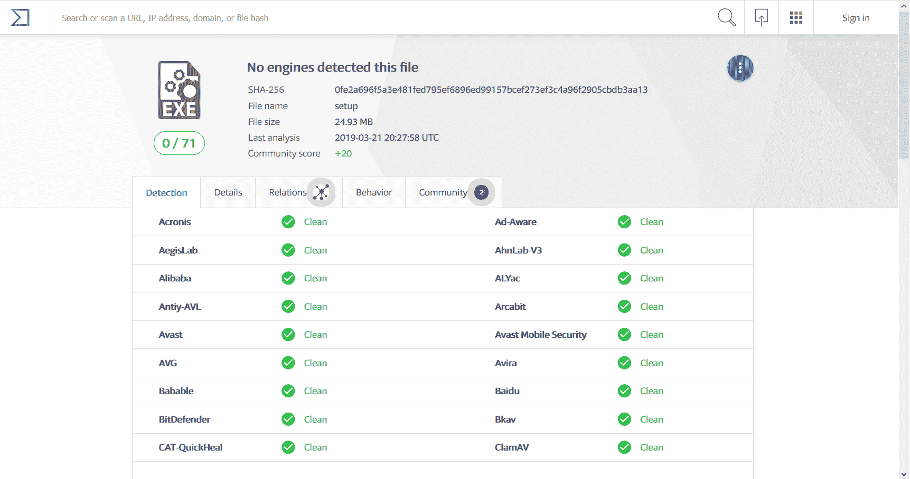
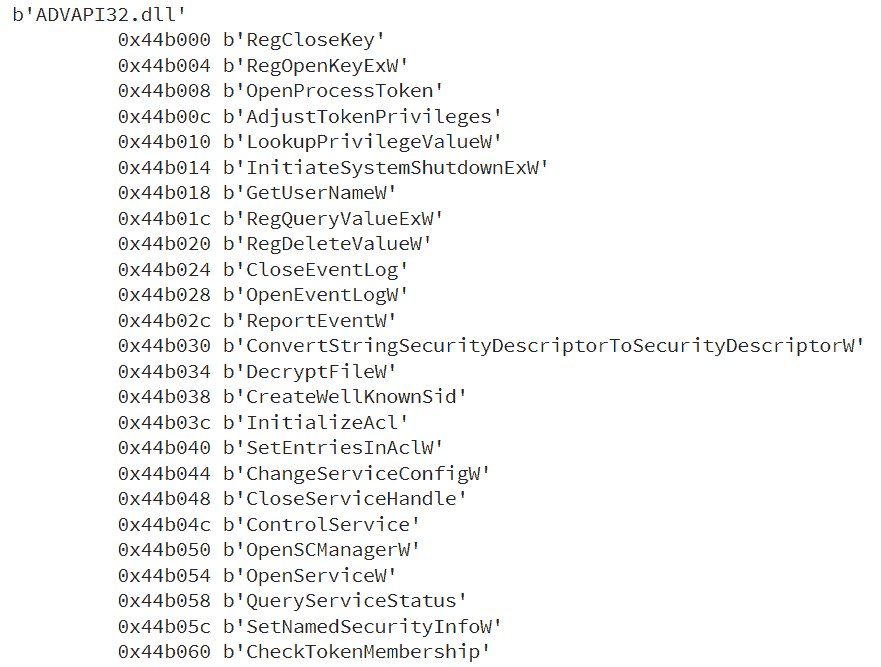
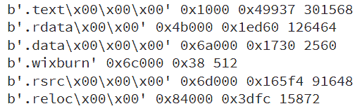
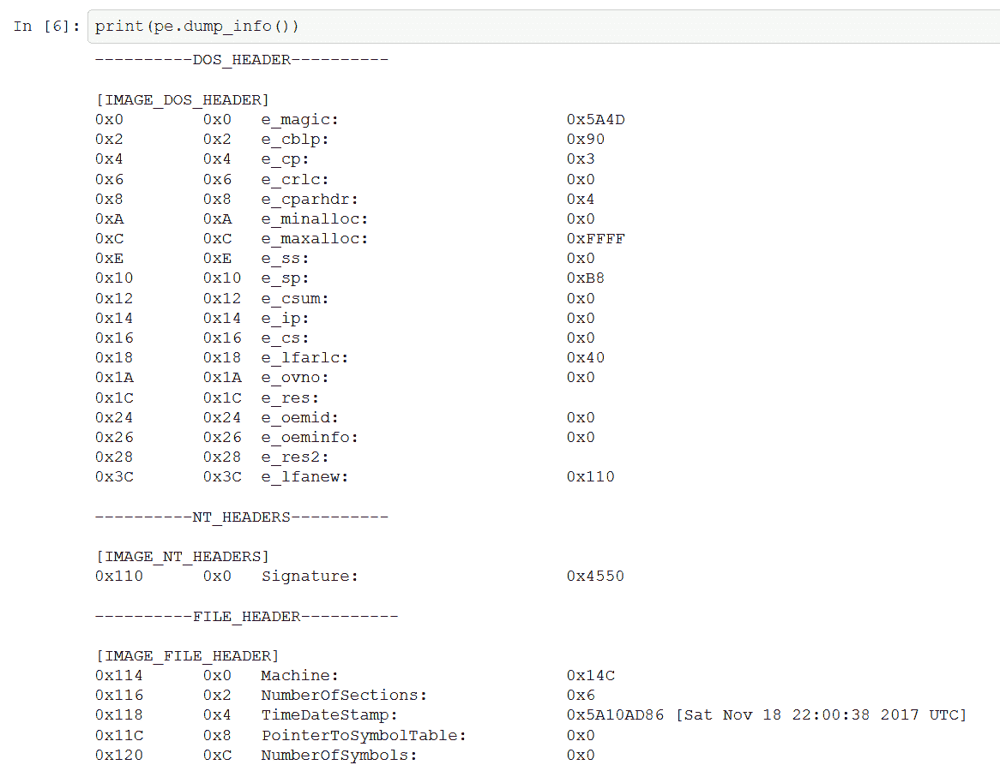
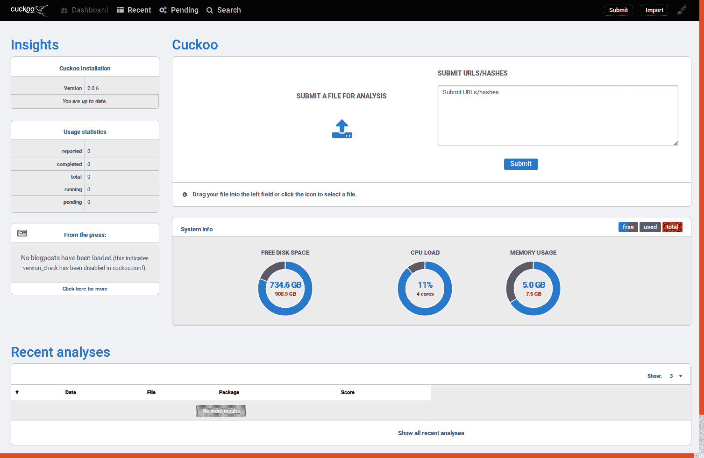
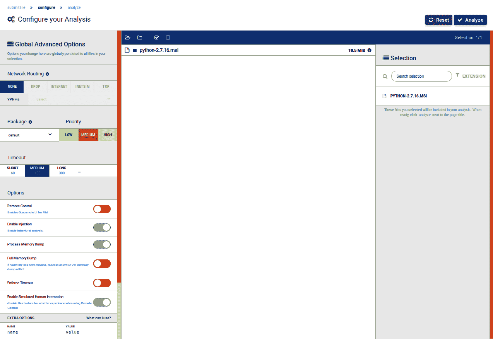
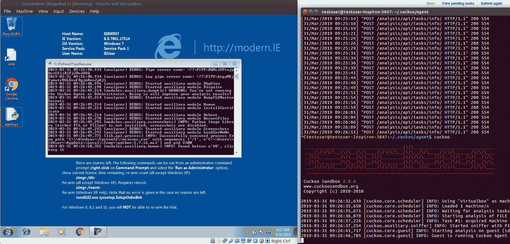
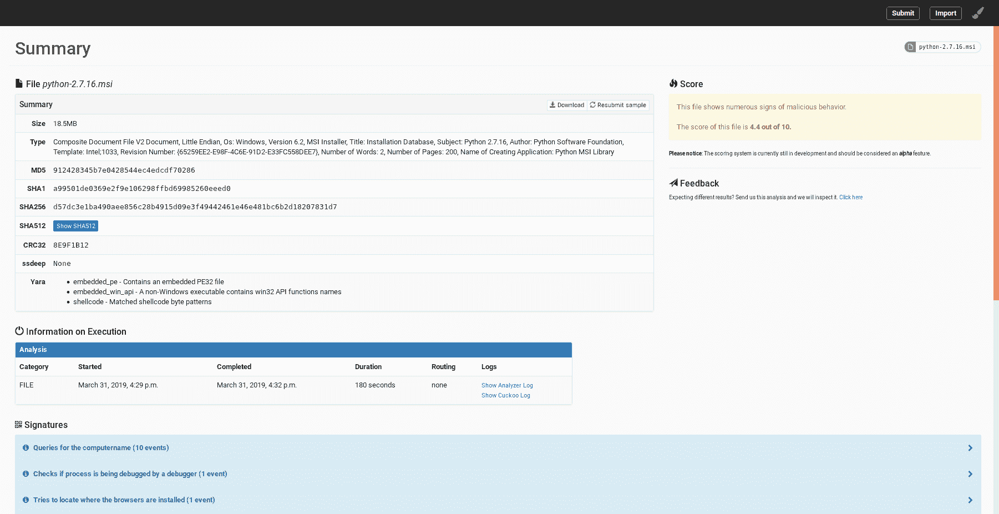
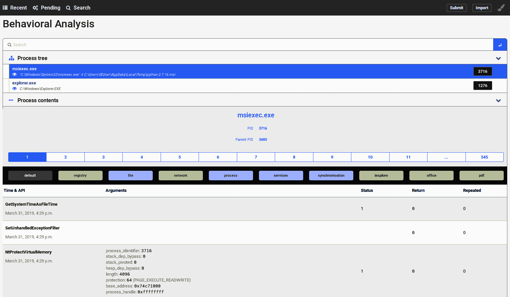
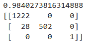

# 第二章：基于机器学习的恶意软件检测

在本章中，我们将开始认真地将数据科学应用于网络安全。我们将从学习如何对样本进行静态和动态分析开始。在此基础上，我们将学习如何对样本进行特征化，以便构建一个具有信息量的特征的数据集。本章的亮点是学习如何使用我们学到的特征化技能构建静态恶意软件检测器。最后，您将学习如何解决网络安全领域中常见的机器学习挑战，如类别不平衡和**假阳性率**（**FPR**）限制。

本章涵盖以下内容：

+   恶意软件静态分析

+   恶意软件动态分析

+   使用机器学习检测文件类型

+   测量两个字符串之间的相似度

+   测量两个文件之间的相似度

+   提取 N-gram

+   选择最佳 N-gram

+   构建静态恶意软件检测器

+   解决类别不平衡问题

+   处理类型 I 和类型 II 错误

# 技术要求

在本章中，我们将使用以下工具：

+   YARA

+   `pefile`

+   `PyGitHub`

+   Cuckoo 沙箱

+   **自然语言工具包**（**NLTK**）

+   `imbalanced-learn`

代码和数据集可以在 [`github.com/PacktPublishing/Machine-Learning-for-Cybersecurity-Cookbook/tree/master/Chapter02`](https://github.com/PacktPublishing/Machine-Learning-for-Cybersecurity-Cookbook/tree/master/Chapter02) 找到。

# 恶意软件静态分析

在静态分析中，我们在不执行样本的情况下进行检查。通过这种方式可以获得大量信息，从文件名称到更复杂的信息，如专用的 YARA 签名。我们将介绍通过静态分析样本可以获取的各种特征。尽管静态分析强大且方便，但它并不是万能的，主要是因为软件可能被混淆。因此，我们将在后续章节中使用动态分析和其他技术。

# 计算样本的哈希值

不深入探讨哈希的复杂性，哈希本质上是一个简短且唯一的字符串签名。例如，我们可以对文件的字节序列进行哈希处理，从而得到该文件的唯一代码。这使我们能够快速比较两个文件，查看它们是否相同。

市面上有许多哈希算法，因此我们将重点介绍最重要的几种，即 SHA256 和 MD5。需要注意的是，MD5 因哈希碰撞（即两个不同的对象具有相同的哈希值）而存在已知的漏洞，因此使用时需要小心。在本教程中，我们将使用一个可执行文件，并计算它的 MD5 和 SHA256 哈希值。

# 准备工作

本教程的准备工作包括下载一个测试文件，即来自 [`www.python.org/ftp/python/3.7.2/python-3.7.2-amd64.exe`](https://www.python.org/ftp/python/3.7.2/python-3.7.2-amd64.exe) 的 Python 可执行文件。

# 如何操作...

在以下步骤中，我们将展示如何获取文件的哈希值：

1.  首先，导入库并选择您希望计算哈希的文件：

```
import sys
import hashlib

filename = "python-3.7.2-amd64.exe"
```

1.  实例化 MD5 和 SHA256 对象，并指定我们将读取的块的大小：

```
BUF_SIZE = 65536
md5 = hashlib.md5()
sha256 = hashlib.sha256()
```

1.  然后，我们将文件以 64 KB 为块进行读取，并增量构建哈希值：

```
with open(filename, "rb") as f:
    while True:
        data = f.read(BUF_SIZE)
        if not data:
            break
        md5.update(data)
        sha256.update(data)
```

1.  最后，输出计算结果的哈希值：

```
print("MD5: {0}".format(md5.hexdigest()))
print("SHA256: {0}".format(sha256.hexdigest()))
```

这将产生以下输出：

```
MD5: ff258093f0b3953c886192dec9f52763
SHA256: 0fe2a696f5a3e481fed795ef6896ed99157bcef273ef3c4a96f2905cbdb3aa13
```

# 如何工作…

本节将解释前面章节中提供的步骤：

+   在步骤 1 中，我们导入了`hashlib`，一个用于哈希计算的标准 Python 库。我们还指定了我们将要计算哈希的文件——在这个例子中，文件是`python-3.7.2-amd64.exe`。

+   在步骤 2 中，我们实例化一个`md5`对象和一个`sha256`对象，并指定我们将读取的块的大小。

+   在步骤 3 中，我们使用`.update(data)`方法。这个方法允许我们增量计算哈希，因为它计算的是连接字符串的哈希。换句话说，`hash.update(a)`后跟`hash.update(b)`等同于`hash.update(a+b)`。

+   在步骤 4 中，我们以十六进制数字的形式输出哈希值。

我们还可以验证我们的计算结果是否与其他来源提供的哈希计算一致，比如 VirusTotal 和官方 Python 网站。MD5 哈希值显示在 Python 网页上（[`www.python.org/downloads/release/python-372/`](https://www.python.org/downloads/release/python-372/)）：


可以通过将文件上传到 VirusTotal（[`www.virustotal.com/gui/home`](https://www.virustotal.com/gui/home)）来计算 SHA256 哈希值：



# YARA

YARA 是一种计算机语言，允许安全专家方便地指定规则，然后用该规则对所有符合条件的样本进行分类。一个最小的规则包含一个名称和一个条件，例如，以下内容：

```
 rule my_rule_name { condition: false }
```

这个规则不会匹配任何文件。相反，下面的规则将匹配每个样本：

```
 Rule my_rule_name { condition: true }
```

一个更有用的例子是匹配任何大于 100 KB 的文件：

```
 Rule over_100kb { condition: filesize > 100KB }
```

另一个例子是检查某个特定文件是否为 PDF 文件。为此，我们需要检查文件的魔术数字是否与 PDF 文件的魔术数字匹配。魔术数字是文件开头的一段字节序列，表示文件类型。在 PDF 文件的情况下，该序列为`25 50 44 46`：

```
 rule is_a_pdf {

 strings:
   $pdf_magic = {25 50 44 46}

 condition:
   $pdf_magic at 0
 }
```

现在，让我们看看如何将规则应用于文件。

# 准备工作

本教程的准备工作包括在设备上安装 YARA。安装说明可以在[`yara.readthedocs.io/en/stable/`](https://yara.readthedocs.io/en/stable/)找到。对于 Windows，您需要下载 YARA 的可执行文件。

# 如何操作……

在以下步骤中，我们将向您展示如何创建 YARA 规则并对文件进行测试：

1.  将您的规则（如下面所示）复制到文本文件中并命名为`rules.yara`：

```
 rule is_a_pdf
 {
        strings:
               $pdf_magic = {25 50 44 46}
        condition:
               $pdf_magic at 0
 }

 rule dummy_rule1
 {
        condition:
               false
 }

 rule dummy_rule2
 {
        condition:
               true
 }
```

1.  接下来，选择一个你希望用规则进行检查的文件。称之为`target_file`。在终端中执行`Yara rules.yara target_file`，如下所示：

```
Yara rule.yara PythonBrochure
```

结果应该如下所示：

```
is_a_pdf target_file
dummy_rule2 target_rule
```

# 工作原理...

如你所见，在*步骤 1*中，我们复制了几条 YARA 规则。第一条规则检查文件的魔术数字，看看它们是否与 PDF 文件的魔术数字匹配。其他两条规则是简单的规则——一条匹配所有文件，另一条不匹配任何文件。然后，在*步骤 2*中，我们使用 YARA 程序将这些规则应用到目标文件上。通过打印输出，我们看到文件匹配了一些规则，但没有匹配其他规则，这符合有效的 YARA 规则集的预期。

# 检查 PE 头

**便携式可执行文件** (**PE**) 是一种常见的 Windows 文件类型。PE 文件包括`.exe`、`.dll`和`.sys`文件。所有 PE 文件都有一个 PE 头，这是代码的一个头部部分，指示 Windows 如何解析随后的代码。PE 头中的字段通常作为特征被用于恶意软件的检测。为了方便提取 PE 头的众多值，我们将使用`pefile` Python 模块。在本食谱中，我们将解析一个文件的 PE 头，然后打印出其中一些重要部分。

# 准备开始

本食谱的准备工作包括在`pip`中安装`pefile`包。在你的 Python 环境的终端中运行以下命令：

```
pip install pefile
```

此外，从[`www.python.org/ftp/python/3.7.2/python-3.7.2-amd64.exe`](https://www.python.org/ftp/python/3.7.2/python-3.7.2-amd64.exe)下载测试文件 Python 可执行文件。

# 如何操作...

在接下来的步骤中，我们将解析一个文件的 PE 头，并打印出其中一些重要部分：

1.  导入 PE 文件并使用它来解析你希望检查的文件的 PE 头：

```
import pefile

desired_file = "python-3.7.2-amd64.exe"
pe = pefile.PE(desired_file)
```

1.  列出 PE 文件的导入项：

```
for entry in pe.DIRECTORY_ENTRY_IMPORT:
    print(entry.dll)
    for imp in entry.imports:
        print("\t", hex(imp.address), imp.name)
```

这里显示了一小部分输出：



1.  列出 PE 文件的各个部分：

```
for section in pe.sections:
    print(
        section.Name,
        hex(section.VirtualAddress),
        hex(section.Misc_VirtualSize),
        section.SizeOfRawData,
    )
```

之前代码的输出结果如下：



1.  打印解析信息的完整转储：

```
print(pe.dump_info())
```

这里显示了一小部分输出：



# 工作原理...

我们从*步骤 1*开始，导入了`pefile`库，并指定了我们将要分析的文件。在这个例子中，文件是`python-3.7.2-amd64.exe`，但同样也可以轻松分析任何其他 PE 文件。接着，我们继续检查文件所导入的 DLL，以了解文件可能使用的方法，在*步骤 2*中进行分析。DLL 可以回答这个问题，因为 DLL 是代码库，其他应用程序可能会调用它。例如，`USER32.dll`是一个包含 Windows USER 的库，它是 Microsoft Windows 操作系统的一部分，提供用于构建用户界面的核心功能。该组件允许其他应用程序利用窗口管理、消息传递、输入处理和标准控件等功能。因此，从逻辑上讲，如果我们看到一个文件导入了像`GetCursorPos`这样的函数，那么它很可能是在查看光标的位置。在*步骤 3*中，我们打印了 PE 文件的各个部分。它们为程序的不同部分提供了逻辑和物理的分隔，因此为分析人员提供了有关程序的宝贵信息。最后，我们打印了文件的所有解析后的 PE 头部信息，为后续用于特征工程做好准备（*步骤 4*）。

# 提取 PE 头部特征

在本节中，我们将从 PE 头部提取特征，用于构建`恶意/良性`样本分类器。我们将继续使用`pefile` Python 模块。

# 准备开始

本配方的准备工作包括在`pip`中安装`pefile`包。命令如下：

```
pip install pefile
```

此外，良性和恶意文件已经提供给你，位于根目录下的`PE Samples Dataset`文件夹中。将所有名为`Benign PE Samples*.7z`的压缩包解压到名为`Benign PE Samples`的文件夹中。将所有名为`Malicious PE Samples*.7z`的压缩包解压到名为`Malicious PE Samples`的文件夹中。

# 如何操作...

在接下来的步骤中，我们将收集 PE 头部的显著部分：

1.  导入`pefile`和用于列举样本的模块：

```
import pefile
from os import listdir
from os.path import isfile, join

directories = ["Benign PE Samples", "Malicious PE Samples"]
```

1.  我们定义了一个函数来收集文件的节名称，并对其进行预处理以提高可读性和标准化：

```
def get_section_names(pe):
    """Gets a list of section names from a PE file."""
    list_of_section_names = []
    for sec in pe.sections:
        normalized_name = sec.Name.decode().replace("\x00", "").lower()
        list_of_section_names.append(normalized_name)
    return list_of_section_names
```

1.  我们定义了一个便捷函数来预处理和标准化我们的导入信息：

```
def preprocess_imports(list_of_DLLs):
    """Normalize the naming of the imports of a PE file."""
    return [x.decode().split(".")[0].lower() for x in list_of_DLLs]
```

1.  然后，我们定义一个函数，使用`pefile`收集文件中的导入信息：

```
def get_imports(pe):
    """Get a list of the imports of a PE file."""
    list_of_imports = []
    for entry in pe.DIRECTORY_ENTRY_IMPORT:
        list_of_imports.append(entry.dll)
    return preprocess_imports(list_of_imports)
```

1.  最后，我们准备迭代所有文件，并创建列表来存储我们的特征：

```
imports_corpus = []
num_sections = []
section_names = []
for dataset_path in directories:
    samples = [f for f in listdir(dataset_path) if isfile(join(dataset_path, f))]
    for file in samples:
        file_path = dataset_path + "/" + file
        try:
```

1.  除了收集前述特征外，我们还会收集文件的节数：

```
            pe = pefile.PE(file_path)
            imports = get_imports(pe)
            n_sections = len(pe.sections)
            sec_names = get_section_names(pe)
            imports_corpus.append(imports)
            num_sections.append(n_sections)
            section_names.append(sec_names)
```

1.  如果无法解析文件的 PE 头部，我们定义了一个 try-catch 语句：

```
        except Exception as e:
            print(e)
            print("Unable to obtain imports from " + file_path)
```

# 它是如何工作的...

如你所见，在*步骤 1*中，我们导入了`pefile`模块来列举样本。完成之后，我们定义了一个便捷函数，正如你在*步骤 2*中看到的那样。这样做的原因是它经常使用不同的大小写（大写/小写）导入。这会导致相同的导入看起来像是不同的导入。

在预处理导入项后，我们定义另一个函数，将文件的所有导入项收集到一个列表中。我们还将定义一个函数，用来收集文件的各个部分的名称，以便规范化这些名称，如`.text`、`.rsrc`和`.reloc`，同时包含文件的不同部分（*步骤 3*）。然后，文件将在我们的文件夹中进行枚举，空列表将被创建，用于存放我们将要提取的特征。预定义的函数将收集导入项（*步骤 4*）、部分名称以及每个文件的部分数量（*步骤 5* 和 *6*）。最后，将定义一个 try-catch 语句块，以防某个文件的 PE 头无法解析（*步骤 7*）。这种情况可能由于多种原因发生。一个原因是文件本身并不是 PE 文件。另一个原因是其 PE 头部故意或无意地被篡改。

# 恶意软件动态分析

与静态分析不同，动态分析是一种恶意软件分析技术，其中专家执行样本，然后在样本运行时研究其行为。动态分析相对于静态分析的主要优势是，它允许通过观察样本的行为来绕过混淆，而不是试图解读样本的内容和行为。由于恶意软件本质上是不安全的，研究人员会选择在**虚拟机**（**VM**）中执行样本。这被称为**沙箱化**。

# 准备工作

在虚拟机中自动化样本分析的最突出工具之一是 Cuckoo 沙箱。Cuckoo 沙箱的初始安装非常简单；只需运行以下命令：

```
pip install -U cuckoo
```

您必须确保还拥有可以由您的机器控制的虚拟机。配置沙箱可能具有挑战性，但可以通过[`cuckoo.sh/docs/`](https://cuckoo.sh/docs/)的说明来完成。

现在我们展示如何利用 Cuckoo 沙箱来获取样本的动态分析。

# 如何做...

一旦您的 Cuckoo 沙箱设置完成，并且运行了 Web 界面，按照以下步骤收集样本的运行时信息：

1.  打开您的 Web 界面（默认位置是`127.0.0.1:8000`），点击**提交文件进行分析**，并选择您希望分析的样本：



1.  以下屏幕将自动出现。在其中，选择您希望对样本执行的分析类型：



1.  点击**分析**以在沙箱中分析样本。结果应如下所示：



1.  接下来，打开您分析的样本的报告：



1.  选择**行为分析**标签：



显示的 API 调用顺序、注册表键更改和其他事件均可用作分类器的输入。

# 它是如何工作的...

从概念上讲，获取动态分析结果包括在允许分析员收集运行时信息的环境中运行样本。Cuckoo Sandbox 是一个灵活的框架，带有预构建模块来完成这一任务。我们从打开 Cuckoo Sandbox 的 Web 门户开始了我们的操作流程（*步骤 1*）。**命令行界面**（**CLI**）也可用。我们继续提交一个样本并选择希望执行的分析类型（*步骤 2*和*步骤 3*）。这些步骤也可以通过 Cuckoo CLI 来执行。接着，我们查看了分析报告（*步骤 4*）。此时你可以看到 Cuckoo Sandbox 的许多模块如何反映在最终的分析结果中。例如，如果安装并使用了一个捕获流量的模块，那么报告中会包含网络标签中捕获的数据。我们继续将视角集中在行为分析（*步骤 5*）上，特别是观察 API 调用的顺序。API 调用基本上是操作系统执行的操作。这个顺序构成了一个极好的特征集，我们将利用它在未来的操作中检测恶意软件。最后，值得注意的是，在生产环境中，可能有必要创建一个定制的沙箱，配备自定义的数据收集模块，并搭载反虚拟机检测软件，以促进成功的分析。

# 使用机器学习检测文件类型

黑客常用的技巧之一就是通过混淆文件类型来悄悄将恶意文件渗透到安全系统中。例如，一个（恶意的）PowerShell 脚本通常应该有`.ps1`的扩展名。系统管理员可以通过阻止所有带有`.ps1`扩展名的文件执行，来防止 PowerShell 脚本的执行。然而，狡猾的黑客可以删除或更改扩展名，使得文件的身份变得模糊。只有通过检查文件的内容，才能将其与普通文本文件区分开来。由于实际原因，人类不可能检查系统中的所有文本文件。因此，采用自动化方法就显得尤为重要。在本章中，我们将展示如何利用机器学习来检测未知文件的文件类型。我们的第一步是策划一个数据集。

# 从 GitHub 抓取特定类型的文件

为了策划数据集，我们将从 GitHub 上抓取我们感兴趣的特定文件类型。

# 准备工作

准备工作包括通过运行以下命令，在`pip`中安装`PyGitHub`包：

```
pip install PyGitHub
```

此外，你还需要 GitHub 账户凭证。

# 如何做到这一点...

在接下来的步骤中，我们将整理一个数据集，并利用它创建一个分类器来确定文件类型。为了演示，我们将展示如何通过抓取 GitHub 获取 PowerShell 脚本、Python 脚本和 JavaScript 文件的集合。通过这种方式获得的示例集合可以在随附的仓库中找到，文件名为`PowerShellSamples.7z`、`PythonSamples.7z`和`JavascriptSamples.7z`。首先，我们将编写用于抓取 JavaScript 文件的代码：

1.  首先导入`PyGitHub`库，以便能够调用 GitHub API。我们还导入了`base64`模块，以便解码`base64`编码的文件：

```
import os
from github import Github
import base64
```

1.  我们必须提供我们的凭证，然后指定一个查询——在这种情况下，查询 JavaScript——来选择我们的仓库：

```
username = "your_github_username"
password = "your_password"
target_dir = "/path/to/JavascriptSamples/"
g = Github(username, password)
repositories = g.search_repositories(query='language:javascript')
n = 5
i = 0
```

1.  我们遍历符合条件的仓库：

```
for repo in repositories:
    repo_name = repo.name
    target_dir_of_repo = target_dir+"\\"+repo_name
    print(repo_name)
    try:
```

1.  我们为每个匹配我们搜索标准的仓库创建一个目录，然后读取其内容：

```
        os.mkdir(target_dir_of_repo)
        i += 1
        contents = repo.get_contents("")
```

1.  我们将所有仓库的目录添加到队列中，以便列出这些目录中包含的所有文件：

```
        while len(contents) > 1:
            file_content = contents.pop(0)
            if file_content.type == "dir":
                contents.extend(repo.get_contents(file_content.path))
            else:
```

1.  如果我们发现一个非目录文件，我们检查它的扩展名是否为`.js`：

```
                st = str(file_content)
                filename = st.split("\"")[1].split("\"")[0]
                extension = filename.split(".")[-1]
                if extension == "js":
```

1.  如果扩展名是`.js`，我们将文件的副本写出：

```
                    file_contents = repo.get_contents(file_content.path)
                    file_data = base64.b64decode(file_contents.content)
                    filename = filename.split("/")[-1]
                    file_out = open(target_dir_of_repo+"/"+filename, "wb")
                    file_out.write(file_data)
      except:
        pass
    if i==n:
        break
```

1.  一旦完成，方便的方法是将所有 JavaScript 文件移到一个文件夹中。

    要获取 PowerShell 示例，请运行相同的代码，并修改以下内容：

```
target_dir = "/path/to/JavascriptSamples/"
repositories = g.search_repositories(query='language:javascript')
```

接下来：

```
target_dir = "/path/to/PowerShellSamples/"
repositories = g.search_repositories(query='language:powershell').
```

同样，对于 Python 文件，我们进行如下操作：

```
target_dir = "/path/to/PythonSamples/"
repositories = g.search_repositories(query='language:python').
```

# 工作原理……

我们从导入`PyGitHub`库开始，进行*步骤 1*，这样我们就能方便地调用 GitHub API。这些 API 将允许我们抓取并探索仓库的世界。我们还导入了`base64`模块，以解码我们从 GitHub 下载的`base64`编码的文件。请注意，GitHub 对普通用户的 API 调用次数有限制。因此，如果你尝试在短时间内下载太多文件，你的脚本可能无法获取所有文件。我们的下一步是向 GitHub 提供我们的凭证（*步骤 2*），并指定我们正在寻找具有 JavaScript 语言的仓库，使用`query='language:javascript'`命令。我们列举出所有符合我们搜索条件的 JavaScript 仓库，如果符合条件，我们继续在这些仓库中查找以`.js`结尾的文件，并创建本地副本（步骤 3 到 6）。由于这些文件是`base64`编码的，我们确保在步骤 7 中将它们解码为纯文本。最后，我们展示如何调整脚本，以便抓取其他类型的文件，比如 Python 和 PowerShell 文件（步骤 8）。

# 按文件类型分类

现在我们已经有了一个数据集，我们希望训练一个分类器。由于相关文件是脚本文件，我们将问题作为一个自然语言处理（NLP）问题来处理。

# 准备工作

这个步骤的准备工作包括在`pip`中安装`scikit-learn`包。安装说明如下：

```
pip install sklearn
```

此外，我们还为您提供了`JavascriptSamples.7z`、`PythonSamples.7z`和`PowerShellSamples.7z`压缩包中每种文件类型的样本，以防您希望补充自己的数据集。将其解压到不同的文件夹中，以便按照以下步骤操作。

# 如何实现...

以下代码可在[`github.com/PacktPublishing/Machine-Learning-for-Cybersecurity-Cookbook/blob/master/Chapter02/Classifying%20Files%20by%20Type/File%20Type%20Classifier.ipynb`](https://github.com/PacktPublishing/Machine-Learning-for-Cybersecurity-Cookbook/blob/master/Chapter02/Classifying%20Files%20by%20Type/File%20Type%20Classifier.ipynb)找到。我们利用这些数据构建分类器，以预测文件为 JavaScript、Python 或 PowerShell：

1.  首先导入必要的库并指定我们将用于训练和测试的样本的路径：

```
import os
from sklearn.feature_extraction.text import HashingVectorizer, TfidfTransformer
from sklearn.ensemble import RandomForestClassifier
from sklearn.model_selection import train_test_split
from sklearn.metrics import accuracy_score, confusion_matrix
from sklearn.pipeline import Pipeline

javascript_path = "/path/to/JavascriptSamples/"
python_path = "/path/to/PythonSamples/"
powershell_path = "/path/to/PowerShellSamples/"
```

1.  接下来，我们读取所有文件类型。同时，我们创建一个标签数组，分别代表 JavaScript、Python 和 PowerShell 脚本，分别为-1、0 和 1：

```
corpus = []
labels = []
file_types_and_labels = [(javascript_path, -1), (python_path, 0), (powershell_path, 1)]
for files_path, label in file_types_and_labels:
    files = os.listdir(files_path)
    for file in files:
        file_path = files_path + "/" + file
        try:
            with open(file_path, "r") as myfile:
                data = myfile.read().replace("\n", "")
        except:
            pass
        data = str(data)
        corpus.append(data)
        labels.append(label)
```

1.  我们继续创建训练-测试分割和管道，该管道将对文件执行基本的自然语言处理，然后使用随机森林分类器：

```
X_train, X_test, y_train, y_test = train_test_split(
    corpus, labels, test_size=0.33, random_state=11
)
text_clf = Pipeline(
    [
        ("vect", HashingVectorizer(input="content", ngram_range=(1, 3))),
        ("tfidf", TfidfTransformer(use_idf=True,)),
        ("rf", RandomForestClassifier(class_weight="balanced")),
    ]
)
```

1.  我们将管道拟合到训练数据上，然后在测试数据上进行预测。最后，我们打印出准确度和混淆矩阵：

```
text_clf.fit(X_train, y_train)
y_test_pred = text_clf.predict(X_test)
print(accuracy_score(y_test, y_test_pred))
print(confusion_matrix(y_test, y_test_pred))
```

这将导致以下输出：



# 工作原理...

利用我们在*从 GitHub 抓取特定类型文件*配方中建立的数据集，我们将文件放置在不同的目录中，根据其文件类型，并指定路径以准备构建我们的分类器（步骤 1）。本配方的代码假设`"JavascriptSamples"`目录和其他目录包含样本，并且没有子目录。我们将所有文件读入一个语料库，并记录它们的标签（步骤 2）。我们对数据进行训练-测试分割，并准备一个管道，该管道将对文件执行基本的自然语言处理，然后使用随机森林分类器（步骤 3）。这里选择的分类器是为了说明目的，而不是为了暗示对于这类数据的最佳分类器选择。最后，我们执行创建机器学习分类器过程中的基本但重要的步骤，包括将管道拟合到训练数据上，然后通过测量其在测试集上的准确性和混淆矩阵来评估其性能（步骤 4）。

# 测量两个字符串之间的相似度

要检查两个文件是否相同，我们使用标准的加密哈希函数，例如 SHA256 和 MD5。然而，有时我们也想知道两个文件在多大程度上相似。为此，我们使用相似性哈希算法。在这里我们将演示的是`ssdeep`。

首先，让我们看看如何使用`ssdeep`比较两个字符串。这对于检测文本或脚本中的篡改以及抄袭非常有用。

# 准备工作

本食谱的准备工作包括在`pip`中安装`ssdeep`包。安装过程稍微复杂，并且在 Windows 上并不总是能成功。安装说明可以在[`python-ssdeep.readthedocs.io/en/latest/installation.html`](https://python-ssdeep.readthedocs.io/en/latest/installation.html)找到。

如果你只有一台 Windows 机器，并且安装`ssdeep`没有成功，那么一种可能的解决方法是通过运行`ssdeep`在 Ubuntu 虚拟机上，然后在`pip`中安装它，使用以下命令：

```
pip install ssdeep
```

# 如何操作...

1.  首先导入`ssdeep`库并创建三个字符串：

```
import ssdeep

str1 = "Lorem ipsum dolor sit amet, consectetur adipiscing elit, sed do eiusmod tempor incididunt ut labore et dolore magna aliqua."
str2 = "Lorem ipsum dolor sit amet, consectetur adipiscing elit, sed do eiusmod tempor incididunt ut labore et dolore Magna aliqua."
str3 = "Lorem ipsum dolor sit amet, consectetur adipiscing elit, sed do eiusmod tempor incididunt ut labore et dolore aliqua."
str4 = "Something completely different from the other strings."
```

1.  对字符串进行哈希：

```
hash1 = ssdeep.hash(str1)
hash2 = ssdeep.hash(str2)
hash3 = ssdeep.hash(str3)
hash4 = ssdeep.hash(str4)
```

作为参考，

hash1 是`u'3:f4oo8MRwRJFGW1gC6uWv6MQ2MFSl+JuBF8BSnJi:f4kPvtHMCMubyFtQ'`，

hash2 是`u'3:f4oo8MRwRJFGW1gC6uWv6MQ2MFSl+JuBF8BS+EFECJi:f4kPvtHMCMubyFIsJQ'`，

hash3 是`u'3:f4oo8MRwRJFGW1gC6uWv6MQ2MFSl+JuBF8BS6:f4kPvtHMCMubyF0`，并且

hash4 是`u'3:60QKZ+4CDTfDaRFKYLVL:ywKDC2mVL'`。

1.  接下来，我们查看这些字符串的相似度分数：

```
ssdeep.compare(hash1, hash1)
ssdeep.compare(hash1, hash2)
ssdeep.compare(hash1, hash3)
ssdeep.compare(hash1, hash4)

```

数值结果如下：

```
100
39
37
0
```

# 它是如何工作的...

`ssdeep`的基本思路是结合多个传统哈希，这些哈希的边界由输入的上下文决定。这些哈希集合可以用来识别已知文件的修改版本，即使它们已经通过插入、修改或删除进行了更改。

在本食谱中，我们首先创建了四个测试字符串，作为一个玩具示例，来说明字符串的变化如何影响其相似度度量（步骤 1）。第一个字符串`str1`仅仅是 Lorem Ipsum 的第一句。第二个字符串`str2`在“magna”中的`m`字母大小写上有所不同。第三个字符串`str3`完全缺少了“magna”这个词。最后，第四个字符串是完全不同的字符串。我们的下一步，步骤 2，是使用相似度哈希库`ssdeep`对这些字符串进行哈希处理。请注意，相似的字符串具有明显相似的相似度哈希。这与传统哈希形成鲜明对比，在传统哈希中，即使是一个小小的修改也会产生完全不同的哈希。接下来，我们通过`ssdeep`（步骤 3）得出这些字符串之间的相似度分数。特别注意，`ssdeep`的相似度分数是一个介于 0 和 100 之间的整数，100 表示完全相同，0 表示完全不同。两个完全相同的字符串的相似度分数是 100。改变一个字母的大小写会显著降低相似度分数至 39，因为字符串相对较短。删除一个单词将相似度分数降低到 37。两个完全不同的字符串的相似度为 0。

虽然还有其他一些在某些情况下更好的模糊哈希可供选择，但由于`ssdeep`的速度和它作为事实标准的地位，它仍然是首选。

# 测量两个文件之间的相似度

现在，我们将了解如何应用`ssdeep`来衡量两个二进制文件之间的相似性。这个概念有很多应用，尤其是在聚类中将相似性度量作为距离。

# 准备工作

本示例的准备工作包括通过`pip`安装`ssdeep`包。安装过程有点复杂，且在 Windows 上并不总是有效。可以参考[`python-ssdeep.readthedocs.io/en/latest/installation.html`](https://python-ssdeep.readthedocs.io/en/latest/installation.html)上的说明。

如果你只有一台 Windows 机器且无法运行，那么一个可能的解决方案是在 Ubuntu 虚拟机上通过安装`pip`并使用以下命令运行`ssdeep`：

```
pip install ssdeep
```

此外，请从[`www.python.org/ftp/python/3.7.2/python-3.7.2-amd64.exe`](https://www.python.org/ftp/python/3.7.2/python-3.7.2-amd64.exe)下载测试文件，如 Python 可执行文件。

# 如何操作...

在下面的示例中，我们篡改一个二进制文件。然后我们将其与原文件进行比较，发现`ssdeep`认为这两个文件高度相似但并不完全相同：

1.  首先，我们下载 Python 的最新版本，`python-3.7.2-amd64.exe`。我将创建一个副本，将其重命名为`python-3.7.2-amd64-fake.exe`，并在末尾添加一个空字节：

```
truncate -s +1 python-3.7.2-amd64-fake.exe
```

1.  使用`hexdump`，我可以通过查看操作前后的文件来验证操作是否成功：

```
hexdump -C python-3.7.2-amd64.exe |tail -5
```

这将产生以下输出：

```

018ee0f0  e3 af d6 e9 05 3f b7 15  a1 c7 2a 5f b6 ae 71 1f  |.....?....*_..q.|
018ee100  6f 46 62 1c 4f 74 f5 f5  a1 e6 91 b7 fe 90 06 3e  |oFb.Ot.........>|
018ee110  de 57 a6 e1 83 4c 13 0d  b1 4a 3d e5 04 82 5e 35  |.W...L...J=...⁵|
018ee120  ff b2 e8 60 2d e0 db 24  c1 3d 8b 47 b3 00 00 00  |...`-..$.=.G....|

```

也可以使用以下命令通过第二个文件进行验证：

```
hexdump -C python-3.7.2-amd64-fake.exe |tail -5
```

这将产生以下输出：

```
018ee100  6f 46 62 1c 4f 74 f5 f5  a1 e6 91 b7 fe 90 06 3e  |oFb.Ot.........>|
018ee110  de 57 a6 e1 83 4c 13 0d  b1 4a 3d e5 04 82 5e 35  |.W...L...J=...⁵|
018ee120  ff b2 e8 60 2d e0 db 24  c1 3d 8b 47 b3 00 00 00  |...`-..$.=.G....|
018ee130  00                                                |.|
018ee131
```

1.  现在，我将使用`ssdeep`对两个文件进行哈希，并比较结果：

```
import ssdeep

hash1 = ssdeep.hash_from_file("python-3.7.2-amd64.exe")
hash2 = ssdeep.hash_from_file("python-3.7.2-amd64-fake.exe")
ssdeep.compare(hash1, hash2)

```

上述代码的输出是`99`。

# 它是如何工作的...

这个场景模拟了篡改文件后，利用相似性哈希检测篡改的存在，并衡量差异的大小。我们从一个标准的 Python 可执行文件开始，然后通过在末尾添加一个空字节进行篡改（步骤 1）。在现实中，黑客可能会在合法程序中插入恶意代码。我们通过`hexdump`双重检查篡改是否成功，并检查篡改的性质（步骤 2）。然后，我们对原始文件和篡改后的文件进行相似性计算，观察到发生了微小的变化（步骤 3）。仅使用标准哈希，我们将无法知道这两个文件之间的关系，除了得出它们不是同一个文件的结论。知道如何比较文件使我们能够在机器学习算法中对恶意软件和良性文件进行聚类，并将它们分组为家族。

# 提取 N-gram

在文本的标准定量分析中，N-gram 是由 N 个标记（例如，单词或字符）组成的序列。例如，给定文本*The quick brown fox jumped over the lazy dog*，如果我们的标记是单词，则 1-gram 是*the*，*quick*，*brown*，*fox*，*jumped*，*over*，*the*，*lazy*和*dog*。2-gram 是*the quick*，*quick brown*，*brown fox*，依此类推。3-gram 是*the quick brown*，*quick brown fox*，*brown fox jumped*，依此类推。就像文本的局部统计信息使我们能够构建马尔可夫链以进行统计预测和从语料库生成文本一样，N-gram 使我们能够建模语料库的局部统计特性。我们的最终目标是利用 N-gram 的计数帮助我们预测样本是恶意的还是良性的。在本食谱中，我们演示了如何从样本中提取 N-gram 计数。

# 准备工作

本食谱的准备工作包括在`pip`中安装`nltk`包，安装说明如下：

```
pip install nltk
```

此外，下载一个测试文件，例如来自[`www.python.org/ftp/python/3.7.2/python-3.7.2-amd64.exe`](https://www.python.org/ftp/python/3.7.2/python-3.7.2-amd64.exe)的 Python 可执行文件。

# 如何做到这一点...

在接下来的步骤中，我们将枚举一个示例文件的所有 4-gram，并选择其中 50 个最频繁的：

1.  我们首先导入`collections`库以方便计数，并从`nltk`库导入`ngrams`库以简化 N-gram 的提取：

```
import collections
from nltk import ngrams
```

1.  我们指定要分析的文件：

```
file_to_analyze = "python-3.7.2-amd64.exe"
```

1.  我们定义了一个便捷函数来读取文件的字节：

```
def read_file(file_path):
    """Reads in the binary sequence of a binary file."""
    with open(file_path, "rb") as binary_file:
        data = binary_file.read()
    return data
```

1.  我们编写一个便捷函数来处理字节序列并获取 N-gram：

```
def byte_sequence_to_Ngrams(byte_sequence, N):
    """Creates a list of N-grams from a byte sequence."""
    Ngrams = ngrams(byte_sequence, N)
    return list(Ngrams)
```

1.  我们编写一个函数来处理文件并获取其 N-gram 的计数：

```
def binary_file_to_Ngram_counts(file, N):
    """Takes a binary file and outputs the N-grams counts of its binary sequence."""
    filebyte_sequence = read_file(file)
    file_Ngrams = byte_sequence_to_Ngrams(filebyte_sequence, N)
    return collections.Counter(file_Ngrams)
```

1.  我们指定所需的值为 N=4，并获取文件中所有 4-gram 的计数：

```
extracted_Ngrams = binary_file_to_Ngram_counts(file_to_analyze, 4)
```

1.  我们列出了文件中最常见的 10 个 4-gram：

```
print(extracted_Ngrams.most_common(10))
```

结果如下：

```
[((0, 0, 0, 0), 24201), ((139, 240, 133, 246), 1920), ((32, 116, 111, 32), 1791), ((255, 255, 255, 255), 1663), ((108, 101, 100, 32), 1522), ((100, 32, 116, 111), 1519), ((97, 105, 108, 101), 1513), ((105, 108, 101, 100), 1513), ((70, 97, 105, 108), 1505), ((101, 100, 32, 116), 1503)]
```

# 它是如何工作的...

在文献和工业界中已经确定，最常见的 N-gram 也是恶意软件分类算法中最具信息量的。因此，在本教程中，我们将编写函数来提取文件的 N-gram。我们首先导入一些有助于提取 N-gram 的库（第 1 步）。特别地，我们导入`collections`库和`nltk`中的`ngrams`库。`collections`库允许我们将 N-gram 列表转换为 N-gram 的频次计数，而`ngrams`库则允许我们获取有序字节列表并得到 N-gram 列表。我们指定要分析的文件，并编写一个函数来读取给定文件的所有字节（第 2 步和第 3 步）。在开始提取之前，我们定义几个便利函数。特别地，我们编写一个函数来获取文件的字节序列并输出其 N-gram 列表（第 4 步），并编写一个函数来获取文件并输出其 N-gram 计数（第 5 步）。现在我们准备传入文件并提取其 N-gram。我们这样做以提取文件的 4-gram 计数（第 6 步），然后展示其中最常见的 10 个及其计数（第 7 步）。我们看到一些 N-gram 序列，如(0,0,0,0)和(255,255,255,255)，可能不太有信息量。因此，我们将在下一个教程中利用特征选择方法去除这些不太有信息量的 N-gram。

# 选择最佳 N-gram

不同 N-gram 的数量随着 N 的增大呈指数增长。即使对于一个固定的小 N，如 N=3，也有*256x256x256=16,777,216*种可能的 N-gram。这意味着 N-gram 特征的数量巨大，几乎不可能实际使用。因此，我们必须选择一个较小的 N-gram 子集，这些子集将对我们的分类器最有价值。在这一部分中，我们展示了三种选择最具信息量 N-gram 的不同方法。

# 准备工作

本教程的准备工作包括在`pip`中安装`scikit-learn`和`nltk`包。安装说明如下：

```
pip install sklearn nltk
```

此外，善意和恶意文件已在仓库根目录下的`PE Samples Dataset`文件夹中提供。将所有名为`Benign PE Samples*.7z`的压缩包解压到名为`Benign PE Samples`的文件夹中。将所有名为`Malicious PE Samples*.7z`的压缩包解压到名为`Malicious PE Samples`的文件夹中。

# 如何实现...

在接下来的步骤中，我们展示了三种选择最具信息量 N-gram 的方法。本教程假设已包括前一个教程中的`binaryFileToNgramCounts(file, N)`和所有其他辅助函数：

1.  首先指定包含我们样本的文件夹，指定我们的`N`，并导入模块以枚举文件：

```
from os import listdir
from os.path import isfile, join

directories = ["Benign PE Samples", "Malicious PE Samples"]
N = 2
```

1.  接下来，我们从所有文件中统计所有的 N-gram：

```
Ngram_counts_all_files = collections.Counter([])
for dataset_path in directories:
    all_samples = [f for f in listdir(dataset_path) if isfile(join(dataset_path, f))]
    for sample in all_samples:
        file_path = join(dataset_path, sample)
        Ngram_counts_all_files += binary_file_to_Ngram_counts(file_path, N)
```

1.  我们将`K1=1000`个最常见的 N-gram 收集到一个列表中：

```
K1 = 1000
K1_most_frequent_Ngrams = Ngram_counts_all_files.most_common(K1)
K1_most_frequent_Ngrams_list = [x[0] for x in K1_most_frequent_Ngrams]
```

1.  一个辅助方法`featurize_sample`将用于获取一个样本并输出其字节序列中最常见 N-gram 的出现次数：

```
def featurize_sample(sample, K1_most_frequent_Ngrams_list):
    """Takes a sample and produces a feature vector.
    The features are the counts of the K1 N-grams we've selected.
    """
    K1 = len(K1_most_frequent_Ngrams_list)
    feature_vector = K1 * [0]
    file_Ngrams = binary_file_to_Ngram_counts(sample, N)
    for i in range(K1):
        feature_vector[i] = file_Ngrams[K1_most_frequent_Ngrams_list[i]]
    return feature_vector
```

1.  我们遍历目录，并使用前面的 `featurize_sample` 函数来特征化我们的样本。同时，我们创建一组标签：

```
directories_with_labels = [("Benign PE Samples", 0), ("Malicious PE Samples", 1)]
X = []
y = []
for dataset_path, label in directories_with_labels:
    all_samples = [f for f in listdir(dataset_path) if isfile(join(dataset_path, f))]
    for sample in all_samples:
        file_path = join(dataset_path, sample)
        X.append(featurize_sample(file_path, K1_most_frequent_Ngrams_list))
        y.append(label)
```

1.  我们导入将用于特征选择的库，并指定希望缩小到多少个特征：

```
from sklearn.feature_selection import SelectKBest, mutual_info_classif, chi2

K2 = 10
```

1.  我们对 N-gram 进行三种类型的特征选择：

+   **频率**—选择最常见的 N-gram：

```
X = np.asarray(X)
X_top_K2_freq = X[:,:K2]
```

+   **互信息**—通过互信息算法选择排名最高的 N-gram：

```
mi_selector = SelectKBest(mutual_info_classif, k=K2)
X_top_K2_mi = mi_selector.fit_transform(X, y)
```

+   **卡方**—通过卡方算法选择排名最高的 N-gram：

```
chi2_selector = SelectKBest(chi2, k=K2)
X_top_K2_ch2 = chi2_selector.fit_transform(X, y)
```

# 它是如何工作的……

与之前的方案不同，在那里我们分析了单个文件的 N-gram，而在这个方案中，我们会查看大量文件，以了解哪些 N-gram 是最具信息量的特征。我们首先指定包含样本的文件夹，N 的值，并导入一些模块来列举文件（步骤 1）。接下来，我们统计数据集中的*所有*文件的所有 N-gram（步骤 2）。这使我们能够找到*全局*最常见的 N-gram。在这些 N-gram 中，我们筛选出 `K1=1000` 个最常见的（步骤 3）。然后，我们引入一个辅助方法 `featurizeSample`，用于提取样本并输出其字节序列中 K1 个最常见 N-gram 的出现次数（步骤 4）。接下来，我们遍历文件目录，并使用之前的 `featurizeSample` 函数来特征化样本，同时记录它们的标签，标记为恶意或良性（步骤 5）。标签的重要性在于，评估某个 N-gram 是否具有信息量，取决于能否基于其区分恶意和良性类别。

我们导入 `SelectKBest` 库，通过评分函数选择最佳特征，以及两种评分函数：互信息和卡方（步骤 6）。最后，我们应用三种不同的特征选择方案来选择最佳的 N-gram，并将这些知识应用于转换我们的特征（步骤 7）。在第一种方法中，我们简单地选择 K2 个最常见的 N-gram。请注意，这种选择方法在文献中经常推荐，因为它不需要标签或复杂的计算，较为简单。在第二种方法中，我们使用互信息来缩小 K2 个特征，而在第三种方法中，我们使用卡方来进行选择。

# 构建静态恶意软件检测器

在本节中，我们将看到如何将之前讨论的方案组合起来，构建一个恶意软件检测器。我们的恶意软件检测器将同时采用从 PE 头部提取的特征以及从 N-gram 派生的特征。

# 准备工作

本方案的准备工作包括在 `pip` 中安装 `scikit-learn`、`nltk` 和 `pefile` 包。安装说明如下：

```
pip install sklearn nltk pefile
```

另外，在存储库根目录的`"PE Samples Dataset"`文件夹中已为您提供了良性和恶意文件。请将名为`"Benign PE Samples*.7z"`的所有存档解压到名为`"Benign PE Samples"`的文件夹中。将名为`"Malicious PE Samples*.7z"`的所有存档解压到名为`"Malicious PE Samples"`的文件夹中。

# 如何做...

在接下来的步骤中，我们将展示一个完整的工作流程，我们将从原始样本开始，对其进行特征提取，将结果向量化，将它们组合在一起，最后训练和测试分类器：

1.  首先，列举我们的样本并分配它们的标签：

```
import os
from os import listdir

directories_with_labels = [("Benign PE Samples", 0), ("Malicious PE Samples", 1)]
list_of_samples = []
labels = []
for dataset_path, label in directories_with_labels:
    samples = [f for f in listdir(dataset_path)]
    for sample in samples:
        file_path = os.path.join(dataset_path, sample)
        list_of_samples.append(file_path)
        labels.append(label)
```

1.  我们执行分层的训练测试分离：

```
from sklearn.model_selection import train_test_split

samples_train, samples_test, labels_train, labels_test = train_test_split(
    list_of_samples, labels, test_size=0.3, stratify=labels, random_state=11
)
```

1.  我们引入之前章节中的便捷函数，以获取特征：

```
import collection
from nltk import ngrams
import numpy as np
import pefile

def read_file(file_path):
    """Reads in the binary sequence of a binary file."""
    with open(file_path, "rb") as binary_file:
        data = binary_file.read()
    return data

def byte_sequence_to_Ngrams(byte_sequence, N):
    """Creates a list of N-grams from a byte sequence."""
    Ngrams = ngrams(byte_sequence, N)
    return list(Ngrams)

def binary_file_to_Ngram_counts(file, N):
    """Takes a binary file and outputs the N-grams counts of its binary sequence."""
    filebyte_sequence = read_file(file)
    file_Ngrams = byte_sequence_to_Ngrams(filebyte_sequence, N)
    return collections.Counter(file_Ngrams)

def get_NGram_features_from_sample(sample, K1_most_frequent_Ngrams_list):
    """Takes a sample and produces a feature vector.
    The features are the counts of the K1 N-grams we've selected.
    """
    K1 = len(K1_most_frequent_Ngrams_list)
    feature_vector = K1 * [0]
    file_Ngrams = binary_file_to_Ngram_counts(sample, N)
    for i in range(K1):
        feature_vector[i] = file_Ngrams[K1_most_frequent_Ngrams_list[i]]
    return feature_vector

def preprocess_imports(list_of_DLLs):
    """Normalize the naming of the imports of a PE file."""
    temp = [x.decode().split(".")[0].lower() for x in list_of_DLLs]
    return " ".join(temp)

def get_imports(pe):
    """Get a list of the imports of a PE file."""
    list_of_imports = []
    for entry in pe.DIRECTORY_ENTRY_IMPORT:
        list_of_imports.append(entry.dll)
    return preprocess_imports(list_of_imports)

def get_section_names(pe):
    """Gets a list of section names from a PE file."""
    list_of_section_names = []
    for sec in pe.sections:
        normalized_name = sec.Name.decode().replace("\x00", "").lower()
        list_of_section_names.append(normalized_name)
    return "".join(list_of_section_names)
```

1.  我们选择前 100 个最常见的二元组作为我们的特征：

```
N = 2
Ngram_counts_all = collections.Counter([])
for sample in samples_train:
    Ngram_counts_all += binary_file_to_Ngram_counts(sample, N)
K1 = 100
K1_most_frequent_Ngrams = Ngram_counts_all.most_common(K1)
K1_most_frequent_Ngrams_list = [x[0] for x in K1_most_frequent_Ngrams]
```

1.  我们提取每个样本中的 N-gram 计数、节名称、导入以及节的数量，跳过无法解析 PE 头部的样本：

```
imports_corpus_train = []
num_sections_train = []
section_names_train = []
Ngram_features_list_train = []
y_train = []
for i in range(len(samples_train)):
    sample = samples_train[i]
    try:
        NGram_features = get_NGram_features_from_sample(
            sample, K1_most_frequent_Ngrams_list
        )
        pe = pefile.PE(sample)
        imports = get_imports(pe)
        n_sections = len(pe.sections)
        sec_names = get_section_names(pe)
        imports_corpus_train.append(imports)
        num_sections_train.append(n_sections)
        section_names_train.append(sec_names)
        Ngram_features_list_train.append(NGram_features)
        y_train.append(labels_train[i])
    except Exception as e:
        print(sample + ":")
        print(e)
```

1.  我们使用哈希向量化器，然后使用`tfidf`将导入和节名称（均为文本特征）转换为数值形式：

```
from sklearn.feature_extraction.text import HashingVectorizer, TfidfTransformer
from sklearn.pipeline import Pipeline

imports_featurizer = Pipeline(
    [
       ("vect", HashingVectorizer(input="content", ngram_range=(1, 2))),
        ("tfidf", TfidfTransformer(use_idf=True,)),
    ]
)
section_names_featurizer = Pipeline(
    [
        ("vect", HashingVectorizer(input="content", ngram_range=(1, 2))),
        ("tfidf", TfidfTransformer(use_idf=True,)),
    ]
)
imports_corpus_train_transformed = imports_featurizer.fit_transform(
    imports_corpus_train
)
section_names_train_transformed = section_names_featurizer.fit_transform(
    section_names_train
)
```

1.  我们将向量化的特征合并为单个数组：

```
from scipy.sparse import hstack, csr_matrix

X_train = hstack(
    [
        Ngram_features_list_train,
        imports_corpus_train_transformed,
        section_names_train_transformed,
        csr_matrix(num_sections_train).transpose(),
    ]
)
```

1.  我们在训练集上训练了一个随机森林分类器，并打印出其得分：

```
from sklearn.ensemble import RandomForestClassifier

clf = RandomForestClassifier(n_estimators=100)
clf = clf.fit(X_train, y_train)
```

1.  我们收集测试集的特征，就像我们对训练集所做的一样：

```
imports_corpus_test = []
num_sections_test = []
section_names_test = []
Ngram_features_list_test = []
y_test = []
for i in range(len(samples_test)):
    file = samples_test[i]
    try:
        NGram_features = get_NGram_features_from_sample(
            sample, K1_most_frequent_Ngrams_list
        )
        pe = pefile.PE(file)
        imports = get_imports(pe)
        n_sections = len(pe.sections)
        sec_names = get_section_names(pe)
        imports_corpus_test.append(imports)
        num_sections_test.append(n_sections)
        section_names_test.append(sec_names)
        Ngram_features_list_test.append(NGram_features)
        y_test.append(labels_test[i])
    except Exception as e:
        print(sample + ":")
        print(e)
```

1.  我们将先前训练过的转换器应用于向量化文本特征，然后在生成的测试集上测试我们的分类器：

```
imports_corpus_test_transformed = imports_featurizer.transform(imports_corpus_test)
section_names_test_transformed = section_names_featurizer.transform(section_names_test)
X_test = hstack(
    [
        Ngram_features_list_test,
        imports_corpus_test_transformed,
        section_names_test_transformed,
        csr_matrix(num_sections_test).transpose(),
    ]
)
print(clf.score(X_test, y_test))
```

我们的分类器得分如下：

```
0.8859649122807017
```

# 工作原理...

本节中有几个值得注意的新想法。我们首先列举我们的样本并为它们分配其相应的标签（步骤 1）。由于我们的数据集不平衡，使用分层的训练测试分离是合理的（步骤 2）。在分层的训练测试分离中，创建一个训练集和测试集，其中每个类的比例与原始集中的比例相同。这确保了训练集不会由于偶然事件而只包含一个类。接下来，我们加载将用于对样本进行特征提取的函数。我们像以前的方法一样使用我们的特征提取技术来计算最佳的 N-gram 特征（步骤 4），然后遍历所有文件以提取所有特征（步骤 5）。然后，我们使用基本的自然语言处理方法对先前获取的 PE 头部特征，如节名称和导入，进行向量化（步骤 6）。

获得了所有这些不同的特征后，我们现在可以将它们合并在一起，这一步通过使用`scipy`的 hstack 来完成，将不同的特征合并为一个大的稀疏`scipy`数组（步骤 7）。接下来，我们继续训练一个使用默认参数的随机森林分类器（步骤 8），然后对我们的测试集重复提取过程（步骤 9）。在步骤 10 中，我们最终测试我们的训练好的分类器，并获得一个有前景的起始分数。总的来说，这个配方为一个恶意软件分类器提供了基础，可以扩展成一个强大的解决方案。

# 解决类别不平衡问题

在将机器学习应用于网络安全时，我们经常面对严重不平衡的数据集。例如，获取大量正常样本可能比收集恶意样本容易得多。反过来，你可能在一个因法律原因而禁止保存正常样本的企业工作。在这两种情况下，你的数据集都会严重偏向于某一类。因此，旨在最大化准确度的简单机器学习方法将导致一个几乎将所有样本预测为来自过度代表类的分类器。有几种技术可以用来解决类别不平衡的问题。

# 准备工作

本配方的准备工作包括安装`scikit-learn`和`imbalanced-learn`的 pip 包。安装说明如下：

```
pip install sklearn imbalanced-learn
```

# 如何操作...

在接下来的步骤中，我们将演示几种处理不平衡数据的方法：

1.  首先加载训练和测试数据，导入决策树，以及我们将用来评估性能的一些库：

```
from sklearn import tree
from sklearn.metrics import balanced_accuracy_score
import numpy as np
import scipy.sparse
import collections

X_train = scipy.sparse.load_npz("training_data.npz")
y_train = np.load("training_labels.npy")
X_test = scipy.sparse.load_npz("test_data.npz")
y_test = np.load("test_labels.npy")
```

1.  训练和测试一个简单的决策树分类器：

```
dt = tree.DecisionTreeClassifier()
dt.fit(X_train, y_train)
dt_pred = dt.predict(X_test)
print(collections.Counter(dt_pred))
print(balanced_accuracy_score(y_test, dt_pred))
```

这将产生以下输出：

```
Counter({0: 121, 1: 10})
0.8333333333333333
```

接下来，我们测试几种提高性能的技术。

1.  **加权：**我们将分类器的类别权重设置为`"balanced"`，并训练和测试这个新分类器：

```
dt_weighted = tree.DecisionTreeClassifier(class_weight="balanced")
dt_weighted.fit(X_train, y_train)
dt_weighted_pred = dt_weighted.predict(X_test)
print(collections.Counter(dt_weighted_pred))
print(balanced_accuracy_score(y_test, dt_weighted_pred))
```

这将产生以下输出：

```
Counter({0: 114, 1: 17})
0.9913793103448276
```

1.  **对小类别进行上采样：**我们从类别 0 和类别 1 中提取所有测试样本：

```
from sklearn.utils import resample

X_train_np = X_train.toarray()
class_0_indices = [i for i, x in enumerate(y_train == 0) if x]
class_1_indices = [i for i, x in enumerate(y_train == 1) if x]
size_class_0 = sum(y_train == 0)
X_train_class_0 = X_train_np[class_0_indices, :]
y_train_class_0 = [0] * size_class_0
X_train_class_1 = X_train_np[class_1_indices, :]
```

1.  我们对类别 1 的元素进行有放回的上采样，直到类别 1 和类别 0 的样本数量相等：

```
X_train_class_1_resampled = resample(
    X_train_class_1, replace=True, n_samples=size_class_0
)
y_train_class_1_resampled = [1] * size_class_0
```

1.  我们将新上采样的样本合并成一个训练集：

```
X_train_resampled = np.concatenate([X_train_class_0, X_train_class_1_resampled])
y_train_resampled = y_train_class_0 + y_train_class_1_resampled
```

1.  我们在上采样的训练集上训练并测试一个随机森林分类器：

```
from scipy import sparse

X_train_resampled = sparse.csr_matrix(X_train_resampled)
dt_resampled = tree.DecisionTreeClassifier()
dt_resampled.fit(X_train_resampled, y_train_resampled)
dt_resampled_pred = dt_resampled.predict(X_test)
print(collections.Counter(dt_resampled_pred))
print(balanced_accuracy_score(y_test, dt_resampled_pred))
```

这将产生以下输出：

```
Counter({0: 114, 1: 17})
0.9913793103448276
```

1.  **对大类别进行下采样：**我们执行与上采样相似的步骤，只不过这次我们对大类别进行下采样，直到它与小类别的样本数量相等：

```
X_train_np = X_train.toarray()
class_0_indices = [i for i, x in enumerate(y_train == 0) if x]
class_1_indices = [i for i, x in enumerate(y_train == 1) if x]
size_class_1 = sum(y_train == 1)
X_train_class_1 = X_train_np[class_1_indices, :]
y_train_class_1 = [1] * size_class_1
X_train_class_0 = X_train_np[class_0_indices, :]
X_train_class_0_downsampled = resample(
    X_train_class_0, replace=False, n_samples=size_class_1
)
y_train_class_0_downsampled = [0] * size_class_1
```

1.  我们从下采样数据中创建一个新的训练集：

```
X_train_downsampled = np.concatenate([X_train_class_1, X_train_class_0_downsampled])
y_train_downsampled = y_train_class_1 + y_train_class_0_downsampled
```

1.  我们在这个数据集上训练一个随机森林分类器：

```
X_train_downsampled = sparse.csr_matrix(X_train_downsampled)
dt_downsampled = tree.DecisionTreeClassifier()
dt_downsampled.fit(X_train_downsampled, y_train_downsampled)
dt_downsampled_pred = dt_downsampled.predict(X_test)
print(collections.Counter(dt_downsampled_pred))
print(balanced_accuracy_score(y_test, dt_downsampled_pred))
```

这将产生以下输出：

```
Counter({0: 100, 1: 31})
0.9310344827586207
```

1.  **包含内置平衡采样器的分类器：**我们使用`imbalanced-learn`包中的分类器，这些分类器在训练估计器之前会对数据子集进行重采样：

```
from imblearn.ensemble import BalancedBaggingClassifier

balanced_clf = BalancedBaggingClassifier(
    base_estimator=tree.DecisionTreeClassifier(),
    sampling_strategy="auto",
    replacement=True,
)
balanced_clf.fit(X_train, y_train)
balanced_clf_pred = balanced_clf.predict(X_test)
print(collections.Counter(balanced_clf_pred))
print(balanced_accuracy_score(y_test, balanced_clf_pred))
```

这将产生以下输出：

```
Counter({0: 113, 1: 18})
0.9494252873563218
```

# 如何实现…

我们首先加载一个预定义的数据集（第 1 步），使用`scipy.sparse.load_npz`加载函数来加载之前保存的稀疏矩阵。下一步是对我们的数据训练一个基本的决策树模型（第 2 步）。为了评估性能，我们使用平衡准确度分数，这是一种常用于处理不平衡数据集分类问题的衡量标准。根据定义，平衡准确度是对每个类别召回率的平均值。最好的值是 1，而最差的值是 0。

在接下来的步骤中，我们采用不同的技术来解决类别不平衡问题。我们的第一个方法是利用类别权重来调整决策树，以适应不平衡的数据集（第 3 步）。平衡模式使用* y *的值自动调整权重，该权重与输入数据中类别的频率成反比，公式为*n_samples / (n_classes * np.bincount(y))*。在第 4 到第 7 步中，我们使用上采样来处理类别不平衡。这是通过随机复制少数类的观察值，以加强少数类的信号。

有几种方法可以做到这一点，但最常见的做法是像我们之前那样进行有放回的重采样。上采样的两个主要问题是，它会增加数据集的大小，并且由于多次在相同样本上训练，它可能导致过拟合。在第 8 到第 10 步中，我们进行了主要类别的下采样。这意味着我们不会使用所有样本，而是使用足够的样本来平衡类别。

这个技术的主要问题在于我们被迫使用一个较小的训练集。我们最终的方案，也是最复杂的方案，是使用一个包括内部平衡采样器的分类器，即来自`imbalanced-learn`的`BalancedBaggingClassifier`（第 11 步）。总体来看，我们发现每一种应对类别不平衡的方法都提高了平衡准确度分数。

# 处理类型 I 和类型 II 错误

在许多机器学习的情境中，一种错误可能比另一种更重要。例如，在一个多层防御系统中，要求某一层具有低假警报（低假阳性）率可能是合理的，虽然这会牺牲一定的检测率。在这一部分中，我们提供了一种确保假阳性率（FPR）不超过预定限制的方法，具体通过使用阈值化来实现。

# 准备工作

准备这一方法需要在`pip`中安装`scikit-learn`和`xgboost`。安装说明如下：

```
pip install sklearn xgboost
```

# 如何做到这一点……

在接下来的步骤中，我们将加载一个数据集，训练一个分类器，然后调整阈值以满足假阳性率的约束：

1.  我们加载一个数据集并指定所需的假阳性率（FPR）为 1%或更低：

```
import numpy as np
from scipy import sparse
import scipy

X_train = scipy.sparse.load_npz("training_data.npz")
y_train = np.load("training_labels.npy")
X_test = scipy.sparse.load_npz("test_data.npz")
y_test = np.load("test_labels.npy")
desired_FPR = 0.01
```

1.  我们编写方法来计算`FPR`和`TPR`：

```
from sklearn.metrics import confusion_matrix

def FPR(y_true, y_pred):
    """Calculate the False Positive Rate."""
    CM = confusion_matrix(y_true, y_pred)
    TN = CM[0][0]
    FP = CM[0][1]
    return FP / (FP + TN)

def TPR(y_true, y_pred):
    """Calculate the True Positive Rate."""
    CM = confusion_matrix(y_true, y_pred)
    TP = CM[1][1]
    FN = CM[1][0]
    return TP / (TP + FN)
```

1.  我们编写一个方法，通过阈值化将概率向量转换为布尔向量：

```
def perform_thresholding(vector, threshold):
    """Threshold a vector."""
    return [0 if x >= threshold else 1 for x in vector]
```

1.  我们训练一个 XGBoost 模型并计算训练数据的概率预测：

```
from xgboost import XGBClassifier

clf = XGBClassifier()
clf.fit(X_train, y_train)
clf_pred_prob = clf.predict_proba(X_train)
```

1.  让我们检查一下我们的预测概率向量：

```
print("Probabilities look like so:")
print(clf_pred_prob[0:5])
print()
```

这将产生以下输出：

```
Probabilities look like so:
[[0.9972162 0.0027838 ]
[0.9985584 0.0014416 ]
[0.9979202 0.00207978]
[0.96858877 0.03141126]
[0.91427565 0.08572436]]
```

1.  我们遍历 1000 个不同的阈值，计算每个阈值的 FPR，当满足`FPR<=desiredFPR`时，我们选择那个阈值：

```
M = 1000
print("Fitting threshold:")
for t in reversed(range(M)):
    scaled_threshold = float(t) / M
    thresholded_prediction = perform_thresholding(clf_pred_prob[:, 0], scaled_threshold)
    print(t, FPR(y_train, thresholded_prediction), TPR(y_train, thresholded_prediction))
    if FPR(y_train, thresholded_prediction) <= desired_FPR:
        print()
        print("Selected threshold: ")
        print(scaled_threshold)
        break
```

这将产生以下输出：

```
Fitting threshold:
999 1.0 1.0
998 0.6727272727272727 1.0
997 0.4590909090909091 1.0
996 0.33181818181818185 1.0
 <snip>
 649 0.05454545454545454 1.0
648 0.004545454545454545 0.7857142857142857
Selected threshold: 0.648
```

# 工作原理……

我们通过加载一个先前已特征化的数据集并指定一个 1%的期望 FPR 约束来开始这个过程（步骤 1）。实际使用的值高度依赖于具体情况和所考虑的文件类型。这里有几点需要考虑：如果文件是极为常见，但很少是恶意的，例如 PDF 文件，那么期望的 FPR 必须设置得非常低，例如 0.01%。

如果系统得到了额外系统的支持，这些系统可以在没有人工干预的情况下再次验证其判定结果，那么较高的 FPR 可能不会有害。最后，客户可能会有一个偏好，这将建议一个推荐值。我们在步骤 2 中定义了一对便捷函数，用于计算 FPR 和 TPR——这些函数非常实用且可重复使用。我们定义的另一个便捷函数是一个函数，它将接受我们的阈值，并用它对一个数值向量进行阈值处理（步骤 3）。

在步骤 4 中，我们在训练数据上训练模型，并在训练集上确定预测概率。你可以在步骤 5 中看到这些预测结果。当有大量数据集时，使用验证集来确定适当的阈值将减少过拟合的可能性。最后，我们计算将来分类时要使用的阈值，以确保满足 FPR 约束（步骤 6）。
