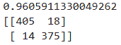
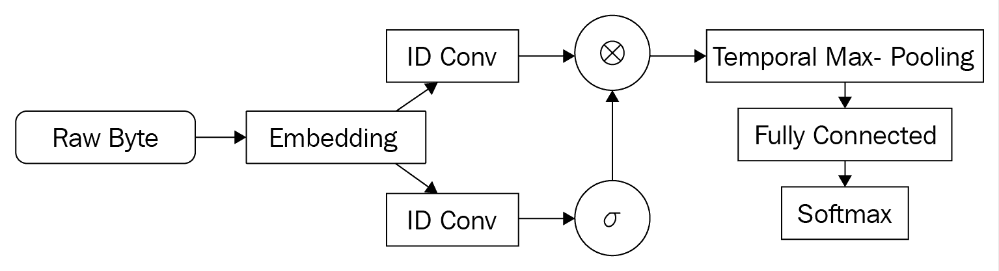
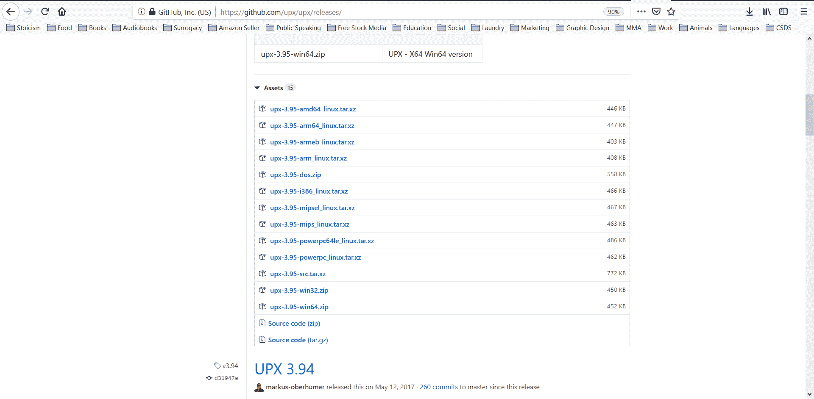
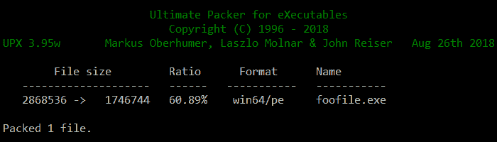
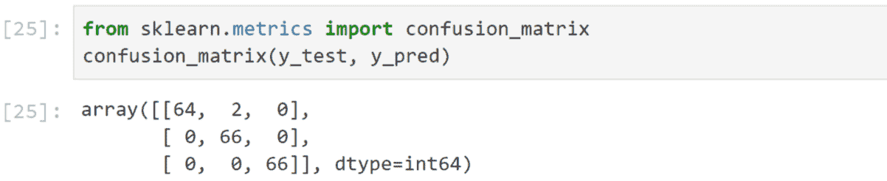
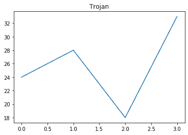
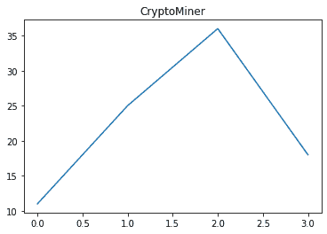
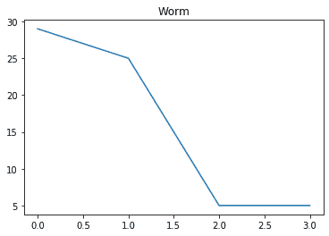
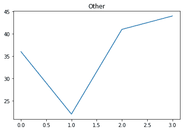

# 第三章：高级恶意软件检测

在本章中，我们将涵盖更高级的恶意软件分析概念。在上一章中，我们讨论了恶意软件分类的一般方法。这里，我们将讨论更具体的方法和前沿技术，特别是我们将讨论如何处理混淆和打包的恶意软件，如何扩大 N-gram 特征的收集规模，以及如何使用深度学习来检测甚至创建恶意软件。

本章包括以下内容：

+   检测混淆的 JavaScript

+   特征化 PDF 文件

+   使用哈希图算法快速提取 N-grams

+   构建动态恶意软件分类器

+   MalConv – 用于恶意 PE 检测的端到端深度学习

+   使用打包器

+   组装一个打包的示例数据集

+   构建打包器分类器

+   MalGAN – 创建规避型恶意软件

+   跟踪恶意软件漂移

# 技术要求

以下是本章的技术前提：

+   Keras

+   TensorFlow

+   XGBoost

+   UPX

+   Statsmodels

代码和数据集可以在[`github.com/PacktPublishing/Machine-Learning-for-Cybersecurity-Cookbook/tree/master/Chapter03`](https://github.com/PacktPublishing/Machine-Learning-for-Cybersecurity-Cookbook/tree/master/Chapter03)找到。

# 检测混淆的 JavaScript

在本节中，我们将看到如何使用机器学习来检测 JavaScript 文件是否被混淆。这样做可以创建一个二进制特征，标识文件是否被混淆，以用于良性/恶性分类，也可以作为解混淆脚本的前置步骤。

# 准备工作

本教程的准备工作包括在`pip`中安装`scikit-learn`包。命令如下：

```
pip install sklearn
```

此外，混淆和非混淆的 JavaScript 文件已经在仓库中提供。请将`JavascriptSamplesNotObfuscated.7z`解压到名为`JavaScript Samples`的文件夹中，将`JavascriptSamplesObfuscated.7z`解压到名为`JavaScript Samples Obfuscated`的文件夹中。

# 如何实现...

在接下来的步骤中，我们将演示如何使用二分类器来检测混淆的 JavaScript 文件：

1.  首先导入我们将用来处理 JavaScript 内容、准备数据集、分类以及衡量分类器性能所需的库：

```
import os
from sklearn.feature_extraction.text import HashingVectorizer, TfidfTransformer
from sklearn.ensemble import RandomForestClassifier
from sklearn.model_selection import train_test_split
from sklearn.metrics import accuracy_score, confusion_matrix
from sklearn.pipeline import Pipeline
```

1.  我们指定了混淆和非混淆 JavaScript 文件的路径，并为这两种文件分配了不同的标签：

```
js_path = "path\\to\\JavascriptSamples"
obfuscated_js_path = "path\\to\\ObfuscatedJavascriptSamples"

corpus = []
labels = []
file_types_and_labels = [(js_path, 0), (obfuscated_js_path, 1)]
```

1.  然后，我们将文件读入语料库并准备标签：

```
for files_path, label in file_types_and_labels:
    files = os.listdir(files_path)
    for file in files:
        file_path = files_path + "/" + file
        try:
            with open(file_path, "r") as myfile:
                data = myfile.read().replace("\n", "")
                data = str(data)
                corpus.append(data)
                labels.append(label)
        except:
            pass
```

1.  我们将数据集分为训练集和测试集，并准备一个管道来执行基本的 NLP，随后是一个随机森林分类器：

```
X_train, X_test, y_train, y_test = train_test_split(
    corpus, labels, test_size=0.33, random_state=42
)
text_clf = Pipeline(
    [
        ("vect", HashingVectorizer(input="content", ngram_range=(1, 3))),
        ("tfidf", TfidfTransformer(use_idf=True,)),
        ("rf", RandomForestClassifier(class_weight="balanced")),
    ]
)
```

1.  最后，我们将我们的管道拟合到训练数据，预测测试数据，然后输出结果：

```
text_clf.fit(X_train, y_train)
y_test_pred = text_clf.predict(X_test)

print(accuracy_score(y_test, y_test_pred))
print(confusion_matrix(y_test, y_test_pred))
```

准确率和混淆矩阵如下所示：



# 它是如何工作的...

我们首先导入标准的 Python 库以分析文件并设置机器学习管道（*第 1 步*）。在*第 2 步*和*第 3 步*中，我们将非混淆和混淆的 JavaScript 文件收集到数组中，并为它们分配相应的标签。这是我们二分类问题的准备工作。请注意，生成这个分类器的主要挑战是如何获取一个大而有用的数据集。解决这个难题的思路包括收集大量 JavaScript 样本，然后使用不同的工具对这些样本进行混淆。这样，分类器就有可能避免过拟合某一种混淆方式。收集完数据后，我们将其分为训练集和测试集（*第 4 步*）。此外，我们设置一个管道来应用自然语言处理（NLP）方法处理 JavaScript 代码，然后训练一个分类器（*第 4 步*）。最后，我们在*第 5 步*中评估分类器的性能。你会注意到，除了构建合适数据集的挑战之外，这个教程与我们用于检测文件类型的教程类似。

# 对 PDF 文件进行特征提取

在本节中，我们将学习如何对 PDF 文件进行特征提取，以便用于机器学习。我们将使用的工具是由*Didier Stevens*设计的`PDFiD` Python 脚本（[`blog.didierstevens.com/`](https://blog.didierstevens.com/)）。Stevens 选择了 20 个常见的特征，这些特征通常出现在恶意文件中，包括 PDF 文件是否包含 JavaScript 或启动自动操作。在文件中发现这些特征是可疑的，因此它们的出现可能表明存在恶意行为。

本质上，该工具扫描 PDF 文件，并统计每个约 20 个特征的出现次数。工具运行的输出如下所示：

```
 PDFiD 0.2.5 PythonBrochure.pdf

 PDF Header: %PDF-1.6
 obj                 1096
 endobj              1095
 stream              1061
 endstream           1061
 xref                   0
 trailer                0
 startxref              2
 /Page                 32
 /Encrypt               0
 /ObjStm               43
 /JS                    0
 /JavaScript            0
 /AA                    1
 /OpenAction            0
 /AcroForm              1
 /JBIG2Decode           0
 /RichMedia             0
 /Launch                0
 /EmbeddedFile          0
 /XFA                   0
 /URI                   0
 /Colors > 2²⁴         0
```

# 准备工作

这个教程所需的文件位于仓库中`pdfid`和`PDFSamples`文件夹内。

# 如何操作...

在接下来的步骤中，你将使用`PDFiD`脚本对一批 PDF 文件进行特征提取：

1.  下载工具并将所有相关代码与特征提取 PDF 的`Files.ipynb`放在同一目录下。

1.  导入 IPython 的`io`模块，以便捕获外部脚本的输出：

```
from IPython.utils import io
```

1.  定义一个函数来对 PDF 进行特征提取：

```
def PDF_to_FV(file_path):
    """Featurize a PDF file using pdfid."""
```

1.  运行`pdfid`工具并捕获操作的输出：

```
     with io.capture_output() as captured:
         %run -i pdfid $file_path
     out = captured.stdout
```

1.  接下来，解析输出，使其成为一个数值向量：

```
    out1 = out.split("\n")[2:-2]
    return [int(x.split()[-1]) for x in out1]
```

1.  导入`listdir`以列举文件夹中的文件，并指定存放 PDF 集合的目录：

```
from os import listdir

PDFs_path = "PDFSamples\\"
```

1.  遍历目录中的每个文件，对其进行特征提取，然后将所有特征向量收集到`X`中：

```
X = []
files = listdir(PDFs_path)
for file in files:
    file_path = PDFs_path + file
    X.append(PDF_to_FV(file_path))
```

# 工作原理…

我们通过下载`PDFiD`工具并将我们的 PDF 文件放在一个方便的位置进行分析（*步骤 1*）来开始我们的准备工作。请注意，该工具是免费且易于使用。接着，我们导入非常有用的 IPython 的`io`模块，以便捕获外部程序`PDFiD`的结果（*步骤 2*）。在接下来的步骤中，*步骤 3*和*步骤 5*，我们定义了一个将 PDF 文件转换为特征向量的函数 PDF to FV。特别地，它利用了`PDFiD`工具，然后将其输出解析成方便的形式。当我们在`PDFSamples\PythonBrochure.pdf`文件上运行时，我们的函数输出以下向量：

```
 [1096, 1095, 1061, 1061, 0, 0, 2, 32, 0, 43, 0, 0, 1, 0, 1, 0, 0, 0, 0, 0, 0, 0]
```

现在我们能够对单个 PDF 文件进行特征化，为什么不对所有的 PDF 文件进行特征化，以便使其适用于机器学习（*步骤 6*和*步骤 7*）。特别是在*步骤 6*中，我们提供包含我们想要进行特征化的 PDF 文件的路径，在*步骤 7*中，我们执行文件的实际特征化。

# 使用哈希-gram 算法快速提取 N-gram

在本节中，我们演示了一种快速和内存高效提取最频繁 N-gram 的技术。这使得处理大量 N-gram 带来的挑战变得更加容易。这种技术称为**Hash-Grams**，并依赖于在提取时对 N-gram 进行哈希处理。N-gram 的一个特性是它们遵循幂律，这确保了哈希碰撞对所获得特征的质量几乎没有影响。

# 准备工作

准备这个步骤涉及在`pip`中安装`nltk`。命令如下：

```
pip install nltk
```

另外，在存储库的根目录中为您提供了良性和恶意文件，将所有名为`Benign PE Samples*.7z`的存档解压缩到名为`Benign PE Samples`的文件夹中，并将所有名为`Malicious PE Samples*.7z`的存档解压缩到名为`Malicious PE Samples`的文件夹中。

# 如何操作...

在接下来的步骤中，我们将演示哈希-gram 算法的工作原理：

1.  首先指定包含我们样本的文件夹，参数 N，并导入一个用于哈希处理和从字符串中提取 N-gram 的库：

```
from os import listdir
from nltk import ngrams
import hashlib

directories = ["Benign PE Samples", "Malicious PE Samples"]
N = 2
```

1.  我们创建一个函数来读取文件的字节并将其转换为 N-gram：

```
def read_file(file_path):
    """Reads in the binary sequence of a binary file."""
    with open(file_path, "rb") as binary_file:
        data = binary_file.read()
    return data

def byte_sequence_to_Ngrams(byte_sequence, N):
    """Creates a list of N-grams from a byte sequence."""
    return ngrams(byte_sequence, N)
```

1.  现在，我们将要对 N-gram 进行哈希处理：

```
def hash_input(inp):
    """Compute the MD5 hash of an input."""
    return int(hashlib.md5(inp).hexdigest(), 16)

def make_ngram_hashable(Ngram):
    """Convert N-gram into bytes to be hashable."""
    return bytes(Ngram)
```

1.  `hash_file_Ngrams_into_dictionary`函数接受一个 N-gram，对其进行哈希处理，然后增加字典中哈希的计数。减少模块 B（%B）确保字典中的键不超过`B`个：

```
def hash_file_Ngrams_into_dictionary(file_Ngrams, T):
    """Hashes N-grams in a list and then keeps track of the counts in a dictionary."""
    for Ngram in file_Ngrams:
        hashable_Ngram = make_ngram_hashable(Ngram)
        hashed_and_reduced = hash_input(hashable_Ngram) % B
        T[hashed_and_reduced] = T.get(hashed_and_reduced, 0) + 1
```

1.  我们为 B 指定一个值，即小于 2¹⁶ 的最大素数，并创建一个空字典：

```
B = 65521
T = {}
```

1.  我们遍历我们的文件并计算它们的哈希 N-gram：

```
for dataset_path in directories:
    samples = [f for f in listdir(dataset_path)]
    for file in samples:
        file_path = dataset_path + "/" + file
        file_byte_sequence = read_file(file_path)
        file_Ngrams = byte_sequence_to_Ngrams(file_byte_sequence, N)
        hash_file_Ngrams_into_dictionary(file_Ngrams, T)
```

1.  我们使用`heapq`选择最频繁的`K1=1000`：

```
K1 = 1000
import heapq

K1_most_common_Ngrams_Using_Hash_Grams = heapq.nlargest(K1, T)
```

1.  一旦选择了哈希后的 N-grams，这些将构成特征集。为了特征化一个样本，我们遍历它的 N-grams，进行哈希并取模，如果结果是选中的哈希后的 N-grams 之一，则在该索引位置增加特征向量的值：

```
def featurize_sample(file, K1_most_common_Ngrams_Using_Hash_Grams):
    """Takes a sample and produces a feature vector.
    The features are the counts of the K1 N-grams we've selected.
    """
    K1 = len(K1_most_common_Ngrams_Using_Hash_Grams)
    fv = K1 * [0]
    file_byte_sequence = read_file(file_path)
    file_Ngrams = byte_sequence_to_Ngrams(file_byte_sequence, N)
    for Ngram in file_Ngrams:
        hashable_Ngram = make_ngram_hashable(Ngram)
        hashed_and_reduced = hash_input(hashable_Ngram) % B
        if hashed_and_reduced in K1_most_common_Ngrams_Using_Hash_Grams:
            index = K1_most_common_Ngrams_Using_Hash_Grams.index(hashed_and_reduced)
            fv[index] += 1
    return fv
```

1.  最后，我们对数据集进行特征化：

```
X = []
for dataset_path in directories:
    samples = [f for f in listdir(dataset_path)]
    for file in samples:
        file_path = dataset_path + "/" + file
        X.append(featurize_sample(file_path, K1_most_common_Ngrams_Using_Hash_Grams))
```

# 工作原理…

哈希 N-gram 配方的初始步骤与普通的 N-gram 提取类似。首先，我们通过指定包含样本的文件夹以及我们的 N 值（如 N-grams）来进行准备。此外，我们导入一个哈希库，这与普通的 N-gram 提取操作不同（*步骤 1*）。继续我们的准备工作，我们定义一个函数来读取文件的所有字节（与读取其内容不同），并将这些字节转化为 N-grams（*步骤 2*）。我们定义一个函数来计算 N-gram 的 MD5 哈希，并将结果以十六进制数返回。此外，我们还定义一个函数，将 N-gram 转换为其字节构成，以便能够进行哈希处理（*步骤 3*）。

接下来，我们定义一个函数来遍历文件的哈希 N-grams，将其对 B 取模，然后增加字典中对应哈希值的计数（*步骤 4*）。参数 B 控制字典中不同键的数量上限。通过哈希，我们能够随机化计数 N-grams 的桶。现在，在我们即将运行函数时，是时候指定 B 的值了。我们选择 B 的值为小于 2¹⁶ 的最大素数（*步骤 5*）。

通常选择一个素数，以确保哈希碰撞的数量最小。我们现在遍历文件目录，并对每个文件应用我们之前定义的函数（*步骤 6*）。结果是一个包含哈希 N-grams 计数的大字典，*T*。这个字典不大，我们很容易从中选择最常见的 K1 个哈希后的 N-grams（*步骤 7*）。通过这样做，选择到最频繁的 N-grams 的概率很高，尽管由于哈希碰撞，可能会多于 K1 个。此时，我们得到了特征集，即通过哈希映射到我们选择的 K1 个哈希 N-grams 的 N-grams。接下来，我们对数据集进行特征化（*步骤 8* 和 *步骤 9*）。特别地，我们遍历文件，计算它们的 N-grams。如果一个 N-gram 的哈希值是 K1 个选中值之一，我们认为它是一个频繁的 N-gram，并将其作为特征集的一部分。

需要注意的是，哈希 N-grams 算法并不总是更快，但当所考虑的数据集较大时，通常会更快。在许多情况下，当使用朴素的方法提取 N-grams 导致内存错误时，哈希 N-grams 能够成功终止。

# 另见

关于哈希 N-gram 算法的更多细节，请参见[`www.edwardraff.com/publications/hash-grams-faster.pdf`](https://www.edwardraff.com/publications/hash-grams-faster.pdf)[.](https://www.edwardraff.com/publications/hash-grams-faster.pdf)

# 构建一个动态恶意软件分类器

在某些情况下，能够基于行为检测恶意软件具有相当大的优势。特别是，当恶意软件在动态环境中进行分析时，隐藏其意图变得更加困难。因此，基于动态信息的分类器比基于静态信息的分类器更准确。在本节中，我们提供了一个动态恶意软件分类器的教程。我们使用的数据集来自 VirusShare 仓库中的 Android 应用程序。动态分析由 Johannes Thon 在多台 LG Nexus 5 设备（Android API 23）上进行，（在 LG Nexus 5 设备农场（API 23）上动态分析了 4000 多个恶意应用，goorax 在 LG Nexus 5 设备农场（API 23）上动态分析了 4300 多个良性应用，原始内容未修改，使用的是 CC BY 许可证）。

我们的方法是使用 N-gram 对 API 调用序列进行处理。

# 准备工作

该教程的准备工作包括在`pip`中安装`scikit-learn`、`nltk`和`xgboost`。命令如下：

```
pip install sklearn nltk xgboost
```

此外，您可以在仓库中找到良性和恶意的动态分析文件。将所有名为`DA Logs Benign*.7z`的压缩包解压到一个名为`DA Logs Benign`的文件夹中，将所有名为`DA Logs Malware*.7z`的压缩包解压到一个名为`DA Logs Malicious`的文件夹中。

# 如何操作…

在接下来的步骤中，我们展示了如何根据观察到的 API 调用序列检测恶意软件。

1.  我们的日志是 JSON 格式，因此我们首先导入 JSON 库。

```
import numpy as np
import os
import json

directories_with_labels = [("DA Logs Benign", 0), ("DA Logs Malware", 1)]
```

1.  编写一个函数来解析 JSON 日志：

```
def get_API_class_method_type_from_log(log):
    """Parses out API calls from behavioral logs."""
    API_data_sequence = []
    with open(log) as log_file:
        json_log = json.load(log_file)
        api_calls_array = "[" + json_log["api_calls"] + "]"
```

1.  我们选择提取 API 调用的类、方法和类型：

```
        api_calls = json.loads(api_calls_array)
        for api_call in api_calls:
            data = api_call["class"] + ":" + api_call["method"] + ":" + api_call["type"]
            API_data_sequence.append(data)
    return API_data_sequence
```

1.  我们将日志读取到一个语料库中，并收集它们的标签：

```
data_corpus = []
labels = []
for directory, label in directories_with_labels:
    logs = os.listdir(directory)
    for log_path in logs:
        file_path = directory + "/" + log_path
        try:
            data_corpus.append(get_API_class_method_type_from_log(file_path))
            labels.append(label)
        except:
            pass
```

1.  现在，让我们看看我们语料库中的数据是什么样的：

```
print(data_corpus[0])

['android.os.SystemProperties:get:content', 'android.os.SystemProperties:get:content', 'android.os.SystemProperties:get:content', 'android.os.SystemProperties:get:content', 'android.os.SystemProperties:get:content', 'android.os.SystemProperties:get:content', 'android.os.SystemProperties:get:content', 'android.os.SystemProperties:get:content', 'android.os.SystemProperties:get:content', 'android.os.SystemProperties:get:content', 'android.os.SystemProperties:get:content', 'android.os.SystemProperties:get:content', 'android.app.ContextImpl:registerReceiver:binder', 'android.app.ContextImpl:registerReceiver:binder', 'android.os.SystemProperties:get:content', 'android.os.SystemProperties:get:content']
```

1.  我们继续进行训练集和测试集的划分：

```
from sklearn.model_selection import train_test_split

corpus_train, corpus_test, y_train, y_test = train_test_split(
    data_corpus, labels, test_size=0.2, random_state=11
)
```

1.  我们的方法是使用 N-gram，所以我们加载我们的 N-gram 提取函数，并根据当前数据格式进行轻微修改：

```
import collections
from nltk import ngrams
import numpy as np

def read_file(file_path):
    """Reads in the binary sequence of a binary file."""
    with open(file_path, "rb") as binary_file:
        data = binary_file.read()
    return data

def text_to_Ngrams(text, n):
    """Produces a list of N-grams from a text."""
    Ngrams = ngrams(text, n)
    return list(Ngrams)

def get_Ngram_counts(text, N):
    """Get a frequency count of N-grams in a text."""
    Ngrams = text_to_Ngrams(text, N)
    return collections.Counter(Ngrams)
```

1.  我们指定 N=4 并收集所有 N-gram：

```
N = 4
total_Ngram_count = collections.Counter([])
for file in corpus_train:
    total_Ngram_count += get_Ngram_counts(file, N)
```

1.  接下来，我们将范围缩小到`K1 = 3000`个最常见的 N-gram：

```
K1 = 3000
K1_most_frequent_Ngrams = total_Ngram_count.most_common(K1)
K1_most_frequent_Ngrams_list = [x[0] for x in K1_most_frequent_Ngrams]

[('java.lang.reflect.Method:invoke:reflection', 'java.lang.reflect.Method:invoke:reflection', 'java.lang.reflect.Method:invoke:reflection', 'java.lang.reflect.Method:invoke:reflection'),

('java.io.FileInputStream:read:runtime', 'java.io.FileInputStream:read:runtime', 'java.io.FileInputStream:read:runtime', 'java.io.FileInputStream:read:runtime'),

 <snip>

 ('android.os.SystemProperties:get:content',   'android.os.SystemProperties:get:content',   'android.os.SystemProperties:get:content',   'javax.crypto.spec.SecretKeySpec:javax.crypto.spec.SecretKeySpec:crypto')
```

1.  然后我们编写一个方法，将样本转换为 N-gram 计数的向量：

```
def featurize_sample(file, Ngrams_list):
    """Takes a sample and produces a feature vector.
    The features are the counts of the K1 N-grams we've selected.
    """
    K1 = len(Ngrams_list)
    feature_vector = K1 * [0]
    fileNgrams = get_Ngram_counts(file, N)
    for i in range(K1):
        feature_vector[i] = fileNgrams[Ngrams_list[i]]
    return feature_vector
```

1.  我们应用这个函数来提取我们的训练和测试样本特征：

```
X_train = []
for sample in corpus_train:
    X_train.append(featurize_sample(sample, K1_most_frequent_Ngrams_list))
X_train = np.asarray(X_train)
X_test = []
for sample in corpus_test:
    X_test.append(featurize_sample(sample, K1_most_frequent_Ngrams_list))
X_test = np.asarray(X_test)
```

1.  我们使用互信息来进一步缩小 K1=3000 个最常见的 N-gram，筛选出 K2=500 个最有信息量的 N-gram。然后，我们设置一个管道，接着运行 XGBoost 分类器：

```
from sklearn.feature_selection import SelectKBest, mutual_info_classif
from sklearn.pipeline import Pipeline
from xgboost import XGBClassifier

K2 = 500
mi_pipeline = Pipeline(
    [
        ("mutual_information", SelectKBest(mutual_info_classif, k=K2)),
        ("xgb", XGBClassifier()),
    ]
)
```

1.  我们训练我们的管道并评估其在训练集和测试集上的准确性：

```
mi_pipeline.fit(X_train, y_train)
print("Training accuracy:")
print(mi_pipeline.score(X_train, y_train))
print("Testing accuracy:")
print(mi_pipeline.score(X_test, y_test))
```

以下输出给出了我们的训练和测试准确率：

```
Training accuracy:
0.8149428743235118
Testing accuracy:
0.8033674082982561
```

# 它是如何工作的……

在本食谱中，我们执行了一项令人兴奋的任务，即基于样本的运行时行为对恶意软件和良性样本进行分类。我们的前三个步骤是定义一个函数来读取和解析包含样本运行时行为信息的 JSON 日志。顺便说一句，JSON 是一个非常有用的文件格式，当你的数据可能包含可变数量的属性时非常适用。我们战略性地选择提取 API 调用的类别、方法和内容。还可以使用其他特征，如 API 调用发生的时间和调用的参数。权衡是数据集将更大，这些特征可能会导致性能下降或过拟合。建议调查选择其他特征来为分类器提供更多信息。

定义了我们的函数后，我们继续执行解析并将所有解析的数据收集到一个地方（*步骤 4*）。在*步骤 5*中，我们查看我们的语料库。我们看到了构成我们数据的 API 调用的四元组样本。接下来是进行训练-测试分割的标准步骤。在*步骤 7*和*步骤 8*中，我们加载我们的 N-gram 提取函数，并使用这些函数从我们的数据集中提取 N-gram。这些提取方法类似于用于二进制文件的方法，但针对手头的文本格式进行了调整。最初，我们收集了 K1=3000 个最常见的 N-gram，以减少计算负载。通过增加 K1 和稍后的 K2 数量，我们可以期望分类器的准确性得到提高，但内存和计算需求也会增加（*步骤 9*）。在*步骤 10*中，我们定义了一个函数，将样本特征化为它们的 N-gram 特征向量，然后，在*步骤 11*中，我们应用这个函数来特征化我们的训练和测试样本。我们希望进一步缩小特征集。我们选择使用互信息从`K1=3000`个最常见的 N-gram 中选择 K2=500 个最具信息量的 N-gram（*步骤 12*）——正如在选择最佳 N-gram 的食谱中所讨论的那样，有很多选项。

例如，另一种选择是使用卡方检验。此外，除了 XGBoost 之外，还可以选择其他分类器。最后，我们看到获得的准确度表明，使用 N-gram 对 API 调用序列进行处理的方法是有前景的。

# MalConv – 用于恶意 PE 检测的端到端深度学习

静态恶意软件检测领域的一项新发展是使用深度学习进行端到端机器学习的恶意软件检测。在这种情况下，我们完全跳过所有特征工程；我们无需了解 PE 头或其他可能表明 PE 恶意软件的特征。我们只需将原始字节流输入到我们的神经网络中并进行训练。这个想法最早在[`arxiv.org/pdf/1710.09435.pdf`](https://arxiv.org/pdf/1710.09435.pdf)中提出。这个架构被称为**MalConv**，如下图所示：



# 准备就绪

本食谱的准备工作涉及在`pip`中安装多个包，具体包括`keras`、`tensorflow`和`tqdm`。安装命令如下：

```
pip install keras tensorflow tqdm
```

此外，良性和恶意文件已提供给你，在仓库根目录下的`PE Samples Dataset`文件夹中。将所有名为`Benign PE Samples*.7z`的压缩包提取到名为`Benign PE Samples`的文件夹中，并将所有名为`Malicious PE Samples*.7z`的压缩包提取到名为`Malicious PE Samples`的文件夹中。

# 如何操作...

在本食谱中，我们详细讲解了如何在原始 PE 文件上训练 MalConv：

1.  我们导入`numpy`进行向量运算，并导入`tqdm`来跟踪循环中的进度：

```
import numpy as np
from tqdm import tqdm
```

1.  定义一个函数将字节嵌入为向量：

```
def embed_bytes(byte):
    binary_string = "{0:08b}".format(byte)
    vec = np.zeros(8)
    for i in range(8):
        if binary_string[i] == "1":
            vec[i] = float(1) / 16
        else:
            vec[i] = -float(1) / 16
    return vec
```

1.  读取原始 PE 样本的位置，并创建它们的标签列表：

```
import os
from os import listdir

directories_with_labels = [("Benign PE Samples", 0), ("Malicious PE Samples", 1)]
list_of_samples = []
labels = []
for dataset_path, label in directories_with_labels:
    samples = [f for f in listdir(dataset_path)]
    for file in samples:
        file_path = os.path.join(dataset_path, file)
        list_of_samples.append(file_path)
        labels.append(label)
```

1.  定义一个便捷函数来读取文件的字节序列：

```
def read_file(file_path):
    """Read the binary sequence of a file."""
    with open(file_path, "rb") as binary_file:
        return binary_file.read()
```

1.  设置每个样本读取的最大字节长度`maxSize`，将所有样本的字节嵌入，并将结果收集到 X 中：

```
max_size = 15000
num_samples = len(list_of_samples)
X = np.zeros((num_samples, 8, max_size))
Y = np.asarray(labels)
file_num = 0
for file in tqdm(list_of_samples):
    sample_byte_sequence = read_file(file)
    for i in range(min(max_size, len(sample_byte_sequence))):
        X[file_num, :, i] = embed_bytes(sample_byte_sequence[i])
    file_num += 1
```

1.  准备优化器：

```
from keras import optimizers

my_opt = optimizers.SGD(lr=0.01, decay=1e-5, nesterov=True)
```

1.  利用 Keras 函数式 API 设置深度神经网络架构：

```
 from keras import Input
 from keras.layers import Conv1D, Activation, multiply, GlobalMaxPool1D, Dense
 from keras import Model

 inputs = Input(shape=(8, maxSize))
 conv1 = Conv1D(kernel_size=(128), filters=32, strides=(128), padding='same')(inputs)
 conv2 = Conv1D(kernel_size=(128), filters=32, strides=(128), padding='same')(inputs)
 a = Activation('sigmoid', name='sigmoid')(conv2)
 mul = multiply([conv1, a])
 b = Activation('relu', name='relu')(mul)
 p = GlobalMaxPool1D()(b)
 d = Dense(16)(p)
 predictions = Dense(1, activation='sigmoid')(d)
 model = Model(inputs=inputs, outputs=predictions)

```

1.  编译模型并选择批次大小：

```
model.compile(optimizer=my_opt, loss="binary_crossentropy", metrics=["acc"])
batch_size = 16
num_batches = int(num_samples / batch_size)
```

1.  在批次上训练模型：

```
for batch_num in tqdm(range(num_batches)):
    batch = X[batch_num * batch_size : (batch_num + 1) * batch_size]
    model.train_on_batch(
        batch, Y[batch_num * batch_size : (batch_num + 1) * batch_size]
    )
```

# 它是如何工作的…

我们首先导入`numpy`和`tqdm`（*步骤 1*），`tqdm`是一个可以通过显示百分比进度条来跟踪循环进度的包。作为将文件的原始字节输入到我们的深度神经网络的一部分，我们使用一种简单的字节嵌入方式，将字节嵌入到一个 8 维空间中，其中每个字节的位对应于向量的一个坐标（*步骤 2*）。一个值为 1 的位表示对应的坐标被设置为 1/16，而位值为 0 对应的坐标则为-1/16。例如，10010001 被嵌入为向量(1/16, -1/16, -1/16, 1/16, -1/16, -1/16, -1/16, 1/16)。也可以采用其他嵌入方式，例如那些与神经网络一起训练的方式。

MalConv 架构做出了一个简单但计算上快速的选择。在 *步骤 3* 中，我们列出我们的样本及其标签，在 *步骤 4* 中，我们定义了一个函数来读取文件的字节。注意 `rb` 设置替代了 `r`，以便将文件读取为字节序列。在 *步骤 5* 中，我们使用 `tqdm` 来跟踪循环的进度。对于每个文件，我们读取字节序列并将每个字节嵌入到一个 8 维空间中。然后，我们将这些字节聚集到 *X* 中。如果字节数超过 `maxSize=15000`，则停止。如果字节数小于 `maxSize`，则假定字节为 0。`maxSize` 参数控制每个文件读取多少字节，可以根据内存容量、可用计算量和样本大小进行调整。在接下来的步骤（*步骤 6* 和 *步骤 7*）中，我们定义了一个标准优化器，即随机梯度下降，并选择了相应的参数，同时定义了与 MalConv 非常接近的神经网络架构。注意，我们在这里使用了 Keras 函数式 API，它使我们能够在模型中创建复杂的输入输出关系。

最后，需要注意的是，更好的架构和参数选择是一个开放的研究领域。接下来，我们可以自由选择批次大小并开始训练（*步骤 8* 和 *步骤 9*）。批次大小是一个重要的参数，它会影响学习过程的速度和稳定性。为了我们的目的，我们做出了一个简单的选择。我们一次输入一个批次，并训练我们的神经网络。

# 应对打包恶意软件

打包是可执行文件的压缩或加密，与普通压缩不同的是，它通常在运行时内存中解压，而不是在执行前解压到磁盘上。打包工具给分析人员带来了混淆挑战。

例如，VMProtect 这种打包工具通过在具有独特架构的虚拟环境中执行，来保护其内容免受分析人员的窥视，这使得分析该软件成为一个巨大的挑战。

Amber 是一个用于绕过安全产品和防护措施的反射型 PE 打包工具。它可以将常规编译的 PE 文件打包成反射型有效载荷，这些有效载荷可以像 shellcode 一样自我加载和执行。它实现了隐蔽的内存中有效载荷部署，可用于绕过杀毒软件、防火墙、IDS、IPS 产品以及应用程序白名单的防护措施。最常用的打包工具是 UPX。

由于打包会混淆代码，它往往会导致机器学习分类器性能的下降。通过确定用于打包可执行文件的打包工具，我们可以使用相同的打包工具来解包代码，即恢复到原始的、未混淆的版本。然后，杀毒软件和机器学习检测是否为恶意文件就变得更加简单。

# 使用打包工具

在本食谱中，我们将展示如何获取打包器（即 UPX）并使用它。拥有一组打包器的目的是，首先，进行数据增强，如本食谱后续内容所述；其次，在确定打包器后，可以解包已打包的样本。

# 准备工作

以下方法不需要额外的包。你可以在本书的`Packers`文件夹中找到`upx.exe`。

# 如何操作...

在本食谱中，你将使用 UPX 打包器来打包一个文件：

1.  从[`github.com/upx/upx/releases/`](https://github.com/upx/upx/releases/)下载并解压最新版本的 UPX



1.  通过运行`upx.exe`和`foofile.exe`，对你希望打包的文件执行`upx.exe`。成功打包的结果如下所示：



该文件仍然是可执行文件，这与压缩文件不同，压缩文件会变成 ZIP 格式。

# 它是如何工作的…

如你所见，使用打包器非常简单。大多数打包器的一个优点是它们除了混淆文件内容外，还能减少文件的大小。许多黑客会使用自制的打包器。这些打包器的优势在于它们难以解包。从检测恶意文件的角度来看，使用自制打包器打包的文件是高度可疑的。

# 组装一个打包的样本数据集

组装一个打包器分类器数据集的一个明显方法是收集已经打包并且标注了打包信息的样本。另一种有效的方法是收集一个大型文件数据集，然后自己进行打包。

# 准备工作

以下方法不需要额外的包。你可以在本书的`Packers`文件夹中找到`upx.exe`。

# 如何操作...

在本食谱中，你将使用 UPX 来打包一个文件夹中的文件。

1.  将`upx.exe`放入目录`A`，并将一组样本放入目录`B`，该目录位于`A`中。对于这个例子，`B`是良性 PE 样本 UPX。

1.  列出目录`B`中的文件：

```
import os

files_path = "Benign PE Samples UPX/"
files = os.listdir(files_path)
file_paths = [files_path+x for x in files]
```

1.  对`B`中的每个文件运行`upx`：

```
from subprocess import Popen, PIPE

cmd = "upx.exe"
for path in file_paths:
    cmd2 = cmd+" \""+path+"\""
    res = Popen(cmd2, stdout=PIPE).communicate()
    print(res)
```

1.  每当在打包时发生错误，删除原始样本：

```
    if "error" in str(res[0]):
        print(path)
        os.remove(path)
```

# 它是如何工作的…

前两个步骤是为运行 UPX 打包器做准备。在*第 3 步*中，我们使用子进程在 Python 中调用外部命令，即 UPX。当我们打包样本时（*第 4 步*），每当发生错误时，我们会删除该样本，因为它无法成功打包。这确保了我们的目录中只有打包的样本，从而我们可以将干净且有序的数据输入到分类器中。

# 构建打包器的分类器

在组装了标注数据后，这些数据由按打包器标注的目录中的打包样本组成，我们准备训练一个分类器来判断样本是否被打包，如果是的话，使用了哪种打包器。

# 准备工作

本食谱的准备工作包括在 `pip` 中安装 `scikit-learn` 和 `nltk`。命令如下：

```
pip install sklearn nltk
```

此外，仓库中已为您提供了打包和非打包文件。在这个食谱中，使用了三种类型的样本：未打包、UPX 打包和 Amber 打包。从仓库根目录中的 `PE Samples Dataset` 中提取所有名为 `Benign PE Samples*.7z` 的归档文件到名为 `Benign PE Samples` 的文件夹，提取 `Benign PE Samples UPX.7z` 到名为 `Benign PE Samples UPX` 的文件夹，并提取 `Benign PE Samples Amber.7z` 到名为 `Benign PE Samples Amber` 的文件夹。

# 如何操作……

在这个食谱中，您将构建一个分类器来确定用于打包文件的打包器：

1.  读取要分析的文件名称及其对应的标签，标签对应所使用的打包器：

```
import os
from os import listdir

directories_with_labels = [
    ("Benign PE Samples", 0),
    ("Benign PE Samples UPX", 1),
    ("Benign PE Samples Amber", 2),
]
list_of_samples = []
labels = []
for dataset_path, label in directories_with_labels:
    samples = [f for f in listdir(dataset_path)]
    for file in samples:
        file_path = os.path.join(dataset_path, file)
        list_of_samples.append(file_path)
        labels.append(label)
```

1.  创建训练测试集划分：

```
from sklearn.model_selection import train_test_split

samples_train, samples_test, labels_train, labels_test = train_test_split(
    list_of_samples, labels, test_size=0.3, stratify=labels, random_state=11
)
```

1.  定义提取 N-gram 所需的导入：

```
import collections
from nltk import ngrams
import numpy as np
```

1.  定义用于提取 N-gram 的函数：

```
def read_file(file_path):
    """Reads in the binary sequence of a binary file."""
    with open(file_path, "rb") as binary_file:
        data = binary_file.read()
    return data

def byte_sequence_to_Ngrams(byte_sequence, N):
    """Creates a list of N-grams from a byte sequence."""
    Ngrams = ngrams(byte_sequence, N)
    return list(Ngrams)

def extract_Ngram_counts(file, N):
    """Takes a binary file and outputs the N-grams counts of its binary sequence."""
    filebyte_sequence = read_file(file)
    file_Ngrams = byte_sequence_to_Ngrams(filebyte_sequence, N)
    return collections.Counter(file_Ngrams)

def featurize_sample(sample, K1_most_frequent_Ngrams_list):
    """Takes a sample and produces a feature vector.
    The features are the counts of the K1 N-grams we've selected.
    """
    K1 = len(K1_most_frequent_Ngrams_list)
    feature_vector = K1 * [0]
    file_Ngrams = extract_Ngram_counts(sample, N)
    for i in range(K1):
        feature_vector[i] = file_Ngrams[K1_most_frequent_Ngrams_list[i]]
    return feature_vector
```

1.  遍历数据，选择您希望用作特征的 N-gram：

```
N = 2
total_Ngram_count = collections.Counter([])
for file in samples_train:
    total_Ngram_count += extract_Ngram_counts(file, N)
K1 = 100
K1_most_common_Ngrams = total_Ngram_count.most_common(K1)
K1_most_common_Ngrams_list = [x[0] for x in K1_most_common_Ngrams]
```

1.  对训练集进行特征化：

```
Ngram_features_list_train = []
y_train = []
for i in range(len(samples_train)):
    file = samples_train[i]
    NGram_features = featurize_sample(file, K1_most_common_Ngrams_list)
    Ngram_features_list_train.append(NGram_features)
    y_train.append(labels_train[i])
X_train = Ngram_features_list_train
```

1.  在训练数据上训练随机森林模型：

```
from sklearn.ensemble import RandomForestClassifier

clf = RandomForestClassifier(n_estimators=100)
clf = clf.fit(X_train, y_train)
```

1.  对测试集进行特征化：

```
Ngram_features_list_test = []
y_test = []
for i in range(len(samples_test)):
    file = samples_test[i]
    NGram_features = featurize_sample(file, K1_most_common_Ngrams_list)
    Ngram_features_list_test.append(NGram_features)
    y_test.append(labels_test[i])
X_test = Ngram_features_list_test
```

1.  利用训练好的分类器在测试集上进行预测，并使用混淆矩阵评估性能：

```
y_pred = clf.predict(X_test)
from sklearn.metrics import confusion_matrix

confusion_matrix(y_test, y_pred)
```

输出结果如下：



# 它是如何工作的……

我们从简单的步骤开始，将数据和标签组织成数组（*第 1 步*）。特别地，我们读取样本并为其分配相应的标签，标签对应它们被打包的打包器。在 *第 2 步* 中，我们进行训练测试集划分。现在我们准备好对数据进行特征化，因此我们导入提取 N-gram 所需的库，并定义我们的 N-gram 函数（*第 3 步* 和 *第 4 步*），这些内容将在其他食谱中讨论，并且，我们简化地选择 *N=2* 和 *K1=100* 个最常见的 N-gram 作为特征，进行数据的特征化（*第 5 步* 和 *第 6 步*）。不同的 N 值和选择最有信息量的 N-gram 的其他方法可以获得更好的结果，但同时也会增加对计算资源的需求。特征化数据后，我们进行训练测试集划分（*第 7 步*），然后在数据上训练一个随机森林分类器（一个简单的首选）（*第 8 步*）。根据 *第 9 步* 中的混淆矩阵，我们可以看到，机器学习分类器在此类问题上表现得非常准确。

# MalGAN – 创建规避型恶意软件

使用**生成对抗网络**（**GANs**），我们可以创建对抗性恶意软件样本，用于训练和改进我们的检测方法，并在对手之前识别出漏洞。这里的代码基于**j40903272/MalConv-keras**。对抗性恶意软件样本是通过向恶意软件样本中添加一小段经过精心计算的字节序列进行修改的，选择这些字节序列是为了欺骗用于分类样本的神经网络（在此情况下是 MalConv）。

# 做好准备

本食谱的准备工作包括在`pip`中安装`pandas`、`keras`、`tensorflow`和`scikit-learn`包。安装命令如下：

```
pip install pandas keras tensorflow sklearn
```

`MalGan`的相关代码和资源文件已经包含在本书的仓库中，在`MalGan`目录下。此外，收集一批 PE 样本，然后将它们的路径放入文件的第一列：

```
"MalGAN_input/samplesIn.csv" 
```

在第二列中，输入这些样本的判定（1 为良性，0 为恶性）。

# 如何执行...

在这个食谱中，你将学习如何创建对抗性恶意软件：

1.  开始时导入 MalGAN 代码以及一些实用库。

```
import os
import pandas as pd
from keras.models import load_model
import MalGAN_utils
import MalGAN_gen_adv_examples
```

1.  指定输入和输出路径：

```
save_path = "MalGAN_output"
model_path = "MalGAN_input/malconv.h5"
log_path = "MalGAN_output/adversarial_log.csv"
pad_percent = 0.1
threshold = 0.6
step_size = 0.01
limit = 0.
input_samples = "MalGAN_input/samplesIn.csv"
```

1.  设置是否希望使用 GPU 进行对抗样本生成：

```
MalGAN_utils.limit_gpu_memory(limit)
```

1.  将包含样本名称和标签的 csv 文件读入数据框：

```
df = pd.read_csv(input_samples, header=None)
fn_list = df[0].values
```

1.  加载预计算的 MalConv 模型：

```
model = load_model(model_path)
```

1.  使用**快速梯度步进法**（**FGSM**）生成对抗性恶意软件：

```
adv_samples, log = MalGAN_gen_adv_examples.gen_adv_samples(model, fn_list, pad_percent, step_size, threshold)
```

1.  保存结果日志并将样本写入磁盘：

```
log.save(log_path)
for fn, adv in zip(fn_list, adv_samples):
    _fn = fn.split('/')[-1]
    dst = os.path.join(save_path, _fn)
    print(dst)
    with open(dst, 'wb') as f:
        f.write(adv)
```

# 它是如何工作的…

我们首先导入将要使用的所有 MalGAN 代码（*步骤 1*）。我们必须指定一些参数（*步骤 2*），现在进行说明。`savePath`参数是保存对抗性示例的位置。`modelPath`变量是 MalConv 预计算权重的路径。`logPath`参数是记录应用**快速梯度符号法**（**FGSM**）到样本的相关数据的位置。例如，日志文件可能如下所示：

| **文件名** | **原始分数** | **文件长度** | **填充长度** | **损失** | **预测分数** |
| --- | --- | --- | --- | --- | --- |
| 0778...b916 | 0.001140 | 235 | 23 | 1 | 0.912 |

请注意，原始分数接近`0`，表明 MalConv 认为原始样本是恶意的。在选择要使用哪些字节进行填充后，最终的预测分数接近`1`，表明修改后的样本现在被认为是良性的。`padPercent`参数确定向样本末尾附加多少字节。`threshold`参数确定神经网络应对对抗样本的良性做出多大程度的确定才将其写入磁盘。`stepSize`是 FGSM 中的一个参数。到目前为止，参数就讲解完了。我们还有一个选择要做，就是是否使用 CPU 或 GPU（*步骤 3*）。为了简单起见，本食谱选择使用 CPU。显然，使用 GPU 可以加速计算。这里的`limit`参数表示在计算中使用多少 GPU，默认设置为`0`。在下一步，*步骤 4*，我们读取由`inputSamples`参数指定的`.csv`文件。此输入日志的格式如下：

| 2b5137a1658c...8 | 1 |
| --- | --- |
| 0778a070b28...6 | 0 |

在这里，第一列给出了样本的路径，第二列提供了标签（`1`表示良性，`0`表示恶意）。我们现在加载预计算的 MalGAN 模型（*第 5 步*），生成对抗恶意软件样本（*第 6 步*），然后将其保存到磁盘（*第 7 步*）。

# 跟踪恶意软件漂移

恶意软件的分布时刻在变化。不仅新样本不断发布，还有新类型的病毒出现。例如，隐私挖矿者是近年来随着加密货币出现的新型恶意软件，直到加密货币出现之前它是未知的。有趣的是，从机器学习的角度来看，恶意软件的种类和分布不仅在进化，它们的定义也在变化，这种现象被称为**概念漂移**。更具体地说，十五年前的病毒很可能已经无法在当前使用的系统中执行，因此它不会对用户造成危害，因而不再算作恶意软件。

通过跟踪恶意软件的漂移，甚至预测它，组织可以更好地将资源投入到正确的防御类型中，从而为未来的威胁建立免疫。

# 准备中

准备这道菜需要在`pip`中安装`matplotlib`、`statsmodels`和`scipy`包。命令如下：

```
pip install matplotlib statsmodels scipy
```

# 如何操作……

在这道菜中，你将使用时间序列回归来预测基于历史数据的恶意软件分布：

1.  收集你感兴趣领域内恶意软件分布的历史数据：

```
month0 = {"Trojan": 24, "CryptoMiner": 11, "Other": 36, "Worm": 29}
month1 = {"Trojan": 28, "CryptoMiner": 25, "Other": 22, "Worm": 25}
month2 = {"Trojan": 18, "CryptoMiner": 36, "Other": 41, "Worm": 5}
month3 = {"CryptoMiner": 18, "Trojan": 33, "Other": 44, "Worm": 5}
months = [month0, month1, month2, month3]
```

1.  将数据转换为每种恶意软件类别的独立时间序列：

```
trojan_time_series = []
crypto_miner_time_series = []
worm_time_series = []
other_time_series = []
for month in months:
    trojan_time_series.append(month["Trojan"])
    crypto_miner_time_series.append(month["CryptoMiner"])
    worm_time_series.append(month["Worm"])
    other_time_series.append(month["Other"])
```

以下图表展示了木马的时间序列：



以下图表展示了加密矿工的时间序列：



以下图表展示了蠕虫的时间序列：



以下图表展示了其他类型恶意软件的时间序列：



1.  从`statsmodels`导入移动平均：

```
from statsmodels.tsa.arima_model import ARMA
```

1.  使用移动平均法基于时间序列预测下个月的分布。

```
ts_model = ARMA(trojan_time_series, order=(0, 1))
model_fit_to_data = ts_model.fit(disp=True)
y_Trojan = model_fit_to_data.predict(len(trojan_time_series), len(trojan_time_series))
print("Trojan prediction for following month: " + str(y_Trojan[0]) + "%")
```

木马的结果如下：

```
Trojan prediction for following month: 21.699999876315772%
```

我们对加密矿工使用相同的方法：

```
ts_model = ARMA(crypto_miner_time_series, order=(0, 1))
model_fit_to_data = ts_model.fit(disp=True)
y_CryptoMiner = model_fit_to_data.predict(
    len(crypto_miner_time_series), len(crypto_miner_time_series)
)
print("CryptoMiner prediction for following month: " + str(y_CryptoMiner[0]) + "%")
```

我们得到以下预测结果：

```
CryptoMiner prediction for following month: 24.09999979660618%
```

对于蠕虫，使用以下代码：

```
ts_model = ARMA(worm_time_series, order=(0, 1))
model_fit_to_data = ts_model.fit(disp=True)
y_Worm = model_fit_to_data.predict(len(worm_time_series), len(worm_time_series))
print("Worm prediction for following month: " + str(y_Worm[0]) + "%")
```

我们得到以下预测结果：

```
Worm prediction for following month: 14.666665384131406%
```

对于其他类型的恶意软件，我们使用以下代码：

```
ts_model = ARMA(other_time_series, order=(0, 1))
model_fit_to_data = ts_model.fit(disp=True)
y_Other = model_fit_to_data.predict(len(other_time_series), len(other_time_series))
print("Other prediction for following month: " + str(y_Other[0]) + "%")
```

我们得到以下预测结果：

```
Other prediction for following month: 27.400000645620793%
```

# 它是如何工作的……

为了教学目的，我们生成了一个玩具数据集，表示每种类型的恶意软件在时间上的百分比（*步骤 1*）。通过更多的历史数据，这样的数据集可以指示你在安全领域应该将资源投入到何处。我们将数据收集在一个地方并生成可视化图表（*步骤 2*）。我们希望进行简单的预测，因此我们导入 ARMA 模型，ARMA 代表*自回归滑动平均模型*，它是滑动平均模型的一个推广。为了简化起见，我们将 ARMA 专门化为**移动平均**（**MA**）。在*步骤 4*中，我们使用 MA 来预测恶意软件百分比在下一个时间段内的变化情况。随着数据集的增大，尝试不同的模型并创建考虑时间因素的训练-测试集是明智的做法。这将帮助你找到最具解释性的模型，换句话说，找到最能准确预测时间的模型。
