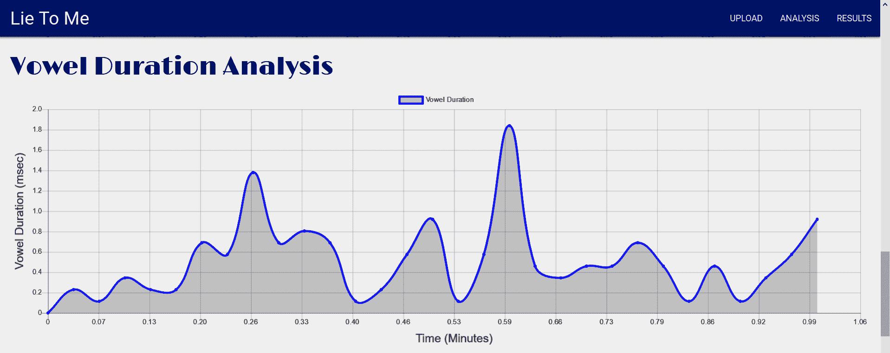

# 第四章：用于社会工程学的机器学习

有许多酷炫的机器学习（**ML**）应用，它们在社会工程学中尤其突出。机器学习使得自动化钓鱼攻击取得了巨大的成功，正如我们将通过 Twitter 钓鱼机器人教程所学到的那样。它还被用于生成假冒但逼真的视频，同时也能发现这些视频是假的。机器学习提供了语音传输、谎言检测等多种实用工具，这些工具将出现在本章的教程中，旨在提升你的社会工程学技能。

本章涵盖以下内容：

+   Twitter 钓鱼机器人

+   声音伪装

+   用于 **开源情报**（**OSINT**）的语音识别

+   面部识别

+   深度伪造

+   深度伪造识别

+   使用机器学习进行谎言检测

+   个性分析

+   社会化映射工具

+   训练虚假评论生成器

+   生成虚假评论

+   假新闻

# 技术要求

在本章中，我们将使用以下内容：

+   Markovify

+   Twitter 开发者账号

+   Tweepy

+   PyTorch

+   OpenCV

+   Keras

+   TensorFlow

+   IBM 的 Watson

代码和数据集可以在 [`github.com/PacktPublishing/Machine-Learning-for-Cybersecurity-Cookbook/tree/master/Chapter04`](https://github.com/PacktPublishing/Machine-Learning-for-Cybersecurity-Cookbook/tree/master/Chapter04) 找到。

# Twitter 钓鱼机器人

在本教程中，我们将使用机器学习来构建一个 Twitter 钓鱼机器人。该机器人将利用人工智能模拟目标的推文，从而为自己的推文创造有趣且吸引人的内容。此外，这些推文将包含嵌入的链接，导致目标点击这些钓鱼链接。当然，我们不会将此机器人用于恶意目的，我们的链接将是虚拟链接。链接本身将被模糊化，直到目标点击之后才会发现实际隐藏的内容。

实验结果表明，这种攻击形式具有较高的成功率，通过模拟这种攻击，你可以测试并提高客户或组织的安全防护能力。

# 准备工作

本教程的准备工作包括在 `pip` 中安装 `tweepy` 和 `markovify` 包。具体步骤如下：

```
pip install tweepy markovify
```

此外，你还需要在 Twitter 上设置一个开发者账号。过程相对简单，且账号创建是免费的。

# 如何操作...

在接下来的步骤中，我们将展示如何利用机器学习创建一个 Twitter 钓鱼机器人：

1.  设置 Twitter 开发者账号。

1.  创建一个新应用并获取你的消费者 API 密钥、访问令牌和访问令牌密钥。

1.  导入 `tweepy` 库并填写你的凭证，以便访问 Twitter API：

```
import json
import tweepy

CONSUMER_API_KEY = "fill me in"
CONSUMER_API_SECRET_KEY = "fill me in"
ACCESS_TOKEN = "fill me in"
ACCESS_TOKEN_SECRET = "fill me in"

auth = tweepy.OAuthHandler(CONSUMER_API_KEY, CONSUMER_API_SECRET_KEY)
auth.set_access_token(ACCESS_TOKEN, ACCESS_TOKEN_SECRET)

api = tweepy.API(
    auth, wait_on_rate_limit=True, wait_on_rate_limit_notify=True, compression=True
)
```

1.  我们选择一个目标用户或要模仿的人物。在本例中，我选择了一位活跃在 Twitter 上的科技领域知名人物：

```
user_id = "elonmusk"
```

1.  收集用户最近的 `count = 200` 条推文：

```
count = 200
user_tweets = api.user_timeline(screen_name=user_id, count=count, tweet_mode="extended")
```

1.  将用户的所有推文收集成一大段文本：

```
tweet_corpus = []
for tweet in user_tweets:
    tweet_corpus.append(tweet.full_text)
tweets_text = ". ".join(tweet_corpus)
```

1.  现在我们开始处理文本。我们定义一个函数，将找到的任何 URL 实例替换为新的 URL：

```
import re

def replace_URLs(string, new_URL):
    """Replaces all URLs in a string with a custom URL."""
    modified_string = re.sub(
        "http[s]?://(?:[a-zA-Z]|[0-9]|[$-_@.&+]|[!*\(\), ]|(?:%[0-9a-fA-F][0-9a-fA-F]))+",
        " " + new_URL + " ",
        string,
    )
    return modified_string
```

1.  创建一个网络钓鱼链接并将其插入到推文中。在我们的情况下，我们使用了一个 URL 缩短服务来隐藏链接的目的地，其实只是 Google。

```
phishing_link = "https://urlzs.com/u8ZB"
processed_tweets_text = replace_URLs(tweets_text, phishing_link)
```

1.  在处理文本后训练一个马尔科夫模型并生成推文：

```
import markovify

markov_model = markovify.Text(processed_tweets_text)
```

1.  生成包含网络钓鱼链接的所需数量的推文：

```
num_phishing_tweets_desired = 5
num_phishing_tweets_so_far = 0
generated_tweets = []
while num_phishing_tweets_so_far < num_phishing_tweets_desired:
    tweet = markov_model.make_short_sentence(140)
    if phishing_link in tweet and tweet not in generated_tweets:
        generated_tweets.append(tweet)
        num_phishing_tweets_so_far += 1
```

我们将看到以下输出：


1.  发布你的推特并定位到用户、用户的关注者或用户的朋友。例如，这段代码获取用户的朋友：

```
user = api.get_user(user_id)
for friend in user.friends():
    print(friend.screen_name)
```

我们将看到的输出如下：

```
wonderofscience
SpaceComCC
AFSpace
Liv_Boeree
shivon
Teslarati
neiltyson
SciGuySpace
wlopwangling
Berger_SN
pewdiepie
CathieDWood
lexfridman
ccsakuras
4thFromOurStar
TheOnion
BBCScienceNews
sciencemagazine
NatureNews
TheStoicEmperor
```

# 工作原理...

在步骤 1 和 2 中，您需要访问 Twitter 开发者网页以创建您的 API 账户，这是免费的。要通过 Python 访问 Twitter API，我们使用`tweepy`库（步骤 3）。我们的目标是从目标 Twitter 用户的推文中学习，以便我们的推文具有相同的风格和主题。这样的推文然后成为任何对相同主题和风格感兴趣的人可能点击的诱饵。我们选择模仿埃隆·马斯克的风格来发布我们的推文（步骤 4）。接着我们收集埃隆发布的最后 200 条推文（步骤 5 和 6）。一般来说，您能够获取的用户推文越多，模型就越有说服力。然而，考虑时间和相关性也很重要，即用户更有可能点击及时和相关的推文，而不是与老旧话题有关的推文。

我们定义一个处理文本的函数，使所有的 URL 都替换为所需的 URL（步骤 7），然后将其应用于我们的文本（步骤 8）。在处理推文的这个阶段，有很大的创意空间。例如，我们可以自定义`@`屏幕名称，使其与我们的目标更相关。在步骤 9 和 10 中，我们对处理后的推文训练了一个马尔科夫模型，然后生成了几条包含网络钓鱼链接的推文。最后，在步骤 11 中，请记住，使机器人更有效的其他修改包括选择发送推文的最佳时间，例如一天、一周、一个月或其他（例如与事件相关的时机），或在推文中添加带有链接的照片。

# 语音模仿

通过神经网络的语音风格迁移新技术，现在越来越容易逼真地模仿目标的声音。在本节中，我们将向你展示如何使用深度学习制作一段目标说出你希望他们说的内容的录音，例如，利用目标的声音进行社会工程学攻击，或者一个更有趣的例子，用奥巴马的声音来唱碧昂丝的歌曲。我们选择了`mazzzystar/randomCNN-voice-transfer`中的架构，它可以快速获得高质量的结果。特别地，模型不需要在大量录音数据集上进行预训练。

在本书的附带代码中，你将找到两个版本的语音转移神经网络代码，一个是 GPU 版本，一个是 CPU 版本。我们在这里描述的是 CPU 版本，虽然 GPU 版本非常相似。

# 准备工作

本方案的准备工作包括在`pip`中安装`pytorch`和`librosa`。安装步骤如下：

```
pip install torch librosa
```

同时，将两个文件放入`voice_impersonation_input`文件夹中。一个文件是你希望目标表达的信息的音频录音，另一个文件是你希望目标使用的语音。

# 如何操作...

在接下来的步骤中，我们提供了一个将一个说话者的声音转移到另一个说话者录音的方案。代码结构分为三部分：CPU 上的语音模仿（主程序）、模型和工具。我们将讨论如何运行主程序，并解释它的功能。每当涉及到代码的其他部分时，我们将提供一个高层次的解释，但为了简洁起见，省略细节。

以下代码可以在`Voice Impersonation.ipynb`中找到：

1.  导入 PyTorch 工具、神经网络模型和用于一些基本计算的`math`模块：

```
import math
from torch.autograd import Variable
from voice_impersonation_utils import *
from voice_impersonation_model import *
```

1.  指定我们希望在`style_file`中使用的声音和我们希望用该声音表达的音频`content_file`：

```
input_files = "voice_impersonation_input/"
content_file = input_files + "male_voice.wav"
style_file = input_files + "Eleanor_Roosevelt.wav"
```

1.  我们提取内容和风格文件的频谱，并将其转换为 PyTorch 张量：

```
audio_content, sampling_rate = wav2spectrum(content_file)
audio_style, sampling_rate = wav2spectrum(style_file)
audio_content_torch = torch.from_numpy(audio_content)[None, None, :, :]
audio_style_torch = torch.from_numpy(audio_style)[None, None, :, :]
```

1.  我们实例化一个随机 CNN 模型并将其设置为`eval`模式：

```
voice_impersonation_model = RandomCNN()
voice_impersonation_model.eval()
```

1.  我们为即将进行的神经网络训练准备张量，并选择 Adam 优化器和学习率：

```
audio_content_variable = Variable(audio_content_torch, requires_grad=False).float()
audio_style_variable = Variable(audio_style_torch, requires_grad=False).float()
audio_content = voice_impersonation_model(audio_content_variable)
audio_style = voice_impersonation_model(audio_style_variable)

learning_rate = 0.003
audio_G_var = Variable(
    torch.randn(audio_content_torch.shape) * 1e-3, requires_grad=True
)
opt = torch.optim.Adam([audio_G_var])
```

1.  我们指定`style`和`content`参数，以及我们希望训练模型的时间长度：

```
style_param = 1
content_param = 5e2

num_epochs = 500
print_frequency = 50
```

1.  我们训练我们的模型：

```
for epoch in range(1, num_epochs + 1):
    opt.zero_grad()
    audio_G = voice_impersonation_model(audio_G_var)

    content_loss = content_param * compute_content_loss(audio_content, audio_G)
    style_loss = style_param * compute_layer_style_loss(audio_style, audio_G)
    loss = content_loss + style_loss
    loss.backward()
    opt.step()
```

1.  我们打印训练过程中的进度，指定输出文件的名称，最后将神经网络的输出谱转换成音频文件：

```
    if epoch % print_frequency == 0:
        print("epoch: "+str(epoch))
        print("content loss: "+str(content_loss.item()))
        print("style loss: "+str(style_loss.item()))
        print("loss: "+str(loss.item()))

gen_spectrum = audio_G_var.cpu().data.numpy().squeeze()
output_audio_name = "Eleanor_saying_there_was_a_change_now.wav"
spectrum2wav(gen_spectrum, sampling_rate, output_audio_name)
```

我们计算的最终结果可以在名为`Eleanor_saying_there_was_a_change_now.wav`的音频文件中看到。

# 它是如何工作的…

我们首先导入 PyTorch 神经网络模型，并引入`math`库进行一些基本计算（步骤 1）。更有趣的是，在步骤 2 中，我们指定了内容和风格音频。在内容文件中，你可以说出任何你希望表达的短语，例如，*没有机器学习，你做不了网络安全*。然后，在风格文件中，你选择一个人的声音录音，例如，名人如埃隆·马斯克的录音。最终的语音模仿结果是，埃隆·马斯克说了*没有机器学习，你做不了网络安全*。步骤 3、4 和 5 涉及一些准备工作，将数据准备好并输入我们的模型，然后实例化一个随机 CNN 模型及其优化器。该模型的主要特点是它使用 2D 卷积层而不是 1D 层来处理音频频谱图，并且在时间轴上计算`grams`。将模型设置为评估模式（与训练模式对比）会影响某些层的行为，比如 dropout 和 batch norm，它们在训练和测试时的使用方式不同。在接下来的步骤（步骤 6）中，我们定义了`style`和`content`参数，这些参数为风格和内容赋予相对的权重。特别是，它们决定了最终音频在多大程度上继承了来自相应文件的风格和内容。现在我们准备好训练模型，在步骤 7 中通过进行前向传播和反向传播来训练它。我们在步骤 8 中监控训练进度，最后输出一个音频文件到磁盘，该文件使用风格文件中的风格发音内容文件中的内容。你可以在本书的代码库中找到这个文件。

# 面向 OSINT 的语音识别

故事是这样的，渗透测试员当时正在对 FBI 时任局长詹姆斯·科米进行情报收集。通过听科米的录音，渗透测试员注意到科米提到自己有几个社交媒体账户，包括一个推特账户。然而，当时没有人知道他的任何账户。

通过彻底的调查，渗透测试员最终发现了科米的秘密推特账户，屏幕名称为 Reinhold Niebuhr。这个方案的目标是帮助渗透测试员自动化并加速筛选大量关于目标的音频/视频镜头，以寻找关键词。具体来说，我们使用机器学习将语音转换为文本，收集这些文本，然后搜索感兴趣的关键词。

# 准备工作

本方案的准备工作包括在 `pip` 中安装 `speechrecognition` 包。安装说明如下：

```
pip install speechrecognition
```

此外，收集一些你想要识别的语音音频文件。

# 如何操作...

在接下来的步骤中，我们展示了如何使用语音识别库将语音录音转换为文本，然后在这些文本中搜索所需的关键词：

1.  导入语音识别库，并选择一系列我们希望转换为文本的音频文件。同时，创建一个关键词列表，您希望在这些音频文件中自动检测到这些关键词：

```
import speech_recognition

list_of_audio_files = ["Eleanor_Roosevelt.wav", "Comey.wav"]
keywords = ["Twitter", "Linkedin", "Facebook", "Instagram", "password", "FBI"]
```

1.  定义一个使用 Google 语音识别 API 将音频文件转换为文本的函数：

```
def transcribe_audio_file_to_text(audio_file):
    """Takes an audio file and produces a text transcription."""
    recognizer = speech_recognition.Recognizer()
    with speech_recognition.AudioFile(audio_file) as audio_source:
        audio = recognizer.record(audio_source)
        return recognizer.recognize_google(audio)
```

1.  将音频文件转换为文本，并创建一个字典来记录文本来自哪个音频文件：

```
audio_corpus = {}
for audio_file in list_of_audio_files:
    audio_corpus[transcribe_audio_file_to_text(audio_file)] = audio_file

print(audio_corpus)
```

语料库输出如下所示：

```
{"I'm very glad to be able to take part in this celebration dim sum Direct on human rights day": 'Eleanor_Roosevelt.wav', "have you met read recently that I'm on Twitter I am not a tweeter I am there to listen to read especially what's being said about the FBI and its mission": 'Comey.wav'}
```

1.  在语料库中搜索关键词，并打印出包含这些关键词的音频文件：

```
for keyword in keywords:
    for transcription in audio_corpus:
        if keyword in transcription:
            print(
                "keyword "
                + keyword
                + " found in audio "
                + '"'
                + audio_corpus[transcription]
                + '"'
            )
```

我们的运行已检测到关键词`Twitter`：

```
keyword Twitter found in audio "Comey.wav"
keyword FBI found in audio "Comey.wav"
```

# 工作原理…

我们首先导入语音识别库，并选择一系列我们希望转换为文本的音频文件。同时，我们创建一个我们希望在这些音频文件中自动检测的关键词列表（步骤 1）。检测这些关键词的发音可以通过词干提取或词形还原技术使其更加稳健，这有效地涵盖了具有相同含义的关键词变体。例如，如果该方法得到适当实施，Twitter、Twitted 和 Tweet 都将被检测到。在步骤 2 中，我们指定将使用 Google 的语音识别 API 来转录音频。也可以使用其他语音识别服务，例如 pocketsphinx。现在我们已经准备好转录我们的音频文件，这将在步骤 3 中完成。现在我们已经将音频转换为文本，接下来的操作就顺利多了。只需搜索感兴趣的关键词（步骤 4）。当语料库和文本规模变大时，另一个可能有用的优化是打印出找到关键词的句子，以便更容易理解上下文。

# 面部识别

面部识别系统是一种用于识别或验证图像或视频中的人脸的技术。在对目标或潜在目标进行 OSINT 时，面部识别系统可能是无价的。在这个教程中，您将学习如何使用成熟的`face_recognition` Python 库。

# 准备就绪

本教程的准备工作包括通过`pip`安装`face_recognition`和 OpenCV 库。安装说明如下：

```
pip install face_recognition opencv-python
```

此外，您还需要一张个体的肖像以及一系列您希望在其中搜索该个体的图片。

# 操作方法…

在接下来的步骤中，您将训练`face_recognition`库，在一系列图片中找到并标记给定的个体：

1.  开始时导入`face_recognition`库：

```
import face_recognition
```

1.  首先加载该个体的标记肖像，并对其进行 OSINT 分析：

```
known_image = face_recognition.load_image_file("trump_official_portrait.jpg")
```

该个体的面部必须清晰可见：


1.  接下来，加载一张`unknown`图片，您希望在其中自动检测该个体的面部：

```
unknown_image = face_recognition.load_image_file("trump_and_others.jpg")
```

该截图中展示的是正在被搜索的个体的面部：


1.  编码该个体的面部：

```
trump_encoding = face_recognition.face_encodings(known_image)[0]
```

1.  编码未知图像中所有个人的面部：

```
unknown_faces = face_recognition.face_encodings(unknown_image)
```

1.  寻找个人脸部的图像：

```
matches = face_recognition.compare_faces(unknown_faces, trump_encoding)
print(matches)
```

结果如下：

```
[False, False, False, True]
```

1.  加载未知图像中所有脸部的位置，并将匹配位置保存到一个变量中：

```
face_locations = face_recognition.face_locations(unknown_image)
trump_face_location = face_locations[3]
```

1.  将未知图像读入 `cv2`：

```
import cv2
unknown_image_cv2 = cv2.imread("trump_and_others.jpg")
```

1.  在未知图像上画一个矩形，用于匹配脸部位置：

```
(top, right, bottom, left) = trump_face_location
cv2.rectangle(unknown_image_cv2, (left, top), (right, bottom), (0, 0, 255), 2)
```

1.  给矩形标上标签：

```
cv2.rectangle(unknown_image_cv2, (left, bottom - 35), (right, bottom), (0, 0, 255), cv2.FILLED)
font = cv2.FONT_HERSHEY_DUPLEX
cv2.putText(unknown_image_cv2, "Trump", (left + 6, bottom - 6), font, 1.0, (255, 255, 255), 1)
```

1.  显示带有标记矩形的图像：

```
cv2.namedWindow('image', cv2.WINDOW_NORMAL)
cv2.imshow('image',unknown_image_cv2)
cv2.waitKey(0)
cv2.destroyAllWindows()
```

下面的屏幕截图显示我们已经成功地输出了结果：


自动化这个搜索和标注过程是很简单的。

# 如何运作…

首先导入人脸识别库（步骤 1）。在接下来的步骤中，我们加载目标图像，该图像位于我们的渗透测试图像集合中。接下来，准备一个我们想要扫描其目标脸部存在的示例图像（步骤 3）。对所有发现的脸部进行编码（步骤 4 和 5），然后搜索目标脸部（步骤 6）。为了方便起见，我们打印出寻找与目标脸部匹配的结果。在步骤 7-10 中，我们希望展示我们已经找到了匹配。为此，我们加载了我们扫描的图像。然后，我们在分类器检测到目标脸部的地方画一个矩形和一个标签。查看第 11 步的结果，我们看到了巨大的成功。我们成功地进行了检测。

顺便提一下，`face_recognition` 工具背后的技术是深度学习，作为推论，使用 GPU 可以加速人脸搜索过程。

# Deepfake

**Deepfake** 是利用神经网络对视频或图像进行处理，将一些内容叠加到其中，并使结果看起来逼真的技术。例如，这种技术可以获取艾丽斯说她支持某一运动的视频，并用鲍勃替换艾丽斯，创造出一个看起来逼真的鲍勃支持该运动的视频。显然，这种技术对我们对视频和图像的信任有深远的影响，同时也为社会工程师提供了一个有用的工具。

在这个配方中，我们使用了 Deepfake 变种，将一个目标的面部图像逼真地叠加到另一个目标面部图像上。该配方是 GitHub 仓库 `wuhuikai/FaceSwap` 中代码的重构和简化版本。

# 准备工作

此配方的准备工作包括在 `pip` 中安装 `opencv`、`dlib` 和 `scipy`。操作指南如下：

```
pip install opencv-python dlib scipy
```

此外，您将需要两张图像；一张是个人的肖像，另一张是包含脸部的图像。前者的面部将被转移到后者上。在 `deepfake_input` 文件夹中为您提供了一个样本。

# 如何做…

在以下步骤中，我们提供了一个将图像中一个人的面部替换为另一个人的面部的配方。代码分为五个部分：`Deepfake.ipynb`（主要部分），`deepfake_config`配置文件，`deepfake_face_detection`，`deepfake_face_points_detection`，以及`deepfake_face_swap`。另外，还包括一个模型文件夹。

以下代码可以在`Deepfake.ipynb`中找到：

1.  导入`opencv`以进行图像操作，并导入关联代码中需要的面部交换方法：

```
import os
import cv2
import numpy as np
from deepfake_face_detection import select_face
from deepfake_face_swap import (
    warp_image_2d,
    warp_image_3d,
    mask_from_points,
    apply_mask,
    correct_colours,
    transformation_from_points,
    ProcessFace,
)
```

1.  在`content_image`中指定包含我们希望使用的面部的图像，并在`target_image`中指定我们希望将面部转移到的图像。最后，指定您希望在哪里创建结果：

```
content_image = "deepfake_input/author.jpg"
target_image = "deepfake_input/gymnast.jpg"
result_image_path = "deepfake_results/author_gymnast.jpg"
```

在运行示例中，源图像是作者的面部照片：


目标图像是一个体操运动员在表演中的照片：


1.  将图像读入`opencv`，然后提取源面部和目标面部：

```
content_img = cv2.imread(content_image)
destination_img = cv2.imread(target_image)
content_img_points, content_img_shape, content_img_face = select_face(content_img)
destination_img_points, destination_img_shape, destination_img_face = select_face(
    destination_img
)
```

1.  计算源面部的变换版本：

```
result_image = ProcessFace(
    content_img_points, content_img_face, destination_img_points, destination_img_face
)
```

1.  将变换后的面部绘制到目标图像中，并将文件写入磁盘：

```
x, y, w, h = destination_img_shape
destination_img_copy = destination_img.copy()
destination_img_copy[y : y + h, x : x + w] = result_image
result_image = destination_img_copy
cv2.imwrite(result_image_path, result_image)
```

本示例中`deepfake`操作的最终结果是一个体操运动员的身体和作者的面部：


通过逐帧应用该方法，它可以扩展到视频中。

# 它是如何工作的…

像往常一样，首先导入适当的库（第 1 步）。在第 2 步中，指定样式图像和内容图像。这里，内容是目标图像，而样式是需要绘制的面部。在第 3 步中，如果图像中有多个面部，将会显示一个屏幕，询问您希望使用哪一张面部。下一步是进行计算，以确定如何绘制叠加的面部（第 4 步）。完成这一步后，我们可以在第 5 步绘制并显示`deepfake`叠加的面部。显然，这种实现还有改进的空间，但也做得还不错。

# 深度伪造识别

随着深度伪造和类似图像伪造技术的出现，越来越难以区分伪造媒体和真实媒体。幸运的是，正如神经网络可以合成伪造的媒体一样，它们也可以检测伪造的媒体。在这个配方中，我们将利用深度神经网络来检测伪造图像。这个配方使用了`MesoNet`架构，该架构可以在 GitHub 仓库`DariusAf/MesoNet`中找到。

# 准备就绪

本配方的准备工作包括在`pip`中安装`keras`、`tensorflow`和`pillow`。安装说明如下：

```
pip install keras tensorflow pillow
```

此外，我们还为您提供了一组伪造和真实的图像，保存在`mesonet_test_images`文件夹中，您可以在其中添加更多图像。

# 如何实现...

在接下来的步骤中，我们提供了一个检测图像是否由深度伪造技术生成的操作步骤。代码分为四个部分：Deepfake `Recognition.ipynb`（主文件），定义 MesoNet 分类器的 `mesonet_classifiers.py` 文件，包含训练权重的 `mesonet_weights` 文件夹，以及包含测试图像的 `mesonet_test_images` 文件夹。

以下代码可以在 Deepfake `Recognition.ipynb` 中找到：

1.  从 `keras` 导入 MesoNet 神经网络和图像数据生成器：

```
from mesonet_classifiers import *
from keras.preprocessing.image import ImageDataGenerator
```

1.  实例化 MesoNet 并加载其权重：

```
MesoNet_classifier = Meso4()
MesoNet_classifier.load("mesonet_weights/Meso4_DF")
```

1.  创建一个图像数据生成器来读取目录中的图像，并指定存放未知图像的路径：

```
image_data_generator = ImageDataGenerator(rescale=1.0 / 255)
data_generator = image_data_generator.flow_from_directory(
    "", classes=["mesonet_test_images"]
)
```

以下是输出结果：

```
Found 3 images belonging to 1 classes.
```

1.  定义一个字典，将数字标签转换为文本标签，`"real"` 和 `"fake"`：

```
num_to_label = {1: "real", 0: "fake"}
```

在我们的示例中，我们将三张图片放入文件夹中，其中一张是真实的，另外两张是伪造的：


你能分辨出哪些是真，哪些是假吗？

1.  运行 MesoNet 会显示以下输出：

```
X, y = data_generator.next()
probabilistic_predictions = MesoNet_classifier.predict(X)
predictions = [num_to_label[round(x[0])] for x in probabilistic_predictions]
print(predictions)
```

以下是输出结果：

```
['real', 'fake', 'fake']
```

# 它是如何工作的...

和大多数操作步骤一样，我们首先导入必要的库。然后在步骤 2 中加载 MesoNet 模型，即加载其结构和预训练权重。为了清晰起见，架构可以在 `MesoNet_classifiers` 文件中找到，结构如下：

```
         x = Input(shape = (IMGWIDTH, IMGWIDTH, 3))
         x1 = Conv2D(8, (3, 3), padding='same', activation = 'relu')(x)
         x1 = BatchNormalization()(x1)
         x1 = MaxPooling2D(pool_size=(2, 2), padding='same')(x1)

         x2 = Conv2D(8, (5, 5), padding='same', activation = 'relu')(x1)
         x2 = BatchNormalization()(x2)
         x2 = MaxPooling2D(pool_size=(2, 2), padding='same')(x2)

         x3 = Conv2D(16, (5, 5), padding='same', activation = 'relu')(x2)
         x3 = BatchNormalization()(x3)
         x3 = MaxPooling2D(pool_size=(2, 2), padding='same')(x3)

         x4 = Conv2D(16, (5, 5), padding='same', activation = 'relu')(x3)
         x4 = BatchNormalization()(x4)
         x4 = MaxPooling2D(pool_size=(4, 4), padding='same')(x4)

         y = Flatten()(x4)
         y = Dropout(0.5)(y)
         y = Dense(16)(y)
         y = LeakyReLU(alpha=0.1)(y)
         y = Dropout(0.5)(y)
         y = Dense(1, activation = 'sigmoid')(y)
```

在步骤 3 中，我们定义并使用了一个 `ImageDataGenerator`，这是一个方便的 `keras` 对象，允许我们在一个地方执行图像处理——在此例中，用于重新缩放和归一化像素的数值。很难判断标签 `0` 和 `1` 代表什么。因此，为了便于阅读，我们定义了一个字典将 0 和 1 转换为单词 `real` 和 `fake`（步骤 4）。最后，在步骤 5 中，我们看到 MesoNet 模型能够正确预测测试图像的标签。

# 使用机器学习进行谎言检测

在进行社会工程学情报收集时，能够判断一个人是在说真话还是在说谎是至关重要的。为此，机器学习可以为我们提供帮助。通过分析视频中的微表情和声音质量，机器学习系统可以帮助识别不诚实的行为者。在本教程中，我们将运行一个谎言检测流程，使用稍作修改的《Lie To Me》——一个结合面部和声音识别的谎言检测系统。

# 准备中

准备此操作步骤需要在 `pip` 中安装多个包。包的列表可以在 `requirements.txt` 文件中找到。要一次性安装所有这些包，可以运行以下命令：

```
pip install -r requirements.txt
```

你需要一个带有音频的视频文件进行分析。

# 如何操作...

在接下来的步骤中，我们提供了一个分析视频中谎言行为的操作步骤：

1.  运行 Lie To Me 应用：

```
Python application.py 
```

1.  打开 Lie To Me 门户，方法是访问指定的 IP 地址，例如 `127.0.0.1:5000`，在浏览器中输入该地址。

1.  点击 **上传** 并选择一个你想分析的视频：


1.  分析完成后，您将注意到以下内容。

以下截图展示了**眨眼分析**图表中的变化：


以下截图展示了**微表情分析**图表中的变化：


以下截图展示了**语音能量分析**图表中的变化：


以下截图展示了**语音音高分析**图表中的变化：


以下截图展示了**语音音高轮廓分析**图表中的变化：


以下截图展示了**元音持续时间分析**图表中的变化：



1.  最后，点击结果将显示视频中检测到的谎言分析：


# 它是如何工作的…

在第 1 步中，我们使用 Python 运行 "Lie To Me" 应用程序。我们进入应用程序的门户并上传候选视频（步骤 2 和 3）。视频分析完成后，"Lie To Me" 应用程序会显示几个探索性屏幕（步骤 4）。这些屏幕代表了可能表明撒谎的特征。最后，在步骤 5 中，我们看到一个屏幕，显示视频中是否包含撒谎的人，如果有，谎言是何时说的，且撒谎次数是多少。

# 个性分析

了解目标的个性类型和沟通风格大大增加了影响力的潜力。因此，个性分析是社会工程师工具箱中的一项有用工具。在本食谱中，我们将利用 IBM Watson 的 Personality Insights API 来分析目标的推文，从而获取个性报告。

# 准备工作

本食谱的准备工作包括在 `pip` 中安装 IBM Watson 包。具体步骤如下：

```
pip install ibm-watson
```

此外，您需要注册一个 Watson Personality Insights 账户。

# 如何操作...

在接下来的步骤中，我们设置一个 API 调用来分析推文作者的个性：

1.  注册一个 Watson Personality Insights 账户，过程简单且免费。

1.  导入 Watson 的 Python 库并记录今天的日期：

```
from ibm_watson import PersonalityInsightsV3
from datetime import date

v = str(date.today())
api_key = "fill me in"
```

1.  指定您的 API 密钥，该密钥在第 1 步中已获得，并声明 Personality Insights 实例：

```
personality_insights_service = PersonalityInsightsV3(version=v, iam_apikey=api_key)
```

1.  创建一个文本文件，例如一组推文：

```
tweets_file = "ElonMuskTweets.txt"
```

1.  在文本文件上调用 Personality Insights API：

```
with open(tweets_file) as input_file:
    profile = personality_insights_service.profile(
        input_file.read(),
        "application/json",
        raw_scores=False,
        consumption_preferences=True,
    ).get_result()
```

1.  最后，打印出个性分析报告：

```
import json

print(json.dumps(profile, indent=2))

{ "word_count": 2463, "processed_language": "en", "personality": [ { "trait_id": "big5_openness", "name": "Openness", "category": "personality", "percentile": 0.7417085532819794, "significant": true, "children": [ { "trait_id": "facet_adventurousness", "name": "Adventurousness", "category": "personality", "percentile": 0.9589655282562557, "significant": true }, { "trait_id": "facet_artistic_interests", "name": "Artistic interests", "category": "personality", "percentile": 0.44854779978198406, "significant": true }, { "trait_id": "facet_emotionality", "name": "Emotionality", "category": "personality", "percentile": 0.0533351337262023, "significant": true },
 <snip>
 "consumption_preference_id": "consumption_preferences_books_financial_investing", "name": "Likely to read financial investment books", "score": 0.0 }, { "consumption_preference_id": "consumption_preferences_books_autobiographies", "name": "Likely to read autobiographical books", "score": 1.0 } ] }, { "consumption_preference_category_id": "consumption_preferences_volunteering", "name": "Volunteering Preferences", "consumption_preferences": [ { "consumption_preference_id": "consumption_preferences_volunteer", "name": "Likely to volunteer for social causes", "score": 0.0 } ] } ], "warnings": [] }
```

# 它是如何工作的…

首先注册 Watson 人格洞察账户。该服务有不同的层次，对 API 调用速率有不同的限制和不同的价格，但最低层次易于设置，免费，并且足够用于此方法。我们将今天的日期保存到一个变量中，并导入 IBM Watson 库（第 2 步）。通过指定最新日期，我们确保将使用最新版本的 Watson。在下一步中，我们使用我们的 API 密钥实例化 IBM Watson 人格洞察。

在第 4 步中，我们必须整理目标生成的文本数据集。利用 Twitter 鱼叉式网络钓鱼机器人的方法收集用户的推文可能会有所帮助。在第 5 步中，我们对我们的文本集运行人格洞察应用程序，其中包括埃隆·马斯克最近的推文。我们选择将人格概况显示为 JSON。也可以显示为其他格式，如 CSV，详细信息可以在人格洞察的 API 文档中找到。最后，在第 6 步中，我们打印人格概况的一个小片段。正如您所看到的，它甚至提供可操作的见解，比如目标愿意自愿参与的可能性有多大。

# Social Mapper

**Social Mapper** 是一款 OSINT 工具，可以利用面部识别技术相关联目标的众多社交媒体资料。它会自动在流行的社交媒体网站上搜索目标的姓名和照片，轻松地找到用户的社交媒体资料，然后将结果输出到报告中，供您进一步调查使用。

Social Mapper 的最大优势在于通过将姓名搜索与图像识别相结合，而不仅仅是姓名搜索，可以消除误报，节省社交工程师宝贵的时间。

Social Mapper 目前支持 LinkedIn、Facebook、Twitter、Google Plus、Instagram、VKontakte、微博和豆瓣。

# 准备工作

对于此方法，建议您准备一个 Python 2.7 环境。Social Mapper 已经设计用于 Python 2.7，并且可能无法在其他 Python 环境中运行。安装的先决条件在 [`github.com/Greenwolf/social_mapper`](https://github.com/Greenwolf/social_mapper) 中有详细说明。此外，您将需要在 Mac 或 Linux 机器上使用此方法。

# 如何操作...

在接下来的步骤中，我们提供了一个使用 Social Mapper 相关联个人社交媒体账户的方法：

1.  按照 GitHub 页面上的说明在 [`github.com/Greenwolf/social_mapper`](https://github.com/Greenwolf/social_mapper) 上安装 Social Mapper 及其先决条件。

1.  将您目标的面部图像放入 `Input, Examples/imagefolder/` 中，文件名和目标的全名一致：


1.  为您希望在其中搜索目标的社交媒体网站创建一次性账户。例如，创建一次性 Facebook、LinkedIn 和 Twitter 账户。

1.  打开`social_mapper.py`文件，并填写你的临时账号凭证。例如，你可能只对 Twitter 感兴趣：

```
 global linkedin_username
 global linkedin_password
 linkedin_username = ""
 linkedin_password = ""
 global facebook_username
 global facebook_password
 facebook_username = ""
 facebook_password = ""
 global twitter_username
 global twitter_password
 twitter_username = "FILL ME IN"
 twitter_password = "FILL ME IN"
 global instagram_username
 global instagram_password
 instagram_username = ""
 instagram_password = ""
 global google_username
 global google_password
 google_username = ""
 google_password = ""
 global vk_username
 global vk_password
```

1.  在终端中运行命令来搜索目标的社交媒体资料：

```
 Python social_mapper.py -f imagefolder -I ./Input-Examples/imagefolder -m fast -tw 
```

1.  在`social_mapper/results-social-mapper.html`文件中检查输出：


对于每个目标个体，会增加一行，包含该个体的社交网络数据。

# 工作原理…

首先，在你的环境中准备 Social Mapper（步骤 1）。将目标的图片放置在输入目录（步骤 2）。图片必须以目标的全名命名，否则应用程序无法找到目标的账户。接下来，在步骤 3 中，为你希望在其上搜索目标的社交媒体网站创建临时账户，并将这些账户信息填入`social_mapper.py`中的相应位置（步骤 4）。注意，你拥有的账户越多，通过 Social Mapper 能收集到的数据就越多。现在，你可以开始对目标进行搜索。在终端中运行命令来搜索目标的社交媒体资料（步骤 5）。你可以根据需要使用许多不同的参数和选项。例如，我们使用`-tw`参数指定了 Twitter。然而，你也可以选择添加其他社交媒体网站，如 LinkedIn（`-li`）或 Instagram（`-ig`）。最后，在步骤 6 中，你会看到 Social Mapper 成功找到了比尔·盖茨的 Twitter 账户。

# 假评论生成器

社会工程学的重要部分是冒充。社会工程师可能希望假装代表一家目前不存在的公司或商业。通过创建一个个人资料并用可信的评论填充它，社会工程师可以为虚假的商业增加可信度。在本方案中，我们展示了如何训练一个 RNN，使其能够生成新的评论，类似于训练数据集中的评论。

# 训练一个假评论生成器

我们的第一步是训练模型。之后，我们将利用它来生成新的评论。

# 做好准备

本方案的准备工作包括在`pip`中安装`keras`和`tensorflow`。安装步骤如下：

```
pip install keras tensorflow
```

# 如何操作…

在接下来的步骤中，我们提供了一个使用评论语料库训练循环神经网络（RNN）的方案：

1.  收集你希望模仿的评论类型。更多内容请参见*工作原理…*部分的讨论：

```
with open("airport_reviews_short.csv", encoding="utf-8") as fp:
    reviews_text = fp.read()
```

1.  创建一个字典来将文本中的字符向量化：

```
chars_list = sorted(list(set(reviews_text)))
char_to_index_dict = {
    character: chars_list.index(character) for character in chars_list
}
```

根据你的语料库包含的字符，字典可能是这样的：

```
{' ': 0, '!': 1, "'": 2, '(': 3, ')': 4, ',': 5, '-': 6, '.': 7, '/': 8, '2': 9, '5': 10, '<': 11, '>': 12, 'A': 13, 'B': 14, 'C': 15, 'D': 16, 'E': 17, 'F': 18, 'G': 19, 'H': 20, 'I': 21, 'J': 22, 'L': 23, 'M': 24, 'O': 25, 'R': 26, 'S': 27, 'T': 28, 'U': 29, 'W': 30, 'a': 31, 'b': 32, 'c': 33, 'd': 34, 'e': 35, 'f': 36, 'g': 37, 'h': 38, 'i': 39, 'j': 40, 'k': 41, 'l': 42, 'm': 43, 'n': 44, 'o': 45, 'p': 46, 'r': 47, 's': 48, 't': 49, 'u': 50, 'v': 51, 'w': 52, 'x': 53, 'y': 54}
```

1.  构建一个 RNN 来学习并预测字符序列：

```
import keras
from keras import layers

max_length = 40
rnn = keras.models.Sequential()
rnn.add(
    layers.LSTM(1024, input_shape=(max_length, len(chars_list)), return_sequences=True)
)
rnn.add(layers.LSTM(1024, input_shape=(max_length, len(chars_list))))
rnn.add(layers.Dense(len(chars_list), activation="softmax"))
```

1.  选择一个优化器并编译模型：

```
optimizer = keras.optimizers.SGD(lr=0.01, decay=1e-6, nesterov=True)
rnn.compile(loss="categorical_crossentropy", optimizer=optimizer)
```

1.  定义一个便捷的函数来将文本向量化：

```
import numpy as np

def text_to_vector(input_txt, max_length):
    """Reads in the text and vectorizes it.
    X will consist of consecutive sequences of characters. 
    Y will consist of the next character.
    """
    sentences = []
    next_characters = []
    for i in range(0, len(input_txt) - max_length):
        sentences.append(input_txt[i : i + max_length])
        next_characters.append(input_txt[i + max_length])
    X = np.zeros((len(sentences), max_length, len(chars_list)))
    y = np.zeros((len(sentences), len(chars_list)))
    for i, sentence in enumerate(sentences):
        for t, char in enumerate(sentence):
            X[i, t, char_to_index_dict[char]] = 1
            y[i, char_to_index_dict[next_characters[i]]] = 1
    return [X, y]
```

1.  向量化我们的示例输入文本，并分批训练模型：

```
X, y = text_to_vector(reviews_text, max_length)
rnn.fit(X, y, batch_size=256, epochs=1)
```

1.  最后，保存模型的权重以供将来使用。

```
rnn.save_weights("weights.hdf5")
```

# 工作原理…

首先收集您想模仿的评论数据集（第 1 步）。一个实际的例子可能需要一个大型的评论语料库。有许多这样的数据集可用，比如 Yelp 评论数据集。继续到第 2 步，我们创建字符和数字之间的映射。这将允许我们对文本进行向量化。根据您的应用程序，您可能希望使用标准的 ASCII 码。但是，如果您只使用少量字符，那么这将不必要地减慢您的模型。我们继续声明一个 RNN 的架构来学习和预测字符序列（第 3 步）。我们使用了一个相对简单的架构。如下一节所示，它仍然提供令人信服的结果。有兴趣的读者可以自由尝试其他架构。接下来，我们声明一个（标准的）优化器（第 4 步），定义一个函数来接受文本，然后将其向量化，以便我们可以将其馈送到我们的神经网络中（第 5 步）。在第 5 步中，注意向量的形状如下：

+   **X**：（评论数量，`maxlen`，字符数量）

+   **Y**：（评论数量，字符数量）

特别地，我们设置`max_length=40`以简化计算，表示我们只考虑评论的前`40`个字符。做好所有准备工作后，我们现在将我们的文本传入进行向量化，然后在此基础上训练我们的模型（第 6 步）。具体来说，我们的`text_to_vector`函数接受文本并将其转换为向量化的句子，以及一个向量化的标签，即下一个字符。最后，我们保存我们模型的权重，这样我们将来就不必重新训练它了（第 7 步）。

# 生成虚假评论

训练完网络后，我们的下一步是利用它生成新的虚假评论。

# 准备就绪

准备工作包括在`pip`中安装`keras`和`tensorflow`。具体指令如下：

```
pip install keras tensorflow
```

# 如何操作...

在以下步骤中，我们提供了一个使用先前训练过的 RNN 生成评论的方法：

1.  我们将从导入`keras`开始：

```
import keras
from keras import layers
```

1.  创建一个字符索引的字典或加载上一个配方中的字典：

```
char_indices = dict((char, chars.index(char)) for char in chars) 
```

1.  读入一个种子文本并声明神经网络接收的句子的`max_length`：

```
text = open("seed_text.txt").read()
max_length = 40
```

1.  构建一个 RNN 模型并加载您预先训练的权重：

```
rnn = keras.models.Sequential()
rnn.add(
    layers.LSTM(1024, input_shape=(max_length, len(chars_list)), return_sequences=True)
)
rnn.add(layers.LSTM(1024, input_shape=(max_length, len(chars_list))))
rnn.add(layers.Dense(len(chars_list), activation="softmax"))
rnn.load_weights("weights.hdf5")
optimizer = keras.optimizers.SGD(lr=0.01, decay=1e-6, nesterov=True)
rnn.compile(loss="categorical_crossentropy", optimizer=optimizer)
```

1.  定义一个从概率向量中抽样的函数：

```
import numpy as np

def sample_next_char(preds):
    """Samples the subsequent character based on a probability distribution."""
    return np.random.choice(chars_list, p=preds)
```

1.  从初始种子文本生成随机评论：

```
import sys

start_index = np.random.randint(0, len(text) - max_length - 1)
generated_text = text[start_index : start_index + max_length]
sys.stdout.write(generated_text)
sentence_length = 1000
for i in range(sentence_length):
    vec_so_far = np.zeros((1, max_length, len(chars_list)))
for t, char in enumerate(generated_text):
    vec_so_far[0, t, char_to_index_dict[char]] = 1.0
preds = rnn.predict(vec_so_far)[0]
next_char = sample_next_char(preds)
generated_text += next_char
generated_text = generated_text[1:]
sys.stdout.write(next_char)
sys.stdout.flush()
print(generated_text)
```

这是代码运行的评论输出：


# 工作原理...

我们的初始步骤（步骤 1、2 和 4）是我们在训练阶段执行过的操作，我们在此处重新执行这些操作，以便让食谱保持自包含。在步骤 3 中，我们读取种子文本以初始化我们的 RNN。种子文本可以是任何包含已列出字符的文本，只要它的长度超过`max_length`。现在，我们必须能够使用我们预训练、预加载并基于种子文本初始化的神经网络生成有趣的文本。为此，我们定义了一个方便的函数来采样神经网络将生成的后续字符（步骤 5）。从概率向量中进行采样可以确保 RNN 不会仅选择最可能的后续字符，避免生成重复的文本。还有一些更巧妙的采样方法，如使用温度参数和指数加权，但这一方法涵盖了基本原理。最后，在步骤 6 中，我们开始使用我们的神经网络生成文本。我们指定生成 1,000 个字符。调整这个参数将改变输出中的评论数量。

# 假新闻

假新闻是一种通过传统新闻媒体或在线社交媒体传播的虚假信息或宣传。像任何虚假信息运动一样，它的影响可能是毁灭性的。在本食谱中，您将加载一个真实与假新闻的数据集，并利用机器学习来判断一篇新闻故事是否是假新闻。

# 准备工作

本食谱的准备工作包括在`pip`中安装`pandas`和 scikit-learn。具体步骤如下：

```
pip install pandas sklearn
```

同时，提取`fake_news_dataset.7z`。

# 如何做……

在接下来的步骤中，您将读取假新闻数据集，进行预处理，然后训练一个随机森林分类器来检测假新闻：

1.  导入`pandas`并读取 CSV 文件`fake_news_dataset.csv`：

```
import pandas as pd

columns = [
    "text",
    "language",
    "thread_title",
    "spam_score",
    "replies_count",
    "participants_count",
    "likes",
    "comments",
    "shares",
    "type",
]
df = pd.read_csv("fake_news_dataset.csv", usecols=columns)
```

1.  通过聚焦于英文文章并删除缺失值的行来预处理数据集：

```
df = df[df["language"] == "english"]
df = df.dropna()
df = df.drop("language", axis=1
```

1.  定义一个方便的函数，将分类特征转换为数字：

```
features = 0
feature_map = {}

def add_feature(name):
    """Adds a feature to the dictionary of features."""
    if name not in feature_map:
        global features
        feature_map[name] = features
        features += 1
```

1.  将“`fake`”和“`real`”特征转换为数字：

```
add_feature("fake")
add_feature("real")
```

1.  定义一个函数，将所有标签转换为`real`或`fake`：

```
def article_type(row):
    """Binarizes target into fake or real."""
    if row["type"] == "fake":
        return feature_map["fake"]
    else:
        return feature_map["real"]
```

1.  将该函数应用于 DataFrame，将标签转换为 0 和 1：

```
df["type"] = df.apply(article_type, axis=1)
```

1.  在 DataFrame 上创建训练-测试分割：

```
from sklearn.model_selection import train_test_split

df_train, df_test = train_test_split(df)
```

1.  实例化两个 Tf-Idf 向量化器，一个用于文章的文本，另一个用于其标题：

```
from sklearn.feature_extraction.text import TfidfVectorizer

vectorizer_text = TfidfVectorizer()
vectorizer_title = TfidfVectorizer()
```

1.  使用 Tf-Idf 向量化器拟合并转换文本和标题数据：

```
vectorized_text = vectorizer_text.fit_transform(df_train.pop("text").values)
vectorized_title = vectorizer_title.fit_transform(df_train.pop("thread_title").values
```

1.  将 DataFrame 中剩余的数字字段转换为矩阵：

```
from scipy import sparse

spam_score_train = sparse.csr_matrix(df_train["spam_score"].values).transpose()
replies_count_train = sparse.csr_matrix(df_train["replies_count"].values).transpose()
participants_count_train = sparse.csr_matrix(
    df_train["participants_count"].values
).transpose()
likes_train = sparse.csr_matrix(df_train["likes"].values).transpose()
comments_train = sparse.csr_matrix(df_train["comments"].values).transpose()
shares_train = sparse.csr_matrix(df_train["shares"].values).transpose()
```

1.  将所有矩阵合并为一个特征矩阵，并创建一组标签：

```
from scipy.sparse import hstack

X_train = hstack(
    [
        vectorized_text,
        vectorized_title,
        spam_score_train,
        replies_count_train,
        participants_count_train,
        likes_train,
        comments_train,
        shares_train,
    ]
)
y_train = df_train.pop("type").values
```

1.  实例化一个随机森林分类器，并在训练数据上训练它：

```
from sklearn.ensemble import RandomForestClassifier

clf = RandomForestClassifier()
clf.fit(X_train, y_train)
```

1.  使用之前训练的 Tf-Idf 向量化器，将测试数据的文本和标题转换为数字形式：

```
vectorized_text_test = vectorizer_text.transform(df_test.pop("text").values)
vectorized_title_test = vectorizer_title.transform(df_test.pop("thread_title").values)
```

1.  如之前所述，将所有数字特征合并为一个特征矩阵：

```
spam_score_test = sparse.csr_matrix(df_test["spam_score"].values).transpose()
replies_count_test = sparse.csr_matrix(df_test["replies_count"].values).transpose()
participants_count_test = sparse.csr_matrix(
    df_test["participants_count"].values
).transpose()
likes_test = sparse.csr_matrix(df_test["likes"].values).transpose()
comments_test = sparse.csr_matrix(df_test["comments"].values).transpose()
shares_test = sparse.csr_matrix(df_test["shares"].values).transpose()
X_test = hstack(
    [
        vectorized_text_test,
        vectorized_title_test,
        spam_score_test,
        replies_count_test,
        participants_count_test,
        likes_test,
        comments_test,
        shares_test,
    ]
)
y_test = df_test.pop("type").values
```

1.  测试随机森林分类器：

```
clf.score(X_test, y_test)
```

以下是输出：

```
0.9977324263038548
```

# 它是如何工作的……

我们的初始步骤是导入虚假新闻数据集并进行基本的数据处理（步骤 1-6），例如将目标转换为数值类型。接下来，在步骤 7 中，我们对数据集进行训练-测试划分，为构建分类器做准备。由于我们处理的是文本数据，我们必须对其进行特征化。为此，在步骤 8 和 9 中，我们实例化了用于自然语言处理（NLP）的 Tf-Idf 向量化器，并对其进行了拟合。其他 NLP 方法在这里可能也会有所帮助。继续特征化，我们提取了数据框的数值特征（步骤 10 和 11）。完成数据集的特征化后，我们可以实例化一个基础分类器，并在数据集上进行拟合（步骤 12）。在步骤 13-15 中，我们对测试集重复这一过程并衡量我们的性能。观察到显著的性能表现。即使现在，提升分类器性能的可能步骤包括考虑文章来源、加入图片以及与其他事件进行更复杂的相关性分析。
