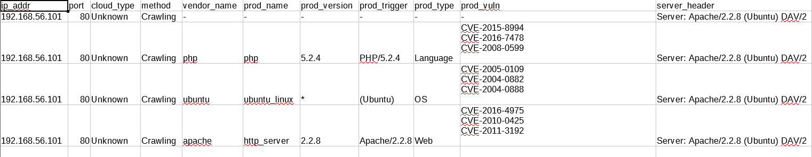
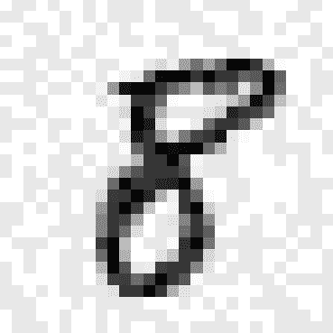
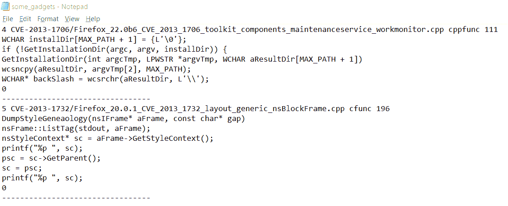

# 第五章：使用机器学习的渗透测试

渗透测试，简称“渗透测试”，是一种授权的模拟网络攻击，旨在发现信息系统中的安全漏洞。在本章中，我们将涵盖一系列用于渗透测试和安全对策的机器学习技术。我们将从破解一个简单的验证码系统开始。接下来，我们将介绍使用深度学习、模糊测试和代码小工具自动发现软件漏洞。我们将展示如何增强 Metasploit，并讨论如何评估机器学习系统对抗性攻击的鲁棒性。最后，我们将探讨一些更专业的主题，如去匿名化 Tor 流量、通过键击动态识别未授权访问以及检测恶意 URL。

本章将涵盖以下内容：

+   验证码破解器

+   神经网络辅助模糊测试

+   DeepExploit

+   使用机器学习的 Web 服务器漏洞扫描器（GyoiThon）

+   使用机器学习去匿名化 Tor 流量

+   使用机器学习的**物联网**（**IoT**）设备类型识别

+   键击动态

+   恶意 URL 检测器

+   深度渗透

+   基于深度学习的自动软件漏洞检测系统（VulDeePecker）

# 技术要求

在本章中，我们将使用以下工具：

+   TensorFlow

+   Keras

+   OpenCV

+   Google API 客户端

+   Censys

+   NetworkX

+   Tldextract

+   dpkt

+   NumPy

+   SciPy

+   Xlib

+   Gensim

代码和数据集可以在[`github.com/PacktPublishing/Machine-Learning-for-Cybersecurity-Cookbook/tree/master/Chapter05`](https://github.com/PacktPublishing/Machine-Learning-for-Cybersecurity-Cookbook/tree/master/Chapter05)找到。

# 验证码破解器

**验证码**是一种旨在防止自动访问或抓取的系统。它通过提出旨在识别用户是人类还是程序的问题来实现这一点。你可能已经看到了许多类似的屏幕截图：


有时，要求插入一段代码，有时需要选择一些物体，例如在一系列图像中选择店面或交通信号灯，有时验证码是一个数学问题。在本章中，我们将破解一个简单的验证码系统，叫做“非常简单的验证码”：


尽管其简单性，**非常简单的验证码**仍然被广泛使用。最重要的是，它将说明如何破解其他更复杂的验证码系统。

第一步是处理 CAPTCHA 数据集，以便它适合机器学习。最简单的方法可能会失败。即，构建一个监督分类器，该分类器接收一个四字符的 CAPTCHA，并将其分类到 *(26+10)⁴ = 1,679,616* 个可能的类别中（26 个字母和 10 个数字，由于四个字符的组合，类别总数为上述幂的计算结果）。这种方法需要大量的数据和计算。相反，我们在单个字符上训练分类器，将 CAPTCHA 切割成单个字符，然后进行四次分类。这里同样有一个问题，那就是精确裁剪字符并不容易。通过使用 OpenCV 功能和额外的考虑，本食谱将解决这一挑战。

# 处理 CAPTCHA 数据集

在本食谱中，我们将执行创建 CAPTCHA 破解器的第一部分，即处理 CAPTCHA 数据集，使其适合训练机器学习模型。

# 准备工作

本食谱的准备工作包括在 `pip` 中安装一些软件包。安装说明如下：

```
pip install opencv-python imutils
```

此外，为了方便起见，已经包含了一些 CAPTCHA 数据集，存储在 `captcha_images.7z` 文件中。只需解压此存档到 `captcha_images` 文件夹中即可使用。

# 如何操作...

在接下来的步骤中，我们将处理一个 CAPTCHA 数据集，使其适合训练机器学习模型：

1.  收集大量 CAPTCHA 数据。

1.  我们的下一个目标是处理 CAPTCHA，指定 CAPTCHA 图像存储的位置，然后枚举指定文件夹中的所有 CAPTCHA：

```
import os

captcha_images_folder = "captcha_images"
captchas = [
    os.path.join(captcha_images_folder, f) for f in os.listdir(captcha_images_folder)
]
```

1.  定义一个函数，该函数将接受 CAPTCHA 图像并生成一个灰度版本，以及一个阈值化的（即黑白）版本的 CAPTCHA 图像：

```
import cv2

def preprocess_CAPTCHA(img):
    """Takes a CAPTCHA image and thresholds it."""
    gray = cv2.cvtColor(img, cv2.COLOR_BGR2GRAY)
    gray_with_border = cv2.copyMakeBorder(gray, 8, 8, 8, 8, cv2.BORDER_REPLICATE)
    preprocessed = cv2.threshold(
        gray_with_border, 0, 255, cv2.THRESH_BINARY_INV | cv2.THRESH_OTSU
    )[1]
    return gray_with_border, preprocessed
```

1.  定义一个函数，该函数将接受 CAPTCHA 的路径，并使用该路径存储该 CAPTCHA 的文本标签：

```
def get_CAPTCHA_label(path_to_file):
    """Get the CAPTCHA text from the file name."""
    filename = os.path.basename(path_to_file)
    label = filename.split(".")[0]
    return label
```

1.  定义一个函数，该函数将接受 CAPTCHA 的轮廓，我们将计算这些轮廓，并确定它们的边界矩形，为将 CAPTCHA 切割成单个字符做准备：

```
def find_bounding_rectangles_of_contours(contours):
    """Determines the bounding rectangles of the contours of the cropped letters."""
    letter_bounding_rectangles = []
    for contour in contours:
        (x, y, w, h) = cv2.boundingRect(contour)
        if w / h > 1.25:
            half_width = int(w / 2)
            letter_bounding_rectangles.append((x, y, half_width, h))
            letter_bounding_rectangles.append((x + half_width, y, half_width, h))
        else:
            letter_bounding_rectangles.append((x, y, w, h))
    return letter_bounding_rectangles
```

1.  定义一个函数，该函数将接受 CAPTCHA 的路径，将其作为图像读取，并使用我们已定义的函数进行预处理：

```
def CAPTCHA_to_gray_scale_and_bounding_rectangles(captcha_image_file):
    """Take a CAPTCHA and output a grayscale version as well as the bounding rectangles of its cropped letters."""
    image = cv2.imread(captcha_image_file)
    gray, preprocessed = preprocess_CAPTCHA(image)
    contours = cv2.findContours(
        preprocessed.copy(), cv2.RETR_EXTERNAL, cv2.CHAIN_APPROX_SIMPLE
    )
    contours = contours[0]
    letter_bounding_rectangles = find_bounding_rectangles_of_contours(contours)
    letter_bounding_rectangles = sorted(letter_bounding_rectangles, key=lambda x: x[0])
    return gray, letter_bounding_rectangles
```

1.  定义另一个辅助函数，接受字母轮廓的边界矩形并从中生成字符图像：

```
def bounding_rectangle_to_letter_image(letter_bounding_box, grayscaled):
    """Obtains the letter defined by a bounding box."""
    x, y, w, h = letter_bounding_box
    letter_image = grayscaled[y - 2 : y + h + 2, x - 2 : x + w + 2]
    return letter_image
```

1.  定义最后一个辅助函数，执行 CAPTCHA 的裁剪，然后保存每个裁剪后的字符：

```
captcha_processing_output_folder = "extracted_letter_images"
character_counts = {}

def crop_bounding_rectangles_and_save_to_file(
    letter_bounding_rectangles, gray, captcha_label
):
    """Saves the individual letters of a CAPTCHA."""
    for letter_bounding_rectangle, current_letter in zip(
        letter_bounding_rectangles, captcha_label
    ):
        letter_image = bounding_rectangle_to_letter_image(
            letter_bounding_rectangle, gray
        )

        save_path = os.path.join(captcha_processing_output_folder, current_letter)
        if not os.path.exists(save_path):
            os.makedirs(save_path)

        character_count = character_counts.get(current_letter, 1)

        p = os.path.join(save_path, str(character_count) + ".png")
        cv2.imwrite(p, letter_image)

        character_counts[current_letter] = character_count + 1
```

1.  遍历所有的 CAPTCHA，进行预处理，找到字符轮廓，然后保存相应的字符：

```
import imutils
import numpy as np

for captcha_image_file in captchas:
    captcha_label = get_CAPTCHA_label(captcha_image_file)
    gray, letter_bounding_rectangles = CAPTCHA_to_gray_scale_and_bounding_rectangles(
        captcha_image_file
    )
    if len(letter_bounding_rectangles) != 4:
        continue
    crop_bounding_rectangles_and_save_to_file(
        letter_bounding_rectangles, gray, captcha_label
    )
```

# 它是如何工作的……

我们的起点是收集大量 CAPTCHA（*步骤 1*）。您可以在 `captcha_images.7z` 中找到这些 CAPTCHA。或者，由于 Really Simple CAPTCHA 的代码可以在线获取，您可以修改它来生成大量的 CAPTCHA。其他方法包括使用机器人抓取 CAPTCHA。接下来，在 *步骤 2* 中，我们指定 CAPTCHA 图像的存储位置，并列举出指定文件夹中的所有 CAPTCHA。我们的目标是开始处理这些 CAPTCHA。在 *步骤 3* 中，我们定义一个函数，用来阈值化并将 CAPTCHA 图像转换为灰度图像。这样可以减少计算量，并且更容易确定一个字符的起始位置和下一个字符的结束位置。然后我们定义一个函数来获取 CAPTCHA 的标签（*步骤 4*）。接下来，为了准备处理，我们定义一个实用函数，获取 CAPTCHA 的轮廓，并利用这些轮廓来确定每个字符的边界矩形。一旦找到边界矩形，就可以轻松地裁剪字符，以便将其隔离出来（*步骤 5*）。然后，在 *步骤 6* 中，我们将到目前为止定义的函数组合成一个方便的函数。我们还定义了一个额外的函数，用来实际裁剪字符。将以上内容结合起来，在 *步骤 8* 中，我们编写一个函数来执行前面的步骤，然后保存结果中的隔离字符，并统计每个字符保存的数量。这对命名和统计都非常有帮助。现在我们可以开始裁剪了，所以，在 *步骤 9* 中，我们遍历所有的 CAPTCHA，并利用我们的实用函数裁剪单个字符。请注意，`if` 语句用于跳过裁剪错误的 CAPTCHA。

在本教程结束时，您的输出文件夹 `extracted_letter_images` 应该会有一个文件夹，包含大多数字母和数字，如下图所示：


并非所有的字符和数字都有表示，原因是 CAPTCHA 中不包含数字 1 和字母 I，因为这两者容易混淆。同理，数字 0 和字母 O 也存在相同问题。

在每个文件夹内，您将会有大量该字母或数字的实例，这些实例是从原始 CAPTCHA 中裁剪和处理出来的：


这结束了预处理步骤。

# 训练一个 CAPTCHA 解码神经网络

现在我们的数据已经处理得很整洁，可以训练一个神经网络来进行 CAPTCHA 预测。

# 准备工作

本教程的准备工作包括通过 pip 安装若干软件包。安装步骤如下：

```
pip install opencv-python imutils sklearn keras tensorflow
```

# 如何做到这一点...

在接下来的步骤中，我们将训练一个神经网络来解决 Really Simple CAPTCHA 的 CAPTCHA：

1.  指定提取的字母图像所在的文件夹：

```
captcha_processing_output_folder = "extracted_letter_images"
```

1.  导入 OpenCV 和 imutils 进行图像处理：

```
import cv2
import imutils
```

1.  定义一个辅助函数，将图像调整为给定的大小：

```
def resize_image_to_dimensions(image, desired_width, desired_height):
    """Resizes an image to the desired dimensions."""
    (h, w) = image.shape[:2]
    if w > h:
        image = imutils.resize(image, width=desired_width)
    else:
        image = imutils.resize(image, height=desired_height)
    pad_width = int((desired_width - image.shape[1]) / 2.0)
    pad_height = int((desired_height - image.shape[0]) / 2.0)
    image_with_border = cv2.copyMakeBorder(
        image, pad_height, pad_height, pad_width, pad_width, cv2.BORDER_REPLICATE
    )
    image_with_border_resized = cv2.resize(
        image_with_border, (desired_width, desired_height)
    )
    return image_with_border_resized
```

1.  准备读取图像：

```
def read_image(image_file_path):
    """Read in an image file."""
    img = cv2.imread(image_file_path)
    img = cv2.cvtColor(img, cv2.COLOR_BGR2GRAY)
    img = resize_image_to_dimensions(img, 20, 20)
    img = np.expand_dims(img, axis=2)
    return img
```

1.  读取每个字母图像并记录其标签：

```
import numpy as np
import os
from imutils import paths

images = []
labels = []

for image_file_path in imutils.paths.list_images(captcha_processing_output_folder):
    image_file = read_image(image_file_path)
    label = image_file_path.split(os.path.sep)[-2]
    images.append(image_file)
    labels.append(label)
```

1.  归一化所有图像，即将像素值缩放到 0-1，并将标签转换为 NumPy 数组：

```
images = np.array(images, dtype="float") / 255.0
labels = np.array(labels)
```

1.  创建训练集和测试集的划分：

```
from sklearn.model_selection import train_test_split

(X_train, X_test, y_train, y_test) = train_test_split(
    images, labels, test_size=0.3, random_state=11
)
```

1.  导入`LabelBinarizer`以编码标签：

```
from sklearn.preprocessing import LabelBinarizer

label_binarizer = LabelBinarizer().fit(y_train)
y_train = label_binarizer.transform(y_train)
y_test = label_binarizer.transform(y_test)
```

1.  定义神经网络架构：

```
from keras.models import Sequential
from keras.layers.convolutional import Conv2D, MaxPooling2D
from keras.layers.core import Flatten, Dense

num_classes = 32
NN_model = Sequential()
NN_model.add(
    Conv2D(20, (5, 5), padding="same", input_shape=(20, 20, 1), activation="relu")
)
NN_model.add(MaxPooling2D(pool_size=(2, 2), strides=(2, 2)))
NN_model.add(Conv2D(50, (5, 5), padding="same", activation="relu"))
NN_model.add(MaxPooling2D(pool_size=(2, 2), strides=(2, 2)))
NN_model.add(Flatten())
NN_model.add(Dense(512, activation="relu"))
NN_model.add(Dense(num_classes, activation="softmax"))
NN_model.compile(
    loss="categorical_crossentropy", optimizer="adam", metrics=["accuracy"]
)
NN_model.summary()
```

1.  将神经网络拟合到训练数据上：

```
NN_model.fit(
    X_train,
    y_train,
    validation_data=(X_test, y_test),
    batch_size=16,
    epochs=5,
    verbose=1,
)
```

1.  选择一个你想破解的 CAPTCHA 实例：

```
CAPTCHA = "captcha_images\\NZH2.png"
```

1.  我们将导入在上一节中用于处理图像的所有函数，即`find_bounding_rectangles_of_contours`、`preprocess_CAPTCHA`、`get_CAPTCHA_label`和`CAPTCHA_to_grayscale_and_bounding_rectangles`。

1.  按照我们在上一节中所做的方式处理 CAPTCHA 图像：

```
captcha_label = get_CAPTCHA_label(CAPTCHA)
gray, letter_bounding_rectangles = CAPTCHA_to_gray_scale_and_bounding_rectangles(
    CAPTCHA
)
predictions = []
```

1.  读取每个裁剪后的字母，并使用神经网络预测标签：

```
for letter_bounding_rectangle in letter_bounding_rectangles:
    x, y, w, h = letter_bounding_rectangle
    letter_image = gray[y - 2 : y + h + 2, x - 2 : x + w + 2]
    letter_image = resize_image_to_dimensions(letter_image, 20, 20)
    letter_image = np.expand_dims(letter_image, axis=2)
    letter_image = np.expand_dims(letter_image, axis=0)
    prediction = NN_model.predict(letter_image)
    letter = label_binarizer.inverse_transform(prediction)[0]
    predictions.append(letter)
```

1.  输出预测结果：

```
predicted_captcha_text = "".join(predictions)
print("Predicted CAPTCHA text is: {}".format(predicted_captcha_text))
print("CAPTCHA text is: {}".format(CAPTCHA.split("\\")[-1].split(".")[0]))

Predicted CAPTCHA text is: NZH2
CAPTCHA text is: NZH2
```

# 它是如何工作的……

在上一节中我们已经完成了 CAPTCHA 的预处理，现在我们准备利用这些数据来训练一个 CAPTCHA 破解器。我们首先设置一个变量，指向从 CAPTCHA 中提取的所有单个字符的路径。然后我们导入将要使用的图像处理库（*第 2 步*），接着在*第 3 步*中定义一个调整图像大小的函数。这是一种相对标准的字符识别方法，可以加速训练并减少内存消耗。在*第 4 步*中，我们定义一个方便的函数，将文件读取为 NumPy 数组，用于训练；然后在*第 5 步*中，我们遍历所有字母并记录它们的标签。接下来，我们对所有图像进行归一化处理（*第 6 步*），这是另一个标准的计算机视觉技巧。现在我们创建训练集和测试集的划分，准备进行分类器拟合（*第 7 步*），然后使用标签二值化器对标签进行编码（*第 8 步*）。这是必要的，因为标签是字符，可能并非数值类型。在*第 9 步*中，我们定义神经网络的架构。所定义的架构是相对常见的，既具有精度又具备速度。在*第 10 步*中，我们将神经网络拟合到训练集上。其他参数可以增强网络的性能。现在，繁重的工作已经完成。接下来，我们展示 CAPTCHA 破解器如何工作。在*第 11 步*中，我们选择一个单例实例来展示 CAPTCHA 破解器的有效性。在*第 12 到 14 步*中，我们将图像通过我们的处理管道，生成对该 CAPTCHA 的预测文本。最后，我们验证预测是否正确（*第 15 步*）。

# 神经网络辅助模糊测试

Fuzz 测试是一种软件漏洞检测方法，其中将大量随机输入提供给程序，寻找会导致崩溃、信息泄露或其他意外行为的输入。在自动化模糊测试中，程序会生成这些输入。通常，自动化模糊测试器存在一个缺点，即它们倾向于重复尝试冗余的输入。为了解决这个问题，最近开发了基于 AI 的模糊测试器。在这个食谱中，我们将使用 She 等人开发的基于神经网络的模糊测试器 NEUZZ（见 [`arxiv.org/abs/1807.05620`](https://arxiv.org/abs/1807.05620)）来发现软件中的未知漏洞。

# 准备工作

以下食谱要求使用 Ubuntu 16.04 或 18.04 虚拟机或物理机。在此设备上运行以下命令：

```
pip install keras
```

将 `neuzz-modified.7z` 解压到你选择的文件夹中。

# 如何操作...

在接下来的步骤中，我们提供了一个使用 NEUZZ 查找导致崩溃的输入的食谱，针对的是 `readelf` Unix 工具：

1.  使用以下命令构建 neuzz：

```
gcc -O3 -funroll-loops ./neuzz.c -o neuzz
```

如果你收到警告，没关系。

2\. 安装 32 位二进制文件所需的库：

```
 sudo dpkg --add-architecture i386
 sudo apt-get update
 sudo apt-get install libc6:i386 libncurses5:i386 libstdc++6:i386 lib32z1
```

1.  以 root 用户身份设置 CPU 缩放算法和核心转储通知：

```
 cd /sys/devices/system/cpu
 echo performance | tee cpu*/cpufreq/scaling_governor
 echo core >/proc/sys/kernel/core_pattern
```

1.  将 `neuzz`、`nn.py` 和 `afl-showmap` 复制到 `programs/readelf`：

```
 cp /path_to_neuzz/neuzz /path_to_neuzz/programs/readelf
 cp /path_to_neuzz/nn.py /path_to_neuzz/programs/readelf
 cp /path_to_neuzz/afl-showmap /path_to_neuzz/programs/readelf
```

1.  为所有文件提供可执行权限：

```
chmod +x /path_to_neuzz/programs/readelf/neuzz
chmod +x /path_to_neuzz/programs/readelf/nn.py
chmod +x /path_to_neuzz/programs/readelf/afl-showmap
chmod +x /path_to_neuzz/programs/readelf/readelf
```

1.  打开终端以启动神经网络模块：

```
cd /path_to_neuzz/programs/readelf
python nn.py ./readelf -a
```

1.  打开另一个终端并启动 NEUZZ：

```
 ./neuzz -i neuzz_in -o seeds -l 7507 ./readelf -a @@
```

下面是运行这些命令的一部分：


1.  通过运行以下命令测试 NEUZZ 收集的崩溃：

```
 ./readelf -a crash/file_name
```


# 工作原理…

大多数流行的模糊测试工具在某些有限的情况下有效，但通常会陷入循环中。基于梯度的方法，如这里讨论的这种方法，虽然很有前景，但并不完全适用于这个问题，因为现实世界中的程序行为不一定是平滑的函数（例如，它们可能是不连续的）。NEUZZ 背后的理念是使用神经网络来逼近程序的行为作为一个平滑的函数。然后，可以应用梯度方法来提高模糊测试的效率。我们从编译 NEUZZ（*步骤 1*）开始。`funroll-loops`标志会使编译器展开可以在编译时或进入循环时确定迭代次数的循环。这样，代码会变大，运行速度可能会更快，但不一定。继续设置 NEUZZ，我们加入 32 位支持（*步骤 2*）。我们设置 CPU 调节算法和核心转储通知（*步骤 3*）；CPU 频率调节是一个让操作系统通过调整 CPU 频率来节省电力的设置。在接下来的两个步骤中，我们只需将文件放置在一个方便的位置，并允许执行权限。我们已经完成了 NEUZZ 的设置。现在，我们可以使用它来找到导致程序崩溃的输入。在*步骤 6*和*步骤 7*中，我们开始使用神经网络搜索崩溃。等待足够的时间，让*步骤 6*和*步骤 7*收集到足够的输入以使 readelf 工具崩溃后，我们执行其中一个输入（*步骤 8*），看看结果。果然，我们看到该输入导致 readelf 崩溃。

# DeepExploit

**DeepExploit**是一个渗透测试工具，通过利用人工智能，将 Metasploit 提升到一个全新的水平。它的主要特点如下：

+   **深度渗透**：如果 DeepExploit 成功利用目标漏洞，它将自动执行漏洞利用到其他内部服务器。

+   **学习**：DeepExploit 是一个强化学习系统，类似于 AlphaGo。

使用 DeepExploit 来进行渗透测试可以大大增强你系统的安全性。在本教程中，我们将设置并运行 DeepExploit。

# 准备工作

现在，我们将引导你完成安装`DeepExploit`的步骤：

1.  下载并设置 Kali Linux。你可以在[`www.offensive-security.com/kali-linux-vm-vmware-virtualbox-image-download/`](https://www.offensive-security.com/kali-linux-vm-vmware-virtualbox-image-download/)找到虚拟机镜像。接下来的步骤都将在你的 Kali Linux 系统中进行。

1.  通过在终端中运行以下命令来安装 Git：

```
sudo apt install git
```

1.  通过运行以下命令来安装 Python：

```
sudo apt install python3-pip
```

1.  克隆`git`仓库。在终端中，运行以下命令：

```
git clone https://github.com/emmanueltsukerman/machine_learning_security.git
```

1.  打开`DeepExploit`目录：

在终端中，运行以下命令：

```
cd machine_learning_security/DeepExploit
```

1.  安装`DeepExploit`的前置软件包。

在终端中，运行以下命令：

```
pip3 install -r requirements.txt
```

# 如何操作...

在本教程中，你将使用`DeepExploit`来攻破一个受害者虚拟机。

1.  下载`Metasploitable2`虚拟机镜像。

详细信息请参见[`metasploit.help.rapid7.com/docs/metasploitable-2`](https://metasploit.help.rapid7.com/docs/metasploitable-2)。

1.  在虚拟机上运行一个`Metasploitable2`实例。

1.  获取你的`Metasploitable2`的 IP 地址。

1.  下一步是设置`DeepExploit`的配置。

1.  在终端中运行`ifconfig`以获取 Kali Linux 的 IP 地址。编辑`config.ini`（例如，使用`vim`）并将`[common]`下的`server_host`设置为你的 Kali Linux IP。

1.  将`config.ini`中的`proxy_host`和`proxy_port`的值设置为`proxychains.conf`中的值。

1.  在终端中，运行`cat /etc/proxychains.conf`并找到`socks4`旁边的值：

```
 ...snip...
 [ProxyList]
 ...snip...
 socks4  127.0.0.1 9050
```

1.  然后，将`config.ini`中`proxy_host`和`proxy_port`的值设置为这些值：

```
 vim config.ini
 ...snip...
 proxy_host      : 127.0.0.1
 proxy_port      : 9050
```

1.  在终端中运行`msfconsole`启动 Metasploit。

1.  在 Metasploit 上启动 RPC 服务器。在指定的位置，输入你的 Kali Linux 的 IP 地址：

```
msf> load msgrpc ServerHost="kali linux ip" ServerPort=55553 User=test Pass=test1234.
```

你应该看到如下内容：

```
[*] MSGRPC Service: "kali linux ip":55553
[*] MSGRPC Username: test
[*] MSGRPC Password: test1234
[*] Successfully loaded plugin: msgrpc
```

1.  在你的 Kali Linux 机器的终端中，运行`python3 DeepExploit.py -t "Metasploitable2 ip" -m train`来训练`DeepExploit`。训练开始时应该如下所示：


每当`DeepExploit`发现漏洞时，你会看到一个`BINGO!!!`的通知，如下图所示：


培训结束时，学习内容会被保存。你可以在此处看到完成屏幕：


1.  使用`DeepExploit`测试`Metasploitable2`的漏洞。在终端中，运行`python DeepExploit.py -t "Metasploitable2 ip" -m test`。

1.  检查渗透测试的报告，如下所示：

```
firefox report/DeepExploit_test_report.html
```

我们会得到以下输出：


# 它的工作原理是…

本教程需要大量准备和配置。初步步骤是设置受害者虚拟机（*步骤 1 和 2*）。在 *步骤 3* 中，我们确定受害者虚拟机的 IP 地址。请注意，`Metasploitable2` 的凭据是 `msfadmin/msfadmin`。您可以使用这些凭据登录，然后使用 `ifconfig` 获取 `Metasploitable2` 的 IP 地址。如果您在同一主机上使用 Kali Linux 虚拟机和 `Metasploitable2` 虚拟机，请确保两者能够通信。例如，将两个虚拟机都放在 Host-Only 适配器上，并从 Kali Linux 机器 ping `Metasploitable2` 机器。接下来，我们配置 `DeepExploit`，以便我们可以针对受害者虚拟机进行攻击（*步骤 4*-*8*）。在 *步骤 9* 和 *10* 中，我们打开 Metasploit，Metasploit 被 `DeepExploit` 作为子模块使用。Metasploit 是一个主要的渗透测试框架。完成所有准备工作后，我们现在可以开始训练我们的模型。在 *步骤 11* 中，我们在 `Metasploitable2` 虚拟机上训练 `DeepExploit`。该模型利用 **异步演员批评算法**（`A3C`），这是 Google DeepMind 团队几年前发布的算法，因其超越了 `深度 Q 网络`（`DQN`）方法而闻名。接下来，我们测试我们的模型（*步骤 12*），并将其分析结果以报告的形式打印出来（*步骤 13*）。从长报告中可以看出，`DeepExploit` 发现了大量漏洞。从高层次来看，将强化学习应用于渗透测试表明，高效的自动化渗透测试即将到来。

# 使用机器学习的 Web 服务器漏洞扫描器（GyoiThon）

**GyoiThon** 是一款用于 Web 服务器的情报收集工具。它执行远程访问目标 Web 服务器，识别服务器上运行的产品，如 **内容管理系统** (**CMS**)、Web 服务器软件、框架和编程语言。此外，它还可以使用 Metasploit 执行已识别产品的漏洞利用模块。

GyoiThon 的一些主要功能如下：

+   **远程访问/完全自动化**：GyoiThon 仅通过远程访问即可自动收集目标 Web 服务器的信息。您只需执行一次 GyoiThon 即可完成操作。

+   **非破坏性测试**：GyoiThon 仅通过正常访问即可收集目标 Web 服务器的信息。一个功能允许 GyoiThon 异常访问，如通过发送漏洞利用模块。

+   **收集多样的信息**：GyoiThon 拥有多种情报收集引擎，如网络爬虫、Google 自定义搜索 API、Censys、默认内容探索器以及云服务检查。通过使用字符串模式匹配和机器学习分析收集的信息，GyoiThon 可以识别目标 Web 服务器上运行的产品/版本/CVE 编号、HTML 注释/调试信息、登录页面及其他信息。

+   **真实漏洞检查**：GyoiThon 可以使用 Metasploit 执行漏洞模块，对已识别的产品进行攻击。因此，它可以确定目标 Web 服务器的实际漏洞。

# 准备工作

现在，您将按照步骤进行 GyoiThon 的安装和运行：

1.  下载并设置 Kali Linux。您可以在[`www.offensive-security.com/kali-linux-vm-vmware-virtualbox-image-download/`](https://www.offensive-security.com/kali-linux-vm-vmware-virtualbox-image-download/)找到虚拟机镜像。接下来的步骤都将在您的 Kali Linux 机器上进行。

1.  在终端中通过运行以下命令安装`git`：

```
sudo apt install git
```

1.  在终端中运行以下命令安装`python`：

```
sudo apt install python3-pip
```

1.  在 Linux 终端中，通过运行以下命令克隆 Git 仓库：

```
git clone https://github.com/gyoisamurai/GyoiThon.git
```

1.  在终端中运行以下命令，打开`GyoiThon`目录：

```
cd GyoiThon
```

1.  在终端中通过运行以下命令安装 DeepExploit 的先决条件：

```
pip3 install -r requirements.txt
```

1.  （可选）将`Gyoi_CveExplorerNVD`文件替换为本书仓库中提供的文件。在某些情况下，原始代码可能已失效，而本书仓库中的修改代码可能解决了这个问题。

# 如何操作...

在本食谱中，您将使用 DeepExploit 来攻陷一个受害者虚拟机：

1.  下载`Metasploitable2`虚拟机镜像。

1.  在虚拟机上运行一个`Metasploitable2`实例。

1.  获取您的`Metasploitable2`的 IP 地址。

1.  在您的 Kali Linux 机器上，您应该能够通过在浏览器中输入`Metasploitable2 的 ip 地址:80`来查看`Metasploitable2`的网页实例：


1.  在终端中运行`ifconfig`来获取 Kali Linux 的 IP 地址。通过编辑`config.ini`（例如使用`vim`），将`proxy`设置为空，将`server host`设置为您的`Kali Linux IP`，将`LHOST`设置为`Metasploitable2 IP`，将`LPORT`设置为`80`。

1.  打开主机文件，并通过输入`http:Metasploitable2 ip:80/`来添加`Metasploitable2`的 web 服务器地址。

1.  在 Kali Linux 机器的终端中，运行`python3 Gyoithon.py`开始攻击。

1.  攻击结束后，检查位于报告文件夹中的渗透测试报告：



# 它是如何工作的…

*步骤 1-3*与 DeepExploit 中的配方没有区别，我们在其中准备了一个受害者虚拟机。`Metasploitable2`的凭证是`msfadmin/msfadmin`。你可以使用这些凭证登录，然后使用`ifconfig`获取你的`Metasploitable2` IP。如果你在同一主机上使用 Kali Linux 虚拟机和`Metasploitable2`虚拟机，确保它们能够通信。例如，将这两个虚拟机设置为 Host-only 适配器，并从 Kali Linux 机器 ping 到 Metasploitable2 机器。接下来，我们通过检查能否访问受害者虚拟机的网页来验证环境是否已正确设置（*步骤 4*）。在*步骤 5*和*步骤 6*中，我们配置 GyoiThon 以准备进行渗透测试。完成环境设置后，我们就准备开始渗透测试。在*步骤 7*中，我们利用 GyoiThon 搜索漏洞。然后，我们输出检测到的漏洞的完整报告（*步骤 8*）。通过查看报告，我们可以看到 GyoiThon 能够找到大量漏洞。确定受害者主机的漏洞后，我们可以使用例如 Metasploit 等工具进行攻击。

# 使用机器学习去匿名化 Tor

Tor 是一款免费的开源软件，用于实现匿名通信。此外，只有使用 Tor 浏览器才能访问的网站存在，它们是**暗网**生态系统的一部分——这是指普通用户无法访问的互联网部分。在这个配方中，我们将通过收集足够的特征和信息来去匿名化 Tor 流量，从而识别匿名用户的活动。这个配方使用了**conmarap/website-fingerprinting**仓库。

# 准备工作

现在将引导你完成设置 Tor 和 Lynx 网页浏览器所需的步骤：

1.  设置一个 Ubuntu 虚拟机。

1.  在终端中通过运行以下命令安装`git`：

```
sudo apt install git
```

1.  在终端中通过运行以下命令克隆代码仓库：

```
git clone https://github.com/conmarap/website-fingerprinting
```

1.  在终端中通过运行以下命令安装`tor`和`lynx`：

```
sudo apt install tor lynx
```

# 如何做到…

这个配方由三个部分组成。第一部分是收集 Tor 流量数据。第二部分是基于这些数据训练分类器。最后一部分是使用分类器来预测观察到的流量类型。

# 数据收集

以下步骤是数据收集时需要遵循的：

1.  在`config.json`中列出你希望分类的流量类别：


1.  在`website-fingerprinting`目录中，从一个类（比如`duckduckgo.com`）收集额外的数据点，在终端中运行以下命令：

```
./pcaps/capture.sh duckduckgo.com
```

1.  打开另一个终端，并运行以下命令：

```
torsocks lynx https://duckduckgo.com
```

此时，你的两个终端应该如下所示：


1.  一旦浏览会话结束，按*Q*键两次结束捕获。

当足够的训练数据收集完毕后，我们就可以开始训练分类器。

# 训练

要在数据上训练分类器，请使用 Python 运行以下脚本：

```
python gather_and_train.py
```

结果是一个分类器文件：`nb.dmp`。

# 预测

让我们使用分类器来预测所观察到的流量类型：

1.  要预测新的流量实例，请收集`pcap`文件。

1.  使用 Python 运行`predict.py`脚本，并将`pcap`文件作为参数：


作者的聚类结果如下：


上述图表显示，尽管流量是匿名的，但特征的确能够区分不同类型的流量。

# 它是如何工作的...

我们通过创建一个我们希望分析的所有网站的目录（*步骤 1*）来开始构建我们的分类器。网站数量越多，目标访问这些网站的可能性越大。另一方面，网站越少，训练数据集所需的大小也越小。在*步骤 2* 到 *步骤 4* 中，我们执行收集分类器数据点所需的步骤。具体来说，我们通过访问*步骤 1*中定义的网站之一，然后捕获该访问的网络数据包。通过对不同的浏览会话重复这些步骤，我们能够构建一个强大的数据集。在*步骤 5* 中，我们在迄今为止收集的数据上训练分类器。现在我们已经准备好测试我们的分类器了。在*步骤 6* 中，我们访问一个网站并收集其`pcap`文件，就像我们收集训练数据时一样。然后，我们使用分类器来分类这个访问（*步骤 7*）。我们看到，尽管用户使用了 Tor，它仍然正确地识别出了用户访问的网页。

总结来说，在本教程中，使用了 scikit-learn 编写了一个 k 最近邻分类器，用来分类 Tor 的`pcap`文件。在实际情况中，流量数据往往不像*干净*数据那样，准确度在相同大小的真实数据集上可能会降低。然而，拥有大量资源的实体可以创建一个非常精确的分类器。这意味着，像这种方法完全有可能准确地攻破匿名用户。

# 使用机器学习进行物联网设备类型识别

随着物联网（IoT）的到来，任何目标的攻击面都呈指数级增加。随着新技术的出现，也伴随而来的是新的风险，而在物联网的案例中，一个组织面临的风险之一就是恶意物联网设备被接入组织的网络。因此，能够判断网络中是否新增了此类设备，并了解其性质，是至关重要的。在本教程中，我们将构建一个机器学习模型，以按类型分类网络中的物联网设备。

# 准备工作

本教程的准备工作包括在`pip`中安装`sklearn`、`pandas`和`xgboost`包。安装指令如下：

```
pip install pandas sklearn xgboost
```

数据集已通过`iot_train.csv`和`iot_test.csv`文件提供。

# 如何实现...

在接下来的步骤中，我们将训练并测试一个分类器，基于物联网（IoT）网络信息：

1.  导入`pandas`和`os`，并读取训练和测试数据：

```
import pandas as pd
import os

training_data = pd.read_csv("iot_devices_train.csv")
testing_data = pd.read_csv("iot_devices_test.csv")
```

数据包含 298 个特征，如下图所示：


1.  创建训练和测试数据集，其中目标是设备类别：

```
X_train, y_train = (
    training_data.loc[:, training_data.columns != "device_category"].values,
    training_data["device_category"],
)
X_test, y_test = (
    testing_data.loc[:, testing_data.columns != "device_category"].values,
    testing_data["device_category"],
)
```

设备类别包括安全摄像头、电视、烟雾探测器、恒温器、水传感器、手表、婴儿监视器、运动传感器、灯具和插座。

1.  将类别标签编码为数值形式：

```
from sklearn import preprocessing

le = preprocessing.LabelEncoder()
le.fit(training_data["device_category"].unique())
y_train_encoded = le.transform(y_train)
y_test_encoded = le.transform(y_test)
```

1.  实例化一个`xgboost`分类器：

```
from xgboost import XGBClassifier

model = XGBClassifier()
```

1.  训练并测试`xgboost`分类器：

```
model.fit(X_train, y_train_encoded)
model.score(X_test, y_test_encoded)
```

输出结果如下：

```
0.6622222222222223
```

# 如何运作…

本示例的一个重要动机是我们不能依赖 IP 地址作为设备的标识符，因为该值可能会被伪造。因此，我们希望分析流量的高层数据，即元数据和流量统计信息，而不是内容，以确定设备是否属于该网络。我们首先读取训练和测试数据集。接着我们对数据进行特征提取，并通过观察分类标签进行快速数据探索（*第 2 步*）。为了将这些数据输入到我们的分类器中，我们将分类标签转换为数值标签，用于训练我们的机器学习分类器（*第 3 步*）。在*第 4 步*和*第 5 步*中提取特征后，我们实例化、训练并测试一个`xgboost`分类器，最终在测试集上获得了`0.66`的评分。关联数据中有 10 类物联网设备。随机猜测 10 类设备的基线准确率为 0.1。这里训练的`XGBoost`分类器达到了 0.66 的准确率，表明它确实是一个有前景的基于高层流量数据成功分类物联网设备的方法。

# 击键动态学

击键动态学，也叫打字生物特征识别，是通过一个人的打字方式来识别其身份的研究领域。一个重要的应用场景是识别使用给定凭证登录的用户，例如，谁正在以 root 用户登录？另一个应用场景是识别何时有不同的用户输入了一系列击键。在这个示例中，我们将展示如何使用基于机器学习的击键动态学算法。

# 准备工作

本示例需要在 Linux 虚拟机或实际机器上运行。准备工作如下：

1.  在你的设备上安装`git`。

在终端中，运行以下命令：

```
sudo apt install git
```

1.  克隆包含击键动态学算法代码的`git`仓库：

```
git clone https://github.com/emmanueltsukerman/keystroke_dynamics.git
```

# 如何操作…

在接下来的步骤中，我们将训练模型，基于两位用户的打字模式，然后使用该模型识别其中一位用户的打字模式。此示例应在 Linux 虚拟机或实际机器上运行：

1.  运行`example.py`：

```
python example.py
```

1.  通过选择选项 1 并输入文本来训练用户 1 的击键模式：


1.  运行 `example.py` 并通过选择选项 1 来训练用户 2 的按键动态，然后让用户 2 输入以下文本：


1.  运行 `example.py`，这次选择选项 2。

1.  让其中一个用户再次输入文本。算法将匹配该用户的键盘动态，并与训练数据中最相似的打字员进行匹配：


# 它是如何工作的…

按键动态分析利用用户在键盘上的打字节奏和速度来验证该用户的身份。我们首先设置一些基准。在*步骤 1* 和 *步骤 2* 中，我们设置按键动态系统以学习第一个用户的打字模式。然后我们对第二个用户执行相同操作（*步骤 3*）。这就建立了我们的*正常*用户及其打字模式。在*步骤 4* 和 *步骤 5* 中，我们利用经过训练的模型（在*步骤 1*-*3* 中训练）来确定当前用户是谁。如你所见，分类器输出相似度得分并预测当前用户是谁，依据的是它保存的用户目录。这使我们能够检测未经授权的用户，并能够简单地跟踪系统的使用情况。

# 恶意 URL 检测器

恶意 URL 每年造成数十亿美元的损失，原因包括托管垃圾邮件、恶意软件和漏洞攻击，以及窃取信息。传统上，对这些威胁的防御依赖于黑名单和白名单——分别是被认为恶意的 URL 列表和被认为安全的 URL 列表。然而，黑名单存在缺乏通用性的问题，且无法防御之前未见过的恶意 URL。为了解决这一问题，已经开发出了机器学习技术。在本教程中，我们将使用 Keras 运行一个基于字符级递归神经网络的恶意 URL 检测器。代码基于 [`github.com/chen0040/keras-malicious-url-detector`](https://github.com/chen0040/keras-malicious-url-detector)。

# 准备就绪

本教程的准备工作包括在 `pip` 中安装多个软件包。安装步骤如下：

```
pip install keras tensorflow sklearn pandas matplotlib
```

此外，克隆以下 `git` 仓库：

```
git clone https://github.com/emmanueltsukerman/keras-malicious-url-detector.git
```

# 如何操作…

1.  训练双向 LSTM 模型：

```
python bidirectional_lstm_train.py
```

训练界面应如下所示：


1.  测试分类器：

```
python bidirectional_lstm_predict.py
```

测试界面应如下所示：


最后，你可以在 `reports` 文件夹下看到结果：


# 它是如何工作的…

这是一个相对简单的方案，但它是构建更高效恶意 URL 检测器的良好起点。数据集由带有标签 0 和 1 的 URL 组成，取决于它们是恶意的还是良性的：

```
http://google.com,0
http://facebook.com,0
http://youtube.com,0
http://yahoo.com,0
http://baidu.com,0
http://wikipedia.org,0
http://qq.com,0
http://linkedin.com,0
http://live.com,0
http://twitter.com,0
http://amazon.com,0
http://taobao.com,0
http://blogspot.com,0

<snip>
http://360.cn,0 
http://go.com,0 
http://bbc.co.uk,0
http://xhamster.com,0
```

在*步骤 1*中，我们训练了一个双向 LSTM 模型。通过深入代码，你可以根据自己的需求调整网络。训练好模型后，重要的是评估其性能并进行一些合理性检查。我们在*步骤 2*中进行测试步骤，通过在 20 个随机选定的 URL 上展示分类器的结果来进行。一般来说，双向 LSTM 是一种循环神经网络架构，因其能够记住信息并分析从前到后的数据及从后到前的数据而展现出巨大的潜力。

# Deep-pwning

Deep-pwning 是一个用于评估机器学习工具在对抗性攻击下鲁棒性的框架。数据科学界已经广泛认识到，单纯为分类图像而训练的深度神经网络等简单机器学习模型非常容易被欺骗。

下图展示了《解释与利用对抗样本》，I. J. Goodfellow 等人的研究：


网络安全是一个对抗性较强的领域，用于防御攻击者的机器学习模型应当具备抗对抗性攻击的鲁棒性。因此，不仅要报告通常的性能指标，如准确率、精确度和召回率，还需要有一定的对抗鲁棒性测量。deep-pwning 框架就是一个实现这一目标的简单工具包。

# 准备工作

准备这个食谱时，请按照以下步骤操作：

1.  在你的设备上安装`git`。

1.  使用以下命令通过 Git 下载或克隆该仓库：

```
git clone https://github.com/emmanueltsukerman/deep-pwning.git
```

1.  安装该仓库的依赖项。

在终端中，进入仓库的根目录并运行以下命令：

```
pip install -r requirements.txt
```

# 如何操作…

在接下来的步骤中，你将利用 deep-pwning 对 MNIST 数字数据集上的 LeNet5 进行攻击：

1.  从该目录向下，使用以下命令运行 MNIST 驱动程序：

```
python mnist_driver.py –restore_checkpoint
```

结果应该像这样显示：


# 它是如何工作的…

在*步骤 1*中，我们创建了一个包含对抗样本的大型数据集；即，创建了 150,000 个对抗样本，几乎所有这些样本都能够欺骗 LeNet5 对数字的识别。要检查这些对抗样本，可以像这样解压输出目录中的 pickle 文件：


在`utils`目录下，有一个名为`mnist_read_pickle.py`的文件，它将`pickle`文件作为参数传入。运行它会显示一个对抗样本。以下图像让 LeNet5 误以为它看到的是数字 1：



deep-pwning 框架设计为模块化，因此用户可以插入并修改各个部分以满足自己的需求。例如，替换 MNIST 数据集和 LeNet5 架构。

# 基于深度学习的自动化软件漏洞检测系统

信息安全专家通常能够识别出潜在可利用的代码片段。然而，这项工作是繁重且成本高昂的，并且可能不足以确保程序的安全性。深度学习相较于传统机器学习的一个重要优势是可以自动发现特征。这使得我们能够减少对漏洞领域人类专家的依赖，并且能产生更有效的系统。在本教程中，我们将使用一个修改版的*VulDeePecker : **基于深度学习的漏洞检测系统* ([`arxiv.org/pdf/1801.01681.pdf`](https://arxiv.org/pdf/1801.01681.pdf))，自动检测 C/C++软件中的缓冲区错误漏洞和资源管理错误。

# 准备工作

本教程的准备工作包括安装`pandas`、`gensim`、`keras`、`tensorflow`和`sklearn`等软件包，使用`pip`进行安装。安装指令如下：

```
pip install pandas gensim keras tensorflow sklearn
```

此外，为了进行本教程操作，克隆 VulDeePecker 的代码库：

1.  安装`git`，然后在终端运行以下命令：

```
git clone https://github.com/emmanueltsukerman/Deep-Learning-Based-System-for-Automatic-Detection-of-Software-Vulnerabilities.git
```

`datasets`文件夹中有两个数据集，`cwe119_cgd.7z`和`cwe399_cgd.7z`。如果你想使用它们，请解压。

# 如何操作…

1.  收集一个包含代码小片段的训练数据集，并将其放在`datasets`文件夹下。该文件夹中有两个数据集，它们的形式如下：


1.  在你的数据集上训练和测试深度学习模型。

通过运行以下命令来完成此操作：

```
python vuldeepecker_train.py "path to dataset"
```

输出结果显示在以下截图中：


1.  收集你希望进行预测的数据集，并将其放置在`datasets`文件夹下：



1.  使用你训练好的模型通过运行以下命令来预测这些代码是否存在漏洞：

```
python vuldeepecker_predict.py "path to data" "path to model"
```


# 它是如何工作的…

为了让机器学习能够进行漏洞检测，你需要找到能够学习的软件程序表示方式。为此，我们使用代码小片段，并将它们转换为向量。代码小片段是一组语义相关的代码行。在*步骤 1*中，我们为训练收集这样的代码小片段。你可以看到三种代码小片段及其标签的图片。这里，标签为 1 表示存在漏洞，而标签为 0 表示没有漏洞。为了从所需程序中提取小片段，建议使用商业产品 Checkmarx 来提取程序切片，然后将它们组装成代码小片段。另一个数据集`cwe-119`与缓冲区错误漏洞相关。接下来，我们在我们的漏洞数据集上训练一个深度学习模型（*步骤 2*）。所使用的深度学习模型是**双向长短期记忆网络**（**BLSTM**），其架构如下所示：

```
Bidirectional(LSTM(300), input_shape=(50, 50))
Dense(300)
LeakyReLU()
Dropout(0.5)
Dense(300)
LeakyReLU()
Dropout(0.5)
Dense(2, activation='softmax')
Adamax(lr=0.002)
'categorical_crossentropy'
```

请注意，训练阶段会自动将模型保存为`[base-name-of-training-dataset]_model.h5`。现在我们准备寻找新的漏洞。所以，我们将测试集放入`datasets`中（*步骤 3*），然后通过预测这个新数据集中的漏洞来使用我们的神经网络（*步骤 4*）。
