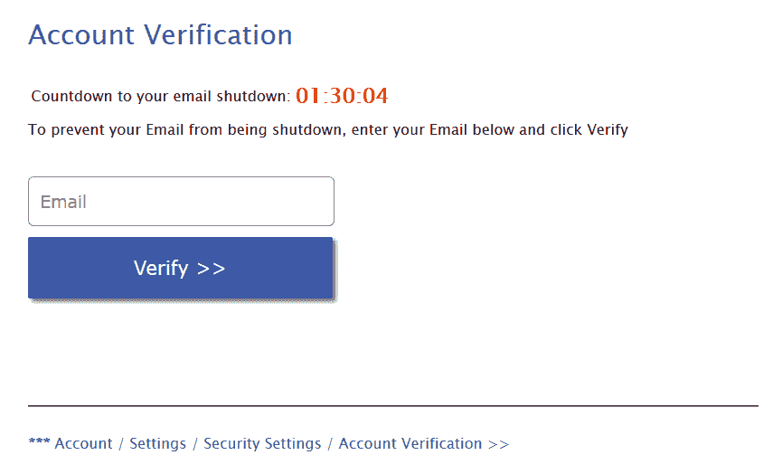
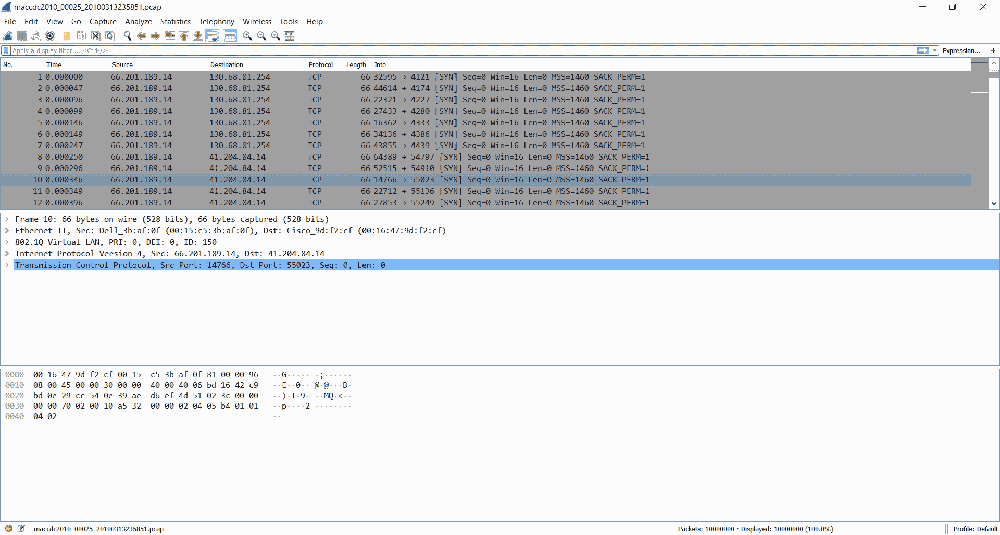
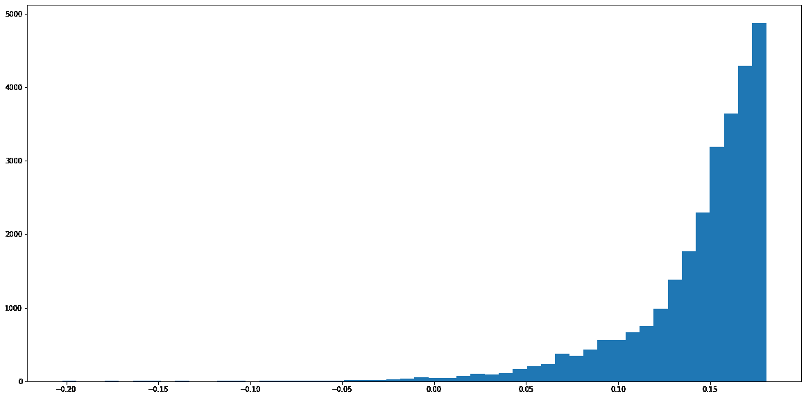
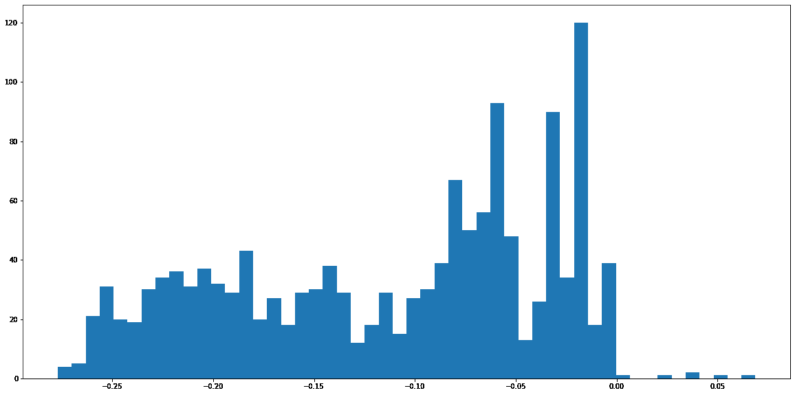
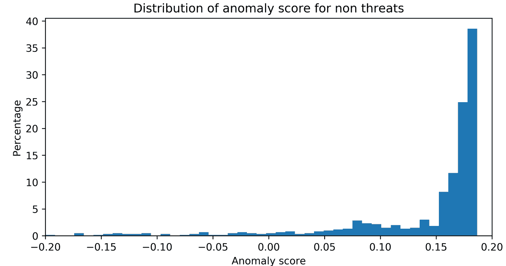
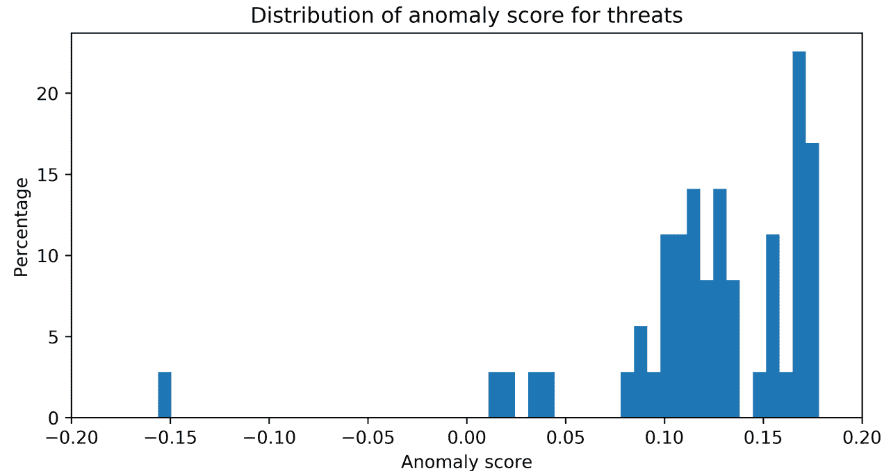
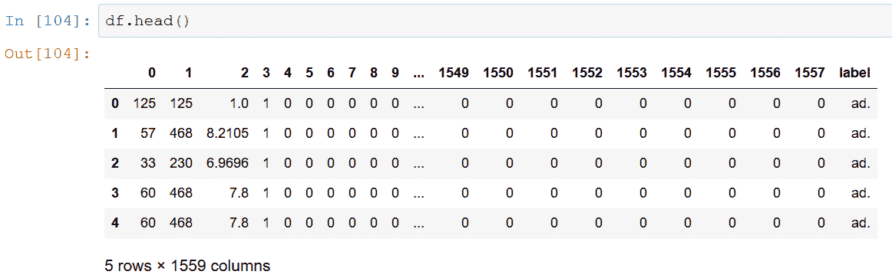

# 第六章：自动入侵检测

入侵检测系统监控网络或一组系统，以发现恶意活动或政策违规行为。任何被捕获的恶意活动或违规行为都将被阻止或报告。在本章中，我们将设计并实现几个使用机器学习的入侵检测系统。我们将从检测垃圾邮件这一经典问题开始。然后我们将转向分类恶意 URL。接下来，我们将简要介绍如何捕获网络流量，以便解决更具挑战性的网络问题，如僵尸网络和 DDoS 检测。我们将构建一个针对内部威胁的分类器。最后，我们将解决信用卡欺诈这一依赖示例、成本敏感、极度不平衡且具有挑战性的问题。

本章包含以下内容：

+   使用机器学习进行垃圾邮件过滤

+   网络钓鱼 URL 检测

+   捕获网络流量

+   网络行为异常检测

+   僵尸网络流量检测

+   内部威胁检测的特征工程

+   使用异常检测进行内部威胁检测

+   检测 DDoS 攻击

+   信用卡欺诈检测

+   伪造银行票据检测

+   使用机器学习进行广告拦截

+   无线室内定位

# 技术要求

本章的技术前提如下：

+   Wireshark

+   PyShark

+   costcla

+   scikit-learn

+   pandas

+   NumPy

代码和数据集可以在[`github.com/PacktPublishing/Machine-Learning-for-Cybersecurity-Cookbook/tree/master/Chapter06`](https://github.com/PacktPublishing/Machine-Learning-for-Cybersecurity-Cookbook/tree/master/Chapter06)找到。

# 使用机器学习进行垃圾邮件过滤

垃圾邮件（不需要的邮件）约占全球电子邮件流量的 60%。除了自 1978 年首次垃圾邮件出现以来，垃圾邮件检测软件取得的进展外，任何拥有电子邮件帐户的人都知道，垃圾邮件仍然是一个费时且昂贵的问题。在这里，我们提供一个使用机器学习进行垃圾邮件-非垃圾邮件（ham）分类的配方。

# 准备就绪

为本配方的准备工作包括通过`pip`安装`scikit-learn`包。命令如下：

```
pip install sklearn
```

此外，将`spamassassin-public-corpus.7z`解压到名为`spamassassin-public-corpus`的文件夹中。

# 如何实现...

在以下步骤中，我们构建一个用于分类垃圾邮件和非垃圾邮件的分类器：

1.  解压`spamassassin-public-corpus.7z`数据集。

1.  指定`spam`和`ham`目录的路径：

```
import os

spam_emails_path = os.path.join("spamassassin-public-corpus", "spam")
ham_emails_path = os.path.join("spamassassin-public-corpus", "ham")
labeled_file_directories = [(spam_emails_path, 0), (ham_emails_path, 1)]
```

1.  为两个类别创建标签并将电子邮件读取到语料库中：

```
email_corpus = []
labels = []

for class_files, label in labeled_file_directories:
    files = os.listdir(class_files)
    for file in files:
        file_path = os.path.join(class_files, file)
        try:
            with open(file_path, "r") as currentFile:
                email_content = currentFile.read().replace("\n", "")
                email_content = str(email_content)
                email_corpus.append(email_content)
                labels.append(label)
        except:
            pass
```

1.  对数据集进行训练-测试拆分：

```
from sklearn.model_selection import train_test_split

X_train, X_test, y_train, y_test = train_test_split(
    email_corpus, labels, test_size=0.2, random_state=11
)
```

1.  在训练数据上训练 NLP 管道：

```
from sklearn.pipeline import Pipeline
from sklearn.feature_extraction.text import HashingVectorizer, TfidfTransformer
from sklearn import tree

nlp_followed_by_dt = Pipeline(
    [
        ("vect", HashingVectorizer(input="content", ngram_range=(1, 3))),
        ("tfidf", TfidfTransformer(use_idf=True,)),
        ("dt", tree.DecisionTreeClassifier(class_weight="balanced")),
    ]
)
nlp_followed_by_dt.fit(X_train, y_train)
```

1.  在测试数据上评估分类器：

```
from sklearn.metrics import accuracy_score, confusion_matrix

y_test_pred = nlp_followed_by_dt.predict(X_test)
print(accuracy_score(y_test, y_test_pred))
print(confusion_matrix(y_test, y_test_pred))
```

以下是输出结果：

```
0.9761620977353993
[[291 7]
[ 13 528]]
```

# 它是如何工作的…

我们首先准备一个包含原始邮件的数据集（*步骤 1*），读者可以通过查看数据集来进行检查。在*步骤 2*中，我们指定垃圾邮件和正常邮件的路径，并为它们的目录分配标签。接着，我们将在*步骤 3*中读取所有邮件到一个数组中，并创建一个标签数组。接下来，我们将数据集进行训练-测试拆分（*步骤 4*），然后在*步骤 5*中为其拟合一个 NLP 管道。最后，在*步骤 6*中，我们测试我们的管道。我们发现准确率相当高。由于数据集相对平衡，因此无需使用特殊的评估指标来评估成功。

# 钓鱼 URL 检测

钓鱼网站是通过让你认为自己在一个合法网站上，从而试图获取你的账户密码或其他个人信息的网站。一些钓鱼 URL 与目标 URL 只有一个字符不同，这个字符特别选择以增加拼写错误的几率，而其他一些则利用其他渠道来生成流量。

这是一个钓鱼网站的示例，该网站通过让用户相信他们的电子邮件将被关闭，从而迫使用户提供电子邮件地址：



由于钓鱼是最成功的攻击方式之一，因此能够识别 URL 是否合法至关重要。在本食谱中，我们将构建一个机器学习模型来检测钓鱼 URL。

# 准备工作

本食谱的准备工作包括在`pip`中安装`scikit-learn`和`pandas`。命令如下：

```
pip install sklearn pandas
```

此外，提取名为`phishing-dataset.7z`的压缩文件。

# 如何进行...

在接下来的步骤中，我们将读取一个特征化的 URL 数据集，并对其进行分类器训练。

1.  从本章节的目录下载钓鱼数据集。

1.  使用`pandas`读取训练和测试数据：

```
import pandas as pd
import os

train_CSV = os.path.join("phishing-dataset", "train.csv")
test_CSV = os.path.join("phishing-dataset", "test.csv")
train_df = pd.read_csv(train_CSV)
test_df = pd.read_csv(test_CSV)
```

1.  准备钓鱼网页的标签：

```
y_train = train_df.pop("target").values
y_test = test_df.pop("target").values
```

1.  准备特征：

```
X_train = train_df.values
X_test = test_df.values
```

1.  训练、测试和评估分类器：

```
from sklearn.ensemble import RandomForestClassifier
from sklearn.metrics import accuracy_score, confusion_matrix

clf = RandomForestClassifier()
clf.fit(X_train, y_train)
y_test_pred = clf.predict(X_test)
print(accuracy_score(y_test, y_test_pred))
print(confusion_matrix(y_test, y_test_pred))
```

以下是输出：

```
0.9820846905537459
[[343 4]
[ 7 260]]
```

# 如何工作...

我们首先下载数据集，然后将其读取到数据框中（*步骤 1*和*步骤 2*），以方便检查和操作。接下来，我们将数据集放入数组中，为机器学习做准备（*步骤 3*和*步骤 4*）。该数据集包含了数千个钓鱼 URL 的特征向量。这里列出了 30 个特征的名称和值：

| 属性 | 值 | 列名 |
| --- | --- | --- |
| 是否具有 IP 地址 | { 1,0 } | `has_ip` |
| 是否具有长 URL | { 1,0,-1 } | `long_url` |
| 是否使用缩短服务 | { 0,1 } | `short_service` |
| 是否具有'@'符号 | { 0,1 } | `has_at` |
| 是否双斜杠重定向 | { 0,1 } | `double_slash_redirect` |
| 是否具有前后缀 | { -1,0,1 } | `pref_suf` |
| 是否具有子域名 | { -1,0,1 } | `has_sub_domain` |
| SSL 最终状态 | { -1,1,0 } | `ssl_state` |
| 域名注册长度 | { 0,1,-1 } | `long_domain` |
| 网站图标 | { 0,1 } | `favicon` |
| 是否为标准端口 | { 0,1 } | `port` |
| 是否使用 HTTPS 令牌 | { 0,1 } | `https_token` |
| 请求 URL | { 1,-1 } | `req_url` |
| 异常 URL 锚点 | { -1,0,1 } | `url_of_anchor` |
| 标签中的链接 | { 1,-1,0 } | `tag_links` |
| SFH | { -1,1 } | `SFH` |
| 提交到邮件 | { 1,0 } | `submit_to_email` |
| 异常 URL | { 1,0 } | `abnormal_url` |
| 重定向 | { 0,1 } | `redirect` |
| 鼠标悬停 | { 0,1 } | `mouseover` |
| 右键点击 | { 0,1 } | `right_click` |
| 弹出窗口 | { 0,1 } | `popup` |
| 内嵌框架 | { 0,1 } | `iframe` |
| 域名年龄 | { -1,0,1 } | `domain_age` |
| DNS 记录 | { 1,0 } | `dns_record` |
| 网络流量 | { -1,0,1 } | `traffic` |
| 页面排名 | { -1,0,1 } | `page_rank` |
| Google 索引 | { 0,1 } | `google_index` |
| 指向页面的链接 | { 1,0,-1 } | `links_to_page` |
| 统计报告 | { 1,0 } | `stats_report` |
| 结果 | { 1,-1 } | `target` |

在 *步骤 5* 中，我们训练并测试一个随机森林分类器。准确度相当高，但根据数据集的平衡情况，可能需要考虑 FP 约束。有许多方法可以扩展此类检测器，例如添加其他特征并扩大数据集。由于大多数网站包含一些图片，图像分类器只是模型改进结果的一种方式。

# 捕获网络流量

捕获网络流量对于故障排除、分析、软件和通信协议开发非常重要。对于关注安全的个人来说，监控网络流量是检测恶意活动或政策违规的关键。在本教程中，我们将演示如何捕获和检查网络流量。

# 准备就绪

为了准备此教程，请遵循以下步骤：

1.  安装 `pyshark`：

```
pip install pyshark
```

1.  安装 `wireshark`。最新版本可以在 [`www.wireshark.org/download.html`](https://www.wireshark.org/download.html) 找到。

# 如何操作……

在接下来的步骤中，我们将使用一个名为 PyShark 的 Python 库，并结合 Wireshark 捕获和检查网络流量。

1.  你必须将 `tshark` 添加到 PyShark 的配置路径中。Tshark 是 Wireshark 的命令行版本。为此，运行以下命令：

```
pip show pyshark
```

请注意数据包的位置。在该位置的 `pyshark` 目录中，找到文件 `config.ini`。编辑 `tshark_path` 为 `wireshark` 安装文件夹内 `tshark` 的路径。同样，编辑 `dumpcap_path` 为 `wireshark` 安装文件夹内 `dumpcap` 的路径。

*步骤 2* 和 *步骤 4* 应在 Python 环境中执行。请注意，在当前版本中，`pyshark` 在 Jupyter notebook 中运行时可能存在一些 bug。

1.  导入 `pyshark` 并指定捕获的持续时间：

```
import pyshark

capture_time = 20
```

1.  指定文件名以输出捕获内容，`to`：

```
import datetime
start = datetime.datetime.now()
end = start+datetime.timedelta(seconds=capture_time)
file_name = "networkTrafficCatpureFrom"+str(start).replace(" ", "T")+"to"+str(end).replace(" ","T")+".pcap"
```

1.  捕获网络流量：

```
cap = pyshark.LiveCapture(output_file=file_name)
cap.sniff(timeout=capture_time)
```

1.  要检查捕获内容，请在 Wireshark 中打开 `pcap` 文件：



# 工作原理……

我们从配置` tshark`（Wireshark 的命令行版本）开始。完成配置后，可以通过`pyshark`进行访问。我们导入`pyshark`并指定网络捕获的持续时间（*步骤 2*）。由于捕获的网络流量数据可能非常庞大，因此控制持续时间很重要。接下来，我们指定输出捕获的名称，使其既唯一又容易理解（*步骤 3*），然后在*步骤 4*中，开始捕获流量。最后，在*步骤 6*中，我们使用 Wireshark 的图形界面来检查捕获的网络流量。在熟练的操作下，这样的网络流量有助于检测不安全的物联网设备、配置错误、异常事件、黑客攻击尝试，甚至数据泄露。

# 网络行为异常检测

**网络行为异常检测**（**NBAD**）是对网络进行连续监控，寻找不寻常的事件或趋势。理想情况下，NBAD 程序实时跟踪关键网络特征，并在检测到表明威胁的奇异事件或趋势时生成警报。在本教程中，我们将使用机器学习构建一个 NBAD。

使用的数据集是从著名的数据集 KDD 数据集中修改而来的子集，是测试和构建 IDS 系统的标准数据集。该数据集包含在军事网络环境中模拟的各种入侵。

# 准备工作

本教程的准备工作包括安装`scikit-learn`、`pandas`和`matplotlib`。命令如下：

```
pip install sklearn pandas matplotlib
```

此外，解压`kddcup_dataset.7z`档案。

# 如何做到这一点…

在接下来的步骤中，我们将利用孤立森林在 KDD 数据集中检测异常：

1.  导入`pandas`并将数据集读取到数据框中：

```
import pandas as pd

kdd_df = pd.read_csv("kddcup_dataset.csv", index_col=None)
```

1.  检查流量类型的比例：

```
y = kdd_df["label"].values
from collections import Counter

Counter(y).most_common()
```

将会观察到以下输出：

```
[('normal', 39247),
('back', 1098),
('apache2', 794),
('neptune', 93),
('phf', 2),
('portsweep', 2),
('saint', 1)]
```

1.  将所有非正常观测值转换为单一类别：

```
def label_anomalous(text):
    """Binarize target labels into normal or anomalous."""
    if text == "normal":
        return 0
    else:
        return 1

kdd_df["label"] = kdd_df["label"].apply(label_anomalous)
```

1.  获取异常数据与正常数据的比例。这是我们在孤立森林中使用的污染参数：

```
y = kdd_df["label"].values
counts = Counter(y).most_common()
contamination_parameter = counts[1][1] / (counts[0][1] + counts[1][1])
```

1.  将所有类别特征转换为数值形式：

```
from sklearn.preprocessing import LabelEncoder

encodings_dictionary = dict()
for c in kdd_df.columns:
    if kdd_df[c].dtype == "object":
        encodings_dictionary[c] = LabelEncoder()
        kdd_df[c] = encodings_dictionary[c].fit_transform(kdd_df[c])
```

1.  将数据集分为正常和异常观测值：

```
kdd_df_normal = kdd_df[kdd_df["label"] == 0]
kdd_df_abnormal = kdd_df[kdd_df["label"] == 1]
y_normal = kdd_df_normal.pop("label").values
X_normal = kdd_df_normal.values
y_anomaly = kdd_df_abnormal.pop("label").values
X_anomaly = kdd_df_abnormal.values
```

1.  将数据集分为训练集和测试集：

```
from sklearn.model_selection import train_test_split

X_normal_train, X_normal_test, y_normal_train, y_normal_test = train_test_split(
    X_normal, y_normal, test_size=0.3, random_state=11
)
X_anomaly_train, X_anomaly_test, y_anomaly_train, y_anomaly_test = train_test_split(
    X_anomaly, y_anomaly, test_size=0.3, random_state=11
)

import numpy as np

X_train = np.concatenate((X_normal_train, X_anomaly_train))
y_train = np.concatenate((y_normal_train, y_anomaly_train))
X_test = np.concatenate((X_normal_test, X_anomaly_test))
y_test = np.concatenate((y_normal_test, y_anomaly_test))
```

1.  实例化并训练一个孤立森林分类器：

```
from sklearn.ensemble import IsolationForest

IF = IsolationForest(contamination=contamination_parameter)
IF.fit(X_train
```

1.  对正常和异常观测值进行分类评分：

```
decisionScores_train_normal = IF.decision_function(X_normal_train)
decisionScores_train_anomaly = IF.decision_function(X_anomaly_train)
```

1.  绘制正常数据集的分数：

```
import matplotlib.pyplot as plt

%matplotlib inline
plt.figure(figsize=(20, 10))
_ = plt.hist(decisionScores_train_normal, bins=50)
```

以下图表提供了输出结果：



1.  类似地，绘制异常观测值的分数以进行可视化检查：

```
plt.figure(figsize=(20, 10))
_ = plt.hist(decisionScores_train_anomaly, bins=50)
```

以下图表提供了输出结果：



1.  选择一个截断点，以将异常数据与正常数据分开：

```
cutoff = 0
```

1.  在测试集上检查此截断点：

```
print(Counter(y_test))
print(Counter(y_test[cutoff > IF.decision_function(X_test)]))
```

以下是输出结果：

```
Counter({0: 11775, 1: 597})
Counter({1: 595, 0: 85})
```

# 它是如何工作的…

我们首先将`KDD cup`数据集读取到数据框中。接下来，在*步骤 2*中，我们检查数据，发现大多数流量是正常的，正如预期的那样，但少量是异常的。显然，这个问题是高度不平衡的。因此，这个问题非常适合使用异常检测方法。在*步骤 3*和*步骤 5*中，我们将所有非正常流量转化为一个单一类别，即**异常**。

我们还确保计算异常值与正常观察值的比率（*步骤 4*），即污染参数。这是设置隔离森林灵敏度的参数之一。这个步骤是可选的，但可能会提高性能。我们在*步骤 6*中将数据集分为正常和异常观察值，同时将数据集分为正常和异常数据的训练集和测试集（*步骤 7*）。我们实例化一个隔离森林分类器，并设置其污染参数（*步骤 8*）。论文《Isolation Forest》中推荐使用的默认参数`n_estimators`和`max_samples`由 Liu 等人提出。在*步骤 9*和*步骤 10*中，我们使用隔离森林的决策函数为正常训练集提供分数，然后在图表中检查结果。在*步骤 11*中，我们类似地为异常训练集提供分数。

知道决策函数是衡量一个点描述简单程度的指标后，我们希望通过选择一个数值截断点，将简单点与复杂点分离开来，从而获得明显的区分。通过可视化检查，建议选择在*步骤 12*中选定的值。

最后，我们可以使用模型进行预测并评估其性能。在*步骤 13*中，我们看到模型能够捕捉到大量异常，而不会触发过多的假阳性（正常流量的实例），按比例而言。

# 僵尸网络流量检测

僵尸网络是由被攻击的互联网设备组成的网络。僵尸网络可用于执行分布式**拒绝服务攻击**（**DDoS 攻击**）、窃取数据、发送垃圾邮件，以及其他各种创意恶意用途。僵尸网络可以造成巨大的损害。例如，在写作时，快速搜索“僵尸网络”一词显示，3 天前，Electrum 僵尸网络窃取了 460 万美元的加密货币。在本教程中，我们构建一个分类器来检测僵尸网络流量。

使用的数据集是一个处理过的子集，名为**CTU-13**，包含了 2011 年捷克 CTU 大学捕获的僵尸网络流量。该数据集包含大量真实的僵尸网络流量，混合了正常流量和背景流量。

# 准备工作

本教程的准备工作包括在`pip`中安装`scikit-learn`。命令如下：

```
pip install sklearn
```

此外，解压`CTU13Scenario1flowData.7z`。要反序列化`CTU13Scenario1flowData.pickle`文件，需要使用 Python 2：

# 如何操作…

1.  首先读取已序列化的数据：

```
import pickle

file = open('CTU13Scenario1flowData.pickle', 'rb')
botnet_dataset = pickle.load(file)
```

1.  数据已分割为训练集和测试集，你只需将它们分别分配给各自的变量：

```
X_train, y_train, X_test, y_test = (
    botnet_dataset[0],
    botnet_dataset[1],
    botnet_dataset[2],
    botnet_dataset[3],
)
```

1.  使用默认参数实例化决策树分类器：

```
from sklearn.tree import *

clf = DecisionTreeClassifier()
```

1.  将分类器拟合到训练数据：

```
clf.fit(X_train, y_train)
```

1.  在测试集上进行测试：

```
clf.score(X_test, y_test)
```

以下是输出：

```
0.9991001799640072
```

# 它是如何工作的…

我们从*步骤 1*开始，通过反序列化数据来加载它。数据集已经经过预处理以确保平衡，因此我们无需担心数据不平衡的问题。实际上，检测僵尸网络可能需要满足对假阳性率的限制。接下来，我们利用已经预定义的训练集-测试集划分来分割数据（*步骤 2*）。现在我们可以实例化分类器，将其拟合到数据上，然后进行测试（*步骤 3*和*步骤 5*）。从准确率来看，我们看到它相当高。由于数据集已经平衡，我们无需担心我们的指标会产生误导。一般来说，检测僵尸网络是一个具有挑战性的任务。僵尸网络的检测难度可以通过 GameOver Zeus 僵尸网络恶意软件包来说明。该僵尸网络最初在 2007 年被发现，运营了超过三年，最终导致约 7000 万美元的资金被盗，并导致 FBI 在 2010 年逮捕了 100 多名嫌疑人。直到 2012 年 3 月，微软才宣布它已经能够关闭该僵尸网络的大部分指挥与控制（C&C）服务器。

# 内部威胁检测

内部威胁是雇主面临的一个复杂且日益严峻的挑战。通常定义为员工采取的任何可能对组织造成危害的行为。这些行为可能包括未经授权的数据传输或资源破坏等。内部威胁可能以各种新颖形式表现出来，动机各异，从不满的员工破坏雇主声誉，到**高级持续性威胁**（**APT**）等。

卡内基梅隆大学软件工程研究所（CERT 项目）的内部风险数据库包含了最大的公开红队情景档案。该模拟通过将真实世界的内部风险案例与从防御公司秘密获得的实际中立客户结合而构建。该数据集代表了一家单一工程公司数月的流量，涵盖了互联网、电话、登录、文件夹和系统访问（dtaa.com）。模拟公司雇佣了数千名员工，每人每天平均执行 1,000 次登录活动。数据中描绘了几种威胁情景，例如泄密者、小偷和破坏者。该问题的一个显著特点是其非常低的信噪比，无论是表现为恶意用户的总数、频繁的计数，还是总体使用情况。

我们进行的分析基于 CERT 内部威胁情景（v.4.2），特别是因为它代表了一个密集的针形数据集，这意味着它具有高频次的攻击发生。

攻击的基本计划是，首先手工创建新特征，例如是否向外部人员发送了邮件或登录是否发生在非工作时间。接下来的想法是为每个用户提取一个多变量时间序列。这个时间序列将由一系列向量组成，每个向量构成一天中我们手工创建的特征发生的次数计数。因此，我们输入数据集的形状将如下所示：

（每天检查的用户数，每天检查的总特征数，时间序列中的天数）。

然后我们将展平每个用户的时间序列，并利用隔离森林来检测异常。

# 内部威胁检测的特征工程

通常情况下，当一个机器学习解决方案不依赖端到端的深度学习时，通过创建富有洞见和信息性的特征可以提高性能。在这个示例中，我们将为内部威胁检测构建几个有前途的新特征。

# 准备工作

准备工作包括在`pip`中安装`pandas`。命令如下：

```
pip install pandas
```

另外，从以下链接下载 CERT 内部威胁数据集：ftp://ftp.sei.cmu.edu/pub/cert-data/r4.2.tar.bz2。有关数据集的更多信息以及答案，请访问[`resources.sei.cmu.edu/library/asset-view.cfm?assetid=508099`](https://resources.sei.cmu.edu/library/asset-view.cfm?assetid=508099)。

# 如何做…

在接下来的步骤中，您将为 CERT 内部威胁数据集构建新特征：

1.  导入`numpy`和`pandas`，并指向下载数据的位置：

```
import numpy as np
import pandas as pd path_to_dataset = "./r42short/"
```

1.  指定`.csv`文件及其要读取的列：

```
log_types = ["device", "email", "file", "logon", "http"]
log_fields_list = [
    ["date", "user", "activity"],
    ["date", "user", "to", "cc", "bcc"],
    ["date", "user", "filename"],
    ["date", "user", "activity"],
    ["date", "user", "url"],
]
```

1.  我们将手工创建一些特征并对其进行编码，从而创建一个字典来跟踪这些特征。

```
features = 0
feature_map = {}

def add_feature(name):
    """Add a feature to a dictionary to be encoded."""
    if name not in feature_map:
        global features
        feature_map[name] = features
        features += 1
```

1.  将要使用的特征添加到我们的字典中：

```
add_feature("Weekday_Logon_Normal")
add_feature("Weekday_Logon_After")
add_feature("Weekend_Logon")
add_feature("Logoff")

add_feature("Connect_Normal")
add_feature("Connect_After")
add_feature("Connect_Weekend")
add_feature("Disconnect")

add_feature("Email_In")
add_feature("Email_Out")

add_feature("File_exe")
add_feature("File_jpg")
add_feature("File_zip")
add_feature("File_txt")
add_feature("File_doc")
add_feature("File_pdf")
add_feature("File_other")

add_feature("url")
```

1.  定义一个函数来记录被复制到可移动介质的文件类型：

```
def file_features(row):
    """Creates a feature recording the file extension of the file used."""
    if row["filename"].endswith(".exe"):
        return feature_map["File_exe"]
    if row["filename"].endswith(".jpg"):
        return feature_map["File_jpg"]
    if row["filename"].endswith(".zip"):
        return feature_map["File_zip"]
    if row["filename"].endswith(".txt"):
        return feature_map["File_txt"]
    if row["filename"].endswith(".doc"):
        return feature_map["File_doc"]
    if row["filename"].endswith(".pdf"):
        return feature_map["File_pdf"]
    else:
        return feature_map["File_other"]
```

1.  定义一个函数来识别员工是否向非公司邮箱发送了邮件：

```
def email_features(row):
    """Creates a feature recording whether an email has been sent externally."""
    outsider = False
    if not pd.isnull(row["to"]):
        for address in row["to"].split(";"):
            if not address.endswith("dtaa.com"):
                outsider = True

    if not pd.isnull(row["cc"]):
        for address in row["cc"].split(";"):
            if not address.endswith("dtaa.com"):
                outsider = True

    if not pd.isnull(row["bcc"]):
        for address in row["bcc"].split(";"):
            if not address.endswith("dtaa.com"):
                outsider = True
    if outsider:
        return feature_map["Email_Out"]
    else:
        return feature_map["Email_In"]
```

1.  定义一个函数来记录员工是否在非工作时间使用可移动介质：

```
def device_features(row):
    """Creates a feature for whether the user has connected during normal hours or otherwise."""
    if row["activity"] == "Connect":
        if row["date"].weekday() < 5:
            if row["date"].hour >= 8 and row["date"].hour < 17:
                return feature_map["Connect_Normal"]
            else:
                return feature_map["Connect_After"]
        else:
            return feature_map["Connect_Weekend"]
    else:
        return feature_map["Disconnect"]
```

1.  定义一个函数来记录员工是否在非工作时间登录到计算机：

```
def logon_features(row):
    """Creates a feature for whether the user logged in during normal hours or otherwise."""
    if row["activity"] == "Logon":
        if row["date"].weekday() < 5:
            if row["date"].hour >= 8 and row["date"].hour < 17:
                return feature_map["Weekday_Logon_Normal"]
            else:
                return feature_map["Weekday_Logon_After"]
        else:
            return feature_map["Weekend_Logon"]
    else:
        return feature_map["Logoff"]
```

1.  我们不会利用员工访问的 URL 中包含的信息：

```
def http_features(row):
    """Encodes the URL visited."""
    return feature_map["url"]
```

1.  我们仅保留事件发生的日期，而不是完整的时间戳：

```
def date_to_day(row):
    """Converts a full datetime to date only."""
    day_only = row["date"].date()
    return day_only
```

1.  我们循环遍历包含日志的`.csv`文件，并将它们读入 pandas 数据框中：

```
log_feature_functions = [
    device_features,
    email_features,
    file_features,
    logon_features,
    http_features,
]
dfs = []
for i in range(len(log_types)):
    log_type = log_types[i]
    log_fields = log_fields_list[i]
    log_feature_function = log_feature_functions[i]
    df = pd.read_csv(
        path_to_dataset + log_type + ".csv", usecols=log_fields, index_col=None
    )
```

1.  将`date`数据转换为`pandas`时间戳：

```
    date_format = "%m/%d/%Y %H:%M:%S"
    df["date"] = pd.to_datetime(df["date"], format=date_format)
```

1.  创建上述定义的新特征，然后丢弃除日期、用户和我们的新特征之外的所有特征：

```
    new_feature = df.apply(log_feature_function, axis=1)
    df["feature"] = new_feature

    cols_to_keep = ["date", "user", "feature"]
    df = df[cols_to_keep]
```

1.  将日期转换为只有一天：

```
    df["date"] = df.apply(date_to_day, axis=1)

    dfs.append(df)
```

1.  将所有数据框连接成一个，并按`date`排序：

```
joint = pd.concat(dfs)
joint = joint.sort_values(by="date")
```

# 工作原理...

首先导入`pandas`和`numpy`并创建一个指向数据集的变量（*步骤 1*）。CERT 提供了多个数据集。4.2 版本之所以与众不同，是因为它是一个密集的“针”数据集，意味着它比其他数据集有更高的内部威胁发生率。由于数据集非常庞大，因此在实验阶段，至少要对其进行过滤和下采样，以便更方便地处理数据，因此我们在*步骤 2*中这样做。在接下来的步骤中，我们将手动设计一些特征，认为这些特征有助于我们的分类器识别内部威胁。在*步骤 3*中，我们创建一个便捷的函数来编码特征，以便一个字典可以跟踪这些特征。我们在*步骤 4*中提供将要添加的特征名称。在*步骤 5*中，我们创建一个特征，用于跟踪复制到可移动介质中的文件类型。推测这可能表明数据泄露犯罪行为。在*步骤 6*中，我们创建一个特征，跟踪员工是否曾给外部实体发送过电子邮件。我们又创建了一个特征，用于跟踪员工是否在非工作时间使用过可移动存储设备（*步骤 7*）。

一个附加特征用于跟踪员工是否在非工作时间登录过设备（*步骤 8*）。为了简化处理，我们没有利用员工访问的 URL（*步骤 9*），尽管这些可能暗示恶意行为。

接下来，我们通过仅使用日期（*步骤 10*），而不是在特征化数据中使用完整的时间戳，来简化数据。在*步骤 11*中，我们将数据读取到一个 pandas 数据框中。然后，在*步骤 12*中，我们编辑当前的日期格式，以适应 pandas，并收集所有新的特征，同时丢弃旧的特征（*步骤 13*）。在*步骤 14*中，我们将数据转换为一个时间序列，其增量为单天。最后，在*步骤 15*中，我们将所有数据汇总到一个大型的已排序数据框中。我们现在已经完成了特征工程阶段的第一次迭代。为了提升性能并添加特征，你可以朝着多个方向努力。这些方向包括观察电子邮件文本中的负面情绪，并使用心理测量学分析个性。

# 使用异常检测来识别内部威胁

在设计出有前景的新特征后，我们的下一步是进行训练集和测试集划分，将数据处理成方便的时间序列形式，然后进行分类。我们的训练集和测试集将是数据集的两个时间半部分。通过这种方式，我们可以轻松确保训练输入的形状与测试输入的形状相同，从而避免在评估中作弊。

# 准备工作

这个配方的准备工作包括在`pip`中安装`scikit-learn`、`pandas`和`matplotlib`。命令如下：

```
pip install sklearn pandas matplotlib
```

在准备这个配方时，你需要加载前一个配方中的数据框（或者直接从前一个配方的结束部分继续）。

# 如何操作...

在接下来的步骤中，你将把特征化数据转换为时间序列集合，并使用孤立森林检测犯罪：

1.  列出所有威胁行为者，为创建标签做准备：

```
threat_actors = [
    "AAM0658",
    "AJR0932",
    "BDV0168",
    <snip>
    "MSO0222",
]
```

1.  然后我们对日期进行索引：

```
start_date = joint["date"].iloc[0]
end_date = joint["date"].iloc[-1]
time_horizon = (end_date - start_date).days + 1

def date_to_index(date):
    """Indexes dates by counting the number of days since the starting date of the dataset."""
    return (date - start_date).days
```

1.  定义一个函数来提取给定用户的时间序列信息：

```
def extract_time_series_by_user(user_name, df):
    """Filters the dataframe down to a specific user."""
    return df[df["user"] == user_name]
```

1.  定义一个函数来向量化用户的时间序列信息：

```
def vectorize_user_time_series(user_name, df):
    """Convert the sequence of features of a user to a vector-valued time series."""
    user_time_series = extract_time_series_by_user(user_name, df)
    x = np.zeros((len(feature_map), time_horizon))
    event_date_indices = user_time_series["date"].apply(date_to_index).to_numpy()
    event_features = user_time_series["feature"].to_numpy()
    for i in range(len(event_date_indices)):
        x[event_features[i], event_date_indices[i]] += 1
    return x
```

1.  定义一个函数来向量化所有用户特征的时间序列：

```
def vectorize_dataset(df):
    """Takes the dataset and featurizes it."""
    users = set(df["user"].values)
    X = np.zeros((len(users), len(feature_map), time_horizon))
    y = np.zeros((len(users)))
    for index, user in enumerate(users):
        x = vectorize_user_time_series(user, df)
        X[index, :, :] = x
        y[index] = int(user in threat_actors)
    return X, y
```

1.  向量化数据集：

```
X, y = vectorize_dataset(joint)
```

1.  对向量化数据进行训练-测试集划分：

```
from sklearn.model_selection import train_test_split

X_train, X_test, y_train, y_test = train_test_split(X, y, stratify=y)
```

1.  重新调整向量化数据的形状：

```
X_train_reshaped = X_train.reshape(
    [X_train.shape[0], X_train.shape[1] * X_train.shape[2]]
)
X_test_reshaped = X_test.reshape([X_test.shape[0], X_test.shape[1] * X_test.shape[2]])
```

1.  将训练集和测试集数据拆分为威胁和非威胁子集：

```
X_train_normal = X_train_reshaped[y_train == 0, :]
X_train_threat = X_train_reshaped[y_train == 1, :]
X_test_normal = X_test_reshaped[y_test == 0, :]
X_test_threat = X_test_reshaped[y_test == 1, :]
```

1.  定义并实例化孤立森林分类器：

```
from sklearn.ensemble import IsolationForest

contamination_parameter = 0.035
IF = IsolationForest(
    n_estimators=100, max_samples=256, contamination=contamination_parameter
)
```

1.  将孤立森林分类器拟合到训练数据：

```
IF.fit(X_train_reshaped)
```

1.  绘制训练数据中正常子集的决策分数：

```
normal_scores = IF.decision_function(X_train_normal)
import matplotlib.mlab as mlab
import matplotlib.pyplot as plt

fig = plt.figure(figsize=(8, 4), dpi=600, facecolor="w", edgecolor="k")

normal = plt.hist(normal_scores, 50, density=True)

plt.xlim((-0.2, 0.2))
plt.xlabel("Anomaly score")
plt.ylabel("Percentage")
plt.title("Distribution of anomaly score for non threats")
```

请查看以下截图：



1.  对训练数据中的威胁行为者执行相同操作：

```
anomaly_scores = IF.decision_function(X_train_threat)
fig = plt.figure(figsize=(8, 4), dpi=600, facecolor="w", edgecolor="k")

anomaly = plt.hist(anomaly_scores, 50, density=True)

plt.xlim((-0.2, 0.2))
plt.xlabel("Anomaly score")
plt.ylabel("Percentage")
plt.title("Distribution of anomaly score for threats") 
```

请查看以下截图：



1.  选择一个截断分数：

```
cutoff = 0.12
```

1.  观察截断在训练数据上的结果：

```
from collections import Counter

s = IF.decision_function(X_train_reshaped)
print(Counter(y_train[cutoff > s]))
```

以下是输出结果：

```
Counter({0.0: 155, 1.0: 23})
```

1.  测量截断选择在测试集上的结果：

```
s = IF.decision_function(X_test_reshaped)
print(Counter(y_test[cutoff > s]))
```

以下是输出结果：

```
Counter({0.0: 46, 1.0: 8})
```

# 它是如何工作的…

在前面的食谱中完成特征工程阶段后，我们继续创建了一个模型。在*第 1 步*中，我们列出了所有的威胁行为者，为接下来的步骤做准备。在*第 2 步*中，我们为日期创建了索引，使得`0`对应起始日期，`1`对应第二天，依此类推。在随后的*第 3 步*和*第 5 步*中，我们定义了函数来读取整个数据集的时间序列，将其过滤到每个用户，然后为每个用户向量化时间序列。接着我们向量化了数据集（*第 6 步*），并进行了训练-测试集划分（*第 7 步*）。我们在*第 8 步*中重新调整了数据形状，以便能够将其输入到孤立森林分类器中。我们进一步将数据拆分为良性和威胁子集（*第 9 步*），以便调整我们的参数。在*第 10 步*中，我们实例化了孤立森林分类器，然后在*第 11 步*中将其拟合到数据上。对于我们的污染参数，我们使用了一个值，对应威胁与良性行为者的比例。

在接下来的三步（*第 12 步* - *第 14 步*）中，我们检查了孤立森林在良性和威胁行为者上的决策分数，并通过检查得出结论，截断值 0.12 能够检测到大比例的威胁行为者，而不会标记太多良性行为者。最后，在*第 15 步*和*第 16 步*中评估我们的性能时，我们发现有一些假阳性，但也检测到了相当数量的内部威胁。由于比例不是很高，因此分类器对于告知分析员潜在威胁非常有帮助。

# 检测 DDoS

**DDoS**，即**分布式拒绝服务攻击**，是一种攻击方式，其中来自不同来源的流量洪水般涌向目标，导致服务中断。DDoS 攻击有许多类型，通常分为三大类：应用层攻击、协议攻击和流量攻击。目前，很多 DDoS 防御仍是手动进行的。通过识别并阻止特定的 IP 地址或域名来进行防御。随着 DDoS 攻击的机器人变得越来越复杂，这种方法正在逐渐过时。机器学习为此提供了一个有前景的自动化解决方案。

我们将使用的数据集是对 CSE-CIC-IDS2018、CICIDS2017 和 CIC DoS 数据集（2017 年）的子采样。它由 80%的正常流量和 20%的 DDoS 流量组成，以代表更为现实的正常流量与 DDoS 流量的比例。

# 准备工作

本配方的准备工作包括在`pip`中安装几个包，分别是`scikit-learn`和`pandas`。命令如下：

```
pip install sklearn pandas
```

为了准备这个配方，提取归档文件`ddos_dataset.7z`。

# 如何实现…

在接下来的步骤中，我们将训练一个随机森林分类器来检测 DDoS 流量：

1.  导入`pandas`并指定您将在代码中读取的列的数据类型：

```
import pandas as pd

features = [
    "Fwd Seg Size Min",
    "Init Bwd Win Byts",
    "Init Fwd Win Byts",
    "Fwd Seg Size Min",
    "Fwd Pkt Len Mean",
    "Fwd Seg Size Avg",
    "Label",
    "Timestamp",
]
dtypes = {
    "Fwd Pkt Len Mean": "float",
    "Fwd Seg Size Avg": "float",
    "Init Fwd Win Byts": "int",
    "Init Bwd Win Byts": "int",
    "Fwd Seg Size Min": "int",
    "Label": "str",
}
date_columns = ["Timestamp"]
```

1.  读取包含数据集的`.csv`文件：

```
df = pd.read_csv("ddos_dataset.csv", usecols=features, dtype=dtypes,parse_dates=date_columns,index_col=None)
```

1.  按日期对数据进行排序：

```
df2 = df.sort_values("Timestamp")
```

1.  删除日期列，因为它不再需要：

```
df3 = df2.drop(columns=["Timestamp"])
```

1.  将数据分割为训练集和测试集，分别由数据的前 80%和后 20%组成：

```
l = len(df3.index)
train_df = df3.head(int(l * 0.8))
test_df = df3.tail(int(l * 0.2))
```

1.  准备标签：

```
y_train = train_df.pop("Label").values
y_test = test_df.pop("Label").values
```

1.  准备特征向量：

```
X_train = train_df.values
X_test = test_df.values
```

1.  导入并实例化一个随机森林分类器：

```
from sklearn.ensemble import RandomForestClassifier

clf = RandomForestClassifier(n_estimators=50)
```

1.  将随机森林模型拟合到训练数据，并在测试数据上进行评分：

```
clf.fit(X_train, y_train)
clf.score(X_test, y_test)
```

以下是输出结果：

```
0.83262
```

# 它是如何工作的…

由于数据集较大，即便是导入它也会消耗大量计算资源。因此，我们在*步骤 1*中通过指定我们认为最有前景的特征子集以及记录它们的数据类型来开始操作，这样我们就不需要后续再转换它们。然后，在*步骤 2*中，我们将数据读取到数据框中。在*步骤 3*和*4*中，我们按日期对数据进行排序，因为问题要求能够预测未来的事件，并且随后删除日期列，因为我们不再需要它。在接下来的两步中，我们进行训练-测试数据集划分，同时考虑到时间进展。然后，我们在*步骤 8*和*9*中实例化、拟合并测试一个随机森林分类器。根据应用场景，得到的准确性是一个不错的起点。为了提升性能，一个有前景的方向是考虑源 IP 和目的 IP。直观来说，连接的来源应该对它是否属于 DDoS 攻击有重要影响。

# 信用卡欺诈检测

信用卡公司必须监控欺诈交易，以避免客户被错误收费。这样的数据非常不平衡，我们在本章中将使用的数据集，其中欺诈交易仅占总交易的 0.172%。它只包含数字输入变量，这些变量是通过 PCA 变换得到的，还有*Time*和*Amount*特征。*Time*特征包含每笔交易与数据集中第一笔交易之间经过的秒数。*Amount*特征是交易金额，这是我们将在成本敏感学习中使用的一个特征。*Class*特征是响应参数，在欺诈情况下，其值为`1`，否则为`0`。

那么什么是示例相关的、成本敏感的学习呢？考虑每种分类类型相关的成本。如果程序没有识别出欺诈交易，钱就会被浪费，并且持卡人必须获得全额退款。如果程序认为支付是欺诈性的，交易将被停止。在这种情况下，由于需要联系持卡人，且卡需要被替换（如果交易被正确标记为欺诈），或者重新激活（如果交易实际上是合法的），就会产生行政成本。为了简化起见，假设行政成本总是相同的。如果系统认为交易是有效的，那么交易将自动接受，并且不会收取费用。这就导致了每种预测场景相关的以下成本：

|  | 欺诈 y = 1 | 良性 y = 0 |
| --- | --- | --- |
| 预测的欺诈 y_pred = 1 | 真阳性成本 = 行政成本 | 假阳性成本 = 行政成本 |
| 预测的良性 y_pred = 0 | 假阴性成本 = 交易金额 | 真阴性成本 = $0 |

与大多数场景不同，我们的兴趣在于最小化总成本，基于上述考虑，而不是准确性、精确度或召回率。

# 准备工作

为了准备这个配方，需要在`pip`中安装`scikit-learn`、`pandas`和`matplotlib`，以及一个名为`costcla`的新包。命令如下：

```
pip install sklearn pandas matplotlib costcla
```

为了准备这个配方，从[`www.kaggle.com/mlg-ulb/creditcardfraud/downloads/creditcardfraud.zip/3`](https://www.kaggle.com/mlg-ulb/creditcardfraud/downloads/creditcardfraud.zip/3)下载信用卡交易数据集（开放数据库许可证）。

# 如何操作……

在接下来的步骤中，我们将使用`costcla`库在信用卡交易数据上构建一个示例相关的、成本敏感的分类器：

1.  导入`pandas`并将与交易相关的数据读取到数据框中：

```
import pandas as pd

fraud_df = pd.read_csv("FinancialFraudDB.csv", index_col=None)
```

1.  为`假`正例和`假`负例设置成本：

```
card_replacement_cost = 5
customer_freeze_cost = 3
```

1.  定义一个对应于图表的成本矩阵：

```
import numpy as np

cost_matrix = np.zeros((len(fraud_df.index), 4))
cost_matrix[:, 0] = customer_freeze_cost * np.ones(len(fraud_df.index))
cost_matrix[:, 1] = fraud_df["Amount"].values
cost_matrix[:, 2] = card_replacement_cost * np.ones(len(fraud_df.index))
```

1.  创建标签和特征矩阵：

```
y = fraud_df.pop("Class").values
X = fraud_df.values
```

1.  创建训练集和测试集的划分：

```
from sklearn.model_selection import train_test_split

sets = train_test_split(X, y, cost_matrix, test_size=0.25, random_state=11)
X_train, X_test, y_train, y_test, cost_matrix_train, cost_matrix_test = sets
```

1.  导入决策树，将其拟合到训练数据上，然后在测试集上进行预测：

```
from sklearn import tree

y_pred_test_dt = tree.DecisionTreeClassifier().fit(X_train, y_train).predict(X_test)
```

1.  导入成本敏感决策树，将其拟合到训练数据上，然后在测试集上进行预测：

```
from costcla.models import CostSensitiveDecisionTreeClassifier

y_pred_test_csdt = CostSensitiveDecisionTreeClassifier().fit(X_train, y_train, cost_matrix_train).predict(X_test)
```

1.  计算两个模型的节省得分：

```
from costcla.metrics import savings_score

print(savings_score(y_test, y_pred_test_dt, cost_matrix_test))
print(savings_score(y_test, y_pred_test_csdt, cost_matrix_test))
```

以下是输出结果：

```
0.5231523713991505 0.5994028394464614
```

# 它是如何工作的…

第一步是简单地加载数据。在*第 2 步*中，我们根据更换信用卡的预期成本设置了行政成本。此外，我们还估算了冻结客户银行操作直到所有交易被验证的商业成本。在实践中，你应该获取一个准确的数字，适合具体的信用卡公司或业务用例。使用我们定义的参数，在*第 3 步*中，我们定义了一个成本矩阵，考虑了更换信用卡的行政成本、冻结客户带来的业务中断等因素。在*第 4 步*和*第 5 步*中，我们进行数据的训练-测试拆分。接下来，我们想看看这个依赖于示例的、成本敏感的分类器与普通分类器相比表现如何。为此，我们实例化一个简单的分类器，进行训练，并在*第 6 步*中使用它对测试集进行预测，然后在*第 7 步*中使用`costcla`库中的成本敏感随机森林模型进行相同的操作。最后，在*第 8 步*中，我们利用`costcla`中的`savings_score`函数，基于成本矩阵计算使用`y_pred`对`y_true`的节省成本。数字越高，节省的成本越大。因此，我们可以看到，成本敏感的随机森林模型优于普通模型。

# 伪造钞票检测

伪造货币是未经国家或政府合法批准的货币，通常是为了模仿合法货币并欺骗其使用者。在这个教程中，你将训练一个机器学习分类器来区分真实和伪造的钞票。

# 准备中

本教程的准备工作包括在`pip`中安装`scikit-learn`和`pandas`。命令如下：

```
pip install sklearn pandas
```

在准备本教程时，从 UCI 机器学习库下载钞票鉴定数据集：[`archive.ics.uci.edu/ml/datasets/banknote+authentication`](https://archive.ics.uci.edu/ml/datasets/banknote+authentication)。

# 如何操作...

在接下来的步骤中，你将下载一个标注过的伪造和合法钞票数据集，并构建一个分类器来检测伪造货币：

1.  获取真实和伪造的钞票标注数据集。

1.  使用`pandas`读取钞票数据集：

```
import pandas as pd

df = pd.read_csv("data_banknote_authentication.txt", header=None)
df.columns = ["0", "1", "2", "3", "label"]
```

以下是输出结果：

```
feature 1 feature 2 feature 3 feature 4 label
0 3.62160 8.6661 -2.8073 -0.44699 0
1 4.54590 8.1674 -2.4586 -1.46210 0
2 3.86600 -2.6383 1.9242 0.10645 0
3 3.45660 9.5228 -4.0112 -3.59440 0
4 0.32924 -4.4552 4.5718 -0.98880 0
```

1.  创建训练-测试拆分：

```
from sklearn.model_selection import train_test_split

df_train, df_test = train_test_split(df)
```

1.  将特征和标签收集到数组中：

```
y_train = df_train.pop("label").values
X_train = df_train.values
y_test = df_test.pop("label").values
X_test = df_test.values
```

1.  实例化一个随机森林分类器：

```
from sklearn.ensemble import RandomForestClassifier

clf = RandomForestClassifier()
```

1.  训练并测试分类器：

```
clf.fit(X_train, y_train)
print(clf.score(X_test, y_test))
```

以下是输出结果：

```
0.9825072886297376
```

# 它是如何工作的...

解决伪造问题的最大潜力在于获取大量的图像数据集并使用深度学习技术。然而，在数据集相对较小的情况下（如本案例所示），特征工程是必不可少的。我们通过加载并读取数据集到 pandas 中来开始解决问题（*步骤 1* 和 *步骤 2*）。在这个数据集的情况下，使用了小波变换工具从图像中提取特征。接下来，在*步骤 3* 和 *步骤 4* 中，我们将数据进行训练-测试分割并汇总成数组。最后，在*步骤 5* 和 *步骤 6* 中，我们对数据集进行了基础分类器的训练和测试。高达 98% 的得分表明，从该数据集中提取的特征确实能够区分真实与伪造的钞票。

# 使用机器学习进行广告屏蔽

广告屏蔽是指在网页浏览器或应用程序中移除或更改在线广告。在这个食谱中，你将利用机器学习检测广告，以便能够屏蔽广告，畅快无忧地浏览！

# 准备工作

准备这个食谱时，需要在 `pip` 中安装 `scikit-learn` 和 `pandas`。命令如下：

```
pip install sklearn pandas
```

为了准备这个食谱，从 UCI 机器学习库下载互联网广告数据集：[`archive.ics.uci.edu/ml/datasets/internet+advertisements`](https://archive.ics.uci.edu/ml/datasets/internet+advertisements)。

# 如何实现……

以下步骤展示了如何使用机器学习实现广告屏蔽：

1.  收集互联网广告的数据集。

1.  使用 `pandas` 导入数据到数据框中：

```
import pandas as pd

df = pd.read_csv("ad.data", header=None)
df.rename(columns={1558: "label"}, inplace=True)
```

1.  数据存在脏数据问题，即有缺失值。让我们找出所有缺失值的行：

```
improper_rows = []
for index, row in df.iterrows():
    for col in df.columns:
        val = str(row[col]).strip()
        if val == "?":
            improper_rows.append(index)
```

1.  在当前的情况下，删除缺失值的行是合理的，如下代码所示：

```
df = df.drop(df.index[list(set(improper_rows))])
```

1.  将标签转换为数值形式：

```
def label_to_numeric(row):
    """Binarize the label."""
    if row["label"] == "ad.":
        return 1
    else:
        return 0

df["label"] = df.apply(label_to_numeric, axis=1)
```

1.  将数据分为训练数据和测试数据：

```
from sklearn.model_selection import train_test_split

df_train, df_test = train_test_split(df)
```

1.  将数据分配到特征数组和标签数组中：

```
y_train = df_train.pop("label").values
y_test = df_test.pop("label").values
X_train = df_train.values
X_test = df_test.values
```

1.  实例化一个随机森林分类器并进行训练：

```
from sklearn.ensemble import RandomForestClassifier

clf = RandomForestClassifier()
clf.fit(X_train, y_train)
```

1.  在测试数据上对分类器进行评分：

```
clf.score(X_test, y_test)
```

以下是输出结果：

```
0.9847457627118644
```

# 它是如何工作的……

我们通过导入数据集来开始阻止不必要广告的步骤。我们在这个食谱中使用的数据已经经过了特征工程处理。在*步骤 2* 中，我们将数据导入数据框。查看数据，我们发现它由 1,558 个数值特征和一个广告或非广告标签组成：



特征编码了图像的几何形状、URL 中的句子、图像的 URL、alt 文本、锚文本和靠近锚文本的单词。我们的目标是预测图像是否为广告（ad）或不是（non-ad）。我们通过在*步骤*3 和*4*中删除缺失值的行来清理数据。通常，使用其他技术来填补缺失值是有意义的，比如使用平均值或最常见的值。继续到*步骤*5，我们将目标转换为数字形式。然后，在*步骤*6 和*7*中，我们将数据进行训练集和测试集的拆分，为学习做好准备。最后，在*步骤*8 和*9*中，我们在数据上训练并测试一个基本分类器。结果表明，这些特征确实提供了很高的区分能力。

最近的方法利用深度学习处理屏幕图像来应对广告。这个方法非常有前景，但由于深度学习对对抗性攻击的敏感性，到目前为止并未成功。随着对抗攻击的鲁棒性在该领域的提升，基于深度学习的广告拦截器可能会变得普及。

# 无线室内定位

黑客停在某个住宅外，恶意入侵他们的网络的故事堪称传奇。虽然这些故事可能夸大了此情景的易得性和动机，但在许多情况下，最佳做法是仅允许家中的用户，或者在企业环境中，仅允许特定区域的用户拥有指定的网络权限。在这个案例中，您将利用机器学习基于 Wi-Fi 信号来定位一个实体。我们将使用的数据集是在室内空间收集的，数据通过观察智能手机上可见的七个 Wi-Fi 信号的信号强度获得。四个房间中的一个是决策因素。

# 准备工作

本案例的准备工作包括安装 `scikit-learn` 和 `pandas`。在您的 Python 环境中，运行以下命令：

```
pip install sklearn pandas
```

为了准备本案例，下载 UCI 机器学习库中的无线室内定位数据集：[`archive.ics.uci.edu/ml/datasets/Wireless+Indoor+Localization.`](https://archive.ics.uci.edu/ml/datasets/Wireless+Indoor+Localization)

# 如何操作…

要利用机器学习基于 Wi-Fi 信号定位一个实体，请按照以下步骤操作：

1.  从感兴趣区域的不同位置收集 Wi-Fi 信号强度的数据集。

1.  使用 `pandas` 将数据加载到数据框中：

```
import pandas as pd

df = pd.read_csv("wifi_localization.txt", sep="\t", header=None)
df = df.rename(columns={7: "room"})
```

1.  将数据框分割为训练集和测试集：

```
from sklearn.model_selection import train_test_split

df_train, df_test = train_test_split(df)
```

1.  将特征和标签分配到数组中：

```
y_train = df_train.pop("room").values
y_test = df_test.pop("room").values
X_train = df_train.values
X_test = df_test.values
```

1.  实例化一个随机森林分类器：

```
from sklearn.ensemble import RandomForestClassifier

clf = RandomForestClassifier()
```

1.  将分类器拟合到训练数据上：

```
clf.fit(X_train, y_train)
```

1.  在测试数据集上进行预测并打印出混淆矩阵：

```
y_pred = clf.predict(X_test)
from sklearn.metrics import confusion_matrix

print(confusion_matrix(y_test, y_pred))
```

以下输出显示了我们的混淆矩阵：

```
[[124   0   0   0]
 [  0 124   4   0]
 [  0   2 134   0]
 [  1   0   0 111]]
```

# 工作原理…

*第一步* 是从感兴趣区域的不同位置收集 Wi-Fi 信号强度的数据集。这是一个相对容易完成的任务，只需要带着启用 GPS 功能的手机走遍一个房间，并运行一个脚本记录 Wi-Fi 的信号强度。在 *第二步* 中，我们将数据读取到数据框中，然后将目标列重命名为 `room`，这样我们就知道它指的是什么。接下来，在 *第三步* 中，我们将数据进行训练测试集拆分，为学习做准备。我们将特征和标签拆分成数组（*第四步*）。最后，在 *第五步* 和第六步 中，我们训练并测试一个基本的分类器。观察到模型的表现非常优秀。这表明，基于设备能够接收到的 Wi-Fi 信号强度进行定位并不是一项困难的任务，只要该区域已经被预先学习过。
