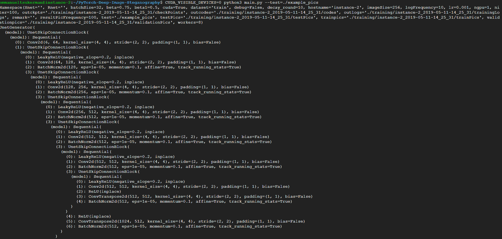

# 第七章：使用机器学习保护和攻击数据

在本章中，我们将学习如何利用**机器学习**（**ML**）来保护和攻击数据。我们将介绍如何使用机器学习评估密码强度，以及如何利用深度学习破解密码。同样，我们还会介绍如何利用隐写术将信息藏匿在明面上，以及如何使用机器学习检测隐写术。此外，我们还将将机器学习与硬件安全结合，利用 AI 攻击**物理不可克隆函数**（**PUF**）。

在本章中，我们将涵盖以下内容：

+   使用机器学习评估密码安全性

+   使用深度学习进行密码破解

+   深度隐写术

+   基于机器学习的隐写分析

+   针对 PUF 的机器学习攻击

+   使用深度学习进行加密

+   HIPAA 数据泄露——数据探索与可视化

# 技术要求

在本章中，我们将使用以下技术：

+   PyTorch

+   TensorBoardX

+   XGBoost

+   scikit-learn

+   pandas

+   TensorFlow

+   Keras

+   Octave

本章的代码和数据集可以在[`github.com/PacktPublishing/Machine-Learning-for-Cybersecurity-Cookbook/tree/master/Chapter07`](https://github.com/PacktPublishing/Machine-Learning-for-Cybersecurity-Cookbook/tree/master/Chapter07)找到。

# 使用机器学习评估密码安全性

**密码破解**是系统化地发现安全系统密码的过程。破解可以包括使用常见密码、巧妙生成的候选密码（例如，将字母 O 替换为数字 0 或将单词反向书写），或直接使用暴力穷举搜索。为了使密码更难破解，必须选择一个强密码。

# 准备工作

为了准备这个配方，我们需要在`pip`中安装`pandas`、`sklearn`和`xgboost`。使用以下代码进行安装：

```
pip install pandas sklearn xgboost
```

此外，解压归档数据集，即`PasswordDataset.7z`。

# 如何操作…

在接下来的步骤中，我们将读取一个包含密码及其强度标签的数据集，并构建一个分类器来评估密码强度。让我们开始吧：

1.  导入`pandas`并将密码读取到数据框中：

```
import pandas as pd

df = pd.read_csv(
    "passwordDataset.csv", dtype={"password": "str", "strength": "int"}, index_col=None
)
```

1.  随机打乱数据：

```
df = df.sample(frac=1)
```

1.  将数据框拆分为两个独立的数据框，一个用于训练，一个用于测试：

```
l = len(df.index)
train_df = df.head(int(l * 0.8))
test_df = df.tail(int(l * 0.2))
```

1.  创建所需的标签和特征数据：

```
y_train = train_df.pop("strength").values
y_test = test_df.pop("strength").values
X_train = train_df.values.flatten()
X_test = test_df.values.flatten()
```

1.  定义一个函数，将字符串拆分为其字符：

```
def character_tokens(input_string):
    """Break string into characters."""
    return [x for x in input_string]
```

1.  创建一个管道，对密码的字符进行 TF-IDF 处理，然后进行梯度提升：

```
from sklearn.pipeline import Pipeline
from sklearn.feature_extraction.text import TfidfVectorizer
from xgboost import XGBClassifier

password_clf = Pipeline(
    [("vect", TfidfVectorizer(tokenizer=character_tokens)), ("clf", XGBClassifier()),]
)
```

1.  训练和测试管道：

```
password_clf.fit(X_train, y_train)
password_clf.score(X_test, y_test)
```

以下是输出结果：

```
0.9137365878426307
```

1.  设置一个变量为常用密码，另一个变量为计算机生成的高熵密码：

```
common_password = "qwerty"
strong_computer_generated_password = "c9lCwLBFmdLbG6iWla4H"
```

1.  检查分类器对两个密码强度的预测：

```
password_clf.predict([common_password, strong_computer_generated_password])
```

以下是输出结果：

```
array([0, 2])
```

# 它是如何工作的…

我们首先导入`pandas`，然后将数据读取到一个数据框中（*步骤 1*）。数据中有两个字段：密码和密码强度。密码强度分为三种难度等级。我们在*步骤 2*中打乱数据，以创建更强健的训练。接着，在*步骤 3*中，我们通过 80-20 的比例划分数据框，然后将特征和标签分配到数组中（*步骤 4*）。在*步骤 5*中，我们定义一个函数，将密码字符串拆分成字符，从而将密码分词为字符，而不是单词。这样可以让分类器学习密码数据集中的细粒度信息。在*步骤 6*中，我们定义一个管道，对密码的字符进行自然语言处理（NLP），然后使用 XGBoost 分类器。接下来，在*步骤 7*中，我们训练并测试我们的分类器。对于这样的主观任务，分类器的表现不一定会在高分或低分上体现。

完成训练后，我们进行合理性检查/演示分类器的有效性。在*步骤 8*中，我们选择最常见的密码之一和一个使用密码管理系统生成的密码。在*步骤 9*中，我们可以看到分类器确实将常见密码分类为弱（强度 0），而强密码分类为强（强度 2）。成功。

# 密码破解的深度学习

现代的密码破解工具，如**John the Ripper**，允许黑客在几秒钟内测试数十亿个潜在密码。这些工具不仅能让黑客尝试字典中所有常见密码，还可以通过连接（例如，`password1234`）、键盘替换（`p4s5w0rd`）等技巧自动转换密码。虽然这些技巧有前景，但发现其他有效的转换方法是一个困难的任务。被称为 PassGAN 的机器学习系统使用**生成对抗网络**（**GAN**），通过观察大量实际密码泄露数据集，自动学习这些规则，并生成高概率的密码候选。 在这个食谱中，你将训练 PassGAN 来处理泄露的密码语料库，并使用它生成密码猜测。

该项目需要一台配有 GPU 的机器。

# 准备工作

为了准备这个食谱，请执行以下步骤：

1.  使用以下命令克隆 `PassGAN` 仓库：

```
git clone https://github.com/emmanueltsukerman/PassGAN.git
```

1.  将数据集放置在 `data` 文件夹下。例如，你可以使用以下命令下载著名的 `rockyou` 密码数据集：

```
curl -L -o data/train.txt https://github.com/brannondorsey/PassGAN/releases/download/data/rockyou-train.txt
```

在运行密码数据集时，你应该看到如下内容：


此外，本食谱要求预先安装 CUDA 8。所需的 `pip` 包可以通过运行以下命令来安装：

```
pip install -r requirements.txt
```

# 如何做……

在接下来的步骤中，我们将使用泄露的密码语料库来训练 PassGAN，并用它生成新的密码猜测。让我们开始吧：

1.  通过运行以下命令，使用数据集训练你的神经网络：

```
python train.py --output-dir output --training-data data/train.txt
```

1.  通过运行以下命令生成（100,000）个密码猜测的列表：

```
python sample.py \
--input-dir pretrained \
--checkpoint pretrained/checkpoints/195000.ckpt \
--output gen_passwords.txt \
--batch-size 1024 \
--num-samples 100000
```

你的终端应该显示如下内容：


# 它是如何工作的…

在本教程中，我们在*步骤 1*中直接训练了我们的神经网络。根据需要，还可以使用几个附加的标志来定制训练。现在我们已经训练好了模型，接下来需要输出一个包含 100,000 个密码的列表，所有这些密码都是由模型生成的（*步骤 2*）。这些密码是可能的智能猜测。通过检查*步骤 2*的输出，我们可以看到密码的展示方式如下：


现在，我们可以将这些作为破解密码的候选项。

# 还有更多内容

描述 PassGAN 的原始论文可以在[`arxiv.org/abs/1709.00440`](https://arxiv.org/abs/1709.00440)找到。

# 深度隐写术

隐写术是将一条消息（即秘密）隐藏在另一种媒介中的实践，比如文件、文本、图像或视频（即封面）。当秘密嵌入到封面中时，结果称为**容器**。在本教程中，我们将使用深度神经网络来创建隐藏和揭示过程。与常见的隐写方法不同，深度学习将秘密分布在所有位上，而不是仅仅编码在封面的最低有效位（LSB）中。

# 准备就绪

在这个教程中，你将需要访问一个 GPU。

# 如何操作…

1.  使用以下命令克隆仓库：

```
git clone https://github.com/emmanueltsukerman/PyTorch-Deep-Image-Steganography.git
```

1.  准备一个预训练模型：

```
cat ./checkPoint/netH.tar.gz* | tar -xzv -C ./checkPoint/
```

1.  在`example_pics`文件夹中准备一个秘密图像和一个封面图像：

如你所见，我们使用以下图像作为封面图像：


我们使用以下图像作为秘密图像：


1.  执行预训练模型生成容器图像和重建的秘密：

```
CUDA_VISIBLE_DEVICES=0 python main.py –test=./example_pics
```

输出的第一部分显示在以下截图中：



输出的第二部分显示在以下截图中：


输出的最后一部分显示在以下截图中：


1.  在训练文件夹下查看结果。你应该能看到以下图像：


第 1 行：封面。第 2 行：容器。第 3 行：秘密。第 4 行：重建的秘密

# 它是如何工作的…

在*步骤 1*中，我们简单地克隆了深度隐写术项目的存储库。关于该项目的理论和实现的背景可以在论文*在明处隐藏图像：深度隐写术*中找到（[`papers.nips.cc/paper/6802-hiding-images-in-plain-sight-deep-steganography`](https://papers.nips.cc/paper/6802-hiding-images-in-plain-sight-deep-steganography)）。

基本思想是有一个**隐藏网络**（**H-net**）和一个**揭示网络**（**R-net**），两者都是通过对抗训练的。继续到*步骤 2*，我们准备我们的预训练模型。我们在这里使用的模型是在 ImageNet 的 45000 张图像上训练的，并在 5000 张图像上进行了评估。所有图像都被调整为 256×256，没有归一化，任务在一块 NVIDIA GTX 1080 Ti 上进行了 24 小时的训练。接下来，我们选择两张我们选择的图像作为封面和秘密（*步骤 3*）。请随意使用您自己的图像对。在*步骤 4*和*5*中，我们运行模型，创建一个容器图像（包含隐藏秘密的图像），并生成一个显示我们结果的图像。正如您所看到的，容器图像和封面图像在人眼中是无法区分的，这意味着没有人能够看出您在封面图像中隐藏了一个秘密。

# 基于机器学习的隐写分析

隐写术中的主要技术之一是通过改变像素的**最低有效位**（**LSB**）来隐藏消息在图像中。结果是一个带有隐藏消息的图像，人眼无法区分其与原始图像的区别。这是因为在改变图像像素的 LSB 时，像素值只会被微小地改变，导致一个视觉上相似的图像。

LSB 有两种显著的方法：

+   天真的方法被称为 LSB 替换。在这种方法中，如果消息位与 LSB 相同，则 LSB 位保持不变；否则，该位被改变。因此，奇数像素的强度减少 1，而偶数像素值增加 1。然而，这会导致图像直方图的不平衡，可以很容易地通过统计方法检测到进行隐写分析。

+   LSB 隐写术的第二种方法，LSB 匹配，通过在 LSB 位不匹配的情况下随机增加或减少像素值 1 来解决这个问题。这避免了直方图不平衡的问题，并使得仅仅使用简单的统计方法进行隐写分析变得困难。

以下图像展示了 LSB 隐写术的一个实例。

以下图像将被表示为封面图像：


以下图像将被表示为秘密图像：


以下图像将被表示为容器图像：


以下图像将被显示为恢复的秘密图像：


# 准备工作

推荐你在 Linux 机器上完成此配方。按照以下步骤设置好环境：

1.  安装` octave `以及其包` image `和` signal `：

```
sudo apt-get install octave octave-image octave-signal
```

1.  克隆` aletheia `的代码库，如以下代码所示：

```
git clone https://github.com/emmanueltsukerman/aletheia.git
```

1.  下载`BOSS`数据集，你可以通过以下链接下载：

```
wget http://dde.binghamton.edu/download/ImageDB/BOSSbase_1.01.zip
```

这将检索一个灰度图像数据库。

1.  解压数据集并重命名` BOSSbase `文件夹：

```
unzip BOSSbase_1.01.zip
```

为了方便你，处理过的数据集，即` bossbase.7z `和` bossbase_lsb.7z `，可以在本书的代码库中找到。

# 如何操作…

在本配方中，我们将策划一个 LSB 数据集，然后训练和测试一个机器学习模型，检测图像中是否存在 LSB 隐写术。让我们开始吧：

1.  使用以下命令创建一个 LSB 数据库：

```
python aletheia.py lsbm-sim bossbase 0.40 bossbase_lsb
```

结果是一个名为` bossbase_lsb `的新文件夹，包含了带有嵌入的 BOSS 图像。它通过 LSB 匹配模拟器完成此操作。

1.  对` BOSS `数据集进行特征化，如以下代码所示：

```
./aletheia.py srm bossbase bossbase.fea
```

1.  对 LSB 数据集进行特征化，如以下代码所示：

```
./aletheia.py srm bossbase_lsb bossbase_lsb.fea
```

剩余的步骤可以在 Python 环境中运行，方便你使用。

1.  创建一些指向提取特征路径的变量：

```
bossbase_features_path = "bossbase.fea"
bossbase_lsb_features_path = "bossbase_lsb.fea"
features_with_labels = [(bossbase_features_path, 0), (bossbase_lsb_features_path, 1)]
```

1.  收集特征和标签并将它们放入数组中：

```
X = []
y = []
for feature_path, label in features_with_labels:
    with open(feature_path, "r") as f:
        for line in f:
            fv = line.split()
            X.append(fv)
            y.append(label)
```

1.  执行训练-测试集划分：

```
from sklearn.model_selection import train_test_split

X_train, X_test, y_train, y_test = train_test_split(
    X, y, test_size=0.2, random_state=11
)
```

1.  实例化一个` RandomForestClassifier `并进行训练：

```
from sklearn.ensemble import RandomForestClassifier

clf = RandomForestClassifier()
clf = clf.fit(X_train, y_train)
```

1.  在测试集上对分类器进行评分：

```
print(clf.score(X_test, y_test))
```

以下是输出结果：

```
0.825
```

# 它是如何工作的…

我们从使用被称为 Aletheia 的软件创建一个大型 LSB 隐写容器图像数据集开始（*步骤 1*）。Aletheia 提供了广泛的功能。运行以下命令，不带任何参数：

```
$ ./aletheia.py
```

上述命令将打印出关于` aletheia `的以下信息：

```
./aletheia.py <command>
COMMANDS:
Attacks to LSB replacement:
- spa: Sample Pairs Analysis.
- rs: RS attack.
ML-based detectors:
- esvm-predict: Predict using eSVM.
- e4s-predict: Predict using EC.
Feature extractors:
- srm: Full Spatial Rich Models.
- hill-maxsrm: Selection-Channel-Aware Spatial Rich Models for HILL.
- srmq1: Spatial Rich Models with fixed quantization q=1c.
- scrmq1: Spatial Color Rich Models with fixed quantization q=1c.
- gfr: JPEG steganalysis with 2D Gabor Filters.
Embedding simulators:
- lsbr-sim: Embedding using LSB replacement simulator.
- lsbm-sim: Embedding using LSB matching simulator.
- hugo-sim: Embedding using HUGO simulator.
- wow-sim: Embedding using WOW simulator.
- s-uniward-sim: Embedding using S-UNIWARD simulator.
- j-uniward-sim: Embedding using J-UNIWARD simulator.
- j-uniward-color-sim: Embedding using J-UNIWARD color simulator.
- hill-sim: Embedding using HILL simulator.
- ebs-sim: Embedding using EBS simulator.
- ebs-color-sim: Embedding using EBS color simulator.
- ued-sim: Embedding using UED simulator.
- ued-color-sim: Embedding using UED color simulator.
- nsf5-sim: Embedding using nsF5 simulator.
- nsf5-color-sim: Embedding using nsF5 color simulator.
Model training:
- esvm: Ensemble of Support Vector Machines.
- e4s: Ensemble Classifiers for Steganalysis.
- xu-net: Convolutional Neural Network for Steganalysis.
Unsupervised attacks:
- ats: Artificial Training Sets.
Naive attacks:
- brute-force: Brute force attack using a list of passwords.
- hpf: High-pass filter.
- imgdiff: Differences between two images.
- imgdiff-pixels: Differences between two images (show pixel values).
- rm-alpha: Opacity of the alpha channel to 255.
```

在*步骤 2*和*步骤 3*中，我们使用 Aletheia 的` srm `命令提取原始图像和容器图像的特征。` srm `命令提取了完整且空间丰富的特征集。还有其他替代的特征集可供选择。接下来，我们创建指向数据集路径的变量（*步骤 4*），然后将我们的特征和标签收集到数组中（*步骤 5*）。在*步骤 6*至*步骤 8*中，我们创建训练集和测试集，训练分类器，并进行测试。通过查看在平衡数据集上 80%的表现，我们可以看出这些特征确实有助于我们区分原始图像和容器图像。换句话说，我们可以得出结论：机器学习可以检测隐写术。

# 针对 PUF 的机器学习攻击

经典密码学提供了多种保护电子设备的措施。这些措施主要依赖于一个秘密密钥和昂贵的资源，因为设备会永久存储一段对我们的对手未知的数字信息。实际上，很难保持这些信息的机密性。这个问题促使了 PUF 的发明——物理设备，它能快速评估输出，但却难以预测。

要使用 PUF 进行身份验证，我们需要构建一个**挑战-响应对（CRP）**的数据库。挑战是一个二进制字符串（例如，1100101...01），长度为*n*，响应是另一个二进制字符串，长度为*m*。为了判断一个未知设备是否为前述的 PUF，我们需要向其发出多个挑战，验证它是否产生正确的响应，直到我们达到所期望的概率，确认它确实是同一个 PUF。请注意，PUF 本身并不是 100%可靠的，相同的挑战可能由于环境条件和噪声的变化而产生不同的响应：


图 8：基于 PUF 的商业 RFID 标签

在此食谱中，我们将使用机器学习攻击一个特定的 PUF。请注意，该领域不断发展，已经提出了其他更安全的 PUF，以及利用机器学习提高 PUF 可靠性和安全性的方法。

# 准备工作

对于此食谱，我们需要通过`pip`安装`pandas`、`sklearn`和`xgboost`。使用以下代码来安装：

```
pip install pandas sklearn xgboost
```

此外，已为此食谱提供了`CRPDataset.csv`数据集。

# 如何做...

让我们学习如何用机器学习破解一个 PUF：

1.  加载一个 CRP 数据集，在本例中为`CRPDataset.csv`：

```
import pandas as pd

df = pd.read_csv("CRPdataset.csv")
```

数据由对（*x*,*y*）组成，其中*x*是长度为 64 的二进制字符串，*y*是一个二进制数字。这里，*x*是挑战，*y*是响应。

1.  将`pandas`数据框转换为 NumPy 特征和标签数组：

```
y = df.pop("Label").values
X = df.values
```

1.  执行训练-测试拆分：

```
from sklearn.model_selection import train_test_split

X_train, X_test, y_train, y_test = train_test_split(
    X, y, test_size=0.25, random_state=11
)
```

1.  实例化并训练 XGBoost 分类器：

```
from xgboost import XGBClassifier

clf = XGBClassifier()
clf.fit(X_train, y_train)
print(clf.score(X_train, y_train))
```

以下是输出结果：

```
0.6405208333333333
```

1.  测试分类器，如以下代码所示：

```
clf.score(X_test, y_test)
```

以下是输出结果：

```
0.6270833333333333
```

# 它是如何工作的…

我们首先将一个 CRP 数据集读取到一个数据框中（*步骤 1*）。在*步骤 2*中，我们创建 x 和 y 的 NumPy 数组来保存特征和标签。接下来，我们对数据进行训练-测试拆分（*步骤 3*），然后训练和测试一个针对 CRP 的分类器（*步骤 4*和*步骤 5*）。根据性能结果，我们可以看到，机器学习可以准确预测 PUF 挑战的响应。其意义在于，在使用我们训练好的模型时，我们可以构建一个 PUF 的软件克隆，并用它来（虚假地）进行身份验证。

# 还有更多

该食谱的原始未处理数据集可以在[`archive.ics.uci.edu/ml/datasets/Physical+Unclonable+Functions`](https://archive.ics.uci.edu/ml/datasets/Physical+Unclonable+Functions)找到。更多背景信息可以在论文《*基于机器学习的资源受限物联网 XOR PUF 安全漏洞研究*》（Aseeri, A. O.，Zhuang, Y.，和 Alkatheiri, M. S.，2018 年 7 月，发表于 2018 年 IEEE 国际物联网大会（ICIOT）（第 49-56 页），IEEE）中找到。

# 使用深度学习进行加密

加密是将信息转换为代码以防止未经授权的访问的过程。在此食谱中，我们将利用卷积神经网络对数据进行加密和解密。

# 准备工作

对于这个食谱，你需要在`pip`中安装`click`、`keras`、`tensorflow`和`tqdm`包。使用以下代码来安装：

```
pip install click keras tensorflow tqdm
```

此外，请使用以下命令克隆该仓库：

```
git clone https://github.com/emmanueltsukerman/convcrypt.git
```

# 如何操作…

以下步骤将指导你如何使用 ConvCrypt 来加密图片。让我们开始吧：

1.  运行`encrypt.py`脚本，对你希望加密的图片或文件进行加密：

```
python encrypt.py --input_file "input file path" --output_file "encrypted file path" --key_file "key file name"
```

上述代码的输出显示在以下截图中：


若要确认文件已被加密，尝试打开它。你会发现它无法打开，因为它已经被加密：


1.  若要解密文件，执行`decrypt.py`脚本，传入加密文件和密钥文件：

```
python decrypt.py --input_file "encrypted file path" --output_file "reconstructed file path" --key_file "key file name"
```

结果是原始文件。

# 它是如何工作的…

我们通过使用 ConvCrypt 对图片进行加密开始这个食谱（*步骤 1*）。ConvCrypt 是一种概念验证实验性加密算法，使用*n*维卷积神经网络。目前，它仅支持三维卷积。然后，在*步骤 2*中，我们将逆向解密并进行测试，以确保结果是原始文件。成功！

对于有兴趣的朋友，ConvCrypt 算法首先做的事情是将数据分成块。然后，为 3D 卷积生成一个密钥；这是一个随机生成的比特立方体，大小与数据块相同。最后，训练一个卷积神经网络，将密钥卷积到每个数据块中，这样每个数据块就会有自己训练好的网络。加密后的数据是每个网络的权重（即核张量的值）。

# HIPAA 数据泄露——数据探索与可视化

数据探索是数据分析的初步步骤，通过可视化探索来理解数据集及其特点。数据可视化帮助我们通过将数据置于光学背景中，利用我们强大的视觉处理中心快速发现数据中的模式和相关性。

在这个食谱中，你将探索并可视化一个关于 HIPAA 机密信息泄露的公共数据集。

# 准备开始

对于这个食谱，你需要在`pip`中安装`pandas`和`sklearn`。使用以下代码来安装：

```
pip install pandas sklearn
```

此外，提供了`HIPAA-breach-report-2009-to-2017.csv`数据集，供你在本食谱中使用。

# 如何操作…

在接下来的步骤中，你将使用 pandas 可视化 HIPAA 泄露数据集，并使用 TF-IDF 从泄露描述中提取重要关键词。让我们开始吧：

1.  使用`pandas`加载并清洗 HIPAA 泄露数据集：

```
import pandas as pd

 df = pd.read_csv("HIPAA-breach-report-2009-to-2017.csv")
 df = df.dropna()
```

上述代码的输出显示在以下截图中：


1.  使用以下代码绘制受泄露影响的个人数量与泄露事件频率的直方图：

```
%matplotlib inline
 def_fig_size = (15, 6)
 df["Individuals Affected"].plot(
 kind="hist", figsize=def_fig_size, log=True, title="Breach Size Distribution"
 )
```

以下输出展示了**泄露大小分布**：


1.  基于实体类型绘制平均泄露大小：

```
df.groupby("Covered Entity Type").mean().plot(
 kind="bar", figsize=def_fig_size, title="Average Breach Size by Entity Type"
 )
```

以下截图显示了**按实体类型划分的平均泄露大小**：


1.  绘制一个饼图，显示按州划分的每个州受泄露影响的个人数量，并筛选出前 20 个州：

```
df.groupby("State").sum().nlargest(20, "Individuals Affected").plot.pie(
 y="Individuals Affected", figsize=def_fig_size, legend=False
 )
```

以下图表展示了每个州受泄露影响的个人数量：


1.  绘制平均泄露大小与泄露类型（盗窃、丢失、黑客攻击等）之间的关系：

```
df.groupby("Type of Breach").mean().plot(
 kind="bar", figsize=def_fig_size, title="Average Breach Size by Entity Type"
 )
```

以下图表显示了**泄露类型**：


1.  实例化 TF-IDF 向量化器：

```
from sklearn.feature_extraction.text import TfidfVectorizer

 vectorizer = TfidfVectorizer()
```

1.  将向量化器拟合到泄露描述，并进行向量化：

```
df["Web Description"] = df["Web Description"].str.replace("\r", " ")
 X = df["Web Description"].values
 X_transformed = vectorizer.fit_transform(X)
```

1.  根据 TF-IDF 选择泄露描述中最重要的 15 个特征：

```
import numpy as np

 feature_array = np.array(vectorizer.get_feature_names())
 tfidf_sorting = np.argsort(X_transformed.toarray()).flatten()[::-1]
 n = 15
 top_n = feature_array[tfidf_sorting][:n]
 print(top_n)
```

输出如下：

```
['this' 'review' '842' 'south' 'ransomware' 'memorial' 'specific' 'birthdates' 'consolidated' 'malware' 'license' 'driver' 'found' 'clinic' 'information']
```

1.  打印出包含`review`关键词的几个泄露描述：

```
k = 2
 i = 0
 for x in df["Web Description"].values:
 if "review" in x:
 i += 1
 print(x)
 print()
 if i == k:
 break
```

以下是部分输出片段：

```
A laptop was lost by an employee... all employees received additional security training.
The covered entity's (CE) business associate (BA) incorrectly... BA to safeguard all PHI.
```

# 它是如何工作的…

我们首先将 HIPAA 数据集读取到数据框中，并删除包含 NAs 的行（*步骤 1*）。接下来，在*步骤 2*中，我们可以看到大多数泄露规模相对较小，但少数泄露事件规模巨大。这与帕累托原则一致。在*步骤 3*中，我们按行业绘制泄露事件，以确保最大规模的泄露发生在商业合作伙伴中。然后，在*步骤 4*中，我们检查哪些州发生了最多的 HIPAA 泄露事件。在*步骤 5*中，我们得知最大规模的泄露原因通常未知！在*步骤 6*和*7*中，我们对泄露描述进行基本的自然语言处理（NLP）。这将帮助我们提取更多感兴趣的信息。在*步骤 8*中，我们可以看到 TF-IDF 能够找到一些非常有信息量的关键词，比如*ransomware*（勒索软件）和*driver*（驱动程序）。最后，在*步骤 9*中，我们打印出包含关键词*review*的泄露描述。结果表明，*review*（回顾）是一个极其重要的词，它在质量控制和事件响应工具中经常出现。
