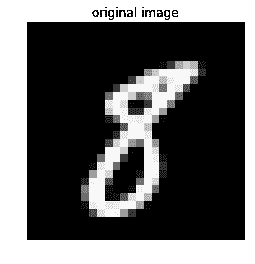
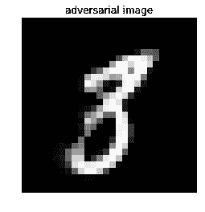
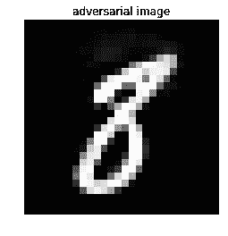

# 第八章：安全与私密的人工智能

机器学习可以帮助我们诊断和对抗癌症，决定哪个学校最适合我们的孩子，甚至做出最聪明的房地产投资。但你只有在能访问私人和个人数据的情况下才能回答这些问题，这就需要一种全新的机器学习方法。这种方法叫做*安全与私密的人工智能*，近年来已经取得了显著进展，正如你在以下食谱中所看到的那样。

本章包含以下食谱：

+   联邦学习

+   加密计算

+   私有深度学习预测

+   测试神经网络的对抗鲁棒性

+   使用 TensorFlow Privacy 的差分隐私

# 技术要求

本章的技术前提如下：

+   TensorFlow Federated

+   Foolbox

+   PyTorch

+   Torchvision

+   TensorFlow Privacy

安装说明、代码和数据集可以在[`github.com/PacktPublishing/Machine-Learning-for-Cybersecurity-Cookbook/tree/master/Chapter08`](https://github.com/PacktPublishing/Machine-Learning-for-Cybersecurity-Cookbook/tree/master/Chapter08)找到。

# 联邦学习

在本食谱中，我们将使用 TensorFlow federated 框架训练一个联邦学习模型。

为了理解联邦学习的价值，考虑你在手机上写短信时使用的*下一个词预测*模型。出于隐私原因，你不希望你的数据，也就是你的短信，发送到中央服务器上用于训练下一个词预测器。但你依然希望有一个准确的下一个词预测算法。该怎么办？这时，联邦学习就派上用场了，这是一种为解决此类隐私问题而开发的机器学习技术。

联邦学习的核心思想是训练数据集由数据的生产者保管，既能保持隐私和所有权，又能用于训练一个集中式模型。这一特点在网络安全领域尤其有吸引力，例如，从多个不同来源收集良性和恶性样本对于创建强大的模型至关重要，但由于隐私问题，这一过程相当困难（例如，良性样本可以是个人或机密文件）。

顺便提一下，联邦学习因数据隐私重要性日益增加而越来越受到关注（例如，GDPR 的实施）。大型公司，如苹果和谷歌，已经开始大量投资这一技术。

# 准备工作

为了准备本食谱，需通过 `pip` 安装 `tensorflow_federated`、`tensorflow_datasets` 和 `tensorflow` 包。命令如下：

```
pip install tensorflow_federated==0.2.0 tensorflow-datasets tensorflow==1.13.1
```

我们将安装这些包的特定版本，以防止代码出现中断。

# 如何操作…

在接下来的步骤中，你将创建两个虚拟数据集环境——一个属于爱丽丝，另一个属于鲍勃——并使用联邦平均算法来保持数据的保密性。

1.  导入 TensorFlow 并启用急切执行：

```
import tensorflow as tf

tf.compat.v1.enable_v2_behavior()
```

1.  准备一个数据集，通过导入 Fashion MNIST 并将其分成 Alice 和 Bob 两个独立环境：

```
import tensorflow_datasets as tfds

first_50_percent = tfds.Split.TRAIN.subsplit(tfds.percent[:50])
last_50_percent = tfds.Split.TRAIN.subsplit(tfds.percent[-50:])

alice_dataset = tfds.load("fashion_mnist", split=first_50_percent)
bob_dataset = tfds.load("fashion_mnist", split=last_50_percent)
```

1.  现在，定义一个`helper`函数将数据类型从整数转换为浮点数：

```
def cast(element):
    """Casts an image's pixels into float32."""
    out = {}
    out["image"] = tf.image.convert_image_dtype(element["image"], dtype=tf.float32)
    out["label"] = element["label"]
    return out
```

1.  然后，定义一个`helper`函数，将数据展平以便输入到神经网络中：

```
def flatten(element):
    """Flattens an image in preparation for the neural network."""
    return collections.OrderedDict(
        [
            ("x", tf.reshape(element["image"], [-1])),
            ("y", tf.reshape(element["label"], [1])),
        ]
    )
```

1.  现在，定义一个`helper`函数来预处理数据：

```
import collections

BATCH_SIZE = 32

def preprocess(dataset):
    """Preprocesses images to be fed into neural network."""
    return dataset.map(cast).map(flatten).batch(BATCH_SIZE)
```

1.  预处理数据：

```
preprocessed_alice_dataset = preprocess(alice_dataset)
preprocessed_bob_dataset = preprocess(bob_dataset)
federated_data = [preprocessed_alice_dataset, preprocessed_bob_dataset]
```

1.  现在，定义一个用于神经网络的`loss`函数：

```
def custom_loss_function(y_true, y_pred):
    """Custom loss function."""
    return tf.reduce_mean(
        tf.keras.losses.sparse_categorical_crossentropy(y_true, y_pred)
    )
```

1.  定义一个函数来实例化一个简单的 Keras 神经网络：

```
from tensorflow.python.keras.optimizer_v2 import gradient_descent

LEARNING_RATE = 0.02
def create_compiled_keras_model():
    """Compiles the keras model."""
    model = tf.keras.models.Sequential(
        [
            tf.keras.layers.Dense(
                10,
                activation=tf.nn.softmax,
                kernel_initializer="zeros",
                input_shape=(784,),
            )
        ]
    )
    model.compile(
        loss=custom_loss_function,
        optimizer=gradient_descent.SGD(learning_rate=LEARNING_RATE),
        metrics=[tf.keras.metrics.SparseCategoricalAccuracy()],
    )
    return model
```

1.  然后，创建一个虚拟样本批次并定义一个函数，从 Keras 模型返回一个联邦学习模型：

```
batch_of_samples = tf.contrib.framework.nest.map_structure(
    lambda x: x.numpy(), iter(preprocessed_alice_dataset).next()
)

def model_instance():
    """Instantiates the keras model."""
    keras_model = create_compiled_keras_model()
    return tff.learning.from_compiled_keras_model(keras_model, batch_of_samples)
```

1.  声明一个联邦平均的迭代过程，并运行一个计算阶段：

```
from tensorflow_federated import python as tff

federated_learning_iterative_process = tff.learning.build_federated_averaging_process(
    model_instance
)
state = federated_learning_iterative_process.initialize()
state, performance = federated_learning_iterative_process.next(state, federated_data)
```

1.  然后，通过运行以下命令显示计算的指标：

```
performance
```

输出结果如下：

```
AnonymousTuple([(sparse_categorical_accuracy, 0.74365), (loss, 0.82071316)])
```

# 它是如何工作的...

我们首先导入 TensorFlow 并启用急切执行模式（*步骤 1*）。通常，在 TensorFlow 中，操作不会立即执行，而是构建一个计算图，并在最后一起执行所有操作。在急切执行模式下，计算会尽可能快地执行。接下来，在*步骤 2*中，我们导入 Fashion MNIST 数据集。这个数据集已经成为 MNIST 的*事实*替代品，相比 MNIST 提供了几项改进（如增加了挑战）。然后，我们将数据集按 50:50 的比例分配给 Alice 和 Bob。接下来，我们定义一个函数，将 Fashion MNIST 的像素值从整数转换为浮点数，以便用于训练神经网络（*步骤 3*），并定义另一个函数将图像展平为单个向量（*步骤 4*）。这样，我们就可以将数据输入到全连接神经网络中。在*步骤 5*和*步骤 6*中，我们使用之前定义的便捷函数对 Alice 和 Bob 的数据集进行预处理。

接下来，我们定义一个适合我们 10 类分类任务的损失函数（*步骤 7*），然后定义我们的 Keras 神经网络以准备训练（*步骤 8*）。在*步骤 9*中，我们创建一个虚拟样本批次并定义一个函数，从 Keras 模型返回一个联邦学习模型。虚拟样本批次指定了模型预期的输入形状。在*步骤 10*中，我们运行一个联邦平均过程的阶段。关于该算法的详细信息，请参阅题为《*从分散数据中高效学习深度网络的通信*》的论文。

从基本层面来看，算法结合了每个客户端数据的局部**随机梯度下降**（**SGD**），然后使用一个执行模型平均的服务器。结果是为客户端（在我们的例子中是 Alice 和 Bob）保留了保密性。最后，在*步骤 11*中，我们观察性能，发现算法确实能够训练并提高准确率，如预期那样。

# 加密计算

在这个配方中，我们将介绍加密计算的基础知识。特别地，我们将重点讲解一种流行的方法，称为安全多方计算。你将学习如何构建一个简单的加密计算器，可以对加密数字进行加法操作。这个配方中的理念将在*私有深度学习预测*配方中派上用场。

# 准备工作

以下配方除了 Python 外没有其他安装要求。

# 如何操作…

1.  导入随机库并选择一个大素数`P`：

```
import random

P = 67280421310721
```

1.  定义一个用于三方的加密函数：

```
def encrypt(x):
    """Encrypts an integer between 3 partires."""
    share_a = random.randint(0, P)
    share_b = random.randint(0, P)
    share_c = (x - share_a - share_b) % P
    return (share_a, share_b, share_c)
```

1.  对一个数值变量进行加密：

```
x = 17
share_a, share_b, share_c = encrypt(x)
print(share_a, share_b, share_c)

16821756678516 13110264723730 37348399908492
```

1.  定义一个函数来解密，给定三个分享份额：

```
def decrypt(share_a, share_b, share_c):
    """Decrypts the integer from 3 shares."""
    return (share_a + share_b + share_c) % P
```

1.  解密加密变量`x`：

```
decrypt(share_a, share_b, share_c)
```

输出如下：

```
17
```

1.  定义一个函数来对两个加密数字进行加法操作：

```
def add(x, y):
    """Addition of encrypted integers."""
    z = list()
    z.append((x[0] + y[0]) % P)
    z.append((x[1] + y[1]) % P)
    z.append((x[2] + y[2]) % P)
    return z
```

1.  对两个加密变量进行加法并解密它们的和：

```
x = encrypt(5)
y = encrypt(9)
decrypt(*add(x, y))

14
```

# 工作原理…

我们从导入随机库开始，*第 1 步*，以便在*第 2 步*中生成随机整数。我们还定义了一个大素数 P，因为我们需要对其进行随机分布模 P 操作。在*第 2 步*中，我们定义了一个函数，通过将整数分割给三个参与方来加密该整数。这里的 x 值在三个参与方之间随机地加法拆分。所有操作都在模 P 的整数域内进行。接下来，在*第 3 步*中，我们展示了使用我们的方法加密整数的结果。在*第 4 步*和*第 5 步*中，我们定义了一个函数来反向加密，即解密，然后证明该操作是可逆的。在*第 6 步*中，我们定义了一个函数来对两个加密数字进行加法操作（！）。请注意，加密加法只是对单个组件进行加法操作，并对结果进行模 P 处理。在*加密深度学习预测*配方中，PySyft 中的`.share(client, server,...)`命令被使用。这个命令实际上和我们在这个配方中使用的加密程序是相同的，所以请记住，这些加密方案使用的是我们在这里讨论的技术。最后，在*第 7 步*中，我们展示了如何在加密实体上进行计算。

# 私有深度学习预测

在许多情况下，A 公司可能拥有一个训练好的模型，并希望将其作为服务提供。然而，A 公司可能不愿分享这个模型，以避免其知识产权被盗用。这个问题的简单解决方法是让客户将数据发送到 A 公司，然后从公司获得预测结果。然而，当客户希望保持数据隐私时，这就成了一个问题。为了解决这个棘手的情况，公司和客户可以利用加密计算。

在这个配方中，你将学习如何与客户共享一个加密的预训练深度学习模型，并允许客户使用加密模型对他们自己的私人数据进行预测。

# 准备工作

这个配方的准备工作包括在`pip`中安装 PyTorch、Torchvision 和 PySyft。命令如下：

```
pip install torch torchvision syft
```

此外，还包括一个名为 `server_trained_model.pt` 的预训练模型，将在此食谱中使用。

# 如何操作……

以下步骤利用 PySyft 模拟客户端-服务器交互，其中服务器拥有一个预训练的深度学习模型，模型被保留为一个黑盒，而客户端希望使用该模型对保密数据进行预测。

1.  导入 `torch` 并访问其数据集：

```
import torch
import torch.nn as nn
import torch.nn.functional as F
from torchvision import datasets, transforms
```

1.  导入 PySyft 并将其挂载到 `torch` 上：

```
import syft as sy

hook = sy.TorchHook(torch)
client = sy.VirtualWorker(hook, id="client")
server = sy.VirtualWorker(hook, id="server")
crypto_provider = sy.VirtualWorker(hook, id="crypto_provider")
```

1.  定义一个简单的神经网络：

```
class Net(nn.Module):
    def __init__(self):
        super(Net, self).__init__()
        self.fc1 = nn.Linear(784, 500)
        self.fc2 = nn.Linear(500, 10)

    def forward(self, x):
        x = x.view(-1, 784)
        x = self.fc1(x)
        x = F.relu(x)
        x = self.fc2(x)
        return x
```

1.  实例化模型并加载其在 MNIST 上训练的预训练权重：

```
model = Net()
model.load_state_dict(torch.load("server_trained_model.pt"))
model.eval()
```

1.  加密 `client` 和 `server` 之间的网络：

```
model.fix_precision().share(client, server, crypto_provider=crypto_provider)
```

1.  定义一个 MNIST 数据的加载器：

```
test_loader = torch.utils.data.DataLoader(
    datasets.MNIST(
        "data",
        train=False,
        download=True,
        transform=transforms.Compose(
            [transforms.ToTensor(), transforms.Normalize((0.1307,), (0.3081,))]
        ),
    ),
    batch_size=64,
    shuffle=True,
)
```

1.  定义一个私有加载器，利用 MNIST 数据的加载器：

```
private_test_loader = []
for data, target in test_loader:
    private_test_loader.append(
        (
            data.fix_precision().share(client, server, crypto_provider=crypto_provider),
            target.fix_precision().share(
                client, server, crypto_provider=crypto_provider
            ),
        )
    )
```

1.  定义一个函数来评估私有测试集：

```
def test(model, test_loader):
    """Test the model."""
    model.eval()
    n_correct_priv = 0
    n_total = 0
```

1.  遍历私密数据，使用模型进行预测，解密结果，然后打印出来：

```
    with torch.no_grad():
        for data, target in test_loader:
            output = model(data)
            pred = output.argmax(dim=1)
            n_correct_priv += pred.eq(target.view_as(pred)).sum()
            n_total += 64
            n_correct = 
            n_correct_priv.copy().get().float_precision().long().item()
            print(
                "Test set: Accuracy: {}/{} ({:.0f}%)".format(
                    n_correct, n_total, 100.0 * n_correct / n_total
                )
            )
```

1.  执行测试过程：

```
test(model, private_test_loader)
```

结果如下：

```
Test set: Accuracy: 63/64 (98%)
Test set: Accuracy: 123/128 (96%)
Test set: Accuracy: 185/192 (96%)
Test set: Accuracy: 248/256 (97%)
Test set: Accuracy: 310/320 (97%)
Test set: Accuracy: 373/384 (97%)
Test set: Accuracy: 433/448 (97%)
<snip>
Test set: Accuracy: 9668/9920 (97%)
Test set: Accuracy: 9727/9984 (97%)
Test set: Accuracy: 9742/10048 (97%)
```

# 它是如何工作的……

我们首先导入 `torch` 及其数据集，和一些相关库（*步骤 1*）。然后我们导入 `pysyft` 并将其挂载到 `torch` 上（*步骤 2*）。我们还为客户端和服务器创建虚拟环境，以模拟数据的真实隔离。在此步骤中，`crypto_provider` 作为一个可信的第三方，用于加密和解密。接着在 *步骤 3* 中，我们定义一个简单的神经网络，并在 *步骤 4* 中加载它的预训练权重。请注意，在 *步骤 5* 中，以及一般来说，每当使用 `.share(...)` 命令时，你应该将共享的对象视为已加密，并且只有在所有相关方的协助下才能解密。特别地，在 *步骤 9* 中，测试函数执行加密评估；模型的权重、数据输入、预测和用于评分的目标都是加密的。然而，为了验证模型是否正常工作，我们解密并显示其准确性。在 *步骤 5* 中，我们加密网络，确保只有在服务器和客户端协作时，才能解密网络。

在接下来的两个步骤中，我们为 MNIST 数据定义常规和私有加载器。常规加载器仅加载 MNIST 数据，而私有加载器加密常规加载器的输出。在 *步骤 8* 和 *步骤 9* 中，我们定义了一个 `helper` 函数来评估私有测试集。在该函数中，我们遍历私有数据，使用模型进行预测，解密结果，然后打印出来。最后，我们应用 *步骤 8* 和 *步骤 9* 中定义的函数，以确保模型在保护隐私的同时能够良好地执行。

# 测试神经网络的对抗鲁棒性

对神经网络进行对抗性攻击的研究揭示了它们对对抗性扰动的惊人敏感性。即使是最准确的神经网络，在没有防护的情况下，也已被证明容易受到单像素攻击和对人眼不可见的噪声干扰的影响。幸运的是，近期该领域的进展已提供了解决方案，帮助神经网络抵御各种对抗性攻击。其中一种解决方案是名为**综合分析**（**ABS**）的神经网络设计。该模型背后的主要思想是它是一个贝叶斯模型。模型不仅直接预测给定输入的标签，还利用**变分自编码器**（**VAEs**）学习类条件样本分布。更多信息请访问[`arxiv.org/abs/1805.09190`](https://arxiv.org/abs/1805.09190)。

在这个教程中，你将加载一个预训练的 ABS 网络用于 MNIST，并学习如何测试神经网络的对抗性鲁棒性。

# 正在准备中

以下教程已在 Python 3.6 中测试过。准备这个教程需要在`pip`中安装 Pytorch、Torchvision、SciPy、Foolbox 和 Matplotlib 包。命令如下：

```
pip install torch torchvision scipy foolbox==1.8 matplotlib
```

# 如何实现...

在接下来的步骤中，我们将加载一个预训练的 ABS 模型和一个传统的 CNN 模型用于 MNIST。我们将使用 Foolbox 攻击这两个模型，以查看它们在防御对抗性攻击方面的表现：

1.  首先导入一个预训练的 ABS 模型：

```
from abs_models import models
from abs_models import utils

ABS_model = models.get_VAE(n_iter=50)
```

1.  定义一个`convenience`函数，使用模型预测一批 MNIST 图像：

```
import numpy as np

def predict_on_batch(model, batch, batch_size):
    """Predicts the digits of an MNIST batch."""
    preds = []
    labels = []
    for i in range(batch_size):
        point, label = utils.get_batch()
        labels.append(label[0])
        tensor_point = utils.n2t(point)
        logits = model(tensor_point)[0]
        logits = [x for x in logits]
        pred = np.argmax(logits)
        preds.append(int(pred))
    return preds, labels
```

1.  对一批数据进行预测：

```
batch = utils.get_batch()
preds, labels = predict_on_batch(ABS_model, batch, 5)
print(preds)
print(labels)
```

结果如下：

```
[4, 4, 9, 1, 8]
[4, 4, 9, 1, 8]
```

1.  使用 Foolbox 包装模型，以启用对抗性测试：

```
import foolbox

if ABS_model.code_base == "tensorflow":
    fmodel = foolbox.models.TensorFlowModel(
        ABS_model.x_input, ABS_model.pre_softmax, (0.0, 1.0), channel_axis=3
    )
elif ABS_model.code_base == "pytorch":
    ABS_model.eval()
    fmodel = foolbox.models.PyTorchModel(
        ABS_model, bounds=(0.0, 1.0), num_classes=10, device=utils.dev()
    )
```

1.  从 Foolbox 导入攻击库并选择一个 MNIST 图像：

```
from foolbox import attacks

images, labels = utils.get_batch(bs=1)
```

1.  选择攻击类型，在本例中为边界攻击：

```
attack = attacks.DeepFoolL2Attack(fmodel)
metric = foolbox.distances.MSE
criterion = foolbox.criteria.Misclassification()
```

1.  使用 Matplotlib 显示原始图像及其标签：

```
from matplotlib import pyplot as plt
%matplotlib inline

plt.imshow(images[0, 0], cmap="gray")
plt.title("original image")
plt.axis("off")
plt.show()
```

生成的图像如下：



1.  使用 Foolbox 查找对抗性实例：

```
gradient_estimator = foolbox.gradient_estimators.CoordinateWiseGradientEstimator(0.1)
fmodel = foolbox.models.ModelWithEstimatedGradients(fmodel, gradient_estimator)

adversary = foolbox.adversarial.Adversarial(
    fmodel, criterion, images[0], labels[0], distance=metric
)
attack(adversary)
```

1.  显示发现的对抗性样本：

```
plt.imshow(a.image[0], cmap="gray")
plt.title("adversarial image")
plt.axis("off")
plt.show()
print("Model prediction:", np.argmax(fmodel.predictions(adversary.image)))
```

生成的对抗性图像如下：



1.  实例化一个在 MNIST 上训练的传统 CNN 模型：

```
from abs_models import models

traditional_model = models.get_CNN()
```

模型架构如下：

```
CNN(
  (net): NN(
    (conv_0): Conv2d(1, 20, kernel_size=(5, 5), stride=(1, 1))
    (bn_0): BatchNorm2d(20, eps=1e-05, momentum=0.1, affine=True, track_running_stats=True)
    (nl_0): ELU(alpha=1.0)
    (conv_1): Conv2d(20, 70, kernel_size=(4, 4), stride=(2, 2))
    (bn_1): BatchNorm2d(70, eps=1e-05, momentum=0.1, affine=True, track_running_stats=True)
    (nl_1): ELU(alpha=1.0)
    (conv_2): Conv2d(70, 256, kernel_size=(3, 3), stride=(2, 2))
    (bn_2): BatchNorm2d(256, eps=1e-05, momentum=0.1, affine=True, track_running_stats=True)
    (nl_2): ELU(alpha=1.0)
    (conv_3): Conv2d(256, 10, kernel_size=(5, 5), stride=(1, 1))
  )
  (model): NN(
    (conv_0): Conv2d(1, 20, kernel_size=(5, 5), stride=(1, 1))
    (bn_0): BatchNorm2d(20, eps=1e-05, momentum=0.1, affine=True, track_running_stats=True)
    (nl_0): ELU(alpha=1.0)
    (conv_1): Conv2d(20, 70, kernel_size=(4, 4), stride=(2, 2))
    (bn_1): BatchNorm2d(70, eps=1e-05, momentum=0.1, affine=True, track_running_stats=True)
    (nl_1): ELU(alpha=1.0)
    (conv_2): Conv2d(70, 256, kernel_size=(3, 3), stride=(2, 2))
    (bn_2): BatchNorm2d(256, eps=1e-05, momentum=0.1, affine=True, track_running_stats=True)
    (nl_2): ELU(alpha=1.0)
    (conv_3): Conv2d(256, 10, kernel_size=(5, 5), stride=(1, 1))
  )
)
```

1.  执行合理性检查，确保模型按预期运行：

```
preds, labels = predict_on_batch(traditional_model, batch, 5)
print(preds)
print(labels)
```

输出结果如下：

```
[7, 9, 5, 3, 3]
[7, 9, 5, 3, 3]
```

1.  使用 Foolbox 包装传统模型：

```
if traditional_model.code_base == "tensorflow":
    fmodel_traditional = foolbox.models.TensorFlowModel(
        traditional_model.x_input,
        traditional_model.pre_softmax,
        (0.0, 1.0),
        channel_axis=3,
    )
elif traditional_model.code_base == "pytorch":
    traditional_model.eval()
    fmodel_traditional = foolbox.models.PyTorchModel(
        traditional_model, bounds=(0.0, 1.0), num_classes=10, device=u.dev()
    )
```

1.  攻击传统 CNN 模型：

```
fmodel_traditional = foolbox.models.ModelWithEstimatedGradients(fmodel_traditional, GE)

adversarial_traditional = foolbox.adversarial.Adversarial(
    fmodel_traditional, criterion, images[0], labels[0], distance=metric
)
attack(adversarial_traditional)
```

1.  显示发现的对抗性样本：

```
plt.imshow(adversarial_traditional.image[0], cmap="gray")
plt.title("adversarial image")
plt.axis("off")
plt.show()
print(
    "Model prediction:",
    np.argmax(fmodel_traditional.predictions(adversarial_traditional.image)),
)
```

生成的对抗性图像如下：



# 它是如何工作的...

我们首先导入一个预训练的 ABS 模型（*步骤 1*）。在*步骤 2*和*步骤 3*中，我们定义了一个`convenience`函数，用于预测一批 MNIST 图像并验证模型是否正常工作。接下来，我们使用 Foolbox 包装模型，为测试其对抗鲁棒性做准备（*步骤 4*）。请注意，Foolbox 可以通过相同的 API 攻击 TensorFlow 或 PyTorch 模型，一旦被包装。太棒了！在*步骤 5*中，我们选择了一张 MNIST 图像作为攻击的媒介。为了明确，这张图像会被调整和变形，直到结果能欺骗模型。在*步骤 6*中，我们选择了要实施的攻击类型。我们选择了边界攻击，这是一种基于决策的攻击，从一个大的对抗扰动开始，然后逐渐减小扰动，同时保持对抗性。这种攻击需要很少的超参数调整，因此无需替代模型或梯度计算。有关基于决策的攻击的更多信息，请参考[`arxiv.org/abs/1712.04248`](https://arxiv.org/abs/1712.04248)。

此外，请注意，这里使用的度量标准是**均方误差**（**MSE**），它用于衡量对抗样本与原始图像之间的接近程度。使用的标准是误分类，意味着一旦目标模型误分类了图像，搜索就会停止。替代标准可能包括置信度或特定类型的误分类。在*步骤 7-9*中，我们展示了原始图像以及从其生成的对抗样本。在接下来的两步中，我们实例化一个标准的 CNN 并验证它是否正常工作。在*步骤 12-14*中，我们在标准 CNN 上重复之前步骤中的攻击。通过查看结果，我们可以看出，该实验强烈表明，ABS 模型在对抗扰动方面比普通的 CNN 更具鲁棒性。

# 使用 TensorFlow Privacy 的差分隐私

TensorFlow Privacy ([`github.com/tensorflow/privacy`](https://github.com/tensorflow/privacy)) 是 TensorFlow 家族中的一个相对较新的成员。这个 Python 库包括用于训练具有*差分隐私*的机器学习模型的 TensorFlow 优化器的实现。一个经过差分隐私训练的模型，在从其数据集中删除任何单一训练实例时，不会发生非平凡的变化。差分隐私（近似值）使用*epsilon*和*delta*来量化，衡量模型对单个训练示例变化的敏感性。使用 Privacy 库的方法很简单，只需包装常见的优化器（例如 RMSprop、Adam 和 SGD）即可将它们转换为差分隐私版本。这个库还提供了方便的工具来衡量隐私保证、epsilon 和 delta。

在这个教程中，我们将展示如何使用 Keras 和 TensorFlow Privacy 实现并训练一个用于 MNIST 的差分隐私深度神经网络。

# 准备工作

本教程的准备工作包括安装 Keras 和 TensorFlow。相关命令如下：

```
pip install keras tensorflow
```

TensorFlow Privacy 的安装说明可以在 [`github.com/tensorflow/privacy`](https://github.com/tensorflow/privacy) 找到。

# 如何实现...

1.  开始时定义几个便捷函数来预处理 MNIST 数据集：

```
import tensorflow as tf

def preprocess_observations(data):
    """Preprocesses MNIST images."""
    data = np.array(data, dtype=np.float32) / 255
    data = data.reshape(data.shape[0], 28, 28, 1)
    return data

def preprocess_labels(labels):
    """Preprocess MNIST labels."""
    labels = np.array(labels, dtype=np.int32)
    labels = tf.keras.utils.to_categorical(labels, num_classes=10)
```

1.  编写一个便捷函数来加载 MNIST 数据集：

```
def load_mnist():
    """Loads the MNIST dataset."""
    (X_train, y_train), (X_test, y_test) = tf.keras.datasets.mnist.load_data()
    X_train = preprocess_observations(X_train)
    X_test = preprocess_observations(X_test)
    y_train = preprocess_labels(y_train)
    y_test = preprocess_labels(y_test)
    return X_train, y_train, X_test, y_test
```

1.  加载 MNIST 数据集：

```
import numpy as np

X_train, y_train, X_test, y_test = load_mnist()
```

训练集大小为 60k，测试集大小为 10k。

4. 导入差分隐私优化器并定义几个控制学习率和差分隐私程度的参数：

```
from privacy.optimizers.dp_optimizer import DPGradientDescentGaussianOptimizer

optimizer = DPGradientDescentGaussianOptimizer(
    l2_norm_clip=1.0, noise_multiplier=1.1, num_microbatches=250, learning_rate=0.15
)
loss = tf.keras.losses.CategoricalCrossentropy(
    from_logits=True, reduction=tf.losses.Reduction.NONE
)
```

1.  为了衡量隐私性，定义一个函数来计算 epsilon：

```
from privacy.analysis.rdp_accountant import compute_rdp
from privacy.analysis.rdp_accountant import get_privacy_spent

def compute_epsilon(steps):
    """Compute the privacy epsilon."""
    orders = [1 + x / 10.0 for x in range(1, 100)] + list(range(12, 64))
    sampling_probability = 250 / 60000
    rdp = compute_rdp(
        q=sampling_probability, noise_multiplier=1.1, steps=steps, orders=orders
    )
    return get_privacy_spent(orders, rdp, target_delta=1e-5)[0]
```

1.  为 MNIST 定义一个标准的 Keras CNN：

```
NN_model = tf.keras.Sequential(
    [
        tf.keras.layers.Conv2D(
            16, 8, strides=2, padding="same", activation="relu", input_shape=(28, 28, 1)
        ),
        tf.keras.layers.MaxPool2D(2, 1),
        tf.keras.layers.Conv2D(32, 4, strides=2, padding="valid", activation="relu"),
        tf.keras.layers.MaxPool2D(2, 1),
        tf.keras.layers.Flatten(),
        tf.keras.layers.Dense(32, activation="relu"),
        tf.keras.layers.Dense(10),
    ]
)
```

1.  编译 `model`：

```
NN_model.compile(optimizer=optimizer, loss=loss, metrics=["accuracy"])
```

1.  拟合并测试 `model`：

```
NN_model.fit(
    X_train, y_train, epochs=1, validation_data=(X_test, y_test), batch_size=250
)
```

1.  计算 `epsilon` 值，即隐私性的度量：

```
eps = compute_epsilon(1 * 60000 // 250)
```

# 它是如何工作的...

我们从 *步骤 1-3* 开始，准备并加载 MNIST 数据集。接下来，在 *步骤 4* 中，我们导入 `DPGradientDescentGaussianOptimizer`，这是一种优化器，使模型具备差分隐私。此阶段使用了多个参数，并且这些参数有待进一步解释。`l2_norm_clip` 参数表示在每个小批量数据点的训练过程中，每个梯度的最大范数。该参数限制了优化器对单个训练点的敏感度，从而使模型朝着差分隐私的方向发展。`noise_multiplier` 参数控制向梯度中添加的随机噪声量。通常，噪声越多，隐私性越强。完成此步骤后，在 *步骤 5* 中，我们定义一个计算差分隐私的 epsilon-delta 定义的 epsilon 值的函数。我们在 *步骤 6* 中实例化一个标准的 Keras 神经网络，*步骤 7* 中编译它，然后使用差分隐私优化器在 MNIST 上训练它 (*步骤 8*)。最后，在 *步骤 9* 中，我们计算 epsilon 的值，该值衡量模型的差分隐私程度。本教程的典型 epsilon 值大约为 1。
