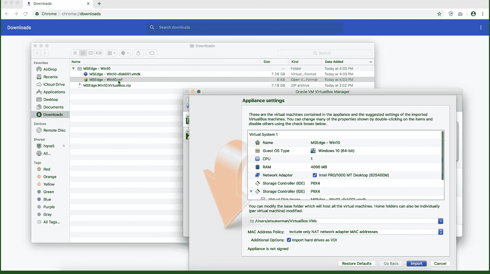

# 附录

在本章中，我们为读者提供了一份创建基础设施的指南，以应对机器学习在网络安全数据中的挑战。特别是，我们提供了设置虚拟实验室环境的操作步骤，以便进行安全有效的恶意软件分析。我们还提供了使用虚拟 Python 环境的指南，允许用户在避免包冲突的同时无缝地进行不同的 Python 项目工作。

本章将介绍以下操作：

+   设置虚拟实验室环境

+   使用 Python 虚拟环境

# 设置虚拟实验室环境

为了保护自己和网络，在处理和分析恶意软件时采取预防措施是至关重要的。最好的方法之一是设置一个隔离的*虚拟实验室环境*。虚拟实验室环境由一个或多个**虚拟机**（**VM**）组成，并且在一个隔离的网络中。隔离网络可以防止恶意软件通过网络传播，虽然这会牺牲一些更真实的恶意软件行为。

# 准备工作

为了准备这个操作，请执行以下步骤：

1.  安装虚拟机监控程序。

虚拟机监控程序是允许你控制虚拟机的软件。一个实例是 VirtualBox，可以免费下载，[`www.virtualbox.org/`](https://www.virtualbox.org/)：


1.  下载虚拟镜像。

虚拟镜像是虚拟机的模板。可以在[`developer.microsoft.com/en-us/microsoft-edge/tools/vms/`](https://developer.microsoft.com/en-us/microsoft-edge/tools/vms/)找到多个 Windows 虚拟镜像：


# 如何操作...

以下步骤将指导你设置和使用一个简单的虚拟实验室环境：

1.  使用虚拟镜像创建虚拟机。

打开虚拟机镜像时，你的屏幕应该看起来像这样：



1.  配置虚拟机的性能和安全性。例如，你可以将其完全从网络中断开。

以下截图展示了如何将虚拟机从网络中断开：


1.  创建一个快照。

你可以在这里查看哪个菜单选项允许你创建快照：


1.  （可选）在虚拟机中引爆并分析恶意软件。

例如，我在我的虚拟机中运行了勒索软件，如下所示：


1.  （可选）将虚拟机恢复到之前的快照。

按下恢复按钮，如下所示：


# 工作原理...

我们通过创建一个虚拟机（*步骤 1*）开始了本章节的操作。虚拟机的创建取决于提供镜像的格式。对于引用的虚拟镜像，双击 `.ovf` 文件即可设置虚拟机。有时，你可能需要创建一个全新的操作系统安装，并挂载虚拟镜像。接下来，在*步骤 2*中，我们为恶意软件分析配置了虚拟机。有几个配置更改你可能需要进行。这些包括设置基础内存、处理器数量、视频内存和虚拟光驱；选择合适的网络设置；以及创建共享文件夹。

完成此操作后，在*步骤 3*中，我们保存了一个快照，允许我们保存所有重要的状态信息。快照的一个优点是，它们使用户能够轻松地回滚对虚拟机所做的更改。因此，如果你犯了错误，没关系——只需恢复到先前的快照即可。接下来，在*步骤 4*中，我们在虚拟机中引爆了恶意软件。我们建议在此步骤中要小心，并且仅在你知道自己在做什么的情况下进行操作。在这种情况下，你将在本书的仓库中找到一份恶意软件数据集。最后，在*步骤 5*中，我们点击了 VirtualBox 中的恢复按钮，将虚拟机恢复到创建快照时的状态。

最后，我们向 Yasser Ali 表示感谢，他提供了以下建议：在 macOS 上安装 VirtualBox 时，用户应该为 Adobe 软件设置安全例外，以使用安全设置。

# 使用 Python 虚拟环境

假设你有两个项目——项目 A 和项目 B——它们的 Python 库需求相互冲突。例如，项目 A 需要 scikit-learn 版本 0.21，而项目 B 需要 scikit-learn 版本 >0.22。或者，也许一个项目需要 Python 3.6，而另一个项目需要 Python 3.7。你可以在从一个项目切换到另一个项目时卸载并重新安装相应的库或 Python 版本，但这样做既繁琐又不现实。为了解决依赖冲突问题，我们推荐使用 Python 虚拟环境。在本章节中，你将看到如何使用 Python 虚拟环境。

# 准备就绪

虚拟环境模块 `venv` 包含在 Python 3.3 及更高版本的标准库中。

# 如何操作...

创建并激活虚拟 Python 环境，请按照以下步骤操作：

1.  在终端中，运行以下命令：

```
python -m venv "name-of-your-environment"
```

1.  在 Linux 或 macOS 终端中，运行以下命令：

```
source "name-of-your-environment"/bin/activate
```

在 Windows 上，运行此命令：

```
"name-of-your-environment"/Scripts/activate.bat
```

1.  安装所需的包。

# 工作原理...

我们从*第一步*开始，创建了一个虚拟的 Python 环境。`-m`标志表示要使用的模块，在这个例子中是`venv`。接下来，在*第二步*中，我们激活了我们的 Python 环境，这样我们就可以使用它并进行更改。请注意，Python 环境的文件夹结构在 Windows 上与 Linux 或 Mac 上有所不同。一个标志，表明该环境当前是激活状态的，是在终端中看到环境的名称，如下所示：

```
("name-of-your-environment")
```

在*第三步*中，您可以像往常一样安装包，如下面这个例子：

```
pip install numpy
```

并且放心，这不会影响您在该环境外的包。太棒了！
