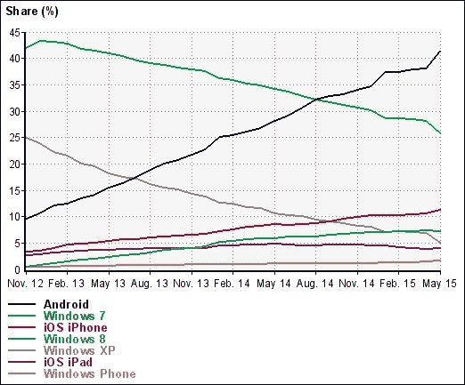
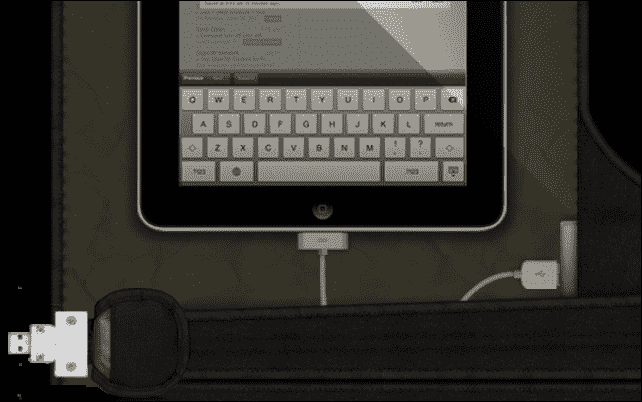

# 第一章：介绍移动取证

现今的智能手机使用频率较低的是打电话，更多的是用于社交；这使得智能手机存储了大量关于用户的敏感数据。移动设备保存了用户来自各种来源的联系人信息（包括电话、社交网络、即时消息和通讯应用），电话记录、发送和接收的短信、电子邮件及附件。还有浏览器日志和缓存的地理定位信息；用手机相机拍摄的照片和视频；云服务、论坛、社交网络、在线门户和购物网站的密码；存储的支付数据；以及许多对调查至关重要的其他信息。

不用说，这些信息对企业和取证调查来说非常重要。在本书中，我们将讨论不仅仅是*如何*获取所有这些数据，还包括在每个具体案件中可能会涉及到*什么*类型的数据。

平板电脑不再仅仅作为娱乐设备使用。配备强大处理器和充足存储空间，即使是最小的平板电脑也能够运行完整的 Windows 系统，并且带有 Office 办公套件。虽然平板电脑的使用量不如智能手机，但它们仍然广泛用于社交、通讯、计划活动和预订旅行。

一些智能手机配备了高达 6.4 英寸的大屏幕，而许多平板电脑则具备通过移动网络拨打语音电话的功能。这一切使得很难界定手机（或大屏手机）与平板电脑之间的界限。

市面上的每一部智能手机都配备有一部相机，和体积较大的（可能更好的）相机不同，它始终可以随时使用。因此，普通智能手机所包含的照片和视频比专用相机还要多，有时甚至是几个 GB 的图像和视频片段。

智能手机还是存储设备。它们可以被用来（并且已经在被用来）存储、携带和交换信息。连接到公司网络的智能手机可能访问到一些本不该暴露的文件和文档。员工的智能手机对公司网络的未经控制的访问可能（并且确实会）导致高度敏感信息的泄露。员工流动频繁，许多公司允许甚至鼓励*自带设备*政策，因此控制连接到公司网络的设备所能访问的数据至关重要。

# 为什么我们需要移动取证

移动取证的重要性不容低估。早在 2012 年，超过 70%的网页请求来自桌面和笔记本电脑（Windows 7 和 Windows XP 是最受欢迎的操作系统）。到 2015 年 5 月，只有 43%的请求来自桌面操作系统，而 54%的流量来自 Android、iOS 和 Windows 手机设备。如果你看一下下面的图表，趋势非常明显——用户在桌面计算机上花费的时间比例在下降，而移动设备的使用比例在上升：

不同操作系统的访问者数量（来源：http://www.liveinternet.ru/)

2015 年初，苹果公司宣布其已售出超过十亿部 iOS 设备。仅在 2015 年第一季度，公司就售出了 7440 万部 iPhone。安卓设备在 2014 年早些时候就达到了十亿台的销量。

智能手机和平板在与个人计算机争夺用户注意力方面取得了成功。它们有效地取代了数码相机、摄像机、电子书阅读器、报纸、通讯和导航设备、便携游戏机，甚至电视。据 Flurry 报告（[`flurrymobile.tumblr.com/post/115194107130/mobile-to-television-we-interrupt-this-broadcast#.VGukrIvF_Ex`](http://flurrymobile.tumblr.com/post/115194107130/mobile-to-television-we-interrupt-this-broadcast#.VGukrIvF_Ex)），消费者在移动设备上的花费时间已超过电视：

移动设备与电视（来源：Flurry）

由于在移动设备上花费的时间如此之多，而且可用的活动范围如此广泛，智能手机和平板积累了比我们想象中更多的用户信息。提取这些信息、分析数据并将其转化为可靠证据是数字调查员的主要目标。

# 可用信息

与基本呈现单一信息源的个人计算机（设备本身由硬盘和易失性内存组成）不同，移动取证涉及多个数据源。根据可用的数据源，调查人员可能会使用不同的工具来获取信息。

## 移动设备

如果你可以访问移动设备，你可以尝试执行物理或逻辑获取。根据设备本身（硬件）和运行的操作系统，这可能是可行的，也可能不可行。然而，物理获取仍然被认为是所有可用证据中最完整和最新的来源。

一般来说，大多数安卓智能手机和平板、较旧的苹果硬件（iPhone 4 及之前型号、原版 iPad、iPad mini 等）以及具有已知密码的最新苹果硬件都可以进行物理获取。作为规则，只有越狱后的苹果设备才能进行物理获取。由于越狱是通过利用 iOS 中的漏洞获得超级用户权限，而苹果公司会积极修复这些漏洞，因此 iOS 设备的物理获取依然存在不确定性。最近，Cellebrite **通用取证提取设备** (**UFED**)已经为一些 Windows 手机设备开发了物理获取技术。

物理采集也适用于 64 位 Apple 硬件（如 iPhone 5S 及更新机型、iPad mini 2 等）。值得注意的是，64 位设备的物理采集比旧款 32 位硬件更为严格，因为它不仅需要越狱设备并通过密码解锁，还需要从安全设置中移除该密码。有趣的是，按照 Apple 的说法，即便是 Apple 自己，也无法从运行 iOS 8 及更新版本的 64 位 iOS 设备中提取信息，即使他们持有法院命令。

物理采集仅适用于运行 BlackBerry OS 7 及更早版本的少数 BlackBerry 智能手机。对于 BlackBerry 智能手机，物理采集适用于解锁的 BlackBerry 7 及更低版本设备（如果支持），可以通过 Cellebrite UFED Touch/4PC 采用引导加载程序方法进行。对于未启用设备加密的 BlackBerry 10 设备，使用 Cellebrite UFED 通过芯片拆卸法可以成功提取设备内存。

### 注意

你可以在这里了解更多关于上述方法的信息：*BlackBerry 法医 - 从 BlackBerry 设备进行物理提取和解码*（Cellebrite）-[`www.cellebrite.com/Pages/blackberry-forensics-physical-extraction-and-decoding-from-blackberry-devices`](http://www.cellebrite.com/Pages/blackberry-forensics-physical-extraction-and-decoding-from-blackberry-devices)。

## 个人电脑

值得注意的是，用户的个人电脑可以帮助获取移动设备的证据。PC 可能包含手机的离线数据备份（例如由 Apple iTunes 生成的备份），这些备份包含手机中存储的大部分信息，并且这些信息在物理获取过程中可能是可用的（或不可用的）。

当 iOS 设备通过物理连接与电脑连接并通过 iTunes 授权时，会创建锁定记录。锁定记录可用于在不输入密码的情况下访问 iOS 设备。此外，电脑中可能包含二进制认证令牌，能够用来访问与用户移动设备关联的相应云账户。

## 云存储

许多智能手机和平板电脑，尤其是 Apple 生产的设备，提供将信息备份到在线云的功能。例如，Apple 智能手机每次连接到充电器并且处于已知 Wi-Fi 网络范围内时，会自动将其内容备份到 Apple iCloud。Windows 手机设备表现出类似的行为。虽然 Google 并不像 Apple 或 Microsoft 那样提供完整的云备份，但通过 **Google 移动服务**（**GMS**）收集并保留更多的信息，这些信息也可以从云中提取。

由于云备份是透明的、无侵入性的，并且不需要用户互动，许多智能手机用户默认启用云备份，这使得调查人员可以通过获取云存储内容或根据法院命令向相关公司请求这些内容。

为了成功访问手机的云存储，必须知道用户的认证凭证（登录和密码）。也许可以通过从用户计算机提取的二进制认证令牌访问 iCloud。

随着制造商在安全实施方面的快速发展，云取证在数字取证专家中正迅速获得重要性和认可。

# 移动取证的阶段

本节将简要讨论移动取证的一般阶段，并不打算提供每个阶段的详细解释。互联网上有足够的文档可以轻松访问，提供了关于移动取证阶段的详细信息。然而，为了帮助读者进行初步查询，以下资源是进一步阅读的强烈推荐：

+   *移动设备取证的过程* (*Cynthia A. Murphy*): [`digital-forensics.sans.org/media/mobile-device-forensic-process-v3.pdf`](https://digital-forensics.sans.org/media/mobile-device-forensic-process-v3.pdf)

+   *移动设备取证指南* - **美国国家标准与技术研究院** (**NIST**): [`nvlpubs.nist.gov/nistpubs/SpecialPublications/NIST.SP.800-101r1.pdf`](http://nvlpubs.nist.gov/nistpubs/SpecialPublications/NIST.SP.800-101r1.pdf)

+   *移动设备取证：从 A 到 Z* (*Sam Brothers*): [`www.nist.gov/forensics/upload/2-Brothers-NIST-2014_Slides-23-Pages-2.pdf`](http://www.nist.gov/forensics/upload/2-Brothers-NIST-2014_Slides-23-Pages-2.pdf)

+   计算机电子证据良好实践指南（第 45-51 页）：[https://www.cps.gov.uk/legal/assets/uploads/files/ACPO_guidelines_computer_evidence[1].pdf](https://www.cps.gov.uk/legal/assets/uploads/files/ACPO_guidelines_computer_evidence[1].pdf)

读者需要理解的最重要概念是：在所有阶段中，对移动设备的影响要尽可能小。换句话说，检查员应首先考虑从最不干扰到最干扰的方法，这可以根据需要从移动设备中获取的数据类型以及移动设备的硬件/软件复杂性来决定。

## 阶段 1 - 设备扣押

这一阶段涉及设备的物理扣押，使其处于调查员/检查员的控制和保管之下。同时还需要考虑扣押、提取和搜索这些数据的合法授权或书面同意。

应记录设备在被扣押时的物理状态，理想情况下通过数字照片记录和书面笔记进行记录，例如：

+   设备是否损坏？如果是，请记录损坏类型。

+   设备是开机还是关机？

+   如果设备开机，设备的日期和时间是什么？

+   如果设备开机，设备桌面上正在运行或可观察到的应用程序是什么？

+   如果设备开机，是否可以访问设备桌面以检查密码和安全设置？

设备扣押的其他几个方面如下所述，它们将影响扣押后的分析：无线电隔离、设备开机时是否需要关闭、远程清除、以及反取证。

### 扣押 - 我们应该扣押什么以及如何扣押？

在正确获取移动设备时，必须注意计算机和移动设备操作方式的差异。扣押、处理、存储和提取移动设备必须采取与台式机甚至笔记本电脑不同的方法。

与可以处于在线或离线状态（包括节能模式，如睡眠和休眠）的 PC 不同，智能手机和平板电脑采用的是一种始终在线的工作模式。即使设备看似在*休眠*，后台仍会进行大量活动。这些活动可以通过调度或由大量事件触发，包括来自在线服务的推送事件和由用户远程发起的事件。

另一个在获取移动设备时需要考虑的因素是安全性。移动设备经常被携带，并且它们被设计得比台式 PC 更安全。不可拆卸的存储、焊接的 RAM 芯片、可选或强制的数据加密、远程*销毁开关*、安全的锁屏和锁定的引导加载程序仅是其中的一些安全措施。

### 法拉第包的使用

**法拉第包**通常用于暂时存放被扣押的设备，而不关闭电源。法拉第包可以阻挡设备与蜂窝网络、Wi-Fi、蓝牙、卫星导航以及其他移动设备使用的无线电频率的连接。法拉第包通常设计为屏蔽本地蜂窝运营商和卫星导航使用的无线频率范围（通常为 700-2,600 MHz），以及 Wi-Fi 网络和蓝牙使用的 2.4-5 GHz 频段。许多法拉第包采用特殊涂层的金属屏蔽材料，能够阻挡广泛的无线电频率。

一个简单的没有充电接口的法拉第包

### 保持设备开机

在处理被扣押的设备时，必须防止设备关机。确保设备始终开机是一方面，防止其关闭是另一方面。由于移动设备即使在屏幕关闭时仍然会消耗电力，因此标准做法是将设备连接到充电器，并将其放入一个无线信号屏蔽的法拉第包中。这样可以防止设备在电量不足时自动关机。

一个配备充电接口的高级法拉第包

我们为什么需要这个过程呢？实际上，相比于一个在实验室启动且你不知道密码的设备，你可能能够从一个至少被解锁过一次的设备中提取到更多信息。

为了说明潜在的结果，假设你扣押了一台被未知密码锁定的 iPhone。这台 iPhone 恰好是越狱的，因此你可以尝试使用**Elcomsoft iOS Forensic Toolkit**来提取信息（请参见第四章，*安卓设备获取的实际步骤*）。

如果设备被锁定且你不知道密码，你只能访问一组非常有限的数据：

+   最近的地理位置信息：由于主位置数据库仍然是加密的，因此只能提取有限的位置信息。只有当设备在启动完成后至少解锁过一次时，才可以访问这些有限的位置信息。因此，如果你保持设备开机状态，你可能会从设备中获取到最近的地理位置历史记录。然而，如果设备关闭并且只在实验室开机，地理位置数据将无法访问，直到设备解锁为止。

+   来电（仅号码）和短信：来电短信会在冷启动后的第一次解锁之前临时以未加密的形式保留。一旦设备在冷启动后第一次解锁，消息将被转移到主加密数据库中。这意味着，如果获取的设备在冷启动后从未解锁过，将只能访问设备在锁定状态下收到的短信。

    如果所获取的 iPhone 在启动后至少解锁过一次（例如，如果设备是在开机状态下被扣押的），你可能能够访问到显著更多的信息。短信数据库在第一次解锁时会被解密，从而允许你提取所有短信，而不仅仅是设备保持锁定状态时收到的那些短信。

+   应用和系统日志（安装和更新、网络访问日志等）。

+   SQLite 临时文件，包括**预写日志**（**WAL**）：这些 WAL 可能包含应用程序（如 Skype、Viber、Facebook Messenger 等）收到的消息。一旦设备解锁，数据会与相应应用的主数据库合并。当从冷启动（从未解锁）提取设备时，你只能访问启动后收到的通知。然而，如果你提取的是在启动后至少解锁过一次的设备，你可能能够提取完整的数据库和所有消息（具体取决于某个应用的开发者选择的数据保护级别）。

### 处理杀死开关

诸如苹果 iOS、最新版本的谷歌安卓、所有版本的黑莓 OS 和微软 Windows Phone 8/8.1（Windows 10 Mobile）等移动操作系统都具有一个重要的安全功能，旨在防止未经授权的人员访问设备中存储的信息。所谓的*远程锁定*功能使所有者能够在设备丢失或被盗时锁定或擦除设备。尽管合法客户使用此功能来保护其数据，但嫌疑人也可能尝试在其移动设备被扣押时远程销毁证据。

### 注意

在最近的*摩里斯敦男子被指控远程擦除扣押手机中未成年女友的裸照*报告中（[`wate.com/2015/04/07/morristown-man-accused-of-remotely-wiping-nude-photos-of-underage-girlfriend-on-confiscated-phone/`](http://wate.com/2015/04/07/morristown-man-accused-of-remotely-wiping-nude-photos-of-underage-girlfriend-on-confiscated-phone/)），被告使用远程锁定功能擦除了存储在他的 iPhone 上的数据。

使用法拉第袋是防止嫌疑人访问远程锁定功能的关键。然而，即使涉及设备已被远程擦除，也不一定意味着所有数据完全丢失。

苹果 iOS、Windows Phone 8/8.1、Windows 10 Mobile 和最新版本的安卓（安卓 6.0 Marshmallow）支持云备份（尽管安卓云备份包含的数据量有限）。至于黑莓 10，备份严格离线，但解密密钥与用户的黑莓 ID 绑定，并存储在黑莓服务器上。

自动上传数据备份副本到云端的能力是一把双刃剑。虽然为用户提供更多便利，但云备份使远程获取技术成为可能。根据平台的不同，可以通过使用取证工具（例如**Elcomsoft Phone Breaker**、**Oxygen Forensic Detective**）或向相应公司（苹果、谷歌、微软或黑莓）提出政府请求来从云端检索设备中的所有或部分信息。

### 移动设备反取证

有许多反取证方法针对执法机构使用的证据获取方法。警方通常会扣押设备，连接充电器，并放入法拉第袋。一些技术先进的嫌疑人在安卓手机上使用的反取证方法包括 root 设备并安装一个监控设备无线连接的工具。如果该工具检测到设备在一定时间内处于空闲状态、连接充电器且没有无线连接，它将执行恢复出厂设置。由于在获取之前没有实际方法来确定设备是否启用了这种保护，单纯遵循既定的指南存在证据被销毁的风险。如果有合理的理由怀疑此类系统可能已被启用，可以将设备关机（同时意识到全盘加密可能会阻止后续的获取）。

尽管对设备进行 root 或越狱通常会使设备容易受到高级获取方法的攻击，但我们已经看到一些用户通过解锁启动加载器来安装自定义恢复，使用密码保护对该自定义恢复的访问权限，并重新锁定启动加载器。锁定的启动加载器和受密码保护的自定义恢复访问权限是一种极难突破的组合。

在几份报告中，我们了解到一组网络犯罪分子使用了以下反取证技术。设备被配置为在满足某些预定义条件时自动清除用户数据。在这种情况下，触发清除的预定义条件与典型的获取场景相匹配，即将设备放入法拉第袋并连接充电器。当设备报告正在充电且没有无线连接（但未进入飞行模式）且持续了一段时间后，一个特殊工具会触发设备的完全恢复出厂设置。值得注意的是，这只在 root 或越狱设备上可行。

到目前为止，这种反取证技术尚未广泛得到认可。它被少数智能手机用户使用，主要是那些从事网络犯罪的人。智能手机以这种方式配置的概率足够低，因此可以考虑对已发布的指南进行修改。

## 第二阶段 - 数据获取

这一阶段指的是从设备中提取数据的各种方法。可以采用的数据提取方法受到以下因素的影响：

+   移动设备类型：品牌、型号、硬件、软件和厂商配置。

+   检查员可使用的各种硬件和软件提取/分析工具的可用性：没有一款工具能够完成所有工作；检查员需要能够访问多种工具，以便协助数据提取。

+   设备的物理状态：设备是否遭受过损坏，例如物理损坏、水损或生物液体（如血液）？通常，损坏的类型会决定对设备进行数据提取时采取的措施。

数据提取有几种不同类型，决定了从设备中获取多少数据：

+   物理提取：设备的二进制镜像具有最大的潜力来恢复已删除的数据，并从设备中提取最多的数据。这可能是最具挑战性的提取类型。

+   文件系统：这是设备用户区域中文件和文件夹的表示，可能包含特定于数据库的已删除数据。这种方法提取的数据量通常比物理数据提取少。

+   逻辑提取：这从设备中提取的数据最少。其示例包括通话记录、短信、联系人、图片、电影、音频文件等。这被称为“低垂的果实”。没有提取已删除数据或源文件。结果通常是提取工具生成的一系列报告。这通常是最简单和最快的提取方式。

+   照片记录：当所有其他数据提取方式都已耗尽时，通常会使用此方法。在此过程中，检查员使用数码相机对设备显示的内容进行拍摄记录。当需要拍摄的大量信息时，这是一种耗时的方法。

这里解释了特定的数据提取概念：启动引导程序、越狱、Root、adb、调试和 SIM 卡克隆。

### Root、越狱和解锁启动引导程序

一般来说，Root 或越狱移动设备使它们容易受到各种漏洞的攻击。在移动取证的背景下，Root 设备容易被采集，因为许多法医采集工具依赖于 Root/越狱来执行物理采集。

解锁启动引导程序的设备允许启动未签名的代码，从而有效地允许完全访问设备，即使设备已设置密码保护。然而，如果设备已加密且密码是加密密钥的一部分，绕过密码保护可能不会自动使加密数据可以访问。

Root 或越狱使得文件系统可以不受限制地访问，绕过操作系统的安全措施，允许采集工具读取受保护区域中的信息。这也是禁止公司场所使用 Root 设备（以及解锁启动引导程序设备）的原因之一。

在 iOS 设备上安装越狱总会使手机的安全性降低，允许第三方代码注入并在系统层面运行。这一点是法医专家所熟知的，他们使用诸如 Cellebrite UFED 或 Elcomsoft iOS Forensic Toolkit 等工具进行已越狱 Apple 智能手机的物理数据采集。

一些安卓设备允许解锁引导加载程序，这使得设备的 root 过程变得简单直接。虽然并非所有解锁了引导加载程序的安卓设备都已经 root，但在获取解锁引导加载程序的设备时，安装 root 权限比锁定设备更有更高的成功率。像 Cellebrite UFED、**取证工具包**（**FTK**）、Oxygen 取证套件等工具，可以利用设备的 root 状态来注入采集小程序并进行镜像提取。

如果使用 UFED 工具，解锁的引导加载程序也可以被利用。存在一种引导加载程序级别的漏洞，可以在 UFED 中使用，以获取基于高通参考平台的许多安卓和 Windows 手机设备的数据，即使它们的引导加载程序被锁定。

### 安卓 ADB 调试

安卓系统有一个隐藏的**开发者选项**菜单。访问此菜单需要多次点击操作系统的版本号。某些用户可能因好奇而启用**开发者选项**。启用后，**开发者选项**菜单可能无法隐藏。

其中，**开发者选项**菜单列出了一个叫做**USB 调试**或**ADB 调试**的选项。如果启用该选项，它允许通过 ADB 命令行控制设备，从而使得使用安卓调试工具（**adb.exe**）的专家可以在设备即使被密码锁定的情况下，通过 PC 连接到设备。启用**USB 调试**后，会暴露出许多可能性，即使设备被密码锁定，也能进行数据提取。

### SIM 卡克隆

在某些情况下，除非手机插入了 SIM 卡，否则无法建立手机与提取工具之间的连接。此外，一些设备可以被配置为在使用不同 SIM 卡时启用保护。极少数情况下，如果插入非原装 SIM 卡或拔出 SIM 卡，设备甚至可以被配置为清除其内容。特别是，一些 BlackBerry 设备可能会通过显示**SIM 未激活**或**SIM 不允许**的消息来阻止提取操作。在这种情况下，使用克隆 SIM 卡可能会使通信得以恢复，并允许进行数据提取。

### SIM 卡内存

SIM 卡包含网络运营商信息，并能识别分配给用户的手机号码。SIM 卡上可以存储通话记录和短信。大多数（如果不是全部）移动取证工具都可以获取 SIM 卡上的信息。

### 存储卡

大多数智能手机和平板电脑（除 iOS 设备外）都可以通过使用 microSD 卡来扩展存储容量。取证员会从移动设备/平板电脑中取出存储卡，并使用硬件或软件写保护方法创建存储卡的位流取证镜像，然后使用取证软件工具（如 X-Ways、Autopsy Sleuth Kit、Forensic Explorer（GetData）、EnCase 或 FTK（AccessData））进行分析。

## 第 3 阶段 - 数据分析  

这一阶段的移动设备取证涉及分析来自设备及其组件（如有 SIM 卡和存储卡）的获取数据。大多数从设备内存获取数据的移动取证工具，也可以解析提取的数据，并提供在工具中执行分析的功能。这包括对任何未删除和已删除数据的审查。  

在审查未删除数据时，明智的做法是也进行设备的手动检查，以确保提取和解析的数据与设备显示的数据相匹配。随着移动设备存储容量的增加，建议仅审查相关区域中的部分数据记录。例如，如果移动设备有超过 200 条通话记录，可以检查设备上的未接来电、来电和去电记录，看看它们与提取数据中的类似记录是否一致。通过进行这种手动审查，就能够发现提取数据中的任何不一致之处。  

手动设备审查仅能在设备仍处于审查员手中的情况下完成。有时，在数据提取完成后，设备会被归还给调查员或所有者。在这种情况下，审查员应该记录，鉴于这些情况，手动验证的工作非常有限，甚至无法执行。  

最后，读者应该清楚意识到，分析获取的数据可以使用多个分析工具。特别是在某些类型的数据无法通过一个工具解析时，应该考虑使用其他工具进行分析。  

# 摘要  

在本章中，我们介绍了移动取证的基础知识。我们讨论了今天的移动设备中可用的证据量，并介绍了移动取证的一般步骤。我们还讨论了如何查封、处理和存储移动设备，并探讨了罪犯如何利用技术防止取证访问。我们提供了获取和分析步骤的一般概述。在下一章中，我们将更详细地讨论获取方法。我们将概述不同的获取方法和技术，并探讨它们在不同情况下的适用性。
