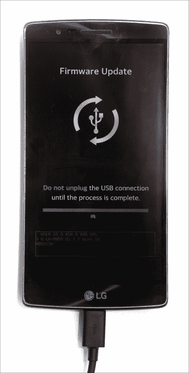
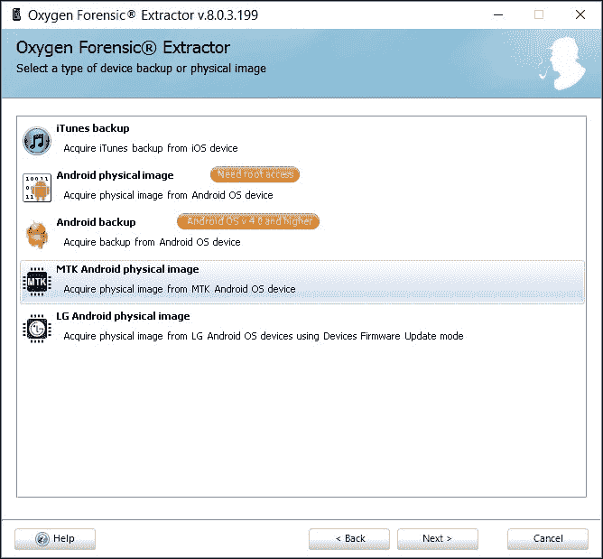
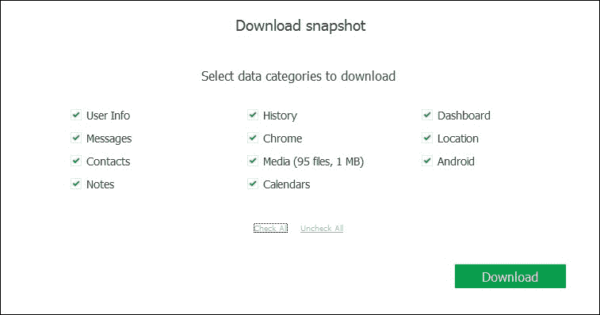

# 第四章：Android 获取的实际步骤

在接触 Android 智能手机时，并没有一条简单的获取路径。由于 Android 平台的高度碎片化，获取 Android 智能手机的方式会因设备的不同而大相径庭。你的方法将取决于设备的制造商和使用的芯片组；设备运行的 Android 版本以及最初发布时的 Android 版本；设备是否具有解锁（或可解锁）引导加载程序，以及是否已经或可以被 root。如果这些还不够，设备的加密状态（也取决于设备的品牌、型号和 Android 版本）也会影响你的获取选项。

本章详细讨论并展示了针对各种 Android 设备的物理数据获取方法。我们将讨论如何使用制造商特定的低级服务模式（LG、Qualcomm 和 Mediatek），如何使用自定义恢复模式（**ClockworkMod**（**CWM**）和 **Team Win Recovery Project**（**TWRP**））进行数据分区的转储，以及如何制作 NANDroid 备份并使用命令行工具，如 **dd**，对设备进行实时映像。我们还会谈论加密以及它对物理数据获取的影响。

# Android 物理获取

在接触 Android 智能手机时，并没有一条简单的物理获取路径。设备是否加密？你是否知道密码？设备是否有解锁（或至少是半解锁）的引导加载程序？设备是否已经安装了 root 权限，或者你是否能够对其进行 root？某些型号是否有服务后门？根据这些因素，你可能会选择不同的获取方法。

## 加密

在我们继续讨论各种物理获取方法之前，我们需要明确一点：设备加密可能会影响你访问用户数据的能力。可能存在提取解密密钥的可能性，而这取决于 Android 版本以及手机是否为三星制造。

在 Android 5.0 *Lollipop* 之前，Google 曾使用一种存在严重缺陷的加密方法，并将其推送到 **Android 开源项目**（**AOSP**）。这种方法被攻破了，专家们能够从设备中提取解密密钥，并用它来解密用户数据。解密元数据保持未加密，因此提取元数据可以解密数据分区。

三星知道这一漏洞，并设计了自己专有的加密方案，加密了解密元数据。因此，即使运行早期版本的 Android（Lollipop 之前）的三星加密智能手机，也非常难以破解。

### 注意

运行 Android 4.0 及更早版本的三星设备使用开放的解密元数据，即使加密也能获取。运行原生 Android 的三星 Galaxy Nexus 采用了谷歌的标准加密实现（具有开放的解密元数据），也可以被解密。

在 Android 5.0 中，谷歌采用了更安全的加密方案，类似于三星开发的方案。在 Android 5.x 和 6.x 中，解密元数据不再以开放形式存储，而是被安全地加密。虽然解密元数据可以通过物理映像、JTAG 或芯片拆除来提取，但无法用它来解密数据分区，因为所需的元数据本身是加密的。目前，没有方法能够在设备外部解密所需的元数据。三星现在在运行 Android 5.x 及更高版本的设备中使用这一加密标准。获取加密 Android 设备时，适用以下兼容性矩阵：

+   对于**运行 Android 4.4 KitKat 或更早版本的非三星加密设备**，你可能能够恢复解密密钥并用它解密用户数据。

+   对于**运行 Android 4.0 到 4.4 的加密三星智能手机**，你可能无法提取或恢复解密密钥。因此，你可能无法解密用户数据。如果是这种情况，你仍然可以尝试实时映像、逻辑获取或云提取。

+   对于**运行 Android 5.x 或更高版本的加密设备**，你不太可能找到解密密钥。低级别的获取技术（JTAG、ISP 或芯片拆除）同样无效。可以尝试实时映像、逻辑获取或云提取。

既然我们已经弄清楚了这一点，接下来我们来看实际的获取技巧。

# 接近物理获取

在接触设备时，你可能需要考虑以下几点：

+   一些制造商出厂时已将设备的引导加载程序完全或部分解锁。通常情况下，映像这些设备不会遇到问题（除非数据被加密）。

+   一些制造商出厂时将设备的引导加载程序锁定，但官方允许用户解锁它们（例如，三星、摩托罗拉、SONY、Nexus 设备等）。如果用户解锁了引导加载程序，成功获取设备映像的可能性很高（除非采用了反取证技术）。

+   在许多情况下，制造商和/或运营商会限制引导加载程序解锁。有些情况下，可以绕过这些限制，特别是在某些型号上（设备的芯片组和制造商很重要）。一些芯片组制造商和设备 OEM 厂商有后门（用于服务级别的访问），而有些可以被利用来绕过引导加载程序锁，并启动自定义恢复模式（这并不意味着你能永久刷入一个自定义恢复）。这些设备通常也比较容易获得。

+   最后，一些设备真的很难获取。锁定的引导加载程序、没有服务模式以及没有已知的漏洞使它们难以获取。你仍然可以尝试实时成像或其他替代获取方法。

如果你正在使用 Cellebrite UFED，可能会觉得安装他们的免费移动应用程序（到你的智能手机或平板电脑上）非常有用，以帮助你识别特定移动设备的提取功能。**UFED Phone Detective** 可用于 iOS 和 Android 设备，并提供一种简便的方式来查看 Cellebrite UFED 4PC/Touch/Classic 支持的移动设备的法医提取和解码功能，以及连接方式。虽然该应用程序可以免费下载，但你需要提供 **My Cellebrite** 账户信息才能登录。如果你没有 My Cellebrite 账户，可以在应用程序内免费注册：


UFED Phone Detective 移动应用程序通过允许专家按厂商名称、移动设备名称或型号查询移动设备，补充了 Cellebrite 的移动提取套件。一旦设备被识别，应用程序将显示特定的支持信息，包括是否可以绕过设备的锁定。

### 注意

有关 UFED Phone Detective 的更多信息以及下载链接，请访问 [`www.cellebrite.com/`](http://www.cellebrite.com/)。

我们为你整理了一份简短的获取操作指南，方便你参考。

## 加密状态 – 数据分区是否加密？

**是**：如果你正在成像三星设备，并且该设备运行 Android 4.0 到 4.4，或者你正在成像运行 Android 5 或更高版本的三星或非三星设备，请尝试实时成像。为了执行实时成像，你需要使用正确的密码解锁设备（市场上有很多解决方案）。如果你正在成像一部较旧的 *非三星* 设备，并且该设备运行的是 Android 4.4 或更早版本，请继续进行物理获取，因为你有很大机会恢复解密密钥。

**否**：继续进行物理获取。

### 服务模式可用

在尝试其他获取方法之前，我们先来看看设备是否有可用的服务后门。

### LG 智能手机

LG 智能手机配备了一种名为 **LAF** 的专有服务访问模式。在 LG 智能手机中，这种专有模式完全取代了芯片制造商（如高通或联发科）提供的类似低级访问模式。这带来了一个重要的后果。如果你正在对 LG 智能手机进行成像，请确保使用 LG 服务模式，而不是尝试将设备启动到高通 9006 或 MTK 服务模式。

LG 服务模式支持双向操作（既能读取数据，也能将数据写入原始物理存储）。因此，无论引导加载程序是否被锁定，都可以对完整的物理存储进行映像备份。LG 使用专有协议，因此你的采集工具必须支持此协议才能读取数据。同时，你还需要安装最新的 LG 驱动程序。支持 LAF 协议的工具包括 Cellebrite UFED 和 Oxygen Forensic Suite。更多关于此方法的内容将在*LG 智能手机 LAF 模式*一节中讨论。

### 基于高通参考平台的设备

许多厂商基于芯片制造商提供的参考平台构建设备。使用参考平台大大简化了开发过程。制造商会收到一个完整的、可直接使用的 PCB 设计，设计中已预选好组件和驱动程序。除此之外，一些参考平台还暴露了服务访问后门。全球最大的芯片制造商之一高通提供的参考平台包括几种服务模式。其中一种模式，**HS-USB 9006**或**模式 9006**，提供对设备分区的系统级访问，无论设备的引导加载程序是否被锁定。

一般来说，切换到这种模式的方法是：关闭设备，使用 USB 数据线将设备连接到电脑，同时按住音量加键，再按住音量加键的同时开机（不同设备进入模式 9006 的具体方法可能略有不同）。一旦设备启动到服务模式，Windows 的**磁盘管理**控制台将显示可用分区的列表。请注意，必须在专家的计算机上安装专用的高通下载模式 HS-USB 9006 驱动程序，才能让分区显示出来。一旦看到分区列表，就可以使用你选择的移动取证工具对这些分区进行映像备份。某些闪存映像工具也可以使用。有关这种方法的更多内容将在*高通 9006 模式*一节中讨论。

### 基于联发科的中国手机

另一个提供特殊服务后门的芯片制造商是**联发科**（**MTK**）。MTK 芯片广泛应用于中国大多数智能手机厂商，包括小米、魅族、OPPO、Vivo、一加、Cubot、Zoppo、中兴、No. 1 等，以及数百个 B 品牌和 C 品牌。与高通不同，联发科仅在引导加载程序解锁的情况下，才允许通过该服务模式访问数据。许多中国厂商出厂时将智能手机的引导加载程序设置为解锁，通常是为了便于维修，这也使得移动取证工具的用户能够通过利用 MTK 服务模式轻松获取这些设备的数据。书中的后续章节将讨论一种工具，氧气取证工具包（Oxygen Forensic Toolkit）。有关此方法的更多内容将在*联发科智能手机*一节中讨论。

### 引导加载程序状态

*引导加载程序是否锁定？* 这是在获取安卓设备时的一个重要问题。主要品牌的安卓设备都配备了锁定的引导加载程序。一些厂商允许在某些型号和运营商组合下解锁引导加载程序，而其他厂商（型号和运营商）则选择永久锁定引导加载程序。

大多数在美国和欧洲销售的安卓设备都配备了锁定的引导加载程序；而在中国，情况恰恰相反。一些设备配备了半锁定的引导加载程序，允许引导（但不能永久刷写）自定义引导镜像。如果你能够引导进入自定义恢复模式，你可能能够创建 Nandroid 备份或映像数据分区。然而，请注意，使用半解锁的引导加载程序引导进入自定义引导加载程序可能会（例如 InFocus m810t）或可能不会（例如 ASUS ZenPad S 8.0）触发安全重置。

### Root 状态

*设备是否已经 root？* 与 iOS 越狱不同，root 设备并不是获取许多安卓设备映像的必要前提。设备是否已 root，只会影响你是否能够进行实时映像备份。然而，如果设备已经 root，你就可以直接进行实时映像备份，而不必先 root 设备，这可能不太稳定。

## LG 智能手机的 LAF 模式

为了服务目的，LG 开发了一种低级协议，使 LG 智能手机即使在设备无法正常访问（*变砖*）的情况下，也能通过 USB 连接接受固件更新。最初该协议仅对授权服务中心开放，但该协议的详细信息以及实际的驱动程序和刷写工具很快就向公众开放，并进入了一些移动取证工具，如 Cellebrite UFED 和 Oxygen Forensic Suite（更多信息请参见《使用 Oxygen Forensic Suite 进行实时映像》部分）。

此服务模式（LAF 模式）通常通过关机、按住音量加键并通过 USB 线将设备连接到 PC 来激活。手机将自动启动进入下载模式，准备接受固件更新：



在此模式下，映像工具可以提取设备物理存储的完整物理映像。这是目前最干净、最简单、最具取证可靠性的数据获取方法之一。

使用此方法时，选择**物理数据获取** | **LG 安卓转储**：


系统将提示你下载并安装 LG 驱动程序，如下图所示：


驱动程序安装完成后，按照以下截图中的指示操作：


一旦 LG 设备连接完成，请等待 Windows 安装相应的驱动程序：


点击**下一步**：


稍后，你将看到设备已连接：


点击 **Next** 开始成像：


一旦过程完成，你将得到一个单一的二进制文件（存储在你之前指定的路径中），该文件表示设备整个物理存储的转储。你将能够在 Oxygen Forensic Suite 或任何你选择的移动取证工具中打开并分析该转储。

## MediaTek 智能手机

MediaTek 是一家中国制造商，为大量手机厂商提供高性价比的移动芯片组。MTK 芯片组主要用于低端和中端设备，广泛应用于 LG、SONY、HTC 等主要厂商生产的智能手机和平板电脑，以及无数的 B 品牌和 C 品牌制造商的设备中。

在中国大陆销售并且可以通过众多在线渠道购买的 C 品牌设备几乎总是配备 MTK 提供的某种芯片组。这些设备很少配有锁定的引导程序，因此可以通过 MTK 固件更新模式进行干净的获取。请注意，只有解锁了引导程序的设备才能通过此方法进行获取，因此像 SONY、HTC 或 LG 生产的引导程序锁定的设备是无法使用此方法的。

从技术上讲，MTK 服务模式通过将虚拟串口（COM）端口安装到系统中来工作。虽然有专门的 MTK 驱动程序，但实际上这些是用于虚拟 COM 端口的通用 Windows 驱动程序，并配有自定义的 `.inf` 文件。一旦安装了驱动程序，MTK 提供的 DLL 允许启动进入服务引导程序，读取设备信息，并提取存储内容。此方法可以访问 NAND 和 eMMC 内存。新型号需要更新版本的 MTK 服务 DLL 和引导程序。请注意，支持是针对整个 SoC（芯片组）系列添加的，而不是单个智能手机型号。

为了通过 MTK 物理成像提取设备，在 Oxygen Forensic Suite 中选择相应的选项：



系统会提示你下载驱动程序并关闭设备：


驱动程序安装完成后，打开设备并按照指示操作：


一旦设备连接完成，你就可以继续提取其存储内容。

## Qualcomm 引导程序漏洞

对于锁定引导程序、没有 root 权限并禁用了 ADB 调试选项的设备，物理获取选项有限。某些 Qualcomm 设备存在引导程序级漏洞，可以通过 Cellebrite UFED 等工具使用打补丁的引导程序镜像启动设备，从而允许工具提取设备镜像。

该漏洞基于在某些版本的 Qualcomm 引导加载程序中发现的关键安全漏洞，这些引导加载程序被多个 OEM 实现并用于 Qualcomm 参考设备。当在 fastboot 模式下处理启动命令时，受影响的内核引导加载程序不会验证设备的解锁状态或内核是否经过正确签名。如果设备使用受影响的内核，它可以在没有验证的情况下使用已修补的内核镜像启动。

专家可以利用此漏洞通过 fastboot 启动 Android 设备，并使用任意内核镜像，即使目标设备使用签名内核且引导加载程序被锁定。（来源：*Fastboot 启动命令绕过签名验证 (CVE-2014-4325)*，详情见[`www.codeaurora.org/projects/security-advisories/fastboot-boot-command-bypasses-signature-verification-cve-2014-4325`](https://www.codeaurora.org/projects/security-advisories/fastboot-boot-command-bypasses-signature-verification-cve-2014-4325)）。

引导加载程序漏洞是特定于设备的，并涉及使用专为目标设备构建的自定义引导镜像。手动为正在调查的特定设备构建已修补的引导镜像不可行，因为这需要高度的技能和大量的时间。Cellebrite 获取套件实现了多个设备的引导加载程序运行时漏洞。

引导加载程序攻击是有线的。它们不会在设备上写入任何内容，而是使用一个已修补的引导镜像，仅修改设备的易失性内存（RAM）内容，而不改变设备存储的内容。基于此原因，引导加载程序级别的获取是法医上可行的。

由于引导加载程序漏洞是特定于设备的，因此仅适用于某些设备（Cellebrite 声称支持大多数摩托罗拉 Android 设备、部分三星、Qualcomm 和 LG GSM 和 CDMA 设备）。没有通用的引导加载程序漏洞。使用引导加载程序漏洞时应小心，因为已知某些设备在启动进入自定义恢复模式时会清除数据分区。截至写作时，引导加载程序获取仅限于 Cellebrite UFED：


除了引导加载程序漏洞外，某些 Qualcomm 基础的设备还易受通过 Qualcomm 9006 模式进行的一些最干净的获取技术的影响。

### Qualcomm 基础智能手机 – HS-USB 9006

该方法适用于基于最近 Qualcomm SoC 的某些智能手机和平板电脑。引导加载程序状态无关；即使设备的引导加载程序被锁定，也可以使用此方法成功成像。限制因素如下：能够将设备切换到 Qualcomm 下载模式 9006，并且具有特定设备所需的正确 Qualcomm HS-USB 9006 驱动程序。

该方法被认为是物理数据获取。它会返回整个 eMMC 存储或仅数据分区的完整转储。完整的原始转储会被捕获，包括未分配的空间，这使得恢复已删除的文件成为可能。此方法干净、安全、法医上是可靠的（它在设备中不会留下任何痕迹），且不需要特定的技术专业知识。

### 加密

在此模式下，您将捕获整个 eMMC 卡或选定分区的原始映像。如果数据分区已加密，系统不会提示您输入密码。数据将以加密状态被捕获。即使您知道正确的密码，之后您也可能无法解密该数据。解密加密数据的能力取决于多个因素，如设备运行的 Android 版本、最初发布时的 Android 版本以及设备的制造商。例如，三星在某些版本的 Android 中使用了特别强的定制加密。最初发布时运行 Android 5.x Lollipop 的设备使用了类似强度的加密方案。发布时运行 Android 4.2 Jellybean 的设备通常可以解密。

## 高通 9006 模式

高通因向 OEM 厂商提供多个参考平台而闻名。制造商可以使用这些平台，包括低级固件和驱动程序，快速构建智能手机和平板电脑，而无需花费太多时间进行研究和开发。

由于高通的参考平台被多家不同厂商应用于各种设备，因此适用于某个参考平台的安全漏洞通常也能被应用于基于同一平台构建的其他设备。例如，Cellebrite 开发了引导加载程序级别的漏洞，使该公司的获取工具 UFED 能够成功地从锁定引导加载程序的智能手机中获取信息。值得注意的是，这种方法适用于不同平台的设备（如 Android、Windows Phone 8.x 和 Windows 10 Mobile），无论设备的引导加载程序是否被锁定。

还有一种低级漏洞存在，允许通过使用高通下载模式（固件恢复模式 9006、高通 MMC 存储（Diag 9006）、高通 HS-USB 诊断 9006、HS-USB QDLoader 9006、高通 HS-USB 9006，或简单地称为 qhsusb 9006，具体取决于设备）下载设备内部存储（eMMC）的全部内容。如果设备的引导加载程序损坏，则该模式会自动启动。在许多设备上，通过关闭设备并在通过 USB 端口连接到 PC 时按住音量下键，手动进入此模式是可能的。在某些设备上，可能需要不同的操作步骤。例如，LG G Flex 2 需要在连接到 PC 时按住音量加键。

### 提示

9006 诊断模式与高通 HS-USB QDLoader 9008 模式之间存在显著差异。虽然使用高通 QPST 可以轻松将设备切换到 9008 模式，但需要额外的文件才能引导到 9006 模式。无法从 9008 模式影像设备。更多信息请访问[`forum.xda-developers.com/general/help/how-to-enter-qualcomm-mmc-storage-diag-t3253478`](http://forum.xda-developers.com/general/help/how-to-enter-qualcomm-mmc-storage-diag-t3253478)。还要注意，有时候使用 QPST 的 eMMC 软件下载工具可以通过使用额外的文件将设备从 9008 转为 9006。

通过连接兼容设备进入高通下载模式 9006 并使用特定软件，可能可以在不获取设备 root 权限或解锁其引导加载程序的情况下获取手机 eMMC 芯片的全部内容。请注意，对于一些制造商（如 HTC、LG、Motorola、Sony 等），这种技术可能不起作用，因为他们可能会调整参考平台以移除用户对 9006 模式的访问权限。

在高通下载模式 9006 中（假设已安装正确的驱动程序并且您使用的是 Windows PC），可用分区可能会显示在**Windows 磁盘管理**控制台中。如果是这种情况，获取设备内容就像使用影像工具（如**HDD Raw Copy Tool**）（[`hddguru.com/software/HDD-Raw-Copy-Tool/`](http://hddguru.com/software/HDD-Raw-Copy-Tool/)）一样简单。

但是，存在特定于高通的软件，允许您识别和获取单个分区的内容。

### 通过高通下载模式 9006 进行影像工具

有各种工具可通过诊断端口编程/读取设备。其中之一是**eMMC 原始工具**。该工具由 Albie Cervice 开发，并可在[`www.na2nkhape.com/2015/02/download-emmc-raw-tool.html`](http://www.na2nkhape.com/2015/02/download-emmc-raw-tool.html)免费下载。

### 提示

**视频**：关于如何使用 eMMC 原始工具的快速视频教程，请访问[`www.youtube.com/watch?v=0ESQqVqCODY`](https://www.youtube.com/watch?v=0ESQqVqCODY)（视频由[`www.unbrickandroid.com/`](http://www.unbrickandroid.com/)提供）。

该工具可以通过低级固件恢复模式高通 HS-USB 9006 读取设备的 eMMC 存储内容。或者，它可以将安卓智能手机作为通用大容量存储设备挂载。

eMMC 原始工具的功能包括以下内容：

+   读取完整镜像

+   从设备读取分区结构

+   从文件读取分区结构

+   从设备读取选定分区

+   按地址读取

请注意，eMMC 原始工具是一个强大的工具，也可以用于向安卓设备写入。这个工具也被用来恢复（砖式）带有损坏引导加载程序设备。毋需多言，在被影像的手机上写入任何内容并非我们的意图。

要使用 eMMC 原始工具，请执行以下步骤：

1.  从开发者网站下载并解压工具（[`www.na2nkhape.com/2015/02/download-emmc-raw-tool.html`](http://www.na2nkhape.com/2015/02/download-emmc-raw-tool.html)）或从 [`4pda.ru/forum/index.php?showtopic=655617`](http://4pda.ru/forum/index.php?showtopic=655617) 下载。

1.  下载并解压 Qualcomm 驱动程序（必须安装适用于 Qualcomm 9006 模式的正确驱动程序）。

1.  安装适合你 Windows 版本的正确驱动程序。

1.  将设备切换到 Qualcomm 下载模式 9006。这是一个不确定的部分。你可以尝试以下顺序：

    1.  关闭设备（等待它完全关机）。

    1.  按住硬件音量减小键（某些设备上，按住音量增大键）。

    1.  在按住按键的同时，通过 USB 电缆将设备连接到计算机。

    1.  等待直到设备显示**下载模式**或**更新固件 0%**。

    1.  放开按键，等待驱动程序安装完成。

1.  如果设备没有切换到 9006 模式，你可以尝试查找正确的顺序。

1.  此时，Windows 将尝试安装 Qualcomm HS-USB 9006 驱动程序。当提示时，选择正确的驱动程序并等待安装完成。

1.  最后，运行 eMMC RAW 工具，如下图所示：


为了对设备进行成像，请执行以下步骤：

1.  点击**刷新**。

1.  物理驱动器列表将会显示。选择**驱动器**框中的合适设备。

1.  点击**读取分区结构**。可用分区的列表将出现在主窗口中。

1.  通过点击窗口左上角的复选框，选择所有分区。

1.  点击**读取选定分区**。

或者，你也可以仅在第 4 步时选择**USERDATA**、**DATA**或**SDCARD**分区。这将只读取包含用户数据的单个分区的内容：


在 Qualcomm 9006 模式下成像安卓智能手机

例如，前面的截图中的**USERDATA**分区（分区号**20**）就是使用**读取选定分区**功能进行成像的正确分区。或者，完整的设备镜像可以通过使用**读取完整镜像**来读取。

就是这样，你已经成功地对设备进行了成像。现在可以继续进行实际恢复。如果这种方法对你无效（例如，手机不支持 Qualcomm HS-USB 9006 模式），你可以尝试使用其他方法进行成像。

## 使用自定义恢复工具

使用自定义恢复镜像 Android 设备的方式不止一种。第一种方法最为简单，只需进入自定义恢复（通过`fastboot boot twrp.img`或`fastboot boot cwm.img`）并使用屏幕上的控制按钮生成数据分区的 Nandroid 备份。第二种方法（通过`dd`命令）更为复杂，需要打开两个独立的终端窗口；不过，这种方法会返回数据分区的完整原始镜像。以下是这两种方法的简要对比：

+   **Nandroid 备份**：这种方法快速、简单，并且通过图形用户界面（基于触控或使用手机硬件按键控制）完成。它仅仅是导出文件系统；由于无法访问未分配空间，因此无法恢复已删除的文件。

+   **通过 dd 命令镜像**：这种方法需要额外的工具和两个终端窗口。使用时需要更高的专业知识，并且返回数据分区的完整原始镜像，能完全访问未分配空间，从而可以恢复已删除的文件。

本书并不是关于 Root Android 或安装自定义恢复的内容。有关 Android 法医的推荐阅读，请参考本书末尾。

本章将简要介绍自定义恢复能做什么和不能做什么，以及使用自定义恢复镜像设备时的限制和风险。

### 提示

**警告**：如果设备的引导加载程序被锁定，解锁它可能（并且很可能）会导致完整的恢复出厂设置，从而完全丢失数据。只有在你的引导加载程序已经解锁，或者你确定设备能够在不清除数据的情况下启动自定义恢复时，才继续操作。

使用自定义恢复是有风险的。Android 平台高度碎片化。不同的制造商在其设备中采用不同的安全策略。进入自定义恢复可能成功，也可能失败，可能触发完整的恢复出厂设置，或者成功后触发完整的恢复出厂设置。因此，通常情况下，使用自定义恢复并不被认为是法医上可靠的设备镜像方法。

**加密**

即使知道正确的密码，自定义恢复也可能无法处理加密的分区。此外，如果数据分区被捕获时是加密的，你可能无法解密它——即便你知道密码。

以下是最近几个案例中的一些示例：

+   **摩托罗拉 Nexus 6**（以及可能的其他 Nexus 设备）：可以刷入或启动自定义恢复。然而，解锁引导加载程序会导致恢复出厂设置。

+   **摩托罗拉 Moto X (2014)**：一旦解锁引导加载程序，刷入或启动自定义恢复会成功（适用于 Android 4.4 至 6.0 所有版本）。解锁引导加载程序会导致恢复出厂设置。

+   **SONY Xperia Z 系列**：解锁引导加载程序会导致恢复出厂设置。之后，启动或刷入自定义恢复会成功。

+   **ASUS MeMo Pad 7**：无法解锁。尝试启动自定义恢复模式失败。

+   **ASUS ZenPad S 8.0**（所有版本）：无法解锁引导程序。不过，可以通过漏洞启动自定义恢复模式（[`forum.xda-developers.com/android/development/zenpad-s-root-achieved-t3160422`](http://forum.xda-developers.com/android/development/zenpad-s-root-achieved-t3160422)），并且不会产生不良后果（在所有固件版本上进行过测试，包括当前的 4.5.0 版本）。

+   **ASUS ZenPhone**：与 ZenPad S 相同的漏洞。

+   **InFocus M810t**：通过漏洞解锁引导程序是可能的；该漏洞本身不会触发数据擦除。即使引导程序被锁定，也可以启动自定义恢复模式。然而，启动自定义恢复会在下次重启时触发数据擦除。有趣的是，一旦进入自定义恢复模式，可以在数据擦除发生之前备份分区。

在分析设备时，你可以尝试安装或启动自定义恢复模式。两种流行的自定义恢复是**ClockworkMod**（**CWM**）（[`www.clockworkmod.com/`](http://www.clockworkmod.com/)）和**Team Win Recovery Project**（**TWRP**）（[`teamw.in/Devices/`](http://teamw.in/Devices/)）。

### 提示

**重要**：安装或启动自定义恢复模式需要设备的引导程序完全或部分解锁。部分解锁的引导程序可能允许启动自定义恢复模式；然而，系统可能会在此之后擦除数据分区。请小心操作！

自定义恢复不过是精简版的 Linux 操作系统引导程序。因此，自定义恢复是设备特定的，因为它们需要包含每个特定设备型号所需的驱动程序。因此，自定义恢复可以无缝绕过 Android 的标准安全措施，如访问限制（但不包括数据加密）。

### 通过自定义恢复模式进行成像 - 制作 Nandroid 备份

从技术上讲，没有什么阻止自定义恢复导出数据分区的原始镜像。目前，TWRP 和 CWM 都没有提供通过用户界面制作数据分区原始镜像的功能（但引导分区和系统分区可以作为原始镜像进行捕获）。因此，TWRP 和 CWM 的用户界面无法用于访问存储在未分配空间中的数据。

### 注意

**重要**：使用自定义恢复可以完整地导出数据分区的原始数据。然而，与制作 Nandroid 备份相比，这一过程要复杂得多。*设备成像*部分解释了如何通过自定义恢复模式进行 Android 设备的物理成像。

然而，使用自定义恢复界面是制作完整文件系统备份的一种可行方法，包括所有应用数据。

如果正在分析的设备有解锁的引导程序，你可以安装（或者更好的是，启动进入）自定义恢复模式。从那里，你可以轻松备份设备的整个数据分区：

1.  如果未安装自定义恢复模式，从 TWRP 或 CWM 下载适合您设备的自定义恢复镜像。

1.  将设备启动到引导加载程序（fastboot 模式）：

    1.  关闭手机。

    1.  按住音量减键并按下电源按钮。

    1.  手机应启动到引导加载程序（fastboot 模式）。如果没有，请确定适合您的设备的引导加载程序（fastboot）启动方式，并按照该设备的具体说明操作。

1.  获取 adb 和 fastboot 可执行文件。

1.  将 fastboot 文件和自定义恢复镜像放入同一个文件夹中。在该文件夹中打开命令行。

1.  下载并安装适用于正在调查的设备的 fastboot 驱动程序（驱动程序可以是针对制造商、设备或芯片组的，具体取决于型号）。

1.  通过 USB 数据线将手机连接到 PC。

1.  运行以下命令之一：

    ```
     fastboot boot twrp.img
    ```

    或者运行以下命令：

    ```
     fastboot boot cwm.img
    ```

    在这里，`twrp.img` 或 `cwm.img` 是 TWRP 或 CWM 恢复模式的文件名。使用正确的文件名，或者将下载的恢复镜像重命名为更短的文件名。

1.  从自定义恢复模式备份数据分区（只需要数据分区）。确保目标位置是外部 SD 卡或 **随时可用** (**OTG**) USB 驱动器。不要使用手机的内部存储来备份数据。

此时，您已成功获取设备的完整文件系统，形式为 **Nandroid 备份**。

通过自定义恢复模式创建的 Nandroid 备份文件通常以 EXT4、F2FS 或 YAFFS TAR 镜像的形式保存。这些文件通常可以使用免费的归档工具如 7Zip 提取：


TWRP Nandroid 备份生成的文件

7Zip 可以在不重命名或合并文件的情况下打开多卷备份。只需启动 7Zip 并打开 `data.f2fs.win000` 文件（或类似的文件）来从数据分区提取文件：


TWRP 备份的内容

TWRP 可以创建 YAFFS 文件系统镜像。可以使用市场上众多取证工具之一，从 TWRP Nandroid 备份中提取文件。也有一个开源工具叫做 **unyaffs**，其源代码可以在 [`code.google.com/p/unyaffs/downloads/list`](https://code.google.com/p/unyaffs/downloads/list) 获取。

该工具的编译版本可以按如下方式使用：

```
unyaffs data.img
```

在这里，`data.img` 是 Nandroid 备份文件。

### 通过自定义恢复进行映像 – 通过 dd 进行物理映像

大多数流行的自定义恢复（如 TWRP 和 CWM）通过用户界面获取备份时，不能以原始模式映像完整的数据分区。为了能够调查未分配的空间，您可能需要将整个用户数据分区提取为原始镜像。

在未加密的 Android 设备中，提取未分配区域仅能通过直接访问存储来完成。Android 内建的安全措施阻止了从应用框架内部进行此类访问，导致无法使用任何用户级别的应用扫描未分配区域。需要 root 权限才能进行低级别的存储访问。

### 提示

**警告：**Root 设备是不安全的。它可能导致设备不稳定或无法访问，甚至可能会擦除设备。然而，`dd` 提取方法并不需要 root 设备。你只需要一个已刷入或已启动（推荐）的自定义恢复。自定义恢复是该操作系统的精简版，默认内置 root 权限。

这种高级物理获取方法使用 `dd` 命令对设备进行成像。dd 命令可以转储整个物理存储或任意数量的单独分区。对于数字取证，只需要数据分区。

为了通过 USB 接口将数据从 Android 设备传输到 PC，我们将使用 `netcat` 命令。

这包括以下前提条件：

+   **已解锁或半解锁的 bootloader（允许启动到自定义恢复模式）**：不需要 root 设备，因为自定义恢复已内置完整的 root 权限。

+   **BusyBox**：这通常与自定义恢复（TWRP 和 CWM）一起预装。要验证是否安装，请在进入自定义恢复模式后，输入任意 BusyBox 命令，如 `busybox nc`。

+   **Android 调试桥（**ADB**）**：需要此工具才能在 Android 设备上运行 shell 命令。

+   **Fastboot**：这是 ADB 包的一部分。应该安装在你的 PC 上。

+   **ADB 驱动**：ADB 驱动是设备特定的。必须安装这些驱动，才能使此获取方法正常工作。

安装并配置好所有必要的工具后，执行以下步骤：

1.  确定你 Android 设备上用户数据分区的名称。如果你无法识别数据分区，那么你将需要对整个设备（物理存储）进行成像。

1.  验证 bootloader 是否已解锁或半解锁（允许你在不清除数据的情况下启动到自定义恢复模式）。

1.  将手机启动到恢复模式。如果设备已关闭，通过按住音量减键并开机进入恢复模式。如果设备已开机，并且你已建立 ADB 连接，使用 `adb -d reboot recovery` 来重新启动进入恢复模式。

1.  将设备通过 USB 数据线连接到计算机。

1.  通过运行 `fastboot devices` 来确保 fastboot 正常工作。应显示设备列表。如果为空字符串，说明有问题。

    ### 注意

    **注意：** 某些设备需要在命令行中指定正确的厂商 ID。例如，要将联想 ZUK 启动到自定义恢复模式，可以使用 `fastboot -i 0x2b4c boot recovery.img`。正确的厂商 ID 通常可以在网上找到。此外，在某些情况下，`fastboot devices` 返回空白，但实际引导到自定义恢复模式是有效的。

1.  使用以下命令将设备引导到自定义恢复模式：

    ```
     fastboot boot recovery.img
    ```

    这里，`recovery.img` 是与正在获取的设备相关的自定义恢复镜像。

1.  确保 Netcat 在您的自定义恢复模式中正常工作，方法是运行 ADB shell（`adb shell`）并执行 `busybox nc` 命令。您可能需要配置计算机的防火墙，以允许连接到本地端口。

您现在已经准备好对设备进行镜像。以下步骤描述了如何使用 `netcat` 命令捕获数据分区的镜像。您将同时运行两个不同的 shell 会话：一个连接到设备，另一个连接到您的计算机。

### 镜像设备

运行 `cmd.exe` 或使用其他终端（例如，Cygwin）。这是第一个与 Android 设备交互的 shell 会话。运行 `adb shell`。默认情况下，您将获得 root 权限，因此不需要运行 `su`。

启动另一个 `cmd.exe` 实例或您喜欢的终端。此会话将在您的计算机上打开，并用于接收来自 Android 设备的数据。导航到将接收用户分区的文件夹（`cd c:\path`）。确保您使用的是 NTFS 或 exFAT 格式的硬盘来接收数据；FAT32 格式的卷无法保存超过 4 GB 的镜像，而现在大多数手机的存储空间都超过了 4 GB。在此 shell 中，运行 `adb forward tcp:5555 tcp:5555`（如果需要，您可以使用其他端口号）。此命令使 ADB 可以通过端口 5555 使用 Netcat 进行通信。

现在，一旦连接建立，返回到第一个与您的手机连接的 shell。输入以下命令：

```
dd if=/dev/block/mmcblk0 | busybox nc -l -p 5555
```

此命令将 `/dev/block/mmcblk0` 的内容进行镜像，并通过端口 5555 使用 Netcat 通过 ADB 写入。

或者，您可以使用以下语法：

```
busybox nc -l -p 5555 -e busybox dd if=/dev/block/mmcblk0p12
```

此命令获取 `mmcblk0p12` 数据块。请注意，您需要找出正在获取设备的数据块名称。

最后，返回到第二个 shell（连接到您的计算机），并输入以下命令：

```
nc 127.0.0.1 5555 > image.raw
```

`nc`（Netcat）命令将第一个 shell 的输出保存到计算机上，通过端口 5555 进行传输。文件将存储在您启动第二个 shell 时所在的同一文件夹中。您可以通过 `cd disk:\path` 命令切换到其他文件夹。请注意，一些 Windows 文件夹（例如，`C:\Program Files\` 及其子文件夹）没有写入权限。

如果一切顺利，窗口将在捕获镜像时冻结。处理完成后，您将能够在选择的取证工具中挂载新捕获的镜像。

### 注意

**注意：** 自定义恢复无法解密加密的设备。因此，如果数据分区已加密，您将获得一个加密的镜像，您可能无法在之后解密它。如果设备已加密，唯一的选择是执行**实时成像**（有关更多信息，请参考*实时成像*部分），这要求设备已获得 root 权限并安装了 BusyBox。

通过自定义恢复成像 Android 设备的更多信息：

+   为什么不加载 ClockworkMod 或 TWRP 来成像设备？其他恢复模式很有用，但可能不适合用于成像设备（[`freeandroidforensics.blogspot.com/2015/04/why-not-load-clockworkmod-or-twrp-to.html`](http://freeandroidforensics.blogspot.com/2015/04/why-not-load-clockworkmod-or-twrp-to.html)）。

## NANDroid 备份

此获取方法适用于已 root 或安装了自定义恢复的智能手机和平板电脑。它同样适用于完全或部分解锁了引导加载程序的设备（允许专家启动设备进入自定义恢复模式）。

如果安装了自定义恢复，或者可以启动到自定义恢复，则可以使用另一种获取方法（通过`dd`命令），允许捕获数据分区的完整原始镜像（有关更多信息，请参考*通过自定义恢复成像 - 通过 dd 进行物理成像*部分）。`dd` 方法返回整个 eMMC 存储或仅数据分区的完整转储。Nandroid 备份包含数据分区的完整文件系统；未分配的空间不包括在内，这使得恢复已删除的文件变得不可能。此方法相对容易使用，但需要一定的技术专长。Nandroid 备份*不*被视为法医上可靠的获取方法；然而，Nandroid 备份仍然包含比通过 ADB 获取的更多的信息。

与几乎所有其他智能手机操作系统不同，Android 系统不提供创建设备完整备份的功能。平台没有提供用于创建或恢复此类备份的原生工具。此外，平台在原生状态下甚至不允许第三方开发者制作此类备份工具，因为它们的使用需要较高的权限（*root* 权限）。

各个制造商实现了专有工具用于备份和恢复（例如，索尼的 Xperia 手机和平板电脑使用 Sony PC Companion）。然而，这些工具的使用者相对较少，因为（再次，与 iOS 不同）它们并不是执行设备上其他常规任务（如传输文件）所必需的。

创建和恢复完整文件系统备份的需求存在，特别是在那些喜欢尝试不同设备并希望在设备出现问题时能够将其恢复到先前工作状态的活跃 Android 用户中。为这些用户提供了完整的文件系统备份工具，但仅适用于已经 root 过的设备、具有自定义恢复模式的设备，或能够通过 fastboot 刷机的设备。

对某些 Android 设备进行分析的检查员有另一种方法来提取文件系统的完整镜像（但通常*不是*数据分区的原始转储），即通过生成 NANDroid 备份。NANDroid 备份包含在创建备份时选择的所有分区的文件系统完整镜像。可以通过将设备启动到自定义恢复模式，如 CWM 或 TWRP（可以通过发出 ADB 命令，或者如果**USB 调试**未启用，通过按住设备上的音量下键和电源键）并从菜单中选择相应的菜单项来生成 Nandroid 备份。

### 注意

**注意：** *NANDroid* 这个名称来源于*NAND*和*Android*两个词。因此，正确的名称是*NANDroid*，但为了简便，经常将其写作*Nandroid*。

### 是否需要解锁 bootloader？

尽管大多数来源表示，为了制作 Nandroid 备份，您需要 root 权限或解锁 bootloader（或两者都需要），但这并不完全正确。严格来说，制作 Nandroid 备份所需的唯一条件是自定义恢复模式，如 CWM 或 TWRP。确实，许多设备需要 root 权限才能安装自定义恢复模式，且必须解锁 bootloader 才能安装自定义恢复。然而，用户在安装自定义恢复后可以安全地重新锁定 bootloader，这不会影响生成 Nandroid 备份的能力。此外，许多设备即使 bootloader 被官方锁定，也可以安全地启动进入自定义恢复模式（通过`fastboot boot recovery.img`），而不是永久安装一个。对于移动取证来说，启动进入自定义恢复模式是一个更加干净且在取证上更为可靠的设备成像方法。

### 是否需要 root 权限？

与普遍看法相反，root 权限并不是制作 Nandroid 备份的绝对要求。为了生成 Nandroid 备份，您可以选择进入自定义恢复模式（root 状态无关紧要）或使用一个应用程序（需要 root 权限和 BusyBox 包）。

### 生成 Nandroid 备份

以下是制作 Nandroid 备份的两种方法：

+   解锁或部分解锁的引导加载程序，特定设备的自定义恢复（例如，CWM 或 TWRP）可用：请注意，通常需要解锁引导加载程序才能安装自定义恢复。除此之外，某些设备必须先 root 才能安装自定义恢复。在调查过程中，通常无法解锁引导加载程序，因为此操作会启动数据分区的完全清除。然而，在安装自定义恢复后，引导加载程序可以重新锁定，因此从技术上讲，不需要解锁引导加载程序就可以通过自定义恢复制作 Nandroid 备份。为了通过自定义恢复制作 Nandroid 备份，设备的 root 状态并不重要。

+   已 root 的设备，已安装 BusyBox，使用 Nandroid 备份应用：即使引导加载程序已解锁，你也可以使用 Nandroid 备份。为此，你将使用许多 Nandroid 备份应用中的一种。你可以将这样的应用通过旁加载方式安装到手机上。请注意，你可能需要安装 BusyBox（除非工具使用自己的一种数据分区映像机制）。使用这些应用需要 root 权限；然而，如果操作是通过自定义恢复执行的，则不需要 root 权限。

拥有自定义恢复，基本上是操作系统的独立版本，这有助于绕过大多数安全限制（除了加密）。如果你能启动进入自定义恢复（或者能够在不清除设备数据的情况下安装它），你可以轻松地转储整个 eMMC 存储的内容，或者将数据分区映像写入外部 SD 卡或 OTG 闪存驱动器（如果手机支持这些设备）。

在某些情况下，你可能会遇到重新锁定的引导加载程序（用户解锁引导加载程序，安装自定义恢复，然后重新锁定引导加载程序）。虽然一般来说这不是问题，但有些用户可能会用密码保护自定义恢复的访问权限。结合锁定的引导加载程序和密码保护的自定义恢复是非常难以破解的。

### 分析 Nandroid 备份

Nandroid 备份在不同的恢复之间是标准化的。Nandroid 是存储 Android 系统备份的事实标准格式。Nandroid 备份可以被像 Oxygen Forensic Suite（[`www.oxygen-forensic.com/en/compare`](http://www.oxygen-forensic.com/en/compare)）或 Belkasoft Evidence Center（版本 7.3 或更高版本）这样的取证工具解析和分析。

在 Oxygen Forensic Suite 中，Nandroid 备份可以通过**Android 备份/映像** | **Android 备份**导入：


选择备份类型：


指定备份位置：


指定选项并点击**完成**。数据将被处理并导入分析套件：


完成该过程后，你将能够访问刚刚导入的备份中的信息：


# 实时成像

实时成像可能是获取加密设备时的最后手段。由于引导加载程序漏洞和自定义恢复无法解密加密分区，您可能需要使用正确的 PIN 码启动并解锁设备，以便访问加密的数据分区。

Android 设备的实时成像类似于 *通过自定义恢复成像 – 通过 dd 进行物理成像* 部分描述的过程。

## 带 Root 的实时成像（通过 dd）

实时成像被认为是一个相对不那么合规的取证方法，和使用自定义恢复或其他获取方法相比。这种方法需要已经 Root 的设备并安装了 BusyBox。一般来说，Root 一个 Android 设备并不总是安全或可行的。根据 Android 的版本和获取 Root 权限的方法，Root 可能会修改设备的引导映像和/或其系统与数据分区。安装 BusyBox 可能会修改系统分区，也可能不会。Root 设备和安装 BusyBox 也可能会改变用户数据分区的内容。随着 *无系统根* 技术的发展，现在可以在不修改系统分区的情况下获取 Root 权限并安装 BusyBox。

关于如何在 Android 设备上进行 Root 和安装 BusyBox 的教程广泛可见，这里不再赘述。

前提条件如下：

+   **Root 权限**：设备必须已获取 Root 权限。此获取方法不要求解锁引导加载程序。

+   **BusyBox**：必须在 Android 设备上安装该工具。

+   **cmd.exe** 或其他终端（例如，Cygwin）。

+   **ADB 可执行文件**：需要 Android 调试桥（`adb.exe`）。

+   **ADB 驱动程序**：必须安装与正在获取的设备相对应的 ADB 驱动程序。

+   **USB 调试**：必须在 Android 设备的 **开发者选项**中启用此功能。

一旦设备被 Root，你将使用两个 Shell——一个连接到 Android 设备，一个连接到计算机：

1.  确定正在获取的数据分区的名称。如果无法确定数据分区，可以对整个设备（物理存储）进行成像。

1.  打开并解锁设备。如果设备设置了密码，请输入密码。如果密码不清楚，请使用多种密码恢复技术之一来找回。

1.  在 Android **开发者选项**中启用 **USB 调试**。

1.  使用 USB 数据线将设备连接到计算机。解锁设备。

1.  设备将提示授权调试接口。点击**确定**。

1.  在你的计算机上，打开命令行并输入`adb devices`。你的设备应出现在连接设备列表中。如果返回的列表为空，或者你的手机显示为离线状态，请排查 ADB 连接问题。

1.  打开两个 Shell 中的第一个。这将是与正在成像的设备的连接。运行`cmd.exe`或打开另一个 Shell（例如，Cygwin）。输入`adb shell`后跟`su`。在设备上，如果提示，确认超级用户访问权限。

1.  通过尝试列出 `/data` 来检查是否成功获得 root 权限。输入 `ls /data`。如果你能看到该目录的内容，则表示成功获取了 root 权限。如果没有，请排查 root 权限问题。

如果一切顺利，你已经准备好获取设备镜像。

启动另一个 `cmd.exe` 实例或你喜欢的终端。此会话作为连接计算机的 shell 打开，将用于接收来自 Android 设备的数据。导航到接收用户分区的文件夹（`cd c:\path`）。确保你使用的是 NTFS 或 exFAT 格式的硬盘来接收数据；FAT32 格式的磁盘将无法保存超过 4 GB 的镜像，这低于当今大多数手机的典型存储容量。在此 shell 中，运行 `adb forward tcp:5555 tcp:5555`（如有需要，你可以使用不同的端口号）。此命令使 ADB 通过 Netcat 在 5555 端口上进行通信。

现在，一旦建立连接，回到第一个 shell（连接到你的手机）。输入以下命令：

```
dd if=/dev/block/mmcblk0 | busybox nc -l -p 5555
```

此命令镜像 `/dev/block/mmcblk0` 的内容，并通过 ADB 端口 5555 使用 Netcat 写入数据。

或者，你可以使用以下语法：

```
busybox nc -l -p 5555 -e busybox dd if=/dev/block/mmcblk0p12
```

此命令获取`mmcblk0p12`数据块。请注意，你需要确定正在获取的设备上的数据块名称。

最后，回到第二个 shell（连接到你的计算机），并输入以下命令：

```
nc 127.0.0.1 5555 > image.raw
```

`nc`（Netcat）命令将第一个 shell 的输出通过端口 5555 保存到计算机中。文件将存储在你启动第二个 shell 的相同文件夹中。你可以通过 `cd disk:\path` 导航到正确的位置来更改此文件夹。请注意，某些 Windows 文件夹（例如 `C:\Program Files\` 及其子文件夹）是不可写的。

如果一切顺利，窗口将冻结，直到镜像捕获完成。过程完成后，你将能够在你选择的取证工具中挂载新捕获的镜像。

### 注意

**注意：** 与之前通过自定义恢复模式进行的获取方法不同，Android 设备的实时镜像可以成功获取加密分区。加密数据将在传输过程中实时解密。

有关镜像 Android 设备的更多信息如下：

+   实时镜像 Android 设备：如果你把它分解开来，其实并没有听起来那么难——[`freeandroidforensics.blogspot.com/2014/08/live-imaging-android-device.html`](http://freeandroidforensics.blogspot.com/2014/08/live-imaging-android-device.html)

## 无需 root 的实时镜像（通过 ADB 备份）

在一些设备上，可能无法获得 root 权限。如果是这种情况，除了**Google 帐号**获取方法外，唯一剩下的镜像选项就是尝试进行 ADB 备份。此方法是 100% 逻辑获取；我们在此讨论它，因为它是所有其他方法失败时最后可用的获取方式。

重要的是要认识到这种方法的局限性。与 Apple iOS 或 BlackBerry 10 不同，非 root 设备上的 Android 备份仅提取非常有限的信息。应用程序开发人员可以在其应用的 Manifest 文件中禁用备份；ADB 将不会备份这些应用的数据。然而，如果没有其他获取选项，ADB 备份可能仍然比什么都没有要好。

这个过程的要求如下：

+   启用**USB 调试**，或者解锁设备/绕过锁屏以启用**USB 调试**

+   如果数据分区被加密，设备必须解锁（绕过锁屏是不够的）

+   已安装并正常工作的 ADB

要开始对设备进行成像，请开启设备并等待其完全启动。解锁设备（或绕过锁屏），确保在**开发者选项**中启用了**USB 调试**：


接下来，将设备通过 USB 线连接到 PC。在安装了 ADB 的文件夹中启动`cmd.exe`。输入`adb devices`以验证连接。手机上会提示您授权来自连接 PC 的调试；点击确认提示。如果一切顺利，您应该在**adb devices**提示下看到设备列表：


接下来，您将使用 ADB 备份命令。该命令的语法如下：

```
adb backup [-f ] [-apk|-noapk] [-shared|-noshared] [-all] [-system|nosystem] [<packages...>]</packages...>
```

如果您想备份设备的全部内容，请使用以下语法：

```
adb backup -all -f c:\android\backup.ab
```

在被成像的 Android 设备上，您将看到以下提示：


点击**备份我的数据**，然后等待过程完成。

### 注意

**注意**：在某些设备上，如果数据分区被加密，即使您用正确的密码解锁设备，ADB 备份也可能无法工作。目前，尚无已知的解决方法。

您也可以使用 Oxygen Forensic Extractor 自动生成 ADB 备份：


生成的`backup.ab`文件可以在市场上的许多移动取证套件中打开。例如，在 Oxygen Forensic Suite 中，使用以下顺序导入此备份：**导入文件** | **导入 Android 备份/镜像** | **导入 Android 备份...**


导入完成后，您将看到类似以下截图的内容：


## 使用 Oxygen Forensic Suite 进行实时成像

Oxygen Forensic Suite 提供了对多种 Android 设备进行实时镜像的功能。其获取方法包括从特定厂商的原始转储到对已 root 设备的物理获取，以及对没有 root 权限的 Android 设备的逻辑获取。对于许多设备型号，Oxygen Forensic Suite 可以完全绕过引导加载程序锁和屏幕锁。对于某些设备，该工具可以自动获取 root 权限。

对于 Android 设备的实时镜像，您将使用 Oxygen Forensic Extractor：


通过 USB 数据线连接设备。解锁并确保启用了**ADB 调试**：


如果没有获得 root 权限，请在设备的**开发者选项**中启用**USB 调试**：


设备连接到计算机后，请确保在设备屏幕上授权**USB 调试**。

如果一切顺利，您将看到以下界面：


**故障排除连接问题**：在某些情况下，设备连接到 PC 后，USB 调试可能无法使用：


如果是这种情况，请通过从屏幕顶部下拉通知面板检查 USB 连接设置是否为除**充电**之外的选项。我们建议选择**照片传输（PTP）**选项：


在 Oxygen Forensic Extractor 中点击**重新连接**以进行重新尝试。

连接设备后，Oxygen Forensic Extractor 会检测设备是否已获得 root 权限。如果 Android 设备已经 root，设备将提示您允许 root 权限。确认提示：


如果 Android 设备没有 root 权限，Oxygen Forensic Extractor 将尝试多种不同的漏洞来获得 root 权限：


如果成功获得 root 权限，镜像过程将自动开始：


如果 Oxygen Forensic Extractor 无法获得 root 权限，则物理提取将失败。您可以尝试不同的提取方法，例如空中获取（有关更多信息，请参考 *Google 帐户获取——空中获取* 部分）或通过 ADB 备份（有关更多信息，请参考 *无 root 的实时镜像（通过 ADB 备份）* 部分）：


# Google 帐户获取——空中获取

Android 是一个 Google 操作系统。它 heavily 依赖于云服务，其中大部分由 Google 提供，因此 Android 设备不可避免地会在 Google 的服务器上留下痕迹。从 Google 的服务器提取信息是补充设备本身可用信息的好方法。虽然在其他所有采集方法失败时可以使用空中传输来获取数据，但它不限于获取 Android 设备数据。相反，获取 Google 账户的信息可以提供比单一 Android 智能手机更多的关于用户活动的深度洞察。

请注意，并非所有 Android 设备都预装 Google 移动服务；我们稍后会详细讨论这一点。特别是，Amazon 设备（如 Fire 平板电脑和 Amazon Fire Phone）没有预装任何 Google 服务。然而，最终用户可以稍后添加 Google 服务。

## 为什么是 Google 账户？

Android 的备份功能充其量是有限的。在 Android 世界中，云备份仍然是新兴的，并且（截至 Android 6.0）尚不完整。然而，相较于 Android 备份，许多有趣的数据可以直接从用户的 Google 账户中获取。

Google 以收集大量关于每个拥有 Google 账户的人的信息而著称。如果你能够通过用户的 Google 凭证登录，你将能够获取这些数据，而无需实际拥有 Android 设备。了解 Google 知道的关于嫌疑人的信息，对于调查可能至关重要。

Google 提供通过其服务 Google Takeout 提取一些数据的能力。不幸的是，Google Takeout 缺乏透明度，且没有提供完整的可用信息访问。数据存储在多个不同格式中，Google 通常会拒绝协助调查人员分析这些数据的请求。

## Google 账户 - 里面有什么？

Google 提供多种服务，其中大多数是免费的。公司提供 Google 邮箱（Gmail）、Google Drive、无处不在的 Google 搜索、Google Chrome（带云同步）、Google 地图及其他几十项服务，这些服务可以通过单一 Google 账户在设备间自动同步。

Google 账户是关于用户在线行为和离线活动的单一信息聚合。Google 分析搜索查询和通讯内容，并推荐可以访问的地点和阅读的内容。Google 收集并维护全面的位置历史，存储在注册的桌面和移动设备上进行的所有 Google 搜索，同步 Chrome 标签、书签、密码和浏览历史，保留笔记，标注图片，同步联系人等，功能众多。

所有这些数据是由不同的服务收集并存储在 Google 服务器的不同地方。数据以多种不同格式存在，并且访问它们需要使用截然不同的协议。然而，这些数据的全部内容只需通过 Google 账户进行一次身份验证即可访问。

从 Google 账户提取数据时，你可以期待看到什么？几乎每个人都有 Gmail 账户，这意味着消息和联系人。Google Chrome 占据了几乎一半的网页请求量，这意味着标签、书签和浏览历史记录，以及网页表单和登录。Google 地图是一个重要的角色，Google Drive 提供几乎所有内容的云存储。以下是从 Google 账户获取数据时你可以期待看到的内容：

+   用户资料

+   位置历史记录（非常详细）

+   Gmail 消息和设置

+   联系人和日历

+   连接设备的信息

+   请求访问的设备、应用和浏览器的信息

+   Google 广告设置（包括年龄、性别、兴趣等）

+   Google Keep 笔记

+   Google Photos（相册、检测到的人物、EXIF、位置信息等）

+   Hangouts 消息

+   Google Fit 数据

以下信息可以通过 Google Chrome 同步数据获得（Google Chrome 数据可能会额外受到密码保护）：

+   书签

+   浏览历史记录

+   Chrome 同步的密码

+   Web 表单的自动填充数据

+   Google 搜索查询

+   YouTube 搜索查询

每条来自搜索和浏览历史记录的条目包含以下附加信息：

+   原始 IP 地址

+   浏览器数据

+   页面过渡（打开的搜索结果）

+   广告操作（跟踪点击和购买）

Google Takeout 不会导出搜索和浏览历史记录。

## 关于 Android 备份的一些话

云备份是 Android 新增的功能。第三方应用数据的自动备份仅在 Android 6.0 中提供。然而，即便是在早期版本的 Android 中，部分数据仍然会被导入云端并在用户用 Google 账户初始化新设备时恢复。特别地，我们已经看到以下数据：

+   已安装的应用（仅来自 Google Play，没有关于侧载应用的数据）

+   主机设置，包括壁纸、文件夹和图标

+   Google Calendar 设置

+   Wi-Fi 网络列表

+   Wi-Fi 密码

+   Gmail 设置

+   显示设置

+   语言和输入设置，包括 Google 键盘的自定义词典

+   日期和时间设置（例如，12/24 小时制、时区等）

Android 6.0 引入了对云备份的支持，允许第三方应用进行自动备份和恢复：


然而，与 iOS 和 Windows Phone 相比，Android 云备份仍然严重受限。虽然 Android 6.0 的预发行版本允许第三方应用*选择退出*数据备份（默认行为是*所有未通过清单选择退出的应用都启用备份*），但 Android 6.0 的正式版本并未保留这一变化。

Android 6.0 的最终版本使用了*选择加入*方法，允许应用程序开发者通过清单文件明确允许应用进行备份。默认行为是*不进行数据备份*。到目前为止，很少有应用程序使用此功能，包括 Google 自己的应用程序，它们并未使用 Android 6.0 的新备份功能，而是使用 Google Drive 来备份数据。

### 注意

**注意**：目前，WhatsApp 不使用 Android 6.0 提供的默认备份机制。相反，WhatsApp 提供了将内容直接备份到 Google Drive 的功能。WhatsApp 备份可以从 Google Drive 获取；然而，要解密备份，需要提取解密密钥，只有在设备已经 root 的情况下才能访问此密钥。Oxygen Forensic Suite 可以实现这一目标。

关于这个主题的更多信息，请参考 Ars Technica 的精彩文章：*Android 6.0 拥有一个伟大的自动备份系统，但没有人使用（至少现在没有）*（[`arstechnica.com/gadgets/2015/10/android-6-0s-auto-backup-for-apps-perfect-data-backup-for-the-1-5/`](http://arstechnica.com/gadgets/2015/10/android-6-0s-auto-backup-for-apps-perfect-data-backup-for-the-1-5/)）。

用户在 Google Photos 空间中的图片也存储在云端。与 Google Drive 相比，Google Photos 服务包含更多信息：

+   相册

+   事件

+   评论

+   地理位置标签

+   订阅

+   查看计数器

+   被标记的人物（面部）

某些数据（例如位置历史、仪表板项目和 Hangout 对话）可以在不让 Google 通过电子邮件提醒用户的情况下获取。

## Google Takeout

在获取 Google 数据时，首选且显而易见的选择是使用 Google 自己的数据导出服务 Google Takeout。此服务可通过 [`takeout.google.com/settings/takeout`](https://takeout.google.com/settings/takeout) 访问。

Google Takeout 允许用户下载他们的数据。然而，由于多种原因，Takeout 不是一个好的取证解决方案。Takeout 使用多种格式，如 OPML（RSS）、CSV、纯文本、JSON（地图数据的 GeoJSON 格式）、vCard、PDF 和 HTML 等：


虽然 Google Takeout 导出了大量数据，但它未能提供一些重要的内容。Google Takeout 会在用户帐户中留下痕迹，并通过电子邮件提醒用户其数据已被访问。Google Takeout 生成的文件并不能立即使用，因为数据以多种格式存储，无法直接用于搜索和分析。

## 使用 Elcomsoft Cloud Explorer 获取和分析 Google 帐户

Google Takeout 不提供对某些数据的完全访问权限，包括存储的密码、连接设备上的搜索查询、Chrome 页面转换和浏览历史。此数据在 Google 的其他地方仍然可用，并可以手动提取。然而，手动提取可能既费时又费力。

为了自动化提取，您可以使用 Elcomsoft Cloud Explorer。该工具会验证 Google 账户并自动从 Google 服务器下载所有可用信息。内置查看器以人类可读的形式显示信息，并支持快速搜索和过滤。Elcomsoft Cloud Explorer 尝试最小化其在被获取账户中留下的痕迹，特别是在获取过程中不会触发电子邮件提醒。例如，该工具可以显示用户在启动搜索后点击的链接：


Elcomsoft Cloud Explorer 为调查人员提供访问 Google 账户的权限，并允许下载所有可用信息。与 Google Takeout 相比，该工具留下的痕迹更少，但拉取的数据更多：



请注意，如果有人从不同的设备或 IP 地址访问用户的 Google 账户，Google 可能会提醒用户。虽然使用 Google Takeout 一定会触发此类提醒，但使用 Elcomsoft Cloud Explorer 可以减少（但无法完全消除）这种可能性。目前，我们还不清楚哪些数据类型可能会触发此类提醒。请注意这种可能性。

您可以提取以下内容：

+   用户资料

+   仪表盘

+   位置历史

+   Hangouts 消息

+   联系人（包括来自其他设备的同步联系人）

+   Google 照片，包括 EXIF 数据

+   Google Keep 笔记

+   搜索历史和页面转换

+   Google Chrome 数据（书签、表单、存储的凭证和所有同步设备的页面转换）

### 提示

Chrome 同步数据可能受到额外密码的保护。如果您输入正确的密码，Elcomsoft Cloud Explorer 可以解密数据。

+   日历

Elcomsoft Cloud Explorer 包括一个内置查看器，用于查看 Google 账户中所有可用的数据格式，包括用于同步密码的内置查看器：


Elcomsoft Phone Viewer：查看存储的密码

## 双因素认证

一些 Google 账户可能受到双因素认证的保护，要求专家在提供用户的 Google ID 和密码之外，还需输入额外的验证码。如果启用了双因素认证，在使用 Google Takeout 或 Elcomsoft Cloud Explorer 时，会提示您输入额外的六位数验证码。

## 用户提醒

需要意识到，Google 会通过向注册的电子邮件地址发送邮件，通知用户获取了 Takeout 数据。这只有在使用 Google Takeout 时才会发生。如果你使用 Elcomsoft Cloud Explorer，则不会触发警报，并且不会在用户的 Google 帐户中留下痕迹（这可能在未来有所改变，但目前是这样）。请注意，在一些少见的情况下，访问某些类型的数据仍然可能会触发 Google 的通知。目前，我们尚不清楚具体是什么触发了这个通知。可以将其视为与云数据获取相关的风险。

## 查看、搜索和分析数据

在使用 Google Takeout 时，准备好面对许多繁琐的数据格式。另一方面，Elcomsoft Cloud Explorer 会自动解码这些数据格式。该工具将数据以人类可读的形式显示，允许查看和分析从嫌疑人的 Google 帐户中获取的信息：


Elcomsoft Phone Viewer：查看和分析信息

内置查看器识别 Google 使用的数据格式，并可在 Google 帐户中使用。数据会被解析并自动显示。该查看器提供即时筛选和快速搜索。要定位联系人、消息或身份验证凭据（登录名和密码），只需在搜索框中输入部分关键词。

# 总结

在本章中，我们回顾了执行各种 Android 设备获取的工具、方法和实际步骤。我们介绍了通过设备服务模式进行的低级获取技术，并讨论了通过 root 漏洞和引导加载程序级漏洞进行的物理获取。我们还讲解了逻辑获取，并讨论了其在 Android 平台上的局限性。在下一章中，我们将转向另一种移动平台，学习适用于 Apple iOS 的获取技术。
