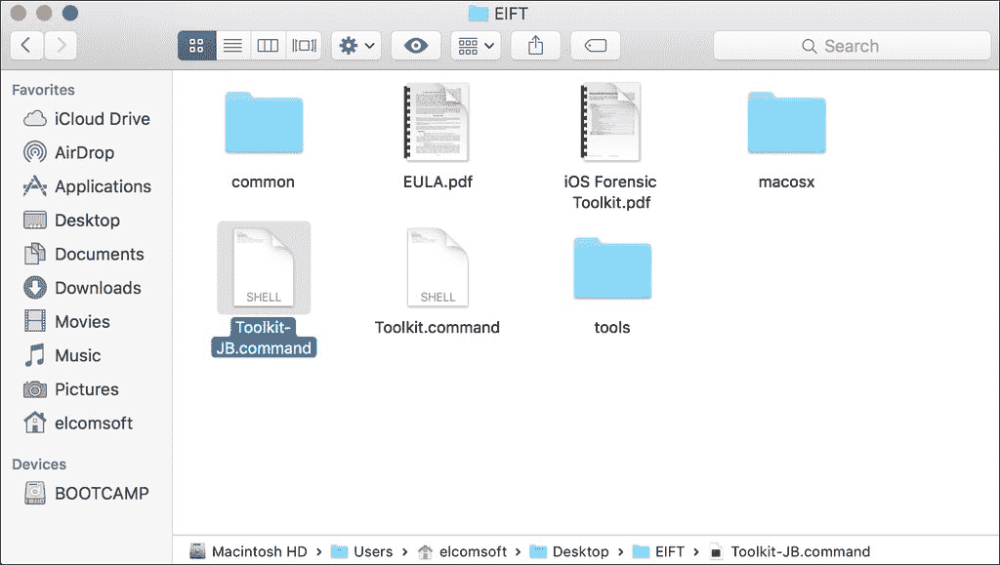

# 第五章：iOS – 介绍与物理获取

苹果于 2007 年 1 月发布了第一代 iPhone。从那时起，全球智能手机市场再也没有回到过去。

随着安卓设备的崛起，iOS 手机的市场份额多年来稳步下降。据[`www.idc.com/prodserv/smartphone-os-market-share.jsp`](http://www.idc.com/prodserv/smartphone-os-market-share.jsp)数据显示，到 2015 年第二季度，iPhone 约占所有智能手机销量的 14%，其余市场则由安卓系统主导。

从绝对数量上来看，仍然有很多旧款 iOS 设备。仅在 2015 年第一季度，就售出了大约 7440 万部 iPhone。

在美国，iPhone 在 2015 年第三季度占据了 35.58%的用户基数（来源：[`bgr.com/2015/10/01/iphone-market-share-q3-2015-android/`](http://bgr.com/2015/10/01/iphone-market-share-q3-2015-android/)）。在美国使用如此多的 iOS 智能手机的情况下，对 iOS 取证的需求依然强劲。

本章将讨论从 iOS 设备获取信息的可选方法。我们还将详细讨论物理获取，介绍执行物理获取所需的工具和实际步骤。本章将涵盖以下内容：

+   苹果 iOS 的安全隐患及其如何影响可用的获取选项

+   苹果硬件的不同代际，以及传统的 32 位设备和现代的 64 位设备之间的区别

+   越狱的必要性

+   不同的 iOS 获取方法以及何时使用它们

+   物理获取的详细介绍——工具、技术和实际步骤

# iOS 取证 – 介绍

不同的设备需要不同的获取技术。不同版本的 iOS 系统需要不同的获取路径，每个版本都有其独特的攻击向量。在苹果的生态系统中，我们几乎看不到如此广泛的设备种类和高度定制化的操作系统版本（每个版本都有其自身的漏洞），但仍然有许多设备可供使用。

## 苹果硬件的不同代际

iOS 是一个封闭的操作系统，只支持苹果制造的硬件。因此，我们不需要处理来自数十家不同制造商和数千个型号的设备。到 2015 年第二季度，苹果已经发布了十款 iPhone、五款 iPod Touch、六款全尺寸 iPad 和三款 iPad mini。

虽然可以在[`en.wikipedia.org/wiki/List_of_iOS_devices`](https://en.wikipedia.org/wiki/List_of_iOS_devices)查看苹果硬件的一般信息和最新规格，但官方规格中没有提到的几点内容可能会影响设备对物理获取的易受攻击性。

早期的苹果设备在受信启动（Trusted Boot）上存在漏洞，允许攻击者在 DFU 模式下绕过签名验证。由于签名验证代码位于设备的只读存储器中，苹果永远无法修补已存在设备中的这个漏洞。这个漏洞让移动取证专家能够创建工具，用于无条件、始终有效的物理获取易受攻击的 iOS 设备（例如，Elcomsoft iOS 取证工具包，网址：[`www.elcomsoft.com/eift.html`](https://www.elcomsoft.com/eift.html)）。

### 提示

不管 iOS 版本和越狱状态如何，iPhone 3G、3GS 和 4；第一代至第四代 iPod Touch；以及原版 iPad，都可以进行无条件的物理获取。

在新一代硬件中，苹果修复了这个漏洞，使得物理获取过程变得更加复杂。

因此，使用 32 位处理器的设备，包括 iPhone 4S、iPhone 5、iPhone 5C、iPad 2+、iPad Mini 和第五代 iPod Touch，只有在设备越狱（无论是由用户还是调查员越狱，如果密码已知）后，才能进行获取。

那么，使用 64 位芯片组的苹果最新一代设备怎么样？所有 64 位苹果设备，如 iPhone 5S、iPhone 6 和 iPhone 6 Plus；iPad 2 及更新版；iPad Air 和 Air 2；以及 iPad Mini 2 和 3，都可以通过 Elcomsoft iOS 取证工具包进行物理获取。获取过程需要越狱的设备；设备的密码必须已知，并且必须在设备的**安全性**设置中移除，才能进行获取。

你有多大可能遇到 32 位的苹果设备？虽然没有关于每一代设备仍在使用的直接统计数据，但我们可以通过查看官方的 iOS 版本统计数据来估算这些数字。虽然苹果以提供最新 iOS 更新并对旧版本进行更新而著称，但这些设备在接受更新时有着有限的能力和时间框架。因此，以 iPhone 4 为例，支持的最新 iOS 版本是 iOS 7.1.2；而所有更新的设备都支持 iOS 8。

到 2016 年 2 月，苹果声称（[`developer.apple.com/support/appstore/`](https://developer.apple.com/support/app-store/)）约 76%的用户已经升级到 iOS 9。大约 17%的苹果用户使用 iOS 8，而早期版本只占苹果用户基础的 7%。

在硬件方面，这意味着早期的设备，如 iPhone、iPhone 3G 和 3GS，只有少量的代表性（市场份额为 2%）。由于 iPhone 4 支持 iOS 7.x，因此它可以被视为 7%组的一部分（使用 iOS 7）。然而，大多数 iPhone 都在使用 iOS 9（76%）或 iOS 8（17%），这意味着它们是 iPhone 4S、5、5C、5S、6 和 6 Plus。

## 是否需要越狱？

由于物理获取需要对数据分区进行低级别访问，物理获取仅在越狱的 iOS 设备上可行。其他获取方法，例如，逻辑获取和空中获取，则不需要越狱。

## 地理位置相关信息

iOS 设备配备蜂窝模块，定期收集和存储地理位置相关信息，这已不是什么新闻。iOS 设备能够捕捉到附近蜂窝基站和 Wi-Fi 接入点的信息，即使设备未连接到它们。这些信息以明文未加密的形式存储在 `cache_encryptedA.db` 文件中。该文件会保留最多 45 天的蜂窝基站和 Wi-Fi 网络的追踪信息。Apple 官方声明称：

> *iPhone 并不会记录你的位置信息。相反，它会维护一个包含你当前所在地周围 Wi-Fi 热点和蜂窝基站的数据库，其中一些可能位于距离你的 iPhone 一百多英里的地方，帮助你的 iPhone 在请求时迅速且准确地计算出其位置。仅使用 GPS 卫星数据计算手机位置可能需要几分钟的时间。iPhone 可以通过利用 Wi-Fi 热点和蜂窝基站数据，快速找到 GPS 卫星，甚至在 GPS 无法使用时（例如在室内或地下室），仅使用 Wi-Fi 热点和蜂窝基站数据就能三角定位出其位置，从而将定位时间缩短到仅几秒钟。这些计算在 iPhone 上实时执行，使用由数千万部 iPhone 汇集的 Wi-Fi 热点和蜂窝基站数据的众包数据库，这些数据通过匿名加密的方式发送给 Apple，包含了周围 Wi-Fi 热点和蜂窝基站的地理标记位置。*

值得注意的是，`cache_encryptedA.db` 文件不会存储在设备的备份中，无论是云备份还是通过 iTunes 创建的备份。由于 Apple iOS 中没有用户访问系统文件的权限，因此必须越狱才能提取该文件。当然，`cache_encryptedA.db` 文件始终会作为物理获取过程的一部分被提取。移动取证工具（例如，Oxygen Forensic Toolkit）可以解析该文件，并显示用户的追踪信息，如下图所示：

地理位置相关信息

提取地理位置相关信息是物理获取相较于逻辑提取的主要优势之一。如果特定设备无法进行物理获取，在需要访问嫌疑人位置历史的情况下，尝试越狱并手动提取 `cache_encryptedA.db` 文件将是值得的努力。

其他的地理位置历史来源也可能是可用的，包括照片 EXIF 标签和应用数据（如果启用了地理定位并允许由用户提供）。

## 这些信息存储在哪里？

显然，手机本身被视为数据的主要来源，这也是理所当然的。然而，如果手机被锁定且密码未知呢？再者，如果你没有手机呢？

智能手机收集的信息存储在多个地方，并且可以从中提取。Apple 手机可以通过 iTunes 将数据备份到 PC，或通过 Wi-Fi 将数据备份到 Apple 自有的云服务（iCloud/iCloud Drive）。因此，你可能正在处理一组备份文件（可能有密码，也可能没有），或者你仅拥有一台没有任何备份文件的计算机，但它曾用于与 iCloud 同步。

有时你可能会拥有一切：一部手机、一组离线备份和一台与 iCloud 同步的计算机。但更多的时候，你可能需要立即获取信息，或者 *越快越好*。在最短时间内获取尽可能多的信息的最佳路线是什么？答案取决于你手中到底有什么。

## iOS 采集方法概述

虽然有多种方法可以帮助提取移动设备的内容，但选择哪种方法通常取决于你拥有的工具。你有一部可用的 iPhone 吗？你可以尝试物理采集，但前提是设备在兼容性矩阵范围内。你是否有访问与手机同步过的计算机？搜索移动备份。如果你能找到 iTunes 备份，可以使用逻辑采集来破解备份并提取信息。那台计算机是否用于与 iCloud 同步？查找 iCloud 身份验证令牌。如果找到，可以利用该令牌绕过登录密码直接连接到用户的 iCloud 账户。你是否知道用户的 Apple ID、BlackBerry ID 或 Windows Live 账户和密码？云取证可以帮助你从云端下载数据。

选择采集方法时，请参考以下表格：

| **我拥有...** | **物理采集** | **逻辑采集（备份分析）** | **云取证** |
| --- | --- | --- | --- |
| 物理设备（iPhone、iPad 或 iPod Touch） | 是* | 可能 | 可能 |
| 与手机/平板电脑同步过的计算机（或信任过的设备） | 不适用 | 不适用 | 可能 |
| iOS 设备及与其同步（或信任）的计算机 | 不适用 | 可能***** | 可能 |
| iTunes 备份 | 不适用 | 是** | 可能 |
| Apple ID 登录和密码 | 不适用 | 不适用 | 是*** |
| iCloud 身份验证令牌 | 不适用 | 不适用 | 是**** |

*物理采集仅适用于特定设备。请参阅 第六章，*iOS 逻辑与云采集* 以获取详细的兼容性矩阵。

**某些备份可能受到复杂长密码的保护。对于受密码保护的备份，没有保证恢复时间框架或成功恢复密码的保证。

***Apple 的双因素认证使事情变得稍微复杂了一些。如果某个 Apple ID 启用了双因素认证，则需要访问次级认证单元（例如受信设备、恢复密钥或应用程序特定密码）。Microsoft 采用类似的双因素认证方法。目前，Elcomsoft 产品仅支持 Apple 设备的双因素认证。

****认证令牌可能会过期（具体取决于 iOS 版本）。它们的确切寿命目前尚不清楚。虽然我们在使用 ATEX 工具从**控制面板**提取的一些令牌在一小时内过期（仅适用于 iOS 8.x 的云备份），但在其他情况下我们并未遇到这种情况。我们正在进行广泛的测试以了解更多。值得注意的是，云文件的认证令牌*寿命更长*。iOS 9 将云备份转移到 iCloud Drive；目前，其认证令牌没有过期日期（或拥有非常长的生命周期）。最后，当用户更改账户密码或明确从某台计算机上退出云端时，认证令牌将失效。

*****如果你拥有一台与设备同步过的计算机和该 iOS 设备本身，你或许可以提取解密密钥并强制设备进行备份，甚至无需知道密码。然而，这只有在 iOS 设备在上次与计算机同步后没有重新启动的情况下才可能实现。有趣的是，即使 iOS 设备上没有启用自动同步，当你将设备插入时，它仍会提示是否信任该计算机。如果答案是*是*，则会创建一对加密密钥（在设备上和计算机上）。

## iOS 获取方法对比

在不太可能的情况下，如果你拥有物理设备、其离线备份副本以及用户的 Apple ID/密码（或从用户 PC 收集的二进制认证令牌），你应该选择哪种获取方法？

答案取决于你需要数据的速度，以及是否需要访问已删除的文件和钥匙串。物理获取是迄今为止最好的获取方法——如果你的设备受到支持的话。云获取可以返回当前和过去的数据，而离线备份则是最容易（如果没有密码保护）或最慢（如果有密码保护）恢复的数据。

不同的获取方法彼此之间提供不同的优点。

对于 iOS 设备，物理获取是首选方法（请参考下一章中的*兼容性矩阵*部分）。物理获取提供以下优点：

+   访问存储在移动设备中的完整信息（如果已知或恢复了密码）

+   保证的时间范围（如果已知密码或使用了四位数密码）

+   极高的获取速度

+   潜在访问某些已删除数据（例如，联系人和消息），这些数据存储在 SQLite 数据库中

+   访问钥匙串信息（如果知道密码或能够恢复）

+   访问最多 45 天的地理位置跟踪数据

iOS 设备的逻辑获取涉及分析由 Apple iTunes 生成的离线备份。逻辑获取具有以下优点：

+   访问存储在移动设备中的大多数信息

+   密码保护备份没有保证的恢复时间

+   可能访问存储在 SQLite 数据库中的某些删除数据（例如，联系人和消息）

+   如果通过物理获取从设备提取了解密密钥，则可以访问钥匙串信息

+   钥匙串数据可以从密码保护的备份中恢复

+   长且复杂的密码可能完全阻止恢复

云获取适用于运行 Apple iOS、BlackBerry 和 Windows Phone 8/8.1 的移动设备。云获取具有以下优点：

+   访问存储在移动设备中的大多数信息

+   访问设备中某些文件（但实际未存储在设备中）

+   恢复时间高度依赖于连接速度和可用的云吞吐量

+   可能访问存储在 SQLite 数据库中的某些删除数据（例如，联系人和消息）

+   iOS：如果通过物理获取从设备提取了解密密钥，则可以访问钥匙串信息

+   iOS：即使登录和密码已知，双因素认证也可能禁止云访问（如果有有效且未过期的认证令牌，可以绕过）

最后，可以通过直接从内存芯片提取数据来执行芯片拆除获取（需要专用硬件和技能）。芯片拆除获取具有以下特点：

+   在旧设备上，除加密的部分（钥匙串）外，几乎可以提取所有信息。

+   最近一代的 iOS 设备广泛依赖于加密存储。因此，大多数用户数据将保持加密，并使用强大且不可提取的加密密钥。

+   保证的时间框架，但可访问的数据量有限。

+   获取速度极快。

+   无法访问钥匙串信息或历史位置信息。

以下表格总结了各种获取方法的可能结果：

|  | **物理获取** | **逻辑获取** | **云取证** | **芯片拆除** |
| --- | --- | --- | --- | --- |
| 大致时间框架 | 35-50 分钟（取决于设备型号） |

+   即时（未保护的备份）

+   未知（密码保护）

| 0-4 小时（取决于连接速度和数据量） | 1-4 小时（取决于技能水平） |
| --- | --- |
| 钥匙串恢复 | 是 |

+   否（未保护的备份），除非**securityd**可用

+   是的（密码保护）

| 否（除非 securityd 可用） | 否 |
| --- | --- |
| 访问已删除文件 | 否* | 否 | 否 | 否 |
| 删除的 SQLite 记录访问 | 是 | 是 | 是 | 是 |
| 最多 45 天的地理位置跟踪数据 | 是 | 否 | 否 | 是 |
| 可能的问题 | 上一代设备必须越狱（参考*兼容性矩阵*） | 长而复杂的密码可能会阻止恢复 |

+   需要 Apple ID/密码或认证令牌

+   双因素认证

+   通知电子邮件

|

+   仅适用于 iOS 1 至 4

+   最近的设备使用了完整的硬件加密

+   加密数据不可恢复且无法解密

+   对于最近的 iOS 设备，无法使用 *Chip-off* 获取方法

|

*访问已删除的文件对 iOS 1.x 到 3.x 版本是可能的。然而，遇到这么旧的 iOS 版本的机会几乎为零。

## iOS 高级逻辑获取

不久前，Jonathan Zdziarski 引入了一种所谓的高级逻辑获取方法。这在其流行时期非常受欢迎。检查员仍然需要拥有一个解锁的设备，但如果是这样，相较于纯逻辑获取（备份分析），可以获取更多的信息。

与纯逻辑获取相比，先进的逻辑获取提供了以下优势：

+   iTunes 备份密码无法阻止访问未受到任何密码保护的个人数据，例如联系人或短信

+   可以提取更多应用数据，包括日志文件

由于 Apple 修复了该获取方法使用的漏洞，并隐藏了相应的服务，因此该方法的使用寿命较短。自 iOS 8 起，只有应用共享的文档（例如，由办公应用编辑的文档或由媒体播放器观看的视频）才能通过此方法提取。

## iOS 物理获取

物理获取是目前 iOS 设备上最全面的获取方法。其他平台（例如 Android、BlackBerry OS、BlackBerry 10 和基于 Windows 的设备）可以通过一些较低级别的技术，如 JTAG、ISP 或 Chip-off 方法来获取。这些获取技术对于 iOS 设备不可用，因为强制实施的全盘加密（无论用户是否设置额外的安全性）使得物理获取成为唯一可行的方案。与任何其他方法（如逻辑获取或备份分析）相比，物理获取能返回显著更多的信息。存储在 Apple 受保护存储中的数据，如钥匙串，只能通过物理过程访问。

物理获取非常决定性：要么有效，要么无效。如果有效，你可以在不到 40 分钟内完成整个设备的成像，即使是 32GB 的 iPhone 4，这款设备是最慢的之一。存储更大的设备可能需要更长时间；然而，与尝试攻击备份密码时的不确定性不同，物理获取是明确可预见的。ElcomSoft 为 iOS 设备开发了一款物理获取工具包：

从 iPhone 4S 发布开始，相较于所有旧设备，具备更强安全性的 iPhone 4S 使得每一代新的 iOS 设备的物理获取变得越来越困难。直到今天，Elcomsoft iOS Forensic Toolkit 才能支持新一代 iOS 设备的物理获取。

需要注意的是，限制性、无限制和保证的物理获取仅适用于旧款 Apple 设备（请参考下一章的*兼容性矩阵*部分）。从 iPhone 4S（或 iPad 2）开始，成功的物理获取要求检查员要么知道用户的原始密码（以便安装越狱），要么拥有一台已越狱的设备。如果设备被密码锁定，则无法安装越狱，也无法获取该设备。除了越狱外，还必须从 Cydia 安装 OpenSSH 工具。

在越狱设备上，Elcomsoft iOS Forensic Toolkit 可以通过暴力破解或字典攻击来破解原始密码。在越狱的 iPhone 5 和 5C 设备上，密码恢复速度大约为每秒 15.5 个密码，允许 iOS Forensic Toolkit 在大约 10 分钟内破解典型的四位数密码。然而，即使没有密码，也可以轻松地提取设备；因此，下载的邮件和钥匙串数据将保持加密状态。

在配备 64 位平台和 Secure Enclave 的 iOS 设备上，物理获取的限制更加严格。在此类设备上，必须知道密码并能够从设备设置中移除它（这还包括越狱设备）。即便如此，钥匙串可以提取，但在 64 位设备上无法解密。

## 物理获取的好处

物理获取相较于其他获取方法提供了许多优势。固定的时间框架和保证的交付只是其中的一部分。

物理获取提供以下好处：

+   获取完整的位精确设备镜像

+   提取了未分配的空间，但在较新的 iOS 版本上无法解密

+   解密钥匙串项并提取设备密钥

+   保证的时间框架：32 GB 型号需要 20 到 50 分钟

+   零足迹

+   不需要密码（适用于旧设备或已安装越狱的设备）

+   简单的四位数密码在 10 到 40 分钟内恢复（适用于旧设备或越狱设备）

物理获取是唯一可以提取以下信息的方法：

+   **缓存（下载的）邮件**：无论是什么类型的电子邮件账户，缓存的邮件在离线或在线备份中均不可用。下载的邮件也可以通过所谓的*高级逻辑获取*方式获取，该方式利用一些未文档化的 iOS 服务，并且需要密码或来自信任计算机的配对记录。此外，缓存邮件还可以通过 64 位物理获取过程获得。

+   **地理位置信息**：虽然 iTunes 和 iCloud 备份仅包含有限的地理位置信息（例如，从地理标记图像中提取），但实体获取可以提取更多关于用户位置的详细信息。这包括常用位置以及应用程序和系统服务请求的位置信息。位置数据会在某些事件发生时请求（并存储），例如使用地图、校准指南针、广告追踪、浏览网页、请求用户位置、查找无线网络等。通过实体获取位置信息，可以精确地重建嫌疑人的行踪。

+   **系统日志和崩溃日志**：这显示了已启动或已安装的应用程序。

+   **缓存的应用数据**：这提供了缓存的网页、输入的地址和任何被第三方应用缓存的网页数据。许多 iOS 应用程序是基于 Web 的，因此通过实体获取可以获得的缓存数据量可能非常庞大。

+   **某些类型的删除数据**：包括已删除的联系人、短信和 iMessages（也可以通过逻辑获取从 SQLite 数据库中提取）。

+   **钥匙串**：在 Apple 设备中，这个受保护的存储空间用于存储高度敏感的信息，例如网站和在线帐户的密码、财务信息以及第三方应用写入受保护存储的数据。由于有不同的保护级别，只有某些钥匙串项在处理备份时能够解密。实体获取可以解密整个钥匙串，提取所有可用信息。

+   **扩展的钥匙串获取**：苹果在 iOS 7 中更改了钥匙串格式。在 iOS 8 中，苹果将更多的数据移入了钥匙串。从 iOS 7 开始，注册了特定 Apple ID 的设备可能包含该 Apple 帐户的 iCloud 钥匙串的缓存副本（需用户授权）。如果 iCloud 钥匙串可用，则其提取可能使访问存储在其他共享相同 Apple ID 的 Apple 设备中的密码和信用卡信息成为可能。

## 实体获取有什么独特之处？

实体获取仍然值得吗？越狱的 iOS 设备在野外非常罕见。然而，越狱 iOS 设备的可能性依然存在，尤其是考虑到许多作为证据收集的设备已经等待了很长时间。我们仍然认为，如果可行，实体获取是最佳选择。以下是原因：

+   苹果有一项新政策，**拒绝**来自政府的设备信息请求，无论设备是否运行 iOS 8 或 9、是否具备安全隔区。苹果坚决捍卫这一政策。如果设备运行 iOS 8 或更高版本，将设备交给苹果后将无法获得完整镜像，即使苹果面临法律诉讼（[`www.apple.com/privacy/government-information-requests/`](https://www.apple.com/privacy/government-information-requests/)）

+   在某些地区，苹果运行认证翻新的项目，仍然以较低价格出售翻新的 32 位手机。例如，在 2015 年第一季度，翻新的 iPhone 4S 和 5 型号占据了俄罗斯零售渠道所有 iPhone 销售量的 46%。

+   相比其他任何获取方法，物理获取依然能够提供显著更多的信息（记住，苹果设备无法进行芯片提取）。电子邮件消息、应用数据、日志、位置信息以及大量其他数据永远不会进入备份中。

+   完整的钥匙串提取仅限于物理获取（仅限 32 位设备）。只有在没有安全加密区（Secure Enclave）的设备上才能解密钥匙串。这包括使用设备特定密钥加密的记录。虽然一些钥匙串项目可以从受密码保护的 iTunes 备份中提取，但许多项目在没有设备特定密钥的情况下无法解密。

+   物理获取（32 位过程）可以帮助从设备中提取 securityd（0x835）密钥。该密钥可以用于完整的钥匙串解密。此外，该密钥还可以用于解密来自 iCloud 备份和未加密密码的本地 iTunes 备份中的钥匙串项目。

+   对 32 位设备的物理获取返回一个标准的 DMG 磁盘镜像（HFS+ 文件系统），而对 64 位设备进行相同的操作则返回一个包含设备完整目录结构的 TAR 存档。

据我们所知，Elcomsoft iOS Forensic Toolkit 是唯一一款可以对 iPhone 4S、5 和 5C，特别是更新的 64 位设备进行物理获取的非苹果工具。

## 物理获取的未来

无条件的物理获取仅支持旧设备。从 iPhone 4S 开始，每次 iOS 迭代和每次硬件更新，苹果都在不断增强安全性，使物理获取变得越来越困难。

iOS 8 的发布是一个重要的分水岭，使得物理获取变得更加困难。iOS 8 中发生了以下两大变化：

+   所有用户数据现在都存储在一个依赖于密码的加密容器中。

+   针对密码尝试，新增了硬件级五秒延迟（仅限新款硬件）。

iOS 8 将大多数用户数据置于更严格的控制之下。消息、照片、联系人、通话记录以及许多其他内容现在都存储在受密码保护的容器中。一旦手机重启，解密密钥就会丢失，数据变得不可访问，直到用户输入正确的密码。然而，如果设备至少解锁过一次，除了钥匙串外，大部分数据将被解密并保持解密状态，直到设备关机。这正是 64 位获取过程所使用的方式。

那么，如何破解密码呢？对于 A7 和 A8 系列设备（iPhone 5S、6 和 6 Plus），苹果引入了硬件级别的五秒延迟，用于密码尝试。以下是苹果的官方说法：

> *在配备 A7 处理器的设备上，关键操作由安全隔离区（Secure Enclave）执行，它还会在连续的解锁失败请求之间强制执行 5 秒钟的延迟。这为暴力破解攻击提供了一个防护措施，此外还通过 iOS 强制执行了其他安全保障。（来源：[`www.apple.com/br/ipad/business/docs/iOS_Security_EN_Feb14.pdf`](https://www.apple.com/br/ipad/business/docs/iOS_Security_EN_Feb14.pdf)。)*

尽管目前尚不清楚延迟是硬编码的还是可以通过软件禁用，第三方获取工具现在每五秒钟只能尝试一次密码。这意味着，尝试所有可能的四位数密码组合大约需要 14 小时。对于更长、更强的数字或字母数字密码，暴力破解攻击已经不可行。

目前，所有配备 32 位和 64 位芯片组的现有设备都可以进行物理获取。进行物理获取时，必须使用有效的越狱。此外，必须知道密码（并且对于 64 位设备需要移除密码），才能获取最大的信息量。

## 物理获取兼容矩阵

物理获取是一项很好的技术。不幸的是，目前物理获取的可用性有限。较新的苹果设备（从 iPhone 4S 和 iPad 2 开始）具有更强的安全性，这限制了我们进行物理获取的能力。如今，以下设备可以通过此方法获取：

+   iPhone 3G、3GS 和 4（GSM 和 CDMA 型号）

+   iPhone 4S、5 和 5C***

+   iPod Touch（第一至四代）

+   iPod Touch 第五代 ***

+   iPad（仅第一代）

+   iPad 2***

+   配备 Retina 显示屏的 iPad（第三代和第四代）***

+   iPad Mini***

这些设备可以运行以下任何操作系统：

+   iOS 1 至 3（最高支持 3.1.3）

+   iOS 4.x——最高支持 iOS 4.3.5（iPhone 4 CDMA 支持 iOS 4.2.10）

+   iOS 5.x

+   iOS 6.x

+   iOS 7.0

+   iOS 7.1（使用 Pangu 1.2+ 越狱）

+   iOS 8.x 和 9.x****

*运行 iOS 3.0 之前版本的设备没有启用数据保护，其用户分区未加密。*

**最初出厂时搭载 iOS 3.x 的设备，包括那些从 iOS 3.x 升级到 iOS 4/5 的设备（没有执行 `erase install`，即使用 iTunes 中的 **更新** 选项而不是 **恢复**），没有启用数据保护，用户分区没有加密。因此，不需要进行解密。**

***iPhone 4S、iPhone 5、iPhone 5C、iPad 2+、iPad Mini 和 iPod Touch 第五代可以恢复，如果已知密码或设备已越狱（iOS 5 至 9）。***

****新设备的物理采集（iPhone 4S 及更新版本）仍然受限于越狱的可用性。越狱设备并恢复（在某些情况下，移除）密码是强制性的，因为所有用户数据现在都采用依赖密码的密钥进行加密（与 iOS 7 相比，iOS 7 仅为钥匙串和邮件保护使用了如此强的加密）。*

*****64 位型号的物理采集（iPhone 5S/6/6S/Plus、iPad mini 2/3/4、iPad Air / Air 2 和 iPad Pro）通过一种不同的采集过程进行，这个过程专门称为 **64 位设备的物理采集**。越狱设备并在 iOS 设置中移除密码保护是强制性的。64 位 iOS 设备的采集在单独的章节中进行说明。

## 未分配的空间 - 自 iOS 4 起不可用

如果您获取的是运行 iOS 3.x 或更早版本的设备，则只有通过物理采集才能访问未分配的空间。由于这些是非常旧的 iOS 版本，您在现实生活中遇到的可能性极低。如果您遇到这样的设备，您可以使用 Elcomsoft iOS Forensic Toolkit 绕过密码保护并提取设备的完整镜像，包括未分配的空间。

自 iOS 4 以来，苹果使用依赖密码的文件系统加密。iOS 不会保存未被文件占用区域的加密密钥。在文件删除后，系统会销毁对应数据块的加密密钥。因此，在进行物理采集时，无法解密这些未分配的区域。在使用 Elcomsoft iOS Forensic Toolkit 或其他第三方工具进行内部物理采集时，未分配的磁盘空间会被提取，但不会被解密。

可以恢复的是包含已删除短信、通话记录和聊天记录的 SQLite 记录。然而，这个过程远非简单，需要使用专业软件或 SQLite 特定的专业知识。

## 发送设备到苹果

在其隐私政策中（[`www.apple.com/privacy/government-information-requests/`](https://www.apple.com/privacy/government-information-requests/)），苹果明确表示以下内容：

> *在运行 iOS 8 的设备上，您的个人数据，如照片、信息（包括附件）、电子邮件、联系人、通话历史记录、iTunes 内容、备忘录和提醒事项，都受到您的密码保护。与我们的竞争对手不同，苹果无法绕过您的密码，因此无法访问这些数据。因此，从技术上讲，我们无法回应政府要求从其持有的运行 iOS 8 的设备中提取这些数据的命令。*

分析新款 64 位设备的系统工作方式后，我们倾向于相信前述说法是正确的。

由于 iOS 8 的技术特点以及苹果公司新政策的限制，目前无法向苹果请求已解密的设备镜像，但执法机构仍然可以将运行旧版本 iOS 的苹果设备送交苹果，以获取其未加密的镜像。在这种情况下，苹果会提供设备的完整解密镜像（如果不知道密码，钥匙串可能会成为例外）。

## 密码的作用

密码是 iOS 安全性的核心。即使它只是一个由四个数字组成的简单 PIN 码，实际上，密码是移动世界中最强大安全模型之一的关键。这个密码与一个独特且非常长的二进制数据字符串（硬件加密密钥）结合，用于生成一个独特且极其强大的加密密钥。然后，设备使用这个加密密钥和政府标准的 AES 加密算法对设备的敏感数据进行加密，包括短信、电子邮件、照片等。

需要注意的是，如果没有访问设备的硬件加密密钥，就无法生成加密密钥，而且即使将设备拆解成小块，也无法获得该硬件加密密钥。如果没有正确的密码，基于密码加密的数据将保持加密状态，即使完整的镜像已经被提取出来。

换句话说，除非已知原始密码，否则设备的某些部分可能仍然会被加密（这在最新的 iOS 版本中尤为明显）。恢复原始密码只能在设备本身进行。

旧版本的 iOS 并未使用密码加密所有用户数据。即使没有密码，我们也能破解这些设备并几乎获取所有数据。但 iOS 8 后情况发生了变化。

以下图表总结了成功获取数据是否需要密码：

+   **iOS 1.x 至 3.x**：在这些版本中，不需要密码。所有数据都可以访问。密码会立即被恢复并显示。

+   **iOS 4.0 至 7.x**：密码不是强制要求的，但强烈建议使用。某些数据通过基于密码的密钥进行保护：

    +   电子邮件消息

    +   钥匙串项目

    +   某些第三方应用程序数据，如果该应用程序请求了安全访问权限

+   **iOS 8 和 9**：成功获取数据需要输入密码。大多数用户信息都通过基于密码的密钥进行保护。

## 物理获取 iOS 8 和 9 的数据

iOS 9 是苹果移动操作系统中最新且最安全的版本。根据苹果的数据，到 2016 年 2 月，大约 76% 的苹果客户已升级到最新的 iOS，而 17% 的用户仍在使用 iOS 8。仅有 7% 的设备在运行 iOS 7 或更早版本（来源：[`developer.apple.com/support/app-store/`](https://developer.apple.com/support/app-store/)）。

在 iOS 8 中，Apple 进一步加强了 iOS 设备的安全性。苹果移动操作系统的第 8 和第 9 代加密了比以往更多的信息。数据加密在苹果设备上并不新鲜，这项技术已经实施了多年。新的变化在于手机加密存储的数据量。在 iOS 8 中，苹果将电子邮件、信息、照片和视频等内容移入了手机的加密区域。再次强调，许多以前可以访问的数据（且对调查非常有价值）被移动到了受密码保护的部分，这使得在不知密码的情况下进行物理获取几乎毫无意义。苹果宣称，iOS 8 及更高版本的安全性极高，以至于即使政府提供了有效的设备，也将拒绝提取信息的请求（来源：[`www.apple.com/privacy/government-information-requests/`](https://www.apple.com/privacy/government-information-requests/)).

从实际操作角度来看，这意味着你必须破解密码才能正确提取运行 iOS 8 或 9 的设备镜像。要破解新版设备（如 iPhone 4S、iPad 2 及其更新型号）的密码，设备必须已经越狱或能被调查员越狱。对于 iPhone 4S 之前的未越狱设备以及原版 iPad，破解密码仍然是可能的。截至目前（2016 年 2 月），唯一提供 iOS 8 和 9 设备物理获取支持的法医工具是 Elcomsoft iOS Forensic Toolkit。该工具支持 32 位和 64 位设备，这些设备要么已经越狱，要么能够被调查员越狱。如果设备没有越狱（且不知道密码），通过物理获取能够访问的唯一信息是通话记录和短信历史。此外，在进行 64 位设备的物理获取时，必须先在设备的安全设置中移除密码。

关于苹果如何加密信息以及 iOS 8 中发生了哪些变化的更多信息，请访问以下网址：

+   [`www.slate.com/articles/technology/future_tense/2014/09/ios_8_encryption_why_apple_won_t_unlock_your_iphone_for_the_police.html`](http://www.slate.com/articles/technology/future_tense/2014/09/ios_8_encryption_why_apple_won_t_unlock_your_iphone_for_the_police.html)

+   [`blog.cryptographyengineering.com/2014/10/why-cant-apple-decrypt-your-iphone.html?m=1`](http://blog.cryptographyengineering.com/2014/10/why-cant-apple-decrypt-your-iphone.html?m=1)

## iOS 物理获取工具

物理获取 iOS 设备需要使用专用的获取工具。Elcomsoft 提供了 iOS Forensic Toolkit ([`www.elcomsoft.com/eift.html`](http://www.elcomsoft.com/eift.html))，这款工具支持比任何竞争产品更多型号的物理获取。

请注意，以下页面包含了展示如何使用工具包来获取 iPhone 的视频：

[`www.elcomsoft.com/ios_forensic_toolkit_video.html`](http://www.elcomsoft.com/ios_forensic_toolkit_video.html)

# 教程 – 使用 Elcomsoft iOS Forensic Toolkit 进行物理获取

让我们使用 iOS Forensic Toolkit 提取 iPhone 的内容。但首先，我们先来看看当工具进行物理获取时，实际发生了什么。

## 该工具的功能是什么？

获取过程的第一步是将设备置于所谓的**DFU**模式（**调试和固件升级**模式），通过按住 Home 和 Power 按钮的组合来实现。Elcomsoft iOS Forensic Toolkit 会显示如何将设备进入此模式的提示。

一旦设备进入 DFU 模式，我们可以使用其*F*功能，模拟固件升级。然而，与其加载苹果原厂固件不同，工具包尝试加载经过修改的固件。设备将通过引导 ROM 功能验证新的固件的数字签名（这些是只读的，无法关闭）。现在，如果我们正在获取 iPhone 4 或更早的版本，工具包可以利用一个引导 ROM 漏洞，跳过检查，并将修改过的固件加载到设备的易失性内存（RAM）中。在这种情况下，设备存储保持不变，因为所有操作仅在设备的易失性内存中进行。

如果我们正在获取 iPhone 4S，之前可以用于旧款 iPhone 的引导 ROM 漏洞就无法使用。因此，工具包使用另一种方法，该方法仅在设备已越狱的情况下有效。在此方法中，工具包通过 OpenSSH 连接到设备并安装和启动获取工具。该方法会通过安装获取工具改变设备内容。必须考虑到这一点并妥善记录，以确保过程具有法医证据的有效性。

### 前提条件

您需要一台正常工作的 iOS 设备，一个兼容的 USB 电缆来将其连接到计算机，并且需要一份 Elcomsoft iOS Forensic Toolkit（需要 USB 加密狗才能操作）。

请注意以下事项：

+   必须安装成像工具才能获取设备

+   如果未安装越狱，您需要通过按住 Home 和 Power 键的组合将设备置于 DFU 模式（设备固件升级模式）

+   对于苹果的 64 位设备，可以通过单独的过程进行物理获取（请参见*获取 64 位苹果设备*）

+   只有在 DFU 模式下才能恢复密码

**步骤 0 - 连接设备**：使用适当的 USB 电缆将苹果设备连接到您的计算机。启动 iOS Forensic Toolkit。

**步骤 1 - 进入 DFU 模式**：如果您正在成像一台已知可以进入 DFU 模式的设备，可以认为这是幸运。在 iOS Forensic Toolkit 中，输入 `1`，如下图所示：

如果您正在获取较新的设备，如 iPhone 4S、iPhone 5、iPhone 5C、iPad 2、iPad 3、iPad 4 及更新型号），则只有在您知道正确的密码或设备已越狱的情况下，物理获取才可用。要获取此类设备，请直接跳到步骤 3：

您将看到如何将设备进入 DFU 模式的互动指南：

在第一次尝试时可能有点难掌握。请花时间并多次尝试，直到成功。当您的设备进入 DFU 模式时，继续执行步骤 2。

请注意，将设备置于 DFU 模式或拥有已越狱/解锁的设备对于恢复原始密码至关重要。

**步骤 2 - 加载 RAM 磁盘**：在此步骤中，您将把获取代码加载到 Apple 设备中。该代码将被加载到设备的易失性内存（RAM）中，不会修改任何内容。要加载 RAM 磁盘，可以执行以下任一操作：

+   在提示时同意加载 RAM 磁盘

+   在主屏幕上按`2`并按照提示操作：

加载 RAM 磁盘时，设备会显示 Elcomsoft 的标志。

请注意，从 iOS 4 开始，加载 RAM 磁盘是恢复密码的必要前提条件。

**步骤 3 - 恢复密码**：这一过程在一年前还是可选的。今天，尝试恢复密码是获取任何有意义信息的必要步骤。如果您已经有了正确的密码，可以跳到下一步。

是否需要恢复密码以获取用户数据，取决于设备所使用的 iOS 版本：

+   **iOS 1.x 到 3.x**：无需密码。所有数据都可以访问。密码会立即恢复并显示。

+   **iOS 4.0 到 7.x**：密码不是必需的，但强烈推荐。部分数据通过依赖密码的密钥进行保护：

    +   电子邮件消息

    +   钥匙串项目

    +   某些第三方应用程序的数据，如果该应用请求了安全访问

+   **iOS 8 和 9**：密码是成功获取的必要条件。大多数用户信息都通过基于密码的密钥进行保护。

如果您阅读过前面的章节，您会知道密码是 Apple 安全性的关键。在旧设备和早期版本的 iOS 中，密码用于生成保护存储在 Apple 安全存储区（钥匙串）中的信息的加密密钥。即使在旧设备和早期的 iOS 版本中，保护的数据也包括账户密码、信用卡信息、Wi-Fi 密码以及对调查至关重要的其他信息。

随着 iOS 7 的发布以及随后的 iOS 8 升级（后来的 iOS 9），密码的作用大大增强。在运行 iOS 8 或 9 的现代设备中，受密码保护的分区现在存储的信息比以往更多。事实上，现在几乎所有有价值的信息都存储在受密码保护的磁盘中。电子邮件和短信、密码、通过手机相机拍摄的图片和视频，以及许多其他信息现在都已加密。因此，如果没有密码，今天对设备进行成像将比一年前返回的信息少得多。为了解密存储在受保护区域的信息，必须首先恢复密码。

由于苹果设计和实现其安全模型的方式，恢复密码仅能使用原始设备进行。虽然使用计算机或一组 GPU 加速工作站来恢复密码听起来很诱人，但即使在理论上也是不可能的。

苹果设备可以使用标准的数字密码（四位 PIN）、长数字密码和完整的字母数字密码。这些类型的密码可以通过 iOS Forensic Toolkit 通过暴力破解或字典攻击（如果破解字母数字密码）进行恢复。

请注意，您需要先加载 RAM 磁盘（如前一步所述），才能恢复运行 iOS 4 或更高版本的设备密码。

另一个需要注意的是破解密码的速度。密码恢复很慢！它故意很慢，这是苹果设计的特性。苹果在其各个设备中仔细平衡了所使用的算法，显然目标是每个密码的验证时间大约为 80 毫秒。因此，恢复四位数字密码可能需要约 35 分钟；暴力破解可能需要更长时间，字母数字密码则可能永远无法破解。

使用 iOS Forensic Toolkit，恢复密码通过在主屏幕上输入`3`（**获取密码**）命令启动。您将看到以下窗口：

您将有以下选择：（**1**）查看密码类型（数字四位、数字长密码、字母数字密码），（**2**）暴力破解四位 PIN，（**3**）对字母数字密码进行字典攻击，或（**4**）使用完全手动选项。

虽然我们在恢复较长的字母数字密码时取得了一些有限的成功，但大多数 iPhone 用户选择简单的四位数密码。通过枚举所有可能的组合来暴力破解此类密码，在 iPhone 4S 上大约需要 35 分钟。输入`2`后，您将看到进度报告窗口。当前尝试的密码将显示：

一旦正确的密码被发现，它将显示出来。记下密码并按*Enter*继续提取设备密钥：

**步骤 4 - 提取设备密钥**：为了能够解密存储在加密分区上的信息（提醒一下，这包括用户密码、电子邮件、消息等），您需要获取设备密钥和钥匙串数据。在 iOS 取证工具包中，使用`4`（`GET KEYS`）命令。此操作是强制性的，您不能跳过它。没有密钥，既无法解密钥匙串，也无法解密设备镜像：

要获取设备密钥和钥匙串，请输入 `4`。

为了成功获取设备密钥和钥匙串数据，您需要提供设备密码（如果非空）：

**步骤 5 - 解密钥匙串项**：存储在 iPhone、iPod Touch 或 iPad 中的一些最有价值的信息存储在系统的受保护存储区——钥匙串中。受保护的信息使用强大的依赖于密码的加密密钥进行保护（这就是为什么需要恢复密码以获取这些密钥并解密钥匙串的原因）。随着每次 iOS 更新，苹果将更多的数据移到钥匙串存储中。根据 iOS 版本，受保护的信息可能包括电子邮件账户密码、消息、Wi-Fi 密码、输入的网站密码和某些第三方应用程序的密码、财务信息、文档等。

钥匙串解密是即时的。要解密钥匙串，在工具的主界面输入 `5`：

**步骤 6 - 执行采集**：通过物理连接捕获 iOS 设备时，您将有两种不同的选项：

+   在选项 1 中，您可以捕获设备的完整镜像（`IMAGE DISK` 命令，`6`）

+   在选项 2 中，您可以下载用户的文件作为 UNIX 风格的 tar 包（`TAR FILES` 命令，`8`）

下载单个文件的选项有时被称为 **逻辑采集**，但我们更倾向于将该术语用于涉及分析使用 Apple iTunes 创建的离线备份的采集方法。下载单个文件是一个更快速的选项，且支持即时解密。然而，如果选择下载文件，您将错过可能存储在未分配磁盘空间中的信息。

另一方面，`IMAGE DISK` 命令执行设备的完整物理镜像。当我们谈到 *物理采集* 时，我们通常指的是此选项。使用磁盘镜像，您将下载设备的逐位精确副本；不会执行即时解密。因此，稍后您需要使用 `DECRYPT DISK` 工具（命令 `7`）来解密磁盘。

让我们来看一下输入 `6`（`IMAGE DISK`）时会发生什么。首先，您将看到可用分区的列表。通常，您会看到 **System** 分区（通常是未加密的，包含系统文件和应用程序）和 **User** 分区（通常是加密的）。要选择一个分区进行镜像，请在提示符中输入其编号：

选择好分区后，获取过程将立即开始。根据设备型号和存储容量，获取设备的过程可能需要约 35 到 90 分钟。如果你选择像`8`命令那样的文件系统级获取，所需的时间将取决于设备中实际存储的用户数据量。如果用户数据不多，使用该模式进行获取的速度会非常快：

**第 7 步 - 解密磁盘**：在前一步获取磁盘镜像后，你将得到一个未加密的（系统）分区和一个很可能是加密的（用户）分区。为了能够分析用户数据，你需要首先解密该分区。解密通过从主窗口选择`7`命令（`DECRYPT DISK`）来执行：

就是这样！你已经获取了一个 iOS 设备的数据，并准备进行分析。数据以标准的 DMG 镜像格式保存。要分析信息，你可以使用许多第三方取证工具之一。如果你使用的是 Mac 电脑，为了手动访问 DMG 镜像中的信息，你只需要将镜像挂载到系统中（只读）。如果你使用的是 Windows 电脑，你需要安装一个 HFS+驱动程序，例如 Paragon HFS+，可以通过[`www.paragon-software.com/home/hfs-windows/`](http://www.paragon-software.com/home/hfs-windows/)下载。无论是哪种方式，挂载镜像后，你将能够访问设备中可用的单个文件和数据库。

## 获取 64 位的 Apple 设备

Elcomsoft iOS Forensic Toolkit 是市场上唯一（截至 2015 年 12 月）允许物理获取 Apple 64 位设备的工具。该工具可以从越狱的 64 位 iPhone（如 Apple iPhone 5S、6/6S/Plus）和 64 位 iPad（包括 iPad mini 2-4、iPad Air/Air2、iPad Pro）中获取信息。

64 位获取过程与以前从 32 位设备提取数据的老方法有显著不同。新方法向后兼容 32 位的 iPhone 和 iPad；然而，如果你有选择，我们建议在提取 32 位 iPhone 数据时，仍然使用老的、经过验证的获取流程。

请注意，新的获取过程必须有一个有效的越狱才能正常工作。

如果你不想阅读理论内容，可以直接跳到*在 64 位 iOS 设备上执行物理获取*部分。

### 比较 64 位过程和传统物理获取

为了成功操作苹果的 64 位设备，新获取过程必须在目标平台的限制内进行。与基于旧硬件的遗留设备相比，苹果的 64 位平台实现了更严格的安全保护；因此，64 位获取有一些在获取 32 位硬件时从未遇到过的限制。

两种获取方法之间的第一个区别在于输出数据格式。32 位物理获取过程通过以原始模式访问数据，返回设备的完整比特精确镜像。64 位平台实现了更强的保护，虽然可以生成磁盘镜像，但始终不会释放解密文件所需的加密密钥。因此，64 位获取过程被限制为使用更高层次的访问权限，以 Unix 风格的 TAR 归档形式捕获文件系统。请注意，归档文件包含的与传统过程产生的原始数据转储相同的数据。然而，钥匙串项无法解密。与处理完整的 DMG 镜像相比，分析文件系统镜像要稍微复杂一些，因为 DMG 镜像几乎被所有移动取证工具支持，而文件系统转储则没有那么广泛的支持。

这里是两种获取方法之间的第二个区别。64 位过程可以*提取*设备中的钥匙串数据库。然而，由于无法访问 securityd 设备密钥，新的过程无法*解密*钥匙串。因此，存储的 Web 表单和密码，以及其他放入钥匙串的数据将保持不可访问（至少在目前是这样）。

最后，必须使用正确的密码解锁设备，并在 iOS 设置中移除密码保护后才能进行提取。

最后，与旧的 32 位处理过程相比，64 位数据获取过程要更具侵入性。这意味着获取过程的每一步以及对设备内容的每次修改都必须仔细记录；否则，提取的证据可能无法作为证据被接纳。

总结一下，64 位过程相比于 32 位设备的物理获取有以下限制：

+   提取了钥匙串，但*未*解密

+   HFS+文件系统镜像（64 位）与比特精确镜像（32 位）

+   必须在 iOS 设置中移除密码后才能进行获取（64 位）

+   高度侵入，要求仔细记录，以确保证据可被接纳

## 支持的设备和 iOS 版本

从硬件角度来看，64 位获取过程支持所有以下设备，无论它们运行的是哪个版本的 iOS（假设该版本的 iOS 有可用的越狱工具）：

+   iPhone 5S、6、6 Plus、6S 和 6S Plus

+   iPad Air、Air 2 和 Pro

+   iPad mini Retina、iPad mini 3 和 4

+   iPod Touch 6 代

新的采集过程需要对文件系统的完全访问权限，因此，它在很大程度上依赖于设备已经越狱。由于 iOS 的新版本对于越狱者来说始终是一个挑战，如果你遇到运行最新版本 iOS 且尚未越狱的设备，你可能会运气不好（至少暂时如此）。截至目前（2015 年 12 月），iOS 9.1 和 9.2 Beta 仍然没有可用的越狱工具，因此你将无法在这些设备上使用新的采集过程。

### 在 64 位 iOS 设备上执行物理采集

64 位设备的采集过程与 32 位设备有很大不同。因此，在 iPhone 5S、6/6S 或任何 Plus 版本的设备上进行物理采集时，需要额外的步骤。

**步骤 1 - 在你的 iOS 设备上**：

1.  **确保设备已越狱**：64 位设备的物理采集仅限于越狱后的 iPhone、iPad 和 iPod。如果未越狱，请继续执行 *安装越狱*。

1.  如果没有安装 OpenSSH，请从 Cydia 安装它（[`cydia.saurik.com/openssh.html`](https://cydia.saurik.com/openssh.html)）或按照 [`www.cydiaos.com/install-openssh-on-iphone-ipod-without-cydia/`](http://www.cydiaos.com/install-openssh-on-iphone-ipod-without-cydia/) 上的说明进行安装。

1.  通过提供正确的密码来解锁设备。

1.  如果密码为空，请进入 iOS 法医工具包。

1.  在 iOS 设置中禁用密码保护。

    iOS 8（没有 Touch ID）：**设置** | **密码锁定** | **关闭密码**：

**步骤 2 - 安装越狱**

越狱 iOS 8 和 9 是一个繁琐的过程，并且没有保证的结果。根据 iOS 的版本，你可能需要遵循不同的步骤并使用不同的工具进行越狱。

例如，在 iOS 9.0.1-9.0.2 上安装 Pangu 越狱可能会卡在 85% 处，并显示错误信息。如果发生这种情况，你需要在第一次重启后（并且在将设备设置为 **飞行模式** 之前）打开照片应用程序，以确保设备上至少有一张照片。打开（并保持打开）照片应用程序可能足以继续；但是，安装越狱过程中可能会遇到其他很多障碍。

**你需要知道的事项**

为了越狱 iOS 设备，你需要禁用多个保护层。为此，你可能需要提供正确的 Apple ID 密码并输入正确的密码（如果启用了这些保护层中的一个或两个）。

**准备越狱**

+   在越狱之前，你需要使用正确的密码解锁 iOS 设备。

+   检查 **查找我的 iPhone** 是否已启用。如果启用了，请在 iOS 设置中禁用 **查找我的 iPhone**（需要 Apple ID 密码）：

TaiG 和 Pangu 越狱需要禁用 Touch ID 和密码保护。如果你在之前的步骤中没有禁用它们，请现在禁用。检查密码保护是否已启用（如果你在解锁设备时需要输入密码，则已启用）。如果已启用，请在 iOS **设置**中禁用**Touch ID**和**密码**（需要原始密码）：

**安装越狱**

对于 iOS 8.x（所有版本），使用 TaiG 越狱并按照[`www.taig.com/en/`](http://www.taig.com/en/)上的说明进行操作。

对于 iOS 9 到 9.0.2 版本，使用 Pangu 越狱并按照[`en.pangu.io/`](http://en.pangu.io/)上的说明进行操作。

对于 iOS 9.1 和 9.2 版本，目前没有可用的越狱（未来可能会有所变化）。

**步骤 3 - 连接设备**

一旦你的设备完成越狱，你可以通过 Lightning 数据线将其连接到计算机。启动 iOS 取证工具包。对于 64 位设备，大多数选项无法使用。64 位采集过程可以通过`TAR FILES`命令进行。

**步骤 4 - 使用 iOS 取证工具包**：

1.  **启动工具包**：

1.  **使用**TAR 文件**命令（第 8 项）从主菜单**：这将返回一个 Unix 风格的 TAR 归档文件，包含完整的文件系统和所有应用数据。钥匙串数据库也将被提取；但是，由于 64 位设备无法访问钥匙串解密密钥，无法进行解密：

    如果提示，输入 root 密码。默认的 root 密码是`alpine`。你需要输入两次密码。

    重新输入 root 密码：

    

1.  **指定文件名**：路径是相对于主目录的：

1.  **等待文件系统提取**：这可能是一个漫长的过程，尤其是在采集数据量大的设备时（在我们的实验室中，提取 7.5 GB 数据大约需要 10 分钟）：

1.  **当过程完成后，断开设备连接并开始分析数据**：

### 通过 64 位物理采集可获取的内容

64 位采集过程会返回设备的完整文件系统，包括钥匙串（遗憾的是，无法解密）。我们能够访问以下所有数据，这些数据在 iTunes 或 iCloud 备份中**不可用**：

+   位置信息 (`/private/var/root/Library/Caches/locationd`)

+   下载的邮件 (`/private/var/mobile/Library/Mail`)

+   健康数据 (`/private/var/mobile/Library/Health`)

+   音乐 (`/private/var/mobile/Media/iTunes_Control/Music`)

+   详细的电池使用情况（`/private/var/mobile/Library/BatteryLife`）

+   应用程序数据和缓存（`/private/var/mobile/Containers/Data/Application/<application id="">, /private/var/mobile/Library/Caches</application>`）

+   移动 Safari 缓存——历史记录、最近搜索等（`/private/var/mobile/Containers/Data/Application/4FF7BF97-4B3B-4964-ACD8-974AADB8D4F8/Library/Safari`）

+   Lockdown 证书信息（`/private/var/root/Library/Lockdown`）

+   CPU 使用数据（`/private/var/mobile/Library/CoreDuet`）

+   推送通知（`/private/var/mobile/Library/ApplePushService`）

+   电池使用情况（`/private/var/mobile/Library/BatteryLife`）

+   配置文件（`/private/var/mobile/Library/Preferences`）

+   网络和数据使用情况（`/private/var/networkd, /private/var/wireless/Library/Databases`）

+   各种日志文件（`/private/var/log, /private/var/logs, /private/var/wireless/Library/Logs, /private/var/mobile/Library/Logs`）

+   所有 SQLite 数据库的 SHM 和 WAL 文件（延迟事务）

+   应用程序活动（`/private/var/mobile/Library/AggregateDictionary`）

+   Spotlight 数据（`/private/var/mobile/Library/Spotlight`）

+   键盘缓存（`/private/var/mobile/Library/Keyboard`）

日志包括有关应用程序安装/卸载、从备份恢复、同步和配对、应用程序崩溃、GSM 网络连接、iCloud 访问（按应用程序）、iOS 更新、应用程序崩溃日志、设备开关机信息、诊断和安全日志等内容。

缓存包含的内容远不止应用程序缓存。除此之外，你还可以获取通过互联网下载的数据缓存、应用程序最近状态的截图（在它们被挂起时）、设备剪贴板中存储的信息等等。

还有很多数据需要分析，特别是在 `/private/var/mobile/Library` 文件夹中。

有趣的是，即使你不知道密码，某些数据在执行锁定设备的获取时也可用。

### 锁定的设备，且密码未知

新的获取过程可以用于从 32 位和 64 位的未知密码锁定设备中提取一些信息（需要越狱）。这包括那些已经开机（或重启）但从未解锁的设备。越狱是绝对必要的；如果设备没有越狱并且密码未知，我们无法提取任何信息！

可提取的信息量取决于设备在开机或重启后是否至少解锁过一次。如果设备在重启后从未解锁，则仅能获取非常有限的数据集。然而，如果用户至少输入正确的密码一次，那么许多信息（例如短信数据库、联系人数据库、Wi-Fi 密码等）将被解密并可以在设备随后被锁定后提取。

以下数据可以从越狱并启用了密码锁的设备中提取：

+   一些地理位置数据（包括蜂窝塔和指南针校准数据，以及坐标）

+   来电（仅限号码）和短信

+   应用程序和系统日志（安装和更新、网络访问日志等）

+   SQLite 临时文件，包括**预写日志**（**WAL**）

从锁定设备中可以获取的内容取决于设备是否在启动后至少解锁过一次。例如，如果设备启动后从未解锁过，接收到的短信将会放在一个临时的、未加密的数据库中。然而，如果设备至少解锁过一次，即使后续锁定，所有短信也会被转移到加密数据库中。因此，如果设备至少解锁过一次并且安装了越狱，那么相比那些启动后从未解锁过的设备，你可能可以获取到更多的数据。这也是你应该尽力防止被扣押的设备关机（使用法拉第袋和充电器例程）的一大原因。

### 查看和分析镜像

64 位获取过程会返回一个设备文件系统的归档（`.TAR`）镜像。如果你使用的是 Windows，直接从 TAR 压缩包中提取文件和文件夹可能无法返回压缩包的完整内容，因为某些文件和文件夹可能包含 NTFS 或 exFAT 不允许的字符。你可以允许归档工具重命名这些文件，或者将信息提取到一个挂载的 HFS/HFS+ 卷中：

如果你使用的是 macOS X 计算机，你可以直接将通过 32 位进程提取的 DMG 镜像挂载为虚拟磁盘。然而，64 位进程不会返回 DMG 镜像，这意味着你必须手动从 TAR 压缩包中提取文件系统并逐个分析文件。将文件系统的 TAR 镜像转换为可挂载的 DMG 镜像是可能的；我们目前正在开发一种工具，可以在获取过程中实时执行转换。敬请期待 iOS Forensic Toolkit 2.1！

如果你使用的是 Windows PC 来分析提取的数据集，可能需要安装第三方工具来挂载 HFS+ 卷。我们整理了以下工具列表，帮助你在 Windows PC 上挂载 HFS+ 卷：

+   **HFSExplorer**: [`www.catacombae.org/hfsexplorer/`](http://www.catacombae.org/hfsexplorer/)（免费）

+   **Paragon HFS+ for Windows**: [`www.paragon-software.com/home/hfs-windows/`](https://www.paragon-software.com/home/hfs-windows/)（免费或$19.95）

+   **Mediafour MacDrive**: [`www.mediafour.com/software/macdrive/`](http://www.mediafour.com/software/macdrive/)（$49.99）

你还可以尝试使用 BootCamp 驱动程序：

+   [`forums.macrumors.com/threads/apple-hfs-windows-driver-download.1368010/`](http://forums.macrumors.com/threads/apple-hfs-windows-driver-download.1368010/)

+   [`lpmv.epfl.ch/page-109141-en.html`](http://lpmv.epfl.ch/page-109141-en.html)

提取的数据集分析可以通过许多取证工具进行。我们发现 BlackBag Technologies 的 BlackLight 在 macOS X 和 Windows 平台上都表现良好：

[`www.blackbagtech.com/software-products/blacklight.html`](https://www.blackbagtech.com/software-products/blacklight.html)

### 潜在的法律影响

64 位设备的物理提取过程相较于旧硬件的提取方法更具侵入性。它涉及修改系统设置（移除密码保护），并且会在手机上写入文件（在设备上必须安装 OpenSSH 才能使该过程生效）。如果设备没有安装越狱，必须在提取之前进行越狱，这再次会修改系统和数据分区。

考虑到这一点，通过新提取过程获得的证据可能无法在法庭上作为证据使用，除非每个步骤都已正确记录。在尝试物理提取之前，强烈建议先创建并获取设备备份（通过 iTunes 生成离线备份或通过 iCloud 生成在线备份）。你可以使用 Elcomsoft Phone Breaker（[`www.elcomsoft.com/eppb.html`](https://www.elcomsoft.com/eppb.html)）来解密本地备份或从 iCloud 下载备份。

# 总结

本章介绍了 iOS 取证，详细说明了适用于不同代苹果 iOS 设备的提取选项。我们回顾了各种提取选项，并学习了如何使用 Elcomsoft iOS Forensic Toolkit 进行 iOS 设备的物理提取。我们还简要了解了其他提取技术，这些技术将在下一章详细讨论。
