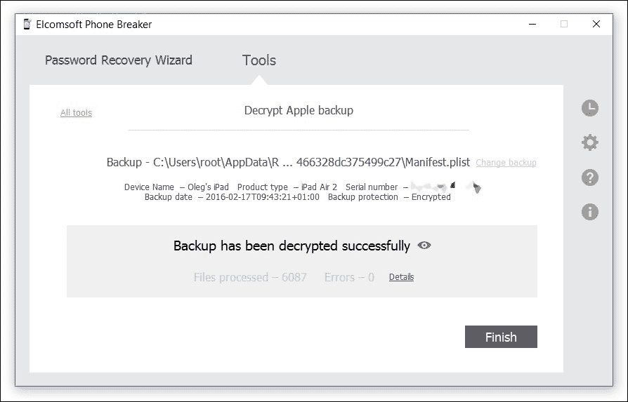
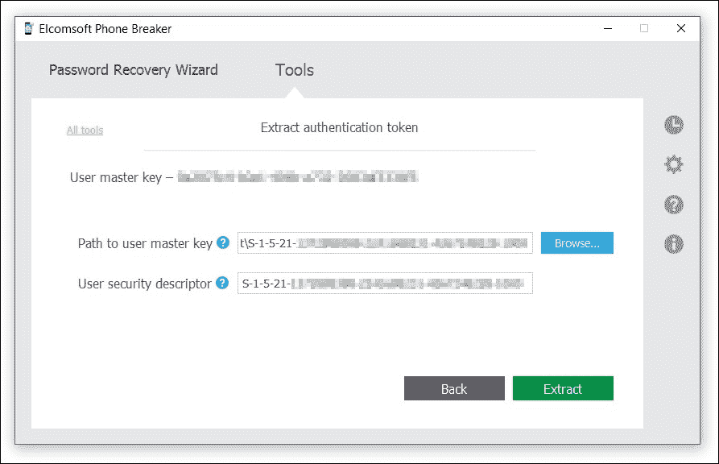

# 第六章. iOS 逻辑和云采集

在本章中，我们将提到逻辑采集，指的是获取和分析 iTunes 备份。每次 iPhone 用户将设备与 PC（Windows 或 macOS X）同步时，iTunes 会创建设备中所有用户数据的本地副本（除非用户选择云备份，这将在下一章讨论）。虽然自动备份是否好坏见仁见智，但除非选择了*云*选项，否则用户最终会在每台同步的计算机上都有其设备内容的备份副本。

因此，用户的 PC 上遇到 iPhone 本地副本的可能性是相当大的。默认情况下，iTunes 会将离线备份存储在用户计算机上的以下文件夹中：

+   **macOS X**: `~/Library/Application Support/MobileSync/Backup/`

+   **Windows XP**: `Documents and Settings\(username)\Application Data\Apple Computer\MobileSyncBackup`

+   **Windows Vista、Windows 7、8、8.1 和 Windows 10**: `Users\(username)\AppData\Roaming\Apple Computer\MobileSyncBackup`

虽然这些位置可以更改，但在上述文件夹之一中存储大量文件是本地备份存在的一个良好迹象。

与设备本身相比，本地备份包含的信息稍微少一些。不过，即便如此，依然包含大量数据。根据 Apple 的说法，离线备份可能包含：

+   地址簿和地址簿收藏夹

+   App Store 应用数据

+   应用设置、首选项和数据

+   网页的自动填充

+   CalDAV 和订阅的日历账户

+   日历账户

+   日历事件

+   通话记录

+   照片库

+   应用内购买

+   钥匙串（在非密码备份中使用强硬件依赖的加密密钥加密，但如果存在备份密码，则使用备份密码进行加密）

+   外部同步源列表（Mobile Me、Exchange、ActiveSync）

+   允许使用你位置的应用和网站的定位服务偏好设置

+   邮件账户

+   管理配置/配置文件

+   地图书签、最近搜索和在地图中显示的当前位置

+   Microsoft Exchange 账户配置

+   网络设置（保存的 Wi-Fi 热点、VPN 设置、网络偏好设置）

+   Nike + iPod 保存的锻炼和设置

+   笔记

+   离线网页应用缓存/数据库

+   配对的蓝牙设备（只能在恢复到与备份设备相同的手机时使用）

+   Safari 收藏夹、Cookies、历史记录、离线数据和当前打开的页面

+   保存的建议修正（这些会在拒绝建议修正时自动保存）

+   短信和多媒体信息（图片和视频）

+   可信主机及其无法验证的证书

+   语音备忘录

+   语音邮件令牌

+   壁纸

+   网页剪辑

+   YouTube 收藏夹和历史记录

iTunes 备份不是作为单一文件制作的。相反，Apple 会生成大量随机命名的文件，包含各种信息。这些文件的名称可能并非完全随机；我们的猜测是，这些文件名是这些文件存储在设备内时完整路径的哈希值。

根据非官方的 iOS 法医学博客，*备份通过 iTunes 生成的文件名源自 iTunes 计算文件路径和名称附加到 iOS 域的 SHA1 哈希值（即 iOSDomain-FilePath/FileName）*。

有趣的是，这些文件实际上是 SQLite 数据库文件。在未保护的备份情况下，它们几乎可以通过任何支持 SQLite 格式的法医工具读取和分析。

# 理解备份 - 本地、云端、加密和未加密

Apple 提供给用户三种不同的备份方法，允许通过 iTunes 创建本地备份，包括未加密和密码保护的备份，或者进行无线的 iCloud 备份。下表展示了三种备份方法之间的主要区别：

|  | **iTunes，未加密** | **iTunes 密码保护（加密）** | **iCloud** |
| --- | --- | --- | --- |
| 钥匙串加密方式 | **securityd** (*) | 密码（与其他备份相同）；一些保护级别较高的钥匙串项目仍然由硬件支持的 securityd 密钥保护 | securityd (*) |
| 数据量 | 完整（但钥匙串数据可能无法访问，除非从物理设备中提取 securityd） | 有限（某些钥匙串数据不可用） | 有限（例如，没有 IMEI 和其他硬件特定数据） |
| 恢复类型 | 大部分信息即时可用 | 必须恢复原始密码 | 必须知道 Apple ID/密码，或必须拥有未过期的认证令牌 |
| 是否可以恢复钥匙串？ | 无法恢复钥匙串（除非可以访问 securityd） | 使用其他数据解密钥匙串（如果密码恢复成功）。只能恢复部分钥匙串数据。 | 无法恢复钥匙串（除非可以访问 securityd）** |

* iCloud 备份以及未加密的 iTunes 离线备份不会以明文显示钥匙串信息。相反，钥匙串数据通过使用硬件特定的密钥（即 securityd）进行加密。

**除了常规的钥匙串，iCloud 账户还包含一个所谓的 *iCloud 钥匙串*。iCloud 钥匙串与备份钥匙串是独立管理的，并且会在所有配置正确的设备间自动同步，包括 Mac 台式机，即使云备份已禁用。iCloud 钥匙串的目的是在设备间保持和同步在线表单数据，如网站的登录名和密码。iCloud 钥匙串中包含的信息与保存在云备份中的常规钥匙串独立管理；不过，iCloud 钥匙串包含常规钥匙串中可用数据的子集。与提取 iCloud 备份相比，提取 iCloud 钥匙串要困难得多，因为它涉及强制的双重身份验证，需要使用受信设备、特殊访问码（可能与设备密码不匹配）或恢复密钥。目前，任何商业工具都无法恢复 iCloud 钥匙串。ElcomSoft 制作了一个用于内部测试目的的概念验证工具。下章将详细介绍 iCloud 钥匙串。**

securityd 密钥的优点是它在设备的整个生命周期中保持不变。这个密钥使得 iOS 用户能够访问从未加密备份恢复的所有历史、当前和未来的 iOS 密钥链。不幸的是，提取 securityd 只能通过物理获取来实现。因此，如果你仅有未加密的备份，并且无法访问符合物理获取兼容矩阵的物理设备，你将无法访问密钥链数据。然而，如果你已从设备中提取了 securityd 密钥，你将能够利用它解密该设备制作的所有当前以及未来的备份。

你可以阅读更多关于 securityd 的文章：

+   **改进的 iOS 密钥链浏览器**: [`blog.crackpassword.com/2012/04/new-features-in-eppb/`](http://blog.crackpassword.com/2012/04/new-features-in-eppb/)

# 加密与未加密的 iTunes 备份

如果你仅有一个 iTunes 备份，了解你的选项对成功调查至关重要。

在配置备份策略时，iOS 用户可以选择创建非加密备份或密码保护备份。以下是 Apple 的说明：

在 iTunes 的 **概述** 页面中，选择 **加密 iPhone 备份**，如果你希望在 iTunes 创建备份时加密存储在计算机上的信息。加密备份会显示一个挂锁图标（如 **删除备份** 部分所示），并且需要密码才能恢复信息到 iPhone。你可能需要写下备份的密码并将其存放在安全的地方。如果你使用的是 Mac，当设置密码时，你可以选择将密码存储在钥匙串中。使用 iOS 4 及更高版本时，如果你加密备份，你可以将大多数钥匙串项目转移到新设备上。

### 提示

**警告**

如果你在 iTunes 中加密了 iPhone 备份，然后忘记了密码，你将无法从备份中恢复数据，且数据将无法恢复。如果你忘记了密码，你仍然可以继续备份和使用设备；然而，如果没有密码，你将无法将加密备份恢复到任何设备上。每次备份或同步时，你不需要输入备份的密码。

如果你无法记住密码并希望重新开始，你必须进行完全的软件恢复，并且在 iTunes 提示选择要恢复的备份时，选择**作为新设备设置**。

如果你阅读了前面的段落，可能会感觉受密码保护的备份相比未加密的备份可以提取更多的信息。的确如此。在受密码保护的备份中，钥匙串（包含许多敏感信息，如邮件、密码、帐户数据等）与其余数据使用相同的密码进行加密。而在未加密的备份中，钥匙串是用硬件特定的密钥加密的，外部无法破解。

因此，使用密码保护备份的用户可以将备份恢复到任何 Apple 设备，并恢复所有存储在钥匙串中的安全项。选择不保护备份的用户仍然可以在任何 Apple 设备上恢复备份，但无法恢复/访问存储在钥匙串中的任何数据。Apple 通过以下声明确认了这一点：

*“如果你使用 iOS 4 或更高版本加密备份，钥匙串信息会被转移到新设备上。使用未加密的备份时，钥匙串只能恢复到同一台 iPhone 或 iPod touch。如果你使用未加密的备份恢复到新设备，你需要重新输入这些密码。”*

随着 Apple 将越来越多的内容推入钥匙串，使用密码保护备份变得比以往任何时候都更方便，同时也使得调查人员可以访问存储在钥匙串中的安全信息……如果他们能够破解密码的话。

# 破解备份密码

如果遇到受密码保护的备份，你需要恢复（或破解）原始密码才能解密其内容。没有办法绕过密码。Apple 的备份加密在今天的标准下非常强大，这使得攻击原始密码比攻击二进制加密密钥更容易。密码只能通过常规方式（暴力破解、字典或混合攻击）恢复。

为了破解密码，我们将使用内部的 Elcomsoft Phone Breaker（以前叫做 Phone Password Breaker）。这个工具最初就是为此而设计的：破解 iOS 备份密码。Elcomsoft Phone Breaker 将尝试通过执行几种类型的攻击来*猜测*密码。恢复密码需要多少时间，以及是否能够恢复密码，取决于原始密码的强度。短小简单的密码（例如，4 位数的 PIN）可以非常快速地破解，而长而复杂的字母数字密码可能需要非常长的时间才能恢复。与密码锁不同，Apple 备份密码使用的频率较低；因此，用户倾向于选择包含字母、数字和特殊字符的更长密码。

## 破解密码 - 需要多长时间？

你到底能多快地破解密码？不幸的是，与物理获取不同，**没有固定的时间框架**，也**没有保证**可以破解备份密码。以下因素会影响密码恢复的速度：

+   你计算机的 CPU 速度和它的视频卡速度（后者比前者更为重要）

+   密码的长度和复杂度（这是一个很大的未知数）

+   你知道的关于密码的任何信息（例如，用户的其他密码以及从他们的密码相关习惯中得出的任何模式）

# 一个快速的 CPU 和更快的视频卡

对于需要一个快速 CPU 的需求不言而喻，但为什么我们还需要一个快速的显卡呢？为什么我们说拥有一张快速的视频卡比拥有一颗快速的 CPU 更重要？

其原因是 GPU 加速。如今的视频卡非常快速。只需考虑支持现代 3D 游戏在高分辨率和每秒 60 帧的运行所需的计算能力，你就会意识到它需要大量的处理能力。

利用这些计算能力来破解密码可以显著提高恢复速度。通过将计算密集型的部分任务交给典型游戏显卡的庞大并行处理单元（GPU），即使是价格不超过$200-300 的显卡，也可以将恢复 iTunes 密码的速度提高 10 到 20 倍。通过使用更快的视频卡，或者使用两张或更多显卡，恢复速度可以比使用高端四核 CPU 快 30 到 50 倍。有趣的是，ElcomSoft Phone Breaker 可以利用系统中安装的所有显卡，即使没有配置 SLI/Cross Fire 模式。

没有视频卡数量的限制。

Elcomsoft Phone Breaker 包含了一种智能解决方案，用于延长攻击时间。该工具通过利用消费级或游戏显卡的计算能力，显著提高了攻击速度。该工具采用了专利的 GPU 加速算法，大大缩短了恢复 iPhone/iPad/iPod 和 BlackBerry 备份密码所需的时间。最新一代的 ElcomSoft GPU 加速技术支持无限数量的 AMD 或 NVIDIA 显卡板卡，如 NVIDIA GeForce 400、500、600、700、800 和 900 系列，以及 AMD Radeon HD 5000、6000、7000、R7 和 R9 系列。ElcomSoft GPU 加速技术为消费者提供了超级计算机级别的性能，且价格亲民。

## 破解复杂密码

显然，长且复杂的密码破解所需的时间更多。破解工具需要尝试更多的可能组合才能发现一个长的字母数字密码，而破解一个简单的 4 位数 PIN 密码所需的尝试次数则要少得多。

如果密码仅包含数字，那么每增加一个字符，密码的强度就会增加 10 倍，这意味着每增加一个数字，破解密码所需的时间会延长 10 倍。一个完全由小写字母组成的密码，每增加一个字母，强度就会增加 26 倍。如果密码包含数字和大小写字母，每增加一个字符，密码的强度会增加 62 倍。

简而言之，尝试的总组合数计算如下：

（密码可能包含的不同字符数） 的（密码长度）次方

例如，一个相对简单的密码仅包含六个字符，且包含数字、小写和大写字母，可能的组合数为 62⁶ = 56,800,235,584（超过 56 亿）。如果你对密码没有任何信息，仅知道其长度和它是字母数字混合的，密码恢复工具将尝试所有可能的组合，直到找到匹配的密码（除非通过更高级的攻击方式，比如字典攻击或词汇攻击成功）。

# 了解用户有助于破解密码

一些密码的保护比其他密码更强。事实上，在我们的日常生活中，我们常常使用弱保护或完全没有保护的密码。即时通讯密码？存储在 Windows 注册表或配置文件中的明文或几乎没有加密。网站密码？根据 Web 浏览器的不同，这些密码可以立即或在几秒钟内提取。像 Outlook Express、Windows Mail、Windows Live! Mail 或 Thunderbird 等常用应用程序中的电子邮件密码？通过简单的免费工具瞬间显示。旧版 Office 文档、第三方办公应用程序和许多其他来源可能包含比保护 Apple 备份密码更容易访问的密码。

花些时间提取存储在其他地方的易于恢复的密码是一个好主意。将这些密码添加到用于字典攻击的 wordlist 文件的顶部，在某些情况下，您根本不必处理漫长的攻击。

即使在 iTunes 备份中没有其他密码有效，也不是白费时间。看看那些密码。您看到了共同模式吗？如果用户选择的密码不是完全随机的，往往它们都会遵循一个共同的模式。也许一个或多个常用单词，电话号码，宠物名字，足球队，或者只是 *god*，*sex*，或 *topsecret*。也许它们都以一个大写字母开头，以一个数字结尾。也许它们还有其他共同点，您可以利用这种模式在 Elcomsoft Phone Breaker 中创建一个通用模式，并显著减少可能的密码组合数量，加快恢复速度。

Elcomsoft Phone Breaker 还包括一个所谓的 *wordlist*，其中包含由使用英语、德语和俄语的用户最常用的密码。互联网上还有许多其他常用密码列表。下载其中一些列表绝对是值得的，因为许多用户可能已经使用了其中的某个密码。最后，在产品中有特殊选项，允许您检查来自 wordlist 的单词变体；我们称之为 *smart mutations*。

如果用户为每个用途选择完全随机的密码会怎样呢？复杂的随机密码，有时使用特殊软件生成，不是最佳的安全选择。虽然普通人可能会记住一个或两个这样的密码，但这些密码很可能从未更改过。如果遇到超过少数几个随机密码，它们很可能都被记录在某个地方。也许是一张小纸条，也许是一个密码管理器（密码保存器）应用程序，无论是在线还是安装在计算机上。破解该应用程序的主密码将显示出所有其他密码，无论它们有多长或复杂。

# 教程 - 使用 Elcomsoft Phone Breaker 进行逻辑获取

足够的理论！让我们继续并进行获取。

首先和最重要的：Elcomsoft Phone Breaker 应该离线使用，在您自己的计算机上，绝不能在嫌疑人的 PC 上使用。该工具允许解密从安装了 Elcomsoft Phone Breaker 的计算机访问的加密备份。您可以挂载磁盘映像或使用网络磁盘；在破解密码时不会产生性能损失。

## 破解密码

在访问备份中存储的信息之前，您需要解密数据。为了解密数据，您需要原始的明文密码。如果您不知道密码，Elcomsoft Phone Breaker 将执行攻击以恢复它。

为了恢复密码，您不需要在计算机上拥有完整的备份文件。事实上，启动破解密码所需的只是一个名为`Manifest.plist`的小文件（如果您处理的是 BlackBerry 备份，请参考在线文档以获取更多信息）。

Elcomsoft Phone Breaker 通过*攻击*备份文件来恢复密码。您可以指定一个或多个不同的攻击方式，例如，字典攻击（已知密码攻击）、字典、暴力破解等。多种攻击方式的组合构成了一个恢复管道。

要在 Elcomsoft Phone Breaker 中恢复密码，请执行以下操作：

1.  打开**密码恢复向导**页面。

1.  通过选择**选择源**命令或将`Manifest.plist`文件拖放到**密码恢复向导**窗口中，指定备份文件。

    +   默认情况下，工具将列出所有本地可用的备份。如果您正在恢复位于嫌疑人硬盘、外部设备或已挂载的取证磁盘映像上的备份，您需要手动指定 iTunes 备份的位置。为了破解密码，工具只需要一个名为`manifest.plist`的单一文件（完整的备份文件集将用于解密）。

    +   如果您手动指定位置，以下是 iTunes 在不同操作系统上使用的默认路径：

        +   **Windows XP**：`\Documents and Settings\(用户名)\Application Data\Apple Computer\MobileSync\Backup\`

        +   **Windows Vista, 7 和 8**：`\Users\用户名\AppData\Roaming\Apple Computer\MobileSync\Backup\`

        +   **macOS X（所有版本）**：`~/Library/Application Support/MobileSync/Backup/`

1.  在指定备份文件后，您需要定义将用于破解密码的攻击方式。

1.  点击加号**+**添加不同的攻击方式来破解密码。默认情况下，**字典**攻击和**暴力破解**攻击会自动添加。有关攻击方式及其设置的更多信息，请参见在线手册中的密码恢复攻击主题。

1.  您可以通过点击每种方法右侧的齿轮图标来可选配置**字典攻击**和**暴力破解**。

1.  您可以使用 Elcomsoft Phone Breaker 附带的默认英文词典，或者选择任何数量的自定义字典（必须是纯文本格式，每个单词或短语应单独占一行）。高质量的自定义字典对于破解密码至关重要。如果可能，尽量构建一个包含用户其他密码的自定义字典。

1.  点击**开始恢复**。Elcomsoft Phone Breaker 将开始攻击密码。预计剩余时间以及当前处理的单词将被显示。你可以点击攻击名称旁边的更多信息，查看附加信息，例如尝试的密码数量和平均攻击速度。

1.  如果攻击成功，发现的密码将在**恢复结果**窗口中显示。

就这样，我们成功恢复了一个密码。这个密码现在可以用来解密备份。此外，你还可以使用**钥匙串浏览器**查看存储在钥匙串中的信息。

## 正在解密备份

只有在你已经知道或已经恢复了原始明文密码的情况下，才能解密备份。如果你没有密码，请先恢复密码。

启动 Elcomsoft Phone Breaker。如果你知道密码，按照以下步骤解密备份：

1.  加载备份文件后，你将能够看到如下截图中的信息：

1.  通过将`Manifest.plist`文件拖到**解密备份**窗口，或点击**选择备份**手动导航到备份文件，来选择正在解密的备份所属的`Manifest.plist`文件。

1.  选择**解密备份**。

1.  在**工具**菜单中，选择**Apple**选项卡。

    +   序列号

    +   备份日期

    +   产品类型

1.  你可以通过点击备份名称旁的**更改备份**来选择不同的备份。

1.  定义备份解密选项：

    +   **保存解密到**：选择解密备份的保存位置。

    +   **备份密码**：输入备份的密码。切换**查看** ()按钮，以显示密码为字符或星号（*）。如果你还没有恢复备份的密码，点击**恢复密码**。

    +   **恢复原始文件名**：将文件重命名为与设备上的显示方式相匹配。如果取消选中此选项，文件在解密后仍然可用，但其名称将保持不变。

    ### 注释

    如果你正在使用第三方移动取证工具分析备份，*请勿*恢复原始文件名，因为这会干扰分析工具。仅在手动查看文件时选择此选项。

1.  点击**解密**。

1.  解密过程已开始。你可以查看处理的文件数量以及在解密过程中收到的错误数量。

1.  当解密完成后，你可以通过点击**查看** ()按钮，查看保存到本地计算机位置的备份。

1.  要查看解密文件和解密过程中发生的错误的详细报告，请点击**详细信息**。

1.  点击**完成**以关闭**解密备份**窗口。

现在备份已在你的计算机上，可以进一步分析。你可以使用 Elcomsoft Phone Viewer 浏览并查看备份内容。

## 处理长且复杂的密码

无论我们如何简化描述，破解 Apple 备份密码都是一个缓慢且技术复杂的过程。恢复速度将取决于可用的硬件（计算机的 CPU 和显卡）、攻击类型，以及你对密码的了解。要了解如何加快恢复速度，请阅读以下所有页面：

+   **通用密码恢复指南**: [`www.elcomsoft.com/help/en/eppb/recovering_passwords.html`](http://www.elcomsoft.com/help/en/eppb/recovering_passwords.html)

+   **解密备份**: [`www.elcomsoft.com/help/en/eppb/decrypting_iphone_backup.html`](http://www.elcomsoft.com/help/en/eppb/decrypting_iphone_backup.html)

+   **Phone Password Breaker 中可用的攻击类型**: [`www.elcomsoft.com/help/en/eppb/password_recovery_attacks.html`](http://www.elcomsoft.com/help/en/eppb/password_recovery_attacks.html)

+   **破解密码的选项**: [`www.elcomsoft.com/help/en/eppb/password_breaking_options.html`](http://www.elcomsoft.com/help/en/eppb/password_breaking_options.html)

+   **暴力破解攻击的选项**: [`www.elcomsoft.com/help/en/eppb/brute-force_attack_options.html`](http://www.elcomsoft.com/help/en/eppb/brute-force_attack_options.html)

具体而言，最后两个链接解释了如何指定你所知道的密码信息，以便加速恢复。

但是，如果密码很长且复杂，或者你对密码知之甚少，且恢复过程需要经过漫长而无果的攻击怎么办？如果是这种情况，你可以探索其他的获取选项。特别是，可以无需攻击密码即可从云端下载信息。

# 在 Mac 上的 Elcomsoft Phone Breaker，或者在虚拟 PC 中，或通过 RDP

许多客户使用运行 macOS X 的计算机。Elcomsoft Phone Breaker 是原生 Windows 软件。因此，一些用户在他们的 Mac 上通过虚拟机（Windows 环境）运行 Elcomsoft Phone Breaker。然而，这种设置存在一些限制。将 Elcomsoft Phone Breaker 运行在虚拟机中的 Windows 环境下的一个主要缺点是缺乏速度。截止到本文写作时，还没有驱动程序能在任何虚拟机中实现 GPU 加速的正确支持。因此，在虚拟机中尝试进行暴力破解密码将不可避免地导致性能严重下降。如果你的计算机配备了中端显卡，那么通过虚拟机运行密码恢复的速度将比在物理计算机上运行同样的工具慢 20 到 50 倍。

有一种变通方法。您可以在网络上设置一台 Windows 电脑，并从 Mac 远程连接到该电脑。然而，请注意，使用 RDP 协议会导致与使用虚拟机一样的性能下降。为了释放 GPU 加速的全部潜力，我们建议通过 TeamViewer 等替代接口进行连接。

# iOS 云取证 - 空中获取

有时，即使没有访问原设备，也可以远程访问存储在用户 iPhone 中的信息。这样的访问得益于 iCloud 去年的用户数超过了 2.5 亿；这个数字还在稳步增长。

了解 iCloud 取证：无需长时间攻击，也无需物理访问 iPhone 设备即可获取用户数据。随着最新技术的发展，现在甚至不需要用户的 Apple ID 和密码，就能访问他们的云数据。听起来难以置信？我们来看看其中的奥秘。

## 关于 Apple iCloud

Apple iCloud 是一项流行的服务，提供给 Apple 用户 5GB 的免费在线存储空间。这个存储空间可以用来备份 Apple 设备的内容，并存储其他信息，如文档、图片和音乐。去年，超过 3 亿的 Apple 客户在积极使用 iCloud。这个数字还在不断增长。

iCloud 为用户提供了极大的便利。例如，如果在海外旅行中丢失了 iPhone，用户可以直接在当地的 Apple Store 购买一台替代设备，输入其 iCloud 凭据，所有数据会自动恢复到新设备上。更换或升级设备时也是如此。

iCloud 备份完全自动化。然而，只有在满足以下条件时，备份才会发生：

+   用户已在设备中启用 iCloud 备份

+   设备连接或充电中

+   存在 Wi-Fi 连接

虽然 iCloud 备份是增量式的，只会同步设备中发生变化的内容，但在初始化新 Apple 设备时，恢复备份只需一次操作。然而，如果需要传输大量数据，专家可能希望更快地获取数据。使用 Elcomsoft Phone Breaker，可以选择性地下载某些类型的数据，以便尽早开始调查。

更多关于 Apple iCloud 的信息，请访问 Apple 网站：

+   **iCloud**：*在 iCloud 中存储和备份您的内容*

+   **创建 iCloud 账户**：*常见问题解答*

+   **iCloud**：*备份和恢复概述*

## 开始使用 iCloud 钥匙串

从 iOS 7 的中间版本（7.0.3）开始，iCloud 还包含了钥匙串数据。iCloud 钥匙串作为一项功能被添加，允许 Apple 用户在所有 Apple 设备之间同步其账户名和密码。存储在 iCloud 钥匙串中的数据会在所有授权的 iOS 7 设备和共享相同 Apple ID 的 OS X Mavericks 设备之间自动同步。

虽然 iCloud 钥匙串默认并未启用，但苹果使其设置变得非常简单。当初始化一台新的 iOS 7（或更高版本）设备时，或者在将 iOS 升级到最新版本后，用户会被提示启用 iCloud 钥匙串。如果他们拒绝选择，稍后仍可以在 **设置** | **iCloud** | **iCloud 钥匙串** 中启用它。

作为额外的安全措施，苹果要求用户设置 iCloud 安全代码，以保护其最敏感的钥匙串数据。该代码可以是一个 4 位数的 PIN 或者一个更复杂的密码。iCloud 安全代码用于授权其他设备访问 iCloud 钥匙串。此外，在用户升级或丢失设备时，这个密码也用于恢复 iCloud 钥匙串。

iCloud 钥匙串采用强制性的双重身份验证保护。目前市场上没有任何第三方工具可以解密 iCloud 钥匙串。从技术上讲，如果拥有恢复密钥或可信设备，第三方产品是可以访问 iCloud 钥匙串的。ElcomSoft 提供了一款概念验证工具，可以实现这一功能；不过目前该工具尚未成为商业化产品。

访问存储在 iCloud 钥匙串中的数据的另一种方式是：在苹果设备上启用 iCloud 钥匙串，同步设备，从本地钥匙串中提取数据，并通过 ElcomSoft Keychain Explorer 解密。这种方法需要拥有一台解锁的、可信的 iOS 设备。

有趣的是，iCloud 钥匙串（以及最近同步的设备的本地钥匙串）中包含了备份密码、Apple ID 和密码，这些信息在通过身份验证令牌访问 iCloud 时可能会派上用场。保护备份的密码存储在常规钥匙串中，并具有最强的保护等级。因此，这个密码只能通过物理获取方式进行解密。

更多关于 iCloud 钥匙串的信息：

+   **基本信息**：[`www.apple.com/support/icloud/keychain/`](https://www.apple.com/support/icloud/keychain/)

+   **iCloud 钥匙串常见问题**：[`support.apple.com/kb/HT5813`](http://support.apple.com/kb/HT5813)

## 开始使用 iCloud Drive

iOS 8 引入了将设备备份以外的其他信息保存到云端的功能。苹果将这一新服务命名为 iCloud Drive。除了备份，应用程序也可以将数据存储到云中；一个典型的例子就是 WhatsApp，它将备份与 iCloud 备份分开存储。iCloud Drive 的目标是与已有的云存储服务提供商竞争，如 Box、Dropbox、Google Drive 和 Microsoft OneDrive。用户可以将几乎任何类型的文件存储在 iCloud Drive 中，并且可以在任何苹果设备以及 Windows PC 上访问这些数据。

为了启用 iCloud Drive，Apple 用户必须明确升级他们的账户。虽然 Apple 用户可以随时升级他们的 iCloud 账户以使用 iCloud Drive，但要从 iPhone 和 iPad 访问 iCloud Drive，需要 iOS 8 或更高版本。iOS 9 使 iCloud Drive 的应用更加广泛，将云备份存储在新系统中，并逐步从经典的 iCloud 迁移出去。

到 2016 年 2 月，76% 的 Apple 用户已经升级到 iOS 9，并且默认将他们的云备份存储在 iCloud Drive 中。到那时，17% 的设备仍在运行 iOS 8，这意味着云备份存储在“普通”iCloud 中，而特定应用的备份和其他文件也可以存储在 iCloud Drive 中。其余的 7% 在 2016 年 2 月之前无法访问 iCloud Drive。

新的 iCloud Drive 可用于存储所有类型的用户数据，包括但不限于以下内容：

+   iWork 文档（如果配置为存储在云端），如 Pages、Numbers、Keynote

+   第三方应用数据（例如 WhatsApp 备份、1Password 密码数据库等）

+   某些在设备之间同步的系统文件（例如，用户词典，其中可能包含用户输入的、不是通用词典一部分的单词和短语）

iCloud Drive 使用与 Apple iCloud 不同的协议。因此，所有云取证工具都需要明确支持 iCloud Drive 才能访问存储在云服务中的信息。目前，Elcomsoft Phone Breaker 仍然是唯一完全支持 iCloud 和 iCloud Drive 的工具。

## 理解 iCloud 取证

iCloud 取证为专家提供了另一种获取重要证据的方式。云取证的优点显而易见：不需要访问物理设备，也不需要（也没有可能进行）长时间的密码攻击。潜在的问题包括：你必须知道用户的 Apple ID 和密码，或者拥有来自用户 PC 的近期（未过期）认证令牌。

使用云取证时，你只有两个选择。首先，你可以使用一台新的（或恢复出厂设置的）Apple 设备来恢复数据，然后备份这些数据。这是一个漫长且复杂的过程。或者，你可以使用 Elcomsoft Phone Breaker，这是唯一目前可用的云取证工具，因为 Apple 没有提供将 iCloud 信息下载到 PC 的方法。如果用户拥有多台设备，并且这些设备使用相同的 Apple ID 注册，则他们的在线备份可以无缝地从 iCloud 恢复，无需额外操作。

# 教程 - 使用 Elcomsoft Phone Breaker 进行云获取

截至目前，市场上只有一个工具能够执行完整的 iOS 设备空中获取，包括升级到 iCloud Drive 的帐户。Elcomsoft Phone Breaker（前身为 Elcomsoft Phone Password Breaker）是第一个也是唯一一个可以检索和解密存储在 iCloud 中的备份，并且可以在有或没有原始 Apple ID 和密码的情况下下载存储在目标 iCloud Drive 中的文件的第三方取证工具。值得注意的是，Apple 并没有提供将 iCloud 信息下载到 PC 上的方法，因此 Elcomsoft Phone Breaker 仍然是唯一可用的此类工具。

为了能够访问备份，您需要向 Apple iCloud 服务器提供有效的身份验证凭证。直到最近，从云端下载数据时，唯一的认证方式是通过登录（用户的 Apple ID）和密码。然而，最近发现，在某些情况下，会生成一个二进制身份验证令牌并将其存储在用户的计算机上，允许取证专家在不知道原始登录和密码的情况下访问云端的信息。

根据您是否知道原始 Apple ID 和密码，或者您是否能够访问实际物理设备或从用户计算机获得的信息，您可以选择多个获取路径中的一种。

## 下载 iCloud 备份 - 使用 Apple ID 和密码

如果您知道某人的 Apple ID 和密码，可以使用 Elcomsoft Phone Breaker 从他们的 iCloud 账户中下载信息。该工具将从 iCloud 下载备份，解密数据，并将其转换为 iTunes 备份，以便您可以使用几乎任何移动取证工具分析其内容。但请注意，我们不建议使用转换后的备份文件恢复设备。

要下载 iCloud 备份，启动 Elcomsoft Phone Breaker 并执行以下操作：

1.  在 **工具** 菜单中，选择 **Apple** 标签。

1.  选择 **从 iCloud 下载备份**。

1.  在 **从 iCloud 下载备份** 页面，定义身份验证类型为 **密码**：

    +   **密码**：使用您的 Apple 凭证（Apple ID 和密码）。

    +   **令牌**：使用通过 Elcomsoft Apple Token Extractor 从 iCloud 提取的身份验证令牌。有关提取令牌的更多信息，请参见 *提取身份验证* 令牌主题。

    +   输入 **Apple ID** 和密码到相应字段，然后点击 **登录** 进入 iCloud。

1.  一旦 Elcomsoft Phone Breaker 成功登录 iCloud（假设没有额外的身份验证步骤），它将显示与该 Apple ID 关联的设备列表。请注意，你将看到所有使用该 Apple ID 注册的设备，包括那些不在调查范围内的设备。iCloud 备份存储打开：

    ### 注意

    你可以查看 iCloud 用户的用户名、用户 ID 和 Apple ID，以及该用户的备份列表。默认情况下，显示最近的三个备份。将鼠标悬停在绿色（**i**）图标上可以查看存储容量和占用大小。

    若要选择由其他 iCloud 用户保存的备份，请点击**更改用户**。*如果某个设备正在忙于保存新的备份，且备份仍在进行中，该设备将不会列为可供下载。*

1.  每个设备都会显示以下信息：

    +   **设备名称**

    +   **型号**

    +   **序列号**

    +   **唯一设备 ID**

    +   **最新备份创建的日期和时间**：显示的时间为获取计算机所在时区的本地时间；如果被分析的设备属于其他时区，这一点至关重要。

    +   **备份大小**

1.  通过选中左侧的复选框，选择你想要下载备份的设备。

1.  定义下载备份的选项。点击**信息**以查看每个选项的提示。

    +   **恢复原始文件名**：如果选中此项，则所有备份文件将以与 iOS 操作系统中相同的文件名保存，包括完整路径。例如，短信（SMS 和 iMessage）会保存为 `\HomeDomain\Library\SMS\sms.db`（SQLite 格式）。如果未选中此项，备份将保存为 iTunes 格式（该格式也用于本地备份）。

        ### 注意

        如果你正在使用第三方手机取证产品，确保禁用**恢复原始文件名**选项。禁用此选项后，备份将保存为 iTunes 格式，这是市面上几乎所有移动取证工具都支持的格式。

        在**仅下载特定数据**模式下，恢复原始文件名的选项会自动启用，如下所示：

        

    +   **仅下载特定数据**：选择此选项可以通过优先下载最重要的数据来加快调查进程。请注意，这个选项并不能替代完整的 iCloud 备份分析，它更像是对最重要数据的*快速预览*。

1.  定义所有选项后，点击**下载**。

1.  使用**选择文件夹**指定本地计算机上存储下载文件的位置。

1.  下载开始。

    ### 注意

    尝试下载部分（正在进行中的）备份将失败。

1.  下载完成后，工具会在已下载的备份旁边打上勾。点击 **完成** 退出下载向导。

下载的备份现在可以在您的计算机上进行进一步分析。您可以使用 [`www.elcomsoft.com/epv.html`](http://www.elcomsoft.com/epv.html) 浏览并查看备份的内容。

# 下载 iCloud/iCloud Drive 备份 - 使用认证令牌

很自然地，您会认为需要原始的登录凭证（Apple ID 和密码）才能访问存储在云中的信息。如果您不知道用户的 Apple ID 和密码，但可以访问他们用于与 iCloud（或 iCloud Drive）同步的计算机，应该怎么办？如果是这种情况，您可以尝试使用从用户计算机中提取的二进制认证令牌连接到 iCloud。

使用二进制认证令牌可以绕过 Apple iCloud 的登录和密码认证。作为附加好处，使用认证令牌还可以绕过用户指定的任何双重身份验证。

从技术角度来看，认证令牌是由 iCloud 控制面板创建的小型二进制文件，用于免去用户每次同步云时都输入登录和密码的麻烦。如果安装了 iCloud 控制面板（或 iCloud for Windows），并且用户在获取令牌时已登录该计算机的控制面板，那么该令牌可以从用户的计算机中提取。如果用户退出了 iCloud 控制面板，则令牌会被删除并失效，意味着即使从硬盘中提取出来，也无法再用来访问 iCloud 数据。

### 注意

认证令牌不包含用户 Apple 账户的密码，也不包含密码的哈希值。您不能使用认证令牌进行暴力破解原始的明文密码。

iCloud 控制面板是 macOS 系统的重要组成部分。Windows 系统可以使用 iCloud for Windows。为了方便用户，可以保持登录状态，以便无缝同步联系人、密码（iCloud 钥匙串）、照片和其他类型的数据。这意味着很有可能从安装了 iCloud 控制面板（iCloud for Windows）的计算机中获取认证令牌。

使用认证令牌下载 iCloud 备份的过程与使用 Apple ID 和密码类似，不同的是，在下一个屏幕上，您需要提供认证令牌，而不是用户的 Apple ID 和密码：

请注意，您需要从使用适当命令行工具提取的文本文件中复制完整的认证令牌字符串。在下面的屏幕截图中，文本文件的第二行表示认证令牌：

# 提取认证令牌

只有在以下所有条件成立的情况下，才能从系统中提取有效的认证令牌（在本例中，我们讨论的是 Windows PC）：

+   用户已安装 iCloud for Windows

+   用户已登录到 iCloud for Windows，且在获取时未注销

+   在获取时，用户没有更改他们的 Apple ID 密码

### 注意

在任何阶段都不需要连接物理 iOS 设备。

Elcomsoft Phone Breaker 提供了两种不同的提取令牌的方法。提取当前登录用户的二进制认证令牌时，调查人员可以使用提供的命令行工具（`atex.exe`）。在所有其他情况下，Elcomsoft Phone Breaker 提供了一个方便的用户界面。

必须先从用户的计算机、硬盘或取证磁盘映像中提取认证令牌，才能使用它。Elcomsoft Phone Breaker 配备了可以定位、提取和解密二进制认证令牌的工具。该工具可以为该计算机上的所有用户提取认证令牌，包括域用户（前提是知道他们的系统登录密码）。此外，认证令牌还可以离线从用户的硬盘或取证磁盘映像中提取。命令行工具适用于 Windows 和 macOS X。

让我们看看在 Windows 上如何提取认证令牌。有关如何在 macOS X 上提取认证令牌的说明，请访问 [`www.elcomsoft.com/help/en/eppb/extracting_authentication_mac.html`](http://www.elcomsoft.com/help/en/eppb/extracting_authentication_mac.html)。

认证令牌可以为当前 iCloud 控制面板用户提取，也可以为系统中的所有其他用户提取，只要知道正确的账户密码（或管理员密码）。此外，可以从存储在虚拟磁盘或取证磁盘映像中的二进制文件 `m` 中提取认证令牌。为了简化起见，下面我们将为当前的 iCloud 控制面板用户提取认证令牌。

要在 Windows PC 上提取当前 iCloud for Windows 用户的认证令牌，请执行以下操作：

1.  启动 `atex.exe`。一个名为 `icloud_token_<timestamp>.txt</timestamp>` 的文件将被创建在您启动工具的同一文件夹中（如果您没有足够的权限将文件写入启动 `atex.exe` 的文件夹，则会创建在 `C:\Users\<user name="">\AppData\Local\Temp</user>` 文件夹中）。

1.  提取的文件的完整路径将显示在控制台窗口中：

1.  生成的文件具有 `.txt` 扩展名，包含当前 iCloud 控制面板用户的 Apple ID 及其认证令牌。

    如果您需要为其他 Windows 用户提取认证令牌，或者您正在处理法医磁盘镜像，您可以使用令牌提取向导。

1.  启动 Elcomsoft Phone Breaker 并选择 **提取认证令牌**。

1.  指定令牌文件的路径（通常是 `%appdata%\Apple Computer\Preferences\`）。

1.  指定主密钥的路径（此密钥用于解密令牌），然后点击 **提取**。此密钥用于解密认证令牌。

1.  Elcomsoft Phone Breaker 将提取、解密并显示令牌。您将能够将令牌导出为文件。现在您可以使用此令牌登录 iCloud 并从 iCloud 下载备份。

再次提醒，如果您使用的是 macOS X 计算机，请阅读以下文档以获取逐步指南：

[`www.elcomsoft.com/help/en/eppb/extracting_authentication_mac.html`](http://www.elcomsoft.com/help/en/eppb/extracting_authentication_mac.html)

获取关于提取认证令牌的最新信息，请访问 [`www.elcomsoft.com/help/en/eppb/index.html?extracting_token_on_non-live_w.html`](https://www.elcomsoft.com/help/en/eppb/index.html?extracting_token_on_non-live_w.html)。

## iCloud 认证令牌（iOS 6 至 9）- 限制

那么，这些二进制认证令牌（ATEX）是 iOS 法医中的“灵丹妙药”吗？在发现这一获取方法后的几个月里，我们是这么想的。然而，Apple 已实施了一些更改，使得通过二进制认证令牌获取 iCloud 数据的吸引力有所下降。

### 注意

根据 iOS 版本，从 iCloud 控制面板提取的 ATEX 令牌可能有使用限制。尽管仍然可以使用该令牌登录 iCloud 并查看设备列表及其相应的备份，但在一些罕见情况下，该令牌可能仅在一个小时内有效，用于下载 iCloud 备份。这适用于 iOS 8.x。

Apple 在回应名人照片黑客事件后，大幅缩短了 iCloud 认证令牌的有效期。然而，随着新的认证方法（包括两步验证，后来被双因素认证取代）问世，Apple 再次放宽了规则。

### 注意

快速令牌过期不适用于新的 Apple iCloud Drive。虽然“经典”iCloud 令牌显然在一小时后过期，但这些相同的令牌在用于 iCloud Drive（用于从运行 iOS 9 及更高版本的设备中提取数据，包括云备份）进行认证时，似乎并不会有这么短的有效期。我们无法确切确定这些令牌在此目的下的有效时长，但有效期显然比 *经典* iCloud 令牌长得多。

以下表格说明了 *经典* Apple iCloud（iOS 6 至 8）使用的 ATEX 令牌的用途：

|  | **在 iCloud 控制面板登录后一小时内** | **超过一小时后，直到过期** |
| --- | --- | --- |
| 设备列表 | 是 | 是 |
| iCloud 备份列表 | 是 | 是 |
| 下载 iCloud 备份 | 是 |

+   否（iOS 8.x）

+   是（iOS 9.x）

|

| 下载存储在 iCloud Drive 中的文件 | 是 | 是 |
| --- | --- | --- |

## iCloud Drive 身份验证令牌（iOS 9 及更高版本）——完全不同的情况

从 iOS 9 开始，Apple 将云备份存储在 iCloud Drive 中，而不是 *经典* iCloud。iCloud Drive 的令牌受不同规则的管辖，且似乎没有像 iCloud 令牌那样短的有效期。

尽管如此，我们无法确定 iCloud Drive 令牌的确切有效期。它明显比“经典”iCloud ATEX 令牌的有效期要长，而且肯定超过几天。因此，相比 iOS 8，iOS 9 及更高版本的设备云提取更有可能成功。

## 快速开始 - 选择性下载

Apple iCloud 并不是地球上最快的云存储服务。事实上，有时候它非常慢，远比一般的宽带连接速度慢。实际上，这意味着下载完整的 iCloud 备份可能需要几个小时，甚至在某些情况下需要一整晚。

然而，你可能甚至不需要 iOS 设备的完整数据集。用户的通话记录、消息、浏览数据、笔记、联系人、社交通讯和一些其他类型的数据对于调查来说非常重要，但它们在手机中占用的空间非常少。考虑到 Apple iCloud 的速度，你可以选择花几分钟下载一些选定类型的数据，然后再获取完整备份。

如果你需要立即获取某些数据来开始调查，你可以使用 Elcomsoft Phone Breaker 中的 **仅下载特定数据** 选项。

接下来，你需要点击“自定义”以指定要下载的数据类型。

请注意，这个选项并不是完整 iCloud 备份分析的合适替代品。它的预期目的是提供一个 *快速预览*，查看最重要的数据，让你在完整备份仍在下载时就能开始调查。

关于可用于选择性下载的数据类型的更多信息，请访问 [`www.elcomsoft.com/help/en/eppb/downloading_specific_data.html`](http://www.elcomsoft.com/help/en/eppb/downloading_specific_data.html)。

# 双因素身份验证

IT 安全领域在不断变化。最近的安全漏洞促使 Apple 实施了额外的安全措施。这些增加的安全措施包括扩展了双因素身份验证，并且当有新设备访问用户云账户中的信息时，会向用户发送通知。双因素身份验证现在已经可用（但仍然是可选的）用于云备份。

Apple 还宣布了一种额外的双重认证方法。除了现有的认证方法，包括在受信设备上的验证码和恢复密钥外，还增加了应用专用密码方法。然而，应用专用密码与法医获取无关，因为它们与备份或存储在云端的文件无关。

对额外安全性的需求如此强烈，以至于 Apple 被迫在 iOS 8 发布前加强 iCloud 安全性。这使得启用双重认证后，许多第三方工具无法再用来访问云端。

双重认证（以及较旧的两步验证）仍然是可选的。如果启用，专家只有在以下任一条件满足时，才能访问云数据：

+   **发送到受信设备的安全码**必须能够访问受信设备或带有受信电话号码的 SIM 卡。受信设备必须解锁才能查看安全码。SIM 卡可以用于在任何设备上接收验证码短信；无需使用原始的 iPhone 来接收验证码。

+   **在设置两步验证时创建的恢复密钥**。

+   **从受信设备获得的二进制认证令牌**，或从计算机中提取

双重认证不仅涵盖 iCloud 备份，还包括存储在云端的其他信息。

## 双重认证是可选的

截至今天（2016 年 5 月），Apple 并未强制要求用户启用双重认证。强制进行额外认证会影响 Apple 用户习惯的便捷性和易用性。额外的认证步骤可能导致一些用户放弃云备份的想法。因此，Apple 仍在通过试验和错误寻找平衡。

Apple 没有披露启用双重认证的用户数量。双重认证和两步验证仍然不完全透明。在现实世界中，我们很少看到许多 Apple 用户启用双重认证。我们预计，双重认证的接受率将在可预见的未来缓慢而稳定地增长。

## 双重认证与两步验证 - 理解它们之间的区别

两步验证和双重认证是两个截然不同但又容易混淆的过程，旨在保护 Apple ID 及相关服务的访问安全。两者方法都在原有的 Apple ID 和密码之外，增加了一个额外的认证因素，验证*你拥有的东西*以及*你知道的东西*。

不同于其他公司（例如 Google），Apple 并未采用单一的双重认证解决方案。相反，该公司不得不使用两种具有类似用户体验但技术实现完全不同的过程。为什么要使用两种不同的过程？事实上，**两步验证**是匆忙的事后想法。在名人照片泄露丑闻期间，Apple 必须迅速采取行动，对现有（和遗留）iOS 版本的用户实施更严格的安全措施。另一方面，**双重认证**（你是不是已经晕了？）出现在 iOS 9 和 macOS El Capitan 中，仅适用于最新 iOS 版本的用户。那么这两种验证过程有什么区别，对移动取证又有何影响？让我们试着找出答案。

### 注意

Apple 关于两种验证方法的官方文档。

**两步验证**：

+   **两步验证（2SV）**：[`support.apple.com/en-us/HT204152`](https://support.apple.com/en-us/HT204152)

+   **应用专用密码**：[`support.apple.com/en-us/HT204397`](https://support.apple.com/en-us/HT204397)

**双重认证**：

+   **双重认证（2FA）**：[`support.apple.com/en-us/HT204915`](https://support.apple.com/en-us/HT204915)

+   **获取双因素认证的验证代码**：[`support.apple.com/en-us/HT204974`](https://support.apple.com/en-us/HT204974)

## 两步验证

**两步验证**（**2SV**）于 2013 年推出，作为对 iCloud 名人照片泄露事件的匆忙回应。它在 iOS 8 发布之前推出，用于保护用户 Apple ID 的某些活动。当登录 Apple ID 或 iCloud 或从新设备进行购买时，2SV 会在登录时添加额外的验证步骤（请参阅前面的 Apple 链接以获取更多信息）。

对于数字取证的目的，重要的是 Apple 如何提供作为第二验证因素的代码。

用户可以通过四种不同方法接收两步验证的代码。

**交付第二验证代码**：

+   发送推送通知到信任设备

+   发送文本消息或电话给信任的手机号码

+   恢复密钥（离线）

+   应用特定密码

**启用两步验证**：

+   从 Apple 设备上

+   通过我的 Apple ID 在线操作

## 双重认证

与匆忙推出的两步验证不同，真正的技术进步是两步验证（首次在 2015 年与 iOS 9 一起发布）。这一全新和改进的安全方法需要操作系统的内建支持，并且仅在 iOS 9 及更高版本或 OS X El Capitan 及更高版本中有效。重要的是，两步验证（2FA）无法在运行较旧 iOS 版本的设备上使用。两步验证的可用性目前仅限于某些地区，2FA 将逐步推广到所有地区。

两步验证取消了离线恢复密钥和应用特定密码。

**传送二次验证代码**：

+   推送通知到受信任的设备（所有受信任的设备上会显示互动提示；设备必须解锁才能允许访问并查看验证码）。

+   通过短信或电话拨打注册的号码（使用**没有收到验证码？**链接）。

+   **新功能**：不再需要应用特定密码。将 6 位验证码附加到原始密码后，可以用来验证不支持两步验证的应用程序。

+   **新功能**：通过受信任设备设置生成的时效性代码进行离线验证。

**启用两步验证**：

+   只能在兼容的苹果设备（iOS 9，El Capitan）上启用两步验证。无法通过 Web 进行在线激活。

+   2FA 替代了旧版的 2SV。如果已经启用了 2SV，必须先禁用它，才能启用两步验证。

两步验证的一个重要进展是能够通过请求受信任设备生成（并使用）离线验证代码。

这些新的离线验证代码类似于谷歌和微软的实现。每 30 秒生成一个新的代码。不过，苹果的做法与谷歌和微软的认证应用有些不同。苹果为每个受信任的设备使用独特的种子，这意味着每个受信任的设备生成一个独特的验证代码，而谷歌和微软则只允许所有认证应用共用一个种子。这意味着苹果用户可以从每个单独的设备撤销 2FA 授权，而谷歌和微软用户撤销 2FA 验证会立即使所有已安装认证应用的受信任设备上的认证失效。

## 在两步验证中不使用应用特定密码

不再提供应用特定密码，以支持那些不支持苹果两步验证方案的应用程序。恢复密钥也已经取消。当访问受两步验证保护的设备或服务时，用户如果至少有一台设备不支持 2FA（例如，运行 iOS 8 或更早版本的 iPhone），将看到以下提示：

**你的部分设备尚未准备好进行两因素认证**。如果继续操作，你将不得不在每次输入密码时，将六位验证代码附加到密码末尾，尤其是在旧设备上。

苹果似乎已经采取了一些措施，使这一过程不那么不便。第一次尝试从 iOS 8.3 设备（不支持 2FA）进行 App Store 购买时，会提示输入密码，并附带一个 6 位数字代码。受信任的设备会显示提示和代码。有趣的是，在我们第二天进行的测试中，常规的 Apple ID 密码有效。再次强调，我们第二天使用相同的设备时不需要附加 6 位数字代码。然而，我们的受信设备（运行 iOS 9）仍然显示提示和代码，但我们不必使用它。这有些令人困惑。

如果你无法访问二次认证因素怎么办？没有受信设备，也无法访问注册的电话号码。

在这种情况下，官方路径是向苹果提交请求，通过两因素认证帐户恢复来重新获得 Apple ID 的访问权限 [`support.apple.com/en-us/HT204921`](https://support.apple.com/en-us/HT204921)。

## 带有两步验证和两因素认证的云端获取

如果你正在使用 Elcomsoft Phone Breaker 进行云端获取，并且 Apple ID 受到了 2SV 或 2FA 的保护，你需要提供该二次认证因素，才能进行身份验证并访问备份。如果启用了两步验证，Elcomsoft Phone Breaker 会自动提示输入二次认证码。

请注意以下事项：

+   应用特定密码不能用于下载 iCloud 备份。

+   如果设备运行的是 iOS 8.x 或更早版本，则只能使用两步验证（而不能使用两因素认证）。然而，如果用户至少拥有一台支持 2FA 的设备，他们仍然可能会为 Apple ID 启用 2FA。

+   如果启用了给定 Apple ID 的两因素认证，一种继续操作的方式是生成（或接收）一个 6 位认证码。*在认证 Elcomsoft Phone Breaker 时，你可以将该六位数代码附加到密码末尾*。

+   如果你正在从使用两因素认证的 Apple 帐号（iOS 9 及更高版本）获取备份，并且你使用的是从受信设备设置中生成的离线 2FA 代码，请注意，这些代码是短暂的。你只能在生成后的前 30 分钟内使用这些代码进行身份验证，过后它们将失效。

+   如果你无法访问第二次认证因子，可以尝试使用二进制认证令牌。这样的令牌可以通过安装了 iCloud 控制面板（iCloud for Windows）的计算机获取。这些令牌似乎不会过期，适用于存储在 iCloud Drive 中的 iOS 9 备份，但对于存储在*经典* iCloud 中的 iOS 8.x 及更早的备份，则已知会很快过期。

# 下一步是什么？

从 iOS 设备获取信息是第一步。下一步是查看数据，接着发现和分析证据。现在有许多优秀的取证工具可以分析从各种移动设备提取的信息。这些工具从非常简单的工具到大型的全功能套件不等，后者允许你一次交叉分析多个数据源。

如果你没有使用这些工具的经验，可能想从轻便且简单的工具入手——例如，Elcomsoft Phone Viewer。

Elcomsoft Phone Viewer 是一个小型、轻量级的工具，用于查看从移动备份中提取的信息。该工具可以显示联系人、消息、通话记录、笔记、日历数据以及许多其他类型的数据。还可以查看存储在 iOS 备份中的已删除短信和 iMessages。

# 小结

在本章中，我们介绍了两种最常用的 iOS 获取方法：逻辑获取和云提取。我们讨论了备份加密和密码保护，了解了云备份和 iCloud 认证。我们讲解了苹果的两步验证和双因素认证之间的区别，并提供了全面的逐步教程，涵盖了逻辑获取和云提取。在下一章，我们将从苹果平台转向微软平台，讨论 Windows Phone 8/8.1 和 Windows 10 Mobile 的可用获取选项。
