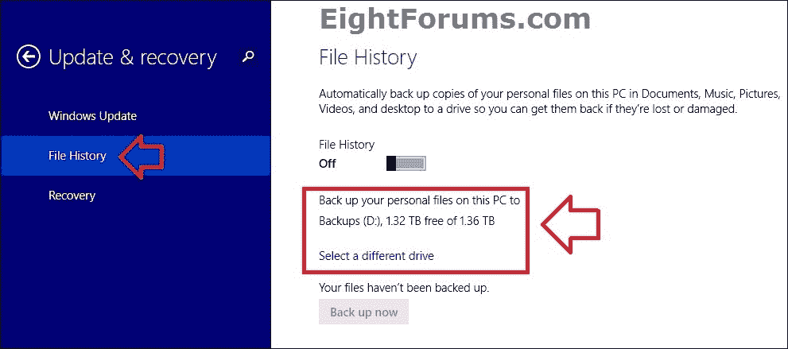
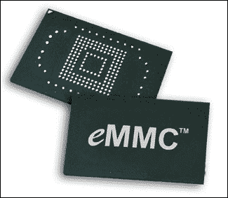
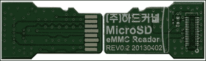
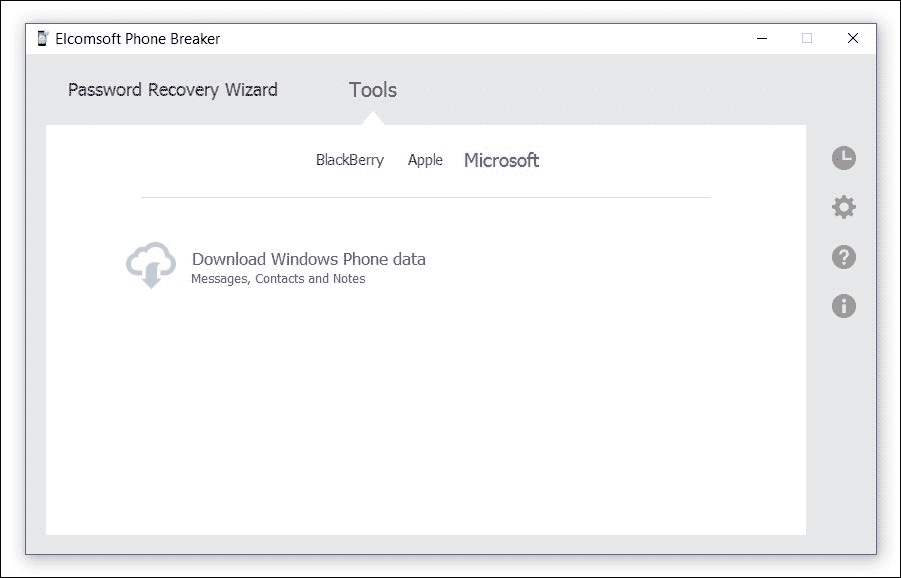
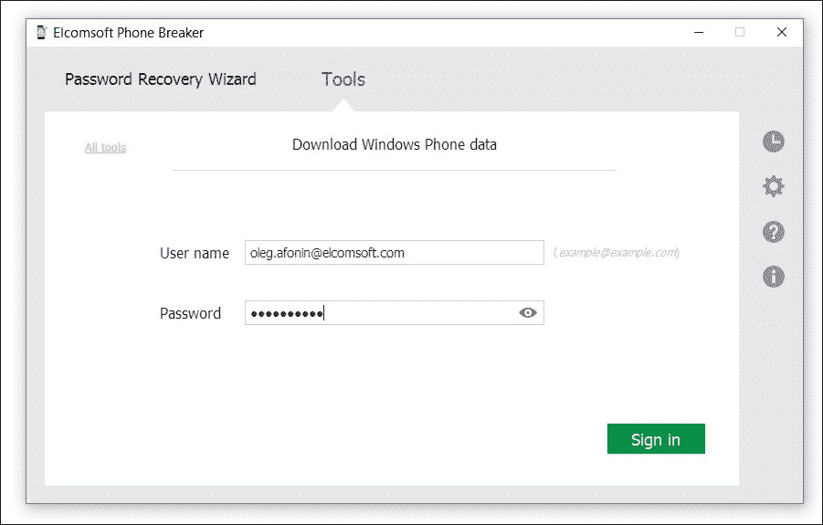
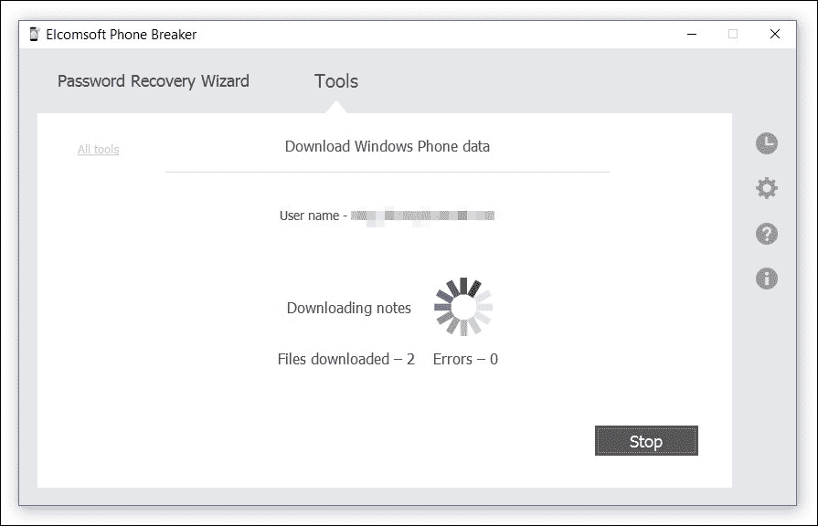
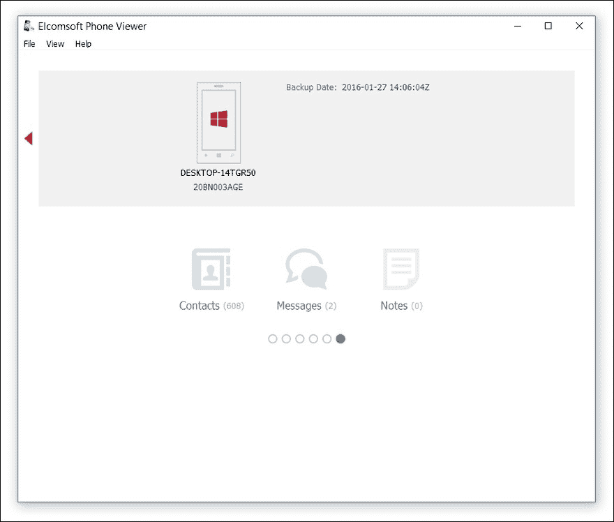

# 第八章：获取 – 处理 Windows 8、8.1、10 和 RT 平板

本书并不是一本关于 Windows 取证的书籍。获取、成像和分析 Windows 数据是数字取证领域最为成熟的领域之一。本书将涵盖使得平板取证与传统 PC 和笔记本获取方法不同的主要要点。本章将讨论取代传统睡眠和休眠模式的全新连接待机模式，讨论各种 Windows 平板平台上的**安全启动**，回顾 UEFI BIOS 设置，并学习如何从可启动 USB 介质启动平板。我们还将介绍捕获设备 RAM 内容和成像不可移除 eMMC 介质的技术。但在此之前，我们先来看看什么是 Windows 平板，什么又不是。

本书不包括的内容有：创建可启动 USB 介质的一般步骤（这一部分在其他地方已经有详细介绍，包括微软官方资源），以及使用任何特定取证工具制作的可启动 USB 介质的使用。然而，我们会描述 Windows RT 设备的这些步骤，因为标准 Windows 恢复介质无法与 RT 设备兼容。

# Windows 8、8.1、10 和 RT 在便携式触摸屏设备上的应用

自从 2012 年发布 Windows 8 以来，微软一直在瞄准便携电子设备市场。新的磁贴式用户界面优化了触摸使用，旨在主要用于平板电脑和具备触摸屏的便携式计算机。

微软渴望进入平板市场，甚至专门开发了一个名为 Windows RT 的 Windows 版本，用于运行基于 ARM 指令集的硬件（如诺基亚 Lumia 2520、微软 Surface RT 和 Surface 2 等设备中的 Snapdragon 800 和 NVIDIA Tegra 4 芯片组）。如今，微软已正式声明这只是一个权宜之计，而许多顾客和 IT 媒体早已认为这条路是死胡同。

恰巧在差不多同一时间，英特尔决定征服便携式电子设备市场，并通过补贴那些选择在手机和平板电脑中使用英特尔 CPU，而不是采用当时主流的 ARM 架构的制造商，来推动 x86 架构。这吸引了制造商生产搭载英特尔处理器并运行安卓系统的平板和手机。现在，随着许多便携式设备采用 x86 架构，微软不再需要依赖 RT 和 ARM 架构。

为了与安装在 x86 处理器平板电脑上的 Android 竞争，微软决定向生产小型和廉价设备的制造商免费提供 Windows。因此，微软发布了一款名为 Windows 8.1 with Bing 的特别版本，免费提供给 8 英寸及以下显示尺寸的小型平板电脑制造商。微软还为安装 Windows 的制造商提供额外的激励措施，如 64GB 及更大容量 SDXC 卡上的默认文件系统 exFAT 免费授权以及免除许可费（否则安卓设备制造商需要支付给微软的许可费用）。

这些激励措施实际上起了作用。虽然绝对数量上没有那么多 Windows 平板电脑，但每年的销量都在增加。HP Stream 7、Dell Venue 8 Pro 以及许多其他 7 英寸和 8 英寸的 Windows 平板电脑以极低的价格出售。

如今，全球销售数十万台这些设备。尽管大多数平板电脑运行完整的 Windows 系统（仍有少数运行 Windows RT 的设备存在），但与过去购买台式机和笔记本电脑的方式有很大不同。

# Windows 平板电脑的获取

购买 Windows 桌面和笔记本电脑相对较容易。程序已广为人知，专家们长期以来都有处理这些机器的经验。例如，要获取内存转储，可以简单地插入一个 USB 驱动器并运行一个小型实用程序。如果这种方法不可行，还可以利用 FireWire 端口（如果有安装的话），或者在没有 IEEE.1394 端口的情况下安装一个附加的 FireWire 适配器。对于平板电脑而言，这种操作则需要使用不同的技术。

这种相对新的 Windows 设备类别包括便携式电子设备，其中包括平板电脑和可转换设备（带可拆卸键盘的笔记本电脑）。从法医学的角度来看，这些设备在某些方面与 Windows 桌面电脑相似，但在其他方面却有很大不同。我们来看看如何处理平板电脑。

## 理解安全启动

在过去几年制造的大多数计算机和笔记本电脑，以及几乎所有营销过的 Windows 8、8.1 和 Windows 10 平板电脑，它们的 UEFI BIOS 中都有一个叫做安全启动（Secure Boot）的功能。安全启动由 PC 行业成员开发，旨在保护设备的引导加载程序，防止启动未经信任（或者说未签名）的系统。如果配置了安全启动，平板电脑只能使用厂商信任的软件进行引导。

安全启动的概念类似于我们在苹果 iOS 和许多 Android 设备上看到的锁定启动引导程序，尽管其操作和技术实现方式有所不同。如果在计算机的 UEFI BIOS 中启用了安全启动，计算机的固件会验证启动链中每一环的数字签名，包括固件驱动程序和操作系统。只有当签名通过验证时，计算机才会启动。

需要理解的是，禁用安全启动并不是进入 Windows 8.x/Windows 10 恢复镜像的必要条件，即使该镜像存储在外部闪存驱动器上。安全启动的功能是防止不受信任的、未签名的代码运行，因此如果启用，它会阻止启动 Linux 或其他系统。

### 注意

安全启动仍然是一个可选功能，微软 Windows 8、8.1 和 Windows 10 都支持，但并非必须。所有 Windows RT 设备出厂时都启用了不可移除的安全启动保护，这使得对这些机器进行取证分析变得更加困难。

## 连接待机（InstantGo）

便携式 Windows 设备，如平板电脑和可转换设备，设计时基于 **Connected Standby**（连接待机）概念，这意味着除非用户特意发出 *关机* 命令，或者电池几乎耗尽，否则设备不会真正进入休眠或自动关闭。

在连接待机模式下，设备每 16 小时休眠只消耗约 5% 的电池电量（根据微软的规格）。在此模式下，设备保持与无线网络的连接，并执行大多数常规的后台活动，如检查和接收电子邮件、同步社交网络以及更新新闻源。

对于数字取证目的，这意味着任何被扣押的 Windows 平板电脑必须像处理一部活跃的手机一样处理。换句话说，必须采取预防措施，将设备立即放入法拉第袋中，以阻止其无线连接。然而，这也意味着被获取的便携设备几乎肯定处于*开启*状态，并且可以用来获取内存转储。

重要的是，**InstantGo**（连接待机）是 Windows 平板电脑上自动激活 BitLocker 设备加密的其中一个要求。

## BitLocker 设备加密

BitLocker 设备加密是 Windows 8.x 和 Windows 10 安全模型的一个关键部分。设备加密本质上是 BitLocker 的功能受限版本，用于加密整个 C 盘分区。与仍主要运行 Windows 7 的桌面和笔记本电脑不同，所有版本的 Windows 8.x 和 10 用户，包括核心版和带 Bing 的 Windows，均可使用 BitLocker 设备加密。

从本质上讲，对于数字取证，BitLocker 设备加密会在用户使用具有管理员权限的 Microsoft 帐户登录时自动启用。首次登录后，系统会自动开始加密过程。加密过程在后台运行，对最终用户是透明和不可见的。恢复密钥会自动保存在用户的 Microsoft 帐户中，并且可以从该帐户中检索以解密设备。在企业环境中，BitLocker 的托管密钥会保存在活动目录中。

### 提示

**重要：** 保存到用户 Microsoft 帐户中的恢复密钥（BitLocker 托管密钥）可以随时由用户删除。微软表示，从用户的 Microsoft 帐户中删除的恢复密钥会被永久销毁，公司不会保留。因此，应该考虑防止嫌疑人访问他们的 Microsoft 帐户并删除存储在该帐户中的 BitLocker 恢复密钥。

BitLocker 设备加密在所有版本的 8.1 和 Windows 10 中提供。然而，与完整的 BitLocker 不同，设备加密要求设备符合以下所有规格：

+   InstantGo（前称为连接待机）支持

+   固态硬盘或 eMMC 存储

+   焊接（不可拆卸）RAM 以防止冷启动攻击

+   **受信平台模块** (**TPM**) 2.0 芯片

必须满足以上所有规格，才能启用 BitLocker 设备加密。值得注意的是，所有 Windows RT 设备以及大多数 Windows 8.1 和 Windows 10 平板电脑自然符合上述所有规格，唯一的例外是某些较便宜的平板电脑可能没有 TPM 芯片。因此，BitLocker 设备加密不会自动启用在没有 TPM 芯片的低价 Windows 8.1/Windows 10 设备上。

### BitLocker 与加密文件系统

虽然 BitLocker 保护整个操作系统驱动器免受离线攻击，**加密文件系统** (**EFS**) 可以通过按用户基础加密单个文件和文件夹提供额外的文件级安全性。换句话说，尽管 BitLocker 加密保护整个计算机的内容免受外部攻击，EFS 有助于在同一台计算机的多个用户之间保持安全隔离。EFS 可以与 BitLocker 结合使用，以进一步加密 BitLocker 保护驱动器上的文件。

### BitLocker 与休眠

正如我们所知，BitLocker 将其二进制加密/解密密钥存储在计算机的主内存中，这使其容易受到内存转储攻击。然而，BitLocker 解密密钥可能会出现在计算机的休眠文件中。

*Mike Halsey* 在他发表的文章 *Will Bitlocker's Security Flaw Remain in Windows 8?* ([`www.ghacks.net/2012/03/15/will-bitlockers-security-flaw-remain-in-windows-8/`](http://www.ghacks.net/2012/03/15/will-bitlockers-security-flaw-remain-in-windows-8/)) 中声称，休眠或许是 BitLocker 最大的安全漏洞。所有版本的 Windows（包括 Windows 8.1）都会在硬盘的某个位置以未加密的形式存储休眠文件。这就使得可以使用取证工具（例如，Elcomsoft Forensic Disk Decryptor）从休眠文件中提取二进制解密密钥，并利用这些密钥立即解锁加密卷。微软对此表示确认 ([`technet.microsoft.com/en-us/library/ee449438(v=ws.10).aspx#BKMK_Sleep`](https://technet.microsoft.com/en-us/library/ee449438(v=ws.10).aspx#BKMK_Sleep))，并建议在启用休眠电源管理的情况下，使用额外的身份验证步骤来保护 BitLocker 加密镜像。

值得注意的是，许多 Windows 8 系统默认情况下会禁用休眠功能。然而，Windows 8.x 平板电脑通常会有一个 Microsoft 称为 *快速启动* 的选项，这是一种混合关机（或部分休眠）电源管理模式。由于快速启动默认启用，每次用户通过电源 Charm 关闭平板电脑时（与通过 Windows + *X* 菜单关闭不同，后者会反直觉地执行完全关机），系统会将内核和驱动程序保存到较小版本的休眠文件（`hiberfil.sys`）中。通过使用该文件，系统能够在下次启动时更快地启动。

部分休眠文件不包含 BitLocker 解密密钥。

### 注意

**注意：** 如果目标计算机在加密卷卸载时被关闭或进入休眠状态，则休眠文件将不包含加密密钥，无法立即解密 BitLocker 卷。

### BitLocker 获取总结

总结上一章的内容，如果硬盘的 C 盘被 BitLocker 保护，则可以通过以下几种方式获取密钥：

**如果你拥有 BitLocker 储存密钥（恢复密钥），你可以执行以下操作之一**：

1.  解锁 BitLocker 分区并解密捕获的卷镜像。

1.  按原样处理镜像，解密捕获的镜像（例如，通过将镜像保存到物理硬盘，使用 Windows 虚拟机或使用你选择的取证产品解密该镜像）。

**如果你没有 BitLocker 储存密钥（恢复密钥）**：

1.  尝试捕获内存转储（RAM 转储）以获取二进制解密密钥：

    1.  为了使其生效，计算机必须以开机并解锁状态被获取。

    1.  如果有 FireWire（IEEE.1394）端口，可以尝试通过 FireWire 攻击捕获内存。

1.  如果平板电脑被锁定，则无法捕获内存转储，因为内存芯片已焊接以防止冷启动攻击，并且 Windows 平板通常没有 FireWire 端口。然而，休眠（如果可用）或关机（如果启用了 Windows 快速启动）可能会产生一个可用的休眠文件，从中可以提取解密密钥。

1.  如果设备是在休眠状态下被查获，尝试获取休眠文件（`hiberfil.sys`）。

1.  使用 Elcomsoft Forensic Disk Decryptor（[`www.elcomsoft.com/efdd.html`](https://www.elcomsoft.com/efdd.html)）分析内存转储或休眠文件，提取 BitLocker 二进制解密密钥，并挂载加密卷。

1.  解密的卷映像。

## 捕获内存转储

尝试捕获 Windows 设备的内存转储对于数字调查至关重要。根据 ACPO 指南，这也是推荐的做法。

直到最近，执法人员在查获计算机时通常会直接关闭计算机，从而丧失了存储在计算机易失性内存中的大量潜在重要证据。在 Windows 环境中，这些信息包括社交网络中的近期活动、运行中的进程数据、开放的网络连接、缓存的密码以及私人浏览会话。特别值得关注的是，可以用于解锁加密卷（如 BitLocker、TrueCrypt 和 PGP WDE 所维护的加密卷）的二进制加密密钥（可以使用 Elcomsoft Forensic Disk Decryptor 提取这些密钥，并用它们挂载加密卷）。如果调查人员能够捕获并分析计算机的易失性内存内容，那么这些以及许多其他类型的证据是可以恢复的。

这正是 ACPO 推荐在获取数字证据时捕获并分析计算机 RAM 内容的原因。在获取数字证据并进行计算机存储镜像之前，转储易失性内存内容已经成为标准操作程序。

尽管转储并分析计算机易失性内存的内容非常重要，但必须意识到，由于 RAM 本身的性质，它具有高度的易失性和高度的碎片化。因此，可能永远无法找到完整的对话记录或正在编辑的整个文档。相反，可能会有片段、碎片和破损部分——这些可以通过某些智能切割算法（如 Belkasoft 智能切割）重新组合成有用的内容。可以在计算机的 RAM 中实际发现什么？

## 易失性内存中可用的证据类型

某些类型的证据仅存在于计算机的 RAM 中。这些证据包括：

+   正在运行的进程和服务

+   被保护程序的解包/解密版本

+   系统信息（例如，自上次重启以来经过的时间）

+   登录用户的信息

+   注册表信息

+   开放的网络连接和 ARP 缓存

+   聊天记录、社交网络中的通讯以及 MMORPG 游戏中的通讯遗留

+   最近的网页浏览活动，包括 IE InPrivate 模式和其他 Web 浏览器中的类似隐私模式

+   通过 Webmail 系统的近期通信

+   云服务中的信息

+   在捕获时挂载的加密卷的解密密钥

+   最近查看的图片

+   运行中的恶意软件/木马

## 特殊情况 – Windows RT 设备

尽管很多人认为 Windows RT 从未追赶上来，但确实有多个设备销售，搭载了这个鲜为人知的平台。微软的 Surface RT 和 Surface 2，以及诺基亚的 Lumia 2520，都是运行 RT 平台的最受欢迎设备。那么，Windows RT 到底是什么，如果可以的话，如何获取它呢？

事实上，Windows RT 只是 Windows 8 或 8.1 的一个变种，它运行在 ARM 处理器架构上，而不是熟悉的 x86 或 x64 架构。RT 具有相同的现代 UI，并且运行大部分与完整 Windows 系统相同的 Metro 风格应用程序，并且可以访问与“完整版” Windows 相同的所有系统更新。Windows RT 具有桌面模式，理论上可以运行为 ARM 指令集编译的应用程序（` .exe` 文件）。然而，它无法运行为 Intel x86 架构编译的桌面应用程序。

此外，微软决定将 Windows RT 的桌面模式锁定为仅允许运行由微软签名的 .exe 文件，这意味着你无法使用 ARM 编译器编译自己的应用程序并直接在桌面模式下运行。这实际上排除了实时分析，并且几乎不可能使用任何已知的取证工具捕获实时内存转储。

那么如何处理 Windows RT 设备呢？由于我们不能安装除了从 Windows Store 下载的 Metro 风格应用程序之外的任何东西，我们实际上只能对其内建存储进行离线分析。

使用 Windows 内建工具不能轻松捕获实时内存转储（更多信息请参考 *如何在 Windows Server 2008 和 Windows Server 2008 R2 中生成内核或完整内存转储文件*：[`support.microsoft.com/en-us/kb/969028`](https://support.microsoft.com/en-us/kb/969028?wa=wsignin1.0)；本文中描述的技术同样适用于 Windows RT）。然而，系统的默认行为是在系统故障时创建完整的内存转储。如果能够使系统崩溃，那么就有很大的机会创建内存转储。

如果制作内存转储变得不可能，最佳的选择是让系统进入休眠状态，而不是使用连接待机功能，即使按照 *关闭、睡眠或休眠计算机* 中的描述：[`windows.microsoft.com/en-us/windows-8/how-shut-down-turn-off-pc`](http://windows.microsoft.com/en-us/windows-8/how-shut-down-turn-off-pc)，这可能也不是一个可行的选项。

然而，如果你能够使设备进入休眠状态，你将能够继续进行下一步：制作设备内建存储的取证磁盘镜像。

## SD 卡和 Windows 文件历史记录

提醒一下，大多数 Windows 平板电脑，包括 Windows RT 设备，都配备了 SD 卡槽。典型的配置允许使用一张 micro SDHC（最大 32 GB）或一张 micro SDXC（64 GB 及更大）存储卡。默认情况下，这些存储卡格式化为 FAT32（SDHC）或 exFAT（SDXC），且没有使用 BitLocker 或内建 NTFS 加密。因此，这些存储卡通常是法医分析的容易目标。

在近期的 Android 设备上，存储卡通常不用于包含应用程序数据。相反，它们的预期用途是存储多媒体文件，如大量音乐和视频，以便离线访问。但 Windows 系统并非如此，Windows 可以访问 SD 卡的整个内容，用户可以利用它来存储几乎所有东西，包括用户文档、OneDrive 内容和数据备份，甚至桌面应用程序和页面文件。

另一个促使 Windows 平板电脑使用 SD 卡的因素是，大多数 Windows 平板电脑的存储容量为 32 GB。在这 32 GB 中，安装所有当前 Windows 更新后，最终用户可用的存储空间通常只有可怜的 6 至 11 GB。

因此，Windows 平板用户更可能主动使用 SD 卡作为二级（甚至是主要）存储设备，来存储文档、相机胶卷和其他文件。

一个对调查平板设备的专家特别有趣的 Windows 功能是一个鲜为人知的功能，叫做 Windows **文件历史记录**。如果启用此功能（适用于 Windows 8、8.1 和 RT），它会自动备份用户文件（位于文档、音乐、图片、视频和桌面文件夹中的文件）以及可离线访问的 OneDrive 文件到系统分区以外的存储设备。如果原始文件丢失、损坏或删除，用户可以通过使用存储在文件历史记录中的副本来恢复这些文件。

文件历史记录包含用户文件的不同版本，如文档、电子表格的工作副本，已删除和未编辑的图片版本等，并以方便的时间轴形式排列。



这里有两个重要的要点：

+   Windows 文件历史记录使用系统分区以外的驱动器。在 Windows 平板电脑上，这几乎不可避免地是未受保护、未加密且易于移除的 SD 卡。

+   文件历史记录包含用户文件的当前版本和历史版本。

你可能会发现这些对于你的调查非常有用。

# 映像内建 eMMC 存储

在本章中，我们不会讨论法医写保护硬盘映像设备的使用。我们也不会涉及任何磁盘映像软件，因为这些工具在所有主要的法医套件中都能找到，而且你可能比本书的作者更熟悉其中的某一款工具。相反，我们将讨论如何处理 Windows 平板并使其能够使用你选择的工具进行映像。

### 注意

**注意：** 与智能手机和 Android/iOS 平板电脑一样，Windows 设备中使用的 eMMC 芯片可以被拆下并放入 eMMC 读卡器中。

这种破坏性方法被称为芯片拆卸获取。此类技术在其他地方有广泛的讨论。在本书中，我们将讨论非破坏性、基于软件的获取方法。

大多数 Windows 平板电脑（以及所有 Windows RT 设备）都配备了不可拆卸的存储，形式为 eMMC 芯片。**eMMC** 代表 **嵌入式 MMC**，或 **嵌入式多媒体卡**，其工作方式更接近标准的 SD（安全数字）卡，而非 SSD 驱动器。换句话说，eMMC 是一种不可拆卸的 BGA 闪存芯片，焊接在电路板上。如果平板电脑的存储容量为 32 GB，那么这 32 GB 存储位于 eMMC 芯片中。



这对数字取证意味着什么？

正如我们所知，大多数 Windows 平板电脑（极少数例外）都配备了内置的不可拆卸（除非使用 BGA 焊接站）eMMC 存储。让我们想一想 eMMC 芯片被焊接在电路板上的事实。它不能被拆卸并放入写保护成像设备中，也不能连接到另一台计算机。为了对内置存储进行成像，调查人员必须启动系统，并在被调查的设备上运行成像工具。这可能由于某些型号的安全设置而带来挑战。

如果我们谈论的是一款完整的 Windows 平板电脑，最佳做法是从外部可启动介质启动系统。很可能你在实验室中已经有一个。如果没有，许多工具和教程可以帮助专家完成这一操作，例如，*创建 Windows 安装介质*：[`windows.microsoft.com/en-us/windows-8/create-reset-refresh-media`](http://windows.microsoft.com/en-us/windows-8/create-reset-refresh-media) 或 [`windows.microsoft.com/en-us/windows-8/create-usb-recovery-drive`](http://windows.microsoft.com/en-us/windows-8/create-usb-recovery-drive)。

### 提示

**注意：** 由于 Windows 8 和 8.1 64 位版本早期构建中的漏洞，导致连接待机功能无法正常工作，许多 Windows 平板电脑的制造商选择在其设备上安装 32 位版本，并提供 32 位版本的 UEFI BIOS。这意味着即使 CPU 和其他硬件完全支持 64 位，系统可能仍无法从 64 位恢复介质启动。在这种系统上，调查人员必须使用 32 位恢复介质。

## eMMC 和已删除数据恢复

虽然 eMMC 存储不能完全替代 SSD 驱动器，但这两种存储类型有一个共同点：都支持修剪已删除的数据。

如果你稍微思考一下 Windows（以及大多数现代操作系统）是如何管理已删除文件的，你会意识到像已删除文件和文件夹这样的信息并不会被永久擦除。相反，系统会在文件系统中简单地为正在删除的文件和文件夹标记一个相应的属性。原本被这些文件占用的磁盘空间将被释放到可用磁盘空间池中。再强调一遍，Windows 并不会做任何事情来真正擦除或清除曾经被删除数据占用的数据块。

随着固态存储介质的引入，这种行为必须发生变化。基于 NAND 闪存的固态存储介质在擦除数据时比写入空块要慢得多。此外，NAND 闪存单元的写入次数有限，这使得某种形式的磨损均衡变得必要。为了应对这两个问题，业界采用了一定的协议来处理释放的数据块。

兼容的操作系统（Windows 7、8、8.1 或更新版本）与兼容的 SSD 或 eMMC 存储一起工作，并格式化为唯一兼容的文件系统（NTFS），会发出 TRIM 命令，指示存储控制器某些数据块不再包含数据。接收到 TRIM 命令后，控制器会将该命令中传递的数据块添加到 *脏* 块列表中，同时将它们重新映射（分配其逻辑地址）到已擦除的预留池块中。*脏* 块会在后台缓慢擦除。实际上，TRIM 命令充当了一种垃圾回收工具，帮助 SSD 防止未来写入操作的性能下降。

对于数字取证而言，这意味着你再也不能依赖已删除的文件在删除后仍然能够恢复。由于操作系统使用 TRIM 命令，并且在后台不断进行磨损均衡和垃圾回收处理，空闲块通常会在没有进一步交互的情况下被完全擦除。换句话说，如果用户删除了某些文件，这些文件将真正消失——有少数例外。

有关固态存储和数据恢复的更多信息，可以从 Belkasoft 的白皮书 *SSD Forensics 2014\. 从 SSD 驱动器恢复证据：了解 TRIM、垃圾回收和排除* 中获得，网址：[`belkasoft.com/en/ssd-2014`](http://belkasoft.com/en/ssd-2014)。

## Windows 8 和 Windows 10 加密 – TRIM 与 BitLocker

考虑到全盘加密的特性，并结合 SSD 和 eMMC 存储等固态介质的性能和使用寿命问题，人们不可避免地会遇到一个逻辑性的问题：如果在固态存储卷上启用了全盘加密，已删除的数据会发生什么？特别是，系统是否会通过保留已删除数据的加密状态来牺牲性能，还是会通过暴露加密卷中空白（已擦除）部分来牺牲安全性？

这个问题的答案取决于特定系统中使用的硬件和整个磁盘加密软件的组合。然而，对于 BitLocker 和 eMMC 存储，有一个简单且官方的答案。根据微软的说法（[`blogs.msdn.microsoft.com/e7/2009/05/05/support-and-qa-for-solid-state-drives/`](https://blogs.msdn.microsoft.com/e7/2009/05/05/support-and-qa-for-solid-state-drives/)），*BitLocker 的加密过程[已]优化为在 SSD 上工作[...]使用 NTFS。当 BitLocker 首次在一个分区上配置时，整个分区会被读取、加密并重新写回。这样做时，NTFS 文件系统会发出 Trim 命令，以帮助 SSD 优化其行为。* 正如我们所见，在这种特定情况下，微软决定追求性能，虽然牺牲了一些安全性。因此，即使你对整个 BitLocker 卷进行镜像，你也*无法*恢复已删除的文件。

然而，历史上，这并非一直如此。在 SSD 的早期，像 TrueCrypt 这样的当时的整个磁盘加密提供商全力追求安全性，绝不让 TRIM 命令传递到底层物理存储。因此，如果使用整个磁盘加密，TrueCrypt 曾经会对性能产生巨大的负面影响，因为 SSD 控制器无法再区分空闲空间和已用空间，因为在加密磁盘上，空闲空间和已用空间都被视为（加密的）数据。这种做法违背了 TRIM 的初衷，并有效地禁用了磨损均衡优化。

为了缓解这个问题，整个磁盘加密产品的开发者引入了所谓的*TRIM 直通*功能。启用此功能后，加密产品将把关于空闲数据块的信息传递给 SSD 控制器，允许它修剪已释放的数据块。这对固态存储介质的性能和寿命产生了巨大积极影响，但也暴露了哪些数据块实际被加密数据占用的信息，给外部攻击者提供了线索。这被视为一种安全弱点，因此，出于这个原因，一些 WDE 制造商选择默认不启用该功能。

经过几年后，支持自加密的 SSD 问世。这些 SSD 在物理层面上写入数据之前先进行加密。TGS Opal 全盘加密标准允许操作系统设置密钥（前提是操作系统和硬件都支持该系统），有效地解决了上述问题。因此，如果正在调查的 Windows 设备具有符合正确加密标准的存储设备（无论是 SSD 还是 eMMC），BitLocker 将利用硬件加密引擎，有效绕过基于软件的加密，转而使用硬件加密。

# 从恢复媒体启动 Windows 平板电脑

为了从恢复媒体启动，需要满足几个条件。首先，平板必须有足够的电量才能完成恢复过程。由于大多数平板将充电和连接外设（如 USB 闪存驱动器）的 USB 端口合二为一，因此在恢复之前最好将平板充满电。

其次，只有少数平板电脑提供全尺寸的 USB 端口。你更有可能遇到的是微型 USB 端口（具体为 USB2.0 或 USB3.0，取决于平板型号）。因此，你需要一个匹配的 USB **On-The-Go** (**OTG**) 数据线来连接闪存驱动器。

最后，除非在 UEFI BIOS 中指定，否则平板电脑不会从外部设备启动。

## 特殊情况——Windows RT 恢复媒体

Windows RT 设备出厂时启用了 UEFI 安全启动，这使得这些设备只能启动 Windows RT。理论上，禁用安全启动后，可以使用 ARM 版本的 Linux 或定制版 Android 启动并刷入设备。然而，这并不可行，因为在任何 Windows RT 设备上都无法禁用安全启动。

因此，你可以选择从平板的恢复分区启动，或使用自定义恢复。由于 Windows RT 是一个相对简化的操作系统，获取或制作一个可用的恢复镜像比 x86 或 x64 Windows 版本要困难得多。

如果没有恢复分区，通常可以从制造商处获取 Windows RT 恢复镜像。例如，微软为其 Surface RT 和 Surface 2 平板提供了这样的镜像，链接为[`www.microsoft.com/surface/en-us/support/warranty-service-and-recovery/downloadablerecoveryimage`](http://www.microsoft.com/surface/en-us/support/warranty-service-and-recovery/downloadablerecoveryimage)。

按照下载说明操作后，便可以制作一个可启动的闪存媒体。

## 从恢复媒体启动的步骤

微软发布了逐步指导，教你如何从 USB 恢复媒体启动 Windows 平板，链接为[`www.microsoft.com/surface/en-ca/support/storage-files-and-folders/boot-surface-pro-from-usb-recovery-device?lc=4105`](http://www.microsoft.com/surface/en-ca/support/storage-files-and-folders/boot-surface-pro-from-usb-recovery-device?lc=4105)。这些说明适用于微软 Surface RT 设备，也适用于大多数其他 Windows 平板。如果不适用，请参考所使用设备的制造商手册。

**如何在平板关闭时从可启动的 USB 设备启动：**

微软发布了以下操作指南：

+   *通过 USB 设备启动 Surface* ([`www.microsoft.com/surface/en-us/support/storage-files-and-folders/boot-surface-from-usb-recovery-device?os=windows-10`](https://www.microsoft.com/surface/en-us/support/storage-files-and-folders/boot-surface-from-usb-recovery-device?os=windows-10))

+   *使用 Surface USB 恢复驱动器*（[`www.microsoft.com/surface/en-us/support/warranty-service-and-recovery/usbrecovery?os=windows-10`](https://www.microsoft.com/surface/en-us/support/warranty-service-and-recovery/usbrecovery?os=windows-10)）

尽管这两篇指南主要针对微软 Surface 用户，但它们也适用于其他 Windows 平板电脑用户：

1.  将包含 Windows 恢复映像的可启动 USB 设备连接到 USB 端口。

    如果没有全尺寸 USB 端口，可以使用 USB OTG 电缆。

1.  按住音量减小按钮。

1.  按下并释放电源按钮。

1.  当出现 logo 时，松开音量减小按钮。

    平板电脑将启动 USB 设备上的软件。

如果平板电脑已开机且你已登录，启动过程会有所不同。

**当平板电脑已开机时，如何从可启动的 USB 设备启动：**

1.  将可启动的 USB 设备连接到 USB 端口。

    如果没有全尺寸 USB 端口，可以使用 USB OTG 电缆。

1.  从右侧滑动，然后点击**设置**（如果你使用的是鼠标，将鼠标指针指向屏幕右上角，向下移动鼠标指针，然后点击**设置**）。

1.  点击或轻触**更改 PC 设置**。

1.  点击或轻触**更新和恢复**，然后点击或轻触**恢复**。

1.  在**高级启动**下，点击或轻触**立即重启**。

1.  在**选择一个选项**屏幕上，点击或轻触**使用设备**。

1.  在**故障排除**屏幕上，点击或轻触**高级选项**。

1.  在**高级选项**屏幕上，点击或轻触 USB 设备的名称。平板电脑将重启并从 USB 设备启动。

## 配置 UEFI BIOS 从恢复媒体启动

根据特定 Windows 平板电脑的制造商（及用户执行的调整），如果从外部设备启动，可能需要更改 UEFI 设置。如果是这种情况，你需要进入 UEFI BIOS 并启用外部启动模式。

与 Windows 不同，Windows 在不同计算机间几乎没有太大差异，但 UEFI BIOS 的变化是无穷无尽的。不同制造商的选项和设置可能名称不同。

Windows 平板电脑没有 BIOS。它们使用 UEFI 固件，可以通过按住**音量减小**按钮并使用**电源**键开启平板电脑来访问。进入 UEFI 后，查找启动选项以指定平板电脑允许启动的设备顺序（关于如何将任何 Windows 平板电脑启动到 UEFI 的全面教程可以在[`www.7tutorials.com/how-boot-uefi-bios-any-windows-81-tablet-or-device`](http://www.7tutorials.com/how-boot-uefi-bios-any-windows-81-tablet-or-device)找到）。

如果你的外部启动设备包含一个安全启动密钥（例如 Windows 8.1 或 Windows PE 5.1），则无需更改 UEFI BIOS 设置中的安全启动选项。如果你使用的是未签名的可启动恢复映像，则需要先禁用安全启动。

根据制造商的不同，您可能需要将名为 **安全启动** 的选项更改为 **禁用**，并将 **UEFI 启动** 更改为 **CSM 启动**（或在某些平板电脑中为 **设置模式**），以便允许系统从外部设备启动。之后，您应该能够从自定义（未签名的）恢复媒体启动。

请注意，禁用安全启动在 Windows RT 设备上不可用。

# 获取 BitLocker 加密密钥

BitLocker 加密在 Windows 设备上是可选的。此外，许多面向预算的平板电脑（例如配备 Intel Z3735 和 1 GB 内存的设备）缺乏 TPM（受信平台模块）支持，这使得在这些设备上使用 BitLocker 变得复杂。默认情况下，Windows 8.x 中没有启用 BitLocker 加密，只有在用户使用 Microsoft 帐户登录 Windows 8 机器时（而不是使用本地 Windows 帐户）才会激活。如果您使用的是带有 Microsoft 帐户和管理员权限的 Surface RT/2，那么第一次登录时 BitLocker（或设备加密）将自动为您开启。

如果启用，BitLocker 加密将有效防止调查员访问设备的内容——即使是从恢复驱动器启动时也是如此。

### 注意

**重要**：BitLocker 是 Windows 安全模型的一个关键部分，也是调查的主要障碍。应采取一切措施以保护和恢复 BitLocker 密钥。务必尝试捕获计算机的易失性内存转储，这将包含用于解密 BitLocker 卷（如果使用）的二进制密钥。最后，BitLocker 加密仍然是可选的，如果计算机仅具有本地 Windows 帐户且未使用 Microsoft 管理员帐户，它将不会自动激活。

当使用 USB 恢复驱动器时，特别是当该恢复驱动器并非在正在成像的特定设备上创建时，可能无法访问其存储内容，因为 BitLocker 加密的原因。在使用命令提示符时，可能会提示您输入加密密钥。如果没有此密钥，包含所有用户数据的卷将继续安全加密。

BitLocker 保护可以通过正确的恢复密钥解锁。此密钥在每台计算机上都是唯一的，并存储在用户的 Microsoft 帐户中。您需要拥有用户的 Microsoft 帐户登录和密码，才能检索恢复密钥。以下步骤描述了如何从用户的 Microsoft 帐户中提取恢复密钥：

1.  如果系统提示输入恢复密钥，请记下设备屏幕上显示的 **密钥 ID**。

1.  使用另一台计算机访问 [`windows.microsoft.com/recoverykey`](http://windows.microsoft.com/recoverykey)。

1.  查找具有相同密钥 ID 的设备，如上所述。

1.  使用与给定密钥 ID 对应的恢复密钥解锁加密驱动器。

**重要**：Microsoft 持有用户 BitLocker 加密存储设备的恢复密钥。这些密钥可以通过用户的 Microsoft 账户获取，除非用户明确删除。应考虑防止嫌疑人在加密设备被扣押后销毁恢复密钥。如果你知道用户的 Microsoft 账户凭据，恢复密钥可以在几分钟内获得。通过提交书面请求并附上法院命令，可以直接向 Microsoft 获取恢复密钥。

更多关于 BitLocker 恢复密钥的信息，请访问 [`technet.microsoft.com/en-us/library/ee449438(v=ws.10).aspx`](https://technet.microsoft.com/en-us/library/ee449438(v=ws.10).aspx)。

Microsoft 还发布了关于恢复 BitLocker 驱动加密锁定计算机访问权限的说明，详情请参见：[`technet.microsoft.com/en-us/library/cc732774(v=ws.11).aspx`](https://technet.microsoft.com/en-us/library/cc732774(v=ws.11).aspx)。

请注意，按照 Microsoft 的说明，你仍然需要恢复密钥来解锁磁盘。另外，如果你在加密分区挂载时成功捕获了平板电脑的易失性内存内容，你可以使用第三方软件挂载 BitLocker 加密的卷。更多细节将在下一章介绍。

## 破解 Microsoft 账户以获取 BitLocker 恢复密钥

获取 BitLocker 恢复密钥很容易，只要你能够访问用户的 Microsoft 账户。登录 Microsoft 账户需要有效的密码。如果你不知道密码，暴力破解在线服务是行不通的。

从 Windows 8 开始，用户可以选择使用在线账户凭据登录计算机，而不必使用本地 Windows 账户和密码。通过使用 Microsoft 账户，用户可以享受自动云备份、跨多个设备同步设置和数据（如浏览器密码）的功能，最重要的是，可以将 BitLocker 恢复密钥备份到云端。

登录 Microsoft 账户需要电子邮件和密码（而不是用户名和密码）。很容易看出是使用本地账户还是 Microsoft 账户登录。像`username@live.com`、`username@hotmail.com` 或 `username@outlook.com`这样的登录名，肯定可以看出是 Microsoft 账户登录。Microsoft 账户作为单一登录解决方案，被广泛用于各种 Microsoft 服务，如 Outlook.com、OneDrive 和 Skype。

由于 Microsoft 账户是基于云的在线认证服务，通常你无法突破。尝试输入多次错误密码会导致后续的登录尝试被锁定。然而（这是个好消息），Microsoft 账户的密码哈希会被缓存在所有使用这些凭据的电脑上。

这为情况带来了一个有趣的转折。您可以获取该密码的本地哈希值，并使用它通过离线攻击暴力破解在线的 Microsoft 帐户。

为了做到这一点，您可以使用两种工具：Elcomsoft System Recovery（[`www.elcomsoft.com/esr.html`](https://www.elcomsoft.com/esr.html)）来创建可启动介质（例如 USB 驱动器），以导出本地缓存的 Microsoft 帐户密码哈希，和 Elcomsoft Distributed Password Recovery（[`www.elcomsoft.com/edpr.html`](https://www.elcomsoft.com/edpr.html)）来使用 GPU 辅助的攻击暴力破解密码，该攻击分布在多台计算机之间。字典攻击和暴力破解攻击的组合可能导致恢复用户 Microsoft 帐户的原始明文密码，解锁该帐户中保存的 BitLocker 恢复密钥，并允许我们解密 BitLocker 卷。

## 使用 Elcomsoft Forensic Disk Decryptor 解锁 BitLocker 分区

由于许多 Windows 平板电脑的 C 驱动器分区默认启用 BitLocker 保护，您需要一种方法来解锁受保护的卷。如果输入正确的用户登录名和密码，BitLocker 卷可以自动解锁。您还可以通过提供正确的恢复密钥来解锁 BitLocker 卷，而这个恢复密钥通常可以从用户的 Microsoft 帐户中获取。

那么，如果您既不知道密码，也无法访问恢复密钥该怎么办？如果是这种情况，您仍然可以选择从计算机的易失性内存转储中提取密钥。这也是为什么在尝试其他方法之前，您必须尽最大努力对计算机的 RAM 进行转储的原因之一。

如果您即将获取的 Windows 设备处于活动状态或睡眠状态（连接待机），请不要让它关闭电源。首先尝试捕获 RAM 图像。如果该设备使用 BitLocker 设备保护，捕获实时内存转储可能是唯一获取 BitLocker 解密密钥的机会。如果您能够提取该密钥，您将能够使用 **Elcomsoft Forensic Disk Decryptor**（[`www.elcomsoft.com/efdd.html`](https://www.elcomsoft.com/efdd.html)）挂载 BitLocker 保护的分区，即使您无法登录到设备。

## BitLocker 密钥和受信平台模块

虽然许多运行 Windows 8 和 8.1（以及一些 Windows 10 设备）的低端平板电脑缺少**受信平台模块**（**TPM**）支持，但仍然可能遇到具有或不具有 TPM 模块的设备。重要的是要认识到，由于解密数据所需的密钥由 TPM 锁定，因此仅仅通过移除存储设备并将其安装到另一台计算机上无法读取数据（来源：[`technet.microsoft.com/library/cc732774.aspx`](https://technet.microsoft.com/library/cc732774.aspx)）。更重要的是，TPM 拥有独立于操作系统可访问内存的内存。这意味着，密钥对的私有部分与操作系统控制的内存分开存储，不会暴露给操作系统或软件的任何部分，也无法通过内存转储工具捕获。

然而，实际的驱动器加密密钥会被释放到操作系统中，存储在系统的 RAM 中，并且可以通过捕获计算机易失性内存的快照并使用 Elcomsoft Forensic Disk Decryptor 分析该快照来恢复。

**TPM 事实摘要**：

+   TPM 在许多低端 Windows 平板电脑上不可用

+   如果没有安装 TPM，BitLocker 加密将无法立即使用（但用户可以通过`gpedit.msc`中的*允许在没有兼容 TPM 的情况下启用 BitLocker*选项手动启用）

+   如果 TPM 可用，则驱动器将保持锁定，直到密钥被释放

+   一旦加密的驱动器解锁，解密密钥会保持在计算机的 RAM 中，操作系统可以访问，并且可以通过捕获内存转储并使用 Elcomsoft Forensic Disk Decryptor 分析来获取。

# 映像 Windows RT 平板

虽然我们已经谈到了为 Windows RT 平板创建可引导 USB 设备的很多内容，但如何或是否可能对其进行映像仍然是一个大问题。Windows RT 本质上是一个受限的平台，具有平台级的安全措施，这些措施极其有效地禁止任何非签名代码在 RT 设备上启动或执行。无法禁用的预激活安全启动、使用 ARM 架构而非 x86，以及对所有桌面应用程序进行系统级受信签名检查，使得传统的获取技术无效。

由于所有已知的 Windows RT 设备都使用 eMMC，一种焊接在主板上的 BGA 芯片，因此从技术上讲，执行芯片拆卸或 ISP 获取是可能的。



然而，这是一项耗时、劳动密集且破坏性的过程，在常规调查过程中并不总是可用的选项。如果启用了 BitLocker 磁盘加密，获取过程可能会变得困难或不可能。即使在 Windows RT 中，仍然可以使用其他映像选项。

## BitLocker 加密

Windows RT 是一个受限且安全的平台。默认情况下，所有用户文件所在的 C 盘分区受 BitLocker 保护。从恢复介质启动、访问 **Windows 恢复环境** (**WinRE**) 命令提示符，或者尝试在没有提供正确的账户密码或 PIN 码的情况下登录，都会导致被锁定，无法访问该分区上的信息。因此，Windows RT 的取证工作要求你知道管理员账户的密码（或者在最坏的情况下，任何本地账户的密码），或者需要访问 BitLocker 恢复密钥。有关更多信息，请参见 *获取 BitLocker 加密密钥* 部分。

BitLocker To Go 在 Windows RT 中部分支持。根据微软的说明 ([`technet.microsoft.com/en-us/library/dn736041.aspx#BKMK_bitlockertogo`](https://technet.microsoft.com/en-us/library/dn736041.aspx#BKMK_bitlockertogo))，*“虽然 Windows RT 8.1 无法创建加密的 BitLocker To Go USB 驱动器或 SD 卡，但它能够使用这些已经从 Windows 8 Pro 或 Windows 8 Enterprise（甚至 Windows 7）电脑加密的驱动器或卡片。插入 BitLocker To Go USB 驱动器或 SD 卡时，用户将被提示输入所需的密码，然后才能访问或更新 USB 驱动器或 SD 卡上的数据。”*

### 注意

**重要**：默认情况下，Windows RT 会创建 BitLocker 托管密钥并将其上传到用户的 Microsoft 帐户。微软持有用户 BitLocker 加密存储设备的恢复密钥。这些密钥可以在用户的 Microsoft 帐户中找到，除非用户明确删除。若你知道用户的 Microsoft 帐户凭证，可以通过 [`onedrive.live.com/recoverykey`](https://onedrive.live.com/recoverykey) 在几分钟内获取恢复密钥。恢复密钥也可以通过提交书面请求和法院命令直接从微软获取。

## DISM – 一个用于映像 Windows RT 的内置工具

如我们所知，Windows RT 不允许启动任何除 Windows RT 之外的操作系统。系统也不允许运行任何未签名的桌面应用程序。

假设你拥有一台 Microsoft Surface RT、Surface 2、Nokia Lumia 2520 或任何其他 RT 平板电脑。你成功地从包含 Windows RT 的 USB 恢复介质启动设备，并且完全访问命令行。与 Android 或 iOS 平板一样，由于平板运行的是 ARM CPU 并且仅允许运行内置的桌面工具，所以你能做的映像操作不多。由于 Windows RT 平板不能执行 x86 代码（也不能运行未签名的 ARM 代码），因此取证工具的制造商并没有提供支持。这意味着，在你的取证需求中，你仅能使用 Windows 内置的命令行工具。

幸运的是，有一款工具完全符合我们的需求。微软的部署映像服务与管理（`DISM.exe`）工具完全能够创建 Windows 分区的镜像并将其保存为 WIM 格式。

为了创建平板电脑的镜像，请执行以下操作。

### 注意

**注意**：上述技术不仅限于 Windows RT。它们可以应用于任何运行 Windows 8、8.1、Windows Server 2012 或 Windows RT 的平板电脑。然而，对于非 RE 系统，存在更好的获取方法。DISM 镜像应仅作为最后手段使用。

## 必须使用管理员账户登录

如果你已经登录并拥有管理员权限，可以直接跳到 *使用 DISM.exe 创建驱动器镜像* 部分。如果没有，你需要将系统启动到恢复模式，以便获得管理员级别的命令提示符。

## 必须登录

由于 Windows PE 不适用于 RT 架构，你只能使用 Windows 恢复（修复）环境（WinRE）来获得对计算机的管理权限。特别是，你需要访问命令提示符。启动到命令提示符后，你将能够使用 Windows 内置的命令行工具。特别地，我们将使用 DISM 工具来为设备的分区创建镜像。

如果你已登录，你可以配置系统以命令提示符启动 Windows 恢复环境。

## 启动到 WinRE 命令提示符

为了启动到 WinRE 命令提示符，请执行以下操作：

1.  启动平板电脑。

1.  在登录提示符处，点击“轻松访问”图标。

1.  选择**屏幕键盘**。

1.  按下 *Shift* 键，*Shift* 键应该保持亮起。

1.  在右下角，点击电源键并选择**重新启动**。

1.  当设备重新启动时，选择**故障排除**选项。

1.  在此处，选择**高级**选项。

1.  选择**命令提示符**。

### 输入 BitLocker 恢复密钥

你可能会被要求输入主分区的恢复密钥。如果看到消息 **输入恢复密钥以继续操作**，请输入恢复密钥并按 Enter。如果你没有恢复密钥，你仍然可以使用 **跳过此驱动器** 选项访问命令提示符，但无法读取加密的卷。更多信息请参见 *BitLocker 恢复密钥：常见问题解答*：[`windows.microsoft.com/en-us/windows-8/bitlocker-recovery-keys-faq`](http://windows.microsoft.com/en-us/windows-8/bitlocker-recovery-keys-faq)。

如果你有自己的可启动 USB 驱动器，你可以类似地配置系统从该驱动器启动。

### 使用 DISM.exe 创建驱动器镜像

微软 TechNet 提供了一份关于如何使用 DISM.exe 工具捕获 Windows 分区的全面指南（请参见前面的链接 *使用 DISM 捕获硬盘分区镜像*）：

1.  **确定要捕获的分区**：最常见的 Windows RT 平板电脑配有一个系统分区、一个主分区和一个或多个保留分区（包含恢复镜像）。你需要的是主分区（如果有的话，还包括所有逻辑分区）。

1.  **为分区分配驱动器字母**：如果你要捕获的一个或多个分区尚未分配驱动器字母，可以使用 DiskPart 工具分配字母。该分区将以读写模式挂载。

1.  **使用 DISM 命令行工具捕获** **图像**：你将使用 DISM 命令并结合 `/capture-Image` 选项。示例：

```
 Dism /Capture-Image /ImageFile:c:\partition0.wim /CaptureDir:C:\ /Name:"partition0" 
```

### 注意

**注意**：如果你的附加存储空间不足以接收整个分区的图像，可以通过运行 `net use n: \\Server\Share` 命令将图像保存到网络磁盘，并将 `/ImageFile` 参数的路径替换为新映射的网络驱动器路径。

你可以在 Microsoft TechNet 上了解更多关于 DISM 命令行工具及其选项和参数的信息：

+   *DISM 镜像管理命令行选项*: [`technet.microsoft.com/en-in/library/hh825258.aspx`](https://technet.microsoft.com/en-in/library/hh825258.aspx)

+   *使用 DISM 捕获硬盘分区图像*: [`technet.microsoft.com/en-us/library/hh825072.aspx`](https://technet.microsoft.com/en-us/library/hh825072.aspx)

+   *捕获和应用 Windows、系统和恢复分区*: [`technet.microsoft.com/en-us/library/hh825041.aspx`](https://technet.microsoft.com/en-us/library/hh825041.aspx)

# 云获取

Windows RT 是基于 Windows 8/8.1 的操作系统。因此，系统能够在 Microsoft OneDrive 中维护云备份。云中备份的信息包括联系人、消息、同步的 Internet Explorer 密码、已安装应用的列表，以及一些应用设置，如存储的密码（例如，在进行完全恢复出厂设置后重新安装以前安装的 Pocket 客户端时，无需重新登录；应用会立即工作。然而，任何已下载的内容都将重新下载）。

只有当用户使用 Microsoft 账户登录（而不是使用本地 Windows 账户）并且在设置中启用了备份选项时，数据才会自动备份。然而，这对于 Windows RT 平板电脑来说是典型的使用场景。

为了下载 Windows RT 数据，请在 Elcomsoft Phone Breaker 中使用 **下载 Windows Phone 数据** 获取选项：



你需要指定用户的 Microsoft 账户登录名和密码。



该工具从 Microsoft Live! 服务器下载信息（目前只能下载联系人、笔记和消息）。

**注意：** 由于用户可能拥有多个 Microsoft 设备，Elcomsoft Phone Breaker 将下载所有设备上同步的信息，这些设备是用户通过 Microsoft 帐户登录的。包括 Windows Phone 8.1 和 Windows 10 Mobile 智能手机、Windows RT 平板电脑、Windows 8、8.1 和 Windows 10 的桌面、笔记本以及平板电脑。可通过登录用户的 OneDrive 帐户并选择 **设置** | **设备备份** ([`onedrive.live.com/Options/DeviceBackups`](https://onedrive.live.com/Options/DeviceBackups)) 来查看可用的备份列表。


Elcomsoft Phone Breaker 下载信息：



提取完成后，你将能够在 Elcomsoft Phone Viewer 中查看下载的备份。以下截图展示了从一台 Lenovo ThinkPad 8 平板（Windows 8.1）保存的云端备份中提取的信息。



# 概述

在本章中，我们讨论了获取 Windows 平板电脑的相关内容。我们介绍了 Windows 8.x 和 Windows 10 平板电脑的获取方法，并探讨了基于 ARM 的 Windows 平板电脑运行专门的 ARM 版 Windows（Windows RT）时出现的问题。我们了解了自动 BitLocker 加密，并回顾了通过从用户的 Microsoft 帐户提取 BitLocker 恢复密钥来绕过 BitLocker 保护的方法。最后，我们了解了如何通过执行离线密码恢复攻击，突破 Microsoft 帐户的缓存密码。在下一章中，我们将回到智能手机，探讨黑莓智能手机的获取选项。
