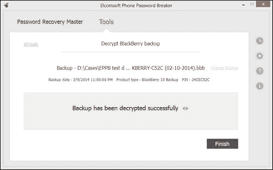

# 第九章：获取 - 接近黑莓

尽管根据彭博社的数据黑莓的全球市场份额已降至不到 1%（[`www.bloomberg.com/news/2014-05-28/blackberry-market-share-to-fall-to-0-3-in-2018-idc-says.html`](http://www.bloomberg.com/news/2014-05-28/blackberry-market-share-to-fall-to-0-3-in-2018-idc-says.html)），许多黑莓设备仍在企业环境中使用。

安全性一直是黑莓的核心优势之一。存储在加密黑莓设备中的信息，若未知正确密码，是无法提取或解密的。然而，攻击黑莓备份提供了一种恢复用户数据的方法。

从黑莓设备恢复信息取决于设备运行的黑莓操作系统版本。如果设备使用的是黑莓操作系统 10 之前的任何版本，用户可以将其配置为生成受用户选择密码保护的离线备份。然而，如果设备运行的是黑莓 10，备份将存储在在线云端，并且需要原始的黑莓 ID 和密码才能访问。

### 注意

由 Shafik Punja（Teel Technologies）和 Cindy Murphy（Gillware Digital Forensics）撰写的关于黑莓取证的综合白皮书，可以在 [`www.nist.gov/forensics/upload/5-Punja-nist-2014-bb-forensics-FULL.pdf`](http://www.nist.gov/forensics/upload/5-Punja-nist-2014-bb-forensics-FULL.pdf) 中查看（黑莓取证，NIST 移动取证研讨会 2014 年 6 月）。

# 黑莓操作系统的历史 - 黑莓 1.0 到 7.1

在黑莓 10 发布之前，现在的黑莓操作系统版本，黑莓设备可以在连接到运行黑莓桌面软件的授权计算机时，配置为生成受密码保护的离线备份（`*.ipd` 或 `*.bbb` 备份文件）。需要注意的是，这些备份仅使用用户可选的密码进行保护。与苹果不同，黑莓并未指定使用任何额外的硬件加密密钥。因此，成功恢复密码就是解密黑莓备份所需的全部步骤。

黑莓备份（OS 1.0 到 7.0）默认情况下没有密码保护/加密。用户必须在黑莓桌面软件界面中启用此选项。未加密的黑莓设备也可以通过 JTAG（兼容的型号）或芯片拆卸获取。

## 黑莓 7 JTAG、ISP 和芯片拆卸获取

根据设备是否启用了**内容保护**（数据加密，**选项** | **安全性** | **加密** 在 BB7 中），该设备可能会或不会受到高级获取技术（如 JTAG、**在系统编程**（**ISP**）或芯片拆卸）的影响。此外，这些较旧的黑莓设备可以通过其连接的 BES 解锁。请注意，JTAG 仅适用于旧设备。

根据 BlackBerry 7 设备是否连接到 BES，解密芯片脱离的转储可能成功，也可能无法成功。在某些情况下，使用内置加密（内容保护）的非 BES 设备可以通过芯片脱离方式进行转储，并通过从 SHA1 哈希文件中恢复原始密码来成功解码。

### 注意

更多信息：PGP 加密的 BlackBerry 和芯片脱离取证 [`securemobile.me/yes-the-blackberry-can-be-cracked-but-how-easily/`](http://securemobile.me/yes-the-blackberry-can-be-cracked-but-how-easily/)。

## 获取 BlackBerry 桌面备份

我们将使用 Elcomsoft Phone Breaker 通过对备份文件进行攻击来恢复保护 BlackBerry 备份的密码。需要注意的是，此攻击仅适用于 *经典* BlackBerry 操作系统（版本 7 及以下）。您可以指定一种或多种不同的攻击方式，例如，字典（也称为密码攻击）、暴力破解等。多种攻击方式的组合构成了一个恢复管道。

要在 Elcomsoft Phone Breaker 中恢复密码，请执行以下操作：

1.  打开 **密码恢复向导** 页面。

1.  通过选择文件的 **选择源** 命令，或将备份文件拖放到 **密码恢复向导** 窗口中，指定备份文件（`.ipd` 或 `.bbb`）。

    ### 注意

    **注意**：或者，您可以使用 **工具** | **BlackBerry** | **解密备份** 路径，如下截图所示：

    

1.  默认情况下，该工具将列出所有使用 BlackBerry Desktop 软件创建的本地可用备份。如果您正在恢复位于嫌疑人硬盘、外部设备或已挂载的取证磁盘映像上的备份，您需要手动指定备份文件的位置。

1.  在指定备份文件后，您需要定义将用于破解密码的攻击方式。点击加号 + 以添加不同的破解密码攻击。默认情况下，字典攻击和暴力破解攻击会自动添加。如需了解攻击方式及其设置的更多信息，请参见在线手册中的 *密码恢复攻击* 主题。

1.  您可以选择通过点击每种方法右侧的齿轮图标来配置字典攻击和暴力破解攻击。

1.  点击 **开始恢复**。Elcomsoft Phone Breaker 将开始攻击密码。显示剩余的估计时间以及当前处理的密码。您可以点击攻击名称旁边的 **更多信息** 来查看附加信息，例如已尝试的密码数量和平均攻击速度。

1.  如果攻击成功，发现的密码将在**恢复结果**窗口中显示。此时，您可以解密备份并在**Elcomsoft BlackBerry Backup Explorer**中打开它（[`www.elcomsoft.com/ebbe.html`](https://www.elcomsoft.com/ebbe.html)），或者使用第三方取证工具，利用发现的密码解密备份。

就是这样，我们已成功恢复密码。现在可以使用该密码解密备份。此外，您还可以破解保护 BlackBerry Wallet 和 Keeper 数据的密码。

## 解密备份

以下部分适用于 BlackBerry OS 备份（BB OS 7 及更早版本）。BlackBerry 10 的备份使用不同的过程获取。

如果您已经知道（或之前已恢复）BlackBerry 备份的密码，EPPB 可以解密它，因此您可以在其他软件中打开解密后的备份文件（我们推荐使用 Elcomsoft Blackberry Backup Explorer）。

您需要一个 BlackBerry 数据库`*.ipd`文件或 BlackBerry 备份`*.bbb`文件来解密备份。

只有 BlackBerry 智能手机备份可以解密；从 PlayBook 设备创建的备份具有不同的格式，目前尚不支持，因此 EPPB 只能恢复此类文件的密码，但无法解密它们。

要解密 BlackBerry 备份，请执行以下操作：

1.  在**工具**菜单中，选择**BlackBerry**选项卡。

1.  选择解密备份。

1.  选择一个 BlackBerry 数据库文件（`*.ipd`）或 BlackBerry 备份文件（`*.bbb`），将其拖放到**解密备份**窗口中，或者点击**选择备份**手动导航到所需的文件。

1.  加载备份后，您可以查看以下有关备份的信息：

    +   备份日期

    +   产品类型

1.  您可以通过点击备份名称旁边的**更改备份**来选择其他备份。

1.  定义备份解密选项：

    +   **保存解密到**：选择解密后备份保存的位置。

    +   **备份密码**：输入备份的密码。切换**查看**按钮，以字符或星号（*****）显示密码。如果您尚未恢复密码，点击**恢复密码**。

    

1.  点击**解密**。

1.  解密过程已开始。您可以查看处理的文件数量以及解密过程中出现的错误数量。

1.  当解密完成后，您可以通过点击**查看**按钮查看保存到本地计算机的备份位置。

1.  点击**完成**以关闭解密备份页面。

您现在已经成功解密了备份，可以继续恢复 BlackBerry Keeper 和 Wallet 数据。

### 注意

**注意**：如果您正在查看由旧版本的 Blackberry（BlackBerry 10 之前版本）生成的备份文件，您可以使用 Elcomsoft Blackberry Backup Explorer：[`www.elcomsoft.com/ebbe.html`](http://www.elcomsoft.com/ebbe.html)。

## BlackBerry 密码管理器和 BlackBerry 钱包

BlackBerry 密码管理器和 BlackBerry 钱包是两个内置的应用程序，包含大量宝贵的数据。网站的认证凭证和密码存储在 BlackBerry 密码管理器中，提供更快捷的登录体验。BlackBerry 钱包存储信用卡号码、账单和送货地址、忠诚计划和常旅客计划等信息。通常，这些信息会通过额外的主密码进行加密保护。

BlackBerry 密码管理器和 BlackBerry 钱包不共享主密码（但没有什么可以阻止用户使用相同的密码设置它们）。如果连续 10 次输入错误的密码，在用户选择相应设置（默认行为）的情况下，存储在 BlackBerry 密码管理器或钱包中的信息可能会被永久删除。

### 注意

**注意**：在分析离线备份时，不必担心 10 次失败的尝试会擦除数据。事实上，在恢复密码管理器和钱包主密码时，我们会尝试数百万个密码——显然不会丢失存储在备份中的任何数据。

### BlackBerry 密码管理器

BlackBerry 密码管理器通过主密码保护用户密码的访问。只需要记住一个密码，用户就更容易为不同的资源（如网站、应用程序和服务）保持独特的密码。BlackBerry 鼓励使用密码管理器生成包含长字符、数字和符号的随机密码，这些密码极其安全。密码管理器加密用户的密码，只有输入正确的密码管理器主密码才能解密。

存储在 BlackBerry 密码管理器中的密码默认包含在完整的离线备份中（除非在备份时明确排除）。备份本身是加密的；然而，即使备份被解密，密码管理器中的密码仍然会受到额外主密码的保护。

### BlackBerry 钱包

BlackBerry 钱包存储某些财务信息，如信用卡号码、账单和送货地址、常旅客号码、忠诚奖励和会员卡号码。钱包旨在加速移动支付过程，通过自动填写必填字段简化在线购买流程。

存储在 BlackBerry 钱包中的数据非常敏感，并且通过钱包主密码进行加密保护。这个密码通常与 BlackBerry 备份密码不同，提供了额外的保护层。

## BlackBerry 安全模型 - 破解设备密码

存储在经典 BlackBerry 操作系统设备中的信息通过设备密码进行保护。每次开机时，设备都会请求输入设备密码，同时每次安全超时到期时（如果启用了该选项）也会要求输入设备密码。10 次错误尝试将导致数据完全清除，无法再进行恢复。这个安全特性是 BlackBerry 安全模型的标志之一。然而，个人安全密码**不是强制执行的**，是可选的。换句话说，BlackBerry 设备用户**不必**为 BlackBerry 设备（包括 BlackBerry 10）启用设备密码，除非通过公司政策（BES、Exchange 服务等）强制执行此保护。

ElcomSoft 已发现绕过设备密码的方法。在某些情况下，如果选择了用户可选择的选项来加密可移除媒体卡的内容，则可以离线攻击并恢复设备密码。如果是这种情况，调查人员可以使用 Elcomsoft Phone Breaker 来分析存储在媒体卡（microSD）上的信息，并在不使用 BlackBerry 设备本身的情况下攻击原始设备密码。

什么是媒体加密，为什么它可以用来攻击设备密码？BlackBerry 智能手机可以选择加密 SD 卡的内容。理论上，这将不允许攻击者在不知道正确的设备密码的情况下访问存储在 SD 卡上的信息。实际上，加密方案依赖于设备密码，允许在不使用设备本身的情况下攻击该密码。需要注意的是，SD 卡加密默认情况下是禁用的，但一些用户选择启用额外的安全层。

请注意，这种方法仅在使用**安全密码**选项加密可移除媒体卡的情况下有效（而不是使用硬件依赖的加密密钥）。大约 30% 的 BlackBerry 用户选择通过此选项保护他们的媒体卡，使他们的设备暴露于此攻击中。

根据 BlackBerry 的定义，存在三种可能的选项组合，如下所示：

+   **设备密钥**：使用由 BlackBerry 智能手机生成的媒体卡加密密钥加密文件

+   **安全密码**或**设备密码**（取决于操作系统版本）：使用 BlackBerry 智能手机密码加密文件

+   **安全密码和设备密钥**或**设备密码和设备密钥**（取决于操作系统版本）：使用媒体卡的加密密钥和 BlackBerry 智能手机密码加密文件

Elcomsoft Phone Breaker 可以成功恢复密码，如果指定了**安全密码**（设备密码）或**安全密码和设备密钥**（设备密码和设备密钥）选项。然而，如果启用了**安全密码和设备密钥**，即使恢复了原始密码，也无法在没有使用过的 BlackBerry 设备的情况下解密媒体卡内容。

BlackBerry 10 始终使用基于设备密钥的媒体卡加密，这带来了两个后果。首先，我们不能再通过使用加密的媒体卡来攻击设备密码。其次，如果用户将卡从原始使用的 BlackBerry 10 设备中移除，其他 BlackBerry 10 设备将无法访问该卡上的信息。因此，在将媒体卡转移到另一个 BlackBerry 设备之前，备份卡上存储的信息是至关重要的。

更多信息可以在以下网址找到：

+   [`blackberry.com/btsc/kb12999`](http://blackberry.com/btsc/kb12999)

+   [`blackberry.com/btsc/kb25484`](http://blackberry.com/btsc/kb25484)

使用此选项时，实际的 BlackBerry 设备并不需要执行攻击。所需的只是来自 SD 卡的单个文件。使用现代计算机时，离线恢复速度极高（考虑到经典 BlackBerry OS 设备的硬件速度是多么慢），每秒能解锁数千万个密码。这意味着，一个相对安全的七字符密码可以在不到一小时内解锁。

通过知道原始设备密码，调查员可以访问存储在原始 BlackBerry 设备中的信息，或者可以生成备份文件以供离线分析。

# 获取 BlackBerry 10

多年来，基于 QNX 的 BlackBerry 10 一直是 BlackBerry 的核心操作系统。它被应用于所有新设备；较旧的设备未升级至 BB 10（[`www.theinquirer.net/inquirer/news/2145581/rim-current-devices-won-t-upgraded-blackberry`](http://www.theinquirer.net/inquirer/news/2145581/rim-current-devices-won-t-upgraded-blackberry)）。

2013 年 1 月，BlackBerry 发布了一个全新的、改进版的操作系统，命名为 BlackBerry 10。最初仅在单一触摸屏设备 BlackBerry Z10 上提供，这个新系统随后扩展到包括 BlackBerry Q5、Q10、Q20（经典版）和 Q30（护照版和护照 SE），触摸屏 Z30 和 Leap，以及若干款保时捷设计的型号。

BlackBerry 10 具有运行 Android 应用的功能（可以通过 Amazon 应用商店或 Amazon Underground 安装，适用于最新版本）；然而，该操作系统不支持**Google 移动服务**（**GMS**），而且通常不会像基于 Google 的 Android 那样收集关于用户的过多信息。

## 入门指南

与 iOS 类似，BlackBerry 10 是一个封闭源代码的操作系统。与苹果类似，BlackBerry 在内部制造所有 BB10 手机，使用的仅仅是单一制造商的两款芯片组。除 BlackBerry Passport 外，所有 BlackBerry 10 设备都采用 Qualcomm Snapdragon S4 芯片组（见于 BlackBerry Q5、Q10、Q20 Classic、Z10、Z30、Z3、Leap 和限量生产的 Porsche Design 单元）。Passport 配备 Snapdragon 801。就像 iOS 一样，所有 BlackBerry 10 设备会在同一时间更新至最新版本的 BlackBerry OS。因此，没有平台碎片化，也没有平台或制造商特有的考虑。基于此，仅需几个简单的迭代即可确定最佳的数据采集方法。

*你知道设备是否加密吗？* 如果知道，并且设备*没有加密*，那么 ISP 或芯片提取将提供最大量的信息，包括已删除的数据。如果你知道设备*已加密*，那么低级别的数据采集技术可能无法奏效。

### 提示

**注意**：在现有版本的 BlackBerry 10 中，除非设备连接到 BES 且 BES 强制执行设备加密策略，否则加密不会被强制执行。此外，在没有连接到 BES 的消费者设备上，默认情况下加密是关闭的。任何 BlackBerry 10 手机的加密状态需要根据具体情况来验证。请注意，这不适用于 BlackBerry Android 设备（如 BlackBerry Priv 和 DTEK50），这些设备默认启用全盘加密。

*设备是否连接到 BES？* 根据 BB10 操作系统的版本，设备只有在连接到 BES 时才能使用 PGP 加密；用户可选择的**数据保护**可能会使用不同的加密方案。尽管通过 BES 远程解密连接到 BES 的设备是可能的，但如果不知道正确的设备密码，突破用户可选择的加密将是不可能的。

*你知道密码吗？* 如果你知道设备密码，你可能能够登录设备并通过 BlackBerry Link 或第三方工具制作完整的备份。备份将使用存储在线的密钥进行加密；只有在知道正确的 BlackBerry ID 密码的情况下，你才能解密备份。

*你有备份文件吗？* 如果你可以访问现有的备份文件，并且知道原始的 BlackBerry ID 密码，你可能能够解密它。如果没有这个密码，解密备份将是不可能的，因为解密密钥存储在服务器上。

## BlackBerry 10 备份

尽管命名方式相似，BlackBerry 10 是一个全新的系统，在各个方面与 BlackBerry OS 截然不同。差别有多大？就像 Symbian 与 Android 之间的差异一样巨大。

新的操作系统基于**微内核架构**（**QNX**），这与 Android 和 iOS 等使用的单内核架构有着本质的不同。难怪 BlackBerry 10 在操作系统安全模型上做出了重大改变。SD 卡加密不再影响设备密码。现在本地备份由 BlackBerry Link 处理，并且始终使用基于用户 BlackBerry ID 的高度安全加密密钥加密，而不是用户可选择的密码。该加密密钥深藏在设备内部，无法通过芯片移除提取。然而，该密钥可以用于在新的 BlackBerry 设备上恢复（并解密）备份，因此可以从 BlackBerry 服务器获取。

用户使用 BlackBerry Link 创建备份时究竟发生了什么？

使用 BlackBerry Link 备份 BlackBerry Passport

当使用现有的 BlackBerry ID 设置新的 BlackBerry 设备时，设备会连接到 BlackBerry 服务器并接收与该 BlackBerry ID 绑定的二进制加密密钥。该密钥随后被存储在设备的安全区域内。这个区域无法从外部访问，也不能通过 eMMC 转储或芯片移除获取；只有 BlackBerry 操作系统才能访问该密钥。

加密密钥非常安全。与 Apple 的 `securityd` 不同，BlackBerry 的加密方案不依赖于硬件。相反，密钥与用户的 BlackBerry ID 绑定，并保存在服务器上。所有这些都使得用户能够在新设备上恢复完全相同的数据，包括敏感信息。当用户更改或重置 BlackBerry 密码时，加密密钥不会改变。硬件升级后仍使用相同的密钥，这证明密钥不依赖于硬件。

当用户使用 BlackBerry Link 或第三方工具（如 Sachesi 或 Darcy 的 BlackBerry 工具）进行备份时，工具不会接收到未加密的数据。相反，工具会向 BlackBerry 设备发送命令，设备本身会实时加密信息。加密后的数据会被传输到 BlackBerry Link（或其他替代应用程序）。类似于 Apple iTunes，BlackBerry Link 并不负责制作备份；它只是接收加密的数据流并将其保存到文件中。

当恢复相同或新的 BlackBerry 设备时，设备通过 BlackBerry 服务器与 BlackBerry ID 进行初始化。加密密钥从服务器传输到设备。只有在接收到加密密钥后，设备才能解密通过 BlackBerry Link 恢复的备份。解密过程发生在设备本身。在 BlackBerry 10 中，解密后的数据永远不会离开设备。

初始化请求可以通过模拟用给定 BlackBerry ID 激活的 BlackBerry 设备来拦截。BlackBerry ID 以明文存储在备份文件中。如果你知道保护用户 BlackBerry ID 账户的正确密码，就可以使用 Elcomsoft Phone Breaker 从 BlackBerry 服务器获取加密密钥，并立即解密本地备份。

在提供用户的 BlackBerry ID 和密码后，可以使用 Elcomsoft Phone Breaker 解密离线备份。以下类别可用，并将生成：

+   应用程序数据

+   媒体文件（图片和视频）

+   设置

### 注意

**注意**：BlackBerry 10 也可以备份应用程序文件（`.bar`文件）。由于版权原因，`.bar`文件不会被提取。

BlackBerry 10 备份中的大部分信息都以明文或 SQLite 格式提供。这可以通过通用的移动取证软件进行分析。

## BlackBerry 10 - 考虑 ISP 和芯片拆解取证

BlackBerry 10 手机没有 JTAG 端口。然而，仍然可以根据设备的加密状态使用高级采集技术，例如 ISP 和芯片拆解。

随着 BlackBerry 市场份额的流失，购买 BlackBerry 的主要原因就是其安全性。因此，加密很可能在被获取的 BlackBerry 10 设备上启用。启用加密后，若没有有效的解密密钥，芯片拆解获取 BlackBerry 10 手机的内容是没有意义的，因为无法在芯片拆解过程中提取解密密钥。

### 提示

**重要**：在当前版本的 BlackBerry 10 中，加密默认没有启用，需要由最终用户或**BlackBerry 企业服务器**（**BES**）管理员激活。每台 BlackBerry 10 手机的加密状态都需要逐个验证。

如果已知某设备的密码，检查加密是否启用就很容易：

1.  打开并解锁设备。

1.  在设备的主屏幕上，从屏幕顶部向下滑动。

1.  点击**设置** | **安全与隐私** | **加密**：

1.  检查以下开关是否设置为**开启**：

    +   设备加密

    +   媒体卡加密

    

如果一台 BlackBerry 10 设备被锁定且密码未知，就没有简单的方法来验证其加密功能是否已启用。此时，可以尝试对手机进行芯片拆解，期望获取未加密的图像。

我们时不时会遇到未加密的 BlackBerry 10 设备。从统计上看，看到未加密的 BlackBerry 设备极为罕见。然而，我们已收到多个关于新款 BlackBerry（包括 BlackBerry Classic、Z10 和 Z30）成功进行芯片拆解的报告，且未出现问题。

## 获取 BlackBerry 10 备份

BlackBerry 10 设备使用 BlackBerry Link 进行离线备份。此外，BlackBerry 10 不再拥有钱包功能。然而，Keeper 应用仍然可用，并且从 10.3 版本开始成为 BlackBerry 操作系统的一部分。

### 使用 Elcomsoft Phone Breaker

您需要一个 BlackBerry 备份`*.bbb`文件来解密 BlackBerry Link 备份。您还需要创建备份的用户的 BlackBerry ID 密码。

要解密 BlackBerry Link 备份，请按以下步骤操作：

1.  当备份加载后，您可以查看备份的以下信息：

1.  通过拖放 BlackBerry 备份文件（`*.bbb`）到**解密备份**窗口，或者点击**选择备份**手动导航到所需文件。

1.  选择**解密备份**。

1.  在**工具**菜单中，选择**BlackBerry**标签。

    +   **备份日期**：PC/Mac 上的本地时间，备份已创建的时间（我们仅提取此字段并显示原样，因为它是从备份文件中提取的）。

    +   **产品类型**：已备份的 BlackBerry 设备类型。

    +   **PIN**：BlackBerry 设备的 ID

1.  您可以通过点击备份名称旁边的**更改备份**来选择不同的备份。

1.  定义备份解密选项：

    +   **保存解密至**：选择保存解密备份的位置。

    +   **关联 BlackBerry ID 用户名**：创建备份的用户的 BlackBerry ID（电子邮件）。

    +   **BB ID 密码**：输入以斜体显示在**关联 BlackBerry ID 用户名**中的 BlackBerry ID 密码。切换**查看**按钮以显示密码字符或星号（***）。

1.  点击**解密**。

1.  解密过程开始。

1.  当解密完成后，您可以通过点击**查看**按钮查看保存到本地计算机位置的备份内容。

1.  点击**完成**以关闭**解密备份**窗口。

备份现在可以在您的计算机上用于进一步分析。您可以使用 Elcomsoft Phone Viewer 浏览和查看备份的内容。

### 使用 Oxygen Forensic Suite

如果您拥有 Oxygen Forensic Suite 的许可，您可以使用该工具内置的获取向导来导入加密的 BlackBerry 10 备份。Oxygen Forensic Suite 使用 Elcomsoft Phone Breaker 的技术，通过正确的 BlackBerry ID 和密码从 BlackBerry 服务器获取解密密钥。

1.  使用**导入文件** | **导入 Blackberry 备份** | **导入 BB10 备份...**。

1.  系统将提示您输入 BlackBerry ID 密码（*而非*设备密码）：

1.  如果输入了正确的密码（工具会在您点击**应用密码**按钮后立即检查），您将能够填写案件详情，之后会出现以下摘要屏幕：

1.  点击 **提取**，工具将开始解密备份：

1.  根据备份的大小，过程可能需要相当长的时间。例如，解密一个 7.57 GB 的备份大约需要 25 分钟。

# 分析 BlackBerry 备份

市面上有许多取证工具可以解析和分析存储在 BlackBerry 备份中的信息（前提是密码已知或已恢复）。ElcomSoft 提供了以下工具：

+   **Elcomsoft BlackBerry Backup Explorer**（仅限 BlackBerry 1.0-7.1）访问地址：[`www.elcomsoft.com/ebbe.html`](http://www.elcomsoft.com/ebbe.html)

+   **Elcomsoft Phone Viewer**（BlackBerry 10、iOS 和 Windows Phone）访问地址：[`www.elcomsoft.com/epv.html`](http://www.elcomsoft.com/epv.html)

Elcomsoft BlackBerry Backup Explorer（适用于 BlackBerry 1.0 至 7.1 版本创建的备份）可以访问存储在密码保护备份中的加密信息，前提是知道原始密码或通过 Elcomsoft Phone Breaker 恢复了密码。使用该工具，您可以提取 BlackBerry 备份中可用的重要信息，进行分析、打印并导出信息。Elcomsoft BlackBerry Backup Explorer 是为数不多的能够在提供的密码下，实时解密加密备份的工具之一。

Elcomsoft Phone Viewer 可以访问解密后的 BlackBerry 10 备份。为了查看 BlackBerry 10 备份，首先使用 Elcomsoft Phone Breaker 解密它。然后打开 Elcomsoft Phone Viewer 并点击 **选择备份**：

该工具默认显示 iTunes 备份的列表（如果有）。要加载 BlackBerry 10 备份，请点击 **选择其他**：

从出现的文件对话框中，选择您要查看的 BlackBerry 10 备份。工具将导入该备份。

一旦备份被导入，您将看到设备中可用信息的概览。

Elcomsoft Phone Viewer 允许查看 **日历**、**通话**、**联系人**、**媒体**（图片和视频，包括缓存的图像和地图瓦片）、**短信** 和 **笔记**。您可以使用过滤器来指定日期范围、来电/去电等。

如果您需要更多的分析功能，可以使用一些功能齐全的移动取证工具，如 Oxygen Forensic Suite。特别是，Oxygen Forensic Suite 允许在备份的整个文件系统中进行全文搜索。

# 总结

本章中，我们回顾了两代 BlackBerry 设备的获取方法：BlackBerry OS 1 至 7 和 BlackBerry 10。我们学习了如何根据操作系统获取 BlackBerry 备份，并回顾了一个漏洞，该漏洞使我们能够在旧版 BlackBerry OS 设备中恢复设备密码（前提是其媒体卡已加密）。我们没有研究 BlackBerry Android 设备，因为它们的获取方法与获取其他 Android 设备相似。

下一章将讨论在获取移动设备时遇到的障碍、特殊情况和注意事项。
