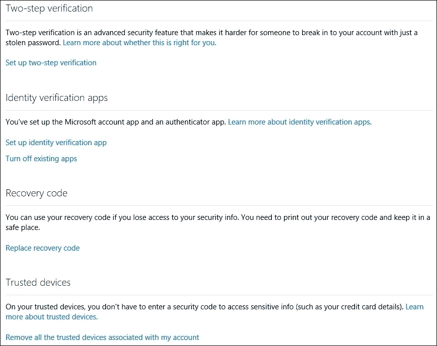

# 第十章：处理问题、障碍和特殊案例

每个获取案例都不尽相同。不同的制造商、硬件和生态系统；不同版本的移动操作系统；不同的设备安全设置；以及许多其他因素，使得每个案例都具有独特性。在本章中，我们将看看一些可能成为成功获取路上的障碍。我们将学习如何处理一些问题，并了解一些特定平台所施加的限制和局限性。

# 云获取与双重身份验证

双重身份验证可能是自密码发明以来最好的安全功能。双重身份验证在很大程度上保护了账户免受黑客攻击。仅仅一个密码，不管多么长或安全，已经不足以提供足够的保护。社交工程、关联的安全漏洞 ([`blog.elcomsoft.com/2013/02/yahoo-dropbox-and-battle-net-hacked-stopping-the-chain-reaction/`](http://blog.elcomsoft.com/2013/02/yahoo-dropbox-and-battle-net-hacked-stopping-the-chain-reaction/))、泄露的密码和被黑的邮箱，都加剧了基于密码的保护的不安全性。一旦入侵者掌握了某人的密码，他们就能轻松访问该账户。更糟糕的是，他们还可以通过例如使用被黑的电子邮件地址来请求其他相关服务的密码重置，从而访问其他账户。双重身份验证旨在解决这一问题。

LinkedIn。Yahoo! Mail。Dropbox。Battle.net。IEEE。Adobe Connect。PayPal。eBay。Twitter。这些只是最近一些大型服务提供商被黑的例子，数百万的密码被泄露。

那个臭名昭著的名人照片泄露事件 ([`www.mirror.co.uk/3am/celebrity-news/celebrity-4chan-shock-naked-picture-4395155`](http://www.mirror.co.uk/3am/celebrity-news/celebrity-4chan-shock-naked-picture-4395155)) 引起了极大的关注。它展示了 iCloud 用户如何容易受到远程黑客攻击。成千上万的名人通过 iPhone 拍摄的裸照直接从他们的 iCloud 账户中被盗。显然，黑客能够从名人的 Apple ID 获取密码，并使用 Elcomsoft Phone Breaker 的副本获得访问链接的 iCloud 账户。如果 Apple 强制要求 iCloud 账户持有者启用双重身份验证，那么这个问题可能会发生得更少。即使双重身份验证并非万无一失，且易受社交工程攻击，它确实需要黑客付出更大的努力才能从受害者那里获取一个快速过期的安全代码，并且对攻击者构成更高的风险。

作为一名移动取证专家，你可能会在尝试从嫌疑人的云账户获取信息时遇到类似的障碍。

## 双重身份验证——Apple、Google 和 Microsoft

三大主要移动服务提供商（Apple、Google 和 Microsoft）都采用类似的双因素身份验证方法。最常见的两种方法是在线和离线。

在线身份验证通过在受信任的设备上批准认证请求或输入推送到用户的代码，或通过短信发送的代码来工作。离线身份验证应用程序必须初始化一次加密种子；此后它们会生成时间敏感的身份验证代码，而无需互联网连接。

Google 主要通过其 Google Authenticator 应用程序（或在 Windows Phone 设备上通过 Microsoft Authenticator）使用离线身份验证。不过，推送认证是 Google 在 2016 年 6 月新增的功能。

Apple 主要依赖在线身份验证，将代码推送到受信任的 iOS 设备，或通过短信传送服务器生成的一次性验证码。使用时间依赖的离线代码的功能是在 iOS 9 中加入的，支持双因素身份验证。

最后，Microsoft 用户可以同时访问这两种认证方法。Windows 用户在验证其 Microsoft 帐户时，可以随时选择在线或离线认证。此外，用户可以通过电子邮件地址或电话号码设置两步验证。当用户尝试在新设备或新位置登录时，Microsoft 会发送安全码供用户在登录页面输入。

|  | **Microsoft** | **Apple** | **Google** |
| --- | --- | --- | --- |
| **推送认证** | 是：仅适用于 Windows 10 Mobile 和 Android 应用 | 是：适用于 iOS 9 及更高版本 | 是：适用于运行最新 Google Play 服务的 Android 未指明版本 |
| **离线认证** | 是 | 是：iOS 9，通过设置 | 是 |
| **文本/SMS 认证** | 是，作为备份 | 是，作为备份 | 是，作为备份 |

## 在线与离线身份验证

在使用在线身份验证时，用户必须在其受信任的设备上批准通知。使用这种类型的身份验证，用户无需输入安全代码，而是会向所有受信任的设备推送验证请求。通过批准请求，用户可以成功确认其身份。

离线认证应用程序基于不同的原理。它们不需要活动的互联网连接或移动服务。每隔几秒钟，认证应用会自动生成一个新的时间敏感的一次性验证码。即使受信任的设备处于离线状态，代码也会自动生成。

虽然通常可以通过在线身份验证应用取消单个受信任设备的授权，但取消离线身份验证的授权仅能同时对所有离线身份验证应用进行。生成新的加密种子后，使用旧种子生成的离线认证应用程序代码将无法验证。

## 应用程序密码与双因素身份验证

双重身份验证仍然相对较新。因此，一些设备和第三方应用在启用双重身份验证时，无法正确验证账户。如果是这种情况，用户在尝试设置账户时会看到密码错误的提示。这是因为这些较老的应用不支持额外的安全代码。

这个问题立即引起了双重身份验证方案开发者的关注，并实现了一个巧妙的解决方法。如果某个应用或设备不支持双重身份验证，用户可以创建一个独特的应用密码，让这些应用能够登录并有效绕过第二步身份验证。用户可以根据需要生成任意数量的应用密码。微软、苹果和谷歌都支持特定应用的密码。建议用户为每个不支持双重身份验证方案的应用或设备创建新的应用密码。

用户可以随时撤销应用密码。使用被撤销密码的应用将无法登录或认证（例如，通过存储的令牌）。有趣的是，特定应用的密码无法用于网页登录或与各公司各自的应用程序配合使用。

一个由谷歌 2FA 生成的典型应用密码如下所示：`asdg skgf dsks ezck`（输入时不应有空格）。

从取证角度看，这些应用密码一旦被提取，可以有效绕过双重身份验证。然而，它们在取证中的使用是有限的。例如，苹果不允许使用应用密码下载 iCloud 备份，但允许访问某些类型的数据（如笔记和消息）。微软也不允许通过应用密码访问其备份。另一方面，谷歌即使在使用应用密码时，也允许有限访问某些类型的数据。值得注意的是，当专家无法访问第二重身份验证因素时，应用密码可以作为最后的手段。

## 谷歌的双重身份验证

谷歌实现了统一的双重身份验证，保护用户在使用谷歌账户进行的所有互动。如果启用了双重身份验证，用户在尝试访问任何由谷歌账户提供的服务时，若是从新设备、应用或浏览器发起的访问，都必须验证身份。例如，在 Internet Explorer 中验证 Gmail 并不会自动授予用户在 Chrome 中访问同一 Gmail 账户的权限，反之亦然。

受保护的服务包括（但不限于）登录谷歌账户、使用 Gmail、访问谷歌云端硬盘中的文件或文档，或设置新设备（例如，Android 手机）以访问谷歌 Play 服务。总的来说，谷歌的双重身份验证实现比苹果和微软更为一致且直接。

谷歌主要依赖离线的、非交互式的双重认证。认证应用可以在 Android 和 iOS 上轻松获取。用户通过扫描在设置双重认证时显示的颜色二维码来初始化该应用。一旦初始化完成，应用会持续生成并显示六位数的验证码，这些验证码有效时间很短（30 秒）。

从技术上讲，该应用实现了 RFC 6238 标准中定义的 TOTP 或 HOTP 安全令牌。因此，基于相同标准的类似双重认证应用可能与谷歌兼容，生成的验证码将与用于认证账户的验证码完全相同。例如，微软的认证应用（Microsoft Authenticator），可以在 Windows Phone 平台的 Windows Store 中获取，完全兼容微软和谷歌的双重认证方案，能够用于认证这两种类型的账户。

离线认证通常很方便，因为它不需要活跃的互联网连接。然而，由于它用于验证账户访问（本质上是在线操作），因此这一点是无关紧要的。这种认证方式的缺点是用户无法撤销已授权的设备或应用。如果用户需要撤销任何设备上的应用授权，他们必须生成一个新的初始化图像，并用来重新初始化所有设备上的认证应用。

由于初始化的认证应用可能并不总是可用，谷歌提供了两种备用选项来接收认证码。用户可以授权一个或多个电话号码，通过短信（SMS）接收一次性验证码。此外，用户还可以打印 10 个预生成的八位数备份码。这些备份码不会过期，但它们是一次性的；每个码只能使用一次。如果所有备份码都被使用，或者用户丢失了它们，可以在[`www.google.com/landing/2step/`](https://www.google.com/landing/2step/)生成一批新的备份码（这将自动使上一批未使用的备份码失效）。

谷歌提供了多种认证选项，从可打印的验证码、应用特定的密码、可信设备上的推送认证，到安全密钥（电子令牌）。

Elcomsoft Cloud Explorer ([`www.elcomsoft.com/ecx.html`](https://www.elcomsoft.com/ecx.html)) 支持谷歌的双重认证。如果谷歌认证服务器请求验证码，工具会自动请求该验证码：

点击**登录**后将会要求输入验证码：

你可以从受信任的设备请求代码（如果选择**安全代码**作为身份验证类型，将会出现受信任设备列表），或者使用**恢复密钥**，如果可用。输入代码并点击**验证**以继续：

### 注意

更多关于 Google Authenticator 的信息请访问[`garbagecollected.org/2014/09/14/how-google-authenticator-works/`](https://garbagecollected.org/2014/09/14/how-google-authenticator-works/)。

## 微软的实现

在微软 Windows 的世界里，微软通过多重安全措施保护 Microsoft 账户登录。微软在恢复 Windows 8、8.1、Windows 10、Windows Phone 8.1 和 Windows 10 Mobile 时使用相同的 2FA 配置。运行这些操作系统的设备数量庞大，因此了解微软双因素认证的含义非常重要。

为什么法医专家应当关注微软系统中的双因素认证？至少，双因素认证保护了之前所有兼容系统所做的在线备份的访问。这些备份包含了关于用户的全面信息，包括存储的 Internet Explorer 和 Edge 浏览器密码、应用数据、联系人、通话记录和短信。尽管微软备份中可用的数据量略少于苹果 iOS 所捕获的数据，但仍远多于 Android 备份中可获得的数据（即便是最新的 Android 6.0.1）。

在设置新的 Windows 8、8.1 或 Windows 10 PC 并尝试使用 Microsoft 账户登录时（而不是使用本地登录），系统可能会提示你完成身份验证。用户的身份可以通过在受信任的设备上批准验证请求或输入由 Authenticator 应用生成的代码来验证。验证请求可以推送到受信任的 PC 或移动设备上的授权 Microsoft 账户应用程序（该应用的 Android 版本也可用）。一旦通过应用程序批准请求，新设备将被添加到受信任设备列表中。

Windows Phone 8 和 8.1 平台使用离线版 Microsoft Authenticator 应用，其工作方式与 Google Authenticator 相似（生成时效性单次使用代码）。两者的区别在于前者需要活跃的互联网连接来接收认证请求，而后者完全离线工作。两种认证方法可以同时启用。

不同的认证类型可能并非在所有平台上都可用。微软已经编制了一份详尽的 FAQ，介绍如何在不同的移动平台上配置身份验证应用程序。

### 注意

**身份验证应用程序**：常见问题解答请见[`windows.microsoft.com/en-US/Windows/identity-verification-apps-faq`](http://windows.microsoft.com/en-US/Windows/identity-verification-apps-faq)。

### 提示

**你知道吗？** 微软和谷歌的离线认证应用是兼容的。用户可以使用运行在 Windows Phone 设备上的 Microsoft Authenticator 来认证谷歌账户，或者使用运行在 iOS 或 Android 上的 Google Authenticator 来认证微软账户。

以下是不同平台上可用的身份验证应用类型：

+   **Apple iOS**：它是一个离线认证器。微软建议使用与之兼容的 Google Authenticator。

+   **Android**：它既支持离线认证也支持在线认证。微软账户处理在线认证请求，而 Google Authenticator 可用于生成离线认证码。

+   **Windows Phone**：它是一个离线认证器。Microsoft Authenticator 可用于验证微软和谷歌账户。

可以在 [`account.live.com/proofs/Manage`](https://account.live.com/proofs/Manage) 配置验证方法。

### 注意

**关于微软两步验证的更多信息**：[`windows.microsoft.com/en-us/windows/two-step-verification-faq`](http://windows.microsoft.com/en-us/windows/two-step-verification-faq)。

微软允许使用双重身份验证来保护与微软账户的所有交互。然而，用户可以选择仅为访问敏感信息启用此类身份验证，例如在 Windows 10 设备上建立微软账户（这会自动启用对通过 Microsoft OneDrive 同步的所有文件的完全访问权限，访问存储的密码，以及恢复包括配置设置和应用数据在内的备份的能力）。

## 苹果的两步验证

直到最近，苹果一直使用自己独特的多因素认证方法。这个被称为两步验证的额外安全层（[`support.apple.com/en-us/HT204152`](https://support.apple.com/en-us/HT204152)）仅用于保护使用用户的 Apple ID 可以执行的某些活动。具体来说，二步验证涵盖（并且如果你使用的是 iOS 版本低于 9.0，仍然覆盖）以下所有活动：

1.  登录到 Apple ID 账户页面。

1.  在新设备上登录 iCloud 或访问 [`www.icloud.com/`](https://www.icloud.com/)。

1.  登录 iMessage、Game Center 或 FaceTime。

1.  在新设备上进行 iTunes、iBooks 或 App Store 购买。

1.  获取与 Apple ID 相关的支持，请访问苹果。

根据苹果的说明，以下是两步验证的工作原理：

1.  按照平常的方式输入 Apple ID 和密码。

1.  苹果会将验证代码发送到你的某一设备上。

1.  输入验证码以验证身份并完成登录。

### 注意

**来源**：[`support.apple.com/kb/PH14668?locale=en_US`](https://support.apple.com/kb/PH14668?locale=en_US)

两步验证只支持一个次级认证因素：受信任的 iOS 设备。苹果会将验证代码推送到受信任的设备上，用户可以使用该设备验证启用了两步验证的请求。

备份验证方法包括短信验证和可以创建、打印并存放在安全地方的离线**恢复密钥**。

随着 iOS 9 的发布，苹果从这种专有方案转向了另一种方法：更加开放的双因素认证。

## 苹果的双重认证

自 iOS 9 起，苹果从双重验证切换到了一个不同的、改进的安全机制。苹果的双因素认证直接集成在 iOS 9 中，旨在保护访问存储在 Apple 上的所有照片、文档及其他重要数据。

自 2015 年秋季以来，苹果已逐步向符合条件的用户推出双重认证（[`support.apple.com/en-us/HT205075`](https://support.apple.com/en-us/HT205075)）。与较早的双重验证不同，新的双重认证机制从根本上保护 iOS 设备。如果启用了双重认证，用户每次从新设备访问 Apple ID 时，都需要输入一个独特的、一次性六位数的认证代码。该代码会自动显示在用户的其他设备上，或发送到受信任（并已验证）的电话号码（[`support.apple.com/en-us/HT204915`](https://support.apple.com/en-us/HT204915)）。

该代码每个设备仅请求一次。它在用户完全注销、擦除设备或更改密码之前保持有效。可以通过提供信任浏览器的选项来记住网页登录。

## 绕过苹果的双因素认证

在数字取证中，次级认证因素可能存在也可能不存在。如果次级认证因素是受信任的 iOS 设备，则需要能够解锁该设备（通过输入正确的密码）才能访问推送的认证代码。此访问权限可能对调查员可用，也可能不可用。

当执行受双重验证或双因素认证保护的苹果账户的云端数据获取时，调查员可以通过使用缓存的认证令牌绕过认证要求。认证令牌是一段缓存数据，有助于在不需要用户每次输入凭证的情况下对请求进行认证。

此时，仅由 Apple iTunes 生成的认证令牌可以用于绕过认证。

获取并使用二进制认证令牌访问用户的 iCloud 和 iCloud Drive 数据的详细信息，请参阅我们的博客：

### 注意

**突破 iCloud**：无需密码，详见 [`blog.elcomsoft.com/2014/06/breaking-into-icloud-no-password-required/`](http://blog.elcomsoft.com/2014/06/breaking-into-icloud-no-password-required/)。

如果没有可用的二进制认证令牌，仍然有可能从计算机中提取正确的 Apple ID 和密码：

### 注意

获取和使用 Apple ID 密码，降低风险并保护个人信息，详见[`blog.elcomsoft.com/2015/03/acquiring-and-utilizing-apple-id-passwords-mitigating-the-risks-and-protecting-personal-information/`](http://blog.elcomsoft.com/2015/03/acquiring-and-utilizing-apple-id-passwords-mitigating-the-risks-and-protecting-personal-information/)。

**进一步阅读**：Apple 双重身份验证和 iCloud，详见[`blog.elcomsoft.com/2013/05/apple-two-factor-authentication-and-the-icloud/`](http://blog.elcomsoft.com/2013/05/apple-two-factor-authentication-and-the-icloud/)（该文章发布于 2013 年，因此自那时以来某些内容已有变化）。

## 双重身份验证——一个真正的障碍

双重身份验证在确保用户账户安全方面起到了重要作用。即使使用了一个弱密码，第三方也可能无法访问被双重身份验证保护的信息，如果他们无法物理接触到第二个身份验证因素的话。

双重身份验证是执行无线获取的障碍。因为获取通常发生在被认为是新设备的设备上，认证系统会要求通过第二个因素验证用户身份。因此，像 Elcomsoft Cloud Explorer 这样的工具需要输入正确的身份验证代码。

有例外情况。例如，可以从之前已授权的计算机中提取 Apple 的认证令牌，并与像 Elcomsoft Phone Breaker 这样的工具配合使用。这允许访问存储在用户 iCloud 中的信息，包括 iOS 备份和上传的文件，即使没有可信设备也能访问。

# 未分配空间

虽然我们会为每个独立的移动平台分别讲解未分配空间问题，但本章将所有关于该问题的信息集中在一个地方。为了方便读者将本章作为参考，我们包含了一些关于内部存储（eMMC）和外部存储（SD 卡）以及加密基础知识的信息，并探讨了加密对未分配空间的影响。我们分别审视了内部和外部存储的加密选项，因为它们对未分配空间的影响可能大不相同。如果你只想知道是否能从特定设备中恢复未分配空间，继续往下读吧！

## 未分配空间的问题

从智能手机中删除的信息会发生什么？在进行完全恢复出厂设置后，数据还有生命吗？在远程清除之后，设备上还剩下什么？恢复未分配空间中存储的信息的最佳方法是什么？需要哪些工具和设备？鉴于六大主流移动平台和无数变种，任何这些问题都没有统一的答案。让我们从头开始探讨这个问题。

# 访问不同移动平台上被销毁的证据

目前，我们有几个截然不同的移动平台：苹果 iOS、安卓、Windows Phone 8、Windows RT、Windows 8/8.1/10 和黑莓 10。说这些平台在处理已删除数据时有所不同，并没有说明太多。安卓和 iOS 在处理已删除数据和恢复信息方面截然不同。Windows Phone 8 介于二者之间，而 Windows RT 以及完整版本的 Windows 8/8.1/10 则各自有其问题。

## 苹果 iOS – 不可能

本章写起来很简单。在 iOS 5 及更高版本中，恢复存储在未分配空间中的数据是不可能的，甚至对于越狱设备也是如此。即便你将设备送到苹果公司，也无法恢复，即使你提供密码。一旦数据丢失，就无法找回。恢复出厂设置会彻底且不可恢复地删除所有内容。

存在一个理论概念，允许你将文件系统的状态恢复到过去的某个时刻。曾经开发过一个概念验证工具，但它从未真正达到可用状态。

这背后的原因是苹果实现加密的方式。从 iOS 5 起，苹果在 iOS 设备中使用了全盘加密。解密密钥仅为文件系统（已分配数据块）保留。iOS 会立即丢弃未分配（已释放）数据块的解密密钥。这意味着一旦文件被删除，针对那些加密数据块的解密密钥就会被销毁。

你可能能够提取完整的磁盘映像。你可能能够提取解密密钥。但你仍然无法解密未分配区域，因为这些数据块的解密密钥已经不存在。虽然实际的（加密）数据可能仍然存在，但绝对没有办法解密它。

由于没有苹果设备使用外部存储（SD 卡），因此也无法从 SD 卡中恢复信息。

那么对于越狱设备用户可用的来自 Cydia 仓库的*数据恢复*工具呢？那些是假的。在近期的 iOS 设备上，已删除的文件是无法恢复的，任何声称能恢复此类数据的工具或服务都是骗子。

请注意，你仍然可以通过检索设备的 iCloud 备份来访问一些最近删除的文件。由于 iCloud 保留最近的三个备份，通过 Elcomsoft Phone Breaker（[`www.elcomsoft.com/eppb.html`](https://www.elcomsoft.com/eppb.html)）下载最早的备份，可能会发现那些文件在被删除之前还存在。

## 黑莓 – 不确定

安全性是黑莓智能手机的标志。虽然以前版本的黑莓操作系统允许用户选择安全性和数据加密级别，但最新的黑莓 10 并非如此。

根据设计，BlackBerry 10 采用可选的全盘加密功能，由终端用户或由企业**BES**（**BlackBerry 企业服务器**）进行激活。BlackBerry 10 没有越狱方法。BlackBerry 10 设备的物理获取方法有限（Cellerbrite UFED 通过引导加载程序利用某些设备漏洞，如果没有设置设备密码）。无法提取已加密 BlackBerry 10 智能手机的解密原始镜像。芯片取出方法只能生成加密的磁盘镜像；所有数据将继续保持加密状态。BlackBerry 的安全模型非常优秀，并且无法访问 BlackBerry 10 智能手机中（加密的）未分配空间的数据。

实际上，销售给终端用户的 BlackBerry 10 手机默认并未启用加密。由于许多用户不会主动启用加密（或者担心加密后存储子系统的性能变慢），我们遇到过不少未加密的 BlackBerry 10 智能手机。

由于在较新的 BlackBerry 设备上没有物理获取方法，也没有 JTAG 提取方法，芯片取出是唯一可用于 BlackBerry 10 设备的提取方法。没有已知的方法来判断某个特定的 BlackBerry 是否已加密。因此，特定 BlackBerry 10 手机的加密状态必须逐一确定。

### SD 卡

一些 BlackBerry 10 设备可以使用 SD 卡来扩展存储空间。这些 SD 卡可以加密，也可以不加密。未加密的 SD 卡可以通过常规方式获取。然而，针对加密 SD 卡并没有解密内容的方法（除非你指示原始 BlackBerry 10 设备执行此操作，而这需要先通过密码解锁设备）。

三星设备已知会使用存储在设备内存中的加密密钥来加密 SD 卡。因此，加密的 SD 卡只能在同一设备中使用。Windows 10 Mobile 也采用类似的技术来加密 SD 卡。

## Android – 有可能，但有限制

Android 是一个高度碎片化的平台，它实现了许多与 iOS 相反的功能。我们来看看当文件在 Android 设备中被删除时会发生什么。

### Android – 内建存储

许多 Android 设备有两种完全独立的存储类型：内建存储（通常是 eMMC 芯片）和可选的外部存储（通常是 micro SD 卡）。

在 Android 2.3 Gingerbread 之前，Android 智能手机通常使用普通的闪存芯片作为主要存储。为实现磨损均衡，使用了一种称为 `f2fs` 的闪存友好型文件系统。从 Android 2.3 及以后的版本开始，绝大多数 Android 智能手机使用 eMMC 存储。通常，数据分区会使用 Linux 文件系统之一进行格式化，如 `ext3` 或 `ext4`，但 `f2fs` 也经常出现。在过去，YAFFS2 文件系统也是一个常见的选择。部分三星型号使用 RFS，这是一种基于 FAT 的文件系统。

请注意，仍有大量超低价的中国智能手机使用原始 NAND 芯片，而非 eMMC 闪存。虽然芯片摘取采集可以捕获这些芯片的完整原始数据，但较为简单的采集方式，如物理采集和 JTAG，通常也能在这些设备上使用。这些设备在中国以外的地区相对较为罕见。

### 未加密存储

如果数据分区未加密，可以通过物理采集、JTAG、**ISP**（**In-system programming**，系统内编程）或芯片摘取方式捕获完整的磁盘映像，从而使调查人员可以通过支持 Linux 文件系统的工具进行未分配空间分析。所有 eMMC 存储的限制条件都适用（如 *eMMC 和已删除数据* 部分所述）。需要注意的是，完整磁盘物理采集可能需要获取 root 权限，或者使用能够临时 root 设备的采集工具。这些方法无法提取 eMMC 芯片的过度分配区域。

### 加密存储

Android 在许多方面与 iOS 完全相反，包括它的加密方式。与采用全盘加密并销毁未使用块解密密钥的苹果 iOS 相对，Android 的加密是基于扇区的。因此，如果成功解密用户分区，未分配区域也会自动解密。

由于 Android 是一个高度碎片化的平台，OEM 厂商可以以多种不同方式实现系统的各个部分。某些厂商（例如三星）以设备间差异化较大而闻名，甚至通过 OTA 更新改变同一设备上的加密类型。因此，无法预测某个特定的加密分区是否能够通过物理采集方式提取（无论是否知道正确的密码）。有一点是肯定的：加密会使得低级攻击（如 JTAG 和芯片摘取）变得复杂。

### Android 各版本的加密方式

说到原生 Android，谷歌早在 Android 3.0 Honeycomb 就实现了加密。然而，大多数 OEM 从 Android 4.0 开始才实现加密。基于 Linux 的 `dm-crypt`，第一代加密容易被暴力破解。第二代加密更难破解，但暴力破解密码仍然可能（通过切换函数为 scrypt）。Android 加密的初期实现本质上是不安全的，因为加密元数据和加密数据存储在一起。

三星早期的设备使用了原生 Android 的加密实现。然而，该公司对其安全性并不满意，因此开始实验自己的加密实现。三星早期的专有加密实现仍然将加密元数据公开访问。然而，随着时间的推移，公司学会了加密元数据，并将主密钥移到了一个受保护的区域（在芯片提取时无法访问）。

Android 5.0 的加密实现方式与三星的做法非常相似。加密元数据现在由一个主密钥保护，该主密钥被存储在一个受保护的区域，无法通过芯片提取方式访问。谷歌曾计划强制所有搭载 Android 5.x 系统的设备启用加密；然而，这一计划并未实现，除了 Nexus 系列之外，大多数 Android 5.x 设备的加密仍然是可选的。

如果你设法获取到加密分区的未保护镜像（例如，通过物理采集），或者成功解密一个受保护的镜像，你可能能够访问未分配的区域。请注意，大多数加密实现也实现了 Trim 透传，允许 eMMC 控制器清除（擦除）不再使用的数据块。这些数据块将显得像是空的（零填充）区域。然而，由于 Trim 操作在 eMMC 控制器上并不是即时完成的（与大多数 SSD 驱动器不同），你可能仍然有时间分析并恢复这些未分配区域中的数据。

## Android – SD 卡

由于许多 Android 设备配有 SD 卡插槽，而且这些 SD 卡很少被加密（详见下一章），因此检索和分析外部 SD 卡是一种恢复信息的简单方法。自然，从 SD 卡恢复信息最好是将卡取出，并以只读方式插入到微型 SD 读卡器中，直接连接到调查员的计算机。

由于 Android 是一个高度碎片化的平台，系统的多个不同版本（以及许多厂商定制化的版本）在 SD 卡上存储哪些数据的策略各不相同。Android 有以下政策，用户在不进行 root 的情况下无法更改这些政策，但个别 OEM 可以覆盖这些政策：

+   **Android 2.3, 4.0-4.2**：应用程序允许写入外部 SD 卡。许多 OEM 实现将外部 SD 卡设置为未保护状态。应用程序可以被移动到 SD 卡上。应用程序可以安装到 SD 卡上。移动到或安装到 SD 卡上的应用程序可以将数据保存在该 SD 卡上。

+   **Android 4.4**：由于安全策略的变化，只有系统应用程序可以完全访问外部 SD 卡。普通应用程序不能将数据保存在 SD 卡上，除非它们使用了新的 **SAF**（**存储访问框架**）API。SD 卡仍然可以用于存储多媒体文件（如音乐和视频）或保存信息，例如地图数据（例如，HERE Maps）。

+   **Android 5.0-5.1**：新的 API（SAF 扩展）现在允许完全访问 SD 卡目录和文件。

+   **Android 6.0**：访问外部存储（SD 卡和 OTG 闪存）与内部存储整合。

引入不同的 API 是为了确保存储在 SD 卡上的信息的安全性。与通常使用 ext3 或 ext4 格式化的内部分区（这种文件系统内建权限管理和访问控制）不同，外部 SD 卡通常使用 FAT32（SDHC，最多 32 GB）或 exFAT（SDXC，64GB 及更大卡）格式化。这两种格式都没有实现任何类型的权限或访问控制，因此操作系统需要完全控制谁可以访问 SD 卡上的哪些区域。

### 注意

**注意**：64GB（及更大容量）SDXC 卡默认使用 exFAT 格式化。您将需要一个支持 exFAT 的工具来恢复已删除的信息并分析这些 SD 卡上的未分配区域。虽然您仍然可以使用不支持 exFAT 的工具来刻录这些卡，但这些工具将无法区分已分配和未分配的区域，且结果可能混乱。请检查您的工具功能，因为并非所有工具都支持 exFAT。

### Android – SD 卡加密

在 Android 手机上，加密的 SD 卡相对较少见。标准 Android 在 Android M 之前的任何版本中都没有实现外部 SD 卡的加密（尽管 SD 卡加密将成为 Android M 的一部分）。

许多三星手机以及某些 OEM ROM 提供可选的 SD 卡加密。相应的设置通常位于 **设置** | **更多** | **安全性** | **加密外部 SD 卡** 或 **设置** | **控制** | **安全性** 下，并且只能在手机设置了密码保护的情况下启用。与内部存储类似，SD 卡没有 `全盘` 加密。相反，只有文件系统被加密。未分配（空闲）区域通常不会加密，这使得调查人员能够在加密前恢复存储在 SD 卡上的已删除信息。三星设备已知会使用存储在设备内部存储器中的加密密钥来加密 SD 卡。因此，加密的 SD 卡只能在加密该卡的同一设备上使用。

### 注意

Android M 实现了可采纳存储的新概念，允许我们像使用内部存储一样使用外部 SD 卡或 USB 驱动器。这意味着，采用的外部存储与保护内部存储使用的加密方式相同。更多信息可以参考 [`nelenkov.blogspot.fi/2015/06/decrypting-android-m-adopted-storage.html`](http://nelenkov.blogspot.fi/2015/06/decrypting-android-m-adopted-storage.html)。

恢复出厂设置会导致存储在加密 SD 卡上的数据无法使用（即使 SD 卡与设备分开存储），因为在重置过程中加密主密钥被销毁。

# Windows Phone 8 和 8.1 — 对终端用户设备有可能，但存在一些限制

Windows Phone 是一个独特的系统。其他三个系统都是基于 Unix 的。苹果的 iOS 基于 BSD UNIX，谷歌的 Android 基于 Linux，BlackBerry 10 基于 QNX。而 Windows Phone 8/8.1 则基于微软的 Windows，并共享其系统架构和文件系统（NTFS）。

Windows Phone 8/8.1 是一个平衡良好的操作系统，借鉴了 Android 和 iOS 的许多优点。与 iOS 略似，它提供了创建云备份的功能（尽管这些备份包含的信息较少，与 iOS 相比，几乎没有应用程序数据被恢复，只有登录数据会被恢复）。该操作系统为每个应用提供独立的数据空间（沙盒），并且删除应用后不会留下残余垃圾。然而，它允许访问共享文件（例如，任何支持的应用程序都可以播放音乐和视频，而不仅仅是用户导入数据的那个应用程序），这与 Android 相似。像 iOS 一样，Windows Phone 通常不允许从 Windows Store 以外的来源安装应用程序。

Windows Phone 设备可以通过官方的开发者解锁来安装来自第三方来源的有限数量的未签名应用程序。然而，与 Android 不同，用户安装的应用无法获得管理员权限。由于 Windows Phone 设备无法被 root 或越狱，因此也无法安装具有管理员级别访问权限的可执行文件。

因此，无法开发用户级应用程序在手机上启动以访问未分配的空间。这个问题是由于权限不足和缺少低级磁盘访问 API 导致的。

销售给最终用户的 Windows Phone 8/8.1 设备没有预先启用加密。与 Android 不同，用户不能手动在设备上启用加密，且设置中没有任何加密选项。这使得可以使用 JTAG 和芯片提取方法提取设备的完整磁盘镜像。此外，还存在一些方法可以直接读取 eMMC 芯片，而无需将其从电路板上移除。所有 eMMC 存储的常见限制都适用（如在 *eMMC 和已删除数据* 部分所述）。Windows 10 Mobile 改变了这种行为，允许用户完全控制设备的加密（和解密）。

一些较新的 Windows Phone 8 设备（例如，诺基亚 Lumia 520）可以通过利用启动加载器漏洞进行物理获取。Cellebrite 提供了一种工具（**UFED**），可以对选定的 Windows Phone 进行物理获取。通过这种方法获取的镜像（如果设备没有加密）将包含手机存储的完整原始转储，包括未分配的区域。

## Windows Phone BitLocker 加密

通常，Windows Phone 操作系统（版本 8 和 8.1 以及 Windows 10 Mobile）支持使用 BitLocker 技术来加密用户数据。该技术有效地保护信息（包括未分配区域）免受 JTAG 和芯片提取等硬件攻击。

在 Windows Phone 8 和 8.1 中，最终用户无法控制设备加密。手机设置中没有任何选项可以启用或禁用加密。

在 Windows 10 Mobile 中，微软添加了一个用户可访问的设备加密设置。有趣的是，微软允许同时启用和禁用加密，允许调查人员通过简单的设置更改来解密加密的设备。不用说，任何存储在未分配空间中的数据在解密过程中将**永久丢失**。

Windows 10 设备加密

根据微软的说明（[`dev.windowsphone.com/en-US/OEM/docs/Phone_Bring-Up/Secure_boot_and_device_encryption_overview`](https://dev.windowsphone.com/en-US/OEM/docs/Phone_Bring-Up/Secure_boot_and_device_encryption_overview)），Windows Phone 设备在企业环境中通常会预先启用 BitLocker 加密。设备加密并不是默认启用的。以下情况会自动启用设备加密：

+   用户将 Outlook 帐户添加到手机中，并且它连接的 Microsoft Exchange 服务器被配置为要求设备加密。

+   用户将手机连接到公司应用帐户，并且该帐户的企业设备管理服务器会将一个要求设备加密的策略推送到手机上。

在这两种情况下，设备加密策略更改配置在手机上后，手机会自动开始加密主操作系统和内部用户数据存储分区。加密工作会被限制，以最小化对终端用户的影响。

这种加密有效地防止了通过物理获取捕获完整磁盘映像，并使得未分配空间分析变得不可能。JTAG/芯片拆卸获取仍然可以进行，但会变得毫无用处。

根据微软的说法，*与桌面 Windows 的 BitLocker 不同，Windows Phone 上没有恢复密钥备份，也没有用户界面选项让终端用户启用或禁用设备加密。微软 Exchange 服务器和企业设备管理服务器无法在启用设备加密后禁用它*。

### 提示

[`dev.windowsphone.com/en-US/OEM/docs/Phone_Bring-Up/Secure_boot_and_device_encryption_overview`](https://dev.windowsphone.com/en-US/OEM/docs/Phone_Bring-Up/Secure_boot_and_device_encryption_overview)

## Windows Phone SD 卡

许多 Windows Phone 智能手机（有少数例外）支持通过 SD 卡槽使用外部存储。Windows Phone 操作系统实现了对外部存储的高级支持，允许用户不仅可以在 SD 卡上存储音乐和视频，还可以使用外部存储安装应用程序。与 Android 不同，这一功能在所有配备 SD 卡槽的 Windows Phone 设备上都是标准配置，无论是哪个 OEM。特别是那些内部存储空间有限的入门级 Windows Phone 设备（例如 8 GB 型号）很可能会安装 SD 卡，这使得获取更加容易。

Windows Phone 没有单独的选项来加密 SD 卡的内容。相反，SD 卡加密是通过与手机相配套的公司政策触发的，这意味着大多数终端用户设备将保持完全未加密状态，而大多数公司设备将加密内部分区并启用 SD 卡加密。

即便设备的安全策略要求加密 SD 卡，根据微软政策，用户文件（如照片和视频）将保持未加密状态。

有关 Windows Phone 8.1 中 SD 卡加密的更多信息，请参阅 第八章，*获取 —— 接近 Windows 8、8.1、10 和 RT 平板*。

# Windows RT、Windows 8/8.1 和 Windows 10

由于 Windows RT 是一个封闭平台，不允许运行未签名的桌面应用程序，除了将设备送回制造商（并附带政府请求）以外，其他获取选项非常有限。

由于大多数 Windows RT 设备（以及许多运行 Windows 8/8.1/10 的平板电脑）都配备了适当的 BitLocker 磁盘加密功能，因此遇到加密系统分区的设备的可能性较高。（为了恢复，默认情况下，如果设备配备了 TPM 模块，具有不可拆卸的（焊接）内存，并且用户使用 Microsoft 账户登录而不是本地 Windows 账户，BitLocker 全盘保护会自动启用，而无需用户干预。）有关 BitLocker 保护的更多内容，请参见 **BITLOCKER DEVICE ENCRYPTION**。请注意，BitLocker 恢复密钥可以通过政府请求从 Microsoft 获取。

BitLocker 加密是基于卷的。在 eMMC 和 SSD 硬盘上，BitLocker 提供了 TRIM 透传功能，并且不会加密未分配的空间。已释放的数据块将保持加密状态，直到被 SSD 或 eMMC 控制器修剪。

如果 BitLocker 加密没有被启用，通常的获取技术以及适用于 eMMC 的所有考虑事项仍然适用。然而，Windows RT 的获取可能会较为复杂，芯片提取可能是最有效的解决办法。

大多数 Windows RT 设备（几乎所有 Windows 8/8.1 平板电脑）都支持 SD 卡。虽然 Windows RT 可以访问（并解密）通过 BitLocker To Go 加密的 SD 卡，但该系统没有提供加密 SD 卡的工具。（用户仍然可以在运行完整版 Windows 8/8.1/10 的另一台 PC 上为 SD 卡设置密码进行加密，然后使用该加密卡在 Windows RT 设备上。）因此，你很可能会看到未加密的 SD 卡。由于许多 Windows 和 Windows RT 设备的存储空间不足以同时存放 Windows 安装和 Metro 应用程序（32GB 几乎只能满足此需求），因此用户很可能会安装一张 micro SD 卡。

请注意，在 *完整版*（非 RT）版本的 Windows 中，BitLocker To Go 仅在 Windows 8 和 8.1 的专业版和企业版中支持。

还需要注意，Windows RT 和 Windows 8/8.1/10 会在用户的 Microsoft 账户下保持 OneDrive 备份文档（如果用户使用 Microsoft 账户登录），并且会在用户的 Microsoft 账户中保持完整的应用程序备份（包括应用数据）。只要知道用户的 Microsoft 账户登录信息和密码，检查员就可以从云端提取信息。或者，可以向 Microsoft 提交政府请求，获取他们所拥有的信息，包括存储在云端的所有 BitLocker 恢复密钥。

# eMMC 和已删除的数据

所有移动设备的少数共同点之一是内部存储类型的选择。所有苹果智能手机和平板电脑，大多数自 Android 2.3 Gingerbread 以来的安卓设备，所有 BlackBerry 10 智能手机，Windows Phone 8，Windows RT，以及大量的 Windows 8/8.1 平板电脑都使用 eMMC 芯片作为存储。

**eMMC** 代表 **嵌入式 MMC**，即 **嵌入式多媒体卡**。简单来说，eMMC 是一种不可拆卸的内存卡，焊接在电路板上。与*普通*闪存芯片不同，eMMC 标准采用了 NAND 模块和集成存储控制器的组合，并将它们集成在一个芯片中。正是这个存储控制器使得恢复已删除信息的方式与传统存储介质有很大不同。

从大致来说，嵌入式存储控制器负责所有的读写操作。此外（这是关键部分），eMMC 规范定义了一些维护程序，旨在通过与 SSD 驱动器相似的方式，保持闪存的性能并维持其健康状态。

## eMMC 和 SSD – 相似之处

从技术角度讲，eMMC 存储与 SSD 驱动器相似，因为它依赖于固态 NAND 闪存芯片来存储数据，并使用集成控制器执行读取、写入以及所有维护操作。

eMMC 和 SSD 驱动器中使用的 NAND 闪存芯片具有两个固有特性：

+   基于 NAND 闪存芯片的固态存储只能向空白块写入数据。如果块中已经有信息，则必须先擦除该块才能接受新数据。与向空块写入数据相比，擦除非空块的速度要慢得多。这些特性在 eMMC 和 SSD 驱动器之间是共享的，因为它们使用的是相同类型的底层物理介质。

+   NAND 闪存芯片具有有限的使用寿命。每个单元只能承受有限次数的写入操作。每次将新数据写入单元时，该单元会开始比之前泄漏更多的电流。在经历一定次数的写入周期后，这种泄漏会变得足够严重，从而严重影响单元保持数据的能力。大多数制造商会将其闪存单元的写入次数设定为一定的标准，并假设在断电情况下数据能保留三个月。

由于底层技术的原因，eMMC 标准定义了性能优化和磨损均衡措施，类似于 SSD 驱动器所使用的技术。超额配置、即时重映射、磨损均衡、修整和后台垃圾回收是 eMMC 和 SSD 驱动器的共同特点。这意味着我们会观察到由于这些后台进程，eMMC 媒体自毁的现象。

然而，尽管有相似之处，eMMC 和 SSD 驱动器在实现这些技术时有所不同，即使在删除数据之后，它们仍然保留一些信息的残余。

## eMMC 和 SSD – 区别

eMMC 存储和 SSD 驱动器之间的主要技术区别不在于类型，而在于使用的 NAND 闪存芯片数量。与 eMMC 相比，SSD 驱动器速度要快得多，这并不是因为它们使用了超高速闪存（尽管通常，制造商倾向于为 SSD 驱动器选择比 eMMC 模块更高质量的芯片）。而是 SSD 驱动器配备了多个并行工作的闪存芯片。因此，它们的控制器能够同时从多个闪存单元读取和写入数据。这种能力使得 SSD 在与单芯片解决方案相比时，性能大大提高。

如我们所见，SSD 驱动器配备了更快、更智能且更复杂的控制器。这些控制器也更大，占用更多空间并消耗更多能量。eMMC 芯片则是为了满足不同的需求而设计的。由于用于便携式电池供电的设备，它们必须小巧且节能。因此，eMMC 芯片不仅不具备并行操作功能，而且采用了简化版的 SSD 驱动器中使用的一些维护算法。包括：

+   与 SSD 驱动器不同，eMMC 控制器可能不会立即开始擦除已修剪的数据。在许多情况下，即使发出了修剪命令，已删除的数据仍可能保持不变。例如，许多 Android 手机仅在关机时才会进行数据修剪。对于法医提取而言，这意味着 eMMC 芯片可能比 SSD 驱动器更长时间地保存已删除的数据。

+   与 SSD 驱动器不同，eMMC 标准没有定义确定性修剪。SSD 驱动器中使用的 **DRAT**（**修剪后确定性读取**）定义了控制器会为所有已修剪的块返回相同的数据。其扩展版本 **DZAT**（**修剪后确定性零值读取**）意味着 SSD 控制器在任何尝试读取已修剪的块时都会返回所有零值——即使是那些尚未擦除的物理块。现在，eMMC 控制器不具备确定性修剪。因此，控制器将返回单元的实际内容——即使它已经被标记为已修剪。对于移动法医分析而言，这意味着已删除的数据可以在较长时间内以可恢复的状态保存，相比之下，SSD 驱动器则不然。

## 超额预留和重映射

特别需要注意的是超额预留（即内存芯片的物理存储容量超过了向外界宣传的容量）和重映射（嵌入式控制器能够即时重新分配逻辑地址到不同的物理块）。

超配是制造商用来提高写入性能和延长闪存存储有效寿命的一种手段。控制器可以立即将一个逻辑数据块从服务中推送到超配区域，在那里该块将被擦除并准备好为将来的使用服务。重要的是，超配数据块是不可寻址的，除了通过控制器，无法通过任何方式访问它们。没有办法通过任何逻辑或物理方式从超配区域提取数据块。JTAG 和芯片拆除提取方法*仅*会返回可寻址的空间，因为它们是通过 eMMC 控制器工作（而不是直接访问 NAND 闪存芯片）。直接从 NAND 芯片读取数据的可能性更像是一种理论上的可能性。虽然可以实现，但代价巨大且需要极为复杂的硬件。

eMMC 芯片中的超配数据块无法被任何数据恢复程序或应用程序访问。它们不会成为原始镜像或转储的一部分。在 JTAG 和芯片拆除提取过程中，超配区域保持不可见，因为 JTAG 和芯片拆除请求是由集成在 eMMC 芯片中的控制器处理的（而不是直接访问 NAND 闪存芯片）。如果设备使用的是普通闪存芯片，则 JTAG、使用边界扫描技术或芯片拆除提取，将返回这些芯片的完整内容，包括超配区域。

超配块可以通过集成在 eMMC 芯片中的控制器被调入服务。控制器可以立即为任何健康的物理块分配一个逻辑地址，包括超配块。这意味着，已删除文件的数据块可以通过数据重映射迅速推送到超配区域，而一个已经擦除的物理块将对应到原本属于已删除文件的逻辑地址。

## 超配区域中的用户数据

我们收到过这样的问题：*您是否已经确定该空间中是否也包含用户数据？这是否像旧版 NAND 闪存中的坏块，可能包含旧日期的用户数据，只有通过芯片拆除才能获取？或者 eMMC 控制器是否允许用户数据存储在此区域，并且需要通过芯片拆除、ISP 或 JTAG 等过程才能访问这些区域？*

理解什么是超配空间以及它不是什麽非常重要。

在 eMMC 芯片的背景下，超配区域代表了一些额外的存储块，这些块并未作为可用存储容量公开。这些块没有可以被操作系统访问的物理地址。没有标准的方式或过程可以从外部世界访问它们。只有嵌入芯片中的 eMMC 控制器可以访问这些块。然而，eMMC 标准没有定义任何标准机制、命令或过程，可以用来让控制器转储超配区域的内容。

过度配置的块可以是以下之一：

+   **坏块**：每一颗 eMMC 芯片，无一例外，出厂时都包含一定数量的坏内存块。这些块会被永久标记为不可用。如果某个特定的 NAND 块失效（达到最大允许写入周期）或出现问题，它可以被永久过度配置。其物理地址将被分配到过度配置区域中的一个健康块。

+   **修剪（擦除）块**：这些块通常被控制器用作脏块的快速替代品，脏块被标记为待修剪。如果发生这种情况，控制器会将脏块从可寻址空间中映射出去，并将其地址分配给来自过度配置区域的一个新的块。

+   **脏块**：这些块仍包含信息，等待清理（修剪、擦除）。最终，这些块将被擦除；然而，没有定义的时间框架，因此无法知道某个特定块是否会在某个特定时刻被擦除。是否（或何时）这些块会被实际修剪，取决于特定 eMMC 芯片的型号、所使用的控制器以及当前的 I/O 负载。

如上所示，过度配置的块仍可能包含用户数据。由于 eMMC 芯片的特性，访问实际的 NAND 闪存模块极为困难，且没有精确的设备是无法完成的。

由于 eMMC 的限制，我们从未能够访问到真实的 NAND 芯片原始转储（与通过芯片拆卸获取的转储相对）。然而，我们在 SSD 硬盘上的经验表明（SSD 硬盘包含可拆卸的独立 NAND 芯片），即便是在可寻址的修剪块中以及过度配置区域内，也可能会散布着一些用户数据的残留。

对于便携式电子设备，这些将是实际的用户数据，而非系统文件。在智能手机和平板电脑中，系统文件主要是只读的，通常不会被移动或删除，除非最近应用了 OTA/固件更新。

总结本章内容，必须提到，通过捕获 NAND 芯片的原始物理转储来获取过度配置区域的内容是非常复杂的，而且潜在的用户数据量微不足道，因此该过程几乎不值得进行，除非在极端情况下。

## 删除操作在非加密的 eMMC 驱动器上的处理

一旦从未加密的 eMMC 卷中删除了文件，操作系统会对文件系统进行更改，以指示某些扇区（在文件系统层面上定义）不再使用。操作系统还会向 eMMC 控制器发送修剪命令，告诉设备某些物理数据块不再被使用。然后，eMMC 控制器会将这些数据块标记为特殊的*无关*状态。到目前为止，这一过程一直非常简单明了。

接下来发生的事情取决于具体的 eMMC 控制器及其内部程序。如前所述，NAND 闪存单元如果先前被擦除，可以更快速地写入（它们必须在写入前先被擦除）。因此，eMMC 控制器将做两件事：

+   控制器将调度已修剪的块进行清空（擦除），以准备它们接收新数据。

+   控制器可能会重新映射这些数据块，将它们的逻辑地址分配给已经被清空的物理块。这些已清空的数据块可以来自可用（可寻址）块，或者从超配区拉取。这样的重新映射有两个目标：它允许系统立即将新数据写入该逻辑地址，而无需等待其被擦除（提高了有效写入速度），并允许控制器将数据写入那些擦写周期最少的闪存单元（无论这些单元的物理地址如何）。

结果是，操作系统（或任何试图读取该特定扇区的应用程序）可能会发现，属于最近删除文件的扇区会在瞬间变为空——实际上，这比闪存芯片实际擦除数据的速度要快得多。

作为一名取证专家，你可能会想知道那些仍包含已删除文件信息的数据块会发生什么。这些数据块可以被重新映射到另一个逻辑地址（这意味着你应该能够在对 eMMC 芯片进行完整转储后恢复该文件）。或者，这些数据块可能会被推出寻址空间，进入超配区，集成控制器将在后台擦除它们的内容。如果这些数据块最终进入超配区，那么即使使用 JTAG 或芯片提取技术，也没有可行的方法提取其内容。

## eMMC 总结

在我们开始讨论不同移动平台的具体实现之前，我们已经可以得出结论：由于底层技术的原因，恢复未分配空间将是困难的，且并非总是可行的。从 eMMC 芯片中恢复信息的机会明显高于 SSD 驱动器，但显著低于传统硬盘或没有集成控制器的闪存存储介质。

换句话说，仍然有机会从未分配的空间中恢复已删除的数据……前提是移动操作系统没有以某种方式阻止它。

# SD 卡

许多 Android 手机、大多数 Windows Phone 8、Windows RT、Windows 8/8.1 设备和 BlackBerry 10 手机都配备了 micro SD 卡插槽，以允许用户增加可用存储容量。根据平台的不同，用户被允许在 SD 卡上保存什么类型的数据会有一定的限制。例如，Windows Phone 8 平台允许完全无限制地使用 SD 卡，包括安装应用程序的选项，而不同版本的 Android 对外部存储实施着截然不同的政策。

SD 卡经常用于存储多媒体文件（音乐和视频）、相机胶卷、离线地图（例如 HERE Maps 或其他导航应用程序）以及其他数据（例如属于较大游戏的额外文件）。在 Android 中，并非所有应用程序都能使用外部存储来保存它们的数据。

与 eMMC 芯片一样，SD 卡是 NAND 闪存芯片和集成微控制器的组合。然而，内置存储控制器比 eMMC 驱动器的要简单得多。SD 卡控制器确实具有地址重映射功能（根据制造限制，每个 SD 卡中的每个 NAND 芯片包含大量不可用的故障块，这些块被简单地映射出去）；然而，在 Secure Digital 标准中，后台修剪已擦除数据并不是其中的一部分。因此，从未加密的 SD 卡中删除的文件数据通常会保持可访问状态，直到被新信息覆盖。

### 注意

**注意：** SDHC/SDXC 规格包括对**快闪擦除**的支持，这是永久擦除数据块内容的命令。虽然一些标准尺寸的 SD 卡支持**快闪擦除**，但移动设备使用的是"micro"型号的 SD 卡。microSD 卡按照不同的规格构建，与标准尺寸的 SD 卡相比有所不同。特别是，microSD 卡不支持**快闪擦除**，这意味着无法进行后台垃圾收集。microSD 卡不支持释放数据块的自动擦除。

另一个需要注意的事项是文件系统的使用。符合 SDHC 标准（包括 32 GB 卡）的 micro SD 卡采用 FAT32 格式，而 SDXC 标准则要求使用 exFAT，这是微软推出的一种新文件系统，解除了最大文件大小的 4 GB 限制。微软收取支持 exFAT 的许可费用。这就是为什么许多 Android 设备只支持最多 32 GB 的 SD 卡（更多情况下，如果重新格式化为 FAT32，这些设备同样支持 64 GB 存储卡）。与此同时，即使是最便宜的 Windows 手机也支持带有 exFAT 的 SDXC 存储卡。

## SD 卡加密

许多移动平台具有加密外部存储内容（包括 micro-SD 卡）的功能。尽管不同生态系统之间的加密政策和实施方式各不相同，但它们之间有两个共同点：

+   SD 卡几乎从不是开箱即用的加密。用户（或系统管理员，如果设备受企业政策管理）必须明确加密 SD 卡的内容。

+   SD 卡加密实际上几乎从不是全盘加密。这意味着，当用户加密 SD 卡时，只有文件系统被加密。任何空闲空间（可能包含已删除数据的残留物）都会留下来。

除此之外，还遵守以下政策。

### Apple iOS

任何 Apple iOS 设备都不支持 SD 卡。

### Android

用户可以手动加密 SD 卡。恢复出厂设置通常会擦除内部存储器的内容；尽管数据在擦除后由于加密元数据被销毁而变得无法访问，但外部 SD 卡的内容很少被擦除。由于平台碎片化和各种 OEM 实现的不同，此行为可能会有所不同。

大多数实现使 SD 卡上多媒体文件（图片、视频和音乐）的加密是可选的。这为从 SD 卡中恢复已删除的图片和视频打开了可能性。

如果 Android 设备已挂载 SD 卡，系统和一些应用程序可能会自动使用 SD 卡存储信息。例如，Foursquare 默认情况下将部分数据存储在 SD 卡上，而 WhatsApp 使用 SD 卡创建备份。HERE Maps 和一些其他导航工具可以配置为将地图、语音和部分数据存储在 SD 卡上。有许多应用程序使用 SD 卡存储数据，这使专家能够从 SD 卡中提取内容作为证据。

由于 Android 不具备使用 Linux 文件系统（如 ext3 或 ext4）格式化 SD 卡的能力，大多数用于 Android 设备的 SD 卡都是使用 FAT32（SDHC，32 GB 及以下的卡）或 exFAT（SDXC，64 GB 及更大的卡）格式化的。这两种文件系统都不带有访问控制或权限管理。这以及 SD 卡可以轻松移除的事实，使一些开发人员采用专有加密来保护其应用程序存储在 SD 卡上的文件。这在分析 SD 卡未分配空间时可能会成为额外的障碍。

### Windows Phone 8/8.1

Windows Phone 8.1 支持将应用程序安装到 SD 卡上。根据微软文档（[`download.microsoft.com/download/B/9/A/B9A00269-28D5-4ACA-9E8E-E2E722B35A7D/Windows-Phone-8-1-Security-Overview.pdf`](http://download.microsoft.com/download/B/9/A/B9A00269-28D5-4ACA-9E8E-E2E722B35A7D/Windows-Phone-8-1-Security-Overview.pdf)），应用程序及其数据存储在 SD 卡上的一个隐藏分区中。如果设备通过相应的策略启用了加密，这个分区将像内部存储一样被加密。值得注意的是，照片和视频等个人内容存储在 SD 卡上的一个未加密分区中，以便用户可以在其他设备上访问 SD 卡。因此，即使启用了加密，至少也可以为未加密分区预留出未分配的空间。

实际上，我们未能证明在 Windows Phone 8.1 设备上存在一个特殊的隐藏分区。将应用程序安装到插入 Windows 手机的 SD 卡上，并且该设备已配置以支持加密时，始终会在该卡的主分区上创建明显可见的文件和文件夹。这些文件夹的所有内容，包括应用程序二进制文件、数据和临时文件，都可以直接查看。在 2014 年底微软推送的系统更新后，系统通过启用每个文件的加密来修复了这一行为。虽然整个文件系统仍然可以浏览，且文件名和大小可见，但这些文件的内容现在已经加密。这一行为与微软白皮书中描述的机制有显著差异。其他研究人员（例如，[`www.insinuator.net/2015/01/in-secure-sd-cards-on-wp8-1/`](http://www.insinuator.net/2015/01/in-secure-sd-cards-on-wp8-1/)）也得出了类似的结果，因此我们经历的情况不太可能是孤立事件。

Windows Phone 8.x 确实不允许用户通过手机菜单中的设置加密设备（或 SD 卡）。没有提供这样的选项。加密只能通过公司安全策略激活（如果手机用于企业环境并连接到 MDM 系统）。

恢复出厂设置可能不会使 SD 卡无法访问，因为加密托管密钥可能在 MDM 系统中可用。

### Windows 10 Mobile

Windows 10 Mobile 引入了终端用户控制设备和 SD 卡加密的功能。用户现在可以选择加密和解密（！）内部存储。SD 卡也有单独的加密选项。

### Windows RT

Windows RT 支持某种程度上受限的 BitLocker 版本，不允许加密 Windows RT 设备中的 SD 卡，但允许使用已加密的卡（例如，如果该卡在运行完整版 Windows 的计算机上加密）。考虑到 Windows RT 设备的销售数量，遇到加密 SD 卡的机会几乎为零。

值得注意的是，完全重置 Windows RT 系统不会擦除 SD 卡的内容，也不会让数据变得不可访问，因为信息是用密码加密的，如果输入正确的密码，数据可以再次访问。

## Windows 8 至 10

虽然大多数运行 Windows 8、8.1 和 Windows 10 的平板电脑支持 BitLocker 全盘保护（用于加密主 eMMC 存储中的分区），但 BitLocker To Go（用于加密外部存储，如 USB 闪存驱动器和 SD 卡）仅在 Windows 8 和 8.1 的 Pro 和 Enterprise 版本以及 Windows 10 Pro 中可用。由于许多低端 Windows 平板使用的是带 Bing 的最基础版 Windows，用户无法使用 SD 卡加密（不过，类似于 Windows RT，它们仍然可以访问在支持 BitLocker 的更高版本 Windows 上加密的 BitLocker 保护的 SD 卡）。即使 SD 卡已加密，BitLocker To Go 也只加密文件系统，未分配的空间则不加密。（在 Windows 10 中，这种情况已发生变化，现在提供了加密 SD 卡全部内容的选项。）

值得注意的是，完全重置 Windows 系统不会擦除 SD 卡的内容，也不会让数据变得不可访问，因为信息是用密码加密的，如果输入正确的密码，数据可以再次访问。

## BlackBerry OS 1 至 7

早期版本的 BlackBerry OS 提供了三种加密 SD 卡的不同选项：

+   使用设备密钥

+   使用密码

+   使用设备密钥和密码

除了第一种加密方法外，密码可以被攻击和恢复，备份也可以被解密。

在 SD 卡加密方面，解密密钥可以通过设备的物理镜像或芯片提取转储获得。早期版本的 BlackBerry OS（BlackBerry 10 之前）曾存在与加密 SD 卡相关的安全漏洞。可以通过分析加密的 SD 卡内容并暴力破解安全密钥来推导加密元数据。例如，这种漏洞（如在 Elcomsoft Phone Breaker 中使用）允许调查人员解密从设备本身转储的加密分区，除了 SD 卡本身的内容外。实际上，加密 SD 卡内容的选项成为了系统的阿基琉斯之踵。然而，这种情况在 BlackBerry 10 中不再存在。

### BlackBerry 10

在 BlackBerry 10 中，SD 卡加密是可选的，即使设备已配置加密其主存储器。恢复出厂设置会销毁加密元数据，使得该 SD 卡的内容完全无法访问。

以下是不同系统中 SD 卡加密的对比表：

|  | **默认启用** | **用户可配置** | **加密算法** | **已知漏洞** |
| --- | --- | --- | --- | --- |
| **Android** | 否 | 是 | 版本特定，AES | 无 |
| **BlackBerry OS 1-7** | 否 | 是 | 取决于用户选择的设置 | 在某些场景下，攻击加密的 SD 卡可能会恢复设备密码 |
| **BlackBerry 10** | 否 | 是 | AES | 无 |
| **Windows Phone 8.x** | 否 | 否 | BitLocker | 某些版本未启用加密，但声称已启用加密 |
| **Windows 10 Mobile** | 否 | 是 | BitLocker | 无 |
| **Windows RT** | 否 | 否；必须使用其他 PC 进行加密（取决于 Windows 版本）；可以使用已加密的 SD 卡 | BitLocker | 无 |
| **Windows 8 至 10** | 否 | 是，取决于 Windows 版本 | BitLocker | 无 |

## SD 卡结论

虽然 SD 卡配备了集成存储控制器，但内置的控制器类型较为简单。虽然支持数据重映射，但 SD 卡控制器不实现修剪（trim），这意味着删除的数据将仍然保留在未分配的区域，就像大多数 USB 闪存驱动器一样。对于 USB 闪存驱动器有效的相同获取方法也适用于 SD 卡。SDHC 卡（最多 32 GB）通常格式化为 FAT32。请注意，较大的 SDXC 卡（64 GB 及以上）预先格式化为 exFAT，且需要支持该文件系统的恢复工具。

需要特别注意的是，移动设备（智能手机和平板电脑）使用的是 microSD 卡，而不是标准尺寸的 SD 卡。microSD 卡的规格与标准尺寸的 SD 卡不同。特别是，microSD 卡不支持 **闪存擦除** 命令，这意味着没有后台数据收集，也没有自动擦除已释放的数据块。

# SQLite 数据库（访问通话记录、浏览历史等）

一个特殊情况（访问移动平台上删除的数据）适用于存储在 SQLite 数据库中的信息。SQLite 是一种广泛接受的数据库格式，广泛应用于所有流行的移动平台上的系统和第三方应用。Android 和 iOS 会将通话记录、消息历史、网页浏览记录以及许多系统设置存储在 SQLite 数据库中。Chrome、Firefox、Skype、WhatsApp 等应用程序也使用 SQLite。

与从加密分区删除的文件不同，从 SQLite 数据库删除的记录可能不会立即消失。在一种天真的尝试中，为了应对取证工作，用户可能会清除通话记录、删除消息日志和清除浏览历史。这些措施可能没有用户想象的那么有效。

这些措施不可靠的原因在于 SQLite 删除记录的方式。由于性能考虑，SQLite 不会删除已删除的记录（这些记录可能非常大），除非进行了刷新。相反，实际数据并没有被移动。SQLite 修改指向已删除记录的指针，以表明这些记录现在存储在一个所谓的**自由列表**中。通过使用法医 SQLite 分析工具（例如，Belkasoft Evidence Center 或 Elcomsoft Phone Viewer），可以访问并解析数据库容器，从自由列表中成功提取已删除记录，并与现有数据一起查看。

定期清理通话记录和删除短信有助于用户保持隐私的假象，实际上已删除的记录可能并不会立即消失。相反，这些记录可能会被放入自由列表中。记录可以在自由列表中保持很长时间——实际上比大多数用户意识到的要长得多，因为可能触发清理的新通话和短信相对较少。

# 总结

在本章中，我们回顾了获取移动设备时的障碍、特殊情况和考虑事项。我们审视了 SD 卡加密，并了解了基于闪存的存储介质中未分配空间的问题。我们还回顾了主要移动生态系统中实现的双因素身份验证方法的差异。下一章将展示案例研究，并列出可用于获取和分析移动设备的法医工具。
