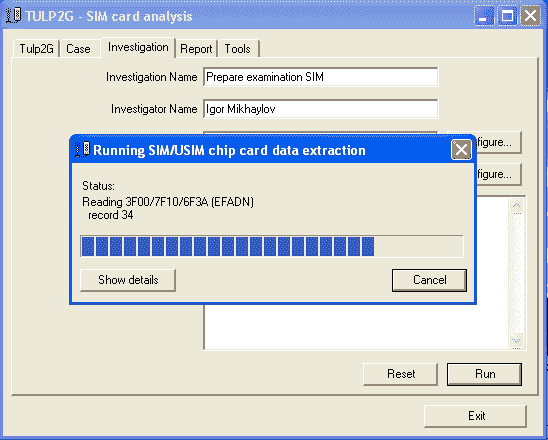
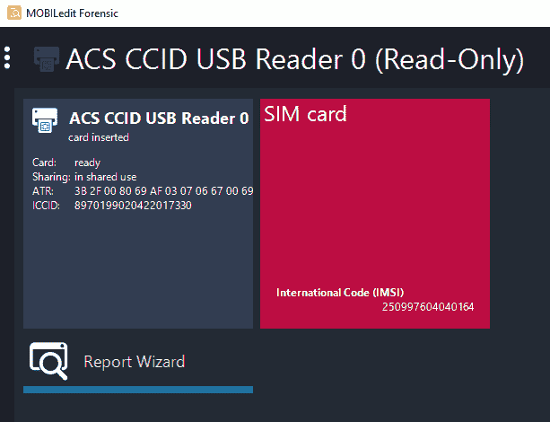

# 第一章：SIM 卡获取与分析

在本章中，我们将介绍以下内容：

+   使用 TULP2G 进行 SIM 卡获取与分析

+   使用 MOBILedit Forensics 进行 SIM 卡获取与分析

+   使用 SIMCon 进行 SIM 卡获取与分析

+   使用 Oxygen Forensic 进行 SIM 卡获取与分析

# 介绍

SIM 卡的主要功能是识别网络中移动电话用户，以便用户能够访问其服务。

SIM 卡中可以找到以下对专家或调查人员有价值的数据：

+   与移动运营商提供的服务相关的信息

+   电话簿和通话信息

+   交换的消息信息

+   位置信息

最初，SIM 卡几乎是唯一包含移动设备拥有者联系人数据的来源，因为关于电话簿、通话记录和短信的信息只能在其存储中找到。后来，这些数据的存储被转移到了移动设备的内存中，SIM 卡开始仅用于在蜂窝网络中识别用户。因此，一些法医工具开发者在进行移动设备检查时，决定不在其产品中包含对 SIM 卡的检查功能。然而，今天有很多低价手机（通常我们称之为“山寨手机”），它们的内存容量有限。在这些手机中，一部分用户数据存储在 SIM 卡中。这就是为什么 SIM 卡的法医检查仍然具有相关性的原因。

SIM 卡是一个普通的智能卡。它包含以下主要组件：

+   处理器

+   内存

+   只读存储器

+   EEPROM

+   文件系统

+   控制器输入输出

实际上，我们会遇到两种类型的 SIM 卡，它们的接触垫上有六个和八个接触点。这是因为这两个接触点不会直接与手机（智能手机）进行交互，它们的缺失减少了 SIM 卡在手机中占用的空间面积。

SIM 卡可以使用三种类型的供电电压（VCC）：5 V、3.3 V、1.8 V。每张卡有一个特定的供电电压。

SIM 卡具有过电压保护。因此，当一个 3.3 V 供电电压的 SIM 卡被放入只能使用 5 V 供电电压（旧型号）的读卡器中时，既不会损坏信息，也不会损坏 SIM 卡，但无法与该 SIM 卡进行操作。专家可能会认为 SIM 卡损坏了，但实际上并非如此。

在从安装 SIM 卡的移动设备中提取数据之前进行 SIM 卡的法医检查是没有意义的，因为存储在移动设备内存中的用户数据可能在移除 SIM 卡的过程中被重置或删除。

对 SIM 卡进行分析时，需要将其从移动设备中移除，并通过专用设备：卡读卡器，将其连接到专家的计算机。

根据之前提到的 SIM 卡信息，我们可以推导出对于卡片读取设备的主要要求，确保专家能够舒适地检查 SIM 卡：

+   卡片读取设备必须支持 5V、3.3V 和 1.8V 的智能卡。

+   卡片读取设备必须支持具有六个和八个接触点的智能卡。

+   该卡片读取设备必须支持 Microsoft PC/SC 协议。这类设备的驱动程序已预装在所有版本的 Windows 操作系统中，因此无需额外安装驱动程序即可将此类设备连接到专家的计算机。

以下图片展示了这种卡片读取器的示例：

由«ASR»公司生产的 SIM 卡读取器，型号为«ACR38T»。

尽管市场上有专门用于读取 SIM 卡数据的卡片读取设备，但也可以使用那些专为读取标准尺寸卡片（如银行卡尺寸）的设备。为了方便使用这些设备，可以使用一张空白卡片，将 SIM 卡用一些小胶带固定在卡片上。

这就是调整过的 SIM 卡，外形类似银行卡。

# 使用 TULP2G 进行 SIM 卡采集和分析

**TULP2G**是由荷兰法医研究所开发的一款免费的工具，用于 SIM 卡和手机的法医检查。不幸的是，这个程序已经很久没有更新了。然而，它仍然可以用于非常旧的手机和 SIM 卡的数据采集与分析。

# 准备就绪

在 TULP2G 下载页面（[`sourceforge.net/projects/tulp2g/files/`](https://sourceforge.net/projects/tulp2g/files/)）上，选择`TULP2G-installer-1.4.0.4.msi`文件并下载。本文写作时，最新版本为 1.4.0.4。下载完成后，双击该文件，将启动程序的安装过程。

如果在 Windows XP 操作系统中安装 TULP2G 程序，则需要先安装 Microsoft .Net Framework 2.0 和 Windows Installer 3.1，然后才能安装 TULP2G。之前提到的程序可以从微软官网下载安装。

# 如何操作...

1.  启动程序后，点击“打开配置文件...”按钮：

TULP2G 程序的主窗口

1.  在打开的窗口中，您将看到配置文件，必须加载其中一个配置文件。选择 TULP2G.Profile.SIM-Investigation 配置文件，然后点击“打开”。

TULP2G 的数据提取配置文件

1.  在案件/调查设置窗口中，填写以下字段：案件名称、调查员姓名和调查名称。这些信息将在稍后由 TULP2G 在报告中使用。

案件/调查设置窗口

1.  在下一个窗口中，TULP2G - SIM 卡；对于通信插件字段，将值设置为`PC/SC 芯片卡通信[1.4.0.3]`。对于协议插件字段，将值设置为`SIM/USIM 芯片卡数据提取[1.4.0.7]`。如果被检测的 SIM 卡有 PIN 或 PUK 码，请点击位于协议插件字段旁边的配置按钮输入相应的代码。

窗口 TULP2G - SIM 卡。

如果未输入 PIN 或 PUK 码，则无法读取被检查的 SIM 卡的数据。

1.  点击“运行”按钮。SIM 卡数据提取过程将开始。提取进度可以通过进度条看到。

进度条。

1.  当 SIM 卡中的数据被提取后，您可以进行新的提取或生成已执行提取的报告。要生成报告，请转到报告标签。在报告名称字段中，输入报告名称；在导出插件和选定的转换插件字段中，选择将用于生成报告的插件。在选定的调查字段中，选择要为其生成报告的提取项，然后点击“运行”。

报告生成选项窗口

1.  当报告生成过程完成后，将会有两个文件，格式分别为 HTML 和 XML。HTML 文件可以使用任何网页浏览器打开。

报告的一个片段

这些文件包含从被检查的 SIM 卡中提取的信息（如通讯录、短信、通话记录等）。可以查看并进行分析。

# 它是如何工作的...

TULP2G 从插入到读卡器中的 SIM 卡中提取数据，该读卡器连接到专家的计算机，并生成报告。在验证过程中，图像和源的 MD5 和 SHA1 哈希值会被进行比较。

# 另见

+   TULP2G 项目网站：[`tulp2g.sourceforge.net`](http://tulp2g.sourceforge.net)

+   TULP2G 下载页面：[`sourceforge.net/projects/tulp2g/files/`](https://sourceforge.net/projects/tulp2g/files/)

# 使用 MOBILedit Forensics 进行 SIM 卡采集与分析

**MOBILedit Forensic**是由 Compelson 公司开发的一款商业取证软件。它会定期更新。该程序可以从手机、智能手机和 SIM 卡中提取数据。根据程序开发者的说法，MOBILedit Forensic 是一个允许我们通过最少的步骤从手机或 SIM 卡中提取数据的程序。此外，该程序还具有一个独特的功能，我们将在另一个章节中重点介绍。

# 准备工作

在 MOBILedit 下载页面（[`www.mobiledit.com/download-list/mobiledit-forensic`](http://www.mobiledit.com/download-list/mobiledit-forensic)）点击“下载”。下载完成后，双击下载的程序文件并进行安装。首次运行程序时，需要输入许可证密钥。如果没有输入许可证密钥，程序将在试用模式下运行 7 天。

# 如何操作...

使用 MOBILedit Forensic 从 SIM 卡提取数据有两种方式：

1.  通过向导提取数据

1.  通过 MOBILedit Forensic 程序的主窗口提取数据

本书将重点介绍如何通过 MOBILedit Forensic 程序的主窗口从 SIM 卡提取数据。

当你运行该程序时，连接的读卡器信息会出现在 MOBILedit Forensic 程序主窗口的左上角。

主窗口的片段

如果点击“连接”，MOBILedit Forensic 向导将启动，你可以通过它从移动设备和 SIM 卡中提取数据。

现在我们来看一下如何提取数据：

1.  点击读卡器的图标。将显示 SIM 卡的答复重置（ART）和 ICCID 信息。如果 SIM 卡被锁定，将提示输入 PIN 或 PUK 码。

主窗口中显示的 SIM 卡信息片段

1.  输入 PIN 或 PUK 码后，SIM 卡将被解锁，报告向导选项将出现在主窗口中。解锁的 SIM 卡会显示国际代码（IMSI），该代码仅在输入正确的 PIN 码后才能访问。

显示 SIM 卡信息的主窗口片段

1.  点击“报告向导”；它将打开 MOBILedit Forensic 向导窗口，从 SIM 卡提取数据并生成报告。

1.  填写设备标签、设备名称、设备证据编号、所有者电话号码、所有者姓名和电话备注字段。然后点击“下一步”按钮。

MOBILedit Forensic 向导窗口

1.  数据将被提取，提取状态将在 MOBILedit Forensic 向导窗口中显示。

1.  当提取完成后，点击“下一步”按钮。之后，`MOBILedit Forensic Wizard`将显示以下窗口：

MOBILedit Forensic 向导窗口

1.  点击“新建案件”。在弹出的窗口中，填写标签、编号、姓名、电子邮件、电话号码和备注字段，然后点击“下一步”按钮。

MOBILedit Forensic 向导窗口

1.  在 MOBILedit Forensic 向导的下一个窗口中，选择生成报告的格式，并点击“完成”按钮。

MOBILedit Forensic 向导的最终窗口

一个关于数据提取的取证报告将以所选格式生成。

# 它是如何工作的...

MOBILedit Forensics 从安装在读卡器中的 SIM 卡中提取数据，并生成报告，所需步骤最少。如果有大量的移动设备或 SIM 卡需要调查，它有助于加快数据提取过程。

# 另见

+   MOBILedit Forensics 网站位于 [`www.mobiledit.com`](http://www.mobiledit.com)。

+   MOBILedit Forensics 下载页面位于 [`www.mobiledit.com/download-list/mobiledit-forensic`](http://www.mobiledit.com/download-list/mobiledit-forensic)。

# 使用 SIMCon 进行 SIM 卡获取与分析

**SIMCon** 是进行 SIM 卡取证分析的最佳工具之一。它价格低廉，政府组织、军队和警察可免费使用。除了令人印象深刻的功能外，SIMCon 还能够从某些 SIM 卡中提取由 PIN 码保护的数据。例如，电话簿。

尽管 SIMCon 项目几年前已经关闭，但该程序并没有消失。这个程序的新更新版本被称为 **Sim Card Seizure**。该程序的发行权归 Paraben 公司所有。此外，SIMCon 的功能已经在 Paraben 的另一个产品 E3: Electronic Evidence Examiner 中实现。

# 准备就绪

SIMCon 项目目前在互联网上没有自己的地址。不过，您可以通过搜索引擎找到安装软件。您还可以从 [Paraben 的网站](https://www.paraben-sticks.com/sim-card-seizure.html)下载 Sim Card Seizure 的试用版。Sim Card Seizure 试用版的限制是只能显示电话簿、通话记录和短信的前 20 条记录。

# 如何操作...

1.  双击程序图标，并将读卡器与 SIM 卡连接。程序将打开如下截图所示的输入 PIN 码信息窗口：

1.  在这种情况下，无需输入 PIN 码。点击确认按钮开始数据提取过程。提取过程的状态将显示在 "读取 SIM..." 窗口中：

1.  如果数据提取成功，您将被要求在获取备注窗口中填写调查员、日期/时间、案件、证据编号和备注字段。填写完毕后，点击确认按钮：

1.  与 TULP2G 和 MOBILedit Forensic 不同，SIMCon 不仅允许您提取数据并生成报告，还能查看提取的数据。以下截图显示了 SIMCon 窗口的一个片段，我们可以看到从 SIM 卡中提取的短信，包括已删除的短信：

获取注释窗口

在 SIMCon 主窗口的底部，有一个区域显示有关选定记录的详细信息：

SIMCon 主窗口的一个区域，显示关于选定记录的详细信息

SIMCon 程序允许查看每个文件的内容。以下截图显示了基础文件（`EF_ICCID`）的内容：

# 它是如何工作的...

SIMCon 从连接到专家计算机的卡片读取器中提取已安装的 SIM 卡数据。提取后，您可以从该程序的主窗口生成取证报告或分析提取的数据。

# 另见

+   Sim Card Seizure 程序的网站：[`www.paraben-sticks.com/sim-card-seizure.html`](https://www.paraben-sticks.com/sim-card-seizure.html)

+   E3：电子证据检查员程序的网站：[`www.paraben.com/products/e3-universal`](https://www.paraben.com/products/e3-universal)

# 使用 Oxygen Forensic 进行 SIM 卡获取和分析

**Oxygen Forensic** 是最好的移动取证程序之一。除了其他功能外，该程序还具有 SIM 卡分析功能。该程序为商业软件，但提供 30 天试用完整版，您可以根据需要申请获取。当请求被接受后，您将收到一封电子邮件，其中包含注册密钥和下载安装软件的说明。

# 准备工作

下载 Oxygen Forensic（[`www.oxygen-forensic.com/en/`](https://www.oxygen-forensic.com/en/)）。根据提示安装它。按照菜单路径：服务|输入密钥。在打开的许可证窗口中，输入许可证密钥并点击保存按钮。重启程序。

# 如何操作...

为了检查 SIM 卡，您需要将其从移动设备中取出，并安装到 SIM 卡读取器中，该读取器必须连接到专家的计算机。如前所述，Microsoft PC/SC 驱动程序已预安装在 Windows 操作系统中，这意味着无需安装其他任何东西。

现在让我们来看一下如何使用 Oxygen Forensic：

1.  在 Oxygen Forensic 程序中，点击位于工具栏中的连接设备按钮。它将启动 Oxygen Forensic Extractor：

Oxygen Forensic Extractor 的主窗口

1.  在 Oxygen Forensic Extractor 的主菜单中，点击 UICC 获取选项。接下来的窗口会提示您选择连接的卡片读取器，或者显示错误消息：

卡片读取器连接错误消息

1.  如果 SIM 卡的数据访问受到 PIN 码或 PUK 码的限制，您将被提示输入相应的代码。程序中会显示可输入 PIN 码和 PUK 码的尝试次数。如果尚未尝试解锁 SIM 卡，那么应该有 3 次输入 PIN 码的机会，以及 10 次输入 PUK 码的机会。在输入 PUK 码失败 10 次后，SIM 卡将被永久锁定。PUK 码可以通过授权人员从通信服务提供商处获取。

SIM 卡数据提取窗口

SIM 卡数据提取窗口显示以下内容：

+   关于卡片阅读器的信息

+   关于 SIM 卡的信息

+   输入 PIN 码和 PUK 码的字段

输入 SIM 卡解锁代码并点击“下一步”按钮。

1.  在下一个窗口中，您可以指定有关提取的附加信息，这些信息将存储在案件中。此外，在此窗口中，您可以选择保存从设备中提取的数据的选项：

存储的提取物理备份转储选项…会保存 SIM 卡的主要文件。

完整 UICC 映像选项会保存 SIM 卡上的所有文件。如果选择此选项，SIM 卡文件的提取过程可能需要超过 12 小时。

输入案件附加信息的窗口

1.  点击“下一步”按钮。SIM 卡数据提取过程将开始。

可以从 SIM 卡中提取以下数据，包括已删除的数据：

+   关于 SIM 卡的一般信息

+   联系人

+   通话

+   消息

+   其他信息

数据导入完成后，Oxygen Forensic Extractor 的最终窗口将显示有关导入的总结信息。点击“完成”按钮以结束数据提取。

提取的数据将可供查看和分析。

1.  在提取结束时，创建的案件可以在 Oxygen Forensic 程序中打开。

提取总结信息

1.  现在点击“消息”类别。可以在与案件相关的适当部分中查看提取的数据。

查看消息部分

1.  返回到 Oxygen Forensic 的主屏幕。点击文件浏览器类别。在文件浏览器部分，可以查看从 SIM 卡中提取的文件。这些文件内容可以手动分析。

查看 2FE2 文件内容

# 工作原理...

Oxygen Forensic 从安装在与专家电脑连接的卡片阅读器中的 SIM 卡提取数据。之后，您可以从该程序的主窗口生成法医报告或分析提取的数据。

# 更多内容...

Oxygen Forensic 显示文件名时采用十六进制，这对于专家来说可能不太方便。下表显示了标准文件名在十六进制视图中的对应关系及其内容：

| 文件名 | 描述 | 文件名 | 描述 |
| --- | --- | --- | --- |
| 3F00 | MF | 6F05 | EF (LP) |
| 7F10 | DF (TELECOM) | 6F31 | EF (HPLMN) |
| 7F20 | DF (GSM) | 6F41 | EF (PUCT) |
| 7F21 | DF (DCS1800) | 6F78 | EF (ACC) |
| 2FE2 | EF (ICCID) | 6FAE | EF (PHASE) |
| 6F3A | EF (AND) | 6F07 | EF (IMSI) |
| 6F3C | EF (SMS) | 6F37 | EF (ACMmax) |
| 6F40 | EF (MSISDN) | 6F45 | EF (CBM) |
| 6F43 | EF (SMSS) | 6F7B | EF (FPLMN) |
| 6F4A | EF (EXT1) | 6F52 | EF (KcGPRS) |
| 6F3B | EF (FDN) | 6F20 | EF (Kc) |
| 6F3D | EF (CCP) | 6F38 | EF (SST) |
| 6F42 | EF (SIMSP) | 6F46 | EF (SPN) |
| 6F44 | EF (LND) | 6F7E | EF (LOCI) |
| 6F4B | EF (EXT2) | 6F53 | EF(LOCIGPRS) |
| 6F74 | EF (BCCH) | 6F30 | EF (PLMNcel) |
| 6FAD | EF (AD) | 6F54 | EF (SUME)       |

# 另请参见

+   Oxygen Forensic 程序的官方网站：[`www.oxygen-forensic.com/en/`](https://www.oxygen-forensic.com/en/)。
