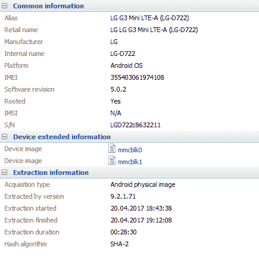

# 第二章：Android 设备获取

在本章中，我们将介绍以下内容：

+   准备工作

+   使用 Oxygen Forensic 获取 Android 设备

+   使用 MOBILedit Forensic 进行 Android 设备获取

+   使用 Belkasoft 证据中心进行 Android 设备获取

+   使用 Magnet Aсquire 获取 Android 设备

+   在 Android 设备上进行无需 root 的物理转储

+   解锁已锁定的 Android 设备

+   通过 Wi-Fi 获取 Android 设备

+   使用 Smart Switch 获取三星 Android 设备

# 简介

运行 Android 操作系统的移动设备占移动设备市场的 80%以上。操作系统版本和使用的硬件平台的多样性为数据提取提供了广泛的方法。没有为以下移动设备组的任何移动设备提供这样的数据提取方法：iOS 设备、Windows Phone 设备和 BlackBerry 设备。

Android 设备数据提取的最常见方法如下：

+   **逻辑提取**：这种方法允许提取特定类型的逻辑数据，如电话簿、通话记录、短信（SMS/MMS）等。通常，逻辑提取需要安装一个代理程序，该程序帮助移动取证软件从设备中提取数据。必须根据内存结构的硬件特性和移动设备的安全策略在设备上安装该程序。

+   **备份**：这种方法允许仅从设备中提取逻辑数据，如电话簿、通话记录、短信（SMS/MMS）、视频文件、图像、音频文件等。来自应用程序的信息（例如来自即时通讯应用的信息）完整或部分地转移到创建的备份中。是否将应用程序数据转移到备份中取决于操作系统的版本和移动设备的安全设置。经常出现的情况是，只有安装应用程序的帐户信息被转移到创建的备份中，使专家认为他使用的取证软件不支持从该应用程序中提取数据，但如果专家从设备的文件系统或物理转储中提取而不是创建备份，则他的取证软件将提取应用程序数据（例如聊天记录）。

+   **文件系统提取**：这种方法意味着从设备中提取文件系统。使用此方法时，会提取用户分区中的所有文件（通常称为 userdata 分区）。

+   **物理转储**：这种方法意味着创建设备存储器的完整副本，其中包含设备的所有分区，包括服务数据、应用程序和用户数据。可以从物理转储中恢复删除的文件。

+   **联合测试行动小组（JTAG）**：我们将在第十一章中重点介绍此方法，*JTAG 和芯片摘除技术*。JTAG——此方法以行业标准命名。JTAG 是一种用于测试系统板的标准。

+   **芯片摘除**：我们将在第十一章中重点介绍此方法，*JTAG 和芯片摘除技术*。芯片摘除是一种破坏性方法，基于从系统板上移除存储芯片。

尽管备份和文件系统提取方法仅允许我们提取逻辑数据和文件，但专家仍然可以从 SQLite 数据库中恢复删除的记录（如通讯录记录、通话记录、短信消息和移动应用程序的数据库记录）。

在本章中，我们将介绍从 Android 设备中提取数据的主要方法。

# 准备工作

在从 Android 设备执行数据提取之前，您需要执行一系列准备步骤。

# 准备移动设备

在将设备连接到计算机之前，您需要在设备上启用 USB 调试模式。此模式启用设备上的 ADB 服务器。

USB 调试通过以下方式启用：

对于 Android 2.0-2.3.x：

1.  进入设备菜单。

1.  选择“设置”。

1.  在“设置”部分，选择“应用程序”。

1.  在“应用程序”部分，选择**开发**。

1.  在“开发”部分，选择 USB 调试。

对于 Android 3.0 到 4.1.x：

1.  进入设备菜单。

1.  选择“设置”。

1.  在“设置”部分，选择“开发者选项”。

1.  在“开发者选项”部分，选择 USB 调试。

1.  点击“确定”以确认启用 USB 调试模式。

对于 Android 4.2.x 及更高版本：

1.  进入设备菜单。

1.  选择“设置”。

1.  在“设置”部分，选择“关于设备”。

1.  在“关于手机”部分，点击“版本号”字段七次。然后，您将看到此消息：您现在是开发者！

1.  返回“设置”。

1.  选择“开发者选项”。

1.  在“开发者选项”部分选择 USB 调试。

对于 Android 5.0 及更高版本：

1.  进入设备菜单；

1.  选择“设置”。

1.  在“设置”部分，选择“关于设备”。

1.  在“关于手机”部分，点击“版本号”字段七次。然后，您将看到此消息：您现在是开发者！

1.  点击“返回”以返回到“设置”。

1.  选择“开发者选项”。

1.  在“开发者选项”部分，选择 USB 调试。

1.  点击“确定”以确认启用 USB 调试模式。

当您将设备连接到计算机时，您还必须在设备上选择正确的 USB 模式：无、仅充电、MTP、PTP 等。每个制造商以不同的方式命名此模式。绝不要在媒体**模式**下连接设备。如果 Android 设备处于媒体模式，您将无法为该设备创建 Android 备份。

为了成功连接设备，您需要确保设备中有一张至少有 1MB 可用空间的存储卡。在逻辑提取过程中，代理程序会使用存储卡来存储临时文件，读取完成后，这些文件会被删除。连接之前存储在存储卡上的文件不会被更改或删除。然而，建议您使用自己的存储卡，而不是被检查设备中原有的存储卡。

# 准备工作站

在取证中，一个重要的步骤是确保证据没有被篡改，并且如果出于某种原因需要对证据进行更改，例如解锁，必须仔细记录这些更改。还应强调采取其他预防措施，例如使用无菌且专用的取证工作站。

在将设备连接到工作站之前，您必须先安装设备的驱动程序。设备的驱动程序可以在互联网上找到。安装驱动程序后，您应重启计算机。

在第一次将设备连接到计算机之前，请解锁设备（如果设备已锁定）并连接它。您将在设备屏幕上看到允许 USB 调试的请求。勾选“始终允许来自此计算机的连接”并点击“允许”。

您需要确保驱动程序已正确安装。在计算机上，从菜单中导航到开始|控制面板|系统|设备管理器。您需要在其中找到已连接设备的名称，记录为 ADB 接口。如果找不到此记录，说明设备驱动程序安装不正确。


运行 Android 操作系统的已连接三星设备

**Android 调试桥（Android Debug Bridge）** 是一个命令行工具，是 Android SDK 平台的一部分。您可以通过这个工具对 Android 设备进行连接诊断和其他操作。当安装了 Android SDK 平台程序时，在 Windows 命令提示符中输入`adb devices`命令。如果有任何 Android 设备连接到计算机，设备列表将显示在屏幕上。


已连接的安卓设备列表

如果设备未被计算机检测到，请按照以下步骤操作：

1.  将设备连接模式从仅充电切换到 MTP 或 PTP。

1.  在被检查设备的开发者选项中勾选模拟位置。

1.  在被检查设备的安全部分勾选未知来源。

1.  禁用被检查设备上的杀毒软件。

1.  更换数据线。

# 手动组装 ADB 驱动程序

一些安卓设备没有驱动程序。对于此类设备，可以通过诸如 Oxygen Forensic 或 Magnet Acquire 等程序自动创建驱动程序，也可以手动组装驱动程序。请按照以下步骤操作：

1.  连接需要创建驱动程序的设备。

1.  上传 Google USB 驱动程序并解压上传的档案。

1.  在解压后的档案中，找到 `android_winusb.inf` 文件，并用记事本打开，记事本需要以管理员身份运行。您将在文件中找到以下文本片段：

```
;Google Nexus One
%SingleAdbInterface%        = USB_Install, USB\VID_18D1&PID_0D02
%CompositeAdbInterface%     = USB_Install, USB\VID_18D1&PID_0D02&MI_01
%SingleAdbInterface%        = USB_Install, USB\VID_18D1&PID_4E11
%CompositeAdbInterface%     = USB_Install, USB\VID_18D1&PID_4E12&MI_01
```

1.  运行设备管理器并找到设备（Android 或 Android Composite ADB Interface）。

1.  右键点击鼠标。

1.  在打开的菜单中，选择“属性”，然后在弹出的窗口中选择“详细信息”。

1.  在下拉的属性菜单中，选择“硬件 ID”。


Android 设备的硬件 ID 列表

1.  将 “Google Nexus One” 替换为您设备的名称。将找到的文本片段替换为如下：

```
;Your device name
%SingleAdbInterface%        = USB_Install, USB\VID_04E8&PID_6860
%CompositeAdbInterface%     = USB_Install, USB\VID_04E8&PID_6860&MI_01
%SingleAdbInterface%        = USB_Install, USB\VID_04E8&PID_6860
%CompositeAdbInterface%     = USB_Install, USB\VID_04E8&PID_6860&MI_01
```

1.  保存编辑后的文件。

1.  在设备管理器中，选择 Android 设备。

1.  右键点击鼠标。在弹出的窗口中，选择“更新驱动程序软件”。

1.  在接下来的窗口中，选择“浏览我的计算机以查找驱动程序软件”，并指定包含编辑后文件 `android_winusb.inf` 的文件夹路径。

1.  在安装驱动程序期间，您可能会收到驱动程序不兼容且不建议安装的消息。继续安装驱动程序。安装完成后，重新启动计算机。

# 另见

+   Android 调试桥页面 [`developer.android.com/studio/command-line/adb.html`](https://developer.android.com/studio/command-line/adb.html)。

+   请在 [`developer.android.com/studio/run/win-usb.html`](https://developer.android.com/studio/run/win-usb.html) 下载 Google USB 驱动程序。

# 使用 Oxygen Forensic 获取 Android 设备

Oxygen Forensic 程序在第一章中已有介绍。在本章中，将展示如何通过 Oxygen Forensic 进行设备的物理转储。要进行物理转储，您需要超级用户权限。您需要获取设备的 root 权限才能获得超级用户权限。获取 Android 设备 root 权限的方法有很多，[这些方法的描述超出了本书的范围](https://forum.xda-developers.com)。Oxygen Forensic 的一个特点是，在进行物理转储之前，程序会通过持续使用不同类型的漏洞自动尝试获得 root 权限。此功能不会对设备造成任何损害。一方面，这个功能是一个很大的优点，但另一方面，它只能用于有限范围的设备。互联网上有许多方法可以为大量设备获取 root 权限，但也有可能在数据提取之前应用这些方法会导致设备无法恢复的损坏。

# 如何操作……

1.  在 Oxygen Forensic 程序中，点击工具栏上的“连接设备”按钮。这将启动 Oxygen Forensic Extractor。


Oxygen Forensic Extractor 的主窗口

1.  点击“设备获取”。程序将自动搜索连接的设备。如果程序检测到设备，它的属性将显示在程序窗口中。如果设备未被检测到，你可以使用“手动设备连接”和“自动连接设置”选项尝试手动连接设备。


显示连接设备信息的 Oxygen Forensic Extractor 窗口。

1.  点击“下一步”按钮。在下一个窗口中，你需要填写案件的详细信息，如设备别名、案件编号、证据编号、地点、事件编号、检查员、设备所有者、所有者邮箱等。

1.  请勿勾选“解析应用程序数据库并收集分析部分数据...”和“搜索并恢复删除数据...”选项，因为这些操作会占用额外的时间。


显示案件信息和提取选项的 Oxygen Forensic Extractor 窗口。

1.  点击“下一步”按钮。在下一个窗口中，系统会提示你选择数据提取模式。

1.  在默认模式下，程序将尝试按顺序执行以下操作：

    1.  获取设备的 Root 权限。如果 Root 访问成功，程序将进入第 2 步。否则，程序将进入第 3 步。

    1.  进行物理转储。如果此步骤成功完成，程序将结束工作。否则，程序将进入第 3 步。

    1.  创建备份。如果此步骤成功完成，程序将结束工作。否则，程序将进入第 4 步。

    1.  从设备进行逻辑提取。第 4 步仅适用于运行 Android 4.0 或更高版本的设备。


显示 Android 设备数据提取模式选项的 Oxygen Forensic Extractor 窗口。

1.  在高级模式下，程序会提示你选择数据提取方法。勾选选定的方法并点击“下一步”按钮。在这里，我们勾选“物理转储”和“允许 Root 访问”，然后点击“下一步”按钮。


1.  程序会通过在窗口中显示已输入的数据来提示你再次检查数据。如果所有数据正确，点击“提取”按钮。物理转储的创建过程将开始。

1.  提取完成后，创建的案件可以在 Oxygen Forensic 程序中打开。

1.  如果你在通过 Oxygen Forensic 打开的情况下点击“设备信息”部分，你将能够在打开窗口的“设备扩展信息”部分找到关于已创建物理转储的信息。`mmcblk0`文件是 Android 设备的物理转储文件。`mmcblk1`文件是安装在此 Android 设备上的内存卡镜像文件。



设备信息窗口部分的片段。

1.  如果你双击一个文件名（`mmcblk0` 或 `mmcblk1`），资源管理器将打开包含该文件的文件夹。

# 工作原理……

Oxygen Forensic 从连接的 Android 设备中提取数据。在此过程中，依据提取设置，你可以创建：物理转储、备份或提取逻辑数据。提取的数据可以立即或稍后进行分析。

# 还有更多……

物理转储可以通过命令`dd if = / dev / block / partition's name of = / sdcard / NAME_partition.img`来创建。设备分区的名称可以通过 adb 工具查看。数据和用户文件存储在`userdata`分区。

# 另见

+   你可以在以下网站找到有关不同安卓设备刷机方法的文章：[`forum.xda-developers.com`](https://forum.xda-developers.com)

# 使用 MOBILedit Forensic 获取 Android 设备数据

最好的移动取证软件，如：UFED（Cellebrite）、Oxygen Forensic、XRY（Micro Systemation）、Secure View（Susteen）、MOBILedit Forensic，可以通过在设备上安装代理程序从 Android 设备中提取数据。它允许从设备中进行逻辑数据提取。

我们将使用 MOBILedit Forensic 程序演示这种数据提取方法。该程序已在第一章中描述，*SIM 卡获取与分析*。

# 如何操作……

现在让我们探索使用 MOBILedit Forensic 获取 Android 设备的数据：

1.  当你启动 MOBILedit 程序时，程序的主窗口会显示关于已连接设备的信息。


显示 Android 设备信息的主窗口片段

1.  点击“报告向导”。它将打开 MOBILedit Forensic 向导，提取 SIM 卡中的数据并生成报告。

1.  填写字段：设备标签、设备名称、设备证据编号、所有者电话号码、所有者姓名和电话备注。点击“下一步”按钮。


MOBILedit Forensic 向导窗口

1.  数据将被提取。提取状态将在 MOBILedit Forensic 向导窗口中显示。当提取完成时，点击“下一步”按钮。

1.  然后，MOBILedit Forensic 向导将显示以下窗口：


MOBILedit Forensic 向导窗口

1.  点击<新建案件>。在弹出的窗口中，填写字段标签、编号、姓名、电子邮件、电话号码和备注。点击“下一步”按钮。


MOBILedit Forensic 向导窗口

1.  在 MOBILedit Forensic 向导的下一个窗口中，选择报告将生成的格式并点击“完成”按钮。


MOBILedit Forensic 向导的最终窗口

关于提取的法医报告将以选定的格式生成。

# 工作原理……

MOBILedit Forensic 会扫描已连接的设备。如果检测到 Android 设备，MOBILedit Forensic 会上传一个代理程序 **Forensic Connector**，通过这个代理程序，它从设备中提取数据。当提取完成后，程序将提示生成一份取证报告，报告将包含从设备中提取的所有信息。

# 还有更多内容…

程序 MOBILedit Forensic 允许读取安装在移动设备中的 SIM 卡数据。然而，由于无法恢复已删除的记录，建议不要使用此功能。正确的方法是将 SIM 卡从移动设备中取出，并单独进行检查。

如果需要分析移动应用数据，您需要使用的不是 *MOBILedit Forensic*，而是同一开发者提供的 *MOBILedit Forensic Express* 程序。

# 另请参见

+   MobilEdit Forensic 网站：[`www.mobiledit.com`](http://www.mobiledit.com)

+   MobilEdit Forensic 下载页面：[`www.mobiledit.com/download-list/mobiledit-forensic`](http://www.mobiledit.com/download-list/mobiledit-forensic)

# 使用 Belkasoft Acquisition Tool 获取 Android 设备数据

**Belkasoft Acquisition Tool** 是一个通用工具，允许您创建硬盘和移动设备的取证副本，并从云存储中提取数据。您可以通过在开发者网站上填写简短表格来获取该程序。填写后，您将收到一封包含下载链接的电子邮件。

# 准备就绪

下载归档并解压程序。将待检查的设备连接到计算机。点击 BAT 图标。

# 如何操作…

1.  在程序的主窗口中，点击移动设备图标。


Belkasoft Acquisition Tool 程序的主窗口

1.  在下一个窗口中，点击 Android 图标。

1.  在下一个窗口中，您可以查看已连接设备的信息。指定保存从移动设备提取的数据的路径。勾选“复制系统应用数据”、“复制 SD 卡内容”和“复制 .apk 文件（应用程序二进制文件）”以指定需要提取的数据类型。


提取选项选择窗口。

1.  点击“下一步”按钮。数据将从移动设备中提取。如果设备提示创建备份，点击“备份我的数据”。


等待确认以开始备份。

1.  当提取完成后，提取的总结信息将显示出来。点击“打开目标文件夹”以进入包含提取数据的文件夹，或点击“退出”以关闭程序。


提取的总结信息

# 工作原理…

Belkasoft Acquisition Tool 扫描连接的设备。如果发现 Android 设备，程序会创建备份并提取其他数据。这个备份可以通过 Belkasoft Evidence Center 或其他取证软件进行分析。

# 另见

+   Belkasoft 网站：[`belkasoft.com/`](http://belkasoft.com/)

+   程序请求表单网页：[`belkasoft.com/get`](http://belkasoft.com/get)

# 使用 Magnet Acquire 获取 Android 设备数据

**Magnet Acquire** 是一款免费的工具，旨在创建硬盘、内存卡、手机和平板电脑的取证镜像。它可以从 Magnet Forensics 网站的客户门户下载。同时，它与 AXIOM 和 Internet Evidence Finder 一起提供。

# 准备就绪

下载并安装程序。点击程序图标启动它。

# 如何操作…

1.  一旦启动，Magnet Acquire 会寻找连接的设备，并在窗口中显示其列表。


在 Magnet Acquire 中显示的设备列表

1.  点击“下一步”按钮。接下来的窗口会提示你选择提取类型。如果连接的 Android 设备已经获得 root 权限，则选择“完全提取”。否则，选择“快速提取”。


选择提取类型

1.  点击“下一步”按钮。如果需要，填写证据文件夹名称、文件夹目标位置、镜像名称、检查员和证据编号等字段。


创建证据文件夹窗口

1.  点击“ACQUIRE”按钮。数据提取过程将开始。


数据提取过程。

1.  当数据从设备中提取完成后，点击“退出”按钮关闭程序。如果你想查看提取的数据文件夹，请点击“打开文件夹”。


程序的最终窗口

# 它是如何工作的…

一旦启动，程序会扫描连接到计算机的设备，并在窗口中显示其列表。使用 Magnet Acquire 提取数据有两种方式：

+   如果设备已经获得 root 权限，你可以创建物理转储。

+   如果设备没有获得 root 权限，则会创建设备的备份，并提取设备内存卡中的所有文件。

Magnet Acquire 安装 ACQUIRE 代理程序以提取内存卡中的文件。

# 还有更多…

如果你希望在数据提取完成后自动删除代理程序，请点击“选项”。在下拉框中选择“首选项”选项。在打开的“首选项”窗口中，勾选“在 Magnet ACQUIRE 完成后从设备中删除代理应用程序”。

# 另见

+   Magnet Forensics 网站：[`www.magnetforensics.com/`](https://www.magnetforensics.com/)

# 在不获得 root 权限的情况下制作 Android 设备的物理转储。

这可能看起来不太寻常，但实际上可以在不进行 root 的情况下对 Android 设备进行物理转储，而且不需要 JTAG 或 Chip-off 方法。使用 LG 和 Samsung 生产的设备，以及配备 MediaTek 和 Spreadtrum 处理器的设备，都可以做到这一点。作为示例，我们将考虑使用 Oxygen Forensic 对一款 LG 生产的 Android 设备进行物理转储的过程。Oxygen Forensic 程序之前已经在第一章中进行了描述，*SIM 卡获取与分析*。

# 准备工作

请先将设备电池充满电并关闭。下载并安装 Oxygen Forensic 程序。该程序已在[第一章](https://cdp.packtpub.com/mobile_forensics_cookbook/wp-admin/post.php?post=160&action=edit#post_93)，*SIM 卡获取与分析*中进行了描述，并在本章的*使用 Oxygen Forensic 获取 Android 设备数据*一节中提到。

# 如何操作……

1.  在 Oxygen Forensic 中，点击工具栏上位于“连接设备”按钮。它将启动 Oxygen Forensic Extractor。


Oxygen Forensic Extractor 主窗口的一个片段

1.  在物理数据采集窗口中，点击“LG Android 转储”。按照在 Oxygen Forensic Extractor 窗口中显示的说明操作。


说明将显示在 Oxygen Forensic Extractor 窗口中

1.  当步骤 5 完成后，设备屏幕上将显示以下画面：


设备屏幕上的固件更新信息

1.  然后，勾选“是的，我已遵循说明……”并点击“下一步”按钮。

1.  接下来，程序将寻找已连接的设备。如果检测到设备，设备的信息将显示在 Oxygen Forensic Extractor 窗口中。


显示已连接设备信息的窗口

1.  点击“下一步”按钮。

从设备中提取数据的所有后续步骤类似于本章中*使用 Oxygen Forensic 获取 Android 设备数据*一节中描述的步骤。

# 工作原理……

物理转储是通过命令在固件更新模式下根据 LG 高级闪存（LAF）协议进行的。最初，LAF 技术是为 LG 服务中心开发的。它使得恢复那些无法开机并且对开机尝试没有反应的 LG 移动设备成为可能（当用户试图在操作系统中获得更多权限或在更新系统软件时出现错误时，移动设备会进入此状态）。然而，许多非专业服务中心也在使用利用这项技术的工具，这些工具用于刷写 LG 移动设备的定制恢复模式和修改过的固件。

# 还有更多……

如果 LG 设备未能进入固件更新模式，连接电缆时双击上键。这是将 LG 设备切换到固件更新模式的另一种方法。

# 解锁锁定的 Android 设备

解锁锁定的 Android 设备有不同的方法。某些方法通过某种手段删除包含设备锁密码的文件。在本章中，你将学习如何通过刷写修改过的固件来删除该文件，操作设备为三星 GT-I9300 智能手机。

要成功刷写修改过的固件，设备的引导加载程序必须解锁。如果引导加载程序被锁定，可以通过硬件设备——闪存器进行解锁。通常，不同厂商生产的手机使用不同型号的闪存器。

# 准备工作

给设备充电。下载并安装 Odin 程序。下载并解压修改后的固件。

# 如何操作…

1.  关闭智能手机。

1.  通过同时按下音量减和主页按钮，再按电源按钮启动设备的下载模式。

1.  你将看到免责声明；按音量加键继续。

1.  插入设备并启动 Odin。

1.  点击“AP”按钮并选择带有自定义恢复的 tar 文件。


Odin 程序窗口

1.  点击“开始”按钮。等待固件刷写完成的成功消息。当刷写完成后，智能手机将自动重启。

# 如何工作…

在刷写过程中，系统分区的内容会被替换。因此，包含锁密码的文件被删除。

# 参见

+   修改过的固件网页：[`www.x-mobiles.net/engine/go.php?url=aHR0cHM6Ly95YWRpLnNrL2Qvc2hNbS1xb1BuTVhraA%3D%3D`](http://www.x-mobiles.net/engine/go.php?url=aHR0cHM6Ly95YWRpLnNrL2Qvc2hNbS1xb1BuTVhraA%3D%3D)

+   Odin 程序的网页：[`forum.xda-developers.com/galaxy-s3/themes-apps/27-08-2013-odin-3-09-odin-1-85-versions-t2189539`](https://forum.xda-developers.com/galaxy-s3/themes-apps/27-08-2013-odin-3-09-odin-1-85-versions-t2189539)

# 通过 Wi-Fi 获取 Android 设备

该方法允许在 mini-USB 端口损坏且无法通过电缆将设备连接到计算机时提取 Android 移动设备中的数据。

# 准备工作

下载并安装 MOBILedit Forensic。该程序在第一章和本章的*Android 设备获取与 MOBILedit Forensic*部分中已做过介绍。

# 如何操作…

1.  启动 MOBILedit Forensic。

1.  在程序的主窗口中，点击“连接”。在打开的 MOBILedit Forensic Wizard 窗口中，选择 Android 设备，然后点击“下一步”。

1.  在下一个窗口中，选择设备与计算机的连接方式：Wi-Fi。

1.  接下来，将显示一个带有下载 Forensic Connector 移动应用程序说明的窗口。

1.  从 Google Play 下载 Forensic Connector 到被检查的设备，或使用二维码。


下载 Forensic Connector 移动应用程序的说明

1.  在设备上启动 Forensic Connector。


Forensic Connector 主窗口

1.  选择设备与计算机连接的方式：Wi-Fi。

1.  在 MOBILedit Forensic Wizard 的相应字段中输入设备屏幕上显示的 IP 地址。按照“下载 Forensic Connector 移动应用程序”图像中的说明，输入手机的 IP 地址：


显示 IP 地址的 Forensic Connector 窗口

1.  之后，授权确认代码将同时显示在 MOBILedit Forensic 和 Forensic Connector 中。如果程序中的代码值一致，请点击“允许”。


授权确认代码

1.  当移动设备与计算机连接时，设备数据提取的过程类似于本章中*使用 MOBILedit Forensic 进行 Android 设备获取*的步骤。

1.  提取过程将在移动设备的屏幕上显示。


数据提取过程

# 它是如何工作的…

数据从 Android 设备的提取是通过 Wi-Fi，使用安装在设备中的 Forensic Connector 程序进行的。

# 参见

+   通过 ADB 网页传输数据的描述：[`developer.android.com/studio/command-line/adb.html`](https://developer.android.com/studio/command-line/adb.html)

+   Android ADB 网页：[`totalcmd.net/plugring/android_adb.html`](http://totalcmd.net/plugring/android_adb.html)

# 使用 Smart Switch 进行三星 Android 设备获取

**Smart Switch**是三星公司为现代三星设备创建备份的一个常用工具。Smart Switch 取代了 Kies，后者目前用于为较旧的三星设备创建备份。Smart Switch 的一个特别功能是，即使设备没有启用 USB 调试功能，也可以用来从三星设备提取数据。通常，在没有其他方法提取数据的情况下，会使用 Smart Switch。

# 准备就绪

访问该程序的网站（[`www.samsung.com/us/smart-switch/`](https://www.samsung.com/us/smart-switch/)）。在这里，你可以找到适用于 PC 和 MAC 的程序版本，供下载使用。选择所需版本并点击下载。当程序下载完成后，双击下载的文件，程序安装将开始。

# 如何操作…

1.  如果三星设备没有连接或设备驱动程序没有安装，启动程序后，屏幕上会显示一个动画提示，建议连接设备。


1.  如果设备驱动程序已正确安装并且设备已连接，你将在一个窗口中看到设备型号。该窗口会提示你进行 Smart Switch 备份或将 Smart Switch 备份恢复到连接的设备中。


显示连接设备型号的程序窗口

1.  点击“备份”按钮。Smart Switch 备份创建过程将开始。创建过程将在窗口底部显示。


Smart Switch 备份创建过程

1.  在创建 Smart Switch 备份后，程序的窗口将显示传输到备份中的数据的数量和类型。


显示从设备传输到 Smart Switch 备份的数量和类型数据的程序窗口

# 它是如何工作的…

Smart Switch 从三星设备中提取数据并将其保存到计算机中。之后，这些数据可以恢复到另一台三星设备上，并通过移动取证软件（如 MOBILedit Forensic、Oxygen Forensic 等）从中提取数据。

# 还有更多…

1.  如果 Smart Switch 无法在 MTP 模式下检测到设备，请将其切换到 PTP 模式。

1.  安装 Smart Switch 或设备驱动程序后，请重新启动计算机。

1.  创建的 Smart Switch 备份将保存到路径：`C: \ Users \% User name% \ Documents \ Samsung \ SmartSwitch`。

1.  在“检查加密设置”部分，你可以指定从设备到备份中将传输哪些类型的数据。

不幸的是，目前没有取证程序支持从 Smart Switch 备份中提取数据。此外，这些备份中的部分信息是加密的。因此，你无法手动查看提取的数据。为了从这些备份中提取数据，你需要将数据上传到转移手机中。转移手机是经过硬重置的已 root 的三星手机。将数据从 Smart Switch 备份上传到手机后，可以通过任何取证程序和本章中描述的任何方法提取数据。

# 另见

+   Smart Switch 下载页面：[`www.samsung.com/us/smart-switch/`](http://www.samsung.com/us/smart-switch/)。

+   三星手机的 USB 驱动程序：[`developer.samsung.com/search/searchList.do?searchTop=usb+driver`](http://developer.samsung.com/search/searchList.do?searchTop=usb+driver)。
