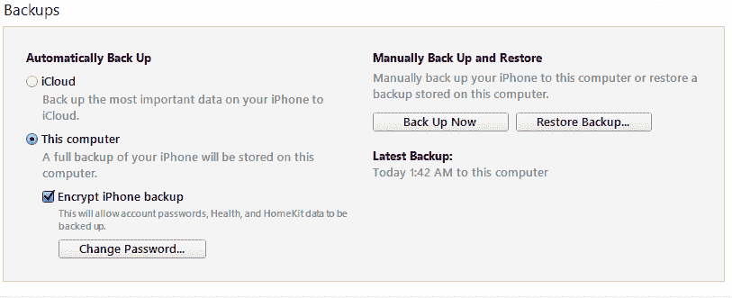

# 第三章：获取 Apple 设备数据

本章将涵盖以下内容：

+   使用 Oxygen Forensics 获取 Apple 设备数据

+   使用 libmobiledevice 获取 Apple 设备数据

+   使用 Elcomsoft iOS 工具包获取 Apple 设备数据

+   使用 iTunes 获取 Apple 设备数据

+   解锁被锁定的 Apple 设备

# 引言

苹果公司生产的移动设备，如 iPhone 和 iPad，占据了大约 15% 的移动设备市场。正因如此，它们常常成为法医分析的对象。

苹果公司生产的移动设备是法医分析中最复杂的对象。这些设备对用户数据的访问限制使得无法完全提取数据。加密技术使得所有已知的文件恢复算法变得无效。即使你设法以某种方式恢复了文件，它的内容仍然无法访问，因为它会保持加密状态。

如果你越狱了 Apple 设备，就可以对设备进行全面检查。你可以从这种设备中提取文件系统，通过对文件系统的分析，能够提取最多的用户数据。然而，并非所有类型的设备都可以执行此操作。

对于 iPhone 4 及以下版本的移动设备，可以进行物理转储。这不仅允许你从设备中完全提取用户数据，还可以恢复屏幕锁密码。你可以使用法医程序如 UFED Physical Analyzer（Cellebrite）、Elcomsoft iOS Forensic Toolkit（Elcomsoft）或 XRY（Micro Systemation）对 Apple 移动设备进行物理转储。

解锁被锁定的 Apple 设备可能会成为问题，因为无法从锁定的设备中提取用户数据。除了上面提到的旧款 Apple 设备的屏幕锁密码恢复方法之外，还有针对新设备的密码恢复方法。这些功能在一些软件产品中得以实现，例如：UFED Physical Analyzer（Cellebrite）、Advanced Physical Extractor（Susteen），以及名为 IP-BOX 的硬件解决方案。由于 iOS 操作系统新版本中出现的额外安全功能，这些方法的使用也受到了限制。

一种不需要购买昂贵法医程序或法医硬件解决方案的解锁 Apple 设备的方法是使用锁定文件。本章将描述这种方法。

存储在苹果移动设备上的另一类信息来源是备份，这些备份可以在设备拥有者的电脑、笔记本电脑以及他们的 iCloud 账户中找到。通常，移动设备的拥有者并没有意识到，当设备连接到计算机时，设备的备份会自动创建。由于这一事实，设备的拥有者并未采取措施删除这些备份。

# 使用 Oxygen Forensics 获取 Apple 设备数据

Oxygen Forensics 程序已在第一章中介绍，*SIM 卡获取与分析*，该章节中涉及了配方*使用 Oxygen Forensics 获取和分析 SIM 卡*。本章将展示通过 Oxygen Forensics 程序制作 Apple 移动设备数据的逻辑副本的过程。

# 准备就绪

若要从 Apple 设备中提取数据，您需要安装 iTunes 程序，安装方法将在本章节中详细说明，属于配方*Apple 设备通过 iTunes 获取*的一部分。没有 iTunes，您无法创建设备的备份。唯一能用的功能是从设备中复制媒体文件。

# 如何操作…

1.  在 Oxygen Forensics 程序中，点击工具栏上的“连接设备”按钮，它将启动 Oxygen Forensic Extractor：

Oxygen Forensic Extractor 的主窗口

1.  点击“设备获取”。程序会自动搜索连接的设备。如果程序识别到设备，它会显示设备的属性。如果未找到设备，您可以通过使用“手动设备连接”和“自动连接设置”选项，尝试手动连接所检查的设备。

显示已连接设备信息的 Oxygen Forensic Extractor 窗口

1.  点击“下一步”按钮。在接下来的窗口中，您需要填写案件的详细信息，例如设备别名、案件编号、证据编号、地点、事件编号、检查员、设备所有者、所有者电子邮件等。请不要勾选“解析应用程序数据库并收集分析部分的数据...”以及“搜索并恢复已删除的数据...”，因为这些操作会占用额外的时间。

显示案件信息和提取选项的 Oxygen Forensic Extractor 窗口

1.  点击“下一步”按钮。在接下来的窗口中，您将被要求选择数据提取方式。可以通过两种方式从 Apple 移动设备中提取数据：

    +   **高级逻辑方法**：该方法意味着使用扩展的逻辑协议，而不是常规的 iTunes 备份创建程序。对于从没有越狱的 Apple 设备中提取数据，并且 iTunes 备份受密码保护的情况（不需要 iTunes 密码），推荐使用这种方法。若要提取事件日志和密码数据，请使用经典方法。

    +   **经典方法**：该方法意味着使用标准的 iTunes 备份创建程序，从未越狱的 Apple 设备提取数据，并直接从越狱设备中提取数据。

选择数据提取方式的 Oxygen Forensic Extractor 窗口

1.  选择所需的方法并点击“下一步”按钮。

1.  程序将提示你再次检查输入的数据，并在窗口中显示。如果所有数据正确，点击提取按钮，备份创建过程将开始。

1.  备份创建完成后，提取数据分析的过程将自动开始，之后可以在 Oxygen Forensic 程序中查看数据。

Oxygen Forensic Extractor 显示备份分析进度的窗口

提取结束后，可以在 Oxygen Forensic 程序中打开已创建的案件。

Oxygen Forensic Extractor 创建的加密备份的默认密码是 'oxygen'（不带引号）。

# 使用 libmobiledevice 获取苹果设备数据

**Libmobiledevice** 是一款跨平台的软件包，可以用来从苹果移动设备中提取逻辑数据。该软件有适用于 Windows、macOS 和 Linux 的版本。

# 准备中

下载并解压 libmobiledevice 存档。

# 如何操作…

1.  解锁设备并将其连接到计算机。

1.  点击“信任”以响应出现在移动设备屏幕上的请求。

1.  输入命令：`device_id.exe -l`。`-l`标志用于获取计算机上连接的所有苹果移动设备的信息。响应请求时，收到的设备 UDID 为：`1f836c8471c4e60ce771e2fdcf14d7e1b31e8b15`：

命令 device_id.exe -l 的执行结果

1.  设备的 UDID 可以用来获取更多关于连接设备的信息。输入命令：`ideviceinfo.exe -u 1f836c8471c4e60ce771e2fdcf14d7e1b31e8b15`。执行该命令的结果将返回大量设备信息：

命令执行结果： ideviceinfo.exe -u 1f836c8471c4e60ce771e2fdcf14d7e1b31e8b15

1.  要创建移动设备的备份，请输入以下命令：`idevicebackup2.exe backup D: \ MobileCases \ iPhone_logical`。

1.  输入命令后，开始从移动设备提取文件。提取进度将显示在命令窗口中，如下所示：

命令 `idevicebackup2.exe backup D: \ MobileCases \ iPhone_logical` 的进度

# 使用 Elcomsoft iOS Toolkit 获取苹果设备数据

**Elcomsoft iOS Forensic Toolkit** 是一套商业化的工具集，允许你从苹果移动设备中进行各种数据提取。通过 Elcomsoft iOS Forensic Toolkit，可以执行以下操作：

1.  恢复已锁定的苹果移动设备的密码（包括 iPhone 4）。

1.  创建苹果移动设备的物理转储（包括已锁定的设备，支持至 iPhone 4）。

1.  提取苹果移动设备的文件系统（仅限越狱设备）。

1.  创建苹果移动设备备份。

1.  还有更多内容。

Elcomsoft iOS Forensic Toolkit 支持从 32 位和 64 位 Apple 移动设备提取数据。

本章将展示通过 Elcomsoft iOS Forensic Toolkit 从 iPhone 4 创建物理转储的示例。

# 准备中

使用许可证中指定的链接下载程序并解压。将 Elcomsoft iOS Forensic Toolkit 的硬件密钥连接到计算机。

# 如何操作…

1.  转到程序文件夹并双击 `Toolkit.cmd` 文件：

Elcomsoft iOS Forensic Toolkit 主窗口

1.  将 Apple 设备置于 DFU 模式是创建物理转储的准备步骤。第 1 步中的脚本将帮助你完成此操作。按下 *1* 按钮。在出现的确认请求中，按 *Y*。完成此步骤后，屏幕上将显示如何将 Apple 移动设备置于 DFU 模式的说明。请仔细阅读。当准备好时，按 *Enter*。

1.  脚本将在计算机屏幕上依次显示指示，帮助你将 Apple 设备置于 DFU 模式：

脚本消息

1.  处于 DFU 模式的 Apple 设备看起来像是关闭的。其屏幕上不应显示任何信息。之后，你可以继续创建设备的物理转储。如果设备在关闭前屏幕已锁定，你需要使用 Elcomsoft iOS Forensic Toolkit 主窗口中的 *3* 选项来恢复密码，然后才能创建设备的物理转储。

1.  要创建设备的物理转储，请在 Elcomsoft iOS Forensic Toolkit 主窗口中点击 *6*。之后，系统将上传并启动自定义恢复镜像。Elcomsoft 标志应出现在设备屏幕上。如果没有，检查设备可能没有进入 DFU 模式；请重试：

自定义恢复镜像上传到设备的过程

1.  之后，系统将要求你选择应该从设备复制的分区。用户数据位于用户分区：

设备分区复制选择窗口

1.  按 *2*。这将开始从分区复制数据。提取进度将在窗口的左下角显示。提取结束后，程序窗口中将显示提取的总结信息：

关于提取的总结信息

# 它是如何工作的…

当你创建物理转储时，一个自定义恢复镜像会被上传到设备的内存中。借助此自定义恢复镜像，将创建一个物理转储，可能包含系统分区或用户分区（或同时包含两个分区）。

自定义恢复镜像位于设备的存储中，它不会更改系统分区或用户分区的数据。若要删除自定义恢复镜像，只需关闭设备。

# 参见

+   Elcomsoft iOS Forensic Toolkit 首页：[`www.elcomsoft.com/eift.html`](https://www.elcomsoft.com/eift.html)

# 使用 iTunes 获取 Apple 设备

**iTunes** 是 Apple 提供的一款免费的工具，用于管理公司移动设备之间的数据传输。使用它，您可以同步或传输媒体文件、创建移动设备的备份，并转移购买的内容。

# 准备就绪

现在让我们下载 iTunes。在 iTunes 下载页面，取消勾选“通过电子邮件接收 iTunes 新内容和特别优惠”以及“接收 Apple 新闻、软件更新和产品与服务的最新信息”。点击“立即下载”按钮，文件下载过程将开始。下载完成后，双击文件，程序的安装过程将开始。

# 如何操作……

1.  双击 iTunes 图标。当您第一次启动 iTunes 时，系统会提示您接受许可协议，协议的内容会显示在程序的主窗口中。请仔细阅读，然后点击“同意”按钮。

1.  在下一个窗口中，点击“同意”按钮。

1.  在程序菜单中点击“编辑”。在打开的菜单中选择“偏好设置...”。在打开的窗口中，转到“设备偏好设置”部分。勾选“防止 iPod、iPhone 和 iPad 自动同步”和“当此计算机上的数据将更改 5% 时警告”。在第二个选项中，使用下拉菜单将 5% 的值更改为任意数字。点击“确定”按钮：

偏好设置窗口

1.  解锁设备并将其连接到计算机。点击移动设备屏幕上出现的请求中的“信任”。

1.  如果由于某种原因，您没有允许 iTunes 管理移动设备，计算机将显示以下框，提示您忘记了操作：

请求允许计算机管理移动设备的窗口

1.  如果计算机正确识别设备，您将在 iTunes 的左上角看到一个智能手机图标。点击它。无需额外的软件即可与设备进行操作：

显示设备正确连接的图标的窗口

1.  iTunes 程序的主窗口将打开，其中将显示设备所有者的信息、设备状态等内容：

显示设备信息的主 iTunes 窗口

1.  在备份部分，勾选“此计算机”和“加密 iPhone 备份”。在打开的附加窗口中，输入两次将用于加密备份的密码。点击“设置密码”按钮：

输入密码的窗口

1.  在备份部分，点击“立即备份”按钮。点击后，连接设备的备份创建过程将开始。如果创建的是加密备份，它的创建进度会在一个单独的窗口中显示。如果创建的是未加密备份，创建进度会显示在主 iTunes 窗口的顶部。

备份创建的进度

1.  当备份创建完成后，备份部分的时间会发生变化，显示备份创建的时间，如下图所示：

最新备份创建部分的信息

1.  创建的备份可以通过以下路径找到：

    +   Mac OS X - `C:\Users\%username%\Library\Application Support\MobileSync\Backup\`（或 `~/Library/Application Support/MobileSync/Backup/`）

    +   Windows XP - `C:\Documents and Setting\%username%\Application Data\Apple Computer\MobileSync\Backup`

    +   Windows Vista、7、8 和 10 - `C:\Users\%username%\AppData\Roaming\Apple Computer\MobileSync\Backup\`

1.  iTunes 备份的外观可以根据所安装的 iOS 操作系统版本而有所不同：

接收到来自 iOS 10 版本及以上的设备的 iTunes 备份的外观

接收到来自 iOS 版本低于 10 的设备的 iTunes 备份的外观

# 它是如何工作的…

当你将解锁后的 Apple 设备连接到电脑时，它会将设备内存中的数据同步到你的硬盘或 iCloud。根据所选的设置，备份可以是加密的，也可以不是。

# 还有更多内容…

如果在备份创建过程中提示你转移购买内容，请点击“不转移”按钮：

转移购买请求

在创建备份时输入的备份加密密码存储在移动设备的内存中。设备的所有后续备份都会自动使用该密码创建。

# 另见

+   iTunes 下载页面：[`www.apple.com/lae/itunes/download/`](https://www.apple.com/lae/itunes/download/)

# 解锁被锁定的 Apple 设备

如前所述，使用锁定文件是解锁任何 Apple 移动设备的最简单方法。如果专家不知道解锁设备的密码，他可以使用此方法。此方法的缺点是，专家必须拥有设备所有者的计算机或笔记本电脑，并且设备之前曾连接到该电脑。

# 如何操作…

现在让我们学习如何解锁被锁定的 Apple 设备：

1.  Lockdown 文件是 iTunes 在连接苹果移动设备到计算机时创建的 - 例如，在同步音频文件时。如果专家拥有从同一人手中夺取的移动设备和计算机（或笔记本电脑），他可以通过以下方式找到 lockdown 文件：

    +   Mac OS X – `\private\var\db\lockdown`

    +   Windows 2000 和 XP – `C:\Documents and Settings\All Users\Application Data\Apple\Lockdown`

    +   Windows Vista、7、8 和 10 – `C:\ProgramData\Apple\Lockdown`

Lockdown 文件

1.  专家必须将这些文件从检查的计算机复制到他自己的计算机（相同的文件夹）以成功提取数据。

1.  现在，可以通过法医工具从移动设备中提取数据，包括本章中描述的工具。

# 工作原理如下…

当 lockdown 文件复制到专家的计算机时，移动设备将专家的计算机标识为设备之前连接的计算机，因此允许将用户数据传输到该计算机。

# 还有更多内容…

如果检查的设备安装了 iOS 版本 9 或更高版本，并且在屏幕锁定后重新启动（或关闭），则无法通过此方法解锁。
