# 第四章：Windows Phone 与 BlackBerry 设备的采集

在本章中，我们将介绍以下几个操作步骤：

+   使用 Oxygen Forensic 进行 BlackBerry 设备的采集

+   使用 BlackBerry 桌面软件进行 BlackBerry 设备的采集

+   使用 Oxygen Forensic 进行 Windows Phone 设备的数据采集

+   使用 UFED 4PC 进行 Windows Phone 设备的采集

# 介绍

运行 Windows Phone OS 和 BlackBerry OS 的移动设备，已经越来越少作为法医分析对象。这类设备的流行高峰期已经过去。然而，专家仍然需要了解从这些设备提取数据的方法。相关方法将在本章中介绍。

运行 Windows Phone OS 的设备是微软试图通过自有操作系统进入移动设备市场的一种尝试。Windows Phone OS 设备于 2010 年上市。大部分这些设备由诺基亚（现为微软所有）生产。然而，也有由 HTC、LG、联想和三星等公司生产的型号。为了避免混淆，应该记住，早期版本（7 和 8）被称为 Windows Phone。该系列操作系统的最新版本是 Windows 10 Mobile。

BlackBerry 曾是安全手机生产的领先者之一。该公司主要使用自己的操作系统——BlackBerry OS，运行在 BlackBerry 移动设备上。为了从此类设备中提取数据，专家需要知道用户名和账户密码（BlackBerry ID）。这些信息是解密所需的，它存储在手机的内存或备份中。

BlackBerry 于 2015 年停止了运行 BlackBerry OS 的移动设备的生产。现在，BlackBerry 的新型号采用了 Android 操作系统。

2016 年 9 月，BlackBerry 宣布停止智能手机的生产。

# 使用 Oxygen Forensic 进行 BlackBerry 设备的采集

在第一章《*SIM 卡采集与分析*》中已介绍 Oxygen Forensic 程序。在本章中，将解释如何通过 Oxygen Forensic 对 BlackBerry 移动设备进行逻辑复制。逻辑复制仅包含某些类型的逻辑数据，如通讯录、通话记录、短信（SMS、MMS）、图片和视频。

# 准备工作

为了从 BlackBerry 设备中提取数据，你需要安装 BlackBerry 桌面软件（该程序将在后文介绍）。

# 如何操作…

1.  在 Oxygen Forensic 程序中，点击工具栏上的“连接设备”按钮。它将启动 Oxygen Forensic Extractor。

1.  点击“设备采集”。程序将自动搜索已连接的设备。如果程序识别到该设备，其属性将显示在程序窗口中。如果未找到设备，则可以使用“手动设备连接”和“自动连接”设置选项，尝试手动连接设备：

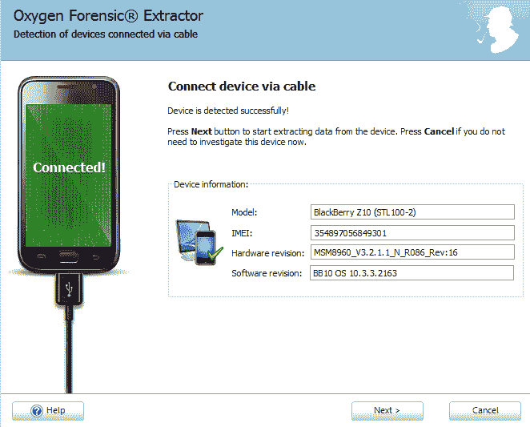

显示已连接设备信息的 Oxygen Forensic Extractor 窗口

1.  点击“下一步”按钮。在下一个窗口中，程序将要求输入设备所有者帐户的登录名和密码。此信息对于解密设备内存中的数据是必需的。请确保您的工作站已连接到互联网，并且可以访问[`us.blackberry.com/bbid`](https://us.blackberry.com/bbid)网站：

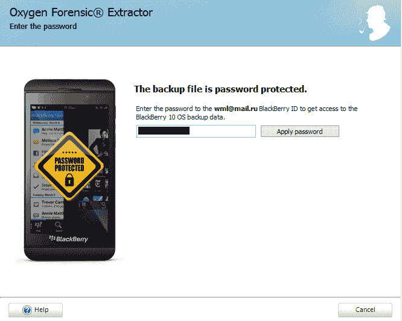

设备所有者用户帐户的登录窗口。

1.  点击“应用密码”。如果正确输入了用户的身份信息，并且程序没有显示错误消息，则点击“下一步”按钮。

1.  在下一个窗口中，您需要填写案件的详细信息，如设备别名、案件编号、证据编号、地点、事件编号、检查员、设备所有者和所有者电子邮件。不要勾选“解析应用程序数据库并收集分析部分数据...”或“搜索并恢复已删除的数据...”选项，因为这些操作会额外消耗时间。

1.  点击“下一步”按钮。在下一个窗口中，系统将要求您选择数据类型（通讯录、通话记录、短信、彩信、媒体文件等）。勾选您希望从设备中提取的数据类型。点击“下一步”按钮。

1.  程序会提示您再次检查输入的数据，并在窗口中显示。如果所有数据都正确，请点击“提取”按钮。数据提取过程将开始。

1.  当提取完成后，提取数据分析的程序将自动开始，然后可以在 Oxygen Forensic 程序中查看数据：

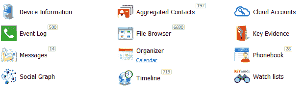

从 BlackBerry 设备提取的数据显示分析结果。

# 还有更多…

尽管 BlackBerry 操作系统已经过时，BlackBerry 在使用加密进行数据存储方面的方法仍然给专家们带来了许多问题。

即使进行逻辑数据提取或从备份中提取数据，专家也需要密码来解锁和解密设备上的数据。在某些情况下，根据 BlackBerry OS 的版本，可能需要 BlackBerry ID 帐户的用户名和密码来解密用户数据。

设备上加密的数据会通过一个额外的图标显示在设备的显示屏上。

在运行 BlackBerry OS 10 以下的设备上，可以在安装在设备上的内存卡中找到`info.mkf`文件（位于`/BlackBerry/system/`目录下）。该文件包含密码，用于创建备份。如果设备已锁定且其内存卡上的数据使用锁定密码或数据加密密码加密，则会创建`info.mkf`文件。该文件中的密码可以通过第三方工具提取。

有时，待检查的设备可能与**BlackBerry 企业服务器**（**BES**）账户相关联。BES 是一个程序，允许 BlackBerry 设备访问企业邮件和协作软件，如 Microsoft Exchange、Lotus Domino 和 Novell GroupWise。如果设备所有者忘记了设备的锁屏密码（或设备的加密数据），这些密码可以由 BES 管理员重置。需要注意的是，用户数据不会被删除。

# 使用 BlackBerry 桌面软件获取 BlackBerry 设备

**Blackberry 桌面软件**是一个替代工具，可以用来创建 BlackBerry 设备上数据的备份。随后，第三方取证工具可以提取这些备份中的数据。需要记住的是，备份中的数据是加密的。要解密数据，您需要拥有设备所有者账户的登录名和密码。

# 正在准备中

1.  从[`us.blackberry.com/software/desktop`](https://us.blackberry.com/software/desktop)下载 BlackBerry 桌面软件。双击下载的文件，程序安装过程将开始。将安装以下组件：

    +   BlackBerry 移动设备的驱动程序。

    +   **BlackBerry Blend**是用于在设备上查看数据（如日历和联系人）的工具。BlackBerry Blend 还可以用来在设备和计算机之间传输文件。

    +   **BlackBerry Link**用于创建设备的备份，并将所有者的数据转移到新设备上。同时，BlackBerry Link 还可以用于更新 BlackBerry 移动设备的固件。也可以通过 BlackBerry Link 重置设备。

1.  阅读并接受在 Blackberry 桌面软件窗口中显示的许可协议，点击“接受”按钮。按照 Blackberry 桌面软件窗口中的安装说明操作。

1.  安装过程结束时，点击关闭按钮。然后重启计算机。

# 如何操作…

1.  解锁待检查的设备并将其连接到计算机。您可以通过启动 BlackBerry 设备管理器检查设备是否已连接。连接的 BlackBerry 设备将显示在设备管理器的窗口中。有关与计算机连接的信息也可以在设备的设置部分找到。

1.  双击 BlackBerry Link 图标。首次启动时，程序会提示您进行设置。

这些设置没有难度。请记下并记住备份保存的路径。您将能够在程序设置过程的第三步看到有关连接的 BlackBerry 设备的信息。

1.  设置完成后，您将看到包含连接设备详细信息的主程序窗口：

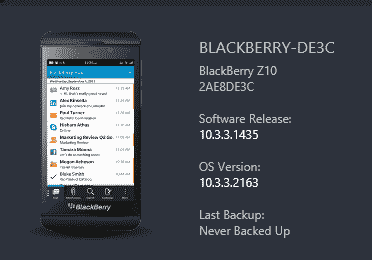

显示连接设备信息的 BlackBerry Link 窗口

1.  双击已连接的设备。BlackBerry Link 将显示主窗口，您可以通过该窗口管理设备：

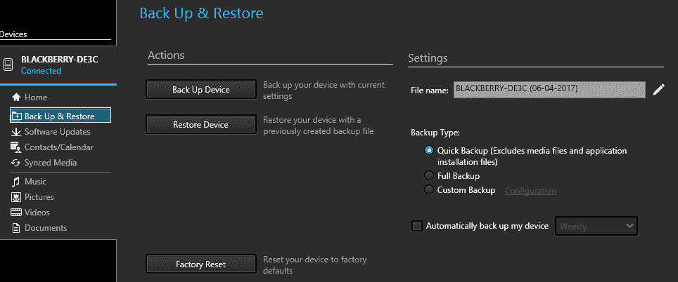

BlackBerry Link 窗口，提供设备管理选项

1.  选择要创建的备份类型并点击“备份设备”按钮。此时将开始创建所连接设备的新备份。备份完成后，您应该使用第十章的工具提取备份数据，*Windows 手机和 BlackBerry 取证*。

# 还有更多内容……

运行 BlackBerry OS 的移动设备可以通过数据线连接到专家的电脑。根据设备型号，使用的是迷你 USB 或微型 USB 数据线。

连接设备时，请确保设备已解密并解锁。如果设备被锁定，电脑操作系统将无法识别该设备。

如果设备已加密，则在解锁时，可以请求用于解密数据的第二个密码。设备的解锁密码和数据解密密码可能不同。

在检查运行 BlackBerry OS 的移动设备时，请记住，这家公司是第一个宣布具有远程擦除用户数据功能的公司。因此，在处理这些设备之前，专家应采取措施防止设备的远程控制。

专家在此步骤中常犯的典型错误是驱动程序安装不正确。让我们仔细看看如何将不同版本操作系统的 BlackBerry 设备连接到专家的电脑。

# 连接运行 BlackBerry OS 5 或 6 的设备

连接运行 BlackBerry OS 5 或 6 的设备时，需要遵循以下步骤：

1.  在电脑上安装 BlackBerry 桌面软件程序([`blackberry.com/software/desktop.html`](http://blackberry.com/software/desktop.html))。此程序包含最新的驱动程序版本和相关 BlackBerry 设备所需的证书。

1.  如果设备被密码锁定，请解锁设备。

1.  连接设备到电脑时，系统将提示选择不同的连接模式。请勿选择任何模式。

1.  如果无法连接，请尝试手动在任务管理器中停止`BbDevMgr.exe`进程。

# 连接运行 BlackBerry OS 10 的设备

连接运行 BlackBerry OS 10 的设备时，需要遵循以下步骤：

1.  在电脑上安装 BlackBerry Link 程序([`blackberry.com/software/desktop/blackberry-link.html`](http://blackberry.com/software/desktop/blackberry-link.html))。此程序包含最新的驱动程序版本和相关设备所需的证书。

1.  如果设备被密码锁定，请解锁设备。

1.  将电脑连接到互联网。这是必需的，因为加密密钥只能从 BlackBerry 服务器获取。

1.  在 Oxygen Forensic Extractor 中输入与设备相关联的 BlackBerry ID 帐户用户名和密码。

# 另请参阅

+   Blackberry Desktop Software 主页：[`us.blackberry.com/software/desktop`](https://us.blackberry.com/software/desktop)

+   BlackBerry ID 主页：[`us.blackberry.com/bbid`](https://us.blackberry.com/bbid)

# Windows Phone 被 Oxygen Forensic 收购

Oxygen Forensic 已在第一章中进行了详细描述，*SIM 卡提取与分析*。本文介绍了使用 Oxygen Forensic 创建 Windows Phone 移动设备数据逻辑副本的过程。

# 准备工作

为了从 Windows Phone 设备提取数据，您应该通过 USB 和蓝牙接口连接设备（通过蓝牙接口连接并不是通常提取数据的强制要求。仅在提取联系人时才需要）。这将为您提供从设备完全提取用户数据的机会。

# 如何操作…

1.  在 Oxygen Forensic 中，单击工具栏上的“连接设备”按钮。它将启动 Oxygen Forensic Extractor。

1.  单击“设备收购”。程序将自动搜索连接的设备。如果程序识别设备，则设备属性将显示在程序窗口中。如果未找到设备，则可以尝试使用“手动设备连接”和“自动连接设置”选项手动连接受检查的设备：

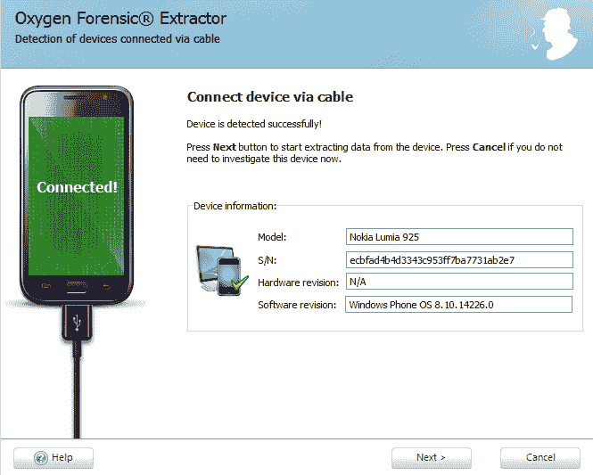

Oxygen Forensic Extractor 窗口显示连接设备的信息

1.  单击“下一步”按钮。在接下来的窗口中，您需要填写案件的详细信息，例如“设备别名”、“案件编号”、“证据编号”、“地点”、“事件编号”、“检查员”、“设备所有者”和“所有者电子邮件”。不要勾选“解析应用程序数据库并收集数据用于分析部分…”或“搜索和恢复已删除的数据…”，因为这些操作将需要额外时间。

1.  单击“下一步”按钮。在接下来的窗口中，您将被提示选择数据类型（电话簿、通话记录、短信、彩信、媒体文件等）。选中要从设备中提取的数据类型。单击“下一步”按钮。

1.  在接下来的窗口中，您将被要求选择连接类型：

    +   通过 USB 线和蓝牙提取 - 该方法通过蓝牙提取联系人和通话。仅通过 USB 线提取闪存卡中的文件和设备的一般信息。

    +   通过 USB 线提取 - 只能通过 USB 线提取闪存卡中的文件和设备的一般信息。

1.  使用第一个选项提取联系人和通话记录：

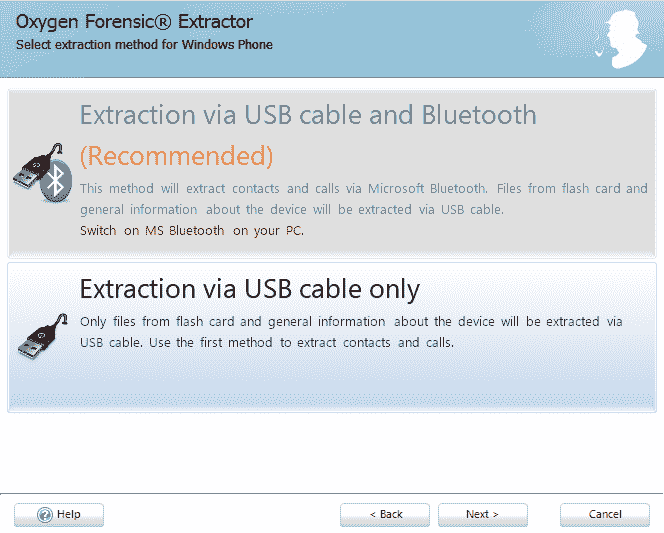

Oxygen Forensic Extractor 窗口显示从 Windows Phone 设备提取数据的选项

1.  程序会提示你再次检查输入的数据，并将其显示在窗口中。如果所有数据都正确，请点击提取按钮。数据提取过程将开始。

1.  当提取完成后，提取的数据分析过程将自动开始，之后数据可以在 Oxygen Forensic 中查看。

# 还有更多...

存储在外部存储介质（如内存卡）和内部存储中的数据都可以在运行 Windows Phone 操作系统的设备上加密。

此类设备的加密是基于 BitLocker 技术实现的，采用 **高级加密标准**（**AES**，128 位加密）加密算法。加密密钥存储在一个单独的芯片上，这使得提取密钥变得困难。对设备内存和外部存储介质的数据访问可以通过硬件级别的密码进一步进行屏蔽。综合以上所有因素，使得从设备中提取数据变得非常困难。

这些设备上使用的安全策略不允许用户禁用加密或将加密算法更改为更简单的算法。相反，系统可以加入额外的选项，例如在检测到密码破解尝试时允许删除用户数据。

大多数运行 Windows Phone 操作系统的设备都有一个存储卡槽。在 Windows Phone 8 版本中，出现了可以将应用程序安装到内存卡而不仅仅是内部存储的选项。所有存储卡中的应用程序和数据都会自动加密，但需要注意的是，媒体内容（如图片和视频）不会被加密。这使得设备所有者可以方便地与其他用户交换这些类型的文件。

你可能需要锁屏密码才能访问运行 Windows Phone 操作系统的设备。用户，尤其是企业用户，通常会按照**主数据管理**（**MDM**）或微软 **Exchange ActiveSync**（**EAS**）管理员设置的规则使用密码。

运行 Windows Phone 操作系统的设备还支持以下管理方法：

+   **远程擦除**：公司的技术人员可以通过 MDM 或 Exchange 服务器管理控制台发起远程设备擦除。用户也可以通过微软 **Outlook Web Access**（**OWA**）服务发起远程设备擦除。

+   **部分数据删除**：如果设备与 MDM 关联，系统管理员可以对设备进行部分擦除。在这种情况下，企业数据和企业账户的设置将被删除，但设备所有者的个人数据将被保留。

+   **远程锁定**：公司的技术人员可以远程锁定设备，之后设备可以解锁。

+   **远程重置锁屏密码**：公司的技术人员可以远程重置屏幕锁密码，例如用户忘记密码时。用户的企业和个人数据会被保留。

# 使用 UFED 4PC 获取 Windows Phone 数据

Cellebrite 公司产品，如 UFED 4PC、UFED Touch 和 UFED Physical Analyzer，是移动取证领域中的佼佼者。在本流程中，将展示如何使用 UFED 4PC 从 Windows Phone 设备中提取数据。

# 准备就绪

UFED 4 PC 的试用许可证可以通过向 Cellebrite 分销商申请获得。收到申请后，您将收到一封包含分发链接的电子邮件。

1.  下载 UFED 4 PC。

1.  双击安装文件图标。

1.  按照说明安装 UFED 4 PC。安装完成后，点击 UFED 4 PC 图标。

启动后，程序将显示一个窗口，指示程序尚未激活：

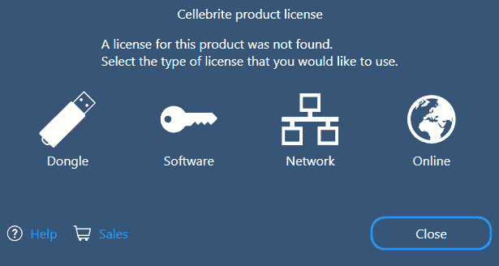

提供选择许可证类型的 UFED 4 PC 窗口

1.  点击“软件”。在新窗口中，将显示需要发送给分销商的计算机 ID：

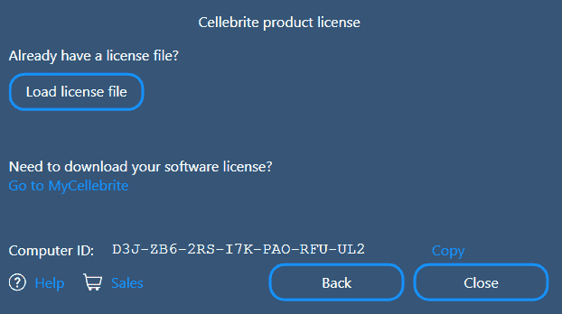

带有计算机 ID 的 UFED 4 PC 窗口

1.  对计算机 ID 的响应将收到一条包含许可证文件链接的消息。

要激活您的应用程序许可证，请按照以下步骤操作：

1.  将许可证保存到您的 PC。

1.  启动相关应用程序。

1.  应用程序将打开，并显示一个 Cellebrite 产品许可证窗口。

在 Cellebrite 产品许可证窗口中：软件 | 加载许可证文件。

1.  选择 `License` 文件并点击“打开”。

    Cellebrite 产品许可证窗口将显示以下信息：您的软件许可证已成功更新。

1.  点击“关闭”。

应用程序现在已激活！

# 如何操作……

1.  双击程序图标启动 UFED 4 PC。

    移动设备可以在连接时由 UFED 4 PC 自动识别，也可以手动识别。

1.  若要手动选择被检查的设备，请点击“移动设备”图标。在新窗口中，选择 Nokia GSM 图标。

1.  在下一个窗口中，您将被提示选择保存从 Windows Phone 提取的数据的路径。如果您想选择其他位置保存数据，请点击“更改目标路径”。输入新的路径后，点击“确定”按钮。

1.  在下一个窗口中，选择提取类型：

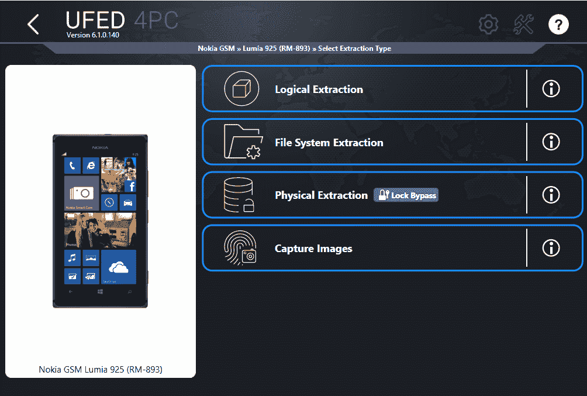

提取类型选择

1.  点击“文件系统提取”。在下一个窗口中，您将看到设备连接说明。按照说明连接设备。点击“继续”按钮：

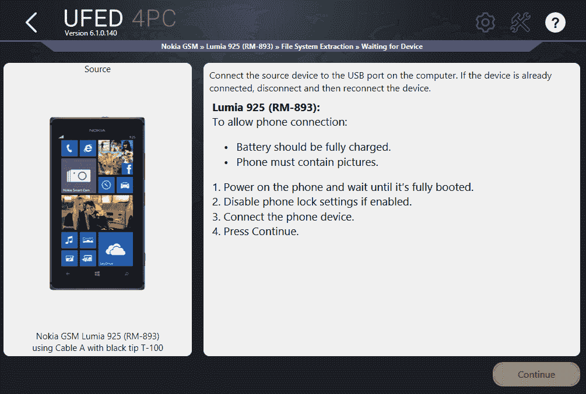

Windows Phone 设备连接说明

设备数据提取过程将开始。提取结束时，将显示最终窗口，您将被提示选择以下选项之一：

+   在 UFED Physical Analyzer 中打开提取的数据。

+   打开包含提取数据的文件夹。

+   从同一设备添加另一个提取，但使用不同的方法。

+   点击“完成”按钮以完成操作。

# 另请参见

Cellebrite 公司的主页：[`www.cellebrite.com.`](http://www.cellebrite.com)
